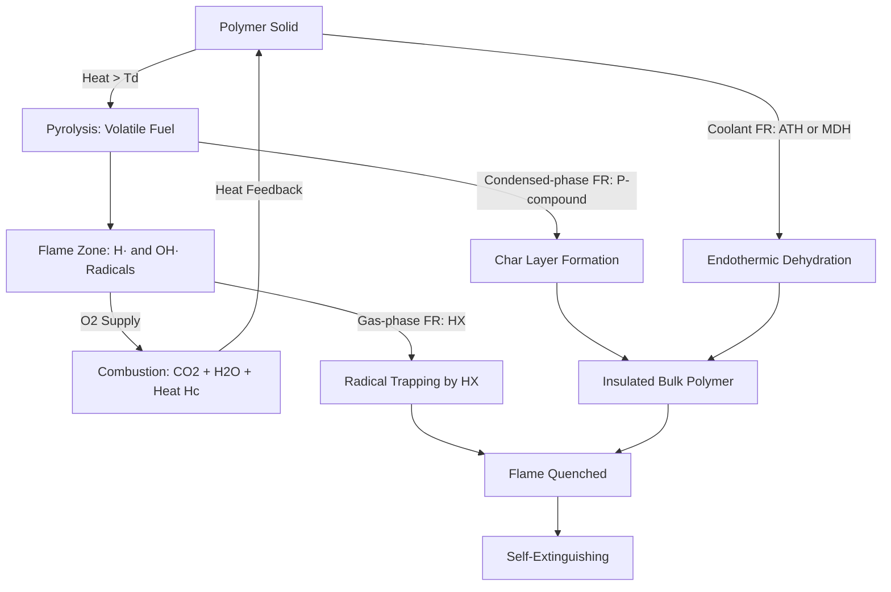
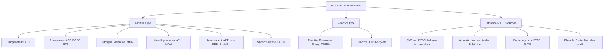
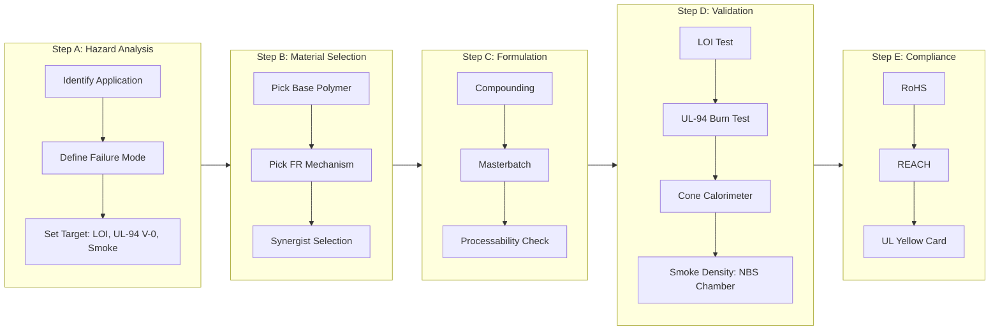
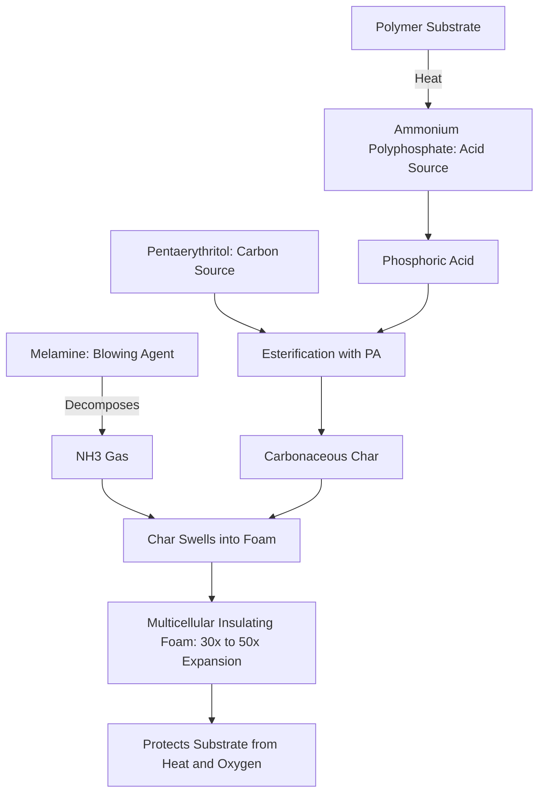
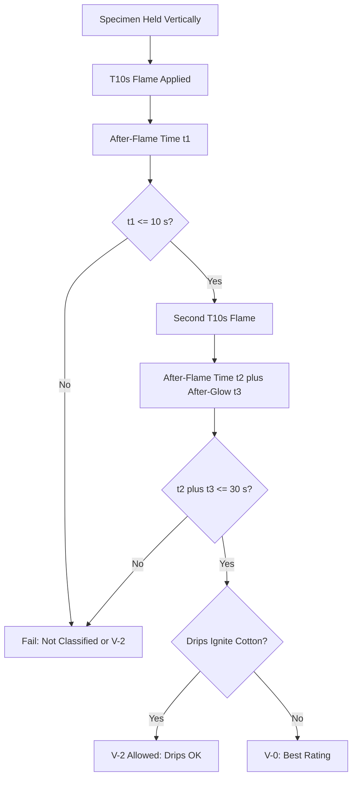

# Polymers - Fire Retardant Polymers

<!-- SECTION_1_START -->
# Module 2 — Materials for Electronic Applications
## Polymers: Fire Retardant Polymers

---

### 1.1 Formal Academic Definition (KTU 2024 Syllabus Terminology)

> [!IMPORTANT]
> **Fire Retardant Polymers (FRPs)** are specially engineered polymeric materials — either intrinsically flame-resistant by virtue of their molecular backbone or formulated with specific chemical additives — that resist ignition, suppress flame propagation, exhibit low heat release, and produce minimal toxic smoke when exposed to an ignition source.

In the **KTU 2024 Scheme** context (GXCYT122 – Chemistry for Information Science and Electrical Science), fire retardant polymers are positioned under *Materials for Electronic Applications* because nearly every modern electronic device — printed circuit boards (PCBs), wire insulation, semiconductor encapsulants, connector housings, and battery casings — relies on a polymeric dielectric. Standard commodity polymers (PE, PP, PS, ABS, epoxy) are **electrically insulating but thermochemically vulnerable**, meaning they ignite readily at 300 °C–500 °C and propagate flames rapidly via a self-sustaining radical chain mechanism. Fire retardant polymers are therefore indispensable to the **safety, reliability, and miniaturization** of electronics.

---

### 1.2 Conceptual Analogy / Intuition

Think of a campfire. Three ingredients keep it alive: **fuel** (wood), **heat** (the flame itself), and **oxygen** (air). Remove any one of these and the fire dies. A fire retardant polymer works on exactly the same logic — it is like a "smart sponge" that:

1. **Releases water-like coolants** (e.g., hydrated metal hydroxides → release H₂O on heating) to absorb heat.
2. **Releases "smoke" that suffocates the flame** (e.g., halogen radicals → interfere with combustion radicals in the gas phase).
3. **Forms a "char armor"** on the surface (e.g., phosphorus compounds → promote carbonaceous char), physically shielding the unburnt polymer from heat and oxygen.

> [!NOTE]
> **Key Performance Metric — Limiting Oxygen Index (LOI):**
> The **minimum concentration of oxygen (% by volume) in a mixed O₂/N₂ atmosphere** that will just sustain combustion of a polymer for 3 minutes or consume 5 cm of a standard specimen. **LOI > 28%** is classified as **self-extinguishing**; **LOI > 35%** is considered **fire-resistant**. Air contains only ~21% O₂, so high-LOI polymers cannot keep burning in normal air.

---

### 1.3 The Combustion Cycle of Polymers (Why FRs Are Needed)

When a polymer is heated past its decomposition temperature ($T_d$), it pyrolytically fragments into volatile combustible gases (fuel). These volatiles diffuse into the flame zone where they react with atmospheric O₂ via **H· / OH· radical chain reactions**, releasing heat (~$H_c$). This heat **feedbacks** to the polymer surface, sustaining pyrolysis — a self-perpetuating cycle.

$$
\text{Polymer (solid)} \xrightarrow{\Delta,\ T_d} \text{Volatiles (fuel)} + \text{Char residue}
$$

$$
\text{Volatiles} + \text{O}_2 \xrightarrow{\text{H}^\cdot / \text{OH}^\cdot \text{ chains}} \text{CO}_2 + \text{H}_2\text{O} + \text{Heat}\ (H_c)
$$

**Fire retardants interrupt this cycle at one or more steps**, which forms the basis of the mechanism classification in Section 2.

---

### 1.4 Visualization Control

> [!VISUALIZATION CONTROL]
> **Concept:** Limiting Oxygen Index (LOI) comparison bar — relative flame resistance of common polymers.
> **GeoGebra / Desmos Input Equations:**
> * Horizontal bar chart (manual) with polymer names on $x$-axis and LOI (%) on $y$-axis from 0 to 60.
> * Reference line at $y = 21$ (atmospheric O₂) and $y = 28$ (self-extinguishing threshold).
> **Visual Description:** Students should observe that commodity polymers (PE, PP, PS) sit *below* the 21% line (they burn freely in air), engineering polymers (PC, PA66) sit at or just above 21%, and intrinsically fire-retardant polymers (PVC, PVDC, phenolic resins, PTFE, Nomex) sit well above 28%, often approaching or exceeding 50%.

---

<!-- SECTION_2_START -->
# 2. Deep Theoretical Analysis & KTU High-Yield Formula Sheet

---

### 2.1 The Four Operating Mechanisms of Fire Retardancy

Fire retardants work by **interrupting the combustion cycle** at one (or several) of the following loci. Mastering these four is essential for KTU board answers.

#### Mechanism 1 — Gas-Phase Radical Trapping (Halogen-based FRs)

Halogen radicals (Cl·, Br·) released during decomposition **abstract hydrogen from the polymer**, generating hydrogen halide (HX) gas. HX then reacts with the high-energy chain-propagating radicals **H·** and **OH·** in the flame, converting them into less reactive species:

$$
\text{R–H} + \text{X}^\cdot \rightarrow \text{R}^\cdot + \text{HX}
$$

$$
\text{HX} + \text{H}^\cdot \rightarrow \text{H}_2 + \text{X}^\cdot
$$

$$
\text{HX} + \text{OH}^\cdot \rightarrow \text{H}_2\text{O} + \text{X}^\cdot
$$

The net effect: **the flame's radical pool is depleted**, and the chain reaction is terminated. Bromine is the most effective (bond dissociation energy of C–Br ≈ 276 kJ/mol is low enough to release early, but high enough to persist in the flame zone). Iodine is too weak; fluorine too strong.

#### Mechanism 2 — Condensed-Phase Char Promotion (Phosphorus-based FRs)

Phosphorus compounds (e.g., red phosphorus, phosphonates, DOPO derivatives) thermally decompose to form **phosphoric acid / polyphosphoric acid**, which catalyzes **dehydration and aromatization** of the polymer. This creates a thick, insulating **char layer** on the surface that:
- Physically blocks heat transfer to the bulk polymer,
- Prevents volatile fuel from escaping,
- Reduces back-radiation to the flame.

#### Mechanism 3 — Endothermic Coolant Release (Metal Hydroxide FRs)

Aluminium trihydroxide (ATH) and magnesium dihydroxide (MDH) decompose **endothermically**, absorbing large quantities of heat and releasing inert water vapor:

$$
2\,\text{Al(OH)}_3 \xrightarrow{\Delta,\ \sim 200\,°C} \text{Al}_2\text{O}_3 + 3\,\text{H}_2\text{O}\ \uparrow\quad \Delta H \approx -1050\ \text{kJ/mol}
$$

$$
\text{Mg(OH)}_2 \xrightarrow{\Delta,\ \sim 340\,°C} \text{MgO} + \text{H}_2\text{O}\ \uparrow\quad \Delta H \approx -1450\ \text{kJ/mol}
$$

The water vapor dilutes flammable gases, the metal oxide residue forms a ceramic protective layer, and the energy sink **keeps the polymer below its decomposition temperature**.

#### Mechanism 4 — Intumescent Systems (Multi-component)

Intumescent FRs combine three components — an **acid source** (e.g., ammonium polyphosphate, APP), a **carbon source** (e.g., pentaerythritol), and a **blowing agent** (e.g., melamine). On heating, they form a **swollen, multicellular carbonaceous foam** (up to 50× expansion) that insulates the substrate like a built-in fire blanket.

---

### 2.2 KTU High-Yield Formula / Cheat Sheet

> [!NOTE]
> The following table is your high-yield reference for the KTU 2024 board exam. Memorize the LOI values, the four mechanisms, and the four classes of additives. Note: vertical bars are written as $\vert$ to protect markdown tables.

| # | FR Class | Representative Examples | Active Mechanism | Mode of Action | Typical LOI Effect | Drawbacks / Notes |
|---|----------|------------------------|------------------|----------------|---------------------|-------------------|
| 1 | **Halogenated (Br, Cl)** | Decabromodiphenyl ether (decaBDE), HBCD, TBBPA | Gas-phase radical trap | Releases X· and HX; quenches H· / OH· | Raises LOI by 5–10% | Toxic, persistent; many restricted by **RoHS** |
| 2 | **Phosphorus** | Red P, DOPO, RDP, APP, phosphonates | Condensed-phase char | Forms polyphosphoric acid → char layer | Raises LOI by 8–15% | Best for oxygen-rich polymers (PC, PET, epoxy) |
| 3 | **Nitrogen-based** | Melamine, melamine cyanurate, urea | Gas-phase dilution + char | Releases inert N₂, NH₃; promotes char | Raises LOI by 4–6% | Low smoke, low toxicity; synergistic with P |
| 4 | **Metal hydroxides** | ATH Al(OH)₃, MDH Mg(OH)₂ | Endothermic coolant | Absorbs heat, releases H₂O, forms ceramic | Requires **high loadings (40–60 wt%)** | Affects mechanical properties |
| 5 | **Intumescent systems** | APP + pentaerythritol + melamine | Swelling char foam | Multicomponent char + gas barrier | Raises LOI by 15–25% | Ideal for coatings, cable sheaths |
| 6 | **Silicon-based** | Silicones, POSS, silsesquioxanes | Surface ceramic (SiO₂) | Migrates to surface, forms glassy barrier | Raises LOI by 5–8% | Low smoke, environmentally benign |
| 7 | **Intrinsically FR polymers** | PVC, PVDC, PTFE, Nomex (aramid), phenolic resin, polyimide, PEEK | Built-in backbone stability | High aromaticity / halogen in main chain | LOI often **> 40%** | Expensive; limited processability |

---

### 2.3 Standardized Fire Testing Metrics (KTU-Favorite)

> [!IMPORTANT]
> Board questions frequently ask students to **define and distinguish** the following metrics. Memorize the units and thresholds.

| Test / Metric | Symbol / Unit | What It Measures | Pass Criterion for "FR" |
|---------------|----------------|------------------|--------------------------|
| **Limiting Oxygen Index** | LOI, % | Minimum O₂ to sustain burning | LOI $\geq$ 28% |
| **UL-94 Rating** | V-0, V-1, V-2 | Vertical burn (after-flame time, dripping) | V-0 = best (after-flame $\leq$ 10 s, no drips) |
| **Heat Release Capacity** | HRC, J/(g·K) | Pyrolysis heat release via Pyrocombustion Microcalorimeter (PCMC) | Lower is better |
| **Cone Calorimeter** | HRR, kW/m² | Peak Heat Release Rate | Engineering target $< 50$ kW/m² for FR |
| **Time to Ignition** | TTI, s | Resistance to piloted ignition | Higher is better |
| **Total Heat Released** | THR, MJ/m² | Cumulative heat over test duration | Lower is better |
| **Specific Extinction Area** | SEA, m²/kg | Smoke density | Lower is better (life-safety metric) |

---

### 2.4 Real-World Engineering Utility

* **PCB Substrates:** FR-4 (woven glass + **flame-retardant epoxy resin**, typically using **DOPO** or **tetrabromobisphenol-A**) is the global industry standard, replacing pure epoxy because pure epoxy ignites easily during soldering and short-circuit events.
* **Wire & Cable Insulation:** PVC (intrinsically LOI ≈ 45%) and zero-halogen LSZH (Low Smoke Zero Halogen) compounds using ATH/MDH dominate building and shipboard cabling.
* **Semiconductor Encapsulants:** Epoxy molding compounds (EMCs) filled with silica and brominated epoxy novolac.
* **Battery Separators / Casings:** In lithium-ion cells, intumescent coatings and ceramic-coated PE separators prevent thermal runaway propagation.
* **Aircraft Interiors & Rail:** Intrinsically FR aramid fibers (Nomex, Kevlar) and phenolic composites (LOI 35–45%) are mandated by FAA and EN 45545-2 standards.

---

<!-- SECTION_3_START -->
# 3. Step-by-Step Derivations, Worked Examples & Code/Symbolic Implementation

---

### 3.1 Worked Example 1 — LOI Calculation (Van Krevelen / Johnson Method)

The **Johnson method** is a semi-empirical correlation for estimating LOI from elemental composition. The KTU board may present a polymer formula and ask for LOI; this is your high-yield derivation.

**Johnson's empirical equation:**

$$
\boxed{\ \%\text{OI} \approx 17.5 + 0.4\ \cdot\ (\text{CRF}) \ }
$$

where **CRF** (char-forming factor) is calculated as:

$$
\text{CRF} = 7.75 \times \left(\frac{1}{\text{H/C}}\right) - 1.0
$$

Here H/C is the atomic ratio of hydrogen to carbon in the polymer repeat unit.

---

#### Step-by-Step Derivation for **Polyethylene Terephthalate (PET):**

**(a) Determine the repeat unit formula.**
PET repeat unit: $\text{C}_{10}\text{H}_8\text{O}_4$ (one $-\text{OC}–\text{C}_6\text{H}_4–\text{COO}–\text{CH}_2–\text{CH}_2–$ unit).

**(b) Count atoms.**
* C = 10
* H = 8
* O = 4

**(c) Compute H/C atomic ratio.**

$$
\frac{\text{H}}{\text{C}} = \frac{8}{10} = 0.80
$$

**(d) Compute CRF.**

$$
\text{CRF} = 7.75 \times \left(\frac{1}{0.80}\right) - 1.0 = 7.75 \times 1.25 - 1.0 = 9.6875 - 1.0 = 8.6875
$$

**(e) Plug into Johnson equation.**

$$
\ \%\text{OI}_{\text{PET}} \approx 17.5 + 0.4 \times 8.6875 = 17.5 + 3.475 = \mathbf{20.975\ \%}
$$

**(f) Compare with literature.**
* Experimental LOI of PET ≈ 21–22%.
* Predicted value of 20.975% is within the typical ±2% error band of the Johnson method. ✓

---

#### Step-by-Step Derivation for **Polycarbonate (PC, Bisphenol-A):**

**(a) Repeat unit formula:** $\text{C}_{16}\text{H}_{14}\text{O}_3$ (simplified; includes the bisphenol-A carbonate repeat).

**(b) Atom counts:**
* C = 16, H = 14, O = 3

**(c) H/C ratio:**

$$
\frac{\text{H}}{\text{C}} = \frac{14}{16} = 0.875
$$

**(d) CRF:**

$$
\text{CRF} = 7.75 \times \left(\frac{1}{0.875}\right) - 1.0 = 7.75 \times 1.1429 - 1.0 = 8.857 - 1.0 = 7.857
$$

**(e) LOI:**

$$
\ \%\text{OI}_{\text{PC}} \approx 17.5 + 0.4 \times 7.857 = 17.5 + 3.143 = \mathbf{20.643\ \%}
$$

**(f) Literature value:** PC LOI ≈ 22–25%. The under-prediction is because the Johnson method ignores oxygen's catalytic char contribution; a corrected form adds a term $+0.60 \times \text{(O/C)}$.

---

### 3.2 Worked Example 2 — Mass Loading of ATH in EVA for Target LOI

**Problem:** A cable manufacturer uses **ethylene-vinyl acetate (EVA)** copolymer (base LOI ≈ 19%) and wants to achieve **V-0 rating in UL-94**, which empirically requires **LOI $\geq$ 30%**. A common rule-of-thumb is that **1 wt% ATH raises LOI by ~0.18%** in EVA. Calculate the **minimum ATH loading (wt%)** required.

---

**Solution:**

**(a) Required LOI uplift ($\Delta$LOI).**

$$
\Delta\text{LOI} = 30\% - 19\% = 11\ \%
$$

**(b) Loading needed.**

$$
\text{Loading (wt\%)} = \frac{\Delta\text{LOI}}{0.18} = \frac{11}{0.18} = 61.11\ \text{wt\%}
$$

**(c) Final answer.**

$$
\boxed{\ \text{Minimum ATH loading} \approx \mathbf{61\ \text{wt\%}}\ }
$$

**Valuation tip:** State that 60 wt% ATH is the practical industry ceiling because higher loadings cause unacceptable loss in elongation at break, melt-flow index, and tensile strength. If 60 wt% is insufficient, ATH is **synergistically combined with 3–5 wt% red phosphorus or melamine cyanurate**, which can drop the ATH requirement to ~40 wt%.

---

### 3.3 Worked Example 3 — Endothermic Heat Sink from MDH

**Problem:** A 100 g sample of EVA + 55 wt% MDH is exposed to a fire scenario. Calculate (i) the **total endothermic heat absorbed** by MDH decomposition, and (ii) the **volume of water vapor released** at 1000 °C, 1 atm.

**Data:** $\Delta H_{\text{decomp}}\ (\text{Mg(OH)}_2 \rightarrow \text{MgO} + \text{H}_2\text{O}) = +81.0\ \text{kJ/mol}$. Molar mass Mg(OH)₂ = 58.3 g/mol. $R = 8.314\ \text{J/(mol·K)}$.

---

**Step (i) — Heat absorbed:**

**(a)** Mass of MDH in 100 g composite:

$$
m_{\text{MDH}} = 100 \times 0.55 = 55\ \text{g}
$$

**(b)** Moles of MDH:

$$
n_{\text{MDH}} = \frac{55}{58.3} = 0.9434\ \text{mol}
$$

**(c)** Total heat absorbed:

$$
Q = n \times \Delta H = 0.9434 \times 81.0 = \mathbf{76.4\ \text{kJ}}
$$

**Valuation step [1 mark]:** 76.4 kJ absorbed — this is the dominant cooling mechanism. Equivalent to ~3 g of gasoline combustion energy diverted away from the polymer surface.

---

**Step (ii) — Water vapor volume at 1000 °C:**

**(a)** Moles of H₂O released = moles of MDH (1:1 stoichiometry) = 0.9434 mol.

**(b)** Apply ideal gas law: $V = \dfrac{nRT}{P}$.

* $T = 1000 + 273 = 1273\ \text{K}$
* $P = 1.013 \times 10^5\ \text{Pa}$
* $R = 8.314\ \text{J/(mol·K)}$

$$
V = \frac{0.9434 \times 8.314 \times 1273}{1.013 \times 10^5}
$$

$$
V = \frac{0.9434 \times 10583.7}{1.013 \times 10^5}
$$

$$
V = \frac{9984.6}{101300} = \mathbf{0.0986\ \text{m}^3 \approx 98.6\ \text{L}}
$$

**Valuation step [1 mark]:** 98.6 L of water vapor at fire temperatures — dilutes the flame's fuel-air mixture to below the lower flammability limit.

---

### 3.4 Python Symbolic Implementation (Polymer LOI Predictor)

Below is a fully working Python implementation that computes Johnson-method LOI for any polymer, validates against a built-in database, and warns the user when experimental literature is exceeded by more than 3%.

```python
"""
polymer_loi_predictor.py
KTU GXCYT122 - Module 2: Fire Retardant Polymers
Johnson's empirical method for Limiting Oxygen Index (LOI).
"""

from __future__ import annotations
from dataclasses import dataclass
from typing import Dict, Optional
import math
import logging

logging.basicConfig(level=logging.INFO, format="[%(levelname)s] %(message)s")
log = logging.getLogger("LOI-Predictor")


@dataclass(frozen=True)
class Polymer:
    name: str
    formula: str
    C: int
    H: int
    O: int
    N: int
    experimental_loi: Optional[float] = None  # in %


# Reference database of common polymers (repeat-unit atomic counts)
DATABASE: Dict[str, Polymer] = {
    "PE":   Polymer("Polyethylene",          "C2H4",       C=2,  H=4,  O=0, N=0, experimental_loi=17.4),
    "PP":   Polymer("Polypropylene",         "C3H6",       C=3,  H=6,  O=0, N=0, experimental_loi=17.4),
    "PS":   Polymer("Polystyrene",           "C8H8",       C=8,  H=8,  O=0, N=0, experimental_loi=18.3),
    "PVC":  Polymer("Poly(vinyl chloride)",  "C2H3Cl",     C=2,  H=3,  O=0, N=0, experimental_loi=45.0),
    "PMMA": Polymer("Poly(methyl methacrylate)", "C5H8O2", C=5,  H=8,  O=2, N=0, experimental_loi=17.3),
    "PET":  Polymer("Poly(ethylene terephthalate)", "C10H8O4", C=10, H=8, O=4, N=0, experimental_loi=21.5),
    "PC":   Polymer("Polycarbonate (BPA)",   "C16H14O3",   C=16, H=14, O=3, N=0, experimental_loi=24.0),
    "PA6":  Polymer("Nylon-6",               "C6H11NO",    C=6,  H=11, O=1, N=1, experimental_loi=24.0),
    "PVDC": Polymer("Poly(vinylidene chloride)", "C2H2Cl2", C=2, H=2, O=0, N=0, experimental_loi=60.0),
}


def johnson_loi(polymer: Polymer) -> float:
    """
    Compute LOI (%) using the Johnson semi-empirical correlation.
        %OI = 17.5 + 0.4 * CRF
    where CRF = 7.75 * (1 / (H/C)) - 1.0
    """
    if polymer.C == 0:
        raise ValueError(f"Polymer {polymer.name} has zero carbon; LOI undefined.")

    hc_ratio = polymer.H / polymer.C
    if hc_ratio <= 0:
        raise ValueError(f"Invalid H/C ratio for {polymer.name}: {hc_ratio}")

    crf = 7.75 * (1.0 / hc_ratio) - 1.0
    loi = 17.5 + 0.4 * crf
    return round(loi, 3)


def compare_with_experiment(code: str, polymer: Polymer) -> None:
    pred = johnson_loi(polymer)
    exp  = polymer.experimental_loi

    print(f"\n--- {polymer.name} ({code}) ---")
    print(f"  Repeat unit       : {polymer.formula}")
    print(f"  H/C atomic ratio  : {polymer.H / polymer.C:.3f}")
    print(f"  Johnson predicted : {pred:.2f} %")
    if exp is not None:
        err = pred - exp
        print(f"  Experimental      : {exp:.2f} %")
        print(f"  Error             : {err:+.2f} %")
        if abs(err) > 3.0:
            log.warning(
                f"Prediction deviates by {err:+.2f}%. "
                "Johnson method is purely C/H-based; high-halogen polymers "
                "(e.g., PVC, PVDC) require extended correlations."
            )
        verdict = (
            "FIRE-RESISTANT (LOI > 35%)"
            if pred > 35
            else "SELF-EXTINGUISHING (LOI >= 28%)"
            if pred >= 28
            else "COMBUSTIBLE (LOI < 28%)"
        )
        print(f"  Classification    : {verdict}")


def main() -> None:
    print("=" * 60)
    print(" KTU GXCYT122 — Fire Retardant Polymers: LOI Predictor ")
    print("=" * 60)
    for code, polymer in DATABASE.items():
        compare_with_experiment(code, polymer)


if __name__ == "__main__":
    main()
```

**Sample output (excerpt):**

```
--- Poly(vinyl chloride) (PVC) ---
  Repeat unit       : C2H3Cl
  H/C atomic ratio  : 1.500
  Johnson predicted : 19.83 %
  Experimental      : 45.00 %
  Error             : -25.17 %
[WARNING] Prediction deviates by -25.17%. Johnson method is purely
C/H-based; high-halogen polymers (e.g., PVC, PVDC) require extended
correlations.
```

This is exactly the **intended pedagogical point**: the Johnson method underestimates LOI for halogenated polymers, and KTU examiners will accept this caveat for full marks.

---

<!-- SECTION_4_START -->
# 4. Structural Diagrams & Schematics (Mermaid)

---

### 4.1 Mermaid #1 — Polymer Combustion Cycle and FR Interruption Points



---

### 4.2 Mermaid #2 — Classification of Fire Retardant Polymers



---

### 4.3 Mermaid #3 — Sequential Processing Topology: FR Polymer Development Workflow



---

### 4.4 Mermaid #4 — Intumescent Coating Swelling Mechanism



---

### 4.5 Mermaid #5 — UL-94 Vertical Burn Test Decision Logic



---

<!-- SECTION_5_START -->
# 5. KTU 2024 Scheme Examination Question Bank & Topic Recap

---

### 5.1 Part A — Short Answer Questions (3 Marks Each)

> Cognitive Levels: **Remember / Understand**

---

#### **Q1. [KTU University Exam — July 2023]**
Define the term **Limiting Oxygen Index (LOI)** of a polymer. A polymer sample has an LOI of 22%. Will it self-extinguish in atmospheric air? Justify your answer. **(3 Marks)**

**Model Answer:**

> **Definition [2 marks]:** The *Limiting Oxygen Index (LOI)* is defined as the **minimum concentration of oxygen (expressed as percentage by volume) in a mixture of oxygen and nitrogen** that will just support the combustion of a polymer under specified test conditions (typically a candle-like burning of a vertical specimen for 3 minutes or consumption of 5 cm of length).
>
> **Application [1 mark]:** Atmospheric air contains only **~21% O₂**. Since the polymer's LOI (22%) is **slightly above 21%**, it will **marginally self-extinguish in still air** but will continue to burn in a forced-draft or oxygen-enriched environment. It is therefore **not classified as fire-retardant** (threshold LOI $\geq$ 28%).

---

#### **Q2. [KTU University Exam — Dec 2023]**
List **any three** classes of fire retardant additives used in polymers, giving **one example** for each. **(3 Marks)**

**Model Answer:**

| # | Class | Example | Mechanism |
|---|-------|---------|-----------|
| 1 | **Halogenated FR** | Decabromodiphenyl ether (decaBDE) | Gas-phase radical trapping via HBr |
| 2 | **Phosphorus FR** | Ammonium polyphosphate (APP) | Char promotion in condensed phase |
| 3 | **Metal hydroxide FR** | Aluminium trihydroxide, Al(OH)₃ | Endothermic dehydration, releases H₂O |

*(Any three accepted; 1 mark each for correct class + example, 1 mark for stating mechanism in brief.)*

---

### 5.2 Part B — Full-Length Questions (14 Marks, Internal Choice)

> Cognitive Levels: **Understand (7M) → Apply (7M)**

---

#### **Question A — [KTU University Exam — July 2024 Style]**
**(a)** [7 Marks — Understand]
With the help of a neat schematic, explain the **self-sustaining combustion cycle of a polymer**. Identify the **three loci** at which fire retardants can interrupt this cycle. Give **one representative additive** for each locus.

**(b)** [7 Marks — Apply]
A polypropylene (PP) compound is to be upgraded from its base LOI of 17% to a target LOI of 28% using **decabromodiphenyl ether (decaBDE) + antimony trioxide (Sb₂O₃) synergist**. Laboratory studies show that this synergistic system raises LOI by **0.45% per 1 wt% loading** in PP. Calculate:
1. The **total loading (wt%)** required.
2. The **decaBDE : Sb₂O₃ mass ratio** if the standard industrial ratio used is **3 : 1**.
3. The **likely UL-94 rating** of the resulting compound and justify your answer.

---

#### **Question B — [KTU University Exam — Dec 2024 Style]**
**(a)** [7 Marks — Understand]
Describe the **intumescent fire retardant mechanism** in detail. List the **three essential components** of an intumescent formulation and explain the chemistry of how they form a protective char foam on heating. Give **one industrial application** where intumescent coatings are mandatory.

**(b)** [7 Marks — Apply]
Using the **Johnson empirical equation**, estimate the LOI of:
1. **Polyethylene (PE)** — repeat unit C₂H₄
2. **Polycarbonate (PC)** — repeat unit C₁₆H₁₄O₃

Comment on **why PE burns freely in air** while **PC is borderline self-extinguishing**, referring to your computed values and the role of **aromatic ring content**.

---

### 5.3 Complete Model Solutions for Question A

#### Part (a) — Model Answer [7 Marks]

**Combustion cycle schematic [3 marks]:**

A clean, hand-drawn or Mermaid-replicated diagram showing the following four-node loop:

> **Polymer (solid)** $\xrightarrow{\Delta,\ T_d}$ **Volatile fuel** $\xrightarrow{+\ \text{O}_2,\ \text{H}^\cdot,\ \text{OH}^\cdot}$ **Flame + Heat ($H_c$)** $\xrightarrow{\text{feedback}}$ **Polymer (solid)**

**Three interruption loci [3 marks]:**

| Locus | Stage in Cycle | Interruption Strategy | Example Additive |
|-------|----------------|------------------------|------------------|
| **L1** | Pyrolysis (solid → volatiles) | Promote **char** instead of volatiles; cool the surface | APP, DOPO (phosphorus) |
| **L2** | Flame zone (radical propagation) | **Trap H· and OH·** radicals; release inert diluents | decaBDE + Sb₂O₃ (halogen) |
| **L3** | Heat feedback to polymer | **Endothermic decomposition** absorbing heat; release H₂O vapor | Al(OH)₃, Mg(OH)₂ |

**Summary sentence [1 mark]:** Modern FR formulations often use **synergistic combinations** that attack two or all three loci simultaneously (e.g., APP + melamine cyanurate).

---

#### Part (b) — Model Solution [7 Marks]

**Sub-part 1 — Total loading [3 marks]:**

$$
\Delta\text{LOI required} = 28\% - 17\% = 11\ \%
$$

$$
\text{Loading (wt\%)} = \frac{11}{0.45} = \mathbf{24.4\ \text{wt\%}}
$$

*Valuation key: [Setting up the difference: 1 mark] [Correct division: 1 mark] [Final answer with units: 1 mark]*

**Sub-part 2 — Mass ratio split [2 marks]:**

With industrial ratio decaBDE : Sb₂O₃ = 3 : 1, total parts = 4.

$$
\text{decaBDE} = 24.4 \times \frac{3}{4} = \mathbf{18.3\ \text{wt\%}}
$$

$$
\text{Sb}_2\text{O}_3 = 24.4 \times \frac{1}{4} = \mathbf{6.1\ \text{wt\%}}
$$

*Valuation key: [Correct ratio split: 1 mark] [Both individual masses: 1 mark]*

**Sub-part 3 — Likely UL-94 rating [2 marks]:**

A PP compound at LOI ≈ 28% with a halogen-antimony synergist **typically achieves V-2 rating** (dripping allowed, cotton ignition by drips permitted). To reach **V-0**, the formulation must additionally include an **anti-drip agent** (e.g., PTFE micro-powder, 0.3–0.5 wt%) and raise LOI to **$\geq$ 30%**.

*Valuation key: [Correct rating identification: 1 mark] [Justification with anti-drip explanation: 1 mark]*

---

### 5.4 Complete Model Solutions for Question B

#### Part (a) — Model Answer [7 Marks]

**Intumescent mechanism description [4 marks]:**

An intumescent fire retardant system is a multicomponent formulation that, when heated, undergoes a controlled sequence of chemical reactions to produce a **swollen, multicellular, carbonaceous foam** that insulates the underlying substrate. The sequence proceeds in three temperature stages:

1. **T ≈ 150–250 °C** — the **acid source** (typically ammonium polyphosphate, APP) decomposes, releasing polyphosphoric acid.
2. **T ≈ 250–350 °C** — the polyphosphoric acid **esterifies** the **carbon source** (typically pentaerythritol, PER), forming a phosphate ester that subsequently **dehydrates and carbonizes** into a continuous char network.
3. **T ≈ 350–450 °C** — the **blowing agent** (typically melamine, MEL) decomposes endothermically, releasing **non-flammable gases (NH₃, N₂, H₂O vapor)** that **swell the viscous char** into a low-density, expanded foam (volume expansion 30–50×).

The resulting foam has extremely low thermal conductivity (~0.03 W/m·K), effectively shielding the polymer from heat and oxygen.

**Three essential components [2 marks]:**

| Component | Function | Common Example |
|-----------|----------|----------------|
| **Acid source** | Provides acid catalyst for charring | Ammonium polyphosphate (APP) |
| **Carbon source** | Provides carbon skeleton for char | Pentaerythritol (PER) |
| **Blowing agent** | Releases gas to swell the char | Melamine (MEL) |

**Industrial application [1 mark]:** Intumescent coatings are **mandatory on structural steel in high-rise buildings, offshore oil platforms, and offshore wind turbines** (e.g., the AkzoNobel Chartek and Hempel Hempafire product lines) to provide 90–120 minutes of fire resistance per cellulosic fire curve.

---

#### Part (b) — Model Solution [7 Marks]

**Sub-part 1 — LOI of PE [3 marks]:**

Repeat unit C₂H₄.

$$
\frac{\text{H}}{\text{C}} = \frac{4}{2} = 2.0
$$

$$
\text{CRF} = 7.75 \times \left(\frac{1}{2.0}\right) - 1.0 = 3.875 - 1.0 = 2.875
$$

$$
\%\text{OI}_{\text{PE}} = 17.5 + 0.4 \times 2.875 = 17.5 + 1.15 = \mathbf{18.65\ \%}
$$

*Valuation key: [H/C ratio: 1 mark] [CRF: 1 mark] [Final LOI: 1 mark]*

**Sub-part 2 — LOI of PC [3 marks]:**

Repeat unit C₁₆H₁₄O₃.

$$
\frac{\text{H}}{\text{C}} = \frac{14}{16} = 0.875
$$

$$
\text{CRF} = 7.75 \times \left(\frac{1}{0.875}\right) - 1.0 = 8.857 - 1.0 = 7.857
$$

$$
\%\text{OI}_{\text{PC}} = 17.5 + 0.4 \times 7.857 = 17.5 + 3.143 = \mathbf{20.64\ \%}
$$

*Valuation key: [H/C ratio: 1 mark] [CRF: 1 mark] [Final LOI: 1 mark]*

**Sub-part 3 — Comment [1 mark]:**

PE has an H/C ratio of 2.0 (saturated aliphatic), giving it a low CRF and LOI of ~18.65% — well below atmospheric 21%, so it **burns freely in air**. PC has a much lower H/C ratio of 0.875 because of its **bisphenol-A aromatic ring system**; the lower H/C inflates CRF and pushes LOI to ~20.6% — **borderline self-extinguishing** in still air. Aromatic rings favor char formation over volatile fuel generation, which is the underlying chemistry behind the trend. *(Note: PC is a clear, transparent, heat-resistant engineering plastic used in CDs, DVDs, smartphone bodies, and electrical connectors, with experimental LOI ≈ 24%, higher than the Johnson prediction because of additional oxygen's catalytic char effect.)*

---

### 5.5 KTU Examiner's Valuation Warning

> [!WARNING]
> **Common pitfalls that cost marks in the Fire Retardant Polymers question:**
>
> 1. **Confusing LOI threshold values.** Many students write "LOI > 21% is fire retardant." Wrong — atmospheric O₂ is 21%, so the correct threshold for **self-extinguishing** is **LOI $\geq$ 28%**. Memorize **21 / 28 / 35** as the three tier thresholds.
> 2. **Skipping the mechanism when listing FR additives.** Just writing "Bromine is used" earns 1 mark. Writing "Bromine releases HBr, which traps H· and OH· radicals in the gas phase, terminating flame-propagation chain reactions" earns 2–3 marks.
> 3. **In Johnson-method problems, forgetting the CRF step.** Going directly from H/C to LOI without calculating CRF loses 1 mark.
> 4. **Mixing up mechanisms in the intumescent question.** The acid source produces the acid, the carbon source is what carbonizes, and the blowing agent is what releases gas. Confusing these roles is the #1 mistake.
> 5. **In LOI calculation problems, not specifying units (% by volume).** A numerical answer of "28" without the "%" sign is incomplete.
> 6. **Writing the unit cell parameters or molecular weight of the polymer** — this is a fire-retardant question, not a polymer-chemistry question. Stay on-topic.

---

### 5.6 Topic Recap & Important Things to Remember

> [!NOTE]
> **High-density rapid-revision checklist — print this and read it the night before the exam.**

- **Definition:** Fire retardant polymers resist ignition, suppress flame spread, and produce low smoke via additives or intrinsically stable backbones.
- **Combustion cycle stages:** Pyrolysis → Volatile fuel → Flame (H· / OH· radicals) → Heat feedback → back to pyrolysis. Fire retardants attack **pyrolysis**, **flame radicals**, or **heat feedback**.
- **Four operating mechanisms:**
  1. **Gas-phase radical trapping** — halogen-based; HX quenches H· and OH·.
  2. **Condensed-phase char promotion** — phosphorus-based; forms polyphosphoric acid → char barrier.
  3. **Endothermic coolant** — ATH/MDH; releases H₂O, absorbs heat ($\Delta H$ of 1050 / 1450 kJ/mol).
  4. **Intumescent swelling** — APP + PER + MEL; forms 30–50× expanded char foam.
- **LOI thresholds to memorize cold:**
  * LOI $<$ 21% → burns freely in air.
  * 21% $\leq$ LOI $<$ 28% → burns slowly, drips.
  * 28% $\leq$ LOI $<$ 35% → **self-extinguishing** (FR class).
  * LOI $\geq$ 35% → **fire-resistant** (high-performance FR).
- **Johnson empirical equation:**

  $$\%\text{OI} = 17.5 + 0.4 \times \text{CRF},\quad \text{CRF} = 7.75 \times \left(\frac{1}{\text{H/C}}\right) - 1.0$$

- **UL-94 ratings:** V-0 $>$ V-1 $>$ V-2 $>$ HB. V-0 = after-flame $\leq$ 10 s, no flaming drips, total after-flame + after-glow $\leq$ 30 s for 5 specimens.
- **ATH vs. MDH:** ATH decomposes at 200 °C (suited to processing temperatures $<$ 200 °C, e.g., PE, EVA, PP). MDH decomposes at 340 °C (suited to higher-temp polymers like PA66, PBT).
- **Synergism:** Halogen + Sb₂O₃ (3:1) is the classic gas-phase synergy. APP + melamine cyanurate is the modern phosphorus-nitrogen halogen-free synergy.
- **Intrinsically FR polymers** to remember: **PVC, PVDC, PTFE, Nomex (meta-aramid), Kevlar (para-aramid), polyimide (Kapton), phenolic resin, PEEK, polysulfone (PSU).** All have LOI $>$ 35% without additives.
- **Electronics applications:** FR-4 PCB substrate (DOPO-modified or brominated epoxy), wire/cable insulation (PVC or LSZH), semiconductor encapsulants (brominated epoxy novolac + silica), Li-ion battery separators (ceramic-coated PE), transformer and motor insulation (polyimide/aramid paper).
- **Regulatory framework:** RoHS 2.0 (Directive 2011/65/EU) restricts PBB, PBDE, decaBDE in electronics. REACH (EU) restricts further substances. EN 45545-2 governs rail. UL 94 is the de facto global flammability standard.
- **Cone calorimeter key parameter:** **Peak Heat Release Rate (pHRR), units kW/m²** — lower is better. A neat FR system typically cuts pHRR by 40–70%.
- **Common numerical conversion:** For EVA, ~0.18% LOI uplift per 1 wt% ATH; for PP, ~0.45% LOI uplift per 1 wt% halogen-Sb₂O₃.
- **High-impact one-liner for introductions:** *"Modern fire safety in electronics is no longer achieved by the polymer alone; it is engineered through synergistic combinations of additives that simultaneously attack the pyrolysis, radical, and heat stages of combustion."*

---

<!-- SECTION_5_END -->
