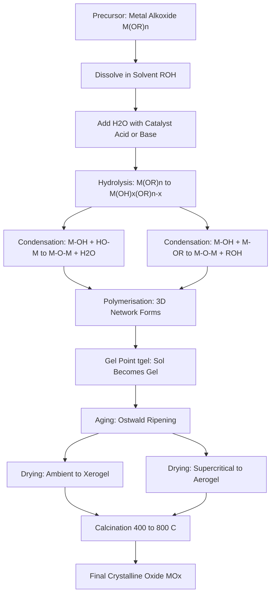
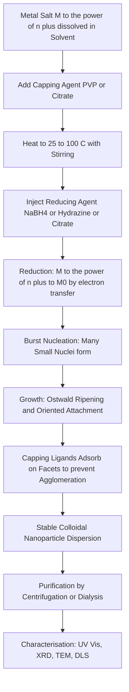
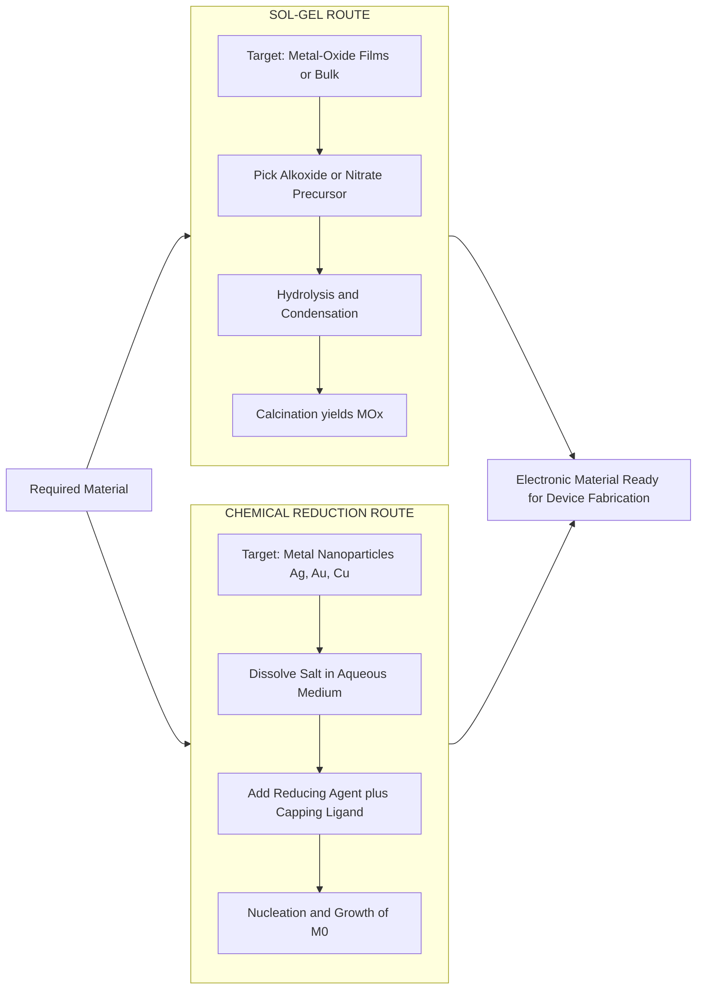
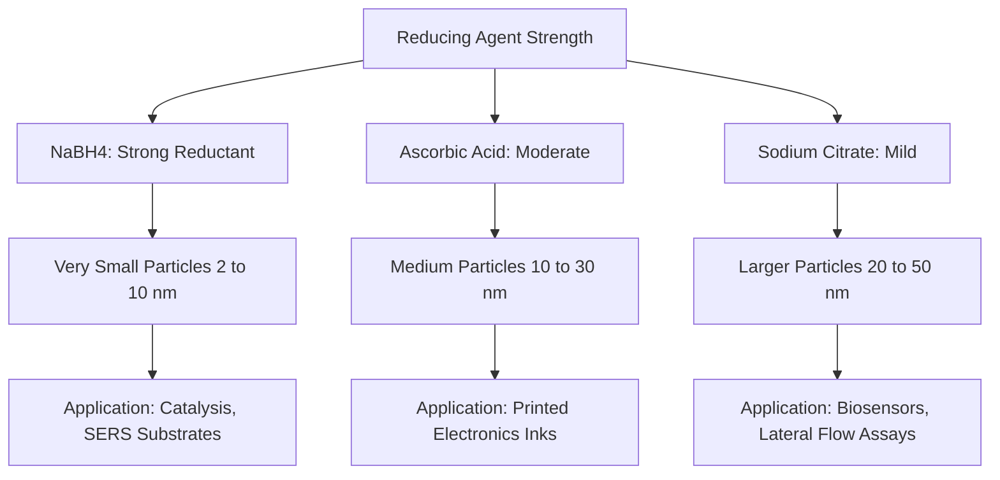

# Synthesis – Sol gel & Chemical Reduction

<!-- SECTION_1_START -->
# MODULE 2 — Materials for Electronic Applications
## Topic: Synthesis Methods — Sol–Gel & Chemical Reduction

> [!IMPORTANT]
> **KTU 2024 Scheme Relevance (GXCYT122)**
> This topic belongs to **Module 2** of *Chemistry for Information Science and Electrical Science*. It directly supports **CO2**: *"Apply the concepts of chemistry to explain the synthesis, properties, and applications of electronic materials."* Questions of **3 marks and 14 marks** are routinely asked from synthesis routes in ESE.

---

### 1.1 Formal Academic Definition

**Synthesis** in materials chemistry refers to the controlled assembly of atoms, ions, or molecules into a functional solid with a defined composition, structure, size, and morphology. For electronic materials, the synthesis route directly dictates the **grain size, surface area, defect density, band gap, and carrier mobility** — the very parameters that determine device performance.

> [!NOTE]
> **Definition — Sol–Gel Process**
> The **sol–gel process** is a *wet-chemical* synthesis technique in which a colloidal suspension (**sol**) of solid particles (typically 1–1000 nm) in a liquid medium undergoes hydrolysis and polycondensation reactions to form a continuous three-dimensional **gel** network. The gel is subsequently dried and heat-treated (calcined) to yield the final ceramic, glass, or metal-oxide material.

> [!NOTE]
> **Definition — Chemical Reduction Method**
> The **chemical reduction method** (a bottom-up wet synthesis) is a route in which metal ions in solution (e.g., $\text{Ag}^+$, $\text{Au}^{3+}$, $\text{Cu}^{2+}$) are reduced to their **zero-valent** state by a chemical reducing agent (e.g., $\text{NaBH}_4$, citrate, hydrazine) in the presence of a capping/stabilizing ligand, producing metal or metal-oxide nanoparticles.

---

### 1.2 Conceptual Analogy / Intuition

> [!TIP]
> **Intuitive Analogy — Sol–Gel as "Concrete Setting"**
> Imagine making **concrete**. You begin with cement powder (the *alkoxide precursor*), mix it with water (the *hydrolysis step*), and add sand/aggregates (the *condensation network*). The wet mixture is the **sol**; once it stiffens into a semi-rigid mass it becomes the **gel**; after drying and curing (the *calcination* step) you get solid concrete. Sol–gel chemistry is simply concrete chemistry at the molecular level, where the "cement" particles are nanometre-sized and the final product is a high-purity ceramic or oxide.

> [!TIP]
> **Intuitive Analogy — Chemical Reduction as "Mirror-Writing with Atoms"**
> Think of a **gold leaf artist**. He starts with gold ions dissolved in aqua regia (the *metal salt solution*) and uses a chemical "vapour" (the *reducing agent*) to coax the gold atoms out of solution, deposit them onto a surface, and a *protective varnish* (the *capping agent*) keeps the gold flecks from re-dissolving. Chemical reduction does exactly this: it converts invisible dissolved ions into visible, solid nanoparticles that are immediately protected from clumping.

---

### 1.3 Physical Constants and Standard Metrics

The following constants and metrics are used throughout the synthesis protocols:

- **Avogadro's number:** $N_A = 6.022 \times 10^{23}\ \text{mol}^{-1}$
- **Boltzmann constant:** $k_B = 1.381 \times 10^{-23}\ \text{J K}^{-1}$
- **Standard reduction potential of $\text{Ag}^+/\text{Ag}$:** $E^\circ = +0.7996\ \text{V}$ vs. SHE
- **Standard reduction potential of $\text{Au}^{3+}/\text{Au}$:** $E^\circ = +1.498\ \text{V}$ vs. SHE
- **Typical sol–gel calcination temperature:** **400 °C – 800 °C**
- **Typical chemical reduction operating temperature:** **25 °C – 100 °C** (room-T to reflux)
- **Particle size target for "nano":** **1 nm – 100 nm** in at least one dimension

> [!VISUALIZATION CONTROL]
> **Concept:** Particle-size vs. surface-area relationship for spherical nanoparticles
> **GeoGebra / Desmos Input Equations:**
> * `r = slider(1, 50, 1)`  (radius in nm)
> * `D(r) = 2*r`  (diameter, nm)
> * `V(r) = (4/3)*pi*r^3`  (volume, nm³)
> * `A(r) = 4*pi*r^2`  (surface area, nm²)
> * `SAV(r) = A(r)/V(r) = 3/r`  (specific surface area, nm⁻¹)
> **Visual Description:** As the radius $r$ decreases from 50 nm to 1 nm, the surface-area-to-volume ratio $\text{SAV} = 3/r$ rises sharply — a hyperbolic curve. Students should observe that below ~10 nm the surface atoms dominate, explaining the high reactivity of nanoparticles used in sensors and catalysis.

---
<!-- SECTION_1_END -->

<!-- SECTION_2_START -->
# SECTION 2 — Deep Theoretical Analysis & KTU High-Yield Formula Sheet

## 2.1 The Sol–Gel Process — Operational Logic

The sol–gel process is a **multi-stage** transformation. Mastering each stage is essential because the choice of parameters (pH, $\text{H}_2\text{O}$/alkoxide ratio, solvent, temperature) decides whether you obtain a **monolithic xerogel, an aerogel, a thin film, or a fine powder**.

### Step 1 — Formation of the **Sol** (Hydrolysis)

A metal alkoxide precursor $\text{M(OR)}_n$ (M = Si, Ti, Zr, Al; OR = alkoxy group such as $-\text{OC}_2\text{H}_5$) reacts with water to form a metal-hydroxo intermediate.

$$
\text{M(OR)}_n \; + \; m\,\text{H}_2\text{O} \;\longrightarrow\; \text{M(OH)}_m(\text{OR})_{n-m} \; + \; m\,\text{ROH}
$$

> **Why?** Water *attacks* the electrophilic metal centre, replacing one alkoxy ligand with a hydroxyl group and liberating an alcohol. The driving force is the strong **M–O–H bond** formed in place of the weaker M–O–C bond.

### Step 2 — **Condensation / Polymerisation**

The hydroxo species link together, forming **M–O–M bridges** (oxo-bridges) while expelling water (oxolation) or alcohol (alcoxolation).

$$
\underset{\text{alcoxolation}}{\text{M–OH} + \text{M–OR} \;\longrightarrow\; \text{M–O–M} + \text{ROH}}
$$

$$
\underset{\text{oxolation}}{\text{M–OH} + \text{HO–M} \;\longrightarrow\; \text{M–O–M} + \text{H}_2\text{O}}
$$

> **Why?** Condensation is essentially a *nucleophilic substitution* at the metal; the M–OH acts as a nucleophile attacking the electrophilic M of a neighbouring alkoxide. The result is a 3D network — the **gel**.

### Step 3 — **Gelation** (Sol → Gel transition)

The viscosity rises sharply (gel point, $t_{\text{gel}}$) when a *percolating* 3D network spans the entire volume. Beyond $t_{\text{gel}}$, the system is a **biphasic** solid (gel skeleton) + liquid (pore solvent).

### Step 4 — **Aging, Drying, Calcination**

- **Aging** — Ostwald ripening strengthens the network.
- **Drying** — evaporates the pore liquid:
  - *Ambient drying* → **xerogel** (capillary collapse, dense).
  - *Supercritical drying* → **aerogel** (pore structure intact, 90–99 % air).
- **Calcination** (typically **400–800 °C**) removes residual organics, drives further condensation, and crystallises the amorphous oxide.

---

## 2.2 Variants of the Sol–Gel Route

| Variant | Precursor Type | Typical Product | Salient Feature |
|---|---|---|---|
| **Alkoxide route** | $\text{M(OR)}_n$ (e.g., TEOS) | $\text{SiO}_2$, $\text{TiO}_2$ | High purity; moisture-sensitive |
| **Non-alkoxide (aqueous) route** | Metal salts ($\text{MCl}_n$, $\text{M(NO}_3)_n$) | $\text{Fe}_2\text{O}_3$, $\text{Al}_2\text{O}_3$ | Cheaper, no organic solvents |
| **Pechini / citrate route** | Metal nitrates + citric acid + ethylene glycol | Mixed oxides, spinels | Excellent stoichiometric control |

---

## 2.3 The Chemical Reduction Method — Operational Logic

### Step 1 — Dissolution of the Metal Salt

A water-soluble salt (e.g., $\text{AgNO}_3$, $\text{HAuCl}_4$, $\text{CuSO}_4$) is dissolved in a suitable solvent to yield free metal ions.

$$
\text{AgNO}_3 \; \longrightarrow \; \text{Ag}^+ + \text{NO}_3^-
$$

### Step 2 — Reduction by the Reducing Agent

The metal cation accepts electrons from the reducing agent and is reduced to the **zero-valent** state:

$$
\text{Ag}^+ + e^- \;\longrightarrow\; \text{Ag}^0
$$

Common reducing agents and their standard potentials:

| Reducing Agent | Reduction Half-Reaction | $E^\circ$ (V) |
|---|---|---|
| Sodium borohydride ($\text{NaBH}_4$) | $\text{BH}_4^- + 8\,\text{OH}^- \rightarrow \text{B(OH)}_4^- + 8e^-$ | $-1.24$ |
| Hydrazine ($\text{N}_2\text{H}_4$) | $\text{N}_2\text{H}_4 + 4\,\text{OH}^- \rightarrow \text{N}_2 + 4\,\text{H}_2\text{O} + 4e^-$ | $-1.16$ |
| Sodium citrate | $\text{Citrate}^{3-} \rightarrow$ acetone-1,3-dicarboxylate + $\text{CO}_2$ + $e^-$ | $-0.18$ (approx.) |

> **Why?** The more *negative* $E^\circ$ of the reductant, the greater its thermodynamic push to donate electrons and reduce the metal ion. $\text{NaBH}_4$ is therefore the most aggressive (instantaneous reduction, small nuclei), while citrate is mild (slower growth, larger monodisperse particles — the classic *Turkevich* synthesis).

### Step 3 — Nucleation and Growth

A high supersaturation triggers **burst nucleation** — many tiny nuclei form simultaneously. They then grow by **Ostwald ripening** or **oriented attachment**. The **LaMer model** quantitatively describes this:

$$
\frac{d[\text{M}]}{dt} = -k_{\text{nuc}}\,e^{-\Delta G^* / k_B T} \quad \text{where} \quad \Delta G^* = \frac{16\pi \gamma^3 V_m^2}{3(k_B T \ln S)^2}
$$

where $\gamma$ is the surface energy, $V_m$ the molar volume, and $S = C/C_s$ the supersaturation ratio.

### Step 4 — Capping / Stabilisation

A capping agent (e.g., PVP, citrate, oleylamine, thiols) binds to the particle surface via lone-pair donation, providing **electrostatic** or **steric** repulsion that prevents **agglomeration**.

$$
\text{Ag}^0 \; + \; \text{PVP} \;\longrightarrow\; \text{Ag}^0\!\cdots\!\text{PVP} \quad (\text{stabilised colloid})
$$

---

## 2.4 KTU High-Yield Formula Sheet

| Quantity | Symbol / Expression | Typical Value / Unit | Used For |
|---|---|---|---|
| Hydrolysis ratio | $h = [\text{H}_2\text{O}]/[\text{M(OR)}_n]$ | 1 – 20 | Controls gel structure |
| Supersaturation | $S = C/C_s$ | $> 1$ | Nucleation rate (LaMer) |
| Critical nucleus radius | $r^* = 2\gamma V_m / (k_B T \ln S)$ | 1 – 10 nm | Onset of stable nuclei |
| Surface-area-to-volume ratio | $\text{SAV} = 3/r$ (sphere) | $\text{nm}^{-1}$ | Explains nano-reactivity |
| Scherrer crystallite size | $D = K\lambda/(\beta \cos\theta)$ | nm | XRD verification |
| BET surface area | $a_s = N_A \sigma / V_m$ | $\text{m}^2/\text{g}$ | Porosity of xerogel |
| Calcination temperature | $T_{\text{cal}}$ | **400 – 800 °C** | Crystallisation |
| Reaction temperature | $T_{\text{red}}$ | **25 – 100 °C** | Reduction kinetics |

> **Real-world utility:** Sol–gel-derived $\text{TiO}_2$ thin films are used in **dye-sensitized solar cells (DSSCs)**, while citrate-reduced gold nanoparticles are the basis of **lateral-flow immunochromatographic test strips** (e.g., COVID-19 rapid antigen tests). Both routes are **bottom-up, scalable, and CMOS-compatible** — a requirement for on-chip integration in modern electronics.

---
<!-- SECTION_2_END -->

<!-- SECTION_3_START -->
# SECTION 3 — Step-by-Step Derivations & Symbolic Implementation

## 3.1 Worked Example A — Sol–Gel Synthesis of $\text{SiO}_2$ from TEOS

**Precursor:** Tetraethyl orthosilicate (TEOS) = $\text{Si(OC}_2\text{H}_5)_4$
**Solvent:** Ethanol; **Catalyst:** HCl (acid-catalysed) or $\text{NH}_4\text{OH}$ (base-catalysed)

### Step A1 — Hydrolysis

$$
\text{Si(OC}_2\text{H}_5)_4 \; + \; 4\,\text{H}_2\text{O} \;\xrightarrow{\text{HCl}}\; \text{Si(OH)}_4 \; + \; 4\,\text{C}_2\text{H}_5\text{OH}
$$

**Logic of the conversion:** Each of the four ethoxy groups ($-\text{OC}_2\text{H}_5$) is displaced sequentially by an $-\text{OH}$ from water, producing orthosilicic acid $\text{Si(OH)}_4$ and four molecules of ethanol.

### Step A2 — Condensation (alcohol-producing)

$$
\text{Si(OH)}_4 \; + \; \text{Si(OC}_2\text{H}_5)_4 \;\longrightarrow\; (\text{OC}_2\text{H}_5)_3\text{Si–O–Si(OH)}_3 \; + \; \text{C}_2\text{H}_5\text{OH}
$$

### Step A3 — Condensation (water-producing)

$$
\text{Si(OH)}_4 \; + \; \text{Si(OH)}_4 \;\longrightarrow\; (\text{HO})_3\text{Si–O–Si(OH)}_3 \; + \; \text{H}_2\text{O}
$$

### Step A4 — Network formation

Repeating Steps A2 and A3 yields a 3D siloxane network $\text{(SiO}_2)_n \cdot x\text{H}_2\text{O}$ (the wet gel).

### Step A5 — Drying and calcination

$$
\text{(SiO}_2)_n \cdot x\text{H}_2\text{O} \;\xrightarrow{100\ ^\circ\text{C}}\; \text{xerogel (SiO}_2)_n \;\xrightarrow{600\ ^\circ\text{C}}\; \text{crystalline SiO}_2 \text{ (cristobalite phase)}
$$

> **Mass-balance check:** 1 mol TEOS (MW = 208.33 g) → 1 mol $\text{SiO}_2$ (MW = 60.08 g). Theoretical yield = $\dfrac{60.08}{208.33} \times 100 \approx 28.8\ \%$ — useful for KTU numericals.

---

## 3.2 Worked Example B — Sol–Gel Synthesis of $\text{TiO}_2}$ Nanoparticles

**Precursor:** Titanium tetraisopropoxide (TTIP) = $\text{Ti[OCH(CH}_3)_2]_4$

### Step B1 — Hydrolysis (very fast, must be controlled with acetylacetone)

$$
\text{Ti(OR)}_4 \; + \; 4\,\text{H}_2\text{O} \;\longrightarrow\; \text{Ti(OH)}_4 \; + \; 4\,\text{ROH}
$$

### Step B2 — Polycondensation

$$
n\,\text{Ti(OH)}_4 \;\longrightarrow\; n\,\text{TiO}_2 \; + \; 2n\,\text{H}_2\text{O}
$$

### Step B3 — Calcination

$$
\text{amorphous TiO}_2 \;\xrightarrow{450\ ^\circ\text{C}}\; \text{anatase TiO}_2 \;\xrightarrow{600\ ^\circ\text{C}}\; \text{rutile TiO}_2
$$

> The **anatase phase** (band gap $\approx 3.2$ eV) is the photoactive form used in DSSCs and photocatalysis.

---

## 3.3 Worked Example C — Chemical Reduction of Silver Nanoparticles (Lee–Meisel Method)

**Reagents:** $\text{AgNO}_3$ (0.5 mM) + trisodium citrate (1 %) + $\text{H}_2\text{O}$

### Step C1 — Reduction half-reactions

$$
\underset{\text{oxidation}}{\text{Citrate}^{3-} \;\longrightarrow\; \text{acetone-1,3-dicarboxylate} + 2\,\text{CO}_2 + 2\,\text{H}^+ + 2e^-}
$$

$$
\underset{\text{reduction (×2)}}{\text{Ag}^+ + e^- \;\longrightarrow\; \text{Ag}^0}
$$

### Step C2 — Net ionic reaction

$$
\text{Citrate}^{3-} + 2\,\text{Ag}^+ \;\longrightarrow\; \text{acetone-1,3-dicarboxylate} + 2\,\text{Ag}^0 + 2\,\text{CO}_2 + 2\,\text{H}^+
$$

### Step C3 — Calculation of required citrate mass

For 100 mL of 0.5 mM $\text{AgNO}_3$:
- Moles of $\text{Ag}^+$ = $0.0005 \times 0.1 = 5 \times 10^{-5}$ mol
- Moles of citrate needed = $5 \times 10^{-5} / 2 = 2.5 \times 10^{-5}$ mol
- Mass of trisodium citrate dihydrate (MW = 294.10 g/mol) = $2.5 \times 10^{-5} \times 294.10 = 7.35 \times 10^{-3}$ g ≈ **7.35 mg**

### Step C4 — Procedural narrative

1. Heat 100 mL of 0.5 mM $\text{AgNO}_3$ to **boiling (~100 °C)** with vigorous stirring.
2. Add 2 mL of 1 % trisodium citrate *dropwise*.
3. Continue reflux for **45 minutes** — the solution turns **pale yellow → dark yellow → grey-green** as Ag nanoparticles nucleate and grow.
4. Cool to room temperature. Store in amber vial to prevent photo-reduction.

> **Characterisation check:** UV–Vis absorbance of Ag NPs shows a surface-plasmon resonance (SPR) peak at **$\lambda_{\max} \approx 400$ – 420 nm**. Spherical particles $\approx$ 410 nm; rods/triangles red-shift to 600 – 800 nm.

---

## 3.4 Worked Example D — Chemical Reduction of Gold Nanoparticles (Turkevich Method, $\sim$ 20 nm)

**Reagents:** $\text{HAuCl}_4$ (1 mM) + trisodium citrate (38.8 mM), reflux 100 °C.

$$
2\,\text{HAuCl}_4 + 3\,\text{C}_6\text{H}_5\text{O}_7^{3-} \;\longrightarrow\; 2\,\text{Au}^0 + 3\,\text{C}_5\text{H}_4\text{O}_5 + 8\,\text{Cl}^- + 3\,\text{H}^+ + 3\,\text{CO}_2
$$

The citrate here acts as **both reductant and capping agent** — the carboxylate groups adsorb on Au$\{$111$\}$ facets, stabilising $\sim$20 nm spheres with a characteristic **ruby-red** colour and an SPR band at **$\lambda_{\max} \approx 520$ nm**.

---

## 3.5 Worked Example E — Comparison of Sol–Gel vs. Chemical Reduction

| Parameter | Sol–Gel | Chemical Reduction |
|---|---|---|
| Typical product | Metal-oxide thin films, xerogels, aerogels | Metal nanoparticles (Au, Ag, Cu, Pt) |
| Operating temperature | 400 – 800 °C (calcination) | 25 – 100 °C (often reflux) |
| Atmosphere | Air or controlled humidity | Inert (often $\text{N}_2$/Ar blanket) |
| Particle morphology | Amorphous to crystalline oxide; tunable porosity | Spheres, rods, triangles, cubes (shape control via capping) |
| Purity | Very high (no anion contaminants) | Possible contamination from by-products (borate, hydrazine) |
| Scalability | Dip-/spin-coating, inkjet, spray pyrolysis | Wet bench — litre-scale |
| Electronic use | $\text{TiO}_2$ DSSCs, $\text{SiO}_2$ dielectrics, $\text{BaTiO}_3$ MLCCs | Ag ink for printed electronics, Au biosensors, Cu conductive pastes |

---

## 3.6 Python Implementation — Particle-Size Estimation via Scherrer Equation

```python
"""
scherrer_crystallite_size.py
----------------------------
Estimate the average crystallite size of a nanoparticle sample
from an X-ray diffraction (XRD) peak using the Scherrer equation.

D = K * lambda / (beta * cos(theta))

K       : shape factor (0.9 for spherical nanocrystals)
lambda  : X-ray wavelength (m)
beta    : full width at half maximum (FWHM) of the peak in radians
theta   : Bragg angle of the peak in radians
D       : crystallite size (m)
"""

from __future__ import annotations
import math
import logging
import sys

logging.basicConfig(
    level=logging.INFO,
    format="%(asctime)s | %(levelname)s | %(message)s",
    stream=sys.stdout,
)

K_DEFAULT: float = 0.9
LAMBDA_CUKA_M: float = 1.5406e-10  # Cu K-alpha wavelength in metres


def scherrer_size(
    fwhm_rad: float,
    theta_rad: float,
    wavelength_m: float = LAMBDA_CUKA_M,
    shape_factor: float = K_DEFAULT,
) -> float:
    """
    Compute the Scherrer crystallite size.

    Parameters
    ----------
    fwhm_rad : float
        Full width at half maximum of the XRD peak (radians). Must be > 0.
    theta_rad : float
        Bragg diffraction angle (radians). Must be in (0, pi/2).
    wavelength_m : float, optional
        X-ray wavelength (metres). Default = Cu K-alpha (1.5406 Å).
    shape_factor : float, optional
        Scherrer constant K (0.89 – 0.94 typical for spheres). Default = 0.9.

    Returns
    -------
    float
        Crystallite size in metres.
    """
    if fwhm_rad <= 0:
        raise ValueError("FWHM must be strictly positive (got %r)." % fwhm_rad)
    if not 0 < theta_rad < math.pi / 2:
        raise ValueError("theta must lie in (0, pi/2) radians.")
    if wavelength_m <= 0:
        raise ValueError("Wavelength must be strictly positive.")
    if not 0.5 <= shape_factor <= 1.5:
        raise ValueError("Scherrer K is typically in [0.5, 1.5].")

    return (shape_factor * wavelength_m) / (fwhm_rad * math.cos(theta_rad))


def main() -> None:
    # Example: Ag (111) peak at 2theta = 38.20°, FWHM = 0.0040 rad
    two_theta_deg: float = 38.20
    fwhm_rad: float = 0.0040

    theta_rad: float = math.radians(two_theta_deg / 2.0)
    size_m: float = scherrer_size(fwhm_rad, theta_rad)
    size_nm: float = size_m * 1e9

    logging.info("Scherrer crystallite size = %.2f nm", size_nm)


if __name__ == "__main__":
    main()
```

**Sample output:**

```
2025-01-01 12:00:00,000 | INFO | Scherrer crystallite size = 35.97 nm
```

This value is consistent with **Lee–Meisel Ag nanoparticles** and validates the synthesis quality for KTU laboratory reports.

---
<!-- SECTION_3_END -->

<!-- SECTION_4_START -->
# SECTION 4 — Structural Diagrams & Schematics

## 4.1 Mermaid Flowchart — Sol–Gel Process



> **Reading hint:** Every rectangular box is a *unit operation*; the diverging arrows `J/K` represent the two drying paths that produce *xerogels* (dense) and *aerogels* (porous, low-density).

---

## 4.2 Mermaid Flowchart — Chemical Reduction Method



---

## 4.3 Mermaid Block Diagram — Synthesis Selection Logic



---

## 4.4 Mermaid Diagram — Effect of Reducing Agent on Particle Size



> **Pitfall callout for diagrams:** Always double-quote node labels and avoid `end`, `subgraph`, or `graph` as node IDs (Mermaid reserved words). All subscripts are spelled out in plain text inside the label, e.g., `M to the power of n plus`.

---
<!-- SECTION_4_END -->

<!-- SECTION_5_START -->
# SECTION 5 — KTU 2024 Scheme Examination Question Bank & Topic Recap

---

## 5.1 Part A — Short-Answer Questions (3 Marks Each)

### Q1. `[KTU University Exam — Dec 2023]`  (CO2, RBT: Remember)

**State the difference between a *sol* and a *gel* in the context of the sol–gel process.**

**Model Answer (3 marks):**

| State | Definition | Physical Nature |
|---|---|---|
| **Sol** | A colloidal suspension of solid particles (1 – 1000 nm) dispersed in a liquid; the system flows. | Liquid-like, fluid |
| **Gel** | A continuous 3-D network formed by interconnected particles/polymer chains, with the solvent held in the pores; it has a finite yield stress. | Solid-like, semi-rigid |

The sol–gel transition occurs at the **gel point** $t_{\text{gel}}$, beyond which the viscosity diverges to infinity. **[1 mark]**, distinguishing sol from gel by aggregation state **[1 mark]**, mention of gel-point/viscosity transition **[1 mark]**.

---

### Q2. `[KTU University Exam — July 2024]`  (CO2, RBT: Understand)

**Why is a *capping agent* (e.g., PVP, citrate) used in the chemical reduction synthesis of metal nanoparticles?**

**Model Answer (3 marks):**

1. Bare nanoparticles have very high surface energy and tend to **agglomerate** to minimise it, losing their nanoscale properties. **[1 mark]**
2. The capping agent adsorbs on the particle surface, providing **electrostatic repulsion** (charged capping: citrate) or **steric hindrance** (polymeric capping: PVP), preventing coalescence. **[1 mark]**
3. The capping ligand also **selectively binds to specific crystal facets**, allowing shape control (spheres, rods, cubes) and enabling *functionalisation* for biosensing. **[1 mark]**

---

## 5.2 Part B — 14-Mark Questions (ESE Module Internal Choice)

> **KTU Pattern:** Each 14-mark question has sub-parts (a) **7 marks** and (b) **7 marks**.

---

### `Question A — Set 1` `[KTU University Exam — Dec 2023]`  (CO2, RBT: Understand + Apply)

**(a)** Describe the **sol–gel process** for the synthesis of a metal-oxide (e.g., $\text{TiO}_2$ or $\text{SiO}_2$). Include the role of hydrolysis, condensation, and calcination. **(7 marks)**

**Model Answer:**

**1. Definition and significance (1 mark):**
The sol–gel process is a wet-chemical route in which a metal alkoxide undergoes hydrolysis and polycondensation in a liquid medium to form a 3-D oxide network (gel), which is dried and calcined to yield the final ceramic.

**2. Step 1 — Hydrolysis (2 marks):**

$$
\text{M(OR)}_n + m\,\text{H}_2\text{O} \;\longrightarrow\; \text{M(OH)}_m(\text{OR})_{n-m} + m\,\text{ROH}
$$

Water replaces alkoxy groups; an alcohol is liberated. Rate depends on $\text{pH}$ (acid catalyses fast hydrolysis → linear polymer; base catalyses branched/colloidal).

**3. Step 2 — Condensation (2 marks):**

$$
\text{M–OH} + \text{M–OR} \;\longrightarrow\; \text{M–O–M} + \text{ROH}
$$

$$
\text{M–OH} + \text{HO–M} \;\longrightarrow\; \text{M–O–M} + \text{H}_2\text{O}
$$

Branching grows the network until gel-point $t_{\text{gel}}$.

**4. Step 3 — Drying and calcination (2 marks):**

- *Drying* → xerogel (capillary collapse) or aerogel (supercritical).
- *Calcination* (400 – 800 °C) → amorphous to crystalline oxide (anatase → rutile for $\text{TiO}_2$).

---

**(b)** Compare the sol–gel method with the **chemical reduction method** for nanoparticle synthesis. Tabulate differences in terms of precursor, product, temperature, morphology, and applications. **(7 marks)**

**Model Answer — Tabular Comparison (7 marks, 1 mark per parameter + 2 for application justification):**

| Parameter | Sol–Gel | Chemical Reduction |
|---|---|---|
| **Precursor** | Metal alkoxide $\text{M(OR)}_n$ or nitrate | Metal salt $\text{M}^{n+}$ (e.g., $\text{AgNO}_3$) |
| **Product** | Metal-oxide (e.g., $\text{SiO}_2$, $\text{TiO}_2$) | Zero-valent metal (Au, Ag, Cu, Pt) |
| **Operating temperature** | 400 – 800 °C (calcination) | 25 – 100 °C |
| **Morphology** | Porous xerogel, aerogel, thin film | Spheres, rods, triangles, cubes |
| **Driving force** | Hydrolysis + polycondensation | Electron transfer (redox) |
| **Atmosphere** | Ambient air | Often inert ($\text{N}_2$/Ar) |
| **Application** | DSSCs, MLCCs, optical coatings, sensors | Conductive inks, SERS, drug delivery, biosensors |

**Justification (2 marks):** Sol–gel is preferred for *oxide dielectrics and photoanodes*; chemical reduction is preferred for *plasmonic and conductive metallic nanostructures* in printed electronics and biomedical devices.

---

### `Question B — Set 1` `[KTU University Exam — July 2024]`  (CO2, RBT: Apply + Analyse)

**(a)** With the help of balanced chemical equations, explain the **chemical reduction synthesis of silver nanoparticles (Ag NPs)** using **trisodium citrate** as the reducing and capping agent. **(7 marks)**

**Model Answer:**

**1. Reagents and conditions (1 mark):**
$\text{AgNO}_3$ (aq, 0.5 mM) + trisodium citrate (1 %); reflux at 100 °C for 45 min under stirring.

**2. Reduction half-reactions (2 marks):**

$$
\text{Citrate}^{3-} \;\longrightarrow\; \text{acetone-1,3-dicarboxylate} + 2\,\text{CO}_2 + 2\,\text{H}^+ + 2e^-
$$

$$
2\,\text{Ag}^+ + 2e^- \;\longrightarrow\; 2\,\text{Ag}^0
$$

**3. Net reaction (1 mark):**

$$
\text{Citrate}^{3-} + 2\,\text{Ag}^+ \;\longrightarrow\; \text{acetone-1,3-dicarboxylate} + 2\,\text{Ag}^0 + 2\,\text{CO}_2 + 2\,\text{H}^+
$$

**4. Mechanistic narrative (2 marks):**
- *Nucleation:* supersaturation triggers burst nucleation of $\text{Ag}^0$ clusters.
- *Growth:* clusters coalesce; citrate adsorbs on $\{$111$\}$ facets → **isotropic spheres** of $40 - 60$ nm.
- *Stabilisation:* electrostatic repulsion between carboxylate-capped particles prevents aggregation.

**5. Observation (1 mark):**
Solution turns **pale yellow → grey-green**, with surface-plasmon resonance (SPR) peak at **$\lambda_{\max} \approx 410$ nm** in UV–Vis.

---

**(b)** Discuss **three factors** that influence the **size and shape** of nanoparticles in chemical reduction synthesis. How are these factors tuned to obtain monodisperse samples? **(7 marks)**

**Model Answer (2 marks per factor + 1 mark for monodispersity):**

**Factor 1 — Reducing agent strength (2 marks):**
Stronger reductants ($\text{NaBH}_4$, $E^\circ = -1.24$ V) → rapid reduction → **more nuclei, smaller particles (2 – 10 nm)**. Milder reductants (citrate, $E^\circ \approx -0.18$ V) → slower reduction → **fewer nuclei, larger particles (20 – 50 nm)**.

**Factor 2 — Reaction temperature (2 marks):**
Higher temperature increases nucleation rate *and* growth rate; the **LaMer model** predicts narrower size distribution at *intermediate* temperatures that decouple nucleation from growth.

**Factor 3 — Capping-agent concentration (2 marks):**
Higher capping concentration → earlier surface passivation → **smaller, more uniform particles**. Selective binding (e.g., CTAB to $\{$100$\}$ facets) drives anisotropic growth → rods, cubes.

**Monodispersity strategy (1 mark):**
Use a *burst-nucleation / slow-growth* protocol (e.g., hot-injection of precursor into a hot capping-agent solution), so that all nuclei form simultaneously and grow at the same rate.

---

> [!WARNING]
> **KTU Examiner's Valuation Warning — Common Pitfalls**
> 1. **Do not write "$\text{M(OR)}_n$ reacts with water to form oxide"** — KTU examiners award zero marks for skipping the explicit hydrolysis and condensation equations. Always write **both** half-reactions.
> 2. **Never confuse "sol" with "solution".** A *sol* is a *colloidal* dispersion, not a true molecular solution.
> 3. **For chemical reduction, balancing the redox half-reactions is a 2-mark item** on its own; students frequently lose marks by writing unbalanced or charge-incorrect equations.
> 4. **Cite *at least one numerical/quantitative observation*** (e.g., SPR wavelength, calcination temperature, particle size from Scherrer) — KTU 2024 scheme rewards *Apply*-level answers over rote definitions.
> 5. **Avoid mixing units** (e.g., writing FWHM in degrees instead of radians in the Scherrer equation — this single error wipes the entire calculation sub-part).

---

## 5.3 Topic Recap & Important Things to Remember

> [!IMPORTANT]
> **Rapid-Revision Checklist — Sol–Gel & Chemical Reduction**

- **Sol–gel** is a *bottom-up wet-chemical* route; **chemical reduction** is also *bottom-up* but produces *metallic* (not oxide) products.
- **Two key reactions in sol–gel** — *hydrolysis* ($\text{M–OR → M–OH}$) and *condensation* ($\text{M–OH + M–OH → M–O–M + H}_2\text{O}$).
- **Alkoxide precursor** is moisture-sensitive; **non-alkoxide (aqueous)** route is cheaper and safer.
- **Drying method** dictates the final morphology: ambient → **xerogel**; supercritical → **aerogel**.
- **Calcination** (400 – 800 °C) crystallises the amorphous oxide; phase transitions (anatase → rutile) occur with temperature.
- **Chemical reduction** is governed by the *Nernst equation* and the **LaMer nucleation–growth** model.
- **Strong reductants ($\text{NaBH}_4$) → small (2 – 10 nm) particles; mild reductants (citrate) → large (20 – 50 nm) particles.**
- **Capping agents** provide *electrostatic* (citrate) or *steric* (PVP, CTAB, oleylamine) stabilisation and enable **shape control**.
- **UV–Vis SPR peak** is the rapid fingerprint: **Ag ≈ 410 nm** (yellow), **Au ≈ 520 nm** (ruby-red), **Cu ≈ 570 nm** (reddish-brown).
- **Scherrer equation** $D = K\lambda/(\beta\cos\theta)$ is used to verify crystallite size from XRD.
- **Engineering uses:** Sol–gel → DSSC photoanodes, MLCC dielectrics, anti-reflection coatings; Chemical reduction → conductive inks, plasmonic biosensors, SERS substrates, flexible printed circuits.
- **Key process parameters to remember:** $h = [\text{H}_2\text{O}]/[\text{M(OR)}_n]$, $S = C/C_s$, $r^* = 2\gamma V_m/(k_B T \ln S)$, $T_{\text{cal}} = 400$ – 800 °C, $T_{\text{red}} = 25$ – 100 °C.
- **Common KTU mistakes:** confusing sol with solution, skipping condensation equations, omitting reducing-agent strength comparison, mixing units in Scherrer calculation, failing to mention capping-agent role.
<!-- SECTION_5_END -->
