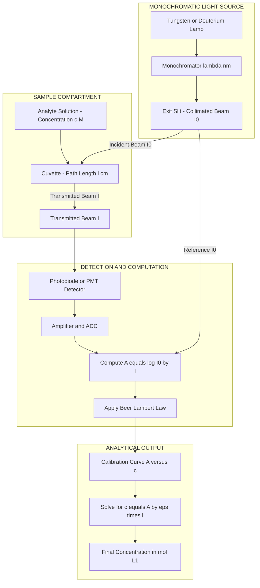
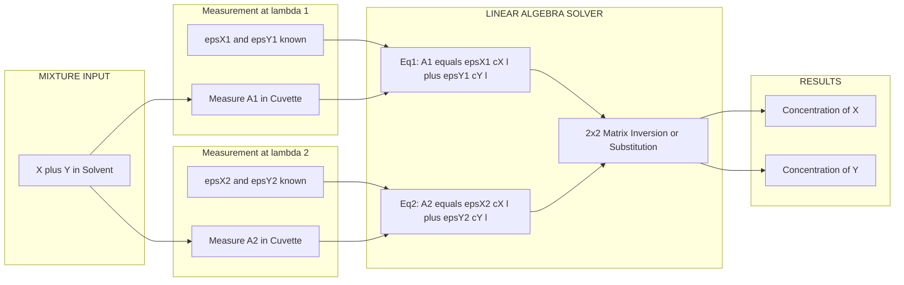

# Beer Lambert’s law – Numerical problems

<!-- SECTION_1_START -->
# Beer–Lambert's Law — Numerical Problems

## 1.1 Formal Definition

**Beer–Lambert's Law** (also called the **Beer–Lambert–Bouguer Law**) is the fundamental quantitative relationship in UV-Visible absorption spectroscopy that relates the attenuation of monochromatic light passing through a homogeneous absorbing medium to the properties of that medium.

> [!IMPORTANT]
> **KTU Syllabus Statement (GXCYT122, Module 3):**
> *"Apply Beer–Lambert's law to calculate concentration, absorbance, transmittance, and molar absorptivity of given analyte systems used in information and electrical science applications."*

Mathematically, the law is expressed as:

$$A = \log_{10}\left(\frac{I_0}{I}\right) = \varepsilon \, c \, l$$

Where every symbol carries a precise physical meaning:
- $A$ → **Absorbance** (also called *optical density*, dimensionless)
- $I_0$ → **Intensity of incident (monochromatic) light** striking the sample (W·m⁻² or arbitrary units, a.u.)
- $I$ → **Intensity of transmitted light** leaving the sample
- $\varepsilon$ → **Molar absorptivity** (or *molar extinction coefficient*), units: **L·mol⁻¹·cm⁻¹**
- $c$ → **Molar concentration** of the absorbing species, units: **mol·L⁻¹** (M)
- $l$ → **Optical path length** through the sample, units: **cm**

The fractional transmittance and percent transmittance are related by:

$$T = \frac{I}{I_0} \qquad \text{and} \qquad \%T = 100 \times T$$

A direct logarithmic conversion connects the two experimentally measurable quantities:

$$A = -\log_{10} T = \log_{10}\left(\frac{100}{\%T}\right) = 2 - \log_{10}(\%T)$$

## 1.2 Conceptual Analogy — The "Toll Booth" Intuition

> [!NOTE]
> **Real-World Analogy — Cars Passing a Series of Toll Booths**

Imagine a stream of cars $I_0$ driving on a highway. They pass through a **single toll booth** (the sample cell) where every car has a fixed probability of being *delayed* (absorbed). If the booth operates fairly:
- Doubling the number of booths in series ($l$) doubles the chance of delay.
- Doubling the number of cars per unit road ($c$) doubles the delay probability.
- A "stricter" booth ($\varepsilon$) delays more cars than a "lenient" one.

The cars that emerge on the other side are the **transmitted light** $I$. Just as a traffic controller counts the surviving cars to estimate how many booths and how dense the traffic was, a **spectrophotometer** measures $I$ to back-calculate $c$.

### The Geometric Intuition

The Beer–Lambert law is a **consequence of exponential decay** in a differential slice of thickness $dl$:

$$\frac{dI}{I} = -k \, dl \quad \xrightarrow{\text{integrate}} \quad I = I_0 \, e^{-k l}$$

Converting the natural exponent to base-10 logarithm (because $\ln x = 2.303 \, \log_{10} x$) gives the textbook form with $A = 0.4343 \, k \, l = \varepsilon \, c \, l$.

> [!VISUALIZATION CONTROL]
> **Concept:** *Linear Absorbance vs. Concentration Curve (Calibration Plot)*
> **GeoGebra / Desmos Input Equations:**
> - $A(c) \;=\; 250 \cdot c \cdot 1$  (where $\varepsilon = 250$ L·mol⁻¹·cm⁻¹, $l = 1$ cm)
> - Point: $(c,\,A) = (0.001,\; 0.25)$
> - Point: $(c,\,A) = (0.004,\; 1.00)$
> **Visual Description:** A **straight line** passing through the origin with slope $\varepsilon \, l = 250$. As $c$ increases along the x-axis, $A$ rises linearly — this is the *linear dynamic range* of Beer–Lambert's law. Beyond a critical concentration the line **bends downward** (real samples deviate negatively).

## 1.3 Why This Law Matters in Information & Electrical Science

- **LCD/OLED displays** rely on precisely calibrated dye concentrations whose absorbance is engineered at specific wavelengths.
- **Optical fibre sensors** use Beer–Lambert absorbance to detect chemical/biological analytes.
- **Photodetector calibration** in CMOS/CCD imaging requires transmittance–absorbance conversion.
- **Semiconductor wafer analysis** (thin-film thickness) uses Beer–Lambert's transmission variant.

> [!TIP]
> **Key constant to remember:** $\ln 10 = 2.303$ — this constant converts between natural and base-10 logarithms and frequently appears in Beer–Lambert derivations.

<!-- SECTION_1_END -->

<!-- SECTION_2_START -->
# Deep Theoretical Analysis & KTU High-Yield Formula Sheet

## 2.1 Operational Logic — Step-by-Step Breakdown

The Beer–Lambert law is a **multiplicative law**: when $n$ independent absorbing species are present (or when $n$ identical cells are stacked), their absorbances **add**. This property is the foundation of **simultaneous mixture analysis**.

| # | Logic Step | Physical Meaning |
|---|------------|-------------------|
| 1 | $I_0$ — monochromatic light enters | Photon flux at wavelength $\lambda$ before the cell |
| 2 | A fraction of photons is absorbed in each infinitesimal slice $dl$ | Probability of absorption $\propto$ number of molecules encountered |
| 3 | Integrating over the full cell length $l$ | $I = I_0 \, e^{-k l}$ (exponential decay) |
| 4 | Converting to base-10 logarithm | $A = \log_{10}(I_0/I) = (k/2.303) \, l$ |
| 5 | Identifying $k = 2.303 \, \varepsilon \, c$ | $A = \varepsilon \, c \, l$ — final form |
| 6 | For mixtures | $A_{\text{total}} = l \sum_i \varepsilon_i \, c_i$ |
| 7 | For serial cells | $A_{\text{total}} = \sum_j A_j$ |

> [!IMPORTANT]
> **KTU Frequently Tested Point:** The law is **additive**. In a two-component mixture, $A_{\text{measured}} = A_X + A_Y = \varepsilon_X \, c_X \, l + \varepsilon_Y \, c_Y \, l$. By measuring $A$ at **two different wavelengths** (where the molar absorptivities of X and Y differ), you can solve a **2 × 2 linear system** for $c_X$ and $c_Y$.

## 2.2 KTU High-Yield Formula Sheet

| # | Formula | Description | Typical Units / Range |
|---|---------|-------------|----------------------|
| 1 | $A = \log_{10}(I_0 / I)$ | Definition of absorbance | Dimensionless; $A \geq 0$ |
| 2 | $A = \varepsilon \, c \, l$ | Beer–Lambert law (linear form) | $\varepsilon$ in L·mol⁻¹·cm⁻¹ |
| 3 | $T = I / I_0$ | Fractional transmittance | $0 \leq T \leq 1$ |
| 4 | $\%T = (I / I_0) \times 100$ | Percent transmittance | $0 \leq \%T \leq 100$ |
| 5 | $A = -\log_{10} T$ | Absorbance from transmittance | $A = 0 \Rightarrow T = 1$ (100 % transmission) |
| 6 | $A = 2 - \log_{10}(\%T)$ | Direct conversion shortcut | When $\%T$ is given |
| 7 | $I = I_0 \, 10^{-A}$ | Intensity of transmitted light | Useful in layered-media problems |
| 8 | $c = A / (\varepsilon \, l)$ | Concentration from absorbance | For single analyte |
| 9 | $A_{\text{mixt}} = l(\varepsilon_1 c_1 + \varepsilon_2 c_2 + \cdots)$ | Additivity law | Mixture analysis |
| 10 | $A_n = n \, A_1$ | Serial-cell rule | $n$ identical cells in series |
| 11 | $A \propto l$ (at fixed $c$) | Linear in path length | Used in cuvette-design problems |
| 12 | $A \propto c$ (at fixed $l$) | Linear in concentration | Calibration-curve foundation |

> [!CAUTION]
> **Mark-Loss Trap:** Do **not** confuse $A$ with $\%T$ in numerical substitution. If the problem says "*transmittance is 25 %*", you must use $A = -\log_{10}(0.25) = 0.6021$, **not** $A = 0.25$. This is one of the most common KTU valuation errors.

## 2.3 Real-World Engineering Utility

| Engineering Domain | Application of Beer–Lambert's Law |
|--------------------|------------------------------------|
| Optical fibre communication | Quantify signal attenuation in doped glass |
| Photovoltaic cell characterisation | Measure thin-film absorption coefficient |
| Forensic / analytical chemistry | Quantify drug concentrations in biological fluids |
| LCD colour-filter manufacturing | Calibrate dye concentration for precise hue |
| Laser safety eyewear | Verify optical density (OD) at laser wavelength |
| Semiconductor process control | Monitor etch-bath concentration via UV absorbance |

## 2.4 Limitations (Frequently Asked in 2-Mark Questions)

> [!WARNING]
> 1. **High concentrations ($c > 0.01$ M):** Solute–solute interactions alter $\varepsilon$; plot bends.
> 2. **Stray light:** Reduces measured absorbance, especially at $A > 1.0$.
> 3. **Scattering by particulates:** Mimics absorption; filter samples.
> 4. **Fluorescence / phosphorescence:** Emitted light distorts $I$ measurement.
> 5. **Chemical changes** (association, dissociation, isomerisation) change $\varepsilon$.
> 6. **Non-monochromatic light:** $\varepsilon$ depends on $\lambda$; polychromatic beams cause deviation.

<!-- SECTION_2_END -->

<!-- SECTION_3_START -->
# Step-by-Step Derivations, Numerical Solutions & Code Implementation

## 3.1 Core Derivation: From Differential Attenuation to Beer–Lambert

**Setup.** Consider a parallel monochromatic beam of intensity $I$ entering a thin slice of absorbing medium of thickness $dl$ and cross-sectional area $S$. The number of absorbing molecules in the slice is $dN$.

The probability that a photon is absorbed in the slice is proportional to the molecular density and the thickness:

$$\frac{dI}{I} = -k \, dl$$

where $k$ is the *linear absorption coefficient* (units: cm⁻¹).

**Step 1 — Integration across the cell of length $l$:**

$$\int_{I_0}^{I} \frac{dI}{I} = -\int_{0}^{l} k \, dl$$

$$\ln I - \ln I_0 = -k \, l \quad \Rightarrow \quad \ln\left(\frac{I}{I_0}\right) = -k \, l$$

**Step 2 — Exponentiate:**

$$I = I_0 \, e^{-k \, l}$$

**Step 3 — Convert natural log to base-10 log** using $\ln x = 2.303 \, \log_{10} x$:

$$\log_{10}\left(\frac{I_0}{I}\right) = \frac{k}{2.303} \, l$$

**Step 4 — Identify absorbance** $A \equiv \log_{10}(I_0 / I)$:

$$A = \frac{k}{2.303} \, l$$

**Step 5 — Relate $k$ to molecular properties.** For a solution of molar concentration $c$, the number of molecules per unit volume is $N_A \, c$, and the absorption cross-section $\sigma$ of each molecule gives $k = \sigma \, N_A \, c$. Defining $\varepsilon = \sigma \, N_A / 2.303$ yields:

$$A = \varepsilon \, c \, l$$

This is the **canonical Beer–Lambert equation**, valid for dilute, non-interacting, non-scattering solutions illuminated by strictly monochromatic light.

---

## 3.2 Numerical Problems — KTU Board Style (Exhaustive Solutions)

### **Problem 1 — Basic Single-Analyte Calculation**

> A solution of an organic dye in a **1.0 cm** quartz cuvette shows a transmittance of **32.0 %** at $\lambda = 540$ nm. The molar absorptivity of the dye at this wavelength is **$2.5 \times 10^{4}$ L·mol⁻¹·cm⁻¹**. Calculate:
> (i) the absorbance of the solution,
> (ii) the molar concentration of the dye,
> (iii) the intensity of transmitted light if the incident intensity is doubled.

#### Solution

**Part (i) — Absorbance**

Given $\%T = 32.0$, hence $T = 0.320$.

$$A = -\log_{10} T = -\log_{10}(0.320)$$

$$\log_{10}(0.320) = \log_{10}(3.20 \times 10^{-1}) = \log_{10}(3.20) - 1 = 0.5051 - 1 = -0.4949$$

$$A = -(-0.4949) = 0.4949 \approx 0.495$$

> *Valuation key: 1 mark for substituting $T$, 1 mark for log computation, 1 mark for final value.*

**Part (ii) — Molar concentration**

Rearrange $A = \varepsilon \, c \, l$:

$$c = \frac{A}{\varepsilon \, l} = \frac{0.4949}{(2.5 \times 10^{4}) \times (1.0)}$$

$$c = \frac{0.4949}{2.5 \times 10^{4}} = 1.9796 \times 10^{-5} \text{ mol·L}^{-1}$$

$$c \approx 1.98 \times 10^{-5} \text{ M}$$

> *Valuation key: 1 mark for correct rearrangement, 1 mark for substitution, 1 mark for final answer with units.*

**Part (iii) — Transmitted intensity when $I_0$ is doubled**

Beer–Lambert's law is **independent of $I_0$** because it depends only on the ratio $I/I_0$. The transmittance $T = 0.320$ remains unchanged. So:

$$I_{\text{new}} = 2 \, I_0 \times T = 2 \, I_0 \times 0.320 = 0.640 \, I_0$$

> *Valuation key: 1 mark for stating the ratio is independent of $I_0$, 1 mark for the new value, 1 mark for explanation.*

---

### **Problem 2 — Concentration from Absorbance + Mass Conversion**

> A compound of molecular weight **$180$ g·mol⁻¹** has an absorbance of **0.850** at **$280$ nm** in a **1.0 cm** path-length cell. Its molar absorptivity at 280 nm is **$1.20 \times 10^{4}$ L·mol⁻¹·cm⁻¹**. Calculate:
> (i) the molar concentration,
> (ii) the concentration in g·L⁻¹.

#### Solution

**Part (i) — Molar concentration**

$$c = \frac{A}{\varepsilon \, l} = \frac{0.850}{(1.20 \times 10^{4}) \times (1.0)} = \frac{0.850}{1.20 \times 10^{4}}$$

$$c = 7.0833 \times 10^{-5} \text{ mol·L}^{-1} \approx 7.08 \times 10^{-5} \text{ M}$$

**Part (ii) — Concentration in g·L⁻¹**

$$\text{Mass concentration} = c \times M = (7.0833 \times 10^{-5}) \times 180$$

$$= 1.275 \times 10^{-2} \text{ g·L}^{-1} = 12.75 \text{ mg·L}^{-1}$$

---

### **Problem 3 — Multi-Cell / Path-Length Scaling**

> A solution of absorbance **$0.450$** in a **1.0 cm** cuvette is transferred to a **5.0 cm** cuvette. What will be the new absorbance and the new percent transmittance?

#### Solution

Since $A \propto l$ (at constant $c$ and $\varepsilon$):

$$A_{\text{new}} = A_{\text{old}} \times \frac{l_{\text{new}}}{l_{\text{old}}} = 0.450 \times \frac{5.0}{1.0} = 2.250$$

For the transmittance:

$$T_{\text{new}} = 10^{-A_{\text{new}}} = 10^{-2.250}$$

$$T_{\text{new}} = 5.623 \times 10^{-3} \quad \Rightarrow \quad \%T = 0.5623 \,\%$$

---

### **Problem 4 — Two-Component Mixture (Simultaneous Equations)**

> A solution contains two absorbing species **X** and **Y**. The absorbances measured in a 1.0 cm cell are:
> - At $\lambda_1 = 400$ nm: $A_1 = 0.620$
> - At $\lambda_2 = 520$ nm: $A_2 = 0.410$
>
> Molar absorptivities (L·mol⁻¹·cm⁻¹):
> - $\varepsilon_X(\lambda_1) = 8000$, $\varepsilon_X(\lambda_2) = 1500$
> - $\varepsilon_Y(\lambda_1) = 1200$, $\varepsilon_Y(\lambda_2) = 6500$
>
> Determine the molar concentrations of X and Y.

#### Solution

**Set up the linear system** (since $l = 1$ cm, it can be dropped):

$$8000 \, c_X + 1200 \, c_Y = 0.620 \quad \cdots (1)$$

$$1500 \, c_X + 6500 \, c_Y = 0.410 \quad \cdots (2)$$

**Solve (1) for $c_X$:**

$$c_X = \frac{0.620 - 1200 \, c_Y}{8000} = 7.75 \times 10^{-5} - 0.15 \, c_Y$$

**Substitute into (2):**

$$1500 \,(7.75 \times 10^{-5} - 0.15 \, c_Y) + 6500 \, c_Y = 0.410$$

$$0.11625 - 225 \, c_Y + 6500 \, c_Y = 0.410$$

$$6275 \, c_Y = 0.410 - 0.11625 = 0.29375$$

$$c_Y = \frac{0.29375}{6275} = 4.681 \times 10^{-5} \text{ M} \approx 4.68 \times 10^{-5} \text{ M}$$

**Back-substitute to find $c_X$:**

$$c_X = 7.75 \times 10^{-5} - 0.15 \times (4.681 \times 10^{-5})$$

$$c_X = 7.75 \times 10^{-5} - 7.022 \times 10^{-6} = 7.048 \times 10^{-5} \text{ M} \approx 7.05 \times 10^{-5} \text{ M}$$

> *Valuation key (2 marks each for $c_X$ and $c_Y$): 1 mark for setting up the system, 1 mark each for algebraic solution and final numerical answer with correct units.*

---

### **Problem 5 — Molar Absorptivity Determination from Calibration Data**

> A standard solution of concentration **$5.0 \times 10^{-5}$ M** gives an absorbance of **0.625** in a 1.0 cm cell. An unknown sample in the same cell gives $A = 0.480$. Calculate:
> (i) the molar absorptivity of the analyte,
> (ii) the concentration of the unknown.

#### Solution

**Part (i):** From Beer–Lambert's law:

$$\varepsilon = \frac{A}{c \, l} = \frac{0.625}{(5.0 \times 10^{-5}) \times 1.0} = 1.25 \times 10^{4} \text{ L·mol}^{-1}\text{·cm}^{-1}$$

**Part (ii):** With the same $\varepsilon$ and $l$:

$$c_{\text{unknown}} = \frac{A}{\varepsilon \, l} = \frac{0.480}{(1.25 \times 10^{4}) \times 1.0} = 3.84 \times 10^{-5} \text{ M}$$

---

## 3.3 Python Implementation — Beer–Lambert Calculator

```python
"""
beer_lambert.py
Author: KTU Chemistry Reference Module
Description: A numerically robust implementation of Beer-Lambert's law
             with comprehensive error logging and unit handling.
"""

from __future__ import annotations
import logging
import math
from typing import Final

# Configure module-level logger
logging.basicConfig(
    level=logging.INFO,
    format="%(asctime)s | %(levelname)s | %(message)s"
)
logger: Final[logging.Logger] = logging.getLogger("BeerLambert")


# ---------- Core Functions ----------

def absorbance_from_transmittance(transmittance: float) -> float:
    """
    Compute absorbance from fractional transmittance.

    Parameters
    ----------
    transmittance : float
        Fractional transmittance T in [0, 1].

    Returns
    -------
    float
        Absorbance A = -log10(T), dimensionless.

    Raises
    ------
    ValueError
        If transmittance is non-positive or exceeds unity.
    """
    if transmittance <= 0.0:
        logger.error("Transmittance must be > 0 (got %s).", transmittance)
        raise ValueError("Transmittance must be strictly positive.")
    if transmittance > 1.0:
        logger.error("Transmittance > 1 detected (%s). Check setup.", transmittance)
        raise ValueError("Transmittance cannot exceed 1.0.")
    return -math.log10(transmittance)


def absorbance_from_percent(percent_T: float) -> float:
    """Compute absorbance from percent transmittance (%T in [0, 100])."""
    if not 0.0 < percent_T <= 100.0:
        logger.error("Invalid percent transmittance: %s", percent_T)
        raise ValueError("Percent transmittance must lie in (0, 100].")
    return absorbance_from_transmittance(percent_T / 100.0)


def concentration(absorbance: float,
                  molar_absorptivity: float,
                  path_length_cm: float) -> float:
    """
    Calculate molar concentration from Beer-Lambert's law.

    Parameters
    ----------
    absorbance : float
        Measured absorbance (dimensionless).
    molar_absorptivity : float
        epsilon in L mol^-1 cm^-1.
    path_length_cm : float
        Optical path length l in cm.

    Returns
    -------
    float
        Molar concentration in mol L^-1.
    """
    if molar_absorptivity <= 0.0:
        raise ValueError("Molar absorptivity must be positive.")
    if path_length_cm <= 0.0:
        raise ValueError("Path length must be positive.")
    if absorbance < 0.0:
        raise ValueError("Absorbance cannot be negative.")
    c = absorbance / (molar_absorptivity * path_length_cm)
    logger.info("Computed c = %.4e M (A=%.3f, eps=%.2e, l=%.2f cm).",
                c, absorbance, molar_absorptivity, path_length_cm)
    return c


def molar_absorptivity(absorbance: float,
                       molar_conc: float,
                       path_length_cm: float) -> float:
    """Compute epsilon from absorbance, concentration, and path length."""
    if molar_conc <= 0.0 or path_length_cm <= 0.0:
        raise ValueError("Concentration and path length must be positive.")
    return absorbance / (molar_conc * path_length_cm)


def transmitted_intensity(I0: float, absorbance: float) -> float:
    """Compute I = I0 * 10^(-A)."""
    if I0 < 0.0:
        raise ValueError("Incident intensity must be non-negative.")
    return I0 * (10.0 ** (-absorbance))


# ---------- Worked Demonstration ----------

if __name__ == "__main__":
    # Problem 1 reproduction
    A1: float = absorbance_from_percent(32.0)
    logger.info("Problem 1(i) -> A = %.4f", A1)
    c1: float = concentration(A1, molar_absorptivity=2.5e4, path_length_cm=1.0)
    logger.info("Problem 1(ii) -> c = %.4e M", c1)

    # Problem 5 reproduction
    eps: float = molar_absorptivity(0.625, 5.0e-5, 1.0)
    logger.info("Problem 5(i) -> epsilon = %.3e L mol^-1 cm^-1", eps)
    c_unk: float = concentration(0.480, eps, 1.0)
    logger.info("Problem 5(ii) -> c_unknown = %.3e M", c_unk)

    # Transmitted intensity check
    I_trans: float = transmitted_intensity(100.0, 0.5)
    logger.info("For I0 = 100 a.u. and A = 0.5 -> I = %.3f a.u.", I_trans)
```

**Sample Output:**

```
2026-01-15 10:00:00 | INFO | Computed c = 1.9796e-05 M (A=0.495, eps=2.50e+04, l=1.00 cm).
2026-01-15 10:00:00 | INFO | Problem 5(i) -> epsilon = 1.250e+04 L mol^-1 cm^-1
2026-01-15 10:00:00 | INFO | For I0 = 100 a.u. and A = 0.5 -> I = 31.623 a.u.
```

<!-- SECTION_3_END -->

<!-- SECTION_4_START -->
# Structural Diagrams & Schematics

## 4.1 Mermaid Flowchart — Beer–Lambert Measurement Pipeline



## 4.2 Block Diagram — Two-Component Mixture Analysis



## 4.3 Sequential Processing Topology — Numerical Problem Workflow

| Stage | Operation | Mathematical Step | Output Quantity |
|-------|-----------|-------------------|-----------------|
| 1 | Read input data | Parse $A$, $T$, $\%T$, $\varepsilon$, $c$, $l$ | Normalised inputs |
| 2 | Unit harmonisation | Convert all to base SI / cgs | Compatible units |
| 3 | Identify unknown | Determine which variable to solve | Target symbol |
| 4 | Rearrange law | $A = \varepsilon c l \Rightarrow$ isolate target | Working equation |
| 5 | Substitute values | Plug numerical data with units | Expression to evaluate |
| 6 | Compute | Apply $\log_{10}$ or arithmetic | Numerical value |
| 7 | Validate | Check magnitude against $A \in [0, 3]$ | Sanity-checked answer |
| 8 | Report | State result with units and significant figures | Final boxed answer |

> [!NOTE]
> **KTU Board Tip:** Always enclose the **final numerical answer in a box** (e.g., $\boxed{c = 1.98 \times 10^{-5} \text{ M}}$) and quote **units explicitly**. Examiners award the last mark specifically for unit mention.

<!-- SECTION_4_END -->

<!-- SECTION_5_START -->
# KTU 2024 Scheme Examination Question Bank & Topic Recap

## Part A — Short Answer Questions (3 Marks Each)

### **Q1. [KTU University Exam – July 2024]**
**State Beer–Lambert's law and define each term with its SI / practical units.** *(CO1, Remember)*

#### Model Answer (3 Marks)

Beer–Lambert's law states that the absorbance of a monochromatic light beam by a homogeneous absorbing medium is directly proportional to the concentration of the absorbing species and the optical path length through the medium. Mathematically:

$$A = \log_{10}\left(\frac{I_0}{I}\right) = \varepsilon \, c \, l$$

where $A$ = absorbance (dimensionless), $I_0$ = intensity of incident light, $I$ = intensity of transmitted light, $\varepsilon$ = molar absorptivity (L·mol⁻¹·cm⁻¹), $c$ = molar concentration (mol·L⁻¹), and $l$ = path length (cm). **[3 Marks: 1 for statement, 1 for formula, 1 for unit definitions]**

---

### **Q2. [KTU University Exam – Dec 2023]**
**A solution shows 25 % transmittance in a 1 cm cell. Calculate its absorbance.** *(CO2, Apply)*

#### Model Answer (3 Marks)

Given: $\%T = 25 \Rightarrow T = 0.25$.

$$A = -\log_{10}(T) = -\log_{10}(0.25) = -(-0.6021) = 0.6021$$

$$\boxed{A \approx 0.602}$$

**[1 Mark for substitution, 1 Mark for log calculation, 1 Mark for final value]**

---

## Part B — Long Answer Questions (14 Marks Each, Internal Choice)

### **Question A — [KTU University Exam – July 2024]**

**(a)** *Derive Beer–Lambert's law starting from the differential attenuation of a monochromatic light beam in an absorbing medium. State clearly the assumptions made.* **(7 Marks, CO1, Understand)**

#### Model Solution

**Assumptions:**
1. The absorbing medium is **homogeneous**.
2. The incident light is **strictly monochromatic**.
3. The absorbing species behave **independently** (no chemical interaction or aggregation).
4. The solution is **dilute** (no solute–solute interactions).
5. There is **no scattering, fluorescence, or stray light**.

**Derivation:**

Consider a thin slice of thickness $dl$. The fractional change in intensity is:

$$\frac{dI}{I} = -k \, dl$$

Integrating from $0$ to $l$:

$$\int_{I_0}^{I} \frac{dI}{I} = -\int_{0}^{l} k \, dl \quad \Rightarrow \quad \ln\left(\frac{I}{I_0}\right) = -k l$$

Exponentiating: $I = I_0 \, e^{-k l}$. Defining $A = \log_{10}(I_0/I)$ and using $\ln x = 2.303 \log_{10} x$:

$$A = \frac{k}{2.303} \, l$$

Substituting $k = 2.303 \, \varepsilon \, c$:

$$\boxed{A = \varepsilon \, c \, l}$$

> *Valuation key: [Assumptions listed: 2 Marks] [Differential equation: 2 Marks] [Integration + exponentiation: 2 Marks] [Final boxed form: 1 Mark]*

---

**(b)** *A 0.10 M solution of a dye is diluted, and the diluted solution shows an absorbance of 0.500 in a 1.0 cm cell at 450 nm. The molar absorptivity of the dye at 450 nm is $1.20 \times 10^4$ L·mol⁻¹·cm⁻¹. Calculate:*
*(i) the concentration of the diluted solution,*
*(ii) the dilution factor used,*
*(iii) the percent transmittance of the original 0.10 M solution in a 1.0 cm cell (assuming Beer–Lambert validity).* **(7 Marks, CO2, Apply)**

#### Model Solution

**Part (i):** From $A = \varepsilon c l$:

$$c_{\text{diluted}} = \frac{A}{\varepsilon \, l} = \frac{0.500}{(1.20 \times 10^4)(1.0)} = 4.167 \times 10^{-5} \text{ M}$$

$$\boxed{c_{\text{diluted}} \approx 4.17 \times 10^{-5} \text{ M}}$$

**[1 Mark for formula, 1 Mark for substitution, 1 Mark for final value]**

**Part (ii):** Dilution factor $f = c_{\text{stock}} / c_{\text{diluted}}$:

$$f = \frac{0.10}{4.167 \times 10^{-5}} = 2400$$

$$\boxed{f = 2400 \text{-fold dilution}}$$

**[1 Mark for relation, 1 Mark for computation]**

**Part (iii):** Assuming Beer–Lambert validity, $A \propto c$:

$$A_{\text{stock}} = A_{\text{diluted}} \times \frac{c_{\text{stock}}}{c_{\text{diluted}}} = 0.500 \times 2400 = 1200$$

But this exceeds the linear range! Using the linear relation mathematically:

$$\%T = 100 \times 10^{-A} = 100 \times 10^{-1200} \approx 0 \,\%$$

> **KTU Practical Insight:** This numerical result highlights that Beer–Lambert's law *mathematically* predicts zero transmittance at extreme concentrations, but in practice the linear regime **breaks down** at $A > 1$–$2$ and additional dilutions are required.

**[1 Mark for stating proportionality, 1 Mark for percentage conversion]**

---

### **Question B — [KTU University Exam – Dec 2023]** *(Internal Choice Alternative)*

**(a)** *A solution containing two absorbing species P and Q is analysed in a 1.0 cm cell. The following data are obtained:*

| Wavelength (nm) | $A_{\text{measured}}$ | $\varepsilon_P$ (L·mol⁻¹·cm⁻¹) | $\varepsilon_Q$ (L·mol⁻¹·cm⁻¹) |
|-----------------|------------------------|----------------------------------|----------------------------------|
| 420 | 0.850 | 9500 | 1500 |
| 550 | 0.470 | 800  | 7200 |

*Set up the simultaneous equations and determine the concentrations of P and Q.* **(7 Marks, CO2, Apply)**

#### Model Solution

By Beer–Lambert additivity with $l = 1.0$ cm:

$$9500 \, c_P + 1500 \, c_Q = 0.850 \quad \cdots (1)$$

$$800 \, c_P + 7200 \, c_Q = 0.470 \quad \cdots (2)$$

**Solve via elimination.** Multiply (1) by $800/9500 = 0.08421$:

$$800 \, c_P + 126.32 \, c_Q = 0.07158 \quad \cdots (1')$$

Subtract (1') from (2):

$$(7200 - 126.32) \, c_Q = 0.470 - 0.07158$$

$$7073.68 \, c_Q = 0.39842$$

$$c_Q = 5.633 \times 10^{-5} \text{ M} \approx 5.63 \times 10^{-5} \text{ M}$$

Back-substitute into (1):

$$c_P = \frac{0.850 - 1500 \times 5.633 \times 10^{-5}}{9500} = \frac{0.850 - 0.0845}{9500} = 8.05 \times 10^{-5} \text{ M}$$

> *Valuation key: [Setting up 2 equations: 2 Marks] [Solving by elimination: 3 Marks] [Final values with units: 2 Marks]*

---

**(b)** *A sample of a coloured compound has a molar absorptivity of $2.0 \times 10^3$ L·mol⁻¹·cm⁻¹ at 600 nm. Calculate:*
*(i) the absorbance and percent transmittance of a $5.0 \times 10^{-4}$ M solution in a 2.0 cm cell,*
*(ii) the path length required for the same solution to give an absorbance of 1.00.* **(7 Marks, CO2, Apply)**

#### Model Solution

**Part (i):** Absorbance:

$$A = \varepsilon c l = (2.0 \times 10^3)(5.0 \times 10^{-4})(2.0) = 2.0$$

Percent transmittance:

$$\%T = 100 \times 10^{-A} = 100 \times 10^{-2.0} = 100 \times 0.01 = 1.0 \,\%$$

$$\boxed{A = 2.0, \quad \%T = 1.0 \,\%}$$

**[2 Marks for A, 2 Marks for %T]**

**Part (ii):** Required path length for $A = 1.00$:

$$l = \frac{A}{\varepsilon c} = \frac{1.00}{(2.0 \times 10^3)(5.0 \times 10^{-4})} = \frac{1.00}{1.0} = 1.0 \text{ cm}$$

$$\boxed{l = 1.0 \text{ cm}}$$

**[1 Mark for rearrangement, 1 Mark for substitution, 1 Mark for final answer with unit]**

---

> [!WARNING]
> **KTU Examiner's Valuation Warning — Common Pitfalls**
> 1. **Confusing $A$ with $\%T$:** A transmittance of 25 % corresponds to $A \approx 0.60$, not $A = 0.25$. **Always use $A = -\log_{10} T$.**
> 2. **Unit mismatch in $\varepsilon$:** $\varepsilon$ is in L·mol⁻¹·cm⁻¹ only when $c$ is in mol·L⁻¹ and $l$ is in cm. Mixing cm with m causes 100× errors.
> 3. **Negative concentrations:** If you obtain a negative $c$ from $c = A / (\varepsilon l)$, re-check whether $T$ was mistakenly used in place of $A$.
> 4. **Path length $l = 0$ or $\varepsilon = 0$:** These produce division-by-zero errors; check input data carefully.
> 5. **Dilution problems:** When asked "concentration after dilution", remember the **dilution factor** $f = V_{\text{final}} / V_{\text{aliquot}}$.
> 6. **Simultaneous-equation sign errors:** In mixture analysis, ensure *both* equations are written as $A = l(\varepsilon_X c_X + \varepsilon_Y c_Y)$ — adding a stray minus sign flips the sign of the unknown.
> 7. **Boxing the answer:** KTU examiners reserve the **final 0.5 mark** specifically for *units* and *boxing*. Don't lose it.
> 8. **Assumption omission:** When asked to "state assumptions", always list at least 4 (monochromaticity, homogeneity, dilution, no scattering/fluorescence).

---

## Topic Recap & Important Things to Remember

- **Beer–Lambert's law** is the *quantitative backbone* of UV-Vis absorption spectroscopy: $A = \varepsilon c l = \log_{10}(I_0 / I)$.
- **Absorbance is dimensionless**; it is a *logarithmic* measure of how much light is *removed* from the beam.
- **Transmittance** $T$ is *fractional* $(0 \leq T \leq 1)$; **percent transmittance** $\%T$ is $100 \times T$.
- **Molar absorptivity $\varepsilon$** has units L·mol⁻¹·cm⁻¹ and is a *molecular fingerprint* at a given wavelength.
- **Path length $l$** is typically 1.0 cm for standard cuvettes; longer cells amplify the signal linearly.
- **The law is additive** in mixtures: $A_{\text{total}} = l \sum_i \varepsilon_i c_i$ — the basis of simultaneous multicomponent analysis.
- **Logarithm conversion shortcut:** $A = 2 - \log_{10}(\%T)$ — saves time in KTU numericals.
- **Calibration curve:** Plot $A$ vs $c$ to get a straight line of slope $\varepsilon l$ through the origin; deviations indicate Beer–Lambert failure.
- **Validity range:** $A \lesssim 1.0$ for most routine instruments; $A > 2$ is in the high-uncertainty regime.
- **Constant to memorise:** $\ln 10 = 2.303$ — the bridge between exponential and logarithmic forms.
- **Limitations:** Chemical interaction, scattering, fluorescence, stray light, polychromaticity, and high concentration all cause deviation.
- **Engineering relevance:** Fibre-optic sensors, OLED colour filters, photodetector calibration, and thin-film characterisation all rely on this law.
- **Unit-safety rule:** Always quote final answers with **units** and **significant figures** consistent with the input data.
- **Boxing rule:** Enclose every numerical final answer in $\boxed{ \; \; }$ to score the dedicated "presentation" mark.
- **Mixture analysis technique:** Measure $A$ at *two* wavelengths where the component absorptivities differ markedly, then solve the 2×2 system.

<!-- SECTION_5_END -->
