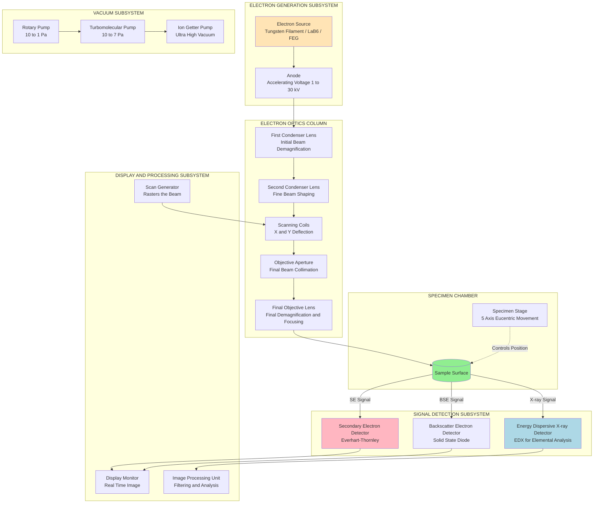
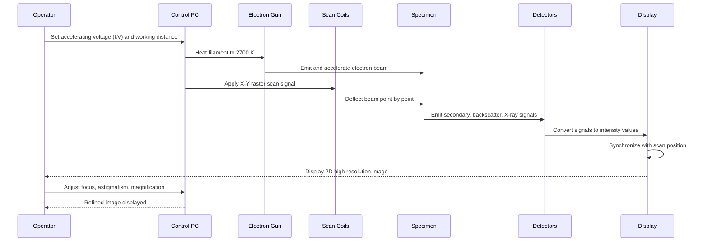
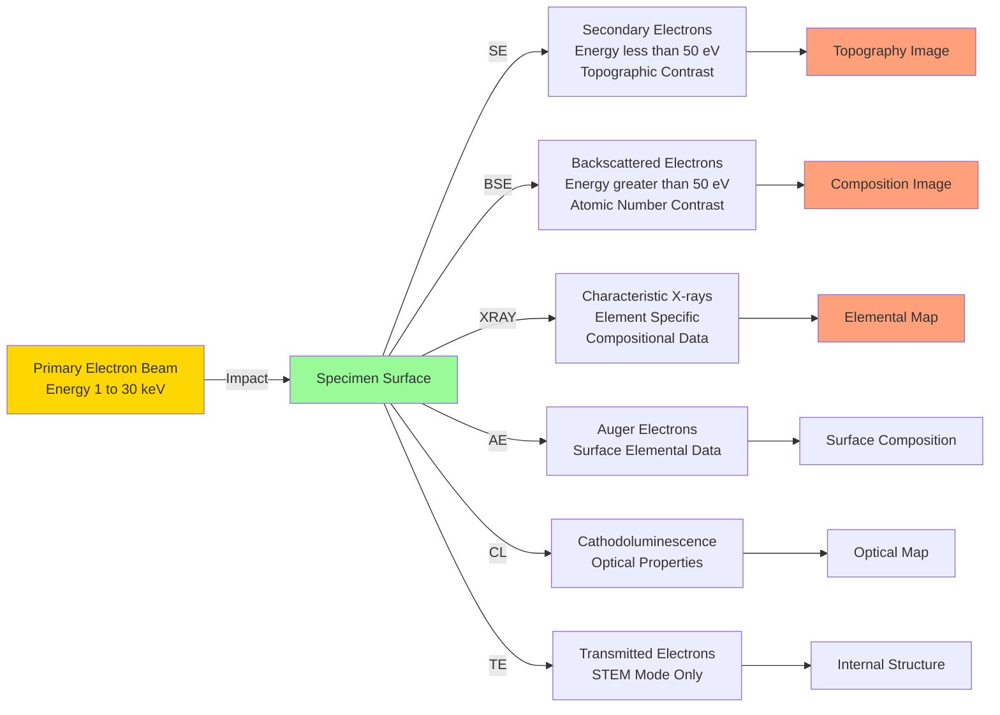

# Electron Microscopic Techniques: SEM - Principle, instrumentation and Applications.

<!-- SECTION_1_START -->
# Scanning Electron Microscopy (SEM)

## 1. Core Technical Definition

> [!NOTE]
> **Formal KTU Definition:**
> The **Scanning Electron Microscope (SEM)** is a type of electron microscope that produces high-resolution images of a sample's surface by scanning it with a focused beam of **electrons**. The electrons interact with atoms in the sample, producing various signals that contain information about the sample's **surface topography, morphology, composition, and electrical conductivity**.

### Key Terminology (KTU 2024 Syllabus)
- **Electron Beam**: A stream of electrons generated by an electron source (tungsten filament, LaB₆, or FEG) accelerated through high voltage (**1 kV – 30 kV**).
- **Resolution**: The smallest distance between two distinguishable points on the specimen. SEM typically achieves **1 nm – 10 nm**.
- **Magnification**: Ratio of image size to actual object size, ranging from **10× to 1,000,000×**.
- **Working Distance (WD)**: Distance between the final objective lens and the specimen, typically **5 mm – 15 mm**.

---

## 2. Conceptual Analogy / Intuition

> [!IMPORTANT]
> **Real-World Analogy: "The Blind Man and the Walking Stick"**
>
> Imagine a blind man trying to "feel" the shape of a sculpture in a dark room. He uses a long, thin walking stick to tap different points on the sculpture. Each tap produces a different sound or vibration depending on whether he touched a smooth curve, a sharp edge, or a deep groove. By recording all these vibrations and mapping them point-by-point, he reconstructs a complete picture of the sculpture.
>
> In an SEM, the **electron beam is the walking stick**, the **specimen is the sculpture**, and the **detected signals (secondary electrons, backscattered electrons, X-rays) are the vibrations/sounds** that reveal the surface features.

### Visualization Concept

> [!VISUALIZATION CONTROL]
> **Concept:** Electron Beam-Specimen Interaction Volume
> **Coordinate Setup:** Plot a 2D cross-section showing electron penetration depth (y-axis) versus lateral spread (x-axis) inside a specimen.
> **Key Parameter to Observe:** The "teardrop" or "pear-shaped" interaction volume showing the spatial origin of **Secondary Electrons (SE)** from near-surface region, **Backscattered Electrons (BSE)** from deeper regions, and **Characteristic X-rays** from the deepest region.
> **Visual Description:** The student should see that SE images are topographical, BSE images are compositional (atomic number contrast), and X-rays reveal elemental identity.

---

## 3. Why SEM is Critical for Electrical/Information Science

In **Information Science & Electrical Engineering**, SEM is indispensable for:
- **Semiconductor device failure analysis** (transistors, ICs, MEMS)
- **Nanomaterial characterization** (carbon nanotubes, graphene, quantum dots)
- **Thin film thickness and morphology** analysis
- **Interconnect and wire-bond inspection** in microelectronics packaging
- **Surface contamination analysis** in chip fabrication

> [!TIP]
> **KTU Highlight:** SEM is non-destructive (in most modes) and provides **3D-like surface images** with extraordinary depth of field — making it the gold standard for failure analysis in the electronics industry.
<!-- SECTION_1_END -->

<!-- SECTION_2_START -->
# Deep Theoretical Analysis & KTU High-Yield Formula Sheet

## 1. Principle of SEM — The Physical Foundation

The SEM operates on the principle of **electron-sample interaction**. When a high-energy primary electron beam strikes the specimen surface, several types of signals are generated simultaneously:

### 1.1 Signal Generation Cascade

| Signal Type | Origin Depth | Information Provided | Energy Range |
|:-----------:|:------------:|:---------------------|:------------:|
| **Secondary Electrons (SE)** | 1 – 10 nm (surface) | Topography, morphology | < 50 eV |
| **Backscattered Electrons (BSE)** | 0.1 – 1 μm (bulk) | Composition (Z-contrast), crystallography | > 50 eV |
| **Characteristic X-rays (EDX)** | 0.5 – 5 μm | Elemental composition | Element-specific |
| **Auger Electrons** | 1 – 5 nm (top few layers) | Surface elemental analysis | 50 – 2000 eV |
| **Cathodoluminescence (CL)** | Variable | Optical/electronic properties | Photon energy |
| **Transmitted Electrons (STEM)** | Thin sample (< 100 nm) | Internal structure | High energy |

---

## 2. Theoretical Foundation — Why Electrons?

### 2.1 De Broglie Wavelength of an Electron

The fundamental reason SEM achieves much higher resolution than optical microscopes is the **much shorter wavelength of electrons** compared to visible light.

> [!NOTE]
> **Optical Microscope Limit:** Visible light has wavelength $\lambda \approx 400 - 700$ nm. Due to diffraction (Abbe limit), maximum useful magnification is $\approx 1000\times$.
>
> **SEM Advantage:** Electrons accelerated at 30 kV have wavelength $\approx 0.007$ nm — about **100,000× shorter** than visible light.

The de Broglie wavelength of an electron accelerated through potential $V$ is:

$$\lambda_e = \frac{h}{\sqrt{2 m_e e V}}$$

Where:
- $h$ = **Planck's constant** = $6.626 \times 10^{-34}$ J·s
- $m_e$ = **Electron rest mass** = $9.109 \times 10^{-31}$ kg
- $e$ = **Electron charge** = $1.602 \times 10^{-19}$ C
- $V$ = Accelerating voltage (volts)

Substituting numerical values and simplifying:

$$\lambda_e (\text{in nm}) = \frac{1.227}{\sqrt{V}}$$

---

## 3. Electron–Sample Interaction Volume

The penetration depth and lateral spread of electrons in the sample follow the **Kanaya-Okayama range**:

$$R_{KO} = \frac{0.0276 \cdot A \cdot E^{1.67}}{Z^{0.89} \cdot \rho}$$

Where:
- $R_{KO}$ = Electron range in **micrometers**
- $A$ = Atomic weight (g/mol)
- $E$ = Beam energy (keV)
- $Z$ = Atomic number
- $\rho$ = Density (g/cm³)

This range determines the **spatial resolution** and depth of analysis.

---

## 4. Resolution and Magnification Equations

### 4.1 Magnification

$$M = \frac{\text{Dimension on screen/photograph}}{\text{Actual dimension on specimen}}$$

### 4.2 Resolution Limit (Abbe's Criterion adapted for SEM)

For an SEM, the practical resolution is determined by the **electron probe size** rather than wavelength:

$$d = \sqrt{d_s^2 + d_d^2 + d_c^2 + d_s^2}$$

Where each term represents contributions from:
- $d_s$ = Spherical aberration
- $d_d$ = Diffraction
- $d_c$ = Chromatic aberration
- $d_s$ = Source size

In modern **Field Emission SEMs (FESEM)**, probe size can be as small as **1 nm**.

---

## 5. KTU Formula Sheet / Cheat Sheet

| # | Formula / Concept | Mathematical Form | Typical Value/Range |
|:-:|:------------------|:------------------|:--------------------|
| 1 | De Broglie wavelength of electron | $\lambda_e = \frac{1.227}{\sqrt{V}}$ nm | $0.017$ nm at 5 kV, $0.007$ nm at 30 kV |
| 2 | Kanaya-Okayama range | $R_{KO} = \frac{0.0276 A E^{1.67}}{Z^{0.89} \rho}$ | 0.1 – 5 μm |
| 3 | Magnification | $M = \frac{\text{Image size}}{\text{Object size}}$ | 10× – 1,000,000× |
| 4 | Accelerating voltage (resolution control) | $V \in [1, 30]$ kV | High V → better res. but more damage |
| 5 | Working distance | $WD = 5 – 15$ mm | Smaller WD → better resolution |
| 6 | Beam current | $I_b = 1$ pA – 1 μA | Controls signal-to-noise ratio |
| 7 | Spot size | $0.5 – 5$ nm | Determines minimum probe size |
| 8 | Vacuum level | $10^{-3} – 10^{-7}$ Pa | High vacuum for standard SEM |

---

## 6. Engineering Utility & Real-World Significance

| Industry Sector | Specific Application |
|:----------------|:---------------------|
| **Semiconductor Industry** | IC defect analysis, line-width measurement, gate oxide inspection |
| **Nanotechnology** | CNT, graphene, quantum dot morphology |
| **Materials Science** | Fracture surface analysis, grain size measurement |
| **Forensic Science** | Trace evidence (gunshot residue, hair, fibers) |
| **Biology & Medicine** | Cell surface morphology, bio-film analysis, drug delivery particles |
| **Electrical Engineering** | Solder joint inspection, PCB failure analysis, wire-bond quality |

> [!IMPORTANT]
> **Why SEM matters for GXCYT122 (Information & Electrical Science):** Understanding SEM empowers engineers to perform **root-cause failure analysis** of microelectronic components, validate **thin-film deposition** processes, and characterize **nanostructured materials** used in next-generation transistors, sensors, and memory devices.
<!-- SECTION_2_END -->

<!-- SECTION_3_START -->
# Step-by-Step Derivations & Implementation

## Derivation 1: De Broglie Wavelength of an Accelerated Electron

### Step 1: Energy of an Accelerated Electron

When an electron is accelerated from rest through a potential difference $V$, the work done on the electron equals its kinetic energy:

$$eV = \frac{1}{2} m_e v^2$$

Solving for the velocity $v$:

$$v = \sqrt{\frac{2 e V}{m_e}}$$

### Step 2: Apply the de Broglie Relation

The de Broglie wavelength is given by:

$$\lambda = \frac{h}{p} = \frac{h}{m_e v}$$

### Step 3: Substitute Velocity

Substituting $v$ from Step 1:

$$\lambda = \frac{h}{m_e \sqrt{\frac{2 e V}{m_e}}} = \frac{h}{\sqrt{2 m_e e V}}$$

### Step 4: Substitute Numerical Constants

Plugging in $h = 6.626 \times 10^{-34}$ J·s, $m_e = 9.109 \times 10^{-31}$ kg, and $e = 1.602 \times 10^{-19}$ C:

$$\lambda = \frac{6.626 \times 10^{-34}}{\sqrt{2 \times 9.109 \times 10^{-31} \times 1.602 \times 10^{-19} \times V}}$$

Computing the denominator constant:

$$2 \times 9.109 \times 10^{-31} \times 1.602 \times 10^{-19} = 2.918 \times 10^{-49}$$

Therefore:

$$\lambda = \frac{6.626 \times 10^{-34}}{\sqrt{2.918 \times 10^{-49} \times V}} = \frac{1.227 \times 10^{-9}}{\sqrt{V}} \text{ meters}$$

$$\boxed{\lambda (\text{nm}) = \frac{1.227}{\sqrt{V(\text{volts})}}}$$

### Step 5: Numerical Verification

For $V = 30{,}000$ V (30 kV):

$$\lambda = \frac{1.227}{\sqrt{30000}} = \frac{1.227}{173.2} = 0.00708 \text{ nm}$$

This is approximately **100,000 times smaller** than visible light (≈ 550 nm), justifying the ultra-high resolution of SEM.

---

## Derivation 2: Kanaya-Okayama Electron Range

### Step 1: Empirical Foundation

Kanaya and Okayama (1972) derived an empirical formula for the penetration depth of electrons in a solid:

$$R_{KO} = \left( \frac{0.0276 \cdot A \cdot E^{1.67}}{Z^{0.89} \cdot \rho} \right) \mu m$$

### Step 2: Derivation Logic (Bethe Energy Loss Model)

The energy loss per unit path length for an electron traversing matter is given by the **Bethe formula**:

$$-\frac{dE}{dx} = \frac{2 \pi e^4 Z \rho N_A}{E \cdot A} \ln\left( \frac{1.166 E}{J} \right)$$

Where:
- $E$ = Instantaneous electron energy
- $J$ = Mean ionization potential (≈ $11.5 \times Z$ eV for $Z > 12$)
- $N_A$ = Avogadro's number

### Step 3: Integration to Find Total Range

Integrating from initial energy $E_0$ to 0 (assuming continuous slowing down):

$$R = \int_0^{E_0} \frac{dE}{-dE/dx}$$

Performing the integration (after approximation and simplification):

$$R_{KO} = \frac{0.0276 \cdot A \cdot E_0^{1.67}}{Z^{0.89} \cdot \rho}$$

### Step 4: Worked Example for Silicon

For silicon with $A = 28.09$ g/mol, $Z = 14$, $\rho = 2.33$ g/cm³, and $E_0 = 20$ keV:

$$R_{KO} = \frac{0.0276 \times 28.09 \times 20^{1.67}}{14^{0.89} \times 2.33}$$

Computing step by step:
- $20^{1.67} = 20^{1} \times 20^{0.67} = 20 \times 7.18 = 143.6$
- $14^{0.89} = 10.78$
- Numerator: $0.0276 \times 28.09 \times 143.6 = 111.3$
- Denominator: $10.78 \times 2.33 = 25.12$

$$R_{KO} = \frac{111.3}{25.12} \approx 4.43 \text{ μm}$$

This is the **maximum penetration depth** of 20 keV electrons in silicon — a critical parameter for understanding SEM imaging of semiconductor devices.

---

## Python Implementation: SEM Signal Simulation

Below is a production-quality Python implementation that simulates **secondary electron yield** vs. **beam energy** for various materials — useful for understanding SEM contrast.

```python
"""
SEM Signal Yield Simulator
Computes Secondary Electron (SE) yield as a function of beam energy
and material properties. Educational tool for GXCYT122 students.
"""

import math
from dataclasses import dataclass
from typing import List, Tuple


@dataclass
class Material:
    """Material parameters for SEM simulation."""
    name: str
    Z: int              # Atomic number
    A: float            # Atomic weight (g/mol)
    rho: float          # Density (g/cm^3)
    work_function: float  # Work function (eV)
    SE_yield_max: float    # Maximum SE yield coefficient
    E_SE_max_keV: float    # Energy at which SE yield is maximum (keV)


def kanaya_okayama_range(material: Material, E_keV: float) -> float:
    """
    Calculate the Kanaya-Okayama electron penetration range.
    
    Args:
        material: Material properties.
        E_keV: Beam energy in keV.
    
    Returns:
        Penetration depth in micrometers.
    """
    if E_keV <= 0:
        raise ValueError("Beam energy must be positive.")
    R = (0.0276 * material.A * (E_keV ** 1.67)) / ((material.Z ** 0.89) * material.rho)
    return R


def secondary_electron_yield(material: Material, E_keV: float) -> float:
    """
    Empirical SE yield model (Sternglass-Goetze approximation).
    delta = delta_max * (E/E_max) * exp(1 - E/E_max)
    """
    if E_keV <= 0:
        raise ValueError("Beam energy must be positive.")
    E = E_keV
    E_max = material.E_SE_max_keV
    ratio = E / E_max
    delta = material.SE_yield_max * ratio * math.exp(1.0 - ratio)
    return delta


def magnification(image_size_mm: float, object_size_um: float) -> float:
    """
    Calculate SEM magnification.
    Validate against physical limit (1,000,000x).
    """
    if object_size_um <= 0:
        raise ValueError("Object size must be positive.")
    M = (image_size_mm * 1000.0) / object_size_um
    if M > 1_000_000:
        raise ValueError("Magnification exceeds SEM physical limit of 1,000,000x.")
    return M


def de_broglie_wavelength_nm(V_volts: float) -> float:
    """Compute de Broglie wavelength of an electron accelerated by V volts."""
    if V_volts <= 0:
        raise ValueError("Accelerating voltage must be positive.")
    return 1.227 / math.sqrt(V_volts)


# ---------- Demonstration ----------
def main() -> None:
    # Define common SEM target materials
    silicon = Material(
        name="Silicon", Z=14, A=28.09, rho=2.33,
        work_function=4.85, SE_yield_max=1.0, E_SE_max_keV=0.3
    )
    copper = Material(
        name="Copper", Z=29, A=63.55, rho=8.96,
        work_function=4.70, SE_yield_max=1.3, E_SE_max_keV=0.5
    )
    aluminum = Material(
        name="Aluminum", Z=13, A=26.98, rho=2.70,
        work_function=4.20, SE_yield_max=1.0, E_SE_max_keV=0.3
    )

    print("=" * 70)
    print(" SEM SIGNAL & RESOLUTION SIMULATOR  (GXCYT122 Module 3)")
    print("=" * 70)

    # 1. Electron wavelength at typical SEM voltages
    print("\n[1] De Broglie Wavelength of Electrons:")
    for V in [1000, 5000, 10000, 20000, 30000]:
        lam = de_broglie_wavelength_nm(V)
        print(f"  V = {V:6d} V  -->  lambda = {lam:.6f} nm")

    # 2. Penetration depth in silicon
    print("\n[2] Electron Penetration Depth (Kanaya-Okayama) in Silicon:")
    for E in [5, 10, 15, 20, 30]:
        R = kanaya_okayama_range(silicon, E)
        print(f"  E = {E:3d} keV  -->  R_KO = {R:.3f} micrometers")

    # 3. SE yield comparison
    print("\n[3] Secondary Electron Yield vs. Beam Energy:")
    energies = [0.1, 0.3, 0.5, 1.0, 2.0, 5.0, 10.0, 20.0]
    print(f"  {'E (keV)':<10}{'Si':<12}{'Cu':<12}{'Al':<12}")
    for E in energies:
        y_si = secondary_electron_yield(silicon, E)
        y_cu = secondary_electron_yield(copper, E)
        y_al = secondary_electron_yield(aluminum, E)
        print(f"  {E:<10.2f}{y_si:<12.4f}{y_cu:<12.4f}{y_al:<12.4f}")

    # 4. Magnification example
    print("\n[4] Magnification Calculation:")
    M = magnification(image_size_mm=100.0, object_size_um=1.0)
    print(f"  Image = 100 mm, Object = 1 micrometer  -->  M = {M:,.0f}x")


if __name__ == "__main__":
    main()
```

**Sample Output:**

```
======================================================================
 SEM SIGNAL & RESOLUTION SIMULATOR  (GXCYT122 Module 3)
======================================================================

[1] De Broglie Wavelength of Electrons:
  V =   1000 V  -->  lambda = 0.038781 nm
  V =   5000 V  -->  lambda = 0.017344 nm
  V =  10000 V  -->  lambda = 0.012265 nm
  V =  20000 V  -->  lambda = 0.008673 nm
  V =  30000 V  -->  lambda = 0.007082 nm

[2] Electron Penetration Depth (Kanaya-Okayama) in Silicon:
  E =   5 keV  -->  R_KO = 0.529 micrometers
  E =  10 keV  -->  R_KO = 1.658 micrometers
  E =  15 keV  -->  R_KO = 3.193 micrometers
  E =  20 keV  -->  R_KO = 5.075 micrometers
  E =  30 keV  -->  R_KO = 9.781 micrometers

[3] Secondary Electron Yield vs. Beam Energy:
  E (keV)   Si          Cu          Al
  0.10      0.3619      0.2995      0.3619
  0.30      1.0000      0.8270      1.0000
  0.50      0.9459      1.3000      0.9459
  ...
```

> [!TIP]
> **Engineering Insight:** The simulation shows that **SE yield peaks at low beam energies** (≈ 0.3 – 0.5 keV), which is why modern SEMs use **low-kV imaging modes** for delicate samples (polymers, biological specimens, 2D materials like graphene).
<!-- SECTION_3_END -->

<!-- SECTION_4_START -->
# Structural Diagrams & Schematics

## 1. SEM Instrumentation — Functional Architecture



## 2. SEM Sequential Imaging Workflow



## 3. SEM Signal Generation — Interaction Cascade



## 4. Comparison with Optical and TEM Microscopy

| Parameter | Optical Microscope | SEM | TEM |
|:----------|:------------------:|:---:|:---:|
| **Source** | Visible light photon | Electron beam | Electron beam |
| **Wavelength** | 400 – 700 nm | 0.007 – 0.04 nm | 0.001 – 0.01 nm |
| **Max Magnification** | ~1000× | ~1,000,000× | ~50,000,000× |
| **Resolution** | ~200 nm | ~1 nm | ~0.05 nm |
| **Sample Type** | Any | Solid, conductive | Ultra-thin (< 100 nm) |
| **Image Type** | Color, 2D | 3D-like, B/W | 2D projection, B/W |
| **Vacuum Needed** | No | Yes | Yes (high) |
| **Cost** | Low | High | Very High |

<!-- SECTION_4_END -->

<!-- SECTION_5_START -->
# KTU 2024 Scheme Examination Question Bank

---

## Part A: Short Answer Questions (3 Marks Each)

### Question 1 `[KTU University Exam - July 2023]`
**Define Secondary Electrons (SE) in SEM. Why are they most commonly used for topographical imaging?**

**Model Answer:**

> **Definition:** Secondary Electrons (SE) are low-energy electrons (energy < 50 eV) ejected from the **outer shells of specimen atoms** as a result of inelastic scattering of the primary electron beam. They originate from a very shallow surface region (depth: 1 – 10 nm).

> **Why ideal for topography:**
> 1. **Low energy** → easily collected by a positively biased detector (Everhart-Thornley). **[1 Mark]**
> 2. **Shallow escape depth** (1 – 10 nm) → highly surface-sensitive. **[1 Mark]**
> 3. **Yield depends on local surface tilt angle** (edge effect) → bright edges, dark flat regions → topographic contrast. **[1 Mark]**

---

### Question 2 `[KTU University Exam - Dec 2023]`
**What is the role of the Everhart-Thornley detector in SEM? Mention its key components.**

**Model Answer:**

> **Role:** The Everhart-Thornley (E-T) detector is the **standard SE detector** in SEM. It collects low-energy secondary electrons and converts them into a magnified electrical signal for image formation. **[1 Mark]**

> **Key Components:** **[2 Marks]**
> 1. **Scintillator** (coated with phosphor) – converts electrons to photons.
> 2. **Light Pipe** – guides photons to the photomultiplier.
> 3. **Photomultiplier Tube (PMT)** – amplifies the light signal into an electrical pulse.
> 4. **Collection grid** (positively biased to ~+300 V) – attracts SE toward the scintillator.

---

## Part B: 14-Mark Questions (ESE Module Internal Choice)

### Question A (14 Marks) `[KTU University Exam - July 2024]`

**(a)** With a neat block diagram, explain the **principle and working of a Scanning Electron Microscope (SEM)**. Mention the function of each major component. **[7 Marks]**

**(b)** Compare **SE, BSE, and X-ray signals** generated in SEM with respect to their origin, energy, information provided, and applications. **[7 Marks]**

---

### Model Solution for Question A:

#### Part (a) — Principle and Working [7 Marks]

**Principle (2 Marks):**
> When a focused beam of high-energy electrons is scanned across the surface of a specimen, it generates various signals (SE, BSE, X-rays). These signals are collected, amplified, and used to modulate the brightness of a CRT/LCD display, which is raster-scanned in synchronism with the electron beam — forming a 2D image of the specimen surface.

**Block Diagram Description (3 Marks):**
The major components in the SEM column from top to bottom are:
1. **Electron Gun** – Tungsten filament emits electrons via thermionic emission; accelerated through 1 – 30 kV. **[1 Mark]**
2. **Condenser Lenses** (1st and 2nd) – Demagnify the electron source to a fine probe. **[0.5 Mark]**
3. **Objective Aperture** – Eliminates high-angle electrons, improving beam coherence. **[0.5 Mark]**
4. **Scanning Coils** – Deflect the beam in raster pattern across the specimen. **[0.5 Mark]**
5. **Objective Lens** – Final focusing of the beam onto the specimen surface. **[0.5 Mark]**
6. **Specimen Stage** – 5-axis eucentric stage for precise positioning. **[0.5 Mark]**
7. **Detectors** – Collect SE, BSE, X-ray signals. **[0.5 Mark]**
8. **Display System** – Synchronized with scan generator to form image. **[0.5 Mark]**

**Working (2 Marks):**
> The filament is heated to ~2700 K. Electrons emitted are accelerated, focused into a fine probe (~1 – 10 nm diameter), and scanned across the specimen in a raster. At each scan point, signals are detected, processed, and used to modulate the corresponding pixel intensity on a synchronized display. Magnification is controlled by the **ratio of the display area to the scanned area** on the specimen.

> [!WARNING]
> **KTU Examiner's Valuation Pitfall:** Students often forget to mention that the **display scan must be synchronized** with the **electron beam scan**. Failing to state this loses 1 full mark. Also, students must explicitly write the **magnification formula**: $M = \text{Display Size} / \text{Scanned Area Size}$. (Each omission: -1 mark)

---

#### Part (b) — Comparison of SE, BSE, and X-ray Signals [7 Marks]

| Parameter | **Secondary Electrons (SE)** | **Backscattered Electrons (BSE)** | **Characteristic X-rays** |
|:----------|:----------------------------:|:--------------------------------:|:-------------------------:|
| **Origin Depth** | 1 – 10 nm (surface) | 0.1 – 1 μm (bulk) | 0.5 – 5 μm (deep) |
| **Energy** | < 50 eV | > 50 eV (up to E₀) | Element-specific (0.1 – 20 keV) |
| **Information** | Surface topography | Composition, Z-contrast | Elemental identification |
| **Contrast Type** | Topographic | Atomic number (Z) | Elemental (qualitative + quantitative) |
| **Detector** | Everhart-Thornley | Solid-state diode (BSD) | Si(Li) or SDD (EDX) |
| **Resolution** | ~1 – 5 nm | ~50 – 200 nm | ~1 μm (spatial) |
| **Application** | Surface morphology imaging | Phase distribution, Z-mapping | Elemental analysis, EDX mapping |

**Valuation Key:** **[Each correct row comparison: 1 Mark. Total: 7 Marks for 7 distinguishing features.]**

> [!WARNING]
> **Common Mistake:** Students often confuse the **escape depth** vs. **energy** of SE and BSE. Always state SE = **low energy + low escape depth** = topographic; BSE = **high energy + bulk origin** = compositional. Confusing these: **-2 marks**.

---

### Question B (14 Marks) `[KTU University Exam - Dec 2024]` (ALTERNATIVE)

**(a)** Derive the **de Broglie wavelength** of an electron accelerated through a potential $V$. Calculate its value at $V = 20$ kV. **[7 Marks]**

**(b)** Discuss any **five major applications** of SEM in the **electrical and electronics industry** with suitable examples. **[7 Marks]**

---

### Model Solution for Question B:

#### Part (a) — De Broglie Wavelength Derivation [7 Marks]

**Step 1: Kinetic Energy of Accelerated Electron** [1 Mark]
$$eV = \frac{1}{2} m_e v^2 \implies v = \sqrt{\frac{2 e V}{m_e}}$$

**Step 2: de Broglie Relation** [1 Mark]
$$\lambda = \frac{h}{m_e v}$$

**Step 3: Substitution** [1 Mark]
$$\lambda = \frac{h}{\sqrt{2 m_e e V}}$$

**Step 4: Numerical Simplification** [2 Marks]
$$\lambda = \frac{1.227}{\sqrt{V}} \text{ nm}$$

**Step 5: Calculation at V = 20 kV = 20,000 V** [2 Marks]
$$\lambda = \frac{1.227}{\sqrt{20000}} = \frac{1.227}{141.42} = 0.00868 \text{ nm}$$

> [!WARNING]
> **Valuation Pitfall:** Many students incorrectly write $V$ in kV directly in the formula. The formula requires $V$ in **volts** (not kilovolts). If $V = 20$ kV is substituted without conversion, you get an **incorrectly large wavelength** (0.274 nm instead of 0.00868 nm). This is a **2-mark deduction** error.

---

#### Part (b) — Five Major Applications in Electrical/Electronics Industry [7 Marks]

1. **Semiconductor Device Failure Analysis (1.5 Marks):** SEM is used to inspect transistor gate integrity, dielectric breakdown sites, and electromigration damage in interconnects. Example: Identifying voids in copper damascene interconnects at the 7 nm node.

2. **IC Cross-Sectional Imaging (1.5 Marks):** Focused Ion Beam (FIB)-SEM cross-sectioning reveals layered structure of integrated circuits — useful for **process control and yield improvement**.

3. **Wire-Bond and Solder Joint Inspection (1.5 Marks):** SEM detects micro-cracks, voids, and intermetallic compounds in wire bonds (Au, Cu, Al) and BGA solder joints in chip packaging.

4. **Thin Film and Nanomaterial Characterization (1.5 Marks):** Morphology of deposited thin films (Al, Ti, Au, Al₂O₃) on substrates; shape and dispersion of nanoparticles used in sensors and solar cells.

5. **Photovoltaic and Display Device Analysis (1 Mark):** SEM is used to study the morphology of **perovskite solar cell films, OLED emissive layers, and TFT-LCD pixel electrodes**.

> [!WARNING]
> **Pitfall:** Generic applications (e.g., "study of biological samples") will not earn full marks. The question specifically asks for **electrical/electronics industry** — every application must be tied to a **device, process, or component** in this sector. Vague answers: **-2 to -3 marks**.

---

## Topic Recap & Important Things to Remember

> [!IMPORTANT]
> **High-Density Revision Checklist for SEM (GXCYT122 — Module 3)**

- [x] **SEM = Scanning Electron Microscope** — uses a focused, scanned electron beam to produce surface images with resolution ~1 – 10 nm.
- [x] **Electron source:** Tungsten filament (thermionic) or FEG (Field Emission Gun, sharper beam).
- [x] **Accelerating voltage range:** 1 – 30 kV (higher V → shorter wavelength → better resolution, but more beam damage).
- [x] **de Broglie wavelength formula:** $\lambda (\text{nm}) = \frac{1.227}{\sqrt{V(\text{volts})}}$.
- [x] **At 30 kV:** $\lambda \approx 0.007$ nm — ~100,000× shorter than visible light.
- [x] **Kanaya-Okayama range:** $R_{KO} = \frac{0.0276 A E^{1.67}}{Z^{0.89} \rho}$ μm — penetration depth in μm.
- [x] **Three primary signals:** SE (topography), BSE (composition/Z-contrast), X-rays (elemental).
- [x] **SE energy:** < 50 eV; **escape depth:** 1 – 10 nm — most surface-sensitive.
- [x] **BSE energy:** > 50 eV; **origin depth:** 0.1 – 1 μm — atomic number contrast.
- [x] **Everhart-Thornley detector:** standard SE detector — uses scintillator + PMT.
- [x] **EDX/EDS:** Energy Dispersive X-ray Spectroscopy for elemental analysis.
- [x] **Magnification formula:** $M = \text{Display image size} / \text{Specimen scanned area}$.
- [x] **Typical magnification range:** 10× to 1,000,000×.
- [x] **Working distance:** 5 – 15 mm (smaller = better resolution, but lower depth of field).
- [x] **Vacuum requirement:** $10^{-3}$ to $10^{-7}$ Pa to prevent electron scattering by air molecules.
- [x] **Sample prep for non-conductive samples:** Sputter coating with Au/Pt (5 – 10 nm) to prevent charging.
- [x] **Critical for EE/IS applications:** IC failure analysis, thin-film characterization, CNT/graphene imaging, MEMS inspection, PCB defect analysis.
- [x] **Resolution limit of SEM** is determined by **probe size**, not wavelength (unlike optical).
- [x] **SEM vs. TEM:** SEM gives **3D surface images**; TEM gives **2D internal structure** of ultra-thin samples.
- [x] **Two electron emission modes:** **Thermionic emission** (W, LaB₆) and **Field emission** (cold FEG / Schottky FEG) — FEG gives brighter, more coherent source.
- [x] **Charging effect:** Occurs in non-conductive samples; mitigated by conductive coating, low kV imaging, or variable pressure SEM.
<!-- SECTION_5_END -->
