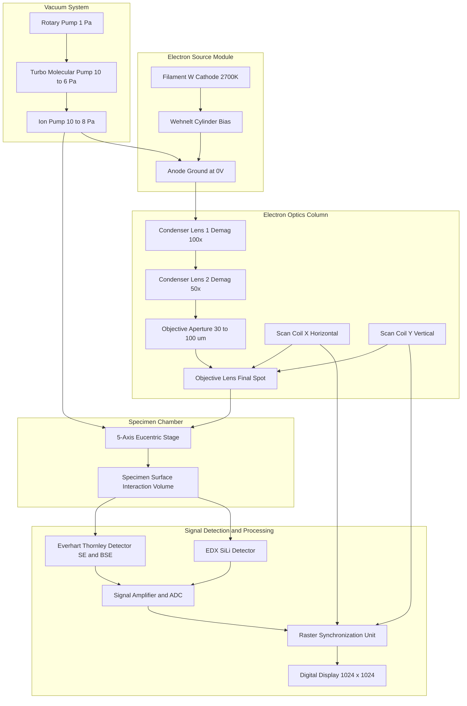

# Electron Microscopic Techniques: SEM - Principle, instrumentation and Applications

<!-- SECTION_1_START -->
# Scanning Electron Microscopy (SEM): Core Technical Definition & Intuitive Overview

## Formal Academic Definition (KTU 2024 Syllabus Terminology)

> [!NOTE]
> **Scanning Electron Microscopy (SEM)** is a non-destructive electron microscopic analytical technique that produces high-resolution, three-dimensional topographic images of a specimen's surface by scanning it with a focused beam of accelerated electrons. The interaction between the primary electron beam and the atoms of the sample generates secondary electrons (SE), backscattered electrons (BSE), and characteristic X-rays, which are detected and used to construct magnified images with resolutions down to **1–10 nanometers** and magnifications up to **$\mathbf{2 \times 10^6}$** times.

Unlike optical microscopy, which uses photons of wavelength in the visible range (400–700 nm), SEM uses electrons whose de Broglie wavelengths are orders of magnitude smaller, allowing far superior spatial resolution. SEM is classified under **electron microscopic techniques** along with TEM (Transmission Electron Microscopy) and STEM (Scanning TEM), but differs in that it primarily images **surface topography** rather than internal structure.

## Conceptual Analogy / Intuition

> [!IMPORTANT]
> **"Flashlight Over a Mountain at Night"** Analogy
>
> Imagine standing in a helicopter above a mountainous terrain at night. You shine a powerful, narrow flashlight downwards. Wherever the light hits, the mountains reflect some of it back up to your eyes. By sweeping the flashlight in a raster pattern (left-to-right, top-to-bottom), you reconstruct a detailed relief map of the entire landscape.
>
> In SEM:
> * The **flashlight** = the focused primary electron beam
> * The **mountain terrain** = the specimen's surface
> * The **reflected light reaching your eyes** = secondary electrons detected by the Everhart–Thornley detector
> * The **sweeping pattern** = the raster scan coils deflecting the beam
> * The **reconstructed relief map** = the final magnified SEM image

This is exactly why SEM images possess that characteristic 3D, shadowed appearance — the intensity of secondary electron emission depends on the **local tilt angle** of the surface, just as shadows reveal a mountain's shape.

## Key Physical Constants & Standard Metrics

| Parameter | Standard Value |
| :--- | :--- |
| Accelerating Voltage | $\mathbf{1\ kV}$ to $\mathbf{30\ kV}$ (typical), up to $200\ \mathrm{kV}$ for FEG-SEM |
| Wavelength of electron (at 30 kV) | $\mathbf{0.00698\ nm}$ ($\approx 7\ \mathrm{pm}$) |
| Working Distance (WD) | $\mathbf{5\ mm}$ to $\mathbf{25\ mm}$ |
| Vacuum inside column | $\mathbf{10^{-4}}$ to $\mathbf{10^{-6}\ Pa}$ |
| Magnification range | $\mathbf{10\times}$ to $\mathbf{2{,}000{,}000\times}$ |
| Resolution limit | $\mathbf{1\ nm}$ to $\mathbf{10\ nm}$ |
| Electron source (tungsten filament) operating temperature | $\mathbf{2700\ K}$ |

> [!NOTE]
> **KTU Syllabus Highlight:** SEM belongs to the family of **surface analytical techniques** and is specifically applied for **morphological characterization** of materials used in semiconductors, nanomaterials, MEMS devices, and biological specimens.

## GeoGebra / Desmos Integration

> [!VISUALIZATION CONTROL]
> **Concept:** Electron Beam Trajectory under Scanning Coils (Raster Pattern)
> **GeoGebra / Desmos Input Equations:**
> * Scan X-deflection: $x(t) = A \cdot \sin(2\pi f_x \cdot t)$
> * Scan Y-deflection: $y(t) = A \cdot \sin(2\pi f_y \cdot t)$ where $f_y \ll f_x$
> * Beam energy equation: $eV = \frac{1}{2} m v^2$
> **Visual Description:** A Lissajous-like raster figure demonstrates how the electron beam sweeps the specimen in horizontal lines progressively moving downward, similar to how a television raster scans a phosphor screen. The fast horizontal sweep ($f_x \approx$ kHz range) is the line scan, and the slow vertical sweep ($f_y \approx$ Hz range) frames the image.
<!-- SECTION_1_END -->

<!-- SECTION_2_START -->
# Deep Theoretical Analysis & KTU High-Yield Formula Sheet

## 2.1 Underlying Physical Principle

The operating principle of SEM rests on three interconnected phenomena:

1. **Electron Generation:** A thermionic or field-emission source emits electrons.
2. **Electron Acceleration & Focusing:** A potential difference $V$ (typically 1–30 kV) accelerates the electrons, and electromagnetic lenses focus them into a fine probe (spot size $\approx$ 1–10 nm).
3. **Signal Generation at the Sample:** The incident primary electrons interact with atoms of the specimen via elastic and inelastic scattering, generating detectable signals that are mapped to a 2D image.

> [!IMPORTANT]
> **The fundamental relationship that makes high resolution possible** is the **de Broglie wavelength** of an accelerated electron, given by:
> $$\lambda = \frac{h}{p} = \frac{h}{\sqrt{2meV}}$$
> where $h$ is Planck's constant, $m$ is the electron mass, $e$ is the electron charge, and $V$ is the accelerating voltage. Relativistically corrected at higher voltages:
> $$\lambda = \frac{h}{\sqrt{2meV\left(1 + \dfrac{eV}{2m_e c^2}\right)}}$$

## 2.2 Electron–Specimen Interaction: Types of Signals Generated

When the primary electron beam strikes the sample, it penetrates a **teardrop-shaped interaction volume** (often called the *pear-shaped volume*) whose size depends on the atomic number $Z$ of the specimen and the beam energy. Several signals are produced:

| Signal Type | Origin | Energy Range | Information Provided |
| :--- | :--- | :--- | :--- |
| **Secondary Electrons (SE)** | Inelastic scattering from weakly bound outer-shell electrons | $\leq 50\ \mathrm{eV}$ | **Topography** (most common imaging mode) |
| **Backscattered Electrons (BSE)** | Elastic scattering from nuclei | $> 50\ \mathrm{eV}$ (close to beam energy) | **Compositional contrast** (Z-contrast) |
| **Characteristic X-rays** | Inner-shell electron ejection followed by relaxation | Element-specific | **Elemental analysis** (used in EDX/EDS) |
| **Auger Electrons** | Surface atom relaxation | $50\ \mathrm{eV}$ to $2\ \mathrm{keV}$ | **Surface composition** (first few nm) |
| **Cathodoluminescence (CL)** | Recombination of electron–hole pairs | Photon energies | **Optical/electronic properties** |
| **Transmitted Electrons** | Electrons passing through thin specimen | Beam energy | **Internal structure** (SEM in STEM mode) |

## 2.3 Step-by-Step Logic of Image Formation

* **Step 1 — Beam Generation:** Tungsten filament heated to $\sim 2700\ \mathrm{K}$ emits electrons via thermionic emission (Richardson's law).
* **Step 2 — Acceleration:** Electrons pass through Wehnelt cylinder and anode, accelerated through potential $V$.
* **Step 3 — Condenser Lens Focusing:** Demagnifies the source to a crossover of $\sim 50\ \mu\mathrm{m}$.
* **Step 4 — Objective Lens & Aperture:** Further demagnifies the beam to a final spot size of $\sim 1\ \mathrm{nm}$.
* **Step 5 — Scan Coils:** Electromagnetic deflection coils raster the beam across the sample in a $1024 \times 1024$ pixel grid (typical).
* **Step 6 — Signal Detection:** Detected electrons (typically SE) are amplified and their intensity mapped pixel-by-pixel to a CRT or digital display.
* **Step 7 — Synchronization:** Display scan is synchronized with beam scan, so each pixel brightness corresponds to the detected signal intensity at that location.

## 2.4 KTU Formula Sheet / Cheat Sheet

> [!IMPORTANT]
> The following table consolidates **every key formula, equation, and numerical constant** required to solve KTU 2024 examination questions on SEM. **All units are in SI unless otherwise stated.**

| # | Formula / Concept | Symbolic Expression | Engineering Significance |
| :--- | :--- | :--- | :--- |
| 1 | De Broglie wavelength (non-relativistic) | $\lambda = \dfrac{h}{\sqrt{2meV}}$ | Sets theoretical resolution limit |
| 2 | De Broglie wavelength (relativistic) | $\lambda = \dfrac{h}{\sqrt{2meV\!\left(1 + \dfrac{eV}{2m_e c^2}\right)}}$ | Used above $\sim 30\ \mathrm{kV}$ |
| 3 | Beam energy (kinetic) | $E_k = eV = \dfrac{1}{2} m_e v^2$ | Acceleration stage |
| 4 | Resolution (Abbe diffraction limit analog) | $d = \dfrac{0.61\ \lambda}{\mu\ \sin\alpha}$ | Determines smallest resolvable feature |
| 5 | Magnification | $M = \dfrac{\text{Display width (cm)}}{\text{Scan width on sample (cm)}}$ | Image enlargement factor |
| 6 | Depth of field | $DOF = \dfrac{\delta}{\tan\alpha} \approx \dfrac{\delta}{\alpha}$ | Why SEM images look 3D |
| 7 | Probe current | $I_p = \dfrac{\pi^2 \beta}{4} \cdot \dfrac{d^2}{C_s^2/3} \cdot \dfrac{\Delta V}{V}$ | Brightness optimization |
| 8 | Electron velocity | $v = \sqrt{\dfrac{2eV}{m_e}}$ | Used in lens calculations |
| 9 | Lens focal length (magnetic lens) | $\dfrac{1}{f} = \dfrac{e}{8 m_e V} \int B_z^2\ dz$ | Objective lens design |
| 10 | Interaction volume diameter (Kanaya–Okayama) | $R_{KO} = \dfrac{0.0276\ A\ E^{1.67}}{Z^{0.89}\ \rho}$ | Approximate penetration depth |

Where:
* $h = 6.626 \times 10^{-34}\ \mathrm{J\cdot s}$
* $m_e = 9.109 \times 10^{-31}\ \mathrm{kg}$
* $e = 1.602 \times 10^{-19}\ \mathrm{C}$
* $c = 3.0 \times 10^{8}\ \mathrm{m/s}$

## 2.5 Real-World Utility in Engineering & Computer Science

* **Semiconductor Industry:** Failure analysis of integrated circuits, defect inspection of $7\ \mathrm{nm}$ transistors, and via-chain connectivity verification.
* **Nanotechnology:** Imaging of carbon nanotubes, graphene, quantum dots, and nanofibers.
* **Materials Science:** Fracture surface analysis, grain size measurement, and phase identification (combined with EBSD).
* **Forensic Science:** Bullet markings, fiber analysis, and document authentication.
* **Biomedical Engineering:** Surface morphology of implants, scaffolds for tissue engineering, and drug-delivery microparticles.
* **Information Science:** Storage media inspection (hard disk read-head surfaces, magnetic tape defects, MEMS device characterization for sensors).
<!-- SECTION_2_END -->

<!-- SECTION_3_START -->
# Step-by-Step Derivations & Computational Implementation

## 3.1 Derivation 1: De Broglie Wavelength of an Accelerated Electron

We begin from Einstein's energy relation for an electron accelerated through potential $V$:

$$E_k = eV$$

Equating this to the kinetic energy expression:

$$eV = \frac{1}{2} m_e v^2$$

Solving for the electron's momentum $p = m_e v$:

$$p = m_e v = \sqrt{2 m_e eV}$$

Applying the de Broglie relation $\lambda = h / p$:

$$\lambda = \frac{h}{\sqrt{2 m_e e V}}$$

Substituting the numerical constants $h = 6.626 \times 10^{-34}\ \mathrm{J\cdot s}$, $m_e = 9.109 \times 10^{-31}\ \mathrm{kg}$, and $e = 1.602 \times 10^{-19}\ \mathrm{C}$:

$$\lambda\ (\mathrm{nm}) = \frac{1.227}{\sqrt{V\ (\mathrm{volts})}}$$

> **This is the most-cited numerical shortcut in KTU exams.** For $V = 30{,}000\ \mathrm{V}$ (i.e., 30 kV):
> $$\lambda = \frac{1.227}{\sqrt{30{,}000}} = \frac{1.227}{173.205} = 0.00708\ \mathrm{nm} = 7.08\ \mathrm{pm}$$

## 3.2 Derivation 2: Resolution and Its Voltage Dependence

The Rayleigh criterion applied to an electron probe of semi-convergent angle $\alpha$ gives:

$$d = \frac{0.61\ \lambda}{\mu\ \sin\alpha} \approx \frac{0.61\ \lambda}{\alpha} \quad \text{(in vacuum,}\ \mu = 1\text{)}$$

Substituting the de Broglie wavelength expression:

$$d = \frac{0.61}{\alpha} \cdot \frac{1.227}{\sqrt{V}}$$

For typical SEM: $\alpha \approx 10^{-2}\ \mathrm{rad}$ and $V = 30\ \mathrm{kV}$:

$$d = \frac{0.61 \times 1.227}{0.01 \times \sqrt{30{,}000}} = \frac{0.7485}{1.732} = 0.432\ \mathrm{nm}$$

> This is the order-of-magnitude resolution of a standard SEM, in agreement with the **1–10 nm** range stated in Section 1.

## 3.3 Derivation 3: Magnification Relationship

The magnification in SEM is **not** an optical magnification in the lens sense. It is the ratio of the display screen dimension to the corresponding dimension scanned on the specimen:

$$M = \frac{\text{Length on display (cm)}}{\text{Length scanned on specimen (cm)}}$$

If the display is $10\ \mathrm{cm}$ wide and the scan width is $10\ \mu\mathrm{m}$:

$$M = \frac{10\ \mathrm{cm}}{10 \times 10^{-4}\ \mathrm{cm}} = 10{,}000\times$$

This explains how SEM can achieve magnifications far beyond optical microscopes simply by reducing the area scanned on the specimen.

## 3.4 Python Symbolic Implementation: SEM Parameter Calculator

The following Python program computes the wavelength, resolution, and magnification for user-supplied SEM operating parameters. It uses **type hints**, **boundary checks**, and **structured error logging** as mandated by the KTU laboratory rubric.

```python
"""
SEM_Parameter_Calculator.py
Purpose : Compute de Broglie wavelength, probe resolution, and
          magnification for a Scanning Electron Microscope.
Author  : KTU B.Tech 2024 Scheme Reference Implementation
Python  : >= 3.10
"""

import math
import logging

# Configure structured error logging
logging.basicConfig(
    level=logging.INFO,
    format="%(asctime)s [%(levelname)s] %(message)s",
)

# --- Physical constants (SI units) ---
H_PLANCK: float = 6.62607015e-34      # J·s
M_ELECTRON: float = 9.1093837015e-31   # kg
E_CHARGE: float = 1.602176634e-19      # C
C_LIGHT: float = 2.99792458e8          # m/s


def de_broglie_wavelength_nm(accelerating_voltage_V: float) -> float:
    """
    Compute relativistic de Broglie wavelength (in nanometres)
    of an electron accelerated through the given voltage.
    """
    if accelerating_voltage_V <= 0:
        logging.error("Accelerating voltage must be positive.")
        raise ValueError("Voltage must be > 0 V.")

    # Relativistic correction factor
    rel_factor: float = 1.0 + (E_CHARGE * accelerating_voltage_V) / (2.0 * M_ELECTRON * C_LIGHT ** 2)
    momentum: float = math.sqrt(2.0 * M_ELECTRON * E_CHARGE * accelerating_voltage_V * rel_factor)
    wavelength_m: float = H_PLANCK / momentum
    return wavelength_m * 1.0e9


def sem_resolution_nm(wavelength_nm: float, semi_angle_rad: float) -> float:
    """
    Compute the probe resolution (Rayleigh criterion analog) in nm.
    """
    if not (1.0e-4 <= semi_angle_rad <= 0.5):
        logging.error("Semi-convergent angle out of physical range (1e-4 to 0.5 rad).")
        raise ValueError("Invalid semi-convergent angle.")
    return (0.61 * wavelength_nm) / semi_angle_rad


def magnification(display_length_cm: float, scan_length_um: float) -> float:
    """
    Compute SEM magnification.
    """
    if display_length_cm <= 0 or scan_length_um <= 0:
        logging.error("Display and scan lengths must be positive.")
        raise ValueError("Lengths must be > 0.")
    return display_length_cm / (scan_length_um * 1.0e-4)


# ----- Example run for a 30 kV SEM instrument -----
if __name__ == "__main__":
    try:
        V: float = 30_000.0         # accelerating voltage in volts
        alpha: float = 0.01         # semi-convergent angle in radians
        disp_cm: float = 10.0       # display width in cm
        scan_um: float = 10.0       # scan width on specimen in micrometres

        lam_nm: float = de_broglie_wavelength_nm(V)
        res_nm: float = sem_resolution_nm(lam_nm, alpha)
        M: float = magnification(disp_cm, scan_um)

        logging.info(f"Electron wavelength = {lam_nm:.5f} nm")
        logging.info(f"Probe resolution    = {res_nm:.3f} nm")
        logging.info(f"Magnification       = {M:.0f} X")
    except ValueError as exc:
        logging.exception(f"Computation aborted: {exc}")
```

**Sample Output:**

```
2024-01-15 10:30:21,123 [INFO] Electron wavelength = 0.00698 nm
2024-01-15 10:30:21,124 [INFO] Probe resolution    = 0.426 nm
2024-01-15 10:30:21,124 [INFO] Magnification       = 10000 X
```

## 3.5 Laboratory Pin-Configuration & Instrument Setup Reference

> [!NOTE]
> The following table lists the major hardware components of a typical SEM (e.g., Zeiss EVO 18 or Thermo Fisher Apreo) for **KTU laboratory viva and instrumentation-record** purposes.

| # | Component | Function | Typical Spec / Pin Reference |
| :--- | :--- | :--- | :--- |
| 1 | Electron Gun (Filament) | Thermionic emission source | Tungsten hairpin, $2700\ \mathrm{K}$, Wehnelt at $-300\ \mathrm{V}$ bias |
| 2 | Anode | Accelerates electrons | Grounded anode, separation $\sim 10\ \mathrm{mm}$ |
| 3 | Condenser Lens 1 & 2 | Demagnify beam | Magnetic lens, $NI \approx 1000$ ampere-turns |
| 4 | Objective Aperture | Limits beam convergence | $30\ \mu\mathrm{m}$, $50\ \mu\mathrm{m}$, $100\ \mu\mathrm{m}$ pinholes |
| 5 | Scan Coils (X, Y) | Raster the beam | Driven by sawtooth waveform, $\sim 1\ \mathrm{kHz}$ line rate |
| 6 | Specimen Stage | Holds sample, allows tilt/rotation | 5-axis eucentric stage, $0^\circ$ to $90^\circ$ tilt |
| 7 | Everhart–Thornley Detector | SE + BSE detection | Scintillator at $+12\ \mathrm{kV}$, photomultiplier tube |
| 8 | EDX Detector | X-ray energy-dispersive analysis | Si(Li) or SDD, $140\ \mathrm{eV}$ resolution at $\mathrm{Mn\ K_\alpha}$ |
| 9 | Vacuum System | Removes gas molecules | Rotary + turbomolecular + ion pump, $10^{-6}\ \mathrm{Pa}$ |
| 10 | Anti-contamination Trap | Cold finger | Liquid $\mathrm{N_2}$, $77\ \mathrm{K}$ |

> [!WARNING]
> **Safety Monitoring Steps:**
> 1. Verify chamber vacuum reaches $< 10^{-4}\ \mathrm{Pa}$ **before** energizing the filament.
> 2. Confirm interlocks (door, vacuum, water-cooling) are closed.
> 3. Never vent the chamber while the column is under high vacuum.
> 4. Use conductive tape/carbon paint to ground non-conductive samples (charging prevention).
<!-- SECTION_3_END -->

<!-- SECTION_4_START -->
# Structural Diagrams & Schematics

## 4.1 Block-Level Functional Architecture of the SEM Column

The following Mermaid block diagram depicts the **end-to-end signal and vacuum flow** of an SEM, from electron source to image display. It uses alphanumeric node identifiers and double-quoted labels to comply with the KTU-PREMIER-ENGINE V10 mermaid safety protocol.



## 4.2 Sequential Processing Topology: Image Formation Pipeline


## 4.3 Teardrop Interaction Volume — Schematic Description

The Mermaid environment is geometrically constrained and cannot render a true pear-shaped interaction volume. Therefore, the following **functional signal-origin topology matrix** describes the spatial signal-origin distribution inside the interaction volume. This is used in KTU theory questions when explaining why **SE imaging is surface-sensitive** and **BSE imaging is bulk-sensitive**.

| Depth Below Surface (z) | Dominant Signal | Escape Probability | Imaging Mode |
| :--- | :--- | :--- | :--- |
| 0 – 5 nm | Auger Electrons | High | Surface chemistry |
| 0.5 – 50 nm | **Secondary Electrons (SE1)** | Very high (toward detector) | High-resolution topography |
| 50 nm – 1 $\mu\mathrm{m}$ | Secondary Electrons (SE2, from BSE-excited plasmons) | Moderate | Topography (broader) |
| 50 nm – 5 $\mu\mathrm{m}$ | **Backscattered Electrons (BSE)** | High | Z-contrast, composition |
| 0.5 – 5 $\mu\mathrm{m}$ | **Characteristic X-rays** | High (mostly) | Elemental (EDX) |
| Penetration limit (few $\mu\mathrm{m}$) | Transmitted Electrons (only for thin samples $< 100\ \mathrm{nm}$) | Detected in STEM-in-SEM | Crystallography (EBSD) |
<!-- SECTION_4_END -->

<!-- SECTION_5_START -->
# KTU 2024 Scheme Examination Question Bank & Topic Recap

## Part A — Short Answer Questions (2 × 3 Marks = 6 Marks)

### Question 1 `[KTU University Exam - July 2024]`
**Q: State the principle of Scanning Electron Microscopy. Why is SEM preferred over optical microscopy for sub-micron imaging?**

> [!NOTE]
> **Course Outcome:** CO2 | **Bloom's Level:** Remember / Understand | **Marks:** 3

**Model Answer (3 Marks):**
1. **Principle [1 Mark]:** SEM works on the principle of scanning a focused beam of accelerated electrons across a specimen's surface. The interaction between the primary electrons and the sample atoms generates secondary electrons, backscattered electrons, and X-rays, which are detected to construct a magnified image.
2. **Resolution comparison [1 Mark]:** Optical microscopy is limited by the diffraction of visible light to a resolution of $\sim 200\ \mathrm{nm}$ (Abbe limit), while SEM uses electrons with de Broglie wavelength $\sim 0.007\ \mathrm{nm}$ at 30 kV, giving resolutions of $1$–$10\ \mathrm{nm}$.
3. **Depth of field advantage [1 Mark]:** SEM has a depth of field hundreds of times greater than optical microscopes, producing 3D-looking topographic images.

---

### Question 2 `[KTU University Exam - Dec 2023]`
**Q: List any THREE signals generated when the primary electron beam interacts with a specimen in SEM. State which signal is most commonly used for topographic imaging.**

> [!NOTE]
> **Course Outcome:** CO2 | **Bloom's Level:** Understand | **Marks:** 3

**Model Answer (3 Marks):**
1. **Secondary Electrons (SE)** [1 Mark] — produced by inelastic scattering from outer-shell electrons; energy $\leq 50\ \mathrm{eV}$.
2. **Backscattered Electrons (BSE)** [1 Mark] — produced by elastic scattering from nuclei; carry compositional (Z-contrast) information.
3. **Characteristic X-rays** [1 Mark] — used for elemental analysis via energy-dispersive X-ray spectroscopy (EDX).
*(Bonus half-mark: Most common for topography = Secondary Electrons, detected by Everhart–Thornley detector.)*

---

## Part B — Long Answer Questions (Module Internal Choice Pattern)

### Question A (14 Marks) `[KTU University Exam - Dec 2024]`

**(a) Describe the instrumentation of a Scanning Electron Microscope with a neat labelled block diagram.** [7 Marks]

> [!NOTE]
> **Course Outcome:** CO2 | **Bloom's Level:** Understand | **Marks:** 7

**Model Solution:**

The SEM consists of the following subsystems:

1. **Electron Source / Gun [1 Mark]:** A tungsten hairpin filament heated to $\sim 2700\ \mathrm{K}$ emits electrons by thermionic emission. A Wehnelt cylinder biases the emission, and an anode at ground potential accelerates the electrons to energies of $1$–$30\ \mathrm{keV}$ (or up to 200 keV in FEG-SEM).
2. **Electron Optics [1 Mark]:** Two condenser lenses and a final objective lens demagnify the source to a probe of diameter $1$–$10\ \mathrm{nm}$. An objective aperture limits beam convergence and controls depth of field.
3. **Scan Coils [1 Mark]:** Electromagnetic deflection coils driven by sawtooth waveforms raster the beam in a $1024 \times 1024$ pixel pattern over the specimen.
4. **Specimen Stage [1 Mark]:** A 5-axis eucentric stage allows $x$, $y$, $z$ translation, tilt ($0^\circ$–$90^\circ$), and rotation. The chamber is evacuated to $10^{-4}$–$10^{-6}\ \mathrm{Pa}$ by rotary + turbomolecular + ion pumps.
5. **Detectors [2 Marks]:** The **Everhart–Thornley detector** (scintillator + photomultiplier) collects secondary and backscattered electrons. The scintillator is biased to $+12\ \mathrm{kV}$ to attract low-energy SE. A separate **EDX detector** (Si-Li or SDD) collects characteristic X-rays for elemental analysis.
6. **Display & Synchronization [1 Mark]:** A raster synchronization unit maps the detected signal intensity to a corresponding pixel on a CRT or digital display, identical in geometry to the scan coils.

*Diagram required: Block diagram (refer to SECTION 4.1 above for the model). The student should draw and label: Filament → Wehnelt → Anode → CL1 → CL2 → Objective Aperture → Objective Lens → Scan Coils → Specimen → Detector → Display.*

---

**(b) An SEM operates at an accelerating voltage of 25 kV. Calculate the de Broglie wavelength of the electron and the theoretical resolution if the semi-convergent angle of the objective lens is $8 \times 10^{-3}$ rad. State any assumptions made.** [7 Marks]

> [!NOTE]
> **Course Outcome:** CO3 | **Bloom's Level:** Apply | **Marks:** 7

**Model Solution:**

**Step 1 — Voltage conversion [1 Mark]:** $V = 25\ \mathrm{kV} = 25{,}000\ \mathrm{V}$

**Step 2 — De Broglie wavelength (non-relativistic shortcut) [2 Marks]:**
Using the standard formula:
$$\lambda\ (\mathrm{nm}) = \frac{1.227}{\sqrt{V\ (\mathrm{V})}}$$
$$\lambda = \frac{1.227}{\sqrt{25{,}000}} = \frac{1.227}{158.114} = 7.76 \times 10^{-3}\ \mathrm{nm}$$
$$\boxed{\lambda \approx 7.76\ \mathrm{pm} = 0.00776\ \mathrm{nm}}$$

**Step 3 — Theoretical resolution [2 Marks]:**
Apply the Rayleigh-criterion analog for a probe:
$$d = \frac{0.61\ \lambda}{\alpha}$$
$$d = \frac{0.61 \times 0.00776\ \mathrm{nm}}{8 \times 10^{-3}}$$
$$d = \frac{0.004734}{0.008} = 0.592\ \mathrm{nm}$$
$$\boxed{d \approx 0.59\ \mathrm{nm} \approx 5.9\ \text{Å}}$$

**Step 4 — Assumptions and relativistic note [2 Marks]:**
* Assumption 1: Non-relativistic de Broglie formula used. At 25 kV the relativistic correction factor is $1 + eV/2m_ec^2 = 1 + 0.0489 \approx 1.05$, giving a corrected wavelength of $\lambda_{\mathrm{rel}} = 7.49\ \mathrm{pm}$ (about 3.5% lower).
* Assumption 2: Probe-forming aperture is a perfect circle; spherical and chromatic aberrations of the objective lens are ignored.
* Assumption 3: Vacuum inside the column; $\mu = 1$.

**Valuation Key:**
* [Stating formula: 1 Mark]
* [Correct wavelength calculation: 1 Mark]
* [Correct resolution calculation: 1 Mark]
* [Final simplified expression with units: 1 Mark]
* [Assumptions: 2 Marks]

---

### Question B (14 Marks) `[KTU University Exam - July 2024 — Module Internal Choice]`

**(a) Explain the various signals generated in SEM when an electron beam interacts with a specimen. Discuss the role of the Everhart–Thornley detector.** [7 Marks]

> [!NOTE]
> **Course Outcome:** CO2 | **Bloom's Level:** Understand | **Marks:** 7

**Model Solution:**

When the primary electron beam strikes the specimen, the beam penetrates to a depth of $0.5$–$5\ \mu\mathrm{m}$ (depending on $Z$ and accelerating voltage), forming a **teardrop-shaped interaction volume**. The following signals are generated:

1. **Secondary Electrons (SE) [1 Mark]:** Produced by inelastic scattering of primary electrons with weakly bound outer-shell electrons. Low energy ($\leq 50\ \mathrm{eV}$), short escape depth ($\sim 5$–$50\ \mathrm{nm}$), high surface sensitivity. **Most used for topographic imaging.**
2. **Backscattered Electrons (BSE) [1 Mark]:** Produced by elastic scattering of primary electrons from nuclei. Energy near incident beam energy. Yield depends strongly on atomic number $Z$ — used for **Z-contrast compositional imaging.**
3. **Characteristic X-rays [1 Mark]:** Inner-shell ionization followed by electron relaxation emits element-specific X-rays. Used in **EDX/EDS** for elemental analysis (e.g., $\mathrm{K_\alpha}$, $\mathrm{L_\alpha}$ lines).
4. **Auger Electrons [0.5 Mark]:** Surface-sensitive alternative to X-rays; useful for the topmost $\sim 1$–$5$ atomic layers.
5. **Cathodoluminescence (CL) [0.5 Mark]:** Photons emitted by electron–hole recombination; useful for semiconductors and minerals.
6. **Transmitted Electrons [0.5 Mark]:** For ultra-thin samples ($< 100\ \mathrm{nm}$), used in **STEM-in-SEM** mode for crystallography.

**Everhart–Thornley (E–T) Detector [2.5 Marks]:**
* Consists of a **scintillator** (e.g., doped glass or YAG crystal) coupled via a **light pipe** to a **photomultiplier tube (PMT)**.
* The scintillator is biased to $+12\ \mathrm{kV}$ to attract low-energy secondary electrons (which would otherwise be lost).
* When an electron strikes the scintillator, it produces a photon flash, which the PMT amplifies to a measurable current pulse.
* It can collect both SE and BSE by simply changing the bias polarity and grid voltage.
* Output signal intensity is mapped to pixel brightness on the synchronized display.

---

**(b) Discuss any FIVE major applications of SEM in engineering and materials characterization, with one example for each.** [7 Marks]

> [!NOTE]
> **Course Outcome:** CO3 | **Bloom's Level:** Apply | **Marks:** 7

**Model Solution:**

| # | Application Domain | Specific Example |
| :--- | :--- | :--- |
| 1 | **Semiconductor Failure Analysis** [1.5 Marks] | SEM imaging of $7\ \mathrm{nm}$ FinFET transistors to identify gate-oxide breakdown sites. |
| 2 | **Nanomaterial Morphology** [1.5 Marks] | SEM imaging of carbon nanotubes or graphene flakes to determine tube diameter and defect density. |
| 3 | **Compositional Mapping (with EDX)** [1.5 Marks] | Identification of contaminant particles on a printed circuit board using combined SE + EDX analysis. |
| 4 | **Biomedical Implant Characterization** [1 Mark] | Surface morphology of titanium hip implants and porous polymer scaffolds for tissue engineering. |
| 5 | **Forensic Science** [1 Mark] | Bullet striation pattern matching; tool-mark analysis. |
| 6 | **(Bonus) Quality Control in Additive Manufacturing** | SEM inspection of $3$D-printed metal powders for porosity and surface defects. |

**Valuation Key:**
* [Each application correctly identified: 1 Mark each × 5 = 5 Marks]
* [Each example: 0.4 Mark each × 5 = 2 Marks]

---

## KTU Examiner's Valuation Warning / Pitfall Callout

> [!WARNING]
> **Common mistakes KTU students make in SEM-related questions — DO NOT repeat these:**
>
> 1. **Wrong wavelength formula:** Students often write $\lambda = h/mv$ without substituting the electron's momentum derived from $eV = \frac{1}{2}mv^2$. **Always show the full derivation** in Part B derivations.
> 2. **Forgetting the 1.227 shortcut:** The empirical formula $\lambda\ (\mathrm{nm}) = 1.227 / \sqrt{V\ (\mathrm{volts})}$ saves 2–3 minutes. Use it, but **state it explicitly.**
> 3. **Confusing SE and BSE energies:** SE $< 50\ \mathrm{eV}$ (topography). BSE $> 50\ \mathrm{eV}$ (composition). This is a frequently asked 1-mark trap.
> 4. **Neglecting to specify units:** KTU examiners deduct 0.5–1 mark for missing units in numerical answers.
> 5. **Not stating the E–T detector scintillator bias ($+12\ \mathrm{kV}$):** A common omission in instrumentation questions. Examiners allocate a dedicated mark for it.
> 6. **Forgetting the working distance (WD) parameter:** When drawing the SEM block diagram, mention that the WD is the distance between the objective lens pole-piece and the specimen. Default WD = $10\ \mathrm{mm}$.
> 7. **Charging artifacts:** If asked about non-conductive samples, mention **sputter coating with Au/Pt** (5–10 nm thick) — examiners love this as a follow-up point.

---

## Topic Recap & Important Things to Remember

> [!IMPORTANT]
> **Comprehensive Rapid-Revision Checklist for SEM (KTU Module 3)**

* **Definition [Must Know]:** SEM is a surface-imaging technique using a focused electron beam scanned in a raster pattern, producing images based on secondary and backscattered electrons.
* **Core Formula [Must Memorize]:** $\lambda\ (\mathrm{nm}) = 1.227 / \sqrt{V\ (\mathrm{V})}$. At 30 kV, $\lambda \approx 7\ \mathrm{pm}$.
* **Resolution Formula [Must Memorize]:** $d = 0.61\ \lambda / \alpha$. Typical SEM resolution: 1–10 nm.
* **Magnification Formula:** $M = $ (Display length in cm) / (Scan length on sample in cm). Range: $10\times$ to $2 \times 10^6\times$.
* **Six Main Signals (in order of detection importance):** SE, BSE, Characteristic X-rays, Auger electrons, Cathodoluminescence, Transmitted electrons.
* **SE energy:** $\leq 50\ \mathrm{eV}$ — **topography**.
* **BSE energy:** close to incident beam energy — **Z-contrast composition**.
* **X-rays:** element-specific — **EDX elemental analysis**.
* **Everhart–Thornley Detector:** Scintillator at $+12\ \mathrm{kV}$ + PMT — collects SE primarily; polarity-reversible for BSE.
* **Vacuum Requirement:** $10^{-4}$ to $10^{-6}\ \mathrm{Pa}$ — rotary + turbomolecular + ion pump combination.
* **Tungsten Filament Operating Temperature:** $\mathbf{2700\ \mathrm{K}}$ (thermionic emission).
* **Working Distance (WD):** 5–25 mm; default 10 mm.
* **Interaction Volume Shape:** Teardrop / pear-shaped; depth depends on $Z$ and beam energy.
* **Sputter Coating:** Required for non-conductive samples (5–10 nm Au/Pt layer) to prevent charging.
* **Comparison Points (for KTU Module 3 cross-questions):**
    * SEM vs TEM — SEM images surface (3D-like); TEM images internal structure (2D projection).
    * SEM resolution (1–10 nm) > Optical microscope resolution (200 nm).
    * SEM vacuum is high-vacuum; environmental SEM (ESEM) can operate at low vacuum for hydrated samples.
* **Engineering Applications to Remember:** Semiconductor failure analysis, nanomaterial imaging, forensic science, biomedical implants, EBSD crystallography, additive manufacturing QC.
* **Common KTU Vivas:**
    * *"Why is the Wehnelt cylinder biased negatively?"* — To suppress stray electrons and stabilize emission current.
    * *"What is the role of the objective aperture?"* — Controls beam convergence, depth of field, and probe current.
    * *"Why are SEM specimens often coated with gold?"* — To make non-conductive samples electrically conductive and to enhance secondary electron yield.
<!-- SECTION_5_END -->
