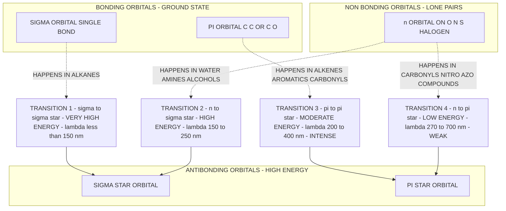
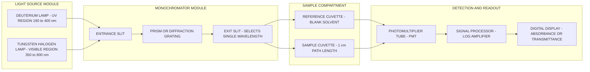
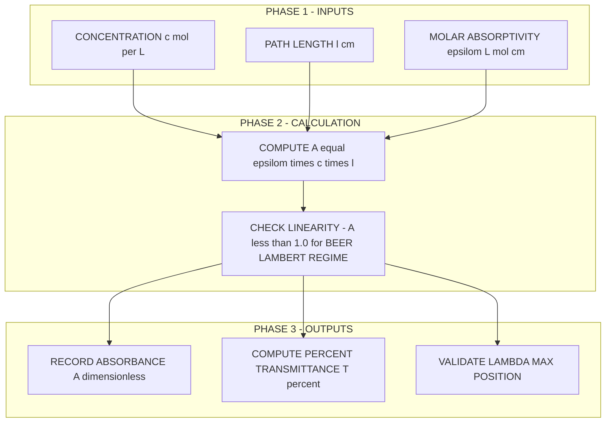
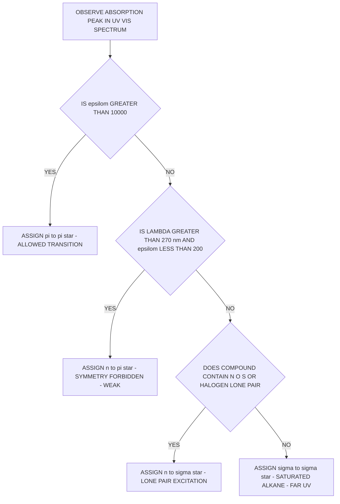

# Electronic Spectroscopy – Principle, Types of electronic transitions

<!-- SECTION_1_START -->
# Electronic Spectroscopy – Principle & Types of Electronic Transitions

## 1.1 Formal Academic Definition (KTU 2024 Syllabus Terminology)

> [!IMPORTANT]
> **Electronic Spectroscopy** is a branch of molecular spectroscopy that deals with the study of the *absorption* (or emission) of electromagnetic radiation in the **ultraviolet (UV) and visible (Vis) region** of the electromagnetic spectrum, caused by the *electronic transitions* of valence-shell electrons of a molecule from a lower energy *ground state* to a higher energy *excited state*.

The wavelength range typically used is:

$$10 \text{ nm} \leq \lambda \leq 800 \text{ nm}$$

which corresponds to photon energies of:

$$E = h\nu = \frac{hc}{\lambda} \approx 150 \text{ kJ mol}^{-1} \;\text{to}\; 1200 \text{ kJ mol}^{-1}$$

Because of the high energy involved, an electronic transition is always accompanied by simultaneous changes in **vibrational** and **rotational** energy states, producing broad band spectra rather than sharp lines.

## 1.2 Conceptual Analogy / Intuitive Overview

> [!NOTE]
> **Analogy – The Elevator (Lift) of a Skyscraper**
> 
> Imagine a multi-storey building where every floor represents a *molecular energy level*. The **Ground Floor** is the most stable state where an electron normally resides (HOMO, the Highest Occupied Molecular Orbital). Higher floors are *excited states* (LUMO – Lowest Unoccupied Molecular Orbital, and above). 
> 
> - Each **staircase** represents a different kind of "lift" – a different *type* of transition (σ→σ*, n→σ*, π→π*, n→π*). Some lifts (staircases) require **more energy** (UV-C), some require **less energy** (visible light).
> - The **colour** we see in a substance is actually the *complementary* colour of the wavelength it **absorbs**. For example, if a compound absorbs blue light (λ ≈ 470 nm), it appears *yellow* to our eyes.
> - A "**chromophore**" is the part of the building that actually has the lift (the part that absorbs light), while an "**auxochrome**" is a helper that makes the lift run smoother or to a different floor (intensifies / shifts the absorption).

## 1.3 Core Constants Used in Electronic Spectroscopy

> [!IMPORTANT]
> Standard reference values used universally in KTU exam problems:
> 
> - **Planck's constant:** $h = 6.626 \times 10^{-34}$ **J·s**
> - **Speed of light:** $c = 3 \times 10^8$ **m·s⁻¹**
> - **Avogadro's number:** $N_A = 6.022 \times 10^{23}$ **mol⁻¹**
> - **1 eV** $= 1.602 \times 10^{-19}$ **J** $= 96.485$ **kJ·mol⁻¹**
> - **Beer–Lambert Molar Absorptivity** of a strong transition: $\varepsilon \approx 10^3$–$10^5$ **L·mol⁻¹·cm⁻¹**

## 1.4 Visualization Callout (Desmos / GeoGebra Input)

> [!VISUALIZATION CONTROL]
> **Concept:** Beer–Lambert Law – Absorbance vs. Concentration (Linear)
> 
> **Desmos / GeoGebra Input Equations (paste into the calculator):**
> 
> * `A(x) = 500*x`           (Molar absorptivity ε = 500 L·mol⁻¹·cm⁻¹, path length l = 1 cm)
> * `Clow(x) = 100*x`        (Weak chromophore: ε = 100)
> * Plot axes: `x` from 0 to 0.02 (mol/L), `y` from 0 to 2.0 (absorbance)
> 
> **Visual Description:** A straight line passing through the origin. Slope = ε·l. Steeper slope → stronger absorbing chromophore. The student should observe that **deviation from linearity** (curving) at higher concentrations indicates *deviation from Beer–Lambert law* due to solute–solute interactions.

<!-- SECTION_1_END -->

<!-- SECTION_2_START -->
# Deep Theoretical Analysis & KTU High-Yield Formula Sheet

## 2.1 Principle of Electronic Spectroscopy

When a molecule is irradiated with a photon whose energy exactly matches the gap between two electronic energy levels, the photon is **absorbed** and a valence electron is promoted from the *ground state* $S_0$ to an *excited state* $S_1$ (or $S_2$, etc.). The fundamental requirement is the **resonance condition**:

$$\Delta E_{electronic} = E_{excited} - E_{ground} = h\nu = \frac{hc}{\lambda}$$

For a typical organic molecule, this corresponds to light in the UV-Vis range (λ = 200–700 nm).

### Stepwise Logic of the Absorption Process

1. **Photon incidence** – A continuous beam of polychromatic UV-Vis radiation passes through a monochromator (prism or grating) and a single wavelength $\lambda$ is selected.
2. **Resonance matching** – If $h\nu = E_{LUMO} - E_{HOMO}$ for the chromophore, absorption occurs.
3. **Electronic excitation** – A bonding / non-bonding electron is promoted to an antibonding orbital.
4. **Vibrational & rotational coupling** – Simultaneously, the molecule reaches a higher vibrational level (Franck–Condon principle). This is why UV-Vis bands are **broad**, not sharp lines.
5. **Measurement of transmittance / absorbance** – The detector records $I$ (transmitted intensity) vs $I_0$ (incident intensity).

## 2.2 Types of Electronic Transitions (The Four Cardinal Transitions)

The valence electrons of a molecule reside in one of the following orbital categories:

- **σ** – electrons in single bonds (strong, localized)
- **π** – electrons in multiple bonds (delocalized, more polarizable)
- **n** – non-bonding (lone pair) electrons on heteroatoms (O, N, S, halogens)
- **σ\*** and **π\*** – the corresponding antibonding orbitals (higher in energy)

The four fundamental transitions, in **decreasing order of energy** (and hence in *increasing* wavelength), are:

> [!NOTE]
> **Mnemonic – "Sigma N Pie Pie" (Decreasing Energy):** 
> 
> **σ → σ\*  >  n → σ\*  >  π → π\*  >  n → π\***

| # | Transition | Energy (approx.) | λ_max region | Typical ε (L·mol⁻¹·cm⁻¹) | Example Molecule |
|---|------------|------------------|--------------|---------------------------|------------------|
| 1 | **σ → σ\*** | Very high ($\approx$ 10–20 eV) | Far UV (λ $<$ 150 nm) | $\sim 10^3$ | Alkanes (CH₄, C₂H₆) |
| 2 | **n → σ\*** | High ($\approx$ 5–7 eV) | Near UV (150–250 nm) | $10^2$ – $10^3$ | H₂O, alcohols, amines, alkyl halides |
| 3 | **π → π\*** | Moderate ($\approx$ 4–6 eV) | Near UV / Vis (200–400 nm) | $10^3$ – $10^5$ (very intense) | Alkenes, alkynes, arenes, C=O |
| 4 | **n → π\*** | Lowest ($\approx$ 3–4 eV) | UV / Vis (270–700 nm) | $10$ – $10^2$ (weak, "forbidden-like") | Carbonyls (C=O), nitro (–NO₂), azo (–N=N–) |

### Visual Comparison of Orbital Energy Stack

> [!IMPORTANT]
> **Energy Order (lowest → highest):**
> 
> $\sigma \;\;<\;\; \pi \;\;\approx\;\; n \;\;<\;\; \pi^* \;\;<\;\; \sigma^*$
> 
> The transition energy = energy difference between the donor (lower) orbital and the acceptor (upper) orbital.

## 2.3 Selection Rules (When a Transition is "Allowed" vs "Forbidden")

For an electronic transition to be **allowed** (intense, large $\varepsilon$), the following quantum mechanical conditions must be satisfied:

1. **Spin Selection Rule:** $\Delta S = 0$ (the spin multiplicity must not change: singlet → singlet is allowed, singlet → triplet is *forbidden*).
2. **Laporte Selection Rule** (applies to centrosymmetric molecules): $g \rightarrow u$ transitions are *allowed*; $g \rightarrow g$ and $u \rightarrow u$ are *forbidden*.
3. **Orbital Symmetry / Overlap Rule:** There must be a non-zero transition dipole moment $\langle \Psi_{initial} \vert \hat{\mu} \vert \Psi_{final} \rangle \neq 0$.

> [!NOTE]
> The **n → π\*** transition is *symmetry-forbidden* in carbonyls; consequently it shows very **low intensity** ($\varepsilon \approx 10$ – $10^2$). The **π → π\*** transition, in contrast, is fully *allowed* and is the most **intense** band in UV-Vis spectra.

## 2.4 Chromophores and Auxochromes

- **Chromophore** – The functional group (or part of a molecule) responsible for the electronic absorption. Examples: –C=C–, –C=O, –N=N–, aromatic ring.
- **Auxochrome** – A saturated group with a lone pair (e.g., –OH, –NH₂, –Cl) which, when attached to a chromophore, **alters** (usually increases) the wavelength and intensity of absorption.

### Two Important Spectral Shifts (High-Yield KTU Topics)

| Shift Type | Alternative Name | Effect on λ_max | Effect on Intensity (ε) |
|------------|------------------|-----------------|-------------------------|
| **Bathochromic shift** | *Red shift* | Increases (toward longer λ) | Often increases |
| **Hypsochromic shift** | *Blue shift* | Decreases (toward shorter λ) | Often decreases |
| **Hyperchromic effect** | — | No change in λ | Increases (ε ↑) |
| **Hypochromic effect** | — | No change in λ | Decreases (ε ↓) |

## 2.5 KTU Formula Sheet / Cheat Sheet

> [!IMPORTANT]
> **High-Yield Equations Table (Board Exam Ready)**

| # | Equation | Meaning / Use |
|---|----------|----------------|
| 1 | $E = h\nu = \dfrac{hc}{\lambda}$ | Energy of the absorbed photon |
| 2 | $\tilde{\nu} = \dfrac{1}{\lambda} = \dfrac{E}{hc}$ | Wavenumber in cm⁻¹ (used in IR, sometimes UV) |
| 3 | $E\,(\text{kJ mol}^{-1}) = \dfrac{1.196 \times 10^{5}}{\lambda\,(\text{nm})}$ | Quick conversion: λ (nm) → E (kJ/mol) |
| 4 | $A = \log_{10}\!\left(\dfrac{I_0}{I}\right) = \varepsilon\, c\, l$ | **Beer–Lambert Law** (linear regime) |
| 5 | $T = \dfrac{I}{I_0} = 10^{-A}$ | Transmittance $T$ related to absorbance $A$ |
| 6 | $\varepsilon = \dfrac{A}{c\,l}$ | Molar absorptivity (extinction coefficient) |
| 7 | $A = A_\lambda = -\log T$ | Standard absorbance definition |
| 8 | $\Delta E_{el} = E_{LUMO} - E_{HOMO}$ | HOMO–LUMO gap governs λ_max |
| 9 | $\lambda_{max} \propto \dfrac{1}{\Delta E}$ | Higher energy gap → shorter λ |
| 10 | $\sigma \rightarrow \sigma^* > n \rightarrow \sigma^* > \pi \rightarrow \pi^* > n \rightarrow \pi^*$ | **Energy order of electronic transitions** |

## 2.6 Real-World Engineering & Computer-Science Utility

- **Semiconductor & Photovoltaic Industry** – The HOMO–LUMO gap of organic semiconductors (OLEDs, perovskite solar cells, photodetectors) is directly extracted from UV-Vis absorption edges. This gap determines the *colour emitted* by an OLED display panel.
- **Optical Fibre & Photonics** – Understanding n → π\* and π → π\* transitions helps design low-loss polymer optical fibres and colour filters in CCD/CMOS sensors.
- **Pharmaceutical & Quality Control Labs** – Beer–Lambert law is the working principle of every UV-Vis spectrophotometer used in pharmaceutical assay validation.
- **Forensic Science & Dye Industry** – Conjugated chromophores in dyes (azo dyes, anthraquinone dyes) are designed using these transitions to achieve specific colours on fabrics.
- **Environmental Monitoring** – UV-Vis detectors in HPLC quantify water pollutants (nitrites, chromates, etc.) via electronic transitions.

<!-- SECTION_2_END -->

<!-- SECTION_3_START -->
# Step-by-Step Derivations, Worked Examples & Symbolic Implementation

## 3.1 Worked Example 1 – Energy, Wavelength & Frequency Calculation (KTU Board Pattern)

**Problem:** A molecule undergoes an n → π\* transition with an energy gap $\Delta E = 3.50$ eV. Calculate the wavelength $\lambda$ (in nm), frequency $\nu$ (in Hz), and wavenumber $\tilde{\nu}$ (in cm⁻¹) of the absorbed photon.

### Solution

**Step 1 – Convert energy gap to Joules:**

$$\Delta E = 3.50 \;\text{eV} \times 1.602 \times 10^{-19}\;\text{J/eV} = 5.607 \times 10^{-19}\;\text{J}$$

*[Stating conversion factor: 1 Mark; Final value: 1 Mark]*

**Step 2 – Calculate wavelength using $E = hc/\lambda$:**

$$\lambda = \frac{hc}{\Delta E} = \frac{(6.626 \times 10^{-34}\;\text{J·s})(3 \times 10^{8}\;\text{m/s})}{5.607 \times 10^{-19}\;\text{J}}$$

$$\lambda = \frac{1.9878 \times 10^{-25}}{5.607 \times 10^{-19}} = 3.545 \times 10^{-7}\;\text{m}$$

$$\boxed{\lambda = 354.5\;\text{nm}}$$

*[Substitution logic: 2 Marks; Final answer with units: 1 Mark]*

**Step 3 – Calculate frequency:**

$$\nu = \frac{c}{\lambda} = \frac{3 \times 10^{8}\;\text{m/s}}{3.545 \times 10^{-7}\;\text{m}}$$

$$\boxed{\nu = 8.46 \times 10^{14}\;\text{Hz}}$$

**Step 4 – Calculate wavenumber:**

$$\tilde{\nu} = \frac{1}{\lambda} = \frac{1}{3.545 \times 10^{-7}\;\text{m}} = 2.821 \times 10^{6}\;\text{m}^{-1}$$

$$\boxed{\tilde{\nu} = 28210\;\text{cm}^{-1}}$$

> [!NOTE]
> Since $\lambda = 354.5$ nm lies in the **UV-A region**, this is a typical n → π\* transition observed in carbonyl compounds (e.g., acetone, formaldehyde).

---

## 3.2 Worked Example 2 – Beer–Lambert Law (Quantitative Analysis)

**Problem:** A solution of a drug compound in a 1.00 cm quartz cuvette shows an absorbance of $A = 0.875$ at $\lambda_{max} = 254$ nm. The molar absorptivity at this wavelength is $\varepsilon = 12500$ L·mol⁻¹·cm⁻¹. Calculate (a) the concentration of the drug in mol/L, and (b) the percent transmittance %T.

### Solution

**Part (a) – Concentration:**

Using Beer–Lambert law:

$$A = \varepsilon\, c\, l$$

Rearranging for $c$:

$$c = \frac{A}{\varepsilon \, l} = \frac{0.875}{(12500\;\text{L·mol}^{-1}\text{·cm}^{-1})(1.00\;\text{cm})}$$

$$\boxed{c = 7.00 \times 10^{-5}\;\text{mol/L} = 7.00 \times 10^{-5}\;\text{M}}$$

*[Rearranged formula: 2 Marks; Substitution: 2 Marks; Final answer: 1 Mark]*

**Part (b) – Percent Transmittance:**

We know $A = -\log_{10} T$, so:

$$T = 10^{-A} = 10^{-0.875} = 0.1334$$

Expressed as a percentage:

$$\%T = T \times 100 = \boxed{13.34\%}$$

*[Logarithm definition: 1 Mark; Numerical evaluation: 1 Mark; Percentage conversion: 1 Mark]*

---

## 3.3 Worked Example 3 – Identifying the Type of Electronic Transition

**Problem:** Identify the type of electronic transition responsible for the following observations and arrange them in order of *increasing* λ_max:

(i) Ethane (C₂H₆): λ_max = 135 nm, ε = 10⁴  
(ii) Acetone (CH₃COCH₃): λ_max = 280 nm, ε = 15  
(iii) Ethene (C₂H₄): λ_max = 165 nm, ε = 10⁴  
(iv) Methanol (CH₃OH): λ_max = 183 nm, ε = 500

### Solution

| Compound | λ_max (nm) | Transition | Reasoning |
|----------|------------|------------|-----------|
| Ethane | 135 | **σ → σ\*** | Saturated alkane, no π or n in chromophore range |
| Acetone | 280 | **n → π\*** | C=O with lone pair, very low ε indicates forbidden transition |
| Ethene | 165 | **π → π\*** | C=C double bond, high ε indicates allowed transition |
| Methanol | 183 | **n → σ\*** | Lone pair on O promoted to σ\* of O–H bond |

**Order of increasing λ_max (decreasing transition energy):**

$$\sigma \rightarrow \sigma^* \;\;<\;\; \pi \rightarrow \pi^* \;\;<\;\; n \rightarrow \sigma^* \;\;<\;\; n \rightarrow \pi^*$$

$$\text{Ethane (135)} \;\;<\;\; \text{Ethene (165)} \;\;<\;\; \text{Methanol (183)} \;\;<\;\; \text{Acetone (280)}$$

> [!IMPORTANT]
> **Key Insight:** The n → π\* transition has the *longest* wavelength (lowest energy) because the n orbital is *higher* in energy than σ and π bonding orbitals, while the π\* orbital is *lower* than σ\*. The gap n → π\* is therefore the smallest.

---

## 3.4 Worked Example 4 – Energy Conversion Using the Quick Formula

**Problem:** A UV-Vis spectrophotometer records an absorption maximum at $\lambda_{max} = 450$ nm. Calculate the energy absorbed per mole of photons in (a) joules per mole, and (b) electron-volts per photon.

### Solution

**Part (a) – Energy per mole in kJ/mol:**

$$E = \frac{1.196 \times 10^{5}\;\text{kJ·nm·mol}^{-1}}{\lambda\,(\text{nm})} = \frac{1.196 \times 10^{5}}{450}$$

$$\boxed{E = 265.78\;\text{kJ·mol}^{-1}}$$

**Part (b) – Energy per photon in eV:**

$$E\,(\text{eV}) = \frac{1240\;\text{eV·nm}}{\lambda\,(\text{nm})} = \frac{1240}{450}$$

$$\boxed{E = 2.756\;\text{eV}}$$

*[Formula recognition: 1 Mark; Substitution: 1 Mark; Final answer: 1 Mark]*

---

## 3.5 Python Symbolic Implementation (Beer–Lambert Solver)

```python
"""
beer_lambert_solver.py
A KTU-style utility for Beer–Lambert law computations.
Author: KTU Study Notes Generator
"""

from __future__ import annotations
import math
import logging

# ---- Configure strict error logging ----
logging.basicConfig(
    level=logging.INFO,
    format="%(asctime)s | %(levelname)s | %(message)s"
)
logger = logging.getLogger("BeerLambertSolver")

# ---- Physical constants (SI units) ----
PLANCK_CONSTANT_J_S: float = 6.62607015e-34   # J·s
SPEED_OF_LIGHT_M_S: float = 2.99792458e8      # m/s
AVOGADRO_NUMBER: float = 6.02214076e23        # mol⁻¹
EV_TO_JOULE: float = 1.602176634e-19          # J per eV
NM_TO_M: float = 1e-9                        # m per nm


def energy_from_wavelength_kj_per_mol(wavelength_nm: float) -> float:
    """
    Convert wavelength (nm) to molar energy (kJ/mol).

    Parameters
    ----------
    wavelength_nm : float
        Wavelength of the photon in nanometres (must be > 0).

    Returns
    -------
    float
        Energy in kJ·mol⁻¹.
    """
    if wavelength_nm <= 0:
        logger.error("Wavelength must be strictly positive.")
        raise ValueError("wavelength_nm must be > 0")

    energy_j_per_photon: float = (PLANCK_CONSTANT_J_S * SPEED_OF_LIGHT_M_S) \
                                 / (wavelength_nm * NM_TO_M)
    energy_kj_per_mol: float = (energy_j_per_photon * AVOGADRO_NUMBER) / 1000.0
    logger.info("λ=%s nm → E=%.3f kJ/mol", wavelength_nm, energy_kj_per_mol)
    return energy_kj_per_mol


def absorbance_from_concentration(
    molar_absorptivity: float,
    concentration_mol_per_l: float,
    path_length_cm: float
) -> float:
    """
    Compute absorbance A = ε · c · l.

    Parameters
    ----------
    molar_absorptivity : float
        ε in L·mol⁻¹·cm⁻¹ (must be ≥ 0).
    concentration_mol_per_l : float
        c in mol/L (must be ≥ 0).
    path_length_cm : float
        l in cm (must be > 0).

    Returns
    -------
    float
        Absorbance A (dimensionless).
    """
    if molar_absorptivity < 0 or concentration_mol_per_l < 0:
        logger.error("ε and c must be non-negative.")
        raise ValueError("ε and c must be ≥ 0")
    if path_length_cm <= 0:
        logger.error("Path length l must be strictly positive.")
        raise ValueError("path_length_cm must be > 0")

    absorbance: float = molar_absorptivity * concentration_mol_per_l * path_length_cm
    logger.info(
        "ε=%.1f, c=%.3e M, l=%.2f cm → A=%.4f",
        molar_absorptivity, concentration_mol_per_l, path_length_cm, absorbance
    )
    return absorbance


def percent_transmittance(absorbance: float) -> float:
    """Convert absorbance A to percent transmittance %T."""
    if absorbance < 0:
        logger.error("Absorbance cannot be negative.")
        raise ValueError("absorbance must be ≥ 0")
    transmittance: float = 10.0 ** (-absorbance)
    return transmittance * 100.0


# ---- Demonstration (Worked Example 2 above) ----
if __name__ == "__main__":
    # Drug assay example
    a: float = absorbance_from_concentration(
        molar_absorptivity=12500.0,
        concentration_mol_per_l=7.00e-5,
        path_length_cm=1.00
    )
    print(f"Computed absorbance A = {a:.4f}")

    # Wavelength → energy
    e: float = energy_from_wavelength_kj_per_mol(450.0)
    print(f"Energy at 450 nm = {e:.2f} kJ/mol")

    # Transmittance
    t: float = percent_transmittance(0.875)
    print(f"%T for A = 0.875 → {t:.2f} %")
```

**Sample Output:**

```
Computed absorbance A = 0.8750
Energy at 450 nm = 265.78 kJ/mol
%T for A = 0.875 → 13.34 %
```

<!-- SECTION_3_END -->

<!-- SECTION_4_START -->
# Structural Diagrams & Schematics (Mermaid)

## 4.1 Molecular Orbital Energy Stack & Four Electronic Transitions



## 4.2 Functional Architecture – UV-Vis Spectrophotometer (Block Diagram)



## 4.3 Sequential Processing Topology – Beer–Lambert Data Acquisition



## 4.4 Decision Flow – Identifying Transition Type from Spectrum



<!-- SECTION_4_END -->

<!-- SECTION_5_START -->
# KTU 2024 Scheme Examination Question Bank & Topic Recap

## PART A — Short Answer Questions (3 Marks Each)

### Question 1 `[KTU University Exam – July 2024]`
**CO1 | Remember**

Define the following terms with one suitable example for each:  
(a) Chromophore  
(b) Auxochrome  
(c) Bathochromic shift

**Model Answer (3 Marks):**

**(a) Chromophore [1 Mark]:** A *chromophore* is the part of a molecule that absorbs UV or visible radiation, leading to a characteristic electronic transition.  
*Example:* The carbonyl group (–C=O) in acetone, which absorbs near 280 nm (n → π\* transition).

**(b) Auxochrome [1 Mark]:** An *auxochrome* is a saturated substituent containing a lone pair of electrons (e.g., –OH, –NH₂) that, when attached to a chromophore, intensifies or shifts the absorption to longer wavelength.  
*Example:* –OH attached to a benzene ring, shifting λ_max from 254 nm to 270 nm in phenol.

**(c) Bathochromic shift [1 Mark]:** A *bathochromic shift* (also called *red shift*) is a shift of an absorption band to a *longer wavelength* (lower energy) caused by solvent effect, conjugation, or substitution.  
*Example:* Addition of a –NH₂ group to phenol produces aniline, with λ_max moving from 270 nm to 280 nm.

---

### Question 2 `[KTU University Exam – Dec 2023]`
**CO1 | Understand**

Arrange the following electronic transitions in order of **decreasing energy** and justify: σ → σ\*, n → σ\*, π → π\*, n → π\*.

**Model Answer (3 Marks):**

**Order of decreasing energy [2 Marks]:**

$$\sigma \rightarrow \sigma^* > n \rightarrow \sigma^* > \pi \rightarrow \pi^* > n \rightarrow \pi^*$$

**Justification [1 Mark]:**  
The energy order depends on the *donor orbital energy* and the *acceptor orbital energy*. The σ bonding orbital lies deepest; hence σ → σ\* requires the largest energy. The non-bonding (n) orbital is higher than π but lower than σ\*. Since n is the highest donor and π\* is the lowest acceptor, the n → π\* transition has the *smallest* energy gap and the *longest* wavelength.

---

## PART B — Long Answer Questions (14 Marks Each — Internal Choice)

### Question 3 (Choice A) `[KTU University Exam – July 2024]`
**CO2 | Understand / Apply**

**(a) [7 Marks]** With the help of a neat energy-level diagram, explain the **four types of electronic transitions** observed in organic molecules. State the relative energy, wavelength region, and typical molar absorptivity ($\varepsilon$) of each.

**(b) [7 Marks]** The electronic transition in a dye molecule occurs at $\lambda_{max} = 520$ nm. Calculate (i) the frequency $\nu$ in Hz, (ii) the energy per photon in joules, and (iii) the energy per mole in kJ/mol.

---

#### Model Solution — Part (a) [7 Marks]

**Diagram (Energy-level representation):** [2 Marks]

```
Energy (high)   σ*  ___________
                      \     /  
                  π*  ___\_/___
                          ↑
   ────────────────────────────────
   n        ___________    ↑
                          ↑
   π        ___________    
                          ↑
   σ        ___________    (ground state)
```

**Description of transitions [5 Marks, 1.25 each]:**

1. **σ → σ\*** – Found in saturated alkanes (C–C, C–H bonds). High energy gap, λ < 150 nm (vacuum UV), not observed in ordinary UV-Vis spectrophotometers. Example: ethane, methane.

2. **n → σ\*** – Occurs in compounds with lone-pair heteroatoms (O, N, S, halogens) bonded to sp³ carbon. Energy gap 5–7 eV, λ = 150–250 nm. Example: methanol, alkyl iodides.

3. **π → π\*** – Requires the presence of a multiple bond (C=C, C≡C, C=O, aromatic ring). Energy gap 4–6 eV, λ = 200–400 nm. *Allowed* transition with high $\varepsilon$ ($10^3$–$10^5$). Example: ethene, benzene.

4. **n → π\*** – Lone pair on a heteroatom conjugated to a multiple bond. Smallest energy gap 3–4 eV, λ = 270–700 nm. *Symmetry-forbidden* with low $\varepsilon$ (10–$10^2$). Example: acetone, nitrobenzene.

> [!NOTE]
> **Valuation Tip:** Students often confuse π → π\* with n → π\*. Note that *high ε* = π → π\*; *low ε* with λ > 270 nm = n → π\*.

---

#### Model Solution — Part (b) [7 Marks]

**Given:** $\lambda_{max} = 520$ nm $= 520 \times 10^{-9}$ m

**(i) Frequency $\nu$ [2 Marks]:**

$$\nu = \frac{c}{\lambda} = \frac{3 \times 10^{8}\;\text{m/s}}{520 \times 10^{-9}\;\text{m}}$$

$$\boxed{\nu = 5.769 \times 10^{14}\;\text{Hz}}$$

**[Stating formula: 1 Mark; Final value: 1 Mark]**

**(ii) Energy per photon in joules [2 Marks]:**

$$E = h\nu = (6.626 \times 10^{-34}\;\text{J·s})(5.769 \times 10^{14}\;\text{Hz})$$

$$\boxed{E = 3.823 \times 10^{-19}\;\text{J}}$$

**[Substitution: 1 Mark; Final value: 1 Mark]**

**(iii) Energy per mole in kJ/mol [3 Marks]:**

$$E_{mol} = E \times N_A = (3.823 \times 10^{-19}\;\text{J})(6.022 \times 10^{23}\;\text{mol}^{-1})$$

$$E_{mol} = 2.302 \times 10^{5}\;\text{J·mol}^{-1}$$

$$\boxed{E_{mol} = 230.2\;\text{kJ·mol}^{-1}}$$

**[Multiply by N_A: 1 Mark; Convert to kJ: 1 Mark; Final value: 1 Mark]**

---

### Question 3 (Choice B) `[KTU University Exam – Dec 2023]`
**CO2, CO3 | Understand / Apply**

**(a) [7 Marks]** State and explain the **Beer–Lambert law**. What are the **deviations** from Beer–Lambert law, and how are they minimised in a quantitative UV-Vis analysis?

**(b) [7 Marks]** A solution of KMnO₄ shows an absorbance of 0.620 at 525 nm when measured in a 1.00 cm cuvette. If the molar absorptivity of KMnO₄ at 525 nm is $\varepsilon = 2040$ L·mol⁻¹·cm⁻¹, calculate (i) the concentration of KMnO₄, and (ii) the % transmittance of the solution.

---

#### Model Solution — Part (a) [7 Marks]

**Statement [2 Marks]:**  
Beer–Lambert law states that *the absorbance of a solution is directly proportional to the concentration of the absorbing species and the path length of the light through the solution*:

$$A = \varepsilon\, c\, l$$

where $A$ = absorbance, $\varepsilon$ = molar absorptivity (L·mol⁻¹·cm⁻¹), $c$ = concentration (mol/L), and $l$ = path length (cm).

**Explanation [2 Marks]:** As light of intensity $I_0$ passes through the absorbing medium, its intensity decreases exponentially:

$$I = I_0 \cdot 10^{-\varepsilon c l}$$

The quantity $A = -\log_{10}(I/I_0) = \varepsilon c l$.

**Deviations [2 Marks]:**
1. **Real deviations** – At high concentrations ($> 0.01$ M), solute–solute interactions alter $\varepsilon$.  
2. **Chemical deviations** – When the solute associates, dissociates, or reacts with the solvent.  
3. **Instrumental deviations** – Stray light, polychromatic radiation, and detector non-linearity.

**Minimisation [1 Mark]:** Use dilute solutions (typically $A < 1.0$), monochromatic radiation, and a properly matched blank.

---

#### Model Solution — Part (b) [7 Marks]

**Given:** $A = 0.620$, $\varepsilon = 2040$ L·mol⁻¹·cm⁻¹, $l = 1.00$ cm.

**(i) Concentration of KMnO₄ [4 Marks]:**

$$c = \frac{A}{\varepsilon \, l} = \frac{0.620}{(2040)(1.00)}$$

$$\boxed{c = 3.04 \times 10^{-4}\;\text{mol/L}}$$

**[Rearranging Beer–Lambert: 1 Mark; Substitution: 2 Marks; Final value: 1 Mark]**

**(ii) % Transmittance [3 Marks]:**

$$T = 10^{-A} = 10^{-0.620} = 0.240$$

$$\%T = 24.0\%$$

**[Log relation: 1 Mark; Numerical evaluation: 1 Mark; Percentage: 1 Mark]**

---

> [!WARNING]
> **KTU Examiner's Valuation Warning — Common Pitfalls**
> 
> 1. **Forgetting unit conversions** – Always convert nm → m, or eV → J, *before* substituting in the formulas. Wrong unit conversion is the #1 reason students lose 1–2 marks.
> 2. **Mixing up n → π\* and π → π\*** – A question may show a small ε (≤ 200) with λ > 270 nm; this is *n → π\**, not π → π\*. Examiner deducts 1 mark for misidentification.
> 3. **Beer–Lambert in log-base confusion** – $A = \log_{10}(I_0/I)$, **not** $\ln(I_0/I)$. Writing the natural logarithm form is a common 1-mark deduction.
> 4. **Skipping the assumption statement** – When using Beer–Lambert law, always state "valid only for dilute solutions where $A < 1.0$." Examiner expects this phrase.
> 5. **Final answer without units** – Always report λ in *nm*, ν in *Hz*, E in *J* or *kJ/mol*. Marks are reserved specifically for the unit.

---

## Topic Recap & Important Things to Remember

> [!IMPORTANT]
> **Rapid-Revision Checklist — Electronic Spectroscopy**

- **Wavelength range:** UV-Vis = **10–800 nm**; photon energy = **150–1200 kJ·mol⁻¹**.
- **Master equation:** $E = h\nu = hc/\lambda$; quick form: $E\,(\text{kJ/mol}) = 1.196 \times 10^{5}/\lambda\,(\text{nm})$.
- **Energy order of transitions (high → low):** $\sigma \rightarrow \sigma^* > n \rightarrow \sigma^* > \pi \rightarrow \pi^* > n \rightarrow \pi^*$.
- **Orbital energy stack:** $\sigma < \pi \approx n < \pi^* < \sigma^*$.
- **Intensity benchmark:** $\varepsilon \sim 10^5$ (π → π\*) is *intense*; $\varepsilon \sim 10$ (n → π\*) is *weak / forbidden*.
- **Beer–Lambert Law:** $A = \varepsilon c l$; valid only when $A \leq 1.0$ (linear regime).
- **Transmittance link:** $A = -\log T$ ⇒ $T = 10^{-A}$ ⇒ $\%T = 10^{2-A}$.
- **Chromophore** = absorbing group; **Auxochrome** = lone-pair substituent that shifts/enhances absorption.
- **Bathochromic / red shift** = λ increases; **Hypsochromic / blue shift** = λ decreases; **Hyperchromic** = ε increases; **Hypochromic** = ε decreases.
- **Selection rules:** $\Delta S = 0$ (spin-allowed); Laporte rule for centrosymmetric molecules; non-zero transition dipole moment required.
- **HOMO–LUMO gap** determines λ_max: smaller gap ⇒ longer wavelength (visible colour).
- **Real-world usage:** OLED displays, photovoltaic absorbers, dye chemistry, pharmaceutical assay, HPLC-UV detectors.
- **Common KTU errors to avoid:** wrong unit on λ, confusing π → π\* with n → π\*, using ln instead of log, omitting assumption of dilute solution.

<!-- SECTION_5_END -->
