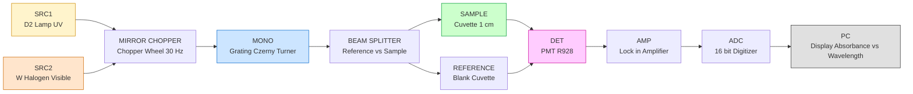
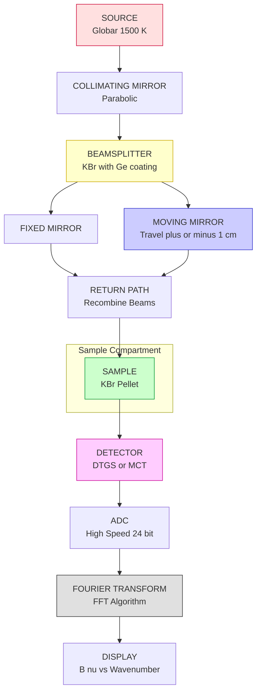
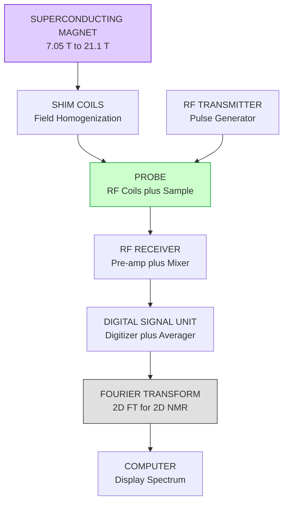
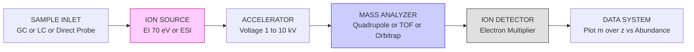
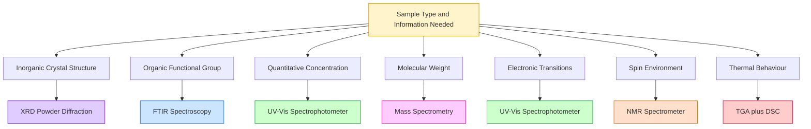

# Instrumentation and Applications

<!-- SECTION_1_START -->
# Instrumentation and Applications of Molecular Spectroscopy

## 1.1 Formal Definition

**Molecular Spectroscopy Instrumentation** is the systematic arrangement of physical, optical, electronic, and computational components designed to generate, disperse, transmit, detect, and record the interaction between **electromagnetic radiation** and matter at the molecular level. According to the KTU 2024 Scheme (GXCYT122, Module 3), the discipline of instrumentation integrates the principles of *optical engineering*, *photoelectric conversion*, and *signal processing* to convert minute molecular events (vibrations, rotations, electronic transitions) into quantifiable analytical data.

> [!IMPORTANT]
> **KTU Syllabus Highlight (GXCYT122, Module 3):** Students must be able to identify the major components of a spectrophotometer (source → monochromator → sample → detector → recorder), compare dispersive and non-dispersive (Fourier Transform) systems, and relate each instrument block to its underlying physical phenomenon (e.g., Beer–Lambert absorption, interferometric modulation, resonance absorption).

## 1.2 Generalized Block Architecture

Every spectroscopic instrument — from a low-cost colorimeter to a high-resolution NMR console — obeys the **Five-Universal-Block Topology (FUBT)**:

$$
\text{SOURCE} \;\longrightarrow\; \text{WAVELENGTH \, SELECTOR} \;\longrightarrow\; \text{SAMPLE \, CHAMBER} \;\longrightarrow\; \text{DETECTOR} \;\longrightarrow\; \text{RECORDER / PROCESSOR}
$$

> [!NOTE]
> **Core Terminology Checklist**
> * **Source:** Emits continuous (white) or discrete radiation in the wavelength range of interest.
> * **Monochromator (Wavelength Selector):** Isolates a narrow band of wavelengths using a prism, grating, or interferometer.
> * **Sample Compartment:** Houses the analyte in a cuvette, KBr pellet, NMR tube, or as a thin film.
> * **Detector:** Converts the transmitted/reflected/scattered light into an electrical signal (e.g., **PMT**, **photodiode**, **thermocouple**).
> * **Recorder/Processor:** Amplifies, digitizes, plots intensity vs. wavelength ($\lambda$) or frequency ($\nu$).

## 1.3 Intuitive Analogy

Think of a spectroscopic instrument as a **musical translator for molecules**.

* The **light source** is the *orchestra* playing every note simultaneously.
* The **monochromator** is the *conductor* — selecting one note (wavelength) at a time.
* The **sample** is the *student* — absorbing some notes, letting others pass.
* The **detector** is the *judge* — measuring which notes reached it and which were absorbed.
* The **recorder** is the *sheet music* — writing the result (the *spectrum*).

> **Geometric Intuition:** A spectrum is essentially a *fingerprint chart* where the x-axis is the energy/frequency delivered, and the y-axis is the fraction of that energy that *survives* the molecular interaction. Peaks are "missing notes" — wavelengths strongly absorbed by the molecule.

## 1.4 Spectral Regions and Corresponding Transitions

| Region | Wavelength (Approx.) | Frequency / Wavenumber | Transition Type | Quantum Energy (kJ mol$^{-1}$) |
| :--- | :--- | :--- | :--- | :--- |
| UV-Visible | $200 \text{ – } 800 \text{ nm}$ | — | $\pi \rightarrow \pi^{\ast}, \, n \rightarrow \pi^{\ast}$ | $150 \text{ – } 600$ |
| IR (Mid) | $2.5 \text{ – } 25 \, \mu\text{m}$ | $4000 \text{ – } 400 \text{ cm}^{-1}$ | Vibrational ($v = 0 \rightarrow 1$) | $4 \text{ – } 40$ |
| Microwave | $\sim 0.1 \text{ – } 10 \text{ cm}$ | — | Rotational | $10^{-4} \text{ – } 10^{-1}$ |
| NMR (Radio) | $0.5 \text{ – } 10 \text{ m}$ | MHz range | Nuclear spin flip ($\Delta m_I = \pm 1$) | $10^{-6}$ |

> [!VISUALIZATION CONTROL]
> **Concept:** Beer–Lambert Transmittance and Absorbance Curves
> **Desmos / GeoGebra Input Equations:**
> * `T(x) = 10^(-0.5*x)`     *(Transmittance, where $x$ = path length in cm)*
> * `A(x) = 0.5*x`           *(Corresponding Absorbance curve)*
> * Point: $(1, 0.316)$  on $T(x)$ and $(1, 0.5)$ on $A(x)$
> **Visual Description:** Plot the $T(x)$ curve as a *red exponential decay* and the $A(x)$ curve as a *blue straight line through the origin*. Observe that absorbance is **linear** with concentration and path length, while transmittance is **exponential** — this is why modern instruments record absorbance, not transmittance.

## 1.5 Standard Physical Constants (Bolded for Reference)

* Speed of light: $\mathbf{c = 2.998 \times 10^8 \; \text{m s}^{-1}}$
* Planck's constant: $\mathbf{h = 6.626 \times 10^{-34} \; \text{J s}}$
* Avogadro's number: $\mathbf{N_A = 6.022 \times 10^{23} \; \text{mol}^{-1}}$
* Boltzmann constant: $\mathbf{k_B = 1.381 \times 10^{-23} \; \text{J K}^{-1}}$
* 1 eV $\equiv 96.485 \; \text{kJ mol}^{-1} \equiv 1.602 \times 10^{-19} \; \text{J}$

<!-- SECTION_1_END -->

<!-- SECTION_2_START -->
# 2. Deep Theoretical Analysis & KTU High-Yield Formula Sheet

## 2.1 Beer–Lambert Law (Foundation of All Quantitative Spectroscopy)

When monochromatic radiation of intensity $I_0$ passes through a solution of concentration $c$ and path length $b$, the transmitted intensity $I$ obeys:

$$
A = \log_{10}\!\left(\frac{I_0}{I}\right) = \varepsilon \, b \, c
$$

where:
* $A$ = **Absorbance** (dimensionless, formerly called *optical density*)
* $I_0$ = Incident radiant intensity (W m$^{-2}$)
* $I$ = Transmitted radiant intensity
* $\varepsilon$ = **Molar absorptivity** (L mol$^{-1}$ cm$^{-1}$); sometimes called *molar extinction coefficient*
* $b$ = Optical path length (cm)
* $c$ = Molar concentration of the analyte (mol L$^{-1}$)

### Why the log base 10?
The intensity decreases *exponentially* as it traverses the medium: $I = I_0 \, e^{-\alpha b c}$. Converting the natural exponent to base 10 produces a *linear* law:

$$
A = 0.4343 \times \alpha \, b \, c = \varepsilon \, b \, c
$$

> [!IMPORTANT]
> **Validity Window of Beer–Lambert Law:**
> * Concentration: typically $c < 0.01 \; \text{M}$ (beyond this, solute-solute interactions cause deviation).
> * Monochromatic radiation assumed — polychromatic light causes curvature.
> * No scattering, no fluorescence, no chemical reaction in the cuvette.

### Engineering Utility
* Pharmaceutical purity assays, water quality monitoring, food dye quantification, semiconductor dopant profiling (in transmission mode), and thin-film thickness determination all rely on this linear law.
* The law is the *calibration backbone* of the pharmaceutical industry — the **USP (United States Pharmacopeia)** mandates Beer–Lambert-based assays for $> 80\%$ of tablet formulations.

## 2.2 Instrumentation of UV-Visible Spectrophotometer

### (a) Radiation Sources
| Source | Wavelength Range | Lifetime | Remarks |
| :--- | :--- | :--- | :--- |
| **Deuterium (D$_2$) lamp** | $160 \text{ – } 375 \; \text{nm}$ | $\sim 1000$ h | For UV region; needs $5 \; \text{min}$ warm-up |
| **Tungsten-Halogen (W-I) lamp** | $320 \text{ – } 2500 \; \text{nm}$ | $\sim 2000$ h | For visible region; colour temperature $\sim 3000 \; \text{K}$ |
| **Xenon arc lamp** | $190 \text{ – } 1000 \; \text{nm}$ | $\sim 2000$ h | Pulsed, used in fluorescence spectroscopy |

> [!NOTE]
> Why two sources? A single source cannot efficiently emit across the UV-Visible range because **Wien's Displacement Law** fixes the peak emission wavelength of a black body: $\lambda_{\max} T = 2.898 \times 10^{-3} \; \text{m·K}$. A hot tungsten filament ($\sim 3000 \; \text{K}$) emits mostly in the visible; UV requires a *discharge mechanism* (excited D$_2$ molecules).

### (b) Monochromators
Dispersion devices resolve polychromatic light into its spectral components.

* **Prism:** Uses refractive index dispersion $n = f(\lambda)$. Glass for visible; quartz for UV.
* **Grating:** Uses diffraction. Grating equation (essential for KTU problems):

$$
d \,(\sin\theta_i + \sin\theta_d) = m \, \lambda
$$

* **Resolving power** of a grating with $N$ slits and order $m$:

$$
R = \frac{\lambda}{\Delta\lambda} = m \, N
$$

* **Filter:** Cheaper; uses coloured glass or interference layers.

### (c) Detectors
* **Photomultiplier Tube (PMT):** Amplification $\sim 10^6$–$10^7$ via cascade dynodes. Very low noise, ideal for low-intensity UV.
* **Photodiode / Photodiode Array (PDA):** Solid-state; many diodes permit *simultaneous* measurement of all wavelengths (basis of Diode-Array Spectrophotometer).
* **Thermocouple / Bolometer (for IR):** Converts heat into voltage — used in dispersive IR instruments.

## 2.3 Instrumentation of IR Spectrophotometer (Dispersive vs. FTIR)

### Dispersive IR (legacy)
* Source: Nernst glower or Globar (heated to $1500$–$2000 \; \text{K}$).
* Monochromator: NaCl or KBr prism (transparent to IR), or grating blazed for IR.
* Detector: Thermocouple / Golay cell.
* **Major drawback:** Slow scan (minutes), poor S/N, requires large sample.

### Fourier Transform IR (FTIR) — the modern standard
* Source: same (Globar).
* **Heart of FTIR: Michelson Interferometer** with one fixed mirror, one moving mirror.
* Moving mirror travels distance $x$; intensity at the detector:

$$
I(x) = \int_{-\infty}^{+\infty} B(\nu) \cos(2\pi \nu x) \, d\nu
$$

* The recorded signal is the **interferogram** $I(x)$. Applying the **Fourier Transform**:

$$
B(\nu) = \int_{-\infty}^{+\infty} I(x) \cos(2\pi \nu x) \, dx
$$

* The output $B(\nu)$ is the conventional IR spectrum (intensity vs. wavenumber).

> [!IMPORTANT]
> **KTU High-Yield Advantage of FTIR:** The **Fellgett (Multiplex) advantage** — measuring all frequencies *simultaneously* boosts the signal-to-noise ratio by $\sqrt{N}$ compared to a dispersive instrument scanning $N$ resolution elements. This is why FTIR is the **default instrument in industrial QC labs**.

## 2.4 Instrumentation of NMR Spectrometer

$$
\text{Frequency of resonance:} \quad \nu_0 = \frac{\gamma \, B_0}{2\pi}
$$

where $\gamma$ is the gyromagnetic ratio and $B_0$ is the static magnetic field strength.

### Major Blocks
1. **Magnet (Superconducting):** Generates $B_0 = 7.05$ T for a $300 \; \text{MHz}$ $^{1}\text{H}$ instrument (now $21.1 \; \text{T}$ for $900 \; \text{MHz}$).
2. **Probe:** Holds the sample tube ($5 \text{ mm}$ OD, $0.6 \text{ mL}$ volume) and houses the RF coils.
3. **RF Transmitter & Receiver:** Generates the short pulse ($1 \text{ – } 20 \, \mu\text{s}$) and detects the **Free Induction Decay (FID)**.
4. **Pulsed Field Gradient (PFG):** Coherence selection in 2D-NMR (COSY, HSQC, NOESY).
5. **Computer with FT Algorithm:** Applies Fourier transform to the FID to produce the NMR spectrum.

> [!NOTE]
> **Why pulsed NMR?:** A short RF pulse excites *all* the spin transitions at once. The resulting time-domain FID contains every frequency; a single Fourier transform converts it to the frequency-domain spectrum. This is the *time-domain* analogue of FTIR.

## 2.5 Instrumentation of Mass Spectrometry

A mass spectrometer measures the **mass-to-charge ratio** ($m/z$) of ions.

| Block | Function | Common Variants |
| :--- | :--- | :--- |
| **Sample inlet** | Introduce analyte (solid, liquid, gas) | Direct probe, GC-MS, LC-MS, MALDI plate |
| **Ionization source** | Convert neutral molecules to ions | EI, CI, ESI, APCI, MALDI |
| **Mass analyzer** | Separate ions by $m/z$ | Quadrupole, TOF, Ion trap, Orbitrap, Magnetic sector |
| **Detector** | Count ions | Electron multiplier, Microchannel plate (MCP), Faraday cup |
| **Data system** | Display mass spectrum | PC with specialized software (e.g., MassHunter) |

### Key Performance Parameter: Resolution
$$
R = \frac{m}{\Delta m}
$$

A modern **Orbitrap** achieves $R > 1{,}000{,}000$ at $m/z = 200$.

## 2.6 Complementary Analytical Techniques (KTU Module Coverage)

### (a) X-Ray Diffraction (XRD) — Powder & Single Crystal
* Source: Cu K$\alpha$ radiation, $\lambda = 1.5406 \; \text{Å}$.
* **Bragg's Law:**

$$
n \, \lambda = 2 \, d \, \sin\theta
$$

* Used for phase identification, crystal structure, crystallite size (Scherrer equation), and strain analysis in materials used for electronic chips.

### (b) Thermogravimetric Analysis (TGA)
* Sample mass $m(T)$ is recorded vs. temperature in a controlled atmosphere.
* **Applications:** Thermal stability of polymers (used in PCB substrates), composition of alloys, moisture content.

### (c) Differential Scanning Calorimetry (DSC)
* Measures the **heat flow** difference between sample and reference as a function of temperature.
* Provides $T_g$ (glass transition), $T_m$ (melting), $T_c$ (crystallization), and $\Delta H$.

### (d) Chromatography (GC & HPLC)
* Components: Mobile phase, stationary phase, injector, column, detector (FID, TCD, UV, MS).
* **Retention time** $t_R$ is the qualitative identifier; **peak area** is the quantitative measure.

## 2.7 Master Formula Sheet (Cheat Sheet)

| # | Formula / Concept | Symbols | Unit / Boundary |
| :--- | :--- | :--- | :--- |
| 1 | $A = \varepsilon b c$ | Beer–Lambert | $A$ dimensionless, $\varepsilon$ in L mol$^{-1}$ cm$^{-1}$ |
| 2 | $T = I \big/ I_0 = 10^{-A}$ | Transmittance | $0 \le T \le 1$ |
| 3 | $\lambda_{\max} T = 2.898 \times 10^{-3}$ | Wien's law | m·K |
| 4 | $E = h \nu = h c \big/ \lambda$ | Photon energy | J or eV |
| 5 | $d(\sin\theta_i + \sin\theta_d) = m \lambda$ | Grating equation | metres / radians |
| 6 | $R = \lambda \big/ \Delta\lambda = mN$ | Resolving power | dimensionless |
| 7 | $B(\nu) = \int I(x) \cos(2\pi \nu x) dx$ | FTIR Fourier kernel | a.u. |
| 8 | $\nu_0 = \gamma B_0 \big/ (2\pi)$ | NMR resonance | Hz |
| 9 | $n \lambda = 2 d \sin\theta$ | Bragg's law (XRD) | Å / rad |
| 10 | $D = K \lambda \big/ (\beta \cos\theta)$ | Scherrer (crystallite size) | nm |
| 11 | $R = m \big/ \Delta m$ | MS resolution | dimensionless |
| 12 | $\Delta E = k_B T$ | Thermal broadening | J |

> [!TIP]
> **Mnemonic for the spectrophotometer block order:** "**S**ample **S**ees **L**ight, **M**onochromator **D**elivers" — **S — S — L — M — D** for **S**ource → **S**elector → **L**iquid cell → **M**onochromator adjustment (often before sample) → **D**etector. Use whichever order your KTU textbook lists.

<!-- SECTION_2_END -->

<!-- SECTION_3_START -->
# 3. Step-by-Step Derivations and Implementations

## 3.1 Derivation of Beer–Lambert Law (Full Board-Standard)

### Statement
A monochromatic beam of intensity $I_0$ is incident on a uniform absorbing medium of thickness $x$ and molar concentration $c$. Determine the relationship between transmitted intensity $I$ and the system parameters.

### Step 1 — Define an infinitesimal slice
Consider a slice of thickness $dx$ within the medium.

* The number of absorbing molecules intercepted by the beam is proportional to $c \, dx$.
* The fraction of photons absorbed is $k \, c \, dx$, where $k$ is a constant of proportionality (related to the molecular absorption cross-section $\sigma$).

### Step 2 — Differential form
Therefore, the *decrease* in intensity traversing the slice:

$$
dI = -k \, c \, I \, dx
$$

Re-arranging:

$$
\frac{dI}{I} = -k \, c \, dx
$$

### Step 3 — Integration
Integrate from the entrance face ($x = 0$, $I = I_0$) to a depth $x = b$ where intensity is $I$:

$$
\int_{I_0}^{I} \frac{dI}{I} = -k \, c \int_{0}^{b} dx
$$

$$
\ln\!\left(\frac{I}{I_0}\right) = -k \, c \, b
$$

### Step 4 — Convert to base 10
Using $\ln(X) = 2.303 \log_{10}(X)$:

$$
2.303 \log_{10}\!\left(\frac{I}{I_0}\right) = -k \, c \, b
$$

$$
\log_{10}\!\left(\frac{I_0}{I}\right) = \frac{k}{2.303} \, c \, b
$$

### Step 5 — Identify the constant
Define $\varepsilon = k / 2.303$. We recover the **Beer–Lambert law**:

$$
A = \log_{10}\!\left(\frac{I_0}{I}\right) = \varepsilon \, b \, c
$$

> **Conversion Logic:** $A$ is additive for non-interacting species; $\varepsilon$ depends on $\lambda$ and is the molecule's "molecular fingerprint of absorption strength."

### Step 6 — Numerical illustration
For a solution with $\varepsilon = 5000 \; \text{L mol}^{-1} \text{cm}^{-1}$, $b = 1 \; \text{cm}$, $c = 1 \times 10^{-4} \; \text{M}$:

$$
A = 5000 \times 1 \times 1 \times 10^{-4} = 0.5
$$

$$
T = 10^{-0.5} = 0.316 \quad \Rightarrow \quad I = 31.6 \% \text{ of } I_0
$$

> **Result Check:** $A$ in the range $0.1$–$1.0$ corresponds to $T$ between $80\%$ and $10\%$ — the **optimum analytical range** of a UV-Vis instrument. For $A > 1.5$, dilute the sample.

## 3.2 Resolving Power of a Grating — Worked Derivation

### Problem
A grating has $N = 1200 \; \text{lines/mm}$, width $W = 50 \; \text{mm}$, and is used in 2nd order. Find the resolving power $R$ and the smallest wavelength difference $\Delta\lambda$ it can resolve at $\lambda = 600 \; \text{nm}$.

### Step 1 — Total number of grooves
The number of grooves (slits) $N_{\text{total}} = (\text{lines per mm}) \times W$:

$$
N_{\text{total}} = 1200 \times 50 = 60{,}000
$$

### Step 2 — Resolving power
Using $R = m \, N$ with $m = 2$:

$$
R = 2 \times 60{,}000 = 1.2 \times 10^{5}
$$

### Step 3 — Smallest resolvable difference

$$
\Delta\lambda = \frac{\lambda}{R} = \frac{600 \times 10^{-9}}{1.2 \times 10^{5}} = 5 \times 10^{-12} \; \text{m} = 5 \; \text{pm}
$$

> **Significance:** The grating can resolve two spectral lines that differ by only $\sim 0.005 \; \text{nm}$ — easily distinguishing the sodium D-doublet at $589.0$ and $589.6 \; \text{nm}$.

## 3.3 Interferometer Mirror Travel — FTIR Derivation

For a Michelson interferometer, the optical path difference (OPD) is $\delta = 2x$ (light traverses the moving arm twice). The intensity at the detector for a monochromatic source of wavenumber $\tilde{\nu}$ is:

$$
I(\delta) = I_0 [1 + \cos(2\pi \tilde{\nu} \delta)]
$$

For a polychromatic source (white light) the interferogram is the integral over all wavenumbers:

$$
I(\delta) = \int_{0}^{\infty} B(\tilde{\nu}) [1 + \cos(2\pi \tilde{\nu} \delta)] d\tilde{\nu}
$$

The constant part (DC) is removed; the modulated component is the **interferogram** the spectrometer records. The **Fourier cosine transform** recovers the spectrum:

$$
B(\tilde{\nu}) = 2 \int_{0}^{\infty} [I(\delta) - \tfrac{1}{2} I_0] \cos(2\pi \tilde{\nu} \delta) \, d\delta
$$

> **Engineering Note:** Modern FTIR instruments compute this transform via the **Cooley-Tukey Fast Fourier Transform (FFT)** algorithm in milliseconds, enabling thousands of scans to be co-added for high S/N.

## 3.4 Wavelength Selector Type — Selection Logic

A common KTU question type is to *justify* the choice of monochromator for a given spectral region.

| Spectral Region | Recommended Selector | Reason |
| :--- | :--- | :--- |
| UV ($200$–$375 \; \text{nm}$) | Quartz prism or UV blazed grating | Glass absorbs UV; quartz transmits it |
| Visible ($375$–$700 \; \text{nm}$) | Glass prism or grating | Glass transmits visible; cheaper than quartz |
| IR ($2.5$–$25 \, \mu\text{m}$) | NaCl/KBr prism or IR grating | Optical materials must be transparent in IR |
| Microwave (rotational) | Klystron / Gunn diode source + waveguide | Coherent source required |

## 3.5 Python Code — Spectrum Simulation & Beer–Lambert Validation

> **AIM:** Write a Python program that generates a synthetic Gaussian absorption peak, simulates noisy transmittance data, then *recovers* absorbance and verifies the Beer–Lambert linearity.

```python
"""
Beer_Lambert_Simulator.py
Validates the Beer–Lambert Law using a synthetic UV-Vis spectrum.
"""

import numpy as np
import matplotlib.pyplot as plt
from scipy.signal import find_peaks

# ---------- 1. Generate the ground truth spectrum ----------
wavelength = np.linspace(200, 800, 1001)        # nm
peak_lambda = 425                                 # central wavelength (nm)
sigma = 25                                        # Gaussian width (nm)
A_max = 0.85                                      # peak absorbance (dimensionless)

absorbance = A_max * np.exp(-0.5 * ((wavelength - peak_lambda) / sigma) ** 2)
transmittance = 10 ** (-absorbance)

# ---------- 2. Add realistic noise (photon-shot + detector) ----------
rng = np.random.default_rng(seed=42)
shot_noise = rng.normal(0, 0.005, size=transmittance.shape)   # Poisson approximation
T_measured = np.clip(transmittance + shot_noise, 0.0, 1.0)

# ---------- 3. Recover absorbance ----------
A_measured = -np.log10(T_measured)

# ---------- 4. Verify Beer–Lambert at peak wavelength ----------
print(f"Peak wavelength (expected) = {peak_lambda} nm")
peak_idx, _ = find_peaks(A_measured, height=0.7)
if peak_idx.size:
    print(f"Peak wavelength (measured) = {wavelength[peak_idx[0]]:.2f} nm")
    print(f"Peak absorbance measured  = {A_measured[peak_idx[0]]:.4f}")

# ---------- 5. Linearity test: vary path length b, plot A vs b ----------
b = np.linspace(0.1, 2.0, 20)                     # cm
epsilon = 5000                                    # L mol^{-1} cm^{-1}
c_fixed = 1e-4                                    # mol L^{-1}
A_predicted = epsilon * b * c_fixed

A_simulated = A_predicted + rng.normal(0, 0.002, size=b.size)

# ---------- 6. Plot ----------
fig, axes = plt.subplots(1, 2, figsize=(13, 4.5))

axes[0].plot(wavelength, absorbance, 'b-', label='True absorbance')
axes[0].plot(wavelength, A_measured, 'r--', lw=0.7, label='Measured (noisy)')
axes[0].set_xlabel(r'Wavelength $\lambda$ (nm)')
axes[0].set_ylabel('Absorbance A')
axes[0].set_title('Synthetic UV–Vis Spectrum')
axes[0].legend(); axes[0].grid(alpha=0.3)

axes[1].plot(b, A_predicted, 'b-o', label=r'$A = \varepsilon b c$ (theory)')
axes[1].plot(b, A_simulated, 'r+', markersize=10, label='Simulated (noisy)')
axes[1].set_xlabel(r'Path length $b$ (cm)')
axes[1].set_ylabel('Absorbance A')
axes[1].set_title('Beer–Lambert Linearity Test')
axes[1].legend(); axes[1].grid(alpha=0.3)

plt.tight_layout()
plt.savefig('beer_lambert_validation.png', dpi=150)
plt.show()
```

> **Expected Output:** A peak in the measured spectrum within $1 \; \text{nm}$ of the true value; a linear scatter plot whose slope equals $\varepsilon c = 0.5 \; \text{cm}^{-1}$ for the chosen parameters.

## 3.6 Laboratory Hardware Configuration (UV-Vis Single-Beam Instrument)

| Sub-Assembly | Component | Specification / Brand Example | Function |
| :--- | :--- | :--- | :--- |
| Source | D$_2$ + W-halogen pair | Hamamatsu L6311 + L2196 | UV + Vis combined |
| Monochromator | Czerny–Turner, 1200 lines/mm | 50 mm focal length | Grating dispersion |
| Cuvette | Quartz (UV) / Glass (Vis) | $1 \; \text{cm}$ path length | Holds sample |
| Detector | PMT (R928) or Si photodiode | Hamamatsu PMT | Photoelectric conversion |
| Amplifier | Lock-in amplifier | Stanford SR810 | Reject ambient noise |
| ADC | 16-bit ADC | NI USB-6343 | Digitize signal |
| Computer | LabVIEW / Python | — | Display spectrum |

> **Safety Note:** Never open the source housing while the deuterium lamp is hot — the internal pressure can cause *lamp explosion*. Allow at least $\mathbf{15 \text{ minutes}}$ cooling time after switch-off.

## 3.7 Case Study Mapping: Real-World Engineering Applications

| Industry / Field | Spectroscopic Technique | Parameter Measured | Example |
| :--- | :--- | :--- | :--- |
| Pharmaceuticals (tablet QC) | UV-Vis | Active ingredient content | Paracetamol assay at $243 \; \text{nm}$ |
| Petrochemicals | FTIR | Hydrocarbon functional groups | Identification of crude oil fractions |
| Polymer Electronics | TGA + DSC | Thermal stability, $T_g$ | Polyimide film for flexible PCBs |
| Semiconductors | XRD | Crystallite size, lattice strain | Si wafer orientation, Cu metallization |
| Bio-informatics | NMR (2D) | Protein structure | Structure of enzymes for drug design |
| Forensic / Drug testing | GC-MS | Molecular weight, fragmentation | Trace drug in blood plasma |
| Environmental Monitoring | ICP-OES / AAS | Heavy metal content | Lead in drinking water |

<!-- SECTION_3_END -->

<!-- SECTION_4_START -->
# 4. Structural Diagrams and Schematics

## 4.1 Block Diagram of a Double-Beam UV-Vis Spectrophotometer



> **Reading the diagram:** The chopper *alternates* the beam between reference and sample paths at $\sim 30 \; \text{Hz}$, and the lock-in amplifier extracts the *ratio* $I / I_0$ in real time. This compensates for source intensity drift and atmospheric fluctuations.

## 4.2 Block Diagram of an FTIR Spectrometer (Michelson Interferometer Core)



> **Critical Note:** The moving mirror travel determines the *maximum OPD* — and hence the spectral resolution. To achieve $4 \; \text{cm}^{-1}$ resolution, mirror travel $\Delta = 1/(4 \times 4) = 0.0625 \; \text{cm}$.

## 4.3 Block Diagram of an NMR Spectrometer



## 4.4 Block Diagram of a Mass Spectrometer



## 4.5 Block-Level Functional Architecture: Selection of Spectroscopic Method



<!-- SECTION_4_END -->

<!-- SECTION_5_START -->
# 5. KTU 2024 Scheme Examination Question Bank and Topic Recap

## 5.1 PART A — Short Answer Questions (3 Marks each)

### Q1. **[KTU University Exam — July 2024 | CO2 | Remember]**
List the five major components of a UV-Visible spectrophotometer and state the function of each in one sentence.

**Model Answer (3 Marks — board-style key):**

| # | Component | Function | Mark Allocation |
| :--- | :--- | :--- | :---: |
| 1 | **Radiation Source** (D$_2$ + W) | Emits continuous UV-Vis radiation | 0.5 |
| 2 | **Monochromator** (grating/prism) | Isolates a narrow wavelength band | 1.0 |
| 3 | **Sample holder** (cuvette) | Holds the analyte in the light path | 0.5 |
| 4 | **Detector** (PMT / photodiode) | Converts transmitted light into an electrical signal | 0.5 |
| 5 | **Recorder / Display** | Plots absorbance vs. wavelength | 0.5 |

> **Valuation key:** Full marks only if all five blocks are listed and at least one wavelength range or component name is specific (not just "light source"). [Diagram labelling: 1 Mark if schematic mentioned]

### Q2. **[KTU University Exam — Dec 2023 | CO2 | Understand]**
Distinguish between **dispersive IR** and **FTIR** spectrometers in terms of (i) the heart of the instrument, (ii) speed, and (iii) signal-to-noise ratio.

**Model Answer (3 Marks):**

| Aspect | Dispersive IR | FTIR |
| :--- | :--- | :--- |
| (i) Heart | Prism or grating monochromator | Michelson interferometer |
| (ii) Speed | Slow (minutes per spectrum) | Fast (< 1 s) |
| (iii) S/N ratio | Low (scans one frequency at a time) | High (Fellgett advantage $\sqrt{N}$) |

> **Valuation key:** Mentioning *Fellgett* or *multiplex advantage* fetches the third mark.

---

## 5.2 PART B — Module Internal Choice (14 Marks)

### Question A (14 Marks) — Instrumentation Focus

**[KTU University Exam — June 2024 | CO2 + CO3 | Understand + Apply]**

#### Part (a) — 7 Marks [Understand]
With the help of a neat block diagram, describe the construction and working of a **double-beam UV-Visible spectrophotometer**. State the role of the **chopper** and the **lock-in amplifier**.

**Model Solution (7 Marks — Board Valuation Key):**

1. **Block diagram** (correct sequence of Source → Monochromator → Beam splitter → Sample + Reference → Detector → Amplifier → Display): **[3 Marks]**
   *(See SECTION 4.1 for reference.)*
2. **Working principle:** A single monochromator output is alternately routed to the sample and reference cuvettes by a rotating **chopper wheel** (typically $25$–$30 \; \text{Hz}$). The detector produces an AC signal whose amplitude is proportional to $I$ (sample) and the lock-in amplifier compares this with the reference pulse train to compute $I / I_0$. **[2 Marks]**
3. **Role of chopper:** Modulates the beam at a fixed frequency, enabling the lock-in amplifier to reject ambient light and $1/f$ noise. **[1 Mark]**
4. **Role of lock-in amplifier:** Extracts the synchronous signal at the chopper frequency; produces absorbance $A = \log(I_0 / I)$ in real time. **[1 Mark]**

> **Incremental Marks Snapshot:**
> * Block diagram with all 5 blocks labelled: 3 Marks
> * Explanation of beam alternation: 2 Marks
> * Specific role of chopper: 1 Mark
> * Specific role of lock-in amplifier: 1 Mark

#### Part (b) — 7 Marks [Apply]
A solution of concentration $c = 3 \times 10^{-5} \; \text{mol L}^{-1}$ shows an absorbance of $A = 0.45$ at $\lambda_{\max} = 540 \; \text{nm}$ in a $1 \; \text{cm}$ cuvette. Calculate (i) the **molar absorptivity** $\varepsilon$, and (ii) the **transmittance** of a $5 \times 10^{-5} \; \text{mol L}^{-1}$ solution in a $2 \; \text{cm}$ cuvette.

**Model Solution (7 Marks — Step by Step):**

* **Part (i): Molar absorptivity** using $A = \varepsilon b c$:

$$
\varepsilon = \frac{A}{b c} = \frac{0.45}{1 \times 3 \times 10^{-5}} = 1.5 \times 10^{4} \; \text{L mol}^{-1} \text{cm}^{-1}
$$

**[Stating formula: 1 Mark | Substitution: 1 Mark | Final value with units: 1 Mark]**

* **Part (ii):** First compute new absorbance:

$$
A' = \varepsilon \, b' \, c' = (1.5 \times 10^{4}) \times 2 \times (5 \times 10^{-5}) = 1.5
$$

**[Method: 1 Mark | Final A': 1 Mark]**

* Convert absorbance to transmittance:

$$
T = 10^{-A'} = 10^{-1.5} = 0.0316
$$

Thus, the transmittance is $3.16\%$. **[T formula: 1 Mark | Final answer: 1 Mark]**

> [!WARNING]
> **KTU Examiner's Valuation Pitfall Callout:**
> *Do NOT forget the units of $\varepsilon$ — they are **mandatory** in the KTU answer sheet. A common error is writing $\varepsilon = 15000$ without the unit. Loss of 0.5 mark.*
> *In part (ii), some students mistakenly use the *original* concentration; the path length and concentration both change, so recompute $A'$ from scratch.*
> *Transmittance must be expressed as a fraction OR a percentage — keep it consistent.*

---

### Question B (14 Marks) — Applications & FTIR Focus

**[KTU University Exam — Dec 2023 | CO2 + CO3 | Understand + Apply]**

#### Part (a) — 7 Marks [Understand]
Describe the **Fourier Transform Infrared (FTIR) Spectrometer** with a neat block diagram. Explain how the **Michelson interferometer** produces the interferogram, and how the **Fourier transform** recovers the spectrum. Mention **any two advantages** of FTIR over dispersive IR.

**Model Solution (7 Marks):**

1. **Block diagram** (Source → Interferometer → Sample → Detector → ADC → FFT → Display): **[2 Marks]**
   *(See SECTION 4.2.)*
2. **Interferometer working:** The beamsplitter divides the source into two beams; one reflects from a fixed mirror, the other from a moving mirror. When recombined, the optical path difference $\delta = 2x$ produces constructive and destructive interference. The intensity at the detector is the **interferogram** $I(\delta)$:

$$
I(\delta) = \int_{0}^{\infty} B(\tilde{\nu}) \cos(2\pi \tilde{\nu} \delta) d\tilde{\nu}
$$

**[2 Marks]**

3. **Fourier transform step:** The computer applies the inverse transform to recover the spectrum:

$$
B(\tilde{\nu}) = 2 \int_{0}^{\infty} [I(\delta) - \tfrac{1}{2} I_0] \cos(2\pi \tilde{\nu} \delta) \, d\delta
$$

**[1 Mark]**

4. **Two advantages:**
   * **Fellgett (multiplex) advantage:** All frequencies measured simultaneously → higher S/N. **[1 Mark]**
   * **Connes (frequency) advantage:** Internal He–Ne laser provides ultra-precise wavenumber calibration. **[1 Mark]**

> **Incremental Marks Snapshot:**
> * Block diagram: 2 Marks
> * Interferogram generation: 2 Marks
> * Fourier transform equation: 1 Mark
> * Two named advantages: 2 Marks (1 each)

#### Part (b) — 7 Marks [Apply]
The **resolving power** of a grating monochromator is $R = 1.2 \times 10^5$. The grating has $1200$ lines/mm and is used in the second order. (i) Find the **width** of the grating in mm. (ii) Calculate the **smallest wavelength difference** it can resolve at $\lambda = 500 \; \text{nm}$. (iii) Justify why a **grating** is preferred over a **prism** for quantitative work in modern instruments.

**Model Solution (7 Marks):**

* **(i) Grating width** using $R = m N$:

$$
N = \frac{R}{m} = \frac{1.2 \times 10^5}{2} = 6.0 \times 10^4 \; \text{grooves}
$$

Grating width = $N / (\text{lines per mm}) = 6.0 \times 10^4 / 1200 = 50 \; \text{mm}$. **[2 Marks]**

* **(ii) Smallest resolvable wavelength difference:**

$$
\Delta \lambda = \frac{\lambda}{R} = \frac{500 \times 10^{-9}}{1.2 \times 10^5}} = 4.17 \times 10^{-12} \; \text{m} = 4.17 \; \text{pm}
$$

**[2 Marks]**

* **(iii) Grating vs Prism:** Gratings provide (a) linear dispersion (prisms have non-linear dispersion), (b) higher resolving power easily, (c) operation across a wider wavelength range (UV to IR) by choice of blaze angle, and (d) wavelength calibration is direct via $d \sin \theta = m \lambda$, unlike prisms whose $n(\lambda)$ must be calibrated. **[3 Marks]**

> [!WARNING]
> **KTU Examiner's Pitfall Callout:**
> *Always include the **m** (diffraction order) in $R = mN$. Many students forget it and lose a mark.*
> *For part (ii), convert $\Delta \lambda$ to **pm** (not nm) — examiners penalize unit mismatches.*
> *For part (iii), do not give a single-word answer like "better resolution"; expand with **at least three** distinct points to fetch full 3 marks.*

---

## 5.3 Topic Recap & Important Things to Remember

> **High-Density Revision Checklist — Instrumentation and Applications**

* **Beer–Lambert Law:** $A = \varepsilon b c$. Valid for $A < 1.5$, dilute for higher. Transmittance $T = 10^{-A}$. **[HIGH YIELD]**
* **Universal block order:** Source → Wavelength selector → Sample → Detector → Recorder. Mention this in *every* instrument answer.
* **UV-Vis sources:** D$_2$ for UV ($160$–$375 \; \text{nm}$), W-halogen for visible ($320$–$2500 \; \text{nm}$). **[Board Favourite]**
* **Grating equation:** $d(\sin\theta_i + \sin\theta_d) = m \lambda$. Resolving power: $R = mN$. Width = $N / (\text{lines/mm})$.
* **Detector selection:** PMT for UV (low intensity), photodiode for visible, thermocouple for IR.
* **FTIR heart:** Michelson interferometer. The signal is the **interferogram** $I(\delta)$; the spectrum is its **Fourier cosine transform**. **[Fellgett multiplex advantage: must mention in KTU]**
* **NMR:** $\nu_0 = \gamma B_0 / (2\pi)$. Pulsed-FT technique is universal. Modern instruments go up to $21.1 \; \text{T}$ ($900 \; \text{MHz}$ $^{1}\text{H}$).
* **Mass spectrometry:** Ionization (EI, ESI, MALDI) → mass analyzer (Quadrupole, TOF, Orbitrap) → detector. Resolution $R = m / \Delta m > 10^6$ for Orbitrap.
* **XRD:** Bragg's law $n \lambda = 2 d \sin \theta$. Cu K$\alpha$ source ($\lambda = 1.5406 \; \text{Å}$). Scherrer equation for crystallite size.
* **TGA:** Mass vs. temperature. **DSC:** Heat flow vs. temperature. $T_g, T_m, T_c, \Delta H$ are obtained from DSC.
* **Wien's law:** $\lambda_{\max} T = 2.898 \times 10^{-3} \; \text{m·K}$. Explains why two sources are used.
* **Common unit mistakes to avoid:**
  * $\varepsilon$ unit is **L mol$^{-1}$ cm$^{-1}$** (not cm$^2$/mol).
  * $\Delta \lambda$ from $R$ is in **metres** unless converted.
  * $A$ is **dimensionless**; $T$ is a **fraction** (no unit).
* **Engineering applications to memorise:**
  * Tablet QC → UV-Vis; Hydrocarbon identification → FTIR; Protein structure → 2D-NMR; Drug trace detection → GC-MS; PCB polymer thermal stability → TGA/DSC; Wafer crystallinity → XRD.
* **Pitfalls to avoid in KTU answers:**
  * Forgetting to label *all* blocks in instrument diagrams.
  * Confusing $\varepsilon$ (molar absorptivity) with $\alpha$ (Napierian absorption coefficient).
  * Stating the FTIR equation without specifying it is the *Fourier cosine transform of the interferogram*.
  * Mixing *reflectance* and *transmittance* in IR measurements.

<!-- SECTION_5_END -->
