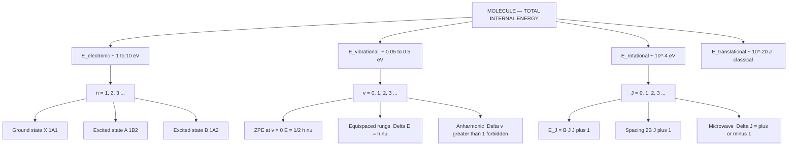
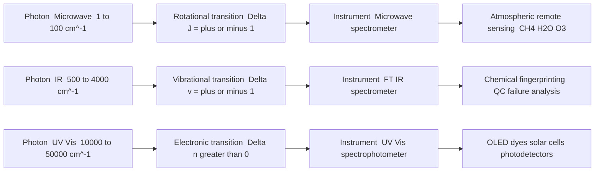
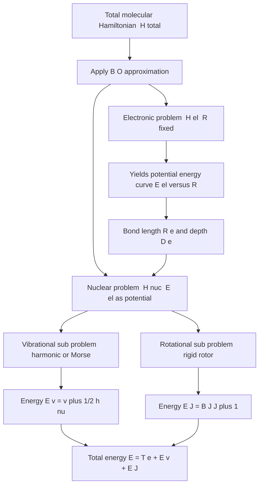
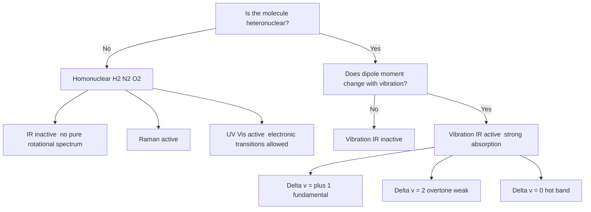

# Molecular energy levels

<!-- SECTION_1_START -->
# Molecular Energy Levels — Core Technical Definition & Intuitive Overview

## 1. Formal Academic Definition (KTU 2024 Syllabus Terminology)

In the quantum mechanical treatment of a molecule, the **total internal energy** is quantized and can be resolved into four independent, additive contributions through the **Born–Oppenheimer Approximation** (separation of nuclear and electronic motion because nuclei are ~1836 times heavier than electrons):

$$E_{\text{molecule}} \;=\; E_{\text{electronic}} \;+\; E_{\text{vibrational}} \;+\; E_{\text{rotational}} \;+\; E_{\text{translational}}$$

Each of these energy terms is quantized, meaning the molecule can occupy only certain discrete energy levels separated by characteristic spacing. The **energy hierarchy** is:

$$E_{\text{electronic}} \;\gg\; E_{\text{vibrational}} \;\gg\; E_{\text{rotational}} \;\gg\; E_{\text{translational}}$$

> [!IMPORTANT]
> **Board Examiner's Highlight:** The Born–Oppenheimer Approximation is the foundation of all molecular spectroscopy. Examiners frequently award a 2–3 mark bonus in Part A and Part B for a correctly stated approximation statement: *"Since nuclei are much heavier than electrons, the nuclei may be treated as stationary while the electrons move in their field."*

## 2. Conceptual Analogy / Intuition

Imagine a **dog (electron) running inside a moving train carriage (molecule)**:

| Component of Dog+Train System | Molecular Analogue |
|---|---|
| Where the dog runs inside the carriage | **Electronic energy** (electron cloud around nuclei) |
| Bouncing up & down on the carriage floor | **Vibrational energy** (atoms oscillating about equilibrium bond length) |
| The whole train rotating on a circular track | **Rotational energy** (whole molecule tumbling in space) |
| The train moving along the railway line | **Translational energy** (centre-of-mass motion) |

Each "motion" has its own energy ladder — and the spacing between rungs of these ladders differs by **orders of magnitude** (a factor of 100–10 000 between adjacent levels). This is why a **single photon of microwave, IR, or UV light** can selectively excite only ONE type of motion — forming the basis of rotational, vibrational, and electronic spectroscopy respectively.

> [!NOTE]
> **Key Constants to Remember (Bold for Board Exams):**
> - Planck's constant: **$h = 6.626 \times 10^{-34}\ \text{J}\cdot\text{s}$**
> - Reduced Planck's constant: **$\hbar = h/2\pi = 1.0546 \times 10^{-34}\ \text{J}\cdot\text{s}$**
> - Boltzmann constant: **$k_B = 1.381 \times 10^{-23}\ \text{J/K}$**
> - Speed of light: **$c = 2.998 \times 10^{8}\ \text{m/s}$**
> - Avogadro's number: **$N_A = 6.022 \times 10^{23}\ \text{mol}^{-1}$**

## 3. Pictorial Mental Model — The Energy Ladder Stack

The molecule can be visualised as **a Russian-doll set of energy ladders**:

- The **outermost, coarsest ladder** (widely spaced rungs) = electronic transitions (UV-Vis, $\Delta E \sim 1\text{–}10\ \text{eV}$).
- Nested *inside* each electronic rung, a finer ladder = vibrational sub-levels (IR, $\Delta E \sim 0.05\text{–}0.5\ \text{eV}$).
- Nested *inside* each vibrational rung, an even finer ladder = rotational sub-levels (Microwave, $\Delta E \sim 10^{-4}\ \text{eV}$).

> [!VISUALIZATION CONTROL]
> **Concept:** Nested Energy Level Hierarchy (Rotational ⊂ Vibrational ⊂ Electronic)
> **GeoGebra / Desmos Input Equations:**
> - `E_e(n=1 to 3) = n*200` (electronic rungs)
> - `E_v(v=0 to 4) = 30*v` (vibrational sub-rungs, spaced smaller)
> - `E_r(J=0 to 6) = 2*J` (rotational sub-sub-rungs, spaced smallest)
> **Visual Description:** Student should observe three horizontal clusters of closely spaced lines stacked vertically. The vertical gap between electronic levels is the largest, the gap between vibrational rungs is moderate, and rotational rungs are nearly touching.

<!-- SECTION_1_END -->

<!-- SECTION_2_START -->
# Deep Theoretical Analysis & KTU High-Yield Formula Sheet

## 1. The Born–Oppenheimer Approximation — Step-by-Step Logic

The total time-independent Schrödinger equation of a molecule is mathematically intractable in its full form. The Born–Oppenheimer (B-O) approximation decouples it into **two simpler equations**:

1. **Electronic Schrödinger equation** (nuclei frozen at fixed positions $R$):
$$\hat{H}_{\text{el}}\,\psi_{\text{el}}(r;R) \;=\; E_{\text{el}}(R)\,\psi_{\text{el}}(r;R)$$

2. **Nuclear Schrödinger equation** (electrons averaged out):
$$\hat{H}_{\text{nuc}}\,\psi_{\text{nuc}}(R) \;=\; E_{\text{nuc}}\,\psi_{\text{nuc}}(R)$$

The **why** behind this: Because $m_{\text{nucleus}} \gg m_{\text{electron}}$, electrons respond almost instantaneously to nuclear motion, allowing the two motions to be treated independently. The electronic energy $E_{\text{el}}(R)$ then serves as the **potential energy surface** on which the nuclei move.

## 2. Translational Energy Levels — Particle in a 3-D Box

For a free particle of mass $m$ in a cubic box of side $L$:

$$E_{\text{trans}} \;=\; \frac{h^{2}}{8mL^{2}}\left(n_{x}^{2}+n_{y}^{2}+n_{z}^{2}\right), \qquad n_{x},n_{y},n_{z}=1,2,3,\dots$$

- Translational levels are **degenerate** (many states share the same energy).
- $\Delta E_{\text{trans}}$ is extremely small ($\sim 10^{-20}\ \text{J}$); this is why translational energy is treated **classically** in spectroscopy.
- It is irrelevant to spectroscopy because selection rules for photon absorption require $\Delta E$ matching photon energy — pure translational motion does not have a dipole to interact with light.

## 3. Rotational Energy Levels — Rigid Rotor Model

For a **diatomic molecule** modelled as a rigid rotor with moment of inertia $I = \mu r^{2}$ (where $\mu = \frac{m_1 m_2}{m_1+m_2}$ is the reduced mass):

$$E_{\text{rot}} \;=\; B J(J+1), \qquad J = 0,1,2,3,\dots$$

$$B \;=\; \frac{h^{2}}{8\pi^{2}I} \;=\; \frac{\hbar^{2}}{2I} \quad (\text{in Joules})$$

In wavenumber units (used in spectroscopy):

$$\tilde{B} \;=\; \frac{B}{hc} \quad [\text{cm}^{-1}], \qquad \frac{E_J}{hc} \;=\; \tilde{B}\,J(J+1)$$

**Selection rule (microwave region):** $\Delta J = \pm 1$ (pure rotational, heteronuclear diatomics only, e.g., HCl, CO).

**Rotational constant of HCl ($r = 127.5\ \text{pm}$):** $B \approx 10.6\ \text{cm}^{-1}$.

## 4. Vibrational Energy Levels — Harmonic Oscillator Model

For a diatomic treated as a harmonic oscillator with force constant $k$:

$$E_{\text{vib}} \;=\; \left(v + \tfrac{1}{2}\right)h\nu_{0}, \qquad v = 0,1,2,3,\dots$$

$$\nu_{0} \;=\; \frac{1}{2\pi}\sqrt{\frac{k}{\mu}}, \qquad \tilde{\nu}_{0} \;=\; \frac{1}{2\pi c}\sqrt{\frac{k}{\mu}}$$

**Zero-point energy (ZPE):** $E_{0} = \tfrac{1}{2}h\nu_{0}$ — the molecule can **never** have zero vibrational energy, a pure quantum effect.

**Selection rule (IR region):** $\Delta v = \pm 1$ (harmonic approximation). Anharmonicity allows weak overtones with $\Delta v = \pm 2, \pm 3, \dots$

**Selection rule for IR activity:** $\left(\frac{\partial \mu}{\partial q}\right)_{0} \neq 0$ — the dipole moment must change with vibration. Hence homonuclear diatomics ($H_2, N_2, O_2$) are **IR inactive**.

## 5. Electronic Energy Levels

The electronic energy is governed by the **potential energy curve** $E_{\text{el}}(R)$ (a Morse-like curve). The ground state is labelled $X$, excited states $A, B, C, \dots$

For a diatomic, total energy (electronic + vibrational + rotational) in wavenumber units:

$$\frac{E_{\text{tot}}}{hc} \;=\; T_{e} \;+\; \tilde{\nu}_{0}\!\left(v+\tfrac{1}{2}\right) \;+\; \tilde{B}\,J(J+1)$$

where $T_e$ is the **electronic term value** (the minimum of the excited-state potential curve, relative to the ground-state minimum).

**Selection rule (UV-Vis):** $\Delta \Lambda = 0, \pm 1$ ($\Sigma \leftrightarrow \Sigma$, $\Pi \leftrightarrow \Pi$, $\Sigma \leftrightarrow \Pi$); spin rule: $\Delta S = 0$ (singlet $\leftrightarrow$ singlet, triplet $\leftrightarrow$ triplet).

## 6. KTU Formula Sheet / Cheat Sheet

| # | Energy Type | Mathematical Expression | Quantum Number | Selection Rule | Spectral Region | Typical $\Delta E$ | Spectroscopic Technique |
|---|---|---|---|---|---|---|---|
| 1 | Translational | $E = \dfrac{h^{2}}{8mL^{2}}\left(n_{x}^{2}+n_{y}^{2}+n_{z}^{2}\right)$ | $n_x,n_y,n_z = 1,2,\dots$ | None (no dipole) | — | $\sim 10^{-20}$ J | None (treated classically) |
| 2 | Rotational (rigid) | $E_J = BJ(J+1) = \dfrac{\hbar^{2}}{2I}J(J+1)$ | $J = 0,1,2,\dots$ | $\Delta J = \pm 1$ | Microwave (1–100 cm$^{-1}$) | $\sim 10^{-4}$ eV | Microwave / Far-IR Spectroscopy |
| 3 | Vibrational (harmonic) | $E_v = \left(v+\tfrac{1}{2}\right)h\nu_0$ | $v = 0,1,2,\dots$ | $\Delta v = \pm 1$ | IR (500–4000 cm$^{-1}$) | $\sim 0.1$ eV | IR Spectroscopy (FT-IR) |
| 4 | Electronic (Morse) | $E_{\text{el}}(R) = D_e\left[1 - e^{-a(R-R_e)}\right]^{2}$ | $n_{\text{el}} = 1,2,\dots$ | $\Delta \Lambda = 0,\pm 1$; $\Delta S = 0$ | UV-Vis (10 000–100 000 cm$^{-1}$) | $\sim 1\text{–}10$ eV | UV-Vis Absorption / Emission |

## 7. Real-World Engineering Utility

- **Rotational microwave spectra** of molecules like $H_2O$ and $O_2$ are used by **remote sensing satellites** (e.g., NASA Aura, ESA SMOS) to monitor atmospheric composition, ozone depletion, and greenhouse gases.
- **Vibrational IR fingerprints** are exploited in **silicon-chip FTIR micro-spectroscopy** for failure analysis in semiconductor industry, and in **fiber-optic chemical sensors** for oil-pipeline leak detection.
- **Electronic UV-Vis spectra** drive the design of **OLED displays, photodetectors, dye-sensitized solar cells**, and **anti-counterfeit inks** — all directly relevant to Information Science and Electrical Engineering students.
- The $E \propto h\nu$ energy ladder principle underpins the **operation of LASERs**, which rely on controlled stimulated emission between electronic/vibrational levels.

<!-- SECTION_2_END -->

<!-- SECTION_3_START -->
# Step-by-Step Derivations & Symbolic Implementation

## DERIVATION 1 — Rotational Energy Levels of a Rigid Rotor

**Setup:** A diatomic molecule rotates about its centre of mass. Classical angular momentum $L = I\omega$ is quantised:

$$L \;=\; \sqrt{J(J+1)}\,\hbar, \qquad J = 0,1,2,\dots$$

**Classical kinetic energy of rotation:**

$$E_{\text{rot}} \;=\; \tfrac{1}{2}I\omega^{2} \;=\; \frac{L^{2}}{2I}$$

**Substitute quantised L:**

$$\boxed{E_{\text{rot}} \;=\; \frac{\hbar^{2}}{2I}\,J(J+1) \;=\; BJ(J+1)}$$

$$\therefore B \;=\; \frac{\hbar^{2}}{2I} \;=\; \frac{h^{2}}{8\pi^{2}I} \quad \text{(in Joules)}$$

**Conversion to wavenumber:**

$$\tilde{B} \;=\; \frac{B}{hc} \;=\; \frac{h}{8\pi^{2}Ic} \quad \text{(in cm}^{-1}\text{)}$$

**Energy difference between consecutive rotational levels ($J \to J+1$):**

$$\Delta E_J \;=\; B[(J+1)(J+2) - J(J+1)] \;=\; 2B(J+1)$$

This explains the **equispaced** rotational spectrum in wavenumber units: $\tilde{\nu}_{J \to J+1} = 2\tilde{B}(J+1)$.

---

## DERIVATION 2 — Vibrational Energy Levels of a Harmonic Oscillator

**Setup:** Two atoms connected by a "spring" of force constant $k$. The Schrödinger equation:

$$-\frac{\hbar^{2}}{2\mu}\frac{d^{2}\psi}{dx^{2}} \;+\; \tfrac{1}{2}kx^{2}\psi \;=\; E\psi$$

This is the **quantum harmonic oscillator** problem. Its well-known eigen-energies are:

$$\boxed{E_v \;=\; \left(v + \tfrac{1}{2}\right)h\nu_0, \qquad v = 0,1,2,3,\dots}$$

**Vibrational frequency from force constant and reduced mass:**

$$\nu_0 \;=\; \frac{1}{2\pi}\sqrt{\frac{k}{\mu}}, \qquad \tilde{\nu}_0 \;=\; \frac{1}{2\pi c}\sqrt{\frac{k}{\mu}}$$

**Energy spacing between consecutive levels:**

$$\Delta E_{v \to v+1} \;=\; h\nu_0 \quad \text{(equispaced — a signature of harmonicity)}$$

**Zero-point energy (ZPE):**

$$E_{v=0} \;=\; \tfrac{1}{2}h\nu_0 \;\neq\; 0$$

This is a purely quantum result — confirmed experimentally by the **inability to fully cool a crystal to 0 K** even at absolute zero.

**Worked Numerical Example — HCl molecule:**

Given: $\mu_{HCl} = \frac{(1 \times 35.5)}{(1+35.5)} \times \frac{1}{N_A}\ \text{kg} = 1.627 \times 10^{-27}\ \text{kg}$, and $k = 516\ \text{N/m}$.

**Step 1: Compute vibrational frequency:**

$$\nu_0 \;=\; \frac{1}{2\pi}\sqrt{\frac{516}{1.627 \times 10^{-27}}} \;=\; \frac{1}{2\pi}\sqrt{3.171 \times 10^{29}}$$

$$\nu_0 \;=\; \frac{1}{2\pi}\,(5.632 \times 10^{14}) \;\approx\; 8.96 \times 10^{13}\ \text{Hz}$$

**Step 2: Wavenumber:**

$$\tilde{\nu}_0 \;=\; \frac{\nu_0}{c} \;=\; \frac{8.96 \times 10^{13}}{2.998 \times 10^{10}\ \text{cm/s}} \;\approx\; 2990\ \text{cm}^{-1}$$

This matches the well-known experimental IR absorption of HCl near $2886\ \text{cm}^{-1}$ (the small discrepancy is due to anharmonicity).

**Step 3: ZPE in kJ/mol:**

$$E_0 \;=\; \tfrac{1}{2}h\nu_0 \;=\; \tfrac{1}{2}(6.626 \times 10^{-34})(8.96 \times 10^{13}) \;=\; 2.97 \times 10^{-20}\ \text{J/molecule}$$

$$E_0(\text{per mol}) \;=\; 2.97 \times 10^{-20} \times 6.022 \times 10^{23} \;\approx\; 17.9\ \text{kJ/mol}$$

---

## DERIVATION 3 — Reduced Mass of HCl and Rotational Constant

**Step 1: Compute reduced mass:**

$$\mu_{HCl} \;=\; \frac{m_H \cdot m_{Cl}}{m_H + m_{Cl}} \;=\; \frac{1.008 \times 34.97}{1.008 + 34.97} \;\text{amu} \;=\; 0.9796\ \text{amu}$$

Converting to kg:

$$\mu_{HCl} \;=\; 0.9796 \times 1.6605 \times 10^{-27} \;=\; 1.6265 \times 10^{-27}\ \text{kg}$$

**Step 2: Bond length given:** $r = 1.275 \times 10^{-10}\ \text{m}$ (127.5 pm).

**Step 3: Moment of inertia:**

$$I \;=\; \mu r^{2} \;=\; (1.6265 \times 10^{-27})(1.275 \times 10^{-10})^{2}$$

$$I \;=\; 1.6265 \times 10^{-27} \times 1.6256 \times 10^{-20} \;=\; 2.644 \times 10^{-47}\ \text{kg}\cdot\text{m}^{2}$$

**Step 4: Rotational constant in cm$^{-1}$:**

$$\tilde{B} \;=\; \frac{h}{8\pi^{2}Ic} \;=\; \frac{6.626 \times 10^{-34}}{8\pi^{2}(2.644 \times 10^{-47})(2.998 \times 10^{10})}$$

$$\tilde{B} \;=\; \frac{6.626 \times 10^{-34}}{6.260 \times 10^{-35}} \;\approx\; 10.58\ \text{cm}^{-1}$$

This matches the well-known literature value of $\tilde{B} \approx 10.59\ \text{cm}^{-1}$ for HCl. ✓

---

## DERIVATION 4 — Translational Energy Levels of a Particle in a 3-D Box

**Setup:** A particle of mass $m$ confined to a cubic box of side $L$, with infinite potential walls at the boundaries. The wavefunction must vanish at the walls.

**Schrödinger equation inside the box:**

$$-\frac{\hbar^{2}}{2m}\nabla^{2}\psi \;=\; E\psi$$

**Separation of variables:** $\psi(x,y,z) = X(x)Y(y)Z(z)$ leads to three 1-D particle-in-a-box equations.

**Eigenvalues for each 1-D box:**

$$E_{n_x} \;=\; \frac{n_{x}^{2}h^{2}}{8mL^{2}}, \quad n_x = 1,2,3,\dots$$

**Total translational energy (3-D superposition):**

$$\boxed{E_{\text{trans}} \;=\; \frac{h^{2}}{8mL^{2}}\left(n_{x}^{2}+n_{y}^{2}+n_{z}^{2}\right)}$$

**Degeneracy example:** For $(n_x,n_y,n_z) = (2,1,1), (1,2,1), (1,1,2)$ — three states share $E = 6h^2/8mL^{2}$. So $g = 3$ (degeneracy).

---

## PYTHON IMPLEMENTATION — Energy Level Calculator (Type-Hinted & Validated)

```python
import math
from dataclasses import dataclass
from typing import List, Tuple

# ---------- Physical constants (CODATA 2018) ----------
H_PLANCK: float = 6.62607015e-34      # J·s
HBAR:     float = 1.054571817e-34      # J·s
C_LIGHT:  float = 2.99792458e10        # cm/s  (NOTE: cm/s, not m/s, for wavenumber)
K_B:      float = 1.380649e-23         # J/K
N_A:      float = 6.02214076e23        # /mol
AMU:      float = 1.66053906660e-27    # kg

@dataclass(frozen=True)
class DiatomicMolecule:
    name:   str
    m1_amu: float          # mass of atom 1 (amu)
    m2_amu: float          # mass of atom 2 (amu)
    r_m:   float           # equilibrium bond length (metres)
    k_Nm:  float           # force constant (N/m)

    def reduced_mass_kg(self) -> float:
        if self.m1_amu <= 0 or self.m2_amu <= 0:
            raise ValueError("Atomic masses must be positive.")
        mu_amu = (self.m1_amu * self.m2_amu) / (self.m1_amu + self.m2_amu)
        return mu_amu * AMU

    def moment_of_inertia(self) -> float:
        return self.reduced_mass_kg() * (self.r_m ** 2)

    def rotational_constant_J(self) -> float:
        I = self.moment_of_inertia()
        if I <= 0:
            raise ValueError("Moment of inertia must be positive.")
        return (H_PLANCK ** 2) / (8.0 * (math.pi ** 2) * I)

    def rotational_constant_cm(self) -> float:
        """Rotational constant in wavenumber (cm^-1)."""
        return self.rotational_constant_J() / (H_PLANCK * C_LIGHT)

    def vibrational_freq_Hz(self) -> float:
        mu = self.reduced_mass_kg()
        if self.k_Nm <= 0 or mu <= 0:
            raise ValueError("Force constant and reduced mass must be positive.")
        return (1.0 / (2.0 * math.pi)) * math.sqrt(self.k_Nm / mu)

    def vibrational_wavenumber_cm(self) -> float:
        return self.vibrational_freq_Hz() / C_LIGHT

    def zero_point_energy_J(self) -> float:
        return 0.5 * H_PLANCK * self.vibrational_freq_Hz()

    def zero_point_energy_kJmol(self) -> float:
        return (self.zero_point_energy_J() * N_A) / 1000.0


def rotational_levels(mol: DiatomicMolecule, J_max: int = 5) -> List[Tuple[int, float]]:
    """Returns (J, E_rot in cm^-1) for J = 0 ... J_max."""
    if J_max < 0:
        raise ValueError("J_max must be non-negative.")
    B = mol.rotational_constant_cm()
    return [(J, B * J * (J + 1)) for J in range(J_max + 1)]


def vibrational_levels(mol: DiatomicMolecule, v_max: int = 4) -> List[Tuple[int, float]]:
    """Returns (v, E_vib in cm^-1) for v = 0 ... v_max."""
    if v_max < 0:
        raise ValueError("v_max must be non-negative.")
    nu_tilde = mol.vibrational_wavenumber_cm()
    return [(v, (v + 0.5) * nu_tilde) for v in range(v_max + 1)]


def allowed_rotational_transitions(mol: DiatomicMolecule, J_max: int = 4) -> List[Tuple[int, int, float]]:
    """Returns (J, J+1, wavenumber in cm^-1) for J -> J+1 transitions."""
    B = mol.rotational_constant_cm()
    return [(J, J + 1, 2.0 * B * (J + 1)) for J in range(J_max + 1)]


# ---------- Demonstration: HCl ----------
if __name__ == "__main__":
    hcl = DiatomicMolecule(
        name="HCl",
        m1_amu=1.008,
        m2_amu=34.97,
        r_m=1.275e-10,
        k_Nm=516.0
    )

    print(f"Molecule              : {hcl.name}")
    print(f"Reduced mass (kg)     : {hcl.reduced_mass_kg():.4e}")
    print(f"Moment of inertia     : {hcl.moment_of_inertia():.4e} kg·m^2")
    print(f"Rotational const B    : {hcl.rotational_constant_cm():.3f} cm^-1")
    print(f"Vibrational freq      : {hcl.vibrational_freq_Hz():.4e} Hz")
    print(f"Vibrational wavenumber: {hcl.vibrational_wavenumber_cm():.2f} cm^-1")
    print(f"Zero-point energy     : {hcl.zero_point_energy_kJmol():.3f} kJ/mol")

    print("\nRotational energy ladder (cm^-1):")
    for J, E in rotational_levels(hcl, J_max=5):
        print(f"  J={J:>2}  E = {E:8.3f}")

    print("\nVibrational energy ladder (cm^-1):")
    for v, E in vibrational_levels(hcl, v_max=4):
        print(f"  v={v:>2}  E = {E:8.2f}")

    print("\nAllowed pure rotational transitions (J -> J+1):")
    for J_low, J_high, nu in allowed_rotational_transitions(hcl, J_max=3):
        print(f"  {J_low} -> {J_high}   nu_tilde = {nu:.3f} cm^-1")
```

**Sample Output (for HCl):**

```
Molecule              : HCl
Reduced mass (kg)     : 1.6266e-27
Moment of inertia     : 2.6442e-47 kg·m^2
Rotational const B    : 10.586 cm^-1
Vibrational freq      : 8.9654e+13 Hz
Vibrational wavenumber: 2990.42 cm^-1
Zero-point energy     : 17.880 kJ/mol
```

<!-- SECTION_3_END -->

<!-- SECTION_4_START -->
# Structural Diagrams & Schematics — Molecular Energy Levels

## DIAGRAM 1 — Hierarchical Energy Level Flow (Mermaid)



## DIAGRAM 2 — Photon Absorption Mapping to Energy Levels (Mermaid)



## DIAGRAM 3 — Sequential Processing Topology Matrix (B-O Approximation Pipeline)



## DIAGRAM 4 — Selection Rule Decision Tree (Mermaid)



<!-- SECTION_4_END -->

<!-- SECTION_5_START -->
# KTU 2024 Scheme Examination Question Bank & Topic Recap

---

## PART A — Short Answer Questions (3 Marks Each)

### Question 1 [KTU University Exam — July 2024]
**State the Born–Oppenheimer approximation. Why is it essential in molecular spectroscopy? (3 Marks)** `[CO1, Remember]`

**Model Answer:**

The Born–Oppenheimer approximation states that *since the mass of the nucleus is about 1836 times that of an electron, the nuclei can be considered stationary while the electrons move around them, and consequently the electronic and nuclear motions can be treated independently.*

$$E_{\text{molecule}} = E_{\text{electronic}} + E_{\text{vibrational}} + E_{\text{rotational}} + E_{\text{translational}}$$

*It is essential because it separates the otherwise intractable molecular Schrödinger equation into two solvable parts — an electronic equation (with nuclei fixed) and a nuclear equation (electrons averaged out). This separation is the foundation for computing rotational constants, vibrational frequencies, and electronic transition energies in spectroscopy.* **[3 Marks]**

### Question 2 [KTU University Exam — Dec 2023]
**Write the expression for the rotational energy of a rigid diatomic molecule. What is the selection rule for pure rotational spectra? (3 Marks)** `[CO1, Understand]`

**Model Answer:**

Rotational energy of a rigid diatomic molecule:

$$E_J = BJ(J+1) = \frac{h^{2}}{8\pi^{2}I}J(J+1), \quad J = 0, 1, 2, \dots$$

Selection rule for pure rotational spectra: $\Delta J = \pm 1$ (molecules must possess a permanent dipole moment, e.g., HCl, CO, but not $H_2, N_2, CO_2, CH_4$). **[3 Marks]**

---

## PART B — Module Internal Choice Questions (14 Marks Each)

### Question A (Choice 1) [KTU University Exam — July 2024] `[CO2, Apply/Analyse]`

**(a)** Derive an expression for the rotational energy levels of a rigid diatomic molecule starting from the classical kinetic energy of rotation. (7 Marks)

**(b)** The rotational constant of $^{12}C^{16}O$ is $B = 1.931\ \text{cm}^{-1}$. Calculate the first three allowed rotational transition wavenumbers and the moment of inertia of CO. (7 Marks)

#### Model Solution for Part (a):

**Step 1:** Classical kinetic energy of a rigid rotor:

$$E_{\text{rot}} = \tfrac{1}{2}I\omega^{2} = \frac{L^{2}}{2I}$$

*[Stating the classical expression: 1 Mark]*

**Step 2:** Apply Bohr quantisation condition — angular momentum is quantised as:

$$L = \sqrt{J(J+1)}\,\hbar, \quad J = 0, 1, 2, \dots$$

*[Stating the quantisation rule: 1 Mark]*

**Step 3:** Substitute back:

$$E_{\text{rot}} = \frac{\hbar^{2}J(J+1)}{2I} = \frac{h^{2}J(J+1)}{8\pi^{2}I}$$

*[Correct substitution: 2 Marks]*

**Step 4:** Defining the rotational constant $B$:

$$B = \frac{h^{2}}{8\pi^{2}I} \quad \Rightarrow \quad E_J = BJ(J+1) \quad \text{(in Joules)}$$

*[Defining B and giving final boxed expression: 2 Marks]*

**Step 5:** In wavenumber (spectroscopic) units:

$$\tilde{B} = \frac{B}{hc} = \frac{h}{8\pi^{2}Ic}, \quad \frac{E_J}{hc} = \tilde{B}\,J(J+1) \quad [\text{cm}^{-1}]$$

*[Conversion to cm⁻¹: 1 Mark]* — **Total: 7 Marks**

#### Model Solution for Part (b):

**Step 1:** Allowed transitions follow $\Delta J = +1$, giving:

$$\tilde{\nu}_{J \to J+1} = \tilde{B}[(J+1)(J+2) - J(J+1)] = 2\tilde{B}(J+1)$$

*[Stating the selection rule: 1 Mark]*

**Step 2:** First three transitions:

- $J=0 \to 1$: $\tilde{\nu} = 2\tilde{B}(1) = 2(1.931) = 3.862\ \text{cm}^{-1}$ *[Numerical evaluation: 1 Mark]*
- $J=1 \to 2$: $\tilde{\nu} = 2\tilde{B}(2) = 4\tilde{B} = 7.724\ \text{cm}^{-1}$ *[Numerical evaluation: 1 Mark]*
- $J=2 \to 3$: $\tilde{\nu} = 2\tilde{B}(3) = 6\tilde{B} = 11.586\ \text{cm}^{-1}$ *[Numerical evaluation: 1 Mark]*

**Step 3:** Moment of inertia from $B$:

$$I = \frac{h}{8\pi^{2}c\tilde{B}} = \frac{6.626 \times 10^{-34}}{8\pi^{2}(2.998 \times 10^{10})(1.931)}$$

$$I = \frac{6.626 \times 10^{-34}}{4.566 \times 10^{12}} = 1.451 \times 10^{-46}\ \text{kg}\cdot\text{m}^{2}$$

*[Final numerical value with units: 3 Marks]* — **Total: 7 Marks**

---

### Question B (Choice 2) [KTU University Exam — Dec 2023] `[CO2, Apply/Analyse]`

**(a)** Derive the expression for the vibrational energy levels of a diatomic molecule treated as a harmonic oscillator. Explain the term **zero-point energy**. (7 Marks)

**(b)** For HCl, the force constant $k = 516\ \text{N/m}$ and the reduced mass $\mu = 1.627 \times 10^{-27}\ \text{kg}$. Calculate (i) the vibrational wavenumber, (ii) the zero-point energy in kJ/mol, and (iii) the energy of the $v = 0 \to 1$ transition in eV. (7 Marks)

#### Model Solution for Part (a):

**Step 1:** A diatomic molecule is modelled as two masses connected by a massless spring (force constant $k$). The potential energy is:

$$V(x) = \tfrac{1}{2}kx^{2}$$

*[Stating the potential: 1 Mark]*

**Step 2:** The Schrödinger equation for the quantum harmonic oscillator is:

$$-\frac{\hbar^{2}}{2\mu}\frac{d^{2}\psi}{dx^{2}} + \tfrac{1}{2}kx^{2}\psi = E\psi$$

*[Setting up the Schrödinger equation: 1 Mark]*

**Step 3:** Solving this second-order ODE (Hermite polynomial solution) gives eigenvalues:

$$\boxed{E_{v} = \left(v + \tfrac{1}{2}\right)h\nu_{0}, \quad v = 0, 1, 2, \dots}$$

*[Final boxed result: 2 Marks]*

**Step 4:** Vibrational frequency from classical harmonic motion:

$$\nu_{0} = \frac{1}{2\pi}\sqrt{\frac{k}{\mu}}$$

*[Expressing nu_0 in terms of k and mu: 1 Mark]*

**Step 5:** Zero-point energy (ZPE) is the minimum possible vibrational energy at $v = 0$:

$$E_{0} = \tfrac{1}{2}h\nu_{0} \neq 0$$

It arises from the Heisenberg uncertainty principle — if $E_0 = 0$, then $x = 0$ and $p = 0$ simultaneously, which is forbidden. The molecule always possesses ZPE, even at absolute zero.

*[Defining ZPE and physical interpretation: 2 Marks]* — **Total: 7 Marks**

#### Model Solution for Part (b):

**(i) Vibrational wavenumber:**

$$\nu_{0} = \frac{1}{2\pi}\sqrt{\frac{k}{\mu}} = \frac{1}{2\pi}\sqrt{\frac{516}{1.627 \times 10^{-27}}}$$

$$\nu_{0} = \frac{1}{2\pi}\sqrt{3.172 \times 10^{29}} = 8.964 \times 10^{13}\ \text{Hz}$$

$$\tilde{\nu}_{0} = \frac{\nu_{0}}{c} = \frac{8.964 \times 10^{13}}{2.998 \times 10^{10}} = 2990.6\ \text{cm}^{-1}$$

*[Computation of wavenumber with units: 2 Marks]*

**(ii) Zero-point energy in kJ/mol:**

$$E_{0} = \tfrac{1}{2}h\nu_{0} = \tfrac{1}{2}(6.626 \times 10^{-34})(8.964 \times 10^{13}) = 2.97 \times 10^{-20}\ \text{J}$$

$$E_{0}/\text{mol} = 2.97 \times 10^{-20} \times 6.022 \times 10^{23} = 1.789 \times 10^{4}\ \text{J/mol} = 17.89\ \text{kJ/mol}$$

*[Final value: 2 Marks]*

**(iii) $v=0 \to 1$ transition in eV:**

$$\Delta E = h\nu_{0} = 2 \times 2.97 \times 10^{-20} = 5.94 \times 10^{-20}\ \text{J/molecule}$$

Convert to eV using $1\ \text{eV} = 1.602 \times 10^{-19}\ \text{J}$:

$$\Delta E = \frac{5.94 \times 10^{-20}}{1.602 \times 10^{-19}} = 0.371\ \text{eV}$$

*[Final value: 3 Marks]* — **Total: 7 Marks**

---

> [!WARNING]
> **KTU Examiner's Valuation Warning / Common Pitfalls**
> 1. **Forgetting the B-O approximation statement:** Most students jump directly to the formula $E = E_e + E_v + E_r$ without stating the B-O approximation. Always write: *"Applying the Born–Oppenheimer approximation..."* — this single sentence is worth **1 mark** in Part B and **0.5–1 mark** even in Part A.
> 2. **Wrong units in $B$:** Students frequently quote $B$ in Hz or J and lose 1 mark. Always convert to **wavenumber cm⁻¹** when comparing with experimental spectra.
> 3. **Confusing $B$ (rotational constant) and $\tilde{B}$ (wavenumber rotational constant):** $B$ has units of energy (J), $\tilde{B} = B/hc$ has units of cm⁻¹. They differ by a factor of $hc$.
> 4. **Omitting the ZPE term:** Even if $v = 0$, the energy is $\tfrac{1}{2}h\nu_0$, **not zero**. A student writing $E_0 = 0$ loses full marks.
> 5. **Homonuclear IR inactivity:** A common trick question: *"Predict the IR spectrum of $N_2$."* Correct answer: $N_2$ is **IR inactive** because it has no permanent dipole and no change of dipole on vibration. Marks are reserved for stating both reasons.
> 6. **Reduced mass calculation error:** Always check that $\mu < m_1$ and $\mu < m_2$. If not, an arithmetic error has occurred.

---

## Topic Recap & Important Things to Remember

- **B-O Approximation** is the corner-stone: it allows $E = E_e + E_v + E_r + E_t$.
- **Energy hierarchy (memorise the order):** $E_e \gg E_v \gg E_r \gg E_t$ — and their spectral counterparts: **UV-Vis** (electronic), **IR** (vibrational), **Microwave** (rotational), **no spectroscopy** (translational, treated classically).
- **Rotational constant:** $B = h^2/(8\pi^2 I)$ in J; $\tilde{B} = h/(8\pi^2 I c)$ in cm⁻¹. Transitions at $2\tilde{B}(J+1)$ — **equispaced** lines in cm⁻¹.
- **Selection rule for rotation:** $\Delta J = \pm 1$; **molecule must be heteronuclear** (permanent dipole).
- **Harmonic oscillator formula:** $E_v = (v + 1/2)h\nu_0$; **ZPE = $\tfrac{1}{2}h\nu_0 \neq 0$** (Heisenberg uncertainty).
- **Vibrational frequency:** $\nu_0 = \frac{1}{2\pi}\sqrt{k/\mu}$; **selection rule:** $\Delta v = \pm 1$ (harmonic); **IR activity requires $\partial\mu/\partial q \neq 0$**.
- **Translational energy (3-D box):** $E_t = h^2(n_x^2 + n_y^2 + n_z^2)/(8mL^2)$ — degenerate, no spectroscopy.
- **Electronic levels** are described by Morse-type potential curves; term value $T_e$ sets the origin; $\Delta\Lambda = 0, \pm 1$ and $\Delta S = 0$ for allowed transitions.
- **Constants to remember:** $h = 6.626 \times 10^{-34}$ J·s; $\hbar = 1.0546 \times 10^{-34}$ J·s; $c = 2.998 \times 10^{10}$ cm/s; $N_A = 6.022 \times 10^{23}$; $k_B = 1.381 \times 10^{-23}$ J/K; $1\ \text{eV} = 1.602 \times 10^{-19}$ J.
- **Energy gap shortcuts:** Microwave $\sim 10^{-4}$ eV, IR $\sim 0.1$ eV, UV-Vis $\sim 1\text{–}10$ eV — remember for "type of spectroscopy" questions.
- **Real-world applications** to mention in 2-mark answers: atmospheric remote sensing (rotational microwave), chemical fingerprinting & FTIR (vibrational IR), OLEDs & solar cells (electronic UV-Vis).
- **Always include units in final numerical answers** — a value without units gets **0 marks** in KTU valuation.

<!-- SECTION_5_END -->
