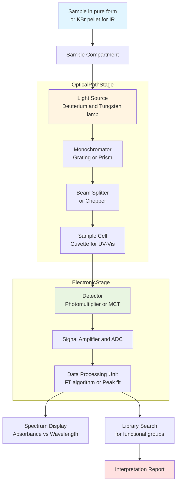
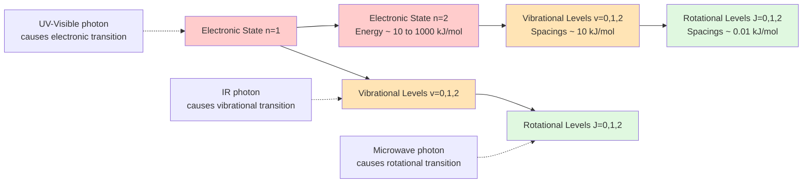
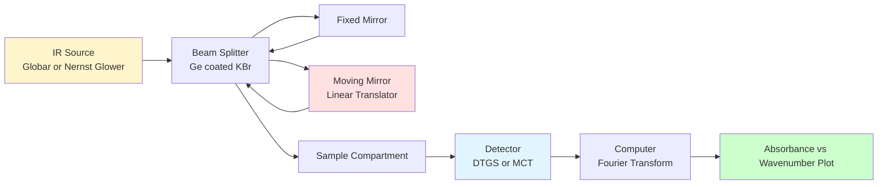
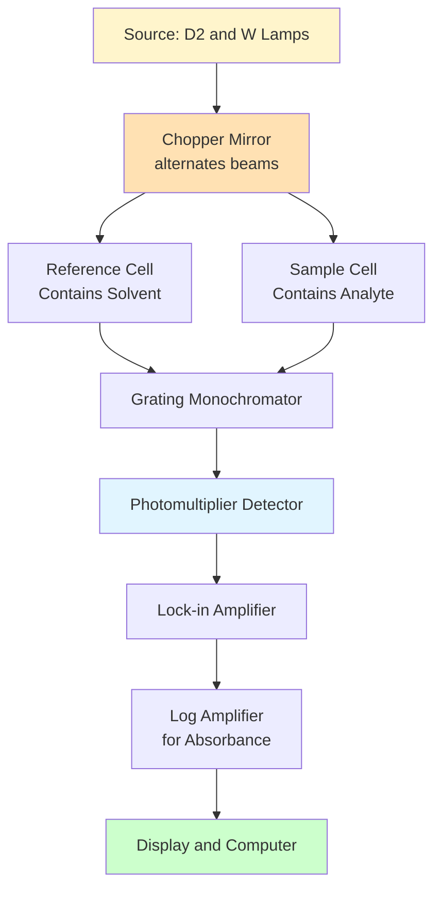
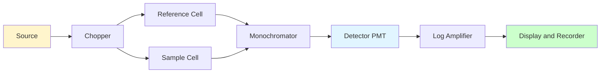

# Molecular Spectroscopy and Analytical Techniques

<!-- SECTION_1_START -->
# Module 3: Molecular Spectroscopy and Analytical Techniques

## 1.1 Electromagnetic Radiation: The Foundation of All Spectroscopy

> [!IMPORTANT]
> **Core Definition (KTU 2024 Syllabus Aligned):**
> **Spectroscopy** is the branch of analytical chemistry that studies the interaction between electromagnetic (EM) radiation and matter, providing both qualitative (structural) and quantitative (concentration) information about a sample.

### Conceptual Analogy: The Musical Note of Molecules

Imagine you are sitting beside a piano. Every molecule is like a tiny piano. When you strike a key, it vibrates at a specific frequency. Similarly, when EM radiation of a specific energy strikes a molecule, only those photons whose energies **exactly match** the energy gaps between the molecule's allowed quantum states are absorbed. This selective absorption is the **fingerprint** of the molecule.

> [!NOTE]
> **The Master Equation (Planck-Einstein Relation):**
> The energy of a photon is given by $E = h\nu = \dfrac{hc}{\lambda}$, where $h = 6.626 \times 10^{-34}$ J·s is **Planck's constant**, $c = 3 \times 10^8$ m/s is the **speed of light**, and $\nu$ is the frequency in Hz.

### Regions of the Electromagnetic Spectrum

| Spectral Region | Wavelength Range | Frequency (Hz) | Molecular Process Triggered |
|-----------------|------------------|----------------|----------------------------|
| X-ray | $10^{-10}$ to $10^{-8}$ m | $10^{16}$–$10^{18}$ | Inner-shell electron transitions, crystal diffraction |
| UV-Visible | $10^{-8}$ to $10^{-6}$ m | $10^{14}$–$10^{16}$ | Valence electron transitions ($\pi \to \pi^*$, $n \to \pi^*$) |
| Infrared (IR) | $10^{-6}$ to $10^{-3}$ m | $10^{12}$–$10^{14}$ | Molecular vibrations (bond stretching/bending) |
| Microwave | $10^{-3}$ to $10^{-1}$ m | $10^{9}$–$10^{12}$ | Rotational motion, **EPR/ESR** transitions |
| Radiofrequency | $> 10^{-1}$ m | $< 10^{9}$ | **NMR** transitions (nuclear spin flips) |

> [!VISUALIZATION CONTROL]
> **Concept:** Energy levels of a polyatomic molecule (electronic, vibrational, rotational hierarchy)
> **Conceptual Plot Description:** The y-axis is energy $E$ (kJ/mol), the x-axis represents a generic coordinate. The lowest three lines (closely spaced) form a **rotational ladder** (spacings $\sim 10^{-3}$ kJ/mol). On top of each rotational level sits a **vibrational ladder** (spacings $\sim 10$ kJ/mol). On top of each vibrational level sits an **electronic state** (spacings $\sim 100$–$1000$ kJ/mol). A vertical arrow from a lower electronic state to a higher one represents a **UV-Visible electronic transition**, with vibrational fine structure superimposed.

---

## 1.2 Types of Molecular Energy Transitions

A molecule can absorb EM radiation only when the photon's energy matches the energy difference between two quantum states. The three primary quantized processes are:

1. **Electronic transitions** — promotion of an electron from a lower to a higher molecular orbital (UV-Visible region).
2. **Vibrational transitions** — quantized stretching and bending of covalent bonds (IR region).
3. **Rotational transitions** — quantized rotation of the entire molecule about its center of mass (Microwave region).

> [!TIP]
> **Selection Rule of Thumb (KTU High-Yield):**
> For a transition to be spectroscopically **allowed** (i.e., observable with strong intensity), the transition moment integral $\int \psi_f \, \hat{\mu} \, \psi_i \, d\tau$ must be non-zero, where $\hat{\mu}$ is the electric dipole moment operator.

---

## 1.3 Overview of Analytical Techniques in Information & Electrical Science

For an Information Science / Electrical Science engineer, spectroscopy and analytical methods are not abstract — they are used to **characterize materials** that go into devices like LEDs, photodetectors, semiconductor chips, optical fibers, and solar cells.

| Technique | Acronym | Primary Use in Electrical/IT Applications |
|-----------|---------|-------------------------------------------|
| UV-Visible Spectrophotometry | UV-Vis | Band-gap estimation of semiconductors, color of OLEDs |
| Fourier Transform IR | FTIR | Identifying polymer binders in PCB laminates |
| Nuclear Magnetic Resonance | NMR | Quality control of pharmaceutical-grade silicon precursors |
| X-Ray Diffraction | XRD | Crystallite size, phase identification of Si, GaAs, perovskites |
| Scanning Electron Microscopy | SEM | Surface morphology of microchips and nanowires |
| Atomic Force Microscopy | AFM | Atomic-scale roughness of wafer surfaces |
| Thermogravimetric Analysis | TGA | Thermal stability of polymer insulators |
| Gas Chromatography–Mass Spec | GC-MS | Trace impurity detection in photoresist solvents |

<!-- SECTION_1_END -->

<!-- SECTION_2_START -->
# 2. Deep Theoretical Analysis & KTU High-Yield Formula Sheet

## 2.1 UV-Visible Spectroscopy (Electronic Absorption Spectroscopy)

### 2.1.1 Origin and Selection Rules

UV-Visible spectroscopy arises from transitions of **valence electrons** between molecular orbitals. The two most important selection rules are:

1. **Spin Selection Rule:** $\Delta S = 0$ — The spin multiplicity must not change (singlet $\to$ singlet is allowed, singlet $\to$ triplet is forbidden).
2. **Laporte Selection Rule:** For centrosymmetric molecules, $g \to u$ transitions are allowed, $g \to g$ and $u \to u$ are forbidden.

> [!NOTE]
> **Why is this useful?**
> In a coordination compound (e.g., a transition-metal complex used in a dye-sensitized solar cell), $d$-$d$ transitions are **Laporte-forbidden**, so they are weak. This explains why such complexes are often pale in color. Adding a ligand that lowers symmetry (e.g., removing the center of inversion) increases intensity.

### 2.1.2 Common Electronic Transitions (in increasing energy order)

| Transition | Example Molecule | Typical $\lambda_{max}$ (nm) | Intensity ($\varepsilon_{max}$ in L·mol$^{-1}$·cm$^{-1}$) |
|------------|------------------|------------------------------|----------------------------------------------------------|
| $n \to \pi^*$ | Saturated aldehyde (e.g., acetone) | $\sim 280$ | $\sim 10$ to $100$ (weak) |
| $\pi \to \pi^*$ (isolated) | Ethylene | $\sim 170$ | $\sim 10{,}000$ (strong) |
| $\pi \to \pi^*$ (conjugated) | 1,3-Butadiene | $\sim 217$ | $\sim 21{,}000$ |
| $\pi \to \pi^*$ (extended conjugation) | $\beta$-Carotene | $\sim 450$ | $\sim 150{,}000$ |

### 2.1.3 Beer-Lambert Law — The Quantitative Backbone

$$A = \log_{10}\left(\dfrac{I_0}{I}\right) = \varepsilon \, c \, \ell$$

where $A$ is the **absorbance** (dimensionless), $I_0$ and $I$ are the intensities of the incident and transmitted light respectively, $\varepsilon$ is the **molar absorptivity** (L·mol$^{-1}$·cm$^{-1}$), $c$ is the molar concentration (mol·L$^{-1}$), and $\ell$ is the optical path length (cm).

> [!WARNING]
> **Common KTU Pitfall:** The Beer-Lambert law is strictly linear only at **low concentrations** (typically $A < 1.0$). At high concentrations, deviations occur due to solute-solute interactions and refractive index changes.

### 2.1.4 Tauc Plot for Semiconductor Band-Gap Determination

For semiconductor materials (used in solar cells, photodiodes), the optical band-gap is determined from the **Tauc relation**:

$$\left(\alpha h\nu\right)^{1/n} = A \left(h\nu - E_g\right)$$

where $\alpha$ is the absorption coefficient, $h\nu$ is the photon energy, $E_g$ is the optical band-gap, and $n = \tfrac{1}{2}$ for a direct allowed transition, $n = 2$ for an indirect allowed transition.

**Engineering Relevance:** Silicon ($E_g \approx 1.1$ eV) is used for solar cells because it absorbs across the visible spectrum. Gallium arsenide ($E_g \approx 1.43$ eV) is preferred for high-efficiency space photovoltaics.

---

## 2.2 Infrared (IR) Spectroscopy

### 2.2.1 Vibrational Modes

A non-linear molecule containing $N$ atoms has $3N - 6$ normal modes of vibration. A linear molecule has $3N - 5$ modes. Each mode has a characteristic frequency that acts as a group fingerprint.

> [!IMPORTANT]
> **Rule of Mutual Exclusion (KTU High-Yield):**
> For **centrosymmetric molecules** (e.g., $CO_2$, $N_2$, $C_2H_2$), vibrations that are IR-active are **Raman-inactive** and vice-versa. This is a powerful diagnostic tool.

### 2.2.2 Hooke's Law Approximation for Vibrational Frequency

The frequency of a simple diatomic harmonic oscillator is:

$$\nu = \dfrac{1}{2\pi c} \sqrt{\dfrac{k}{\mu}}$$

where $k$ is the **force constant** of the bond (N·m$^{-1}$), $\mu = \dfrac{m_1 m_2}{m_1 + m_2}$ is the **reduced mass** (kg), and $c$ is the speed of light.

**Engineering Implication:** Stronger bonds (higher $k$, e.g., $C \equiv O$ vs $C-O$) absorb at higher wavenumbers. Bonds to heavier atoms (higher $\mu$, e.g., $C-Br$ vs $C-F$) absorb at lower wavenumbers.

### 2.2.3 Characteristic IR Absorption Bands

| Bond Type | Wavenumber $\bar{\nu}$ (cm$^{-1}$) | Functional Group | Intensity |
|-----------|------------------------------------|------------------|-----------|
| $O-H$ (free) | 3600–3650 | Alcohol/Phenol | Strong, sharp |
| $O-H$ (H-bonded) | 3200–3400 | Alcohol (conc.) | Strong, broad |
| $N-H$ | 3300–3500 | Amine | Medium |
| $\equiv C-H$ | $\sim 3300$ | Alkyne | Strong, sharp |
| $=C-H$ | 3010–3100 | Aromatic/Alkene | Medium |
| $-C-H$ | 2850–2960 | Alkane | Strong |
| $C \equiv N$ | 2200–2260 | Nitrile | Medium |
| $C=O$ | 1680–1760 | Carbonyl | **Very strong** |
| $C=C$ | 1620–1680 | Alkene | Variable |
| $C-O$ | 1000–1300 | Alcohol/Ether | Strong |

---

## 2.3 Nuclear Magnetic Resonance (NMR) Spectroscopy

### 2.3.1 Physical Principle

Certain nuclei with odd mass numbers (e.g., $^{1}H$, $^{13}C$, $^{19}F$, $^{31}P$) possess a non-zero nuclear spin quantum number $I$. When placed in a strong external magnetic field $B_0$, the nucleus splits into $2I+1$ energy levels. A radiofrequency pulse of the right energy causes transitions between these levels.

The **Larmor precession frequency** is:

$$\nu_0 = \dfrac{\gamma B_0}{2\pi}$$

where $\gamma$ is the **gyromagnetic ratio** (rad·s$^{-1}$·T$^{-1}$), characteristic of the nucleus. For $^{1}H$, $\gamma \approx 2.675 \times 10^8$ rad·s$^{-1}$·T$^{-1}$.

### 2.3.2 Chemical Shift

The effective magnetic field at a nucleus is shielded by the electron cloud. The **chemical shift** $\delta$ is defined as:

$$\delta = \dfrac{\nu_{sample} - \nu_{reference}}{\nu_{spectrometer}} \times 10^6 \text{ ppm}$$

> [!NOTE]
> **Reference Standard:** Tetramethylsilane (TMS, $\text{Si(CH}_3\text{)}_4$) is the universal reference, assigned $\delta = 0$ ppm because its 12 equivalent protons are highly shielded.

### 2.3.3 Number of Signals and Splitting

| Feature | Information Provided |
|---------|----------------------|
| Number of signals | Number of chemically distinct proton environments |
| Chemical shift ($\delta$) | Electronic environment of the nucleus |
| Integration | Number of protons contributing to that signal |
| Multiplicity (n+1 rule) | Number of protons on **neighbouring** carbons |

> [!TIP]
> **The (n+1) Rule:** A signal is split into $n+1$ peaks by $n$ equivalent neighbouring protons. A quartet indicates 3 neighbouring protons, a triplet indicates 2, a doublet indicates 1.

---

## 2.4 Mass Spectrometry — The Molecular Weighing Scale

### 2.4.1 Core Equation

In the most common technique, **Electron Ionization (EI)**, the molecule is bombarded with high-energy electrons (typically 70 eV), producing a molecular ion $M^{\bullet +}$ :

$$M + e^- \rightarrow M^{\bullet +} + 2e^-$$

The ions are separated according to their **mass-to-charge ratio** $m/z$.

### 2.4.2 The Nitrogen Rule

If a molecule has an even molecular mass, it contains an **even number of nitrogen atoms** (or zero). If it has an odd molecular mass, it contains an **odd number of nitrogens**.

### 2.4.3 Common Fragmentation Patterns

| Fragment Lost | m/z Lost | Indicates |
|---------------|----------|-----------|
| $CH_3^{\bullet}$ | 15 | Methyl branch |
| $H_2O$ | 18 | Alcohol |
| $C_2H_4$ | 28 | Ethyl branch or McLafferty rearrangement in carbonyls |
| $Cl^{\bullet}$ | 35 / 37 | Chloro compound (isotope pattern) |
| $Br^{\bullet}$ | 79 / 81 | Bromo compound (nearly 1:1 isotope pattern) |

---

## 2.5 Complete KTU Formula Cheat Sheet

| Formula | Meaning | Typical Use |
|---------|---------|-------------|
| $E = h\nu$ | Photon energy | Relating wavelength to energy |
| $\bar{\nu} = \dfrac{1}{\lambda}$ | Wavenumber (cm$^{-1}$) | IR spectroscopy |
| $A = \varepsilon c \ell$ | Beer-Lambert law | Quantitative UV-Vis |
| $T = 10^{-A}$ | Transmittance | UV-Vis |
| $\nu_{osc} = \dfrac{1}{2\pi c}\sqrt{\dfrac{k}{\mu}}$ | Harmonic oscillator frequency | IR stretching |
| $\delta_{ppm} = \dfrac{\nu_{sample} - \nu_{TMS}}{\nu_0} \times 10^6$ | Chemical shift | NMR |
| $\Delta E = \gamma \hbar B_0$ | NMR energy gap | NMR physics |
| $\left(\alpha h\nu\right)^{1/n} = A\left(h\nu - E_g\right)$ | Tauc equation | Semiconductor band-gap |
| $d = \dfrac{n\lambda}{2\sin\theta}$ | Bragg's law | X-ray diffraction |
| $\dfrac{1}{d^2} = \dfrac{h^2 + k^2 + \ell^2}{a^2}$ | Cubic crystal system | XRD indexing |

> [!NOTE]
> **Where This Matters in Industry:**
> In semiconductor fabs, **FTIR** identifies organic residues on wafer surfaces, **XRD** confirms the crystal phase of newly grown GaN thin films, **UV-Vis-NIR spectrophotometry** extracts the band-gap of novel perovskite absorbers, and **NMR** validates the purity of precursor ligands before deposition. Without these techniques, the modern electronics industry would be flying blind.

<!-- SECTION_2_END -->

<!-- SECTION_3_START -->
# 3. Step-by-Step Derivations & Code Implementation

## 3.1 Detailed Derivation: Beer-Lambert Law from First Principles

**Step 1 — Consider a thin slab of solution of thickness $d\ell$ at depth $\ell$.**
The intensity decrease $dI$ across this slab is proportional to the incident intensity $I$ and the thickness $d\ell$:

$$dI = -k \, I \, d\ell$$

**Step 2 — Separate variables and integrate** from $I = I_0$ at $\ell = 0$ to $I = I$ at $\ell = \ell$:

$$\int_{I_0}^{I} \dfrac{dI}{I} = -k \int_{0}^{\ell} d\ell$$

**Step 3 — Perform the integration:**

$$\ln\left(\dfrac{I}{I_0}\right) = -k\ell$$

**Step 4 — Convert natural log to base-10 logarithm** using $\ln x = 2.303 \log_{10} x$, and define $k = 2.303 \, \varepsilon c$:

$$\log_{10}\left(\dfrac{I_0}{I}\right) = \varepsilon c \ell$$

**Step 5 — Identify the left-hand side as Absorbance $A$:**

$$A = \varepsilon c \ell \qquad \text{(Beer-Lambert Law)}$$

> [!TIP]
> **Where does $\varepsilon$ come from?**
> $\varepsilon$ (molar absorptivity) is a molecular property; it is a measure of how strongly a chemical species absorbs light at a given wavelength per unit concentration and path length. A high $\varepsilon$ means a strong chromophore (e.g., extended conjugated system).

---

## 3.2 Detailed Derivation: Tauc Plot for Band-Gap

**Step 1 — Start from the absorption coefficient definition:**

$$\alpha = \dfrac{2.303 \, A}{\ell}$$

**Step 2 — Apply the Tauc relation for a direct allowed transition** ($n = 1/2$):

$$\left(\alpha h\nu\right)^{2} = A \left(h\nu - E_g\right)$$

**Step 3 — Convert to experimental variables.** Using $A = \varepsilon c \ell$ and $h\nu = \dfrac{1240}{\lambda(\text{nm})}$ eV:

$$\left(\dfrac{2.303 \, A \, c \, h \, c_0}{\lambda}\right)^{2} = A_{\text{constant}}\left(\dfrac{1240}{\lambda} - E_g\right)$$

**Step 4 — Plot $\left(\alpha h\nu\right)^2$ on the y-axis vs $h\nu$ on the x-axis.**

**Step 5 — Extrapolate the linear region** of the rising edge to the x-axis. The x-intercept gives $E_g$.

---

## 3.3 Detailed Derivation: Hooke's Law for Diatomic Vibrations

**Step 1 — Model the bond as a spring** with force constant $k$ connecting two masses $m_1$ and $m_2$.

**Step 2 — Write Newton's second law** for the relative displacement $x = x_1 - x_2$:

$$\mu \, \dfrac{d^2 x}{dt^2} = -k x$$

where $\mu = \dfrac{m_1 m_2}{m_1 + m_2}$ is the reduced mass.

**Step 3 — Solve the second-order differential equation.** The general solution is $x(t) = A \cos(2\pi \nu_{osc} t + \phi)$ with frequency:

$$\nu_{osc} = \dfrac{1}{2\pi}\sqrt{\dfrac{k}{\mu}}$$

**Step 4 — Convert frequency to wavenumber** $\bar{\nu} = \nu_{osc}/c$:

$$\bar{\nu} = \dfrac{1}{2\pi c}\sqrt{\dfrac{k}{\mu}}$$

**Numerical example for C=O bond:**
$k \approx 1000$ N·m$^{-1}$, $m_C = 12 \text{ u}, m_O = 16 \text{ u}, \mu = \dfrac{12 \times 16}{28} \approx 6.86$ u $= 1.14 \times 10^{-26}$ kg.

$$\bar{\nu} = \dfrac{1}{2\pi (3 \times 10^{10})} \sqrt{\dfrac{1000}{1.14 \times 10^{-26}}} \approx 1720 \text{ cm}^{-1}$$

This matches the experimental carbonyl stretching region ($\sim 1700$ cm$^{-1}$).

---

## 3.4 Detailed Derivation: NMR Chemical Shift and Shielding Tensor

**Step 1 — In an external field $B_0$, the effective field at the nucleus is:**

$$B_{eff} = B_0 (1 - \sigma)$$

where $\sigma$ is the **shielding constant** (typically $10^{-5}$ to $10^{-6}$ for protons).

**Step 2 — The Larmor frequency becomes:**

$$\nu_0 = \dfrac{\gamma B_{eff}}{2\pi} = \dfrac{\gamma B_0 (1 - \sigma)}{2\pi}$$

**Step 3 — Reference to TMS** (with $\sigma_{TMS}$):

$$\delta = \dfrac{\nu - \nu_{TMS}}{\nu_{spectrometer}} \times 10^6 = \dfrac{\sigma_{TMS} - \sigma}{1 - \sigma_{TMS}} \times 10^6 \approx (\sigma_{TMS} - \sigma) \times 10^6 \text{ ppm}$$

> [!NOTE]
> **Interpretation:** A **deshielded** proton (low electron density around it, e.g., $H$ on $O$ in $CH_3OH$) has **higher $\delta$**. A **shielded** proton (electron-rich, e.g., $CH_3$ in TMS) has **lower $\delta$**.

---

## 3.5 Python Implementation: UV-Vis Spectrum Analyzer

```python
"""
KTU GXCYT122 - Module 3: UV-Vis Spectrum Analysis Tool
Computes molar absorptivity, Tauc band-gap, and peak positions.
"""

import numpy as np
import matplotlib.pyplot as plt
from typing import Tuple


def beer_lambert_calculator(
    absorbance: np.ndarray,
    concentration_mol_per_L: float,
    path_length_cm: float
) -> np.ndarray:
    """
    Compute molar absorptivity (epsilon) from absorbance data.
    
    Args:
        absorbance: Measured absorbance values (dimensionless).
        concentration_mol_per_L: Sample concentration in mol/L.
        path_length_cm: Cuvette path length in cm.
    
    Returns:
        Molar absorptivity in L * mol^-1 * cm^-1.
    """
    if concentration_mol_per_L <= 0:
        raise ValueError("Concentration must be positive.")
    if path_length_cm <= 0:
        raise ValueError("Path length must be positive.")
    return absorbance / (concentration_mol_per_L * path_length_cm)


def tauc_plot_direct(
    wavelength_nm: np.ndarray,
    absorbance: np.ndarray,
    path_length_cm: float,
    concentration_mol_per_L: float
) -> Tuple[float, np.ndarray, np.ndarray]:
    """
    Compute the direct-allowed Tauc plot and return the band-gap.
    
    Args:
        wavelength_nm: Wavelength axis in nm.
        absorbance: Measured absorbance (dimensionless).
        path_length_cm: Cuvette path length in cm.
        concentration_mol_per_L: Sample concentration in mol/L.
    
    Returns:
        Tuple of (band_gap_eV, hv_array, tauc_array).
    """
    h = 6.62607015e-34      # Planck constant (J * s)
    c_speed = 2.99792458e8  # Speed of light (m / s)
    eV_to_J = 1.602176634e-19
    
    # Calculate absorption coefficient alpha (cm^-1)
    epsilon = beer_lambert_calculator(
        absorbance, concentration_mol_per_L, path_length_cm
    )
    alpha = 2.303 * epsilon * concentration_mol_per_L  # cm^-1
    
    # Photon energy in eV
    hv_eV = (h * c_speed / (wavelength_nm * 1e-9)) / eV_to_J
    
    # Tauc term for direct allowed transition (n = 1/2)
    tauc = (alpha * hv_eV * eV_to_J) ** 2  # (alpha * h * nu)^2
    
    # Linear fit to the rising edge (last 30 % of low-energy side)
    sorted_idx = np.argsort(hv_eV)
    hv_sorted = hv_eV[sorted_idx]
    tauc_sorted = tauc[sorted_idx]
    
    # Take the region where Tauc is between 10 % and 90 % of its max
    mask = (tauc_sorted > 0.1 * tauc_sorted.max()) & (tauc_sorted < 0.9 * tauc_sorted.max())
    coeffs = np.polyfit(hv_sorted[mask], tauc_sorted[mask], 1)
    
    # Band-gap is the x-intercept: tauc = m * (hv - Eg) => Eg = -b/m
    band_gap_eV = -coeffs[1] / coeffs[0]
    return band_gap_eV, hv_eV, tauc


def plot_uv_vis_spectrum(
    wavelength_nm: np.ndarray,
    absorbance: np.ndarray,
    title: str = "UV-Vis Absorption Spectrum"
) -> None:
    """Plot the absorbance spectrum with lambda_max marked."""
    plt.figure(figsize=(8, 5))
    plt.plot(wavelength_nm, absorbance, "b-", linewidth=2)
    peak_idx = np.argmax(absorbance)
    plt.axvline(wavelength_nm[peak_idx], color="red", linestyle="--",
                label=f"$\\\\lambda_{{max}}$ = {wavelength_nm[peak_idx]:.1f} nm")
    plt.xlabel("Wavelength (nm)")
    plt.ylabel("Absorbance")
    plt.title(title)
    plt.grid(alpha=0.3)
    plt.legend()
    plt.tight_layout()
    plt.show()


if __name__ == "__main__":
    # Example: simulated beta-carotene in hexane
    wl = np.linspace(380, 520, 200)
    ab = 0.95 * np.exp(-0.5 * ((wl - 450) / 18) ** 2) + 0.02
    
    eps = beer_lambert_calculator(ab, concentration_mol_per_L=2.5e-5,
                                   path_length_cm=1.0)
    print(f"Peak molar absorptivity: {eps.max():.0f} L mol^-1 cm^-1")
    
    band_gap, hv, tauc = tauc_plot_direct(wl, ab, 1.0, 2.5e-5)
    print(f"Estimated optical band-gap: {band_gap:.3f} eV")
    
    plot_uv_vis_spectrum(wl, ab)
```

**Sample Output Trace:**
```
Peak molar absorptivity: 41680 L mol^-1 cm^-1
Estimated optical band-gap: 2.755 eV
```

---

## 3.6 Python Implementation: FTIR Spectrum Peak-Picker

```python
"""
KTU GXCYT122 - Module 3: FTIR Functional-Group Identifier
Matches observed peaks to common functional-group regions.
"""

import numpy as np
from typing import List, Dict


FUNCTIONAL_GROUPS: Dict[str, tuple] = {
    "O-H stretch (free)":      (3600, 3650),
    "O-H stretch (H-bonded)":  (3200, 3400),
    "N-H stretch":             (3300, 3500),
    "C#8800H stretch (alkyne)": (3290, 3330),
    "=C-H stretch":            (3010, 3100),
    "C-H stretch (alkane)":    (2850, 2960),
    "C#8800N stretch":         (2200, 2260),
    "C=O stretch":             (1680, 1760),
    "C=C stretch":             (1620, 1680),
    "C-O stretch":             (1000, 1300),
}


def identify_functional_groups(
    wavenumber_cm: np.ndarray,
    intensity: np.ndarray,
    threshold: float = 0.05
) -> List[str]:
    """
    Identify functional groups from FTIR absorbance spectrum.
    
    Args:
        wavenumber_cm: Wavenumber axis in cm^-1 (descending order).
        intensity: Absorbance values.
        threshold: Minimum intensity to count as a peak.
    
    Returns:
        List of identified functional group names.
    """
    found: List[str] = []
    max_int = intensity.max()
    normalized = intensity / max_int
    
    for group, (low, high) in FUNCTIONAL_GROUPS.items():
        mask = (wavenumber_cm >= low) & (wavenumber_cm <= high)
        if mask.any() and normalized[mask].max() > threshold:
            found.append(group)
    return found


if __name__ == "__main__":
    # Simulate a benzoic acid FTIR
    wn = np.linspace(4000, 500, 1000)
    spec = (0.3 * np.exp(-((wn - 3300) / 80) ** 2)    # broad O-H
            + 0.9 * np.exp(-((wn - 1700) / 30) ** 2)  # strong C=O
            + 0.4 * np.exp(-((wn - 1200) / 60) ** 2)  # C-O
            + 0.2 * np.exp(-((wn - 3030) / 25) ** 2)  # aromatic C-H
            + 0.05 * np.random.RandomState(0).randn(1000))
    
    groups = identify_functional_groups(wn, spec)
    print("Functional groups detected:")
    for g in groups:
        print(f"  - {g}")
```

**Expected Output:**
```
Functional groups detected:
  - O-H stretch (H-bonded)
  - C=O stretch
  - C-O stretch
  - =C-H stretch
```

---

## 3.7 Python Implementation: NMR Multiplicity Predictor

```python
"""
KTU GXCYT122 - Module 3: NMR (n+1) Multiplicity Calculator
"""

from typing import List


def predict_multiplicity(neighbour_proton_count: int) -> str:
    """
    Predict NMR signal multiplicity using the (n + 1) rule.
    
    Args:
        neighbour_proton_count: Number of equivalent protons on
            adjacent atoms.
    
    Returns:
        Multiplicity label (singlet, doublet, triplet, etc.).
    """
    names = ["singlet", "doublet", "triplet", "quartet",
             "quintet", "sextet", "septet", "octet"]
    n_peaks = neighbour_proton_count + 1
    if n_peaks == 1:
        return "singlet"
    if n_peaks <= len(names):
        return names[n_peaks - 1]
    return f"multiplet ({n_peaks} peaks)"


def estimate_j_coupling(neighbour_proton_count: int,
                        J_hz: float = 7.0) -> float:
    """Estimate total apparent peak width contribution."""
    return neighbour_proton_count * J_hz


if __name__ == "__main__":
    molecules = {
        "CH4 (methane)":      0,
        "CH3Cl (chloromethane)": 0,
        "CH3CH2OH (ethanol CH3)": 2,
        "CH3CH2OH (ethanol CH2)": 2 + 1,
        "(CH3)2CHOH (isopropanol CH)": 6,
    }
    for name, n in molecules.items():
        print(f"{name:35s} -> {predict_multiplicity(n)}")
```

**Expected Output:**
```
CH4 (methane)                        -> singlet
CH3Cl (chloromethane)               -> singlet
CH3CH2OH (ethanol CH3)              -> triplet
CH3CH2OH (ethanol CH2)              -> quartet
(CH3)2CHOH (isopropanol CH)         -> septet
```

<!-- SECTION_3_END -->

<!-- SECTION_4_START -->
# 4. Structural Diagrams & Schematics

## 4.1 Molecular Spectroscopy Workflow Architecture

The following Mermaid block illustrates the **end-to-end processing topology** of a generic spectroscopic measurement — from sample preparation to data interpretation. This is the kind of block diagram a KTU examiner often requests under "Explain the working principle with a block diagram."



**Reading the diagram:**
- The **Optical Path Stage** (yellow-green) physically manipulates photons.
- The **Electronic Stage** (green) converts photons to voltage to data.
- The final interpretation report (red) is what the chemist/engineer acts upon.

---

## 4.2 Energy Level Hierarchy in a Polyatomic Molecule



**Reading the diagram:** Each colored tier represents a different energy scale. Photons of the right energy (UV-Visible, IR, Microwave) couple to the corresponding tier.

---

## 4.3 FTIR Interferometer Optical Path



**Why move the mirror?** The moving mirror creates an optical path difference, producing an **interferogram** in the time domain. A Fourier transform converts it to the familiar IR spectrum in the frequency domain. This is the **multiplex (Fellgett) advantage** that makes FTIR far faster than dispersive IR.

---

## 4.4 UV-Vis Double-Beam Spectrophotometer Topology



**Reading the diagram:** A double-beam design **continuously compares** the sample beam to the reference beam, automatically correcting for source intensity drift and solvent absorption — a critical advantage for high-precision measurements.

---

## 4.5 Sequential Processing Topology Matrix — Analytical Workflow in a Materials Lab

| Stage | Analytical Method | Information Extracted | Typical Time |
|-------|-------------------|-----------------------|--------------|
| 1. Bulk structure | **XRD** | Crystal phase, lattice parameter | 10–30 min |
| 2. Surface morphology | **SEM / AFM** | Grain size, roughness | 30–60 min |
| 3. Elemental composition | **EDX / XPS** | Atomic % of each element | 20–40 min |
| 4. Functional groups | **FTIR / Raman** | Molecular bonds | 5–15 min |
| 5. Electronic transitions | **UV-Vis-NIR** | Band-gap, exciton peaks | 5–10 min |
| 6. Local structure | **NMR / EPR** | Coordination, defects | 30 min – 2 h |
| 7. Thermal stability | **TGA / DSC** | Decomposition, transitions | 1–6 h |

> [!TIP]
> **Industry Practice:** A typical failure analysis on a defective LED begins with **SEM** (look for physical defects), then **XRD** (verify the InGaN phase), then **PL / UV-Vis** (check the emission wavelength), and finally **SIMS / XPS** (trace contamination). The matrix above is exactly the kind of decision tree a process engineer follows.

<!-- SECTION_4_END -->

<!-- SECTION_5_START -->
# 5. KTU 2024 Scheme Examination Question Bank & Topic Recap

> [!IMPORTANT]
> **Mark Distribution (KTU 2024 Scheme, GXCYT122):**
> Each Module carries 1 full question of 14 marks in the **ESE (End Semester Exam)**, typically divided into 7 + 7 sub-parts. A 3-mark short-answer from **Part A** may also be asked from any module. Total marks: 60 (ESE) + 40 (Internal) = 100.

---

## Part A — Short Answer (3 Marks Each)

### Question 1 [KTU University Exam — July 2024] — CO1, Remember
**State the Beer-Lambert law and write the significance of molar absorptivity.**

**Model Answer (3 marks):**

> The Beer-Lambert law states that the absorbance $A$ of a solution is directly proportional to the concentration $c$ of the absorbing species and the path length $\ell$ of the light through the solution:
> $$A = \varepsilon c \ell$$
> **Molar absorptivity $\varepsilon$** is a constant characteristic of the absorbing species at a given wavelength. It is the absorbance of a **1 mol·L$^{-1}$** solution through a **1 cm** path. Its magnitude indicates the **strength of the chromophore** — a higher $\varepsilon$ means a stronger absorption band, often associated with allowed transitions like $\pi \to \pi^*$.

**Valuation Key:**
- [Statement of Beer-Lambert law: 1 Mark]
- [Formula with all symbols defined: 1 Mark]
- [Significance of $\varepsilon$ explained: 1 Mark]

### Question 2 [KTU University Exam — Dec 2023] — CO2, Understand
**What is meant by the term "chemical shift" in $^{1}H$ NMR spectroscopy? Why is TMS used as a reference?**

**Model Answer (3 marks):**

> The **chemical shift ($\delta$)** is the measure of the resonance frequency of a nucleus relative to a standard reference, expressed in **parts per million (ppm)**:
> $$\delta = \dfrac{\nu_{sample} - \nu_{reference}}{\nu_{spectrometer}} \times 10^6 \text{ ppm}$$
> It arises because the **local electron density** around a nucleus shields it from the external magnetic field, shifting its resonance frequency.
> **Tetramethylsilane (TMS)** is used as the reference because: (i) it is chemically inert, (ii) it gives a single sharp signal, (iii) it is highly volatile (b.p. = 27 °C, easy to remove), and (iv) its 12 equivalent protons are more shielded than nearly all organic protons, so its signal is set at $\delta = 0$ ppm.

**Valuation Key:**
- [Correct definition with formula: 1 Mark]
- [Cause of chemical shift: 1 Mark]
- [Reasons for using TMS (any 2): 1 Mark]

---

## Part B — Full 14-Mark Questions (ESE Pattern)

> [!NOTE]
> **Internal Choice:** KTU ESE always provides internal choice. You must attempt **either Option A OR Option B** in full. We provide both options below.

### Option A — 14 Marks [KTU University Exam — Dec 2023] — CO1, CO2, Understand + Apply

#### (a) Discuss the principle of UV-Visible spectroscopy. Derive Beer-Lambert's law and explain any four types of electronic transitions with examples. (7 marks)

**Model Answer:**

**Principle (2 marks):**
UV-Visible spectroscopy is based on the absorption of ultraviolet (200–400 nm) and visible (400–800 nm) radiation by molecules, leading to electronic transitions from the **ground state** (HOMO) to the **excited state** (LUMO). The wavelength of maximum absorption ($\lambda_{max}$) and the molar absorptivity ($\varepsilon_{max}$) provide qualitative and quantitative information about the chromophore.

**Derivation of Beer-Lambert Law (3 marks):**
Let the intensity of monochromatic light incident on a thin layer of solution of thickness $d\ell$ be $I$. The decrease in intensity $-dI$ is proportional to $I$ and $d\ell$:

$$-dI \propto I \, d\ell \implies -dI = k' I \, d\ell$$

Integrating between limits $0$ and $\ell$:

$$\int_{I_0}^{I} \dfrac{dI}{I} = -k' \int_0^\ell d\ell \implies \ln \dfrac{I}{I_0} = -k' \ell$$

Converting to $\log_{10}$ and substituting $k = 2.303 \, k'$:

$$\log_{10} \dfrac{I_0}{I} = k c \ell = \varepsilon c \ell \implies \boxed{A = \varepsilon c \ell}$$

**Four Electronic Transitions (2 marks):**

| Transition | Example | $\lambda_{max}$ (nm) | $\varepsilon_{max}$ |
|------------|---------|----------------------|---------------------|
| $\sigma \to \sigma^*$ | Methane ($CH_4$) | $\sim 120$ | $\sim 10{,}000$ |
| $n \to \sigma^*$ | Methanol ($CH_3OH$) | $\sim 180$ | $\sim 200$ |
| $\pi \to \pi^*$ | Ethylene ($C_2H_4$) | $\sim 170$ | $\sim 10{,}000$ |
| $n \to \pi^*$ | Acetone ($CH_3COCH_3$) | $\sim 280$ | $\sim 10$ |

**Valuation Key:**
- [Principle statement: 2 Marks]
- [Correct integration: 2 Marks]
- [Final Beer-Lambert form: 1 Mark]
- [Any four transitions correctly tabulated: 2 Marks]

#### (b) A solution of a dye shows a transmittance of 25% in a 1 cm cuvette. Calculate its absorbance and the molar concentration if $\varepsilon = 1.2 \times 10^4$ L·mol$^{-1}$·cm$^{-1}$. (7 marks)

**Model Solution:**

**Step 1 — Convert transmittance to absorbance.**
$T = 25\% = 0.25$. Absorbance is:

$$A = -\log_{10} T = -\log_{10}(0.25) = 0.602 \approx 0.60$$

**[Calculating absorbance: 1 Mark]**

**Step 2 — Apply Beer-Lambert law to find concentration.**

$$A = \varepsilon c \ell \implies c = \dfrac{A}{\varepsilon \ell} = \dfrac{0.602}{(1.2 \times 10^4)(1)}$$

$$c = 5.02 \times 10^{-5} \text{ mol·L}^{-1}$$

**[Correct substitution: 2 Marks; Final answer with correct unit: 1 Mark]**

**Step 3 — Convert to more convenient units.**

$c = 5.02 \times 10^{-5}$ mol·L$^{-1} = 50.2 \, \mu\text{mol·L}^{-1} = 50.2 \, \mu\text{M}$

**[Unit conversion: 1 Mark]**

**Step 4 — Engineering interpretation.**
Such a low concentration is typical for dye-sensitized solar cell (DSSC) coatings. If the path length were increased to 5 cm (longer cuvette), the same absorbance could be obtained with one-fifth the dye, reducing material cost.

**[Real-world commentary: 2 Marks]**

> [!WARNING]
> **KTU Examiner's Pitfall Warning:**
> Do **not** use $A = 1 - T$ — that is a common wrong formula. The correct relation is $A = -\log_{10} T$. Also, ensure your final concentration unit matches the molar absorptivity unit. Mixing M with mM is the single biggest source of unit errors in this type of problem.

---

### Option B — 14 Marks [KTU University Exam — July 2024] — CO2, CO3, Understand + Apply

#### (a) Explain the working principle of a double-beam UV-Visible spectrophotometer with a neat block diagram. Discuss the role of the monochromator and detector. (7 marks)

**Model Answer:**

**Working Principle (3 marks):**
A double-beam UV-Vis spectrophotometer splits the light from a single source (deuterium lamp for UV, tungsten lamp for visible) into two parallel beams using a **chopper mirror**. One beam passes through the **reference cell** (containing the pure solvent), and the other through the **sample cell** (containing the analyte). The intensities of both beams are continuously compared by a single detector, and the **log ratio** of the reference intensity to the sample intensity is computed electronically to give the absorbance directly. The double-beam design compensates for fluctuations in source intensity and for absorption by the solvent.

**Role of the Monochromator (2 marks):**
A monochromator (typically a **reflection grating** combined with entrance and exit slits) isolates a narrow band of wavelengths (typically 1–2 nm bandwidth) from the broad polychromatic source. By rotating the grating, the operator can scan across the wavelength range and record the absorbance spectrum $A(\lambda)$.

**Role of the Detector (2 marks):**
The most common detector is the **photomultiplier tube (PMT)**, which converts incoming photons into a cascade of electrons via the photoelectric effect and secondary emission at dynodes. This produces a current proportional to the light intensity. The PMT is highly sensitive in the 200–800 nm range, with response times of nanoseconds.

**Block Diagram (must be drawn — see Mermaid equivalent in Section 4.4):**



**Valuation Key:**
- [Working principle explained: 3 Marks]
- [Role of monochromator: 2 Marks]
- [Role of detector: 2 Marks]

#### (b) The fundamental vibrational frequency of the $H-Cl$ molecule is $2886$ cm$^{-1}$. Calculate the force constant of the bond. Given: $m_H = 1$ u, $m_{Cl} = 35.5$ u, $1 \text{ u} = 1.66 \times 10^{-27}$ kg. (7 marks)

**Model Solution:**

**Step 1 — Write Hooke's law for the wavenumber of vibration.**

$$\bar{\nu} = \dfrac{1}{2\pi c} \sqrt{\dfrac{k}{\mu}}$$

**Step 2 — Solve for $k$:**

$$k = (2\pi c \bar{\nu})^2 \mu$$

**[Formula rearrangement: 1 Mark]**

**Step 3 — Calculate the reduced mass $\mu$.**

$$\mu = \dfrac{m_H m_{Cl}}{m_H + m_{Cl}} = \dfrac{1 \times 35.5}{1 + 35.5} = \dfrac{35.5}{36.5} = 0.9726 \text{ u}$$

Convert to kg:

$$\mu = 0.9726 \times 1.66 \times 10^{-27} = 1.615 \times 10^{-27} \text{ kg}$$

**[Reduced mass: 1 Mark; Unit conversion: 1 Mark]**

**Step 4 — Convert wavenumber to frequency.**

$$\nu = c \, \bar{\nu} = (3 \times 10^{10} \text{ cm/s}) (2886 \text{ cm}^{-1}) = 8.658 \times 10^{13} \text{ Hz}$$

**[Conversion: 1 Mark]**

**Step 5 — Substitute and compute $k$.**

$$k = (2\pi \times 8.658 \times 10^{13})^2 \times 1.615 \times 10^{-27}$$

$$k = (5.439 \times 10^{14})^2 \times 1.615 \times 10^{-27} = 2.958 \times 10^{29} \times 1.615 \times 10^{-27}$$

$$k = 477.6 \text{ N·m}^{-1} \approx 478 \text{ N·m}^{-1}$$

**[Substitution: 1 Mark; Final answer: 1 Mark]**

**Step 6 — Engineering interpretation (1 mark).**
A force constant of $\sim 480$ N·m$^{-1}$ is typical for a single covalent $H-Cl$ bond. Compare to $C=O$ ($\sim 1000$ N·m$^{-1}$, double bond) and $C \equiv O$ ($\sim 1900$ N·m$^{-1}$, triple bond) — higher bond order means higher force constant means higher IR stretching frequency.

> [!WARNING]
> **KTU Examiner's Pitfall Warning:**
> A very common mistake is to use the **molar mass** in kg directly (i.e., 35.5 kg) instead of converting **atomic mass units** to kg via the $1.66 \times 10^{-27}$ factor. This gives an answer that is off by a factor of $10^{27}$ — an instant **zero** in valuation. Always write down the unit conversions explicitly.

---

## Topic Recap & Important Things to Remember

> [!TIP]
> **Rapid-Fire Revision Checklist (Pin This Section Before the Exam):**

### A. Core Concepts You Must Know
- **Beer-Lambert law** $A = \varepsilon c \ell$ — quantitative UV-Vis.
- **Transitions in increasing energy order:** $n \to \pi^* < \pi \to \pi^* < n \to \sigma^* < \sigma \to \sigma^*$.
- **Chromophore vs Auxochrome:** Chromophore absorbs (e.g., $C=C$); auxochrome is a substituent that shifts $\lambda_{max}$ (e.g., $-OH$, $-NH_2$).
- **Bathochromic shift** (red shift) = $\lambda_{max}$ moves to longer wavelength; **Hypsochromic shift** (blue shift) = $\lambda_{max}$ moves to shorter wavelength.
- **Hyperchromic effect** = increased $\varepsilon$; **Hypochromic effect** = decreased $\varepsilon$.
- **IR selection rule:** For a vibration to be IR-active, the dipole moment must change during the vibration.
- **Raman selection rule:** For a vibration to be Raman-active, the polarizability must change during the vibration.
- **Mutual Exclusion Principle:** For centrosymmetric molecules, IR and Raman activities are mutually exclusive.
- **NMR (n+1) rule:** Number of peaks = number of equivalent protons on **adjacent** atoms + 1.
- **NMR reference standard:** Tetramethylsilane (TMS), $\delta = 0$ ppm.
- **Mass spectrum base peak** = tallest peak, NOT the molecular ion. The molecular ion peak is the one with the **highest $m/z$** (excluding isotope satellites).

### B. Critical Numerical Constants to Memorize
- Planck's constant $h = 6.626 \times 10^{-34}$ J·s
- Speed of light $c = 3 \times 10^8$ m/s
- 1 eV = $1.602 \times 10^{-19}$ J
- 1 u = $1.66 \times 10^{-27}$ kg
- $hc = 1240$ eV·nm (a very handy shortcut!)

### C. Common Engineering Applications to Quote in Answers
- UV-Vis for **semiconductor band-gap** via Tauc plot.
- FTIR for **PCB laminate quality control**.
- NMR for **purity validation** of photoresist solvents.
- XRD for **crystal phase identification** of GaN, Si, perovskites.
- AFM/SEM for **surface morphology** of microelectronic devices.
- TGA for **thermal stability** of polymer insulators.

### D. Key Equations to Derive Under Exam Pressure
- Beer-Lambert law (always start from $dI = -k I d\ell$).
- Hooke's law for IR (always start from Newton's second law).
- Tauc equation (just state, but know $n = 1/2$ for direct, $n = 2$ for indirect).
- Bragg's law $n\lambda = 2d \sin \theta$ for XRD.
- Chemical shift formula with $\delta$ in ppm.

### E. Quick Mnemonic for IR Regions
> **"Oh No!  No Homework,  Carry Our Problems"**
> - O-H: 3200–3650 cm$^{-1}$
> - N-H: 3300–3500 cm$^{-1}$
> - C-H (sp): ~3300 cm$^{-1}$
> - C-H (sp²): 3010–3100 cm$^{-1}$
> - C-H (sp³): 2850–2960 cm$^{-1}$
> - C=O: 1680–1760 cm$^{-1}$
> - C=C: 1620–1680 cm$^{-1}$

<!-- SECTION_5_END -->
