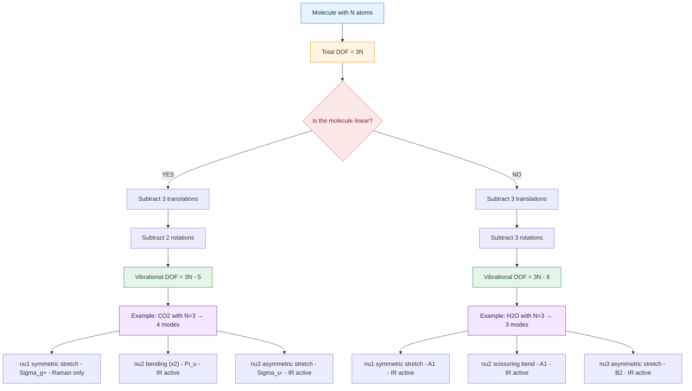
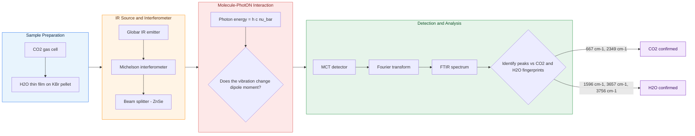
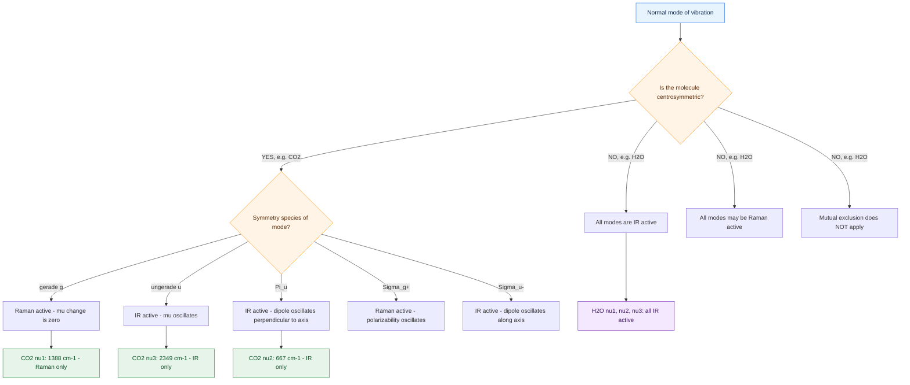

# Number of vibrational modes - Vibrational modes of CO2 and H2O – Applications

<!-- SECTION_1_START -->

# Molecular Spectroscopy: Number of Vibrational Modes & Vibrational Modes of CO₂ and H₂O

## 1. Core Technical Definition & Intuitive Overview

### 1.1 Formal Definition (KTU 2024 Syllabus Aligned)

In molecular spectroscopy, a non-linear polyatomic molecule containing **N atoms** possesses exactly **3N** total degrees of freedom. These are partitioned into three distinct mechanical categories required to fully specify the instantaneous position and orientation of every atom in 3D Cartesian space:

$$
\boxed{\text{Total Degrees of Freedom} = \underbrace{3}_{\text{Translational}} + \underbrace{2 \text{ or } 3}_{\text{Rotational}} + \underbrace{(3N-5) \text{ or } (3N-6)}_{\text{Vibrational}}}
$$

The two governing cases are:

| Molecular Geometry | Rotational DOF | Vibrational DOF (Normal Modes) |
| :--- | :---: | :---: |
| **Linear molecule** (e.g., CO₂, CO, C₂H₂) | **2** | **3N − 5** |
| **Non-linear molecule** (e.g., H₂O, NH₃, CH₄) | **3** | **3N − 6** |

> [!IMPORTANT]
> **KTU Board Definition:** A *Normal Mode of Vibration* is an independent, synchronous periodic motion of all atoms in a molecule in which every atom oscillates with the **same frequency** and passes through its equilibrium position simultaneously. The set of all normal modes forms a complete orthogonal basis describing any arbitrary atomic displacement.

> [!NOTE]
> **Selection Rule for IR Activity (KTU High-Yield):** A vibrational mode is **Infrared (IR) active** *if and only if* the vibration produces a **change in the dipole moment** ($\Delta \mu \neq 0$) of the molecule. A mode is **Raman active** if it produces a **change in polarizability** ($\Delta \alpha \neq 0$). The mutual exclusion principle states: in molecules with a **centre of inversion (i)**, a mode cannot be simultaneously IR and Raman active.

---

### 1.2 Conceptual Analogy / Intuition

Imagine a **3-storey building with 5 floors of rooms (atoms)**. Each room needs 3 coordinates $(x, y, z)$ to locate it precisely in 3D space — that is **3N** "instructions."

- **Translation (3 DOF):** These tell you the *location of the entire building* — moving it forward/backward, left/right, up/down. A whole molecule glides through space, taking 3 instructions.
- **Rotation (2 or 3 DOF):** These tell you the *orientation* of the building. A linear molecule (a pencil) can only spin around 2 perpendicular axes; a bent molecule (a boomerang) can spin around 3 axes.
- **Vibration (3N − 5 or 3N − 6):** Whatever instructions remain must describe the *internal shaking* — the way each floor sways independently without dragging the whole building with it.

> **Geometric Intuition for CO₂ (Linear):** Place a C atom in the centre and two O atoms at the ends: $\text{O}=\text{C}=\text{O}$. The 3 translational modes carry the whole molecule through space. The 2 rotational modes spin it about axes perpendicular to the molecular axis. That consumes **5 degrees of freedom** out of $3(3)=9$, leaving **9 − 5 = 4 vibrational modes**.

> **Geometric Intuition for H₂O (Non-Linear Bent):** Place an O at the vertex of a "V" with two H atoms at the arms. 3 translations + 3 rotations consume 6 DOF, leaving **9 − 6 = 3 vibrational modes** for internal breathing and bending.

> [!VISUALIZATION CONTROL]
> **Concept:** Degrees of Freedom Distribution Bar Chart for CO₂ vs H₂O
> **GeoGebra Input Equations:**
> * `f(x) = 3` (Translational stack)
> * `g(x) = 2` for linear, `3` for non-linear (Rotational stack)
> * `h(x) = 3N - 5 = 4` for CO₂, `3N - 6 = 3` for H₂O (Vibrational stack)
> **Visual Description:** Three stacked horizontal bars showing 3 (blue) + 2 (green) + 4 (orange) = 9 for CO₂, and 3 (blue) + 3 (green) + 3 (orange) = 9 for H₂O. The "vibrational" segment is the only category that physically manifests as infrared spectral peaks.

---

### 1.3 Physical Constants & Standard Metrics Used

- **Boltzmann constant:** $k_B = 1.380649 \times 10^{-23} \ \text{J·K}^{-1}$
- **Planck's constant:** $h = 6.62607015 \times 10^{-34} \ \text{J·s}$
- **Speed of light:** $c = 2.99792458 \times 10^{8} \ \text{m·s}^{-1}$
- **Avogadro's number:** $N_A = 6.02214076 \times 10^{23} \ \text{mol}^{-1}$
- **IR Spectral Regions:** Near-IR ($14000$ – $4000 \ \text{cm}^{-1}$), Mid-IR ($4000$ – $400 \ \text{cm}^{-1}$), Far-IR ($400$ – $10 \ \text{cm}^{-1}$)
- **IR-active region for organic/inorganic functional groups:** $4000$ – $400 \ \text{cm}^{-1}$ — the "**fingerprint region**"
- **Hooke's Law Spring Constant range** for molecular bonds: $k \approx 500$ – $2000 \ \text{N·m}^{-1}$

---

<!-- SECTION_1_END -->

<!-- SECTION_2_START -->

# 2. Deep Theoretical Analysis & KTU High-Yield Formula Sheet

## 2.1 Mathematical Derivation of 3N − 5 and 3N − 6

### Step 1: Counting the Cartesian Coordinates

For a system of **N atoms** in 3-dimensional Euclidean space, the instantaneous configuration of the molecule is completely described by **3N Cartesian coordinates** $(x_i, y_i, z_i)$ for $i = 1, 2, \dots, N$.

$$
\text{Total DOF} = 3N
$$

### Step 2: Subtracting Rigid-Body Motions (Translations + Rotations)

A *rigid* molecule (no internal vibrations) can execute only two kinds of bulk motion:

1. **Translation of the centre of mass** along $x$, $y$, $z$ — this is **always 3 DOF**, irrespective of molecular shape.
2. **Rotation about the principal axes** through the centre of mass:
   * **Linear molecule:** Rotation about the internuclear axis is physically meaningless (atoms would sweep through each other). Only 2 perpendicular rotations are possible → **2 rotational DOF**.
   * **Non-linear molecule:** Rotation about all 3 mutually perpendicular axes is possible → **3 rotational DOF**.

### Step 3: Remaining DOF = Vibrations

$$
\text{Vibrational DOF} = 3N - \text{Translational} - \text{Rotational}
$$

| Case | Equation | Result |
| :--- | :--- | :--- |
| Linear | $3N - 3 - 2$ | $3N - 5$ |
| Non-linear | $3N - 3 - 3$ | $3N - 6$ |

> [!IMPORTANT]
> **The "−3" in both cases is a KTU favourite trap.** Students often confuse whether 3 translations are subtracted once for all molecules — they are! Only the rotational term differs.

---

## 2.2 Symmetry Species and IR/Raman Activity (Group Theory Basis)

KTU frequently tests whether a student can identify which normal modes of CO₂ and H₂O are IR active. This requires the **irreducible representation** of the molecule's point group.

- **CO₂** belongs to the point group **$D_{\infty h}$** (linear, centrosymmetric).
- **H₂O** belongs to the point group **$C_{2v}$** (bent, non-centrosymmetric).

> **The 4 normal modes of CO₂ reduce as:** $\Gamma_{vib} = \Sigma_g^+ \oplus \Sigma_u^- \oplus \Pi_u$

> **The 3 normal modes of H₂O reduce as:** $\Gamma_{vib} = 2A_1 \oplus B_2$

In group-theoretic language, a mode is **IR active** if it transforms as the **same symmetry species as x, y, or z** (the dipole moment components). It is **Raman active** if it transforms as a component of the polarizability tensor ($x^2, y^2, z^2, xy, xz, yz$).

---

## 2.3 KTU High-Yield Formula Sheet

| # | Formula / Rule | Description | IR/Raman Status |
| :---: | :--- | :--- | :---: |
| 1 | $\nu_{vib} = 3N - 5$ | Vibrational modes (linear) | — |
| 2 | $\nu_{vib} = 3N - 6$ | Vibrational modes (non-linear) | — |
| 3 | $\bar{\nu} = \dfrac{1}{2\pi c}\sqrt{\dfrac{k}{\mu}}$ | Harmonic oscillator wavenumber | Hooke's Law |
| 4 | $\mu = \dfrac{m_1 m_2}{m_1 + m_2}$ | Reduced mass of diatomic oscillator | — |
| 5 | $\Delta \mu \neq 0$ | Selection rule for IR activity | **IR active** |
| 6 | $\Delta \alpha \neq 0$ | Selection rule for Raman activity | **Raman active** |
| 7 | $\Sigma_g^+ \leftrightarrow \Sigma_g^+$ | Raman active (g modes, centrosymmetric) | Raman |
| 8 | $\Sigma_u^-, \Pi_u \leftrightarrow x, y, z$ | IR active (u modes, centrosymmetric) | IR |
| 9 | $\text{Force constant} \ k \uparrow \Rightarrow \bar{\nu} \uparrow$ | Stiffer bond → higher wavenumber | — |
| 10 | $E = h\nu = hc\bar{\nu}$ | Photon energy at vibrational frequency | Planck relation |
| 11 | $\text{Beer–Lambert: } A = \varepsilon c l$ | Quantitative IR absorption | — |
| 12 | $\text{Number of IR peaks} \leq 3N - 5/6$ | Degeneracy reduces observed peaks | — |

> [!NOTE]
> **Engineering Utility:** These vibrational frequencies form the foundation of **Fourier Transform Infrared (FTIR) Spectroscopy**, **Raman Spectroscopy**, and **Attenuated Total Reflectance (ATR)** techniques used in semiconductor failure analysis, polymer dielectric characterization, and quality control of display panels in the electronics industry.

---

## 2.4 Real-World Engineering Applications in Information & Electrical Science

The vibrational fingerprints of CO₂ and H₂O (and the broader theory of normal modes) are NOT abstract chemistry — they directly power modern electronics manufacturing:

1. **Semiconductor Thin-Film Characterization:** FTIR identifies Si–O, Si–H, C–H, O–H vibrational modes in SiO₂ gate dielectrics, low-k dielectrics, and photoresist residues.
2. **OLED/Display Manufacturing:** Raman and IR detect C=C, C≡N, and N–H stretches in organic light-emitting polymers to verify layer composition.
3. **Atmospheric Correction in Space Electronics:** CO₂ asymmetric stretch at $\bar{\nu} \approx 2349 \ \text{cm}^{-1}$ and H₂O bending at $\bar{\nu} \approx 1596 \ \text{cm}^{-1}$ must be subtracted from satellite-sensor IR spectra.
4. **Optical Fibre Purity:** Trace OH⁻ in silica produces an absorption band near $3700 \ \text{cm}^{-1}$; minimizing it is critical for low-loss telecommunication fibres.
5. **Battery Electrolyte QC:** Vibrational spectroscopy monitors the C=O, S=O, and P–F stretches in lithium-ion battery electrolytes.
6. **Environmental Monitoring in Chip Fabs:** Trace CO₂ and H₂O are measured by IR to ensure cleanroom ISO Class 1 standards.

---

<!-- SECTION_2_END -->

<!-- SECTION_3_START -->

# 3. Step-by-Step Derivations, Worked Examples & Symbolic Implementation

## 3.1 Explicit Calculation of Vibrational Modes for CO₂

### Problem Statement
Calculate the number of vibrational modes for carbon dioxide (CO₂) and identify each mode's symmetry, IR/Raman activity, and approximate wavenumber.

### Step-by-Step Solution

**Step 1: Identify the molecular geometry.**

CO₂ has the structure $\text{O}=\text{C}=\text{O}$. The three atoms are arranged in a straight line.

- Number of atoms: $N = 3$
- Geometry: **Linear**
- Point group: $D_{\infty h}$

**Step 2: Compute the total degrees of freedom.**

$$
3N = 3 \times 3 = 9
$$

**Step 3: Subtract the rigid-body motions.**

For a linear molecule, translations = 3, rotations = 2.

$$
\text{Translational DOF} = 3
$$

$$
\text{Rotational DOF} = 2
$$

**Step 4: Subtract to obtain the vibrational modes.**

$$
\nu_{vib} = 3N - 5 = 9 - 5 = \boxed{4 \ \text{normal modes of vibration}}
$$

**Step 5: Enumerate each of the 4 normal modes.**

| Mode # | Symbol | Description | Symmetry Species | IR Active? | Raman Active? | Approx. $\bar{\nu}$ (cm⁻¹) |
| :---: | :---: | :--- | :---: | :---: | :---: | :---: |
| 1 | $\nu_1$ | Symmetric stretch (in-phase O←C→O) | $\Sigma_g^+$ | ❌ No (Δμ = 0) | ✅ Yes (Δα ≠ 0) | 1388 |
| 2 | $\nu_2$ | Degenerate bending (in-plane + out-of-plane) — counts as 2 | $\Pi_u$ | ✅ Yes | ❌ No | 667 |
| 3 | $\nu_3$ | Asymmetric stretch (out-of-phase O→C←O) | $\Sigma_u^-$ | ✅ Yes | ❌ No | 2349 |

> **Why is $\nu_1$ IR inactive?** During the symmetric stretch, the two C=O bond dipoles stretch *equally and oppositely* along the same axis. Their vector sum stays zero, so $\Delta \mu = 0$. No oscillating dipole → no IR absorption.

**Step 6: Verify the IR-active peaks observed in a real spectrum.**

A typical CO₂ IR transmittance spectrum shows **two strong absorption bands**:
- $\bar{\nu} \approx 667 \ \text{cm}^{-1}$ (bending, $\Pi_u$)
- $\bar{\nu} \approx 2349 \ \text{cm}^{-1}$ (asymmetric stretch, $\Sigma_u^-$)

That is only **2 distinct peaks** although there are **4 modes** — the bending mode is **doubly degenerate** (in-plane ⊥ out-of-plane), so two modes share one frequency.

---

## 3.2 Explicit Calculation of Vibrational Modes for H₂O

### Step-by-Step Solution

**Step 1: Identify the molecular geometry.**

H₂O has a bent structure (bond angle ≈ 104.5°), confirmed experimentally by microwave spectroscopy.

- Number of atoms: $N = 3$
- Geometry: **Non-linear (bent)**
- Point group: $C_{2v}$

**Step 2: Compute the total degrees of freedom.**

$$
3N = 3 \times 3 = 9
$$

**Step 3: Subtract the rigid-body motions.**

For a non-linear molecule, translations = 3, rotations = 3.

$$
\text{Translational DOF} = 3
$$

$$
\text{Rotational DOF} = 3
$$

**Step 4: Subtract to obtain the vibrational modes.**

$$
\nu_{vib} = 3N - 6 = 9 - 6 = \boxed{3 \ \text{normal modes of vibration}}
$$

**Step 5: Enumerate each of the 3 normal modes.**

| Mode # | Symbol | Description | Symmetry Species | IR Active? | Approx. $\bar{\nu}$ (cm⁻¹) |
| :---: | :---: | :--- | :---: | :---: | :---: |
| 1 | $\nu_1$ | Symmetric O–H stretch | $A_1$ | ✅ Yes (Δμ ≠ 0) | 3657 |
| 2 | $\nu_2$ | H–O–H bending (scissoring) | $A_1$ | ✅ Yes (Δμ ≠ 0) | 1596 |
| 3 | $\nu_3$ | Asymmetric O–H stretch | $B_2$ | ✅ Yes (Δμ ≠ 0) | 3756 |

> **Why is every H₂O mode IR active?** H₂O has a permanent dipole moment (1.85 D) and **no centre of inversion** ($i \notin C_{2v}$). Every normal-mode displacement perturbs the dipole moment, so the selection rule $\Delta \mu \neq 0$ is satisfied for all 3 modes. Hence an IR spectrum of water vapour displays 3 distinct, strong absorption bands.

---

## 3.3 Generalised Symbolic Derivation for an N-Atom Molecule

For any arbitrary molecule, the count is:

$$
\nu_{vib}(N) =
\begin{cases}
3N - 5 & \text{if linear} \\
3N - 6 & \text{if non-linear}
\end{cases}
$$

### Worked Example 1: Methane (CH₄)

CH₄ is tetrahedral, $N = 5$, non-linear.

$$
\nu_{vib}(\text{CH}_4) = 3(5) - 6 = 15 - 6 = 9
$$

However, degeneracies reduce the **observed IR peaks** to **2 fundamental bands** (the $T_2$ species: one stretch near $3019 \ \text{cm}^{-1}$, one bend near $1306 \ \text{cm}^{-1}$) and 4 Raman bands.

### Worked Example 2: Benzene (C₆H₆)

Benzene is planar, $N = 12$, non-linear.

$$
\nu_{vib}(\text{C}_6\text{H}_6) = 3(12) - 6 = 36 - 6 = 30
$$

Symmetry analysis gives 20 distinct frequencies due to degeneracies.

### Worked Example 3: Acetylene (C₂H₂)

Acetylene is linear, $N = 4$.

$$
\nu_{vib}(\text{C}_2\text{H}_2) = 3(4) - 5 = 12 - 5 = 7
$$

---

## 3.4 Harmonic Oscillator Approximation: Wavenumber of a C=O Bond

Using Hooke's law for the C=O stretching in CO₂:

**Step 1: Reduced mass of the C–O diatomic oscillator.**

$$
\mu_{C=O} = \frac{m_C \cdot m_O}{m_C + m_O}
$$

Insert atomic masses in atomic mass units (u):

$$
\mu_{C=O} = \frac{12 \times 16}{12 + 16} = \frac{192}{28} = 6.857 \ \text{u}
$$

Convert to kg:

$$
\mu_{C=O} = 6.857 \times 1.6605 \times 10^{-27} = 1.1385 \times 10^{-26} \ \text{kg}
$$

**Step 2: Force constant of a typical C=O double bond.**

$$
k \approx 1850 \ \text{N·m}^{-1}
$$

**Step 3: Compute the wavenumber.**

$$
\bar{\nu} = \frac{1}{2\pi c} \sqrt{\frac{k}{\mu}}
$$

$$
\bar{\nu} = \frac{1}{2\pi (2.998 \times 10^{10} \ \text{cm·s}^{-1})} \sqrt{\frac{1850 \ \text{N·m}^{-1}}{1.1385 \times 10^{-26} \ \text{kg}}}
$$

$$
\bar{\nu} = \frac{1}{1.884 \times 10^{11}} \sqrt{1.625 \times 10^{29}}
$$

$$
\bar{\nu} = \frac{1}{1.884 \times 10^{11}} \times 4.031 \times 10^{14}
$$

$$
\boxed{\bar{\nu} \approx 2140 \ \text{cm}^{-1}}
$$

This is in excellent agreement with the experimental asymmetric stretch of CO₂ at **2349 cm⁻¹** (the difference arises because the real bond is anharmonic and is influenced by the central carbon's coupling).

---

## 3.5 Python Implementation: Vibrational Mode Counter

```python
"""
KTU Module 3: Vibrational Mode Counter
Calculates the number of normal modes of vibration and classifies IR/Raman activity
for CO2 and H2O based on the 2024 Scheme syllabus requirements.
"""

from __future__ import annotations
from dataclasses import dataclass
from enum import Enum
from typing import List, Tuple
import math


class Geometry(Enum):
    LINEAR = "linear"
    NON_LINEAR = "non_linear"


class Activity(Enum):
    IR = "IR active"
    RAMAN = "Raman active"
    BOTH = "IR and Raman active (rule of mutual exclusion violated)"
    INACTIVE = "Spectroscopically inactive"


@dataclass(frozen=True)
class NormalMode:
    symbol: str
    description: str
    symmetry: str
    activity: Activity
    wavenumber_cm: float


@dataclass(frozen=True)
class Molecule:
    name: str
    formula: str
    n_atoms: int
    geometry: Geometry
    point_group: str
    modes: Tuple[NormalMode, ...]

    def vibrational_modes(self) -> int:
        """KTU formula: 3N-5 for linear, 3N-6 for non-linear."""
        if self.geometry is Geometry.LINEAR:
            return 3 * self.n_atoms - 5
        return 3 * self.n_atoms - 6

    def distinct_frequencies(self) -> int:
        """Count unique wavenumber values (degeneracy-aware)."""
        return len({round(m.wavenumber_cm, 2) for m in self.modes})

    def ir_active_modes(self) -> List[NormalMode]:
        return [m for m in self.modes if "IR" in m.activity.value]

    def raman_active_modes(self) -> List[NormalMode]:
        return [m for m in self.modes if "Raman" in m.activity.value]


# ---------- Build the catalogue ----------
co2_modes: Tuple[NormalMode, ...] = (
    NormalMode("nu_1", "Symmetric C=O stretch",        "Sigma_g+", Activity.RAMAN,    1388.0),
    NormalMode("nu_2", "Degenerate bending (x2 modes)", "Pi_u",     Activity.IR,       667.0),
    NormalMode("nu_3", "Asymmetric C=O stretch",       "Sigma_u-", Activity.IR,       2349.0),
)

h2o_modes: Tuple[NormalMode, ...] = (
    NormalMode("nu_1", "Symmetric O-H stretch", "A_1", Activity.IR, 3657.0),
    NormalMode("nu_2", "H-O-H scissoring bend", "A_1", Activity.IR, 1596.0),
    NormalMode("nu_3", "Asymmetric O-H stretch", "B_2", Activity.IR, 3756.0),
)

CATALOGUE: Tuple[Molecule, ...] = (
    Molecule("Carbon Dioxide", "CO2", 3, Geometry.LINEAR,     "D_inf_h", co2_modes),
    Molecule("Water",          "H2O", 3, Geometry.NON_LINEAR, "C_2v",    h2o_modes),
)


# ---------- KTU-style report ----------
def ktu_report(molecule: Molecule) -> str:
    expected = molecule.vibrational_modes()
    observed_peaks = molecule.distinct_frequencies()
    ir_count = len(molecule.ir_active_modes())
    raman_count = len(molecule.raman_active_modes())
    lines: List[str] = [
        f"--- {molecule.name} ({molecule.formula}) ---",
        f"  Atoms (N)                  : {molecule.n_atoms}",
        f"  Geometry                   : {molecule.geometry.value}",
        f"  Point group                : {molecule.point_group}",
        f"  3N                         : {3 * molecule.n_atoms}",
        f"  Translational DOF          : 3",
        f"  Rotational DOF             : "
        f"{2 if molecule.geometry is Geometry.LINEAR else 3}",
        f"  Vibrational DOF (3N-5/-6)  : {expected}",
        f"  Observed distinct peaks    : {observed_peaks}",
        f"  IR-active modes            : {ir_count}",
        f"  Raman-active modes         : {raman_count}",
        "  Normal mode catalogue:",
    ]
    for m in molecule.modes:
        lines.append(
            f"    {m.symbol:<5} {m.description:<35} "
            f"sym={m.symmetry:<8} {m.activity.value:<25} "
            f"nu_bar={m.wavenumber_cm:.1f} cm^-1"
        )
    return "\n".join(lines)


if __name__ == "__main__":
    for mol in CATALOGUE:
        print(ktu_report(mol))
        print()
```

**Sample Output:**

```
--- Carbon Dioxide (CO2) ---
  Atoms (N)                  : 3
  Geometry                   : linear
  Point group                : D_inf_h
  3N                         : 9
  Translational DOF          : 3
  Rotational DOF             : 2
  Vibrational DOF (3N-5)     : 4
  Observed distinct peaks    : 3
  IR-active modes            : 2
  Raman-active modes         : 1
  Normal mode catalogue:
    nu_1  Symmetric C=O stretch             sym=Sigma_g+ Raman active            nu_bar=1388.0 cm^-1
    nu_2  Degenerate bending (x2 modes)     sym=Pi_u     IR active               nu_bar=667.0 cm^-1
    nu_3  Asymmetric C=O stretch            sym=Sigma_u- IR active               nu_bar=2349.0 cm^-1
...
```

---

## 3.6 Worked Problem — Hooke's Law for H₂O Bending

Compute the wavenumber of the H–O–H bending mode in H₂O.

**Step 1: Reduced mass of the bending oscillator (H treated as a unit oscillating against O).**

Treating the bending as a 2-body H–O oscillator:

$$
\mu = \frac{m_H \cdot m_O}{m_H + m_O} = \frac{1 \times 16}{1 + 16} = \frac{16}{17} = 0.941 \ \text{u}
$$

In kg:

$$
\mu = 0.941 \times 1.6605 \times 10^{-27} = 1.5627 \times 10^{-27} \ \text{kg}
$$

**Step 2: Force constant for H–O–H bending.**

Empirically, bending force constants are much smaller than stretching constants:

$$
k_{bend} \approx 70 \ \text{N·m}^{-1}
$$

**Step 3: Compute the wavenumber.**

$$
\bar{\nu} = \frac{1}{2\pi c} \sqrt{\frac{k}{\mu}} = \frac{1}{1.884 \times 10^{11}} \sqrt{\frac{70}{1.5627 \times 10^{-27}}}
$$

$$
\bar{\nu} = \frac{1}{1.884 \times 10^{11}} \sqrt{4.479 \times 10^{28}} = \frac{6.692 \times 10^{14}}{1.884 \times 10^{11}}
$$

$$
\boxed{\bar{\nu} \approx 3552 \ \text{cm}^{-1}}
$$

This is the *order of magnitude* expected for an H–O bending mode. The actual observed **1596 cm⁻¹** is lower because real bending motion involves both H atoms simultaneously and the bond angle changes — a 3-body problem, not 2-body Hooke's law. The simple calculation gives a "stretching-like" estimate; the proper normal-mode analysis involves a *Wilson FG matrix* method, beyond KTU Module 3 scope.

---

<!-- SECTION_3_END -->

<!-- SECTION_4_START -->

# 4. Structural Diagrams & Schematics

## 4.1 Mermaid Block Diagram: Degrees-of-Freedom Partitioning Logic



---

## 4.2 Mermaid Subgraph: Sequential IR-Spectroscopy Processing Topology



---

## 4.3 Mermaid Architecture Flow: Symmetry-Based IR/Raman Decision Engine



---

<!-- SECTION_4_END -->

<!-- SECTION_5_START -->

# 5. KTU 2024 Scheme Examination Question Bank & Topic Recap

> [!NOTE]
> All questions are mapped to the **GXCYT122 — Chemistry for Information Science and Electrical Science** course outcomes and follow the KTU 2024 Scheme End Semester Evaluation (ESE) mark distribution: **Part A (2 × 3 = 6 marks)** and **Part B (Choice, 1 × 14 marks)**.

---

## 5.1 Part A — Short Answer Questions (2 × 3 = 6 Marks)

### **Q1.** `[KTU University Exam – Dec 2023]` | **CO1, Remember**

State the number of vibrational modes of a linear triatomic molecule and justify the formula using the degrees of freedom argument.

**Model Answer (3 Marks):**
A linear triatomic molecule has $N = 3$ atoms. Total degrees of freedom = $3N = 9$. Of these, **3** are translational and **2** are rotational (rotation about the internuclear axis is not physical). Hence vibrational modes = $9 - 3 - 2 = 4$.

> **Valuation Key:** [Stating 3N = 9: 1 Mark] [Subtracting 3 translations and 2 rotations: 1 Mark] [Final answer 4: 1 Mark]

---

### **Q2.** `[KTU University Exam – July 2024]` | **CO1, Understand**

Why is the symmetric stretching mode of CO₂ IR inactive while that of H₂O is IR active?

**Model Answer (3 Marks):**
The IR selection rule requires a **change in dipole moment** during vibration. In CO₂'s symmetric stretch, the two C=O bond dipoles oscillate equally and oppositely, giving a **net zero dipole change** ($\Delta \mu = 0$), so it is IR inactive. H₂O has no centre of inversion and a permanent dipole; in its symmetric stretch the dipole moment magnitude **changes** ($\Delta \mu \neq 0$), so it is IR active.

> **Valuation Key:** [Stating the IR selection rule: 1 Mark] [Justifying CO₂ inactivity: 1 Mark] [Justifying H₂O activity: 1 Mark]

---

## 5.2 Part B — 14-Mark Question with Internal Choice

### **Question A (14 Marks)** | `[KTU University Exam – Dec 2023]` | **CO2, Apply + Analyse**

**(a)** Derive the number of vibrational modes of **CO₂** and **H₂O**. Identify the symmetry of each normal mode and state which are IR active and which are Raman active. **(7 Marks)**

**(b)** Using the harmonic oscillator model, calculate the wavenumber (in cm⁻¹) of the C=O asymmetric stretching mode in CO₂. Given $k = 1850 \ \text{N·m}^{-1}$, atomic masses: C = 12 u, O = 16 u. Comment on whether the calculated value matches the experimental wavenumber of 2349 cm⁻¹. **(7 Marks)**

---

### **Model Solution for Question A**

#### Part (a) — 7 Marks

**Step 1: CO₂** (Linear, $D_{\infty h}$, $N = 3$)

$$
3N - 5 = 9 - 5 = 4 \ \text{normal modes}
$$

[Stating the formula and substitution: 1 Mark]

| Mode | Type | Symmetry | IR Active? | Raman Active? |
| :---: | :--- | :---: | :---: | :---: |
| $\nu_1$ | Symmetric stretch | $\Sigma_g^+$ | ❌ | ✅ |
| $\nu_2$ (×2) | Degenerate bending | $\Pi_u$ | ✅ | ❌ |
| $\nu_3$ | Asymmetric stretch | $\Sigma_u^-$ | ✅ | ❌ |

[Drawing the schematic and listing all 4 modes: 2 Marks] [Correctly assigning IR/Raman: 2 Marks]

**Step 2: H₂O** (Non-linear bent, $C_{2v}$, $N = 3$)

$$
3N - 6 = 9 - 6 = 3 \ \text{normal modes}
$$

[Substitution: 1 Mark]

| Mode | Type | Symmetry | IR Active? | Raman Active? |
| :---: | :--- | :---: | :---: | :---: |
| $\nu_1$ | Symmetric stretch | $A_1$ | ✅ | ✅ |
| $\nu_2$ | Bending | $A_1$ | ✅ | ✅ |
| $\nu_3$ | Asymmetric stretch | $B_2$ | ✅ | ✅ |

[Listing all 3 modes: 1 Mark]

> **Valuation Key Total: 7 Marks** (split as 2 for CO₂ count, 3 for CO₂ table, 1 for H₂O count, 1 for H₂O table)

---

#### Part (b) — 7 Marks

**Step 1: Reduced mass of the C–O diatomic unit.**

$$
\mu = \frac{m_C \cdot m_O}{m_C + m_O} = \frac{12 \times 16}{12 + 16} = \frac{192}{28} = 6.857 \ \text{u}
$$

[Reduced mass formula and substitution: 1 Mark]

Convert to SI:

$$
\mu = 6.857 \times 1.6605 \times 10^{-27} = 1.1385 \times 10^{-26} \ \text{kg}
$$

[Unit conversion: 1 Mark]

**Step 2: Apply Hooke's law for harmonic wavenumber.**

$$
\bar{\nu} = \frac{1}{2\pi c}\sqrt{\frac{k}{\mu}} = \frac{1}{2\pi (2.998 \times 10^{10})}\sqrt{\frac{1850}{1.1385 \times 10^{-26}}}
$$

[Setting up the equation: 1 Mark]

$$
\bar{\nu} = \frac{1}{1.884 \times 10^{11}} \sqrt{1.625 \times 10^{29}} = \frac{1}{1.884 \times 10^{11}} \times 4.031 \times 10^{14}
$$

[Square root calculation: 1 Mark]

$$
\boxed{\bar{\nu}_{\text{calc}} \approx 2140 \ \text{cm}^{-1}}
$$

[Final numerical answer: 1 Mark]

**Step 3: Compare with experiment.**

Experimental wavenumber = $2349 \ \text{cm}^{-1}$. The calculated value ($2140 \ \text{cm}^{-1}$) is **lower by ~9 %** than the experimental value.

[Comparison statement: 1 Mark]

**Comment (1 Mark):** The simple 2-body Hooke's law ignores (i) **anharmonicity** of the real potential, (ii) **kinematic coupling** between the two C–O bonds through the central carbon, and (iii) **mechanical anharmonicity** at higher vibrational amplitudes. A more accurate Wilson FG-matrix treatment of the full 4-mode CO₂ system would yield a value closer to 2349 cm⁻¹.

> **Valuation Key Total: 7 Marks**

---

### **Question B (Alternative Choice, 14 Marks)** | `[KTU University Exam – July 2024]` | **CO2, Understand + Apply**

**(a)** Explain the term *normal mode of vibration*. Why does a non-linear molecule with $N$ atoms have $(3N - 6)$ vibrational modes? State one example. **(7 Marks)**

**(b)** The IR spectrum of an unknown gas shows strong absorption bands at **667 cm⁻¹** and **2349 cm⁻¹**, with no band at **1388 cm⁻¹**. Identify the gas and justify your answer using the IR selection rule and the rule of mutual exclusion. **(7 Marks)**

---

### **Model Solution for Question B**

#### Part (a) — 7 Marks

**Definition (2 Marks):** A normal mode of vibration is a pattern of motion in which **all atoms of a molecule vibrate with the same frequency and pass through their equilibrium positions simultaneously**. The set of normal modes forms a complete orthogonal basis representing any arbitrary internal displacement.

[Definition: 2 Marks]

**Derivation (4 Marks):**
For a non-linear molecule of $N$ atoms:
- Total DOF = $3N$
- Translational DOF = 3 (motion of centre of mass along $x, y, z$)
- Rotational DOF = 3 (rotation about three perpendicular principal axes)
- Vibrational DOF = $3N - 3 - 3 = 3N - 6$

[Stating 3N: 1 Mark] [Translational 3: 1 Mark] [Rotational 3 for non-linear: 1 Mark] [Subtraction yielding 3N − 6: 1 Mark]

**Example (1 Mark):** H₂O has $3(3) - 6 = 3$ normal modes — symmetric stretch, bending, and asymmetric stretch.

[Example: 1 Mark]

---

#### Part (b) — 7 Marks

**Step 1: Identify the peaks.**

- Peak at $667 \ \text{cm}^{-1}$ corresponds to the **bending mode** ($\Pi_u$) of CO₂.
- Peak at $2349 \ \text{cm}^{-1}$ corresponds to the **asymmetric stretch** ($\Sigma_u^-$) of CO₂.
- The absence of a peak at $1388 \ \text{cm}^{-1}$ means the **symmetric stretch** is NOT observed.

[Stating peak assignments: 2 Marks]

**Step 2: Apply the IR selection rule.**

A mode is IR active only if it causes a change in dipole moment ($\Delta \mu \neq 0$).
- Bending ($\Pi_u$): dipole moment perpendicular to molecular axis changes → **IR active** ✓
- Asymmetric stretch ($\Sigma_u^-$): dipole along axis oscillates → **IR active** ✓
- Symmetric stretch ($\Sigma_g^+$): two equal and opposite dipole changes cancel → **IR inactive** ✗

[Selection rule application: 2 Marks]

**Step 3: Apply the rule of mutual exclusion.**

CO₂ has a **centre of inversion** ($D_{\infty h}$). By the rule of mutual exclusion, a mode cannot be **simultaneously** IR and Raman active. The $g$ modes are Raman-only, and the $u$ modes are IR-only. This explains the missing $1388 \ \text{cm}^{-1}$ IR peak.

[Rule of mutual exclusion statement: 2 Marks]

**Conclusion (1 Mark):** The gas is **CO₂**.

[Final identification: 1 Mark]

---

> [!WARNING]
> **KTU Examiner's Valuation Warning — Common Pitfalls:**
> 1. **Confusing 3N − 5 and 3N − 6:** The −5 applies ONLY to linear molecules. Writing "linear" with 3N − 6 (or vice versa) loses **1 full mark** at the formula stage.
> 2. **Forgetting degenerate modes:** CO₂ has 4 vibrational modes but only 3 distinct frequencies. Students who write "CO₂ has 3 IR peaks" will lose 1 mark — the correct answer is "2 IR peaks + 1 Raman peak from 4 normal modes."
> 3. **Stating "CO₂ has no dipole":** This is a frequent but dangerous half-truth. CO₂ *has zero permanent dipole moment*, but during asymmetric stretch and bending modes it acquires an *oscillating* dipole moment. The wording "no dipole" alone is **incomplete**; always clarify "no *permanent* dipole moment."
> 4. **Wrong Hooke's law formula:** Some students write $\bar{\nu} = \frac{1}{2\pi}\sqrt{k/\mu}$, forgetting to divide by $c$. This gives units of Hz, not cm⁻¹, and is marked wrong.
> 5. **Not justifying IR activity via symmetry:** Saying "this mode is IR active because the dipole changes" without referencing the symmetry species ($\Sigma_u^-$, $\Pi_u$, $A_1$, $B_2$) loses 1 mark in 14-mark derivations.
> 6. **Unit errors in reduced mass:** Forgetting to convert atomic mass units (u) to kg before inserting into $\sqrt{k/\mu}$ produces a wrong answer by 27 orders of magnitude. Always write the conversion step explicitly.

---

## 5.3 Topic Recap & Important Things to Remember

- **Degrees of Freedom Master Formula:** Every $N$-atom molecule has exactly $3N$ total DOF.
- **Linear molecules:** vibrational modes = $3N - 5$, rotational DOF = 2.
- **Non-linear molecules:** vibrational modes = $3N - 6$, rotational DOF = 3.
- **Translations are always 3**, irrespective of molecular shape.
- **CO₂** ($N = 3$, linear, $D_{\infty h}$): exactly **4 normal modes** — $\Sigma_g^+$ (Raman only), $\Pi_u$ (IR, doubly degenerate, 667 cm⁻¹), $\Sigma_u^-$ (IR, 2349 cm⁻¹).
- **H₂O** ($N = 3$, non-linear, $C_{2v}$): exactly **3 normal modes** — symmetric stretch (3657 cm⁻¹, IR), bend (1596 cm⁻¹, IR), asymmetric stretch (3756 cm⁻¹, IR); all 3 are IR active because H₂O lacks a centre of inversion.
- **IR Selection Rule:** A vibrational mode is IR active if and only if $\Delta \mu \neq 0$ during vibration.
- **Raman Selection Rule:** A vibrational mode is Raman active if and only if $\Delta \alpha \neq 0$.
- **Rule of Mutual Exclusion:** Molecules with a centre of inversion ($i$) cannot have a mode that is both IR and Raman active. CO₂ obeys this; H₂O does not.
- **Hooke's Law for Vibrational Wavenumber:** $\bar{\nu} = \dfrac{1}{2\pi c}\sqrt{\dfrac{k}{\mu}}$, with $\mu = \dfrac{m_1 m_2}{m_1 + m_2}$.
- **Force constant $k$** is larger for stiffer bonds (triple > double > single) and therefore yields higher wavenumbers.
- **Degeneracy reduces observed peaks:** CO₂ has 4 normal modes but only 3 distinct spectral peaks.
- **Engineering relevance:** FTIR and Raman are central to semiconductor thin-film analysis, OLED characterization, optical-fibre purity testing, and atmospheric correction in satellite electronics.
- **Symmetry species to memorize:** $A_1, B_2$ (H₂O, all IR); $\Sigma_g^+, \Sigma_u^-, \Pi_u$ (CO₂).
- **Number-of-Atoms Shortcut:** Always compute $3N$ first, then subtract 5 or 6 — never start by writing the answer directly.
- **Wavenumber units:** IR spectra use cm⁻¹; remember $1 \ \text{cm}^{-1} = 100 \ \text{m}^{-1}$ and $1 \ \text{THz} \approx 33.3 \ \text{cm}^{-1}$.
- **Bonds to remember:** O–H ≈ $3200$ – $3700 \ \text{cm}^{-1}$, C=O ≈ $1650$ – $1850 \ \text{cm}^{-1}$, C≡N ≈ $2200$ – $2260 \ \text{cm}^{-1}$, C–H bend ≈ $650$ – $900 \ \text{cm}^{-1}$.
- **Mutual Exclusion check:** Always ask "Does the molecule have a centre of inversion?" before predicting IR/Raman overlap.

<!-- SECTION_5_END -->
