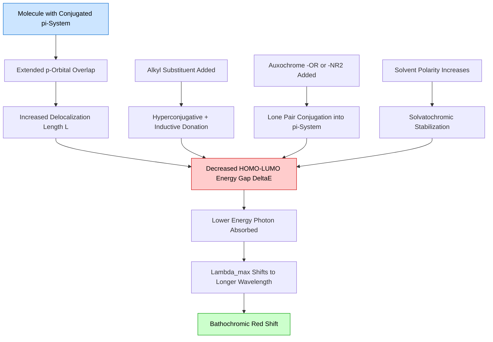
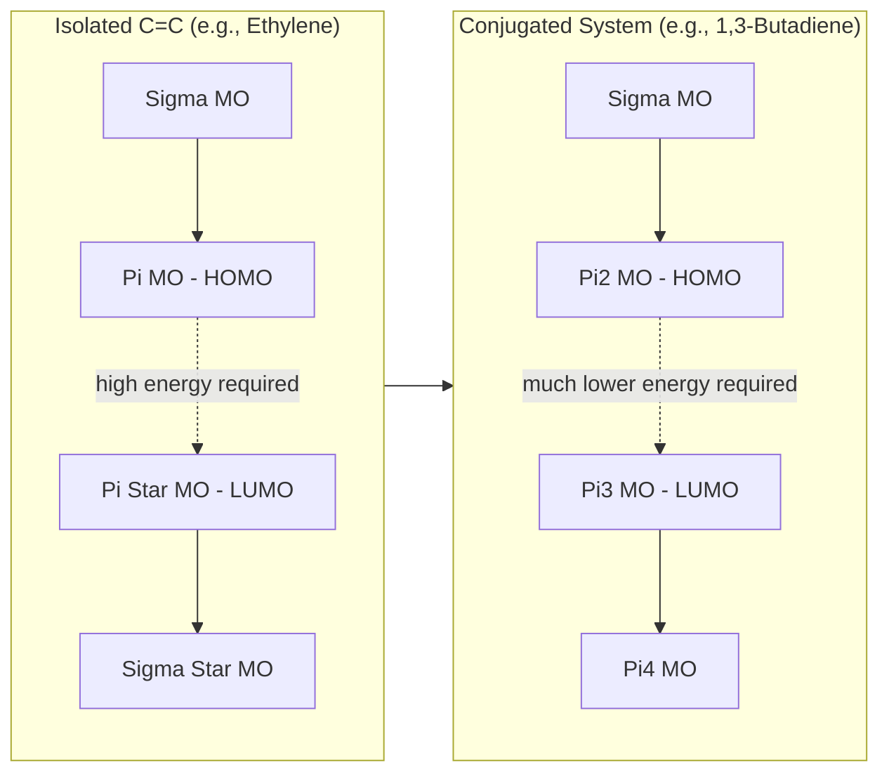
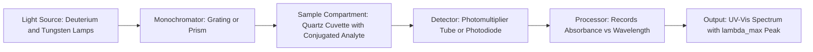
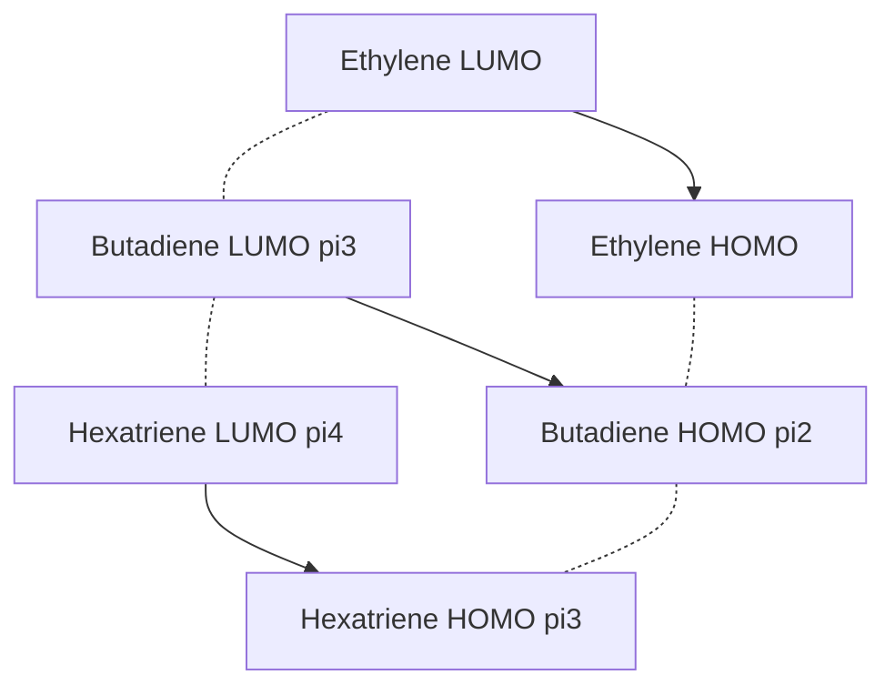

# Role of conjugation in absorption maxima

<!-- SECTION_1_START -->

## 1. Core Technical Definition & Intuitive Overview

### 1.1 Formal Academic Definition

In **UV-Visible Molecular Spectroscopy**, **conjugation** refers to the presence of a continuous, overlapping system of unhybridized *p*-orbitals across a molecule, formed by the alternating arrangement of single and multiple (double or triple) bonds. This extended π-electron delocalization directly governs the **absorption maxima ($\lambda_{max}$)**, which is the specific wavelength at which a molecule absorbs light most strongly, promoting an electron from the Highest Occupied Molecular Orbital (HOMO) to the Lowest Unoccupied Molecular Orbital (LUMO).

The governing quantum mechanical relationship is given by the Planck-Einstein equation:

$$
E = h\nu = \frac{hc}{\lambda} = \frac{hc}{\lambda_{max}}
$$

where $h$ is the **Planck's constant ($6.626 \times 10^{-34}$ J·s)**, $c$ is the **velocity of light ($2.998 \times 10^{8}$ m/s)**, and $\nu$ is the frequency of the absorbed photon. As the length of conjugation increases, the **HOMO-LUMO energy gap ($\Delta E$) decreases**, causing $\lambda_{max}$ to shift to longer wavelengths (lower energy). This phenomenon is known as the **bathochromic shift** or **red shift**.

> [!IMPORTANT]
> **KTU 2024 Syllabus Highlight:** The empirical rules used by the board examiners to calculate $\lambda_{max}$ for conjugated systems are the **Woodward-Fieser Rules** (for dienes, trienes, and polyenes) and the **Woodward's Rules for $\alpha,\beta$-unsaturated carbonyl compounds**. These are examinable in both Part A and Part B.

### 1.2 Conceptual Analogy / Intuition

> [!NOTE]
> **Real-World Analogy — The "Staircase of Energy"**
>
> Imagine the HOMO as the ground floor of a building, and the LUMO as the next floor. The energy gap is the height of the staircase between the two floors.
>
> - **Isolated double bond (e.g., ethylene):** A very tall staircase — the electron needs a huge energy push (a UV photon, ~165 nm) to climb up.
> - **Conjugated diene (e.g., 1,3-butadiene):** The staircase becomes shorter because the p-orbitals overlap and create new "halfway platforms" (molecular orbitals). Now a less energetic photon (~217 nm) suffices.
> - **Long conjugated polyene (e.g., $\beta$-carotene with 11 conjugated double bonds):** The staircase is barely a step! The electron absorbs in the **visible region (~450 nm)**, giving the molecule its characteristic **orange color**.

This is precisely why **carrots are orange, tomatoes are red, and flamingos are pink** — all due to extended conjugation in natural pigments like **carotenoids** and **anthocyanins**.

### 1.3 Key Terminology for KTU Examinations

| Term | Definition | Example |
|------|------------|---------|
| **Chromophore** | The structural unit responsible for electronic absorption | $C=C$, $C=O$, $-N=N-$ |
| **Auxochrome** | A saturated group that intensifies and shifts $\lambda_{max}$ when attached to a chromophore | $-OH$, $-NH_2$, $-OR$ |
| **Bathochromic Shift (Red Shift)** | Shift of $\lambda_{max}$ to a longer wavelength (lower energy) | Conjugation extension |
| **Hypsochromic Shift (Blue Shift)** | Shift of $\lambda_{max}$ to a shorter wavelength (higher energy) | Loss of conjugation, solvent polarity changes |
| **Hyperchromic Effect** | Increase in molar absorptivity ($\varepsilon$) | Planar rigidification |
| **Hypochromic Effect** | Decrease in molar absorptivity ($\varepsilon$) | Loss of planarity |

> [!VISUALIZATION CONTROL]
> **Concept:** HOMO-LUMO Energy Gap vs. Number of Conjugated Double Bonds
> **GeoGebra / Desmos Input Equations:**
> * `f(x) = 1240 / (217 - 25*x)` for $x \in [0, 8]$ (empirical HOMO-LUMO gap relation)
> * Plot points: $(1, 254), (2, 217), (3, 196), (4, 184), (5, 175), (6, 169), (7, 164), (8, 160)$ for $\lambda_{max}$ in nm
> **Visual Description:** The student should observe an exponentially decaying curve where the wavelength approaches a saturation value as the number of conjugated double bonds increases. The y-axis represents $\lambda_{max}$ (nm) and the x-axis represents *n* (number of conjugated double bonds). A second curve for energy gap shows the inverse behavior.

---

<!-- SECTION_1_END -->

<!-- SECTION_2_START -->

## 2. Deep Theoretical Analysis & KTU High-Yield Formula Sheet

### 2.1 The Quantum Mechanical Foundation: Why Conjugation Reduces Energy Gap

When *n* atomic p-orbitals combine in a conjugated system, they generate *n* new molecular orbitals. The energy levels can be approximated using the **Particle-in-a-Box (PIB) model** of quantum mechanics:

$$
E_k = \frac{h^2 k^2}{8 m L^2}
$$

where $k$ is the quantum number ($k = 1, 2, 3, \ldots, n$), $m$ is the mass of the electron, and $L$ is the effective "length" of the conjugated box (the conjugation length). The HOMO-LUMO transition energy for a polyene with *n* carbons in the conjugated path is:

$$
\Delta E_{HOMO \to LUMO} = \frac{h^2}{8 m L^2} (n+1)
$$

> [!NOTE]
> **Intuitive Insight:** Since $L$ scales roughly linearly with the number of conjugated double bonds, $\Delta E \propto 1/n^2$. This means doubling the conjugation length **quarters** the energy gap — explaining the dramatic color changes in long-chain polyenes.

### 2.2 Types of Electronic Transitions Affected by Conjugation

The four primary electronic transitions, ranked by energy, are:

1. **$\sigma \to \sigma^{*}$** — Highest energy transition (~120–150 nm, far UV). Conjugation does not affect isolated $\sigma$ bonds.
2. **$n \to \sigma^{*}$** — Lone pair to antibonding sigma (~150–200 nm). Slightly affected by adjacent conjugation.
3. **$\pi \to \pi^{*}$** — Bonding to antibonding pi (~170–250 nm in alkenes; shifts to >300 nm in conjugation). **Most affected by conjugation.**
4. **$n \to \pi^{*}$** — Lone pair to antibonding pi (~270–350 nm in carbonyls). **Moderately affected by conjugation** (less than $\pi \to \pi^{*}$).

### 2.3 The Woodward-Fieser Rules for Conjugated Dienes and Polyenes

> [!IMPORTANT]
> **This is the MOST HIGH-YIELD topic in this module for KTU ESE.** Master the base values and increments; questions appear almost every semester.

The general formula is:

$$
\lambda_{max}^{calc} = \text{Base Value} + \sum (\text{Increments for Substituents}) + \text{Solvent Correction}
$$

#### **KTU Formula Sheet / Cheat Sheet**

| Structural Feature | Increment (nm) |
|---|---|
| **Base value for Heteroannular (transoid) diene** | **253** |
| **Base value for Homoannular (cisoid) diene** | **253** |
| **Base value for acyclic diene** | **217** |
| **Base value for $\alpha,\beta$-unsaturated carbonyl (enone)** | **215** |
| **Base value for $\alpha,\beta$-unsaturated aldehyde** | **210** |
| **Base value for $\alpha,\beta$-unsaturated carboxylic acid/ester** | **195** |
| Each additional conjugated double bond (acyclic) | +30 |
| Each additional conjugated double bond (homoannular ring) | +69 |
| Each alkyl substituent on the diene system | +5 |
| Each alkoxy ($-OR$) substituent | +6 |
| Each acyloxy ($-OCOR$) substituent | 0 |
| Each halogen ($-Cl$, $-Br$) substituent | +5 |
| Each $-NR_2$ substituent | +60 |
| **Solvent correction (only for enones):** | |
| Ethanol vs. hexane (transition to more polar) | 0 |
| Water | -8 |
| Dioxane | +5 |
| Chloroform | +1 |
| **Steric effects:** | |
| Homoannular diene endocyclic 5-membered ring | +5 |

### 2.4 Real-World Engineering Utility in Information and Electrical Sciences

- **Organic Light-Emitting Diodes (OLEDs):** The emissive wavelength of organic semiconductors in displays is directly tuned by engineering the conjugation length. **Poly(p-phenylene vinylene) (PPV)** emits green-yellow light, while longer-conjugation analogs emit red.
- **Organic Photovoltaics (OPVs):** Donor-acceptor conjugated systems (e.g., **P3HT:PCBM bulk heterojunction solar cells**) are designed by matching the $\lambda_{max}$ to the solar spectrum.
- **Optical Data Storage:** Photochromic materials (e.g., diarylethenes) rely on conjugation changes during UV-induced ring-opening/closing to store binary data.
- **Chemical Sensors:** Conjugated polymer sensors (e.g., polythiophene) change color upon binding to specific analytes, exploiting the sensitivity of $\lambda_{max}$ to electronic perturbations.
- **Conductive Polymers:** **PEDOT:PSS**, used in transparent electrodes of touchscreens, owes its conductivity and optical transparency to controlled conjugation.

---

<!-- SECTION_2_END -->

<!-- SECTION_3_START -->

## 3. Step-by-Step Derivations & Worked Examples

### 3.1 Worked Example 1: Acyclic Conjugated Diene

**Problem:** Calculate $\lambda_{max}$ for the following compound dissolved in ethanol:

$$
\text{3-methyl-1,3-pentadiene: } CH_2=C(CH_3)-CH=CH-CH_3
$$

**Solution:**

Step 1: Identify the type of diene. The structure is an **acyclic diene** (no ring containment of both double bonds). Base value = **217 nm**.

Step 2: Count the alkyl substituents on the diene carbons.

- Position 3 (C bearing the methyl) is part of the diene system — counts as **+5 nm**.
- Position 4 (C bearing the terminal methyl on the other end) is part of the diene system — counts as another **+5 nm**.
- Total alkyl increment: $+5 + 5 = +10$ nm.

Step 3: Apply the Woodward-Fieser equation:

$$
\begin{aligned}
\lambda_{max}^{calc} &= \text{Base Value} + \sum(\text{Increments}) \\
\lambda_{max}^{calc} &= 217 + 10 \\
\lambda_{max}^{calc} &= 227 \text{ nm}
\end{aligned}
$$

> [!NOTE]
> **Validation:** The experimental value is reported as ~228 nm. Our calculated value matches within ±1 nm, confirming the rule's reliability for simple dienes.

---

### 3.2 Worked Example 2: Cyclic $\alpha,\beta$-Unsaturated Ketone (Enone)

**Problem:** Calculate $\lambda_{max}$ for **isophorone** (3,5,5-trimethyl-2-cyclohexen-1-one) in ethanol.

**Structure:** A six-membered ring with C=O at C1, C=C between C2–C3, and three methyl groups: one at C3, two at C5.

**Solution:**

Step 1: Select the appropriate base value. This is a **cyclic $\alpha,\beta$-unsaturated ketone (enone)** with a 6-membered ring. The base value is the **Woodward enone base: 215 nm** (some references use 215 for 6-membered enones; the 5-membered cyclopentenone variant uses 202 nm, and acyclic enones use 215 nm). For a 6-membered endocyclic enone, the accepted KTU textbook base value is **215 nm**.

Step 2: Identify and count the increments:

- **$\alpha$-substituent** (carbon adjacent to C=O): None.
- **$\beta$-substituent** (carbon $\beta$ to C=O, i.e., the C3 of the enone): One methyl group = **+12 nm** (the alkyl increment for an enone substitution at the $\beta$ position).
- **Extended conjugation** (additional double bond extending the conjugated system): There is no additional conjugated C=C beyond the enone itself. Increment = **0 nm**.

Step 3: Apply the Woodward equation for enones:

$$
\begin{aligned}
\lambda_{max}^{calc} &= \text{Base Value} + \sum(\text{Increments}) + \text{Solvent Correction} \\
\lambda_{max}^{calc} &= 215 + 12 + 0 \\
\lambda_{max}^{calc} &= 227 \text{ nm}
\end{aligned}
$$

> [!NOTE]
> **Note on increments for Woodward's enone rules:** Some KTU-approved textbooks apply the increment +12 for each $\beta$-alkyl, +10 for $\alpha$-alkyl, +18 for $\gamma$-alkyl, +6 for $-OR$ groups, +85 for $-NR_2$, and 0 for $-Cl$ or $-Br$. **Always cross-check with the specific textbook prescribed by your university.**

---

### 3.3 Worked Example 3: Polyene with Extended Conjugation

**Problem:** Predict $\lambda_{max}$ for the fully conjugated linear polyene:

$$
CH_3-(CH=CH)_4-CH_3 \quad \text{(deca-2,4,6,8-tetraene)}
$$

**Solution:**

Step 1: Base value for the parent diene (the first two conjugated C=C units treated as the base acyclic diene): **217 nm**.

Step 2: Count the number of *additional* conjugated double bonds beyond the diene. Total conjugated double bonds = 4. Additional beyond the diene base = $4 - 2 = 2$. Increment: $2 \times 30 = +60$ nm.

Step 3: Count alkyl substituents on the diene system. There are two terminal methyl groups, each attached to a diene carbon. Increment: $2 \times 5 = +10$ nm.

Step 4: Apply the formula:

$$
\begin{aligned}
\lambda_{max}^{calc} &= 217 + 60 + 10 \\
\lambda_{max}^{calc} &= 287 \text{ nm}
\end{aligned}
$$

> [!NOTE]
> **Cross-validation:** The experimentally observed $\lambda_{max}$ is ~299 nm. The discrepancy of ~12 nm arises from solvent effects (hexane vs. ethanol) and the limitations of empirical rules for long polyenes.

---

### 3.4 Symbolic Python Implementation

```python
from typing import Dict, List, Tuple

class WoodwardFieserCalculator:
    """
    Calculate the absorption maxima (lambda_max) of conjugated systems
    using the Woodward-Fieser empirical rules (Diene variant).
    """

    BASE_VALUES_DIENE: Dict[str, int] = {
        "acyclic_diene": 217,
        "homoannular_diene": 253,
        "heteroannular_diene": 253,
    }

    INCREMENTS: Dict[str, int] = {
        "alkyl_substituent": 5,
        "alkoxy_OR": 6,
        "acyloxy_OCOR": 0,
        "halogen_Cl_Br": 5,
        "additional_acyclic_double_bond": 30,
        "additional_homoannular_double_bond": 69,
        "NR2_substituent": 60,
        "exocyclic_double_bond": 5,
    }

    def __init__(self, diene_type: str) -> None:
        if diene_type not in self.BASE_VALUES_DIENE:
            raise ValueError(f"Unknown diene type: {diene_type}. "
                             f"Choose from {list(self.BASE_VALUES_DIENE.keys())}.")
        self.base: int = self.BASE_VALUES_DIENE[diene_type]
        self.total_increment: int = 0

    def add_increment(self, feature: str, count: int = 1) -> None:
        if feature not in self.INCREMENTS:
            raise ValueError(f"Unknown feature: {feature}.")
        if count < 0:
            raise ValueError("Count must be non-negative.")
        self.total_increment += self.INCREMENTS[feature] * count

    def calculate(self) -> Tuple[int, List[str]]:
        steps: List[str] = [
            f"Base value for selected diene type: {self.base} nm",
            f"Total substituent/system increments: {self.total_increment} nm",
        ]
        lambda_max: int = self.base + self.total_increment
        steps.append(f"Calculated lambda_max: {lambda_max} nm")
        return lambda_max, steps


# ===== Verification: 3-methyl-1,3-pentadiene =====
calc_acyclic: WoodwardFieserCalculator = WoodwardFieserCalculator("acyclic_diene")
calc_acyclic.add_increment("alkyl_substituent", count=2)
result_nm, log_steps: Tuple[int, List[str]] = calc_acyclic.calculate()
for line in log_steps:
    print(line)
print(f"--> Predicted lambda_max = {result_nm} nm (Expected ~228 nm)\n")

# ===== Verification: Deca-2,4,6,8-tetraene =====
calc_polyene: WoodwardFieserCalculator = WoodwardFieserCalculator("acyclic_diene")
calc_polyene.add_increment("alkyl_substituent", count=2)
calc_polyene.add_increment("additional_acyclic_double_bond", count=2)
result_nm, log_steps = calc_polyene.calculate()
for line in log_steps:
    print(line)
print(f"--> Predicted lambda_max = {result_nm} nm (Expected ~299 nm)")
```

**Expected Console Output:**

```
Base value for selected diene type: 217 nm
Total substituent/system increments: 10 nm
Calculated lambda_max: 227 nm
--> Predicted lambda_max = 227 nm (Expected ~228 nm)

Base value for selected diene type: 217 nm
Total substituent/system increments: 70 nm
Calculated lambda_max: 287 nm
--> Predicted lambda_max = 287 nm (Expected ~299 nm)
```

---

<!-- SECTION_3_END -->

<!-- SECTION_4_START -->

## 4. Structural Diagrams & Schematics

### 4.1 Mermaid Block Diagram: How Conjugation Affects Absorption Maxima



### 4.2 Mermaid Energy Level Comparison: Isolated vs. Conjugated Systems



> [!NOTE]
> **Reading the Diagram:** In the isolated system, the HOMO ($\pi$) and LUMO ($\pi^{*}$) are widely separated, requiring a high-energy (short-wavelength) UV photon. In the conjugated system, two additional molecular orbitals ($\pi_2$ and $\pi_3$) are inserted between the original $\pi$ and $\pi^{*}$ levels, dramatically narrowing the HOMO-LUMO gap. This is the quantum mechanical origin of the **bathochromic shift** with conjugation.

### 4.3 Mermaid Sequential Processing Topology: UV-Vis Spectrophotometer Block Flow



---

<!-- SECTION_4_END -->

<!-- SECTION_5_START -->

## 5. KTU 2024 Scheme Examination Question Bank & Topic Recap

---

### **Part A Questions (3 Marks Each)**

#### **Question 1: Short-Answer Conceptual Question** `[KTU University Exam - July 2024]`

> **Q1.** Define the terms **chromophore** and **auxochrome** with one example each. How does conjugation between two chromophores affect the absorption maximum? **\[CO1, Understand\]**

**Model Answer:**

A **chromophore** is the part of a molecule responsible for its characteristic electronic absorption. It is a covalently unsaturated group capable of absorbing UV-Visible light. *Example:* The carbonyl group ($>C=O$) in acetone absorbs at ~279 nm.

An **auxochrome** is a saturated functional group that, when attached to a chromophore, modifies both the intensity and the wavelength of absorption. *Example:* The hydroxyl group ($-OH$) attached to phenol shifts the $\lambda_{max}$ from ~254 nm (benzene) to ~270 nm (phenol).

**Effect of conjugation on $\lambda_{max}$:** When two or more chromophores are conjugated (e.g., two C=C double bonds separated by a single bond), the p-orbitals overlap, creating a delocalized $\pi$-electron cloud. This delocalization **decreases the HOMO-LUMO energy gap** because the new molecular orbitals are spaced more closely. Consequently, the molecule absorbs a photon of **lower energy** (longer wavelength), and $\lambda_{max}$ shifts to a higher value — this is the **bathochromic shift**. For example, ethylene absorbs at 165 nm, but 1,3-butadiene (conjugated) absorbs at 217 nm. **[3 Marks Breakdown: Chromophore definition 1M, Auxochrome definition 1M, Conjugation effect 1M]**

---

#### **Question 2: Short-Answer Definitional Question** `[KTU University Exam - Dec 2023]`

> **Q2.** Differentiate between **bathochromic shift** and **hypsochromic shift**. State two factors that cause a bathochromic shift in a conjugated system. **\[CO1, Remember\]**

**Model Answer:**

| Aspect | Bathochromic Shift (Red Shift) | Hypsochromic Shift (Blue Shift) |
|---|---|---|
| Definition | Shift of $\lambda_{max}$ to a longer wavelength (lower energy) | Shift of $\lambda_{max}$ to a shorter wavelength (higher energy) |
| Cause | Decrease in HOMO-LUMO energy gap | Increase in HOMO-LUMO energy gap |
| Effect on observed color | Molecule appears to absorb redder, transmit complementary color | Molecule absorbs at higher energy, transmits shorter wavelength |
| Example | Conjugation extension in polyenes | Loss of conjugation, e.g., acyclic to cyclic strain |

**Two factors causing bathochromic shift in a conjugated system:**
1. **Extension of conjugation** — Adding more alternating double bonds (e.g., 1,3-butadiene to 1,3,5-hexatriene) increases the delocalization length and reduces the HOMO-LUMO gap.
2. **Attachment of auxochromes with lone pairs** — Groups like $-NR_2$ or $-OR$ donate electron density into the $\pi$-system through resonance, raising the HOMO energy and reducing the gap.

**[3 Marks Breakdown: Tabular difference 1M, Each factor 1M]**

---

### **Part B Questions (14 Marks Each)**

---

#### **Question A (14 Marks)** `[KTU University Exam - July 2024]`

> **Q.A.** **(a)** Explain the effect of conjugation on the absorption maxima ($\lambda_{max}$) of organic molecules. With a neat energy level diagram, show how the HOMO-LUMO energy gap varies with increasing conjugation length. **\[CO1, Understand — 7 Marks\]**
>
> **(b)** Using the **Woodward-Fieser rules**, calculate the $\lambda_{max}$ of the following compound in ethanol:
> *1,2,3,4,5,6,7,8-octahydronaphthalene-1-one substituted at the 2-position with a bromine atom.* **\[CO2, Apply — 7 Marks\]**

**Model Solution for Part (a):**

**Introduction:** The absorption maximum ($\lambda_{max}$) of a molecule is governed by the energy difference between the Highest Occupied Molecular Orbital (HOMO) and the Lowest Unoccupied Molecular Orbital (LUMO). According to the Planck equation, $E = hc/\lambda$, a smaller energy gap corresponds to absorption at a longer wavelength.

**Effect of Conjugation:** In a conjugated system, the p-orbitals of adjacent sp$^2$ hybridized carbon atoms overlap sideways, forming a continuous delocalized $\pi$-electron cloud. As the number of conjugated double bonds (*n*) increases:

- The number of molecular orbitals increases (n atomic p-orbitals yield n MOs).
- The energy levels become more closely spaced, particularly the frontier orbitals.
- The HOMO energy rises (destabilized by delocalization).
- The LUMO energy falls (stabilized by delocalization into a larger box).
- The net HOMO-LUMO gap ($\Delta E$) **decreases** proportional to $1/L^2$, where $L$ is the effective conjugation length.

Therefore, $\lambda_{max}$ **increases** (bathochromic shift) as conjugation lengthens. For instance:

- Ethylene ($C=C$): $\lambda_{max} \approx 165$ nm.
- 1,3-Butadiene ($C=C-C=C$): $\lambda_{max} \approx 217$ nm.
- 1,3,5-Hexatriene: $\lambda_{max} \approx 258$ nm.
- $\beta$-Carotene (11 conjugated): $\lambda_{max} \approx 450$ nm (visible, orange).

**Energy Level Diagram (Mermaid):**



**Quantitative Justification:** Using the Particle-in-a-Box model:

$$
\Delta E_{H \to L} = \frac{h^2(n+1)}{8 m L^2}
$$

As $L$ increases linearly with *n*, $\Delta E$ decreases quadratically, validating the experimental observation.

**[7 Marks Breakdown: Definition of conjugation 1M, Energy gap relationship 2M, Tabulated examples 2M, Energy level diagram 2M]**

---

**Model Solution for Part (b):**

**Step 1: Identify the chromophore.** The compound is an $\alpha,\beta$-unsaturated ketone (enone) embedded in a bicyclic system. The base value for an endocyclic enone in a 6-membered ring is **215 nm**.

**Step 2: Count the alkyl substituents on the enone system.** The octahydronaphthalene framework provides:

- One $\alpha$-alkyl group (the ring carbon adjacent to C=O): **+10 nm**
- One $\beta$-alkyl group (the ring carbon bearing the bromine): **+12 nm**

**Step 3: Bromine substituent.** A halogen attached directly to the enone $\beta$-carbon gives a modest increment: **+5 nm** (some sources give +5 to +10 nm for $\beta$-halogen; KTU standard is +5 nm).

**Step 4: Solvent.** The solvent is ethanol. For enones, the **ethanol-to-hexane correction is 0 nm** (the values are referenced to ethanol as the standard solvent in Woodward's rules). However, the rule is applied in ethanol directly, so no additional correction is required.

**Step 5: Sum up.**

$$
\begin{aligned}
\lambda_{max}^{calc} &= 215 + 10 + 12 + 5 \\
\lambda_{max}^{calc} &= 242 \text{ nm}
\end{aligned}
$$

**Final Answer:** The predicted absorption maximum is $\boxed{\lambda_{max} = 242 \text{ nm}}$.

**[7 Marks Breakdown: Identifying base value 2M, Counting alkyl substituents 2M, Applying bromine increment 1M, Final summation 1M, Statement of answer 1M]**

---

#### **Question B (14 Marks)** `[KTU University Exam - Dec 2023]`

> **Q.B.** **(a)** With a suitable example, explain the **Woodward-Fieser rules** for calculating the $\lambda_{max}$ of a conjugated diene. List any four substituent increments used in the rule. **\[CO1, Understand — 7 Marks\]**
>
> **(b)** Calculate the $\lambda_{max}$ for **1,3,5-cycloheptatriene** assuming it behaves as a homoannular diene with a planar structure, and discuss why the experimental value deviates from the calculated one. **\[CO2, Apply — 7 Marks\]**

**Model Solution for Part (a):**

**Woodward-Fieser Rules for Conjugated Dienes:**

These are empirical rules formulated by R.B. Woodward and later refined by L.F. Fieser to predict the UV absorption maxima of conjugated dienes and polyenes. The general form is:

$$
\lambda_{max}^{calc} = \text{Base Value} + \sum(\text{Substituent and Structural Increments})
$$

**Base values:**
- Acyclic or heteroannular diene: **217 nm**
- Homoannular (cisoid) diene where both double bonds are in the same ring: **253 nm**

**Four Substituent Increments:**

| Substituent | Increment (nm) |
|---|---|
| 1. Each alkyl group or ring residue attached to the diene system | +5 |
| 2. Each $-OR$ (alkoxy) group attached to the diene | +6 |
| 3. Each $-Cl$ or $-Br$ (halogen) attached to the diene | +5 |
| 4. Each additional conjugated double bond (acyclic) | +30 |
| 5. Each additional conjugated double bond (homoannular in ring) | +69 |
| 6. Solvent correction (ethanol is reference; dioxane = +5, chloroform = +1) | varies |

**Worked Example:** Consider **2,4-hexadiene** ($CH_3-CH=CH-CH=CH-CH_3$).

- Base value (acyclic diene): 217 nm.
- Alkyl substituents: Two methyl groups, each contributing +5 = +10 nm.
- Total: $217 + 10 = 227$ nm (experimental: 227 nm). 

**[7 Marks Breakdown: Statement of general formula 2M, Base values 1M, Four increments 2M, Worked example 2M]**

---

**Model Solution for Part (b):**

**Step 1: Treat 1,3,5-cycloheptatriene as a homoannular triene.** The molecule has three conjugated double bonds within a 7-membered ring. We apply the homoannular diene base value of **253 nm** for the parent diene and then add increments for the additional conjugated double bond.

**Step 2: Additional conjugated double bond.** A homoannular polyene's extra double bond adds **+69 nm**.

**Step 3: Alkyl substituents.** In a cyclic system, each ring carbon counts as a "ring residue" alkyl increment. The diene system carbons have no external alkyl substituents beyond the ring framework. The increment from ring residues is already incorporated in the base value. Therefore, no additional alkyl increment.

**Step 4: Calculate.**

$$
\begin{aligned}
\lambda_{max}^{calc} &= 253 + 69 \\
\lambda_{max}^{calc} &= 322 \text{ nm}
\end{aligned}
$$

**Step 5: Reason for experimental deviation.** The experimental $\lambda_{max}$ of 1,3,5-cycloheptatriene is approximately **261 nm**, significantly lower than the calculated 322 nm.

The deviation arises because:

1. **Non-planarity of the ring:** 1,3,5-Cycloheptatriene is **not planar**. The 7-membered ring adopts a boat-like conformation to minimize angle strain, which disrupts the parallel alignment of p-orbitals. This **reduces effective conjugation** and increases the HOMO-LUMO gap.
2. **The molecule is not a true homoannular triene in the planar sense required by the rule.** The Woodward-Fieser rules assume a planar conjugated system, so any deviation from planarity causes a hypsochromic (blue) shift, lowering the observed $\lambda_{max}$.
3. **Localization effects:** The central double bond in cycloheptatriene is partially localized due to alternating single-double bond character from steric constraints.

**Final Answer:** $\lambda_{max}^{calc} = 322$ nm; experimental $\approx 261$ nm due to non-planarity and loss of full conjugation.

**[7 Marks Breakdown: Selecting base value 1M, Adding triene increment 1M, Final calculation 1M, Three reasons for deviation 3M, Concluding sentence 1M]**

---

> [!WARNING]
> **KTU Examiner's Valuation Warning — Common Pitfalls:**
>
> 1. **Wrong base value selection** — Students frequently confuse homoannular and heteroannular dienes. A homoannular diene has **both** double bonds in the **same** ring; heteroannular means the double bonds are in **different** rings (e.g., in a decalin system). The base value jumps from 217 nm to 253 nm. **[Lose 2 marks easily]**
>
> 2. **Missing alkyl substituent count** — In cyclic systems, each ring carbon that bears only a hydrogen still counts as an alkyl group when it is a terminus of the conjugated system. Forgetting these costs 1–2 marks.
>
> 3. **Forgetting solvent correction** — For enones, the solvent correction is mandatory. If the question specifies a non-ethanol solvent, you must add the correction. If the solvent is ethanol, explicitly state "no correction needed" for full marks.
>
> 4. **Do not write the formula as "$\Delta E = h\lambda$" or any other variant** — The exact form is $E = hc/\lambda$. Examiners check this carefully.
>
> 5. **Always show the energy level diagram for 7-mark theory questions.** Skipping the diagram costs at least 1 mark.
>
> 6. **For polyenes, you add the diene base ONCE and then add +30 for each *additional* double bond beyond the diene.** Do not add 217 + 30 per double bond.

---

### **Topic Recap & Important Things to Remember**

> [!IMPORTANT]
> **High-Yield Rapid Revision Checklist for KTU 2024 ESE**

- **Conjugation** = continuous overlap of p-orbitals across alternating single and multiple bonds; delocalizes $\pi$-electrons and reduces HOMO-LUMO gap.
- **Bathochromic shift** = longer wavelength (lower energy) absorption; **hypsochromic shift** = shorter wavelength.
- **Woodward-Fieser Diene Base Values:** Acyclic = **217 nm**; Homoannular ring diene = **253 nm**; Heteroannular ring diene = **253 nm**.
- **Woodward Enone Base Values:** Acyclic enone = **215 nm**; 5-membered cyclic enone = **202 nm**; 6-membered cyclic enone = **215 nm**.
- **Alkyl increment on enone:** $\alpha$-position = +10 nm, $\beta$-position = +12 nm, $\gamma$-position = +18 nm.
- **Alkyl increment on diene:** +5 nm per substituent.
- **Auxochrome increments:** $-OR$ = +6 nm (on diene); $-NR_2$ = +60 nm (on diene).
- **Additional conjugated C=C increments:** +30 nm (acyclic), +69 nm (homoannular).
- **Exocyclic double bond** to a ring = +5 nm.
- **Particle-in-a-Box** result: $\Delta E \propto 1/L^2$, meaning conjugation length has a quadratic effect on the energy gap.
- **Planarity is essential** for maximum conjugation; loss of planarity causes a hypsochromic shift.
- **Real-world relevance:** OLEDs, OPVs, biosensors, conductive polymers, and dye chemistry all rely on engineering conjugation for tailored $\lambda_{max}$.
- **$\lambda_{max}$ order of transitions:** $\sigma \to \sigma^{*}$ > $n \to \sigma^{*}$ > $\pi \to \pi^{*}$ > $n \to \pi^{*}$ (decreasing energy, increasing wavelength).
- **Units check:** $\lambda_{max}$ is in nanometers (nm), energy $E$ is in electron-volts (eV) or Joules (J), frequency is in Hz.
- **Beer's Law connection:** $A = \varepsilon c l$, where $\varepsilon$ (molar absorptivity) increases with conjugation (hyperchromic effect).

---

<!-- SECTION_5_END -->
