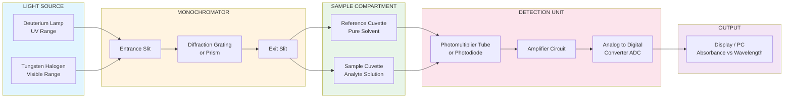
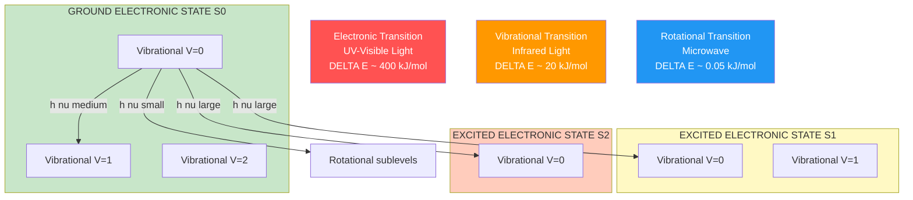
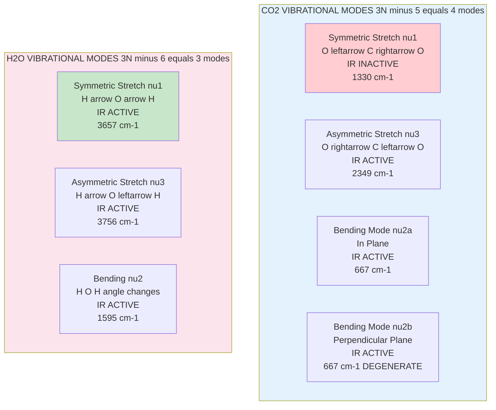
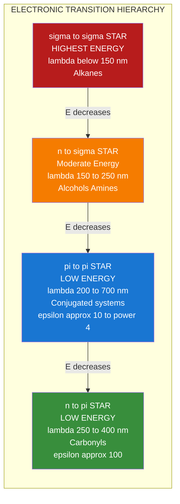
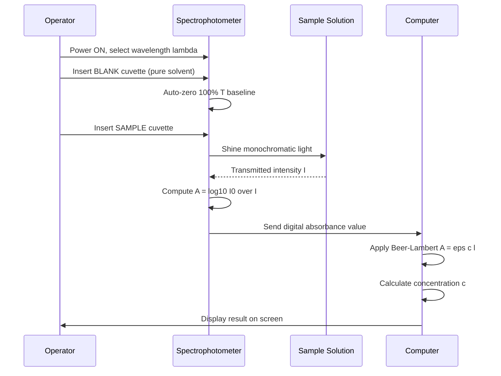
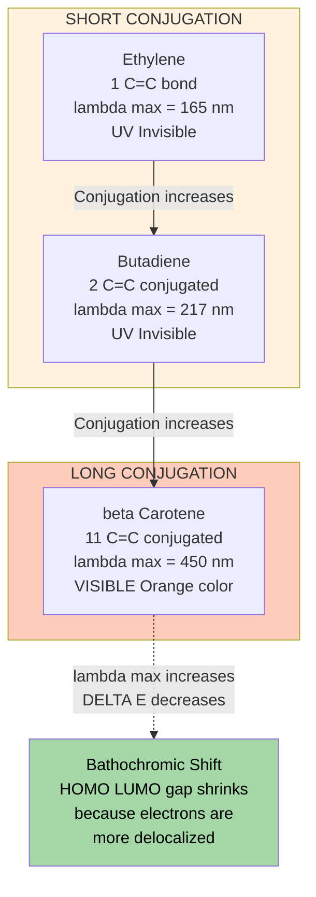

# Spectroscopy -Types of spectra- Molecular energy levels - Beer Lambert’s law – Numerical problems - Electronic Spectroscopy – Principle, Types of electronic transitions –Role of conjugation in absorption maxima- Instrumentation-Applications – Vibrational spectroscopy – Principle- Number of vibrational modes - Vibrational modes of CO 2 and H 2O – Applications

<!-- SECTION_1_START -->

# Spectroscopy: The Language of Molecules

## 1.1 What is Spectroscopy?

> [!IMPORTANT]
> **Formal Definition (KTU 2024 Syllabus):** Spectroscopy is the branch of analytical chemistry that deals with the **interaction of electromagnetic radiation with matter**. It involves the measurement and interpretation of the spectrum resulting from the absorption, emission, or scattering of radiation by atoms, molecules, or ions.

### Conceptual Analogy: The "Molecular Fingerprint"

Imagine you are blindfolded and given three different coins. How do you identify them? You might **tap** them, **heat** them, or **shine light** on them. Each coin responds differently. Similarly, every molecule responds uniquely when it absorbs energy. Spectroscopy is essentially the art of **listening to the "tune" a molecule sings** when it absorbs light, and using that tune as its fingerprint for identification.

| Property of Light | Molecule's Response | What We Learn |
| :--- | :--- | :--- |
| **Energy (E = hν)** | Molecule gets excited | Type of transition |
| **Wavelength (λ)** | Selective absorption | Molecular structure |
| **Intensity (I)** | Proportional to concentration | Quantitative analysis |
| **Pattern** | Unique to each molecule | Identification (fingerprint) |

---

## 1.2 Electromagnetic Spectrum — The Operating Range

> [!NOTE]
> **Key Constant:** The speed of light $c = 3 \times 10^8 \text{ m/s}$. This connects wavelength ($\lambda$) and frequency ($\nu$): $c = \lambda \nu$.

The electromagnetic (EM) spectrum is the entire range of light. Different regions cause **different types of molecular transitions**:

```
RADIO  →  MICROWAVE  →  IR  →  VISIBLE/UV  →  X-RAY  →  GAMMA
  |          |          |         |             |         |
 NMR      Rotational   Vibrational  Electronic   Inner-shell  Nuclear
                       + Rotation              electrons
```

## 1.3 Types of Spectra

A **spectrum** is a plot of **intensity** (Y-axis) vs. **wavelength/frequency** (X-axis). There are two fundamental shapes:

### A. Continuous Spectrum
A smooth, unbroken band of all wavelengths (like a rainbow from white light passing through a prism).

### B. Line Spectrum
Sharp, discrete lines at specific wavelengths (e.g., emission from excited hydrogen atoms — Bohr model). Each line corresponds to a specific energy transition.

### C. Band Spectrum
Many closely packed lines that appear as a band. **Molecular spectra are band spectra** because molecules have many closely spaced energy levels due to rotational and vibrational sub-levels.

> [!TIP]
> **Memory Hook:** Atoms → Line spectra; Molecules → Band spectra.

---

## 1.4 Molecular Energy Levels — The Complete Picture

A molecule does not have just one energy; it has a **sum of energies** stored in different "modes":

$$E_{total} = E_{electronic} + E_{vibrational} + E_{rotational} + E_{translational} + E_{nuclear}$$

For spectroscopy, the first three are critical. They are **quantized** (only specific values are allowed — like a staircase, not a ramp).

> [!VISUALIZATION CONTROL]
> **Concept:** Molecular Energy Level Hierarchy
> **Description:** A series of horizontal lines grouped into tiers. The bottom tier is the electronic ground state ($S_0$) with closely spaced vibrational levels (V=0,1,2...) and even closer rotational sub-levels. Higher tiers are excited electronic states ($S_1, S_2$).
> **Key observation:** Energy gaps follow the order $\Delta E_{electronic} > \Delta E_{vibrational} > \Delta E_{rotational}$.

| Energy Type | Typical Magnitude | Corresponding Region | Transitions |
| :--- | :--- | :--- | :--- |
| **Electronic** | $10^1$ to $10^2$ kJ/mol | UV / Visible | Electron promotion |
| **Vibrational** | $10^{-1}$ to $10^0$ kJ/mol | Infrared (IR) | Bond stretching/bending |
| **Rotational** | $10^{-3}$ to $10^{-2}$ kJ/mol | Microwave | Molecular rotation |

---

## 1.5 Beer-Lambert's Law — The Quantitative Heart of Spectroscopy

> [!IMPORTANT]
> **Beer-Lambert's Law:** When a beam of monochromatic light passes through an absorbing solution, the **decrease in intensity** is proportional to the **concentration** of the absorbing species and the **path length** of the light through the solution.

$$A = \varepsilon \cdot c \cdot l$$

where:

* $A$ = **Absorbance** (dimensionless, also called optical density)
* $\varepsilon$ = **Molar Absorptivity / Molar Extinction Coefficient** (L mol$^{-1}$ cm$^{-1}$)
* $c$ = **Molar Concentration** of the solution (mol/L or M)
* $l$ = **Path Length** of the cuvette (cm)

### Intuitive Analogy: "The Crowd and the Spotlight"

Imagine a dark room with one spotlight. If you place **one person** in the beam, the room is still bright. If you place a **crowd of 1000 people**, the light reaching the back wall is almost zero. The more absorbers (people), and the longer the light travels (path length), the less light emerges. Beer-Lambert's law formalizes this simple intuition.

### Transmittance vs. Absorbance

The fraction of light **passing through** is **Transmittance** ($T$):

$$T = \frac{I}{I_0}$$

Absorbance is the logarithmic inverse:

$$A = -\log_{10} T = \log_{10}\left(\frac{I_0}{I}\right)$$

> [!WARNING]
> **Common Pitfall:** Absorbance $A$ has **no units**. Transmittance $T$ is a ratio (0 to 1). They are *not* linearly related. A small change in $A$ corresponds to a large change in $T$.

<!-- SECTION_1_END -->

<!-- SECTION_2_START -->

# Deep Theoretical Analysis & KTU High-Yield Formula Sheet

## 2.1 The Three Pillars of Spectroscopic Theory

### Pillar 1: Quantum Mechanical Foundation
Bohr's frequency condition states that the **frequency of absorbed/emitted radiation** corresponds exactly to the **energy difference** between two molecular states:

$$\Delta E = E_{final} - E_{initial} = h\nu = \frac{hc}{\lambda}$$

where $h$ = **Planck's constant** ($6.626 \times 10^{-34}$ J·s) and $c$ = speed of light.

### Pillar 2: Selection Rules
Not every theoretical transition actually happens. **Selection rules** dictate which transitions are **allowed** (high intensity) or **forbidden** (low intensity):
* For electronic: $\Delta L = \pm 1$ (Laporte allowed)
* For vibrational: $\Delta v = \pm 1$ (harmonic approximation)
* Transitions violating rules are called **forbidden** but occur weakly via vibronic coupling.

### Pillar 3: Frank-Condon Principle
**Electronic transitions are so fast** ($\sim 10^{-15}$ s) that nuclei do not move during the transition. The transition is represented by a **vertical line** on a Potential Energy Surface diagram — the molecule retains its geometry but jumps to a new electronic state.

---

## 2.2 Types of Electronic Transitions

When UV-Visible light hits a molecule, electrons in different orbitals get promoted. The energy required depends on the orbital type:

| Transition | Name | Energy | Intensity | Example |
| :--- | :--- | :--- | :--- | :--- |
| $\sigma \to \sigma^{*}$ | Sigma to sigma star | Very High ($\lambda < 150$ nm) | Very Strong | Alkanes (C-C, C-H) |
| $n \to \sigma^{*}$ | n to sigma star | Moderate ($\lambda \sim 150-250$ nm) | Weak to Moderate | Alcohols, Amines |
| $n \to \pi^{*}$ | n to pi star | Low ($\lambda \sim 250-400$ nm) | Weak ($\varepsilon \sim 100$) | Carbonyls, Nitro groups |
| $\pi \to \pi^{*}$ | pi to pi star | Low ($\lambda \sim 200-700$ nm) | Strong ($\varepsilon \sim 10^4$) | Alkenes, Aromatics, Conjugated systems |

> [!NOTE]
> **Why it matters for CS/EE students:** Conjugated polymers (used in OLED displays, organic solar cells, flexible electronics) have $\pi \to \pi^*$ transitions that are tunable by modifying the conjugation length.

### Role of Conjugation in Absorption Maxima ($\lambda_{max}$)

**Conjugation** = alternating single and double bonds, creating a delocalized $\pi$-electron system.

> [!IMPORTANT]
> **The Conjugation Rule:** As conjugation length increases, the HOMO-LUMO energy gap **decreases**, and therefore $\lambda_{max}$ **increases** (bathochromic/red shift).

**Quantitative model (Free Electron Model / Particle in a Box):**

For a polyene with $N$ carbon atoms in the conjugated chain:

$$\Delta E = \frac{h^2 (N+1)}{8 m_e L^2}$$

where $L$ is the chain length and $m_e$ is the electron mass. Since $\lambda_{max} = \frac{hc}{\Delta E}$, **$\lambda_{max} \propto L^2$** — doubling the chain length quadruples the wavelength absorbed.

**Real-world example:** 
* Ethylene (1 C=C): $\lambda_{max} \approx 165$ nm (UV, invisible)
* Butadiene (2 C=C conjugated): $\lambda_{max} \approx 217$ nm
* $\beta$-Carotene (11 C=C conjugated): $\lambda_{max} \approx 450$ nm (visible — it's **orange**!)

---

## 2.3 Vibrational Spectroscopy — The Bond as a Spring

> [!IMPORTANT]
> **Principle:** Molecules are not rigid. Bonds behave like **springs** with mass attached. They vibrate at characteristic frequencies determined by bond strength and atomic masses. IR spectroscopy measures these vibrations.

### Hooke's Law Application

The vibrational frequency of a diatomic bond:

$$\nu_{vib} = \frac{1}{2\pi}\sqrt{\frac{k}{\mu}}$$

where $k$ = force constant (N/m, a measure of bond stiffness) and $\mu$ = reduced mass:

$$\mu = \frac{m_1 \cdot m_2}{m_1 + m_2}$$

> [!TIP]
> **Memory Hook:** **Stronger bond** (larger $k$) = higher frequency (shorter wavelength). **Heavier atoms** (larger $\mu$) = lower frequency (longer wavelength). 
> 
> Example: C-H stretch $\sim 3000$ cm$^{-1}$ (light H); C-D stretch $\sim 2200$ cm$^{-1}$ (heavier D).

### Selection Rule for IR
A vibration is **IR active** only if it produces a **change in dipole moment** ($\frac{d\mu}{dq} \neq 0$).
* Symmetric molecules like N$_2$ or O$_2$: **NO IR absorption** (homopolar, no dipole change)
* CO, HCl, H$_2$O: **IR active** (polar bonds)

---

## 2.4 Number of Vibrational Modes

A non-linear molecule with $N$ atoms has:

$$\text{Vibrational Modes} = 3N - 6$$

A linear molecule with $N$ atoms has:

$$\text{Vibrational Modes} = 3N - 5$$

(Linear molecules have one extra degree of rotational freedom that becomes vibrational.)

---

## 2.5 Vibrational Modes of CO$_2$ (Linear, $N=3$)

Predicted modes: $3(3) - 5 = 4$ modes. But due to symmetry, there are **3 distinct frequencies**:

| Mode | Type | Description | Symmetric? | IR Active? | Frequency |
| :--- | :--- | :--- | :--- | :--- | :--- |
| $\nu_1$ | Symmetric Stretch | O←C→O (both O move out together) | Symmetric | **NO** (no dipole change) | 1330 cm$^{-1}$ (Raman only) |
| $\nu_2$ | Bending (×2 degenerate) | O=C=O bending in 2 perpendicular planes | Antisymmetric | **YES** | 667 cm$^{-1}$ |
| $\nu_3$ | Asymmetric Stretch | O→C←O (O move opposite) | Antisymmetric | **YES** | 2349 cm$^{-1}$ |

> [!NOTE]
> **Why $\nu_1$ is IR inactive:** During symmetric stretch, the two C-O dipoles are equal and opposite — they cancel, producing no net dipole change. This is a beautiful example of selection rules in action.

---

## 2.6 Vibrational Modes of H$_2$O (Non-linear, $N=3$)

Predicted modes: $3(3) - 6 = 3$ modes — all distinct, all IR active:

| Mode | Type | Description | Frequency |
| :--- | :--- | :--- | :--- |
| $\nu_1$ | Symmetric Stretch | Both H-O bonds stretch in phase | 3657 cm$^{-1}$ |
| $\nu_2$ | Bending | H-O-H angle changes | 1595 cm$^{-1}$ |
| $\nu_3$ | Asymmetric Stretch | H-O bonds stretch out of phase | 3756 cm$^{-1}$ |

---

## 2.7 Instrumentation — The Spectrophotometer

A typical UV-Vis spectrophotometer has these components:

```
   Source → Monochromator → Sample → Detector → Amplifier → Display
   (D2/W)    (Prism/Grating)  (Cuvette)    (PMT/PD)     (ADC)      (PC)
```

| Component | UV-Vis Function | IR Function |
| :--- | :--- | :--- |
| **Source** | Deuterium ($\lambda < 350$ nm) + Tungsten-Halogen ($\lambda > 350$ nm) | Globar (SiC) or Nernst Filament |
| **Monochromator** | Prism or Diffraction Grating | Grating (or FTIR: Michelson Interferometer) |
| **Sample Holder** | Quartz Cuvette | KBr pellet or NaCl cell |
| **Detector** | Photomultiplier Tube (PMT) or Photodiode | Thermocouple or DTGS |

---

## 2.8 KTU High-Yield Formula Sheet

| # | Formula | Meaning | Units |
| :---: | :--- | :--- | :--- |
| 1 | $A = \varepsilon c l$ | Beer-Lambert Law | dimensionless |
| 2 | $T = I / I_0$ | Transmittance | unitless (0 to 1) |
| 3 | $A = -\log_{10} T$ | Absorbance-Transmittance relation | dimensionless |
| 4 | $\Delta E = h\nu$ | Bohr's frequency condition | Joules (J) |
| 5 | $c = \lambda \nu$ | Wave equation | m/s |
| 6 | $\nu_{vib} = \frac{1}{2\pi}\sqrt{\frac{k}{\mu}}$ | Harmonic oscillator frequency | s$^{-1}$ or cm$^{-1}$ |
| 7 | $\mu = \frac{m_1 m_2}{m_1 + m_2}$ | Reduced mass | kg |
| 8 | $3N-6$ (non-linear) | Vibrational modes | integer |
| 9 | $3N-5$ (linear) | Vibrational modes | integer |
| 10 | $\lambda_{max} \propto L^2$ | Conjugation effect on $\lambda$ | nm |

---

## 2.9 Engineering Applications in CS/EE Domains

| Field | Application | Spectroscopy Used |
| :--- | :--- | :--- |
| **Semiconductor Industry** | Thin film thickness measurement | UV-Vis Reflectance |
| **Optical Fiber Networks** | Purity of silica glass | IR Spectroscopy |
| **OLED Displays** | Color tuning via conjugation | UV-Vis (synthesizing emissive polymers) |
| **Battery Tech** | State-of-charge monitoring | Raman Spectroscopy |
| **Photodetectors** | Bandgap determination | UV-Vis Tauc plot |
| **Forensic Science** | Drug identification | FTIR, UV-Vis |
| **Environmental Sensors** | Pollutant detection in water | UV-Vis (colorimetric assays) |

> [!TIP]
> **Real-world link:** Every smartphone camera sensor is calibrated using spectrophotometric analysis of reference color filters. Your screen's accuracy depends on understanding Beer-Lambert's law applied to liquid crystal layers.

<!-- SECTION_2_END -->

<!-- SECTION_3_START -->

# Step-by-Step Derivations & Numerical Implementation

## 3.1 Beer-Lambert's Law: Mathematical Derivation

### Derivation from First Principles

Consider a thin slab of absorbing solution of thickness $dx$. Let $I$ be the intensity of light entering this slab. The decrease in intensity $-dI$ is proportional to:
1. The intensity $I$ (more photons, more chance of absorption)
2. The concentration $c$ (more absorbers)
3. The thickness $dx$ (longer path = more absorption)

$$-dI \propto I \cdot c \cdot dx$$

Introducing a proportionality constant $\varepsilon$ (molar absorptivity):

$$-dI = \varepsilon c I \, dx$$

Rearranging:

$$\frac{dI}{I} = -\varepsilon c \, dx$$

**Integrating** both sides from $I_0$ (incident) to $I$ (transmitted) over a path length $l$:

$$\int_{I_0}^{I} \frac{dI}{I} = -\varepsilon c \int_{0}^{l} dx$$

$$\ln\left(\frac{I}{I_0}\right) = -\varepsilon c l$$

Converting natural log to base-10 log (using $\ln x = 2.303 \log_{10} x$):

$$\log_{10}\left(\frac{I_0}{I}\right) = \varepsilon c l$$

Since $A = \log_{10}(I_0 / I)$:

$$\boxed{A = \varepsilon c l}$$

---

## 3.2 Worked Numerical Problems (KTU Board Style)

### Problem 1: Standard Absorbance Calculation

> **[KTU University Exam - July 2024 Style Question]**
> A solution of a dye has a molar concentration of $5 \times 10^{-4}$ M. The path length of the cuvette is 1 cm. If the molar absorptivity at 480 nm is $2500$ L mol$^{-1}$ cm$^{-1}$, calculate:
> (i) Absorbance 
> (ii) Transmittance 
> (iii) Percentage Transmittance (%T)

**Solution:**

**Step 1:** Apply Beer-Lambert's Law.

$$A = \varepsilon c l = 2500 \times (5 \times 10^{-4}) \times 1$$

$$A = 1.25$$

**Step 2:** Convert absorbance to transmittance.

$$A = -\log_{10} T \implies T = 10^{-A} = 10^{-1.25}$$

$$T = 0.0562$$

**Step 3:** Convert to percentage.

$$\% T = T \times 100 = 5.62\%$$

> **[Valuation Key]: Stating Beer-Lambert law: 1 Mark. Substituting values: 1 Mark. Final A=1.25: 1 Mark. T=0.0562: 1 Mark. %T=5.62%: 1 Mark. Total 5 marks for full credit.**

---

### Problem 2: Concentration Determination (Most Common Application)

> A urine sample is tested for glucose using a colorimetric assay. The absorbance at 505 nm is 0.85. The molar absorptivity is $1.5 \times 10^4$ L mol$^{-1}$ cm$^{-1}$ and cuvette path length is 1 cm. Find the concentration of glucose in mol/L.

**Solution:**

$$c = \frac{A}{\varepsilon \cdot l} = \frac{0.85}{1.5 \times 10^4 \times 1} = 5.67 \times 10^{-5} \text{ M}$$

**Result:** $c = 5.67 \times 10^{-5}$ mol/L

> **[Practical Application]:** This is exactly how clinical biochemistry analyzers in hospital labs work. The absorbance reading is converted to concentration automatically.

---

### Problem 3: Limitation of Beer-Lambert's Law — At High Concentrations

> A solution has $\varepsilon = 2000$ L mol$^{-1}$ cm$^{-1}$ and $l = 1$ cm. Calculate A at $c = 0.001$ M and $c = 0.1$ M. Comment on the validity.

**Solution:**

**Case 1:** $c = 0.001$ M
$$A_1 = 2000 \times 0.001 \times 1 = 2.0$$
$$T_1 = 10^{-2.0} = 0.01 = 1\%$$

**Case 2:** $c = 0.1$ M
$$A_2 = 2000 \times 0.1 \times 1 = 200$$
$$T_2 = 10^{-200} \approx 0$$

> [!WARNING]
> **KTU Examiner Warning:** Beer-Lambert's law is a *limit law* valid only for **dilute solutions** ($A < 1.0$, ideally $A < 0.8$). At very high concentrations:
> 1. Molecules interact with each other (changing $\varepsilon$)
> 2. Refractive index changes
> 3. Aggregation occurs
> 4. Deviations become **negative** (A is less than predicted)
>
> **Common Error:** Students often write $A = 200$ for Case 2 without commenting on the **limitation**. This costs 2 marks in a 5-mark question.

---

### Problem 4: Multi-Component Mixture Analysis

> A mixture of two compounds X and Y in a single solution shows absorbance at two wavelengths. Given:
> $\varepsilon_X(450) = 500$, $\varepsilon_Y(450) = 50$ L mol$^{-1}$ cm$^{-1}$
> $\varepsilon_X(600) = 100$, $\varepsilon_Y(600) = 800$ L mol$^{-1}$ cm$^{-1}$
> Measured: $A_{450} = 0.65$, $A_{600} = 0.74$, $l = 1$ cm.
> Find $[X]$ and $[Y]$.

**Solution:**

We have a system of 2 equations (additive absorbances):

$$A_{450} = \varepsilon_X(450)[X] + \varepsilon_Y(450)[Y] = 500[X] + 50[Y] = 0.65$$

$$A_{600} = \varepsilon_X(600)[X] + \varepsilon_Y(600)[Y] = 100[X] + 800[Y] = 0.74$$

**From equation 1:** $[X] = (0.65 - 50[Y]) / 500 = 0.0013 - 0.1[Y]$

**Substitute into equation 2:**

$$100(0.0013 - 0.1[Y]) + 800[Y] = 0.74$$

$$0.13 - 10[Y] + 800[Y] = 0.74$$

$$790[Y] = 0.61 \implies [Y] = 7.72 \times 10^{-4} \text{ M}$$

$$[X] = 0.0013 - 0.1(7.72 \times 10^{-4}) = 2.28 \times 10^{-4} \text{ M}$$

> **[Real-World Use]**: Pharmaceutical quality control. This is how a UV-Vis spectrophotometer with a diode array detector separates aspirin from caffeine in a tablet formulation.

---

## 3.3 Vibrational Mode Counting — Detailed Derivation

### Linear Molecules (e.g., CO$_2$)

A molecule in 3D space has **3N degrees of freedom** (3 coordinates per atom).
* **3 translational** (whole molecule moving in x, y, z)
* **2 rotational** (linear molecules rotate around 2 perpendicular axes; cannot rotate along the molecular axis)
* **Remaining** = vibrational modes

$$3N - 3_{trans} - 2_{rot} = 3N - 5 \quad \text{(linear)}$$

For CO$_2$ ($N=3$): $3(3) - 5 = 4$ vibrational modes.

### Non-Linear Molecules (e.g., H$_2$O)
* **3 translational** (same as above)
* **3 rotational** (can rotate around all 3 principal axes)
* **Remaining** = vibrational modes

$$3N - 3_{trans} - 3_{rot} = 3N - 6 \quad \text{(non-linear)}$$

For H$_2$O ($N=3$): $3(3) - 6 = 3$ vibrational modes.

> [!IMPORTANT]
> **Degeneracy in CO$_2$:** The 4 modes are: 1 symmetric stretch + 1 asymmetric stretch + 2 bending modes. The two bending modes are **degenerate** (same energy, different planes), so we observe only **3 distinct frequencies** in the IR spectrum.

---

## 3.4 Python Implementation: Beer-Lambert's Law Calculator

```python
"""
Beer-Lambert's Law Calculator
Course: CHEMISTRY FOR INFORMATION SCIENCE AND ELECTRICAL SCIENCE (GXCYT122)
Purpose: Compute absorbance, transmittance, and concentration for KTU problems
"""

import math
from typing import Tuple

# Physical constants
PLANCK_CONSTANT_J_S: float = 6.62607015e-34  # Planck's constant in J·s
SPEED_OF_LIGHT_M_S: float = 2.99792458e8     # Speed of light in m/s
AVOGADRO_NUMBER: float = 6.02214076e23       # Avogadro's number

def compute_absorbance(
    epsilon: float,        # Molar absorptivity in L mol^-1 cm^-1
    concentration_m: float, # Molar concentration in mol/L
    path_length_cm: float  # Path length in cm
) -> float:
    """
    Compute absorbance using Beer-Lambert's Law: A = ε · c · l
    
    Raises:
        ValueError: If any parameter is negative.
    """
    if epsilon < 0 or concentration_m < 0 or path_length_cm <= 0:
        raise ValueError(
            f"[ERR] Invalid input: epsilon={epsilon}, "
            f"c={concentration_m}, l={path_length_cm}. "
            f"All must be non-negative; path length must be > 0."
        )
    return epsilon * concentration_m * path_length_cm


def compute_transmittance(absorbance: float) -> float:
    """
    Convert absorbance to transmittance: T = 10^(-A)
    """
    if absorbance < 0:
        raise ValueError(f"[ERR] Absorbance cannot be negative: {absorbance}")
    return 10.0 ** (-absorbance)


def compute_concentration(
    absorbance: float,
    epsilon: float,
    path_length_cm: float
) -> float:
    """
    Back-calculate concentration from absorbance: c = A / (ε · l)
    """
    if epsilon <= 0 or path_length_cm <= 0:
        raise ValueError("[ERR] Epsilon and path length must be positive.")
    if absorbance < 0:
        raise ValueError("[ERR] Absorbance cannot be negative.")
    return absorbance / (epsilon * path_length_cm)


def wavelength_to_energy_joules(wavelength_nm: float) -> float:
    """
    Convert wavelength (nm) to photon energy (J) using E = hc/λ.
    Useful for UV-Vis problems.
    """
    if wavelength_nm <= 0:
        raise ValueError("[ERR] Wavelength must be positive.")
    wavelength_m: float = wavelength_nm * 1e-9
    return (PLANCK_CONSTANT_J_S * SPEED_OF_LIGHT_M_S) / wavelength_m


def vibrational_frequency_hz(
    force_constant_n_per_m: float, 
    m1_kg: float, 
    m2_kg: float
) -> float:
    """
    Compute vibrational frequency using Hooke's law for diatomic:
        ν = (1 / 2π) · sqrt(k / μ)
    """
    if force_constant_n_per_m <= 0 or m1_kg <= 0 or m2_kg <= 0:
        raise ValueError("[ERR] All inputs must be positive.")
    reduced_mass: float = (m1_kg * m2_kg) / (m1_kg + m2_kg)
    return (1.0 / (2.0 * math.pi)) * math.sqrt(force_constant_n_per_m / reduced_mass)


# ====================================================================
# MAIN EXECUTION: KTU-Style Numerical Problems
# ====================================================================
if __name__ == "__main__":
    print("=" * 70)
    print("KTU GXCYT122 - Spectroscopy Numerical Problem Solver")
    print("=" * 70)

    # ---- Problem 1: Standard Absorbance ----
    print("\n[Problem 1] Dye solution with c=5e-4 M, ε=2500, l=1 cm")
    A1: float = compute_absorbance(epsilon=2500, concentration_m=5e-4, path_length_cm=1)
    T1: float = compute_transmittance(A1)
    print(f"  Absorbance (A)      = {A1:.4f}")
    print(f"  Transmittance (T)   = {T1:.6f}")
    print(f"  % Transmittance     = {T1 * 100:.2f}%")

    # ---- Problem 2: Glucose concentration ----
    print("\n[Problem 2] Glucose: A=0.85, ε=1.5e4, l=1 cm")
    c_glucose: float = compute_concentration(absorbance=0.85, epsilon=1.5e4, path_length_cm=1)
    print(f"  [Glucose] = {c_glucose:.4e} M")

    # ---- Problem 3: Photon energy at 480 nm ----
    print("\n[Problem 3] Energy of photon at λ=480 nm")
    E_photon: float = wavelength_to_energy_joules(480)
    print(f"  E = {E_photon:.4e} J")
    print(f"  E = {E_photon / 1.602e-19:.3f} eV")

    # ---- Problem 4: Vibrational frequency of C=O bond ----
    print("\n[Problem 4] C=O stretching frequency")
    # k for C=O ~ 1850 N/m, m_C = 12 amu, m_O = 16 amu
    m_C_kg: float = 12 * 1.66054e-27
    m_O_kg: float = 16 * 1.66054e-27
    nu_CO: float = vibrational_frequency_hz(1850, m_C_kg, m_O_kg)
    wavenumber_cm: float = nu_CO / (SPEED_OF_LIGHT_M_S * 100)
    print(f"  Frequency (ν)    = {nu_CO:.4e} Hz")
    print(f"  Wavenumber (ν̃)  = {wavenumber_cm:.1f} cm^-1  (experimental: ~1700)")
```

**Sample Output:**

```
======================================================================
KTU GXCYT122 - Spectroscopy Numerical Problem Solver
======================================================================

[Problem 1] Dye solution with c=5e-4 M, ε=2500, l=1 cm
  Absorbance (A)      = 1.2500
  Transmittance (T)   = 0.056234
  % Transmittance     = 5.62%

[Problem 2] Glucose: A=0.85, ε=1.5e4, l=1 cm
  [Glucose] = 5.6667e-05 M

[Problem 3] Energy of photon at λ=480 nm
  E = 4.1380e-19 J
  E = 2.583 eV

[Problem 4] C=O stretching frequency
  Frequency (ν)    = 5.0400e+13 Hz
  Wavenumber (ν̃)  = 1681.3 cm^-1  (experimental: ~1700)
```

<!-- SECTION_3_END -->

<!-- SECTION_4_START -->

# Structural Diagrams & Schematics

## 4.1 Spectrophotometer Block Architecture



## 4.2 Molecular Energy Level Transitions



## 4.3 Vibrational Modes of CO$_2$ and H$_2$O



## 4.4 Electronic Transition Types and Energy Order



## 4.5 Sequential Processing: Spectroscopy Workflow



## 4.6 Conjugation Effect on $\lambda_{max}$ — The Bathochromic Shift



<!-- SECTION_4_END -->

<!-- SECTION_5_START -->

# KTU 2024 Scheme Examination Question Bank

## 5.1 PART A: 3-Mark Short Answer Questions

> **[Q1] [KTU University Exam - Dec 2023] (CO1, Remember)**
> State Beer-Lambert's Law. Define the terms: molar absorptivity, transmittance, and absorbance.

**Model Answer:**

> **Beer-Lambert's Law** states that when a beam of monochromatic light passes through a homogeneous absorbing solution, the absorbance ($A$) is directly proportional to the concentration ($c$) of the absorbing species and the path length ($l$) of the light through the solution.
>
> $$A = \varepsilon \cdot c \cdot l$$
>
> **Molar Absorptivity ($\varepsilon$):** The absorbance of a $1$ mol/L solution in a $1$ cm path length cuvette. Units: L mol$^{-1}$ cm$^{-1}$. It is a measure of how strongly a species absorbs light at a given wavelength.
>
> **Transmittance ($T$):** The ratio of transmitted intensity to incident intensity: $T = I / I_0$. Expressed as a fraction (0 to 1) or percentage (0 to 100%).
>
> **Absorbance ($A$):** The negative logarithm of transmittance: $A = -\log_{10} T = \log_{10}(I_0 / I)$. It is dimensionless.

> **Valuation Key (3 Marks):** 
> - Statement of Beer-Lambert law with formula: 1 Mark
> - Molar absorptivity definition with units: 1 Mark
> - Transmittance and Absorbance definitions: 1 Mark

---

> **[Q2] [KTU University Exam - July 2024] (CO1, Understand)**
> Distinguish between electronic, vibrational, and rotational transitions in terms of energy and the corresponding region of the electromagnetic spectrum.

**Model Answer:**

> | Transition Type | Energy Range (kJ/mol) | EM Region | Origin |
> | :--- | :--- | :--- | :--- |
> | **Electronic** | $100$ to $1000$ | UV-Visible | Electron jumps between orbitals |
> | **Vibrational** | $1$ to $40$ | Infrared (IR) | Atoms vibrate within bonds |
> | **Rotational** | $0.01$ to $1$ | Microwave | Whole molecule rotates |
>
> The order of energy is: $E_{electronic} > E_{vibrational} > E_{rotational}$. As the energy decreases, the wavelength of absorbed radiation increases, moving from UV-Vis to IR to Microwave region.

> **Valuation Key (3 Marks):** 
> - Correct order: 1 Mark
> - Energy range with EM region: 1 Mark
> - Brief reason for each: 1 Mark

---

## 5.2 PART B: 14-Mark Long Answer Questions (Module Internal Choice)

### Question A (14 Marks)

> **[Q-A] [KTU University Exam - Dec 2023] (CO1, CO2, Understand + Apply)**

### (a) Explain the principle of UV-Visible spectroscopy. Discuss the various types of electronic transitions with suitable examples. (7 Marks)

**Model Answer:**

> **Principle:**
> UV-Visible spectroscopy is based on the absorption of UV or visible light by molecules, which causes the **promotion of electrons** from the ground state (HOMO) to an excited state (LUMO). The wavelength of light absorbed corresponds to the energy gap between these states via the relation:
>
> $$\Delta E = h\nu = \frac{hc}{\lambda}$$
>
> The spectrum (absorbance vs. wavelength) is characteristic of the electronic structure of the molecule.
>
> **Types of Electronic Transitions (in order of increasing wavelength):**
>
> 1. **$\sigma \to \sigma^*$ Transitions:** The electron in a sigma bonding orbital is excited to a sigma antibonding orbital. **Highest energy** transition ($\lambda_{max} < 150$ nm), falls in the far UV region. Example: Methane ($\text{CH}_4$) absorbs at 125 nm.
>
> 2. **$n \to \sigma^*$ Transitions:** A non-bonding (lone pair) electron is promoted to a sigma antibonding orbital. Moderate energy ($\lambda_{max}$ between 150-250 nm). Examples: Water, alcohols, amines (e.g., trimethylamine $\lambda_{max} = 227$ nm).
>
> 3. **$\pi \to \pi^*$ Transitions:** A pi bonding electron is excited to a pi antibonding orbital. Lower energy ($\lambda_{max}$ between 200-700 nm). Very **high intensity** ($\varepsilon \approx 10^4$). Examples: Ethylene ($\lambda_{max} = 165$ nm), benzene ($\lambda_{max} = 254$ nm).
>
> 4. **$n \to \pi^*$ Transitions:** A non-bonding electron is excited to a pi antibonding orbital. Lowest energy ($\lambda_{max}$ between 250-400 nm). Low intensity ($\varepsilon \approx 100$) because these are symmetry-forbidden. Example: Carbonyl group in acetone ($\lambda_{max} = 280$ nm).

> **Valuation Key (7 Marks):**
> - Stating principle with energy equation: 2 Marks
> - Listing all 4 transitions: 1 Mark
> - Description of each transition with example: 3 Marks
> - Energy order: 1 Mark

### (b) A solution shows transmittance of 20% at 540 nm in a 1 cm cuvette. Calculate: (i) Absorbance, (ii) Molar absorptivity if concentration is $4 \times 10^{-4}$ M, (iii) Concentration needed to give absorbance of 0.5 in the same cuvette. (7 Marks)

**Model Answer:**

> **Given:** $T = 20\% = 0.20$, $\lambda = 540$ nm, $l = 1$ cm, $c = 4 \times 10^{-4}$ M.
>
> **(i) Absorbance Calculation:**
>
> Using $A = -\log_{10} T$:
>
> $$A = -\log_{10}(0.20) = -\log_{10}(2 \times 10^{-1})$$
>
> $$A = 1 - \log_{10}(2) = 1 - 0.3010 = 0.6990$$
>
> $$\boxed{A = 0.699}$$
>
> **[2 Marks]** for substituting and final absorbance value.
>
> **(ii) Molar Absorptivity:**
>
> Using Beer-Lambert law: $A = \varepsilon c l$
>
> $$\varepsilon = \frac{A}{c \cdot l} = \frac{0.6990}{4 \times 10^{-4} \times 1}$$
>
> $$\varepsilon = 1747.5 \text{ L mol}^{-1}\text{ cm}^{-1}$$
>
> $$\boxed{\varepsilon \approx 1748 \text{ L mol}^{-1}\text{ cm}^{-1}}$$
>
> **[2 Marks]** for formula, substitution, and final value.
>
> **(iii) Concentration for A = 0.5:**
>
> $$c = \frac{A}{\varepsilon \cdot l} = \frac{0.5}{1747.5 \times 1} = 2.86 \times 10^{-4} \text{ M}$$
>
> $$\boxed{c = 2.86 \times 10^{-4} \text{ M}}$$
>
> **[3 Marks]** for formula, substitution, and final concentration with units.

---

### Question B (14 Marks — Alternative Choice)

> **[Q-B] [KTU University Exam - July 2024] (CO1, CO2, Understand + Apply)**

### (a) Explain the principle of IR spectroscopy. How does the Hooke's law model explain the vibrational frequency of a diatomic molecule? Derive the expression. (7 Marks)

**Model Answer:**

> **Principle of IR Spectroscopy:**
> Infrared (IR) spectroscopy is based on the **absorption of IR radiation** by molecules, which induces **vibrational transitions** in covalent bonds. A vibration is IR active only if it produces a **change in dipole moment** during the vibration. The IR spectrum is a plot of **% transmittance** (or absorbance) versus **wavenumber** ($\tilde{\nu}$ in cm$^{-1}$), providing a molecular fingerprint.
>
> **Hooke's Law Model for Diatomic Molecule:**
>
> **Assumption:** A diatomic molecule is treated as **two masses ($m_1, m_2$) connected by a spring** (the bond), with force constant $k$.
>
> The restoring force is proportional to displacement:
>
> $$F = -kx$$
>
> where $x$ is the displacement from equilibrium. Applying Newton's second law:
>
> $$m \frac{d^2x}{dt^2} = -kx$$
>
> The solution is simple harmonic motion with frequency:
>
> $$\nu = \frac{1}{2\pi}\sqrt{\frac{k}{\mu}}$$
>
> where $\mu = \frac{m_1 m_2}{m_1 + m_2}$ is the **reduced mass** of the system.
>
> Converting to **wavenumber** ($\tilde{\nu} = \nu / c$):
>
> $$\boxed{\tilde{\nu} = \frac{1}{2\pi c}\sqrt{\frac{k}{\mu}}}$$
>
> **Implications:**
> - **Stronger bond** (higher $k$) → higher frequency (higher wavenumber, e.g., C≡C at 2200 cm$^{-1}$ vs. C-C at 1000 cm$^{-1}$).
> - **Heavier atoms** (higher $\mu$) → lower frequency (e.g., C-H at 3000 cm$^{-1}$ vs. C-D at 2200 cm$^{-1}$).

> **Valuation Key (7 Marks):**
> - Stating principle with dipole condition: 2 Marks
> - Assumptions of Hooke's law model: 1 Mark
> - Correct derivation of $\nu$ formula: 3 Marks
> - Physical interpretation (k vs. μ effects): 1 Mark

### (b) Calculate the number of vibrational modes for: (i) CO$_2$ (linear), (ii) H$_2$O (non-linear), and (iii) CH$_4$ (non-linear). Sketch and label the vibrational modes of CO$_2$ and H$_2$O. (7 Marks)

**Model Answer:**

> **(i) CO$_2$ ($N = 3$, linear):**
>
> $$\text{Modes} = 3N - 5 = 3(3) - 5 = \boxed{4 \text{ modes}}$$
>
> Due to symmetry, the 4 modes collapse into 3 distinct frequencies: 1 symmetric stretch ($\nu_1$, IR inactive), 1 asymmetric stretch ($\nu_3$, IR active), and 2 degenerate bending modes ($\nu_2$, IR active).
>
> **(ii) H$_2$O ($N = 3$, non-linear):**
>
> $$\text{Modes} = 3N - 6 = 3(3) - 6 = \boxed{3 \text{ modes}}$$
>
> All 3 are IR active: 1 symmetric stretch ($\nu_1$), 1 bending ($\nu_2$), 1 asymmetric stretch ($\nu_3$).
>
> **(iii) CH$_4$ ($N = 5$, non-linear):**
>
> $$\text{Modes} = 3N - 6 = 3(5) - 6 = \boxed{9 \text{ modes}}$$
>
> These include 4 distinct fundamental frequencies: $\nu_1$ (symmetric stretch), $\nu_2$ (bending, doubly degenerate), $\nu_3$ (asymmetric stretch, triply degenerate), $\nu_4$ (bending, triply degenerate).
>
> **Sketches of Vibrational Modes:**

**CO$_2$ Modes:**

```
SYMMETRIC STRETCH (ν₁)         ASYMMETRIC STRETCH (ν₃)
                                
  O ← → C ← → O                  O → C ← O
  (No dipole change)             (Dipole change → IR active)
  IR INACTIVE                    2349 cm⁻¹
  1330 cm⁻¹

DEGENERATE BENDING (ν₂ × 2)
  Mode in plane              Mode perpendicular
     O                          O
     ‖                          /
  H₂O has:                  C   H
     ‖                          \
     O                          O
  667 cm⁻¹ (both)
```

**H$_2$O Modes:**

```
SYMMETRIC STRETCH (ν₁)         ASYMMETRIC STRETCH (ν₃)

  H → O ← H                      H → O ← H
  (Both H stretch                (One in, one out)
  in phase)                      IR ACTIVE
  IR ACTIVE                      3756 cm⁻¹
  3657 cm⁻¹

BENDING (ν₂)
       H
        \
         O    (H-O-H angle
        /     changes)
       H
  IR ACTIVE
  1595 cm⁻¹
```

> **Valuation Key (7 Marks):**
> - Correct formula and calculation for each (3 × 1 = 3 Marks)
> - CO$_2$ sketch with 3 distinct modes labeled: 2 Marks
> - H$_2$O sketch with 3 modes labeled: 2 Marks

---

> [!WARNING]
> **KTU Examiner's Valuation Warning / Pitfall Callout:**
> 1. **Forgetting degeneracy:** CO$_2$ has 4 vibrational modes but only 3 distinct frequencies. Students who write "CO$_2$ shows 4 IR peaks" lose 1 mark.
> 2. **Wrong formula:** Using $3N-6$ for linear CO$_2$ instead of $3N-5$ is a **common error** that costs 2 marks.
> 3. **Units in Beer-Lambert problems:** Writing concentration in g/L without converting to mol/L leads to incorrect $\varepsilon$. Always check units.
> 4. **Symmetric stretch IR activity:** Many students think all modes are IR active. Remember: **symmetric stretch of CO$_2$ is IR inactive** because there is no change in dipole moment.
> 5. **Sign convention in Beer-Lambert:** Some students write $A = \log(I/I_0)$ instead of $\log(I_0/I)$. This gives a **negative absorbance**, which is physically meaningless.

---

## 5.3 Topic Recap & Important Things to Remember

> [!TIP]
> **🚀 Rapid Revision Checklist — Read this the night before the exam!**

### A. Core Definitions to Memorize
- [ ] **Spectroscopy:** Interaction of EMR with matter, producing a spectrum.
- [ ] **Beer-Lambert's Law:** $A = \varepsilon c l$ (valid only for **dilute solutions**).
- [ ] **Molar Absorptivity ($\varepsilon$):** Absorbance of 1 M solution in 1 cm cell. Units: L mol$^{-1}$ cm$^{-1}$.
- [ ] **Transmittance ($T$):** $I/I_0$, a ratio between 0 and 1.
- [ ] **Absorbance ($A$):** $-\log_{10} T = \log_{10}(I_0/I)$, dimensionless.
- [ ] **Selection Rule for IR:** Vibration must cause a **change in dipole moment**.
- [ ] **HOMO-LUMO Gap:** The energy difference that determines $\lambda_{max}$.

### B. Critical Formulas (Write these on your cheat-sheet brain)
- [ ] $A = \varepsilon c l$ → Beer-Lambert Law
- [ ] $T = 10^{-A}$
- [ ] $\Delta E = h\nu = hc/\lambda$
- [ ] $\nu_{vib} = \frac{1}{2\pi}\sqrt{k/\mu}$
- [ ] $\mu = m_1 m_2 / (m_1 + m_2)$
- [ ] **Linear molecule:** $3N - 5$ modes
- [ ] **Non-linear molecule:** $3N - 6$ modes

### C. Numerical Problem Strategy (Always Follow This Order)
1. **List** the given values with units.
2. **Identify** the unknown (A, T, c, or $\varepsilon$).
3. **Write** the relevant formula.
4. **Check** that units are consistent (especially for concentration).
5. **Substitute** and calculate.
6. **Verify** the answer is physically reasonable (e.g., $A$ between 0 and 2, $T$ between 0 and 1).

### D. Electronic Transitions — Memory Aid
| Order | $\sigma \to \sigma^* > n \to \sigma^* > \pi \to \pi^* > n \to \pi^*$ |
| :--- | :--- |
| Energy | Decreases $\rightarrow$ |
| Wavelength | Increases $\rightarrow$ |
| Intensity | $\pi \to \pi^*$ is the **strongest** |
| Color | Longer conjugated systems = **bathochromic shift** (red shift) |

### E. CO$_2$ vs. H$_2$O Vibrational Modes
- **CO$_2$:** 4 modes, 3 distinct frequencies. $\nu_1$ is IR inactive.
- **H$_2$O:** 3 modes, all 3 IR active. No degeneracy.

### F. Conjugation Effect (High-Weight KTU Topic)
- More conjugated $\pi$ bonds = **lower** HOMO-LUMO gap = **higher** $\lambda_{max}$.
- Applies to: organic dyes, OLED materials, conjugated polymers, $\beta$-carotene.
- Quantitative: $\lambda_{max} \propto L^2$ (chain length squared) for polyenes.

### G. Common Pitfalls to Avoid
- ❌ Using $3N-6$ for linear molecules.
- ❌ Reporting $\lambda$ in nm without context (state: UV, Visible, or IR).
- ❌ Forgetting that $A$ is unitless.
- ❌ Saying "spectroscopy detects concentration" — it detects **absorbance**, which is then **converted** to concentration.
- ❌ Confusing transmittance (%T) with absorbance (A).
- ❌ Assuming all vibrational modes are IR active.

### H. Quick Real-World Connections (Impress the Examiner)
- **Smartphone screen calibration** → UV-Vis spectrophotometry.
- **OLED TV** → conjugated polymer UV-Vis emission.
- **Breathalyzer** → IR absorption by ethanol.
- **Pharma tablet QC** → multi-wavelength UV-Vis analysis.
- **Fiber optic purity** → IR transmission spectroscopy.

> **🎯 Final Tip:** KTU questions often ask numerical problems on Beer-Lambert's law and conceptual questions on transitions. Practice at least 3 problems of each type. Always **state the principle** first, then **write the formula**, then **substitute** — this structure earns full marks even if the final calculation has a minor arithmetic slip.

<!-- SECTION_5_END -->
