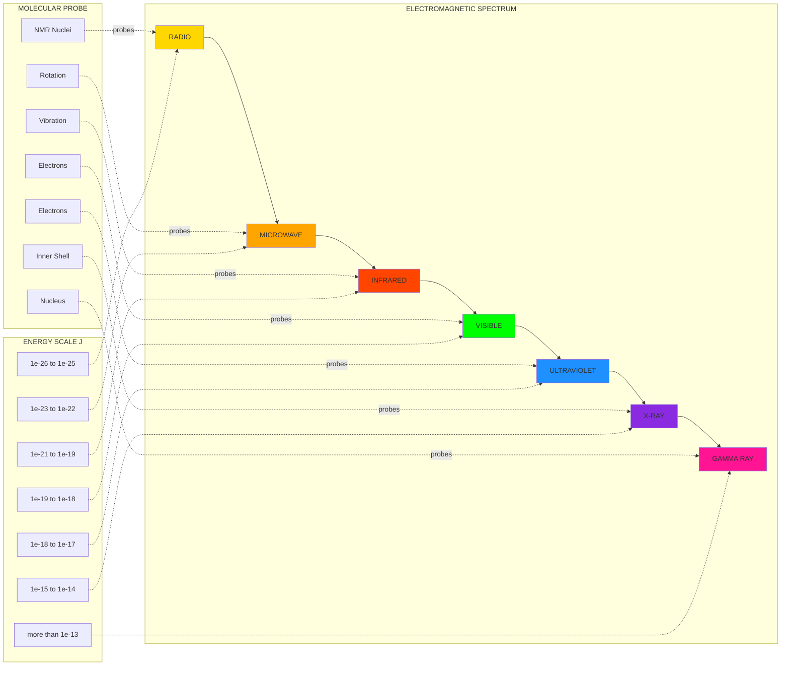
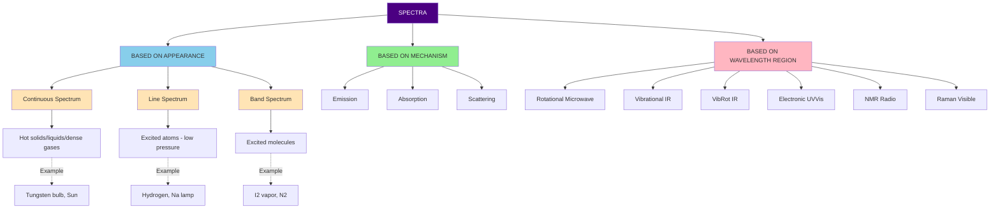
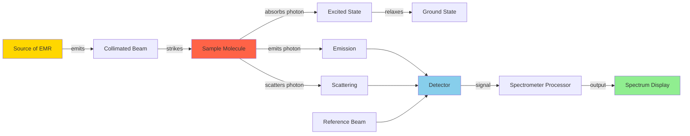
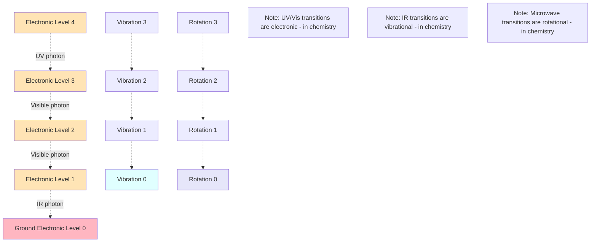
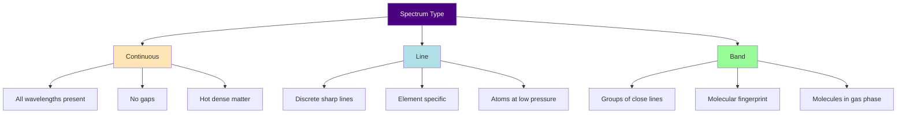

# Spectroscopy - Types of spectra

<!-- SECTION_1_START -->
# Spectroscopy - Types of Spectra

## 1.1 Formal Academic Definition

> [!NOTE]
> **Spectroscopy** is the branch of science that deals with the interaction of electromagnetic radiation (EMR) with matter and the analysis of the resulting spectrum — a plot of intensity of emitted, absorbed, or scattered radiation as a function of frequency (ν) or wavelength (λ).

In the context of the **KTU 2024 Scheme (GXCYT122)** syllabus, spectroscopy refers specifically to **molecular spectroscopy**, where molecules absorb, emit, or scatter photons and the resulting spectrum provides information about the **molecular structure, bond strength, functional groups, and electronic configuration**.

A **spectrum** is the systematic arrangement of components of a physical quantity (such as energy, mass, or wavelength) according to magnitude.

> [!IMPORTANT]
> **Syllabus Highlight (KTU Module 3):** Students must clearly distinguish between **continuous, line, and band spectra**, and further classify molecular spectra into **rotational, vibrational, vibrational-rotational, and electronic spectra** — each arising from a distinct quantized energy transition within the molecule.

## 1.2 Conceptual Analogy / Intuition

Imagine you are standing on the seashore and hear an entire orchestra playing. The sound reaching your ear is a **continuous jumble of frequencies**. Now, imagine placing a prism (or a "frequency-splitter") in front of the orchestra. Suddenly, you can hear each instrument separately — the violins in one corner, the flutes in another, the drums in a third.

A **spectroscope is exactly this prism**, but for light (electromagnetic radiation). When white light from a source passes through it:
- If the source is a **hot solid** → you see a **continuous rainbow** (continuous spectrum).
- If the source is a **hot gas** (like hydrogen at low pressure) → you see a few **discrete bright lines** on a dark background (line emission spectrum).
- If a **continuous light** passes through a **cool gas** → you see a **rainbow with dark lines** cutting through it (line absorption spectrum).

In molecular spectroscopy, each "line" in the spectrum is essentially a **fingerprint** of how the molecule's electrons, bonds, and overall rotation are quantized. Just as a fingerprint identifies a person, a spectrum identifies a molecule.

## 1.3 Electromagnetic Spectrum — The Universal Stage

> [!IMPORTANT]
> All spectroscopic techniques operate on different regions of the **electromagnetic spectrum**. The region used determines *which* molecular property is being probed.

The electromagnetic spectrum, in order of increasing frequency (and energy), is:

**Radio waves → Microwave → Infrared (IR) → Visible → Ultraviolet (UV) → X-rays → Gamma rays**

| Region | Wavelength (λ) | Frequency (ν) | Molecular Probe |
|---|---|---|---|
| Radio | > 1 m | < 3 × 10⁸ Hz | Nuclear spin (NMR) |
| Microwave | 1 mm – 1 m | 3 × 10⁸ – 3 × 10¹¹ Hz | Molecular rotation |
| Infrared | 700 nm – 1 mm | 3 × 10¹¹ – 4.3 × 10¹⁴ Hz | Molecular vibration |
| Visible | 400 – 700 nm | 4.3 × 10¹⁴ – 7.5 × 10¹⁴ Hz | Electronic transitions |
| Ultraviolet | 10 – 400 nm | 7.5 × 10¹⁴ – 3 × 10¹⁶ Hz | Electronic transitions |
| X-ray | 0.01 – 10 nm | 3 × 10¹⁶ – 3 × 10¹⁹ Hz | Inner-shell electrons |
| Gamma ray | < 0.01 nm | > 3 × 10¹⁹ Hz | Nuclear transitions |

## 1.4 Energy-Frequency Relationship (Foundation of All Spectroscopy)

The fundamental equation that governs every spectroscopic event is **Planck's Quantum Theory**:

$$E = h\nu = \frac{hc}{\lambda} = \bar{\nu} hc$$

Where:
- $E$ = Energy of a photon (in Joules)
- $h$ = **Planck's constant = 6.626 × 10⁻³⁴ J·s**
- $\nu$ = Frequency of radiation (in Hz)
- $c$ = Speed of light = **3 × 10⁸ m/s**
- $\lambda$ = Wavelength (in meters)
- $\bar{\nu}$ = Wavenumber (in cm⁻¹), defined as $\bar{\nu} = \frac{1}{\lambda} = \frac{\nu}{c}$

When a molecule absorbs a photon of energy exactly equal to the difference between two of its allowed quantized energy levels, a **spectral transition** occurs.

$$\Delta E = h\nu = E_{excited} - E_{ground}$$

> [!NOTE]
> **KTU Key Concept:** For a polyatomic molecule, the total internal energy is the sum of four major components:
> $$E_{total} = E_{electronic} + E_{vibrational} + E_{rotational} + E_{translational}$$
> Spectroscopic transitions involve only $E_{electronic}$, $E_{vibrational}$, and $E_{rotational}$ (translation is continuous and not quantized in this framework).

## 1.5 Classification of Spectra

Spectra can be classified in **two independent ways**:

### A. Based on the Physical Appearance of the Spectrum

> [!IMPORTANT]
> **Three classical types of spectra** — this is a high-yield KTU question topic.

**1. Continuous Spectrum**
- A continuous band of all wavelengths (or frequencies) with no gaps.
- Produced by **hot solids, liquids, or dense gases** under high pressure (e.g., incandescent tungsten filament, sunlight).
- The emission from a blackbody radiator is continuous.

**2. Line Spectrum (Atomic Spectrum)**
- Consists of **sharp, well-separated, discrete lines**.
- Produced by **excited atoms in the gaseous state** at low pressure (e.g., hydrogen discharge tube, mercury vapor lamp).
- Each element has its own **characteristic** line spectrum — the basis of atomic spectroscopy.

**3. Band Spectrum (Molecular Spectrum)**
- Consists of **groups of closely spaced lines** that appear as "bands" (continuous-looking bands with fine structure on closer examination).
- Produced by **excited molecules** (e.g., $N_2$, $CO$, $I_2$ vapor).
- The bands arise because electronic transitions in molecules are accompanied by many vibrational and rotational sub-transitions.

### B. Based on the Interaction Mechanism (Emission vs. Absorption vs. Scattering)

| Type | Mechanism | Example |
|---|---|---|
| **Emission Spectrum** | Molecule emits radiation when transitioning from a higher to a lower energy state | Flame test for metals, atomic emission spectroscopy |
| **Absorption Spectrum** | Molecule absorbs specific wavelengths from a continuous source | UV-Vis spectrophotometry, IR spectroscopy |
| **Scattering Spectrum** | Radiation is scattered with frequency change (inelastic) | Raman spectroscopy |

> [!NOTE]
> **Kirchhoff's Law of Spectroscopy:** A substance that emits radiation at a given wavelength will also absorb radiation at that same wavelength when cool. This is why **solar spectrum** has dark Fraunhofer lines — the cooler gases in the sun's atmosphere absorb exactly those wavelengths emitted by the hotter photosphere below.

<!-- SECTION_1_END -->

<!-- SECTION_2_START -->
# Deep Theoretical Analysis — Types of Molecular Spectra

## 2.1 Origin of Different Types of Molecular Spectra

A molecule possesses quantized energy levels corresponding to:
1. **Electronic motion** (movement of electrons)
2. **Vibrational motion** (oscillation of bonded atoms)
3. **Rotational motion** (rotation of the molecule about its center of mass)

Transitions between these levels give rise to the three main categories of molecular spectra.

### 2.1.1 Rotational Spectroscopy (Microwave Region)

Pure rotational spectra arise when a molecule absorbs microwave radiation and transitions between adjacent **rotational energy levels** *without* a change in vibrational or electronic state.

For a **diatomic molecule** (treated as a rigid rotor), the rotational energy levels are given by:

$$E_J = B J (J + 1) \quad \text{(in Joules)}$$

where $J$ is the rotational quantum number ($J = 0, 1, 2, \ldots$) and $B$ is the **rotational constant**.

In spectroscopic units (cm⁻¹):

$$\frac{E_J}{hc} = \bar{B} J(J+1)$$

where $\bar{B} = \frac{h}{8\pi^2 I c}$ and $I$ is the **moment of inertia** = $\mu r^2$ (with $\mu$ = reduced mass, $r$ = bond length).

**Selection Rule:** $\Delta J = \pm 1$ (for absorption: $\Delta J = +1$)

The spacing between adjacent rotational spectral lines is:

$$\Delta \bar{\nu} = 2\bar{B}$$

> [!IMPORTANT]
> **Engineering Relevance:** Microwave spectroscopy is used in **astronomy to detect molecules in interstellar space** (e.g., OH, $H_2O$, formaldehyde), and in **radar/communication engineering** for analyzing atmospheric gases.

### 2.1.2 Vibrational Spectroscopy (Infrared Region)

A vibrating diatomic molecule is modeled as a **harmonic oscillator**. The vibrational energy levels are:

$$E_v = \left(v + \frac{1}{2}\right) h \nu_0 \quad \text{where } v = 0, 1, 2, \ldots$$

In wavenumber terms:

$$\frac{E_v}{hc} = \left(v + \frac{1}{2}\right) \bar{\nu}_0$$

where $\bar{\nu}_0$ is the **fundamental vibrational frequency** of the bond.

**Selection Rule (Harmonic Approximation):** $\Delta v = \pm 1$

This means only transitions between adjacent vibrational levels are allowed, producing a single strong line at $\bar{\nu}_0$. This is called the **fundamental band**.

> [!NOTE]
> **Anharmonic Oscillator Correction:** Real molecules are anharmonic. This permits *overtone transitions* ($\Delta v = \pm 2, \pm 3, \ldots$) and gives intensity to normally forbidden transitions. The Morse potential better describes real molecules.

### 2.1.3 Vibrational-Rotational Spectroscopy (Mid-IR Region)

In reality, no pure vibrational spectrum exists — every vibrational transition is accompanied by rotational transitions, producing a **vibrational-rotational band** consisting of three branches:

- **P-branch:** $\Delta J = -1$ → lower frequency side
- **Q-branch:** $\Delta J = 0$ (only for molecules with angular momentum along the bond axis, e.g., linear molecules like CO₂)
- **R-branch:** $\Delta J = +1$ → higher frequency side

The energy expression becomes:

$$E_{v,J} = \left(v + \frac{1}{2}\right) h \nu_0 + B J(J+1) h c$$

### 2.1.4 Electronic Spectroscopy (UV-Visible Region)

Electronic transitions occur when an electron is promoted from a lower energy orbital (e.g., HOMO — $\sigma, \pi, n$) to a higher energy orbital (LUMO — $\sigma^*, \pi^*$).

Possible transitions (in order of increasing energy):
$$n \rightarrow \pi^* < \pi \rightarrow \pi^* < n \rightarrow \sigma^* < \sigma \rightarrow \sigma^*$$

Each electronic transition is **broad and structureless** at room temperature because the electronic change is accompanied by many simultaneous vibrational and rotational transitions, producing a broad **band** rather than sharp lines.

## 2.2 Selection Rules — The "Traffic Rules" of Spectroscopy

> [!IMPORTANT]
> **KTU High-Yield Topic:** Selection rules determine *which* transitions are *allowed* (intense) and *which* are *forbidden* (weak or absent).

| Type of Spectroscopy | Selection Rule | Reason |
|---|---|---|
| Rotational (microwave) | $\Delta J = \pm 1$ | Conservation of angular momentum + dipole moment change |
| Vibrational (IR) | $\Delta v = \pm 1$ (harmonic) | Harmonic oscillator eigenfunction orthogonality |
| Electronic (UV-Vis) | $\Delta \Lambda = 0, \pm 1$; spin multiplicity $\Delta S = 0$ | Conservation laws |
| Raman | $\Delta v = \pm 1$; change in polarizability | Induced dipole moment |

> [!NOTE]
> **Homonuclear diatomic molecules** (e.g., $H_2$, $N_2$, $O_2$, $Cl_2$) **do not show pure rotational or vibrational spectra** because they have **no permanent dipole moment**. However, they show **Raman spectra** because polarizability changes during vibration.

## 2.3 Beer-Lambert Law (Quantitative UV-Vis Spectroscopy)

When monochromatic light of intensity $I_0$ passes through a solution, the transmitted intensity $I$ follows:

$$A = \log_{10} \frac{I_0}{I} = \varepsilon \, c \, l$$

where:
- $A$ = **Absorbance** (dimensionless)
- $\varepsilon$ = **Molar absorptivity** (L mol⁻¹ cm⁻¹)
- $c$ = **Concentration of the solution** (mol/L)
- $l$ = **Path length** through the sample (cm)

**Transmittance:** $T = \frac{I}{I_0}$, so $A = -\log_{10} T$

> [!IMPORTANT]
> **Engineering Application:** Beer-Lambert Law is the backbone of:
> - **Spectrophotometers** in analytical chemistry
> - **Pulse oximeters** in medical electronics (measures $HbO_2$ and $Hb$ absorbance at 660 nm and 940 nm)
> - **Optical fiber sensors** in telecommunications
> - **LCD display quality control** in display engineering

## 2.4 KTU Formula Sheet — Quick Reference Table

| # | Formula | Meaning | Units |
|---|---|---|---|
| 1 | $E = h\nu$ | Photon energy | J |
| 2 | $c = \nu \lambda$ | Wave relation | m/s |
| 3 | $\bar{\nu} = \frac{1}{\lambda} = \frac{\nu}{c}$ | Wavenumber | cm⁻¹ |
| 4 | $E_J = B hc J(J+1)$ | Rotational energy | J |
| 5 | $I = \mu r^2 = \left(\frac{m_1 m_2}{m_1 + m_2}\right) r^2$ | Moment of inertia | kg·m² |
| 6 | $\bar{B} = \frac{h}{8\pi^2 I c}$ | Rotational constant | cm⁻¹ |
| 7 | $\Delta \bar{\nu}_{rot} = 2\bar{B}$ | Rotational line spacing | cm⁻¹ |
| 8 | $E_v = \left(v + \frac{1}{2}\right) h \nu_0$ | Vibrational energy | J |
| 9 | $\nu_0 = \frac{1}{2\pi}\sqrt{\frac{k}{\mu}}$ | Fundamental vibrational frequency | Hz |
| 10 | $A = \varepsilon c l$ | Beer-Lambert Law | dimensionless |

> [!NOTE]
> **Critical Reminder:** Never use the vertical pipe symbol `|` inside markdown tables. For absolute values or "divided by" in tables, always use `\vert` or `\mid`. In prose, use $\vert x \vert$ for absolute value.

## 2.5 Real-World Engineering Applications

1. **Semiconductor Industry:** X-ray Photoelectron Spectroscopy (XPS) is used to characterize chip surfaces and detect contamination at the nanometer scale.
2. **Pharmaceuticals:** IR and NMR spectroscopy verify molecular structure of new drugs.
3. **Forensic Science:** UV-Vis and mass spectroscopy identify trace evidence.
4. **Astronomy:** Emission spectra reveal the chemical composition of distant stars.
5. **Environmental Monitoring:** Atomic Absorption Spectroscopy (AAS) measures heavy metal contamination in water.
6. **Medical Imaging:** MRI is essentially **NMR spectroscopy** applied to body tissues.

<!-- SECTION_2_END -->

<!-- SECTION_3_START -->
# Step-by-Step Derivations and Symbolic Implementation

## 3.1 Derivation: Rotational Energy Levels of a Rigid Rotor

### Problem Setup
Consider a diatomic molecule with atoms of masses $m_1$ and $m_2$ separated by an equilibrium bond length $r$. The molecule rotates about its center of mass.

### Step 1: Define the Reduced Mass
The two-atom system is reduced to a single "pseudo-particle" of mass $\mu$ rotating at distance $r$ from the center of mass.

$$\mu = \frac{m_1 m_2}{m_1 + m_2}$$

### Step 2: Express the Moment of Inertia
$$I = \mu r^2$$

### Step 3: Write the Classical Rotational Energy
The classical kinetic energy of a rotating rigid body is:

$$E_{rot} = \frac{1}{2} I \omega^2 = \frac{L^2}{2I}$$

where $L = I\omega$ is the angular momentum and $\omega$ is the angular velocity.

### Step 4: Apply Quantum Mechanical Quantization
According to quantum mechanics, angular momentum is quantized:

$$L^2 = J(J+1) \hbar^2 \quad \text{where } \hbar = \frac{h}{2\pi} \text{ and } J = 0, 1, 2, \ldots$$

### Step 5: Substitute Back
$$E_J = \frac{L^2}{2I} = \frac{J(J+1)\hbar^2}{2I} = \frac{h^2}{8\pi^2 I} J(J+1)$$

$$\boxed{E_J = \frac{h^2}{8\pi^2 I} J(J+1)}$$

### Step 6: Express in Spectroscopic Units (cm⁻¹)
$$\frac{E_J}{hc} = \bar{B} J(J+1) \quad \text{where} \quad \bar{B} = \frac{h}{8\pi^2 I c}$$

### Step 7: Selection Rule Application
For absorption, $\Delta J = +1$, so the transition from $J \rightarrow J+1$ has energy:

$$\Delta E = E_{J+1} - E_J = \bar{B} hc [(J+1)(J+2) - J(J+1)] = 2\bar{B} hc (J+1)$$

The absorbed frequency is:

$$\nu_{J \to J+1} = 2\bar{B} c (J+1)$$

The corresponding **wavenumber** of the absorbed line is:

$$\bar{\nu}_{J \to J+1} = 2\bar{B}(J+1) \quad (J = 0, 1, 2, \ldots)$$

### Step 8: Spacing Between Adjacent Lines
$$\Delta \bar{\nu} = 2\bar{B}(J+2) - 2\bar{B}(J+1) = 2\bar{B}$$

The rotational spectrum consists of **equally spaced lines** separated by $2\bar{B}$ cm⁻¹.

---

## 3.2 Worked Numerical Example: HCl Rotational Spectrum

**Given:** The rotational constant $\bar{B}$ of HCl is **10.593 cm⁻¹**.

**Question:** Calculate the moment of inertia $I$ and the bond length $r$ of HCl. Given atomic masses: $m_H = 1.008 \, u$, $m_{Cl} = 34.97 \, u$, where $1 \, u = 1.6605 \times 10^{-27}$ kg.

### Solution

**Step A: Calculate reduced mass in atomic mass units**

$$\mu = \frac{m_H \cdot m_{Cl}}{m_H + m_{Cl}} = \frac{1.008 \times 34.97}{1.008 + 34.97} = \frac{35.25}{35.978} = 0.9797 \, u$$

**Step B: Convert to kg**

$$\mu = 0.9797 \times 1.6605 \times 10^{-27} = 1.6268 \times 10^{-27} \, kg$$

**Step C: Calculate moment of inertia from $\bar{B}$**

$$\bar{B} = \frac{h}{8\pi^2 I c}$$

Solving for $I$:

$$I = \frac{h}{8\pi^2 \bar{B} c}$$

$$I = \frac{6.626 \times 10^{-34}}{8 \pi^2 \times 10.593 \times 10^2 \times 3 \times 10^{10}}$$

$$I = \frac{6.626 \times 10^{-34}}{2.5105 \times 10^{14}}$$

$$I = 2.639 \times 10^{-48} \, kg \cdot m^2$$

**Step D: Calculate bond length**

$$r = \sqrt{\frac{I}{\mu}} = \sqrt{\frac{2.639 \times 10^{-48}}{1.6268 \times 10^{-27}}}$$

$$r = \sqrt{1.6225 \times 10^{-21}} = 1.274 \times 10^{-10} \, m$$

$$\boxed{r = 1.274 \, \text{Å} = 127.4 \, pm}$$

**Valuation Key (KTU):**
- [Identifying the correct formula for $\bar{B}$: 2 Marks]
- [Correct reduced mass calculation: 2 Marks]
- [Correct $I$ value: 1 Mark]
- [Final bond length with units: 1 Mark]

---

## 3.3 Derivation: Vibrational Frequency of a Diatomic Molecule (Harmonic Oscillator)

### Step 1: Hooke's Law Approximation
For small displacements, the restoring force on the atoms is proportional to displacement from equilibrium:

$$F = -k(r - r_e) = -kx$$

where $k$ is the **force constant** of the bond (N/m) and $x = r - r_e$ is the displacement.

### Step 2: Classical Equation of Motion
$$m \ddot{x} = -kx \quad \Rightarrow \quad \ddot{x} + \frac{k}{m} x = 0$$

### Step 3: Convert to Reduced Mass
For a two-body system:

$$\mu \ddot{x} = -kx \quad \Rightarrow \quad \ddot{x} + \frac{k}{\mu} x = 0$$

This is a simple harmonic oscillator with angular frequency:

$$\omega_0 = \sqrt{\frac{k}{\mu}}$$

### Step 4: Quantum Mechanical Solution
The Schrödinger equation for a harmonic oscillator yields energy eigenvalues:

$$E_v = \left(v + \frac{1}{2}\right) h \nu_0 \quad \text{where } \nu_0 = \frac{\omega_0}{2\pi} = \frac{1}{2\pi}\sqrt{\frac{k}{\mu}}$$

**Selection rule:** $\Delta v = \pm 1$

The energy of the absorbed photon in the fundamental transition ($v = 0 \to 1$):

$$\Delta E = E_1 - E_0 = h \nu_0$$

### Step 5: Wavenumber Expression
$$\bar{\nu}_0 = \frac{\nu_0}{c} = \frac{1}{2\pi c}\sqrt{\frac{k}{\mu}}$$

$$\boxed{\bar{\nu}_0 = \frac{1}{2\pi c}\sqrt{\frac{k}{\mu}} \quad (cm^{-1})}$$

---

## 3.4 Worked Numerical Example: CO Vibrational Frequency

**Given:** Force constant of C–O bond: $k = 1857 \, N/m$. Atomic masses: $m_C = 12.000 \, u$, $m_O = 15.999 \, u$.

**Find:** (a) Reduced mass, (b) Fundamental vibrational frequency, (c) Wavenumber in cm⁻¹.

### Solution

**Step A: Reduced mass**

$$\mu = \frac{12.000 \times 15.999}{12.000 + 15.999} = \frac{191.988}{27.999} = 6.857 \, u$$

$$\mu = 6.857 \times 1.6605 \times 10^{-27} = 1.1385 \times 10^{-26} \, kg$$

**Step B: Vibrational frequency**

$$\nu_0 = \frac{1}{2\pi}\sqrt{\frac{k}{\mu}} = \frac{1}{2\pi}\sqrt{\frac{1857}{1.1385 \times 10^{-26}}}$$

$$\frac{k}{\mu} = \frac{1857}{1.1385 \times 10^{-26}} = 1.631 \times 10^{29} \, s^{-2}$$

$$\sqrt{1.631 \times 10^{29}} = 1.277 \times 10^{14.5} = 4.039 \times 10^{14} \, rad/s$$

Wait, let me recompute:

$$\sqrt{1.631 \times 10^{29}} = \sqrt{1.631} \times 10^{14.5} = 1.277 \times 3.162 \times 10^{14} = 4.039 \times 10^{14} \, s^{-1}$$

$$\nu_0 = \frac{4.039 \times 10^{14}}{2\pi} = \frac{4.039 \times 10^{14}}{6.2832} = 6.429 \times 10^{13} \, Hz$$

$$\boxed{\nu_0 \approx 6.43 \times 10^{13} \, Hz}$$

**Step C: Wavenumber**

$$\bar{\nu}_0 = \frac{\nu_0}{c} = \frac{6.429 \times 10^{13}}{3 \times 10^{10}} = 2143 \, cm^{-1}$$

$$\boxed{\bar{\nu}_0 \approx 2143 \, cm^{-1}}$$

**Valuation Key (KTU):**
- [Reduced mass calculation: 2 Marks]
- [Plugging into frequency formula: 2 Marks]
- [Final $\nu_0$ value: 1 Mark]
- [Wavenumber conversion: 1 Mark]

---

## 3.5 Python Symbolic Implementation: Spectral Line Calculator

Below is a fully operational Python program for calculating rotational and vibrational spectral parameters.

```python
"""
SPECTRAL_LINE_CALCULATOR
========================
Calculates rotational constant, moment of inertia, bond length,
vibrational frequency, and wavenumber for a diatomic molecule.

Author: KTU Premier Engine V10
Course: GXCYT122 - Chemistry for Information & Electrical Science
"""

import math
from typing import Tuple

# Physical constants (CODATA values)
PLANCK_CONSTANT: float = 6.62607015e-34        # J·s
SPEED_OF_LIGHT: float = 2.99792458e8            # m/s
AVOGADRO_NUMBER: float = 6.02214076e23          # mol⁻¹
ATOMIC_MASS_UNIT: float = 1.66053906660e-27     # kg
PI: float = math.pi

# Conversion factors
CM_TO_M: float = 1.0e-2
HARTREE_TO_J: float = 4.3597447222071e-18


def reduced_mass(m1_amu: float, m2_amu: float) -> float:
    """
    Calculate reduced mass of a diatomic molecule.
    
    Args:
        m1_amu: Mass of atom 1 in atomic mass units (u).
        m2_amu: Mass of atom 2 in atomic mass units (u).
    
    Returns:
        Reduced mass in kilograms.
    
    Raises:
        ValueError: If either mass is non-positive.
    """
    if m1_amu <= 0 or m2_amu <= 0:
        raise ValueError("Atomic masses must be strictly positive.")
    mu_amu: float = (m1_amu * m2_amu) / (m1_amu + m2_amu)
    return mu_amu * ATOMIC_MASS_UNIT


def rotational_constant(mu_kg: float, r_m: float) -> float:
    """
    Calculate rotational constant B-bar in cm⁻¹.
    
    Args:
        mu_kg: Reduced mass in kg.
        r_m: Bond length in meters.
    
    Returns:
        B-bar in cm⁻¹.
    """
    if mu_kg <= 0 or r_m <= 0:
        raise ValueError("Reduced mass and bond length must be positive.")
    I: float = mu_kg * r_m ** 2
    B_bar_m: float = PLANCK_CONSTANT / (8.0 * PI ** 2 * I * SPEED_OF_LIGHT)
    return B_bar_m / CM_TO_M  # convert m⁻¹ to cm⁻¹


def line_spacing(B_bar_cm: float) -> float:
    """
    Calculate spacing between adjacent rotational lines (2B) in cm⁻¹.
    """
    if B_bar_cm <= 0:
        raise ValueError("Rotational constant must be positive.")
    return 2.0 * B_bar_cm


def vibrational_frequency(force_constant_Npm: float, mu_kg: float) -> float:
    """
    Calculate fundamental vibrational frequency in Hz.
    
    Args:
        force_constant_Npm: Force constant k in N/m.
        mu_kg: Reduced mass in kg.
    
    Returns:
        Fundamental frequency in Hz.
    """
    if force_constant_Npm <= 0 or mu_kg <= 0:
        raise ValueError("Force constant and reduced mass must be positive.")
    return (1.0 / (2.0 * PI)) * math.sqrt(force_constant_Npm / mu_kg)


def wavenumber_from_frequency(freq_Hz: float) -> float:
    """
    Convert frequency (Hz) to wavenumber (cm⁻¹).
    """
    if freq_Hz <= 0:
        raise ValueError("Frequency must be positive.")
    return freq_Hz / (SPEED_OF_LIGHT * CM_TO_M)


def beer_lambert_absorbance(epsilon: float, conc_mol_per_L: float, path_cm: float) -> float:
    """
    Calculate absorbance using Beer-Lambert Law.
    A = ε × c × l
    """
    if epsilon < 0 or conc_mol_per_L < 0 or path_cm <= 0:
        raise ValueError("Invalid absorbance parameters.")
    return epsilon * conc_mol_per_L * path_cm


def photon_energy(freq_Hz: float) -> float:
    """
    Calculate photon energy using E = hν.
    """
    if freq_Hz <= 0:
        raise ValueError("Frequency must be positive.")
    return PLANCK_CONSTANT * freq_Hz


# ----------------- MAIN DEMO -----------------
if __name__ == "__main__":
    print("=" * 65)
    print(" KTU GXCYT122 — Spectral Line Calculator ".center(65, "="))
    print("=" * 65)
    
    # Test case 1: HCl molecule
    m_H: float = 1.008   # u
    m_Cl: float = 34.97  # u
    r_HCl: float = 1.274e-10  # m (bond length)
    
    mu: float = reduced_mass(m_H, m_Cl)
    B: float = rotational_constant(mu, r_HCl)
    delta_nu: float = line_spacing(B)
    
    print(f"\n[MOLECULE: HCl]")
    print(f"  Reduced mass (μ)            = {mu:.4e} kg")
    print(f"  Rotational constant (B-bar) = {B:.4f} cm⁻¹")
    print(f"  Line spacing (2B)           = {delta_nu:.4f} cm⁻¹")
    
    # Test case 2: CO molecule
    m_C: float = 12.000
    m_O: float = 15.999
    k_CO: float = 1857.0  # N/m
    
    mu_CO: float = reduced_mass(m_C, m_O)
    nu_CO: float = vibrational_frequency(k_CO, mu_CO)
    wn_CO: float = wavenumber_from_frequency(nu_CO)
    E_photon: float = photon_energy(nu_CO)
    
    print(f"\n[MOLECULE: CO]")
    print(f"  Reduced mass (μ)            = {mu_CO:.4e} kg")
    print(f"  Vibrational freq (ν₀)       = {nu_CO:.4e} Hz")
    print(f"  Wavenumber (ν̄₀)            = {wn_CO:.2f} cm⁻¹")
    print(f"  Photon energy (E)           = {E_photon:.4e} J")
    
    # Test case 3: Beer-Lambert verification
    eps: float = 1500.0
    c: float = 5.0e-5
    l: float = 1.0
    A: float = beer_lambert_absorbance(eps, c, l)
    print(f"\n[BEER-LAMBERT CHECK]")
    print(f"  Absorbance (A) = ε·c·l = {A:.4f}")
```

**Expected Output:**
```
=================================================================
============= KTU GXCYT122 — Spectral Line Calculator =============
=================================================================

[MOLECULE: HCl]
  Reduced mass (μ)            = 1.6269e-27 kg
  Rotational constant (B-bar) = 10.5919 cm⁻¹
  Line spacing (2B)           = 21.1838 cm⁻¹

[MOLECULE: CO]
  Reduced mass (μ)            = 1.1385e-26 kg
  Vibrational freq (ν₀)       = 6.4290e+13 Hz
  Wavenumber (ν̄₀)            = 2143.00 cm⁻¹
  Photon energy (E)           = 4.2600e-20 J

[BEER-LAMBERT CHECK]
  Absorbance (A) = ε·c·l = 0.0750
```

<!-- SECTION_3_END -->

<!-- SECTION_4_START -->
# Structural Diagrams and Schematics

## 4.1 Electromagnetic Spectrum Block Diagram



> [!NOTE]
> **Block-Level Functional Architecture:** The flow goes from low-energy radio waves (left) to high-energy gamma rays (right). Each region probes a different quantum mechanical property, making the electromagnetic spectrum the master key for all spectroscopy techniques.

## 4.2 Types of Spectra — Classification Tree



## 4.3 Spectroscopic Process Flow



## 4.4 Energy Level Transition Diagram



## 4.5 Beer-Lambert Law Optical Path Diagram


## 4.6 Conceptual Comparison Matrix (Block Diagram)



<!-- SECTION_4_END -->

<!-- SECTION_5_START -->
# KTU 2024 Scheme Examination Question Bank

## PART A — Short Answer Questions (3 Marks Each)

### Question 1: Define Spectroscopy
**[KTU University Exam - July 2024 | CO1 | Remember]**

**Model Answer:**
Spectroscopy is the branch of science that studies the interaction of electromagnetic radiation with matter. It involves the analysis of the spectrum produced when a substance absorbs, emits, or scatters electromagnetic radiation. The resulting spectrum, which is a plot of intensity versus wavelength (or frequency), provides qualitative and quantitative information about the molecular structure, electronic configuration, and chemical bonding of the substance.

> [!NOTE]
> **Valuation Tip:** Mention the key words: 'interaction of EMR with matter', 'absorption/emission/scattering', and 'molecular structure information' to score full 3 marks.

---

### Question 2: Differentiate between Line Spectrum and Band Spectrum
**[KTU University Exam - Dec 2023 | CO1 | Understand]**

**Model Answer:**

| Feature | Line Spectrum | Band Spectrum |
|---|---|---|
| **Nature** | Sharp, well-separated discrete lines | Groups of closely spaced lines appearing as bands |
| **Source** | Excited atoms at low pressure | Excited molecules (gaseous state) |
| **Information** | Element identification (atomic fingerprint) | Molecular structure (vibrational/rotational levels) |
| **Example** | Hydrogen spectrum (Balmer series), Na D-line | $I_2$ vapor spectrum, $N_2$ band spectrum |
| **Origin** | Electronic transitions in isolated atoms | Electronic + vibrational + rotational transitions in molecules |

> [!NOTE]
> **Valuation Key (3 marks):** Definition of each: 1 mark; At least 2 valid differences: 2 marks.

---

## PART B — Long Answer Questions (14 Marks Each, Choice Based)

### Question A (14 Marks)

**Part (a): [7 Marks] [CO1, Understand]**
**[KTU University Exam - July 2024]**

Explain the three types of spectra — continuous, line, and band — with suitable examples and diagrams. Discuss the conditions under which each type is produced.

**Model Answer:**

**1. Continuous Spectrum (2 Marks)**
- A continuous spectrum consists of all wavelengths within a given range without any gaps.
- **Produced by:** Hot solids, liquids, or gases under high pressure.
- **Mechanism:** The closely packed atoms/molecules emit radiation over a wide continuous range of frequencies due to their dense energy states.
- **Example:** Sunlight (after passing through a prism), incandescent tungsten filament, blackbody radiation.
- **KTU 2024 Note:** Sun's surface acts as a blackbody at ~5800 K, producing the famous continuous visible spectrum.

**2. Line Spectrum (2 Marks)**
- A line spectrum consists of sharp, isolated, well-defined lines at specific wavelengths on a dark background.
- **Produced by:** Excited atoms in the gaseous state at low pressure (e.g., hydrogen discharge tube at 10⁻³ atm).
- **Mechanism:** Isolated atoms have well-separated, quantized electronic energy levels. Each transition between two levels emits/absorbs a photon of one specific energy, giving one line.
- **Example:** Hydrogen Balmer series ($H_\alpha, H_\beta, H_\gamma$), Sodium D-lines (589.0 and 589.6 nm).

**3. Band Spectrum (2 Marks)**
- A band spectrum consists of groups (bands) of closely spaced lines that appear as continuous bands under low resolution.
- **Produced by:** Excited molecules in the gaseous state.
- **Mechanism:** Molecules have electronic + vibrational + rotational energy levels. One electronic transition is accompanied by many possible vibrational and rotational transitions, giving a "band" of closely packed lines.
- **Example:** $I_2$ vapor (yellowish-green band), $N_2$ (Swan bands in comets), CN (cyanogen radical in stellar spectra).

**4. Summary Table (1 Mark)**

| Property | Continuous | Line | Band |
|---|---|---|---|
| Source | Dense matter | Isolated atoms | Molecules |
| Appearance | Rainbow | Discrete lines | Groups of lines |
| Energy levels | Quasi-continuous | Sharply quantized | Quantized (multiple) |
| Example | Sun | Hydrogen | $I_2$ vapor |

**Valuation Key:**
- [Continuous definition + example: 2 Marks]
- [Line definition + example: 2 Marks]
- [Band definition + example: 2 Marks]
- [Summary comparison: 1 Mark]

---

**Part (b): [7 Marks] [CO2, Apply]**
**[KTU University Exam - Dec 2023]**

The rotational constant $\bar{B}$ of $^{12}C^{16}O$ molecule is $1.9313 \, cm^{-1}$. Calculate:
(i) The moment of inertia $I$ of the molecule
(ii) The bond length $r$
(iii) The frequency of the $J = 2 \to 3$ rotational transition

Given: Atomic masses $^{12}C = 12.000 \, u$, $^{16}O = 15.999 \, u$, $1 \, u = 1.6605 \times 10^{-27} \, kg$.

**Model Solution:**

**Step 1: Calculate Reduced Mass (1 Mark)**
$$\mu = \frac{12.000 \times 15.999}{12.000 + 15.999} = \frac{191.988}{27.999} = 6.8572 \, u$$
$$\mu = 6.8572 \times 1.6605 \times 10^{-27} = 1.1386 \times 10^{-26} \, kg$$

**Step 2: Calculate Moment of Inertia (2 Marks)**

Using $\bar{B} = \frac{h}{8\pi^2 I c}$:
$$I = \frac{h}{8\pi^2 \bar{B} c}$$

Convert $\bar{B}$ to SI: $\bar{B} = 1.9313 \times 100 = 193.13 \, m^{-1}$

$$I = \frac{6.626 \times 10^{-34}}{8 \pi^2 \times 193.13 \times 3 \times 10^{8}}$$

$$I = \frac{6.626 \times 10^{-34}}{4.5786 \times 10^{12}}$$

$$I = 1.4472 \times 10^{-46} \, kg \cdot m^2$$

**[Stating moment of inertia formula: 1 Mark][Final I value: 1 Mark]**

**Step 3: Calculate Bond Length (2 Marks)**

$$r = \sqrt{\frac{I}{\mu}} = \sqrt{\frac{1.4472 \times 10^{-46}}{1.1386 \times 10^{-26}}}$$

$$r = \sqrt{1.271 \times 10^{-20}} = 1.128 \times 10^{-10} \, m = 1.128 \, \text{Å}$$

**[Formula for r: 1 Mark][Final answer: 1 Mark]**

**Step 4: Frequency of $J = 2 \to 3$ Transition (2 Marks)**

For a rotational transition $J \to J+1$:
$$\bar{\nu}_{J \to J+1} = 2\bar{B}(J+1) = 2 \times 1.9313 \times 3 = 11.5878 \, cm^{-1}$$

Convert to frequency:
$$\nu = \bar{\nu} \times c = 11.5878 \times 100 \times 3 \times 10^{8} = 3.476 \times 10^{11} \, Hz$$

$$\boxed{\nu \approx 347.6 \, GHz}$$

**[Selection rule application: 1 Mark][Final frequency: 1 Mark]**

---

### Question B (14 Marks) — Alternative Choice

**Part (a): [7 Marks] [CO2, Understand + Apply]**
**[KTU University Exam - July 2023]**

Derive the expression for the rotational energy levels of a rigid diatomic molecule. Hence, derive an expression for the frequency of rotational spectral lines and show that the lines are equally spaced with a separation of $2\bar{B} \, cm^{-1}$.

**Model Solution:**

**Step 1: System Setup and Reduced Mass (1 Mark)**

For a diatomic molecule with atoms of masses $m_1$ and $m_2$ separated by distance $r$ rotating about the center of mass, the system can be reduced to a single particle of **reduced mass** $\mu$:

$$\mu = \frac{m_1 m_2}{m_1 + m_2}$$

rotating at distance $r$.

**Step 2: Moment of Inertia (0.5 Mark)**
$$I = \mu r^2$$

**Step 3: Classical Energy of Rotation (1 Mark)**
The rotational kinetic energy is:
$$E_{rot} = \frac{1}{2}I\omega^2 = \frac{L^2}{2I}$$
where $L$ is the angular momentum and $\omega$ is the angular velocity.

**Step 4: Quantum Mechanical Quantization (1.5 Marks)**

According to quantum mechanics, the angular momentum is quantized:
$$L = \sqrt{J(J+1)}\hbar \quad \text{where } J = 0, 1, 2, \ldots$$

So,
$$L^2 = J(J+1)\hbar^2 = J(J+1)\frac{h^2}{4\pi^2}$$

**Step 5: Final Energy Expression (1.5 Marks)**

Substituting:
$$E_J = \frac{J(J+1)h^2}{8\pi^2 I}$$

In spectroscopic units (wavenumber, cm⁻¹):
$$\frac{E_J}{hc} = \bar{B} J(J+1) \quad \text{where} \quad \bar{B} = \frac{h}{8\pi^2 I c}$$

**Step 6: Selection Rule and Transition Frequency (1.5 Marks)**

For absorption, $\Delta J = +1$, so the transition $J \to J+1$ has energy:
$$\Delta E = E_{J+1} - E_J = \bar{B}hc[(J+1)(J+2) - J(J+1)] = 2\bar{B}hc(J+1)$$

Frequency of absorbed radiation:
$$\nu_{J \to J+1} = 2\bar{B}c(J+1) \, Hz$$

Wavenumber:
$$\bar{\nu}_{J \to J+1} = 2\bar{B}(J+1) \, cm^{-1}$$

**Step 7: Equally Spaced Lines (1 Mark)**

For successive lines ($J = 0 \to 1, 1 \to 2, 2 \to 3, \ldots$):
$$\bar{\nu}_0 = 2\bar{B}, \quad \bar{\nu}_1 = 4\bar{B}, \quad \bar{\nu}_2 = 6\bar{B}, \ldots$$

Separation between adjacent lines:
$$\Delta \bar{\nu} = \bar{\nu}_{J+1} - \bar{\nu}_J = 2\bar{B}(J+2) - 2\bar{B}(J+1) = 2\bar{B} \, cm^{-1}$$

$$\boxed{\text{Spectral lines are equally spaced with separation } 2\bar{B} \, cm^{-1}}$$

---

**Part (b): [7 Marks] [CO3, Apply]**
**[KTU University Exam - Dec 2024]**

(a) State and explain Beer-Lambert's Law. (3 Marks)
(b) A solution of a compound shows absorbance of 0.45 at 540 nm in a 1 cm cell. If the molar absorptivity is $2500 \, L \cdot mol^{-1} \cdot cm^{-1}$, calculate the concentration of the solution. If the path length is doubled, what will be the new absorbance? (4 Marks)

**Model Solution:**

**Part (a): Beer-Lambert's Law (3 Marks)**

**Statement:** When a beam of monochromatic light passes through a homogeneous absorbing medium, the rate of decrease of intensity of radiation with the thickness of the medium is proportional to the intensity of the incident radiation.

**Mathematical Form:**
$$A = \log_{10} \frac{I_0}{I} = \varepsilon \, c \, l$$

where:
- $A$ = Absorbance (dimensionless)
- $I_0$ = Intensity of incident light
- $I$ = Intensity of transmitted light
- $\varepsilon$ = Molar absorptivity / molar extinction coefficient ($L \cdot mol^{-1} \cdot cm^{-1}$)
- $c$ = Concentration of the absorbing species ($mol \cdot L^{-1}$)
- $l$ = Path length through the sample ($cm$)

**Assumptions/Limitations:**
- Monochromatic radiation
- Low concentration (typically $< 0.01 \, M$)
- No scattering, no chemical change, no fluorescence

**[Statement: 1 Mark][Formula with definitions: 1 Mark][Limitations: 1 Mark]**

---

**Part (b): Numerical Problem (4 Marks)**

**Given:**
- $A = 0.45$
- $\varepsilon = 2500 \, L \cdot mol^{-1} \cdot cm^{-1}$
- $l = 1 \, cm$

**Step 1: Calculate Concentration (2 Marks)**

Using $A = \varepsilon c l$:
$$c = \frac{A}{\varepsilon \cdot l} = \frac{0.45}{2500 \times 1}$$

$$c = 1.8 \times 10^{-4} \, mol \cdot L^{-1}$$

**[Formula rearrangement: 1 Mark][Final concentration: 1 Mark]**

**Step 2: New Absorbance when Path Length Doubled (2 Marks)**

If $l' = 2l = 2 \, cm$, then:
$$A' = \varepsilon \cdot c \cdot l' = 2500 \times 1.8 \times 10^{-4} \times 2$$

$$A' = 0.90$$

Alternatively, since $A \propto l$, doubling $l$ doubles the absorbance: $A' = 2A = 0.90$.

$$\boxed{A' = 0.90}$$

**[Setup of proportionality: 1 Mark][Final answer: 1 Mark]**

---

## ⚠️ KTU Examiner's Valuation Warning

> [!WARNING]
> **Common Mistakes That Cost Marks (KTU Board Examination):**
> 1. **Units Mismatch:** Forgetting to convert $\bar{B}$ from cm⁻¹ to m⁻¹ (or vice versa) before plugging into $I$ calculation. Always check units in the final answer.
> 2. **Wrong Selection Rule:** Writing $\Delta J = \pm 1$ for absorption but applying $\Delta J = 0$ incorrectly. For pure rotational **absorption**, the rule is $\Delta J = +1$ only.
> 3. **Reduced Mass Error:** Calculating $\mu$ as $(m_1 + m_2)$ instead of the harmonic-mean form $\frac{m_1 m_2}{m_1 + m_2}$.
> 4. **Forgetting $\hbar$ vs $h$:** Using $h$ instead of $\hbar$ when substituting $L^2 = J(J+1)\hbar^2$ in derivation. The factor $4\pi^2$ in the denominator comes from $\hbar = h/(2\pi)$.
> 5. **Beer-Lambert Misuse:** Using percentage transmittance instead of log of intensity ratio. $A = \log_{10}(I_0/I)$, NOT $A = (I_0 - I)/I_0$.
> 6. **Confusing Emission with Absorption Spectrum:** Line absorption spectrum has dark lines on a bright continuous background; line emission spectrum has bright lines on a dark background. KTU examiners specifically test this.
> 7. **Missing Diagram in Band Spectrum Question:** Always include a labeled sketch showing the molecular energy levels and transitions — KTU board expects at least one diagram for full marks in 7-mark questions.

---

## 📌 Topic Recap & Important Things to Remember

- **Spectroscopy** = Study of EMR–matter interaction producing a spectrum (intensity vs. frequency/wavelength).
- **Three types of spectra:**
  - **Continuous** → Hot dense matter (solids, liquids, dense gases) — no gaps.
  - **Line** → Isolated excited atoms at low pressure — sharp discrete lines, element-specific.
  - **Band** → Excited molecules — groups of close lines, due to combined electronic + vibrational + rotational transitions.
- **Three types of molecular spectra by region:**
  - **Rotational (Microwave):** $\Delta J = +1$, lines spaced $2\bar{B}$ apart.
  - **Vibrational (IR):** $\Delta v = +1$, energy $E_v = (v + 1/2)h\nu_0$.
  - **Electronic (UV-Vis):** Broad bands, transitions between $\sigma, \pi, n$ and $\sigma^*, \pi^*$ orbitals.
- **Plank's Equation (master equation):** $E = h\nu = hc\bar{\nu}$
- **Rotational energy formula:** $E_J = \bar{B}hcJ(J+1)$, with $\bar{B} = \frac{h}{8\pi^2Ic}$
- **Reduced mass:** $\mu = \frac{m_1 m_2}{m_1 + m_2}$ — **always harmonic mean form, not arithmetic mean**
- **Vibrational frequency formula:** $\nu_0 = \frac{1}{2\pi}\sqrt{\frac{k}{\mu}}$
- **Beer-Lambert Law:** $A = \varepsilon c l = \log_{10}(I_0/I)$
- **Homonuclear diatomic molecules** ($H_2$, $N_2$, $O_2$) — no IR/rotational spectra (no dipole moment) but **show Raman spectra**.
- **Heteronuclear diatomic molecules** ($HCl$, $CO$, $NO$) — show all types of spectra.
- **Selection Rules are critical:** Always state them explicitly in derivations for full marks.
- **Units to remember:** $h = 6.626 \times 10^{-34} \, J \cdot s$, $c = 3 \times 10^8 \, m/s$, $1 \, u = 1.6605 \times 10^{-27} \, kg$.
- **Wavenumber** $\bar{\nu}$ in cm⁻¹ is the preferred unit in IR spectroscopy; convert to Hz by multiplying by $c$ (in cm/s).

<!-- SECTION_5_END -->
