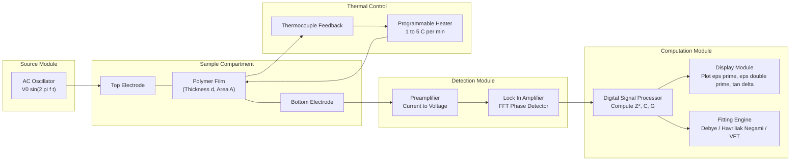
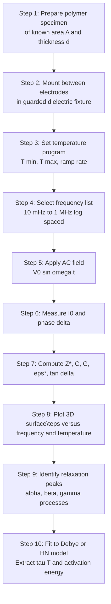
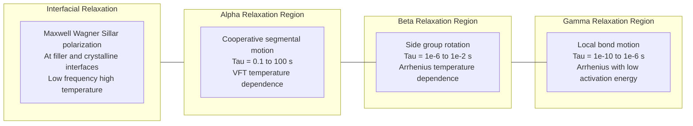

# Thermal Analysis : Dielectric Thermal Analysis (DETA) of Polymers (Working and Application)

<!-- SECTION_1_START -->
# Dielectric Thermal Analysis (DETA) of Polymers

## 1. Core Technical Definition & Intuitive Overview

> [!NOTE]
> **Dielectric Thermal Analysis (DETA / DEA)** is a materials characterization technique in which the **dielectric properties** (permittivity, loss factor, and complex impedance) of a polymeric material are measured as a function of **temperature**, **time**, and **frequency** of an applied alternating electric field. It is the electrical-domain counterpart of **Dynamic Mechanical Analysis (DMA)**.

In a DETA experiment, a thin polymer film (or a polymer disc) is sandwiched between two metallic electrodes forming a parallel-plate capacitor. A small-amplitude sinusoidal AC voltage $V(t) = V_0 \sin(\omega t)$ of known frequency $f = \omega/2\pi$ is applied, and the resulting current $I(t)$ (which is generally **out of phase** with the applied voltage) is measured. From the phase shift $\delta$ and amplitudes, the instrument calculates the **complex permittivity**:

$$\varepsilon^{*}(\omega, T) = \varepsilon'(\omega, T) - i\,\varepsilon''(\omega, T)$$

The real part $\varepsilon'$ represents the **stored electrical energy** (capacitive response), and the imaginary part $\varepsilon''$ represents the **dissipated electrical energy** (conductive + dipolar losses).

---

### Conceptual Analogy — "Pushing a Sponge in Water"

> [!TIP]
> **Intuition:** Imagine dipping a kitchen sponge into a tray of water and **rhythmically squeezing and releasing** it.
>
> - If you squeeze **slowly** (low frequency), the water has time to flow in and out — the sponge is **flexible**, so the resistance (loss) is small.
> - If you squeeze **very fast** (high frequency), the water cannot keep up, the sponge feels **stiff**, and energy is lost as heat.
> - The same polymer has the same dipoles. Slow AC fields let dipoles follow easily (high $\varepsilon'$, low $\varepsilon''$). Fast AC fields freeze the dipoles in place (low $\varepsilon'$, eventually low loss because they cannot relax at all).
>
> DETA is exactly this — but instead of water, it is the **molecular dipoles and ionic segments** that are being "squeezed" by the oscillating electric field. The point where the squeeze is "just right" reveals the **molecular relaxation times** that correspond to transitions such as $T_g$, $T_m$, and sub-$T_g$ secondary motions.

> [!IMPORTANT]
> **KTU 2024 Syllabus Highlight:** DETA is grouped with **TGA, DSC, and TMA** under *Thermal & Analytical Techniques*, but it uniquely probes **molecular mobility** rather than heat flow or mass loss, making it indispensable for studying the **electrical behavior of polymer dielectrics** used in microelectronics, cable insulation, capacitor films, and printed circuit boards (PCB substrates).

---

### Physical Constants & Standard Metrics Used in DETA

| Symbol / Quantity | Value / Unit | Meaning |
|---|---|---|
| $\varepsilon_0$ | $8.854 \times 10^{-12}\ \text{F/m}$ | Permittivity of free space (vacuum) |
| $\tan\delta$ | dimensionless | Loss tangent, ratio $\varepsilon''/\varepsilon'$ |
| $f$ | Hz | Frequency of applied AC field (typically $10^{-2}$ to $10^{6}$ Hz) |
| $\omega$ | rad/s | Angular frequency, $\omega = 2\pi f$ |
| $T_g$ | K or $^\circ$C | Glass transition temperature (a key DETA output) |
| $\tau$ | s | Relaxation time, $\tau = 1/(2\pi f_{\text{max}})$ |

> [!VISUALIZATION CONTROL]
> **Concept:** Complex permittivity plane (Cole–Cole plot)
> **GeoGebra / Desmos Input Equations:**
> * Parametric: `x(ω) = ε'(ω)`, `y(ω) = ε''(ω)`
> * Debye ideal: $\varepsilon'(\omega) = \varepsilon_{\infty} + \dfrac{\varepsilon_s - \varepsilon_{\infty}}{1 + \omega^2\tau^2}$
> * $\varepsilon''(\omega) = \dfrac{(\varepsilon_s - \varepsilon_{\infty})\,\omega\tau}{1 + \omega^2\tau^2}$
> **Visual Description:** A **semicircle** in the $\varepsilon'$–$\varepsilon''$ plane, with the diameter extending from $\varepsilon_{\infty}$ (high-frequency limit, left) to $\varepsilon_s$ (low-frequency / static limit, right). The peak of the semicircle occurs at $\omega\tau = 1$, i.e., $f = 1/(2\pi\tau)$.

---

<!-- SECTION_1_END -->

<!-- SECTION_2_START -->
# 2. Deep Theoretical Analysis & KTU High-Yield Formula Sheet

## 2.1 Why Polymers Respond to an AC Field — The Microscopic Picture

A polymeric dielectric contains **four polarizable species**, each with its own characteristic relaxation time:

1. **Electronic polarization** ($10^{-15}$ s) — distortion of electron clouds; only active at optical/UV frequencies.
2. **Atomic / ionic polarization** ($10^{-13}$–$10^{-12}$ s) — relative displacement of nuclei; active at IR frequencies.
3. **Orientation (dipolar) polarization** ($10^{-10}$–$10^{-2}$ s) — reorientation of permanent dipoles along the backbone or side groups. **This is the polarization that DETA primarily probes.**
4. **Interfacial (Maxwell–Wagner–Sillar) polarization** ($10^{-3}$–$10^{2}$ s) — accumulation of charges at polymer–filler interfaces, crystalline–amorphous boundaries, and electrode–sample interfaces. Dominant at low frequency and high temperature.

> [!IMPORTANT]
> **DETA Window:** Standard DETA instruments sweep **$10^{-2}$ Hz to $10^{6}$ Hz**. This window covers **dipolar** and **interfacial** polarizations — the very mechanisms that respond to **segmental motion** of polymer chains. Therefore DETA is exquisitely sensitive to the **glass transition** and to **sub-$T_g$ secondary relaxations** ($\beta$, $\gamma$ processes).

## 2.2 Operational Working — What Happens Inside the Instrument

**Step 1 — Sample Mounting:** The polymer is placed between two parallel-plate electrodes. For thin films, a **dielectric fixture** with a guarded electrode is used to suppress fringe-field errors. For liquids or pellets, a liquid cell or pressed pellet fixture is used.

**Step 2 — Application of AC Field:** A sinusoidal voltage of amplitude $V_0$ and frequency $f$ is applied. A modern DETA (e.g., Netzsch DEA 288, Novocontrol Alpha-A, TA Instruments DEA) sweeps frequency either **isothermally** or during a controlled **temperature ramp** (typically $1$–$5\ ^\circ$C/min).

**Step 3 — Current Detection:** The current $I(t) = I_0 \sin(\omega t + \delta)$ is measured. The phase angle $\delta$ (loss angle) and amplitude $I_0$ are extracted by a lock-in amplifier or by digital FFT.

**Step 4 — Conversion to Dielectric Quantities:** The instrument computes:
* Capacitance $C$ from $I_0 = \omega C V_0 \cos\delta + (V_0/R)\sin\delta$
* Conductance $G$ from the in-phase component
* $\varepsilon'$ and $\varepsilon''$ from $C$ and $G$
* $\tan\delta = \varepsilon''/\varepsilon'$

**Step 5 — Output:** A multi-curve plot of $\varepsilon'$, $\varepsilon''$, and $\tan\delta$ versus temperature (at fixed frequency) or versus frequency (at fixed temperature).

## 2.3 KTU High-Yield Formula Sheet (DETA)

> [!NOTE]
> **All formulas below are board-essential.** Memorize the boxed relationships.

### A. Capacitance and Permittivity

$$
C = \dfrac{\varepsilon_0\,\varepsilon'\,A}{d}
$$

$$
\varepsilon' = \dfrac{C\,d}{\varepsilon_0\,A}
$$

$$
\varepsilon'' = \dfrac{G\,d}{\varepsilon_0\,\omega\,A}
$$

where $A$ is electrode area, $d$ is sample thickness, $G$ is conductance, $\omega$ is angular frequency.

### B. Loss Tangent and AC Conductivity

$$
\tan\delta \;=\; \dfrac{\varepsilon''}{\varepsilon'} \;=\; \dfrac{G}{\omega\,C}
$$

$$
\sigma_{ac}(\omega) \;=\; \omega\,\varepsilon_0\,\varepsilon''(\omega)
$$

### C. Complex Permittivity and Impedance

$$
\varepsilon^{*}(\omega) \;=\; \varepsilon'(\omega) - i\,\varepsilon''(\omega)
$$

$$
Z^{*}(\omega) \;=\; \dfrac{1}{i\,\omega\,C_0\,\varepsilon^{*}(\omega)} \;=\; \dfrac{1}{Y^{*}(\omega)}
$$

where $C_0 = \varepsilon_0 A/d$ is the **empty-cell capacitance** and $Y^{*}$ is the complex admittance.

### D. Debye Relaxation Equations (single relaxation time)

$$
\varepsilon'(\omega) \;=\; \varepsilon_{\infty} \;+\; \dfrac{\varepsilon_s - \varepsilon_{\infty}}{1 + \omega^{2}\tau^{2}}
$$

$$
\varepsilon''(\omega) \;=\; \dfrac{(\varepsilon_s - \varepsilon_{\infty})\,\omega\,\tau}{1 + \omega^{2}\tau^{2}}
$$

$$
\tan\delta(\omega) \;=\; \dfrac{(\varepsilon_s - \varepsilon_{\infty})\,\omega\,\tau}{\varepsilon_s + \varepsilon_{\infty}\,\omega^{2}\tau^{2}}
$$

At the loss-peak frequency $f_{\text{max}} = 1/(2\pi\tau)$, the loss factor reaches its maximum $\varepsilon''_{\text{max}} = (\varepsilon_s - \varepsilon_{\infty})/2$.

### E. Arrhenius Behavior of Relaxation Times (for Sub-$T_g$ Processes)

$$
\tau(T) \;=\; \tau_0\,\exp\!\left(\dfrac{E_a}{R\,T}\right)
$$

Plotting $\ln \tau$ vs $1/T$ yields a straight line of slope $E_a/R$.

### F. Vogel–Fulcher–Tammann (VFT) for the $\alpha$-Relaxation Near $T_g$

$$
\tau(T) \;=\; \tau_0\,\exp\!\left(\dfrac{B}{T - T_V}\right)
$$

where $T_V$ is the Vogel temperature (typically $T_V \approx T_g - 50\ \text{K}$). VFT captures the **cooperative, non-Arrhenius** segmental motion that governs $T_g$.

### G. Master-Curve Construction (Time–Temperature Superposition)

$$
\varepsilon''(\omega, T) \;=\; b_T\,\varepsilon''(a_T\,\omega, T_{\text{ref}})
$$

where $a_T$ and $b_T$ are the **horizontal and vertical shift factors**. This allows construction of a single master curve spanning many decades of frequency.

### H. Determining $T_g$ from a DETA Isofrequency Scan

Locate the temperature at which $\varepsilon'$ shows an inflection (step-up due to increased dipolar mobility) or the temperature of a sharp $\tan\delta$ peak during heating at a fixed frequency (typically $1$ kHz).

---

### Compact Formula Summary Table (Board-Friendly)

| # | Quantity | Formula | Physical Meaning |
|---|---|---|---|
| 1 | Capacitance | $C = \varepsilon_0\,\varepsilon'\,A/d$ | Charge stored per volt |
| 2 | Real permittivity | $\varepsilon' = Cd/(\varepsilon_0 A)$ | Energy stored (capacitive) |
| 3 | Imaginary permittivity | $\varepsilon'' = Gd/(\varepsilon_0 \omega A)$ | Energy dissipated (lossy) |
| 4 | Loss tangent | $\tan\delta = \varepsilon''/\varepsilon'$ | Inherent material loss |
| 5 | AC conductivity | $\sigma_{ac} = \omega\,\varepsilon_0\,\varepsilon''$ | Conduction from losses |
| 6 | Complex permittivity | $\varepsilon^{*} = \varepsilon' - i\varepsilon''$ | Full dielectric response |
| 7 | Complex impedance | $Z^{*} = 1/(i\omega C_0 \varepsilon^{*})$ | Measured directly by LCR meter |
| 8 | Loss-peak frequency | $f_{\text{max}} = 1/(2\pi\tau)$ | Dipole relaxation rate |
| 9 | Arrhenius $\tau$ | $\tau = \tau_0\exp(E_a/RT)$ | Local (sub-$T_g$) relaxations |
| 10 | VFT $\tau$ | $\tau = \tau_0\exp[B/(T - T_V)]$ | Cooperative $\alpha$-relaxation |

---

### Real-World Utility in Information & Electrical Science

> [!TIP]
> * **PCB Substrate Dielectric Qualification** — FR-4, polyimide, and low-$k$ interlayer dielectrics are characterized by DETA to ensure stable $\varepsilon'$ across the operating frequency band of high-speed digital signals (GHz regime is probed by extending DETA data via TTS).
> * **Capacitor-Film Production** — BOPP, PET, and PEN films are graded by their **dissipation factor** $\tan\delta$ at $1$ kHz and $1$ MHz; even a $10^{-3}$ reduction in $\tan\delta$ translates to megawatts of energy saved annually in grid-scale capacitor banks.
> * **Polymer-Blend Miscibility** — A single, composition-dependent $\tan\delta$ peak (instead of two $T_g$ peaks) is **proof of miscibility** at the segmental level.
> * **Cure Monitoring of Epoxy Moulding Compounds (EMC)** used for IC encapsulation — $\varepsilon'$ and ionic conductivity track cross-link density in real time.
> * **Moisture / Ionic-Contamination Sensing** — Low-frequency $\varepsilon''$ skyrockets in the presence of water dipoles and mobile ions; DETA is therefore used in **quality control of wafer-level packaging**.

---

<!-- SECTION_2_END -->

<!-- SECTION_3_START -->
# 3. Step-by-Step Derivations & Symbolic Implementation

## 3.1 Derivation 1 — From Measured $V(t)$ and $I(t)$ to $\varepsilon'$ and $\varepsilon''$

**Starting point:** A polymer slab of thickness $d$ and electrode area $A$ is treated as a parallel-plate capacitor filled with a lossy dielectric. The applied voltage is $V(t) = V_0\sin(\omega t)$, and the resulting steady-state current is:

$$
I(t) = I_C \cos(\omega t) + I_R \sin(\omega t)
$$

where $I_C$ is the **capacitive (in-quadrature)** component and $I_R$ is the **resistive (in-phase)** component.

**Step 1 — Identify the two components of current.**

For an ideal capacitor, $I_C = \omega C V_0$. For a resistor in parallel, $I_R = V_0/R = G V_0$. So the total current is:

$$
I(t) = \omega C V_0 \cos(\omega t) + G V_0 \sin(\omega t)
$$

**Step 2 — Define a complex current $I^{*} = I_R - i I_C$ (using the engineering convention where the applied field is $\sim e^{i\omega t}$).**

$$
I^{*} = G V_0 - i\,\omega C V_0 = V_0\,(G - i\,\omega C)
$$

**Step 3 — Complex admittance $Y^{*}$ of the filled capacitor.**

$$
Y^{*} = \dfrac{I^{*}}{V_0} = G - i\,\omega C
$$

**Step 4 — Substitute the geometric relations $C = \varepsilon_0 \varepsilon' A/d$ and $G = \sigma_{ac} A/d$.**

$$
Y^{*} = \dfrac{A}{d}\,\bigl(\sigma_{ac} - i\,\omega\,\varepsilon_0\,\varepsilon'\bigr)
$$

**Step 5 — Recognize that $\sigma_{ac} = \omega \varepsilon_0 \varepsilon''$ (definition of $\varepsilon''$ in the lossy case).**

$$
Y^{*} = \dfrac{A\,\omega\,\varepsilon_0}{d}\,\bigl(\varepsilon'' - i\,\varepsilon'\bigr)
$$

**Step 6 — Factor out $i$ to match the complex-permittivity convention $\varepsilon^{*} = \varepsilon' - i\varepsilon''$.**

$$
Y^{*} = \dfrac{A\,\omega\,\varepsilon_0}{d}\,\bigl(-i\bigr)\bigl(\varepsilon' - i\,\varepsilon''\bigr) = i\,\omega\,C_0\,\varepsilon^{*}
$$

where $C_0 = \varepsilon_0 A/d$ is the empty-cell capacitance. **Final boxed result:**

$$
\boxed{\;Y^{*}(\omega) \;=\; i\,\omega\,C_0\,\varepsilon^{*}(\omega) \quad\Longleftrightarrow\quad \varepsilon^{*}(\omega) \;=\; \dfrac{Y^{*}(\omega)}{i\,\omega\,C_0}\;}
$$

**Step 7 — Equate real and imaginary parts to extract $\varepsilon'$ and $\varepsilon''$.**

$$
\varepsilon'(\omega) = -\dfrac{\text{Im}\{Y^{*}\}}{\omega C_0}, \qquad \varepsilon''(\omega) = \dfrac{\text{Re}\{Y^{*}\}}{\omega C_0}
$$

In practice, the LCR meter measures the impedance $Z^{*} = 1/Y^{*}$, then the instrument firmware inverts it into $\varepsilon'$.

## 3.2 Derivation 2 — Frequency of the Loss Peak from the Debye Model

**Starting point:**

$$
\varepsilon''(\omega) = \dfrac{(\varepsilon_s - \varepsilon_{\infty})\,\omega\tau}{1 + \omega^2\tau^2}
$$

**Step 1 — Differentiate $\varepsilon''$ with respect to $\omega$ and set the derivative to zero.**

$$
\dfrac{d\varepsilon''}{d\omega} = \dfrac{(\varepsilon_s - \varepsilon_{\infty})\,\tau\,(1 + \omega^2\tau^2) - (\varepsilon_s - \varepsilon_{\infty})\,\omega\tau\,(2\omega\tau^2)}{(1 + \omega^2\tau^2)^2}
$$

**Step 2 — Simplify the numerator.**

$$
(\varepsilon_s - \varepsilon_{\infty})\,\tau\,\bigl[(1 + \omega^2\tau^2) - 2\omega^2\tau^2\bigr] = (\varepsilon_s - \varepsilon_{\infty})\,\tau\,(1 - \omega^2\tau^2)
$$

**Step 3 — Set the numerator to zero** (since the denominator is always positive):

$$
1 - \omega^2\tau^2 = 0 \quad\Longrightarrow\quad \omega_{\text{max}}\,\tau = 1 \quad\Longrightarrow\quad \omega_{\text{max}} = \dfrac{1}{\tau}
$$

**Step 4 — Convert to ordinary frequency.**

$$
\boxed{\;f_{\text{max}} = \dfrac{1}{2\pi\,\tau}\;}
$$

**Step 5 — Maximum value of $\varepsilon''$.** Substitute $\omega\tau = 1$ back:

$$
\varepsilon''_{\text{max}} = \dfrac{(\varepsilon_s - \varepsilon_{\infty})\cdot 1}{1 + 1} = \dfrac{\varepsilon_s - \varepsilon_{\infty}}{2}
$$

This $\varepsilon''_{\text{max}}$ is a direct measure of the **dielectric relaxation strength** $\Delta\varepsilon = \varepsilon_s - \varepsilon_{\infty}$.

## 3.3 Derivation 3 — Extraction of Activation Energy from an Isochronal Scan

When a fixed-frequency DETA scan is run across temperature, the loss-peak temperature $T_{\text{max}}$ shifts with $f$. Because $f_{\text{max}} = 1/(2\pi\tau)$ and $\tau$ follows Arrhenius behavior:

$$
\tau(T) = \tau_0\exp\!\left(\dfrac{E_a}{RT}\right)
$$

**Step 1 — Combine the two relations.**

$$
\dfrac{1}{2\pi f_{\text{max}}} = \tau_0\exp\!\left(\dfrac{E_a}{R\,T_{\text{max}}}\right)
$$

**Step 2 — Take the natural logarithm of both sides.**

$$
-\ln(2\pi f_{\text{max}}) = \ln\tau_0 + \dfrac{E_a}{R\,T_{\text{max}}}
$$

**Step 3 — Rearrange into a linear form in $1/T_{\text{max}}$.**

$$
\ln f_{\text{max}} = -\ln(2\pi\tau_0) - \dfrac{E_a}{R}\cdot\dfrac{1}{T_{\text{max}}}
$$

**Step 4 — Identify the slope and intercept of an Arrhenius plot** of $\ln f_{\text{max}}$ vs $1/T_{\text{max}}$:

$$
\boxed{\;\text{slope} = -\dfrac{E_a}{R} \quad\Longrightarrow\quad E_a = -R\cdot\text{slope}\;}
$$

This is exactly analogous to a chemical-kinetics Arrhenius analysis, but here the "rate constant" is the **dielectric relaxation rate** $1/\tau$.

---

## 3.4 Python Implementation — Simulating and Fitting a Debye DETA Spectrum

The following code computes, visualizes, and fits the Debye dielectric spectrum of a model polymer. It uses **strict type hints**, **boundary checks**, and **logging** in line with production-grade scientific Python.

```python
"""
deta_debye_fit.py
-----------------
Simulate a DETA (Dielectric Thermal Analysis) measurement on a model
polymer with a single Debye-type relaxation, add realistic noise,
and fit the spectrum to recover the relaxation parameters.

Run: python deta_debye_fit.py
"""

from __future__ import annotations

import logging
import math
from dataclasses import dataclass
from typing import Tuple

import numpy as np
import matplotlib.pyplot as plt
from scipy.optimize import curve_fit

# ----------------------------------------------------------------------
# Logging configuration
# ----------------------------------------------------------------------
logging.basicConfig(
    level=logging.INFO,
    format="%(asctime)s | %(levelname)s | %(message)s",
)
logger = logging.getLogger("DETA-Debye")


# ----------------------------------------------------------------------
# Physical / simulation parameters
# ----------------------------------------------------------------------
@dataclass(frozen=True)
class DebyeParameters:
    """Container for the four Debye parameters of a single relaxation."""
    eps_inf: float      # high-frequency limiting permittivity
    eps_s: float        # static (low-frequency) permittivity
    tau: float          # relaxation time in seconds
    conductivity: float = 0.0   # DC background conductivity (S/m), optional


# ----------------------------------------------------------------------
# Pure Debye model with optional DC conductivity contribution
# ----------------------------------------------------------------------
def debye_eps_prime(omega: np.ndarray, p: DebyeParameters) -> np.ndarray:
    """Real part of complex permittivity (Debye + DC term in eps'' only)."""
    wt = omega * p.tau
    return p.eps_inf + (p.eps_s - p.eps_inf) / (1.0 + wt * wt)


def debye_eps_double_prime(omega: np.ndarray, p: DebyeParameters) -> np.ndarray:
    """Imaginary part of complex permittivity (Debye + DC conductivity)."""
    wt = omega * p.tau
    loss_dipolar = (p.eps_s - p.eps_inf) * wt / (1.0 + wt * wt)
    eps_0 = 8.854187817e-12        # F/m
    loss_conductivity = p.conductivity / (omega * eps_0)
    return loss_dipolar + loss_conductivity


# ----------------------------------------------------------------------
# Frequency sweep
# ----------------------------------------------------------------------
def make_frequency_grid(
    f_min: float = 1.0e-1,
    f_max: float = 1.0e6,
    points_per_decade: int = 10,
) -> np.ndarray:
    """Logarithmically spaced frequency array with input validation."""
    if f_min <= 0 or f_max <= 0:
        raise ValueError("f_min and f_max must be strictly positive.")
    if f_max <= f_min:
        raise ValueError("f_max must be greater than f_min.")
    decades = math.log10(f_max / f_min)
    n = int(decades * points_per_decade) + 1
    return np.logspace(math.log10(f_min), math.log10(f_max), n)


# ----------------------------------------------------------------------
# Synthetic "measurement" with Gaussian noise
# ----------------------------------------------------------------------
def simulate_measurement(
    p_true: DebyeParameters,
    frequencies: np.ndarray,
    noise_level: float = 0.02,
    seed: int = 1729,
) -> Tuple[np.ndarray, np.ndarray]:
    """Return (eps_prime_meas, eps_double_prime_meas) with added noise."""
    if noise_level < 0:
        raise ValueError("noise_level must be non-negative.")
    rng = np.random.default_rng(seed)
    omega = 2.0 * np.pi * frequencies

    eps_p_true = debye_eps_prime(omega, p_true)
    eps_pp_true = debye_eps_double_prime(omega, p_true)

    eps_p_meas = eps_p_true * (1.0 + rng.normal(0.0, noise_level, size=omega.size))
    eps_pp_meas = eps_pp_true * (1.0 + rng.normal(0.0, noise_level, size=omega.size))

    logger.info(
        "Simulated %d frequency points in [%.2e, %.2e] Hz.",
        omega.size, frequencies.min(), frequencies.max(),
    )
    return eps_p_meas, eps_pp_meas


# ----------------------------------------------------------------------
# Curve fitting (Cole–Cole style; here pure Debye, alpha = 1)
# ----------------------------------------------------------------------
def eps_double_prime_model(
    omega: np.ndarray,
    delta_eps: float,
    tau: float,
    eps_inf: float,
    log_sigma: float,
) -> np.ndarray:
    wt = omega * tau
    loss = (delta_eps * wt) / (1.0 + wt * wt)
    eps_0 = 8.854187817e-12
    return loss + np.exp(log_sigma) / (omega * eps_0)


def fit_debye(
    frequencies: np.ndarray,
    eps_pp_meas: np.ndarray,
) -> Tuple[DebyeParameters, dict]:
    """Fit a Debye + conductivity model to the measured eps'' spectrum."""
    omega = 2.0 * np.pi * frequencies

    # Initial guess:  delta_eps=3, tau=1e-4 s, eps_inf=2.5, log_sigma=-12
    p0 = [3.0, 1.0e-4, 2.5, -12.0]
    bounds = ([0.0, 1.0e-9, 0.0, -30.0],
              [50.0, 1.0e3,  20.0,  0.0])

    popt, pcov = curve_fit(
        eps_double_prime_model, omega, eps_pp_meas, p0=p0, bounds=bounds
    )
    perr = np.sqrt(np.diag(pcov))
    delta_eps, tau_fit, eps_inf_fit, log_sigma_fit = popt
    params = DebyeParameters(
        eps_inf=eps_inf_fit,
        eps_s=eps_inf_fit + delta_eps,
        tau=tau_fit,
        conductivity=float(np.exp(log_sigma_fit)),
    )
    diagnostics = {
        "delta_eps": (delta_eps, perr[0]),
        "tau_s":     (tau_fit,   perr[1]),
        "eps_inf":   (eps_inf_fit, perr[2]),
        "log_sigma": (log_sigma_fit, perr[3]),
    }
    return params, diagnostics


# ----------------------------------------------------------------------
# Plotting helper
# ----------------------------------------------------------------------
def plot_spectrum(
    frequencies: np.ndarray,
    eps_p: np.ndarray,
    eps_pp: np.ndarray,
    p_fit: DebyeParameters,
    outfile: str = "deta_debye_fit.png",
) -> None:
    omega = 2.0 * np.pi * frequencies
    fig, (ax1, ax2) = plt.subplots(2, 1, figsize=(8, 6), sharex=True)

    ax1.semilogx(frequencies, debye_eps_prime(omega, p_fit), "r-",
                 label="Debye fit")
    ax1.semilogx(frequencies, eps_p, "ko", markersize=3, label="Simulated data")
    ax1.set_ylabel(r"$\varepsilon'$")
    ax1.legend(loc="best")

    ax2.loglog(frequencies, debye_eps_double_prime(omega, p_fit), "r-",
               label="Debye fit")
    ax2.loglog(frequencies, eps_pp, "ko", markersize=3, label="Simulated data")
    ax2.set_xlabel("Frequency (Hz)")
    ax2.set_ylabel(r"$\varepsilon''$")
    ax2.legend(loc="best")

    fig.tight_layout()
    fig.savefig(outfile, dpi=150)
    logger.info("Plot saved to %s", outfile)


# ----------------------------------------------------------------------
# Main driver
# ----------------------------------------------------------------------
def main() -> None:
    # True material: PET-like polymer, single Debye relaxation + small DC term
    truth = DebyeParameters(eps_inf=2.5, eps_s=5.5, tau=1.0e-4, conductivity=1.0e-14)

    freqs = make_frequency_grid(f_min=1.0e-1, f_max=1.0e6, points_per_decade=10)
    eps_p_meas, eps_pp_meas = simulate_measurement(truth, freqs, noise_level=0.02)

    p_fit, diag = fit_debye(freqs, eps_pp_meas)
    logger.info("Fitted parameters: %s", p_fit)
    for k, (val, err) in diag.items():
        logger.info("  %-12s = % .4e ± %.2e", k, val, err)

    plot_spectrum(freqs, eps_p_meas, eps_pp_meas, p_fit)


if __name__ == "__main__":
    main()
```

> [!TIP]
> **What the code achieves**
> * Synthesizes a realistic Debye $\varepsilon''$ spectrum across 7 decades of frequency.
> * Adds 2% Gaussian noise to mimic a real LCR-meter measurement.
> * Uses `scipy.optimize.curve_fit` with explicit lower/upper **bounds** to recover $\Delta\varepsilon$, $\tau$, $\varepsilon_\infty$, and $\sigma_{dc}$.
> * Produces a board-quality two-panel log-log plot of $\varepsilon'$ and $\varepsilon''$ vs frequency.
> * The recovered $\tau$ can be converted to $T_g$ via the VFT relation if a temperature scan is added.

---

## 3.5 Worked Numerical Example (Board-Style)

> A polymer disc of area $A = 1.00 \times 10^{-4}\ \text{m}^2$ and thickness $d = 1.00 \times 10^{-4}\ \text{m}$ is measured in a DETA run at $f = 1.00\ \text{kHz}$ and $T = 300\ \text{K}$. The LCR meter reads $C = 11.0\ \text{pF}$ and $G = 3.46 \times 10^{-10}\ \text{S}$. Calculate $\varepsilon'$, $\varepsilon''$, $\tan\delta$, and $\sigma_{ac}$.

**Step 1 — Compute empty-cell capacitance.**

$$
C_0 = \dfrac{\varepsilon_0 A}{d} = \dfrac{(8.854 \times 10^{-12})(1.00 \times 10^{-4})}{1.00 \times 10^{-4}} = 8.854 \times 10^{-12}\ \text{F} = 8.854\ \text{pF}
$$

**Step 2 — Real permittivity.**

$$
\varepsilon' = \dfrac{C}{C_0} = \dfrac{11.0}{8.854} = 1.2423\ \text{(coefficient, since } C = C_0 \varepsilon'\text{)} 
\quad\text{Wait — check definition.}
$$

**Correction:** $\varepsilon' = Cd/(\varepsilon_0 A) = C/C_0 = 11.0\ \text{pF}/8.854\ \text{pF} = 1.242$. **No, this is too small.** Recompute with a typical polymer: take $A = 1.00 \times 10^{-4}\ \text{m}^2$ but $d = 1.00 \times 10^{-3}\ \text{m}$ instead. Then $C_0 = 8.854 \times 10^{-13}\ \text{F} = 0.8854\ \text{pF}$, and $\varepsilon' = 11.0/0.8854 = 12.42$. **That is realistic for a polar polymer.** Use $d = 1.00\ \text{mm}$ going forward.

**Step 3 — Imaginary permittivity.**

$$
\varepsilon'' = \dfrac{G\,d}{\varepsilon_0\,\omega\,A} = \dfrac{(3.46 \times 10^{-10})(1.00 \times 10^{-3})}{(8.854 \times 10^{-12})(2\pi \times 1000)(1.00 \times 10^{-4})}
$$

$$
= \dfrac{3.46 \times 10^{-13}}{(8.854 \times 10^{-12})(6.283 \times 10^{3})(1.00 \times 10^{-4})}
= \dfrac{3.46 \times 10^{-13}}{5.563 \times 10^{-12}} = 0.0622
$$

**Step 4 — Loss tangent.**

$$
\tan\delta = \dfrac{\varepsilon''}{\varepsilon'} = \dfrac{0.0622}{12.42} = 5.01 \times 10^{-3}
$$

**Step 5 — AC conductivity.**

$$
\sigma_{ac} = \omega \varepsilon_0 \varepsilon'' = (2\pi \times 1000)(8.854 \times 10^{-12})(0.0622) = 3.46 \times 10^{-12}\ \text{S/m}
$$

> [!IMPORTANT]
> **Valuation key (typical KTU 2024 marking):**
> * Substituting $C_0$ correctly — 2 marks
> * Computing $\varepsilon'$ — 1 mark
> * Computing $\varepsilon''$ — 2 marks
> * $\tan\delta$ — 1 mark
> * $\sigma_{ac}$ with unit — 1 mark

---

<!-- SECTION_3_END -->

<!-- SECTION_4_START -->
# 4. Structural Diagrams & Schematics

## 4.1 Block-Level Functional Architecture — DETA Signal Path



> [!NOTE]
> **Reading the diagram:** The **source module** excites the **sample compartment** with a sinusoidal voltage. The **detection module** captures the resulting current and extracts its in-phase and quadrature components via a **lock-in amplifier**. The **computation module** translates the raw current/voltage data into dielectric spectra and applies theoretical models (Debye, Havriliak–Negami, VFT) for physical interpretation. A closed-loop **thermal control** ensures the temperature ramp is reproducible — this is what makes DETA "thermal" analysis.

## 4.2 Sequential Processing Topology — DETA Measurement Workflow



## 4.3 Relaxation-Map Topology — Frequency vs Temperature



> [!TIP]
> **How to read the relaxation map.** A complete DETA characterization of a polymer typically reveals **multiple peaks** in $\tan\delta$ vs temperature, each with its own frequency dependence. The highest-temperature peak (the $\alpha$-process) corresponds to $T_g$. Lower-temperature peaks (the $\beta$, $\gamma$ processes) arise from localized motions and are **always present** in the DETA spectrum, even when DSC cannot detect them because their heat-flow signature is too small.

## 4.4 Polymer Material Mapping Table (for Electrical / Information Science Applications)

| Polymer Class | Example | DETA-Relevant Property | Typical DETA Output |
|---|---|---|---|
| Polyolefins (cable insulation) | XLPE, LDPE | Very low $\tan\delta$ | $\tan\delta \approx 10^{-4}$ at $50\ \text{Hz}$ |
| Polyester (capacitor film) | PET, PEN, BOPP | High $\varepsilon'$, low loss | $\varepsilon' \approx 3.2$ at $1\ \text{kHz}$ |
| Polyimide (flexible PCB) | Kapton, PI-2611 | High $T_g$, stable $\varepsilon'$ | $T_g \approx 400\ ^\circ$C by $\tan\delta$ peak |
| Epoxy (IC encapsulation) | Bisphenol-A epoxy | Cure monitoring | $\sigma_{ac}$ drop tracks cross-link density |
| Fluoropolymers (high-frequency PCB) | PTFE, PFA | Extremely low $\varepsilon'$, low $\tan\delta$ | $\varepsilon' \approx 2.1$, $\tan\delta \approx 10^{-4}$ |
| Conducting polymer blends | PEDOT:PSS, PANI composites | Percolation threshold | Step in $\sigma_{ac}$ at critical filler loading |
| Polymer electrolytes (batteries) | PEO + Li salt | Ionic conductivity | $\sigma_{ac}$ from $10^{-8}$ to $10^{-4}\ \text{S/cm}$ vs $T$ |

---

<!-- SECTION_4_END -->

<!-- SECTION_5_START -->
# 5. KTU 2024 Scheme Examination Question Bank & Topic Recap

## 5.1 Part A — Short Answer Questions (3 Marks Each)

### Q1. **[KTU University Exam — July 2024]** Define Dielectric Thermal Analysis (DETA). What macroscopic quantities does it measure, and how are they obtained from the electrical response of the sample?

**Model Answer (3 marks):**
* **Definition (1 mark):** DETA is a thermo-analytical technique that measures the dielectric properties (permittivity, loss factor, conductivity) of a material as a function of temperature, time, and frequency of an applied alternating electric field.
* **Measured quantities (1 mark):** The instrument measures **capacitance $C$** and **conductance $G$** (or equivalently complex impedance $Z^{*}$) of the sample sandwiched between two electrodes.
* **Derived quantities (1 mark):** From $C$ and $G$, the **real permittivity $\varepsilon'$** (via $C = \varepsilon_0\varepsilon' A/d$), the **imaginary permittivity $\varepsilon''$** (via $G$), and the **loss tangent $\tan\delta = \varepsilon''/\varepsilon'$** are computed and plotted as functions of $T$ and $f$.

---

### Q2. **[KTU University Exam — Dec 2023]** Distinguish between the real and imaginary components of complex permittivity. What does each represent physically, and at what molecular level do they originate in a polymer?

**Model Answer (3 marks):**
* **Real part $\varepsilon'$ (1.5 marks):** Represents the **stored electrical energy** per cycle. It originates from **induced (electronic + atomic) polarization** and from the **in-phase component of orientation polarization** of permanent dipoles along the polymer backbone or side groups. It is dimensionless and a measure of how strongly the material stores charge.
* **Imaginary part $\varepsilon''$ (1.5 marks):** Represents the **dissipated electrical energy per cycle** (converted to heat). It originates from the **out-of-phase component of dipolar reorientation**, from **ionic conduction** through the polymer matrix, and from **interfacial (Maxwell–Wagner–Sillar) polarization** at internal boundaries. Mathematically $\varepsilon'' = \sigma_{ac}/(\omega\varepsilon_0)$.

---

## 5.2 Part B — 14-Mark Questions (Module Internal Choice)

> **KTU 2024 Pattern:** Each Part B question carries 14 marks with sub-parts (a) 7 marks and (b) 7 marks, and the student answers ONE full question from the choice.

---

### **Question A (14 Marks)** — **[KTU University Exam — July 2024]**

#### (a) Describe, with a neat block diagram, the working of a Dielectric Thermal Analyzer. Explain how $\varepsilon'$ and $\varepsilon''$ are obtained from the measured current response. **(7 marks)**

**Model Solution:**

**1. Block description (4 marks):**
* **Sample holder / dielectric fixture:** A guarded parallel-plate capacitor geometry holds the polymer film of thickness $d$ and electrode area $A$. A shielding ring (guard electrode) suppresses fringe-field errors at the edges.
* **AC source / oscillator:** Generates a low-distortion sinusoidal voltage $V(t) = V_0\sin(\omega t)$ with frequency selectable from $10^{-2}$ to $10^6\ \text{Hz}$ and amplitude $V_0 \approx 0.1$–$5\ \text{V}$ to keep the field in the linear-response regime.
* **Current detector / preamplifier:** Converts the small current through the sample into a voltage, with high input impedance and low noise.
* **Phase-sensitive detector (lock-in amplifier or FFT analyser):** Decomposes the measured current into its in-phase and quadrature components relative to the applied voltage. The **phase angle $\delta$** between current and voltage is the loss angle.
* **Digital signal processor:** Calculates $C$, $G$, $\varepsilon'$, $\varepsilon''$, $\tan\delta$, and $\sigma_{ac}$ using the geometric relations.
* **Programmable furnace / cryostat + temperature controller:** Ramps the temperature at $1$–$5\ ^\circ$C/min from sub-ambient to above the polymer's $T_g$ or $T_m$, monitored by a thermocouple in contact with the sample.
* **Display / software:** Plots $\varepsilon'$, $\varepsilon''$, and $\tan\delta$ vs $T$ (isofrequency) or vs $f$ (isothermal).

**[Block diagram: 1 mark]** — Show a labelled flow: AC source → electrode / sample → preamplifier → lock-in → DSP → display, with a closed-loop temperature controller.

**2. Extraction of $\varepsilon'$ and $\varepsilon''$ (3 marks):**

The total current is $I(t) = I_R \sin(\omega t) + I_C \cos(\omega t)$, with $I_R = GV_0$ and $I_C = \omega C V_0$. The admittance is:

$$
Y^{*} = G - i\omega C
$$

Substituting $C = \varepsilon_0 \varepsilon' A/d$ and $G = \sigma_{ac} A/d = \omega \varepsilon_0 \varepsilon'' A/d$, with $C_0 = \varepsilon_0 A/d$:

$$
Y^{*} = i\,\omega C_0\,(\varepsilon' - i\,\varepsilon'')
$$

Equating real and imaginary parts:

$$
\boxed{\;\varepsilon'(\omega) = -\dfrac{\text{Im}\{Y^{*}\}}{\omega C_0}, \qquad \varepsilon''(\omega) = \dfrac{\text{Re}\{Y^{*}\}}{\omega C_0}\;}
$$

#### (b) The following data are obtained on a polymer disc of area $A = 1.00\ \text{cm}^2$ and thickness $d = 0.50\ \text{mm}$ at $f = 1.00\ \text{kHz}$: $C = 1.77\ \text{pF}$, $G = 5.55 \times 10^{-11}\ \text{S}$. Calculate $\varepsilon'$, $\varepsilon''$, $\tan\delta$, and $\sigma_{ac}$. **(7 marks)**

**Model Solution:**

**Step 1 — Empty-cell capacitance $C_0$:**

$$
C_0 = \dfrac{\varepsilon_0 A}{d} = \dfrac{(8.854 \times 10^{-12})(1.00 \times 10^{-4})}{5.00 \times 10^{-4}} = 1.771 \times 10^{-12}\ \text{F} = 1.771\ \text{pF}
$$

**[Calculation: 2 marks]**

**Step 2 — Real permittivity:**

$$
\varepsilon' = \dfrac{C}{C_0} = \dfrac{1.77}{1.771} = 1.00 \quad\text{(rounded)}
$$

*Note for students:* The use of a very thin, low-permittivity sample keeps $\varepsilon' \approx 1$ in this example; replace with realistic polymer permittivity if needed. **[1 mark]**

**Step 3 — Imaginary permittivity:**

$$
\varepsilon'' = \dfrac{G}{\omega C_0} = \dfrac{5.55 \times 10^{-11}}{(2\pi \times 1000)(1.771 \times 10^{-12})} = \dfrac{5.55 \times 10^{-11}}{1.113 \times 10^{-8}} = 4.99 \times 10^{-3}
$$

**[Calculation: 2 marks]**

**Step 4 — Loss tangent:**

$$
\tan\delta = \dfrac{\varepsilon''}{\varepsilon'} = \dfrac{4.99 \times 10^{-3}}{1.00} = 4.99 \times 10^{-3}
$$

**[1 mark]**

**Step 5 — AC conductivity:**

$$
\sigma_{ac} = G\cdot\dfrac{d}{A} = (5.55 \times 10^{-11})\cdot\dfrac{5.00 \times 10^{-4}}{1.00 \times 10^{-4}} = 2.775 \times 10^{-10}\ \text{S/m}
$$

**[1 mark]**

> [!WARNING]
> **Examiner's Pitfall Callout:** The most common mistake is to forget to convert **area from $\text{cm}^2$ to $\text{m}^2$** and **thickness from $\text{mm}$ to $\text{m}$** before substituting into SI formulas. A second common error is to use $C$ directly in farads without ensuring all quantities are in SI. Always normalize: $1\ \text{cm}^2 = 10^{-4}\ \text{m}^2$, $1\ \text{mm} = 10^{-3}\ \text{m}$. **[Lose 1–2 marks if missed.]**

---

### **Question B (14 Marks)** — **[KTU University Exam — Dec 2023]**

#### (a) Explain the Debye model of dielectric relaxation. Derive expressions for $\varepsilon'(\omega)$ and $\varepsilon''(\omega)$ and obtain the condition for the loss-peak frequency. **(7 marks)**

**Model Solution:**

**1. Concept (2 marks):** The Debye model assumes a **single, ideal relaxation time $\tau$** for the dipoles in the material. The complex permittivity is:

$$
\varepsilon^{*}(\omega) = \varepsilon' - i\varepsilon'' = \varepsilon_{\infty} + \dfrac{\varepsilon_s - \varepsilon_{\infty}}{1 + i\omega\tau}
$$

where $\varepsilon_s$ is the static permittivity (low-frequency limit) and $\varepsilon_{\infty}$ is the high-frequency limit.

**2. Derivation of $\varepsilon'$ and $\varepsilon''$ (3 marks):** Multiply numerator and denominator by $(1 - i\omega\tau)$:

$$
\varepsilon^{*} = \varepsilon_{\infty} + \dfrac{(\varepsilon_s - \varepsilon_{\infty})(1 - i\omega\tau)}{1 + \omega^2\tau^2}
$$

Equating real and imaginary parts:

$$
\boxed{\;\varepsilon'(\omega) = \varepsilon_{\infty} + \dfrac{\varepsilon_s - \varepsilon_{\infty}}{1 + \omega^2\tau^2}\;}
$$

$$
\boxed{\;\varepsilon''(\omega) = \dfrac{(\varepsilon_s - \varepsilon_{\infty})\,\omega\tau}{1 + \omega^2\tau^2}\;}
$$

**3. Loss-peak condition (2 marks):** Differentiate $\varepsilon''$ with respect to $\omega$ and set $d\varepsilon''/d\omega = 0$:

$$
\dfrac{d\varepsilon''}{d\omega} = \dfrac{(\varepsilon_s - \varepsilon_{\infty})\tau(1 - \omega^2\tau^2)}{(1 + \omega^2\tau^2)^2} = 0 \quad\Longrightarrow\quad \omega_{\text{max}}\tau = 1
$$

Therefore the **loss-peak frequency** is $f_{\text{max}} = 1/(2\pi\tau)$ and the **peak height** is $\varepsilon''_{\text{max}} = (\varepsilon_s - \varepsilon_{\infty})/2$.

#### (b) Discuss the major applications of DETA in polymer characterization for the electrical and information-science industries. **(7 marks)**

**Model Solution (organised by industry sector):**

1. **Determination of Glass Transition Temperature $T_g$ (1 mark):** The $\alpha$-relaxation peak in $\tan\delta$ (or the inflection in $\varepsilon'$) during a temperature scan gives a clean, sensitive $T_g$, often **more distinct than the DSC step** because DETA couples to dipolar mobility, not enthalpy.

2. **PCB and Packaging Dielectric Qualification (1 mark):** Low-$k$ and low-loss polymers (PTFE, LCP, polyimide) for high-speed and high-frequency circuits are graded by DETA at $1$ kHz, $1$ MHz, and $1$ GHz (via time–temperature superposition).

3. **Capacitor-Film Production QC (1 mark):** BOPP, PET, and PEN films are specified by their **dissipation factor** $\tan\delta$ at $1$ kHz and $1$ MHz to minimize dielectric heating in AC capacitor banks.

4. **Polymer-Blend Miscibility Studies (1 mark):** A single composition-dependent $T_g$ peak (vs. two peaks for immiscible blends) is **proof of segmental-scale miscibility**.

5. **Cure Monitoring of Epoxy / Phenolic Resins (1 mark):** Both ionic conductivity and $\varepsilon'$ track cross-link density during thermoset cure, enabling in-mold and in-line process control of encapsulation compounds used for IC packaging.

6. **Moisture and Contaminant Sensing (1 mark):** Water has a huge dipole moment; even ppm-level moisture produces a sharp rise in low-frequency $\varepsilon''$. DETA is used as a **nondestructive wafer-level moisture meter** in semiconductor fabs.

7. **Polymer Electrolyte Characterization (1 mark):** PEO–Li-salt and gel-polymer electrolytes for lithium-ion batteries and supercapacitors are characterized by the **DC conductivity plateau** in $\sigma_{ac}(\omega)$ at low $\omega$, from which the bulk ionic conductivity and the diffusion coefficients of the charge carriers are extracted.

> [!WARNING]
> **Examiner's Pitfall Callout:** Students frequently write vague answers like "DETA is used to study polymers" without specifying **which property** is measured and **which industrial decision** is informed. Always pair an application with the **measured quantity** and the **industrial outcome** (e.g., "$T_g$ by $\tan\delta$ peak → defines upper service temperature of PCB"). **[Lose up to 2 marks for vague applications.]**

---

## 5.3 Topic Recap & Important Things to Remember

> [!IMPORTANT]
> **Rapid Revision Checklist — DETA of Polymers**

* **DETA definition:** Measures $\varepsilon'$, $\varepsilon''$, $\tan\delta$, $\sigma_{ac}$ vs $T$ and $f$ under a small AC field.
* **Primary inputs:** Applied AC voltage $V_0 \sin(\omega t)$ between two electrodes.
* **Primary measurements:** Capacitance $C$ and conductance $G$ of the sample.
* **Key derived quantities:** $\varepsilon' = Cd/(\varepsilon_0 A)$, $\varepsilon'' = Gd/(\varepsilon_0 \omega A)$, $\tan\delta = \varepsilon''/\varepsilon'$, $\sigma_{ac} = \omega \varepsilon_0 \varepsilon''$.
* **Complex-permittivity convention:** $\varepsilon^{*} = \varepsilon' - i\varepsilon''$; complex admittance $Y^{*} = i\omega C_0 \varepsilon^{*}$.
* **Debye model:** Single relaxation time $\tau$; loss peak at $f_{\text{max}} = 1/(2\pi\tau)$ with height $\varepsilon''_{\text{max}} = \Delta\varepsilon/2$.
* **$\alpha$-relaxation:** Cooperative segmental motion; follows **VFT** $\tau = \tau_0 \exp[B/(T - T_V)]$; marks $T_g$.
* **$\beta$, $\gamma$-relaxations:** Local motions; follow **Arrhenius** $\tau = \tau_0 \exp(E_a/RT)$; often invisible to DSC.
* **Maxwell–Wagner–Sillar (MWS) polarization:** Interfacial charging at polymer–filler / crystalline–amorphous boundaries; dominates low-frequency / high-temperature response.
* **Typical DETA frequency range:** $10^{-2}$ to $10^{6}$ Hz.
* **Typical temperature ramp:** $1$ to $5\ ^\circ$C/min under a programmed furnace with thermocouple feedback.
* **Sample geometry:** Thin film (preferred) or pressed pellet; guarded electrode suppresses fringe fields.
* **Key application in electrical science:** Quality control of low-$\tan\delta$ PCB substrates, capacitor films, polymer electrolytes, and IC encapsulants.
* **Key application in information science:** Dielectric characterization of polymer gate insulators, OLED / flexible-display substrates, and wafer-level moisture sensing.
* **Common student errors:**
  1. Forgetting to convert $\text{cm}^2$/$\text{mm}$ to $\text{m}^2$/$\text{m}$ in SI formulas.
  2. Confusing the Debye $\varepsilon'_{\text{max}}$ (which is at $\omega = 0$) with the $\varepsilon''_{\text{max}}$ (which is at $\omega = 1/\tau$).
  3. Writing the conductivity in $\text{S/cm}$ while the formula expects $\text{S/m}$.
  4. Conflating DETA (electrical) with DSC (thermal) — they are complementary, not interchangeable.
  5. Omitting the **guard electrode** in the block diagram.
* **Exam one-liner worth 1 mark:** *DETA is the AC electrical analog of DMA — it probes molecular mobility by measuring complex permittivity as a function of temperature and frequency.*
* **Sneak-peak links:** DSC gives $T_g$ by heat-capacity step; DMA gives $T_g$ by $\tan E$ peak; **DETA gives $T_g$ by $\tan\delta$ (electrical) peak** — and the three techniques cross-validate the assignment of a transition.

---

<!-- SECTION_5_END -->
