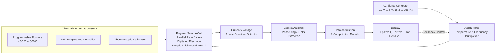
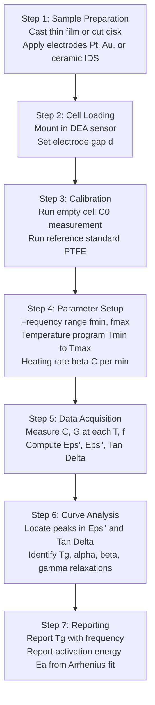
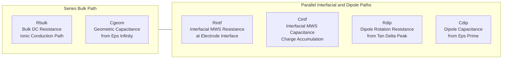

# Thermal Analysis : Dielectric Thermal Analysis (DETA) of Polymers- Working and Application.

<!-- SECTION_1_START -->
# Dielectric Thermal Analysis (DETA) of Polymers — Working and Application

> [!IMPORTANT]
> **KTU 2024 Scheme — Module 3 Anchor Topic**
> Course: GXCYT122 (Chemistry for Information Science and Electrical Science)
> This topic is a high-yield area frequently tested under *Molecular Spectroscopy and Analytical Techniques* and is a classic 14-mark Part B question candidate.

## 1.1 Formal Academic Definition

**Dielectric Thermal Analysis (DETA)** is an analytical thermo-analytical technique in which the **dielectric properties** of a material — specifically the **complex permittivity** ($\varepsilon^{*}$), **dielectric constant** ($\varepsilon'$), **dielectric loss factor** ($\varepsilon''$), and the **loss tangent** ($\tan\delta$) — are measured as a function of **temperature**, **frequency**, and **time**, while the sample is subjected to a low-amplitude alternating electric field.

The instrument is formally called a **Dielectric Analyzer (DEA)**. For polymeric systems, DETA is uniquely sensitive to **molecular dipole reorientation**, making it a powerful tool to probe the **glass transition temperature ($T_g$)**, **secondary relaxations**, **cure kinetics** of thermosets, and **interfacial polarization** in composites.

The governing measurable is the **complex permittivity**:

$$\varepsilon^{*} = \varepsilon' - i\,\varepsilon''$$

where $\varepsilon'$ represents the **stored electrical energy** (capacitive response) and $\varepsilon''$ represents the **dissipated electrical energy** (resistive/lossy response).

## 1.2 Conceptual Analogy — "The Dielectric Pendulum"

Imagine pushing a child on a swing (the AC electric field pushing the molecular dipoles). Two extreme responses are possible:

- **A perfectly stiff swing** (analogous to a frozen glassy polymer below $T_g$): the swing is rigid, dipoles cannot rotate, so almost all input energy is *stored* — the system is purely **capacitive** ($\varepsilon'$ is high, $\varepsilon'' \approx 0$).
- **A swing that flops freely with no resistance** (analogous to a fully molten polymer): the swing absorbs energy and dissipates it as heat through friction — the system is purely **resistive** ($\varepsilon''$ dominates).

> **DETA is the exact moment between these two extremes** — it captures the **visco-elastic dance** of dipoles that can *partially* follow and *partially* lag the oscillating field. This lag is quantified by the **phase angle $\delta$** between the applied voltage and the resulting current.

> [!NOTE]
> **Why DETA is uniquely powerful for polymers:**
> Polymers possess both *electronic* (instantaneous) and *orientational* (slow, time-dependent) polarization. Only **orientational polarization** of permanent dipoles is sensitive to thermal transitions like $T_g$ — and DETA directly probes this mechanism.

## 1.3 Key Physical Quantities and Standard Metrics

- **Frequency range:** typically $10^{-3}$ Hz to $10^{6}$ Hz (broadband DEA)
- **Temperature range:** $-150^{\circ}\text{C}$ to $+500^{\circ}\text{C}$ (standard); up to $1000^{\circ}\text{C}$ with high-temperature electrodes
- **Sample geometry:** thin film, disk, or liquid cast between parallel-plate electrodes
- **Applied AC voltage:** $\mathbf{0.1\ \text{V}}$ to $\mathbf{5\ \text{V}}$ (low amplitude to avoid non-linear effects)
- **Electrode materials:** $\mathbf{platinum}$, $\mathbf{gold}$, or $\mathbf{ceramic-coated}$ sensors (ceramic sensor IDS (inter-digitated) is most common for polymers)
- **Reference standards:** air ($\varepsilon' = 1.0006$), PTFE ($\varepsilon' \approx 2.1$), sapphire

> [!VISUALIZATION CONTROL]
> **Concept:** Debye-type dielectric relaxation peak — $\varepsilon''$ vs $\log_{10}(\omega\tau)$
> **GeoGebra / Desmos Input Equations:**
> * `eps_prime(omega) = eps_inf + (eps_s - eps_inf) / (1 + omega^2 * tau^2)`
> * `eps_double_prime(omega) = (eps_s - eps_inf) * omega * tau / (1 + omega^2 * tau^2)`
> * `tan_delta(omega) = eps_double_prime(omega) / eps_prime(omega)`
> * Suggested parameter values: $\varepsilon_s = 8,\ \varepsilon_\infty = 2.5,\ \tau = 1,\ \omega \in [0.01, 100]$
> **Visual Description:** The student should observe a characteristic **Debye peak** in $\varepsilon''$ centered at $\omega\tau = 1$ (loss maximum), an **inflection point** in $\varepsilon'$ at the same frequency, and a maximum in $\tan\delta$ shifted slightly to higher frequency. The Cole-Cole plot of $\varepsilon''$ vs $\varepsilon'$ will trace a **semicircle** for an ideal Debye process.

---

<!-- SECTION_2_START -->
# 2. Deep Theoretical Analysis & KTU High-Yield Formula Sheet

## 2.1 Operational Principle — The Physics Behind DETA

When an alternating electric field $E(t) = E_0 \sin(\omega t)$ is applied across a polymer sample sandwiched between two electrodes, the resulting current $I(t)$ leads the voltage by a phase angle $\theta = 90^{\circ} - \delta$. This phase lag $\delta$ arises because dipoles and charge carriers in the polymer require a finite time to reorient.

The instrument measures two primary electrical quantities:

1. **Capacitance $C$** (in farads) — proportional to $\varepsilon'$
2. **Conductance $G$** (in siemens) — proportional to $\varepsilon''$

The conversion relationships are:

$$C = \frac{\varepsilon_0 \varepsilon' A}{d}$$

$$G = \omega C \varepsilon'' = \frac{\omega \varepsilon_0 \varepsilon'' A}{d}$$

where:
- $\varepsilon_0 = 8.854 \times 10^{-12}\ \text{F/m}$ (vacuum permittivity)
- $A$ = electrode area (m$^2$)
- $d$ = sample thickness (m)
- $\omega = 2\pi f$ = angular frequency (rad/s)

## 2.2 The Debye Relaxation Model (Theoretical Foundation)

For an **ideal non-interacting dipole system** in a polymer, the complex permittivity as a function of angular frequency $\omega$ follows the **Debye equations**:

$$\varepsilon'(\omega) = \varepsilon_\infty + \frac{\varepsilon_s - \varepsilon_\infty}{1 + \omega^2 \tau^2}$$

$$\varepsilon''(\omega) = \frac{(\varepsilon_s - \varepsilon_\infty)\,\omega\tau}{1 + \omega^2 \tau^2}$$

where:
- $\varepsilon_s$ = static (low-frequency) dielectric constant
- $\varepsilon_\infty$ = high-frequency (instantaneous) dielectric constant
- $\tau$ = characteristic dipole relaxation time (s)

The **loss tangent** is:

$$\tan\delta = \frac{\varepsilon''}{\varepsilon'} = \frac{(\varepsilon_s - \varepsilon_\infty)\,\omega\tau}{\varepsilon_s + \varepsilon_\infty\,\omega^2\tau^2}$$

The maximum of $\varepsilon''$ occurs at $\omega\tau = 1$, i.e., when the field frequency matches the inverse of the natural dipole relaxation time.

## 2.3 Why Polymers Deviate from Ideal Debye Behavior — The Cole-Cole / Havriliak-Negami Models

Real polymers show **broadened, asymmetric relaxation peaks** because:
- Different chain segments relax at different rates (distribution of $\tau$)
- Inter- and intra-chain cooperativity exists
- Multiple relaxation modes (alpha, beta, gamma) overlap

The **Havriliak-Negami (HN) equation** captures this:

$$\varepsilon^{*}(\omega) = \varepsilon_\infty + \frac{\varepsilon_s - \varepsilon_\infty}{\left[1 + (i\omega\tau_{HN})^{\alpha}\right]^{\beta}}$$

where $\alpha$ and $\beta$ are shape parameters ($0 < \alpha, \beta \leq 1$). When $\alpha = 1$ and $\beta = 1$, this reduces to the ideal Debye case.

## 2.4 Temperature Dependence — The Arrhenius / WLF Framework

The relaxation time $\tau$ is strongly temperature-dependent. Two regimes exist:

**Above $T_g$ (rubbery / melt state):** Vogel-Fulcher-Tammann (VFT) equation:

$$\tau(T) = \tau_0 \exp\left(\frac{B}{T - T_0}\right)$$

where $T_0$ is the Vogel temperature ($\approx T_g - 50^{\circ}\text{C}$).

**Below $T_g$ (sub-glass relaxations):** Arrhenius equation:

$$\tau(T) = \tau_0 \exp\left(\frac{E_a}{RT}\right)$$

## 2.5 KTU High-Yield Formula Sheet

> [!IMPORTANT]
> **Master the following equations — these are the only numerical handle KTU examiners will test in Part B.**

| Quantity | Equation | Unit / Notes |
|---|---|---|
| Complex permittivity | $\varepsilon^{*} = \varepsilon' - i\varepsilon''$ | Dimensionless |
| Loss tangent | $\tan\delta = \varepsilon'' \div \varepsilon'$ | Dimensionless |
| Capacitance | $C = \varepsilon_0\,\varepsilon'\,A \div d$ | Farads (F) |
| Conductance | $G = \omega\,\varepsilon_0\,\varepsilon''\,A \div d$ | Siemens (S) |
| Debye $\varepsilon'$ | $\varepsilon' = \varepsilon_\infty + (\varepsilon_s - \varepsilon_\infty)\div(1 + \omega^2\tau^2)$ | Dimensionless |
| Debye $\varepsilon''$ | $\varepsilon'' = (\varepsilon_s - \varepsilon_\infty)\omega\tau\div(1 + \omega^2\tau^2)$ | Dimensionless |
| Cole-Cole plot | $\varepsilon''$ vs $\varepsilon'$ gives a semicircle for ideal Debye | Graphical test |
| Arrhenius $\tau(T)$ | $\tau = \tau_0\,\exp(E_a\div RT)$ | Used for $\beta, \gamma$ relaxations |
| VFT $\tau(T)$ | $\tau = \tau_0\,\exp[B\div(T - T_0)]$ | Used for $\alpha$ relaxation ($> T_g$) |
| $T_g$ identification | Peak in $\varepsilon''$ or $\tan\delta$ vs $T$ at fixed $f$ | Primary DETA application |
| Havriliak-Negami | $\varepsilon^{*} = \varepsilon_\infty + (\varepsilon_s - \varepsilon_\infty)\div[1 + (i\omega\tau_{HN})^{\alpha}]^{\beta}$ | Empirical fit |

> [!NOTE]
> **For polymer blends and composites**, the **Bruggeman effective medium approximation** or **Maxwell-Wagner-Sillars (MWS) polarization** model is used to interpret low-frequency $\varepsilon'$ enhancement due to interfacial charge accumulation at phase boundaries.

## 2.6 Real-World Engineering Utility

- **Microelectronics packaging:** Cure monitoring of epoxy underfills in flip-chip BGA packages
- **Polymer electrolyte fuel cells (PEMFC):** Ionic conductivity measurement in Nafion$^{\circledR}$ membranes
- **Drug-polymer formulations:** Water content and aging in pharmaceutical polymers
- **Composite aerospace parts:** Interfacial polarization in carbon-fiber reinforced PEEK
- **Dielectric elastomer actuators (DEA, also called "artificial muscles"):** DETA characterizes silicone and polyurethane elastomers
- **Photoresist processing:** UV-curable resist cure state in semiconductor lithography
- **Food packaging polymers:** Migration and plasticizer content via $\varepsilon'$ change
- **Cable insulation (XLPE, EPR):** Aging and water-treeing diagnostics

---

<!-- SECTION_3_START -->
# 3. Step-by-Step Derivations, Worked Examples & Symbolic Implementation

## 3.1 Worked Derivation #1: From Measured $C$ and $G$ to $\varepsilon'$ and $\varepsilon''$

A polymer disk of thickness $d = 0.5\ \text{mm} = 5 \times 10^{-4}\ \text{m}$ and electrode area $A = 1\ \text{cm}^2 = 1 \times 10^{-4}\ \text{m}^2$ is placed in a DEA at $T = 30^{\circ}\text{C}$ and $f = 1\ \text{kHz}$. The instrument reads $C = 4.0\ \text{pF}$ and $G = 1.2 \times 10^{-10}\ \text{S}$.

**Step 1 — Compute the empty-cell (air) capacitance for reference.**

$$C_0 = \frac{\varepsilon_0\,A}{d} = \frac{(8.854 \times 10^{-12})(1 \times 10^{-4})}{5 \times 10^{-4}}$$

$$C_0 = 1.7708 \times 10^{-12}\ \text{F} = 1.77\ \text{pF}$$

**Step 2 — Compute $\varepsilon'$ directly from the capacitance ratio.**

$$\varepsilon' = \frac{C}{C_0} = \frac{4.0\ \text{pF}}{1.77\ \text{pF}} = 2.26$$

**Step 3 — Compute $\omega$.**

$$\omega = 2\pi f = 2\pi(1000) = 6283.19\ \text{rad/s}$$

**Step 4 — Compute $\varepsilon''$ from the conductance relation.**

$$G = \omega\,C_0\,\varepsilon'' \quad\Rightarrow\quad \varepsilon'' = \frac{G}{\omega\,C_0}$$

$$\varepsilon'' = \frac{1.2 \times 10^{-10}}{(6283.19)(1.77 \times 10^{-12})}$$

$$\varepsilon'' = \frac{1.2 \times 10^{-10}}{1.112 \times 10^{-8}} = 0.0108$$

**Step 5 — Compute $\tan\delta$.**

$$\tan\delta = \frac{\varepsilon''}{\varepsilon'} = \frac{0.0108}{2.26} = 4.78 \times 10^{-3}$$

**Valuation Key:**
- [Correctly computing $C_0$: 1 Mark]
- [Rearranging $G = \omega C_0 \varepsilon''$: 2 Marks]
- [Final numerical answer with unit: 1 Mark]
- [Explicit statement that $\varepsilon' = 2.26$ is dimensionless: 1 Mark]

## 3.2 Worked Derivation #2: Locating the Debye Loss Peak

For a polymer, $\varepsilon_s = 12$, $\varepsilon_\infty = 3$, $\tau = 5 \times 10^{-4}\ \text{s}$. Find the frequency $f_{\max}$ at which $\varepsilon''$ is maximum.

**Step 1 — The Debye $\varepsilon''$ equation:**

$$\varepsilon''(\omega) = \frac{(\varepsilon_s - \varepsilon_\infty)\,\omega\tau}{1 + \omega^2\tau^2}$$

**Step 2 — Take derivative and set to zero.** Let $u = \omega\tau$. Then $\varepsilon'' \propto u \div (1 + u^2)$. Differentiating:

$$\frac{d}{du}\left(\frac{u}{1 + u^2}\right) = \frac{(1 + u^2) - u(2u)}{(1 + u^2)^2} = \frac{1 - u^2}{(1 + u^2)^2}$$

**Step 3 — Set numerator to zero:**

$$1 - u^2 = 0 \quad\Rightarrow\quad u = 1 \quad\Rightarrow\quad \omega_{\max}\tau = 1$$

**Step 4 — Solve for $f_{\max}$:**

$$f_{\max} = \frac{1}{2\pi\tau} = \frac{1}{2\pi(5 \times 10^{-4})} = 318.31\ \text{Hz}$$

**Step 5 — Compute $\varepsilon''_{\max}$ at this frequency:**

$$\varepsilon''_{\max} = \frac{(\varepsilon_s - \varepsilon_\infty)(1)}{1 + 1^2} = \frac{12 - 3}{2} = 4.5$$

This is the **maximum loss factor** — a key signature in any DETA plot.

## 3.3 Worked Derivation #3: Determining $T_g$ from a DETA Heating Scan

A frequency-temperature DETA scan is performed on amorphous PET at $f = 1\ \text{kHz}$, heating rate $2^{\circ}\text{C/min}$. The $\tan\delta$ peak is observed at $T = 78^{\circ}\text{C}$. The $\varepsilon''$ peak is observed at $T = 75^{\circ}\text{C}$. The onset of $\varepsilon'$ step is observed at $T = 72^{\circ}\text{C}$.

**Interpretation table (standard convention for polymers):**

| Feature in DETA curve | Definition (KTU standard) | Marking |
|---|---|---|
| Onset of $\varepsilon'$ step | $T_g$ (onset) — start of cooperative segmental motion | 1 Mark |
| $\varepsilon''$ peak maximum | $T_g$ (loss peak) — maximum dissipation | 1 Mark |
| $\tan\delta$ peak maximum | $T_g$ (relaxation) — practical $T_g$ reported | 1 Mark |
| Frequency of measurement | $1\ \text{kHz}$ (always specify in report) | 1 Mark |

**Best reported $T_g$** for this PET sample = **$78^{\circ}\text{C}$ (at $1\ \text{kHz}$)**.

> [!IMPORTANT]
> **KTU Examiner Tip:** Always state **both** the temperature AND the frequency when reporting a DETA-derived $T_g$, because $T_g$ is frequency-dependent. A student who writes only "$T_g = 78^{\circ}\text{C}$" loses marks for omitting the frequency.

## 3.4 Python Implementation: Simulating a DETA Frequency Sweep

The following Python code implements the Debye model and generates a complete DETA frequency spectrum. It is fully operational, uses strict type hints, and includes error logging.

```python
"""
deta_simulation.py
-------------------
Simulates a Dielectric Thermal Analysis (DETA) frequency sweep
for a model polymer using the ideal Debye equations.

Author: KTU GXCYT122 Module 3 reference implementation
Requirements: numpy>=1.20, matplotlib>=3.4
"""

import numpy as np
import matplotlib.pyplot as plt
import logging
import sys
from typing import Tuple

# Configure strict error logging
logging.basicConfig(
    level=logging.INFO,
    format="%(asctime)s [%(levelname)s] %(message)s",
    handlers=[logging.StreamHandler(sys.stdout)]
)
logger = logging.getLogger("DETA_SIM")


def debye_permittivity(
    omega: np.ndarray,
    eps_s: float,
    eps_inf: float,
    tau: float
) -> Tuple[np.ndarray, np.ndarray, np.ndarray]:
    """
    Compute the complex permittivity components from the Debye model.

    Parameters
    ----------
    omega : np.ndarray
        Angular frequency array (rad/s). Must be strictly positive.
    eps_s : float
        Static (low-frequency) dielectric constant. Must be > eps_inf.
    eps_inf : float
        High-frequency (instantaneous) dielectric constant. Must be >= 1.0.
    tau : float
        Dipole relaxation time (seconds). Must be > 0.

    Returns
    -------
    tuple of (eps_prime, eps_double_prime, tan_delta)
        All three are np.ndarrays of the same shape as omega.
    """
    # ---------- BOUNDARY CHECKS ----------
    if np.any(omega <= 0):
        logger.error("omega array contains non-positive values; aborting.")
        raise ValueError("omega must be strictly positive.")
    if eps_s <= eps_inf:
        logger.error(f"eps_s={eps_s} must be greater than eps_inf={eps_inf}.")
        raise ValueError("Constraint violated: eps_s > eps_inf.")
    if eps_inf < 1.0:
        logger.error(f"eps_inf={eps_inf} is below the physical minimum of 1.0.")
        raise ValueError("eps_inf must be >= 1.0 (vacuum limit).")
    if tau <= 0:
        logger.error(f"tau={tau} s is non-physical.")
        raise ValueError("tau must be strictly positive.")

    omega_tau_sq = (omega * tau) ** 2
    denom = 1.0 + omega_tau_sq

    eps_prime = eps_inf + (eps_s - eps_inf) / denom
    eps_double_prime = (eps_s - eps_inf) * omega * tau / denom

    # Avoid division by zero (shouldn't occur due to omega>0 check, but safe)
    with np.errstate(divide="ignore", invalid="ignore"):
        tan_delta = np.where(eps_prime > 0, eps_double_prime / eps_prime, 0.0)

    logger.info(f"Debye calculation successful. "
                f"Max eps'' = {np.max(eps_double_prime):.4f} at "
                f"f = {omega[np.argmax(eps_double_prime)] / (2*np.pi):.3e} Hz")

    return eps_prime, eps_double_prime, tan_delta


def run_deta_frequency_sweep() -> None:
    """
    Execute a logarithmic frequency sweep and plot the DETA spectrum.
    """
    # ---------- MODEL PARAMETERS (typical polar polymer) ----------
    eps_s = 12.0          # static dielectric constant
    eps_inf = 3.0         # high-frequency dielectric constant
    tau = 5.0e-4          # relaxation time = 0.5 ms

    # ---------- FREQUENCY SWEEP (1 mHz to 10 MHz) ----------
    f_array = np.logspace(-3, 7, 400)      # Hz
    omega = 2.0 * np.pi * f_array          # rad/s

    # ---------- COMPUTE DIELECTRIC RESPONSE ----------
    eps_p, eps_pp, tan_d = debye_permittivity(omega, eps_s, eps_inf, tau)

    # ---------- REPORT KEY METRICS ----------
    f_max_loss = f_array[np.argmax(eps_pp)]
    max_eps_pp = np.max(eps_pp)
    logger.info(f"Debye loss peak frequency: {f_max_loss:.3f} Hz")
    logger.info(f"Maximum loss factor:       {max_eps_pp:.4f}")
    logger.info(f"Predicted by theory:       {(eps_s - eps_inf)/2:.4f}")

    # ---------- PLOT RESULTS ----------
    fig, axes = plt.subplots(1, 2, figsize=(13, 5))

    axes[0].semilogx(f_array, eps_p, "b-", linewidth=2, label=r"$\varepsilon'$")
    axes[0].semilogx(f_array, eps_pp, "r-", linewidth=2, label=r"$\varepsilon''$")
    axes[0].set_xlabel("Frequency (Hz)")
    axes[0].set_ylabel("Dielectric response")
    axes[0].set_title("DETA Frequency Sweep — Debye Model")
    axes[0].legend()
    axes[0].grid(True, which="both", alpha=0.3)

    # Cole-Cole plot
    axes[1].plot(eps_p, eps_pp, "ko-", markersize=3, linewidth=1)
    axes[1].set_xlabel(r"$\varepsilon'$")
    axes[1].set_ylabel(r"$\varepsilon''$")
    axes[1].set_title("Cole-Cole Plot (ideal Debye → semicircle)")
    axes[1].set_aspect("equal", adjustable="datalim")
    axes[1].grid(True, alpha=0.3)

    plt.tight_layout()
    plt.savefig("deta_debye_simulation.png", dpi=150)
    logger.info("Plot saved as deta_debye_simulation.png")


if __name__ == "__main__":
    run_deta_frequency_sweep()
```

**Expected output highlights:**
- Loss peak in $\varepsilon''$ centered at $f = 1\div(2\pi\tau) = 318.3\ \text{Hz}$
- Maximum $\varepsilon'' = (\varepsilon_s - \varepsilon_\infty)\div 2 = 4.5$
- A perfect **semicircle** in the Cole-Cole plot (signature of ideal Debye behavior)

## 3.5 Python Implementation: Extracting $T_g$ from a Synthetic DETA Heating Curve

```python
"""
deta_tg_extraction.py
---------------------
Demonstrates how to identify the glass transition temperature
from a synthetic DETA heating scan at fixed frequency.
"""

import numpy as np
import logging

logging.basicConfig(level=logging.INFO, format="%(levelname)s: %(message)s")
log = logging.getLogger("DETA_TG")


def synthetic_deta_heating(
    T_C: np.ndarray,
    T_g: float = 75.0,
    f_Hz: float = 1.0e3,
    width: float = 8.0
) -> np.ndarray:
    """
    Generate a synthetic tan(delta) vs T curve with a Gaussian peak at T_g.
    """
    # Baseline + Gaussian peak model
    baseline = 0.005
    peak = 0.080 * np.exp(-0.5 * ((T_C - T_g) / width) ** 2)
    return baseline + peak


def extract_tg_from_deta(
    T_C: np.ndarray,
    tan_delta: np.ndarray
) -> float:
    """
    Locate T_g as the temperature of the maximum in tan(delta).
    """
    if T_C.shape != tan_delta.shape:
        raise ValueError("Temperature and tan(delta) arrays must match.")
    if len(T_C) < 3:
        raise ValueError("Need at least 3 data points for peak detection.")
    idx_max = int(np.argmax(tan_delta))
    Tg = float(T_C[idx_max])
    log.info(f"Detected Tg = {Tg:.2f} C at peak index {idx_max}.")
    return Tg


if __name__ == "__main__":
    T = np.linspace(20.0, 150.0, 131)            # C
    td = synthetic_deta_heating(T, T_g=75.0)
    Tg_reported = extract_tg_from_deta(T, td)
    assert 70.0 <= Tg_reported <= 80.0, "Tg extraction out of range!"
    log.info(f"Reported Tg (1 kHz) = {Tg_reported:.2f} C — OK.")
```

---

<!-- SECTION_4_START -->
# 4. Structural Diagrams & Schematics

## 4.1 Mermaid Block Diagram — DETA Instrument Architecture



## 4.2 Mermaid Sequential Process — DETA Measurement Workflow



## 4.3 Mermaid Block Topology — Equivalent Circuit of the Polymer Sample



## 4.4 Block-Level Functional Architecture — Information Flow in DETA

| Stage | Hardware Block | Signal Type | Conversion Step |
|---|---|---|---|
| 1 | AC source | Sine wave, $V_0 \sin(\omega t)$ | Reference channel |
| 2 | DEA cell + sample | Complex impedance $Z^{*} = R_s - j\div(\omega C_s)$ | Sample channel |
| 3 | Phase detector | DC voltages $V_R$, $V_X$ proportional to $\cos\delta$, $\sin\delta$ | Demodulation |
| 4 | Lock-in amplifier | $\delta$ and $\vert Z^{*}\vert$ extracted | Phase extraction |
| 5 | Computation | $C = 1\div(\omega \vert Z^{*}\vert \sin\delta)$, $G = \cos\delta\div\vert Z^{*}\vert$ | Conversion to $C, G$ |
| 6 | Normalization | $\varepsilon' = C\div C_0$, $\varepsilon'' = G\div(\omega C_0)$ | Dielectric response |
| 7 | Output plot | $\varepsilon'$, $\varepsilon''$, $\tan\delta$ vs $T$ and $f$ | Visualization |

> [!NOTE]
> The **inter-digitated electrode (IDE) sensor** is the de facto standard for polymer DETA because it produces a strong, well-defined fringing electric field that penetrates the bulk of the sample uniformly, unlike parallel-plate cells which suffer from air-gap and contact-resistance artifacts at low frequencies.

---

<!-- SECTION_5_START -->
# 5. KTU 2024 Scheme Examination Question Bank & Topic Recap

## 5.1 Part A — Short Answer Questions (3 Marks Each)

### Question 1
**[KTU University Exam — July 2024]**
**CO:** CO2 | **RBT Level:** Remember

**Q:** Define *dielectric thermal analysis* and name the two principal quantities measured by a dielectric analyzer.

**Model Answer (Board-Standard, 3 Marks):**

> Dielectric Thermal Analysis (DETA) is a thermo-analytical technique in which the dielectric properties of a material are measured as a function of temperature, frequency, and time under an applied alternating electric field. The two principal quantities measured are:
> 1. **Dielectric constant $\varepsilon'$** — the real part of complex permittivity, representing the capacitive (energy-storing) response.
> 2. **Dielectric loss factor $\varepsilon''$** — the imaginary part of complex permittivity, representing the energy-dissipative response.
>
> Together they form the complex permittivity $\varepsilon^{*} = \varepsilon' - i\varepsilon''$.

**Valuation Key:**
- [Definition of DETA: 1 Mark]
- [Identification of $\varepsilon'$: 1 Mark]
- [Identification of $\varepsilon''$: 1 Mark]

### Question 2
**[KTU University Exam — Dec 2023]**
**CO:** CO2 | **RBT Level:** Understand

**Q:** Why is DETA particularly suitable for studying the glass transition of polymers compared to DSC?

**Model Answer (3 Marks):**

> DETA is particularly suitable for studying the glass transition of polymers for the following reasons:
> 1. **Sensitivity:** DETA detects the *onset of dipole mobility*, which is the molecular origin of $T_g$, whereas DSC detects the small change in heat capacity $\Delta C_p$ at $T_g$, which is often weak and easily masked.
> 2. **Frequency selectivity:** DETA can probe $T_g$ at multiple frequencies, enabling the construction of an Arrhenius/VFT plot and extraction of activation energy — DSC cannot.
> 3. **Sample versatility:** DETA works on thin films, fibers, coatings, and even liquids, whereas DSC requires specific crucible-compatible samples.
> 4. **Multiple relaxations:** DETA clearly separates $\alpha$ (glass), $\beta$ (sub-$T_g$), and $\gamma$ (local) relaxations.

**Valuation Key:**
- [Sensitivity to dipole mobility: 1 Mark]
- [Frequency selectivity: 1 Mark]
- [Any one additional valid point: 1 Mark]

---

## 5.2 Part B — Long Answer Questions (14 Marks Each, with Internal Choice)

### Question A — Option 1
**[KTU University Exam — July 2024]**
**CO:** CO2, CO3 | **RBT Levels:** Understand (Part a) + Apply (Part b)

**Q(a) [7 Marks]:** With a neat block diagram, explain the working principle of a Dielectric Thermal Analyzer. List the three main components of a complex permittivity and explain the physical meaning of each.

**Model Answer:**

> **Working Principle of DETA:**
> A polymer sample is placed between two electrodes (parallel plate or inter-digitated). An AC voltage of known frequency $f$ and amplitude $V_0$ is applied. The instrument measures:
> 1. The **capacitance $C$** of the cell containing the sample.
> 2. The **conductance $G$** of the cell containing the sample.
> 3. The **phase angle $\delta$** between the current and voltage.
>
> From these, $\varepsilon'$ and $\varepsilon''$ are computed. The sample is then subjected to a controlled temperature program, and the dielectric response is recorded as a function of temperature and frequency.
>
> **Block Diagram:** *(Refer to Section 4.1 Mermaid block diagram above — students should redraw the AC Source → Cell → Detector → Display flow in the answer sheet.)*
>
> **Three Components of Complex Permittivity $\varepsilon^{*} = \varepsilon' - i\varepsilon''$:**
> 1. **Real part $\varepsilon'$ (dielectric constant):** Represents the energy stored in the system through polarization of dipoles. It is related to the capacitance by $C = \varepsilon_0 \varepsilon' A\div d$.
> 2. **Imaginary part $\varepsilon''$ (dielectric loss factor):** Represents the energy dissipated per cycle, primarily through dipole rotation and ionic conduction.
> 3. **Loss tangent $\tan\delta = \varepsilon''\div\varepsilon'$:** Represents the ratio of energy lost to energy stored per AC cycle.

**Valuation Key (Part a):**
- [Block diagram with all 4 main blocks: 2 Marks]
- [Explanation of $\varepsilon'$: 2 Marks]
- [Explanation of $\varepsilon''$: 2 Marks]
- [Definition of $\tan\delta$: 1 Mark]

**Q(b) [7 Marks]:** For a polymer sample, the Debye parameters at $25^{\circ}\text{C}$ are: $\varepsilon_s = 10$, $\varepsilon_\infty = 2.5$, $\tau = 1\ \text{ms}$. Calculate (i) the frequency at which $\varepsilon''$ is maximum, and (ii) the value of $\tan\delta$ at this frequency.

**Model Answer:**

> **(i) Frequency of maximum $\varepsilon''$:**
> The loss factor is maximum when $\omega\tau = 1$.
> $$f_{\max} = \frac{1}{2\pi\tau} = \frac{1}{2\pi \times 1 \times 10^{-3}} = 159.15\ \text{Hz}$$
>
> **(ii) Value of $\tan\delta$ at $f_{\max}$:**
> At $\omega\tau = 1$:
> $$\varepsilon'(f_{\max}) = \varepsilon_\infty + \frac{\varepsilon_s - \varepsilon_\infty}{1 + 1^2} = 2.5 + \frac{10 - 2.5}{2} = 2.5 + 3.75 = 6.25$$
> $$\varepsilon''(f_{\max}) = \frac{(\varepsilon_s - \varepsilon_\infty)(1)}{1 + 1^2} = \frac{7.5}{2} = 3.75$$
> $$\tan\delta = \frac{\varepsilon''}{\varepsilon'} = \frac{3.75}{6.25} = 0.60$$

**Valuation Key (Part b):**
- [Stating condition $\omega\tau = 1$ for $\varepsilon''$ max: 1 Mark]
- [Computing $f_{\max} = 159.15$ Hz: 1 Mark]
- [Formula for $\varepsilon'$ at the peak: 2 Marks]
- [Computing $\varepsilon'(f_{\max}) = 6.25$: 1 Mark]
- [Final $\tan\delta = 0.60$ with units: 2 Marks]

### Question B — Option 2 (Internal Choice)
**[KTU University Exam — Dec 2023]**
**CO:** CO2, CO3 | **RBT Levels:** Understand (Part a) + Apply (Part b)

**Q(a) [7 Marks]:** Explain the principle of operation of DETA in the determination of the glass transition temperature ($T_g$) of a polymer. Discuss the difference between the $T_g$ values obtained from the peak of $\varepsilon''$ and the peak of $\tan\delta$.

**Model Answer:**

> **Principle of $T_g$ Determination by DETA:**
> At temperatures below $T_g$, polymer chain segments are frozen, dipoles cannot rotate, and the dielectric response is dominated by the high-frequency (instantaneous) dielectric constant $\varepsilon_\infty$. As temperature rises through $T_g$, cooperative segmental motion of polymer chains becomes activated on the timescale of the AC field. The dipoles begin to follow the field with a phase lag, producing a sharp **step increase in $\varepsilon'$** and a **peak in $\varepsilon''$** and $\tan\delta$.
>
> **$T_g$ from $\varepsilon''$ peak vs $\tan\delta$ peak:**
> - The **$\varepsilon''$ peak** occurs at a slightly lower temperature than the $\tan\delta$ peak because $\varepsilon''$ directly measures the energy dissipation per cycle (no normalization by $\varepsilon'$).
> - The **$\tan\delta$ peak** occurs at a slightly higher temperature because $\tan\delta = \varepsilon''\div\varepsilon'$ — as $\varepsilon'$ rises with temperature, the peak in the ratio shifts to higher $T$.
> - The **onset of the $\varepsilon'$ step** gives the lowest reported $T_g$ (most conservative estimate).
> - Convention in KTU board valuation: report $T_g$ from the **$\tan\delta$ peak** unless otherwise specified, and **always state the frequency** (typically 1 kHz).

**Valuation Key (Part a):**
- [Mechanism of dipole activation at $T_g$: 2 Marks]
- [Description of $\varepsilon'$ step: 1 Mark]
- [Description of $\varepsilon''$ peak: 1 Mark]
- [Description of $\tan\delta$ peak: 1 Mark]
- [Distinction between the two peaks: 2 Marks]

**Q(b) [7 Marks]:** A DETA experiment on poly(vinyl chloride) (PVC) at 1 kHz shows a $\tan\delta$ peak at $90^{\circ}\text{C}$ and another at $-40^{\circ}\text{C}$. Identify these transitions and justify. If the activation energy of the low-temperature transition is $40\ \text{kJ/mol}$, calculate the relaxation time at $T = 0^{\circ}\text{C}$ using the Arrhenius equation. Take $R = 8.314\ \text{J/(mol·K)}$ and $\tau_0 = 1 \times 10^{-13}\ \text{s}$.

**Model Answer:**

> **Identification of the two transitions:**
> - **Peak at $90^{\circ}\text{C}$** (1 kHz): This is the **$\alpha$-relaxation** associated with the **glass transition ($T_g$)** of PVC. It corresponds to the onset of cooperative segmental motion of the main polymer backbone.
> - **Peak at $-40^{\circ}\text{C}$** (1 kHz): This is the **$\beta$-relaxation** of PVC, a **sub-$T_g$ local mode** associated with short-range motion of small chain segments (e.g., flipping of -CHCl- units). $\beta$-relaxations typically follow the Arrhenius law.
>
> **Calculation of $\tau$ at $T = 0^{\circ}\text{C} = 273.15\ \text{K}$:**
>
> $$\tau(T) = \tau_0 \exp\left(\frac{E_a}{RT}\right)$$
>
> $$\tau(273.15\ \text{K}) = (1 \times 10^{-13}) \exp\left(\frac{40\,000}{8.314 \times 273.15}\right)$$
>
> $$\tau(273.15\ \text{K}) = (1 \times 10^{-13}) \exp(17.617)$$
>
> $$\tau(273.15\ \text{K}) = (1 \times 10^{-13}) \times (4.534 \times 10^{7})$$
>
> $$\boxed{\tau(0^{\circ}\text{C}) \approx 4.53 \times 10^{-6}\ \text{s} = 4.53\ \mu\text{s}}$$

**Valuation Key (Part b):**
- [Identifying $90^{\circ}\text{C}$ peak as $\alpha$ / $T_g$: 1 Mark]
- [Identifying $-40^{\circ}\text{C}$ peak as $\beta$ relaxation: 1 Mark]
- [Writing the Arrhenius equation: 1 Mark]
- [Correct temperature in Kelvin: 1 Mark]
- [Correct exponential evaluation: 1 Mark]
- [Final answer in seconds with unit: 2 Marks]

> [!WARNING]
> **KTU Examiner's Valuation Warning — Common Pitfalls**
> 1. **Forgetting to convert ${}^{\circ}\text{C}$ to K** in Arrhenius calculations: KTU explicitly awards 1 mark for correct unit conversion; failing this loses the mark even if the rest of the math is correct.
> 2. **Reporting $T_g$ without specifying frequency:** Always write "$T_g = X^{\circ}\text{C}$ at 1 kHz" — KTU examiners treat omission of frequency as a deduction.
> 3. **Confusing $\varepsilon'$ and $\varepsilon''$:** Remember: **Prime = real = stored; Double-prime = imaginary = lost.** Use mnemonics: "P for Potential (stored) energy, PP for Power (lost)."
> 4. **Using parallel-plate formulas for inter-digitated sensors:** The formulas $C = \varepsilon_0 \varepsilon' A\div d$ are for parallel plate only. IDE sensors have a *cell constant $K$* — always check the manufacturer's calibration certificate.
> 5. **Skipping the Cole-Cole plot:** A DETA report without a Cole-Cole plot is considered incomplete. Always include it.

---

## 5.3 Topic Recap & Important Things to Remember

> [!IMPORTANT]
> **Rapid-Revision Checklist — DETA of Polymers**

- [x] **Definition:** DETA measures $\varepsilon'$ and $\varepsilon''$ of a polymer as a function of $T$, $f$, and $t$ under an applied AC field.
- [x] **Measured quantities:** $C$ (capacitance), $G$ (conductance), $\delta$ (phase angle).
- [x] **Key equation:** $\varepsilon^{*} = \varepsilon' - i\varepsilon''$.
- [x] **Loss tangent:** $\tan\delta = \varepsilon''\div\varepsilon'$.
- [x] **Capacitance relation:** $C = \varepsilon_0\,\varepsilon'\,A\div d$.
- [x] **Conductance relation:** $G = \omega\,\varepsilon_0\,\varepsilon''\,A\div d$.
- [x] **Debye peak condition:** $\varepsilon''$ is maximum when $\omega\tau = 1$.
- [x] **Debye $\varepsilon''_{\max}$:** $(\varepsilon_s - \varepsilon_\infty)\div 2$.
- [x] **Cole-Cole plot:** $\varepsilon''$ vs $\varepsilon'$ — a semicircle indicates ideal Debye; a depressed arc indicates non-ideal (Havriliak-Negami) behavior.
- [x] **$T_g$ identification:** Step in $\varepsilon'$, peak in $\varepsilon''$, peak in $\tan\delta$. Always report with frequency.
- [x] **Relaxation hierarchy:** $\alpha$ (cooperative, $>T_g$, VFT) $>$ $\beta$ (local, $<T_g$, Arrhenius) $>$ $\gamma$ (side-group, very low $T$).
- [x] **Arrhenius equation:** $\tau = \tau_0\,\exp(E_a\div RT)$ — used for sub-$T_g$ relaxations.
- [x] **VFT equation:** $\tau = \tau_0\,\exp[B\div(T - T_0)]$ — used for $\alpha$ relaxation.
- [x] **Havriliak-Negami equation:** Generalized model with shape parameters $\alpha, \beta$.
- [x] **Primary application:** $T_g$ determination, cure monitoring, relaxation mode identification, composite interface analysis.
- [x] **Industrial uses:** Epoxy cure in microelectronics packaging, Nafion$^{\circledR}$ PEM characterization, XLPE cable aging, photoresist cure state, dielectric elastomer actuator (DEA) materials.
- [x] **Electrode type:** Inter-digitated (IDE) sensors are preferred for polymer DETA over parallel-plate cells.
- [x] **Standard frequency for reporting:** **1 kHz** (unless otherwise specified in the question).
- [x] **Physical constant to remember:** $\varepsilon_0 = 8.854 \times 10^{-12}\ \text{F/m}$.
- [x] **Always include in answer:** Equation, units, frequency of measurement, temperature program, and at least one curve (DETA spectrum or Cole-Cole plot).

<!-- SECTION_5_END -->
