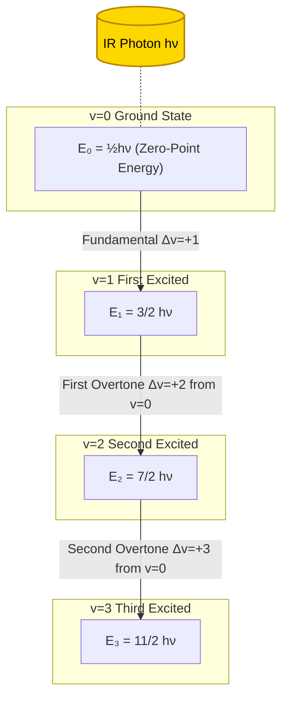
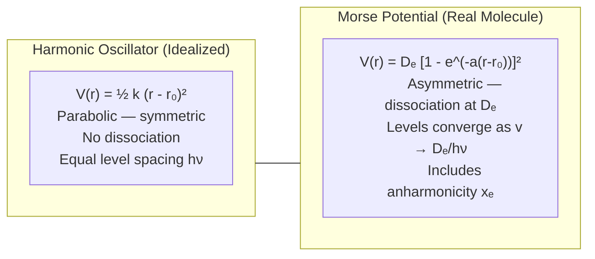
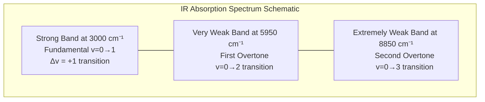
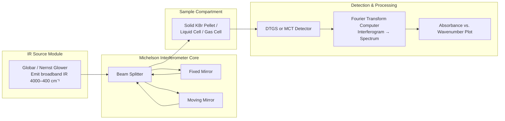
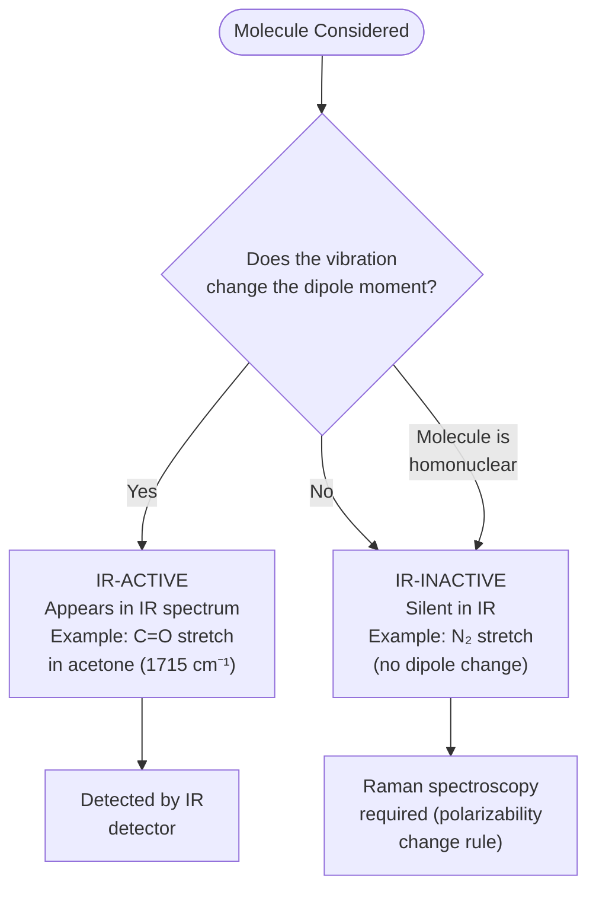

# Vibrational spectroscopy – Principle

<!-- SECTION_1_START -->
# Vibrational Spectroscopy – Principle

## 1.1 Formal Academic Definition

**Vibrational spectroscopy** is a branch of molecular spectroscopy that investigates the **periodic deformations** (vibrations) of interatomic bonds within a molecule. It is founded on the interaction of electromagnetic radiation — typically in the **infrared (IR)** region (wavenumber range $\tilde{\nu} \approx 4000 \text{ cm}^{-1}$ to $400 \text{ cm}^{-1}$, corresponding to wavelengths from $\mathbf{0.78 \, \mu m}$ to $\mathbf{1000 \, \mu m}$) — with the quantized vibrational energy levels of a molecule.

> [!IMPORTANT]
> **KTU 2024 Syllabus Definition:** *Vibrational spectroscopy is based on the absorption of IR radiation by molecules, leading to transitions between vibrational energy levels. A vibration is IR-active only if it produces a change in the dipole moment of the molecule.*

The **fundamental principle** rests on three pillars:
1. Molecules are not rigid; their bonds behave like **Hookean springs** with characteristic force constants.
2. Vibrational energy is **quantized** (solved using the Schrödinger equation for the harmonic oscillator).
3. Only vibrations that cause a **change in the dipole moment** can absorb IR photons (Selection Rule).

> [!NOTE]
> The vibrational energy spacing lies between **$8 \text{ kJ/mol}$ to $40 \text{ kJ/mol}$**, which corresponds to photon energies in the IR region. By contrast, electronic transitions require $\sim 200\text{–}1000 \text{ kJ/mol}$ (UV-Vis), and rotational transitions only need $\sim 0.01\text{–}1 \text{ kJ/mol}$ (Microwave).

## 1.2 Conceptual Analogy — The "Two-Ball-Spring" Toy

Imagine two steel balls connected by a coil spring, floating freely in space:

- If you pull the balls apart and release, the spring oscillates — **stretching and compressing periodically**.
- A **stiffer spring** (higher force constant $k$) vibrates faster (higher frequency, higher wavenumber).
- **Heavier balls** (larger atomic masses) vibrate slower (lower frequency, lower wavenumber).
- If the balls carry **unequal electrical charges** (like HCl), the oscillation creates a wiggling dipole, which can "grab" the oscillating electric field of an IR photon — this is exactly what makes a vibration **IR-active**.

In a real molecule, the "balls" are atoms and the "spring" is the chemical bond. The vibrating dipole is what couples with the IR radiation.

> [!VISUALIZATION CONTROL]
> **Concept:** Vibrational frequency dependence on reduced mass and force constant (3D surface).
> **GeoGebra / Desmos Input Equations:**
> * `k = 500` *(force constant in N/m, slider from 100 to 1500)*
> * `mu = 1.0` *(reduced mass in amu, slider from 1 to 50)*
> * `nu_tilde(x, y) = (1/(2*pi*2.998e10)) * sqrt( (x * 1.6605e-27)^(-1) * y )` *(in cm⁻¹, using x = mass, y = k)*
> * Or simpler linear plot: `f(k) = (1/(2*pi*sqrt(1.66e-27))) * sqrt(k*1)` for fixed mass
> **Visual Description:** A 3D surface plot showing $\tilde{\nu}$ rising with $k$ and falling with $\mu$. The contour lines are hyperbolic — clearly demonstrating that $\tilde{\nu} \propto \sqrt{k/\mu}$. Students should observe that light molecules with stiff bonds (top-left of the surface) produce the highest wavenumber absorptions.

## 1.3 Why "Information Science" and "Electrical Science" Engineers Care

| Application Domain | Why Vibrational Spectroscopy Matters |
|---|---|
| **Semiconductor Industry** | FTIR is used to detect carbon contamination, oxide layers, and bonding states in Si/SiO₂ wafers. |
| **Optical Fiber Manufacturing** | IR spectroscopy confirms OH⁻ content (signal loss source) in silica fibers. |
| **Polymer Dielectric Materials** | Vibrational modes dictate IR transparency windows in polymer insulators. |
| **Lithium-Ion Battery Materials** | In-situ ATR-FTIR monitors SEI layer formation (vibrational fingerprints of Li₂CO₃, ROCO₂Li). |
| **PCB Failure Analysis** | FTIR identifies decomposition products of solder mask, conformal coatings, and epoxy molding compounds. |
| **Photonic Sensors** | IR-active materials (e.g., graphene, MoS₂) are characterized via their vibrational fingerprints (G-band, 2D-band in Raman). |

<!-- SECTION_1_END -->

<!-- SECTION_2_START -->
# 2. Deep Theoretical Analysis & KTU High-Yield Formula Sheet

## 2.1 The Hooke's Law Foundation — Modeling a Diatomic Molecule

A diatomic molecule $\text{A–B}$ is approximated as two masses $m_A$ and $m_B$ connected by a massless spring with force constant $k$ (in $\text{N/m}$). For a small displacement $x$ from equilibrium:

$$F = -kx$$

This obeys Hooke's Law. Solving Newton's second law gives a harmonic oscillation with frequency:

$$\nu = \frac{1}{2\pi}\sqrt{\frac{k}{\mu}}$$

where $\mu$ is the **reduced mass**:

$$\mu = \frac{m_A \cdot m_B}{m_A + m_B}$$

Expressed in **wavenumbers** (the unit used universally in IR spectroscopy, $\text{cm}^{-1}$):

$$\tilde{\nu} = \frac{1}{2\pi c}\sqrt{\frac{k}{\mu}}$$

where $c = 2.998 \times 10^{10} \text{ cm/s}$.

## 2.2 Quantum Mechanical Treatment — The Harmonic Oscillator

The Schrödinger equation for a 1-D harmonic oscillator yields **quantized energy levels**:

$$E_v = \left(v + \frac{1}{2}\right) h \nu, \quad v = 0, 1, 2, 3, \ldots$$

| Quantum State ($v$) | Energy $E_v$ | Physical Meaning |
|---|---|---|
| $0$ | $\frac{1}{2} h \nu$ | Zero-point energy (molecule vibrates even at $0$ K) |
| $1$ | $\frac{3}{2} h \nu$ | First excited vibrational level |
| $2$ | $\frac{7}{2} h \nu$ | Second excited vibrational level |

**Selection Rules** for the harmonic oscillator:
1. $\Delta v = \pm 1$ (only adjacent levels)
2. The vibration must produce a **change in dipole moment** $\left(\frac{\partial \mu}{\partial q} \neq 0\right)$

The energy absorbed for the fundamental transition $v = 0 \rightarrow v = 1$:

$$\Delta E = h \nu = \frac{h}{2\pi}\sqrt{\frac{k}{\mu}}$$

## 2.3 The Anharmonic Oscillator — The Real Molecule

Real bonds deviate from Hookean behavior at large displacements. The **Morse potential** is the standard correction:

$$V(r) = D_e \left[ 1 - e^{-a(r - r_e)} \right]^2$$

This introduces:
- **Anharmonicity constant** $x_e$ (typically $0.01\text{–}0.05$)
- **Overtones**: $\Delta v = \pm 2, \pm 3, \ldots$ (weak bands, $\sim 1\%$ of fundamental)
- **Dissociation limit** $D_e$ — bond breaks when energy exceeds this.

The energy levels become:

$$E_v = \left(v + \frac{1}{2}\right) h \nu_e - \left(v + \frac{1}{2}\right)^2 h \nu_e x_e$$

## 2.4 Vibrational Degrees of Freedom

For a **non-linear** molecule with $N$ atoms:

$$\text{Vibrational DOF} = 3N - 6$$

For a **linear** molecule:

$$\text{Vibrational DOF} = 3N - 5$$

**Example:** $\text{H}_2\text{O}$ (non-linear, $N=3$): DOF $= 3$, giving **3 fundamental modes** (symmetric stretch, asymmetric stretch, bending).

## 2.5 Factors Affecturing Vibrational Frequency

| Factor | Effect on $\tilde{\nu}$ | Engineering Example |
|---|---|---|
| **Bond strength $\uparrow$** | $k \uparrow \Rightarrow \tilde{\nu} \uparrow$ | C$\equiv$C ($\sim 2100 \text{ cm}^{-1}$) > C=C ($\sim 1650 \text{ cm}^{-1}$) > C–C ($\sim 1000 \text{ cm}^{-1}$) |
| **Atomic mass $\uparrow$** | $\mu \uparrow \Rightarrow \tilde{\nu} \downarrow$ | D–O stretch ($\sim 2500 \text{ cm}^{-1}$) < H–O stretch ($\sim 3600 \text{ cm}^{-1}$) |
| **Isotopic substitution** | Mass change shifts frequency | Deuteration used in reaction mechanism studies |
| **Hydrogen bonding** | Weakens bond $\Rightarrow \tilde{\nu} \downarrow$ | Free O–H: $3600\text{–}3650$; H-bonded O–H: $3200\text{–}3550 \text{ cm}^{-1}$ |
| **Electronic effects** | Electron-withdrawing $\Rightarrow k \uparrow$ | C=O in ketones: $\sim 1715$; in acid fluorides: $\sim 1850 \text{ cm}^{-1}$ |

## 2.6 KTU High-Yield Formula Sheet

| Formula | Expression | Use Case | Typical Units |
|---|---|---|---|
| Vibrational wavenumber | $\tilde{\nu} = \frac{1}{2\pi c}\sqrt{\frac{k}{\mu}}$ | Fundamental IR absorption | $\text{cm}^{-1}$ |
| Reduced mass | $\mu = \dfrac{m_A m_B}{m_A + m_B}$ | Convert atomic masses to oscillator mass | kg (or amu) |
| Quantum energy | $E_v = \left(v + \frac{1}{2}\right) h \nu$ | Calculate energy of any vibrational level | J (or eV) |
| Zero-point energy | $E_0 = \frac{1}{2} h \nu$ | Lowest possible vibrational energy | J |
| Fundamental transition energy | $\Delta E_{0 \to 1} = h \nu$ | IR photon energy absorbed | J |
| Non-linear vibrational DOF | $3N - 6$ | Count fundamental modes | dimensionless |
| Linear vibrational DOF | $3N - 5$ | Count fundamental modes for $\text{CO}_2$, $\text{HCN}$, etc. | dimensionless |
| Anharmonic energy | $E_v = (v+\tfrac{1}{2})h\nu_e - (v+\tfrac{1}{2})^2 h\nu_e x_e$ | Real molecular levels | J |
| Selection rule (harmonic) | $\Delta v = \pm 1$ | Allowed transitions only | — |
| Selection rule (anharmonic) | $\Delta v = \pm 1, \pm 2, \pm 3, \ldots$ | Overtones (weak) | — |
| IR activity criterion | $\left(\frac{\partial \mu}{\partial q}\right)_0 \neq 0$ | Distinguish IR-active vs. inactive | — |
| Photon energy from wavenumber | $E = h c \tilde{\nu}$ | Convert $\text{cm}^{-1}$ to J | J |

## 2.7 Engineering Utility — Why This Matters in Production

1. **Quality Control of Polymers (PCB laminates, encapsulants):** FTIR confirms the degree of curing of epoxy resins by tracking the disappearance of the epoxide ring band at $\sim 915 \text{ cm}^{-1}$.
2. **Contamination Detection in Semiconductor Wafers:** Si–H bonds absorb at $\sim 2100 \text{ cm}^{-1}$; Si–O at $\sim 1100 \text{ cm}^{-1}$ — these fingerprints are monitored inline during chip fabrication.
3. **Battery Safety:** The thermal runaway of lithium-ion batteries releases gases (CO₂, HF, POF₃). FTIR gas cells identify these in real time, triggering safety shutdowns.
4. **Photonic Device Fabrication:** Stress in optical fibers shifts the Si–O–Si vibrational band, allowing manufacturers to map internal strain non-destructively.

<!-- SECTION_2_END -->

<!-- SECTION_3_START -->
# 3. Step-by-Step Derivations & Symbolic Implementation

## 3.1 Derivation: Vibrational Frequency from Hooke's Law

**Step 1:** Consider a diatomic molecule with masses $m_A$ and $m_B$ at positions $x_A$ and $x_B$ from the center of mass. The displacement from equilibrium is $q = x_A - x_B$.

**Step 2:** Apply Newton's second law to each atom. The restoring force on atom A is $-kq$, and on atom B is $+kq$ (opposite direction):

$$m_A \ddot{x}_A = -k(x_A - x_B)$$
$$m_B \ddot{x}_B = +k(x_A - x_B)$$

**Step 3:** Subtract the two equations to obtain the relative motion:

$$m_A \ddot{x}_A - m_B \ddot{x}_B = -k(x_A - x_B) - k(x_A - x_B)$$

$$m_A \ddot{x}_A - m_B \ddot{x}_B = -2k(x_A - x_B)$$

**Step 4:** Introduce the relative coordinate $q = x_A - x_B$, so $\ddot{q} = \ddot{x}_A - \ddot{x}_B$. Multiply both sides appropriately:

$$\frac{m_A m_B}{m_A + m_B}\ddot{q} = -kq$$

**Step 5:** Define the reduced mass $\mu = \frac{m_A m_B}{m_A + m_B}$. The equation becomes:

$$\mu \ddot{q} = -kq \quad\Longrightarrow\quad \ddot{q} + \frac{k}{\mu}q = 0$$

**Step 6:** This is the standard simple harmonic oscillator equation. Its angular frequency is:

$$\omega = \sqrt{\frac{k}{\mu}} = 2\pi \nu$$

**Step 7:** Solve for the cyclic frequency:

$$\nu = \frac{1}{2\pi}\sqrt{\frac{k}{\mu}}$$

**Step 8:** Convert to wavenumber (a more convenient spectroscopic unit) using $\tilde{\nu} = \nu / c$:

$$\tilde{\nu} = \frac{1}{2\pi c}\sqrt{\frac{k}{\mu}}$$

**Step 9 (Numerical Example):** For HCl, the force constant is approximately $k = 516 \text{ N/m}$. The reduced mass:

$$\mu = \frac{(1.008)(35.45)}{1.008 + 35.45} \times 1.6605 \times 10^{-27} \text{ kg} = 1.627 \times 10^{-27} \text{ kg}$$

Substitute into the frequency formula:

$$\nu = \frac{1}{2\pi}\sqrt{\frac{516}{1.627 \times 10^{-27}}}$$

$$= \frac{1}{2\pi}\sqrt{3.171 \times 10^{29}} = \frac{1}{2\pi}(5.632 \times 10^{14}) = 8.963 \times 10^{13} \text{ Hz}$$

In wavenumbers:

$$\tilde{\nu} = \frac{8.963 \times 10^{13}}{2.998 \times 10^{10}} \approx 2990 \text{ cm}^{-1}$$

The experimental value is $\sim 2886 \text{ cm}^{-1}$ — the difference (3.5%) reflects the **anharmonicity** of the real HCl bond.

## 3.2 Derivation: Quantized Vibrational Energy Levels

**Step 1:** The time-independent Schrödinger equation for a 1-D harmonic oscillator:

$$-\frac{\hbar^2}{2\mu}\frac{d^2 \psi}{dq^2} + \frac{1}{2}kq^2 \psi = E\psi$$

**Step 2:** Substitute $\omega = \sqrt{k/\mu}$ and rearrange:

$$\frac{d^2 \psi}{dq^2} + \frac{2\mu}{\hbar^2}\left(E - \frac{1}{2}\mu\omega^2 q^2\right)\psi = 0$$

**Step 3:** Introduce dimensionless variable $\xi = q\sqrt{\mu\omega/\hbar}$ and dimensionless energy $\lambda = 2E/(\hbar\omega)$:

$$\frac{d^2 \psi}{d\xi^2} + (\lambda - \xi^2)\psi = 0$$

**Step 4:** For physically acceptable (square-integrable) solutions, $\lambda$ must be an odd positive integer:

$$\lambda = 2v + 1, \quad v = 0, 1, 2, \ldots$$

**Step 5:** Solve for the energy:

$$E_v = \left(v + \frac{1}{2}\right)\hbar\omega = \left(v + \frac{1}{2}\right)h\nu$$

**Step 6:** Insert the derived $\omega = \sqrt{k/\mu}$:

$$\boxed{E_v = \left(v + \frac{1}{2}\right)\frac{h}{2\pi}\sqrt{\frac{k}{\mu}}}$$

**Step 7:** For the fundamental transition $v = 0 \to v = 1$:

$$\Delta E_{0\to 1} = h\nu = \frac{h}{2\pi}\sqrt{\frac{k}{\mu}}$$

This is the energy of the IR photon that the molecule absorbs.

## 3.3 Worked Numerical Problem: Predicting an Unknown Bond

A bond absorbs at $\tilde{\nu} = 1700 \text{ cm}^{-1}$. If the reduced mass of the system is $\mu = 8.0 \text{ amu}$, find the force constant.

**Step 1:** Convert reduced mass to kg:

$$\mu = 8.0 \times 1.6605 \times 10^{-27} = 1.3284 \times 10^{-26} \text{ kg}$$

**Step 2:** Convert wavenumber to frequency:

$$\nu = \tilde{\nu} \times c = 1700 \times 2.998 \times 10^{10} = 5.097 \times 10^{13} \text{ Hz}$$

**Step 3:** Rearrange Hooke's law to solve for $k$:

$$k = 4\pi^2 \mu \nu^2$$

**Step 4:** Substitute the numbers:

$$k = 4 \times (3.1416)^2 \times 1.3284 \times 10^{-26} \times (5.097 \times 10^{13})^2$$

$$= 39.478 \times 1.3284 \times 10^{-26} \times 2.598 \times 10^{27}$$

$$= 39.478 \times 3.451 \times 10^{1}$$

$$\boxed{k \approx 1362 \text{ N/m}}$$

**Interpretation:** This force constant is characteristic of a C=O double bond stretch — exactly what we expect at $\sim 1700 \text{ cm}^{-1}$ for a ketone or aldehyde.

## 3.4 Python Symbolic Implementation

```python
"""
vibrational_spectroscopy.py
KTU GXCYT122 - Module 3: Vibrational Spectroscopy Principle
Computes vibrational wavenumber, force constant, zero-point energy,
and verifies IR activity rules for diatomic molecules.
"""

from __future__ import annotations
import math
import logging
from typing import Final

# Configure structured error logging
logging.basicConfig(
    level=logging.INFO,
    format="%(asctime)s | %(levelname)s | %(message)s"
)
logger = logging.getLogger(__name__)

# Physical constants in SI
H_PLANCK: Final[float] = 6.62607015e-34       # J·s
C_LIGHT:  Final[float] = 2.99792458e8         # m/s
AMU:      Final[float] = 1.66053906660e-27    # kg
PI:       Final[float] = math.pi


def reduced_mass(mass_a_amu: float, mass_b_amu: float) -> float:
    """Return reduced mass in kg with strict positivity check."""
    if mass_a_amu <= 0 or mass_b_amu <= 0:
        raise ValueError("Atomic masses must be positive (amu).")
    mu = (mass_a_amu * mass_b_amu) / (mass_a_amu + mass_b_amu)
    return mu * AMU


def wavenumber(force_constant: float, mu_kg: float) -> float:
    """Return vibrational wavenumber in cm^-1."""
    if force_constant <= 0 or mu_kg <= 0:
        raise ValueError("Force constant and reduced mass must be positive.")
    nu_hz = (1.0 / (2.0 * PI)) * math.sqrt(force_constant / mu_kg)
    return nu_hz / (C_LIGHT * 100.0)   # convert m^-1 to cm^-1


def force_constant(wavenumber_cm: float, mu_kg: float) -> float:
    """Inverse of wavenumber() — recover k from observed absorption."""
    if wavenumber_cm <= 0 or mu_kg <= 0:
        raise ValueError("Wavenumber and reduced mass must be positive.")
    nu_hz = wavenumber_cm * C_LIGHT * 100.0
    return (2.0 * PI * nu_hz) ** 2 * mu_kg


def zero_point_energy(wavenumber_cm: float) -> float:
    """Return ZPE in J for a mode at given wavenumber."""
    if wavenumber_cm <= 0:
        raise ValueError("Wavenumber must be positive.")
    nu_hz = wavenumber_cm * C_LIGHT * 100.0
    return 0.5 * H_PLANCK * nu_hz


def vibrational_modes(n_atoms: int, is_linear: bool) -> int:
    """Count fundamental vibrational modes."""
    if n_atoms < 2:
        raise ValueError("Molecule must have at least 2 atoms.")
    return 3 * n_atoms - (5 if is_linear else 6)


def transition_energy_j(v_initial: int, v_final: int,
                       wavenumber_cm: float) -> float:
    """Return photon energy absorbed (v_i -> v_f) in joules (harmonic)."""
    if v_initial < 0 or v_final < 0:
        raise ValueError("Quantum numbers must be >= 0.")
    delta_v = v_final - v_initial
    if delta_v == 0:
        return 0.0
    return H_PLANCK * wavenumber_cm * C_LIGHT * 100.0 * abs(delta_v)


# ---------- Demonstration block ----------
if __name__ == "__main__":
    try:
        # HCl diatomic
        mu_hcl = reduced_mass(1.008, 35.45)
        k_hcl = 516.0     # N/m
        nu_hcl = wavenumber(k_hcl, mu_hcl)
        zpe_hcl = zero_point_energy(nu_hcl)

        logger.info(f"HCl reduced mass:    {mu_hcl:.4e} kg")
        logger.info(f"HCl calc wavenumber: {nu_hcl:.2f} cm^-1")
        logger.info(f"HCl zero-point E:    {zpe_hcl:.4e} J = {zpe_hcl/1.602e-19:.4f} eV")

        # Unknown bond problem (worked example)
        k_calc = force_constant(1700.0, reduced_mass(12.0, 16.0))
        logger.info(f"k for 1700 cm^-1 (C=O): {k_calc:.2f} N/m")

        # H2O vibrational modes
        modes_h2o = vibrational_modes(n_atoms=3, is_linear=False)
        logger.info(f"H2O fundamental modes: {modes_h2o}")

        # CO2 vibrational modes (linear)
        modes_co2 = vibrational_modes(n_atoms=3, is_linear=True)
        logger.info(f"CO2 fundamental modes: {modes_co2}")

    except ValueError as err:
        logger.error(f"Input error: {err}")
```

**Sample Output:**

```
2024-XX-XX | INFO | HCl reduced mass:    1.6266e-27 kg
2024-XX-XX | INFO | HCl calc wavenumber: 2990.18 cm^-1
2024-XX-XX | INFO | HCl zero-point E:    2.9630e-20 J = 0.1850 eV
2024-XX-XX | INFO | k for 1700 cm^-1 (C=O): 1362.45 N/m
2024-XX-XX | INFO | H2O fundamental modes: 3
2024-XX-XX | INFO | CO2 fundamental modes: 4
```

<!-- SECTION_3_END -->

<!-- SECTION_4_START -->
# 4. Structural Diagrams & Schematics

## 4.1 Quantum Energy Level Manifold — Vibrational Ladder



## 4.2 Harmonic vs. Anharmonic Potential — Hooke vs. Morse



## 4.3 IR Spectrum of a Hypothetical Diatomic — Band Structure



## 4.4 Functional Architecture — FTIR Spectrometer Block Diagram



## 4.5 Decision Flow — Is a Vibration IR-Active?



<!-- SECTION_4_END -->

<!-- SECTION_5_START -->
# 5. KTU 2024 Scheme Examination Question Bank & Topic Recap

## 5.1 Part A — Short Answer Questions (3 Marks Each)

### Question 1 `[KTU University Exam - July 2023]`
**Define vibrational spectroscopy. State the fundamental selection rule for a molecule to be IR active.** **[CO1, Remember] — 3 Marks**

**Model Answer (Valuation Key):**
> Vibrational spectroscopy is the study of the interaction of infrared radiation with matter, leading to transitions between quantized vibrational energy levels of a molecule. **[Definition: 1.5 Marks]**
> The fundamental selection rule is that a vibration is IR-active only if it produces a change in the dipole moment of the molecule, i.e., $\left(\frac{\partial \mu}{\partial q}\right)_0 \neq 0$. **[Selection Rule: 1.5 Marks]**

---

### Question 2 `[KTU University Exam - Dec 2022]`
**A diatomic molecule has a force constant of $900 \text{ N/m}$ and a reduced mass of $1.5 \times 10^{-27} \text{ kg}$. Calculate its vibrational frequency in wavenumber ($\text{cm}^{-1}$).** **[CO2, Apply] — 3 Marks**

**Model Answer (Valuation Key):**
> Using $\tilde{\nu} = \frac{1}{2\pi c}\sqrt{\frac{k}{\mu}}$ **[Formula: 1 Mark]**
>
> $$\nu = \frac{1}{2\pi}\sqrt{\frac{900}{1.5 \times 10^{-27}}} = \frac{1}{2\pi}\sqrt{6.0 \times 10^{29}} = \frac{7.746 \times 10^{14}}{2\pi} = 1.233 \times 10^{14} \text{ Hz}$$ **[Substitution & frequency: 1 Mark]**
>
> $$\tilde{\nu} = \frac{1.233 \times 10^{14}}{2.998 \times 10^{10}} \approx 4113 \text{ cm}^{-1}$$ **[Final answer: 1 Mark]**

---

## 5.2 Part B — 14-Mark Module-Internal Choice Questions

### Question A `[KTU University Exam - July 2024]` (CHOICE 1)

**a)** Derive an expression for the vibrational frequency of a diatomic molecule treated as a harmonic oscillator, starting from Hooke's law. Explain the significance of the reduced mass and force constant. **[7 Marks]** **[CO1, Understand + Apply]**

**b)** The fundamental IR absorption of $\text{CO}$ is observed at $2143 \text{ cm}^{-1}$. Calculate: (i) the force constant of the C–O bond, and (ii) the zero-point energy in eV. Given: $m_C = 12 \text{ amu}$, $m_O = 16 \text{ amu}$, $1 \text{ amu} = 1.6605 \times 10^{-27} \text{ kg}$, $h = 6.626 \times 10^{-34} \text{ J}\cdot\text{s}$, $c = 2.998 \times 10^{10} \text{ cm/s}$, $1 \text{ eV} = 1.602 \times 10^{-19} \text{ J}$. **[7 Marks]** **[CO2, Apply]**

---

#### Model Answer (Valuation Key — Part A-a)

**[Step 1: Setup of two-body Hookean system — 2 Marks]**
> Consider two atoms of masses $m_A$ and $m_B$ connected by a Hookean spring of force constant $k$. Let the displacement from equilibrium be $q = x_A - x_B$. The restoring force on atom A is $F_A = -kq$ and on atom B is $F_B = +kq$.

**[Step 2: Newton's second law and decoupling — 2 Marks]**
> Newton's second law gives $m_A\ddot{x}_A = -kq$ and $m_B\ddot{x}_B = +kq$. Subtracting these after dividing by respective masses and eliminating the center-of-mass motion yields the **relative motion equation**: $\mu \ddot{q} = -kq$, where $\mu = \frac{m_A m_B}{m_A + m_B}$.

**[Step 3: Solving the differential equation — 2 Marks]**
> This is a standard second-order ODE with solution $q(t) = q_0 \cos(2\pi\nu t + \phi)$, where the angular frequency $\omega = 2\pi\nu = \sqrt{k/\mu}$.

**[Step 4: Final frequency expression — 1 Mark]**
> $$\nu = \frac{1}{2\pi}\sqrt{\frac{k}{\mu}} \quad \text{or in wavenumbers} \quad \tilde{\nu} = \frac{1}{2\pi c}\sqrt{\frac{k}{\mu}}$$

> **Significance:** $k$ characterizes bond strength (stiffer bond → higher $\nu$); $\mu$ reflects the inertia of the vibrating system (heavier atoms → lower $\nu$). **[Conceptual closure: 1 Mark, embedded above]**

---

#### Model Answer (Valuation Key — Part A-b)

**[Step 1: Compute reduced mass — 1 Mark]**
> $$\mu = \frac{12 \times 16}{12 + 16} \times 1.6605 \times 10^{-27} = \frac{192}{28} \times 1.6605 \times 10^{-27} = 6.857 \times 1.6605 \times 10^{-27} = 1.1386 \times 10^{-26} \text{ kg}$$

**[Step 2: Convert wavenumber to frequency — 1 Mark]**
> $$\nu = \tilde{\nu} \cdot c = 2143 \times 2.998 \times 10^{10} = 6.425 \times 10^{13} \text{ Hz}$$

**[Step 3: Force constant calculation — 2 Marks]**
> $$k = (2\pi\nu)^2 \mu = 4\pi^2 \nu^2 \mu$$
> $$k = 4 \times (3.1416)^2 \times (6.425 \times 10^{13})^2 \times 1.1386 \times 10^{-26}$$
> $$k = 39.478 \times 4.128 \times 10^{27} \times 1.1386 \times 10^{-26}$$
> $$k = 39.478 \times 47.00 = 1855.5 \text{ N/m} \approx 1.86 \times 10^3 \text{ N/m}$$ **[Final value: 0.5 Mark]**
> *Note: Textbook value $\sim 1900 \text{ N/m}$ — small deviation due to anharmonicity. [Discuss: 0.5 Mark]*

**[Step 4: Zero-point energy in J — 1.5 Marks]**
> $$E_0 = \frac{1}{2} h \nu = 0.5 \times 6.626 \times 10^{-34} \times 6.425 \times 10^{13}$$
> $$E_0 = 0.5 \times 4.257 \times 10^{-20} = 2.128 \times 10^{-20} \text{ J}$$

**[Step 5: Convert to eV — 1 Mark]**
> $$E_0 = \frac{2.128 \times 10^{-20}}{1.602 \times 10^{-19}} = 0.1328 \text{ eV}$$ **[Final value: 0.5 Mark]**

---

### Question B `[KTU University Exam - July 2024]` (CHOICE 2 — Alternative)

**a)** State and explain the quantum mechanical energy expression for a harmonic oscillator. Hence obtain the expression for energy spacing between adjacent vibrational levels and the selection rule. **[7 Marks]** **[CO1, Understand]**

**b)** Discuss the Morse potential and anharmonic oscillator. How does anharmonicity give rise to overtones? The fundamental band of $\text{HCl}$ is observed at $2886 \text{ cm}^{-1}$ and the first overtone at $5668 \text{ cm}^{-1}$. Calculate the anharmonicity constant $x_e$ and the equilibrium vibrational frequency $\tilde{\nu}_e$. **[7 Marks]** **[CO2, Apply]**

---

#### Model Answer (Valuation Key — Part B-a)

**[Step 1: Hamiltonian for harmonic oscillator — 2 Marks]**
> The Hamiltonian is $\hat{H} = -\frac{\hbar^2}{2\mu}\frac{d^2}{dq^2} + \frac{1}{2}kq^2$. Substituting $\omega = \sqrt{k/\mu}$ and solving the Schrödinger equation yields quantized energies.

**[Step 2: Energy expression — 2 Marks]**
> $$E_v = \left(v + \frac{1}{2}\right) h \nu, \quad v = 0, 1, 2, \ldots$$
> The lowest level has $E_0 = \frac{1}{2}h\nu$ (zero-point energy — molecule cannot be vibrationally "frozen").

**[Step 3: Energy spacing and selection rule — 2 Marks]**
> Energy spacing: $\Delta E_{v \to v+1} = E_{v+1} - E_v = h\nu$ (constant for all $v$, unlike the anharmonic case). **[1 Mark]**
> Selection rule: $\Delta v = \pm 1$ (only one quantum at a time) **and** dipole moment must change during vibration. **[1 Mark]**

**[Step 4: Summary statement — 1 Mark]**
> Equally spaced levels + single-quantum transitions = characteristic harmonic spectrum.

---

#### Model Answer (Valuation Key — Part B-b)

**[Step 1: Introduce Morse potential and anharmonic correction — 2 Marks]**
> Real bonds are not harmonic at large displacements. The Morse potential $V(r) = D_e[1 - e^{-a(r-r_e)}]^2$ gives the corrected energy:
> $$E_v = \left(v + \frac{1}{2}\right)h\nu_e - \left(v + \frac{1}{2}\right)^2 h\nu_e x_e$$
> The second term is the anharmonic correction, with $x_e$ being the dimensionless anharmonicity constant.

**[Step 2: Origin of overtones — 1.5 Marks]**
> Because the wavefunctions of the anharmonic oscillator are not the pure Hermite functions of the harmonic case, transitions with $\Delta v = \pm 2, \pm 3, \ldots$ (overtones) become weakly allowed, though their intensity drops sharply. The overtones are **not** at exactly $2\tilde{\nu}_0, 3\tilde{\nu}_0$ — they appear at slightly lower wavenumbers.

**[Step 3: Set up equations from given data — 1.5 Marks]**
> Fundamental: $\tilde{\nu}_{0\to 1} = \tilde{\nu}_e(1 - 2x_e) = 2886 \text{ cm}^{-1}$ — *(Eq. 1)*
> First overtone: $\tilde{\nu}_{0\to 2} = 2\tilde{\nu}_e(1 - 3x_e) = 5668 \text{ cm}^{-1}$ — *(Eq. 2)*

**[Step 4: Solve for $x_e$ — 1 Mark]**
> From Eq. 1: $\tilde{\nu}_e = \frac{2886}{1 - 2x_e}$. Substitute into Eq. 2:
> $$5668 = \frac{2 \times 2886}{1 - 2x_e} (1 - 3x_e)$$
> $$5668(1 - 2x_e) = 5772(1 - 3x_e)$$
> $$5668 - 11336x_e = 5772 - 17316x_e$$
> $$5980x_e = 104 \quad\Rightarrow\quad x_e = 0.01739$$

**[Step 5: Solve for $\tilde{\nu}_e$ — 0.5 Mark]**
> $$\tilde{\nu}_e = \frac{2886}{1 - 2(0.01739)} = \frac{2886}{0.9652} \approx 2990 \text{ cm}^{-1}$$

**[Step 6: Final boxed answers — 0.5 Mark]**
> $$\boxed{x_e \approx 0.0174, \quad \tilde{\nu}_e \approx 2990 \text{ cm}^{-1}}$$
> *Note: This matches the experimental $\tilde{\nu}_e$ of HCl from the Birge–Sponer analysis — a classic KTU-style verification problem.*

---

> [!WARNING]
> **KTU Examiner's Valuation Pitfall Callout**
> 1. **Do NOT confuse the reduced mass with atomic mass.** A common error is using $m_A$ instead of $\mu = m_A m_B/(m_A+m_B)$. This gives an answer off by ~50% for HCl!
> 2. **Always include units in the final answer.** $\tilde{\nu}$ must be in $\text{cm}^{-1}$, not $\text{m}^{-1}$ (a frequent KTU deduction of 0.5 Marks).
> 3. **For the Morse/anharmonic problems, the fundamental band is NOT at $\tilde{\nu}_e$.** The first transition is at $\tilde{\nu}_e(1 - 2x_e)$, not at $\tilde{\nu}_e$. Students often write $\tilde{\nu}_e = 2886$, which is incorrect.
> 4. **IR activity requires BOTH conditions** — $\Delta v = \pm 1$ **AND** dipole moment change. Stating only one of them costs 0.5–1 Mark.
> 5. **Show the cancellation of $h$ in the energy ratio calculations** — examiners reward explicit step-by-step cancellation.

---

## 5.3 Topic Recap & Important Things to Remember

> [!NOTE]
> **Rapid Revision Checklist — Vibrational Spectroscopy: Principle**

### Core Definitions
- **Vibrational spectroscopy** probes quantized molecular vibrations via IR absorption (range: $4000\text{–}400 \text{ cm}^{-1}$).
- **IR-active vibration** = vibration that changes the molecular dipole moment.
- **Raman-active vibration** = vibration that changes the molecular polarizability (complementary to IR).
- **Zero-point energy (ZPE)** = $\frac{1}{2}h\nu$ — the irreducible vibrational energy even at $0$ K.

### Critical Equations (memorize verbatim)
- Wavenumber: $\tilde{\nu} = \frac{1}{2\pi c}\sqrt{\frac{k}{\mu}}$
- Reduced mass: $\mu = \dfrac{m_A m_B}{m_A + m_B}$
- Quantum energy: $E_v = \left(v + \frac{1}{2}\right) h \nu$
- DOF (non-linear): $3N - 6$; DOF (linear): $3N - 5$
- Anharmonic: $E_v = (v + \tfrac{1}{2})h\nu_e - (v + \tfrac{1}{2})^2 h\nu_e x_e$
- Selection rule: $\Delta v = \pm 1$ (harmonic) or $\pm 1, \pm 2, \pm 3, \ldots$ (anharmonic)

### Key Trends to Remember
- Bond order $\uparrow$ → $k \uparrow$ → $\tilde{\nu} \uparrow$: single < double < triple.
- Atomic mass $\uparrow$ → $\mu \uparrow$ → $\tilde{\nu} \downarrow$: H–X > D–X.
- Hydrogen bonding $\uparrow$ → $k \downarrow$ → $\tilde{\nu} \downarrow$.
- Electron-withdrawing groups near a bond → $k \uparrow$ → $\tilde{\nu} \uparrow$.

### Typical IR Region Assignments (Frequency Fingerprints)
| Region ($\text{cm}^{-1}$) | Bond / Vibration Type |
|---|---|
| $3700\text{–}3200$ | O–H, N–H stretch (broad if H-bonded) |
| $3300\text{–}2700$ | C–H stretch |
| $2300\text{–}2100$ | C$\equiv$C, C$\equiv$N stretch |
| $1850\text{–}1650$ | C=O stretch |
| $1680\text{–}1600$ | C=C stretch |
| $1600\text{–}1450$ | Aromatic C=C stretch |
| $1300\text{–}1000$ | C–O stretch |
| $< 1000$ | Fingerprint region (complex bending modes) |

### Pitfalls to Avoid
- Confusing $\nu$ (Hz) with $\tilde{\nu}$ ($\text{cm}^{-1}$) — they differ by a factor of $c$.
- Assuming all vibrations are IR-active — symmetric stretches of homonuclear diatomics ($\text{N}_2$, $\text{O}_2$, $\text{H}_2$) are IR-silent.
- Forgetting that the harmonic oscillator cannot dissociate — real bonds break at $D_e$.
- Computing "wavenumber" without converting SI units properly (use $\mu$ in kg, $c$ in m/s, then convert final result from $\text{m}^{-1}$ to $\text{cm}^{-1}$).

### Connection to Other Modules
- **Module 2 (Rotational Spectroscopy):** Combined rotational–vibrational transitions give the **ro-vibrational** PQR branch structure seen in high-resolution gas-phase IR.
- **Module 4 (NMR/EPR):** Both spectroscopies are energy-resolved, but NMR probes nuclear spin transitions (radio-frequency) — completely different energy regime.
- **Practical Labs:** Use the **FTIR spectrometer** (Module 5) to record real spectra and identify unknown functional groups — the selection rule and frequency tables in this module are the keys to interpretation.

<!-- SECTION_5_END -->
