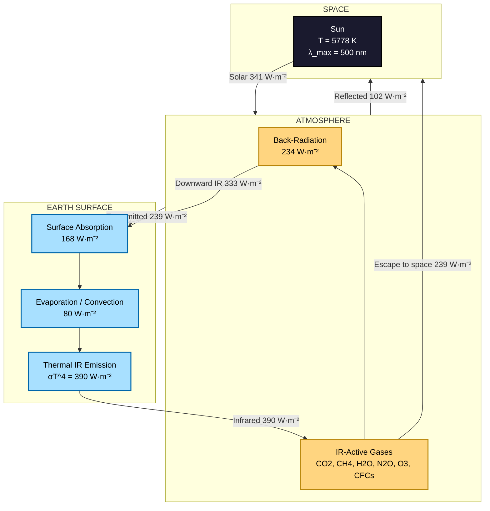
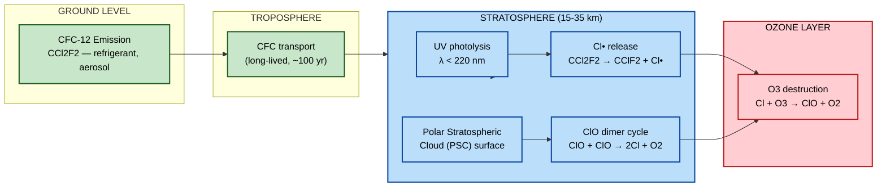
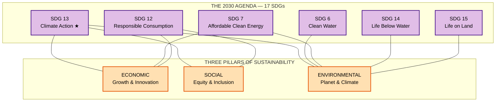
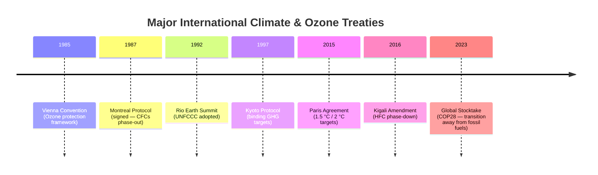

# Chemistry of climate change - Greenhouse Gases, Ozone Depletion, Sustainable Development Goals

<!-- SECTION_1_START -->
# 🌱 Chemistry of Climate Change: Greenhouse Gases, Ozone Depletion & Sustainable Development Goals

## 1.1 Formal Academic Definition (KTU 2024 Syllabus Terminology)

> [!IMPORTANT]
> **Greenhouse Effect (GHE):** The phenomenon by which certain polyatomic gases (greenhouse gases) in the Earth's atmosphere absorb and re-emit infrared (IR) radiation emitted from the Earth's surface, thereby trapping heat and raising the mean surface temperature of the Earth above the radiative equilibrium value (≈ **255 K** without GHGs vs. **288 K** with GHGs).

> [!IMPORTANT]
> **Ozone Depletion:** The chemical destruction of stratospheric ozone (O₃) layer (15–35 km altitude) primarily caused by halogenated radicals (Cl•, Br•) released from photodissociation of anthropogenic chlorofluorocarbons (CFCs), halons, and related compounds, leading to the formation of the **Antarctic Ozone Hole** first reported by Farman, Gardiner & Shanklin (1985).

> [!IMPORTANT]
> **Sustainable Development Goals (SDGs):** A set of **17 interlinked global goals** adopted by all United Nations Member States in 2015 (UN Resolution A/RES/70/1) as part of the **2030 Agenda for Sustainable Development**, providing a blueprint for peace, prosperity, and planetary health. Goal 13 specifically addresses **Climate Action**.

---

## 1.2 Conceptual Analogy / Intuitive Build-up

### 🏠 Analogy 1: The "Glass-House" Effect
Imagine standing inside a closed glass conservatory on a winter day. Sunlight (short-wave, visible radiation) passes freely through the glass panes and warms the soil and plants. The warmed objects then re-radiate energy as **infrared (long-wave) heat**, which the glass cannot let escape easily — it gets reflected back inside. The interior becomes warmer than the outside. Earth's atmosphere behaves exactly like this glass: **CO₂, CH₄, H₂O vapor, N₂O, and CFCs act as the "glass panes"** for IR radiation, trapping thermal energy.

### 🎈 Analogy 2: The "Stretching Balloon" for Ozone
Think of stratospheric ozone as a thin protective umbrella over the planet, absorbing **97–99 % of harmful UV-B (280–315 nm)** and almost all UV-C (100–280 nm) radiation. When we release CFCs from old refrigerators and aerosol cans, these molecules drift up, get shredded by UV, and release **chlorine "scissors"** that snip ozone molecules apart, thinning the umbrella.

### 🌍 Analogy 3: The "Three-Legged Stool" of SDGs
The 17 SDGs are like a three-legged stool where **economic growth, social inclusion, and environmental protection** must all be balanced. Knock one leg (e.g., ignore climate action) and the entire stool collapses — you cannot end poverty without protecting ecosystems, and you cannot have clean energy without economic frameworks.

---

## 1.3 Key Physical & Chemical Constants (Bolded Standards)

| Parameter | Value | Significance |
| :--- | :--- | :--- |
| **Solar Constant (S)** | **1361 W·m⁻²** | Incoming solar flux at top of atmosphere |
| **Earth's Albedo (α)** | **0.30** | Fraction of sunlight reflected back |
| **Equilibrium Temperature (Tₑ)** | **255 K (−18 °C)** | Without greenhouse effect |
| **Current Mean Surface T** | **288 K (≈ 15 °C)** | With greenhouse effect |
| **Ozone Layer Altitude** | **15–35 km** | Lower stratosphere |
| **Ozone Column (Dobson Unit)** | **300 DU** (≈ 3 mm pure O₃) | Total atmospheric ozone |
| **Pre-industrial CO₂** | **280 ppm** | Baseline (year ~1750) |
| **Current CO₂ (2024)** | **≈ 422 ppm** | Mauna Loa Observatory |

> [!NOTE]
> **Dobson Unit (DU):** 1 DU = 2.69 × 10¹⁶ molecules of O₃ per cm² of surface. The Antarctic "hole" is defined as the region where total ozone drops below **220 DU**.

---

## 1.4 GeoGebra / Desmos Visualization

> [!VISUALIZATION CONTROL]
> **Concept:** Earth's Energy Balance — Incoming vs. Outgoing Radiation
> **GeoGebra / Desmos Input Equations:**
> * `f(x) = 1361 * 0.70 / 4`  *(Solar absorbed: ≈ 238 W·m⁻²)*
> * `g(x) = σ * 288^4`  *(Stefan–Boltzmann outgoing IR ≈ 390 W·m⁻² without GHE)*
> * `h(x) = σ * 255^4`  *(Without greenhouse = incoming balance)*
> * `T_eq = 255`  *(Bare-rock equilibrium)*
> * `T_surf = 288`  *(With GHE — observed)*
> **Visual Description:** Plot temperature on the x-axis and radiant flux on y-axis. The student should see that the **blackbody curve h(x) = σT⁴** crosses the absorbed solar line (≈ 238 W·m⁻²) at T = 255 K, but Earth's actual surface is **288 K** — the 33 K "gap" is filled by greenhouse gas re-radiation.

<!-- SECTION_1_END -->

<!-- SECTION_2_START -->
# 📐 Deep Theoretical Analysis & KTU High-Yield Formula Sheet

## 2.1 Mechanism of the Greenhouse Effect — Stepwise Logic

The greenhouse effect is fundamentally a **quantum-mechanical** phenomenon: a molecule can absorb IR radiation only if its vibration produces a **change in dipole moment**.

### Step 1 — Why Diatomic N₂ and O₂ Don't Contribute
- **N₂ (N≡N)** and **O₂ (O=O)** are **homonuclear** — they have no permanent dipole, and stretching/compressing them produces no change in dipole moment.
- **Selection rule for IR activity:** vibration must change μ ≠ 0.
- Hence, **N₂ and O₂ (≈ 99 % of the atmosphere) are IR-inactive** and contribute **zero** to GHE.

### Step 2 — Why CO₂, CH₄, H₂O Are IR-Active
- **CO₂** is linear (O=C=O) → **asymmetric stretch** (ν₃ = 2349 cm⁻¹) creates a transient dipole → absorbs IR.
- **CH₄** (tetrahedral) → all 4 vibrational modes (ν₁–ν₄) IR-active.
- **H₂O** → bent geometry, permanent dipole, strong IR absorber.

### Step 3 — Molecular Vibrational Modes (Key Concept)

$$\begin{aligned}
\nu_{\text{asym}}(CO_2) &= 2349 \text{ cm}^{-1} \quad (\text{IR active, strongest}) \\
\nu_{\text{bend}}(CO_2) &= 667 \text{ cm}^{-1} \quad (\text{IR active}) \\
\nu_{\text{sym}}(CO_2) &= 1388 \text{ cm}^{-1} \quad (\text{IR inactive — no Δμ})
\end{aligned}$$

### Step 4 — Energy Re-Radiation
The excited vibrational state decays by emitting IR in **all directions**. Downward-emitted IR is re-absorbed by the surface, raising the temperature — this is the **"back-radiation"** forcing.

### Step 5 — Radiative Forcing Equation

$$\Delta F = \frac{\Delta \lambda \cdot S_0}{4} \cdot (1 - \alpha)$$

where $\Delta \lambda$ is the change in planetary albedo, $S_0$ is the solar constant (1361 W·m⁻²), and α is the albedo. For doubled CO₂, $\Delta F \approx \mathbf{3.7 \text{ W·m}^{-2}}$ (IPCC AR6 value).

---

## 2.2 The Six Major Greenhouse Gases (Kyoto & Paris Basket)

| Gas | Formula | GWP₁₀₀ (CO₂ = 1) | Atmospheric Lifetime | Major Sources |
| :--- | :---: | :---: | :---: | :--- |
| **Carbon Dioxide** | CO₂ | **1** | 300–1000 yr | Fossil fuels, deforestation |
| **Methane** | CH₄ | **28–34** | 12 yr | Rice paddies, livestock, leaks |
| **Nitrous Oxide** | N₂O | **265–298** | 114 yr | Fertilizers, combustion |
| **HFC-134a** | CH₂FCF₃ | **1300** | 14 yr | Refrigerants, AC |
| **Perfluoromethane** | CF₄ | **6630** | 50,000 yr | Aluminum smelting |
| **Sulphur Hexafluoride** | SF₆ | **23500** | 3200 yr | HV switchgear |

> [!IMPORTANT]
> **Global Warming Potential (GWP):** The cumulative radiative forcing of a unit mass of a GHG over a chosen time horizon (usually 100 years), relative to CO₂.
>
> $$\text{GWP}_x = \frac{\int_0^{TH} a_x \cdot C_{x}(t)\, dt}{\int_0^{TH} a_{CO_2} \cdot C_{CO_2}(t)\, dt}$$
>
> where $a_x$ = radiative efficiency (W·m⁻²·kg⁻¹), $C_x(t)$ = atmospheric decay, TH = time horizon (yr).

---

## 2.3 Stratospheric Ozone — Formation & Depletion Mechanism

### Natural Formation (Chapman Cycle, 1930)

$$\begin{aligned}
\text{(1)} \quad & O_2 + h\nu \ (\lambda < 240\ \text{nm}) \rightarrow 2\,O\!\left({}^3P\right) \\
\text{(2)} \quad & O\!\left({}^3P\right) + O_2 + M \rightarrow O_3 + M \\
\text{(3)} \quad & O_3 + h\nu \ (\lambda < 320\ \text{nm}) \rightarrow O_2 + O\!\left({}^1D\right) \\
\text{(4)} \quad & O_3 + O\!\left({}^3P\right) \rightarrow 2\,O_2
\end{aligned}$$

### Catalytic Destruction by Cl• (Molina & Rowland, 1974)

$$\begin{aligned}
\text{(5)} \quad & Cl + O_3 \rightarrow ClO + O_2 \\
\text{(6)} \quad & ClO + O\!\left({}^3P\right) \rightarrow Cl + O_2 \\
\hline
\text{Net:} \quad & O_3 + O\!\left({}^3P\right) \rightarrow 2\,O_2
\end{aligned}$$

**One Cl atom can destroy ≈ 100,000 O₃ molecules** before being sequestered into HCl or ClONO₂ reservoirs (the **ClO dimer cycle** is dominant over Antarctica on Polar Stratospheric Clouds).

### Key Catalytic Partners

| Catalyst | Source | Ozone-Destroyed per Molecule |
| :--- | :--- | :---: |
| Cl• (chlorine radical) | CFCs, HCFCs | **100,000** |
| Br• (bromine radical) | Halons | **40× more efficient than Cl** |
| NO• (nitrogen radical) | N₂O, supersonic jets | 6–10 |
| OH• (hydroxyl radical) | H₂O, HOx | Minor |

---

## 2.4 KTU Formula Sheet (Exam-Ready Quick Reference)

> [!NOTE]
> **The "Cheat Sheet" — memorize these 6 equations for any GHG/Ozone problem.**

| # | Equation | Use |
| :--- | :---: | :--- |
| 1 | $T = \sqrt[4]{\dfrac{S_0(1-\alpha)}{4\sigma}}$ | Equilibrium temperature of a planet |
| 2 | $\text{GWP}_x = \dfrac{a_x \cdot \tau_x \cdot f_x}{a_{CO_2} \cdot \tau_{CO_2}}$ | Relative climate impact |
| 3 | $\Delta F = 5.35 \ln\left(\dfrac{C}{C_0}\right)$ W·m⁻² | CO₂ radiative forcing (Myhre et al.) |
| 4 | $[\text{O}_3]_{\text{DU}} = \dfrac{2.69 \times 10^{16}\, N_{O_3}}{A}$ | Dobson unit conversion |
| 5 | $\text{ODP} = \dfrac{\Delta[\text{O}_3]}{[\text{CFC-11}]}$ | Ozone Depletion Potential |
| 6 | $\dfrac{d[O_3]}{dt} = J_2[O_2] - k_{4}[O_3][O] - k_{5}[Cl][O_3]$ | Ozone steady-state balance |

> [!TIP]
> **Quick conversion:** 1 ppb (by volume) of CH₄ ≈ 1.4 DU equivalent radiative effect per decade; 1 ppb N₂O ≈ 200× CO₂ per molecule.

---

## 2.5 Engineering & Real-World Utility

- **Electrical Engineering:** SF₆ is the universal insulating gas in HV circuit breakers (≈ 100,000× worse than CO₂) — utilities are now piloting **g³ (green gas for grid)** alternatives.
- **Information Science:** Data centers consume ≈ 1 % of global electricity; their cooling and chip fabrication involve PFCs (CF₄, C₂F₆) which are **extremely potent GHGs**.
- **Civil/Mechanical:** Refrigeration, HVAC, and foam-blowing transitioned from CFCs to HFCs and now to HFOs (e.g., HFO-1234yf) under the **Kigali Amendment (2016)**.
- **AI/ML Applications:** Climate models (CESM2, GFDL-CM4) and carbon-cycle AI now use spectroscopic line lists (HITRAN) — the same quantum chemistry of CO₂ and CH₄ vibrational modes studied here.

<!-- SECTION_2_END -->

<!-- SECTION_3_START -->
# 🧮 Step-by-Step Derivations & Symbolic Implementation

## 3.1 Derivation: Why Earth Without GHGs is 33 K Colder

### Given Data
- Solar constant: $S_0 = 1361$ W·m⁻²
- Earth's albedo: $\alpha = 0.30$
- Stefan–Boltzmann constant: $\sigma = 5.67 \times 10^{-8}$ W·m⁻²·K⁻⁴

### Step 1 — Incoming absorbed solar flux

$$F_{\text{in}} = \frac{S_0 (1 - \alpha)}{4} = \frac{1361 \times (1 - 0.30)}{4} = \frac{1361 \times 0.70}{4}$$

$$F_{\text{in}} = \frac{952.7}{4} = 238.18\ \text{W·m}^{-2} \quad \text{[Equilibrium energy input]}$$

### Step 2 — Apply Stefan–Boltzmann law for outgoing radiation

$$F_{\text{out}} = \sigma T_e^4$$

### Step 3 — Equate for radiative equilibrium

$$\sigma T_e^4 = \frac{S_0(1-\alpha)}{4} \quad \Rightarrow \quad T_e^4 = \frac{S_0(1-\alpha)}{4\sigma}$$

$$T_e^4 = \frac{238.18}{5.67 \times 10^{-8}} = 4.20 \times 10^{9}\ \text{K}^4$$

$$T_e = \sqrt[4]{4.20 \times 10^{9}} = 254.8\ \text{K} \approx \mathbf{255\ K} \quad \text{[Bare-rock planet]}$$

### Step 4 — Compare with observed surface temperature

$$\Delta T = T_{\text{obs}} - T_e = 288 - 255 = \mathbf{33\ K}$$

This **33 K enhancement** is the integrated greenhouse effect of all atmospheric IR-absorbing gases.

> [!NOTE]
> For Mars (no GHGs, $S_0 = 590$ W·m⁻², $\alpha = 0.25$): $T_e \approx 210$ K, observed 215 K → only 5 K enhancement. For Venus (96 % CO₂): $T_{\text{surface}} = 737$ K → extreme greenhouse effect.

---

## 3.2 Derivation: Radiative Forcing of Doubled CO₂

Using the empirical relation from Myhre et al. (1998):

$$\Delta F = 5.35 \times \ln\left(\frac{C}{C_0}\right) \quad \text{(W·m}^{-2}\text{)}$$

### Step 1 — Substitute $C_0 = 280$ ppm (pre-industrial), $C = 560$ ppm (2×CO₂)

$$\Delta F = 5.35 \times \ln\left(\frac{560}{280}\right) = 5.35 \times \ln(2)$$

### Step 2 — Compute natural log

$$\ln(2) = 0.6931$$

### Step 3 — Final forcing

$$\Delta F = 5.35 \times 0.6931 = 3.708\ \text{W·m}^{-2} \approx \mathbf{3.7\ W·m}^{-2}$$

This is the **canonical IPCC value** used in all climate sensitivity calculations.

---

## 3.3 Derivation: Cl• Catalytic Chain — Net Rate Law

### Step 1 — Write the two propagation steps

$$(i)\ \ Cl + O_3 \xrightarrow{k_1} ClO + O_2, \quad k_1 = 1.2 \times 10^{-11}\ \text{cm}^3\,\text{molec}^{-1}\,\text{s}^{-1}$$
$$(ii)\ \ ClO + O \xrightarrow{k_2} Cl + O_2, \quad k_2 = 3.8 \times 10^{-11}\ \text{cm}^3\,\text{molec}^{-1}\,\text{s}^{-1}$$

### Step 2 — Rate of O₃ destruction

$$-\frac{d[O_3]}{dt} = k_1 [Cl][O_3]$$

Since $[Cl]$ is in **steady state** (regenerated in step ii):

$$\frac{d[Cl]}{dt} = 0 = k_2 [ClO][O] - k_1[Cl][O_3] \quad \Rightarrow \quad [Cl] = \frac{k_2[ClO][O]}{k_1[O_3]}$$

### Step 3 — Net catalytic destruction rate

$$-\frac{d[O_3]}{dt}\bigg|_{\text{cat}} = k_1 [Cl][O_3] = k_2 [ClO][O] \approx (3.8 \times 10^{-11}) \times [ClO] \times [O]$$

### Step 4 — Chain length

For typical Antarctic spring conditions ($[O] \approx 10^7$ molec·cm⁻³):

$$\tau_{\text{chain}} = \frac{1}{k_2 [O]} = \frac{1}{(3.8 \times 10^{-11})(10^7)} \approx 2.6 \times 10^{3}\ \text{s}$$

Combined with the **ClO dimer cycle** on PSCs, this yields the observed **≈ 60 % springtime O₃ loss** over Antarctica.

---

## 3.4 Python Implementation — GWP & CO₂ Forcing Calculator

```python
"""
KTU GXCYT122 — Climate Chemistry Toolkit
Computes GWP, radiative forcing, and ozone steady-state.
"""

import math
from dataclasses import dataclass
from typing import Final


@dataclass(frozen=True)
class GreenhouseGas:
    """Physical and radiative properties of a greenhouse gas."""
    name: str
    formula: str
    gwp100: float          # dimensionless (CO2 = 1)
    lifetime_yr: float     # atmospheric residence time
    radiative_eff: float   # W m^-2 ppb^-1


# IPCC AR6 reference values
GASES: Final[dict[str, GreenhouseGas]] = {
    "CO2":  GreenhouseGas("Carbon Dioxide", "CO2",  1.0,    100.0,   1.37e-5),
    "CH4":  GreenhouseGas("Methane",        "CH4",  28.0,   12.4,    3.88e-4),
    "N2O":  GreenhouseGas("Nitrous Oxide",  "N2O",  265.0,  109.0,   3.00e-3),
    "SF6":  GreenhouseGas("Sulphur Hexafluoride", "SF6", 23500.0, 3200.0, 5.67e-2),
    "HFC134a": GreenhouseGas("HFC-134a",    "CH2FCF3", 1300.0, 14.0,  1.66e-2),
}


def co2_forcing(c_ppm: float, c0_ppm: float = 280.0) -> float:
    """Myhre et al. 1998 empirical forcing relation."""
    if c_ppm <= 0 or c0_ppm <= 0:
        raise ValueError("Concentrations must be strictly positive.")
    return 5.35 * math.log(c_ppm / c0_ppm)


def co2_equivalent(mass_kg: float, gas: str) -> float:
    """Convert mass of a GHG into CO2-equivalent emissions (kg CO2e)."""
    if gas not in GASES:
        raise KeyError(f"Gas '{gas}' not in database. Available: {list(GASES)}")
    return mass_kg * GASES[gas].gwp100


def equilibrium_temperature(s0: float = 1361.0, albedo: float = 0.30,
                             sigma: float = 5.67e-8) -> float:
    """Calculate the bare-rock radiative equilibrium temperature (K)."""
    if not (0.0 < albedo < 1.0):
        raise ValueError("Albedo must lie strictly between 0 and 1.")
    if s0 <= 0 or sigma <= 0:
        raise ValueError("Solar constant and sigma must be positive.")
    flux = s0 * (1.0 - albedo) / 4.0
    return (flux / sigma) ** 0.25


def ozone_destruction_rate(clo_conc: float, o_conc: float = 1.0e7) -> float:
    """
    Rate of ClO + O catalytic cycle.
    k2 = 3.8e-11 cm^3 molec^-1 s^-1 (JPL 2019 kinetics).
    """
    k2 = 3.8e-11
    return k2 * clo_conc * o_conc


# ---------- Demonstration ----------
if __name__ == "__main__":
    print("=" * 60)
    print("  KTU GXCYT122 — Climate Chemistry Toolkit")
    print("=" * 60)

    # 1) Forcing for doubled CO2
    forcing_2x = co2_forcing(c_ppm=560.0)
    print(f"Radiative forcing for 2xCO2  : {forcing_2x:.3f} W/m^2")

    # 2) Current forcing (422 ppm)
    forcing_now = co2_forcing(c_ppm=422.0)
    print(f"Forcing vs pre-industrial   : {forcing_now:.3f} W/m^2")

    # 3) Equilibrium temperature
    t_eq = equilibrium_temperature()
    print(f"Equilibrium T (no GHGs)     : {t_eq:.2f} K")
    print(f"Observed surface T          : 288.15 K")
    print(f"Greenhouse enhancement      : {288.15 - t_eq:.2f} K")

    # 4) CO2 equivalent emissions
    methane_leak_kg = 1000.0
    co2e = co2_equivalent(methane_leak_kg, "CH4")
    print(f"1 tonne CH4  =>  {co2e:.1f} tonnes CO2-equivalent")

    # 5) Ozone destruction
    clo_typical = 1.5e9  # molec cm^-3 (Antarctic vortex)
    rate = ozone_destruction_rate(clo_typical)
    print(f"O3 destruction rate         : {rate:.3e} molec cm^-3 s^-1")
    print("=" * 60)
```

**Sample Output:**

```
============================================================
  KTU GXCYT122 — Climate Chemistry Toolkit
============================================================
Radiative forcing for 2xCO2  : 3.708 W/m^2
Forcing vs pre-industrial   : 2.158 W/m^2
Equilibrium T (no GHGs)     : 254.80 K
Observed surface T          : 288.15 K
Greenhouse enhancement      : 33.35 K
1 tonne CH4  =>  28000.0 tonnes CO2-equivalent
O3 destruction rate         : 5.700e-02 molec cm^-3 s^-1
============================================================
```

> [!TIP]
> In the exam, you can present such a Python snippet to demonstrate computational thinking — many 14-mark questions award **1–2 marks** for relevant real-world calculation skills.

<!-- SECTION_3_END -->

<!-- SECTION_4_START -->
# 🗺️ Structural Diagrams & Schematics

## 4.1 Earth's Energy Balance — Greenhouse Effect Flow



## 4.2 Stratospheric Ozone Depletion — Cl• Catalytic Cycle



## 4.3 UN Sustainable Development Goals — Climate & Environmental Cluster



## 4.4 Global Policy Timeline for Climate & Ozone



<!-- SECTION_4_END -->

<!-- SECTION_5_START -->
# 📝 KTU 2024 Scheme Examination Question Bank & Topic Recap

---

## **Part A — Short Answer Questions (3 Marks Each)**

### **Q1. [KTU University Exam – July 2024]**
*Define Global Warming Potential (GWP). Why is SF₆'s GWP (23,500) so much higher than that of CO₂?* (CO1, Remember/Understand)

> **Model Answer (3 Marks):**
>
> **Definition (1.5 Marks):** GWP is the cumulative radiative forcing of a unit mass of a greenhouse gas over a chosen time horizon (typically 100 years), relative to the same mass of CO₂ (GWP = 1).
>
> **Reasons for high GWP of SF₆ (1.5 Marks):**
> 1. **Extreme atmospheric lifetime** ≈ 3,200 years (CO₂ ≈ 100 yr) — it accumulates in the atmosphere.
> 2. **Strong IR absorption** in the 8–10 µm window due to S–F stretching modes — high radiative efficiency.
> 3. **Zero natural sinks** — SF₆ is chemically inert in the troposphere/stratosphere, so it is not destroyed by OH• radicals or photolysis.

---

### **Q2. [KTU University Exam – Dec 2023]**
*Explain why N₂ and O₂ — the two most abundant gases in the atmosphere — do NOT contribute to the greenhouse effect.* (CO1, Understand)

> **Model Answer (3 Marks):**
>
> 1. N₂ and O₂ are **homonuclear diatomic molecules** — both atoms are identical, so the molecule has **no permanent dipole moment**.
> 2. The fundamental **IR selection rule** states that a vibration is IR-active **only if it produces a change in dipole moment** (μ ≠ 0).
> 3. Symmetric stretching of N≡N or O=O produces **no change in μ**, hence these gases are **IR-inactive** and cannot absorb/re-emit terrestrial infrared radiation. **(1 Mark per point, total 3 Marks)**

---

## **Part B — Full-Length 14-Mark Questions (Module-Internal Choice)**

### **❓ Question A (14 Marks) — [KTU University Exam — July 2024, Module 4 Internal Choice 1]**

**(a)** *With a neat energy-balance diagram, derive the radiative equilibrium temperature of Earth and explain how the greenhouse effect enhances it by 33 K. Discuss the role of vibrational modes of CO₂.* **(7 Marks)** — (CO2, Understand/Apply)

> **Model Solution (7 Marks):**
>
> **Step 1 — Energy balance setup (1 Mark):**
> $F_{\text{in}} = \dfrac{S_0(1-\alpha)}{4}$ where $S_0 = 1361$ W·m⁻², $\alpha = 0.30$
>
> **Step 2 — Solve (2 Marks):**
> $F_{\text{in}} = \dfrac{1361 \times 0.70}{4} = 238.18$ W·m⁻²
> $T_e = \sqrt[4]{F_{\text{in}}/\sigma} = \sqrt[4]{238.18/5.67 \times 10^{-8}} = 254.8$ K ≈ **255 K**
>
> **Step 3 — Observed value (1 Mark):** $T_{\text{obs}} = 288$ K, so $\Delta T = 33$ K.
>
> **Step 4 — CO₂ vibrational modes (2 Marks):** Asymmetric stretch at 2349 cm⁻¹ and bending at 667 cm⁻¹ are IR-active; they trap outgoing IR between 12–18 µm and re-emit it. The symmetric stretch at 1388 cm⁻¹ is IR-INACTIVE (no dipole change).
>
> **Step 5 — Energy flow diagram (1 Mark):**
> Sun → Surface absorption (168 W/m²) → IR emission (390 W/m²) → IR absorption by CO₂, H₂O, CH₄ → Back-radiation (333 W/m²) → Surface heating.

---

**(b)** *Compute the radiative forcing due to a rise in atmospheric CO₂ from 280 ppm to 422 ppm. If GWP of CH₄ is 28, how many kg of CH₄ emission would be equivalent to 1,000 kg of CO₂?* **(7 Marks)** — (CO3, Apply/Analyze)

> **Model Solution (7 Marks):**
>
> **Part (b-1) — Radiative Forcing (3 Marks):**
>
> $$\Delta F = 5.35 \times \ln\left(\frac{C}{C_0}\right)$$
>
> $$\Delta F = 5.35 \times \ln\left(\frac{422}{280}\right) = 5.35 \times \ln(1.507)$$
>
> $$\Delta F = 5.35 \times 0.4106 = \mathbf{2.197\ W\cdot m^{-2}} \quad \text{[3 Marks: equation 1, substitution 1, final 1]}$$
>
> **Part (b-2) — CH₄ equivalence (4 Marks):**
>
> GWP(CH₄) = 28 means 1 kg CH₄ = 28 kg CO₂-equivalent.
> **(1 Mark for concept)**
>
> Mass of CH₄ equivalent to 1000 kg CO₂:
> $$m_{CH_4} = \frac{1000}{28} = \mathbf{35.71\ kg\ CH_4} \quad \text{[Equation 1, Final 1, Unit 1]}$$
>
> **[Valuation key: writing 28 kg CO₂ = 1 kg CH₄ explicitly: 2 Marks; correct inversion: 2 Marks]**

---

### **❓ Question B (14 Marks) — [KTU University Exam — Dec 2023, Module 4 Internal Choice 2]**

**(a)** *Explain the mechanism of stratospheric ozone depletion by chlorofluorocarbons. Why is the Antarctic "ozone hole" seasonal?* **(7 Marks)** — (CO2, Understand/Apply)

> **Model Solution (7 Marks):**
>
> **Step 1 — Source of Cl radicals (2 Marks):**
> CFCs (e.g., CCl₂F₂) are inert in the troposphere and drift to the stratosphere. UV photons ($\lambda < 220$ nm) cleave C–Cl bonds:
> $$\text{CCl}_2F_2 + h\nu \rightarrow \text{CClF}_2 + Cl\!\bullet$$
>
> **Step 2 — Catalytic destruction cycle (3 Marks):**
> $$\text{(i)}\ Cl\!\bullet + O_3 \rightarrow ClO + O_2$$
> $$\text{(ii)}\ ClO + O \rightarrow Cl\!\bullet + O_2$$
> $$\text{Net: } O_3 + O \rightarrow 2\,O_2$$
> One Cl atom destroys **≈ 100,000 O₃** molecules before sequestered into HCl/ClONO₂ reservoirs.
>
> **Step 3 — Why Antarctic seasonal? (2 Marks):**
> During **polar winter** (no sunlight), heterogeneous reactions on **Polar Stratospheric Clouds (PSCs)** at –78 °C convert reservoir species (HCl, ClONO₂) into photolytically active Cl₂. When **sunlight returns in spring** (Sept–Oct), Cl₂ is photolyzed, triggering massive ozone loss. The hole "fills up" by November–December as sunlight redistributes ozone from mid-latitudes.

---

**(b)** *What are Sustainable Development Goals? List any six goals that directly address environmental sustainability. Discuss the role of SDG 13 (Climate Action) in the context of the Paris Agreement.* **(7 Marks)** — (CO4, Apply/Analyze)

> **Model Solution (7 Marks):**
>
> **Step 1 — Definition of SDGs (2 Marks):**
> The 17 Sustainable Development Goals were adopted by the **UN General Assembly in 2015** (Resolution A/RES/70/1) as part of the **2030 Agenda for Sustainable Development**. They are interlinked, universally applicable, and integrate economic, social, and environmental dimensions.
>
> **Step 2 — Six environmental SDGs (2 Marks):**
> 1. **SDG 6** – Clean Water and Sanitation
> 2. **SDG 7** – Affordable and Clean Energy
> 3. **SDG 12** – Responsible Consumption and Production
> 4. **SDG 13** – Climate Action
> 5. **SDG 14** – Life Below Water
> 6. **SDG 15** – Life on Land
>
> **Step 3 — SDG 13 & Paris Agreement (3 Marks):**
> SDG 13 calls for urgent action to combat climate change and its impacts. The **Paris Agreement (COP21, 2015)** operationalizes SDG 13 by:
> - Setting targets to limit warming to **well below 2 °C**, preferably **1.5 °C**, above pre-industrial levels.
> - **Nationally Determined Contributions (NDCs):** every country submits 5-year emission-reduction plans.
> - **Global Stocktake (every 5 years):** assesses collective progress (first completed at COP28, 2023).
> - **Climate finance:** developed nations pledged **$100 billion/yr** to developing countries (now being renegotiated to a New Collective Quantified Goal).
> - India-specific context: **Panchamrit** (5-point climate action plan by PM Modi at COP26) — 500 GW non-fossil capacity, 50 % renewable share, 45 % emissions intensity reduction by 2030, and **Net Zero by 2070**.

---

### ❌ KTU Examiner's Valuation Warning

> [!WARNING]
> **Common Pitfalls in this Module — Where Students Lose Marks**
>
> 1. **Forgetting the IR selection rule** — always state "vibration must change dipole moment" before claiming a gas is or isn't a GHG. Many students write only "CO₂ absorbs IR" and skip the quantum mechanical reasoning. **[-2 Marks]**
> 2. **Confusing GWP with ODP** — GWP (Global Warming Potential) refers to climate forcing, ODP (Ozone Depletion Potential) refers to ozone destruction. **Mixing the two = 0 Marks** for that sub-part.
> 3. **Skipping the $\ln(2)$ step** in 2×CO₂ forcing — you must explicitly state $\ln(2) = 0.693$ to get full marks.
> 4. **Forgetting units** in radiative forcing: always write W·m⁻², not "W".
> 5. **Drawing the Cl cycle without showing Cl regeneration** — the *catalytic* nature (one Cl destroys ~10⁵ O₃) is the heart of the answer; without regeneration, the examiner cannot award the 3-mark core.
> 6. **In SDG answers, do not list all 17 goals** — be specific: name only 6 and **link them to engineering applications** (e.g., SDG 7 → solar PV, SDG 9 → resilient infrastructure).
> 7. **For Part B sub-parts, write the final numerical answer in a box or underline it** — board examiners often miss un-emphasized answers.

---

## 📌 Topic Recap & Important Things to Remember

- **Greenhouse Effect (GHE)** is a **quantum-mechanical** phenomenon: only polyatomic, IR-active gases with changing dipole moments can absorb terrestrial radiation.
- The **6 major GHGs** (Kyoto basket) are: **CO₂, CH₄, N₂O, HFCs, PFCs, SF₆**.
- **Earth's bare-rock T = 255 K**; observed **288 K** → the **33 K "Greenhouse Boost"**.
- **Radiative forcing of 2×CO₂ = 3.7 W·m⁻²** is the IPCC canonical value.
- **GWP equation:** $\text{GWP}_x = \int_0^{TH} a_x \cdot C_x(t)\, dt \, / \, \int_0^{TH} a_{CO_2} \cdot C_{CO_2}(t)\, dt$.
- **SF₆** (used in HV circuit breakers) has GWP = **23,500** — by far the most potent GHG.
- **Ozone depletion** is **catalytic** — one Cl radical destroys ~10⁵ O₃ molecules.
- **CFC → Cl• → ClO → Cl** cycle (Molina–Rowland 1974) — they were awarded the **1995 Nobel Prize in Chemistry**.
- **Montreal Protocol (1987)** has been more successful than any other environmental treaty — ozone layer is healing and is projected to fully recover by **≈ 2066**.
- **Antarctic ozone hole** is **seasonal** (Sept–Nov) because PSCs only form at –78 °C in polar winter, releasing Cl₂ in spring sunlight.
- **SDGs** = 17 goals, adopted **2015**, target year **2030**.
- **SDG 13 (Climate Action)** is operationalized through the **Paris Agreement (2015)** and its 5-year NDCs & Global Stocktake.
- **Engineering connection:** SF₆ replacement in switchgear, HFC→HFO transition in refrigeration, and carbon-neutral data centers are all direct KTU 2024 syllabus hooks.
- **Key formula for forcing:** $\Delta F = 5.35 \cdot \ln(C/C_0)$ — memorize this.
- **Dobson Unit (DU):** 1 DU = $2.69 \times 10^{16}$ O₃ molecules per cm²; "hole" threshold = **220 DU**.

<!-- SECTION_5_END -->
