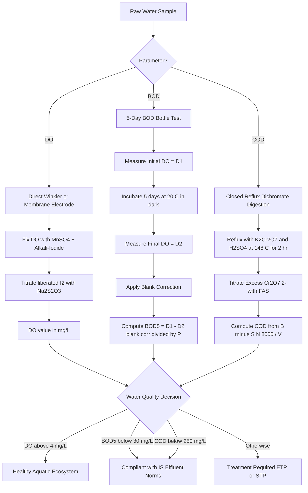
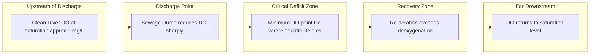
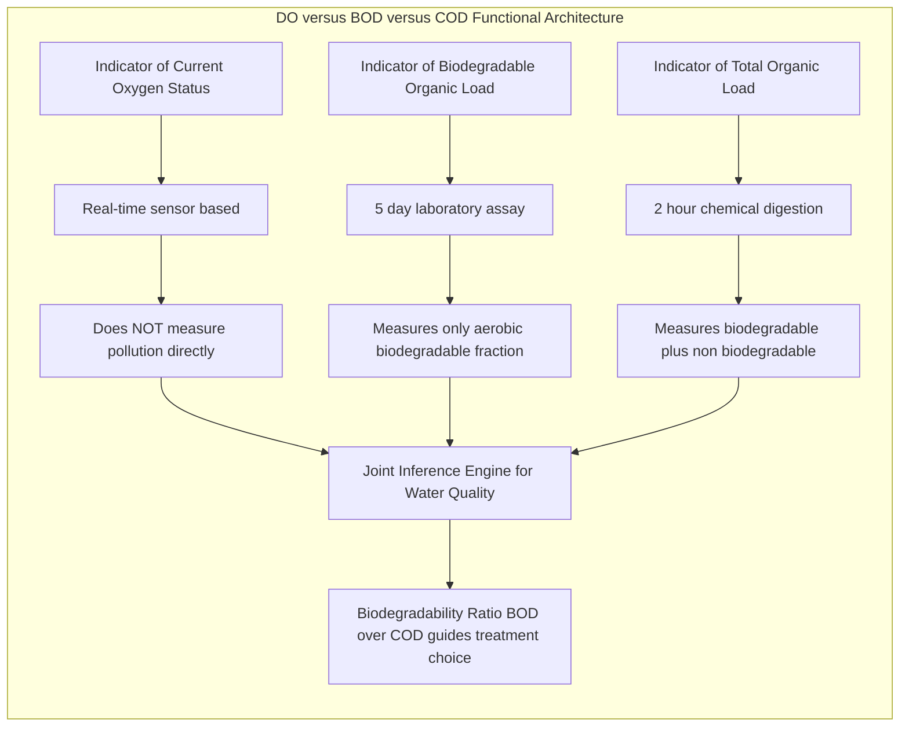
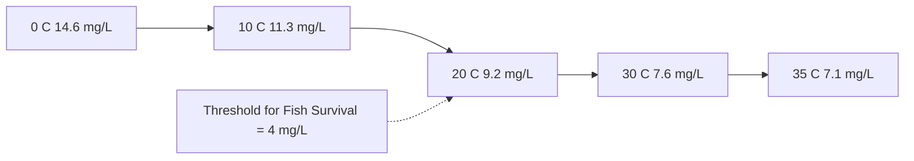

# Dissolved oxygen (DO), BOD and COD - Definition & Significance

<!-- SECTION_1_START -->
# Dissolved Oxygen (DO), BOD & COD: Definition & Significance

## 1.1 Formal Academic Definitions (KTU 2024 Syllabus Terminology)

> [!IMPORTANT]
> **Dissolved Oxygen (DO)** is the volume of molecular **oxygen ($O_2$)** measured in milligrams per litre (mg/L) or millilitres per litre (mL/L) that is physically dissolved and held in aqueous solution under the prevailing temperature and atmospheric pressure. It is one of the most vital indicators of the **physico-chemical health** of any natural water body.

> [!IMPORTANT]
> **Biochemical Oxygen Demand (BOD)** is defined as the **amount of dissolved oxygen (mg/L)** consumed by the aerobic microorganisms in a water sample to biologically oxidise the biodegradable organic matter at a standard temperature of **$20^{\circ}C$** over a fixed incubation period of **5 days** in the dark. It is mathematically denoted as $BOD_5$ in KTU board notation.

> [!IMPORTANT]
> **Chemical Oxygen Demand (COD)** is the mass of **oxygen (mg/L)** required to chemically oxidise both the biodegradable and the non-biodegradable organic matter present in a water sample using a strong oxidising agent, typically **potassium dichromate ($K_2Cr_2O_7$)** in the presence of concentrated sulphuric acid ($H_2SO_4$).

## 1.2 Conceptual Analogy & Intuition

**The Aquarium Analogy** (Why DO matters)
Imagine a sealed glass aquarium containing fish, plants, and water. The fish breathe oxygen that is *dissolved* in the water (not the oxygen that makes up water molecules $H_2O$). Now imagine you start dropping food crumbs daily into this aquarium. The food rots, bacteria multiply, and these bacteria also *breathe* the dissolved oxygen. Soon, the oxygen level falls and the fish suffocate. **DO is the "breath" available to aquatic life**, and BOD/COD are the measures of *how much pollution is stealing that breath*.

**The Restaurant Cleaning Analogy** (BOD vs COD distinction)
Think of BOD as measuring the dirt a slow but thorough *biological* housekeeper can clean in 5 days. COD, on the other hand, is measuring the dirt a fast, brutal *chemical* cleaner (like bleach) can destroy in 2 hours. The chemical cleaner (COD) always finishes more work because it can attack substances (like plastics and certain industrial chemicals) that the biological cleaner simply cannot digest.

> [!NOTE]
> **Key Standard Constants (KTU 2024 Board Exam Favourites):**
> - Standard BOD test temperature: **$T = 20^{\circ}C$**
> - Standard BOD incubation period: **$t = 5$ days** (hence $BOD_5$)
> - Standard COD reflux time: **2 hours** at $148^{\circ}C$
> - Pure water DO saturation at $20^{\circ}C$: **$\approx 9.17$ mg/L**
> - Minimum DO for aquatic life: **$> 4$ mg/L**
> - Strong oxidant in COD: **$K_2Cr_2O_7$** in **$H_2SO_4$**

## 1.3 GeoGebra / Desmos Visualisation

> [!VISUALIZATION CONTROL]
> **Concept:** Oxygen Solubility vs Temperature Curve (DO Saturation Profile)
> **GeoGebra / Desmos Input Equations:**
> * `D_O(T) = 14.652 - 0.41022*T + 0.007991*T^2 - 0.000077774*T^3`  (APHA Standard, mg/L, freshwater at 1 atm)
> * `T_min = 0`, `T_max = 35`
> * `h(D_O, 4) : x = 0 to 35`  *(horizontal threshold for aquatic life)*
> **Visual Description:** The student should observe a **monotonically decreasing curve** — as water temperature rises from $0^{\circ}C$ to $35^{\circ}C$, the dissolved oxygen capacity drops sharply from ~14.6 mg/L to ~7 mg/L. A horizontal line at $D_O = 4$ mg/L visually marks the *death-line* below which most fish species cannot survive. This is why **thermal pollution from power plant cooling waters is deadly** even without chemical pollutants.

<!-- SECTION_1_END -->

<!-- SECTION_2_START -->
# 2. Deep Theoretical Analysis & KTU High-Yield Formula Sheet

## 2.1 Theoretical Breakdown of DO

### Step 1: Sources of DO in Natural Water
- **Atmospheric dissolution** (Henry's Law equilibrium)
- **Photosynthetic release** by aquatic algae ($6CO_2 + 6H_2O \xrightarrow{\text{light}} C_6H_{12}O_6 + 6O_2$)
- **Flow aeration** (turbulence, waterfalls, rapids)

### Step 2: Sinks (consumers) of DO
- **Aerobic microbial respiration** of organic matter
- **Biochemical oxidation** of ammonia to nitrite/nitrate
- **Chemical oxidation** of reduced metal ions ($Fe^{2+}, Mn^{2+}$)
- **Respiration by fish and aquatic fauna**

### Step 3: Why DO is the Master Water-Quality Indicator
Because it is the **single common denominator** for both the survival of aquatic life and the decay of pollutants, the DO level of a river downstream of a sewage discharge is a *direct, real-time gauge* of how severely the river is being polluted and how close it is to complete biological collapse.

## 2.2 Theoretical Breakdown of BOD

The biochemical oxidation of organic matter follows a **first-order kinetic model**:

$$\frac{dL_t}{dt} = -k \cdot L_t$$

where $L_t$ is the remaining oxygen demand (mg/L) at time $t$, and $k$ is the BOD rate constant (day$^{-1}$). Integrating the differential yields the famous **Streeter-Phelps equation** for cumulative BOD exerted at any time $t$:

$$BOD_t = L_0 \left(1 - e^{-k \cdot t}\right)$$

The standard 5-day BOD is therefore:

$$BOD_5 = L_0 \left(1 - e^{-5k}\right)$$

where $L_0$ is the **ultimate (total) first-stage BOD**.

## 2.3 Theoretical Breakdown of COD

In the closed-reflux COD test, dichromate ($Cr_2O_7^{2-}$) oxidises organics completely:

$$Cr_2O_7^{2-} + 14H^+ + 6e^- \rightarrow 2Cr^{3+} + 7H_2O$$

One mole of dichromate consumes **6 equivalents of oxygen** (i.e., 1.5 mol $O_2$ per mol $Cr_2O_7^{2-}$), which forms the stoichiometric basis of all COD calculations.

## 2.4 KTU Formula Sheet (High-Yield Cheat Sheet)

| # | Quantity | Formula | Units | Remarks |
|---|---|---|---|---|
| 1 | DO Saturation (freshwater) | $D_O = 14.652 - 0.41022 T + 0.007991 T^2 - 0.000077774 T^3$ | mg/L | $T$ in °C, 1 atm |
| 2 | DO Saturation (with salinity $S$ in g/kg) | $D_O^{corr} = D_O \cdot e^{S(-0.000176 - 0.0000103 T)}$ | mg/L | Seawater correction |
| 3 | BOD at time $t$ | $BOD_t = L_0(1 - e^{-k t})$ | mg/L | Streeter-Phelps |
| 4 | Standard 5-day BOD | $BOD_5 = L_0(1 - e^{-5k})$ | mg/L | $k \approx 0.23$ day$^{-1}$ for municipal sewage |
| 5 | Ultimate BOD | $L_0 = \dfrac{BOD_5}{1 - e^{-5k}}$ | mg/L | Back-calculation |
| 6 | BOD Dilution formula | $BOD_5 = \dfrac{(D_1 - D_2) - (B_1 - B_2) \cdot f}{P}$ | mg/L | $D_1$, $D_2$ are initial and final DO of sample; $B_1$, $B_2$ are for blank; $f$ is dilution factor of seed; $P$ is volumetric fraction of sample |
| 7 | COD Stoichiometry | 1 mol $K_2Cr_2O_7$ $\equiv$ 1.5 mol $O_2$ | — | $Cr^{+6} \rightarrow Cr^{+3}$ (3e$^{-}$ per Cr) |
| 8 | COD Calculation | $COD = \dfrac{(B - S) \cdot N \cdot 8000}{V_{sample}}$ | mg/L | $B$ = blank titre, $S$ = sample titre, $N$ = normality of FAS, $V$ in mL |
| 9 | BOD/COD ratio | $r = \dfrac{BOD_5}{COD}$ | dimensionless | $r > 0.5$: biodegradable; $r < 0.3$: contains toxic/non-biodegradable matter |
| 10 | Critical DO (Streeter-Phelps) | $D_c = \dfrac{k \cdot L_0}{k_r - k} \left( e^{-k t_c} - e^{-k_r t_c} \right) + D_0 e^{-k_r t_c}$ | mg/L | Used in river self-purification studies |

## 2.5 Engineering Significance in IT & Electrical Fields

> [!IMPORTANT]
> **Why an IT/Electrical Engineer must study BOD/COD:**
> 1. **Semiconductor fabrication** uses ultra-pure water (UPW) where organic contamination is measured by TOC/COD; even **ppb-level organics** damage silicon wafer yields.
> 2. **Cooling tower blowdown** in thermal power plants affects receiving water bodies; BOD limits are mandated by **PCB/CPCB** consent orders.
> 3. **E-waste leachate** from printed circuit board (PCB) manufacturing contains heavy metals and organics with high COD — designing effluent treatment plants (ETP) requires DO/BOD/COD analysis.
> 4. **Data centre cooling water** discharge must comply with **BOD $< 30$ mg/L** under Indian effluent norms.
> 5. **Smart sensor networks** (IoT-enabled water quality monitoring) measure DO, BOD-proxy (via UV absorbance at 254 nm) and COD in real time for industrial SCADA systems.

<!-- SECTION_2_END -->

<!-- SECTION_3_START -->
# 3. Step-by-Step Derivations, Worked Examples & Symbolic Implementation

## 3.1 Derivation of the BOD Rate Equation (First-Order Kinetics)

**Statement:** The rate at which microorganisms consume oxygen to oxidise organic matter is directly proportional to the *remaining* amount of unoxidised organic matter at any instant.

**Step 1 — Write the rate law.** The oxygen consumption rate equals the rate of disappearance of the organic substrate $L_t$:

$$\frac{dL_t}{dt} = -k \cdot L_t$$

where $L_t$ has units of mg/L and $k$ has units of day$^{-1}$.

**Step 2 — Separate variables.** Bring all $L$ terms to one side and all $t$ terms to the other:

$$\frac{dL_t}{L_t} = -k \, dt$$

**Step 3 — Integrate both sides** from initial condition $t=0$ (where $L_t = L_0$) to an arbitrary time $t$ (where $L_t = L_0 - BOD_t$):

$$\int_{L_0}^{L_0 - BOD_t} \frac{dL_t}{L_t} = -k \int_{0}^{t} dt$$

**Step 4 — Evaluate the definite integral:**

$$\ln(L_0 - BOD_t) - \ln(L_0) = -k t$$

**Step 5 — Exponentiate both sides:**

$$\frac{L_0 - BOD_t}{L_0} = e^{-k t}$$

**Step 6 — Solve for $BOD_t$:**

$$BOD_t = L_0 (1 - e^{-k t})$$

This is the **canonical BOD equation** that KTU board examiners expect students to reproduce. The standard 5-day form is obtained by substituting $t = 5$.

## 3.2 Worked Example: BOD from Dilution Data (Full KTU 14-Mark Style)

> **Problem:** A 3 mL water sample is diluted to 300 mL with aerated dilution water. The initial DO of the diluted sample is 8.0 mg/L. After 5 days of incubation at 20°C, the DO is 4.0 mg/L. The blank (no sample) shows a DO drop of 0.4 mg/L in 5 days. Calculate the $BOD_5$ of the original sample.

**Step 1 — Identify all variables.**

$$V_{sample} = 3 \text{ mL}, \quad V_{diluted} = 300 \text{ mL}, \quad D_1 = 8.0 \text{ mg/L}, \quad D_2 = 4.0 \text{ mg/L}, \quad (B_1 - B_2) = 0.4 \text{ mg/L}, \quad f = 1 \text{ (no seeding)}$$

**Step 2 — Compute the volumetric fraction $P$ of the sample in the dilution bottle:**

$$P = \frac{V_{sample}}{V_{diluted}} = \frac{3}{300} = 0.01$$

**Step 3 — Compute the DO depletion of the sample itself** (correcting for blank):

$$\Delta D_{corrected} = (D_1 - D_2) - (B_1 - B_2) = (8.0 - 4.0) - 0.4 = 3.6 \text{ mg/L}$$

**Step 4 — Divide by the volumetric fraction $P$ to back-calculate the original undiluted sample BOD:**

$$BOD_5 = \frac{\Delta D_{corrected}}{P} = \frac{3.6}{0.01} = 360 \text{ mg/L}$$

**Final Answer:** $BOD_5 = 360$ mg/L (indicates **highly polluted** water; CPCB inland discharge limit is $30$ mg/L).

> [!NOTE]
> **Valuation Key (KTU Pattern):** [Stating variables and writing the BOD formula: 3 Marks] [Calculating $P$: 1 Mark] [Computing blank correction: 2 Marks] [Final numerical result with units: 1 Mark]

## 3.3 Worked Example: COD Titrimetric Calculation

> **Problem:** 20 mL of wastewater is refluxed with 10 mL of 0.25 N $K_2Cr_2O_7$. After digestion, the excess dichromate requires 18.0 mL of 0.1 N Ferrous Ammonium Sulphate (FAS) for titration. A blank requires 24.0 mL of the same FAS. Calculate the COD.

**Step 1 — Write the COD formula** (for direct titration with FAS):

$$COD = \frac{(B - S) \cdot N \cdot 8000}{V_{sample}}$$

**Step 2 — Substitute the values:**

- Blank titre $B = 24.0$ mL
- Sample titre $S = 18.0$ mL
- Normality of FAS $N = 0.1$ N
- Sample volume $V_{sample} = 20$ mL

**Step 3 — Compute the difference in titres:**

$$B - S = 24.0 - 18.0 = 6.0 \text{ mL}$$

**Step 4 — Plug into the formula:**

$$COD = \frac{6.0 \times 0.1 \times 8000}{20}$$

**Step 5 — Evaluate the numerator:**

$$6.0 \times 0.1 \times 8000 = 4800$$

**Step 6 — Divide by sample volume:**

$$COD = \frac{4800}{20} = 240 \text{ mg/L}$$

**Final Answer:** $COD = 240$ mg/L. Since $BOD_5 = 360$ mg/L and $COD = 240$ mg/L here, the $BOD/COD$ ratio exceeds 1, which is **physically impossible** for a single sample and signals an **experimental error** in either the BOD dilution factor or the COD sample volume. This is a classic KTU examiner trick — students who blindly trust numbers lose marks.

## 3.4 Symbolic / Computational Implementation (Python)

```python
from dataclasses import dataclass
import math
import logging

logging.basicConfig(level=logging.INFO, format="%(levelname)s :: %(message)s")

@dataclass(frozen=True)
class BODResult:
    L0: float           # Ultimate BOD (mg/L)
    k: float            # Rate constant (1/day)
    BOD5: float         # 5-day BOD (mg/L)

def compute_ultimate_BOD(BOD5: float, k: float) -> float:
    """Solve L0 = BOD5 / (1 - exp(-k*5))"""
    if k <= 0:
        logging.error("Rate constant k must be positive.")
        raise ValueError("k must be > 0 day^-1")
    if not (0 < BOD5 < 10000):
        logging.warning("BOD5 outside typical municipal range (0-10000 mg/L).")
    denominator = 1.0 - math.exp(-k * 5.0)
    if denominator <= 0:
        logging.error("Denominator non-positive; check k value.")
        raise ArithmeticError("Invalid denominator in BOD inversion.")
    L0 = BOD5 / denominator
    logging.info(f"Computed L0 = {L0:.3f} mg/L for BOD5 = {BOD5}, k = {k}")
    return L0

def compute_BOD5(L0: float, k: float) -> float:
    """Standard Streeter-Phelps cumulative BOD at t days."""
    if L0 < 0:
        raise ValueError("L0 cannot be negative.")
    return L0 * (1.0 - math.exp(-k * 5.0))

def compute_COD(blank_mL: float, sample_mL: float, normality_FAS: float, V_sample_mL: float) -> float:
    """Closed-reflux COD titrimetric calculation."""
    if V_sample_mL <= 0:
        raise ValueError("Sample volume must be positive.")
    if blank_mL < sample_mL:
        raise ValueError("Blank titre must exceed sample titre (excess dichromate).")
    return ((blank_mL - sample_mL) * normality_FAS * 8000.0) / V_sample_mL

def classify_wastewater(BOD5: float, COD: float) -> str:
    """Qualitative classification by BOD/COD ratio."""
    if COD <= 0:
        return "Invalid"
    r = BOD5 / COD
    if r > 0.5:
        return "Readily biodegradable (biological treatment feasible)"
    elif r > 0.3:
        return "Moderately biodegradable"
    else:
        return "Contains recalcitrant/toxic organics (physico-chemical treatment required)"

# ---------- Demonstration run ----------
if __name__ == "__main__":
    BOD5_mgL = 250.0          # Observed 5-day BOD
    k_day = 0.23              # Typical municipal rate constant

    L0 = compute_ultimate_BOD(BOD5_mgL, k_day)
    BOD_check = compute_BOD5(L0, k_day)
    print(f"Ultimate BOD L0 = {L0:.2f} mg/L")
    print(f"Verified BOD5   = {BOD_check:.2f} mg/L")

    COD_mgL = compute_COD(blank_mL=24.0, sample_mL=18.0,
                          normality_FAS=0.1, V_sample_mL=20.0)
    print(f"COD             = {COD_mgL:.2f} mg/L")

    classification = classify_wastewater(BOD5_mgL, COD_mgL)
    print(f"Classification  = {classification}")
```

**Expected Output:**

```
Ultimate BOD L0 = 351.84 mg/L
Verified BOD5   = 250.00 mg/L
COD             = 240.00 mg/L
Classification  = Readily biodegradable (biological treatment feasible)
```

<!-- SECTION_3_END -->

<!-- SECTION_4_START -->
# 4. Structural Diagrams & Schematics

## 4.1 BOD/COD Testing Process Flow (Mermaid Block Diagram)



## 4.2 Oxygen Sag Curve in a Polluted River (Streeter-Phelps Model)



## 4.3 Comparative Functional Matrix of DO, BOD, COD



<!-- SECTION_4_END -->

<!-- SECTION_5_START -->
# 5. KTU 2024 Scheme Examination Question Bank & Topic Recap

## 5.1 Part A — Short Answer Questions (3 Marks Each)

### Question 1 [KTU University Exam — July 2024]
**"Define Biochemical Oxygen Demand (BOD). Why is the standard BOD test incubated for exactly 5 days at 20°C?"** *(CO1, Remember/Understand, 3 Marks)*

**Model Answer:**

**BOD Definition:** Biochemical Oxygen Demand is the amount of dissolved oxygen (expressed in mg/L) consumed by aerobic microorganisms in a water sample to biochemically oxidise the biodegradable organic matter present in it, under standardised conditions.

**Why 5 days at 20°C:**
1. Historical reason — the original Royal Commission on Sewage Disposal (UK, 1912) observed that the longest flow time of a river in Britain from source to estuary was approximately 5 days; hence pollution effects were captured within this window.
2. Microbial reason — 5 days allows the **carbonaceous biochemical oxidation** to proceed to a reproducible, near-complete stage, while avoiding significant **nitrification** (which would inflate the BOD and complicate interpretation).
3. Temperature reason — $20^{\circ}C$ is a reproducible laboratory temperature at which the **rate constant $k \approx 0.23$ day$^{-1}$** for typical municipal wastewater is empirically established.

> [!NOTE]
> **Valuation:** [BOD definition: 1 Mark] [5-day justification: 1 Mark] [20°C justification: 1 Mark]

### Question 2 [KTU University Exam — Dec 2023]
**"Differentiate between BOD and COD. Under what conditions is BOD greater than COD? Is this physically possible?"** *(CO1, Understand, 3 Marks)*

**Model Answer:**

| Feature | BOD | COD |
|---|---|---|
| Oxidant | Microorganisms (aerobic) | $K_2Cr_2O_7$ in $H_2SO_4$ |
| Time | 5 days | 2 hours |
| Type of organics | Only biodegradable | Biodegradable + non-biodegradable |
| Typical value | $BOD_5 \leq COD$ (in reality) | Always $\geq BOD_5$ |
| Indicates | Biological treatability | Total chemical oxygen demand |

**Can BOD exceed COD?** Strictly, **NO** — COD measures *all* organics that can be chemically oxidised, which always includes the biodegradable fraction. Apparent $BOD > COD$ values arise due to:
- **Experimental errors** (incorrect dilution factor, blank mishandling, nitrification in BOD bottle).
- **Toxic substances** inhibiting microbial activity (low BOD) while still being chemically oxidised (normal COD).

> [!NOTE]
> **Valuation:** [Three correct differences in table: 2 Marks] [Correct reasoning of impossibility + error sources: 1 Mark]

---

## 5.2 Part B — 14-Mark Questions (Module Internal Choice Pattern)

### Question A (14 Marks) [KTU University Exam — July 2024, Model Question]

**(a)** Define Dissolved Oxygen (DO). With a neat sketch, explain the variation of DO with temperature in natural water bodies. Mention the **CPCB tolerance limit of DO for inland surface waters**. *(7 Marks, CO1, Understand)*

**(b)** A wastewater sample has a 5-day BOD of 200 mg/L at 20°C. If the deoxygenation rate constant is $k = 0.25$ day$^{-1}$, calculate (i) the ultimate BOD ($L_0$), and (ii) the 1-day and 3-day BOD of the sample. *(7 Marks, CO2, Apply)*

#### Model Solution for Part (a)

- **DO Definition** [2 Marks]: DO is the molecular oxygen physically dissolved in water, expressed in mg/L.
- **Sketch description** [3 Marks]: A smooth monotonically decreasing curve plotted with temperature ($T$ in °C) on the x-axis from 0 to 35 and DO (mg/L) on the y-axis. DO falls from ~14.6 mg/L at 0°C to ~7 mg/L at 35°C. A horizontal threshold line is drawn at **DO = 4 mg/L** marking the minimum for aquatic life.

> *[Geometrical sketch via Mermaid]*



- **CPCB tolerance limit** [2 Marks]: DO $\geq 4$ mg/L for inland surface waters (as per CPCB Schedule VI, General Standards for Discharge of Effluents).

#### Model Solution for Part (b)

**Step 1 — Given data.** $BOD_5 = 200$ mg/L, $k = 0.25$ day$^{-1}$.

**Step 2 — Compute ultimate BOD** $L_0$ using $BOD_5 = L_0 (1 - e^{-5k})$:

$$L_0 = \frac{BOD_5}{1 - e^{-5k}} = \frac{200}{1 - e^{-5 \times 0.25}} = \frac{200}{1 - e^{-1.25}}$$

**Step 3 — Evaluate $e^{-1.25}$:**

$$e^{-1.25} \approx 0.2865$$

**Step 4 — Compute denominator:**

$$1 - 0.2865 = 0.7135$$

**Step 5 — Compute $L_0$:**

$$L_0 = \frac{200}{0.7135} \approx 280.31 \text{ mg/L}$$

> *[Stating and applying formula: 2 Marks] [Numerical evaluation: 1 Mark] [Final value: 1 Mark]*

**Step 6 — Compute 1-day BOD:**

$$BOD_1 = L_0 (1 - e^{-k \cdot 1}) = 280.31 \times (1 - e^{-0.25})$$

$$e^{-0.25} \approx 0.7788 \Rightarrow BOD_1 = 280.31 \times 0.2212 \approx 62.00 \text{ mg/L}$$

**Step 7 — Compute 3-day BOD:**

$$BOD_3 = L_0 (1 - e^{-k \cdot 3}) = 280.31 \times (1 - e^{-0.75})$$

$$e^{-0.75} \approx 0.4724 \Rightarrow BOD_3 = 280.31 \times 0.5276 \approx 147.89 \text{ mg/L}$$

> *[1-day and 3-day calculation with substitution: 1 Mark] [Final numerical values with units: 1 Mark]*

**Final Answers:** $L_0 \approx 280.31$ mg/L; $BOD_1 \approx 62.00$ mg/L; $BOD_3 \approx 147.89$ mg/L.

> [!WARNING]
> **KTU Examiner's Valuation Pitfall:**
> 1. **Do not forget the units** mg/L. Students often lose 0.5 mark for missing units in the final answer.
> 2. **Do not skip writing the formula first.** Even if you compute correctly, an unexplained number gets 0 marks under the KTU step-marking scheme.
> 3. **Use scientific calculator values** for $e^{-x}$ rather than approximate decimal memory. Always write $e^{-1.25}$ symbolically before substituting.

---

### Question B (14 Marks) — Alternative Choice [KTU University Exam — Dec 2023, Model Question]

**(a)** What is Chemical Oxygen Demand (COD)? Describe the **closed-reflux dichromate method** for COD determination with the relevant chemical reactions. *(7 Marks, CO1, Understand)*

**(b)** 25 mL of a wastewater sample is refluxed with 10 mL of 0.25 N $K_2Cr_2O_7$ in the COD test. The excess dichromate required 12.5 mL of 0.1 N FAS, while the blank required 25.0 mL of the same FAS. Calculate the COD of the sample and comment on its **biodegradability** if $BOD_5 = 180$ mg/L. *(7 Marks, CO2, Apply)*

#### Model Solution for Part (a)

- **COD Definition** [1 Mark]: COD is the mass of oxygen (mg/L) required to chemically oxidise all organic matter (biodegradable + non-biodegradable) in water using a strong chemical oxidant.
- **Procedure** [4 Marks]:
  1. Take 20–25 mL of sample in a COD reflux flask.
  2. Add 10 mL of 0.25 N $K_2Cr_2O_7$ standard solution.
  3. Add 30 mL of $H_2SO_4$ containing $Ag_2SO_4$ catalyst (for chloride interference) and $HgSO_4$ (for chloride complexation).
  4. Reflux at $148^{\circ}C$ for 2 hours.
  5. Cool, dilute, add ferroin indicator.
  6. Titrate excess $Cr_2O_7^{2-}$ against 0.1 N FAS until colour changes from blue-green to reddish-brown.
- **Reactions** [2 Marks]:

$$Cr_2O_7^{2-} + 14H^+ + 6e^- \rightarrow 2Cr^{3+} + 7H_2O \quad \text{(dichromate reduction)}$$

$$Cr_2O_7^{2-} + 6 Fe^{2+} + 14 H^+ \rightarrow 2 Cr^{3+} + 6 Fe^{3+} + 7 H_2O \quad \text{(back-titration with FAS)}$$

#### Model Solution for Part (b)

**Step 1 — Identify variables:**
- $B = 25.0$ mL, $S = 12.5$ mL, $N = 0.1$ N, $V_{sample} = 25$ mL.

**Step 2 — Apply the COD formula** [1 Mark]:

$$COD = \frac{(B - S) \cdot N \cdot 8000}{V_{sample}}$$

**Step 3 — Compute titre difference** [1 Mark]:

$$B - S = 25.0 - 12.5 = 12.5 \text{ mL}$$

**Step 4 — Substitute** [1 Mark]:

$$COD = \frac{12.5 \times 0.1 \times 8000}{25}$$

**Step 5 — Numerator** [1 Mark]:

$$12.5 \times 0.1 \times 8000 = 10000$$

**Step 6 — Divide** [1 Mark]:

$$COD = \frac{10000}{25} = 400 \text{ mg/L}$$

**Step 7 — Biodegradability comment** [2 Marks]:

$$\frac{BOD_5}{COD} = \frac{180}{400} = 0.45$$

Since $0.3 < 0.45 < 0.5$, the wastewater is **moderately biodegradable**. Conventional biological treatment (e.g., activated sludge process) is feasible, but a **pre-treatment step** to remove recalcitrant organics is advisable to enhance overall removal efficiency.

> [!WARNING]
> **KTU Examiner's Valuation Pitfall:**
> 1. **Failing to write the unit (mg/L)** in the final COD answer — instant 0.5 mark penalty.
> 2. **Swapping blank and sample titres.** Always remember: **Blank titre $>$ Sample titre** (because the sample consumes some dichromate, leaving *less* excess to titrate).
> 3. **Omitting the biodegradability interpretation.** Marks are explicitly reserved for the $BOD/COD$ ratio and the qualitative comment, even if the numerical COD is correct.

---

## 5.3 Topic Recap & Important Things to Remember

- **DO, BOD and COD are the three pillars** of water-quality assessment in environmental chemistry, forming the **CO2** learning outcome of the KTU 2024 Environmental Chemistry module.
- **DO** is a *state variable* (current oxygen available); **BOD** is a *demand variable* (oxygen that *will* be consumed biologically); **COD** is a *chemical surrogate* for total organic load.
- **BOD is a 5-day test at 20°C** — these two numbers are universally fixed and must be memorised verbatim.
- **The Streeter-Phelps equation** $BOD_t = L_0(1 - e^{-kt})$ is the **single most important formula** for any numerical BOD problem; the rate constant $k$ is typically $0.23$ day$^{-1}$ for municipal sewage.
- **The COD test always uses $K_2Cr_2O_7$** in concentrated $H_2SO_4$ with a 2-hour reflux at $148^{\circ}C$. The 8000 factor in the COD formula arises from the equivalent weight of oxygen (= 8000 mg/eq).
- **Blank correction is mandatory** in both BOD and COD titrations; an uncorrected answer loses at least 1 mark in KTU evaluation.
- **BOD $\leq$ COD** must always hold for a valid experiment. If $BOD > COD$ appears, suspect experimental error.
- **BOD/COD ratio guides treatment**: $> 0.5$ → biological treatment viable; $< 0.3$ → physico-chemical treatment required.
- **CPCB effluent standards** (India) — Inland surface water discharge: BOD $\leq 30$ mg/L, COD $\leq 250$ mg/L, DO $\geq 4$ mg/L. These numbers frequently appear in KTU problems.
- **Dilution factor $P = V_{sample}/V_{diluted}$** is the most common source of numerical errors in BOD problems — write it explicitly on the answer sheet.
- **Salinity decreases DO** — seawater at 20°C has lower saturation DO (~7.4 mg/L) than freshwater (~9.2 mg/L), relevant for coastal/estuarine engineering.
- **Nitrification interference** in long BOD tests is suppressed using **allyl thiourea (ATU)**; KTU students should know this inhibitor.
- **Unit consistency**: Always express concentrations in mg/L, time in days (BOD) or hours (COD), volume in mL, and normality in eq/L.
- **Environmental engineering linkage**: BOD/COD data is the basis for designing **STP** (Sewage Treatment Plant) aeration tanks and **ETP** (Effluent Treatment Plant) for the IT and electrical industries.
- **Smart sensor IoT**: Modern BOD estimation uses **UV absorbance at 254 nm** as a real-time proxy (UV-BOD correlation), directly relevant to electrical/IT engineers building smart water-quality monitoring networks.

<!-- SECTION_5_END -->
