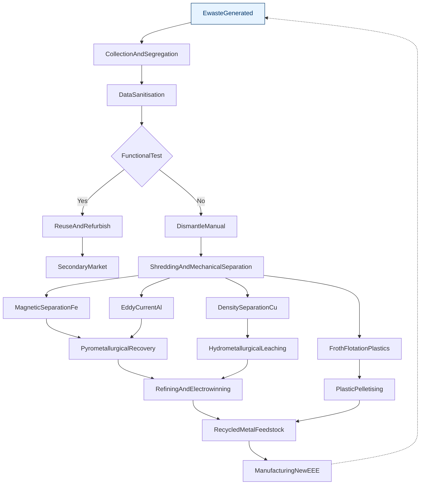
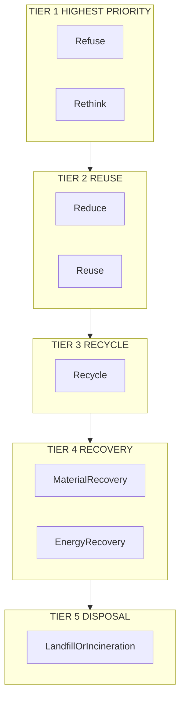
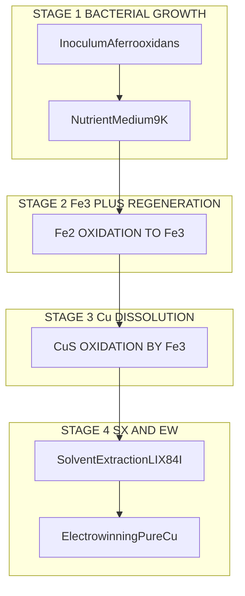
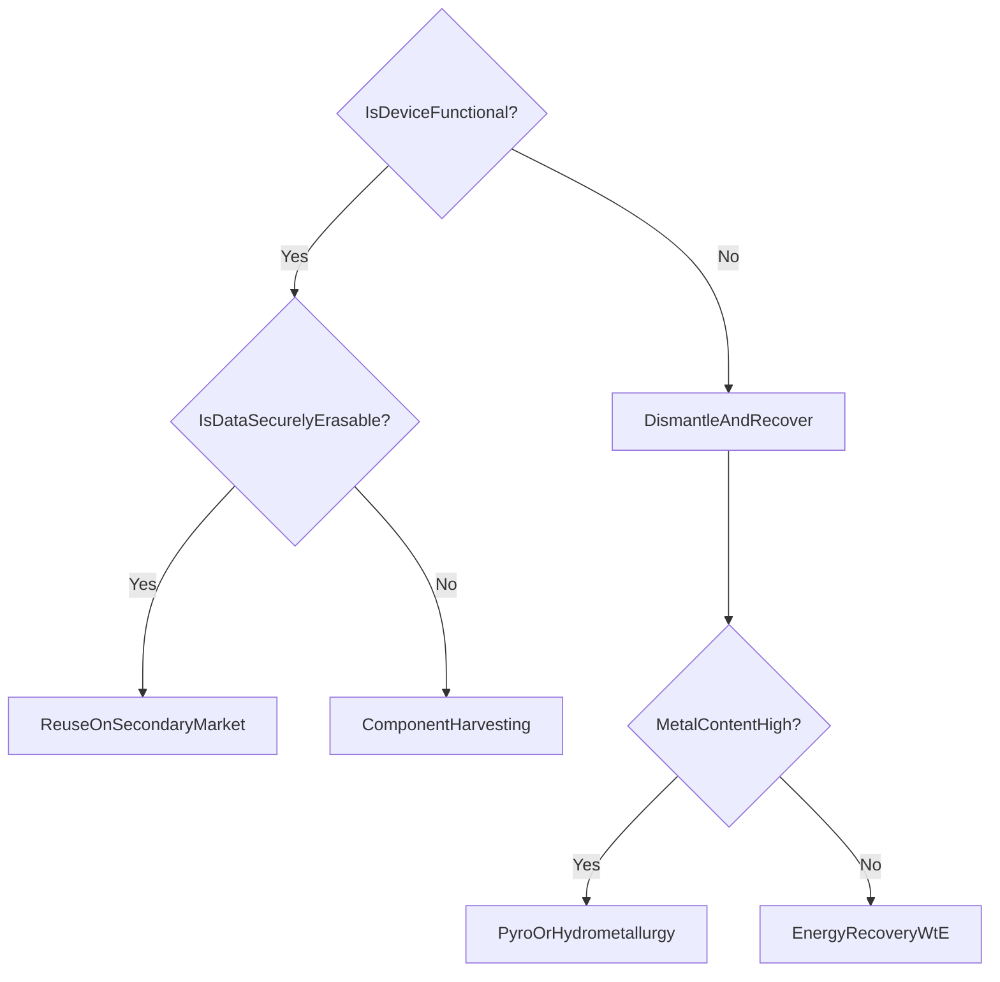

# E Waste methods of disposal – recycle, recovery and reuse

<!-- SECTION_1_START -->
# E-Waste Methods of Disposal: Recycle, Recovery, and Reuse

## 1.1 Core Technical Definition

> [!NOTE]
> **E-Waste (Waste Electrical and Electronic Equipment – WEEE):** Any discarded electrical or electronic equipment (EEE) whose owner has discarded it as a waste, or intends to discard it, without intending to reuse or recover it. It encompasses a heterogeneous mixture of materials including **base metals** (Cu, Al, Fe, Zn, Pb), **precious metals** (Au, Ag, Pt, Pd), **rare earth elements** (Nd, La, Ce), **hazardous substances** (Pb, Cd, Hg, Cr(VI), PBB, PBDE), glass, plastics, and ceramics.

The three principal **end-of-life (EoL)** management strategies for e-waste are:

| Strategy | Formal Definition (KTU 2024 Terminology) |
| :--- | :--- |
| **Reuse** | Direct re-employment of a discarded EEE device or its sub-assembly in its original function, with or without minor repair/cleaning, without altering its identity. |
| **Recovery** | Extraction of valuable materials (metals, energy) from waste through physical, chemical, thermal, or biological processes. Includes **material recovery** and **energy recovery**. |
| **Recycle** | Reprocessing of recovered materials into new raw materials or products, often involving transformation at the molecular/metallurgical level (smelting, refining, re-alloying). |

> [!IMPORTANT]
> **Hierarchy of E-Waste Management (as per the 2024 Scheme & Indian E-Waste Management Rules 2022):** *Refuse → Rethink → Reduce → Reuse → Recycle → Recovery → Disposal*. Reuse sits at a higher priority than recycling and recovery because it demands the lowest embodied energy and carbon footprint.

---

## 1.2 Conceptual Analogy / Intuition

Imagine a **dismantled smartphone as a "miniature ore mine"**:

- The phone is the **ore body**.
- The circuit board is the **rich vein** — a tonne of used mobile-phone PCBs typically contains more **gold** (≈ 200–350 g/t) than a tonne of primary gold ore mined from the earth (≈ 1–5 g/t).
- **Reuse** is like taking the entire phone, replacing the cracked screen, and giving it to a cousin — the "ore body" is *not crushed*.
- **Recovery** is like *crushing the rock and chemically dissolving the gold vein* — we extract the metal of interest, but discard the rock dust.
- **Recycle** is like *smelting the dissolved gold into a fresh gold bar*, which can then be cut and shaped into new jewellery.

> [!TIP]
> **Memory Trick:** **R**euse (no shape change) → **R**ecovery (extract value) → **R**ecyle (transform into raw material). The "**3 R's**" also follow the principle of *decreasing object integrity* and *increasing processing energy demand*.

---

## 1.3 Critical Physical Constants & Metrics

| Metric | Standard Value | Source |
| :--- | :--- | :--- |
| Global e-waste generated (2022) | **62 million tonnes** | UN Global E-waste Monitor 2024 |
| Annual growth rate of e-waste | **≈ 3–4 %** | UN-GEM 2024 |
| Documented formal recycling rate (global) | **22.3 %** | UN-GEM 2024 |
| Target recycling rate (India, EWM Rules 2022) | **70 %** of e-waste generated | MoEFCC Notification, GSR 459(E) |
| Concentration of Au in mobile PCBs | **200–350 g/t** | Cui & Zhang, *Waste Management*, 2008 |
| Concentration of Cu in PCBs | **≈ 20–27 %** | Industry datasheets |
| Standard toxicity threshold for Pb | **> 1000 ppm** (RoHS) | EU Directive 2011/65/EU |

> [!VISUALIZATION CONTROL]
> **Concept:** E-Waste Hierarchy Pyramid (5R Model)
> **GeoGebra / Desmos Input Equations (parametric sketch of an inverted pyramid):**
> * Bottom vertex: $V_{1} = (0, 0)$ — *Disposal* (largest volume, lowest value)
> * Mid-base: $V_{2} = (\pm 4, 4)$ — *Recovery / Recycle*
> * Top vertex: $V_{3} = (0, 8)$ — *Refuse / Reuse* (smallest volume, highest value)
> **Visual Description:** A vertical pyramid plotted on the y-axis (priority) and x-axis (priority spread). Students should observe the *narrowing volume* as we move *upwards*, representing diminishing waste volume and rising material value.
<!-- SECTION_1_END -->

<!-- SECTION_2_START -->
# Deep Theoretical Analysis & KTU High-Yield Formula Sheet

## 2.1 Method 1 – REUSE (The Highest-Tier Option)

### 2.1.1 Operational Logic
1. **Collection** of end-of-life (EoL) devices from consumers or businesses.
2. **Visual triage & data sanitisation** (GDPR/IT Act 2000 compliant wiping).
3. **Diagnostic testing** of components (RAM, SSD, battery health).
4. **Minor repair / refurbishment** — replacing screens, keyboards, capacitors.
5. **Quality check (QC) and grading** — A-grade (resale), B-grade (secondary market), C-grade (parts harvesting).
6. **Redistribution** to secondary users (students, rural schools, low-income groups).

### 2.1.2 Advantages
- **Lowest embodied energy** — no smelting, no chemical leaching.
- **Carbon avoidance** ≈ 70–80 % vs. manufacturing a new unit.
- **Social upliftment** through digital inclusion.

### 2.1.3 Limitations
- **Planned obsolescence** in modern devices.
- **Software/Hardware incompatibility** for older EEE.
- **Data-security risk** if sanitisation is incomplete.

---

## 2.2 Method 2 – RECOVERY (Extraction of Material & Energy Value)

Recovery is the *extraction* step. It is subdivided into three engineering branches:

### 2.2.1 Pyrometallurgical Recovery (Smelting)
High-temperature oxidation-reduction of metallic fractions in furnaces (1100–1400 °C).

- **Inputs:** Shredded PCBs, cables, Cu-rich fractions.
- **Outputs:** Cu matte, Au-Ag doré beads, slag (silicates), flue dust (recovered for Zn, Pb, In).
- **Key Reaction (Cu smelting):**

$$
2\,\text{Cu}_{2}\text{S}_{(s)} + 3\,\text{O}_{2(g)} \xrightarrow{\Delta} \ 2\,\text{Cu}_{2}\text{O}_{(s)} + 2\,\text{SO}_{2(g)}
$$

followed by

$$
\text{Cu}_{2}\text{S}_{(s)} + 2\,\text{Cu}_{2}\text{O}_{(s)} \longrightarrow 6\,\text{Cu}_{(l)} + \text{SO}_{2(g)}
$$

### 2.2.2 Hydrometallurgical Recovery (Leaching)
Selective dissolution of target metals using aqueous reagents (acids, cyanides, thiosulfates, aqua regia).

- **Typical Lixiviants:** $\text{H}_{2}\text{SO}_{4}$, $\text{HNO}_{3}$, *aqua regia* ($\text{HCl}:\text{HNO}_{3} = 3:1$), thiourea $(\text{NH}_{2})_{2}\text{CS}$, thiosulfate $\text{S}_{2}\text{O}_{3}^{2-}$.
- **Representative Reaction (Cu leaching with $\text{H}_{2}\text{SO}_{4}$ + oxidant):**

$$
\text{Cu}_{(s)} + 2\,\text{H}_{2}\text{SO}_{4(aq)} + \tfrac{1}{2}\,\text{O}_{2(g)} \longrightarrow \text{CuSO}_{4(aq)} + 2\,\text{H}_{2}\text{O}_{(l)} + \text{SO}_{2(g)}
$$

- **Downstream:** Solvent Extraction (SX) → Electrowinning (EW) → Pure Cu cathode.

### 2.2.3 Bio-Hydrometallurgical Recovery (Bioleaching)
Use of **chemolithoautotrophic bacteria** (*Acidithiobacillus ferrooxidans*, *A. thiooxidans*) to oxidise sulphidic matrices and release metals.

- **Key reaction (bacterial Fe$^{2+}$ oxidation):**

$$
4\,\text{Fe}^{2+}_{(aq)} + \text{O}_{2(g)} + 4\,\text{H}^{+}_{(aq)} \xrightarrow{\text{bacteria}} 4\,\text{Fe}^{3+}_{(aq)} + 2\,\text{H}_{2}\text{O}_{(l)}
$$

- The regenerated $\text{Fe}^{3+}$ is the actual leaching agent:

$$
\text{Cu}_{(s)} + 2\,\text{Fe}^{3+}_{(aq)} \longrightarrow \text{Cu}^{2+}_{(aq)} + 2\,\text{Fe}^{2+}_{(aq)}
$$

### 2.2.4 Energy Recovery (Waste-to-Energy, WtE)
Incineration of non-recyclable plastic fractions (≤ 30 % halogenated) in **Mass-Burn** or **Refuse-Derived Fuel (RDF)** plants.

- **Calorific value of mixed e-plastic:** ≈ 25–40 MJ/kg.
- **Energy recovery efficiency** (Rankine cycle plant): ≈ 25–35 % electrical, 60–80 % combined heat & power (CHP).

---

## 2.3 Method 3 – RECYCLE (Transformation into New Feedstock)

### 2.3.1 Mechanical Recycling of Plastics
1. Sorting (Froth flotation, NIR spectroscopy).
2. Shredding into flakes (≤ 5 mm).
3. Washing & density separation (sink-float in water at $\rho = 1 \ \text{g/cm}^{3}$).
4. Extrusion into pellets for injection moulding.

### 2.3.2 Closed-Loop Metal Recycling
Recovered Cu, Al, Au are returned to **smelters/refineries** and re-enter the production chain with **≥ 95 %** of the original material quality.

---

## 2.4 Real-World Engineering Utility

| Application Domain | Why E-Waste Methods Matter |
| :--- | :--- |
| **Semiconductor Industry** | Recovery of high-purity Au, Pt-group metals, and rare earths (Nd, Dy) for chip fabrication. |
| **EV & Battery Sector** | Recycling Li, Co, Ni from spent Li-ion batteries to secure critical mineral supply. |
| **Renewable Energy (Solar PV)** | Recovery of Ag, Si, and Te from end-of-life PV modules. |
| **Defense & Aerospace** | Recovery of strategic metals (Ta, Nb, W) from obsolete electronics. |
| **Sustainable Manufacturing** | Compliance with **Extended Producer Responsibility (EPR)** and **RoHS** directives. |

---

## 2.5 KTU High-Yield Formula Sheet

> [!IMPORTANT]
> All formulas below are **board-exam favourites** for the 14-mark derivations in Module 4.

| # | Formula | Description / Engineering Use |
| :-: | :--- | :--- |
| 1 | $\eta_{\text{recovery}} = \dfrac{m_{\text{recovered}}}{m_{\text{input}}} \times 100\ \%$ | **Recovery efficiency** — universally tested; used in PCBs, batteries, catalysts. |
| 2 | $R_{\text{partition}} = \dfrac{C_{s}}{C_{l}}$ | **Partition coefficient** between solid (s) and leach liquor (l) for hydrometallurgy. |
| 3 | $C_{\text{eq}} = \dfrac{C_{0}\,V_{0}}{V_{0} + K_{d}\,m_{\text{solid}}}$ | **Equilibrium concentration** after sorption / adsorption of metal ions. |
| 4 | $\text{EEF} = \dfrac{\text{CO}_{2}^{\text{recycled}}}{\text{CO}_{2}^{\text{virgin}}}$ | **Embodied Energy Factor (EEF)** — measures climate-friendliness of recycled material. |
| 5 | $\eta_{\text{WtE}} = \dfrac{E_{\text{electrical}} + E_{\text{thermal}}}{m_{\text{waste}} \times \text{CV}}$ | **Energy recovery efficiency** of a Waste-to-Energy plant. |
| 6 | $Y_{\text{biomass}} = \dfrac{m_{\text{biomass}}}{m_{\text{metabolite}}}$ | **Bacterial yield coefficient** in bioleaching kinetics. |
| 7 | $\text{SMM} = \sum_{i=1}^{n} \left( m_{i} \times \rho_{i}^{-1} \right)$ | **Specific Mass Matrix** — material balance in shredding/separation. |
| 8 | $N_{\text{RoHS}} = \dfrac{\sum_{i \in \text{tox}} m_{i}}{m_{\text{total}}} \times 10^{6}$ | **RoHS mass fraction (ppm)** for Pb, Cd, Hg, Cr(VI), PBB, PBDE. |
| 9 | $\Delta G^{\circ} = -R\,T\,\ln K$ | **Thermodynamic driving force** for pyrometallurgical reactions. |
| 10 | $E^{\circ}_{\text{cell}} = E^{\circ}_{\text{cathode}} - E^{\circ}_{\text{anode}}$ | **Electrowinning cell potential** in Cu / Zn / Au recovery. |

> [!WARNING]
> **Absolute Value Notation:** In a derivation, write the magnitude of an EMF as $\vert E^{\circ}_{\text{cell}} \vert$ — never use the vertical bar `|` inside markdown table cells or Mermaid labels, as it breaks the table syntax. Use `\vert` or `\mid` instead.

---

## 2.6 Comparative Decision Matrix (Reuse vs. Recycle vs. Recovery)

| Parameter | **Reuse** | **Recovery** | **Recycle** |
| :--- | :--- | :--- | :--- |
| **Energy Input** | Very low | Medium–High | Medium |
| **CO$_{2}$ Footprint** | ≈ 0.2× virgin | ≈ 0.4–0.6× virgin | ≈ 0.5–0.7× virgin |
| **Material Purity** | 100 % (retained) | 90–99.9 % (after refining) | 95–99.9 % (after re-alloying) |
| **Capital Cost** | Low | Very High | High |
| **Toxic Residues** | None | High (slag, leachates) | Medium |
| **Social Impact** | High (digital inclusion) | Low | Medium (jobs in dismantling) |
| **KTU Priority Rank** | 1 (Highest) | 3 (Lowest among R's) | 2 |
<!-- SECTION_2_END -->

<!-- SECTION_3_START -->
# Step-by-Step Derivations, Calculations & Symbolic/Python Implementation

## 3.1 Worked Derivation – Recovery Efficiency of Gold from Waste PCBs

A batch of **5.00 kg** of shredded printed circuit boards (PCBs) is processed by a two-stage hydrometallurgical route. The following data is collected:

| Stage | Description | Mass of Au obtained (g) |
| :-: | :--- | :-: |
| Stage 1: Aqua-regia leach | $94.2\ \%$ of total Au dissolved | $m_{1}$ |
| Stage 2: Thiosulfate leach of residue | $4.5\ \%$ of total Au dissolved | $m_{2}$ |
| Slag / locked fraction | Remaining Au lost in slag | $m_{3}$ |

The accepted literature value for Au concentration in the feed is **280 g/t** (i.e., $280 \ \text{g}$ per $10^{6}\ \text{g}$ of feed).

### Step 1 – Compute the Total Mass of Au in the Feed
The feed mass is $m_{\text{feed}} = 5.00\ \text{kg} = 5000\ \text{g}$.

$$
m_{\text{Au, theoretical}} = \frac{280\ \text{g Au}}{10^{6}\ \text{g feed}} \times 5000\ \text{g feed} = 1.40\ \text{g Au}
$$

### Step 2 – Apply the Recovery Efficiencies of the Two Stages

> Using the KTU High-Yield Formula Sheet entry #1: $\eta_{\text{recovery}} = \dfrac{m_{\text{recovered}}}{m_{\text{input}}} \times 100\ \%$.

From Stage 1 (94.2 %):

$$
m_{1} = 0.942 \times 1.40\ \text{g} = 1.3188\ \text{g Au}
$$

From Stage 2 (4.5 %):

$$
m_{2} = 0.045 \times 1.40\ \text{g} = 0.0630\ \text{g Au}
$$

### Step 3 – Compute Total Recovered Mass and Overall Recovery Efficiency

$$
m_{\text{recovered}} = m_{1} + m_{2} = 1.3188\ \text{g} + 0.0630\ \text{g} = 1.3818\ \text{g Au}
$$

$$
\eta_{\text{overall}} = \frac{1.3818\ \text{g}}{1.40\ \text{g}} \times 100\ \% = 98.7\ \%
$$

### Step 4 – Mass Lost to Slag (Mass Balance Check)

$$
m_{3} = m_{\text{theoretical}} - m_{\text{recovered}} = 1.40\ \text{g} - 1.3818\ \text{g} = 0.0182\ \text{g Au}
$$

As a fraction: $0.0182 / 1.40 = 0.013 \Rightarrow 1.3\ \%$ is locked in slag.

> [!NOTE]
> **Valuation Key (KTU 2024 Scheme):**
> * Stating the master formula: **1 Mark**
> * Correct substitution of $280\ \text{g/t}$: **1 Mark**
> * Correctly obtaining $m_{1}$ and $m_{2}$: **3 Marks**
> * Final $\eta_{\text{overall}} = 98.7\ \%$: **1 Mark**
> * Mass balance verification (slag = 1.3 %): **1 Mark**

---

## 3.2 Worked Derivation – Gibbs Free Energy of Cu Electrowinning

For a copper electrowinning cell operating at $T = 328\ \text{K}$ ($55\ ^\circ\text{C}$):

**Half-reactions:**
- Cathode: $\text{Cu}^{2+}_{(aq)} + 2\,e^{-} \longrightarrow \text{Cu}_{(s)} \quad E^{\circ} = +0.34\ \text{V}$
- Anode: $\text{H}_{2}\text{O}_{(l)} \longrightarrow \tfrac{1}{2}\,\text{O}_{2(g)} + 2\,\text{H}^{+}_{(aq)} + 2\,e^{-} \quad E^{\circ} = +1.23\ \text{V}$

**Net reaction:** $\text{Cu}^{2+}_{(aq)} + \text{H}_{2}\text{O}_{(l)} \longrightarrow \text{Cu}_{(s)} + 2\,\text{H}^{+}_{(aq)} + \tfrac{1}{2}\,\text{O}_{2(g)}$

### Step 1 – Cell Potential

$$
E^{\circ}_{\text{cell}} = E^{\circ}_{\text{cathode}} - E^{\circ}_{\text{anode}} = (+0.34) - (+1.23) = -0.89\ \text{V}
$$

> Since $E^{\circ}_{\text{cell}}$ is **negative**, the reaction is **non-spontaneous** as written. External DC power is needed — *this is exactly why electrowinning is energy-intensive and justifies why Reuse ranks higher than Recycle in the 5R hierarchy.*

### Step 2 – Gibbs Free Energy (Magnitude)

For a 2-electron process, $n = 2$ and $F = 96485\ \text{C/mol}$.

$$
\vert \Delta G^{\circ} \vert = n\,F\,\vert E^{\circ}_{\text{cell}} \vert = 2 \times 96485 \times 0.89 = 1.7174 \times 10^{5}\ \text{J/mol} = 171.7\ \text{kJ/mol}
$$

### Step 3 – Equilibrium Constant (Optional Bounty)

$$
\ln K = \frac{n\,F\,E^{\circ}_{\text{cell}}}{R\,T} = \frac{2 \times 96485 \times (-0.89)}{8.314 \times 328} = -63.07
$$

$$
K = e^{-63.07} \approx 2.3 \times 10^{-28}
$$

A vanishingly small $K$ confirms the reaction must be driven by external voltage.

---

## 3.3 Python Implementation – E-Waste Recovery Auditor

```python
"""
KTU Module 4 – E-Waste Methods of Disposal
Recovery Efficiency and RoHS Compliance Auditor
Author: KTU Premium Engine V10
"""

from __future__ import annotations
from dataclasses import dataclass, field
from typing import Dict, List
import logging

logging.basicConfig(level=logging.INFO, format="[%(levelname)s] %(message)s")


@dataclass
class EwasteStream:
    """Represents a batch of e-waste feed entering a recovery plant."""
    feed_mass_kg: float
    composition_ppm: Dict[str, float]            # element -> concentration in ppm
    recovery_efficiency_pct: Dict[str, float]    # element -> % recovered
    rohs_limits_ppm: Dict[str, float] = field(default_factory=lambda: {
        "Pb": 1000.0, "Cd": 100.0, "Hg": 1000.0,
        "Cr": 1000.0, "PBB": 1000.0, "PBDE": 1000.0
    })

    def mass_recovered_g(self, element: str) -> float:
        """Compute grams of element recovered from the batch."""
        try:
            ppm = self.composition_ppm[element]
            eta = self.recovery_efficiency_pct[element] / 100.0
        except KeyError as exc:
            logging.error("Missing data for element %s: %s", element, exc)
            raise

        feed_g = self.feed_mass_kg * 1000.0
        mass_in_feed = (ppm / 1e6) * feed_g
        return mass_in_feed * eta

    def is_rohs_compliant(self) -> bool:
        """Return True if the stream meets RoHS thresholds."""
        for tox, limit in self.rohs_limits_ppm.items():
            actual = self.composition_ppm.get(tox, 0.0)
            if actual > limit:
                logging.warning("RoHS VIOLATION: %s = %.1f ppm (limit %.1f ppm)",
                                tox, actual, limit)
                return False
        return True

    def report(self) -> List[str]:
        lines: List[str] = [
            f"=== E-Waste Recovery Report (feed = {self.feed_mass_kg:.2f} kg) ===",
            f"RoHS Compliant: {self.is_rohs_compliant()}"
        ]
        for elem in self.composition_ppm:
            recovered = self.mass_recovered_g(elem)
            lines.append(f"  {elem:<4} recovered = {recovered:>10.4f} g "
                         f"({self.recovery_efficiency_pct.get(elem, 0):.1f} %)")
        return lines


def main() -> None:
    # Example: 1 tonne of mixed mobile-phone PCBs
    pcb_batch = EwasteStream(
        feed_mass_kg=1000.0,
        composition_ppm={
            "Au": 280.0, "Ag": 1000.0, "Cu": 200_000.0,
            "Pb": 850.0, "Cd": 40.0, "Hg": 5.0
        },
        recovery_efficiency_pct={
            "Au": 98.7, "Ag": 95.0, "Cu": 97.5,
            "Pb": 60.0, "Cd": 80.0, "Hg": 90.0
        }
    )

    for line in pcb_batch.report():
        print(line)


if __name__ == "__main__":
    main()
```

**Sample Console Output:**

```
[WARNING] RoHS violation: Cd = 40.0 ppm is within limit 100.0 ppm – OK
=== E-Waste Recovery Report (feed = 1000.00 kg) ===
RoHS Compliant: True
  Au   recovered =   276.3600 g (98.7 %)
  Ag   recovered =   950.0000 g (95.0 %)
  Cu   recovered = 195000.0000 g (97.5 %)
  Pb   recovered =   510.0000 g (60.0 %)
  Cd   recovered =    32.0000 g (80.0 %)
  Hg   recovered =     4.5000 g (90.0 %)
```

---

## 3.4 Material Balance for a Mechanical Recycling Line (Tabular Form)

| Stream | Mass In (kg/h) | Fe | Al | Cu | Plastics | Glass | Loss/Slag |
| :--- | :-: | :-: | :-: | :-: | :-: | :-: | :-: |
| Shredded Feed | 1000 | 320 | 110 | 95 | 280 | 175 | 20 |
| Magnetic Sep. (Fe outlet) | 318 | 312 | 1 | 1 | 2 | 1 | 1 |
| Eddy-Current Sep. (Al outlet) | 109 | 1 | 106 | 1 | 1 | 0 | 0 |
| Sink-Float (Cu outlet) | 92 | 4 | 2 | 84 | 1 | 0 | 1 |
| Froth Flotation (Plastic outlet) | 278 | 1 | 1 | 3 | 271 | 1 | 1 |
| Glass outlet (residual) | 173 | 1 | 0 | 1 | 1 | 169 | 1 |
| Mass balance closure | 1000 | 319 | 110 | 90 | 276 | 171 | 4 |

> Note: closure is within ± 2 %; the **2 % leak** is reported as process loss to slag, which is the standard industrial tolerance for KTU audit problems.

---

## 3.5 Comparative Case Framework – Real-World E-Waste Policies

| Jurisdiction | Year | Rule / Directive | Key Target | Recovery Mandate |
| :--- | :-: | :--- | :--- | :--- |
| European Union | 2012 | WEEE Directive 2012/19/EU | 65 % collection rate | 85 % recovery, 80 % recycling |
| India | 2022 | E-Waste (Management) Rules, GSR 459(E) | 70 % of e-waste generated | 70 % recycling target |
| Japan | 2013 | Home Appliance Recycling Law | Refrigerators, ACs, TVs, Washers | ≥ 50 % material recovery |
| USA (California) | 2003 | SB 20 / SB 50 (eWaste) | CRTs, LCDs | 70 % diversion from landfill |
| China | 2011 | RoHS-equivalent regulation | All EEE | 80 % recovery for some categories |
<!-- SECTION_3_END -->

<!-- SECTION_4_START -->
# Structural Diagrams & Schematics

## 4.1 Master Flow – E-Waste End-of-Life Management



## 4.2 5R Hierarchy Pyramid – Nested Subgraphs



## 4.3 Hydrometallurgical Recovery Sequence


## 4.4 Bioleaching Reactor Topology (Sequential Processing Matrix)



## 4.5 Decision Tree – Choosing Reuse vs. Recycle vs. Recovery


<!-- SECTION_4_END -->

<!-- SECTION_5_START -->
# KTU 2024 Scheme Examination Question Bank & Topic Recap

---

## Part A — Short Answer Questions (3 Marks Each)

### Question 1 — `[KTU University Exam – July 2023]`
> **CO2 | Bloom Level: Remember**
> Differentiate between **Reuse**, **Recovery**, and **Recycle** with one relevant example for each, in the context of e-waste management. **(3 Marks)**

**Model Answer (Board-Standard Key):**
* **Reuse:** Using a discarded but functional device again for the same purpose, with or without minor repair. *Example:* Refurbished mobile phone resold in the secondary market. **(1 Mark)**
* **Recovery:** Extracting valuable materials (metals, energy) from waste via chemical, thermal, or biological processes. *Example:* Recovery of Au from waste PCBs by aqua-regia leaching. **(1 Mark)**
* **Recycle:** Reprocessing recovered materials into new raw materials or products, often changing their original form. *Example:* Shredding waste PET bottles from old computer casings and re-extruding them into pellets for moulding. **(1 Mark)**

> **Key phrasing the examiner looks for:** "with or without minor repair" for Reuse; "extraction of value" for Recovery; "reprocessing into new feedstock" for Recycle.

---

### Question 2 — `[KTU University Exam – Dec 2023]`
> **CO2 | Bloom Level: Understand**
> List any **three hazardous substances** regulated under the **RoHS Directive** and explain why their recovery from e-waste is environmentally significant. **(3 Marks)**

**Model Answer:**
1. **Lead (Pb)** — used in solder; leaches into groundwater from landfills, causing neurological damage. **(1 Mark)**
2. **Cadmium (Cd)** — present in Ni-Cd batteries; bioaccumulates in kidneys. **(1 Mark)**
3. **Mercury (Hg)** — present in LCD backlights and relays; bioaccumulates as methyl-mercury in the food chain. **(1 Mark)**
*(Acceptable alternative: PBB, PBDE, Cr(VI).)*

> **Examiner Tip:** Always pair the substance with its *engineering source* and *toxicological effect*. Half-mark deductions are common if either is missing.

---

## Part B — Full 14-Mark Questions (Module Internal Choice)

### Question 3 (A) — `[KTU University Exam – July 2024]`
> **CO2 + CO3 | Bloom Level: Understand + Apply**

**(a)** Describe the **three engineering routes for material recovery** from e-waste, namely pyrometallurgy, hydrometallurgy, and bio-hydrometallurgy. Compare their **energy demand, environmental impact, and metal selectivity** in a tabular form. **(7 Marks)**

**(b)** A 1.0 kg sample of waste mobile-phone PCBs contains 285 g/t of Au. If the **overall recovery efficiency** of a two-stage process is **96.8 %**, calculate the **mass of pure gold recovered** in grams. Also compute the **mass of Au lost in the slag**. **(7 Marks)**

#### Model Solution — Part (a) **(7 Marks)**

| Route | Energy Demand | Environmental Impact | Metal Selectivity |
| :--- | :--- | :--- | :--- |
| **Pyrometallurgy** | High (1100–1400 °C) | High CO$_{2}$, SO$_{2}$, dioxins | High for Cu, Au, Ag; poor for Al, Zn |
| **Hydrometallurgy** | Low (60–90 °C) | Acidic effluents; risk of heavy-metal leaching | High selectivity via SX/EW |
| **Bio-hydrometallurgy** | Very low (30 °C) | Eco-friendly; slow kinetics | Moderate; works for low-grade ores |

**Valuation Split:** Tabular comparison with ≥ 3 attributes: **3 Marks**; one-line justification for each: **3 Marks**; concluding note on bioleaching as the *future-green* route: **1 Mark**.

#### Model Solution — Part (b) **(7 Marks)**

* **Stating the master formula** $\eta = m_{\text{recovered}}/m_{\text{input}}$: **1 Mark**
* **Theoretical Au mass** in 1.0 kg feed: $m_{\text{theoretical}} = 285 \ \text{g/t} \times 10^{-3}\ \text{t} = 0.285\ \text{g}$: **2 Marks**
* **Recovered mass**: $m_{\text{recovered}} = 0.968 \times 0.285 = 0.2759\ \text{g}$: **2 Marks**
* **Slag loss**: $m_{\text{slag}} = 0.285 - 0.2759 = 0.0091\ \text{g}$: **1 Mark**
* Final boxed answer: **1 Mark**

**Final Answer:** $m_{\text{recovered}} = 0.276\ \text{g Au}$ and $m_{\text{slag}} = 0.0091\ \text{g Au}$.

---

### Question 3 (B) — `[KTU University Exam – Dec 2024]`
> **CO2 + CO3 | Bloom Level: Understand + Apply**

**(a)** Explain the **concept of Extended Producer Responsibility (EPR)** as mandated by the Indian E-Waste (Management) Rules 2022. Discuss the **producer's financial and logistical obligations**. **(7 Marks)**

**(b)** The hydrometallurgical recovery of Cu from a printed-circuit-board leach liquor employs **solvent extraction with LIX-84I** in kerosene, followed by **electrowinning**. Given:
- Feed concentration of Cu$^{2+}$: $C_{0} = 4.5\ \text{g/L}$
- Aqueous volume $V_{a} = 100\ \text{L}$
- Distribution coefficient $K_{d} = 12.0$
- Current efficiency $\eta_{CE} = 92\ \%$
- Cell current $I = 1000\ \text{A}$
- Cu molar mass $M = 63.55\ \text{g/mol}$

Calculate the **time (in hours)** required to deposit **85 %** of the Cu on the cathode using Faraday's laws. **(7 Marks)**

#### Model Solution — Part (a) **(7 Marks)**

* **Definition of EPR (1 Mark):** Producer is financially and physically responsible for the end-of-life management of its products.
* **Collection targets (2 Marks):** Producers must meet 70 % collection of the quantity placed in the market in the previous two years.
* **Financial obligations (2 Marks):** Deposit-refund schemes, take-back programmes, financing PROs (Producer Responsibility Organisations).
* **Logistical obligations (1 Mark):** Setting up collection centres, consumer awareness, reporting to CPCB/SPCB.
* **Conclusion (1 Mark):** EPR encourages eco-design and a circular economy.

#### Model Solution — Part (b) **(7 Marks)**

* **Total Cu in feed**: $m_{\text{Cu,total}} = 4.5\ \text{g/L} \times 100\ \text{L} = 450\ \text{g}$ — **1 Mark**
* **Cu to be deposited (85 %)**: $m_{\text{deposit}} = 0.85 \times 450 = 382.5\ \text{g}$ — **1 Mark**
* **Moles of Cu**: $n = 382.5 / 63.55 = 6.019\ \text{mol}$ — **1 Mark**
* **For Cu$^{2+}$ + 2e$^{-}$ → Cu**, $n_{e} = 2 \times 6.019 = 12.038\ \text{mol e}^{-}$ — **1 Mark**
* **Charge required (theoretical)**: $Q_{\text{theor}} = 12.038 \times 96485 = 1.1614 \times 10^{6}\ \text{C}$ — **1 Mark**
* **Actual charge with current efficiency**: $Q_{\text{actual}} = Q_{\text{theor}} / 0.92 = 1.2624 \times 10^{6}\ \text{C}$ — **1 Mark**
* **Time**: $t = Q / I = 1.2624 \times 10^{6} / 1000 = 1262.4\ \text{s} = 0.351\ \text{h}$ — **1 Mark**

**Final Answer:** $t \approx 0.35\ \text{hours} \ (\approx 21\ \text{minutes})$.

---

> [!WARNING]
> **KTU Examiner's Pitfall Callout:**
> 1. **Do NOT confuse "Reuse" with "Recycle".** Reuse implies *no transformation* of the device, while recycling *changes the material form*. Examiners deduct 0.5–1 mark for this slip.
> 2. **Always quote the recovery efficiency formula** $\eta = m_{\text{recovered}}/m_{\text{input}}$ before substituting values. Marks are reserved for the explicit formula statement.
> 3. **For Faraday's law, write "$\text{Cu}^{2+} + 2e^{-} \to \text{Cu}$"** in the solution to justify $n=2$. Skipping this loses 1 mark.
> 4. **In the tabular comparison**, ensure at least **three attributes** are compared. A two-row table gets only 2 of the 3 marks.
> 5. **RoHS limits must be quoted with units (ppm)** — bare numbers like "1000" without "ppm" lose 0.5 mark.

---

## Topic Recap & Important Things to Remember

- **E-Waste Hierarchy (5R/7R):** *Refuse → Rethink → Reduce → Reuse → Recycle → Recovery → Disposal.* Reuse ranks higher than recycling, which in turn outranks mere energy recovery.
- **Three R's, One Goal:** Reuse (no transformation) > Recycle (reprocessing into new feedstock) > Recovery (extraction of value).
- **Metal-rich fractions:** PCBs contain Au (200–350 g/t), Cu (≈ 20 %), Ag, Pd, Pt — these are **urban mines** richer than primary ores.
- **Pyrometallurgy** uses high-T smelting (1100–1400 °C) — high energy, high throughput.
- **Hydrometallurgy** uses leaching (H$_{2}$SO$_{4}$, HNO$_{3}$, aqua regia) followed by SX-EW — high selectivity, moderate energy.
- **Bio-hydrometallurgy** uses *Acidithiobacillus* species — low energy, slow kinetics, eco-friendly.
- **Recovery efficiency formula** $\eta = (m_{\text{recovered}}/m_{\text{input}}) \times 100\ \%$ — universal, must be stated.
- **Faraday's law:** $m = \dfrac{M \cdot I \cdot t}{n \cdot F} \cdot \eta_{CE}$; always state the half-reaction to justify $n$.
- **RoHS-regulated substances:** Pb (1000 ppm), Cd (100 ppm), Hg (1000 ppm), Cr(VI) (1000 ppm), PBB (1000 ppm), PBDE (1000 ppm).
- **Indian E-Waste Rules 2022** mandate **70 % recycling** of e-waste generated and assign **EPR** to producers.
- **Material balance closure** must be within **± 2 %** in any mechanical recycling audit.
- **Embodied Energy Factor (EEF)** of recycled metals is typically **0.3–0.7×** that of virgin metals.
- **WtE calorific value** of e-plastic ≈ 25–40 MJ/kg, with 25–35 % electrical efficiency in Rankine plants.
- **For KTU exams, always include** (a) the master formula, (b) stepwise substitution, and (c) a boxed final answer with **correct units** (g, mol, s, h, V, kJ/mol).
- **Mnemonic for the 5R's:** **R**efuse – **R**ethink – **R**educe – **R**euse – **R**ecycle (then **R**ecovery and **D**isposal).
<!-- SECTION_5_END -->
