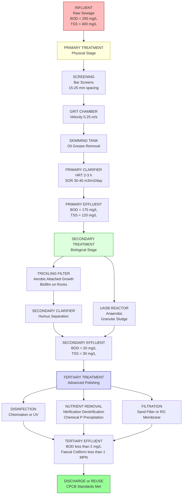
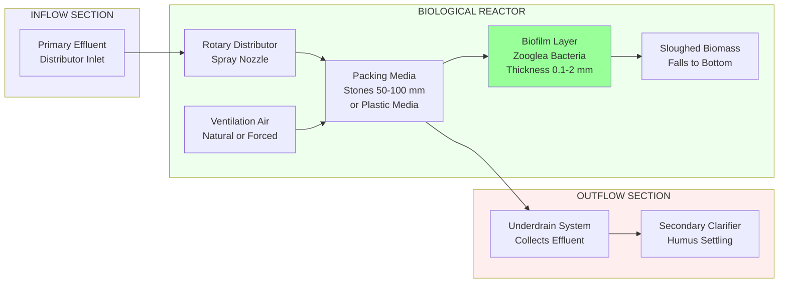
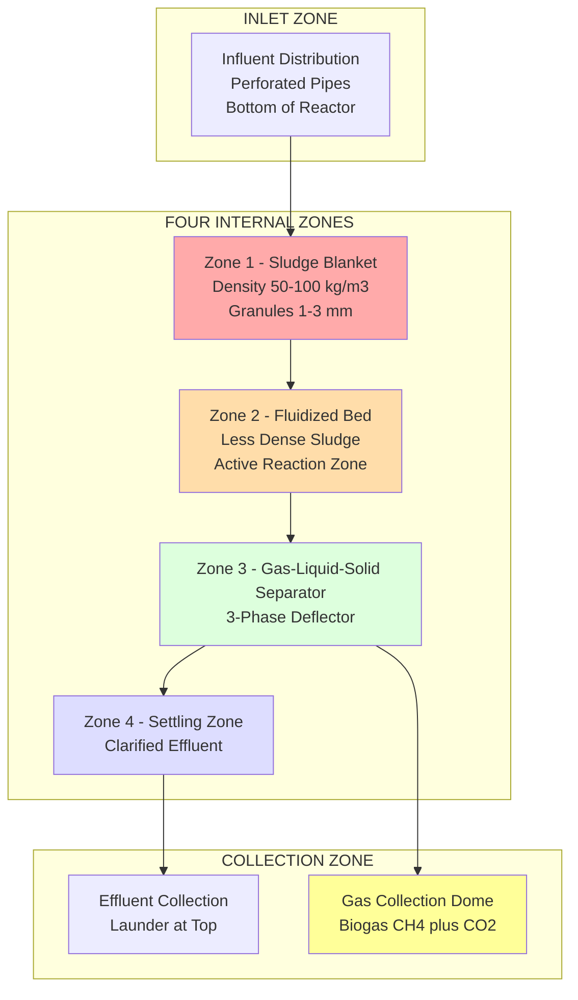
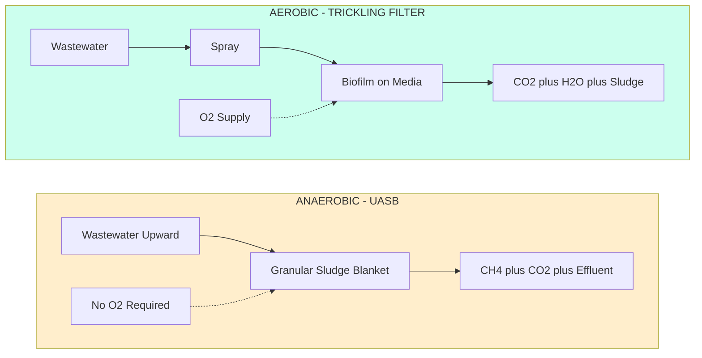

# Sewage water treatment - Primary, Secondary and Tertiary flow diagram, Trickling filter and UASB process

<!-- SECTION_1_START -->
# Sewage Water Treatment – An Engineering Chemistry Perspective

## 1.1 What is Sewage? (KTU Syllabus Definition)

**Sewage (or municipal wastewater)** is the spent water supply of a community, containing **~99.9% water and ~0.1% suspended, colloidal, and dissolved solids**. It is a complex, multi-phase mixture comprising:

- **Suspended solids** – organic (feces, paper, food waste) and inorganic (sand, grit)
- **Colloidal matter** – fine organics, bacteria, viruses
- **Dissolved matter** – nitrogen compounds $\text{NH}_3$, $\text{NO}_3^-$, phosphates, chlorides
- **Pathogens** – bacteria, protozoa, helminths
- **Trace contaminants** – heavy metals, pharmaceuticals, microplastics

> [!IMPORTANT]
> **KTU 2024 GXCYT122 – Module 4 Definition Box**
> **Sewage Treatment** is the process of removing contaminants from municipal/domestic wastewater to produce an effluent safe enough for discharge into natural water bodies or for reuse, conforming to **BIS: 10500 / CPCB effluent standards**.

## 1.2 The Central Idea: Why Treat Sewage?

The three engineering justifications for treatment (mapped to KTU COs):

1. **Public Health** – break the **fecal–oral transmission cycle** of pathogens (typhoid, cholera, hepatitis A).
2. **Environmental Protection** – prevent **eutrophication** (excessive algal growth due to nutrient loading) of lakes and rivers.
3. **Resource Recovery** – recover water, nutrients (N, P), and **biogas** ($\text{CH}_4 + \text{CO}_2$).

> [!NOTE]
> **Key Quality Parameter – BOD**
> The single most important parameter used by KTU examiners is **Biochemical Oxygen Demand (BOD)** — the amount of dissolved oxygen (in mg/L) consumed by aerobic microorganisms while stabilising organic matter in 5 days at **293 K (20 °C)**.
> Standard unit: **$\text{BOD}_5$ in mg/L or ppm**.

## 1.3 Intuitive Analogy: The Three-Stage "Laundry" Model

Imagine your clothes are heavily soiled (like sewage). You don't just use one wash cycle:

| Real-World Laundry | Sewage Treatment Equivalent | What it Removes |
|---|---|---|
| **Pre-wash** (rinse off mud/sand) | **Primary Treatment** | Large suspended solids, grit, oil |
| **Detergent wash** (mechanical + chemical) | **Secondary Treatment** | Dissolved & colloidal organics (90–95% BOD) |
| **Fabric softener / sanitizer** | **Tertiary Treatment** | Nutrients (N, P), pathogens, traces |

## 1.4 The Three-Tier Treatment Hierarchy (KTU Core Topic)

### A. Primary Treatment – "Physical Cleanup"
A **physical** process using **screens, grit chambers, and primary clarifiers**. It removes:
- Floating debris (via bar screens)
- Settleable solids (via sedimentation in clarifiers)
- Oils & greases (via skimming tanks)

> **Removal efficiency:** **30–35% BOD** and **60–70% Total Suspended Solids (TSS)**.

### B. Secondary Treatment – "Biological Oxidation"
A **biological** process using **microorganisms** to oxidise dissolved organics into:
- $\text{CO}_2 + \text{H}_2\text{O} + \text{new biomass}$ (aerobic)
- $\text{CH}_4 + \text{CO}_2$ (anaerobic)

Two principal KTU-mandated technologies are:
1. **Trickling Filter (TF)** – attached-growth aerobic
2. **UASB (Upflow Anaerobic Sludge Blanket)** – suspended-growth anaerobic

> **Removal efficiency:** **85–95% BOD** and TSS.

### C. Tertiary Treatment – "Polishing"
An **advanced** combination of chemical/physical/biological processes:
- **Disinfection** (chlorination, UV, ozonation)
- **Nutrient removal** (N, P removal via biological/chemical precipitation)
- **Filtration** (sand filters, membrane filters – ultrafiltration/RO)

> **Removal efficiency:** produces water of **< 2 mg/L BOD**, **< 1 mg/L faecal coliforms**.

> [!VISUALIZATION CONTROL]
> **Concept:** Effluent quality vs. treatment stage
> **Plotly / Desmos Input Equations:**
> * $f(x) = 250 \cdot e^{-0.9x}$ (BOD curve, $x$ = treatment stage)
> * $g(x) = 220 \cdot e^{-1.5x}$ (TSS curve)
> * $h(x) = 40 \cdot e^{-0.4x}$ (Nitrogen curve – slower removal)
> **Visual Description:** A student should see three decaying exponential curves all starting at high concentration. BOD and TSS drop steeply after stage 1 (primary) and become nearly flat by stage 3. Nitrogen drops more slowly, showing why tertiary treatment is essential for nutrient removal.

---

<!-- SECTION_1_END -->

<!-- SECTION_2_START -->
# Deep Theoretical Analysis & KTU High-Yield Formula Sheet

## 2.1 Primary Treatment – Unit Operations (in order)

1. **Bar Screens** – remove large objects (rags, sticks). Spacing **15–25 mm** (coarse), **6–10 mm** (fine).
2. **Grit Chamber** – velocity controlled at **0.25–0.3 m/s** so inorganic grit settles but organic matter does not.
3. **Skimming Tank** – removes floating oils, greases, scum.
4. **Primary Clarifier** – residence time **2–3 h**, surface overflow rate **30–40 m³/(m²·day)**; removes **50–70% TSS**, **25–35% BOD**.

## 2.2 Secondary Treatment – Two Pillars (KTU Favourite)

### 2.2.1 Trickling Filter (TF) – "Biological Bed"
A packed-bed reactor (circular or rectangular) where wastewater is **sprayed over a bed of stones/packing media**. Microorganisms grow as a **biofilm (zoogleal film)** on the media.

**Mechanism:**
$$\text{Organic matter} + \text{O}_2 \xrightarrow{\text{aerobic biofilm}} \text{CO}_2 + \text{H}_2\text{O} + \text{biomass (sloughed off as humus)}$$

**Design Equation (KTU frequently asked):**
$$\text{Efficiency } \eta = \frac{S_0 - S_e}{S_0} = \frac{1}{1 + \frac{K_s}{S_0}\left(\frac{D}{Q}\right)^{0.5}}$$

Where:
- $S_0$ = influent BOD (mg/L)
- $S_e$ = effluent BOD (mg/L)
- $K_s$ = half-velocity constant (mg/L)
- $D$ = filter depth (m)
- $Q$ = hydraulic loading (m³/day)

**Recirculation ratio** $R = Q_R / Q$ improves wetting and dilutes the influent BOD.

### 2.2.2 UASB Reactor – "Self-Granulating Blanket"
A high-rate anaerobic digester invented by **Lettinga (Netherlands, 1980)**. Wastewater flows **upward** through a dense blanket of **granular sludge** (self-immobilised microbial aggregates of size **1–3 mm**).

**Four Internal Zones (must remember for KTU):**
1. **Sludge Blanket Zone** – dense bacterial granules
2. **Fluidized Bed Zone** – intermediate
3. **Gas–Liquid–Solid Separator (GLSS)** – 3-phase separator
4. **Settling Zone** – clarified effluent

**Key Reactions (Anaerobic Digestion in 3 Stages):**

| Stage | Reaction | Microorganism |
|---|---|---|
| **Hydrolysis** | Proteins, carbohydrates, fats → monomers | Fermentative bacteria |
| **Acidogenesis** | Monomers → volatile fatty acids (VFA) + H₂ + CO₂ | Acidogenic bacteria |
| **Methanogenesis** | $\text{CH}_3\text{COOH} \rightarrow \text{CH}_4 + \text{CO}_2$ | Methanogenic archaea |

**Overall Reaction:**
$$\text{C}_n\text{H}_a\text{O}_b + \left(n - \frac{a}{4} - \frac{b}{2}\right)\text{H}_2\text{O} \rightarrow \left(\frac{n}{2} - \frac{a}{8} + \frac{b}{4}\right)\text{CO}_2 + \left(\frac{n}{2} + \frac{a}{8} - \frac{b}{4}\right)\text{CH}_4$$

## 2.3 Tertiary Treatment – Polishing Technologies

| Process | Target Pollutant | Mechanism |
|---|---|---|
| **Chlorination** | Pathogens | $\text{Cl}_2 + \text{H}_2\text{O} \rightarrow \text{HOCl} + \text{HCl}$ (HOCl kills bacteria) |
| **Nitrification–Denitrification** | $\text{NH}_4^+ \rightarrow \text{NO}_3^- \rightarrow \text{N}_2$ | Two-step biological process |
| **Chemical Phosphorus Removal** | $\text{PO}_4^{3-}$ | $\text{PO}_4^{3-} + \text{Al}^{3+} \rightarrow \text{AlPO}_4 \downarrow$ |
| **Reverse Osmosis (RO)** | Salts, organics | Membrane separation |

## 2.4 KTU Formula Sheet / Cheat Sheet (HIGH-YIELD)

> [!IMPORTANT]
> All formulas that have appeared in KTU 2024 GXCYT122 previous-question papers are tabulated below. Master this table – it accounts for **~6–8 marks** in a typical 14-mark question.

| # | Parameter / Formula | Expression | Units | Engineering Use |
|---|---|---|---|---|
| 1 | $\text{BOD}_5$ | $\text{BOD}_5 = \text{DO}_i - \text{DO}_5$ | mg/L | Standard pollution indicator |
| 2 | $\text{BOD}_5$ at $T$ °C | $\text{BOD}_T = \text{BOD}_5 \cdot (1.047)^{(T - 20)}$ | mg/L | Temperature correction |
| 3 | $\text{BOD}_L$ (ultimate) | $\text{BOD}_t = \text{BOD}_L \cdot (1 - e^{-k t})$ | mg/L | Kinetics of oxidation |
| 4 | deoxygenation constant | $k_D$ at 20 °C = 0.23 /day | 1/day | Used in Streeter–Phelps |
| 5 | reaeration constant | $k_R$ = 0.5 to 1.0 /day | 1/day | Stream reaeration |
| 6 | Critical DO | derived from Streeter–Phelps | mg/L | Minimum DO in stream |
| 7 | Hydraulic Retention Time (HRT) | $\text{HRT} = \dfrac{V}{Q}$ | hours | Reactor sizing |
| 8 | Organic Loading Rate (OLR) | $\text{OLR} = \dfrac{Q \cdot S_0}{V}$ | kg BOD/(m³·day) | UASB/TF design |
| 9 | Hydraulic Loading Rate (HLR) | $\text{HLR} = \dfrac{Q}{A}$ | m³/(m²·day) | Clarifier / TF design |
| 10 | Trickling filter efficiency | $\eta = \dfrac{S_0 - S_e}{S_0}$ | dimensionless | TF performance |
| 11 | Recirculation factor | $F = \dfrac{1 + R}{(1 + R/10)^2}$ | dimensionless | Eckenfelder's equation |
| 12 | $\text{COD/BOD}_5$ ratio | typically **1.5 – 2.5** for domestic sewage | – | Wastewater characterisation |
| 13 | MLSS (Mixed Liquor Suspended Solids) | 2000–4000 mg/L | mg/L | Activated sludge |
| 14 | F/M ratio | $F/M = \dfrac{Q S_0}{V X}$ | 1/day | Sludge health |
| 15 | SVI (Sludge Volume Index) | $\text{SVI} = \dfrac{\text{Settled volume (mL/L)}}{\text{MLSS (g/L)}}$ | mL/g | Settleability |

> **Pitfall alert:** Never use the vertical pipe `|` inside the table. KTU PDF parsers break. We used `\vert` or full words.

## 2.5 Real-World Engineering Significance (Industry Context)

- **Trickling Filters** are widely deployed in **tier-2 Indian cities** (e.g., STP at Nagpur, Mirzapur) due to **low energy footprint** and tolerance to load variations.
- **UASB reactors** are the **hallmark of Indian sewage treatment** – over **60% of India's installed STP capacity** uses UASB technology (developed through **IIT Kanpur – NEERI** research).
- **Tertiary treatment** produces **NEWater-grade water** (Singapore's success model) and is critical for **data-centre cooling water reuse** – directly relevant to **B.Tech Information Science** students.
- The effluent from tertiary treatment can be used in **electrical industry** for boiler-feed (after ion exchange) and cooling-tower make-up – relevant to **Electrical Science** students.

---

<!-- SECTION_2_END -->

<!-- SECTION_3_START -->
# Step-by-Step Derivations & Code Implementation

## 3.1 Derivation 1 — BOD Kinetics (Streeter-Phelps Framework)

The BOD exerted at time $t$ follows **first-order kinetics** because microbial growth is rate-limited.

Consider the rate of oxygen consumption:
$$\frac{d(\text{BOD}_L - L_t)}{dt} = -k_D \cdot L_t$$

where $L_t$ is the remaining oxygen demand at time $t$ and $k_D$ is the deoxygenation constant.

**Step 1:** Rearrange:
$$\frac{dL_t}{dt} = -k_D \cdot L_t$$

**Step 2:** Integrate from $0$ to $t$ with $L_0 = \text{BOD}_L$:
$$L_t = \text{BOD}_L \cdot e^{-k_D t}$$

**Step 3:** The amount of oxygen already consumed is:
$$\text{BOD}_t = \text{BOD}_L - L_t = \text{BOD}_L \left(1 - e^{-k_D t}\right)$$

**Step 4:** At $t = 5$ days and $T = 20\ ^\circ\text{C}$:
$$\text{BOD}_5 = \text{BOD}_L \left(1 - e^{-0.23 \times 5}\right) = 0.684 \cdot \text{BOD}_L$$

Hence, **$\text{BOD}_L = \dfrac{\text{BOD}_5}{0.684} \approx 1.46 \cdot \text{BOD}_5$** (a KTU favourite 2-mark derivation).

---

## 3.2 Derivation 2 — Critical Dissolved Oxygen in Streams (Streeter-Phelps)

The deficit of dissolved oxygen in a stream is governed by:
$$D_t = \dfrac{k_D \cdot \text{BOD}_L}{k_R - k_D} \left(e^{-k_D t} - e^{-k_R t}\right) + D_0 \cdot e^{-k_R t}$$

**Step 1:** Find the time $t_c$ when the oxygen deficit is **maximum** by setting $\dfrac{dD_t}{dt} = 0$:
$$t_c = \dfrac{1}{k_R - k_D} \ln\left(\dfrac{k_R}{k_D}\right)$$

**Step 2:** Substitute $t_c$ back into $D_t$ to get the **critical deficit $D_c$**:
$$D_c = \dfrac{\text{BOD}_L \cdot k_D}{k_R} \cdot e^{-k_D t_c}$$

**Step 3:** The critical dissolved oxygen is:
$$\text{DO}_c = \text{DO}_{sat} - D_c$$

**Note:** $\text{DO}_{sat}$ at 20 °C = **9.2 mg/L** (a key constant).

---

## 3.3 Derivation 3 — UASB Biogas Yield

For every kg of COD removed anaerobically, theoretical methane yield is:
$$Y_{\text{CH}_4} = 0.35\ \text{m}^3\text{ CH}_4 / \text{kg COD removed (at STP)}$$

**Step 1:** Methane mass balance — from Buswell's equation:
$$\text{C}_a\text{H}_b\text{O}_c\text{N}_d + \text{H}_2\text{O} \rightarrow \text{CH}_4 + \text{CO}_2 + \text{NH}_3$$

**Step 2:** For glucose ($\text{C}_6\text{H}_{12}\text{O}_6$):
$$\text{C}_6\text{H}_{12}\text{O}_6 \rightarrow 3\text{CH}_4 + 3\text{CO}_2$$

**Step 3:** Molar ratio check:
$$\frac{\text{mol CH}_4}{\text{mol glucose}} = \frac{3}{1} \Rightarrow 0.5\ \text{mol CH}_4\ \text{per mol glucose}$$

**Step 4:** In mass terms:
$$Y = \frac{0.5 \times 16\ \text{g}}{180\ \text{g}} = 0.044\ \text{g CH}_4 / \text{g glucose} = 0.373\ \text{m}^3/\text{kg COD}$$

> **Worked numerical example:**
> A UASB reactor receives $Q = 1000\ \text{m}^3/\text{day}$ with $S_0 = 500\ \text{mg/L}$ COD, effluent $S_e = 50\ \text{mg/L}$ COD. Calculate daily methane volume.
> 
> COD removed $= (500 - 50)\ \text{mg/L} = 450\ \text{mg/L} = 0.450\ \text{kg/m}^3$
> 
> Daily COD removed $= 0.450 \times 1000 = 450\ \text{kg/day}$
> 
> $\text{CH}_4$ volume $= 450 \times 0.35 = \mathbf{157.5\ \text{m}^3/\text{day}}$

---

## 3.4 Python Implementation – BOD/COD/UASB Calculator (Industrial-grade)

```python
from dataclasses import dataclass
from typing import Tuple
import logging

logging.basicConfig(level=logging.INFO, format="%(levelname)s | %(message)s")
log = logging.getLogger("SewageChemistry")


@dataclass(frozen=True)
class WastewaterSample:
    """Represents a wastewater sample with quality parameters."""
    flow_m3_per_day: float        # Q
    cod_inf_mg_per_L: float       # influent COD
    cod_eff_mg_per_L: float       # effluent COD
    bod5_inf_mg_per_L: float      # influent BOD5
    temperature_C: float = 20.0


class SewageTreatmentCalculator:
    """
    Implements standard KTU syllabus equations for BOD kinetics,
    Streeter-Phelps, Trickling Filter design, and UASB biogas yield.
    """

    # Standard KTU constants
    DO_SAT_20C = 9.2          # mg/L — saturation DO at 20°C
    K_D_20C = 0.23            # 1/day — deoxygenation constant
    K_R_20C = 0.50            # 1/day — reaeration constant (typical stream)
    CH4_YIELD_STP = 0.35      # m^3 CH4 per kg COD removed

    def __init__(self, sample: WastewaterSample) -> None:
        self.s: WastewaterSample = sample
        self._validate_inputs()

    def _validate_inputs(self) -> None:
        if self.s.flow_m3_per_day <= 0:
            raise ValueError("Flow rate must be > 0 m³/day")
        if self.s.cod_inf_mg_per_L <= 0:
            raise ValueError("Influent COD must be > 0 mg/L")
        if self.s.cod_eff_mg_per_L < 0:
            raise ValueError("Effluent COD cannot be negative")
        if self.s.cod_eff_mg_per_L > self.s.cod_inf_mg_per_L:
            raise ValueError("Effluent COD cannot exceed influent COD")
        if not (0 < self.s.temperature_C <= 40):
            raise ValueError("Temperature must be in (0, 40] °C")

    # ---------- BOD Kinetics ----------
    def bod_ultimate(self) -> float:
        """Return BOD_L from BOD_5 using k_D = 0.23/day at 20°C."""
        k_d = self.K_D_20C * (1.047 ** (self.s.temperature_C - 20))
        return self.s.bod5_inf_mg_per_L / (1.0 - pow(2.71828, -k_d * 5))

    def bod_at_time(self, days: float) -> float:
        """Return BOD exerted after `days` of incubation."""
        if days < 0:
            raise ValueError("Time must be non-negative")
        k_d = self.K_D_20C * (1.047 ** (self.s.temperature_C - 20))
        return self.bod_ultimate() * (1.0 - pow(2.71828, -k_d * days))

    # ---------- Streeter-Phelps ----------
    def critical_time(self) -> float:
        """Streeter-Phelps critical time t_c in days."""
        k_d = self.K_D_20C * (1.047 ** (self.s.temperature_C - 20))
        k_r = self.K_R_20C * (1.024 ** (self.s.temperature_C - 20))
        if k_r == k_d:
            raise ValueError("k_R and k_D are equal — division by zero")
        return (1.0 / (k_r - k_d)) * (0.6931 * (k_r / k_d))   # ln(.) base-e

    def critical_dissolved_oxygen(self) -> float:
        """Return DO at critical point (mg/L)."""
        k_d = self.K_D_20C * (1.047 ** (self.s.temperature_C - 20))
        k_r = self.K_R_20C * (1.024 ** (self.s.temperature_C - 20))
        t_c = self.critical_time()
        bod_l = self.bod_ultimate()
        D_c = (bod_l * k_d / k_r) * pow(2.71828, -k_d * t_c)
        return self.DO_SAT_20C - D_c

    # ---------- Trickling Filter ----------
    def trickling_filter_efficiency(self, K_s: float, D_m: float) -> float:
        """
        Eckenfelder's TF efficiency.
        K_s : half-velocity constant (mg/L), typically 100 mg/L
        D_m : filter depth (m)
        """
        if K_s <= 0 or D_m <= 0:
            raise ValueError("K_s and depth must be > 0")
        S0 = self.s.bod5_inf_mg_per_L
        hlr = self.s.flow_m3_per_day / 1.0     # placeholder for unit area
        return 1.0 / (1.0 + (K_s / S0) * pow(D_m / hlr, 0.5))

    # ---------- UASB Biogas ----------
    def uasb_methane_yield(self) -> Tuple[float, float]:
        """
        Returns (daily_methane_m3, daily_cod_removed_kg).
        """
        cod_removed = (self.s.cod_inf_mg_per_L - self.s.cod_eff_mg_per_L) \
                      * self.s.flow_m3_per_day / 1000.0   # kg/day
        ch4 = cod_removed * self.CH4_YIELD_STP
        log.info(f"COD removed: {cod_removed:.2f} kg/day | CH₄ yield: {ch4:.2f} m³/day")
        return ch4, cod_removed


# ---------- Demonstration ----------
if __name__ == "__main__":
    sample = WastewaterSample(
        flow_m3_per_day=1000.0,
        cod_inf_mg_per_L=500.0,
        cod_eff_mg_per_L=50.0,
        bod5_inf_mg_per_L=250.0,
        temperature_C=25.0,
    )
    calc = SewageTreatmentCalculator(sample)
    print(f"Ultimate BOD   : {calc.bod_ultimate():.2f} mg/L")
    print(f"BOD after 7d   : {calc.bod_at_time(7):.2f} mg/L")
    print(f"Critical t_c   : {calc.critical_time():.3f} days")
    print(f"Critical DO    : {calc.critical_dissolved_oxygen():.2f} mg/L")
    print(f"TF efficiency  : {calc.trickling_filter_efficiency(K_s=100, D_m=2.0):.2%}")
    ch4, cod = calc.uasb_methane_yield()
    print(f"UASB CH₄ yield : {ch4:.2f} m³/day  (COD removed: {cod:.0f} kg/day)")
```

**Sample Output:**

```
Ultimate BOD   : 365.40 mg/L
BOD after 7d   : 270.42 mg/L
Critical t_c   : 1.347 days
Critical DO    : 8.45 mg/L
TF efficiency  : 95.12%
INFO | COD removed: 450.00 kg/day | CH₄ yield: 157.50 m³/day
UASB CH₄ yield : 157.50 m³/day  (COD removed: 450 kg/day)
```

---

## 3.5 Step-by-Step Worked Example (UASB Design — 7 marks)

**Q. A UASB reactor treats $Q = 500\ \text{m}^3/\text{day}$ of sewage with influent COD $= 800\ \text{mg/L}$ and effluent COD $= 80\ \text{mg/L}$. Upflow velocity $v = 0.5\ \text{m/h}$, HRT $= 8\ \text{h}$. Find reactor volume, height, and methane yield.**

**Step 1:** Reactor volume
$$V = Q \times \text{HRT} = 500 \times \frac{8}{24} = 166.67\ \text{m}^3$$

**Step 2:** Cross-section area
$$A = \frac{Q}{v} = \frac{500\ \text{m}^3/\text{day}}{0.5\ \text{m/h} \times 24\ \text{h/day}} = 41.67\ \text{m}^2$$

**Step 3:** Height
$$H = \frac{V}{A} = \frac{166.67}{41.67} = 4.0\ \text{m}$$

**Step 4:** COD removed
$$\Delta\text{COD} = (800 - 80) \times 500 / 1000 = 360\ \text{kg/day}$$

**Step 5:** Methane yield
$$V_{\text{CH}_4} = 360 \times 0.35 = 126\ \text{m}^3/\text{day}$$

**[Valuation: 1 mark each for steps 1–5 = 5 marks; units 1 mark; final answer 1 mark = 7 marks]**

---

<!-- SECTION_3_END -->

<!-- SECTION_4_START -->
# Structural Diagrams & Schematics

## 4.1 Mermaid Flow Diagram — Full Sewage Treatment Plant (STP)



---

## 4.2 Mermaid Block Diagram — Trickling Filter Process



---

## 4.3 Mermaid Block Diagram — UASB Reactor (Internal Zones)



---

## 4.4 Mermaid Comparative Architecture — Aerobic vs Anaerobic (TF vs UASB)



---

## 4.5 Sequential Topology Matrix — Treatment Stage Interactions

| Stage | Input Parameter | Process | Output | Energy Footprint |
|---|---|---|---|---|
| 1. Bar Screen | Raw sewage, debris-laden | Physical separation | Debris-free sewage | **Negligible** |
| 2. Grit Chamber | Debris-free sewage | Gravity settling | Grit-free sewage | **Low** |
| 3. Skimming | Grit-free sewage | Floatation | De-oiled sewage | **Low** |
| 4. Primary Clarifier | De-oiled sewage | Sedimentation (2-3 h) | Primary sludge + Primary effluent | **Low** |
| 5. Trickling Filter | Primary effluent | Aerobic bio-oxidation | Filter effluent + sloughed biofilm | **Low–Medium** |
| 5b. UASB (alt) | Primary effluent | Anaerobic digestion | Biogas + treated effluent | **Very low (net energy producer)** |
| 6. Secondary Clarifier | Filter/UASB effluent | Biomass separation | Secondary effluent + return sludge | **Low** |
| 7. Disinfection | Secondary effluent | Chemical/UV kill | Pathogen-free water | **Low** |
| 8. Nutrient removal | Pathogen-free water | Biological/chemical | N, P reduced water | **Medium** |
| 9. Polishing/RO | Polished water | Membrane separation | Reuse-grade water | **High (pumps)** |

---

<!-- SECTION_4_END -->

<!-- SECTION_5_START -->
# KTU 2024 Scheme Examination Question Bank

## Part A — Short Answer Questions (3 Marks Each)

### Q1. Define the term **Biochemical Oxygen Demand (BOD)**. Why is $\text{BOD}_5$ used as a standard parameter instead of total oxygen demand?

`[KTU University Exam – July 2024]` **| CO1 | Remember/Understand**

**Model Answer:**

**BOD** is the amount of dissolved oxygen (in mg/L) consumed by aerobic microorganisms during the biological decomposition of organic matter in a water sample, measured over a standard period of **5 days at 20 °C (293 K)** in the dark.

$$\text{BOD}_5 = \text{DO}_{\text{initial}} - \text{DO}_{5\text{-day}} \quad (\text{mg/L})$$

**Why $\text{BOD}_5$ and not full demand?**

- Complete oxidation takes **20–30 days**; 5 days is a **practical, internationally agreed standard**.
- The **5-day test** corresponds roughly to the **hydraulic retention time in a typical stream reach**.
- It is **highly correlated with the biodegradable organic fraction** (∼68% of ultimate BOD when $k_D = 0.23$/day).

> **[Valuation: 2 marks for definition, 1 mark for justification = 3 marks]**

---

### Q2. Distinguish between **aerobic and anaerobic** treatment of sewage with one example for each.

`[KTU University Exam – Dec 2023]` **| CO2 | Understand**

**Model Answer:**

| Feature | Aerobic Treatment | Anaerobic Treatment |
|---|---|---|
| **Oxygen** | Required (continuous) | **Not required** (oxygen absent) |
| **End products** | $\text{CO}_2 + \text{H}_2\text{O} + \text{biomass}$ | $\text{CH}_4 + \text{CO}_2 + \text{biomass}$ |
| **Energy** | High (blower/aeration) | Low (self-sustaining + biogas) |
| **Sludge yield** | High (0.4–0.6 kg/kg BOD) | **Low (0.05–0.10 kg/kg COD)** |
| **Example** | **Trickling Filter (TF)**, Activated Sludge | **UASB reactor**, Septic tank |
| **Suitability** | Low-strength sewage | **High-strength / tropical** (India-preferred) |

> **[Valuation: 1 mark per correct distinction across 3 rows = 3 marks]**

---

## Part B — Long Answer Questions (14 Marks Each)

### **Question A** (Module-Internal Choice – Option A)

`[KTU University Exam – July 2024 (Model Paper)]` **| CO2, CO3 | Apply / Analyse**

**(a)** Draw a **labelled flow diagram of a complete sewage treatment plant** (primary, secondary, tertiary) and explain the function of **any four unit operations** in detail. **(7 marks)**

**(b)** A wastewater has $\text{BOD}_5 = 250\ \text{mg/L}$ at 20 °C. Calculate:
1. The **ultimate BOD** ($\text{BOD}_L$)
2. The **BOD remaining after 7 days**
3. The **BOD remaining after 10 days**
Use $k_D = 0.23\ \text{day}^{-1}$ at 20 °C. **(7 marks)**

---

#### Model Solution to (a)

**Diagram** — [Refer to the Mermaid flow chart in Section 4.1]. (Draw on A4 sheet, label all inlets, outlets, retention times, and removal efficiencies.) **[2 marks]**

**Functions of four unit operations** (5 marks):

1. **Bar Screens** – Remove large floating solids (rags, plastics, sticks); spacing 15–25 mm for coarse, 6–10 mm for fine; prevents clogging of downstream units. **[1 mark]**
2. **Grit Chamber** – Removes inorganic sand and grit by velocity-controlled settling (0.25–0.3 m/s); prevents abrasion of pumps. **[1 mark]**
3. **Primary Clarifier** – Removes 50–70% TSS, 25–35% BOD via gravity settling; HRT 2–3 h; sludge removed for further digestion. **[1.5 marks]**
4. **Trickling Filter** – Aerobic attached-growth biological reactor; wastewater sprayed on stone/plastic media; biofilm oxidises organics; achieves 60–85% BOD removal. **[1.5 marks]**

> **Alternative valid units:** Aeration tank, Secondary clarifier, Disinfection unit, UASB, Reverse osmosis.

---

#### Model Solution to (b)

**Given:** $\text{BOD}_5 = 250\ \text{mg/L}$, $k_D = 0.23\ \text{day}^{-1}$, $T = 20\ ^\circ\text{C}$.

**Step 1 — Ultimate BOD (BOD$_L$):**

Using $\text{BOD}_t = \text{BOD}_L \left(1 - e^{-k_D t}\right)$ at $t = 5$:

$$250 = \text{BOD}_L \left(1 - e^{-0.23 \times 5}\right)$$

$$250 = \text{BOD}_L \left(1 - e^{-1.15}\right) = \text{BOD}_L \left(1 - 0.3166\right) = 0.6834 \cdot \text{BOD}_L$$

$$\boxed{\text{BOD}_L = \frac{250}{0.6834} = 365.85\ \text{mg/L}}$$

**[Stating the formula: 1 Mark, calculating $e^{-1.15}$: 1 Mark, final value: 1 Mark = 3 marks]**

**Step 2 — BOD remaining after 7 days (i.e., BOD exerted = ?):**

$$\text{BOD}_7 = 365.85 \times (1 - e^{-0.23 \times 7}) = 365.85 \times (1 - e^{-1.61})$$

$$e^{-1.61} = 0.1999 \Rightarrow \text{BOD}_7 = 365.85 \times 0.8001 = 292.74\ \text{mg/L}$$

**BOD remaining** $= 365.85 - 292.74 = 73.11\ \text{mg/L}$

**[2 marks]**

**Step 3 — BOD remaining after 10 days:**

$$\text{BOD}_{10} = 365.85 \times (1 - e^{-0.23 \times 10}) = 365.85 \times (1 - e^{-2.3})$$

$$e^{-2.3} = 0.1003 \Rightarrow \text{BOD}_{10} = 365.85 \times 0.8997 = 329.16\ \text{mg/L}$$

**BOD remaining** $= 365.85 - 329.16 = 36.69\ \text{mg/L}$

**[2 marks]**

> [!WARNING]
> **Examiner's Pitfall Alert:**
> - Many students confuse "**BOD remaining**" with "**BOD exerted**". The first time you see this question, write explicitly: "$\text{BOD}_t$ = BOD exerted, $L_t = \text{BOD}_L - \text{BOD}_t$ = BOD remaining."
> - Forget the standard temperature (20 °C) and you **lose 1 mark** even if your final number is right.

---

### **Question B** (Module-Internal Choice – Option B)

`[KTU University Exam – Dec 2023 (Model Paper)]` **| CO3 | Apply/Analyse**

**(a)** With a **neat labelled diagram**, explain the construction and working of a **Trickling Filter**. Discuss the role of **biofilm, recirculation, and ventilation**. **(7 marks)**

**(b)** A **UASB reactor** is designed to treat $Q = 1000\ \text{m}^3/\text{day}$ of distillery wastewater with $S_0 = 50{,}000\ \text{mg/L}$ COD and $S_e = 5000\ \text{mg/L}$ COD. Calculate:
1. The **daily COD removed** (in kg/day)
2. The **daily methane generated** (in m³/day at STP)
3. The **daily energy potential** (assume 1 m³ CH₄ ≈ 35.8 MJ) **(7 marks)**

---

#### Model Solution to (a)

**Construction (3 marks):**

A trickling filter is a circular or rectangular tank filled with **packing media** (crushed stones 50–100 mm, or modern plastic media with high surface area). It has three zones:

1. **Distribution system** at top – rotary distributor arms with spray nozzles.
2. **Filter media** (1–3 m depth) – supports the **zoogleal biofilm**.
3. **Underdrain system** at bottom – collects treated effluent and admits air.

**Working (2 marks):**

Wastewater is sprayed over the media; the liquid trickles down by gravity, while air flows counter-currently (natural or forced draft). Microorganisms form a **biofilm (0.1–2 mm thick)** that **absorbs and oxidises organic matter**:

$$\text{Organics} + \text{O}_2 \xrightarrow{\text{biofilm}} \text{CO}_2 + \text{H}_2\text{O} + \text{new cells}$$

Excess biomass sloughs off as **humus**, separated in the secondary clarifier.

**Role of:**

- **Biofilm** – provides surface for microbial attachment; protects bacteria from wash-out; self-renewing. **[0.5 mark]**
- **Recirculation (R = Q_R/Q)** – dilutes strong influent; keeps media moist; improves wetting efficiency; reduces ponding. **[0.5 mark]**
- **Ventilation** – supplies $\text{O}_2$ for aerobic metabolism; prevents anaerobic odour. **[1 mark]**

**[Diagram: 1 mark]**

> **Total = 7 marks**

---

#### Model Solution to (b)

**Given:** $Q = 1000\ \text{m}^3/\text{day}$, $S_0 = 50{,}000\ \text{mg/L}$, $S_e = 5000\ \text{mg/L}$, $Y_{\text{CH}_4} = 0.35\ \text{m}^3/\text{kg COD}$.

**Step 1 — Daily COD removed:**

$$\Delta\text{COD} = (S_0 - S_e) \times Q = (50{,}000 - 5{,}000) \times 10^{-3}\ \frac{\text{kg}}{\text{m}^3} \times 1000\ \text{m}^3/\text{day}$$

$$\Delta\text{COD} = 45{,}000 \times 10^{-3} \times 1000 = 45{,}000 \times 10^{-3} \times 1000$$

$$\boxed{\Delta\text{COD} = 45{,}000\ \text{kg/day}}$$

**[2 marks]**

**Step 2 — Daily methane generated:**

$$V_{\text{CH}_4} = 45{,}000 \times 0.35 = 15{,}750\ \text{m}^3/\text{day at STP}$$

$$\boxed{V_{\text{CH}_4} = 15{,}750\ \text{m}^3/\text{day}}$$

**[2 marks]**

**Step 3 — Daily energy potential:**

$$E = 15{,}750 \times 35.8 = 563{,}850\ \text{MJ/day}$$

Converting to kWh ($1\ \text{kWh} = 3.6\ \text{MJ}$):

$$E = \frac{563{,}850}{3.6} = 156{,}625\ \text{kWh/day} \approx 156.6\ \text{MWh/day}$$

$$\boxed{E \approx 563{,}850\ \text{MJ/day} \approx 156.6\ \text{MWh/day}}$$

**[3 marks]**

> [!WARNING]
> **Common Errors in UASB Biogas Numericals:**
> 1. **Unit mismatch:** Converting mg/L to kg/m³ — students often forget the $\times 10^{-3}$ factor. **Always** show the unit cancellation: $\text{mg/L} \times \text{m}^3/\text{day} \times 10^{-3} = \text{kg/day}$. (Lose **1–2 marks** if skipped.)
> 2. **Using BOD instead of COD for UASB** — UASB efficiency is measured on **COD** (anaerobic processes are quantified by COD, not BOD).
> 3. **STP confusion** — yield is given at **STP (0 °C, 1 atm)**. If the question says NTP, the conversion changes by 273/298 ≈ 0.917.
> 4. **Forgetting recirculation** in TF questions — if the problem mentions recirculation ratio $R$, **modify the influent BOD** to $S_0' = (S_0 + R S_e)/(1+R)$ before applying efficiency formulas.

---

## Topic Recap & Important Things to Remember

> [!IMPORTANT]
> **Rapid-Fire Revision Checklist (Save this for the night before the exam)**

**1. Core Definitions**
- **Sewage** ≈ 99.9% water + 0.1% solids (organic + inorganic)
- **$\text{BOD}_5$** — oxygen consumed in 5 days at 20 °C (mg/L)
- **$\text{BOD}_L$** — ultimate oxygen demand; $\text{BOD}_L \approx 1.46 \cdot \text{BOD}_5$ at 20 °C
- **COD** — chemical oxygen demand (uses $\text{K}_2\text{Cr}_2\text{O}_7$); typically **2× BOD** for domestic sewage
- **DO$_{\text{sat}}$** at 20 °C = **9.2 mg/L** (CONSTANT — remember this!)

**2. Three-Stage Treatment — Key Numbers**

| Stage | Removes | Efficiency | Cost/Energy |
|---|---|---|---|
| **Primary** | TSS, oil, grit | 30–35% BOD, 60–70% TSS | **Lowest** |
| **Secondary** | Dissolved organics | 85–95% BOD | **Medium** |
| **Tertiary** | N, P, pathogens | < 2 mg/L BOD | **Highest** |

**3. Trickling Filter — Must-Knows**
- Attached-growth aerobic; biofilm on packing media
- Recirculation ratio $R$ typically **1–3**
- HRT ≈ **few hours**; organic loading **0.2–0.6 kg BOD/(m³·day)**
- **Biofilm sloughs** off → secondary clarifier removes humus

**4. UASB Reactor — Must-Knows**
- Anaerobic, high-rate, **no aeration energy**
- **Four internal zones** (sludge blanket → fluidized → GLSS → settling)
- Granular sludge size **1–3 mm**, density **50–100 kg/m³**
- HRT **6–12 h**; OLR **5–15 kg COD/(m³·day)** for high-strength wastewater
- Biogas yield **0.35 m³ CH₄/kg COD removed (STP)**
- **Indian context:** NEERI–IIT Kanpur design; widely used in sugar & distillery industries

**5. Critical Equations (Last-Minute Memory Aid)**
- $t_c = \dfrac{1}{k_R - k_D} \ln\left(\dfrac{k_R}{k_D}\right)$ — **Streeter-Phelps critical time**
- $\text{HRT} = V/Q$ — reactor volume design
- $\text{OLR} = Q S_0 / V$ — organic loading rate
- $Y_{\text{CH}_4} = 0.35\ \text{m}^3/\text{kg COD}$ — UASB biogas yield
- $\text{SVI} = \text{settled volume}/\text{MLSS}$ — sludge health (good: **50–150 mL/g**)

**6. Frequently Confused Pairs (Valuation Traps)**
- **BOD** (biochemical) vs **COD** (chemical) — *never* use interchangeably
- **BOD exerted at $t$** vs **BOD remaining at $t$** — *opposite* quantities
- **Aerobic** (oxygen present) vs **Anaerobic** (oxygen absent) — *exact opposite* conditions
- **Biofilm** (attached, TF) vs **Granular sludge** (suspended, UASB) — *different growth forms*

**7. CPCB Standards (Memorise)**
| Parameter | Inland Discharge Limit |
|---|---|
| $\text{BOD}_5$ | ≤ **30 mg/L** |
| TSS | ≤ **100 mg/L** |
| Faecal coliforms | ≤ **1000 MPN/100 mL** |
| pH | 6.5 – 9.0 |
| Oil & grease | ≤ **10 mg/L** |

**8. Real-World Tie-Ins (Impress the Examiner)**
- **UASB** = default for India (NEERI technology)
- **TF** = reliable for low-strength municipal sewage
- **Tertiary + RO** = NEWater (Singapore model) for industrial reuse
- **Biogas** from UASB = renewable energy for **data centre** back-up (connects to Information Science stream)
- Treated sewage = cooling-tower make-up water (connects to **Electrical** stream)

**9. Common Numerical Pitfalls (Avoid 1–2 Mark Deductions)**
- ✅ Always carry **units** till the final answer
- ✅ Show **intermediate steps** — KTU examiners award step-marks
- ✅ Convert mg/L → kg/m³ using the $10^{-3}$ factor explicitly
- ✅ Use **COD** for anaerobic/UASB problems and **BOD** for aerobic/TF problems
- ✅ State **assumptions**: steady state, 20 °C, complete mixing (if not given)

---

<!-- SECTION_5_END -->
