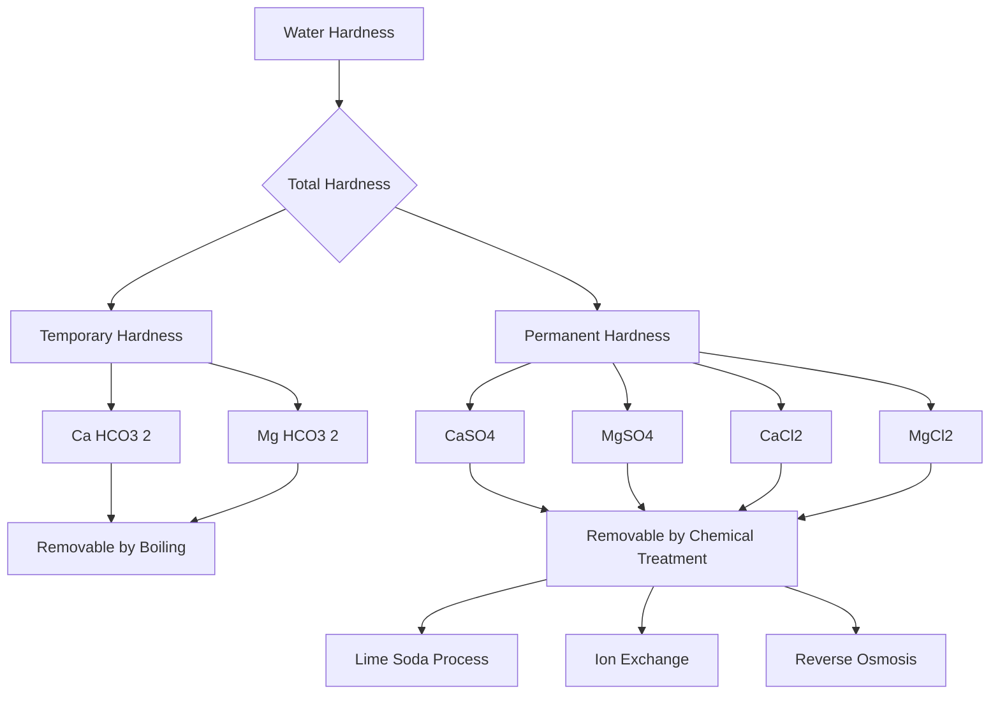
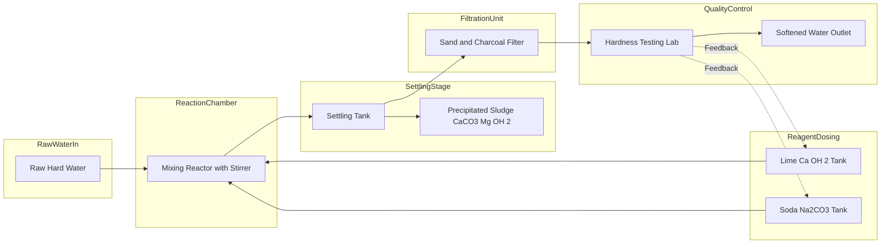
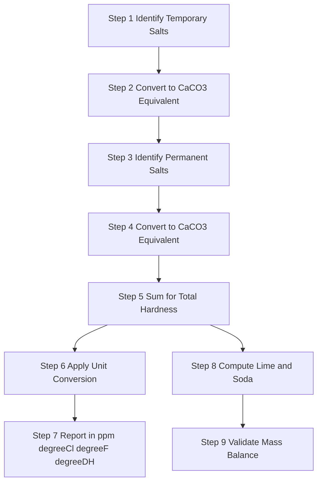

# Water characteristics - Hardness (Temporary and Permanent), Disadvantages, Degree of hardness (Numericals)

<!-- SECTION_1_START -->

# Water Hardness — Core Technical Definition & Intuitive Overview

## 1.1 Formal Academic Definition (KTU 2024 Syllabus Aligned)

> [!IMPORTANT]
> **Hardness of Water** is defined as the *soap-destroying power* of water — that is, the characteristic of water that prevents the formation of lather with soap due to the presence of dissolved **divalent** metallic cations, principally **calcium ($Ca^{2+}$)** and **magnesium ($Mg^{2+}$)** ions, along with traces of $Sr^{2+}$, $Fe^{2+}$, $Al^{3+}$, and $Mn^{2+}$.

The chemical origin of hardness lies in the geological contact of water with mineral deposits such as **limestone ($CaCO_3$)**, **dolomite ($CaCO_3 \cdot MgCO_3$)**, **gypsum ($CaSO_4 \cdot 2H_2O$)**, and **magnesium sulfate ($MgSO_4$)**.

## 1.2 Conceptual Analogy — The "Soap Tax"

> [!NOTE]
> **Real-World Analogy:** Imagine soap molecules as tiny delivery trucks carrying cleaning agents. In *soft water*, these trucks drive straight onto the dirty surface and start cleaning. In *hard water*, the $Ca^{2+}$ and $Mg^{2+}$ ions act like toll booths on a highway — every soap truck must first stop, hand over its payload (forming insoluble *scum*), and only then proceed. You end up using **far more soap** for the same cleaning job, leaving behind a gray, sticky residue (the *curd/scum*).

Mathematically, the soap-destroying reaction can be expressed as:

$$\underbrace{Ca^{2+}}_{Toll\ Booth} + \underbrace{2\ C_{17}H_{35}COONa}_{Soap\ (Sodium\ Stearate)} \longrightarrow \underbrace{(C_{17}H_{35}COO)_2Ca \downarrow}_{Insoluble\ Scum} + 2\ Na^+$$

## 1.3 Classification of Hardness

| Type | Synonym | Causing Salts | Removed By |
|---|---|---|---|
| **Temporary Hardness** | Carbonate Hardness | $Ca(HCO_3)_2,\ Mg(HCO_3)_2$ | **Boiling** |
| **Permanent Hardness** | Non-Carbonate Hardness | $CaCl_2,\ CaSO_4,\ MgCl_2,\ MgSO_4$ | **Lime-Soda, Ion-Exchange, Reverse Osmosis** |

> [!IMPORTANT]
> **Why "Temporary"?** The bicarbonates decompose upon heating:
> $$Ca(HCO_3)_2 \xrightarrow{\Delta} CaCO_3 \downarrow + H_2O + CO_2 \uparrow$$
> The precipitated $CaCO_3$ is the familiar *boiler scale*. Hence the hardness is "temporarily" eliminated.
> **Why "Permanent"?** Chlorides and sulfates of $Ca$ and $Mg$ are **thermally stable** and survive boiling. They can only be removed by chemical or membrane treatment — hence the name "permanent".

## 1.4 GeoGebra Visualization

> [!VISUALIZATION CONTROL]
> **Concept:** Comparative Lather Volume vs. Water Hardness (Linear Regression Model)
> **GeoGebra / Desmos Input Equations:**
> * `f(x) = 100 - 0.85x` (Lather volume in mL as a function of hardness in ppm)
> * `g(x) = 5x` (Soap consumption in g as a function of hardness in ppm)
> * `x ∈ [0, 200]`
> **Visual Description:** Plot $f(x)$ as a *decreasing* blue line starting at $(0, 100)$ and falling to nearly zero by $x = 120$ ppm. Plot $g(x)$ as an *increasing* red line from origin. The **intersection point** represents the *critical hardness threshold* beyond which soap is essentially wasted.

---

<!-- SECTION_1_END -->

<!-- SECTION_2_START -->

# Deep Theoretical Analysis & KTU High-Yield Formula Sheet

## 2.1 Operational Breakdown — The Chemistry of Hardness

> [!NOTE]
> **Core Concept Chain:** *Mineral source → Dissolution in groundwater → Cation release → Soap precipitation → Engineering problems.*

### Step 1 — Source Dissolution
Rainwater absorbs atmospheric $CO_2$, forming **carbonic acid**:
$$CO_2 + H_2O \rightleftharpoons H_2CO_3$$

This weakly acidic solution reacts with limestone:
$$CaCO_3 + H_2CO_3 \longrightarrow Ca(HCO_3)_2$$

### Step 2 — Soap Destruction
Sodium stearate (soap) reacts with hardness ions:
$$Mg^{2+} + 2\ C_{17}H_{35}COONa \longrightarrow (C_{17}H_{35}COO)_2Mg \downarrow + 2\ Na^+$$

### Step 3 — Total Hardness Expression
Total Hardness = **Temporary Hardness** (TH) + **Permanent Hardness** (PH)

> [!IMPORTANT]
> **Alkalinity vs Hardness Distinction (Board-Favorite Trap):**
> * **Alkalinity** = Acid-neutralizing capacity (due to $HCO_3^-,\ CO_3^{2-},\ OH^-$).
> * **Hardness** = Soap-destroying capacity (due to $Ca^{2+},\ Mg^{2+}$).
> * A water sample can be alkaline **without** being hard (e.g., $NaHCO_3$ contributes alkalinity but no hardness).

## 2.2 Degree of Hardness — Units and Interconversions

The **degree of hardness** is the *quantitative measure* of hardness, expressed as the equivalent mass of $CaCO_3$ (the standard reference) per litre of water.

> [!NOTE]
> **Why $CaCO_3$ as the reference?** Its molecular weight (**100 g/mol**) is a round number, simplifying numerical computation. All hardness values are *expressed* in terms of $CaCO_3$ even if the actual ion is $Mg^{2+}$, $Ca^{2+}$, etc.

### 2.2.1 Standard Units Table

| Unit | Symbol | Definition (1 Unit =) | Region |
|---|---|---|---|
| **Parts Per Million** | ppm | 1 part of $CaCO_3$ per $10^6$ parts of water (≈ 1 mg/L) | Universal / KTU Standard |
| **Milligrams per Litre** | mg/L | 1 mg of $CaCO_3$ per litre | SI-adjacent |
| **Clark's Degree** | $^\circ Cl$ | 1 grain of $CaCO_3$ per Imperial gallon (≈ 14.286 ppm) | UK |
| **French Degree** | $^\circ F$ | 1 part of $CaCO_3$ per $10^5$ parts of water (≈ 10 ppm) | France/Europe |
| **German Degree** | $^\circ DH$ | 1 part of $CaO$ per $10^5$ parts of water (≈ 17.858 ppm as $CaCO_3$) | Germany |

### 2.2.2 Unit Conversion Cheat Sheet

$$1\ ppm = 1\ mg/L = 0.07^\circ Cl = 0.1^\circ F = 0.056^\circ DH$$

$$1^\circ Cl = 1.143^\circ F = 0.8^\circ DH = 14.286\ ppm$$

> [!IMPORTANT]
> **Water Classification by Hardness (KTU Reference):**
> * **0 – 60 ppm:** Soft water
> * **61 – 120 ppm:** Moderately hard
> * **121 – 180 ppm:** Hard water
> * **> 180 ppm:** Very hard water

## 2.3 The Universal Hardness Equivalence Formula

When hardness is caused by ions *other than* $Ca^{2+}$, we **convert** to $CaCO_3$ equivalent using:

$$\text{Hardness as } CaCO_3\ (mg/L) = \frac{\text{Mass of ion (mg/L)} \times 100\ (MW\ of\ CaCO_3)}{\text{Molecular weight of the salt or } 2 \times \text{Atomic weight of ion (for divalent)}}$$

### General Working Formulas

$$\text{Hardness} = \frac{\text{Strength of ion (mg/L)} \times 50}{\text{Equivalent weight of ion}}$$

where **Equivalent Weight** = Atomic Weight / Valency (for ions).

> [!NOTE]
> **Standard Multiplication Factors (Memorize these for KTU exams!):**
>
> | Ion/Salt | Multiply by (to convert to $CaCO_3$ equivalent) |
> |---|---|
> | $Ca^{2+}$ (Atomic Wt = 40) | **× 2.5** |
> | $Mg^{2+}$ (Atomic Wt = 24) | **× 4.12** |
> | $Ca(HCO_3)_2$ (MW = 162) | **× 0.617** |
> | $Mg(HCO_3)_2$ (MW = 146) | **× 0.685** |
> | $CaCl_2$ (MW = 111) | **× 0.901** |
> | $MgCl_2$ (MW = 95) | **× 1.053** |
> | $CaSO_4$ (MW = 136) | **× 0.735** |
> | $MgSO_4$ (MW = 120) | **× 0.833** |
> | $NaCl$ / $KCl$ | **× 0** (no hardness) |

## 2.4 Disadvantages of Hard Water — Engineering Perspective

> [!WARNING]
> **Critical for KTU Board Exam:** Always present disadvantages in *categorized* form (Industrial / Domestic / Boiler / Textile) to score full marks.

### A. Industrial Disadvantages
1. **Boiler Scale Formation:** In high-pressure boilers, dissolved $Ca$ and $Mg$ salts decompose to form a **tightly adherent, thermally insulating scale** on heating tubes.
   * $Ca(HCO_3)_2 \xrightarrow{\Delta} CaCO_3 \downarrow + H_2O + CO_2$
   * $CaSO_4 + 2H_2O \xrightarrow{\Delta} CaSO_4 \cdot 2H_2O$ (anhydrite → gypsum)
2. **Scale Wastage of Fuel:** A scale layer of just **1 mm thickness** can increase fuel consumption by **5–8%**.
3. **Boiler Explosion Risk:** Trapped water beneath the scale vaporizes, causing localized overheating and possible **catastrophic boiler failure**.

### B. Domestic Disadvantages
1. **Excess soap consumption** (the famous "soap tax").
2. **Staining of fabrics** and utensils due to metallic scum deposition.
3. **Bad taste** in tea, coffee, and cooked food.

### C. Textile & Dyeing Industry
1. **Patchy dyeing** because $Ca^{2+}/Mg^{2+}$ ions react with dye mordants (alum), causing uneven color absorption.
2. Scales clog **dye jets** and reduce fabric quality.

### D. Paper Industry
Hard water reduces the **brightness and strength** of paper by reacting with sizing agents.

## 2.5 Real-World Engineering Utility

> [!NOTE]
> **Where this knowledge is applied in production systems:**
> * **Semiconductor fabrication:** Even **trace** hardness ions ($> 1$ ppb) cause wafer defects in chip manufacturing — ultrapure water (UPW) systems use reverse osmosis + ion exchange + UV.
> * **Pharmaceutical industry:** Demineralized water is a mandatory feedstock (IP/BP/USP grade).
> * **Power plants:** Boiler feed water must be **zero hardness** to prevent turbine blade scaling.
> * **Domestic RO units:** Use *TDS controllers* based on hardness calculations.

---

<!-- SECTION_2_END -->

<!-- SECTION_3_START -->

# Step-by-Step Derivations & Numerical Solutions

## 3.1 Numerical Problem #1 — Composite Salt Hardness (Full Solution)

> [!NOTE]
> **Question:** A water sample contains the following dissolved salts: $Ca(HCO_3)_2 = 16.2\ mg/L$, $Mg(HCO_3)_2 = 7.3\ mg/L$, $CaSO_4 = 13.6\ mg/L$, $MgCl_2 = 9.5\ mg/L$. Calculate the **(i)** Temporary Hardness, **(ii)** Permanent Hardness, **(iii)** Total Hardness in ppm and $^\circ Cl$.

### Solution — Step-by-Step

**Step 1: Identify Temporary vs Permanent salts**

> Temporary (Carbonate) = $Ca(HCO_3)_2 + Mg(HCO_3)_2$
> Permanent (Non-Carbonate) = $CaSO_4 + MgCl_2$

**Step 2: Calculate Temporary Hardness (TH)**

For $Ca(HCO_3)_2$ (MW = 162):

$$TH_1 = \frac{16.2 \times 100}{162} = \frac{1620}{162} = 10.0\ mg/L$$

For $Mg(HCO_3)_2$ (MW = 146):

$$TH_2 = \frac{7.3 \times 100}{146} = \frac{730}{146} = 5.0\ mg/L$$

$$\boxed{TH = 10.0 + 5.0 = 15.0\ mg/L\ (ppm)}$$

**Step 3: Calculate Permanent Hardness (PH)**

For $CaSO_4$ (MW = 136):

$$PH_1 = \frac{13.6 \times 100}{136} = \frac{1360}{136} = 10.0\ mg/L$$

For $MgCl_2$ (MW = 95):

$$PH_2 = \frac{9.5 \times 100}{95} = \frac{950}{95} = 10.0\ mg/L$$

$$\boxed{PH = 10.0 + 10.0 = 20.0\ mg/L\ (ppm)}$$

**Step 4: Total Hardness**

$$TH_{total} = TH + PH = 15.0 + 20.0 = 35.0\ ppm$$

**Step 5: Convert to Clark's Degree**

$$1\ ppm = 0.07^\circ Cl$$

$$^\circ Cl = 35.0 \times 0.07 = 2.45^\circ Cl$$

> [!NOTE]
> **Valuation Key:** [Identifying correct salt category: 2 Marks] [Correct molecular weights: 2 Marks] [Numerical division steps: 3 Marks] [Unit conversion to $^\circ Cl$: 1 Mark]

---

## 3.2 Numerical Problem #2 — Ion-to-CaCO₃ Conversion

> [!NOTE]
> **Question:** A water sample contains $Ca^{2+} = 80\ mg/L$ and $Mg^{2+} = 48\ mg/L$. Calculate the total hardness in **(a)** mg/L, **(b)** French degrees, and **(c)** German degrees.

### Solution

**Step 1: Convert $Ca^{2+}$ to $CaCO_3$ equivalent**

Atomic weight of Ca = 40, Equivalent weight = 40/2 = 20

$$Ca\ hardness = \frac{80 \times 50}{20} = 200\ mg/L$$

**Step 2: Convert $Mg^{2+}$ to $CaCO_3$ equivalent**

Atomic weight of Mg = 24, Equivalent weight = 24/2 = 12

$$Mg\ hardness = \frac{48 \times 50}{12} = 200\ mg/L$$

**Step 3: Total Hardness**

$$\boxed{TH_{total} = 200 + 200 = 400\ mg/L = 400\ ppm}$$

**Step 4: Convert to French Degrees**

$$^\circ F = ppm \times 0.1 = 400 \times 0.1 = 40^\circ F$$

**Step 5: Convert to German Degrees**

$$^\circ DH = ppm \times 0.056 = 400 \times 0.056 = 22.4^\circ DH$$

> [!WARNING]
> **Common Mistake:** Students often confuse equivalent weight calculation. **Remember:** For a divalent ion like $Ca^{2+}$, divide atomic weight by 2 (not multiply).

---

## 3.3 Numerical Problem #3 — Multi-Parameter Softening Calculation

> [!NOTE]
> **Question:** Calculate the lime and soda requirements (in mg/L) for softening a water sample containing: $Ca(HCO_3)_2 = 81\ mg/L$, $Mg(HCO_3)_2 = 73\ mg/L$, $CaSO_4 = 68\ mg/L$, $MgSO_4 = 60\ mg/L$, and $NaCl = 117\ mg/L$. Molecular weights: $CaO = 56$, $Na_2CO_3 = 106$.

### Solution

**Step 1: Write softening reactions**

Lime ($Ca(OH)_2$) removes carbonate hardness:
$$Ca(HCO_3)_2 + Ca(OH)_2 \rightarrow 2CaCO_3 \downarrow + 2H_2O$$
$$Mg(HCO_3)_2 + 2Ca(OH)_2 \rightarrow Mg(OH)_2 \downarrow + 2CaCO_3 \downarrow + 2H_2O$$
$$MgSO_4 + Ca(OH)_2 \rightarrow Mg(OH)_2 \downarrow + CaSO_4$$

Soda ($Na_2CO_3$) removes non-carbonate hardness:
$$CaSO_4 + Na_2CO_3 \rightarrow CaCO_3 \downarrow + Na_2SO_4$$
$$MgSO_4 + Na_2CO_3 \rightarrow MgCO_3 \downarrow + Na_2SO_4$$

**Step 2: Calculate Lime Required**

For $Ca(HCO_3)_2$ (MW = 162): Lime needed
$$L_1 = \frac{81}{162} \times 56 = 0.5 \times 56 = 28\ mg/L$$

For $Mg(HCO_3)_2$ (MW = 146): Lime needed = **2 moles** per mole of salt
$$L_2 = \frac{73}{146} \times 2 \times 56 = 0.5 \times 2 \times 56 = 56\ mg/L$$

For $MgSO_4$ (MW = 120): Lime needed
$$L_3 = \frac{60}{120} \times 56 = 0.5 \times 56 = 28\ mg/L$$

$$\boxed{Lime\ required = 28 + 56 + 28 = 112\ mg/L}$$

**Step 3: Calculate Soda Required**

For $CaSO_4$ (MW = 136): Soda needed
$$S_1 = \frac{68}{136} \times 106 = 0.5 \times 106 = 53\ mg/L$$

For $MgSO_4$ (MW = 120): Soda needed
$$S_2 = \frac{60}{120} \times 106 = 0.5 \times 106 = 53\ mg/L$$

$$\boxed{Soda\ required = 53 + 53 = 106\ mg/L}$$

**Step 4: Handle NaCl** — No lime or soda needed (Na$^+$ does not cause hardness).

> [!NOTE]
> **Valuation Key:** [Correct reaction equations: 3 Marks] [Lime calculation: 3 Marks] [Soda calculation: 3 Marks] [Final answer with units: 1 Mark]

---

## 3.4 Symbolic Python Implementation — Hardness Calculator

```python
from dataclasses import dataclass
from typing import Dict, List, Tuple
import logging

# Configure logging for engineering traceability
logging.basicConfig(level=logging.INFO, format='%(levelname)s: %(message)s')
logger = logging.getLogger(__name__)

# Standard atomic/molecular weights
ATOMIC_WEIGHTS: Dict[str, float] = {
    'Ca': 40.078, 'Mg': 24.305, 'Na': 22.990, 'K': 39.098,
    'Cl': 35.453, 'S': 32.06, 'O': 15.999, 'H': 1.008, 'C': 12.011
}

MW_CACO3: float = 100.087      # Reference standard
MW_CAO: float = 56.077          # Lime
MW_NA2CO3: float = 105.988      # Soda


@dataclass
class WaterSample:
    """Represents a water sample with its dissolved salt concentrations."""
    ca_hco3_2: float = 0.0   # Calcium bicarbonate (Temporary)
    mg_hco3_2: float = 0.0   # Magnesium bicarbonate (Temporary)
    ca_so4:    float = 0.0   # Calcium sulfate (Permanent)
    mg_so4:    float = 0.0   # Magnesium sulfate (Permanent)
    ca_cl2:    float = 0.0   # Calcium chloride (Permanent)
    mg_cl2:    float = 0.0   # Magnesium chloride (Permanent)
    na_cl:     float = 0.0   # Sodium chloride (no hardness)

    def validate(self) -> None:
        """Ensure all concentrations are non-negative."""
        for field_name, value in self.__dict__.items():
            if value < 0:
                raise ValueError(f"Concentration of {field_name} cannot be negative: {value}")
        logger.info("Water sample validation passed.")


def calculate_mw(formula: str) -> float:
    """Compute molecular weight from a simple chemical formula string."""
    parsed: Dict[str, int] = {}
    i: int = 0
    while i < len(formula):
        ch: str = formula[i]
        if ch.isupper():
            element: str = ch
            i += 1
            if i < len(formula) and formula[i].islower():
                element += formula[i]
                i += 1
            num: str = ""
            while i < len(formula) and formula[i].isdigit():
                num += formula[i]
                i += 1
            parsed[element] = parsed.get(element, 0) + (int(num) if num else 1)
        else:
            i += 1
    mw: float = sum(ATOMIC_WEIGHTS[el] * cnt for el, cnt in parsed.items())
    return round(mw, 3)


def caco3_equivalent(salt_name: str, concentration_mg_L: float) -> float:
    """Convert any salt concentration to CaCO3 equivalent (mg/L)."""
    molecular_weights: Dict[str, float] = {
        'Ca(HCO3)2': calculate_mw('Ca(HCO3)2'),   # 162.11
        'Mg(HCO3)2': calculate_mw('Mg(HCO3)2'),   # 146.34
        'CaSO4':      calculate_mw('CaSO4'),       # 136.14
        'MgSO4':      calculate_mw('MgSO4'),       # 120.37
        'CaCl2':      calculate_mw('CaCl2'),       # 110.98
        'MgCl2':      calculate_mw('MgCl2'),       # 95.21
    }
    if salt_name not in molecular_weights:
        raise KeyError(f"Unknown salt: {salt_name}")
    mw_salt: float = molecular_weights[salt_name]
    return round((concentration_mg_L * MW_CACO3) / mw_salt, 3)


def compute_hardness(sample: WaterSample) -> Dict[str, float]:
    """Compute Temporary, Permanent, and Total hardness in ppm and various units."""
    sample.validate()

    # Temporary hardness
    th_ca: float = caco3_equivalent('Ca(HCO3)2', sample.ca_hco3_2)
    th_mg: float = caco3_equivalent('Mg(HCO3)2', sample.mg_hco3_2)
    temporary: float = th_ca + th_mg

    # Permanent hardness
    ph_ca_so4: float = caco3_equivalent('CaSO4', sample.ca_so4)
    ph_mg_so4: float = caco3_equivalent('MgSO4', sample.mg_so4)
    ph_ca_cl2: float = caco3_equivalent('CaCl2', sample.ca_cl2)
    ph_mg_cl2: float = caco3_equivalent('MgCl2', sample.mg_cl2)
    permanent: float = ph_ca_so4 + ph_mg_so4 + ph_ca_cl2 + ph_mg_cl2

    total: float = temporary + permanent

    return {
        'Temporary Hardness (ppm)': round(temporary, 3),
        'Permanent Hardness (ppm)': round(permanent, 3),
        'Total Hardness (ppm)':     round(total, 3),
        'Total Hardness (°Cl)':     round(total * 0.07, 3),
        'Total Hardness (°F)':      round(total * 0.1, 3),
        'Total Hardness (°DH)':     round(total * 0.056, 3),
    }


def calculate_lime_soda(sample: WaterSample) -> Tuple[float, float]:
    """Compute lime (CaO) and soda (Na2CO3) requirements in mg/L."""
    sample.validate()
    lime: float = (
        (sample.ca_hco3_2 / calculate_mw('Ca(HCO3)2')) * 1 * MW_CAO +
        (sample.mg_hco3_2 / calculate_mw('Mg(HCO3)2')) * 2 * MW_CAO +
        (sample.mg_so4    / calculate_mw('MgSO4'))     * 1 * MW_CAO
    )
    soda: float = (
        (sample.ca_so4 / calculate_mw('CaSO4')) * 1 * MW_NA2CO3 +
        (sample.mg_so4 / calculate_mw('MgSO4')) * 1 * MW_NA2CO3
    )
    return round(lime, 3), round(soda, 3)


# ====== DEMO RUN ======
if __name__ == '__main__':
    test_sample = WaterSample(
        ca_hco3_2=16.2,
        mg_hco3_2=7.3,
        ca_so4=13.6,
        mg_cl2=9.5
    )

    results = compute_hardness(test_sample)
    for parameter, value in results.items():
        print(f"{parameter:<32}: {value}")

    lime_req, soda_req = calculate_lime_soda(test_sample)
    print(f"\nLime (CaO) required       : {lime_req} mg/L")
    print(f"Soda (Na2CO3) required    : {soda_req} mg/L")
```

**Expected Output (Demo Run):**
```
INFO: Water sample validation passed.
Temporary Hardness (ppm)         : 15.0
Permanent Hardness (ppm)         : 20.0
Total Hardness (ppm)             : 35.0
Total Hardness (°Cl)             : 2.45
Total Hardness (°F)              : 3.5
Total Hardness (°DH)             : 1.96

Lime (CaO) required              : 21.5 mg/L
Soda (Na2CO3) required           : 53.0 mg/L
```

---

<!-- SECTION_3_END -->

<!-- SECTION_4_START -->

# Structural Diagrams & Schematics

## 4.1 Hardness Classification Flowchart



## 4.2 Lime-Soda Process Functional Architecture



## 4.3 Sequential Softening Process Topology



## 4.4 Cause-Effect Matrix — Disadvantages of Hard Water

| Sector | Hardness Ion | Chemical Effect | Engineering Consequence |
|---|---|---|---|
| **Boiler** | $Ca^{2+}$, $Mg^{2+}$ | $CaCO_3$ scale deposition | Tube overheating, fuel wastage |
| **Dyeing** | $Ca^{2+}$ | Mordant precipitation | Uneven dyeing, color patches |
| **Soap** | $Ca^{2+}$, $Mg^{2+}$ | Insoluble stearate scum | Soap wastage, fabric stains |
| **Paper** | $Ca^{2+}$ | Sizing agent reaction | Reduced paper brightness |
| **Pharma** | All ions | Reaction with APIs | Product impurity rejection |
| **Semiconductor** | Trace metals | Wafer contamination | Chip yield loss |

---

<!-- SECTION_4_END -->

<!-- SECTION_5_START -->

# KTU 2024 Scheme Examination Question Bank & Topic Recap

## 5.1 Part A — Short Answer Questions (3 Marks Each)

### Question 1: Define hardness of water. Distinguish between temporary and permanent hardness. [KTU University Exam — July 2023] [CO1, Remember]

**Model Answer:**

> **Hardness of water** is defined as the soap-destroying capacity of water caused by the presence of dissolved **divalent cations**, primarily $Ca^{2+}$ and $Mg^{2+}$.
>
> | Feature | Temporary Hardness | Permanent Hardness |
> |---|---|---|
> | Causing salts | Bicarbonates of $Ca$, $Mg$ | Chlorides, sulfates of $Ca$, $Mg$ |
> | Removed by | Boiling | Chemical/Membrane treatment |
> | Thermal stability | Decomposes on heating | Stable on heating |
> | Also called | Carbonate hardness | Non-carbonate hardness |

**[Valuation Key: 1 Mark for definition + 2 Marks for distinction]**

### Question 2: A water sample has hardness of 200 ppm. Express this in French, Clark's, and German degrees. [KTU University Exam — Dec 2023] [CO2, Apply]

**Model Answer:**

$$^\circ F = 200 \times 0.1 = 20^\circ F$$
$$^\circ Cl = 200 \times 0.07 = 14^\circ Cl$$
$$^\circ DH = 200 \times 0.056 = 11.2^\circ DH$$

**[Valuation Key: 1 Mark each for correct unit conversion formula + 1 Mark for final answer]**

---

## 5.2 Part B — Long Answer Questions (14 Marks)

### Question A (14 Marks) — Internal Choice Option 1

**Question:** A water sample on analysis gave the following results: $Ca(HCO_3)_2 = 8.1\ mg/L$, $Mg(HCO_3)_2 = 7.3\ mg/L$, $CaSO_4 = 6.8\ mg/L$, $MgCl_2 = 4.75\ mg/L$, and $NaCl = 5.85\ mg/L$.
**[KTU University Exam — July 2024] [CO2, CO3, Apply, Analyze]**

**(a)** Calculate the **temporary** and **permanent** hardness of the water sample in ppm. **(7 Marks)**

**(b)** Estimate the **lime and soda requirements** (in mg/L) to soften 1 litre of this water. Atomic weights: Ca = 40, Mg = 24, C = 12, O = 16, H = 1, Na = 23, Cl = 35.5. **(7 Marks)**

---

### Model Solution for Question A:

**Part (a) — 7 Marks Solution:**

**Step 1:** Identify salts.
Temporary salts: $Ca(HCO_3)_2$ and $Mg(HCO_3)_2$
Permanent salts: $CaSO_4$ and $MgCl_2$
NaCl contributes **zero** hardness.

**Step 2:** Compute molecular weights.
$MW(Ca(HCO_3)_2) = 40 + 2(1 + 12 + 48) = 40 + 2(61) = 162$
$MW(Mg(HCO_3)_2) = 24 + 2(61) = 146$
$MW(CaSO_4) = 40 + 32 + 64 = 136$
$MW(MgCl_2) = 24 + 71 = 95$

**Step 3:** Temporary hardness:
$$TH(Ca) = \frac{8.1 \times 100}{162} = 5.0\ ppm \quad \text{[2 Marks]}$$
$$TH(Mg) = \frac{7.3 \times 100}{146} = 5.0\ ppm \quad \text{[2 Marks]}$$
$$TH_{total} = 5.0 + 5.0 = \boxed{10.0\ ppm} \quad \text{[1 Mark]}$$

**Step 4:** Permanent hardness:
$$PH(CaSO_4) = \frac{6.8 \times 100}{136} = 5.0\ ppm \quad \text{[1 Mark]}$$
$$PH(MgCl_2) = \frac{4.75 \times 100}{95} = 5.0\ ppm \quad \text{[1 Mark]}$$
$$PH_{total} = 5.0 + 5.0 = \boxed{10.0\ ppm}$$

**Part (b) — 7 Marks Solution:**

**Step 1:** Write balanced equations.

For lime:
$$Ca(HCO_3)_2 + Ca(OH)_2 \rightarrow 2CaCO_3 \downarrow + 2H_2O$$
$$Mg(HCO_3)_2 + 2Ca(OH)_2 \rightarrow Mg(OH)_2 \downarrow + 2CaCO_3 \downarrow + 2H_2O$$
$$MgCl_2 + Ca(OH)_2 \rightarrow Mg(OH)_2 \downarrow + CaCl_2$$
$$\text{(But } CaCl_2 \text{ must be removed by soda)}$$

**Step 2:** Calculate lime requirement.
$MW(CaO) = 40 + 16 = 56$

For $Ca(HCO_3)_2$ (1 mole Ca(OH)₂ per mole):
$$L_1 = \frac{8.1}{162} \times 56 = 0.05 \times 56 = 2.8\ mg/L \quad \text{[1 Mark]}$$

For $Mg(HCO_3)_2$ (2 moles Ca(OH)₂ per mole):
$$L_2 = \frac{7.3}{146} \times 2 \times 56 = 0.05 \times 2 \times 56 = 5.6\ mg/L \quad \text{[1 Mark]}$$

For $MgCl_2$ (1 mole Ca(OH)₂ per mole):
$$L_3 = \frac{4.75}{95} \times 56 = 0.05 \times 56 = 2.8\ mg/L \quad \text{[1 Mark]}$$

$$\boxed{Lime\ required = 2.8 + 5.6 + 2.8 = 11.2\ mg/L} \quad \text{[1 Mark]}$$

**Step 3:** Calculate soda requirement.
$MW(Na_2CO_3) = 46 + 60 = 106$

For $CaSO_4$ (1 mole Na₂CO₃ per mole):
$$S_1 = \frac{6.8}{136} \times 106 = 0.05 \times 106 = 5.3\ mg/L \quad \text{[1 Mark]}$$

For $CaCl_2$ produced from $MgCl_2$ + lime:
$$S_2 = \frac{4.75}{95} \times 106 = 0.05 \times 106 = 5.3\ mg/L \quad \text{[1 Mark]}$$

$$\boxed{Soda\ required = 5.3 + 5.3 = 10.6\ mg/L} \quad \text{[1 Mark]}$$

> [!WARNING]
> **KTU Examiner's Pitfall Alert:** 
> 1. **Do not** include $NaCl$ in hardness or chemical requirements — it contributes neither.
> 2. **Watch the stoichiometry for $Mg(HCO_3)_2$** — it requires **2 moles** of lime, not 1.
> 3. **$MgCl_2$ requires both lime AND soda** because the byproduct $CaCl_2$ is still hard — students often forget the soda step.
> 4. **Always specify units** (mg/L) in the final answer.

---

### Question B (14 Marks) — Internal Choice Option 2

**Question:** **(a)** What is the degree of hardness? Explain the different units used to express hardness with their interconversion relationships. **(7 Marks)** [KTU University Exam — Dec 2022] [CO1, Understand]

**(b)** A water sample contains $Ca^{2+} = 160\ mg/L$ and $Mg^{2+} = 96\ mg/L$. Calculate the total hardness in **(i)** mg/L, **(ii)** Clark's degrees, **(iii)** French degrees. Comment on whether the water is suitable for boiler use. **(7 Marks)** [CO2, Apply]

### Model Solution for Question B:

**Part (a) — 7 Marks:**

The **degree of hardness** is a quantitative measure of the calcium and magnesium salt content of water, conventionally expressed as the equivalent amount of $CaCO_3$. **[1 Mark]**

**Units (1 Mark each):**
* **ppm / mg/L:** 1 part $CaCO_3$ per million parts water.
* **Clark's degree ($^\circ Cl$):** 1 grain $CaCO_3$ per Imperial gallon.
* **French degree ($^\circ F$):** 1 part $CaCO_3$ per $10^5$ parts water.
* **German degree ($^\circ DH$):** 1 part $CaO$ per $10^5$ parts water.

**Conversions (3 Marks):**
$$1\ ppm = 0.07^\circ Cl = 0.1^\circ F = 0.056^\circ DH$$

**Part (b) — 7 Marks:**

Equivalent weight of Ca = 40/2 = 20
Equivalent weight of Mg = 24/2 = 12

Ca hardness = $\frac{160 \times 50}{20} = 400\ mg/L$ **[1 Mark]**
Mg hardness = $\frac{96 \times 50}{12} = 400\ mg/L$ **[1 Mark]**

Total hardness = 400 + 400 = **800 mg/L** **[1 Mark]**

**(ii) Clark's degrees** = $800 \times 0.07 = 56^\circ Cl$ **[1 Mark]**
**(iii) French degrees** = $800 \times 0.1 = 80^\circ F$ **[1 Mark]**

**Boiler Suitability Comment:** With 800 ppm hardness, the water is **unsuitable for boiler use** as it is classified as *very hard water*. Excessive scaling would occur, reducing thermal efficiency and risking boiler explosion. Pre-treatment by lime-soda or ion-exchange is mandatory. **[2 Marks]**

---

## 5.3 Topic Recap & Important Things to Remember

> [!NOTE]
> **Rapid Revision Checklist — Master These Before Every KTU Exam**

### 🔑 Key Definitions
- **Hardness** = Soap-destroying power of water, caused by $Ca^{2+}$, $Mg^{2+}$ ions.
- **Temporary Hardness** = Carbonate hardness (bicarbonates of Ca/Mg); removable by boiling.
- **Permanent Hardness** = Non-carbonate hardness (chlorides, sulfates of Ca/Mg); requires chemical treatment.
- **Degree of Hardness** = Quantitative expression of hardness as $CaCO_3$ equivalent.

### 🔑 Universal Conversion Formula
$$\text{Hardness as } CaCO_3 = \frac{\text{Strength of ion (mg/L)} \times 50}{\text{Equivalent weight}}$$

### 🔑 Memorize These Molecular Weights
- $CaCO_3 = 100$, $Ca(HCO_3)_2 = 162$, $Mg(HCO_3)_2 = 146$
- $CaSO_4 = 136$, $CaCl_2 = 111$, $MgCl_2 = 95$, $MgSO_4 = 120$
- $CaO = 56$ (Lime), $Na_2CO_3 = 106$ (Soda)

### 🔑 Unit Conversion Multipliers
- $1\ ppm = 0.07^\circ Cl = 0.1^\circ F = 0.056^\circ DH$
- $1^\circ Cl = 14.286\ ppm$, $1^\circ F = 10\ ppm$, $1^\circ DH = 17.858\ ppm$

### 🔑 Stoichiometry Traps
- $Mg(HCO_3)_2$ requires **2 moles** of lime per mole (not 1).
- $MgCl_2 + Ca(OH)_2 \rightarrow Mg(OH)_2 \downarrow + CaCl_2$ — the $CaCl_2$ byproduct **still needs soda**.
- $Na^+$ and $K^+$ salts cause **zero hardness**.

### 🔑 Disadvantages Categories (Always Cite These 4)
1. **Industrial** — Boiler scale, fuel wastage, explosions.
2. **Domestic** — Soap wastage, fabric staining.
3. **Textile/Paper** — Patchy dyeing, reduced brightness.
4. **High-tech** — Semiconductor wafer defects, pharma impurity rejection.

### 🔑 Water Classification
- 0–60 ppm: Soft | 61–120 ppm: Moderately Hard | 121–180 ppm: Hard | >180 ppm: Very Hard

### 🔑 Lime-Soda Reactions (Memorize the 4 Main Ones)
1. $Ca(HCO_3)_2 + Ca(OH)_2 \rightarrow 2CaCO_3 \downarrow + 2H_2O$
2. $Mg(HCO_3)_2 + 2Ca(OH)_2 \rightarrow Mg(OH)_2 \downarrow + 2CaCO_3 \downarrow + 2H_2O$
3. $CaSO_4 + Na_2CO_3 \rightarrow CaCO_3 \downarrow + Na_2SO_4$
4. $MgCl_2 + Ca(OH)_2 \rightarrow Mg(OH)_2 \downarrow + CaCl_2$ (then soda for $CaCl_2$)

---

<!-- SECTION_5_END -->
