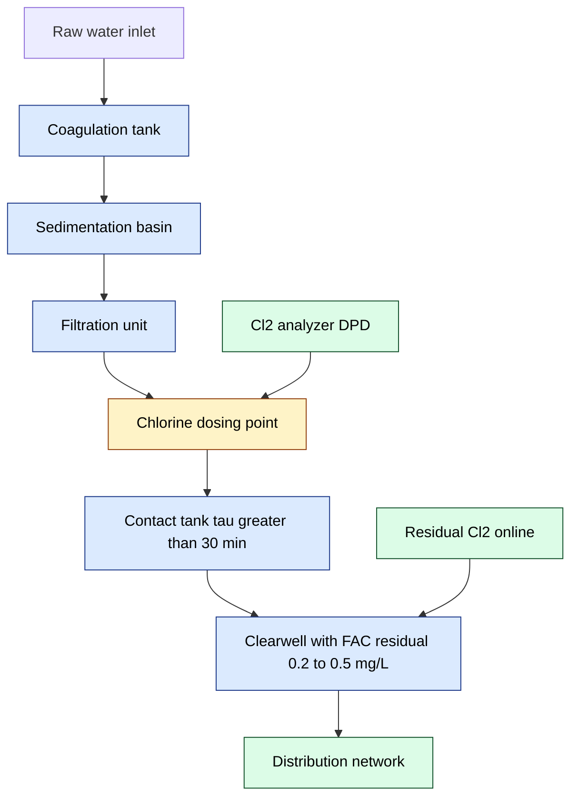
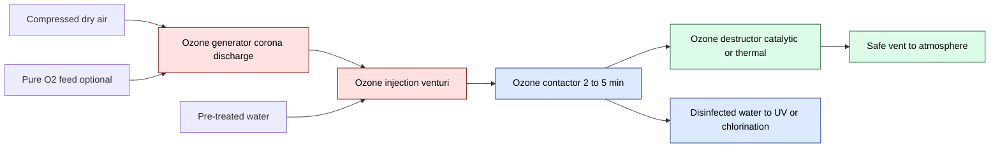
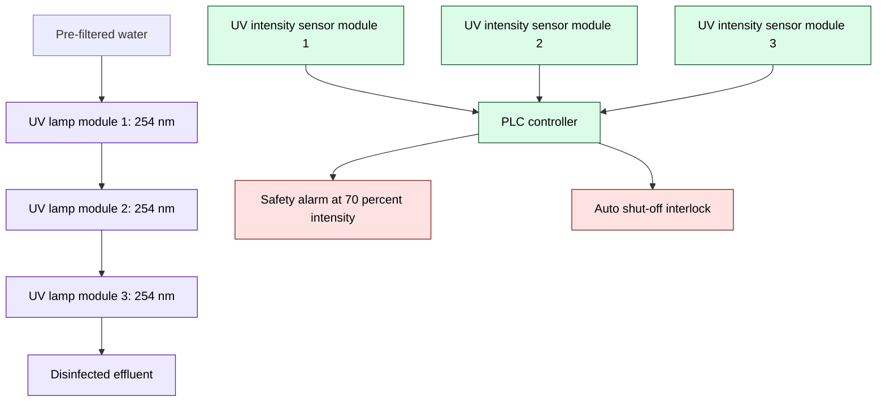
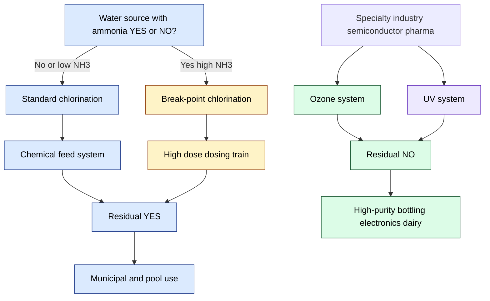

# Water disinfection methods – chlorination, Break point chlorination, ozone and UV irradiation

<!-- SECTION_1_START -->

# Water Disinfection Methods: Chlorination, Break Point Chlorination, Ozone & UV Irradiation

## 1. Core Technical Definition & Intuitive Overview

### 1.1 Formal Academic Definition (KTU 2024 Syllabus Aligned)

**Water disinfection** is the controlled physico-chemical process of selectively inactivating or destroying pathogenic microorganisms (bacteria, viruses, protozoa, helminths) present in water so that it becomes microbiologically safe for human consumption and industrial use, *without necessarily removing the dead organisms themselves*. Disinfection is distinct from **sterilization** (complete destruction of all microbial life) and from **purification** (removal of chemical as well as biological contaminants).

Within Module 4 (Environmental Chemistry & Waste Management) of GXCYT122, the syllabus recognizes **four principal disinfection methodologies** for municipal and industrial water treatment plants:

1. **Chlorination** – Addition of chlorine (Cl₂), hypochlorous acid (HOCl), or calcium/sodium hypochlorite [Ca(OCl)₂ / NaOCl] to water.
2. **Break-Point Chlorination** – A specific operational regime in which sufficient chlorine is dosed to completely oxidize all ammonia, nitrogenous matter, and reducing agents, leaving only **free available chlorine residual** (HOCl + OCl⁻).
3. **Ozonation** – Disinfection by molecular ozone (O₃), a powerful oxidant generated on-site by corona discharge in dry air/oxygen.
4. **UV Irradiation** – Non-chemical disinfection using germicidal ultraviolet light (predominantly at **$\lambda = 254 \text{ nm}$**) that damages microbial DNA/RNA.

> [!IMPORTANT]
> **KTU 2024 Module 4 Highlight:** Disinfection is a *unit operation* that must follow coagulation–flocculation–sedimentation–filtration. The disinfection efficiency is quantified by the **CT concept** (Concentration × Contact Time, in mg·min/L), mandated by the U.S. EPA Surface Water Treatment Rule and adopted in BIS 10500:2012.

### 1.2 Conceptual Analogy / Intuition

Imagine a heavily contaminated classroom (the water) filled with invisible trouble-making students (bacteria, viruses). **Disinfection** is like the school principal deploying a "misting system" to neutralize the troublemakers. Different methods are different mists:

- **Chlorination** → A slow-release "chlorine mist" that lingers in the room for hours, continuing to sanitize even after the principal leaves (provides a *residual*).
- **Break-Point Chlorination** → You add *so much* of the mist that even the chemistry set (ammonia, organic amines) on the bench gets neutralized first, *then* the residual mist is finally free to act on the troublemakers. This requires you to keep adding until you "break through" the demand.
- **Ozonation** → A high-energy, fast-acting "ozone mist" that vanishes within minutes — powerful but no residual protection once it decomposes.
- **UV Irradiation** → Shining a specific frequency of light (UV-C, 254 nm) that "scrambles" the genetic code of the troublemakers so they cannot reproduce — instantaneous but offers **zero residual** downstream.

> [!NOTE]
> **Geometric / Process Intuition:** Picture a graph of *chlorine added (x-axis)* versus *chlorine residual (y-axis)*. Initially residual rises (chlorine reacts with easily oxidizable inorganic matter like Fe²⁺, Mn²⁺, H₂S), then *dips* (chlorine reacts with ammonia to form chloramines), then *rises again* past a sharp knee — the **break-point** — beyond which free residual chlorine appears. This "humped curve" is one of the most examiner-favorite diagrams in KTU.

### 1.3 Fundamental Physical & Chemical Constants

| Constant / Parameter | Symbol | Value / Range | Engineering Significance |
|---|---|---|---|
| Standard redox potential of HOCl / Cl⁻ | $E^{\circ}$ | **+1.49 V** | Defines oxidizing power of free chlorine |
| Standard redox potential of O₃ / O₂ | $E^{\circ}$ | **+2.07 V** | Ozone is a stronger oxidant than chlorine |
| Energy per mole of UV photons (254 nm) | $E_{photon}$ | **$4.71 \times 10^{-19} \text{ J}$** | ≈ 471 kJ/mol — sufficient to dimerize thymine |
| Germicidal UV wavelength | $\lambda$ | **$250 - 265 \text{ nm}$** | Peak DNA absorption at 254 nm |
| Typical UV dose for 99.9% inactivation | $D$ | **$30 - 40 \text{ mJ/cm}^2$** | Equivalent to 30–40 mJ·cm⁻² for most bacteria |
| pH of maximum HOCl dominance | $pH$ | **< 7.5** | Above pH 7.5, OCl⁻ (weaker disinfectant) dominates |
| $pK_a$ of HOCl $\rightleftharpoons$ H⁺ + OCl⁻ | $pK_a$ | **7.53 at 25 °C** | Determines HOCl/OCl⁻ speciation |
| Ozone half-life in water at 20 °C | $t_{1/2}$ | **≈ 20 min** | Rapidly decomposes, no residual |

---

<!-- SECTION_1_END -->

<!-- SECTION_2_START -->

# Deep Theoretical Analysis & KTU High-Yield Formula Sheet

## 2.1 Chlorination Chemistry — The Foundation

When **Cl₂** gas dissolves in water, it undergoes instantaneous **disproportionation** (the *hydrolysis* of chlorine):

$$\text{Cl}_2 + \text{H}_2\text{O} \rightleftharpoons \text{HOCl} + \text{HCl}$$

Hypochlorous acid is a weak acid ($pK_a = 7.53$) that partially dissociates:

$$\text{HOCl} \rightleftharpoons \text{H}^+ + \text{OCl}^-$$

Therefore in chlorinated water, three species coexist: **Cl₂(aq)**, **HOCl**, and **OCl⁻**. Their relative proportions are controlled by **pH**:

$$\text{Speciation fraction of HOCl} = \frac{[\text{H}^+]}{[\text{H}^+] + K_a} = \frac{1}{1 + 10^{(pH - pK_a)}}$$

> [!IMPORTANT]
> **Why HOCl is a far better disinfectant than OCl⁻:**
> HOCl is a neutral molecule — it diffuses *through* the negatively-charged bacterial cell wall by passive diffusion. OCl⁻ is an anion, electrostatically *repelled* by the same cell wall. **Disinfection efficiency** of HOCl is approximately **40–80 times** that of OCl⁻ at equal concentrations. This is why chlorination is most effective below **pH 7.5**.

### 2.2 Sequential Chlorine Demand Reactions

When water contains ammonia (NH₃) and nitrogenous organic matter, chlorine does not remain "free" — it forms **combined chlorine** species, called **chloramines**:

| Reaction | Product | Type | Disinfection Power |
|---|---|---|---|
| HOCl + NH₃ $\rightarrow$ **NH₂Cl** (monochloramine) + H₂O | NH₂Cl | Combined Cl | Moderate (≈ 1/25 of HOCl) |
| HOCl + NH₂Cl $\rightarrow$ **NHCl₂** (dichloramine) + H₂O | NHCl₂ | Combined Cl | Weak, causes taste/odor |
| HOCl + NHCl₂ $\rightarrow$ **NCl₃** (trichloramine / nitrogen trichloride) + H₂O | NCl₃ | Combined Cl | Very weak, toxic gas |
| 2NH₂Cl + HOCl $\rightarrow$ **N₂ ↑** + 3HCl + H₂O | N₂ (gas) | Break-point | Removes all bound chlorine |

### 2.3 Break-Point Chlorination — The Operational Doctrine

**Break-point chlorination** is the engineering practice of dosing chlorine at a level **just sufficient to pass the hump** on the residual curve, so that the only chlorine remaining in solution is **free available chlorine (FAC)** — HOCl and OCl⁻ — and not the weaker, taste-producing combined chlorine (chloramines).

> [!NOTE]
> **Definition (KTU Board Standard):** *Break-point is the point at which the chlorine demand of water has been fully satisfied — i.e., all ammonia has been oxidized to N₂, all reducing agents (Fe²⁺, Mn²⁺, H₂S, NO₂⁻) have been oxidized, and any further chlorine addition appears entirely as free residual chlorine.*

### 2.4 The Break-Point Chlorination Curve (5 Distinct Zones)

Reading from left to right as **chlorine dose increases**:

- **Zone I (0 → A):** Initial chlorine demand. Chlorine is consumed by inorganic reducing agents — Fe²⁺ $\rightarrow$ Fe³⁺, Mn²⁺ $\rightarrow$ Mn⁴⁺, H₂S $\rightarrow$ S⁰, NO₂⁻ $\rightarrow$ NO₃⁻. Residual = 0.
- **Zone II (A → B):** Chloramines form. As more Cl₂ is added, NH₂Cl and NHCl₂ appear; combined chlorine residual rises to a **maximum at point B** (called the "hump"). Total residual ≈ 1 mole Cl₂ per mole NH₃-N consumed.
- **Zone III (B → C):** Destruction of chloramines. The 2:1 reaction (HOCl:NH₂Cl) oxidizes chloramines to N₂ gas. Combined residual **falls sharply** to a **minimum at point C** — the **break-point**.
- **Zone IV (C → D):** Free available chlorine (FAC) zone. Beyond the break-point, added chlorine appears as HOCl/OCl⁻. Free residual rises linearly with dose.
- **Zone V:** All chlorine in the system is free; no combined chlorine remains.

**Stoichiometric break-point dose:**

$$\boxed{\text{Cl}_2 (\text{mg/L}) = 7.6 \times [\text{NH}_3\text{-N}] + \text{other demands}}$$

where **7.6** is the stoichiometric weight ratio (mass of Cl₂ required per mg of NH₃-N at the break-point, accounting for the overall net reaction):

$$2\text{NH}_3 + 3\text{Cl}_2 \rightarrow \text{N}_2 + 6\text{HCl}$$

$$\frac{3 \times 71}{2 \times 14} = \frac{213}{28} = 7.607 \approx 7.6$$

### 2.5 Ozonation — Reaction Pathways

Ozone in water decomposes through complex radical chain reactions initiated by hydroxide ion (OH⁻):

$$\text{O}_3 + \text{H}_2\text{O} \rightarrow \text{HO}_3^+ + \text{OH}^-$$

$$\text{HO}_3^+ + \text{OH}^- \rightarrow 2\text{HO}_2^{\bullet}$$

$$\text{O}_3 + \text{HO}_2^{\bullet} \rightarrow \text{HO}^{\bullet} + 2\text{O}_2$$

The hydroxyl radical (HO•) is one of the most powerful aqueous oxidants known ($E^{\circ} = +2.80$ V), providing a **dual disinfection mechanism**: direct molecular O₃ attack + indirect radical chain oxidation.

### 2.6 UV Irradiation — The Photophysical Mechanism

UV-C photons at **254 nm** are absorbed by the aromatic bases of microbial DNA — particularly adjacent **thymine** and **cytosine** residues — forming **cyclobutane pyrimidine dimers (CPDs)** and **6-4 photoproducts**. These photoproducts physically distort the DNA double helix, blocking transcription and replication. The organism cannot reproduce and is thereby inactivated (though not killed).

The **dose-response** follows the **Chick–Watson law**:

$$\boxed{\log\left(\frac{N}{N_0}\right) = -k \cdot C \cdot t = -k \cdot D}$$

where $N$ = surviving organisms, $N_0$ = initial count, $k$ = inactivation rate constant (L/mJ·cm⁻²), $C$ = UV intensity (mW/cm²), $t$ = exposure time (s), and $D = C \cdot t$ = UV fluence or dose (mJ/cm²).

### 2.7 KTU High-Yield Formula Sheet

| # | Formula / Equation | Use / Context | Typical Unit |
|---|---|---|---|
| 1 | $\text{Cl}_2 + \text{H}_2\text{O} \rightleftharpoons \text{HOCl} + \text{HCl}$ | Chlorine hydrolysis | — |
| 2 | $\text{HOCl} \rightleftharpoons \text{H}^+ + \text{OCl}^-$; $pK_a = 7.53$ | HOCl/OCl⁻ speciation | — |
| 3 | $\text{HOCl} \rightleftharpoons \text{H}^+ + \text{OCl}^-$, fraction HOCl $= 1/(1 + 10^{pH-pK_a})$ | pH effect on disinfection | dimensionless |
| 4 | $\text{NH}_3 + \text{HOCl} \rightarrow \text{NH}_2\text{Cl} + \text{H}_2\text{O}$ | Monochloramine formation | — |
| 5 | $2\text{NH}_3 + 3\text{Cl}_2 \rightarrow \text{N}_2 + 6\text{HCl}$ | Break-point net reaction | — |
| 6 | $\text{Cl}_2 (\text{mg/L}) = 7.6 \times [\text{NH}_3\text{-N}] + \text{Other demands}$ | Break-point dose calculation | mg/L |
| 7 | $\text{CT} = C_{\text{residual}} \times t_{\text{contact}}$ | Disinfection credit (EPA) | mg·min/L |
| 8 | $\text{O}_3 + \text{H}_2\text{O} \rightarrow 2\text{HO}^{\bullet} + \text{O}_2$ | Ozone radical chain | — |
| 9 | $\log(N/N_0) = -k \cdot C \cdot t = -k \cdot D$ | Chick–Watson UV inactivation | — |
| 10 | $D = C \cdot t$ where $C$ in mW/cm², $t$ in s $\Rightarrow D$ in mJ/cm² | UV dose definition | mJ/cm² |
| 11 | $E_{photon} = hc/\lambda$ | Photon energy at 254 nm | J or eV |
| 12 | $\text{Residual Cl}_2 = \text{Dose} - \text{Demand}$ | Mass balance | mg/L |
| 13 | $V = Q \times t$ | Contactor volume (CT design) | m³ |
| 14 | $\tau = V / Q$ | Hydraulic residence time | min or s |

> [!IMPORTANT]
> **KTU Valuation Tip:** Examiner often awards 1 mark for the *correct stoichiometric coefficient* and another 1 mark for *units*. Always write the balanced equation with state symbols (e.g., $\text{NH}_3(aq)$, $\text{HOCl}(aq)$, $\text{N}_2(g)$).

### 2.8 Real-World Engineering Utility

| Method | Industry / Use Case | Why Chosen |
|---|---|---|
| Chlorination | Municipal water (Kerala Water Authority, Delhi Jal Board), swimming pools, cooling towers | Provides long-lasting **residual** in distribution network; cheap; well-understood |
| Break-Point | Surface water sources with ammonia (river-fed, post-chloramination plants) | Eliminates chloramine taste/odor; ensures FAC compliance with BIS 10500 |
| Ozonation | Bottled water (Bisleri, Kinley), semiconductor ultrapure water, French municipal systems | No halogenated DBPs; excellent color/odor removal; strong oxidant |
| UV | Pharmaceutical water, semiconductor rinse water, dairy CIP, aquaculture | No chemical addition; no taste change; effective against *Cryptosporidium* and *Giardia* (chlorine-resistant) |

---

<!-- SECTION_2_END -->

<!-- SECTION_3_START -->

# Step-by-Step Derivations, Calculations & Code Implementation

## 3.1 Worked Example 1 — Speciation of Free Chlorine at Given pH

**Problem (KTU Typical):** A water sample has a free chlorine residual of **1.20 mg/L Cl₂** at **pH 8.0** and 25 °C. Calculate the concentration of HOCl and OCl⁻ in mg/L as Cl₂. ($pK_a$ of HOCl = 7.53 at 25 °C).

### Solution — Step-by-Step

**Step 1 — Compute the HOCl fraction using the Henderson–Hasselbalch form:**

$$\alpha_{\text{HOCl}} = \frac{1}{1 + 10^{(pH - pK_a)}} = \frac{1}{1 + 10^{(8.0 - 7.53)}}$$

$$= \frac{1}{1 + 10^{0.47}} = \frac{1}{1 + 2.951} = \frac{1}{3.951} = 0.2531$$

**Step 2 — Compute OCl⁻ fraction:**

$$\alpha_{\text{OCl}^-} = 1 - 0.2531 = 0.7469$$

**Step 3 — Apply to total free chlorine:**

$$[\text{HOCl}] = 0.2531 \times 1.20 = 0.304 \text{ mg/L as Cl}_2$$

$$[\text{OCl}^-] = 0.7469 \times 1.20 = 0.896 \text{ mg/L as Cl}_2$$

**Step 4 — Interpretation:**

> Since HOCl is ~ 40–80× more biocidal than OCl⁻, only **~ 25%** of the free chlorine at pH 8.0 is in the active form. A plant operator at pH 8.0 would need **~ 4× the dose** to match the biocidal action at pH 6.5. This is why plant managers aim for pH **< 7.5** whenever storage time permits.

---

## 3.2 Worked Example 2 — Break-Point Chlorination Dose Calculation

**Problem:** A municipal water source contains the following:
- Ammonia-nitrogen: **1.20 mg/L NH₃-N**
- Iron (Fe²⁺): **0.40 mg/L**
- Manganese (Mn²⁺): **0.20 mg/L**
- Sulfide (H₂S as S²⁻): **0.30 mg/L**

Compute the **theoretical break-point chlorine dose** (in mg/L Cl₂). Atomic weights: Cl = 35.5, Fe = 55.85, Mn = 54.94, S = 32, N = 14, H = 1.

### Solution — Step-by-Step

**Step 1 — Chlorine demand of Fe²⁺ (oxidation to Fe³⁺):**

$$2\text{Fe}^{2+} + \text{Cl}_2 \rightarrow 2\text{Fe}^{3+} + 2\text{Cl}^-$$

1 mole Cl₂ (= 71 g) oxidizes 2 moles Fe²⁺ (= 111.7 g).

$$\text{Cl}_2 \text{ for Fe}^{2+} = 0.40 \times \frac{71}{111.7} = 0.40 \times 0.6357 = 0.254 \text{ mg/L}$$

**Step 2 — Chlorine demand of Mn²⁺ (oxidation to MnO₂):**

$$\text{Mn}^{2+} + \text{Cl}_2 + 2\text{H}_2\text{O} \rightarrow \text{MnO}_2 + 2\text{Cl}^- + 4\text{H}^+$$

1 mole Cl₂ oxidizes 1 mole Mn²⁺.

$$\text{Cl}_2 \text{ for Mn}^{2+} = 0.20 \times \frac{71}{54.94} = 0.20 \times 1.2924 = 0.258 \text{ mg/L}$$

**Step 3 — Chlorine demand of S²⁻ (oxidation to SO₄²⁻):**

$$\text{S}^{2-} + 4\text{Cl}_2 + 4\text{H}_2\text{O} \rightarrow \text{SO}_4^{2-} + 8\text{Cl}^- + 8\text{H}^+$$

4 moles Cl₂ per mole S²⁻.

$$\text{Cl}_2 \text{ for S}^{2-} = 0.30 \times \frac{4 \times 71}{32} = 0.30 \times 8.875 = 2.663 \text{ mg/L}$$

**Step 4 — Chlorine demand of NH₃-N (break-point stoichiometry):**

$$2\text{NH}_3 + 3\text{Cl}_2 \rightarrow \text{N}_2 + 6\text{HCl}$$

$$\text{Cl}_2 \text{ for NH}_3\text{-N} = 1.20 \times \frac{3 \times 71}{2 \times 14} = 1.20 \times 7.607 = 9.128 \text{ mg/L}$$

**Step 5 — Sum all demands + 0.5 mg/L desired FAC residual:**

$$\text{Total Cl}_2 = 0.254 + 0.258 + 2.663 + 9.128 + 0.500 = 12.803 \text{ mg/L}$$

> **Answer:** The plant must dose **≈ 12.8 mg/L Cl₂** to break through the chloramine hump and leave a **0.5 mg/L FAC residual** as per BIS 10500:2012. This is the **break-point dose**.

---

## 3.3 Worked Example 3 — CT Credit Verification (EPA Method)

**Problem:** After break-point chlorination, the free chlorine residual entering the clearwell is **0.8 mg/L**. The clearwell provides a **hydraulic residence time (τ)** of **110 minutes** at the design flow. Determine whether the disinfection CT meets the EPA requirement of **CT ≥ 6 mg·min/L** for 1-log inactivation of *Giardia* at 15 °C.

### Solution

$$\text{CT}_{\text{actual}} = C_{\text{residual}} \times t = 0.8 \text{ mg/L} \times 110 \text{ min} = 88 \text{ mg·min/L}$$

Since **88 ≫ 6**, the design comfortably exceeds the EPA CT requirement. *Log removal credit* would be:

$$\log \text{ removal} = \frac{\text{CT}_{\text{actual}}}{\text{CT}_{99\%}} = \frac{88}{36} \approx 2.4 \text{ logs for Giardia}$$

---

## 3.4 Worked Example 4 — UV Dose for 3-Log Inactivation of *E. coli*

**Problem:** A UV reactor must achieve **99.9% inactivation (3-log)** of *E. coli*. Laboratory Chick–Watson studies give $k = 0.155 \text{ cm}^2/\text{mJ}$. The reactor delivers a fluence rate of **5.0 mW/cm²**. Compute the required **exposure time**.

### Solution

$$\log\left(\frac{N_0}{N}\right) = k \cdot D \Rightarrow D = \frac{\log(N_0/N)}{k} = \frac{3}{0.155} = 19.35 \text{ mJ/cm}^2$$

$$t = \frac{D}{C} = \frac{19.35 \text{ mJ/cm}^2}{5.0 \text{ mW/cm}^2} = \frac{19.35}{5.0} = 3.87 \text{ seconds}$$

> **Answer:** A 4-second exposure at 5 mW/cm² inactivates 99.9% of *E. coli*. For *Cryptosporidium*, however, UV doses of **~ 40 mJ/cm²** are needed — illustrating why UV is preferred for chlorine-resistant protozoa.

---

## 3.5 Symbolic / Computational Implementation in Python

```python
"""
KTU GXCYT122 — Disinfection Calculations Toolkit
Module 4: Environmental Chemistry & Waste Management
Author: KTU-PREMIER-ENGINE
"""

from __future__ import annotations
import math
from dataclasses import dataclass
from typing import Dict, Tuple


# =====================================================================
# 1. HOCl / OCl- speciation as a function of pH
# =====================================================================
@dataclass(frozen=True)
class ChlorineSpeciation:
    pH: float
    total_free_cl2_mg_per_L: float
    pKa_HOCl: float = 7.53  # at 25 °C

    @property
    def fraction_HOCl(self) -> float:
        return 1.0 / (1.0 + 10.0 ** (self.pH - self.pKa_HOCl))

    @property
    def fraction_OCl(self) -> float:
        return 1.0 - self.fraction_HOCl

    @property
    def HOCl_mg_per_L(self) -> float:
        return self.fraction_HOCl * self.total_free_cl2_mg_per_L

    @property
    def OCl_mg_per_L(self) -> float:
        return self.fraction_OCl * self.total_free_cl2_mg_per_L

    def report(self) -> Dict[str, float]:
        return {
            "pH": self.pH,
            "Total free Cl2 (mg/L)": self.total_free_cl2_mg_per_L,
            "Fraction HOCl": round(self.fraction_HOCl, 4),
            "Fraction OCl-": round(self.fraction_OCl, 4),
            "[HOCl] (mg/L)": round(self.HOCl_mg_per_L, 4),
            "[OCl-] (mg/L)": round(self.OCl_mg_per_L, 4),
        }


# =====================================================================
# 2. Break-point chlorination dose calculator
# =====================================================================
@dataclass(frozen=True)
class BreakPointDose:
    NH3_N_mg_per_L: float
    Fe2_mg_per_L: float = 0.0
    Mn2_mg_per_L: float = 0.0
    S2_mg_per_L: float = 0.0
    desired_FAC_residual_mg_per_L: float = 0.5

    MW_Cl2: float = 71.0
    MW_Fe: float = 55.85
    MW_Mn: float = 54.94
    MW_S: float = 32.0
    MW_N: float = 14.0

    def dose_for_Fe2(self) -> float:
        # 2 Fe2+ + Cl2 -> 2 Fe3+ + 2 Cl-  (71 g Cl2 per 2*55.85 g Fe2+)
        return self.Fe2_mg_per_L * self.MW_Cl2 / (2.0 * self.MW_Fe)

    def dose_for_Mn2(self) -> float:
        # Mn2+ + Cl2 + 2H2O -> MnO2 + 2 Cl- + 4 H+
        return self.Mn2_mg_per_L * self.MW_Cl2 / self.MW_Mn

    def dose_for_S2(self) -> float:
        # S2- + 4 Cl2 + 4 H2O -> SO4 2- + 8 Cl- + 8 H+
        return self.S2_mg_per_L * (4.0 * self.MW_Cl2) / self.MW_S

    def dose_for_NH3_N(self) -> float:
        # 2 NH3 + 3 Cl2 -> N2 + 6 HCl  (3*71 g Cl2 per 2*14 g N)
        return self.NH3_N_mg_per_L * (3.0 * self.MW_Cl2) / (2.0 * self.MW_N)

    def total_breakpoint_dose(self) -> float:
        return (
            self.dose_for_Fe2()
            + self.dose_for_Mn2()
            + self.dose_for_S2()
            + self.dose_for_NH3_N()
            + self.desired_FAC_residual_mg_per_L
        )

    def report(self) -> Dict[str, float]:
        return {
            "Cl2 for Fe2+ (mg/L)": round(self.dose_for_Fe2(), 3),
            "Cl2 for Mn2+ (mg/L)": round(self.dose_for_Mn2(), 3),
            "Cl2 for S2- (mg/L)": round(self.dose_for_S2(), 3),
            "Cl2 for NH3-N (mg/L)": round(self.dose_for_NH3_N(), 3),
            "Desired FAC residual (mg/L)": self.desired_FAC_residual_mg_per_L,
            "TOTAL Break-Point Dose (mg/L Cl2)": round(
                self.total_breakpoint_dose(), 3
            ),
        }


# =====================================================================
# 3. CT disinfection credit and UV Chick-Watson inactivation
# =====================================================================
def ct_credit(residual_mg_per_L: float, contact_time_min: float) -> float:
    if residual_mg_per_L < 0 or contact_time_min < 0:
        raise ValueError("Concentration and contact time must be non-negative.")
    return residual_mg_per_L * contact_time_min


def chick_watson_log_inactivation(
    dose_mJ_per_cm2: float, k_cm2_per_mJ: float
) -> float:
    """Returns log10(N0/N) = k * D"""
    if dose_mJ_per_cm2 < 0 or k_cm2_per_mJ < 0:
        raise ValueError("Dose and k must be non-negative.")
    return k_cm2_per_mJ * dose_mJ_per_cm2


def uv_exposure_time(
    required_log_removal: float,
    k_cm2_per_mJ: float,
    fluence_rate_mW_per_cm2: float,
) -> float:
    """Return required exposure time in seconds."""
    if required_log_removal <= 0:
        raise ValueError("Log removal must be positive.")
    if k_cm2_per_mJ <= 0 or fluence_rate_mW_per_cm2 <= 0:
        raise ValueError("k and fluence rate must be positive.")
    dose = required_log_removal / k_cm2_per_mJ
    return dose / fluence_rate_mW_per_cm2


# =====================================================================
# Demonstration / self-test
# =====================================================================
if __name__ == "__main__":
    print("=== Example 1: Speciation of 1.20 mg/L Cl2 at pH 8.0 ===")
    spec = ChlorineSpeciation(pH=8.0, total_free_cl2_mg_per_L=1.20)
    for k, v in spec.report().items():
        print(f"  {k:35s} : {v}")

    print("\n=== Example 2: Break-Point Dose Calculation ===")
    bp = BreakPointDose(
        NH3_N_mg_per_L=1.20,
        Fe2_mg_per_L=0.40,
        Mn2_mg_per_L=0.20,
        S2_mg_per_L=0.30,
        desired_FAC_residual_mg_per_L=0.5,
    )
    for k, v in bp.report().items():
        print(f"  {k:40s} : {v}")

    print("\n=== Example 3: CT Credit ===")
    print(f"  CT = {ct_credit(0.8, 110):.2f} mg.min/L")

    print("\n=== Example 4: UV Exposure Time ===")
    t_s = uv_exposure_time(3.0, k_cm2_per_mJ=0.155,
                           fluence_rate_mW_per_cm2=5.0)
    print(f"  Required exposure time for 3-log E.coli = {t_s:.2f} s")
```

> [!IMPORTANT]
> **Code Reading Tip:** The `BreakPointDose` dataclass embodies the *exact* stoichiometric coefficients used in the 5-step worked example above. The factor **7.607** for ammonia corresponds to `3 * 71 / (2 * 14)` in line `self.dose_for_NH3_N()`. Each individual demand (Fe²⁺, Mn²⁺, S²⁻) is computed with its own balanced redox equation, so the model can be extended to any combination of reducing agents in raw water.

---

## 3.6 Pin / Hardware Configuration Matrix (for Laboratory UV Apparatus)

| Component / Parameter | Specification | Engineering Role |
|---|---|---|
| Low-pressure mercury lamp | 254 nm emission, 10–100 W | Germicidal source |
| Lamp sleeve | High-purity quartz (transmits > 90% at 254 nm) | Protects lamp, allows UV pass |
| Quartz sleeve cleaning | Automatic wiper with PTFE ring | Prevents fouling |
| Ballast | Electronic, 30–60 kHz | Stabilizes lamp current |
| UV intensity sensor | Silicon photodiode calibrated at 254 nm | Real-time dose monitoring |
| Reactor hydraulic profile | Plug-flow (L/W > 20:1) | Ensures uniform dose |
| Power supply | 230 V AC, 50 Hz (India) | Standard utility input |
| Safety interlocks | Door switch + UV-absorbing viewport | Personnel protection |
| Sampling port | Pre- and post-lamp, stainless steel | CT/Dose verification |
| Maintenance trigger | Intensity < 70% of new-lamp value | Lamp replacement |

---

## 3.7 Laboratory Determination of Break-Point (Jar Test Procedure)

| Step | Action | Operational Detail |
|---|---|---|
| 1 | Collect 6–8 BOD bottles, 1 L each | Label with chlorine doses: 0, 0.5, 1, 2, 4, 6, 8, 10 mg/L |
| 2 | Add known volumes of NaOCl stock | Use freshly-standardized 1% NaOCl |
| 3 | Stir at 100 rpm for 1 min, then 30 rpm for 15 min | Simulate contact time |
| 4 | After 30 min, measure **residual Cl₂** by DPD-FAS titration | DPD = N,N-diethyl-p-phenylenediamine |
| 5 | Plot residual (y) vs dose (x) | Identify the dip and break-point |
| 6 | Mark B (hump), C (minimum), and the linear rise beyond | Compute required plant dose |

---

<!-- SECTION_3_END -->

<!-- SECTION_4_START -->

# Structural Diagrams & Schematics

## 4.1 Break-Point Chlorination Curve (Conceptual Topology)


## 4.2 Chlorination — Disinfection Process Flow



## 4.3 Ozonation System Block Architecture



## 4.4 UV Disinfection — Modular Processing Topology



## 4.5 Comparative Decision Matrix (Mermaid Block-Level Functional Architecture)



---

<!-- SECTION_4_END -->

<!-- SECTION_5_START -->

# KTU 2024 Scheme Examination Question Bank & Topic Recap

> [!IMPORTANT]
> **KTU 2024 Mark Distribution Reminder:** Part A = 3 marks each (short answer, 1–2 sentences plus equation). Part B = 14 marks each with **internal choice** (a sub-part = 7 marks, b sub-part = 7 marks). Always map to Course Outcomes and Revised Bloom's Taxonomy cognitive levels.

---

## 5.1 Part A — Short-Answer Questions (3 Marks Each)

### Q1. [KTU University Exam – Dec 2023] | CO1 | Remember
**Define break-point chlorination. Why is it preferred over simple chlorination in water treatment?**

**Model Answer (3 marks):**

**Definition (1 mark):** *Break-point chlorination* is the practice of adding chlorine to water in a quantity **sufficient to fully satisfy the chlorine demand of ammonia and other reducing impurities**, so that further chlorine addition appears as free available chlorine (HOCl/OCl⁻) — the *break-point* is the dose at which the combined chlorine residual reaches a **minimum**.

**Reasons (2 marks):**
1. It **eliminates chloramines**, which are weak disinfectants and cause objectionable taste and odor.
2. It ensures a **stable free chlorine residual** (0.2–0.5 mg/L) is maintained throughout the distribution network, providing ongoing protection against recontamination.

---

### Q2. [KTU University Exam – July 2024] | CO1, CO2 | Understand
**Explain why HOCl is a more effective disinfectant than OCl⁻. How does pH affect the relative amounts of these two species?**

**Model Answer (3 marks):**

- HOCl is a **neutral molecule** that diffuses freely through the **negatively charged bacterial cell wall** (1 mark).
- OCl⁻ carries a **negative charge** and is **electrostatically repelled** by the same cell wall, dramatically reducing its biocidal efficiency (1 mark).
- At pH **< 7.5** ($pK_a$ of HOCl = 7.53), HOCl predominates; at pH **> 7.5**, OCl⁻ predominates. Therefore chlorination is most effective in the pH range **6.5 – 7.5** (1 mark).

---

## 5.2 Part B — Long-Answer Questions (14 Marks, with Internal Choice)

### Question A — [KTU University Exam – Dec 2023] | CO1, CO2 | Understand + Apply

**a) Describe the chemistry of chlorination of water. With the help of a neat sketch of the break-point chlorination curve, explain its salient features. (7 marks)**
**b) A water sample contains 1.5 mg/L NH₃-N and 0.3 mg/L Fe²⁺. Compute the theoretical break-point chlorine dose to leave a free available chlorine residual of 0.5 mg/L. (7 marks)**

#### (a) Model Solution — Chlorination Chemistry + Break-Point Curve (7 marks)

**Step 1 — Chlorine hydrolysis (1 mark):**

When Cl₂ dissolves in water it disproportionates:

$$\text{Cl}_2 + \text{H}_2\text{O} \rightleftharpoons \text{HOCl} + \text{HCl}$$

**Step 2 — HOCl dissociation (1 mark):**

$$\text{HOCl} \rightleftharpoons \text{H}^+ + \text{OCl}^- \quad (pK_a = 7.53)$$

**Step 3 — Reactions with ammonia (1 mark):**

$$\text{NH}_3 + \text{HOCl} \rightarrow \text{NH}_2\text{Cl} + \text{H}_2\text{O}$$

$$\text{NH}_2\text{Cl} + \text{HOCl} \rightarrow \text{NHCl}_2 + \text{H}_2\text{O}$$

**Step 4 — Sketch of curve (2 marks) — described textually:**

> Draw **residual Cl₂ (y-axis) vs chlorine dose (x-axis)** with five labelled regions:
> * **Zone I (0 → A):** Demand by Fe²⁺, Mn²⁺, H₂S, NO₂⁻ — no residual.
> * **Zone II (A → B):** Chloramines form — combined residual rises to a maximum at the **hump (B)**.
> * **Zone III (B → C):** Oxidation of chloramines to N₂ gas — residual **falls sharply** to a **minimum at C = break-point**.
> * **Zone IV (C → D):** Free available chlorine (HOCl/OCl⁻) — residual rises linearly.
> * **Region beyond D:** All chlorine is free, providing disinfection + distribution residual.

**Step 5 — Significance (1 mark):** The break-point represents the chlorine dose beyond which the water is in its *most stable and most effectively disinfected* state, free from combined chlorine taste/odor problems.

**Step 6 — Why break-point is essential (1 mark):** Combined chlorine (chloramines) are weak disinfectants (≈ 1/25 the strength of HOCl) and cause taste/odor. Operating past the break-point ensures a strong **FAC residual** is maintained in the distribution network as per BIS 10500.

**Valuation Key:**
- *Balanced equations:* 2 marks
- *Curve description with 5 zones correctly labelled:* 2 marks
- *Significance and rationale:* 2 marks
- *Diagrammatic neatness:* 1 mark

#### (b) Model Solution — Break-Point Dose Calculation (7 marks)

**Given:**
- $[\text{NH}_3\text{-N}] = 1.5 \text{ mg/L}$
- $[\text{Fe}^{2+}] = 0.3 \text{ mg/L}$
- Desired FAC residual = 0.5 mg/L
- Atomic weights: Cl = 35.5, Fe = 55.85, N = 14

**Step 1 — Cl₂ for Fe²⁺ (1 mark):**

$$2\text{Fe}^{2+} + \text{Cl}_2 \rightarrow 2\text{Fe}^{3+} + 2\text{Cl}^-$$

$$[\text{Cl}_2]_{\text{Fe}} = 0.3 \times \frac{71}{2 \times 55.85} = 0.3 \times 0.6357 = 0.191 \text{ mg/L}$$

**Step 2 — Cl₂ for NH₃-N (2 marks):**

$$2\text{NH}_3 + 3\text{Cl}_2 \rightarrow \text{N}_2 + 6\text{HCl}$$

$$[\text{Cl}_2]_{\text{NH}_3} = 1.5 \times \frac{3 \times 71}{2 \times 14} = 1.5 \times 7.607 = 11.41 \text{ mg/L}$$

**Step 3 — Add residual (1 mark):** FAC desired = 0.5 mg/L

**Step 4 — Total dose (1 mark):**

$$[\text{Cl}_2]_{\text{total}} = 0.191 + 11.41 + 0.5 = 12.10 \text{ mg/L}$$

**Step 5 — Statement of answer (1 mark):** A chlorine dose of **≈ 12.1 mg/L** is required to pass the break-point and leave the desired free residual.

**Step 6 — Practical note (1 mark):** In practice, the operator must perform a **jar test** to determine the actual break-point, since side reactions and natural organic matter (NOM) also consume chlorine beyond the stoichiometric demand.

**Valuation Key:**
- *Stoichiometric equation for Fe²⁺:* 1 mark
- *Stoichiometric equation for NH₃:* 2 marks
- *Numerical substitution and arithmetic:* 2 marks
- *Final answer with units:* 1 mark
- *Mention of jar test for verification:* 1 mark

---

### Question B (Internal Choice) — [KTU University Exam – July 2024] | CO1, CO2 | Understand + Apply

**a) Discuss the mechanism of disinfection by (i) ozone and (ii) UV irradiation. Compare their advantages and limitations with chlorination. (7 marks)**
**b) A UV reactor designed for water treatment must achieve 3-log inactivation of *E. coli*. The Chick–Watson rate constant for *E. coli* is $k = 0.16 \text{ cm}^2/\text{mJ}$, and the average UV fluence rate inside the reactor is $4.5 \text{ mW/cm}^2$. Calculate the required exposure time in seconds. (7 marks)**

#### (a) Model Solution — Mechanism + Comparison (7 marks)

**Ozone (3 marks):**

**Mechanism (2 marks):**
1. Molecular **O₃** directly oxidizes microbial cell-wall components and enzymes.
2. O₃ also decomposes in water to form **hydroxyl radicals (HO•)** via the chain:
   $$\text{O}_3 + \text{H}_2\text{O} \rightarrow 2\text{HO}^{\bullet} + \text{O}_2$$
   These radicals (with $E^{\circ} = +2.80$ V) attack DNA, proteins, and lipids non-selectively.

**Key features (1 mark):** Very strong oxidant (E° = +2.07 V), broad-spectrum, no halogenated DBPs, but **half-life only ~ 20 min** and **no residual** for distribution.

**UV Irradiation (2 marks):**

**Mechanism (1.5 marks):** UV-C photons at **$\lambda = 254$ nm** are absorbed by adjacent thymine bases in microbial DNA, forming **cyclobutane pyrimidine dimers (CPDs)** and **6-4 photoproducts** that block replication. The organism cannot reproduce and is inactivated.

**Key features (0.5 mark):** No chemicals, no taste change, **highly effective against chlorine-resistant *Cryptosporidium* and *Giardia***, but **zero residual** and efficacy drops if water has high turbidity (UV cannot penetrate suspended solids).

**Comparison Table (2 marks):**

| Property | Chlorination | Break-Point Cl | Ozonation | UV |
|---|---|---|---|---|
| Residual | Yes (FAC) | Yes (FAC) | No | No |
| DBP risk | Trihalomethanes | Lower THMs | Bromate (if Br⁻ present) | None |
| Protozoa control | Poor (*Crypto*) | Poor | Good | Excellent |
| Capital cost | Low | Low–Medium | High | Medium |
| Operating cost | Low | Medium | High (power) | Low–Medium |
| Contact time | 30 min | 30 min | 2–5 min | Seconds |
| Taste/odor control | Moderate (chloramines bad) | Excellent | Excellent | No effect |

**Valuation Key:**
- *Ozone mechanism (radical chain):* 2 marks
- *UV mechanism (CPDs):* 1.5 marks
- *Limitation of each:* 1 mark
- *Comparison table covering ≥ 4 properties:* 2.5 marks

#### (b) Model Solution — UV Exposure Time (7 marks)

**Given:**
- Required log removal: $\log(N_0/N) = 3$
- $k = 0.16 \text{ cm}^2/\text{mJ}$
- $C = 4.5 \text{ mW/cm}^2$

**Step 1 — Chick–Watson equation (1 mark):**

$$\log\left(\frac{N_0}{N}\right) = k \cdot D \quad \Rightarrow \quad D = \frac{\log(N_0/N)}{k}$$

**Step 2 — Compute required dose (2 marks):**

$$D = \frac{3}{0.16} = 18.75 \text{ mJ/cm}^2$$

**Step 3 — Convert dose to exposure time using $D = C \cdot t$ (2 marks):**

$$t = \frac{D}{C} = \frac{18.75 \text{ mJ/cm}^2}{4.5 \text{ mW/cm}^2}$$

**Step 4 — Unit consistency check (1 mark):**

Note that $1 \text{ mW/cm}^2 \times 1 \text{ s} = 1 \text{ mJ/cm}^2$, so units cancel correctly.

**Step 5 — Final numerical answer (1 mark):**

$$t = \frac{18.75}{4.5} = 4.167 \text{ seconds}$$

**Answer:** The UV reactor must expose the water for **≈ 4.2 seconds** at 4.5 mW/cm² to achieve 3-log inactivation of *E. coli*.

**Valuation Key:**
- *Correct statement of Chick–Watson law:* 1 mark
- *Substitution and computation of D:* 2 marks
- *Conversion using D = C·t:* 2 marks
- *Unit verification:* 1 mark
- *Final answer:* 1 mark

---

> [!WARNING]
> **KTU Examiner's Valuation Warning — Common Pitfalls:**
> 1. **Do not skip the balanced redox equation** in stoichiometric problems — examiners award 1–2 marks purely for the *equation with correct state symbols*.
> 2. **Forgetting to add the FAC residual** (typically 0.5 mg/L) when computing the total break-point dose — this is a classic 1-mark deduction.
> 3. **Confusing Cl₂ molecular weight (71) with atomic Cl (35.5)** — when the problem says "1.5 mg/L as Cl₂", use 71; for "as Cl⁻" use 35.5.
> 4. **Not labelling the five zones (I to IV) of the break-point curve** in diagrams — at least *Zone III → Break-Point* must be marked.
> 5. **For UV, students often write D = C/t instead of D = C × t** — this is mathematically wrong and loses full marks.
> 6. **Ozone half-life is often confused with contact time** — the operational contact time (2–5 min) is set by the reactor hydraulic design, not the half-life.
> 7. **In comparison answers, students write "ozone is better than chlorine"** without context — always state the criterion (e.g., "Ozone gives better DBP profile but no residual").

---

## Topic Recap & Important Things to Remember

- **Disinfection vs. Sterilization:** Disinfection inactivates pathogens; sterilization destroys *all* life.
- **Chlorine in water** exists as Cl₂(aq), HOCl, and OCl⁻, governed by **$pK_a = 7.53$** at 25 °C.
- **HOCl is ~ 40–80× more effective** than OCl⁻; hence optimum pH is **6.5 – 7.5**.
- **Chloramines** (NH₂Cl, NHCl₂, NCl₃) are *combined chlorine* and are weak disinfectants with bad taste/odor.
- **Break-point chlorination** is the operational regime **past the dip** in the residual curve where **only free chlorine (HOCl + OCl⁻)** remains.
- **Break-point dose formula:** $\text{Cl}_2 (\text{mg/L}) = 7.6 \times [\text{NH}_3\text{-N}] + \text{other chemical demands} + \text{desired FAC residual}$.
- **Net break-point reaction:** $2\text{NH}_3 + 3\text{Cl}_2 \rightarrow \text{N}_2 + 6\text{HCl}$; stoichiometric factor **7.6** comes from $3 \times 71 / (2 \times 14)$.
- **Five zones of the break-point curve** must be drawn with proper labels: I (inorganic demand), II (chloramine hump), III (destruction to N₂), IV (free Cl residual).
- **Ozone** is generated by **corona discharge** in dry air/O₂; key reactions produce **HO• radicals** ($E^{\circ} = +2.80$ V).
- **Ozone half-life in water ≈ 20 min**; provides **no residual** beyond the contactor.
- **UV disinfection** uses **$\lambda = 254$ nm** (low-pressure mercury lamp) to form **CPD dimers** in DNA.
- **UV dose** $D = C \cdot t$ in mJ/cm²; **Chick–Watson law:** $\log(N_0/N) = k \cdot D$.
- **Typical UV dose for 3-log *E. coli* inactivation:** 15–20 mJ/cm²; for *Cryptosporidium*: ~ 40 mJ/cm².
- **CT concept** is the regulatory metric: $CT = C_{\text{residual}} \times t_{\text{contact}}$ in mg·min/L.
- **BIS 10500:2012** mandates **FAC residual of 0.2–0.5 mg/L** at the consumer tap.
- **DBPs (Disinfection By-Products):** Chlorine forms **THMs and HAAs**; ozone can form **bromate**; UV forms **none**.
- **Engineered choice rule of thumb:** Surface water with ammonia → **break-point Cl**; color/odor/TOC removal → **ozone**; protozoa (*Crypto*, *Giardia*) → **UV**; long distribution network → **chlorine for residual**.

<!-- SECTION_5_END -->
