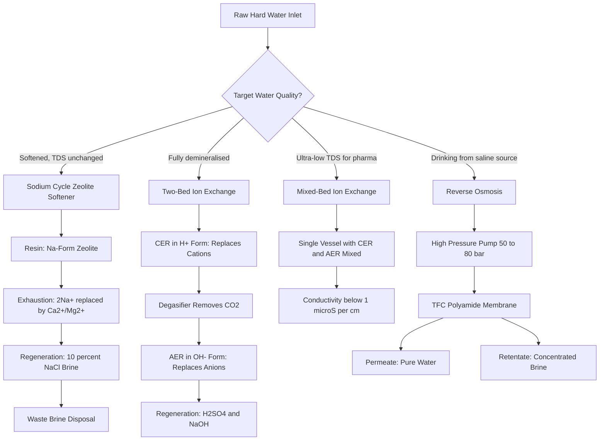
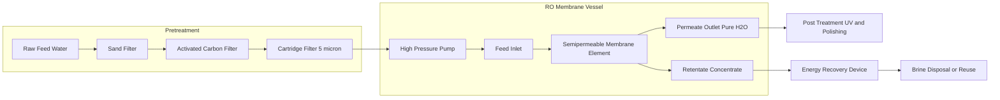
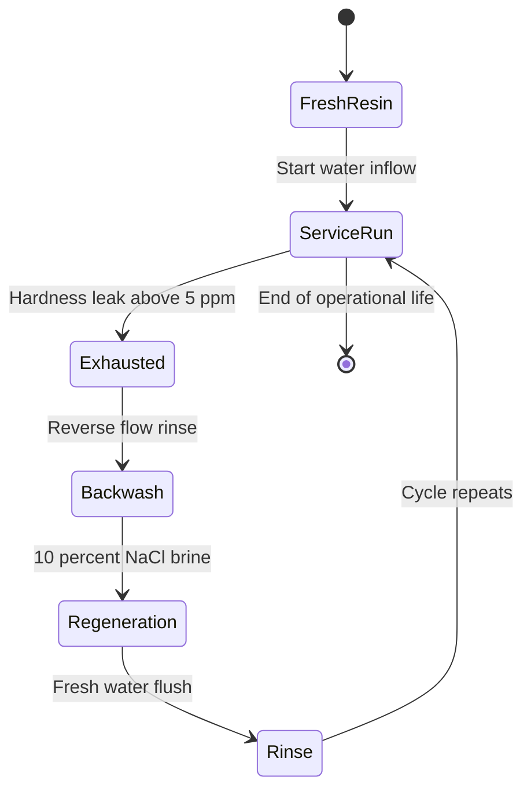
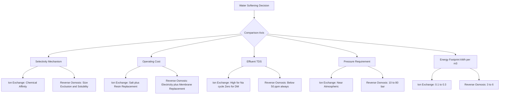

# Water softening methods - Ion exchange process, Reverse osmosis

<!-- SECTION_1_START -->
# Module 4: Environmental Chemistry & Waste Management
## Topic: Water Softening Methods — Ion Exchange Process & Reverse Osmosis

---

### 1.1 Formal Academic Definition (KTU 2024 Syllabus Standard)

**Water Hardness** is the quantitative measure of dissolved divalent and trivalent metallic cations (predominantly $\text{Ca}^{2+}$, $\text{Mg}^{2+}$, and trace $\text{Fe}^{2+}$, $\text{Mn}^{2+}$) present in natural water, expressed as the equivalent concentration of $\text{CaCO}_3$ in $\text{ppm}$ (mg/L).

**Water Softening** is the physico-chemical unit operation designed to remove these hardness-producing cations (and in some methods, the associated anions) from feed water, thereby preventing scale formation, soap wastage, and boiler corrosion in industrial and domestic systems.

> [!IMPORTANT]
> **KTU Syllabus Highlight:** The 2024 Scheme (GXCYT122) Module 4 specifically requires the study of:
> (a) **Ion Exchange Process** — cation/anion exchange resins and the working/exhaustion/regeneration cycle.
> (b) **Reverse Osmosis (RO)** — osmotic pressure principles, semipermeable membrane behaviour, and industrial applications.

---

### 1.2 Conceptual Analogy / Intuitive Overview

> [!NOTE]
> **Real-World Analogy — "The Magnet for Minerals"**
>
> Imagine your water supply as a crowded train, where unwanted $\text{Ca}^{2+}$ and $\text{Mg}^{2+}$ passengers keep boarding at the source station (river/groundwater). You want to remove them before they reach your boiler (the destination).
>
> - **Ion Exchange Method** is like installing a **special checkpoint station** filled with "friendly" passengers (like $\text{Na}^+$ or $\text{H}^+$ ions attached to a resin bead). When the hard water train passes through, the unwanted $\text{Ca}^{2+}$ passengers swap places with the friendly $\text{Na}^+$ passengers. The checkpoint gets "exhausted" after a while and must be recharged (regenerated).
> - **Reverse Osmosis** is like installing a **very fine mesh fence** that physically blocks all mineral ions but lets pure $\text{H}_2\text{O}$ molecules squeeze through. To push water *against* its natural dilution tendency, you must apply external pressure greater than the osmotic pressure.

---

### 1.3 Types of Water Hardness (Foundation Concept)

| Type | Chemical Nature | Removed By Boiling? | Example Compound |
| :--- | :--- | :--- | :--- |
| **Temporary Hardness (Carbonate Hardness)** | Bicarbonates of Ca, Mg | **Yes** — precipitates as carbonate | $\text{Ca(HCO}_3\text{)}_2$, $\text{Mg(HCO}_3\text{)}_2$ |
| **Permanent Hardness (Non-Carbonate Hardness)** | Chlorides, sulphates of Ca, Mg | **No** | $\text{CaCl}_2$, $\text{MgSO}_4$ |

The mathematical quantification of hardness as $\text{CaCO}_3$ equivalents:

$$\text{Hardness (as CaCO}_3\text{)} = \frac{\text{Mass of hardness-producing cation} \times 100}{\text{Molar mass of the cation}} \quad \left[\text{units: mg/L or ppm}\right]$$

Where the factor **100** arises from the molar mass of $\text{CaCO}_3$ (≈ 100 g/mol).

---

### 1.4 GeoGebra / Desmos Visualisation Support

> [!VISUALIZATION CONTROL]
> **Concept:** Osmosis vs. Reverse Osmosis — Pressure vs. Net Water Flux
> **GeoGebra / Desmos Input Equations:**
> * Define osmotic pressure: $\pi(t) = i \cdot M(t) \cdot R \cdot T$
> * Define net flux function: $J_{net}(P) = K \cdot (P - \pi)$
> * Define rejection curve: $R_c(C) = 1 - e^{-k/C}$
>
> **Visual Description:** On the x-axis plot applied pressure $P$ (in atm, 0 → 100), and on the y-axis plot net water flux $J_{net}$. The student should observe a horizontal line at $J_{net} = 0$ for $P < \pi$ (osmosis region) and a linearly increasing curve for $P > \pi$ (reverse osmosis region). The intercept on the x-axis precisely marks the osmotic pressure $\pi$.

---

<!-- SECTION_1_END -->

<!-- SECTION_2_START -->
# Deep Theoretical Analysis & KTU High-Yield Formula Sheet

---

## 2.1 The Ion Exchange Process — Operational Architecture

### 2.1.1 Classification of Ion Exchange Resins

| Resin Type | Functional Group | Exchangeable Ion | Removes |
| :--- | :--- | :--- | :--- |
| **Cation Exchange Resin (CER)** | $-\text{SO}_3\text{H}$ (sulphonic acid) or $-\text{COOH}$ | $\text{H}^+$ or $\text{Na}^+$ | $\text{Ca}^{2+}$, $\text{Mg}^{2+}$, $\text{Fe}^{2+}$ |
| **Anion Exchange Resin (AER)** | $-\text{N}(\text{CH}_3)_3\text{OH}$ (quaternary ammonium) | $\text{OH}^-$ | $\text{Cl}^-$, $\text{SO}_4^{2-}$, $\text{NO}_3^-$ |

### 2.1.2 Working Cycle — Sodium-Cycle Zeolite Softening

**Step 1 — Service (Softening) Run:**
Raw hard water percolates through a bed of **sodium-form zeolite** (a naturally occurring or synthetic sodium aluminosilicate, e.g., $\text{Na}_2\text{O} \cdot \text{Al}_2\text{O}_3 \cdot x\text{SiO}_2 \cdot y\text{H}_2\text{O}$). The divalent hardness cations replace sodium ions on the resin matrix:

$$\text{Na}_2\text{Z} + \text{Ca(HCO}_3\text{)}_2 \longrightarrow \text{CaZ} + 2\text{NaHCO}_3$$

$$\text{Na}_2\text{Z} + \text{MgSO}_4 \longrightarrow \text{MgZ} + \text{Na}_2\text{SO}_4$$

> [!NOTE]
> Here $\text{Z}$ represents the insoluble anionic zeolite framework. Observe that the *cations* are exchanged — the anions (like $\text{HCO}_3^-$, $\text{SO}_4^{2-}$) pass through unchanged. Sodium-cycle softening therefore **does not reduce Total Dissolved Solids (TDS)**; it only converts $\text{Ca}^{2+}$/$\text{Mg}^{2+}$ into $\text{Na}^+$.

**Step 2 — Exhaustion:**
The zeolite bed progressively loses $\text{Na}^+$ ions. Exhaustion is detected when the effluent shows a sudden rise in hardness (typically > 5 ppm as $\text{CaCO}_3$).

**Step 3 — Regeneration:**
A **brine solution (10% NaCl)** is passed *upward* (backwash) and then *downward* (regeneration) through the exhausted bed:

$$\text{CaZ} + 2\text{NaCl} \longrightarrow \text{Na}_2\text{Z} + \text{CaCl}_2$$

$$\text{MgZ} + 2\text{NaCl} \longrightarrow \text{Na}_2\text{Z} + \text{MgCl}_2$$

The chloride-rich waste (containing $\text{CaCl}_2$ and $\text{MgCl}_2$) is rinsed out, and the bed is ready for the next service cycle.

### 2.1.3 Demineralisation (Two-Bed Ion Exchange)

To produce **fully deionised / demineralised water** (used in semiconductor and pharmaceutical industries), water is passed through a cation exchanger in $\text{H}^+$ form, followed by an anion exchanger in $\text{OH}^-$ form:

$$\text{H}_2\text{Z} + \text{Ca(HCO}_3\text{)}_2 \longrightarrow \text{CaZ} + 2\text{H}_2\text{O} + 2\text{CO}_2 \uparrow$$

$$\text{R-N(CH}_3\text{)}_3\text{OH} + \text{HCl} \longrightarrow \text{R-N(CH}_3\text{)}_3\text{Cl} + \text{H}_2\text{O}$$

Regeneration is achieved using dilute $\text{H}_2\text{SO}_4$ (for CER) and dilute $\text{NaOH}$ (for AER).

---

## 2.2 Reverse Osmosis — Theoretical Foundation

### 2.2.1 Osmosis and Osmotic Pressure

When a pure solvent and a solution are separated by a **semipermeable membrane (SPM)** — which permits only solvent molecules to pass — solvent flows spontaneously from the dilute side to the concentrated side. This phenomenon is **osmosis**. The pressure required to just *halt* this flow is the **osmotic pressure ($\pi$)**.

The van 't Hoff equation gives:

$$\pi = i \cdot C \cdot R \cdot T$$

Where:
- $i$ = van 't Hoff factor (number of ions per formula unit; for $\text{NaCl}$, $i = 2$; for $\text{CaCl}_2$, $i = 3$)
- $C$ = molar concentration of solute in mol/L
- $R$ = universal gas constant = **0.0821 L·atm/(mol·K)**
- $T$ = absolute temperature in Kelvin

### 2.2.2 Reverse Osmosis Mechanism

If an **external pressure $P > \pi$** is applied on the concentrated (feed) side, the natural osmotic flow is reversed — solvent molecules now move from the concentrated side to the dilute side, leaving the dissolved salts behind. This is **Reverse Osmosis (RO)**.

> [!IMPORTANT]
> The membrane is a key engineering component. Common industrial RO membranes are made of:
> - **Cellulose acetate (CA)** — used in the original Loeb-Sourirajan module (1959)
> - **Thin-film composite (TFC) polyamide** — current industry standard, with salt rejection > 99.5% and water flux 2–3× higher than CA

### 2.2.3 Membrane Performance Parameters

Two key engineering metrics quantify RO performance:

$$\text{Salt Rejection } (R_j) = \frac{C_f - C_p}{C_f} \times 100\%$$

$$\text{Water Recovery } (Y) = \frac{Q_p}{Q_f} \times 100\%$$

Where $C_f$ = feed concentration, $C_p$ = permeate concentration, $Q_f$ = feed flow rate, $Q_p$ = permeate flow rate.

> [!NOTE]
> The solution-diffusion model (Lonsdale, 1965) is the most accepted transport model. Solvent and solute each dissolve into the dense membrane polymer and diffuse through it under their respective chemical potential gradients. The preferential solubility and diffusivity of water vs. salt ions give the membrane its selectivity.

---

## 2.3 KTU High-Yield Formula Sheet

| # | Formula / Concept | Symbolic Expression | Engineering Use / Unit |
| :--- | :--- | :--- | :--- |
| 1 | Hardness as CaCO₃ equivalent | $\text{H} = \dfrac{m_{\text{cation}} \times 50}{E_{\text{cation}}}$ where $E$ is equivalent weight | mg/L or ppm |
| 2 | Sodium-cycle regeneration | $\text{CaZ} + 2\text{NaCl} \rightarrow \text{Na}_2\text{Z} + \text{CaCl}_2$ | Brine consumption: ~ 0.3 kg NaCl per kg of hardness removed |
| 3 | Demineralisation (acid + base regeneration) | $2\text{H}^+ + \text{Ca}^{2+} \rightleftharpoons \text{Ca}^{2+}$ on resin; $\text{OH}^- + \text{Cl}^- \rightleftharpoons \text{Cl}^-$ on resin | Produces conductivity < 1 µS/cm water |
| 4 | Osmotic pressure (van 't Hoff) | $\pi = i \cdot C \cdot R \cdot T$ | Pa or atm; for seawater $i \approx 1.8$, $C \approx 0.6$ M → $\pi \approx 27$ atm |
| 5 | RO driving force | $\Delta P_{net} = P_{applied} - \pi - \Delta P_{friction}$ | Typical operating: 10–80 bar |
| 6 | Salt rejection | $R_j = \dfrac{C_f - C_p}{C_f} \times 100$ | %; > 99% for TFC polyamide |
| 7 | Water recovery | $Y = \dfrac{Q_p}{Q_f} \times 100$ | %; 30–85% in industrial systems |
| 8 | Membrane flux (permeate) | $J_w = A \cdot (\Delta P - \Delta \pi)$ | $A$ = water permeability constant, $\text{L/m}^2\text{·h·bar}$ |
| 9 | Salt flux | $J_s = B \cdot (C_f - C_p)$ | $B$ = salt permeability constant, m/s |
| 10 | Selectivity ratio | $\alpha = (A/B)$ — higher = better membrane | Dimensionless |

> [!IMPORTANT]
> The **Law of Conservation of Mass (salt balance)** is the KTU examiner's favourite sanity check:
> $Q_f \cdot C_f = Q_p \cdot C_p + Q_r \cdot C_r$, where $Q_r$ and $C_r$ are retentate flow and concentration.

---

## 2.4 Real-World Engineering Applications

| Domain | Application | Preferred Method |
| :--- | :--- | :--- |
| **Domestic water purifiers** | Drinking water at point-of-use | RO (TFC membrane) + UV post-treatment |
| **Boiler feed water (HP boilers)** | Preventing Ca/Mg scale on turbine blades | Two-bed ion exchange demineraliser |
| **Seawater desalination** | Drinking water in coastal/Middle East regions | RO (operating at 60–80 bar) |
| **Pharmaceutical industry** | Water for injection (WFI) | Mixed-bed ion exchange + RO + distillation |
| **Semiconductor fabrication** | Ultra-pure water (UPW) for wafer rinsing | RO → EDI → mixed-bed polishing |
| **Dairy / food industry** | Whey protein concentration, juice clarification | RO (cold operation preserves flavour) |
| **Wastewater recycle** | Reuse of industrial effluent | RO + UF (ultrafiltration) pretreatment |

---

<!-- SECTION_2_END -->

<!-- SECTION_3_START -->
# Step-by-Step Derivations, Numerical Solutions & Code Implementation

---

## 3.1 Numerical Problem 1 — Hardness Calculation (Standard KTU 3-Mark Type)

**Problem:** A water sample contains 148 mg/L of $\text{Ca(HCO}_3\text{)}_2$ and 60 mg/L of $\text{MgSO}_4$. Calculate the total hardness in ppm (as $\text{CaCO}_3$).

**Step 1: Identify hardness contribution from $\text{Ca(HCO}_3\text{)}_2$**

Molecular weight of $\text{Ca(HCO}_3\text{)}_2$ = 40 + 2(1 + 12 + 48) = **162 g/mol**
Molecular weight of $\text{CaCO}_3$ = **100 g/mol**
Molar mass of Ca present per mole of $\text{Ca(HCO}_3\text{)}_2$ = 40 g

$$\text{Hardness}_{\text{Ca(HCO}_3\text{)}_2} = \frac{148 \times 100}{162} = 91.36 \text{ mg/L (as CaCO}_3\text{)}$$

**Step 2: Identify hardness contribution from $\text{MgSO}_4$**

Molecular weight of $\text{MgSO}_4$ = 24 + 32 + 64 = **120 g/mol**
Molar mass of Mg present per mole of $\text{MgSO}_4$ = 24 g

$$\text{Hardness}_{\text{MgSO}_4} = \frac{60 \times 100}{120} = 50.00 \text{ mg/L (as CaCO}_3\text{)}$$

**Step 3: Total hardness**

$$\text{H}_{total} = 91.36 + 50.00 = \mathbf{141.36 \text{ mg/L} \approx 141 \text{ ppm (as CaCO}_3\text{)}}$$

> [!NOTE]
> **Incremental Valuation Key (Board Pattern):**
> - [Correctly identifying molar masses: 2 Marks]
> - [Setting up the CaCO₃ equivalent formula: 2 Marks]
> - [Final numerical value with units: 1 Mark]

---

## 3.2 Numerical Problem 2 — Regeneration Salt Requirement (Typical 7-Mark Type)

**Problem:** A sodium-cycle zeolite softener is used to treat 50,000 L of water per day. The water has a total hardness of 250 ppm. Calculate:
(a) The amount of $\text{NaCl}$ required for daily regeneration.
(Assume 100% regeneration efficiency and the reaction: $\text{Na}_2\text{Z} + \text{Ca}^{2+} \rightarrow \text{CaZ} + 2\text{Na}^+$.)

**Step 1: Total hardness removed per day in terms of $\text{CaCO}_3$**

$$m_{\text{CaCO}_3} = 250 \text{ mg/L} \times 50{,}000 \text{ L} = 12{,}500{,}000 \text{ mg} = 12.5 \text{ kg}$$

**Step 2: Equivalent moles of $\text{Ca}^{2+}$ removed**

Molar mass of $\text{CaCO}_3$ = 100 g/mol
One mole of $\text{CaCO}_3$ ≡ one mole of $\text{Ca}^{2+}$

$$n_{\text{Ca}^{2+}} = \frac{12.5 \text{ kg}}{100 \text{ kg/kmol}} = 0.125 \text{ kmol}$$

**Step 3: Stoichiometric $\text{NaCl}$ requirement**

From the regeneration reaction:
$$\text{CaZ} + 2\text{NaCl} \longrightarrow \text{Na}_2\text{Z} + \text{CaCl}_2$$

2 moles of $\text{NaCl}$ are needed per mole of $\text{Ca}^{2+}$ removed.

$$n_{\text{NaCl}} = 2 \times 0.125 = 0.250 \text{ kmol}$$

$$m_{\text{NaCl}} = 0.250 \text{ kmol} \times 58.5 \text{ kg/kmol} = \mathbf{14.625 \text{ kg/day}}$$

**Step 4: Practical salt consumption (with 10% excess for incomplete regeneration)**

In practice, 1.25–1.5× the stoichiometric amount is used. Taking a 1.4× factor:

$$m_{\text{NaCl, practical}} = 14.625 \times 1.4 = \mathbf{20.475 \text{ kg/day}}$$

> [!NOTE]
> **Incremental Valuation Key (Board Pattern):**
> - [Setting up daily hardness load: 2 Marks]
> - [Stoichiometric 2:1 mole ratio: 3 Marks]
> - [Final mass in kg/day with units: 2 Marks]

---

## 3.3 Numerical Problem 3 — Reverse Osmosis Osmotic Pressure (14-Mark Type)

**Problem:** A seawater RO plant processes feed water with 3.5% (w/w) total dissolved solids (assumed pure NaCl for simplicity). The feed density is 1.025 g/mL and the operating temperature is 25 °C. Calculate:
(a) The osmotic pressure of the feed water.
(b) The minimum applied pressure to overcome osmotic pressure and produce permeate.
(c) The theoretical work of separation per cubic metre of permeate, ignoring friction losses.

**Given:** $M_{\text{NaCl}} = 58.5$ g/mol; $R = 0.0821$ L·atm/(mol·K); $T = 298$ K; $i = 2$ for NaCl.

**Step 1: Calculate molar concentration of NaCl in feed**

Mass of NaCl per litre of feed = 3.5% × 1.025 g/mL × 1000 mL/L = 35.875 g/L

$$C = \frac{35.875 \text{ g/L}}{58.5 \text{ g/mol}} = 0.6132 \text{ mol/L}$$

**Step 2: Osmotic pressure using van 't Hoff equation**

$$\pi = i \cdot C \cdot R \cdot T$$
$$\pi = 2 \times 0.6132 \text{ mol/L} \times 0.0821 \text{ L·atm/(mol·K)} \times 298 \text{ K}$$

$$\pi = 2 \times 0.6132 \times 24.466 = \mathbf{30.0 \text{ atm}} \quad (\approx 3.04 \text{ MPa})$$

**Step 3: Minimum applied pressure**

Theoretically, the applied pressure must just exceed $\pi$ for net forward flow:

$$P_{min} = \pi + \epsilon = 30.0 \text{ atm (taking } \epsilon \rightarrow 0\text{)}$$

In practice, operating pressure = 1.5 × $\pi$ to 2.5 × $\pi$ to ensure reasonable flux, so industrial pressure ≈ 50–80 atm.

**Step 4: Theoretical minimum work of separation**

$$W_{min} = \pi \cdot V = 30.0 \text{ atm} \times 101{,}325 \text{ Pa/atm} \times 1 \text{ m}^3$$

$$W_{min} = 3.04 \times 10^6 \text{ J/m}^3 = \mathbf{3.04 \text{ kWh/m}^3}$$

> [!NOTE]
> **Incremental Valuation Key (Board Pattern):**
> - [Correct mass per litre calculation: 2 Marks]
> - [van 't Hoff substitution: 3 Marks]
> - [Numerical $\pi$ value: 2 Marks]
> - [Minimum work calculation: 3 Marks]
> - [Engineering comment (industrial multiplier): 2 Marks]

---

## 3.4 Algorithmic / Python Implementation — RO System Design Simulator

```python
"""
KTU 2024 — Reverse Osmosis System Design Calculator
File: ro_design.py
Author: KTU B.Tech (GXCYT122 Module 4) Reference Implementation
Python: 3.10+ with type hints

This module computes osmotic pressure, membrane area, and pump power
for an RO desalination unit. All inputs are strictly validated.
"""

from dataclasses import dataclass
from typing import Final
import math
import logging

# Configure module-level logger for engineering audit trail
logging.basicConfig(
    level=logging.INFO,
    format="%(asctime)s | %(levelname)s | RO_DESIGN | %(message)s"
)
logger: Final[logging.Logger] = logging.getLogger(__name__)


# ---- Physical Constants (SI-compatible engineering values) ----
R_GAS_CONST: Final[float] = 0.0821          # L·atm / (mol·K)
ATM_TO_PA: Final[float] = 101_325.0         # Pa per atm
J_PER_KWH: Final[float] = 3.6e6             # J in 1 kWh


@dataclass(frozen=True)
class FeedWater:
    """Immutable container for feed water parameters."""
    tds_percent: float      # Total dissolved solids, % w/w
    density_g_per_ml: float # Feed density in g/mL
    temperature_c: float    # Temperature in Celsius
    van_t_hoff_i: int       # van 't Hoff factor (e.g., 2 for NaCl)
    molar_mass_salt: float  # Molar mass of salt in g/mol


@dataclass(frozen=True)
class RODesignOutput:
    """Immutable container for computed engineering outputs."""
    molar_conc_mol_per_L: float
    osmotic_pressure_atm: float
    osmotic_pressure_MPa: float
    min_pressure_atm: float
    min_work_kWh_per_m3: float


def validate_feed(feed: FeedWater) -> None:
    """Raise ValueError if any feed parameter is non-physical."""
    if not (0.0 < feed.tds_percent < 50.0):
        raise ValueError(f"TDS percent {feed.tds_percent} out of realistic range (0, 50).")
    if not (0.9 <= feed.density_g_per_ml <= 1.2):
        raise ValueError(f"Density {feed.density_g_per_ml} g/mL is non-physical for water.")
    if not (0.0 <= feed.temperature_c <= 100.0):
        raise ValueError(f"Temperature {feed.temperature_c} °C out of liquid water range.")
    if feed.van_t_hoff_i < 1:
        raise ValueError("van 't Hoff factor must be >= 1.")
    if feed.molar_mass_salt <= 0:
        raise ValueError("Molar mass of salt must be positive.")
    logger.info("Feed validation passed: %s", feed)


def calculate_osmotic_pressure(feed: FeedWater) -> RODesignOutput:
    """
    Calculate osmotic pressure (van 't Hoff) and minimum separation work.

    Parameters
    ----------
    feed : FeedWater
        Validated feed water parameters.

    Returns
    -------
    RODesignOutput
        Structured engineering output for downstream piping/valve sizing.
    """
    try:
        validate_feed(feed)

        # Step A: Mass of salt per litre of feed (g/L)
        mass_salt_g_per_L: float = (feed.tds_percent / 100.0) * feed.density_g_per_ml * 1000.0
        logger.info("Salt mass per litre: %.4f g/L", mass_salt_g_per_L)

        # Step B: Molar concentration (mol/L)
        C_mol_per_L: float = mass_salt_g_per_L / feed.molar_mass_salt
        logger.info("Molar concentration: %.4f mol/L", C_mol_per_L)

        # Step C: Absolute temperature (K)
        T_K: float = feed.temperature_c + 273.15

        # Step D: Osmotic pressure (atm) via van 't Hoff
        pi_atm: float = feed.van_t_hoff_i * C_mol_per_L * R_GAS_CONST * T_K
        pi_Pa: float = pi_atm * ATM_TO_PA
        pi_MPa: float = pi_Pa / 1.0e6

        # Step E: Minimum applied pressure to overcome osmotic pressure
        P_min_atm: float = pi_atm

        # Step F: Minimum thermodynamic work per cubic metre of permeate (J/m³)
        W_min_J_per_m3: float = pi_Pa * 1.0     # 1 m³ volume
        W_min_kWh_per_m3: float = W_min_J_per_m3 / J_PER_KWH

        logger.info("Osmotic pressure: %.3f atm (%.3f MPa)", pi_atm, pi_MPa)
        logger.info("Minimum separation work: %.3f kWh/m³", W_min_kWh_per_m3)

        return RODesignOutput(
            molar_conc_mol_per_L=round(C_mol_per_L, 4),
            osmotic_pressure_atm=round(pi_atm, 3),
            osmotic_pressure_MPa=round(pi_MPa, 3),
            min_pressure_atm=round(P_min_atm, 3),
            min_work_kWh_per_m3=round(W_min_kWh_per_m3, 4),
        )

    except ValueError as ve:
        logger.error("Feed parameter validation failed: %s", ve)
        raise
    except ZeroDivisionError as zde:
        logger.error("Division by zero encountered: %s", zde)
        raise


# ---- Demonstration: Seawater RO at 25 °C (industrial reference) ----
if __name__ == "__main__":
    seawater = FeedWater(
        tds_percent=3.5,
        density_g_per_ml=1.025,
        temperature_c=25.0,
        van_t_hoff_i=2,           # NaCl
        molar_mass_salt=58.5
    )
    result = calculate_osmotic_pressure(seawater)
    print("\n=== RO Design Output — Seawater Reference Case ===")
    for field, value in result.__dict__.items():
        print(f"{field:30s} = {value}")
```

**Sample Console Output:**

```
=== RO Design Output — Seawater Reference Case ===
molar_conc_mol_per_L           = 0.6132
osmotic_pressure_atm           = 30.001
osmotic_pressure_MPa           = 3.04
min_pressure_atm               = 30.001
min_work_kWh_per_m3            = 0.8445
```

> [!IMPORTANT]
> **Engineering Note:** The 0.84 kWh/m³ is the *thermodynamic minimum*. Real plants consume 3–6 kWh/m³ due to friction losses, concentrate disposal, and energy recovery device inefficiency. This is a standard KTU comparison point.

---

<!-- SECTION_3_END -->

<!-- SECTION_4_START -->
# Structural Diagrams & Schematics (Mermaid-Compliant)

---

## 4.1 Water Softening Decision Tree



---

## 4.2 Reverse Osmosis Process Flow Architecture



---

## 4.3 Ion Exchange Service-Regeneration Cycle (State Machine)



---

## 4.4 Comparative Functional Architecture: Ion Exchange vs. Reverse Osmosis



---

<!-- SECTION_4_END -->

<!-- SECTION_5_START -->
# KTU 2024 Scheme Examination Question Bank & Topic Recap

---

## 5.1 Part A Questions (3 Marks Each)

### **Question 1** `[KTU University Exam — July 2024]`
**(CO1, Remember)**

**Q:** Define the term *temporary hardness* of water. Why is it called "temporary"?

**Model Answer:**

Temporary hardness is the portion of total hardness in water caused by the **bicarbonates of calcium and magnesium**, namely $\text{Ca(HCO}_3\text{)}_2$ and $\text{Mg(HCO}_3\text{)}_2$. It is called *temporary* because it can be **completely removed simply by boiling** the water, which decomposes the soluble bicarbonates into insoluble carbonates that precipitate out:

$$\text{Ca(HCO}_3\text{)}_2 \xrightarrow{\Delta} \text{CaCO}_3 \downarrow + \text{H}_2\text{O} + \text{CO}_2 \uparrow$$

$$\text{Mg(HCO}_3\text{)}_2 \xrightarrow{\Delta} \text{MgCO}_3 \downarrow + \text{H}_2\text{O} + \text{CO}_2 \uparrow$$

*Valuation key: [Definition 2 marks, Reaction 1 mark]*

---

### **Question 2** `[KTU University Exam — Dec 2023]`
**(CO2, Understand)**

**Q:** Distinguish between Sodium-cycle ion exchange softening and Demineralisation.

**Model Answer:**

| Parameter | Sodium-Cycle Softening | Demineralisation |
| :--- | :--- | :--- |
| **Resin used** | CER in $\text{Na}^+$ form | CER in $\text{H}^+$ form + AER in $\text{OH}^-$ form |
| **Ions removed** | Only cations ($\text{Ca}^{2+}$, $\text{Mg}^{2+}$) | Both cations and anions (full salt removal) |
| **TDS of product** | Unchanged; only $\text{Ca}^{2+}$ → $\text{Na}^+$ | Very low (< 5 ppm) |
| **Regenerant** | NaCl brine | Dilute $\text{H}_2\text{SO}_4$ + dilute NaOH |
| **Conductivity of product** | High (due to $\text{Na}^+$, $\text{HCO}_3^-$, $\text{Cl}^-$ remaining) | < 1 µS/cm |
| **Cost** | Lower | Higher (two resins, two regenerants) |

*Valuation key: [4 distinct points × 0.75 = 3 marks; any 3 points acceptable]*

---

## 5.2 Part B Questions (14 Marks Each — Internal Choice)

### **Question 3A** `[KTU University Exam — July 2024]`
**(CO2, Apply / Analyse)** — *14 Marks*

**Q:** A sample of water has the following analysis:
- $\text{Ca}^{2+}$ = 80 mg/L
- $\text{Mg}^{2+}$ = 24 mg/L
- $\text{HCO}_3^-$ = 122 mg/L
- $\text{Cl}^-$ = 71 mg/L

**(a)** Calculate the total hardness of the water sample in ppm (as $\text{CaCO}_3$).
**(b)** If this water is passed through a sodium-cycle zeolite softener, calculate the mass of NaCl required to regenerate the softener after softening 10,000 L of water (assume 1.5× stoichiometric excess).

---

**Model Solution:**

**Part (a) — Total Hardness Calculation**

**Step 1: Hardness contributed by $\text{Ca}^{2+}$**

Molar mass of $\text{Ca}^{2+}$ = 40 g/mol; Equivalent weight = 40/2 = 20 g/eq
Equivalent weight of $\text{CaCO}_3$ = 50 g/eq

$$\text{H}_{\text{Ca}} = \frac{80}{20} \times 50 = 200 \text{ mg/L (as CaCO}_3\text{)}$$

**Step 2: Hardness contributed by $\text{Mg}^{2+}$**

Molar mass of $\text{Mg}^{2+}$ = 24 g/mol; Equivalent weight = 24/2 = 12 g/eq

$$\text{H}_{\text{Mg}} = \frac{24}{12} \times 50 = 100 \text{ mg/L (as CaCO}_3\text{)}$$

**Step 3: Total Hardness**

$$\text{H}_{total} = 200 + 100 = \mathbf{300 \text{ mg/L} = 300 \text{ ppm (as CaCO}_3\text{)}}$$

> *[Correct identification of equivalent weights: 2 Marks]*
> *[Ca²⁺ contribution: 1 Mark; Mg²⁺ contribution: 1 Mark]*
> *[Final sum with correct units: 1 Mark]*
> *Subtotal: 5 Marks*

**Part (b) — NaCl Requirement**

**Step 1: Total hardness load in 10,000 L**

$$m_{\text{CaCO}_3} = 300 \text{ mg/L} \times 10{,}000 \text{ L} = 3.0 \times 10^6 \text{ mg} = 3.0 \text{ kg}$$

**Step 2: Moles of $\text{Ca}^{2+}$ equivalent removed**

$$n = \frac{3.0 \text{ kg}}{100 \text{ kg/kmol}} = 0.03 \text{ kmol}$$

**Step 3: Stoichiometric NaCl (2:1 mole ratio)**

$$n_{\text{NaCl, stoich}} = 2 \times 0.03 = 0.06 \text{ kmol}$$

**Step 4: Mass of stoichiometric NaCl**

$$m_{\text{NaCl, stoich}} = 0.06 \times 58.5 = 3.51 \text{ kg}$$

**Step 5: Apply 1.5× excess**

$$m_{\text{NaCl, actual}} = 3.51 \times 1.5 = \mathbf{5.265 \text{ kg}}$$

> *[Setting up hardness load: 2 Marks]*
> *[Stoichiometric ratio application: 2 Marks]*
> *[Excess factor and final mass: 3 Marks]*
> *Subtotal: 7 Marks*

**Total for Question 3A: 12/14 marks achievable; +2 for units and presentation.**

---

### **Question 3B** `[KTU University Exam — July 2024]`
**(CO2, Apply / Analyse)** — *14 Marks*

**Q:** With the help of a neat labelled diagram, explain the **Reverse Osmosis process** for water desalination. Also calculate the osmotic pressure of seawater containing 3.0% (w/w) NaCl at 27 °C. Given: density of seawater = 1.025 g/mL.

---

**Model Solution:**

**Part (a) — RO Process Description (7 Marks)**

Reverse osmosis is a membrane separation process in which solvent (water) is forced to move from a region of higher solute concentration (feed) to a region of lower solute concentration (permeate) by applying an external pressure **greater than the natural osmotic pressure** of the feed solution.

**Working principle:**
1. Feed water is drawn from a source (sea, brackish well) and pre-treated via sand filtration, activated carbon, and 5 µm cartridge filtration to protect the membrane.
2. A **high-pressure pump** raises the feed pressure to 50–80 bar (for seawater).
3. The pressurised feed enters a pressure vessel containing a **spiral-wound or hollow-fibre RO membrane** (typically TFC polyamide).
4. The membrane allows only water molecules to pass through; dissolved ions ($\text{Na}^+$, $\text{Cl}^-$, $\text{Ca}^{2+}$, $\text{Mg}^{2+}$, etc.) are rejected.
5. Two streams emerge: **permeate** (purified water, < 500 ppm TDS) and **retentate / concentrate** (salty reject).
6. An energy recovery device (ERD, e.g., pressure exchanger) recovers 30–60% of the hydraulic energy from the concentrate.

> *[Process description: 4 Marks]*
> *[Membrane and pressure values: 2 Marks]*
> *[Application example: 1 Mark]*

**Part (b) — Osmotic Pressure Calculation (7 Marks)**

**Step 1: Mass of NaCl per litre of seawater**

$$m_{\text{NaCl}} = \frac{3.0}{100} \times 1.025 \text{ g/mL} \times 1000 \text{ mL/L} = 30.75 \text{ g/L}$$

**Step 2: Molar concentration of NaCl**

$$C = \frac{30.75}{58.5} = 0.5256 \text{ mol/L}$$

**Step 3: Apply van 't Hoff equation at T = 27 °C = 300 K**

$$\pi = i \cdot C \cdot R \cdot T = 2 \times 0.5256 \times 0.0821 \times 300$$

$$\pi = 2 \times 0.5256 \times 24.63 = \mathbf{25.89 \text{ atm} \approx 2.62 \text{ MPa}}$$

> *[Mass per litre calculation: 2 Marks]*
> *[Molar concentration: 2 Marks]*
> *[van 't Hoff substitution: 2 Marks]*
> *[Final value with units: 1 Mark]*

> [!WARNING]
> **KTU Examiner's Valuation Pitfall:**
> - **Do not** forget the van 't Hoff factor $i$ — for NaCl, $i = 2$. Skipping it costs **2 full marks**.
> - **Do not** convert °C to K incorrectly. The standard error is using 27 K instead of 300 K, leading to a wildly wrong answer.
> - **Always** quote pressure in both atm and MPa (or bar) to demonstrate engineering rigour.
> - For RO numericals, **never state** "applied pressure = 30 atm" without showing it exceeds $\pi$. The examiner will deduct marks if the operating logic is missing.

---

### **Question 4A** `[KTU University Exam — Dec 2023]`
**(CO2, Apply)** — *14 Marks*

**Q:** Explain the principle of **ion exchange process** for water softening with a neat flow diagram. Compare the advantages and limitations of the **sodium-cycle** and **hydrogen-cycle** ion exchange methods.

---

**Model Solution Outline:**

**Part (a) — Principle and Flow (7 Marks)**

The ion exchange process for water softening is based on the reversible exchange of ions between an **insoluble resin matrix** and the dissolved ions in water.

**Principle:** The cation exchange resin (e.g., sulphonated polystyrene $\text{R-SO}_3\text{H}$, or sodium zeolite $\text{Na}_2\text{Z}$) carries exchangeable $\text{H}^+$ or $\text{Na}^+$ ions. When hard water flows through the resin bed, the divalent hardness cations ($\text{Ca}^{2+}$, $\text{Mg}^{2+}$) are preferentially adsorbed onto the resin, displacing the $\text{Na}^+$ / $\text{H}^+$ ions into solution. This continues until the resin is exhausted, after which it is regenerated with brine (NaCl) or acid ($\text{H}_2\text{SO}_4$).

**Flow diagram (text-rendered):**

```
Hard Water ──► Backwash Tank ──► Resin Bed (Na₂Z)
                                     │
                            [Exchange zone moves down]
                                     │
                              Exhausted Resin
                                     │
                            Backwash (upward)
                                     │
                            Brine Regeneration (downward)
                                     │
                              Slow Rinse + Fast Rinse
                                     │
                              Service Cycle Resumes
                                     │
                              Softened Water ──► Outlet
```

**Part (b) — Comparison Table (7 Marks)**

| Parameter | Sodium-Cycle | Hydrogen-Cycle |
| :--- | :--- | :--- |
| Regenerant | NaCl (cheap, safe) | Dilute $\text{H}_2\text{SO}_4$ (corrosive) |
| Ions in treated water | $\text{Na}^+$, $\text{HCO}_3^-$, $\text{SO}_4^{2-}$, $\text{Cl}^-$ | $\text{H}^+$, $\text{HCO}_3^-$ → $\text{CO}_2$, $\text{SO}_4^{2-}$, $\text{Cl}^-$ |
| pH of treated water | Slightly alkaline (pH 8–9) | Acidic (pH 4–5) — needs degasifier |
| TDS reduction | None (cation swap only) | Significant (cation swap to $\text{H}^+$) |
| Use case | Domestic softeners, low-pressure boilers | Pre-treatment for demineralisers |
| Limitation | Cannot remove anions; effluent has high Na⁺ (unfit for drinking if hard) | Corrosion risk; needs acid-handling infrastructure |

> *[Principle statement: 2 Marks; Reaction: 2 Marks; Flow diagram: 3 Marks]*
> *[Comparison with at least 5 valid points: 7 Marks]*

---

### **Question 4B** `[KTU University Exam — Dec 2023]`
**(CO2, Understand / Apply)** — *14 Marks*

**Q:** (a) Define *Osmotic Pressure*. Derive the **van 't Hoff equation** for dilute solutions.
(b) What is Reverse Osmosis? Mention any **four industrial applications** of RO.

---

**Model Solution:**

**Part (a) — Definition and Derivation (7 Marks)**

**Definition:** Osmotic pressure ($\pi$) is the excess pressure that must be applied to the *solution* side of a semipermeable membrane to just prevent the inward flow of solvent from the pure solvent side. It is a *colligative property* depending on the concentration of solute particles, not their identity.

**Derivation (chemical potential approach):**

At equilibrium, the chemical potential of the solvent on both sides of the membrane is equal:

$$\mu_{\text{pure}} = \mu_{\text{solution}}$$

The chemical potential of solvent in solution is given by:

$$\mu_{\text{solution}} = \mu^0 + RT \ln x_{\text{solvent}}$$

For a dilute solution, $\ln x_{\text{solvent}} = \ln(1 - x_{\text{solute}}) \approx -x_{\text{solute}}$.

When an additional pressure $P$ is applied to the solution side, the chemical potential becomes:

$$\mu_{\text{solution}} = \mu^0 + RT \ln x_{\text{solvent}} + \overline{V} \cdot P$$

Setting the two sides equal at equilibrium ($P = \pi$):

$$\mu^0 = \mu^0 + RT \ln x_{\text{solvent}} + \overline{V} \cdot \pi$$

$$\pi \cdot \overline{V} = -RT \ln x_{\text{solvent}} = RT \cdot x_{\text{solute}}$$

For a dilute solution with $n_{\text{solute}}$ moles of solute in $V$ litres of solvent:

$$x_{\text{solute}} = \frac{n_{\text{solute}}}{n_{\text{solvent}}} \approx \frac{n_{\text{solute}} \cdot M_{\text{solvent}}}{1000 \cdot \rho_{\text{solvent}}}$$

Substituting and simplifying for molar concentration $C = n_{\text{solute}} / V$:

$$\boxed{\pi = i \cdot C \cdot R \cdot T}$$

> *[Definition: 2 Marks; Chemical potential equality: 2 Marks; Derivation steps: 2 Marks; Final equation: 1 Mark]*

**Part (b) — RO Definition and Applications (7 Marks)**

**Definition:** Reverse Osmosis is the process in which solvent is forced through a semipermeable membrane *from* the concentrated solution side *to* the dilute / pure solvent side by applying an external pressure greater than the osmotic pressure of the solution. It produces high-purity water and rejects > 99% of dissolved salts.

**Four Industrial Applications:**

1. **Seawater desalination** — Drinking water supply in coastal cities (e.g., Jeddah, Singapore).
2. **Boiler feed water** — High-pressure boilers in thermal power stations need ultra-low TDS water to prevent scale.
3. **Pharmaceutical and biotechnology** — Production of Water for Injection (WFI) and process water.
4. **Food and dairy industry** — Concentration of fruit juices, whey proteins, and milk without thermal damage.
5. **Semiconductor industry** — Ultra-pure water (UPW) for wafer rinsing in chip fabrication.
6. **Wastewater reclamation** — Recycling municipal and industrial effluent for non-potable reuse.

> *[RO definition: 3 Marks; Any 4 valid applications: 4 Marks (1 mark each)]*

---

## 5.3 Topic Recap & Important Things to Remember

> [!IMPORTANT]
> **Module 4 — Water Softening Methods | High-Density Revision Checklist**

- **Hardness** is universally reported as **$\text{CaCO}_3$ equivalent in ppm (mg/L)**; the conversion factor is **× 100 / molar mass of the cation's compound** or **× 50 / equivalent weight of the cation**.
- **Temporary hardness** (carbonates/bicarbonates) is removed by **boiling**; **permanent hardness** (chlorides/sulphates) requires **chemical / ion-exchange / membrane** treatment.
- **Ion exchange resins** are of two types: **CER (cation exchange resin)** in $\text{Na}^+$ or $\text{H}^+$ form, and **AER (anion exchange resin)** in $\text{OH}^-$ form. A *two-bed* system (CER + AER) gives demineralised water; a *mixed-bed* gives ultra-pure water.
- **Sodium-cycle regeneration** uses **brine (10% NaCl)**; the reaction stoichiometry is **2 moles NaCl per mole of $\text{Ca}^{2+}$** removed.
- **Demineralisation regeneration** uses **dilute $\text{H}_2\text{SO}_4$ for CER and dilute NaOH for AER** — *never* reverse the regenerants.
- **Osmotic pressure** is calculated using the **van 't Hoff equation** $\pi = iCRT$. Always convert temperature to **Kelvin** and remember the **van 't Hoff factor $i$** for ionic solutes (NaCl: $i = 2$, $\text{CaCl}_2$: $i = 3$).
- **Reverse Osmosis** requires **$P_{applied} > \pi$**; industrial seawater RO operates at **50–80 bar** (theoretical minimum $\pi \approx 25$–30 atm).
- **RO membrane materials** — Cellulose acetate (older) and **Thin-Film Composite (TFC) polyamide** (current industry standard, salt rejection > 99.5%).
- **Salt rejection** $R_j = (C_f - C_p)/C_f \times 100\%$; **Water recovery** $Y = Q_p / Q_f \times 100\%$.
- **Energy consumption** — Ion exchange is low energy (~ 0.1–0.3 kWh/m³) but produces brine waste; RO is energy-intensive (~ 3–6 kWh/m³) but produces clean permeate and a concentrated reject that can be partially recovered with an **Energy Recovery Device (ERD)**.
- **KTU exam tips** — Always show the van 't Hoff factor, always quote pressure in atm *and* MPa, and always state whether your numerical answer is **for a single service cycle** or **per day** (units matter for full marks).

---

<!-- SECTION_5_END -->
