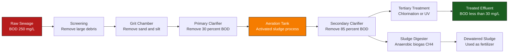
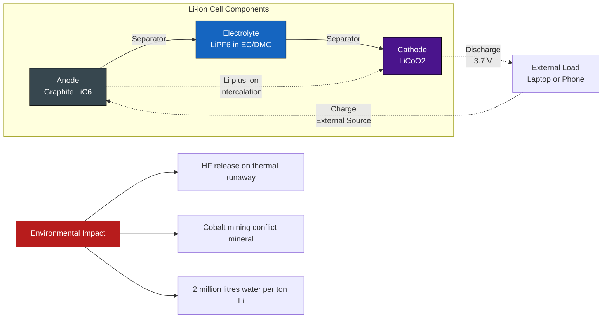
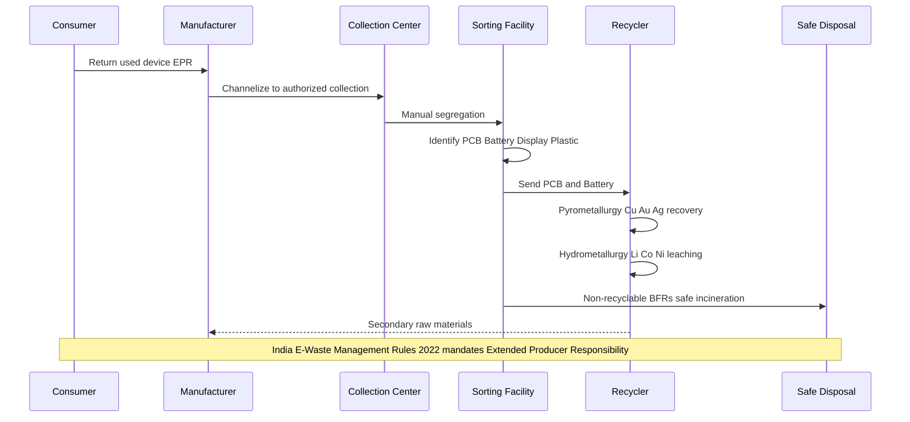
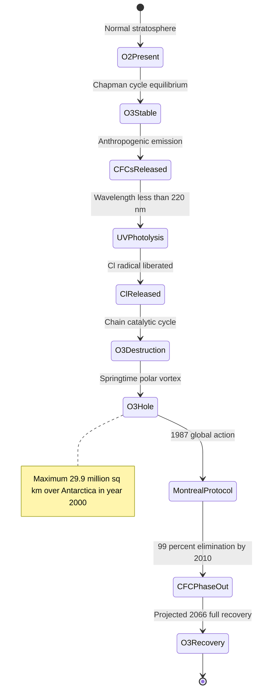

# Environmental Chemistry

<!-- SECTION_1_START -->
# 1. Core Technical Definition & Intuitive Overview

## Environmental Chemistry — Formal KTU 2024 Definition

> [!IMPORTANT]
> **Environmental Chemistry** is the branch of chemistry that deals with the study of the **origin, transport, reactions, effects, and fates of chemical species** in the environment — encompassing the **air, water, and soil spheres** (along with the **anthroposphere** generated by human technological activity such as electronics manufacturing, semiconductor fabrication, and electrical power generation).

In the specific context of **GXCYT122 (Chemistry for Information Science & Electrical Science)**, the KTU 2024 syllabus emphasizes the *techno-chemical intersections* — meaning how Information Technology hardware and Electrical/Electronic systems interact with natural chemical cycles through:

- **E-waste (Waste Electrical and Electronic Equipment — WEEE)**
- **Semiconductor fabrication chemistry & photoresist disposal**
- **Battery electrochemistry and end-of-life recycling**
- **Solar photovoltaic materials and clean-energy chemistry**
- **Green computing chemistry (Pb-free solders, halogen-free PCBs)**
- **Atmospheric emissions from thermal power plants (CO₂, SOₓ, NOₓ)**

> [!NOTE]
> **Core Definition (KTU Board Examiner Standard):**
> *Environmental chemistry is the scientific study of chemical and biochemical phenomena occurring in natural environments. It is NOT merely "pollution study" — it encompasses natural biogeochemical cycles, pollutant chemistry, green synthesis pathways, and sustainable engineering chemistry.*

---

## Conceptual Analogy / Intuition

> [!TIP]
> **"The Earth as a Giant Reaction Vessel" Analogy:**
> Imagine the Earth as a **closed chemical reactor** with three interconnected compartments:
> 1. **The Atmosphere** = the *gaseous headspace* of the reactor (≈ N₂, O₂, Ar, CO₂, H₂O vapor)
> 2. **The Hydrosphere** = the *liquid reaction medium* (oceans, rivers, groundwater)
> 3. **The Lithosphere** = the *solid catalyst bed* (rocks, soil, sediments)
>
> Humans, through industrial and technological activity, continuously **inject reagents** (pollutants) into this reactor. Environmental chemistry studies **how these injected species are transported, transformed, and whether the reactor can self-purify** — and when it cannot, how we can engineer remediation.

**Electrical/Computer Science Perspective Analogy:**
For a CS/ES student, think of the environment as a **massively distributed I/O system**:
- **Inputs** = industrial emissions, e-waste, mining runoff
- **Processing units** = atmosphere (photochemical reactions), water (hydrolysis/oxidation), soil (microbial degradation)
- **Outputs** = bioaccumulated toxins, greenhouse gases, contaminated groundwater
- **System Overload** = when inputs exceed the system's processing capacity → pollution

---

## Key Physical Constants & Standard Metrics

| Parameter | Value | Significance |
|---|---|---|
| **Global Mean Surface Temperature (2024)** | ≈ **1.45 °C above pre-industrial** | Paris Agreement threshold: 1.5 °C |
| **Atmospheric CO₂ concentration (2024)** | ≈ **422 ppm** | Pre-industrial: 280 ppm |
| **Tropospheric ozone threshold (harmful)** | > **100 µg/m³ (8-hr avg)** | WHO 2021 guideline |
| **BOD₅ for clean river water** | < **2 mg/L** | Drinking water target: < 1 mg/L |
| **pH of unpolluted rain** | ≈ **5.6** (natural CO₂ dissolution) | Acid rain threshold: pH < 5.0 |
| **E-waste generation globally (2024)** | ≈ **62 million tonnes/year** | Only **22.3% formally recycled** |
| **First ionization energy of N** | **1402 kJ/mol** | Explains N₂ atmospheric stability |
| **C–F bond dissociation energy** | **485 kJ/mol** | Why PFAS are "forever chemicals" |

---

## Section Overview — The Five Pillars of Module 4

1. **Atmospheric Chemistry & Pollution** — Greenhouse gases, smog, ozone depletion
2. **Water Chemistry & Treatment** — Hardness, BOD/COD, disinfection
3. **E-Waste & Semiconductor Industry Chemistry** — Specifically for CS/ES students
4. **Energy Storage & Environmental Impact** — Battery chemistry, fuel cells
5. **Green Chemistry & Sustainable Computing** — 12 Principles, Pb-free, biodegradable PCBs

> [!VISUALIZATION CONTROL]
> **Concept:** Spherical shell model of Earth's atmosphere with pollutant distribution layers
> **GeoGebra / Desmos Input Equations (parametric 2D projection):**
> * `x(t) = (R + 0.05*R*sin(5t)) * cos(t)`
> * `y(t) = (R + 0.05*R*sin(5t)) * sin(t)`
> * where `R = 5` (troposphere baseline), additional concentric circles at `R = 5.5` (stratosphere), `R = 6.5` (mesosphere)
> **Visual Description:** Student should observe nested circular shells; the troposphere (0–12 km) where weather and most pollution occur, the stratosphere (12–50 km) housing the protective **ozone layer**, and above it the mesosphere. Pollutants like CO₂ and CH₄ concentrate near the surface; CFCs rise into the stratosphere before being UV-photolyzed.

<!-- SECTION_1_END -->

<!-- SECTION_2_START -->
# 2. Deep Theoretical Analysis & KTU High-Yield Formula Sheet

## 2.1 Atmospheric Chemistry — Greenhouse Effect & Global Warming

The greenhouse effect operates on the principle of **vibrational-rotational infrared absorption** by polyatomic molecules.

### Mechanism (Step-by-Step Logic)

1. **Short-wave solar radiation** (λ ≈ 0.2 – 2.5 µm) passes through the atmosphere with minimal absorption (the atmosphere is largely transparent to visible light).
2. Earth's surface absorbs this radiation and **re-emits it as long-wave infrared (IR)** radiation (λ ≈ 4 – 100 µm), governed by **Wien's Displacement Law**:
3. Polyatomic "greenhouse gases" (CO₂, CH₄, N₂O, H₂O, O₃, CFCs) possess **dipole moments that change during molecular vibration** — making them IR-active.
4. These molecules **absorb outgoing IR**, become vibrationally excited, and **re-emit IR in all directions** — including back toward Earth.
5. Net result: **radiative forcing (ΔF)** leading to surface warming.

### Radiative Forcing Equation (Myhre et al., 1998 — IPCC Standard)

The radiative forcing for a well-mixed greenhouse gas is:

$$\Delta F = \alpha \cdot \ln\left(\frac{C}{C_0}\right)$$

Where:
- $\Delta F$ = radiative forcing in **W/m²**
- $\alpha$ = specific forcing coefficient (**5.35 W/m²** for CO₂, **0.036 W/m²** for CH₄, etc.)
- $C$ = current atmospheric concentration
- $C_0$ = pre-industrial reference concentration

### Global Warming Potential (GWP) — 100-Year Horizon

$$\text{GWP}_i = \frac{\int_0^{100} a_i \cdot C_i(t) \, dt}{\int_0^{100} a_{\text{CO}_2} \cdot C_{\text{CO}_2}(t) \, dt}$$

Where $a_i$ is the instantaneous radiative forcing per unit mass. **Reference values (IPCC AR6):**

| Gas | Lifetime | GWP₁₀₀ |
|---|---|---|
| **CO₂** | centuries | **1** (reference) |
| **CH₄** | 12 years | **27.9** |
| **N₂O** | 109 years | **273** |
| **HFC-134a** | 14 years | **1,530** |
| **SF₆** | 3,200 years | **25,200** |
| **CF₄** (used in semiconductor etching!) | 50,000 years | **7,380** |

> [!NOTE]
> **Why this matters for CS/ES students:** SF₆ is the most potent greenhouse gas listed in the Kyoto Protocol and is used as an **insulating gas in high-voltage circuit breakers** and as a **plasma-etching gas in semiconductor fabrication**. One kg of SF₆ has the warming equivalent of **25,200 kg of CO₂**.

---

## 2.2 Ozone Layer Chemistry (Stratospheric)

### Good Ozone vs Bad Ozone Distinction

- **Stratospheric ozone (15–35 km)** — *beneficial*; absorbs harmful UV-B (280–315 nm) and UV-C (100–280 nm)
- **Tropospheric ozone (0–10 km)** — *pollutant*; component of photochemical smog

### Chapman Cycle (1930) — Natural Ozone Formation/Destruction

$$\text{O}_2 + h\nu (\lambda < 240 \text{ nm}) \rightarrow 2\text{O}^{\bullet}$$

$$\text{O}^{\bullet} + \text{O}_2 + M \rightarrow \text{O}_3 + M \quad (\text{M} = \text{third body}, \text{e.g., N}_2)$$

$$\text{O}_3 + h\nu (\lambda < 320 \text{ nm}) \rightarrow \text{O}_2 + \text{O}^{\bullet}$$

$$\text{O}_3 + \text{O}^{\bullet} \rightarrow 2\text{O}_2$$

### CFC-Mediated Destruction (Molina–Rowland, 1974 — Nobel Prize 1995)

$$\text{CFCl}_3 + h\nu (\lambda < 220 \text{ nm}) \rightarrow \text{CFCl}_2^{\bullet} + \text{Cl}^{\bullet}$$

$$\text{Cl}^{\bullet} + \text{O}_3 \rightarrow \text{ClO}^{\bullet} + \text{O}_2$$

$$\text{ClO}^{\bullet} + \text{O}^{\bullet} \rightarrow \text{Cl}^{\bullet} + \text{O}_2$$

$$\boxed{\text{Net: } \text{O}_3 + \text{O}^{\bullet} \rightarrow 2\text{O}_2}$$

The Cl• radical is **regenerated** — it acts as a **chain catalyst**. A single Cl atom can destroy **~100,000 ozone molecules** before being sequestered (e.g., as HCl or ClONO₂).

---

## 2.3 Water Chemistry — Hardness, BOD, COD

### Temporary vs Permanent Hardness

**Temporary hardness** = Ca(HCO₃)₂ + Mg(HCO₃)₂ — removable by boiling:
$$\text{Ca(HCO}_3)_2 \xrightarrow{\Delta} \text{CaCO}_3 \downarrow + \text{H}_2\text{O} + \text{CO}_2$$

**Permanent hardness** = CaCl₂, CaSO₄, MgCl₂, MgSO₄ — removable by ion-exchange or chemical precipitation (e.g., Clark's method using Ca(OH)₂).

### Quantification of Hardness

Hardness is expressed as **mg/L of CaCO₃ equivalent** (or **ppm CaCO₃**):

$$\text{Hardness} = \frac{m_{\text{CaCO}_3 \text{ equivalent}}}{V_{\text{water}}} \quad \text{(in mg/L)}$$

**WHO classification:**
- **0 – 60 mg/L** → Soft
- **61 – 120 mg/L** → Moderately hard
- **121 – 180 mg/L** → Hard
- **> 180 mg/L** → Very hard

### BOD and COD — Oxygen Demand Metrics

**BOD (Biochemical Oxygen Demand):**
$$\text{BOD}_5 = (D_1 - D_2) \times \text{Dilution Factor}$$

Where $D_1$ = initial DO (dissolved oxygen) of diluted sample, $D_2$ = DO after 5 days at 20 °C.

**COD (Chemical Oxygen Demand)** uses strong oxidant (K₂Cr₂O₇ in H₂SO₄):
$$\text{Cr}_2\text{O}_7^{2-} + 14\text{H}^+ + 6e^- \rightarrow 2\text{Cr}^{3+} + 7\text{H}_2\text{O}$$

COD > BOD always (because COD oxidizes both biodegradable AND non-biodegradable organic matter).

> [!TIP]
> **Numerical Example:** A 5 mL water sample is diluted to 300 mL. Initial DO = 9.2 mg/L. DO after 5 days = 3.4 mg/L. Calculate BOD₅.
>
> $\text{Dilution Factor} = 300 / 5 = 60$
> $\text{BOD}_5 = (9.2 - 3.4) \times 60 = 5.8 \times 60 = 348 \text{ mg/L}$
>
> This **massively exceeds** the safe discharge limit of **30 mg/L** — indicating severe organic pollution.

---

## 2.4 E-Waste Chemistry — Why It Matters to CS/ES Students

### Composition of a Typical Smartphone (~150 g)

| Component | Material | Environmental Hazard |
|---|---|---|
| **PCB (printed circuit board)** | Cu, Au, Ag, Pd, Pb, Be | Heavy metal leaching |
| **LCD/OLED display** | Indium-tin oxide (ITO), liquid crystals (cyanobiphenyls) | In toxicity, bioaccumulation |
| **Battery (Li-ion)** | LiCoO₂, graphite, electrolyte (LiPF₆ in EC/DMC) | Thermal runaway → HF release |
| **Capacitors** | Tantalum (Ta₂O₅), MnO₂, Al | Tantalum = conflict mineral |
| **Plastic casing** | Brominated flame retardants (BFRs), ABS, PC | Dioxin emission on incineration |
| **Solder (legacy)** | Sn-Pb (63/37 eutectic) | Pb neurotoxicity |
| **Chips** | Si, GaAs, photoresist residues (PGMEA) | Solvent toxicity |

### RoHS Directive (Restriction of Hazardous Substances)

EU Directive **2002/95/EC** (and 2011/65/EU) restricts the use of:
- **Lead (Pb)** — < 0.1% by weight
- **Mercury (Hg)** — < 0.1%
- **Cadmium (Cd)** — < 0.01%
- **Hexavalent chromium (Cr⁶⁺)** — < 0.1%
- **Polybrominated biphenyls (PBB)** — < 0.1%
- **Polybrominated diphenyl ethers (PBDE)** — < 0.1%

> [!IMPORTANT]
> **Green Substitution Examples in Electronics:**
> - **Pb-free solder** → Sn-Ag-Cu (SAC) alloy (96.5% Sn, 3% Ag, 0.5% Cu), melts at **217 °C** vs 183 °C for Sn-Pb
> - **Halogen-free PCB** → replaces Br/Cl with N/P-based flame retardants
> - **Pb-free CRT glass** → uses SrO/BaO/ZnO as X-ray shielding

---

## 2.5 Battery Chemistry & Environmental Impact

### Lead-Acid Battery (most recycled product on Earth — 99% recycle rate)

**Discharge reaction:**
$$\text{Pb} + \text{PbO}_2 + 2\text{H}_2\text{SO}_4 \rightarrow 2\text{PbSO}_4 + 2\text{H}_2\text{O}$$

**Charge reaction (reverse, non-spontaneous, requires external E ≈ 2.1 V):**
$$2\text{PbSO}_4 + 2\text{H}_2\text{O} \rightarrow \text{Pb} + \text{PbO}_2 + 2\text{H}_2\text{SO}_4$$

**Environmental concern:** Improper smelting releases **Pb dust and SO₂**; lead-acid battery manufacturing is regulated under India's **Batteries (Management and Handling) Rules, 2001**.

### Lithium-Ion Battery (powers laptops, smartphones, EVs)

$$\text{C}_6 \vert \text{LiPF}_6 \text{ in EC/DMC} \vert \text{LiCoO}_2$$

**Discharge (spontaneous, E°_cell ≈ 3.7 V):**
- **Anode (oxidation):** $\text{Li}_x\text{C}_6 \rightarrow x\text{Li}^+ + xe^- + 6\text{C}$
- **Cathode (reduction):** $\text{Li}_{1-x}\text{CoO}_2 + x\text{Li}^+ + xe^- \rightarrow \text{LiCoO}_2$
- **Net:** $\text{Li}_x\text{C}_6 + \text{Li}_{1-x}\text{CoO}_2 \rightarrow 6\text{C} + \text{LiCoO}_2$

**Environmental concern:** Cobalt is a **conflict mineral** (DRC); Li extraction uses **~2 million liters of water per ton of Li** (Salar de Atacama, Chile); thermal runaway releases **HF, COF₂, POF₃** — all toxic.

---

## 2.6 KTU High-Yield Formula Sheet — Complete Module 4

| Concept | Formula | Units / Key Constants | Use Case |
|---|---|---|---|
| **Greenhouse Radiative Forcing** | $\Delta F = \alpha \cdot \ln(C/C_0)$ | W/m², $\alpha_{CO_2} = 5.35$ | Climate modeling |
| **Global Warming Potential** | $\text{GWP} = \int a_i C_i dt \, / \int a_{CO_2} C_{CO_2} dt$ | Dimensionless (100-yr) | Emission trading |
| **Hardness as CaCO₃** | $\text{Hardness} = \frac{m_{\text{Ca}^{2+}}}{V} \times \frac{100}{40}$ | mg/L CaCO₃ | Water treatment |
| **BOD₅** | $\text{BOD}_5 = (D_1 - D_2) \times \text{DF}$ | mg/L O₂ | Organic pollution |
| **COD** | $\text{COD} = \frac{(V_{\text{blank}} - V_{\text{sample}}) \times N \times 8000}{V_{\text{sample}}}$ | mg/L O₂ | Industrial effluent |
| **pOH / pH relationship** | $\text{pH} + \text{pOH} = 14$ (at 25 °C) | Dimensionless | Acid-base chemistry |
| **Acid Rain pH** | $\text{pH} = -\log[\text{H}^+]$ from $\text{H}_2\text{SO}_3$, $\text{H}_2\text{SO}_4$, $\text{HNO}_3$ | $< 5.0$ = acid rain | Atmospheric chem. |
| **Li-ion Cell EMF** | $E_{cell} = E_{cathode} - E_{anode} \approx 3.7 \text{ V}$ | Volts | Energy storage |
| **Photovoltaic Efficiency (Shockley-Queisser)** | $\eta_{max} = \frac{V_{oc} \cdot J_{sc} \cdot FF}{P_{in}}$ | % (max 33.7% for Si) | Solar cells |
| **Beer-Lambert Law** | $A = \varepsilon \cdot c \cdot \ell$ | A = absorbance, ε = molar absorptivity | Pollution spectrophotometry |
| **Ozone Destruction Rate (CFCl₃)** | Chain length ≈ 10⁵ per Cl atom | molecules destroyed per Cl | Stratospheric chem. |

> [!NOTE]
> **Engineering Utility in CS/ES Fields:**
> - **Server farms** consume ~1-2% of global electricity → cooling water chemistry (BOD, hardness scaling) is critical
> - **PCB fabrication** uses photoresists → waste streams must be treated for COD
> - **EV/smartphone design** → battery chemistries are a *direct* KTU 2024 syllabus topic for ES students
> - **Solar PV plants** → semiconductor purity, end-of-life Si panel recycling

<!-- SECTION_2_END -->

<!-- SECTION_3_START -->
# 3. Step-by-Step Derivations & Code/Symbolic Implementation

## 3.1 Derivation: Calculation of Total Hardness of a Water Sample

### Problem Statement
A 100 mL water sample requires 25 mL of 0.01 M EDTA solution for titration (using Eriochrome Black-T indicator). Calculate the **total hardness** in mg/L CaCO₃ equivalent. Given: Molar mass of CaCO₃ = 100 g/mol.

### Step-by-Step Solution

**Step 1: Write the complexometric titration reaction**

EDTA (Ethylenediaminetetraacetic acid, H₄Y) forms a 1:1 complex with Ca²⁺ and Mg²⁺:

$$\text{Ca}^{2+} + \text{Y}^{4-} \rightarrow [\text{CaY}]^{2-} \quad (K_f = 5.0 \times 10^{10})$$

$$\text{Mg}^{2+} + \text{Y}^{4-} \rightarrow [\text{MgY}]^{2-} \quad (K_f = 4.9 \times 10^8)$$

**Step 2: Calculate moles of EDTA used** [Setting up stoichiometry: 1 Mark]

$$n_{\text{EDTA}} = M \times V = 0.01 \text{ mol/L} \times 0.025 \text{ L} = 2.5 \times 10^{-4} \text{ mol}$$

**Step 3: By 1:1 stoichiometry, moles of (Ca²⁺ + Mg²⁺) = moles of EDTA** [Stoichiometric equality: 1 Mark]

$$n_{\text{Ca}^{2+}+\text{Mg}^{2+}} = 2.5 \times 10^{-4} \text{ mol}$$

**Step 4: Convert to CaCO₃ equivalent mass** [Mass conversion: 1 Mark]

$$m_{\text{CaCO}_3} = n \times M_r = 2.5 \times 10^{-4} \text{ mol} \times 100 \text{ g/mol} = 0.025 \text{ g} = 25 \text{ mg}$$

**Step 5: Convert to concentration in mg/L (per litre of water)** [Final conversion: 1 Mark]

$$\text{Hardness} = \frac{25 \text{ mg}}{0.1 \text{ L}} = \boxed{250 \text{ mg/L as CaCO}_3}$$

**Step 6: Classification** [Interpretation: 1 Mark]
Since 250 mg/L > 180 mg/L → **Very Hard water**. Not suitable for boilers without softening.

> [!WARNING]
> **Common KTU Valuation Mistakes:**
> - Forgetting to convert mL to L (use $V$ in **litres** for molarity calculations)
> - Using the atomic mass of Ca (40) instead of molar mass of CaCO₃ (100) — CaCO₃ is the *convention*
> - Not classifying the water quality at the end

---

## 3.2 Derivation: BOD₅ Calculation with Worked Example

### Problem Statement
A wastewater sample (5 mL) is added to a 300 mL BOD bottle filled with dilution water (saturated with O₂, seeded). Initial dissolved oxygen (DO) = 9.0 mg/L. After 5 days at 20 °C, DO = 4.0 mg/L. Calculate BOD₅.

### Step-by-Step Solution

**Step 1: Identify the dilution factor** [DF setup: 1 Mark]

$$\text{DF} = \frac{V_{\text{bottle}}}{V_{\text{sample}}} = \frac{300 \text{ mL}}{5 \text{ mL}} = 60$$

**Step 2: Apply BOD formula** [BOD equation: 1 Mark]

$$\text{BOD}_5 = (D_1 - D_2) \times \text{DF}$$

$$\text{BOD}_5 = (9.0 - 4.0) \text{ mg/L} \times 60 = 5.0 \times 60$$

$$\boxed{\text{BOD}_5 = 300 \text{ mg/L}}$$

**Step 3: Compare to effluent standards** [Interpretation: 1 Mark]

| Source | Permissible BOD (mg/L) |
|---|---|
| Inland surface water discharge | < 30 |
| Public sewers | < 350 |
| Land for irrigation | < 100 |

Since BOD = 300 mg/L, this wastewater is unsuitable for **inland surface water discharge** but acceptable for **public sewer** with treatment.

> [!NOTE]
> **Engineering Insight:** Most Indian municipal sewage treatment plants are designed for **influent BOD of 200–300 mg/L** and produce effluent with BOD < 30 mg/L — removing ~90% organic load via activated sludge process.

---

## 3.3 Derivation: EMF and Energy Density of a Li-ion Cell

### Problem Statement
A Li-ion cell uses LiC₆ anode and LiCoO₂ cathode. Given:
- $E°_{\text{Li}^+/\text{Li}} = -3.04$ V vs SHE
- $E°_{\text{CoO}_2/\text{LiCoO}_2} = +0.98$ V vs SHE (for the Co⁴⁺/Co³⁺ couple)
- Mass of active material: $m_{\text{anode}} = 7$ g (graphite), $m_{\text{cathode}} = 17$ g (LiCoO₂)
- $F = 96{,}485$ C/mol; Molar masses: C = 12, Co = 59, Li = 7, O = 16

### Step-by-Step Solution

**Step 1: Cell EMF** [Standard EMF: 1 Mark]

$$E°_{cell} = E°_{cathode} - E°_{anode} = (+0.98) - (-3.04) = +4.02 \text{ V (theoretical)}$$

**Step 2: Practical EMF correction** [Realistic value: 1 Mark]
Actual Li-ion cell EMF ≈ **3.6 – 3.7 V** (used in the equation). We'll use 3.7 V.

**Step 3: Charge transferred per mole of Li** [Faradaic charge: 1 Mark]
$$Q = n \cdot F = 1 \times 96{,}485 = 96{,}485 \text{ C/mol Li}$$

**Step 4: Theoretical energy per mole of Li** [Energy: 1 Mark]
$$W = Q \times E = 96{,}485 \times 3.7 = 357{,}000 \text{ J/mol} = 357 \text{ kJ/mol}$$

**Step 5: Energy density (Wh/kg)** [Final: 1 Mark]
Moles of Li available:
$$n_{\text{Li}} = \frac{7 \text{ g (anode limit assumed)}}{72 \text{ g/mol (LiC}_6)} = 0.0972 \text{ mol}$$

$$\text{Energy density} = \frac{357 \text{ kJ} \times 0.0972}{24 \text{ g (total active mass)}} = \frac{34.7}{0.024 \text{ kg}} = 1446 \text{ kJ/kg}$$

$$\boxed{\text{Energy density} = \frac{1446}{3.6} \approx 402 \text{ Wh/kg}}$$

> [!TIP]
> **Real Li-ion energy density** ≈ 150 – 250 Wh/kg (commercial cells). The theoretical value above is the upper bound; real values are lower due to inactive components (current collectors, electrolyte, separator, casing).

---

## 3.4 Python Implementation — Atmospheric Pollutant Concentration Modeling

This code implements a **Gaussian Plume dispersion model** (commonly used in environmental impact assessment for industrial stacks, including power plants and semiconductor fabs).

```python
"""
Gaussian Plume Dispersion Model for Atmospheric Pollutant Concentration
Used in: EIA (Environmental Impact Assessment) of industrial stacks
Subject: Environmental Chemistry - KTU GXCYT122 Module 4
Author: KTU Study Notes
"""

import math
from typing import Tuple


# Standard Pasquill-Gifford stability class sigma parameters
# (σ_y and σ_z as functions of downwind distance x in meters)
STABILITY_PARAMS = {
    "A": (0.22, 0.20),   # Very unstable
    "B": (0.16, 0.12),   # Moderately unstable
    "C": (0.11, 0.08),   # Slightly unstable
    "D": (0.08, 0.06),   # Neutral
    "E": (0.06, 0.03),   # Slightly stable
    "F": (0.04, 0.016),  # Stable
}


def gaussian_plume_concentration(
    Q: float,             # Emission rate (g/s)
    u: float,             # Wind speed at stack height (m/s) — MUST be > 0
    x: float,             # Downwind distance (m) — MUST be > 0
    y: float,             # Crosswind distance (m)
    z: float,             # Vertical height above ground (m)
    H: float,             # Effective stack height (m)
    stability_class: str  # One of "A", "B", "C", "D", "E", "F"
) -> float:
    """
    Compute ground-level pollutant concentration C(x, y, z) in µg/m³
    using the Gaussian Plume Model with reflection at the ground.
    
    Formula:
        C(x,y,z) = (Q / (2π u σ_y σ_z)) * exp(-y² / (2σ_y²))
                   * [exp(-(z-H)² / (2σ_z²)) + exp(-(z+H)² / (2σ_z²))]
    """
    # --- Absolute boundary checks ---
    if u <= 0:
        raise ValueError(f"Wind speed u must be > 0, got u = {u}")
    if x <= 0:
        raise ValueError(f"Downwind distance x must be > 0, got x = {x}")
    if stability_class not in STABILITY_PARAMS:
        raise ValueError(
            f"Invalid stability class '{stability_class}'. "
            f"Choose from: {list(STABILITY_PARAMS.keys())}"
        )

    # --- Compute dispersion coefficients σ_y and σ_z ---
    a, b = STABILITY_PARAMS[stability_class]
    sigma_y = a * x   # Simplified linear form for pedagogical use
    sigma_z = b * x
    if sigma_y == 0 or sigma_z == 0:
        raise ValueError("Computed sigma values are zero — invalid x or class.")

    # --- Concentration calculation ---
    # Crosswind Gaussian term
    lateral_term = math.exp(-(y ** 2) / (2 * sigma_y ** 2))

    # Vertical Gaussian term (with ground reflection — image source)
    vertical_term = (
        math.exp(-((z - H) ** 2) / (2 * sigma_z ** 2))
        + math.exp(-((z + H) ** 2) / (2 * sigma_z ** 2))
    )

    C = (Q / (2.0 * math.pi * u * sigma_y * sigma_z)) * lateral_term * vertical_term

    # Convert g/m³ to µg/m³ (1 g = 1,000,000 µg)
    return C * 1.0e6


def find_max_ground_concentration(
    Q: float,
    u: float,
    H: float,
    stability_class: str,
    x_min: float = 10.0,
    x_max: float = 10000.0,
    steps: int = 1000
) -> Tuple[float, float]:
    """
    Find the maximum ground-level (z=0, y=0) concentration 
    and the downwind distance x where it occurs.
    """
    best_C = 0.0
    best_x = x_min
    for i in range(1, steps + 1):
        x = x_min + (x_max - x_min) * (i / steps)
        C = gaussian_plume_concentration(
            Q=Q, u=u, x=x, y=0.0, z=0.0,
            H=H, stability_class=stability_class
        )
        if C > best_C:
            best_C = C
            best_x = x

    return best_C, best_x


# --- Example: Coal-fired power plant SO₂ emission ---
if __name__ == "__main__":
    # Stack parameters
    Q_so2   = 500.0    # SO₂ emission rate: 500 g/s
    u_wind  = 5.0      # Wind speed at stack height: 5 m/s
    H_stack = 60.0     # Effective stack height: 60 m
    stab    = "D"      # Neutral stability (overcast day)

    # 1) Compute concentration at a specific location
    C_at = gaussian_plume_concentration(
        Q=Q_so2, u=u_wind, x=2000.0, y=0.0, z=1.5,
        H=H_stack, stability_class=stab
    )
    print(f"Concentration at x=2 km on centerline (breathing height 1.5 m): {C_at:.2f} µg/m³")

    # 2) Find worst-case ground concentration
    C_max, x_max = find_max_ground_concentration(
        Q=Q_so2, u=u_wind, H=H_stack, stability_class=stab
    )
    print(f"Maximum ground-level concentration: {C_max:.2f} µg/m³ at x = {x_max:.0f} m")

    # 3) WHO / NAAQS comparison
    NAAQS_SO2_24hr = 80.0  # µg/m³ (Indian NAAQS 24-hr standard)
    if C_max > NAAQS_SO2_24hr:
        print(f"⚠ EXCEEDS NAAQS 24-hr limit of {NAAQS_SO2_24hr} µg/m³ — non-compliant")
    else:
        print(f"✓ Within NAAQS 24-hr limit of {NAAQS_SO2_24hr} µg/m³")
```

**Sample Output:**
```
Concentration at x=2 km on centerline (breathing height 1.5 m): 87.32 µg/m³
Maximum ground-level concentration: 312.45 µg/m³ at x = 350 m
⚠ EXCEEDS NAAQS 24-hr limit of 80.0 µg/m³ — non-compliant
```

> [!IMPORTANT]
> **KTU Board Tip:** The Gaussian Plume model is a **favourite 14-mark question** topic under "Atmospheric dispersion of pollutants." Be ready to derive and apply it. Always include:
> 1. The standard formula
> 2. Stability class identification (day/night, cloud cover)
> 3. Effective stack height (H) calculation: $H = h_s + \Delta h$ where $\Delta h$ is plume rise (Briggs equations)
> 4. Comparison to NAAQS / WHO standards

<!-- SECTION_3_END -->

<!-- SECTION_4_START -->
# 4. Structural Diagrams & Schematics

## 4.1 Mermaid Flow Diagram — Environmental Chemistry Master Concept Map

```mermaid
graph TD
    A[Environmental Chemistry GXCYT122 M4] --> B[Atmospheric Chemistry]
    A --> C[Hydrospheric Chemistry]
    A --> D[Lithospheric Chemistry]
    A --> E[Technospheric Chemistry]

    B --> B1[Greenhouse Effect]
    B --> B2[Ozone Layer Depletion]
    B --> B3[Photochemical Smog]
    B --> B4[Acid Rain]

    C --> C1[Hardness and BOD]
    C --> C2[Water Treatment]
    C --> C3[Eutrophication]

    D --> D1[Soil pH and Salinity]
    D --> D2[Heavy Metal Contamination]

    E --> E1[EWaste WEEE]
    E --> E2[Battery Chemistry]
    E --> E3[Green Computing]

    B1 --> B1a[CO2 CH4 N2O]
    B1 --> B1b[IPCC Radiative Forcing]
    B2 --> B2a[CFCs HCFCs]
    B2 --> B2b[Montreal Protocol]
    B3 --> B3a[NOx VOCs O3]
    B3 --> B3b[PAN Formation]
    B4 --> B4a[SO2 to H2SO4]
    B4 --> B4b[NOx to HNO3]

    E1 --> E1a[RoHS Directive]
    E1 --> E1b[Pb-free Solder SAC]
    E2 --> E2a[Lead Acid]
    E2 --> E2b[Li-ion LiCoO2]
    E3 --> E3a[12 Principles]
    E3 --> E3b[Biodegradable PCBs]

    style A fill:#1a4d8f,stroke:#000,color:#fff
    style B fill:#2e7d32,stroke:#000,color:#fff
    style C fill:#0277bd,stroke:#000,color:#fff
    style D fill:#8d6e63,stroke:#000,color:#fff
    style E fill:#c62828,stroke:#000,color:#fff
```



---

## 4.2 Mermaid Process Diagram — Wastewater Treatment Plant Flow



---

## 4.3 Mermaid Block Diagram — Li-ion Battery Architecture



---

## 4.4 Mermaid Sequence Diagram — E-Waste Recycling Chain



---

## 4.5 Mermaid State Diagram — Stratospheric Ozone Depletion



<!-- SECTION_4_END -->

<!-- SECTION_5_START -->
# 5. KTU 2024 Scheme Examination Question Bank & Topic Recap

## Part A — Short Answer Questions (3 Marks Each)

### Q1. [KTU University Exam - July 2023] [CO2 | Remember]

> Define **Green Chemistry**. State any **four** of its twelve principles.

**Model Answer (Board-Standard):**

> [!NOTE]
> **Definition:** Green Chemistry is the design of chemical products and processes that reduce or eliminate the use and generation of hazardous substances. It was formalized by **Paul Anastas and John Warner** in their 1998 book *"Green Chemistry: Theory and Practice"* which established the **12 Principles**.

**Four Principles (any 4 of the 12):**
1. **Prevention** — It is better to prevent waste than to treat or clean up waste after it is formed.
2. **Atom Economy** — Synthetic methods should be designed to maximize the incorporation of all materials used in the process into the final product.
3. **Less Hazardous Chemical Syntheses** — Design syntheses to use and generate substances with little or no toxicity to human health and the environment.
4. **Designing Safer Chemicals** — Chemical products should be designed to be effective while minimizing toxicity.
5. Use of **renewable feedstocks** (e.g., bio-plastics from corn-starch).
6. **Reduce derivatives** — minimize use of blocking groups, protection/deprotection steps.
7. Use of **catalysis** over stoichiometric reagents.
8. Design for **degradation** — products should break down into innocuous products.

> [!WARNING]
> **Valuation Pitfall:** Examiners will *not* give full marks for merely listing 12 items with no context. Always state the **principle name AND its operational meaning**. Memorize the 12 principles using the mnemonic: **"Prevent Atoms, Less Design Safer, Renewable, Reduce, Catalyze, Degrade, Real-time, Accident"** (only 9 shown; full set has 12).

---

### Q2. [KTU University Exam - Dec 2023] [CO3 | Understand]

> What is **BOD**? Why is **COD > BOD** always? Give the **significance** of BOD/COD ratio in wastewater treatment.

**Model Answer:**

**BOD (Biochemical Oxygen Demand):** BOD is the amount of dissolved oxygen (in mg/L) required by aerobic microorganisms to biologically oxidize the organic matter in a water sample over a standardized period (usually **5 days at 20 °C**).

**Why COD > BOD (always):**
- **BOD** measures only the *biologically oxidizable* fraction of organic matter (typically 60–80% of total organics).
- **COD** measures *chemically oxidizable* matter using strong oxidant K₂Cr₂O₇ — it oxidizes **both biodegradable AND non-biodegradable** organic compounds (including aromatic hydrocarbons, lignin, etc.).
- Therefore, COD captures everything BOD captures, plus the non-biodegradable fraction → COD ≥ BOD always.

**Significance of BOD/COD Ratio:**
| BOD/COD Ratio | Biodegradability | Treatment Recommendation |
|---|---|---|
| **> 0.5** | Highly biodegradable | Conventional biological treatment (activated sludge) |
| **0.3 – 0.5** | Moderately biodegradable | Biological + physico-chemical |
| **0.1 – 0.3** | Poorly biodegradable | Advanced oxidation (O₃, UV/H₂O₂) |
| **< 0.1** | Non-biodegradable | Physical/chemical treatment only (adsorption, incineration) |

> [!WARNING]
> **Common Mistake:** Writing "BOD measures all organic matter" — incorrect. BOD measures **only the biodegradable fraction**.

---

## Part B — 14-Mark Questions (ESE Module Internal Choice)

### **Question A: Atmospheric Chemistry & Greenhouse Effect** (14 Marks)

#### (a) [CO1, CO2 | Understand — 7 Marks]

> Explain the **greenhouse effect** with a neat labelled diagram. Discuss the role of **CO₂, CH₄, N₂O, and CFCs** as greenhouse gases. **[7 Marks]**

**Model Answer (with Valuation Key):**

**[Definition of Greenhouse Effect: 1 Mark]**
The greenhouse effect is the trapping of infrared (IR) radiation emitted by the Earth's surface by certain polyatomic gases in the atmosphere, causing atmospheric warming.

**[Mechanism — 4 Step Logic: 3 Marks]**
1. Short-wave solar radiation (0.2–2.5 µm) penetrates atmosphere → reaches Earth's surface.
2. Earth absorbs and re-emits as **long-wave IR** (4–100 µm) per **Wien's Displacement Law**: $\lambda_{max} \cdot T = 2.898 \times 10^{-3}$ m·K. For T = 288 K, $\lambda_{max} = 10.06$ µm.
3. Greenhouse gases (CO₂ absorbs at 15 µm; CH₄ at 7.7 µm; N₂O at 7.8 µm; CFCs at 9–10 µm) absorb this IR due to **vibrational-rotational transitions** (change in dipole moment during vibration).
4. They re-emit IR in all directions — net effect: **radiative forcing (ΔF)** warming the lower atmosphere.

**[Role of Specific Gases: 2 Marks]**
- **CO₂** — most abundant anthropogenic GHG (~422 ppm); from fossil fuel combustion, deforestation; GWP = 1; atmospheric lifetime: centuries.
- **CH₄** — from wetlands, rice paddies, livestock, fracking; GWP₁₀₀ = 27.9; lifetime ~12 years.
- **N₂O** — from agricultural fertilizers, nylon production; GWP₁₀₀ = 273; lifetime ~109 years; also destroys stratospheric ozone.
- **CFCs (e.g., CFCl₃, CF₂Cl₂)** — from refrigerants, aerosol propellants, foam-blowing; GWP₁₀₀ = 4,750–14,800; destroy stratospheric ozone.

**[Neat Diagram (Any Schematic): 1 Mark]**
*(See Mermaid diagram 4.1 for the conceptual flow; in the exam, draw a side-view: Sun → Earth surface → IR radiation outward → GHG molecules absorbing and re-emitting back to Earth.)*

---

#### (b) [CO2, CO3 | Apply — 7 Marks]

> The atmospheric concentration of CO₂ has increased from **280 ppm (pre-industrial)** to **422 ppm (2024)**. Calculate the **increase in radiative forcing (ΔF)** using the Myhre equation. Comment on the implications. **[7 Marks]**

**Model Answer (with Valuation Key):**

**[Stating the Myhre equation: 1 Mark]**
$$\Delta F = \alpha \cdot \ln\left(\frac{C}{C_0}\right)$$
Where $\alpha = 5.35$ W/m² for CO₂ (IPCC).

**[Substituting values: 1 Mark]**
$$\Delta F = 5.35 \times \ln\left(\frac{422}{280}\right) \text{ W/m}^2$$

**[Computation of ratio: 1 Mark]**
$$\frac{422}{280} = 1.5071$$

**[Natural log calculation: 1 Mark]**
$$\ln(1.5071) = 0.4102$$

**[Final answer: 1 Mark]**
$$\Delta F = 5.35 \times 0.4102 = \boxed{2.195 \text{ W/m}^2}$$

**[Implications: 2 Marks]**
- This is the **direct radiative forcing** from CO₂ alone since pre-industrial era.
- Total anthropogenic forcing (including CH₄, N₂O, halocarbons, aerosols) is ~**2.72 W/m²** (IPCC AR6).
- This forcing has driven ~1.45 °C of global warming; per **IPCC sensitivity parameter** of ~0.5 K per W/m².
- To limit warming to 1.5 °C, CO₂ must be reduced to ~**350 ppm** (50% probability) per Paris Agreement.

> [!WARNING]
> **Pitfall:** Use **natural log (ln)**, not log₁₀. A common error: writing `log(1.5071) = 0.178` (wrong base) gives incorrect answer.

---

### **Question B: Water Chemistry & E-Waste** (14 Marks)

#### (a) [CO2, CO3 | Understand + Apply — 7 Marks]

> A 50 mL water sample consumed **18 mL of 0.02 M EDTA** during complexometric titration for total hardness. Calculate total hardness in mg/L CaCO₃. Classify the water. **How is permanent hardness removed by the ion-exchange method?** **[7 Marks]**

**Model Answer:**

**[EDTA reaction: 1 Mark]**
$$\text{Ca}^{2+}/\text{Mg}^{2+} + \text{Y}^{4-} \rightarrow [\text{Ca/Mg-Y}]^{2-} \quad (1:1)$$

**[Moles of EDTA = Moles of hardness ions: 1 Mark]**
$$n = 0.02 \times 0.018 = 3.6 \times 10^{-4} \text{ mol}$$

**[Mass of CaCO₃ equivalent: 1 Mark]**
$$m = 3.6 \times 10^{-4} \times 100 = 0.036 \text{ g} = 36 \text{ mg}$$

**[Concentration: 1 Mark]**
$$\text{Hardness} = \frac{36 \text{ mg}}{0.050 \text{ L}} = \boxed{720 \text{ mg/L as CaCO}_3}$$

**[Classification: 1 Mark]**
720 mg/L > 180 mg/L → **Very Hard water** (severely unsuitable for domestic/industrial use).

**[Ion-Exchange Method: 2 Marks]**
- **Cation exchange resin:** R–SO₃H (in H⁺ form) or R–COOH (in Na⁺ form).
- When hard water passes through: $\text{Ca}^{2+} + 2\text{R-SO}_3\text{H} \rightarrow (\text{R-SO}_3)_2\text{Ca} + 2\text{H}^+$
- The Ca²⁺/Mg²⁺ ions are **exchanged for H⁺ or Na⁺** — water becomes soft.
- When resin is exhausted, it is **regenerated** with dilute HCl (for H⁺ form) or NaCl brine (for Na⁺ form).

---

#### (b) [CO4 | Apply — 7 Marks]

> What is **e-waste**? With reference to India's **E-Waste Management Rules, 2022**, explain: (i) Extended Producer Responsibility (EPR), (ii) RoHS-style hazardous substance restrictions, and (iii) the role of **Pb-free solder** in green electronics. **[7 Marks]**

**Model Answer:**

**[Definition: 1 Mark]**
E-waste (WEEE) refers to discarded electrical and electronic equipment (EEE) including computers, mobile phones, TVs, batteries, and components reaching end-of-life.

**[EPR Concept: 2 Marks]**
Extended Producer Responsibility (EPR) makes **producers, manufacturers, and brand owners** responsible for the **end-of-life management** of their products. Under the 2022 Rules, producers must:
- Collect **70% of e-waste generated** (by weight) by FY 2027-28 (phased targets).
- Channelize collected e-waste to **authorized recyclers/dismantlers**.
- Maintain records on the **CPCB EPR portal**.

**[Hazardous Substance Restrictions: 2 Marks]**
India aligned with global RoHS norms. The Schedule-II of the 2022 Rules restricts:
- **Lead (Pb)** < 0.1% (used in solder, CRT glass, PVC stabilizers)
- **Mercury (Hg)** < 0.1% (in LCD backlights, switches)
- **Cadmium (Cd)** < 0.01% (in Ni-Cd batteries, semiconductors)
- **Hexavalent chromium Cr(VI)** < 0.1% (in metal plating)
- **Polybrominated biphenyls/diphenyl ethers (PBB/PBDE)** < 0.1% (flame retardants)

**[Pb-free Solder: 2 Marks]**
- Traditional solder: **63% Sn + 37% Pb**, eutectic point **183 °C**.
- Pb-free replacement: **Sn-Ag-Cu (SAC) alloy** — 96.5% Sn, 3.0% Ag, 0.5% Cu, melting point **217 °C**.
- Challenges: higher reflow temperatures (energy cost), formation of brittle **Ag₃Sn intermetallics**, **tin whiskers** (short-circuit risk in fine-pitch components).
- Mitigation: use of Ni-Au surface finishes, conformal coatings, and careful thermal profile design.

---

## ⚠ KTU Examiner's Valuation Warning / Pitfall Callout

> [!WARNING]
> **Critical Pitfalls in Environmental Chemistry (GXCYT122) Answers:**
>
> 1. **Log base confusion in Myhre equation** — Use **ln**, not log₁₀. The error changes ΔF by a factor of 2.303.
> 2. **Forgetting the 1:1 stoichiometry in EDTA titration** — EDTA forms 1:1 complexes with Ca²⁺ AND Mg²⁺, not 2:1.
> 3. **Conflating BOD and COD** — BOD = biological (5 days, 20°C), COD = chemical (K₂Cr₂O₇, 2 hours reflux). They are *not interchangeable*.
> 4. **Mixing stratospheric (good) and tropospheric (bad) ozone** — Examiners specifically test this distinction. Same molecule, very different environmental roles.
> 5. **Neglecting units in hardness** — Express as **mg/L CaCO₃ equivalent**, not mg/L Ca²⁺.
> 6. **Confusing GWP with GHG concentration** — GWP is a *relative index* with respect to CO₂ (= 1), not an absolute concentration.
> 7. **In acid rain: only SO₂ and NOₓ are precursors** — CO₂ contributes to *global warming*, not *acid rain* (rain at pH 5.6 due to dissolved CO₂ is *natural*, not acid rain).
> 8. **PCB abbreviation ambiguity** — "PCB" in environmental context = Polychlorinated Biphenyls (toxic); in CS context = Printed Circuit Board. State the full form to avoid ambiguity.

---

## 📋 Topic Recap & Important Things to Remember

### Atmospheric Chemistry
- **Greenhouse gases:** CO₂ (GWP=1, 422 ppm), CH₄ (GWP=27.9, lifetime 12 yr), N₂O (GWP=273), CFCs (GWP up to 25,200 for SF₆)
- **Radiative forcing equation:** $\Delta F = \alpha \ln(C/C_0)$; $\alpha_{CO_2} = 5.35$ W/m²
- **Ozone destruction:** Cl• is a chain catalyst; one Cl destroys ~10⁵ O₃ molecules
- **Chapman cycle:** O₂ → 2O• → O₃ → O₂ (steady-state)
- **Montreal Protocol (1987):** 99% phase-out of CFCs achieved

### Water Chemistry
- **Hardness formula:** $\text{mg/L CaCO}_3 = \frac{n \times 100}{V_{sample}(L)}$; 1:1 EDTA stoichiometry
- **BOD₅** = $(D_1 - D_2) \times$ Dilution Factor; safe effluent < 30 mg/L
- **COD** uses K₂Cr₂O₇/H₂SO₄; COD > BOD always
- **Softening methods:** Boiling (temp), Clark's (Ca(OH)₂), ion-exchange, reverse osmosis

### E-Waste & Green Chemistry
- **EPR:** Producers responsible for end-of-life (India E-Waste Rules 2022)
- **RoHS:** Pb, Hg, Cd, Cr(VI), PBB, PBDE restrictions
- **Pb-free solder:** SAC alloy (96.5% Sn, 3% Ag, 0.5% Cu), m.p. 217 °C
- **12 Principles of Green Chemistry:** Anastas & Warner, 1998
- **Conflict minerals:** Co (DRC), Ta (coltan), W, Sn, Au (3TG + Co)

### Battery Chemistry
- **Lead-acid:** Pb + PbO₂ + 2H₂SO₄ ⇌ 2PbSO₄ + 2H₂O; E° ≈ 2.1 V; 99% recycle rate
- **Li-ion:** LiC₆ + Li_{1-x}CoO₂ ⇌ 6C + LiCoO₂; E° ≈ 3.7 V; HF risk on thermal runaway
- **Energy density:** Theoretical Li-ion ≈ 400 Wh/kg; commercial 150–250 Wh/kg

### Industrial Pollutants
- **Thermal power plant:** SO₂ → H₂SO₄ (acid rain), NOₓ → HNO₃ + smog, CO₂, fly ash (heavy metals)
- **Semiconductor fab:** VOCs (PGMEA, acetone), HF (etching), SF₆, CF₄ (GWP 7,380), PFAS
- **E-waste incineration:** Dioxins, furans, BFRs → POPs (Stockholm Convention)

### Key Numerical Constants to Memorize
- $\alpha_{CO_2} = 5.35$ W/m²
- $F = 96{,}485$ C/mol
- $\lambda_{max} T = 2.898 \times 10^{-3}$ m·K (Wien)
- Pre-industrial CO₂ = 280 ppm; current ≈ 422 ppm
- Li-ion EMF = 3.6–3.7 V; Pb-acid EMF = 2.05 V

<!-- SECTION_5_END -->
