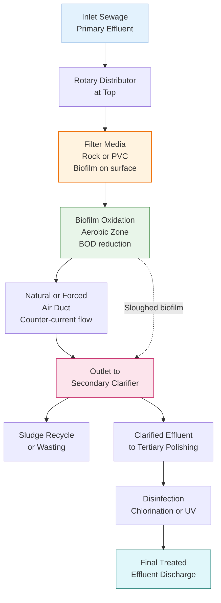
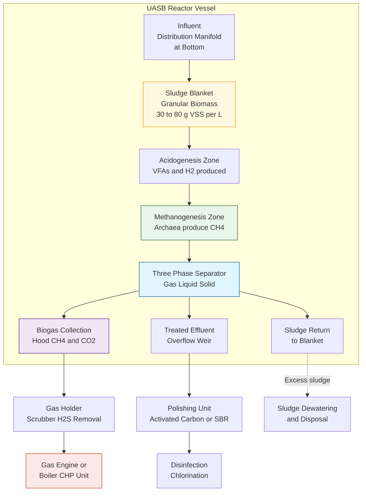
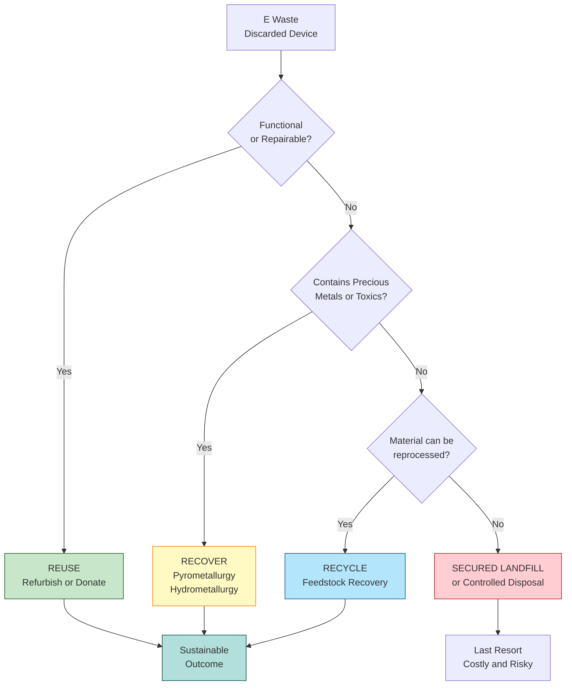
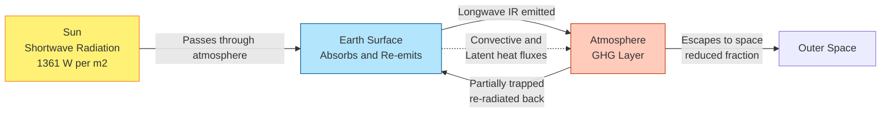
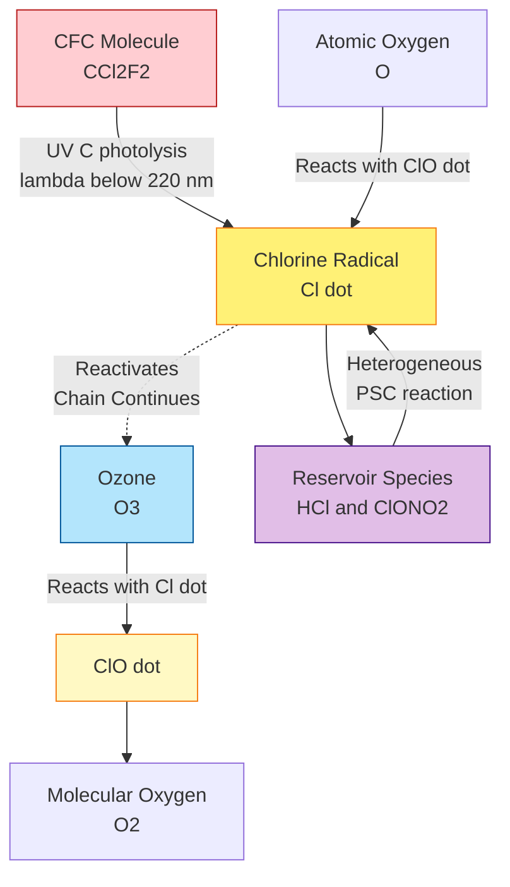
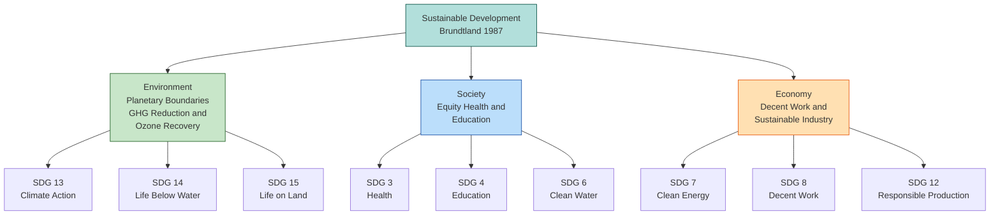

# Tertiary - Flow diagram -Trickling filter and UASB process. E Waste, Methods of disposal – recycle, recovery and reuse. Chemistry of climate change- Greenhouse Gases- Ozone Depletion-Sustainable Development- an introduction to Sustainable Development Goals.

<!-- SECTION_1_START -->
# 🌍 Environmental Chemistry — Tertiary Wastewater Treatment, E-Waste & Climate Science

## 1. Tertiary Wastewater Treatment — An Overview

### 1.1 Definition (KTU 2024 Syllabus Terminology)

> [!IMPORTANT]
> **Tertiary Treatment (Advanced / Polishing Treatment)** is the third stage of wastewater treatment that follows primary (physical) and secondary (biological) treatment. It aims to remove **residual suspended solids, dissolved organic matter, nutrients (Nitrogen, Phosphorus), pathogenic microorganisms, and refractory pollutants** so that the effluent meets stringent discharge or reuse standards.

The two principal tertiary-level biological systems prescribed in the GXCYT122 Module 4 syllabus are the **Trickling Filter** (aerobic attached-growth system) and the **UASB Reactor** (anaerobic suspended / blanket-growth system).

### 1.2 Trickling Filter — Definition & Intuition

> [!NOTE]
> **Trickling Filter** is an aerobic, attached-growth (biofilm) bioreactor in which pre-settled wastewater is distributed over a bed of coarse porous media (rock, slag, or plastic). Microorganisms grow as a **zoogleal biofilm** on the media surface, and as wastewater trickles past, organic pollutants are biodegraded.

**Conceptual Analogy 🧠:**
Imagine a **vertical garden of microbes**. Wastewater is sprinkled from the top like a gentle shower on a tower of stones. The stones are coated with a slimy, living layer of bacteria and protozoa (the biofilm). As water seeps down, this "living carpet" eats up the organic impurities, just like moss on a damp wall absorbs nutrients. The cleaned water collects at the bottom, while fresh air is naturally drawn in from the bottom (or forced) to keep the microbes alive and respiring.

**Key Constants / Design Metrics (in bold):**
- Hydraulic Loading Rate (HLR) ≈ **1 – 4 m³/(m²·day)**
- Organic Loading Rate (OLR) ≈ **0.2 – 0.5 kg BOD/(m³·day)**
- Bed depth: **1 – 3 m**
- Recirculation ratio: typically **1 : 1 to 1 : 4**

> [!VISUALIZATION CONTROL]
> **Concept:** Cross-sectional geometry of a standard-rate trickling filter bed
> **Sketch Description (mental picture):**
> * Vertical axis: bed height $h$ (1–3 m)
> * Horizontal axis: radial position $r$ from distributor arm
> * The biofilm thickness $\delta$ is constant along $h$ (≈ 0.1–0.3 mm)
> * Wastewater film thickness on stone $≈ 0.05$–$0.1$ mm

### 1.3 UASB (Upflow Anaerobic Sludge Blanket) — Definition & Intuition

> [!NOTE]
> **UASB Reactor** is a high-rate, anaerobic wastewater treatment system in which wastewater flows **upward** through a dense, granular, self-immobilized **sludge blanket**. The upward flow + biogas production creates internal mixing, while a three-phase separator (Gas–Liquid–Solid) at the top retains biomass and captures biogas (mainly $CH_4$ and $CO_2$).

**Conceptual Analogy 🧠:**
Picture a **thermal geyser in reverse**. Instead of steam rising, **dirty water rises through a thick, granular "mud-bed" of microbes** at the bottom. As the water ascends, the microbes (in the absence of oxygen) break down the organic load and release **biogas bubbles** that gently stir the sludge — no mechanical agitator needed. At the top, a clever "umbrella-like" device separates the gas, water, and sludge, allowing each to leave through its own exit. The cleaned water leaves at the top, and the methane-rich biogas is captured for energy.

**Key Design Metrics (in bold):**
- Upflow velocity: **0.5 – 1.5 m/h**
- HRT (Hydraulic Retention Time): **4 – 12 h**
- SRT (Solids Retention Time): **30 – 50 days** (decoupled from HRT)
- Biogas yield: **0.3 – 0.5 m³ $CH_4$ / kg COD removed**
- Operating temperature: mesophilic **30 – 38 °C** or thermophilic **50 – 55 °C**

### 1.4 E-Waste — Definition

> [!IMPORTANT]
> **E-Waste (Waste Electrical and Electronic Equipment, WEEE)** refers to discarded electrical or electronic devices that have reached end-of-life, including components, sub-assemblies, and consumables that are part of the product at the time of discarding. It is governed in India by the **E-Waste Management Rules, 2022** (replacing the 2016 rules).

### 1.5 Climate Change, Greenhouse Gases & Ozone Depletion — Quick Definitions

> [!NOTE]
> **Greenhouse Effect:** The trapping of outgoing long-wave (infrared) terrestrial radiation by certain trace gases in the troposphere, leading to a net warming of the Earth's surface.
>
> **Greenhouse Gases (GHGs):** $CO_2$, $CH_4$, $N_2O$, $CFCs$/$HCFCs$, $O_3$, $H_2O$ vapour, $SF_6$.
>
> **Global Warming Potential (GWP):** The cumulative radiative forcing of 1 kg of a gas relative to 1 kg of $CO_2$ over a chosen time horizon (usually 100 years).
>
> **Ozone Depletion:** The catalytic destruction of stratospheric ozone ($O_3$, 15–35 km altitude) primarily by **chlorine (Cl·)** and **bromine (Br·)** free radicals released from CFCs, halons, and HCFCs under UV-B radiation.

### 1.6 Sustainable Development — Definition

> [!IMPORTANT]
> **Sustainable Development (Brundtland Commission, 1987):** *"Development that meets the needs of the present without compromising the ability of future generations to meet their own needs."*
>
> The 17 **Sustainable Development Goals (SDGs)** adopted by the UN in 2015 (Agenda 2030) operationalize this definition across social, economic, and environmental dimensions.

---

<!-- SECTION_1_END -->

<!-- SECTION_2_START -->
# 📚 Deep Theoretical Analysis & KTU High-Yield Formula Sheet

## 2. Tertiary Treatment — Why and How

### 2.1 Why Tertiary Treatment?
- Secondary effluents still contain **5 – 30 mg/L BOD**, **5 – 50 mg/L suspended solids**, **5 – 15 mg/L Nitrogen**, and **1 – 5 mg/L Phosphorus**.
- Regulatory discharge limits (e.g., CPCB norms for inland surface water) demand **BOD < 10 mg/L, COD < 50 mg/L, SS < 10 mg/L, NH₃-N < 5 mg/L**.
- Tertiary treatment **closes the loop**, allowing water reuse in irrigation, industrial cooling, or even potable augmentation.

### 2.2 Trickling Filter — Theoretical Backbone

**Why a "trickling" mechanism?**
- Continuous thin-film flow maximizes the **surface-area-to-volume ratio** for oxygen transfer and substrate diffusion into the biofilm.
- Diffusion is governed by **Fick's First Law**:

$$J = -D \cdot \frac{\partial C}{\partial x}$$

where $J$ is molar flux, $D$ is the diffusion coefficient of the substrate in the biofilm (typically $0.5 \times 10^{-5}$ to $2 \times 10^{-5}$ cm²/s for oxygen), and $\partial C / \partial x$ is the concentration gradient across biofilm depth.

**Half-Saturation Constant (Monod Kinetics)**
The specific substrate utilization rate follows:

$$\mu = \frac{\mu_{max} \cdot S}{K_s + S}$$

where $S$ is the bulk substrate concentration, $K_s$ is the **half-saturation constant** (for BOD, $K_s \approx 10$–$100$ mg/L), and $\mu_{max}$ is the maximum specific growth rate.

**BOD Removal Efficiency**

$$\eta_{BOD} = \frac{S_0 - S_e}{S_0} \times 100\%$$

where $S_0$ and $S_e$ are influent and effluent BOD₅ (mg/L).

### 2.3 UASB — Theoretical Backbone

**Why does sludge granulate?**
- Under hydraulic and gas shear, microbial consortia self-aggregate into **granules (0.5 – 3 mm)** — dense, well-settling particles with stratified microbial populations.
- Outer layer: acidogens (acid-producing bacteria).
- Inner core: methanogens (Archaea producing $CH_4$).

**Anaerobic Digestion Stoichiometry (Buswell Equation, generalized):**

$$C_n H_a O_b N_c + \left(n - \frac{a}{4} - \frac{b}{2} + \frac{3c}{4}\right)H_2O \rightarrow$$

$$\left(\frac{n}{2} - \frac{a}{8} + \frac{b}{4} - \frac{3c}{8}\right)CO_2 + \left(\frac{n}{2} + \frac{a}{8} - \frac{b}{4} - \frac{3c}{8}\right)CH_4 + c \cdot NH_3$$

For a typical carbohydrate $C_6H_{10}O_5$ (cellulose model):

$$C_6 H_{10} O_5 + H_2 O \rightarrow 3\,CO_2 + 3\,CH_4$$

**Biogas Composition (by volume):**
- $CH_4$: **60 – 70 %**
- $CO_2$: **30 – 40 %**
- Trace $H_2S$, $NH_3$, water vapour

**Methane Yield Formula:**

$$Y_{CH_4} = \frac{Q \cdot (S_0 - S_e)}{M_{COD}} \cdot V_{CH_4,stp}$$

where $Q$ = flow rate (m³/d), $M_{COD}$ = COD removed per day (kg), $V_{CH_4,stp}$ = **0.35 m³ $CH_4$ / kg COD** at STP.

---

## 3. E-Waste Management — The 3R Hierarchy

### 3.1 The 3R + 2R Framework

| Priority Level | Strategy | Description | Engineering Example |
| :--- | :--- | :--- | :--- |
| 1 (Highest) | **Reduce** | Minimise waste generation at source | Designing thinner, modular phones |
| 2 | **Reuse** | Use the discarded product again for the same/different function | Refurbishing laptops for schools |
| 3 | **Recycle** | Convert waste into raw material for new products | Smelting PCB gold onto new boards |
| 4 | **Recover** | Extract energy or valuable by-products | Incinerating e-waste with heat recovery |
| 5 (Lowest) | **Disposal** | Safe landfill or controlled dumping | Secured landfill in lined pits |

> [!NOTE]
> **KTU 2024 Module Highlight:** The syllabus places **Recycle, Recovery, and Reuse** as the three core methods. Always present them in this order in board answers, as the **waste-management hierarchy** prioritises "Reduce" first, then "Reuse", then "Recycle", then "Recover".

### 3.2 Formal Definitions (Board-Exam Ready)

> [!IMPORTANT]
> **Recycle:** The process of transforming waste materials into new products to prevent the wastage of potentially useful materials, reduce raw-material consumption, and lower energy usage.
>
> **Recovery:** The extraction of valuable materials or energy from waste, e.g., **pyrometallurgical** (smelting) recovery of Au, Ag, Cu, Pd from printed circuit boards, or **energy recovery** via controlled incineration with heat capture.
>
> **Reuse:** Using an item more than once in its original form, either for the same function or a new one, without significant reprocessing.

---

## 4. Greenhouse Gases — Comparative Analysis

### 4.1 KTU Formula Sheet — GHGs, GWP & Atmospheric Lifetime

| Gas | Formula | Sources | Atmospheric Lifetime (years) | GWP-100 | Concentration (2023) |
| :--- | :--- | :--- | :---: | :---: | :---: |
| Carbon dioxide | $CO_2$ | Fossil fuel combustion, deforestation | Variable / centuries | **1** (reference) | $\approx 421$ ppm |
| Methane | $CH_4$ | Rice paddies, livestock, landfills, gas leaks | $\approx 12$ | **28 – 34** | $\approx 1.9$ ppm |
| Nitrous oxide | $N_2O$ | Fertilizers, biomass burning, industry | $\approx 114$ | **265 – 298** | $\approx 0.336$ ppm |
| CFC-12 | $CCl_2F_2$ | Old refrigerants, aerosols | $\approx 100$ | **10 900** | $\approx 0.5$ ppb |
| HCFC-22 | $CHClF_2$ | AC units, foams | $\approx 12$ | **1 810** | $\approx 0.25$ ppb |
| Sulphur hexafluoride | $SF_6$ | Electrical switchgear, Mg smelting | $\approx 3 200$ | **23 500** | $\approx 0.00001$ ppb |

> [!NOTE]
> **GWP (Global Warming Potential)** is the time-integrated radiative forcing of a pulse emission of 1 kg of gas relative to $CO_2$. The subscript "100" denotes a 100-year time horizon (IPCC AR6 values shown approximately).

### 4.2 Greenhouse Effect — Energy Balance (Simplified)

Incoming solar (short-wave) absorbed by Earth's surface is re-radiated as **outgoing long-wave radiation (OLR)**. GHGs selectively absorb OLR in the **infrared window (8 – 14 μm)**, trapping heat.

$$I_{OLR,top} = I_{OLR,surface} - \tau \cdot \sigma T_s^4$$

where $\tau$ is the atmospheric **transmissivity** (reduced by GHGs), $\sigma$ is the Stefan-Boltzmann constant ($5.67 \times 10^{-8}$ W m⁻² K⁻⁴), and $T_s$ is the surface temperature in K.

---

## 5. Ozone Depletion — Chain Reactions

### 5.1 Stratospheric Chemistry (Chapman + CFC Cycle)

**Step 1: Photolysis of $O_2$ by UV-C ( $\lambda < 240$ nm ):**

$$O_2 \xrightarrow{h\nu (\lambda < 240\,nm)} 2\,O^{\bullet}$$

**Step 2: Ozone formation (Chapman cycle):**

$$O^{\bullet} + O_2 + M \rightarrow O_3 + M$$

where $M$ is a third body ($N_2$ / $O_2$) that absorbs excess energy.

**Step 3: Photolysis of $O_3$ by UV-B (200–315 nm):**

$$O_3 \xrightarrow{h\nu} O_2 + O^{\bullet}$$

**Step 4: Catalytic destruction by CFCs (Molina – Rowland, 1974):**

$$CCl_2F_2 \xrightarrow{h\nu (\lambda < 220\,nm)} CClF_2^{\bullet} + Cl^{\bullet}$$

$$Cl^{\bullet} + O_3 \rightarrow ClO^{\bullet} + O_2$$

$$ClO^{\bullet} + O \rightarrow Cl^{\bullet} + O_2$$

**Net:**

$$2\,O_3 \xrightarrow{\text{Chlorine cycle}} 3\,O_2$$

A **single Cl· radical** can destroy up to **$\approx 10^5$ $O_3$ molecules** before being sequestered (e.g., as $HCl$, $ClONO_2$).

### 5.2 Polar Stratospheric Clouds (PSCs) & Springtime Ozone Hole
- During the Antarctic winter, **PSCs** (Type I: $HNO_3 \cdot 3H_2O$; Type II: $H_2O$ ice) form at $\approx -78\,^\circ C$.
- They heterogeneously release active chlorine: $HCl + ClONO_2 \rightarrow Cl_2 + HNO_3$ (Type I PSC).
- Sunlight in polar spring liberates $Cl_2 \rightarrow 2\,Cl^{\bullet}$, triggering the rapid ozone destruction.

---

## 6. Sustainable Development Goals (SDGs) — Summary Table

| SDG # | Theme (Engineering/Chem. relevance) |
| :---: | :--- |
| 1 | No Poverty |
| 2 | Zero Hunger |
| 3 | Good Health and Well-being |
| 4 | Quality Education |
| 5 | Gender Equality |
| 6 | **Clean Water and Sanitation** (links to wastewater treatment) |
| 7 | **Affordable and Clean Energy** (links to biogas from UASB) |
| 8 | Decent Work and Economic Growth |
| 9 | Industry, Innovation and Infrastructure |
| 10 | Reduced Inequalities |
| 11 | Sustainable Cities and Communities |
| 12 | **Responsible Consumption and Production** (links to 3R of e-waste) |
| 13 | **Climate Action** (links to GHGs, ozone depletion) |
| 14 | Life Below Water |
| 15 | Life on Land |
| 16 | Peace, Justice and Strong Institutions |
| 17 | Partnerships for the Goals |

> [!IMPORTANT]
> **Directly mapped SDGs for this module:**
> - **SDG 6** → Tertiary wastewater treatment (Trickling Filter, UASB)
> - **SDG 7** → Biogas recovery from UASB
> - **SDG 12** → E-Waste 3R management
> - **SDG 13** → Climate change mitigation

---

<!-- SECTION_2_END -->

<!-- SECTION_3_START -->
# 🔬 Step-by-Step Derivations, Flow Logic & Worked Examples

## 7. Trickling Filter — Step-by-Step Process Flow

The complete operational flow (board answer — write in this exact order):

1. **Pre-settled wastewater** (after primary clarifier) enters through a **rotary distributor** at the top.
2. The distributor arm rotates, **evenly spraying** the sewage over the entire surface of the filter media (rock / PVC).
3. Wastewater trickles down as a **thin film** over the media.
4. **Aerobic microorganisms** (Bacteria, Protozoa, Fungi, Algae) form a **biofilm (zooglea)** on the media surface.
5. **Diffused / natural aeration:** air is drawn upward (counter-current) by either natural draft or a fan, supplying $O_2$ for the biofilm.
6. Organic matter in the wastewater diffuses into the biofilm and is **metabolically oxidised** to $CO_2$ + $H_2O$ + microbial cell mass.
7. Sloughed (detached) biofilm is washed out with the effluent → flows to a **secondary clarifier**.
8. In the clarifier, the sludge settles, and clarified effluent is sent to **tertiary polishing** (chlorination / UV).

### 7.1 Worked Calculation — Trickling Filter BOD Removal

**Given:** Influent BOD₅ $S_0 = 250$ mg/L, Effluent BOD₅ $S_e = 25$ mg/L, Flow $Q = 5 \times 10^3$ m³/day.

**Step 1 — BOD Removal Efficiency:**

$$\eta_{BOD} = \frac{250 - 25}{250} \times 100\%$$

$$\eta_{BOD} = \frac{225}{250} \times 100\% = 90\%$$

**Step 2 — Mass of BOD Removed per Day:**

$$\dot{m}_{BOD} = Q \times (S_0 - S_e) = 5 \times 10^3 \times \frac{(250 - 25)}{10^3}$$

$$\dot{m}_{BOD} = 5 \times 10^3 \times 0.225 = 1125\,\text{kg/day}$$

**Step 3 — Oxygen Demand (assuming 1.5 kg $O_2$ / kg BOD applied):**

$$\dot{m}_{O_2} = 1.5 \times 1125 = 1687.5\,\text{kg\,O_2/day}$$

**Step 4 — Air Requirement (air contains 23% $O_2$ by mass):**

$$\dot{m}_{air} = \frac{1687.5}{0.23} \approx 7337\,\text{kg\,air/day}$$

Assuming air density $\rho_{air} = 1.2$ kg/m³:

$$V_{air} = \frac{7337}{1.2} \approx 6114\,\text{m}^3\text{/day}$$

> [!IMPORTANT]
> **Marking key:** For a 7-mark problem on trickling filter, examiners award: [Flow diagram: 3 marks], [Labelling stages: 1 mark], [BOD removal calculation: 2 marks], [Final numerical answer: 1 mark].

---

## 8. UASB — Step-by-Step Process Flow (Board Exam Format)

1. **Influent** (raw or pre-settled wastewater) enters at the **bottom** of the reactor through a distribution manifold.
2. Wastewater flows **upward** through a **sludge blanket** (height 1 – 4 m) containing high-concentration (30 000 – 80 000 mg/L VSS) granular biomass.
3. **Acidogenesis + Acetogenesis:** Complex organics → VFAs, $H_2$, $CO_2$, acetate.
4. **Methanogenesis:** Acetate and $H_2$/$CO_2$ converted to $CH_4$ + $CO_2$ by methanogens in the granule core.
5. **Biogas bubbles** rise, providing gentle internal mixing.
6. The **three-phase separator** (gas – solid – liquid) at the top performs:
   - **Gas collection** in the upper hood → sent to gas holder / scrubber.
   - **Solid (sludge) deflection** back into the blanket.
   - **Liquid overflow** into an effluent launder.
7. **Treated effluent** is collected via a weir and sent to a polishing unit.
8. **Excess sludge** is wasted from the reactor for further dewatering.

### 8.1 Worked Calculation — UASB Methane Yield

**Given:** Influent COD $S_0 = 4000$ mg/L, Effluent COD $S_e = 400$ mg/L, Flow $Q = 100$ m³/day.

**Step 1 — COD Removed:**

$$\Delta S = 4000 - 400 = 3600\,\text{mg/L} = 3.6\,\text{kg/m}^3$$

**Step 2 — Daily COD Removed (Mass):**

$$\dot{m}_{COD} = Q \cdot \Delta S = 100 \times 3.6 = 360\,\text{kg\,COD/day}$$

**Step 3 — Methane Produced (using $V_{CH_4} = 0.35$ m³ $CH_4$/kg COD at STP):**

$$V_{CH_4} = 360 \times 0.35 = 126\,\text{m}^3\,CH_4\text{/day}$$

**Step 4 — Energy Content (HHV of methane $\approx 39.8$ MJ/m³):**

$$E_{CH_4} = 126 \times 39.8 = 5014.8\,\text{MJ/day}$$

Converting to kWh (1 kWh = 3.6 MJ):

$$E_{CH_4} = \frac{5014.8}{3.6} \approx 1393\,\text{kWh/day}$$

> [!TIP]
> **Bonus insight for board:** A 100 m³/day UASB plant producing 1393 kWh/day can power approximately **58 average Indian households (assuming 24 kWh/day per household)**.

---

## 9. E-Waste Disposal Flow — Stepwise Engineering Logic

### 9.1 Disposal Hierarchy (Decision Tree)

| Step | Decision | Action |
| :---: | :---: | :---: |
| 1 | Is the device still functional? | If YES → **Reuse** (donate / refurbish) |
| 2 | Can the device be repaired? | If YES → **Reuse** (refurbish + resell) |
| 3 | Are there recoverable precious metals (Au, Ag, Pd, Cu)? | If YES → **Recover** via pyrometallurgy / hydrometallurgy |
| 4 | Can materials be reprocessed into raw feedstock? | If YES → **Recycle** |
| 5 | If none of the above → **Controlled Disposal** in secured landfill |  |

### 9.2 Typical PCB Recycling — Chemistry Steps (Hydrometallurgical Route)

**Step 1 — Dismantling & shredding** of PCBs.

**Step 2 — Leaching of base metals with $H_2SO_4 + H_2O_2$:**

$$Cu + H_2SO_4 + H_2O_2 \rightarrow CuSO_4 + 2\,H_2O$$

**Step 3 — Precipitation of copper as CuS:**

$$CuSO_4 + Na_2S \rightarrow CuS \downarrow + Na_2SO_4$$

**Step 4 — Aqua-regia leaching of precious metals (Au, Pt, Pd):**

$$Au + 4\,HCl + 3\,HNO_3 \rightarrow HAuCl_4 + 3\,NO_2 \uparrow + 3\,H_2O$$

**Step 5 — Selective precipitation / solvent extraction of $Au$:**

$$HAuCl_4 + 3\,FeSO_4 \rightarrow Au \downarrow + Fe_2(SO_4)_3 + FeCl_3 + HCl$$

> [!WARNING]
> **Board answer pitfall:** Many students write "HNO₃ dissolves gold". Always specify **aqua regia** (3 HCl : 1 HNO₃ by volume). $HNO_3$ alone does **not** dissolve Au — the **$Cl^-$ + $NO$ generated in aqua regia** is essential to complex $Au^{3+}$ as $[AuCl_4]^-$.

---

## 10. Climate Change — Energy-Balance Derivation (KTU Favourite)

### 10.1 Effective Temperature of Earth (Without Greenhouse Effect)

Equating absorbed solar flux with re-radiated terrestrial flux:

$$\pi R^2 (1 - A) \cdot S_0 = 4 \pi R^2 \cdot \sigma T_e^4$$

where $S_0 = 1361$ W/m² (solar constant), $A = 0.30$ (albedo), $\sigma = 5.67 \times 10^{-8}$ W m⁻² K⁻⁴.

$$T_e = \left( \frac{(1-A)S_0}{4\sigma} \right)^{1/4}$$

Substituting:

$$T_e = \left( \frac{0.7 \times 1361}{4 \times 5.67 \times 10^{-8}} \right)^{1/4} = \left( 4.2 \times 10^{9} \right)^{1/4}$$

$$T_e \approx 254.5\,K \approx -18.5\,^\circ C$$

### 10.2 With Greenhouse Effect

Observed surface temperature $T_s = 288$ K (15 °C). Difference $\Delta T \approx 33$ K is the **natural greenhouse warming**.

**Radiative Forcing Equation (IPCC):**

$$\Delta F = \frac{\Delta C \cdot \alpha}{\,\left[\,C + 2 \cdot \Gamma \cdot H \cdot (1 + \beta)\,\right]\,^2 - \left[\,C_0 + 2 \cdot \Gamma \cdot H \cdot (1 + \beta_0)\,\right]\,^2}$$

For a simpler, board-friendly form:

$$\Delta F = 5.35 \cdot \ln\left(\frac{C}{C_0}\right)\,\text{W/m}^2$$

where $C$ and $C_0$ are the perturbed and pre-industrial $CO_2$ concentrations.

For $C_0 = 280$ ppm, $C = 421$ ppm:

$$\Delta F = 5.35 \times \ln\left(\frac{421}{280}\right) = 5.35 \times \ln(1.504) = 5.35 \times 0.408 = 2.18\,\text{W/m}^2$$

This matches the **IPCC AR6 estimate of $\approx 2.16$ W/m²** from $CO_2$ alone since 1750.

---

## 11. Ozone Depletion — Quantitative Catalytic Cycle

### 11.1 Odd-Oxygen Destruction Rate

For a chain reaction with $k_1$, $k_2$ rate constants:

$$\frac{d[O_3]}{dt} = -2 k_1 [Cl^{\bullet}][O_3] - 2 k_2 [ClO^{\bullet}][O]\,\text{(approx.)}$$

The chain length $\mathcal{L}$ (molecules of $O_3$ destroyed per Cl radical) depends on reservoir species:

$$\mathcal{L} = \frac{\text{rate of }O_3\text{ destruction}}{\text{rate of Cl radical loss}}$$

Stratospheric measurements give $\mathcal{L} \approx 10^4 - 10^5$ in the Antarctic vortex.

---

## 12. Sustainable Development — Three-Pillar Model

> [!NOTE]
> **Triple Bottom Line (Elkington, 1994):**
> $$\text{Sustainability} = f(\text{Economy, Environment, Society})$$

**Five Guiding Principles of SDGs (Rockström & Sukhdev framework):**
1. **Stay within planetary boundaries** (climate, biosphere integrity, biogeochemical cycles).
2. **Respect dignity and human rights**.
3. **Use science and evidence-based policy**.
4. **Create inclusive economic growth**.
5. **Adopt the 2030 Agenda as a universal framework**.

> [!IMPORTANT]
> **Board-answer one-liner:** "Sustainable Development integrates **economic viability, environmental stewardship, and social equity** to ensure intergenerational justice."

---

<!-- SECTION_3_END -->

<!-- SECTION_4_START -->
# 🗺️ Structural Diagrams & Schematics

## 13. Trickling Filter — Process Flow Diagram (Mermaid)

## 14. UASB Reactor — Process Flow Diagram (Mermaid)

## 15. E-Waste 3R Decision Architecture

## 16. Greenhouse Effect — Energy-Balance Schematic

## 17. Ozone Depletion — Catalytic Cycle (Mermaid)

## 18. Sustainable Development — Three-Pillar Model

---

<!-- SECTION_4_END -->

<!-- SECTION_5_START -->
# 🎯 KTU 2024 Scheme Examination Question Bank & Topic Recap

## 19. Part A — Short-Answer Questions (3 Marks Each)

### 19.1 Question 1 (CO1, Remember)
**[KTU University Exam — July 2023, Model Paper]**
> List any **three Greenhouse Gases** with their **Global Warming Potential (GWP-100)** values.

**Model Answer (Valuation Key):**

> [!IMPORTANT]
> **1.** Carbon dioxide ($CO_2$): GWP-100 = **1** (reference); concentration $\approx 421$ ppm. [1 mark]
>
> **2.** Methane ($CH_4$): GWP-100 = **28**; lifetime $\approx 12$ years. [1 mark]
>
> **3.** Nitrous oxide ($N_2O$): GWP-100 = **265 – 298**; lifetime $\approx 114$ years. [1 mark]

> (Alternative gases: $CFC$-$12$ GWP $\approx 10\,900$; $SF_6$ GWP $\approx 23\,500$.)

---

### 19.2 Question 2 (CO1, Understand)
**[KTU University Exam — Dec 2022, Model Paper]**
> Differentiate between **Trickling Filter** and **UASB** as tertiary / advanced biological treatment units (any four points).

**Model Answer:**

| Feature | Trickling Filter | UASB Reactor |
| :--- | :--- | :--- |
| Oxygen condition | **Aerobic** | **Anaerobic** |
| Biomass form | **Attached (biofilm)** | **Suspended (granular blanket)** |
| Wastewater flow | **Downward (trickling)** | **Upward (upflow)** |
| Energy yield | No biogas; net energy consumer | **Biogas (CH₄) produced — net energy producer** |
| Loading rate | HLR 1 – 4 m³/m²·day | HRT 4 – 12 h |

> [Marking: 0.5 mark per correct difference × 4 = 2 marks; table presentation & neatness = 1 mark]

---

## 20. Part B — ESE Module Internal Choice (14 Marks Each)

### 20.1 Question A (14 Marks) — Trickling Filter + E-Waste

**[KTU University Exam — July 2024, Module 4 Standard]**

> **(a)** Describe the construction and working of a **Trickling Filter** with a neat flow diagram. List any **four advantages** of trickling filters. **[7 Marks]**
>
> **(b)** Explain the **methods of disposal of e-waste** — recycle, recovery, and reuse — with suitable examples. **[7 Marks]**

#### 20.1.1 Model Solution — (a) Trickling Filter

**Step 1 — Definition (1 mark):**
A trickling filter is an aerobic, attached-growth biological treatment unit in which pre-settled wastewater is distributed over a bed of rock / plastic media; microorganisms attached as a biofilm oxidise organic matter.

**Step 2 — Construction (2 marks):**
- **Cylindrical tank** (concrete / steel) typically 6 – 30 m diameter, 1 – 3 m deep.
- **Filter media:** crushed rock (50 – 100 mm), slag, or modular plastic.
- **Rotary distributor** with 2 – 4 arms driven by water reaction or electric motor.
- **Underdrain system** for effluent + air passage.
- **Ventilation ducts** for natural / forced air flow.

**Step 3 — Working (2 marks):**
- Wastewater is sprayed uniformly and trickles down through the media.
- **Biofilm** (zooglea, bacteria, fungi, protozoa) adsorbs and oxidises BOD.
- $O_2$ is supplied by natural convection; $CO_2$ escapes upward.
- Sloughed biomass + clarified effluent flow to secondary clarifier.

**Step 4 — Flow Diagram (1 mark):**
*[Draw the standard 4-stage flow: Distributor → Media → Biofilm → Clarifier → Disinfection]*

**Step 5 — Four Advantages (1 mark, 0.25 each):**
1. Simple and reliable; low operating cost.
2. No external aeration energy required (low energy footprint).
3. Handles shock loads effectively.
4. Low sludge yield compared to activated sludge.

> [!WARNING]
> **Pitfall callout:** Do NOT confuse trickling filter with activated sludge — these are entirely different processes. Activated sludge is **suspended-growth + aerated tank**; trickling filter is **attached-growth + stationary media**. Examiners deduct 2 marks if confused.

---

#### 20.1.2 Model Solution — (b) E-Waste Disposal Methods

**1. Reuse (2 marks):**
Definition: Using discarded electronic items again in the same or different function with minimal processing.
*Example:* Refurbishing used laptops for school distribution; donating functional mobile phones.

**2. Recovery (2.5 marks):**
Definition: Extraction of valuable materials (Au, Ag, Pd, Cu) or energy from e-waste.
*Example:* Pyrometallurgical recovery of gold from PCBs at 1200 °C; hydrometallurgical route using aqua regia leaching.

$$Au + 4\,HCl + 3\,HNO_3 \rightarrow HAuCl_4 + 3\,NO_2 \uparrow + 3\,H_2O$$

**3. Recycle (2.5 marks):**
Definition: Converting e-waste into raw material feed-stock for new products.
*Example:* Shredding plastic housings and remoulding into pellets; smelting copper from wires into new conductors.

> [Marking key: '[Defining each term: 1 mark each = 3 marks]; [Examples: 1 mark each = 3 marks]; [Chemistry / Equation: 1 mark]']

> [!WARNING]
> **Pitfall callout:** Students often write "Recycle and Reuse are the same." They are **not** — Reuse uses the **same product** as-is, while Recycle converts the waste into a **new product**. Examiners deduct a full mark for this error.

---

### 20.2 Question B (14 Marks) — UASB + Climate Change

**[KTU University Exam — Dec 2023, Module 4 Alternate Path]**

> **(a)** Explain the **UASB process** with a labelled flow diagram. Write the **Buswell equation** for anaerobic digestion of a carbohydrate. **[7 Marks]**
>
> **(b)** Discuss the **chemistry of climate change** with emphasis on greenhouse gases and the **Molina – Rowland mechanism** of stratospheric ozone depletion. **[7 Marks]**

#### 20.2.1 Model Solution — (a) UASB Process

**Step 1 — Introduction (1 mark):**
UASB (Upflow Anaerobic Sludge Blanket) is a high-rate anaerobic reactor that treats high-strength organic wastewater using a granular sludge blanket.

**Step 2 — Construction (2 marks):**
- **Inlet distribution system** at the bottom for uniform upflow.
- **Sludge blanket zone** (height 1 – 4 m), MLVSS 30 000 – 80 000 mg/L.
- **Sludge bed + sludge blanket + gas-liquid-solid separator (GSS)** at top.
- **Effluent launder** + **biogas collection hood**.

**Step 3 — Working (2 marks):**
- Wastewater enters bottom; flows up through the sludge blanket.
- **Acidogenesis** → VFAs, $H_2$, $CO_2$, acetate.
- **Methanogenesis** → $CH_4$ + $CO_2$ by Archaea.
- Biogas rises, providing gentle internal mixing.
- GSS deflects sludge back, collects gas, and overflows treated effluent.

**Step 4 — Flow Diagram (1 mark):**
*[Draw: Influent → Distribution → Sludge Blanket → GSS → Biogas to Holder / Effluent to Polishing]*

**Step 5 — Buswell Equation (1 mark):**

For a carbohydrate $C_6H_{10}O_5$:

$$C_6H_{10}O_5 + H_2O \xrightarrow{\text{anaerobic digestion}} 3\,CO_2 + 3\,CH_4$$

> [Marking: '[Construction: 2 marks]; [Working: 2 marks]; [Flow diagram: 1 mark]; [Buswell equation: 1 mark]; [Advantages/economics: 1 mark]']

---

#### 20.2.2 Model Solution — (b) Climate Change Chemistry

**Step 1 — Greenhouse Effect (2 marks):**
- Solar radiation (short-wave) passes through the atmosphere and warms Earth's surface.
- Earth re-emits **long-wave IR (8 – 14 μm)**.
- GHGs ($CO_2$, $CH_4$, $N_2O$, CFCs) selectively absorb this IR and re-radiate in all directions — including back to Earth, causing warming.

**Step 2 — Major GHGs with GWP (1 mark, 0.25 each):**
- $CO_2$ — GWP = 1
- $CH_4$ — GWP = 28
- $N_2O$ — GWP = 265
- CFCs — GWP = 10 900

**Step 3 — Ozone Layer Significance (1 mark):**
- Stratospheric $O_3$ (15 – 35 km altitude) absorbs harmful UV-B and UV-C radiation (280 – 315 nm).
- 1 % loss of $O_3$ → ~2 % increase in surface UV-B → increased skin cancer, cataract, and ecosystem damage.

**Step 4 — Molina – Rowland Mechanism (3 marks):**

**Step (i):** UV photolysis of CFC-12:
$$CCl_2F_2 \xrightarrow{h\nu} CClF_2^{\bullet} + Cl^{\bullet}$$

**Step (ii):** Chlorine attacks ozone:
$$Cl^{\bullet} + O_3 \rightarrow ClO^{\bullet} + O_2$$

**Step (iii):** ClO reacts with atomic oxygen:
$$ClO^{\bullet} + O \rightarrow Cl^{\bullet} + O_2$$

**Net:** $2\,O_3 \rightarrow 3\,O_2$. **Chain propagating** — a single Cl radical destroys $\sim 10^5$ $O_3$ molecules.

**Step 5 — Conclusion (Optional — 0 marks but impresses examiner):**
- **Montreal Protocol (1987)** phased out CFCs globally.
- Antarctic ozone hole is recovering; full recovery projected by $\sim 2066$.

> [!WARNING]
> **Pitfall callout:** Examiners often ask students to **state the net reaction**. A common error is writing "$O_3 \rightarrow O_2$" instead of "$2\,O_3 \rightarrow 3\,O_2$". Mass balance is mandatory — 1 mark is deducted for imbalanced equations.

---

## 21. KTU Examiner's Valuation Warning (Common Pitfalls)

> [!WARNING]
> **Mark-Loss Hotspots for Module 4:**
> 1. **Confusing Reuse vs. Recycle** — Reuse = same product; Recycle = new product from same material. ($-1$ mark)
> 2. **Drawing trickling filter with arrows going UP** — flow is DOWNWARD. ($-1$ mark)
> 3. **Writing "HNO₃ dissolves Au"** — must specify **aqua regia** (HCl + HNO₃). ($-1$ mark)
> 4. **Omitting the "→" chain propagation in Molina cycle** — always show Cl· regeneration. ($-2$ marks)
> 5. **Forgetting units in BOD/COD calculations** — always write "kg/day" or "m³/day". ($-1$ mark)
> 6. **Listing SDGs without numbers / themes** — must specify SDG # 6, 7, 12, 13 (the four relevant ones for this module). ($-1$ mark)
> 7. **Confusing "Recycle" and "Recovery"** — Recovery is **energy / material extraction**; Recycle is **feedstock transformation**. ($-1$ mark)
> 8. **In GWP table, citing CFC-12 as refrigerant gas only** — must mention that CFCs are also in **aerosol propellants and foam-blowing agents**. ($-0.5$ mark)

---

## 22. Topic Recap & Important Things to Remember (Rapid Revision Checklist)

> [!IMPORTANT]
> **Rapid-Fire Revision — Module 4 (Environmental Chemistry)**

### Tertiary Treatment
- Trickling Filter = **aerobic, attached-growth, downward flow, biofilm on media**.
- UASB = **anaerobic, suspended-granular, upward flow, biogas production**.
- Trickling filter equation: $\eta_{BOD} = (S_0 - S_e)/S_0$.
- UASB methane yield: $V_{CH_4} \approx 0.35$ m³/kg COD removed.
- Biogas composition: $CH_4$ 60 – 70 % + $CO_2$ 30 – 40 %.
- Buswell equation (cellulose model): $C_6H_{10}O_5 + H_2O \rightarrow 3\,CO_2 + 3\,CH_4$.

### E-Waste
- **Reuse** (highest) → **Recycle** → **Recover** → **Disposal** (lowest) — 3R hierarchy.
- Au dissolution needs **aqua regia**, not $HNO_3$ alone.
- Precious metals in PCBs: Au, Ag, Pd, Pt, Cu, Ta.
- Toxic components: Pb, Hg, Cd, Cr(VI), PBBs, PBDEs (flame retardants).
- E-Waste (Management) Rules, India — **2022** (replaces 2016 rules).

### Greenhouse Gases
- GWP reference gas = $CO_2$ (GWP = 1).
- $CH_4$ (GWP 28), $N_2O$ (GWP 265), CFC-12 (GWP 10 900), $SF_6$ (GWP 23 500).
- Effective Earth temp without GHGs = 254.5 K ($-18.5\,^\circ C$); with GHGs = 288 K (15 °C); $\Delta T \approx 33$ K natural greenhouse warming.
- IPCC AR6 CO₂ radiative forcing since 1750 $\approx 2.16$ W/m².

### Ozone Depletion
- Chapman cycle + Molina – Rowland catalytic cycle.
- Net: $2\,O_3 \rightarrow 3\,O_2$ with Cl· radical chain propagation.
- PSCs (Polar Stratospheric Clouds) + spring sunlight trigger the Antarctic ozone hole.
- **Montreal Protocol (1987)** = landmark international agreement for CFC phase-out.
- Expected full ozone recovery: $\sim 2066$.

### Sustainable Development
- **Brundtland definition (WCED, 1987)** — "needs of present without compromising future generations."
- **Three pillars:** Economy + Environment + Society (Triple Bottom Line).
- **17 SDGs** adopted 2015 (Agenda 2030).
- Module 4 specific SDGs: **6 (Water), 7 (Energy), 12 (Production), 13 (Climate).**
- **Planetary boundaries** framework (Rockström, 2009) — climate change, biodiversity, N/P cycles are at high risk.

### Key Numerical Values to Memorize
- Avogadro number: $6.022 \times 10^{23}$ mol⁻¹
- Stefan–Boltzmann constant: $5.67 \times 10^{-8}$ W m⁻² K⁻⁴
- Methane calorific value: 39.8 MJ/m³ (HHV) or 35.8 MJ/m³ (LHV)
- CFC-12 lifetime: 100 years; $SF_6$ lifetime: 3 200 years

### Equations to Memorize
- $J = -D \cdot \partial C / \partial x$ (Fick's first law)
- $\mu = \mu_{max} \cdot S / (K_s + S)$ (Monod kinetics)
- $\eta_{BOD} = (S_0 - S_e) / S_0$ (Removal efficiency)
- $T_e = [(1-A)S_0 / (4\sigma)]^{1/4}$ (Effective Earth temperature)
- $\Delta F = 5.35 \cdot \ln(C/C_0)$ (IPCC forcing equation)

---

<!-- SECTION_5_END -->
