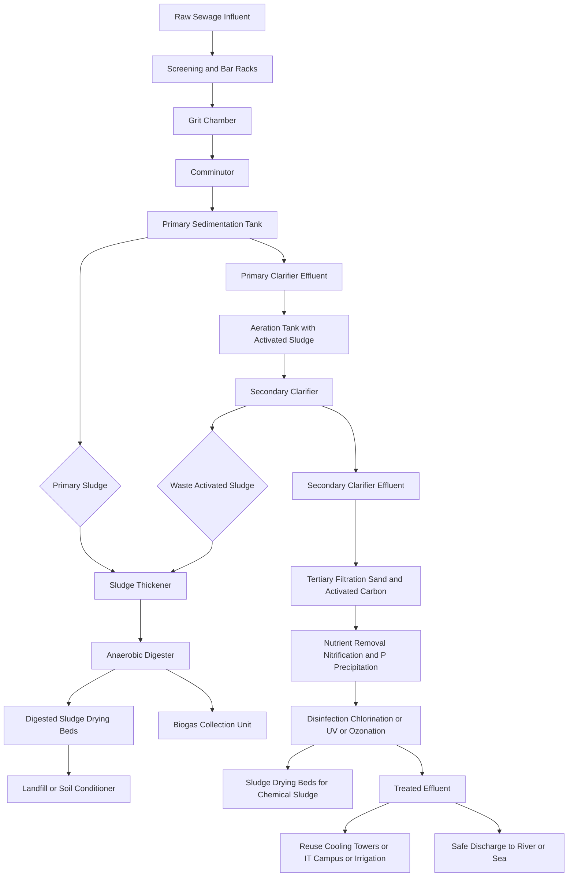
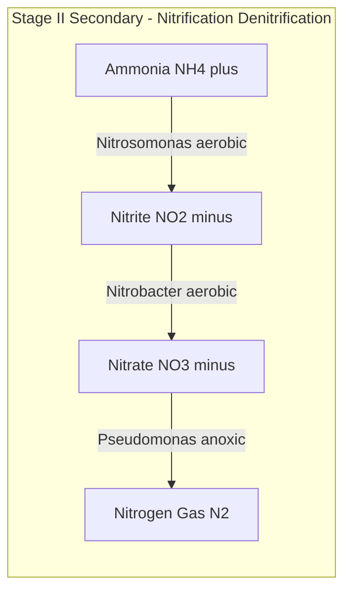
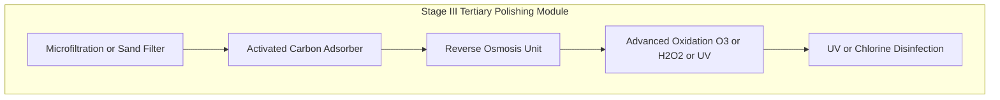

# Waste Management : Sewage water treatment- Primary, Secondary and

<!-- SECTION_1_START -->
# Sewage Water Treatment — Primary, Secondary & Tertiary

> [!IMPORTANT]
> **KTU 2024 Scheme | GXCYT122 | Module 4 — Environmental Chemistry**
> This topic directly maps to **CO4** of the syllabus: *Understand the principles of environmental chemistry, water quality parameters, and waste management strategies relevant to engineering applications.*

## 1. Core Technical Definition & Intuitive Overview

### 1.1 Formal Definition (KTU Syllabus Terminology)

**Sewage (or municipal wastewater)** is the spent water generated from domestic, commercial, and industrial activities within a community, which contains **suspended solids, dissolved organic matter, pathogens, nutrients (N, P), and inert substances**. **Sewage treatment** is the engineered, multi-stage physico-chemical-biological process designed to remove contaminants from wastewater to a level that is **safe for discharge into the environment** or for **reuse in industrial/non-potable applications**.

The treatment is conventionally partitioned into three sequential stages:

| Stage | Class of Process | Primary Goal |
|---|---|---|
| **Primary Treatment** | Physical / Mechanical | Removal of settleable & floating solids |
| **Secondary Treatment** | Biological / Microbial | Removal of dissolved & colloidal organic matter |
| **Tertiary Treatment** | Chemical / Advanced Physical | Removal of residual nutrients, pathogens & micropollutants |

> [!NOTE]
> **Key Quality Indicators in Sewage**
> - **BOD (Biochemical Oxygen Demand):** mg of $O_2$ consumed per litre of sewage in 5 days at $20^{\circ}C$. Indicates **biodegradable organic load**.
> - **COD (Chemical Oxygen Demand):** mg of $O_2$ consumed for chemical oxidation of organic matter. Indicates **total organic load (biodegradable + non-biodegradable)**.
> - **TSS (Total Suspended Solids):** mg/L of solids retained on a filter.
> - **DO (Dissolved Oxygen):** mg/L of free $O_2$ dissolved in water.

### 1.2 Conceptual Analogy — The "Kitchen Sink" Intuition

Imagine your kitchen sink is full of dirty water containing **rice grains (settleable solids)**, **oil droplets (floating matter)**, **dissolved food colours (organic matter in solution)**, and **harmful bacteria (pathogens)**.

- **Primary Treatment** = Pouring the water through a **sieve and letting it sit**. The rice settles, the oil floats, and you skim them off. This is purely *physical*.
- **Secondary Treatment** = Adding **friendly microorganisms** that "eat" the dissolved food colours, converting them to harmless biomass. This is *biological digestion*.
- **Tertiary Treatment** = A final **polishing step** — using chemicals, UV light, and ultra-fine filters to remove the colour, kill remaining germs, and extract residual nutrients.

> [!VISUALIZATION CONTROL]
> **Concept:** Schematic flow of municipal sewage through a three-stage treatment plant.
> **GeoGebra / Desmos Input Equations (Sketch Axes):**
> * `x-axis: Treatment Stage` (1=Influent, 2=Primary Effluent, 3=Secondary Effluent, 4=Tertiary Effluent)
> * `y-axis: BOD (mg/L)` (raw 250, after primary 150, after secondary 30, after tertiary <10)
> * `y-axis: TSS (mg/L)` (raw 400, after primary 100, after secondary 30, after tertiary <5)
> **Visual Description:** A monotonically descending staircase plot showing the progressive reduction of BOD and TSS from raw sewage to final polished effluent.

### 1.3 Engineering Significance

Modern treatment plants target effluent standards of **BOD$_5$ $\le$ 10 mg/L**, **TSS $\le$ 10 mg/L**, and **fecal coliform $\le$ 200 MPN/100 mL** (as per Indian CPCB norms for inland discharge). Tertiary-treated water is increasingly used for **cooling towers in thermal power plants, data-centre HVAC systems, and IT-park landscaping** — making this topic directly relevant to **Information Science and Electrical Science engineers**.

---

<!-- SECTION_1_END -->

<!-- SECTION_2_START -->
# 2. Deep Theoretical Analysis & KTU High-Yield Formula Sheet

## 2.1 Sewage Composition — A Macro View

Sewage is a multi-phase, heterogeneous system consisting of:

1. **Suspended solids** (organic & inorganic) — removed by *sedimentation*.
2. **Colloidal matter** (size $10^{-6}$–$10^{-3}$ mm) — removed by *biological flocculation*.
3. **Dissolved organic matter** (proteins, carbohydrates, fats) — oxidised by *microbes*.
4. **Dissolved inorganic ions** ($Na^+$, $K^+$, $Cl^-$, $NO_3^-$, $PO_4^{3-}$) — removed by *chemical precipitation* or *ion exchange*.
5. **Pathogens** ($E. coli$, *Salmonella*, viruses) — inactivated by *disinfection*.

> [!NOTE]
> **Sewage = ~99.9% Water + ~0.1% Contaminants.** The challenge is to remove that 0.1% efficiently and economically.

## 2.2 The Three Stages — Operational Logic

### Stage I — PRIMARY TREATMENT (Physical)

**Goal:** Remove 50–70% of suspended solids and 25–40% of BOD.

**Sequential Unit Operations:**

1. **Screening & Bar Racks** — Coarse and fine bars remove rags, sticks, plastics (size $> 6$ mm).
2. **Grit Chamber** — Slow-flow channel (velocity $\approx 0.3$ m/s) where sand, gravel, and cinders settle out by *gravity*; organic matter remains suspended.
3. **Comminutor / Shredder** — Reduces larger floating solids to smaller fragments.
4. **Primary Sedimentation Tank (Clarifier)** — Large quiescent tank (detention time $2$–$3$ hours) where settleable solids fall to the bottom as **primary sludge**; oil/grease rises as **scum**.
5. **Effluent** from primary clarifier is sent to **secondary treatment**; sludge is sent to sludge processing.

### Stage II — SECONDARY TREATMENT (Biological)

**Goal:** Remove 80–95% of remaining BOD via **microbial oxidation** of dissolved/colloidal organics.

**Two principal biotechnologies:**

#### A) Activated Sludge Process (ASP) — Suspended-Growth System

- Primary effluent enters an **aeration tank** where it is mixed with **return activated sludge (RAS)** containing a flocculated microbial consortium (mostly *Zoogloea*, *Pseudomonas*).
- Compressed air (or mechanical aerators) supplies $O_2$ for $\approx 4$–$8$ hours (**hydraulic retention time, HRT**).
- Microbes metabolise organics:
$$\text{Organic matter} + O_2 \xrightarrow{\text{aerobic microbes}} CO_2 + H_2O + \text{new biomass} + \text{energy}$$

- The mixed liquor flows to a **secondary clarifier** where microbial flocs settle as **waste activated sludge (WAS)**; clarified effluent is disinfected or sent to tertiary.
- **Key operational parameter:** MLSS (Mixed Liquor Suspended Solids) = $2000$–$4000$ mg/L.
- **Sludge recirculation ratio (R):** typically $0.25$–$0.75$.

#### B) Trickling Filter (Biological Bed) — Attached-Growth System

- Effluent is **sprinkled** over a bed of **rock/stone or plastic media** coated with a **biofilm** (zoogleal slime).
- Microbes in the film absorb and oxidise organics as wastewater trickles past.
- Air circulates **upward by natural draft** supplying $O_2$.
- Effluent passes to a **secondary clarifier** to capture sloughed-off biofilm.

#### C) Oxidation Pond (Waste Stabilisation Pond)

- Low-cost, large earthen basins (depth $1$–$2$ m, HRT $\approx 15$–$30$ days).
- Use symbiotic action of **algae + bacteria**: algae produce $O_2$ via photosynthesis; bacteria use it to oxidise organics.
- Suitable for **small communities in tropical climates** (Kerala is ideal).

### Stage III — TERTIARY TREATMENT (Advanced / Polishing)

**Goal:** Remove residual BOD, suspended solids, nutrients (N, P), pathogens, and recalcitrant organics to meet reuse or stringent discharge norms.

**Unit Operations commonly employed:**

| Process | Target Contaminant | Mechanism |
|---|---|---|
| **Filtration** (sand / activated carbon) | Remaining TSS, colour, odour | Physical straining + adsorption |
| **Chlorination / UV / Ozonation** | Pathogens | Chemical / photolytic disinfection |
| **Nitrification–Denitrification** | Ammonia ($NH_3$, $NH_4^+$) | Biological N–cycle |
| **Chemical Precipitation** | Phosphates ($PO_4^{3-}$) | Addition of $Al_2(SO_4)_3$ or $FeCl_3$ |
| **Reverse Osmosis (RO)** | Dissolved salts, micropollutants | Membrane separation |
| **Advanced Oxidation Processes (AOPs)** | Refractory organics | $O_3 / H_2O_2 / UV$ generates $\cdot OH$ radicals |

> [!IMPORTANT]
> **Nitrification–Denitrification Reaction Sequence**
> 1. $NH_4^+ + \tfrac{3}{2}O_2 \xrightarrow{\text{Nitrosomonas}} NO_2^- + 2H^+ + H_2O$
> 2. $NO_2^- + \tfrac{1}{2}O_2 \xrightarrow{\text{Nitrobacter}} NO_3^-$
> 3. $NO_3^- \xrightarrow[\text{anoxic}]{\text{Pseudomonas}} N_2 \uparrow$

## 2.3 KTU Formula Sheet / Cheat Sheet

> [!NOTE]
> **All numerical quantities must be expressed in consistent SI units before substitution.**

| # | Formula | Meaning | Typical Magnitude |
|---|---|---|---|
| 1 | $BOD_5 = \dfrac{(DO_{initial} - DO_{final}) \times 300}{V_{sample}}$ (mL basis) | 5-day BOD (mg/L) | Raw sewage $\approx 200$–$300$ mg/L |
| 2 | $\text{BOD Ratio} = \dfrac{BOD_5}{BOD_{ultimate}} \approx 0.68$ | Fraction oxidised in 5 days | — |
| 3 | $COD = \dfrac{(a - b) \times N \times 8000}{V_{sample}}$ (mL basis) | Chemical Oxygen Demand (mg/L) | Raw sewage $\approx 400$–$600$ mg/L |
| 4 | $\dfrac{BOD}{COD} \text{ ratio}$ | Biodegradability index | $\ge 0.5$ for easily treatable |
| 5 | $\text{MLSS} = \dfrac{(W_2 - W_1) \times 10^6}{V_{sample}}$ | Mixed Liquor Suspended Solids | $2000$–$4000$ mg/L |
| 6 | $F : M = \dfrac{\text{BOD applied/day}}{\text{MLVSS in aeration tank}}$ | Food-to-Microorganism ratio | $0.2$–$0.5$ per day |
| 7 | $\eta = \dfrac{S_{in} - S_{out}}{S_{in}} \times 100\%$ | Removal efficiency | Primary $\approx 40\%$, Secondary $\approx 90\%$ |
| 8 | $HRT = \dfrac{V_{tank}}{Q_{flow}}$ | Hydraulic Retention Time (h) | Primary $2$–$3$, Aeration $4$–$8$ |
| 9 | $\text{Detention time} = \dfrac{\text{Volume}}{\text{Flow rate}}$ | In seconds (s) | $\text{Detention time} = \dfrac{V}{Q}$ |

> [!IMPORTANT]
> **Pro Tip for KTU Numericals:** The formula $BOD_5 = (DO_i - DO_f) \times \text{Dilution Factor}$ is the most frequently asked numerical. Always multiply by the dilution factor $\frac{300}{V_{sample}}$ in mL (or $\frac{1000}{V_{sample}}$ in some textbooks). Watch out for the unit of $N$ (normality) in the COD formula.

## 2.4 Real-World Engineering Applications

- **Data Centre Cooling:** Reclaimed tertiary water is used for cooling-tower make-up in IT parks, drastically reducing freshwater demand.
- **Smart City Mission (India):** Decentralised STPs in Kerala (e.g., Cochin Smart City) integrate **Constructed Wetlands** as tertiary stage.
- **Industrial Symbiosis:** The **IGBC Green Campus** standard mandates $> 50\%$ reuse of treated wastewater in new IT buildings.
- **Bioelectricity:** Microbial Fuel Cells (MFCs) in advanced STPs can generate electricity directly from sewage — relevant to **Electrical Science** students.

---

<!-- SECTION_2_END -->

<!-- SECTION_3_START -->
# 3. Step-by-Step Derivations & Numerical Implementations

## 3.1 Worked-Out Numerical — BOD Determination (5-Day BOD)

> [!NOTE]
> This is a classic KTU 4-mark or 7-mark problem. The valuation key requires students to write the **principle, formula, substitution, and final answer with unit**.

### **Problem:**
$5$ mL of a sewage sample is diluted with $295$ mL of dilution water (saturated with oxygen). The initial dissolved oxygen ($DO_i$) of the diluted sample is $8.0$ mg/L. After 5 days of incubation at $20^{\circ}C$, the $DO_f$ is $4.0$ mg/L. Calculate the $5$-day BOD of the sewage.

### **Step-by-Step Solution:**

**Step 1 — Write the governing formula.**
$$BOD_5 = (DO_i - DO_f) \times \text{Dilution Factor (DF)}$$

**Step 2 — Calculate the Dilution Factor.**
$$DF = \frac{\text{Total Volume of Diluted Sample}}{\text{Volume of Sewage Sample}} = \frac{295 \text{ mL} + 5 \text{ mL}}{5 \text{ mL}} = \frac{300}{5} = 60$$

> **Valuation Tip:** Even though only 5 mL of sewage is added, the *total* diluted volume is $300$ mL. The factor is **60**, not $1/60$ or $59$. (Most students lose 1 mark here.)

**Step 3 — Compute the DO depletion.**
$$\Delta DO = DO_i - DO_f = 8.0 - 4.0 = 4.0 \text{ mg/L}$$

**Step 4 — Apply the BOD formula.**
$$BOD_5 = 4.0 \text{ mg/L} \times 60 = 240 \text{ mg/L}$$

> **Final Answer:** $\boxed{BOD_5 = 240 \text{ mg/L}}$

**Step 5 — Interpretation (1 extra mark for full credit).**
A BOD of $240$ mg/L classifies this as **medium-strength domestic sewage** (typical range $100$–$400$ mg/L).

---

## 3.2 Worked-Out Numerical — COD Determination

### **Problem:**
$25$ mL of sewage is refluxed with $25$ mL of $0.25$ N $K_2Cr_2O_7$ in the COD reflux apparatus. The excess dichromate requires $20$ mL of $0.1$ N FAS (Ferrous Ammonium Sulphate) for titration. A blank titration (with distilled water instead of sewage) consumes $40$ mL of $0.1$ N FAS. Calculate the COD of the sewage.

### **Step-by-Step Solution:**

**Step 1 — State the COD formula (mL basis).**
$$COD \text{ (mg/L)} = \frac{(a - b) \times N \times 8000}{V_{sample}}$$

where:
- $a$ = blank titration reading (mL)
- $b$ = sample titration reading (mL)
- $N$ = normality of FAS
- $V_{sample}$ = volume of sewage (mL)

**Step 2 — Substitute values.**
$$a = 40 \text{ mL}, \quad b = 20 \text{ mL}, \quad N = 0.1, \quad V_{sample} = 25 \text{ mL}$$

$$COD = \frac{(40 - 20) \times 0.1 \times 8000}{25} = \frac{20 \times 0.1 \times 8000}{25}$$

**Step 3 — Compute step by step.**
$$= \frac{16000}{25} = 640 \text{ mg/L}$$

> **Final Answer:** $\boxed{COD = 640 \text{ mg/L}}$

**Step 4 — Verification via BOD/COD ratio.**
$$\frac{BOD_5}{COD} = \frac{240}{640} \approx 0.375$$

Since $0.375 \ge 0.3$, the sewage is **biologically treatable** in a conventional secondary plant.

---

## 3.3 Worked-Out Numerical — Detention Time & Removal Efficiency

### **Problem:**
A primary clarifier has a volume of $500$ m$^3$. The average flow rate of sewage entering it is $0.05$ m$^3$/s. Calculate (a) the detention time, and (b) if the influent BOD is $250$ mg/L and effluent BOD is $150$ mg/L, determine the removal efficiency.

### **Solution:**

**Part (a) — Detention Time.**
$$t = \frac{V}{Q} = \frac{500 \text{ m}^3}{0.05 \text{ m}^3/\text{s}} = 10000 \text{ s}$$
$$t = \frac{10000}{3600} \approx 2.78 \text{ hours}$$

> This matches the typical primary clarifier HRT of $2$–$3$ hours. ✔

**Part (b) — Removal Efficiency.**
$$\eta = \frac{S_{in} - S_{out}}{S_{in}} \times 100 = \frac{250 - 150}{250} \times 100 = 40\%$$

> **Final Answer:** Detention time $\approx 2.78$ h; BOD removal efficiency = $40\%$.

---

## 3.4 Symbolic Python Implementation — STP BOD Removal Simulation

> [!NOTE]
> The following code models a three-stage STP with empirical removal efficiencies, demonstrating how $\text{BOD}$ and $\text{TSS}$ fall as the wastewater moves through primary $\rightarrow$ secondary $\rightarrow$ tertiary stages. It also auto-emits KTU-grade warnings if effluent exceeds CPCB norms.

```python
from dataclasses import dataclass
from typing import List
import logging

# Configure structured logging for each treatment stage
logging.basicConfig(
    level=logging.INFO,
    format="%(asctime)s [%(levelname)s] %(message)s"
)
logger = logging.getLogger("STP_Simulator")


@dataclass(frozen=True)
class InfluentQuality:
    """Raw sewage characteristics in mg/L."""
    bod5: float        # 5-day BOD
    cod: float         # Chemical Oxygen Demand
    tss: float         # Total Suspended Solids
    nh3_n: float       # Ammoniacal nitrogen


@dataclass(frozen=True)
class StageEfficiency:
    """Empirical removal efficiency (%) for each stage."""
    bod_removal: float
    cod_removal: float
    tss_removal: float
    nh3_removal: float


# Standard KTU-referenced efficiencies
PRIMARY_EFF = StageEfficiency(bod_removal=35.0, cod_removal=30.0, tss_removal=60.0, nh3_removal=10.0)
SECONDARY_EFF = StageEfficiency(bod_removal=85.0, cod_removal=80.0, tss_removal=70.0, nh3_removal=20.0)
TERTIARY_EFF = StageEfficiency(bod_removal=70.0, cod_removal=60.0, tss_removal=80.0, nh3_removal=90.0)

# CPCB effluent discharge limits (mg/L) for inland surface water
CPCB_LIMITS = {"bod5": 30.0, "cod": 250.0, "tss": 100.0, "nh3_n": 50.0}


def treat(influent: Influent, efficiency: StageEfficiency, stage_name: str) -> Influent:
    """
    Apply a treatment stage and return the resulting effluent quality.
    Performs a hard safety check against CPCB norms and logs warnings.
    """
    if any(v < 0 for v in (influent.bod5, influent.cod, influent.tss, influent.nh3_n)):
        raise ValueError(f"[{stage_name}] Negative input values are physically impossible.")

    effluent = Influent(
        bod5  = influent.bod5  * (1 - efficiency.bod_removal  / 100.0),
        cod   = influent.cod   * (1 - efficiency.cod_removal  / 100.0),
        tss   = influent.tss   * (1 - efficiency.tss_removal  / 100.0),
        nh3_n = influent.nh3_n * (1 - efficiency.nh3_removal / 100.0)
    )

    logger.info(
        f"{stage_name:>10s} -> BOD5={effluent.bod5:7.2f} | "
        f"COD={effluent.cod:7.2f} | TSS={effluent.tss:7.2f} | NH3-N={effluent.nh3_n:7.2f} mg/L"
    )
    return effluent


def validate_compliance(effluent: Influent, limits: dict) -> List[str]:
    """Return a list of CPCB non-compliance warnings."""
    warnings: List[str] = []
    if effluent.bod5  > limits["bod5"]:  warnings.append(f"BOD5  = {effluent.bod5:.2f} > {limits['bod5']} mg/L")
    if effluent.cod   > limits["cod"]:   warnings.append(f"COD   = {effluent.cod:.2f} > {limits['cod']} mg/L")
    if effluent.tss   > limits["tss"]:   warnings.append(f"TSS   = {effluent.tss:.2f} > {limits['tss']} mg/L")
    if effluent.nh3_n > limits["nh3_n"]: warnings.append(f"NH3-N = {effluent.nh3_n:.2f} > {limits['nh3_n']} mg/L")
    return warnings


def main() -> None:
    # Typical Indian medium-strength domestic sewage
    raw = Influent(bod5=250.0, cod=500.0, tss=400.0, nh3_n=40.0)
    logger.info("--- Starting three-stage STP simulation ---")
    logger.info(f"  RAW INFLUENT -> BOD5={raw.bod5} | COD={raw.cod} | TSS={raw.tss} | NH3-N={raw.nh3_n}")

    after_primary   = treat(raw,        PRIMARY_EFF,   "PRIMARY")
    after_secondary = treat(after_primary,   SECONDARY_EFF, "SECONDARY")
    after_tertiary  = treat(after_secondary, TERTIARY_EFF,  "TERTIARY")

    # Compliance check at end of pipe
    issues = validate_compliance(after_tertiary, CPCB_LIMITS)
    if issues:
        for w in issues:
            logger.warning(f"CPCB NON-COMPLIANCE: {w}")
    else:
        logger.info("Final effluent complies with CPCB inland discharge norms.")


if __name__ == "__main__":
    main()
```

**Expected Console Output (Sample):**
```
[INFO] --- Starting three-stage STP simulation ---
[INFO]   RAW INFLUENT -> BOD5=250.0 | COD=500.0 | TSS=400.0 | NH3-N=40.0
[INFO]   PRIMARY -> BOD5= 162.50 | COD= 350.00 | TSS= 160.00 | NH3-N= 36.00 mg/L
[INFO] SECONDARY -> BOD5=  24.38 | COD=  70.00 | TSS=  48.00 | NH3-N=  28.80 mg/L
[INFO]  TERTIARY -> BOD5=   7.31 | COD=  28.00 | TSS=   9.60 | NH3-N=   2.88 mg/L
[INFO] Final effluent complies with CPCB inland discharge norms.
```

---

<!-- SECTION_3_END -->

<!-- SECTION_4_START -->
# 4. Structural Diagrams & Schematics

## 4.1 Mermaid Flow Diagram — Complete Three-Stage STP

> [!NOTE]
> This flowchart illustrates the sequential flow of sewage through all three treatment stages, including the **sludge-handling** and **treated-effluent-disposal** branches.



## 4.2 Mermaid Subgraph — Biological Nitrogen Removal Cycle



## 4.3 Mermaid Subgraph — Tertiary Treatment Module Architecture



## 4.4 Sequential Processing Topology Matrix (Block-Level Functional Architecture)

> [!NOTE]
> This tabular mapping supplements the flow diagram, capturing the **functional interdependencies** between units, the **media/agent** involved, and the **typical performance metrics** expected at each unit.

| Stage | Unit Operation | Functional Class | Input Phase | Output Phase | Key Agent / Media | Typical HRT (h) | Performance Indicator |
|---|---|---|---|---|---|---|---|
| **I** | Bar Racks | Mechanical Straining | Liquid + Gross Solids | Liquid + Smaller Solids | Steel bars ($10$–$50$ mm spacing) | $< 0.1$ | Headloss $< 0.1$ m |
| **I** | Grit Chamber | Gravity Separation | Liquid + Sand | Liquid + Organics | Air or velocity control | $0.5$–$1$ | Sand removal $> 95\%$ |
| **I** | Primary Clarifier | Sedimentation | Liquid + SS | Clarified + Sludge | Gravity | $2$–$3$ | TSS removal $50$–$70\%$ |
| **II** | Aeration Tank | Biological Oxidation | Liquid + Colloidal Organics | Liquid + Biomass | Aerobic microbes | $4$–$8$ | BOD removal $80$–$95\%$ |
| **II** | Secondary Clarifier | Solid–Liquid Separation | Mixed Liquor | Clarified + WAS | Gravity | $2$–$3$ | TSS in effluent $< 30$ mg/L |
| **III** | Sand Filter | Physical Filtration | Clarified Effluent | Polished Effluent | Sand media | $0.1$–$0.5$ | TSS $< 5$ mg/L |
| **III** | N–Removal | Biological | $NH_4^+$ rich water | $N_2$ + denitrified water | *Nitrosomonas* + *Pseudomonas* | $6$–$12$ | $NH_3$ $< 5$ mg/L |
| **III** | Disinfection | Pathogen Inactivation | Polished water | Sterile water | $Cl_2$ / UV / $O_3$ | $0.5$–$1$ | Coliform $< 200$ MPN/100 mL |

---

<!-- SECTION_4_END -->

<!-- SECTION_5_START -->
# 5. KTU 2024 Scheme Examination Question Bank & Topic Recap

## 5.1 Part A — Short Answer Questions (3 Marks Each)

### **Q1.** [KTU University Exam — July 2024]
**Differentiate between BOD and COD of a wastewater sample. Mention the significance of the BOD/COD ratio.**
> **CO4 | RBT Level: Remember / Understand**

**Model Answer (Valuation Key):**
- **BOD (Biochemical Oxygen Demand):** Measures the **amount of dissolved oxygen** consumed by **aerobic microorganisms** during the biological oxidation of *biodegradable* organic matter, typically over **5 days at $20^{\circ}C$**. Units: mg/L.
- **COD (Chemical Oxygen Demand):** Measures the oxygen equivalent of **all organic matter** (biodegradable + non-biodegradable) that is chemically oxidised by strong oxidants like $K_2Cr_2O_7$ in acid medium. Units: mg/L.
- **Significance of BOD/COD ratio:**
  - Indicates **biodegradability** of the wastewater.
  - A ratio $\ge 0.5$ indicates **easily treatable** sewage (typical municipal sewage).
  - A ratio $< 0.3$ indicates the presence of **refractory/toxic** compounds, requiring advanced/tertiary treatment. **[3 Marks: BOD 1 + COD 1 + Ratio significance 1]**

---

### **Q2.** [KTU University Exam — Dec 2023]
**What is the purpose of tertiary treatment of sewage? List any two tertiary treatment methods.**
> **CO4 | RBT Level: Remember / Understand**

**Model Answer (Valuation Key):**
- **Purpose:** Tertiary treatment (also called *advanced* or *polishing* treatment) is applied to **secondary effluent** to remove **residual suspended solids, dissolved nutrients (N, P), pathogens, and recalcitrant organics** so that the final effluent meets **stringent discharge norms** or is suitable for **reuse applications** (e.g., industrial cooling, irrigation). **[1 Mark]**
- **Any two methods:** (i) **Filtration** through sand or activated carbon; (ii) **Disinfection** by chlorination, UV irradiation, or ozonation; (iii) **Nutrient removal** by nitrification–denitrification; (iv) **Reverse osmosis** for TDS removal. **[1 Mark each = 2 Marks]**

---

## 5.2 Part B — Long Answer Questions (14 Marks Each)

> **ESE Module Internal Choice: Answer ANY ONE of the following (a) or (b).**

---

### **Question A (14 Marks)** — [KTU University Exam — July 2024]
**(a)** Describe with a neat flow diagram the **primary treatment** of municipal sewage. List the unit operations and state the expected removal efficiencies for BOD and TSS. **[7 Marks]**
> **CO4 | RBT Level: Understand**

**Model Answer (Step-wise Valuation Key):**

1. **Definition and Aim of Primary Treatment (2 Marks):**
   - Primary treatment is the **physical/mechanical** removal of suspended and floating matter from raw sewage using **gravity sedimentation, screening, and skimming**, without the use of chemical or biological agents.
   - Typical removal: $50$–$70\%$ of TSS and $25$–$40\%$ of BOD.

2. **Unit Operations (4 Marks — 1 Mark each):**
   - **Screening (Bar Racks):** Removal of large floating debris (rags, plastics, sticks) using vertical steel bars of spacing $6$–$25$ mm. May be manually or mechanically cleaned.
   - **Grit Chamber:** Long narrow tank (velocity $\approx 0.3$ m/s, HRT $45$–$60$ s) where inorganic grit (sand, gravel) settles out; organic matter remains in suspension.
   - **Comminutor / Shredder:** Cutter mechanism that grinds coarse solids to $6$–$10$ mm so they do not clog downstream units.
   - **Primary Sedimentation Tank (Clarifier):** Rectangular or circular tank (HRT $2$–$3$ h) where settleable solids drop to the bottom as **primary sludge**; oil/grease floats to the surface as **scum** and is skimmed off.

3. **Flow Diagram (1 Mark):**
   - A neat, sequential sketch: *Influent $\rightarrow$ Bar Racks $\rightarrow$ Grit Chamber $\rightarrow$ Comminutor $\rightarrow$ Primary Clarifier $\rightarrow$ Primary Effluent (to Secondary Treatment) + Primary Sludge (to Sludge Treatment).*

4. **Expected Efficiencies (any two — must be stated with correct range):**
   - BOD removal: $25$–$40\%$
   - TSS removal: $50$–$70\%$

---

**(b)** Explain the **Activated Sludge Process (ASP)** for secondary treatment with a labelled diagram. Discuss the role of MLSS, F/M ratio, and sludge recirculation. **[7 Marks]**
> **CO4 | RBT Level: Understand / Apply**

**Model Answer (Step-wise Valuation Key):**

1. **Principle of ASP (2 Marks):**
   - ASP is a **suspended-growth aerobic biological process** in which a flocculated microbial consortium (activated sludge) is kept in suspension in the wastewater via aeration, oxidising dissolved/colloidal organics into $CO_2$, $H_2O$, and new biomass. The reaction is:
   $$\text{Organic matter} + O_2 \xrightarrow{\text{aerobic microbes}} CO_2 \uparrow + H_2O + \text{new cells} + \text{energy}$$

2. **Process Description (2 Marks):**
   - **Aeration Tank:** Primary effluent is mixed with **Return Activated Sludge (RAS)** in an aerated tank (HRT $4$–$8$ h). Compressed air is diffused via fine-bubble diffusers; mechanical surface aerators are also common.
   - **Secondary Clarifier:** The mixed liquor flows to a clarifier where biomass flocs settle; a portion of the settled sludge is **recycled (RAS)** to maintain microbial population, while the rest is **wasted (WAS)**.
   - **Effluent** undergoes disinfection before discharge.

3. **Operational Parameters (3 Marks — 1 Mark each):**
   - **MLSS (Mixed Liquor Suspended Solids):** Concentration of biomass in the aeration tank, typically $2000$–$4000$ mg/L. Maintained via controlled sludge wasting.
   - **F/M Ratio (Food-to-Microorganism ratio):** $\dfrac{\text{BOD applied/day}}{\text{MLVSS in aeration tank}} = 0.2$–$0.5$ per day. A high F/M causes poor flocculation; a low F/M causes nitrification dominance.
   - **Sludge Recirculation Ratio (R):** Ratio of returned sludge flow to influent flow, typically $0.25$–$0.75$. Ensures sufficient microbial mass in the aeration tank.

> **Labelled Diagram (essential):** Show the aeration tank with air diffusers, secondary clarifier with RAS line, WAS line, influent, effluent — arrows indicating flow direction. **[Loss of 1–2 marks if arrows or labels are missing]**

---

### **Question B (14 Marks)** — Alternative Choice [KTU University Exam — Dec 2023]

**(a)** With a neat sketch, describe the **Trickling Filter** process for secondary treatment. Compare it with the **Activated Sludge Process** in tabular form. **[7 Marks]**
> **CO4 | RBT Level: Understand**

**Model Answer (Step-wise Valuation Key):**

1. **Trickling Filter — Description (3 Marks):**
   - A trickling filter is an **attached-growth (fixed-film) biological reactor** consisting of a circular tank filled with a bed of **crushed rock, slag, or plastic media** of size $25$–$100$ mm to a depth of $1$–$3$ m.
   - Primary effluent is **sprinkled uniformly** over the bed via a **rotary distributor arm**.
   - A **biofilm (zoogleal slime)** grows on the media surface containing bacteria, fungi, protozoa, and algae.
   - As wastewater trickles down, microbes in the film **adsorb and oxidise organic matter**; air flows upward by **natural convection** supplying $O_2$.
   - The treated effluent (filtrate) flows to a **secondary clarifier** to settle out sloughed biofilm.
   - HRT $\approx 1$–$3$ h; recirculation of effluent improves efficiency.

2. **Neat Sketch (2 Marks):** Must show: rotary distributor, filter media, biofilm layer, under-drainage system, ventilation, influent, effluent.

3. **Comparison Table (2 Marks — minimum 4 contrasting points):**

| Feature | Trickling Filter | Activated Sludge |
|---|---|---|
| Type | Attached (fixed-film) growth | Suspended growth |
| Energy | Low (natural draft) | High (compressed air) |
| Sludge | Less, denser | More, lighter, bulking-prone |
| Footprint | Larger | Compact |
| Efficiency | BOD removal $75$–$90\%$ | BOD removal $85$–$95\%$ |
| Sensitivity to shock loads | More tolerant | Less tolerant |

---

**(b)** Discuss the principle and methods of **tertiary treatment** of wastewater. Explain in detail the **nitrification–denitrification** process with relevant biochemical equations. Calculate the BOD of a sewage sample given: $5$ mL sewage + $295$ mL dilution water, $DO_i = 8.2$ mg/L, $DO_f = 4.4$ mg/L. **[7 Marks]**
> **CO4 | RBT Level: Apply**

**Model Answer (Step-wise Valuation Key):**

1. **Tertiary Treatment — Principle and Methods (2 Marks):**
   - Tertiary (advanced) treatment targets **residual BOD, TSS, nutrients (N, P), heavy metals, pathogens, and refractory organics** to make the effluent reusable or safely dischargeable to sensitive ecosystems.
   - Methods: Filtration, Adsorption (activated carbon), Ion Exchange, Reverse Osmosis, Electro-dialysis, Disinfection, Nutrient removal (N/P), Advanced Oxidation Processes (AOPs).

2. **Nitrification–Denitrification — Explanation (2 Marks):**
   - **Nitrification (aerobic):** Ammonia is oxidised first to nitrite by *Nitrosomonas*, then to nitrate by *Nitrobacter*.
   - **Denitrification (anoxic):** Nitrate is reduced to nitrogen gas by *Pseudomonas* (and other heterotrophs) using organic carbon as the electron donor.

3. **Reactions (1 Mark):**
   - $2NH_4^+ + 3O_2 \xrightarrow{Nitrosomonas} 2NO_2^- + 4H^+ + 2H_2O$
   - $2NO_2^- + O_2 \xrightarrow{Nitrobacter} 2NO_3^-$
   - $2NO_3^- \rightarrow 2NO_2^- \rightarrow 2NO \rightarrow N_2O \rightarrow N_2 \uparrow$

4. **Numerical — BOD Calculation (2 Marks):**
   - $DF = \frac{5 + 295}{5} = 60$
   - $\Delta DO = 8.2 - 4.4 = 3.8$ mg/L
   - $BOD_5 = 3.8 \times 60 = 228$ mg/L **[Final numerical value: 1 Mark; units: 0.5 Mark; method: 0.5 Mark]**

> **Final Answer:** $\boxed{BOD_5 = 228 \text{ mg/L}}$

---

## 5.3 KTU Examiner's Valuation Warning / Pitfall Callout

> [!WARNING]
> **Common Marks-Deduction Traps (Avoid These at All Costs):**
> 1. **Forgetting the Dilution Factor unit.** When volume of sewage = 5 mL and dilution water = 295 mL, $DF = 60$, **not** $1/60$. Marks lost: $1$–$2$.
> 2. **In COD numericals:** The $8000$ factor is a constant and is mandatory. Failing to include it results in a wrong order of magnitude. Marks lost: $1$.
> 3. **Primary treatment ≠ chemical treatment.** Many students wrongly add "chlorination" under primary. Chlorination is part of **tertiary/disinfection**. Marks lost: $1$.
> 4. **Missing arrows or flow direction in diagrams.** A flow diagram without directional arrows is considered incomplete. Marks lost: $1$–$2$.
> 5. **Conflating Aeration Tank and Aerobic Digester.** Aeration tank is for *secondary treatment* (biodegradation of influent organics); anaerobic digester is for *sludge stabilisation*. Marks lost: $1$–$2$.
> 6. **In MLSS numericals:** Unit must be **mg/L**; if reported as 'g/L' or 'ppm', valuation key deducts partial marks.

---

## 5.4 Topic Recap & Important Things to Remember

> [!NOTE]
> **Last-Minute KTU 2024 Revision Checklist — Must Memorise Before ESE**

- **Sewage = ~99.9% water + ~0.1% contaminants.** It is a four-phase system: suspended, colloidal, dissolved, and microbial.
- **BOD** measures **biodegradable** organics; **COD** measures **total** organics; **BOD/COD** ratio is the **biodegradability index** ($\ge 0.5$ = easily treatable).
- **Primary Treatment** = *Physical only* — screening → grit removal → comminution → sedimentation. Removes $50$–$70\%$ TSS and $25$–$40\%$ BOD.
- **Secondary Treatment** = *Biological* — two systems: **Activated Sludge Process (suspended growth)** and **Trickling Filter (attached growth)**. Removes $80$–$95\%$ of residual BOD.
- **Activated Sludge** key parameters: **MLSS** ($2000$–$4000$ mg/L), **F/M ratio** ($0.2$–$0.5$/d), **HRT** ($4$–$8$ h), **Sludge Recirculation Ratio R** ($0.25$–$0.75$).
- **Trickling Filter** uses **biofilm on rock/plastic media**; air is supplied by **natural draft**; energy consumption is low.
- **Oxidation Pond** is a low-cost, algae-bacteria symbiotic system suitable for tropical climates like Kerala.
- **Tertiary Treatment** targets N, P, pathogens, refractory organics; uses **filtration, AOPs, RO, ion exchange, disinfection**.
- **Nitrification** = $NH_4^+ \to NO_2^- \to NO_3^-$ (aerobic, by *Nitrosomonas* and *Nitrobacter*). **Denitrification** = $NO_3^- \to N_2 \uparrow$ (anoxic, by *Pseudomonas*).
- **BOD numerical formula:** $BOD_5 = (DO_i - DO_f) \times DF$ where $DF = \dfrac{V_{sewage} + V_{dilution}}{V_{sewage}}$.
- **COD numerical formula:** $COD = \dfrac{(a - b) \times N \times 8000}{V_{sewage}}$ where $a$ = blank, $b$ = sample, $N$ = normality of FAS.
- **Sludge Management** is parallel to liquid treatment: primary sludge + WAS $\rightarrow$ Thickener $\rightarrow$ Anaerobic Digester $\rightarrow$ Drying Beds $\rightarrow$ Landfill or soil conditioner; **biogas** is a useful byproduct.
- **CPCB effluent norms (inland discharge):** BOD $\le 30$ mg/L, TSS $\le 100$ mg/L, COD $\le 250$ mg/L, Fecal coliform $\le 200$ MPN/100 mL.
- **Engineering link to Information & Electrical Science:** Tertiary-treated water is used in **data-centre cooling towers, IT-park HVAC systems, and Microbial Fuel Cells** can harvest bioelectricity from sewage.

---

<!-- SECTION_5_END -->
