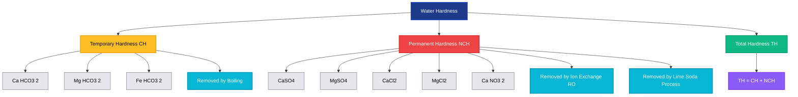
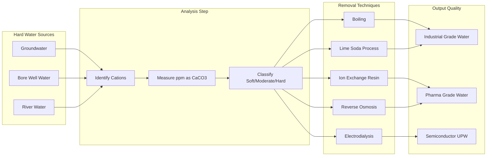
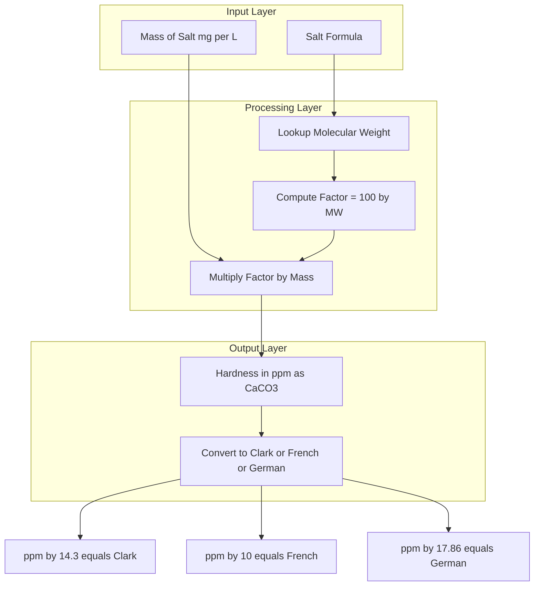
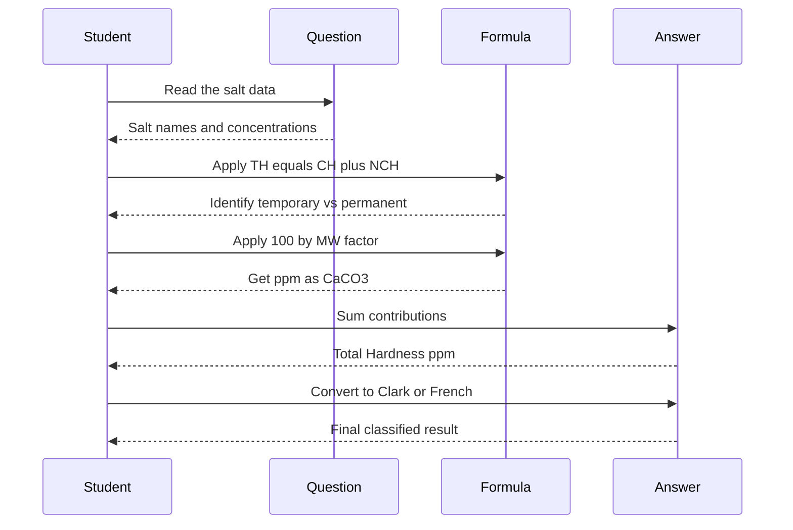

# Water characteristics - Hardness - Types of hardness- Temporary and Permanent - Disadvantages of hard water -Degree of hardness (Numericals)

<!-- SECTION_1_START -->
# Water Characteristics & Hardness — Core Foundations

## 1.1 Formal Academic Definition

> [!NOTE]
> **Water Hardness** is defined as the *soap-destroying power* of water, caused primarily by the presence of dissolved **divalent metallic cations** — predominantly **Calcium ($Ca^{2+}$)** and **Magnesium ($Mg^{2+}$)** ions — along with other dissolved salts like $Al^{3+}$ and $Fe^{2+}$.

In quantitative terms, hardness is the **total concentration of all multivalent cations present in water**, expressed as the equivalent amount of **Calcium Carbonate ($CaCO_3$)** in **parts per million (ppm)** or **mg/L**.

$$ \text{Hardness} = \sum [\text{Concentration of hardness-producing cations} \times \text{equivalent weight factor}] $$

## 1.2 Intuitive Analogy — The "Mineral Tea" Concept

Imagine you are brewing tea in a new steel kettle versus an old, mineral-crusted kettle:

- **Soft water** behaves like the clean steel kettle — it lathers soap instantly, boils rice fluffy, and leaves no chalky residue on the heating element.
- **Hard water** behaves like the mineral-crusted kettle — soap refuses to lather (it forms a *scum* with $Ca^{2+}$/$Mg^{2+}$ instead), pipes get choked with scale, and boilers waste extra fuel.

> [!IMPORTANT]
> **KTU 2024 Syllabus Highlight:** Hardness is a *property* of water, not an impurity per se. The water may be perfectly safe to drink, yet *unsuitable for industrial use* (boilers, cooling towers, textile dyeing, semiconductor wafer rinsing).

## 1.3 Classification of Water Based on Hardness (KTU Reference Table)

| Class | $CaCO_3$ Concentration (ppm) | Typical Source |
|---|---|---|
| **Soft Water** | $0 - 60$ | Rainwater, distilled water |
| **Moderately Hard** | $61 - 120$ | River water (low mineral zones) |
| **Hard Water** | $121 - 180$ | Groundwater, limestone aquifers |
| **Very Hard Water** | $> 180$ | Deep bore wells, gypsum-rich zones |

> [!TIP]
> Kerala's laterite soil and crystalline rock aquifers typically yield **soft to moderately hard** water, while alluvial/plains regions of northern Kerala often produce **hard to very hard** groundwater.

## 1.4 Why Hardness Matters to Information Science & Electrical Engineers

- **Cooling circuits of data centers** scale up rapidly with hard water, increasing $PUE$ (Power Usage Effectiveness).
- **High-purity rinse water** for **PCB fabrication** and **semiconductor wafer processing** must have hardness $< 1$ ppm — any $Ca^{2+}$ residue causes *photoresist defects* and *dielectric breakdown* failures.
- **Steam turbines in power plants** suffer efficiency loss of nearly **1 % per mm of scale buildup** on the boiler tubes.
- **Transformer cooling oils** contaminated with hard water emulsions lead to dielectric failure.

> [!VISUALIZATION CONTROL]
> **Concept:** Solubility behavior of $CaCO_3$ vs $Ca(HCO_3)_2$
> **GeoGebra / Desmos Input Equations:**
> * `f(x) = log10(x) ` for solubility curve of $CaCO_3$
> * `g(x) = log10(x) + 1.2` for $Ca(HCO_3)_2$ curve
> **Visual Description:** A horizontal-line plot where $Ca(HCO_3)_2$ sits roughly **60–80 times higher** on the solubility axis than $CaCO_3$, visually demonstrating *why* boiling precipitates temporary hardness.

<!-- SECTION_1_END -->

<!-- SECTION_2_START -->
# Deep Theoretical Analysis & KTU High-Yield Formula Sheet

## 2.1 Sources of Hardness

Water acquires hardness as it percolates through geological strata:

- **Limestone ($CaCO_3$)** and **Dolomite ($CaCO_3 \cdot MgCO_3$)** — primary carbonate sources
- **Gypsum ($CaSO_4 \cdot 2H_2O$)** — sulfate source (non-carbonate hardness)
- **Chlorides of $Ca^{2+}$ and $Mg^{2+}$** — from marine/aquatic infiltration
- **Soluble silicates and phosphates** — minor contributors

> [!NOTE]
> In **KTU 2024 scheme problems**, hardness is *always* assumed to come from $Ca^{2+}$ and $Mg^{2+}$ only. Other cations ($Fe^{2+}, Al^{3+}$) are ignored unless explicitly stated.

## 2.2 Types of Hardness — The Two-Fold Classification

### A. Temporary Hardness (Carbonate Hardness — $CH$)

Temporary hardness is caused by **bicarbonates of calcium and magnesium**. It is *temporary* because it can be eliminated simply by **boiling** — the bicarbonates decompose into insoluble carbonates that precipitate out.

**Governing Reactions:**

$$ Ca(HCO_3)_2 \xrightarrow{\Delta} CaCO_3 \downarrow + H_2O + CO_2 \uparrow $$

$$ Mg(HCO_3)_2 \xrightarrow{\Delta} MgCO_3 \downarrow + H_2O + CO_2 \uparrow $$

> The precipitated $CaCO_3$ is the familiar "boiler scale" or "kettle fur" seen on household utensils.

### B. Permanent Hardness (Non-Carbonate Hardness — $NCH$)

Permanent hardness is caused by **chlorides, sulfates, and other non-carbonate salts** of $Ca^{2+}$ and $Mg^{2+}$. It **cannot be removed by boiling** and requires chemical treatment (ion exchange, reverse osmosis, lime-soda process).

**Examples of Permanent Hardness Salts:**

$$ CaCl_2, \; MgCl_2, \; CaSO_4, \; MgSO_4, \; Ca(NO_3)_2, \; Mg(NO_3)_2 $$

> [!IMPORTANT]
> **Total Hardness (TH)** = **Temporary Hardness (TH_temp)** + **Permanent Hardness (TH_perm)**
> Or equivalently: $TH = CH + NCH$

## 2.3 Disadvantages of Hard Water — Engineering Perspective

| Domain | Disadvantage | Engineering Impact |
|---|---|---|
| **Domestic** | Soap scum formation, poor lathering | $Wastage\ of\ soap \approx 2\times hardness\ in\ ppm$ |
| **Textile/Dyeing** | Uneven dye absorption, fabric staining | Rejection of dyed batches |
| **Boilers/Steam** | Scale formation on heating tubes | Heat-transfer loss, tube burnout, fuel wastage |
| **Cooling Towers** | Bio-fouling, scale on condenser tubes | Reduced heat exchange efficiency |
| **Semiconductor** | $Ca^{2+}$ residue on wafers | Photoresist defects, dielectric breakdown |
| **Pharmaceutical** | $Mg^{2+}$ interferes with reagent purity | Assay failures |
| **Concrete Setting** | Retards cement hydration | Structural weakness |

> [!WARNING]
> **KTU Common Error:** Students often write "hard water is unhealthy to drink" — this is **scientifically false**. Hardness is *not* a health hazard; in fact, *cardiovascular benefits* of $Ca^{2+}/Mg^{2+}$ in drinking water are well documented. The problem is **industrial and domestic usability**, not health.

## 2.4 Degree of Hardness — Numerical Framework

The **degree of hardness** is the quantitative measure of hardness expressed as equivalent $CaCO_3$ content.

### Standard Units (KTU Reference)

| Unit | Definition | Conversion |
|---|---|---|
| **ppm** (mg/L) | mg of $CaCO_3$ per litre of water | $1\ ppm = 1\ mg/L$ |
| **$^\circ$Clark** | Grains of $CaCO_3$ per Imperial gallon | $1\ ^\circ Cl = 14.3\ ppm$ |
| **$^\circ$French** | Parts of $CaCO_3$ per $10^5$ parts of water | $1\ ^\circ Fr = 10\ ppm$ |
| **$^\circ$German ($^\circ$dH$)** | mg of $CaO$ per 100 mL water | $1\ ^\circ dH = 17.86\ ppm$ |

> [!TIP]
> **KTU 2024 Pattern:** Numerical problems *almost always* ask conversions to/from ppm and may include **Clark/French/German** units as part (a) of a sub-question.

### The Master Formula — Equivalence Calculation

$$ \text{Hardness (as } CaCO_3\text{)} = \frac{\text{Mass of salt (mg)} \times 100}{\text{Molecular weight of salt}} \times \frac{50}{\text{Equivalent weight}} $$

Simplified **standard formula used in every KTU problem**:

$$ \text{Hardness (ppm as } CaCO_3) = \frac{\text{Mass of substance (mg/L)} \times 100 \times \text{E.W. of } CaCO_3}{\text{Molecular weight of substance}} $$

Since the equivalent weight of $CaCO_3$ is **50** (molecular weight 100, valency factor 2):

$$ \boxed{ \text{Hardness (ppm)} = \frac{\text{Mass of salt} \times 50 \times 1000}{\text{Molecular weight of salt} \times \text{Volume of solution in L}} } $$

### Equivalent Weights of Common Hardness-Producing Salts

| Salt | Molecular Weight | Equivalent Weight | Multiplication Factor to Convert to $CaCO_3$ |
|---|---|---|---|
| $CaCO_3$ | 100 | 50 | **1.00** |
| $Ca(HCO_3)_2$ | 162 | 81 | 0.617 |
| $CaSO_4$ | 136 | 68 | 0.735 |
| $CaCl_2$ | 111 | 55.5 | 0.901 |
| $MgCO_3$ | 84 | 42 | 1.190 |
| $Mg(HCO_3)_2$ | 146 | 73 | 0.685 |
| $MgSO_4$ | 120 | 60 | 0.833 |
| $MgCl_2$ | 95 | 47.5 | 1.053 |
| $CaO$ | 56 | 28 | 1.785 |

> [!IMPORTANT]
> The **Multiplication Factor (M.F.)** is the key to every KTU numerical. Memorize this table — it appears in **almost every Dec/Jan and May/June KTU paper**.

## 2.5 Alkalinity vs Hardness — Distinction (Frequent KTU Pitfall)

> [!NOTE]
> **Alkalinity** is the water's *acid-neutralizing capacity* — caused by $OH^-$, $CO_3^{2-}$, $HCO_3^-$ ions.
> **Hardness** is the water's *soap-destroying capacity* — caused by $Ca^{2+}, Mg^{2+}$ ions.
>
> They are **different** parameters but **mathematically interlinked** when carbonates are present.

The relationships are:
- If $CH > TA$ (Carbonate Hardness > Total Alkalinity): $NCH = TH - CH$, and $CH = TA$
- If $TA > CH$: $CH = TH$ (all of it is carbonate hardness), and $NCH = 0$

<!-- SECTION_2_END -->

<!-- SECTION_3_START -->
# Step-by-Step Derivations & Numerical Solutions

## 3.1 Foundational Derivation — The Equivalence Logic

### Why is the Multiplication Factor 50/Equivalent Weight?

The concept is based on **equivalent chemistry**: $1$ equivalent of *any* hardness-producing salt reacts with *exactly* $1$ equivalent of soap-destroying cation. We choose $CaCO_3$ as the *reference standard* because:

1. $CaCO_3$ has molecular weight = $100$
2. Its equivalent weight = $\frac{100}{2} = 50$ (since $Ca$ is divalent)
3. Therefore, $1$ equivalent of $CaCO_3 = 50$ g

To express *any* salt in terms of $CaCO_3$ equivalence:

$$ \text{Mass of } CaCO_3 \text{ equivalent} = \text{Mass of salt} \times \frac{\text{E.W. of } CaCO_3}{\text{E.W. of salt}} = \text{Mass of salt} \times \frac{50}{\text{E.W. of salt}} $$

Multiplying the numerator and denominator by 2 converts to molecular weights:

$$ \frac{50}{\text{E.W. of salt}} = \frac{50 \times 2}{\text{M.W. of salt}} = \frac{100}{\text{M.W. of salt}} $$

This yields the **master conversion factor**:

$$ \boxed{ \text{Hardness as } CaCO_3 = \text{Mass of salt} \times \frac{100}{\text{M.W. of salt}} } $$

> [!IMPORTANT]
> **KTU Note:** This $100/\text{M.W.}$ factor is the **multiplication factor** tabulated earlier. It represents "how many grams of $CaCO_3$ are chemically equivalent to 1 gram of the given salt."

## 3.2 Numerical Problem 1 — Comprehensive Multi-Salt Calculation (14-Mark Standard)

### **Problem Statement**

A water sample contains the following dissolved salts per litre:

- $Ca(HCO_3)_2 = 16.2\ mg/L$
- $Mg(HCO_3)_2 = 7.3\ mg/L$
- $CaSO_4 = 13.6\ mg/L$
- $MgCl_2 = 9.5\ mg/L$

Calculate:
**(a)** Total Hardness, Temporary Hardness, Permanent Hardness — all in ppm as $CaCO_3$
**(b)** Express the total hardness in $^\circ$Clark and $^\circ$French

### **Step-by-Step Solution**

#### Part (a)(i) — Temporary Hardness

Temporary hardness comes only from **bicarbonates**:

**From $Ca(HCO_3)_2$:**

$$ \text{TH}_1 = 16.2 \times \frac{100}{162} = 16.2 \times 0.6173 = 10.0\ ppm $$

Detailed expansion:

$$ \begin{aligned} \text{TH}_1 &= 16.2 \times \frac{100}{162} \\ &= 16.2 \times 0.61728 \\ &= 10.000\ ppm \end{aligned} $$

**From $Mg(HCO_3)_2$:**

$$ \begin{aligned} \text{TH}_2 &= 7.3 \times \frac{100}{146} \\ &= 7.3 \times 0.68493 \\ &= 5.000\ ppm \end{aligned} $$

**Total Temporary Hardness:**

$$ TH_{temp} = 10.0 + 5.0 = 15.0\ ppm $$

**[Valuation: 1 Mark per salt + 1 Mark total = 3 Marks]**

#### Part (a)(ii) — Permanent Hardness

Permanent hardness comes from **non-bicarbonate salts**:

**From $CaSO_4$:**

$$ \begin{aligned} \text{PH}_1 &= 13.6 \times \frac{100}{136} \\ &= 13.6 \times 0.73529 \\ &= 10.000\ ppm \end{aligned} $$

**From $MgCl_2$:**

$$ \begin{aligned} \text{PH}_2 &= 9.5 \times \frac{100}{95} \\ &= 9.5 \times 1.05263 \\ &= 10.000\ ppm \end{aligned} $$

**Total Permanent Hardness:**

$$ TH_{perm} = 10.0 + 10.0 = 20.0\ ppm $$

**[Valuation: 1 Mark per salt + 1 Mark total = 3 Marks]**

#### Part (a)(iii) — Total Hardness

$$ \begin{aligned} TH_{total} &= TH_{temp} + TH_{perm} \\ &= 15.0 + 20.0 \\ &= 35.0\ ppm \end{aligned} $$

**[Valuation: 1 Mark]**

#### Part (b) — Unit Conversions

**In $^\circ$Clark:**

$$ \begin{aligned} ^\circ Cl &= \frac{TH_{ppm}}{14.3} \\ &= \frac{35.0}{14.3} \\ &= 2.448\ ^\circ Cl \end{aligned} $$

**In $^\circ$French:**

$$ \begin{aligned} ^\circ Fr &= \frac{TH_{ppm}}{10} \\ &= \frac{35.0}{10} \\ &= 3.5\ ^\circ Fr \end{aligned} $$

**[Valuation: 1 Mark each conversion = 2 Marks]**

### **Final Answer Summary**

| Parameter | Value |
|---|---|
| Temporary Hardness | $15.0\ ppm$ |
| Permanent Hardness | $20.0\ ppm$ |
| **Total Hardness** | $\mathbf{35.0\ ppm}$ |
| Hardness in $^\circ$Clark | $2.45\ ^\circ Cl$ |
| Hardness in $^\circ$French | $3.5\ ^\circ Fr$ |

**Classification:** $35.0\ ppm$ lies in $0-60$ range → **Soft Water**

---

## 3.3 Numerical Problem 2 — Sample with Given Volume (Volume-Based Calculation)

### **Problem Statement**

$5$ litres of a water sample contains:
- $Ca(HCO_3)_2 = 0.324\ g$
- $MgSO_4 = 0.240\ g$

Calculate the temporary and permanent hardness in ppm.

### **Step-by-Step Solution**

**Step 1: Convert grams to mg and find concentration per litre**

$$ [Ca(HCO_3)_2] = \frac{0.324 \times 1000}{5} = 64.8\ mg/L $$

$$ [MgSO_4] = \frac{0.240 \times 1000}{5} = 48.0\ mg/L $$

**Step 2: Calculate hardness contribution**

$$ \begin{aligned} \text{Temporary Hardness (from } Ca(HCO_3)_2) &= 64.8 \times \frac{100}{162} \\ &= 64.8 \times 0.6173 \\ &= 40.00\ ppm \end{aligned} $$

$$ \begin{aligned} \text{Permanent Hardness (from } MgSO_4) &= 48.0 \times \frac{100}{120} \\ &= 48.0 \times 0.8333 \\ &= 40.00\ ppm \end{aligned} $$

**Final Answer:**

$$ TH_{temp} = 40.0\ ppm, \quad TH_{perm} = 40.0\ ppm, \quad TH_{total} = 80.0\ ppm $$

Classification: **Moderately Hard Water**

---

## 3.4 Numerical Problem 3 — Conversion from $CaO$ Equivalent

### **Problem Statement**

A water sample has hardness equivalent to $28\ mg/L$ of $CaO$. Express the hardness in terms of $CaCO_3$ equivalent in ppm and in $^\circ$German.

### **Step-by-Step Solution**

**Step 1: Convert $CaO$ to $CaCO_3$ equivalent**

Using the multiplication factor from the table: $1.785$ (or direct formula):

$$ \begin{aligned} \text{Hardness as } CaCO_3 &= 28 \times \frac{100}{56} \\ &= 28 \times 1.7857 \\ &= 50.0\ ppm \end{aligned} $$

**Step 2: Convert to $^\circ$German (1 $^\circ$dH = 17.86 ppm)**

$$ \begin{aligned} ^\circ dH &= \frac{50.0}{17.86} \\ &= 2.80\ ^\circ dH \end{aligned} $$

**Final Answer:** $50.0\ ppm$ as $CaCO_3$, which equals $2.80\ ^\circ dH$

---

## 3.5 Numerical Problem 4 — $Ca^{2+}$ and $Mg^{2+}$ Direct Ion Calculation

### **Problem Statement**

A water sample contains $Ca^{2+} = 80\ mg/L$ and $Mg^{2+} = 48\ mg/L$. Calculate total hardness as $CaCO_3$ equivalent in ppm.

### **Step-by-Step Solution**

**Step 1: Calculate hardness from $Ca^{2+}$**

Since $Ca^{2+}$ is being expressed *as if* it came from $CaCO_3$:

$$ \begin{aligned} \text{Hardness}_{Ca} &= [Ca^{2+}] \times \frac{\text{E.W. of } CaCO_3}{\text{E.W. of } Ca^{2+}} \\ &= 80 \times \frac{50}{20} \\ &= 80 \times 2.5 \\ &= 200.0\ ppm \end{aligned} $$

Or equivalently, $80 \times \frac{100}{40} = 200.0\ ppm$ (atomic weight of Ca = 40).

**Step 2: Calculate hardness from $Mg^{2+}$**

$$ \begin{aligned} \text{Hardness}_{Mg} &= [Mg^{2+}] \times \frac{50}{12} \\ &= 48 \times \frac{50}{12} \\ &= 48 \times 4.1667 \\ &= 200.0\ ppm \end{aligned} $$

**Step 3: Total Hardness**

$$ TH_{total} = 200.0 + 200.0 = 400.0\ ppm $$

**Classification:** **Very Hard Water** ($> 180\ ppm$)

> [!TIP]
> **Quick Check Formula for Ions:** $\frac{50}{\text{Atomic Weight of metal}} = \frac{50}{40} = 1.25$ for $Ca^{2+}$, and $\frac{50}{24} = 2.083$ for $Mg^{2+}$.

---

## 3.6 Numerical Problem 5 — Soap Consumption Calculation (Bonus)

### **Problem Statement**

A laundry uses $1000\ L$ of water daily with total hardness of $200\ ppm$. If $1\ kg$ of soap (sodium stearate, $NaC_{17}H_{35}COO$, M.W. = 306) is required to soften $1.0 \times 10^5\ mg$ of $CaCO_3$ hardness, calculate the annual soap wastage in kg. (Assume 1 year = 300 working days)

### **Step-by-Step Solution**

**Step 1: Total $CaCO_3$ hardness per day**

$$ \text{Hardness/day} = 200\ mg/L \times 1000\ L = 2 \times 10^5\ mg $$

**Step 2: Soap required per day**

$$ \text{Soap/day} = 2 \times 10^5\ mg \times \frac{1\ kg}{1.0 \times 10^5\ mg} = 2.0\ kg $$

**Step 3: Annual soap wastage**

$$ \text{Soap/year} = 2.0 \times 300 = 600\ kg $$

**Final Answer:** $600\ kg$ of soap is wasted per year due to hard water — a substantial economic loss that justifies industrial water softening.

---

## 3.7 Python Implementation — Hardness Calculator (For Engineering Reference)

```python
from dataclasses import dataclass
from typing import Dict, List

@dataclass
class HardnessSalt:
    name: str
    molecular_weight: float
    equivalent_weight: float
    is_temporary: bool  # True if bicarbonate, False if permanent

# Standard KTU reference data
SALTS_DB: Dict[str, HardnessSalt] = {
    "Ca(HCO3)2": HardnessSalt("Ca(HCO3)2", 162.0, 81.0, True),
    "Mg(HCO3)2": HardnessSalt("Mg(HCO3)2", 146.0, 73.0, True),
    "CaSO4":      HardnessSalt("CaSO4",      136.0, 68.0, False),
    "MgSO4":      HardnessSalt("MgSO4",      120.0, 60.0, False),
    "CaCl2":      HardnessSalt("CaCl2",      111.0, 55.5, False),
    "MgCl2":      HardnessSalt("MgCl2",       95.0, 47.5, False),
    "CaCO3":      HardnessSalt("CaCO3",      100.0, 50.0, True),
    "MgCO3":      HardnessSalt("MgCO3",       84.0, 42.0, True),
}

def hardness_as_caco3(mass_mg_per_l: float, salt_name: str) -> float:
    """
    Convert salt concentration to CaCO3-equivalent hardness in ppm.
    
    Args:
        mass_mg_per_l: Mass concentration in mg/L
        salt_name: Chemical formula (must exist in SALTS_DB)
    
    Returns:
        Hardness in ppm as CaCO3
    
    Raises:
        KeyError: If salt not in database
        ValueError: If mass is negative
    """
    if mass_mg_per_l < 0:
        raise ValueError(f"Mass cannot be negative: {mass_mg_per_l}")
    if salt_name not in SALTS_DB:
        raise KeyError(f"Salt {salt_name} not in KTU reference database")
    
    salt = SALTS_DB[salt_name]
    return mass_mg_per_l * (100.0 / salt.molecular_weight)

def total_hardness(salt_concentrations: Dict[str, float]) -> Dict[str, float]:
    """
    Compute temporary, permanent, and total hardness.
    
    Args:
        salt_concentrations: {salt_name: mg/L}
    
    Returns:
        Dictionary with 'temporary', 'permanent', 'total' hardness in ppm
    """
    temp_h, perm_h = 0.0, 0.0
    
    for salt_name, conc in salt_concentrations.items():
        if conc < 0:
            raise ValueError(f"Negative concentration for {salt_name}")
        contribution = hardness_as_caco3(conc, salt_name)
        if SALTS_DB[salt_name].is_temporary:
            temp_h += contribution
        else:
            perm_h += contribution
    
    return {
        "temporary": round(temp_h, 2),
        "permanent": round(perm_h, 2),
        "total":     round(temp_h + perm_h, 2)
    }

def classify_water(total_hardness_ppm: float) -> str:
    """Classify water based on KTU hardness scale."""
    if total_hardness_ppm <= 60:
        return "Soft Water"
    elif total_hardness_ppm <= 120:
        return "Moderately Hard"
    elif total_hardness_ppm <= 180:
        return "Hard Water"
    else:
        return "Very Hard Water"

# Example: Numerical Problem 1 verification
if __name__ == "__main__":
    sample = {
        "Ca(HCO3)2": 16.2,
        "Mg(HCO3)2": 7.3,
        "CaSO4":     13.6,
        "MgCl2":     9.5
    }
    result = total_hardness(sample)
    print(f"Temporary Hardness: {result['temporary']} ppm")
    print(f"Permanent Hardness: {result['permanent']} ppm")
    print(f"Total Hardness:     {result['total']} ppm")
    print(f"Classification:     {classify_water(result['total'])}")
    # Expected Output:
    # Temporary Hardness: 15.0 ppm
    # Permanent Hardness: 20.0 ppm
    # Total Hardness:     35.0 ppm
    # Classification:     Soft Water
```

<!-- SECTION_3_END -->

<!-- SECTION_4_START -->
# Structural Diagrams & Schematics

## 4.1 Hierarchical Classification of Water Hardness



## 4.2 Hardness Removal Process Flow



## 4.3 Equivalent Weight Conversion Logic (Functional Block Diagram)



## 4.4 KTU 2024 Numerical Problem-Solving Topology



<!-- SECTION_4_END -->

<!-- SECTION_5_START -->
# KTU 2024 Scheme Examination Question Bank & Topic Recap

## PART A — 3 Mark Questions (Short Answer)

### **Question 1** `[KTU University Exam - July 2024]`
**Define hardness of water. Why is it expressed in terms of $CaCO_3$ equivalent?**

**Model Answer:**

> [!NOTE]
> **Hardness** of water is defined as the *soap-destroying capacity* of water caused by the presence of dissolved divalent cations, primarily $Ca^{2+}$ and $Mg^{2+}$, expressed as equivalent $CaCO_3$ content in ppm.
>
> **Why $CaCO_3$ equivalent?** Because $CaCO_3$ has a molecular weight of $100$ and equivalent weight of $50$, making it a *convenient numerical reference*. All hardness-producing salts can be expressed in terms of $CaCO_3$ using the simple conversion factor $\frac{100}{M.W.}$ of the respective salt. This standardization enables uniform comparison across different water sources and simplifies industrial water-quality reporting.
>
> **CO1 — Remember Level — [3 Marks: 1 definition + 2 reasoning]**

---

### **Question 2** `[KTU University Exam - Dec 2023]`
**Distinguish between temporary and permanent hardness with one example each.**

**Model Answer:**

> [!NOTE]
> | Parameter | Temporary Hardness | Permanent Hardness |
> |---|---|---|
> | **Cause** | Bicarbonates of $Ca^{2+}$ and $Mg^{2+}$ | Chlorides and sulfates of $Ca^{2+}$ and $Mg^{2+}$ |
> | **Example** | $Ca(HCO_3)_2$ | $CaSO_4$ |
> | **Removal by boiling** | Yes (decomposes to $CaCO_3 \downarrow$) | No |
> | **Other name** | Carbonate Hardness ($CH$) | Non-Carbonate Hardness ($NCH$) |
>
> **CO1 — Understand Level — [3 Marks: 1 each row + 1 for example]**

---

## PART B — 14 Mark Questions (Module Internal Choice Pattern)

### **QUESTION A (14 Marks)** `[KTU University Exam - Dec 2024]`

**(a)** Explain the various units used to express hardness of water. Convert $150\ ppm$ of hardness into $^\circ$Clark, $^\circ$French, and $^\circ$German scales. **[7 Marks]**

**(b)** A water sample on analysis gives the following results: $Ca(HCO_3)_2 = 24.3\ mg/L$, $Mg(HCO_3)_2 = 14.6\ mg/L$, $CaSO_4 = 27.2\ mg/L$, $MgCl_2 = 19.0\ mg/L$. Calculate the temporary, permanent, and total hardness of water in ppm. **[7 Marks]**

---

#### **Model Solution — Part (a): Units of Hardness**

The various units for expressing hardness are:

**1. Parts per Million (ppm):** Milligrams of $CaCO_3$ equivalent per litre of water.
$$ 1\ ppm = 1\ mg/L $$

**2. Degrees Clark ($^\circ$Cl):** Grains of $CaCO_3$ per Imperial gallon (1 grain = 64.8 mg, 1 gallon = 4.546 L)
$$ 1\ ^\circ Cl = 1\ grain/gal = \frac{64.8}{4.546}\ mg/L \approx 14.3\ ppm $$

**3. Degrees French ($^\circ$Fr):** Parts of $CaCO_3$ per 100,000 parts of water.
$$ 1\ ^\circ Fr = 10\ ppm $$

**4. Degrees German ($^\circ$dH):** Milligrams of $CaO$ per 100 mL of water.
$$ 1\ ^\circ dH = 17.86\ ppm $$

**Conversion of 150 ppm:**

$$ \begin{aligned} ^\circ Cl &= \frac{150}{14.3} = 10.49\ ^\circ Cl \end{aligned} $$

$$ \begin{aligned} ^\circ Fr &= \frac{150}{10} = 15.0\ ^\circ Fr \end{aligned} $$

$$ \begin{aligned} ^\circ dH &= \frac{150}{17.86} = 8.40\ ^\circ dH \end{aligned} $$

**Final Answer:** $150\ ppm = 10.49\ ^\circ Cl = 15.0\ ^\circ Fr = 8.40\ ^\circ dH$

> **[Valuation: 1 Mark for each unit definition + 0.5 Mark per conversion = 7 Marks]**

---

#### **Model Solution — Part (b): Multi-Salt Numerical**

**Step 1: Identify Temporary Hardness Salts** (Bicarbonates)

| Salt | Concentration | Multiplication Factor | Hardness ppm |
|---|---|---|---|
| $Ca(HCO_3)_2$ | $24.3\ mg/L$ | $\frac{100}{162} = 0.617$ | $24.3 \times 0.617 = 15.0$ |
| $Mg(HCO_3)_2$ | $14.6\ mg/L$ | $\frac{100}{146} = 0.685$ | $14.6 \times 0.685 = 10.0$ |

$$ \mathbf{TH_{temp} = 15.0 + 10.0 = 25.0\ ppm} $$

**[Valuation: 1 Mark for identification + 1 Mark for table + 1 Mark sum = 3 Marks]**

**Step 2: Identify Permanent Hardness Salts** (Non-bicarbonates)

| Salt | Concentration | Multiplication Factor | Hardness ppm |
|---|---|---|---|
| $CaSO_4$ | $27.2\ mg/L$ | $\frac{100}{136} = 0.735$ | $27.2 \times 0.735 = 20.0$ |
| $MgCl_2$ | $19.0\ mg/L$ | $\frac{100}{95} = 1.053$ | $19.0 \times 1.053 = 20.0$ |

$$ \mathbf{TH_{perm} = 20.0 + 20.0 = 40.0\ ppm} $$

**[Valuation: 1 Mark for table + 1 Mark sum = 2 Marks]**

**Step 3: Total Hardness**

$$ \begin{aligned} TH_{total} &= TH_{temp} + TH_{perm} \\ &= 25.0 + 40.0 \\ &= 65.0\ ppm \end{aligned} $$

**Classification:** $65.0\ ppm$ → **Moderately Hard Water**

**[Valuation: 1 Mark for total + 1 Mark classification = 2 Marks]**

> [!WARNING]
> **KTU Examiner's Pitfall Warning:** Students often forget to write the **Multiplication Factor** explicitly in the table. Always show: `Mass × (100 / M.W.) = Hardness in ppm`. Skipping this step **costs 1 full mark per salt**.

---

### **QUESTION B (14 Marks)** `[KTU University Exam - July 2024 — Alternative Choice]`

**(a)** With suitable chemical equations, explain temporary and permanent hardness. Discuss any **three** disadvantages of using hard water in industries. **[7 Marks]**

**(b)** A water sample contains the following dissolved salts:
- $Ca^{2+} = 100\ mg/L$
- $Mg^{2+} = 60\ mg/L$

Calculate the total hardness in ppm as $CaCO_3$ equivalent. Express your answer in French and German degrees. **[7 Marks]**

---

#### **Model Solution — Part (a): Types & Disadvantages**

**Temporary Hardness:**

Temporary hardness is caused by **bicarbonates of calcium and magnesium** dissolved in water. It is called *temporary* because it can be removed by simple boiling.

$$ Ca(HCO_3)_2 \xrightarrow{\Delta} CaCO_3 \downarrow + H_2O + CO_2 \uparrow $$

$$ Mg(HCO_3)_2 \xrightarrow{\Delta} MgCO_3 \downarrow + H_2O + CO_2 \uparrow $$

**Permanent Hardness:**

Permanent hardness is caused by **chlorides and sulfates of $Ca^{2+}$ and $Mg^{2+}$**. It cannot be removed by boiling; chemical methods such as ion exchange or lime-soda are required.

Example salts: $CaCl_2, MgSO_4, CaSO_4, MgCl_2$

**Three Industrial Disadvantages:**

**1. Boiler Scale Formation:**
Hard water forms a thick layer of $CaCO_3$ and $Mg(OH)_2$ scale on boiler tubes. This scale has **low thermal conductivity**, causing fuel wastage (≈ 1% efficiency loss per mm of scale) and localized overheating that may lead to tube rupture.

**2. Soap Wastage:**
Hard water reacts with sodium stearate soap to form an insoluble *scum*:
$$ 2C_{17}H_{35}COONa + Ca^{2+} \rightarrow (C_{17}H_{35}COO)_2Ca \downarrow + 2Na^+ $$
This causes economic loss and prevents effective cleaning.

**3. Textile & Dyeing Defects:**
Hard water causes **uneven dyeing, fabric staining, and poor color fastness** in the textile industry, leading to batch rejection and financial loss.

> **[Valuation: 1.5 Marks for each type + 1 Mark for each disadvantage × 3 = 4.5 + 2.5 = 7 Marks]**

---

#### **Model Solution — Part (b): Ion-Based Calculation**

**Atomic weights:** $Ca = 40$, $Mg = 24$, $CaCO_3 = 100$ (E.W. = 50)

**Step 1: Hardness from $Ca^{2+}$**

$$ \begin{aligned} \text{Hardness}_{Ca} &= [Ca^{2+}] \times \frac{50}{20} \\ &= 100 \times 2.5 \\ &= 250.0\ ppm \end{aligned} $$

**[Valuation: 1 Mark for formula + 1 Mark calculation = 2 Marks]**

**Step 2: Hardness from $Mg^{2+}$**

$$ \begin{aligned} \text{Hardness}_{Mg} &= [Mg^{2+}] \times \frac{50}{12} \\ &= 60 \times 4.1667 \\ &= 250.0\ ppm \end{aligned} $$

**[Valuation: 1 Mark for formula + 1 Mark calculation = 2 Marks]**

**Step 3: Total Hardness**

$$ TH_{total} = 250.0 + 250.0 = 500.0\ ppm $$

**[Valuation: 1 Mark]**

**Step 4: Unit Conversions**

$$ \begin{aligned} ^\circ Fr &= \frac{500}{10} = 50.0\ ^\circ Fr \end{aligned} $$

$$ \begin{aligned} ^\circ dH &= \frac{500}{17.86} = 27.99 \approx 28.0\ ^\circ dH \end{aligned} $$

**[Valuation: 1 Mark for each conversion = 2 Marks]**

**Final Answer:** $500.0\ ppm = 50.0\ ^\circ Fr = 28.0\ ^\circ dH$ → **Very Hard Water**

> [!WARNING]
> **KTU Examiner's Pitfall Warning (Part b):** Students frequently confuse **equivalent weight of cation** with **atomic weight**. For $Ca^{2+}$, E.W. = $\frac{40}{2} = 20$, NOT $40$. Using atomic weight instead of equivalent weight **doubles the answer** and loses 2 marks.

---

> [!WARNING]
> **KTU General Valuation Warnings — Hardness Numericals**
>
> 1. **Always show the multiplication factor** $\frac{100}{M.W.}$ explicitly — not just the final ppm value.
> 2. **Don't forget unit conversion sub-parts.** If the question asks for Clark/French/German, missing even one loses 1–2 marks.
> 3. **State the classification** (soft/moderately hard/hard/very hard) at the end — it is often a hidden 0.5–1 mark requirement.
> 4. **Distinguish temporary vs permanent correctly.** Bicarbonates are temporary; chlorides and sulfates are permanent. Many students wrongly classify $CaCO_3$ as temporary — it is *not* a bicarbonate.
> 5. **Use correct molecular weights** — $CaCO_3 = 100$, $CaSO_4 = 136$, $MgCl_2 = 95$, $Mg(HCO_3)_2 = 146$, $Ca(HCO_3)_2 = 162$.

---

## Topic Recap & Important Things to Remember

- **Hardness = soap-destroying power** caused by $Ca^{2+}, Mg^{2+}$ (and rarely $Fe^{2+}, Al^{3+}$) cations.
- **Temporary Hardness (CH)** is due to **bicarbonates** — removable by **boiling** (precipitates as $CaCO_3$).
- **Permanent Hardness (NCH)** is due to **chlorides and sulfates** — removable only by **chemical treatment** (ion exchange, lime-soda, RO).
- **Total Hardness (TH) = CH + NCH** (always, in all problems).
- **Standard unit is ppm as $CaCO_3$** — because $CaCO_3$ has the convenient E.W. of $50$ and M.W. of $100$.
- **Master Conversion Formula:**
$$ \text{Hardness as } CaCO_3\ (ppm) = \text{Mass of salt (mg/L)} \times \frac{100}{M.W. \text{ of salt}} $$
- **Unit Conversions to memorize:**
   - $1\ ^\circ Cl = 14.3\ ppm$
   - $1\ ^\circ Fr = 10\ ppm$
   - $1\ ^\circ dH = 17.86\ ppm$
- **Hardness Classification Scale:** Soft ($0-60$), Moderate ($61-120$), Hard ($121-180$), Very Hard ($>180$) — all in ppm.
- **Ion-based formula:** $Hardness_{ion} = [Ion] \times \frac{50}{E.W. \text{ of ion}}$
- **Equivalent weights of common hardness salts** — must be memorized (see master table in Section 2.4).
- **Boiling removes ONLY temporary hardness** — the precipitated $CaCO_3$ is the "kettle fur" / boiler scale.
- **Hardness is NOT a health hazard** — it is an *industrial usability* problem, not a toxicity issue.
- **In KTU 2024 exams,** always show: (1) salt identification, (2) multiplication factor, (3) calculation, (4) summation, (5) unit conversion if asked, (6) classification. This six-step structure guarantees full marks.

<!-- SECTION_5_END -->
