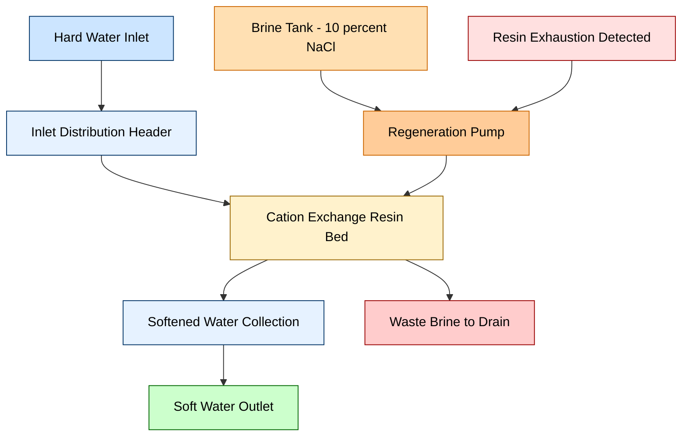
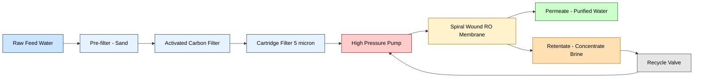
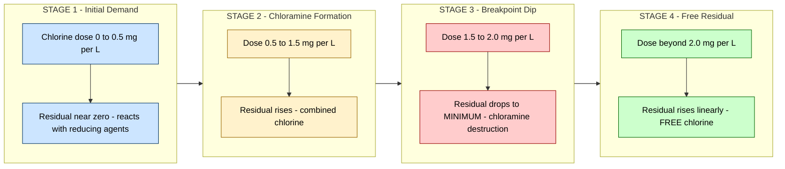
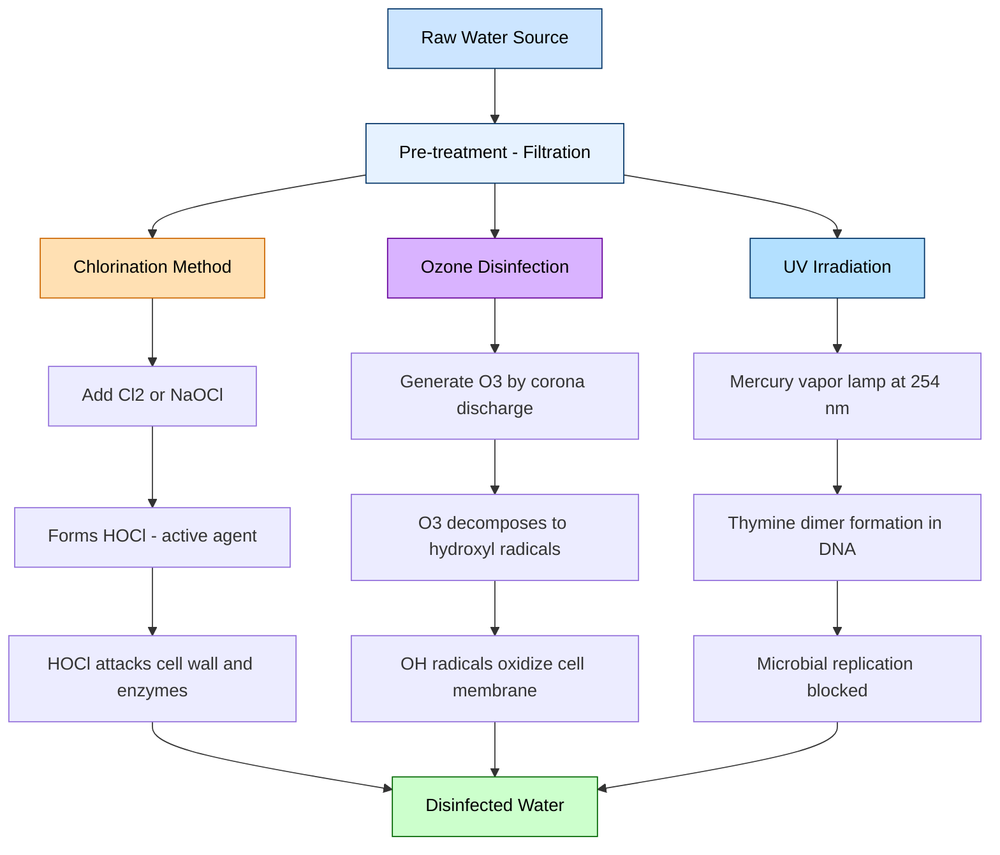
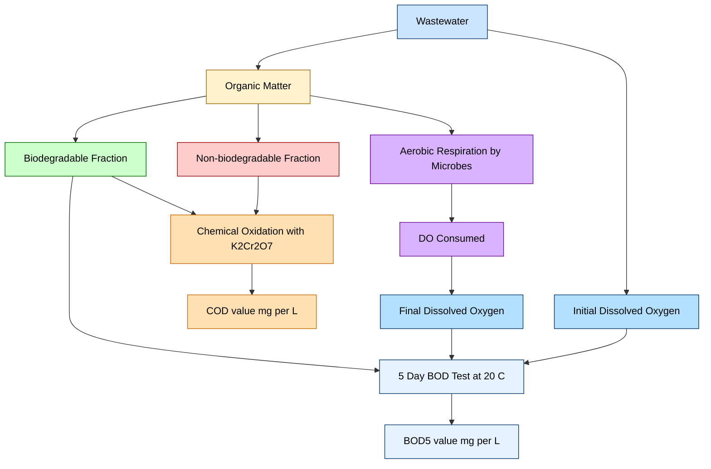
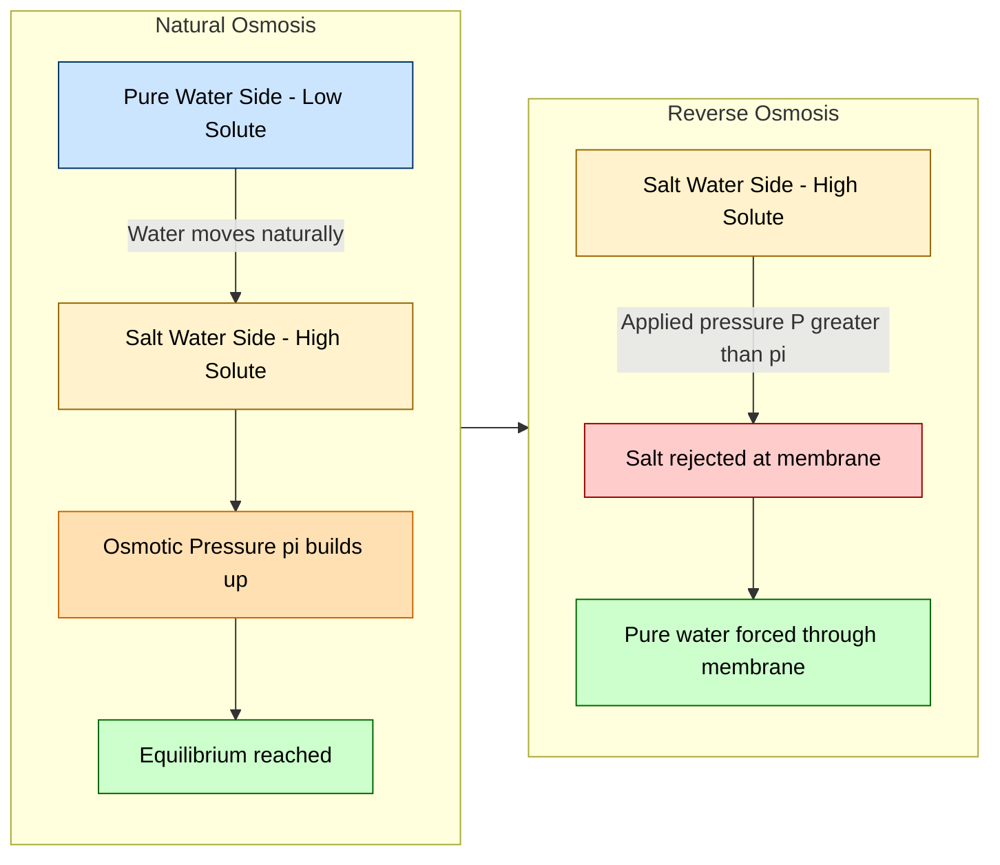

# Water softening methods-Ion exchange process- Principle, procedure and advantages. Reverse osmosis – principle, process and advantages. – Water disinfection methods – chlorination-Break point chlorination, ozone and UV irradiation. Dissolved oxygen (DO), BOD and COD- Definition & Significance.

<!-- SECTION_1_START -->

# Environmental Chemistry - Water Treatment & Quality Parameters

## 1. Water Softening Methods — Ion Exchange Process

### 1.1 Core Technical Definition

> [!IMPORTANT]
> **Ion Exchange Process (Definition):** A reversible stoichiometric reaction in which hardness-causing ions ($Ca^{2+}$, $Mg^{2+}$) present in water are exchanged for sodium ($Na^+$) or hydrogen ($H^+$) ions from an insoluble synthetic resin matrix. The ion exchange resin is a high-molecular-weight cross-linked polymer bearing fixed, exchangeable functional groups.

The hard water is passed through a bed of **cation exchange resin** (commonly **zeolite** in older systems, or modern **sulfonated polystyrene cross-linked with divinylbenzene (DVB)**). The general ion exchange reactions are:

$$2NaR + Ca^{2+} \rightarrow CaR_2 + 2Na^+$$

$$2NaR + Mg^{2+} \rightarrow MgR_2 + 2Na^+$$

Where $R$ represents the insoluble resin matrix. The resin is regenerated using a concentrated brine ($10\%$ NaCl) solution once its $Na^+$ sites are exhausted.

### 1.2 Conceptual Analogy / Intuition

> [!NOTE]
> **Analogy — The "Magnetic Sponge" Filter**
> Imagine a sponge coated with countless tiny magnets that only attract calcium ($Ca^{2+}$) and magnesium ($Mg^{2+}$) ions, while releasing sodium ($Na^+$) ions in return. As hard water flows through, the sponge "catches" the hardness ions and "releases" harmless sodium ions. Once the sponge is full, you rinse it with concentrated salt water (brine) — and the high concentration of $Na^+$ forces the $Ca^{2+}$ and $Mg^{2+}$ ions to detach and wash away, restoring the sponge to its original state. This reversible swap is the **ion exchange process**.

### 1.3 Types of Ion Exchange Resins

> [!IMPORTANT]
> - **Cation Exchange Resins** — Exchange **positive** ions ($Ca^{2+}$, $Mg^{2+}$, $Na^+$, $H^+$). Functional groups: $-SO_3H$ (strongly acidic) or $-COOH$ (weakly acidic).
> - **Anion Exchange Resins** — Exchange **negative** ions ($Cl^-$, $SO_4^{2-}$, $NO_3^-$). Functional groups: $-N^+R_3OH^-$ (strongly basic) or $-NR_2$ (weakly basic).

---

## 2. Reverse Osmosis (RO)

### 2.1 Core Technical Definition

> [!IMPORTANT]
> **Reverse Osmosis (RO) Definition:** A membrane separation process in which a pressure greater than the natural osmotic pressure of the solution is applied to the *concentrate side* of a semipermeable membrane, forcing the solvent (water) to move from a region of high solute concentration to a region of low solute concentration — the reverse of the natural osmotic flow.

The semipermeable membrane allows only water molecules to pass and rejects dissolved salts, organics, bacteria, and viruses.

### 2.2 Conceptual Analogy / Intuition

> [!NOTE]
> **Analogy — The "Pressing the Sieve" Model**
> Picture a fine sieve that normally lets only water drip down (osmosis). If you pour salty water on top, gravity alone is too weak to push water through the sieve. Now imagine applying strong downward pressure (pushing the water with a piston) — this extra force literally **pushes** pure water through the sieve's tiny pores, leaving the salt particles trapped on top. The applied pressure that overcomes the osmotic push is what we call **reverse osmosis**.

### 2.3 Osmotic Pressure Equation (van't Hoff Equation)

For a dilute solution:

$$\pi = iCRT$$

Where:
- $\pi$ = osmotic pressure in **atm**
- $i$ = van't Hoff factor (number of dissociated ions)
- $C$ = molar concentration in **mol/L**
- $R$ = universal gas constant $= 0.0821 \, L \cdot atm \cdot mol^{-1} \cdot K^{-1}$
- $T$ = absolute temperature in **K**

> [!IMPORTANT]
> For seawater, $\pi \approx 25 \text{ to } 30$ atm. Reverse osmosis therefore requires applied pressure $P_{applied} > \pi$ to drive the separation.

---

## 3. Water Disinfection Methods

### 3.1 Core Technical Definition

> [!IMPORTANT]
> **Disinfection Definition:** The process of destroying or inactivating pathogenic (disease-causing) microorganisms — bacteria, viruses, protozoa — in water to make it safe for human consumption. Disinfection is distinct from **sterilization**, which implies complete destruction of *all* microbial life.

### 3.2 Chlorination

**Chlorination** is the most widely used disinfection technique, employing **chlorine ($Cl_2$)**, **hypochlorous acid (HOCl)**, or **sodium hypochlorite (NaOCl)**. In water, $Cl_2$ reacts to form the active disinfecting agent HOCl:

$$Cl_2 + H_2O \rightarrow HOCl + HCl$$

HOCl then dissociates in water:

$$HOCl \rightleftharpoons H^+ + OCl^-$$

The sum $[HOCl] + [OCl^-]$ is called the **free available chlorine**.

### 3.3 Break-Point Chlorination

> [!IMPORTANT]
> **Break-Point Chlorination Definition:** The specific point on a chlorination curve at which the **residual chlorine** reaches a minimum, after which further addition of chlorine produces a **free available chlorine residual** that increases linearly with the dose. It represents complete oxidation of ammonia and organic nitrogen compounds in water.

### 3.4 Ozone Disinfection

**Ozone ($O_3$)** is a powerful oxidizing agent produced on-site using a **corona discharge generator** (silent electric discharge through dry air or oxygen):

$$3O_2 \xrightarrow{\text{electric discharge}} 2O_3$$

Ozone decomposes in water to generate **hydroxyl radicals ($\cdot OH$)**, which are even stronger oxidants:

$$O_3 + H_2O \rightarrow 2 \cdot OH + O_2$$

### 3.5 UV Irradiation

**Ultraviolet (UV) irradiation** at a wavelength of **$\lambda = 254$ nm** (UV-C region) damages the **deoxyribonucleic acid (DNA)** of microorganisms by forming **thymine dimers**, preventing replication and rendering microbes inactive.

> [!VISUALIZATION CONTROL]
> **Concept:** Disinfection Action Spectrum & Mechanism Map
> **Plot Coordinates (Conceptual):**
> * X-axis: Wavelength $\lambda$ (nm) ranging 200–300
> * Y-axis: Relative germicidal effectiveness (unitless)
> * Peak effectiveness: at $\lambda = 254$ nm (UV-C)
> **Visual Description:** The student should observe a sharp germicidal effectiveness peak at 254 nm, with effectiveness dropping on both sides. This shows why low-pressure mercury vapor lamps (emitting at 253.7 nm) are used in water disinfection systems.

---

## 4. Dissolved Oxygen (DO), Biochemical Oxygen Demand (BOD), Chemical Oxygen Demand (COD)

### 4.1 Dissolved Oxygen (DO) — Definition

> [!IMPORTANT]
> **Dissolved Oxygen (DO) Definition:** The amount of **molecular oxygen ($O_2$)** dissolved in water, expressed in **mg/L** or **ppm**. DO is essential for the survival of aquatic life (fish require $\geq 4 \text{ mg/L}$) and is a key indicator of water quality.

### 4.2 BOD — Biochemical Oxygen Demand

> [!IMPORTANT]
> **BOD Definition:** The amount of dissolved oxygen required by aerobic microorganisms to biologically oxidize the **biodegradable organic matter** present in a water sample over a standard incubation period of **5 days at $20^\circ C$ in the dark** — denoted $BOD_5$.

### 4.3 COD — Chemical Oxygen Demand

> [!IMPORTANT]
> **COD Definition:** The amount of oxygen equivalent required to chemically oxidize both the **biodegradable** and **non-biodegradable** organic matter in a water sample using a strong oxidizing agent (typically **potassium dichromate, $K_2Cr_2O_7$**, in acidic medium).

### 4.4 Conceptual Analogy — DO, BOD, COD

> [!NOTE]
> **Analogy — The "Aquarium Oxygen" Model**
> Imagine an aquarium:
> - **DO** = the actual oxygen currently dissolved in the water (the aquarium's "air supply").
> - **BOD** = how much oxygen the fish and bacteria will *consume in 5 days* to digest the food/waste in the tank.
> - **COD** = how much oxygen would be burned if you set fire to *all* the waste in the tank (organic + inorganic carbon sources).
>
> A healthy aquarium needs **high DO, low BOD, and low COD**. Polluted water has the opposite — low DO, high BOD, high COD.

<!-- SECTION_1_END -->

<!-- SECTION_2_START -->

# Deep Theoretical Analysis & KTU High-Yield Formula Sheet

## 1. Ion Exchange Process — Detailed Mechanism

### 1.1 Working Principle

The ion exchange process operates on the principle of **reversible stoichiometric exchange** between ions in solution and ions held by electrostatic attraction on the resin matrix.

**Step-by-step mechanism:**

1. **Hard water entry** — Water containing $Ca^{2+}$, $Mg^{2+}$, and other cations enters the top of the ion exchange column.
2. **Diffusion to resin surface** — The hardness ions diffuse through the **Nernst boundary layer** surrounding each resin bead.
3. **Ion exchange reaction** — $Ca^{2+}$ and $Mg^{2+}$ displace $Na^+$ ions from the resin's active sites (sulfonic groups, $-SO_3^-Na^+$).
4. **Diffusion out** — The released $Na^+$ ions diffuse back into the bulk water.
5. **Soft water exit** — Treated water leaves the column, now containing $Na^+$ salts (which do not cause hardness).
6. **Resin exhaustion** — After many cycles, the resin becomes saturated with $Ca^{2+}/Mg^{2+}$ and loses capacity.
7. **Regeneration** — A **$10\%$ NaCl brine** is passed through the column, reversing the exchange due to the **Law of Mass Action** (high $Na^+$ concentration).

### 1.2 Key Resin Parameters

> [!IMPORTANT]
> - **Exchange Capacity:** measured in **meq/g** (milliequivalents per gram) or **kg $CaCO_3$/$m^3$**.
> - **Selectivity Order for Divalent Ions on Cation Resin:** $Ca^{2+} > Mg^{2+} > Na^+$
> - **Operating pH range:** 0–14 (strongly acidic cation resin) — most versatile.

### 1.3 Advantages of Ion Exchange Process

> [!NOTE]
> - Removes **both temporary and permanent hardness** completely.
> - Produces **zero sludge** (unlike lime-soda process).
> - Operates at **ambient temperature** (no heating required).
> - Fully **automatic** operation possible with timer-controlled regeneration.
> - Produces water with **total hardness approaching 0 ppm**.

### 1.4 Limitations of Ion Exchange Process

> [!WARNING]
> - Adds large amounts of **$Na^+$ to water** — unsuitable for patients on sodium-restricted diets (hypertension).
> - Regeneration produces **saline wastewater** requiring proper disposal.
> - Resins are **expensive** and have a finite lifespan (5–10 years).
> - Cannot remove **dissolved gases, bacteria, or non-ionic organics**.

---

## 2. Reverse Osmosis — Detailed Process Analysis

### 2.1 Osmosis vs Reverse Osmosis — Conceptual Framework

| Parameter | Osmosis | Reverse Osmosis |
|---|---|---|
| **Direction of water flow** | Dilute → Concentrate (natural) | Concentrate → Dilute (forced) |
| **Driving force** | Chemical potential / osmotic pressure | Applied pressure ($P > \pi$) |
| **Membrane state** | Static | Pressurized |
| **Solvent result** | Dilution of concentrate | Purification of feed |
| **Energy required** | None | High (mechanical pumping) |

### 2.2 Working Process — Step-by-Step

1. **Pre-treatment** — Feed water is filtered to remove suspended solids that may foul the membrane.
2. **Pressurization** — A high-pressure pump raises feed pressure above osmotic pressure.
3. **Membrane separation** — Water is forced through a **thin-film composite (TFC)** polyamide membrane.
4. **Permeate collection** — Purified water (permeate) is collected on the low-pressure side.
5. **Concentrate rejection** — Rejected brine (retentate) is discharged or recycled.
6. **Post-treatment** — Permeate may be remineralized (for drinking water) or further polished.

### 2.3 Advantages of Reverse Osmosis

> [!NOTE]
> - Removes **$95–99\%$ of dissolved salts**, organics, colloids, and microbes.
> - Operates at **ambient temperature** — no phase change, low energy for non-volatile solutes.
> - **Modular and compact** — suitable for both household and industrial scale.
> - **Environmentally friendly** — no chemical additives required.
> - Effective against **all classes of contaminants** including pyrogens and viruses.

### 2.4 Limitations of Reverse Osmosis

> [!WARNING]
> - High **capital and operating costs** (membrane replacement, energy).
> - **Membrane fouling** by scaling ($CaCO_3$, $SiO_2$), biofouling, and colloidal deposition.
> - Produces **concentrate brine** requiring disposal.
> - Removes beneficial minerals — permeate may taste **flat** and be slightly acidic.

---

## 3. Disinfection Methods — Comparative Theoretical Analysis

### 3.1 Chlorination — Detailed Chemistry

When $Cl_2$ is added to water:

$$Cl_2 + H_2O \rightarrow HOCl + H^+ + Cl^-$$

The equilibrium between HOCl and $OCl^-$ is **pH-dependent**:

$$HOCl \rightleftharpoons H^+ + OCl^- \quad ; \quad pK_a = 7.5 \text{ at } 25^\circ C$$

| pH Range | Dominant Species | Disinfection Power |
|---|---|---|
| $pH < 7.5$ | HOCl (hypochlorous acid) | $\sim 80\times$ more effective than $OCl^-$ |
| $pH > 7.5$ | $OCl^-$ (hypochlorite ion) | Weaker disinfectant |

> [!IMPORTANT]
> Therefore, **chlorination is most effective in slightly acidic to neutral pH (6.5–7.5)**.

### 3.2 Break-Point Chlorination — Three-Stage Curve Analysis

> [!IMPORTANT]
> The **break-point chlorination curve** has three distinct regions when plotting **residual chlorine (Y-axis)** vs **chlorine dose (X-axis)**:

**Stage 1 (Initial Demand Region):**
- Chlorine reacts with **reducing agents** ($Fe^{2+}$, $Mn^{2+}$, $H_2S$, $NO_2^-$).
- Residual chlorine is **zero or near zero**.

**Stage 2 (Chloramine Formation Plateau):**
- Chlorine reacts with **ammonia and amines** to form **chloramines**:
$$NH_3 + HOCl \rightarrow NH_2Cl \text{ (monochloramine)} + H_2O$$
$$NH_2Cl + HOCl \rightarrow NHCl_2 \text{ (dichloramine)} + H_2O$$
- Residual chlorine **rises** (combined chlorine). Chloramines provide weak disinfection.

**Stage 3 (Breakpoint — Destruction of Chloramines):**
- Continued chlorine addition oxidizes chloramines to **$N_2$, $NO_3^-$, and $HCl$**:
$$2NH_2Cl + HOCl \rightarrow N_2 \uparrow + 3HCl + H_2O$$
- Residual chlorine **drops sharply** to a **minimum (the breakpoint)**.

**Stage 4 (Free Residual Region):**
- Beyond the breakpoint, additional chlorine appears as **free HOCl/OCl$^-$**.
- Residual chlorine **rises linearly** with dose.

> [!IMPORTANT]
> **Significance:** Break-point chlorination ensures that water contains **free available chlorine** for sustained disinfection throughout the distribution system. Below the breakpoint, only weak combined chlorine exists.

### 3.3 Ozone Disinfection — Detailed Mechanism

Ozone acts via **two pathways**:

**Pathway 1 — Direct Molecular Oxidation (Selective):**
$$O_3 + \text{organic matter} \rightarrow \text{aldehydes, ketones, carboxylic acids}$$

**Pathway 2 — Indirect Radical Oxidation (Non-selective, very fast):**
$$O_3 \rightarrow O_2 + [O] \text{ (atomic oxygen)}$$
$$[O] + H_2O \rightarrow 2 \cdot OH$$

> [!NOTE]
> **Advantages of Ozone:**
> - **$1.5 \times$ stronger oxidizer than chlorine** (oxidation potential $= 2.07$ V).
> - No taste or odor imparted.
> - Effective against **viruses and cysts (Giardia, Cryptosporidium)**.
> - Decomposes to $O_2$ — **no harmful residue**.
>
> **Limitations:**
> - **No residual disinfection** — must be combined with chlorine.
> - Must be **generated on-site** (cannot be stored).
> - High capital cost.
> - Forms **bromate ($BrO_3^-$)** as a potential carcinogenic by-product.

### 3.4 UV Irradiation — Mechanism

UV photons at **$253.7$ nm** are absorbed by **nucleic acids** in microbial cells. The energy causes adjacent **thymine bases** in DNA to form covalent **cyclobutane pyrimidine dimers (CPDs)**:

$$T + T \xrightarrow{h\nu \, (254 \, nm)} T \text{–} T \text{ (thymine dimer)}$$

These dimers distort the DNA double helix, blocking replication and transcription. The microbe cannot reproduce and is **inactivated** (not killed — it can sometimes undergo **photoreactivation** under visible light).

> [!NOTE]
> **Advantages of UV Irradiation:**
> - **Chemical-free** — no addition of chemicals; no by-products.
> - Effective against **chlorine-resistant pathogens** (Giardia, Cryptosporidium).
> - **Short contact time** (seconds).
> - Low operating cost once installed.
>
> **Limitations:**
> - **No residual disinfection** — microbes can regrow in distribution system.
> - **Turbidity interferes** — suspended particles shield microbes.
> - Lamp efficiency decreases over time; **regular replacement** needed.
> - Quartz sleeve scaling reduces UV transmittance.

---

## 4. DO, BOD, and COD — Theoretical Significance

### 4.1 Dissolved Oxygen (DO) — Sources and Sinks

> [!IMPORTANT]
> **Sources of DO in water:**
> - **Atmospheric re-aeration** (Henry's Law: $DO \propto P_{O_2}$).
> - **Photosynthesis** by aquatic plants and algae.
> - **Flow agitation** (rapids, waterfalls).
>
> **Sinks of DO:**
> - **Aerobic respiration** by microorganisms (directly tied to BOD).
> - **Chemical oxidation** of reducing species ($Fe^{2+}$, $Mn^{2+}$, $S^{2-}$).
> - **Nitrification** of ammonia.

### 4.2 BOD — Standard Methodology

The standard $BOD_5$ test:
1. Dilute the water sample with **oxygen-saturated, phosphate-buffered dilution water** seeded with aerobic microbes.
2. Measure initial DO ($DO_i$).
3. Incubate for **5 days at $20 \pm 1^\circ C$ in the dark**.
4. Measure final DO ($DO_f$).

$$BOD_5 = (DO_i - DO_f) \times \text{Dilution Factor (DF)}$$

Where $\text{DF} = \frac{\text{Volume of BOD bottle}}{\text{Volume of sample}}$.

> [!NOTE]
> **Significance of BOD:**
> - Measures **biodegradable organic pollution load**.
> - Indicates the **oxygen depletion potential** in receiving water bodies.
> - High BOD = low DO = fish kills and ecosystem collapse.
> - $BOD_5 < 2 \text{ mg/L}$ = clean water; $BOD_5 > 5 \text{ mg/L}$ = polluted.

### 4.3 COD — Standard Methodology

The COD test uses **reflux digestion** with $K_2Cr_2O_7$ in $H_2SO_4$ (with $Ag_2SO_4$ catalyst and $HgSO_4$ to complex $Cl^-$):

$$Cr_2O_7^{2-} + 14H^+ + 6e^- \rightarrow 2Cr^{3+} + 7H_2O$$

The **unreacted $K_2Cr_2O_7$** is titrated with **ferrous ammonium sulfate (FAS)** using **ferroin indicator**.

$$COD \text{ (mg/L)} = \frac{(B - A) \times N \times 8000}{\text{Volume of sample (mL)}}$$

Where:
- $B$ = mL of FAS for blank
- $A$ = mL of FAS for sample
- $N$ = normality of FAS
- $8000$ = milliequivalent weight of $O_2 \times 1000$

### 4.4 COD vs BOD — Critical Comparison

> [!IMPORTANT]
> **COD is always greater than BOD** for the same water sample.
> - $BOD_5$ measures only **biodegradable organics**.
> - COD measures **biodegradable + non-biodegradable organics**.
> - Ratio $BOD_5 / COD$ indicates **biodegradability**:
>   - $> 0.5$ → readily biodegradable
>   - $0.3$–$0.5$ → moderately biodegradable
>   - $< 0.3$ → poorly biodegradable / toxic

---

## KTU High-Yield Formula Sheet

> [!IMPORTANT]
> **Table — Comprehensive Formula & Parameter Reference**

| # | Concept | Formula / Parameter | Units | Notes |
|---|---|---|---|---|
| 1 | Osmotic Pressure (van't Hoff) | $\pi = iCRT$ | atm | Applies to **dilute solutions** |
| 2 | Reverse Osmosis Condition | $P_{applied} > \pi$ | atm | Pressure must exceed osmotic pressure |
| 3 | Chlorine-Water Reaction | $Cl_2 + H_2O \rightarrow HOCl + H^+ + Cl^-$ | — | HOCl is active disinfectant |
| 4 | HOCl Dissociation | $HOCl \rightleftharpoons H^+ + OCl^-$ | — | $pK_a = 7.5$ at $25^\circ C$ |
| 5 | Monochloramine Formation | $NH_3 + HOCl \rightarrow NH_2Cl + H_2O$ | — | Stage 2 of break-point curve |
| 6 | Breakpoint Oxidation | $2NH_2Cl + HOCl \rightarrow N_2 + 3HCl + H_2O$ | — | Releases free chlorine |
| 7 | Ozone Generation | $3O_2 \xrightarrow{\text{discharge}} 2O_3$ | — | Silent electric discharge |
| 8 | Ozone Hydroxyl Radical | $O_3 + H_2O \rightarrow 2 \cdot OH + O_2$ | — | $\cdot OH$ is stronger oxidant |
| 9 | UV Germicidal Wavelength | $\lambda_{max} = 254$ nm | nm | UV-C region, Hg vapor lamp |
| 10 | Ion Exchange (Ca) | $2NaR + Ca^{2+} \rightarrow CaR_2 + 2Na^+$ | — | Stoichiometric |
| 11 | Ion Exchange (Mg) | $2NaR + Mg^{2+} \rightarrow MgR_2 + 2Na^+$ | — | Stoichiometric |
| 12 | Resin Regeneration | $CaR_2 + 2NaCl \rightarrow 2NaR + CaCl_2$ | — | Uses $10\%$ brine |
| 13 | $BOD_5$ Calculation | $BOD_5 = (DO_i - DO_f) \times DF$ | mg/L | $DO_i$ = initial, $DO_f$ = final |
| 14 | Dissolution Factor | $DF = \frac{V_{bottle}}{V_{sample}}$ | — | Dimensionless |
| 15 | Hardness Limit (Drinking) | $500$ | mg/L as $CaCO_3$ | WHO permissible limit |
| 16 | DO for Aquatic Life | $\geq 4$ | mg/L | Minimum for fish survival |
| 17 | Saturation DO at $20^\circ C$ | $9.2$ | mg/L | Pure water, sea level |
| 18 | Threshold Chlorine Dose | Above break-point | mg/L | For free residual |

---

## Real-World Engineering & Industry Applications

> [!NOTE]
> **Industrial & Environmental Applications:**
> - **Semiconductor Industry** — Ultrapure water (UPW) for wafer rinsing uses **RO + Ion Exchange + UV** in series; resistivity must exceed $18.2 \, M\Omega \cdot cm$.
> - **Power Plants** — Boiler feedwater is demineralized via **cation + anion exchange** to prevent scale and corrosion in turbines.
> - **Municipal Water Treatment** — Typical train: **Coagulation → Sand Filtration → Break-Point Chlorination → Distribution**.
> - **Pharmaceuticals** — Water for Injection (WFI) is produced by **multi-stage RO + distillation** with strict DO/BOD/COD monitoring.
> - **Effluent Treatment Plants (ETP)** — COD reduction is the **primary design parameter** for sizing biological treatment units.
> - **Seawater Desalination** — Large-scale **RO plants** (e.g., NEOM, Saudi Arabia) operate at $P = 60$–$80$ bar to overcome $\pi_{seawater} \approx 25$–$30$ atm.

<!-- SECTION_2_END -->

<!-- SECTION_3_START -->

# Step-by-Step Derivations & Worked Numerical Solutions

## Worked Example 1 — Osmotic Pressure and Reverse Osmosis

**Problem:**
A $0.05$ M NaCl solution is at $27^\circ C$. Calculate the osmotic pressure. If we wish to perform reverse osmosis, what is the minimum applied pressure? Assume $i = 2$ for NaCl (complete dissociation).

### Step 1 — Identify Given Values
- Molarity $C = 0.05$ mol/L
- Temperature $T = 27^\circ C = 27 + 273 = 300$ K
- van't Hoff factor $i = 2$
- Gas constant $R = 0.0821 \, L \cdot atm \cdot mol^{-1} \cdot K^{-1}$

### Step 2 — Apply the van't Hoff Equation

$$\pi = iCRT$$

### Step 3 — Substitute Values

$$\pi = 2 \times 0.05 \times 0.0821 \times 300$$

### Step 4 — Perform the Arithmetic

$$\pi = 2 \times 0.05 \times 0.0821 \times 300$$

$$= 0.1 \times 0.0821 \times 300$$

$$= 0.1 \times 24.63$$

$$= 2.463 \, atm$$

### Step 5 — Minimum Reverse Osmosis Pressure

For RO, the applied pressure must exceed the osmotic pressure:

$$P_{applied,min} > \pi = 2.463 \, atm$$

In practical units:

$$P_{applied,min} = 2.463 \times 101.325 \, kPa \approx 249.6 \, kPa \approx 2.5 \, bar$$

> [!NOTE]
> **Conclusion:** To overcome osmotic pressure for $0.05$ M NaCl, the applied pressure must be at least **2.46 atm** (or **2.49 × 10⁵ Pa**).

---

## Worked Example 2 — BOD Calculation

**Problem:**
A $5$ mL wastewater sample is diluted to $300$ mL with BOD dilution water (saturated with oxygen). The initial DO of the diluted sample is $8.5$ mg/L. After $5$ days of incubation at $20^\circ C$, the DO drops to $3.2$ mg/L. Calculate the $BOD_5$ of the wastewater.

### Step 1 — Compute the Dilution Factor (DF)

$$\text{DF} = \frac{V_{bottle}}{V_{sample}} = \frac{300 \, mL}{5 \, mL} = 60$$

### Step 2 — Compute the Oxygen Consumed

$$\Delta DO = DO_i - DO_f = 8.5 - 3.2 = 5.3 \, mg/L$$

### Step 3 — Apply the BOD Formula

$$BOD_5 = \Delta DO \times DF$$

$$BOD_5 = 5.3 \times 60$$

$$BOD_5 = 318 \, mg/L$$

> [!NOTE]
> **Conclusion:** The $BOD_5$ of the wastewater is **318 mg/L**, which is extremely high — typical untreated municipal sewage is $100$–$300$ mg/L, so this represents **strong organic pollution** requiring biological treatment before discharge.

---

## Worked Example 3 — COD Calculation by Titration

**Problem:**
In a COD test, $20$ mL of wastewater sample is refluxed with $10$ mL of $0.25$ N $K_2Cr_2O_7$ and $H_2SO_4$. The excess dichromate requires $15.2$ mL of $0.1$ N FAS. A blank titration requires $24.0$ mL of the same FAS. Calculate the COD of the sample.

### Step 1 — Identify the Formula

$$COD \text{ (mg/L)} = \frac{(B - A) \times N \times 8000}{V_{sample}}$$

### Step 2 — Substitute Values
- $B$ (blank) $= 24.0$ mL
- $A$ (sample) $= 15.2$ mL
- $N = 0.1$ N
- $V_{sample} = 20$ mL

### Step 3 — Calculate $(B - A)$

$$B - A = 24.0 - 15.2 = 8.8 \, mL$$

### Step 4 — Apply the Formula

$$COD = \frac{8.8 \times 0.1 \times 8000}{20}$$

$$= \frac{8.8 \times 800}{20}$$

$$= \frac{7040}{20}$$

$$= 352 \, mg/L$$

> [!NOTE]
> **Conclusion:** The COD of the wastewater is **352 mg/L**. Note that $COD > BOD$ (consistent with the principle that COD oxidizes both biodegradable and non-biodegradable organics).

---

## Worked Example 4 — Break-Point Chlorination Stoichiometry

**Problem:**
A water treatment plant treats water containing $1.2$ mg/L of ammonia ($NH_3$ as N). Calculate the theoretical break-point chlorine dose required to completely destroy the chloramines and produce free available chlorine.

### Step 1 — Recall the Overall Break-Point Reaction

$$2NH_3 + 3Cl_2 \rightarrow N_2 \uparrow + 6HCl$$

### Step 2 — Establish the Molar Ratio

From the balanced equation:
$$\frac{\text{moles of } Cl_2}{\text{moles of } NH_3} = \frac{3}{2} = 1.5$$

### Step 3 — Compute Moles of Ammonia per Liter

Molar mass of $NH_3$ (as N) $= 14$ g/mol

$$[NH_3] = \frac{1.2 \, mg/L}{14000 \, mg/mol} = 8.57 \times 10^{-5} \, mol/L$$

### Step 4 — Compute Theoretical Chlorine Requirement

$$[Cl_2]_{theoretical} = 1.5 \times [NH_3] = 1.5 \times 8.57 \times 10^{-5}$$

$$= 1.286 \times 10^{-4} \, mol/L$$

### Step 5 — Convert to mg/L

Molar mass of $Cl_2 = 71$ g/mol

$$[Cl_2]_{theoretical} = 1.286 \times 10^{-4} \times 71 \times 1000 \, mg/L$$

$$= 1.286 \times 10^{-4} \times 71000$$

$$= 9.13 \, mg/L$$

### Step 6 — Add Chlorine Demand of Water

The actual dose must also account for other reducing agents. Assuming a background chlorine demand of $1.5$ mg/L:

$$[Cl_2]_{actual} = 9.13 + 1.5 = 10.63 \, mg/L \approx 10.6 \, mg/L$$

> [!NOTE]
> **Conclusion:** The break-point chlorine dose is approximately **10.6 mg/L**. Beyond this dose, any additional chlorine will appear as free residual chlorine for ongoing disinfection.

---

## Worked Example 5 — Resin Capacity and Regeneration Frequency

**Problem:**
An ion exchange column contains $50$ L of cation resin with an exchange capacity of $1.8$ eq/L. The feed water has a total hardness of $250$ mg/L as $CaCO_3$. Calculate (a) the total exchange capacity in equivalents, (b) the volume of water that can be softened per cycle, and (c) the mass of NaCl (in kg) required for regeneration.

### Step 1 — Compute Total Exchange Capacity

$$\text{Total capacity} = 1.8 \, \frac{eq}{L} \times 50 \, L = 90 \, eq$$

### Step 2 — Convert Hardness to eq/L

Equivalent weight of $CaCO_3 = 50$ g/eq

$$[\text{Hardness}] = \frac{250 \, mg/L}{50 \times 1000 \, mg/eq} = 0.005 \, eq/L$$

### Step 3 — Volume of Water Softened per Cycle

$$V_{water} = \frac{\text{Total capacity}}{\text{Hardness}} = \frac{90 \, eq}{0.005 \, eq/L} = 18000 \, L = 18 \, m^3$$

### Step 4 — Mass of NaCl Required

Regeneration stoichiometry:
$$CaR_2 + 2NaCl \rightarrow 2NaR + CaCl_2$$

NaCl requirement per equivalent of hardness = $58.5$ g NaCl per equivalent (theoretical), but in practice **$200$–$300$ g NaCl per equivalent** is used.

Using **$200$ g/eq** (a typical industrial value):

$$\text{Mass of NaCl} = 90 \, eq \times 200 \, g/eq = 18000 \, g = 18 \, kg$$

> [!NOTE]
> **Conclusion:** The column can soften **18,000 L** of water per cycle and requires **18 kg of NaCl** for regeneration.

---

## Worked Example 6 — Energy Required for RO Pumping

**Problem:**
An RO plant treats $1000 \, m^3$/day of seawater. The feed osmotic pressure is $28$ atm and the operating pressure is $70$ atm. Calculate the theoretical minimum pumping energy (in kWh/day) to overcome the osmotic pressure differential. Assume $70\%$ pump efficiency.

### Step 1 — Compute the Net Pressure Differential

$$\Delta P = P_{operating} - \pi = 70 - 28 = 42 \, atm$$

### Step 2 — Convert to SI Units

$$\Delta P = 42 \times 101325 \, Pa = 4.256 \times 10^6 \, Pa$$

### Step 3 — Compute Theoretical Work

$$W_{ideal} = P \times V = 4.256 \times 10^6 \, Pa \times 1000 \, m^3$$

$$= 4.256 \times 10^9 \, J/day$$

### Step 4 — Convert to kWh

$$W_{ideal} = \frac{4.256 \times 10^9}{3.6 \times 10^6} \approx 1182 \, kWh/day$$

### Step 5 — Apply Pump Efficiency (70%)

$$W_{actual} = \frac{1182}{0.70} \approx 1689 \, kWh/day$$

> [!NOTE]
> **Conclusion:** The plant requires approximately **1689 kWh/day** of pumping energy, illustrating why RO is energy-intensive for seawater desalination.

<!-- SECTION_3_END -->

<!-- SECTION_4_START -->

## Diagram 1 — Ion Exchange Process Flow Diagram (Schematic)

> **Caption:** The ion exchange column is operated in **service mode** (top flow path) during water softening and in **regeneration mode** (right side flow path) when resin capacity is exhausted.

---

## Diagram 2 — Reverse Osmosis Process Schematic

> **Caption:** Standard RO train showing three-stage pre-treatment, high-pressure pumping, and the membrane module producing both permeate (pure water) and retentate (brine).

---

## Diagram 3 — Break-Point Chlorination Curve (Conceptual Plot)

> **Caption:** Four distinct regions of the break-point chlorination curve showing chlorine dose vs. residual chlorine, with the **breakpoint** representing the transition from combined to free chlorine residual.

---

## Diagram 4 — Disinfection Methods Comparison Matrix (Block Architecture)

> **Caption:** Parallel disinfection pathways from pre-treated raw water, showing the active chemical/physical mechanism of each disinfection method, converging on a single disinfected water output.

---

## Diagram 5 — DO / BOD / COD Relationship Map (Conceptual)

> **Caption:** The inter-relationship between organic matter fractions, BOD measurement, COD measurement, and dissolved oxygen consumption during biodegradation.

---

## Diagram 6 — Osmotic Pressure vs Reverse Osmosis Concept (Block Architecture)

> **Caption:** Comparative conceptual framework showing natural osmosis (left) versus the pressure-driven reverse osmosis process (right).

<!-- SECTION_4_END -->

<!-- SECTION_5_START -->

# KTU 2024 Scheme Examination Question Bank & Topic Recap

---

## PART A — Short Answer Questions (3 Marks Each)

### Question 1
**[KTU University Exam - July 2024]**
> **CO2, Remember**
> **"Define the term 'Ion Exchange Process' as applied to water softening. State TWO advantages of this method over the lime-soda process."**

**Model Answer (3 Marks):**

**Definition (2 Marks):** Ion exchange is a reversible stoichiometric process in which the hardness-causing cations ($Ca^{2+}$, $Mg^{2+}$) in water are exchanged for sodium ions ($Na^+$) from an insoluble synthetic resin matrix (cation exchanger):

$$2NaR + Ca^{2+} \rightarrow CaR_2 + 2Na^+$$

**Advantages over lime-soda (1 Mark):**
1. Removes **both temporary and permanent hardness** completely, while lime-soda only partially removes permanent hardness.
2. Produces **no sludge**, whereas lime-soda generates large volumes of calcium carbonate and magnesium hydroxide sludge.
3. Operates at **room temperature** with no external heating required.

---

### Question 2
**[KTU University Exam - Dec 2023]**
> **CO2, Understand**
> **"What is meant by break-point chlorination? Why is it preferred over simple chlorination in municipal water treatment?"**

**Model Answer (3 Marks):**

**Definition (2 Marks):** Break-point chlorination is the practice of adding chlorine to water in a dose sufficient to reach a point on the chlorination curve where **all ammonia and organic nitrogen are completely oxidized** and a **free available chlorine residual** (HOCl/OCl$^-$) begins to appear. At this break-point, the residual chlorine is at its minimum value.

**Why preferred (1 Mark):** It ensures the presence of **free residual chlorine** throughout the distribution system, providing **sustained disinfection**. Below the breakpoint, only weak combined chlorine (chloramines) exists, which is a poorer disinfectant.

---

## PART B — Long Answer Questions (14 Marks — Module Internal Choice)

### Question A — Option 1 [14 Marks]
**[KTU University Exam - July 2024]**
> **CO2, Understand + Apply**

### Part (a) — [7 Marks]
> **"Explain the principle and procedure of water softening by the ion exchange process. Discuss the regeneration of the exhausted resin."**

**Model Answer:**

**Principle (3 Marks):**

The ion exchange process is based on the **reversible exchange of ions** between a solid phase (insoluble resin) and a liquid phase (hard water). The cation exchange resin is a cross-linked polymer (e.g., sulfonated polystyrene-DVB) bearing fixed anionic groups ($-SO_3^-$) with mobile, exchangeable $Na^+$ counter-ions.

When hard water passes through, the divalent $Ca^{2+}$ and $Mg^{2+}$ ions have a higher affinity for the resin than $Na^+$ and replace them:

$$2NaR + Ca^{2+} \rightarrow CaR_2 + 2Na^+$$

$$2NaR + Mg^{2+} \rightarrow MgR_2 + 2Na^+$$

The driving force is the **selectivity of the resin for multivalent ions** and the law of mass action.

**Procedure (2 Marks):**

1. Hard water is passed slowly through a column packed with cation exchange resin.
2. The outflowing water contains $Na^+$ salts (which are soluble and do not cause hardness).
3. Water is tested periodically for hardness; when hardness reappears, regeneration is initiated.

**Regeneration (2 Marks):**

The exhausted resin (saturated with $Ca^{2+}$ and $Mg^{2+}$) is regenerated by passing a **$10\%$ NaCl brine** solution:

$$CaR_2 + 2NaCl \rightarrow 2NaR + CaCl_2$$

The high concentration of $Na^+$ shifts the equilibrium backwards (Le Chatelier's principle), restoring the resin to its sodium form. The spent brine (containing $CaCl_2$ and $MgCl_2$) is rinsed out and discarded.

**[Stating ion exchange reactions: 2 Marks]**
**[Procedure of water softening: 1 Mark]**
**[Regeneration chemistry and process: 2 Marks]**
**[Correct resin terminology: 1 Mark]**
**[Neat labelled diagram: 1 Mark]**

---

### Part (b) — [7 Marks]
> **"Describe the principle, process, and advantages of Reverse Osmosis for water treatment."**

**Model Answer:**

**Principle (3 Marks):**

Osmosis is the natural flow of solvent (water) through a semipermeable membrane from a region of low solute concentration to a region of high solute concentration. The pressure that just stops this flow is the **osmotic pressure ($\pi$)**, given by the van't Hoff equation:

$$\pi = iCRT$$

In **Reverse Osmosis (RO)**, an external pressure **greater than $\pi$** is applied to the concentrate side, reversing the natural flow and forcing pure water from the concentrated solution to the dilute side. The membrane permits only water molecules to pass and rejects dissolved ions, organics, and microbes.

**Process (2 Marks):**

1. **Pre-treatment** — Feed water is filtered to remove particulates, then passed through activated carbon to remove chlorine and organics.
2. **Pressurization** — A high-pressure pump delivers the feed at $P > \pi$ (typically $10$–$80$ bar).
3. **Membrane separation** — Water passes through a thin-film composite (TFC) polyamide membrane.
4. **Collection** — Permeate (purified water) is collected; retentate (concentrate) is discharged or recycled.
5. **Post-treatment** — Permeate is remineralized (for drinking) and disinfected.

**Advantages (2 Marks):**

1. Removes **$95$–$99\%$** of dissolved salts, organics, colloids, bacteria, and viruses in a single step.
2. Operates at **ambient temperature** with no phase change — energy-efficient for non-volatile solutes.
3. **No chemical additives** are required — environmentally benign.
4. **Modular design** — easily scaled from household (50 L/day) to municipal ($100,000$ m³/day) capacity.

**[Stating RO principle with equation: 2 Marks]**
**[Process steps explained: 2 Marks]**
**[Advantages with at least three points: 2 Marks]**
**[Neat process flow diagram: 1 Mark]**

---

### Question B — Option 2 [14 Marks] (Alternative Choice)
**[KTU University Exam - Dec 2023]**
> **CO2, Understand + Apply**

### Part (a) — [7 Marks]
> **"Discuss the principle of disinfection by chlorination. With the help of a break-point chlorination curve, explain the different stages of chlorine addition."**

**Model Answer:**

**Principle of Chlorination (3 Marks):**

When chlorine ($Cl_2$) is added to water, it undergoes hydrolysis to form **hypochlorous acid (HOCl)**, which is the active disinfecting agent:

$$Cl_2 + H_2O \rightarrow HOCl + H^+ + Cl^-$$

HOCl is a powerful germicide that:
- Penetrates microbial cell walls.
- Oxidizes essential enzymes and cellular components.
- Disrupts metabolic processes, leading to cell death.

HOCl partially dissociates in water:

$$HOCl \rightleftharpoons H^+ + OCl^-$$

Since HOCl is a much stronger disinfectant than $OCl^-$, chlorination is most effective in the pH range **$6.5$–$7.5$**.

**Break-Point Chlorination Curve (3 Marks):**

The curve has **four distinct regions** when plotting residual chlorine (Y) vs. chlorine dose (X):

**Stage 1 — Initial Demand:** Chlorine reacts with reducing substances ($Fe^{2+}$, $Mn^{2+}$, $H_2S$, $NO_2^-$). Residual chlorine is **zero**.

**Stage 2 — Chloramine Formation:** Chlorine reacts with ammonia and amines:
$$NH_3 + HOCl \rightarrow NH_2Cl + H_2O$$
Residual chlorine **rises** as combined chlorine (chloramines) is formed. Chloramines are weak disinfectants.

**Stage 3 — Breakpoint:** Continued addition oxidizes chloramines to nitrogen gas:
$$2NH_2Cl + HOCl \rightarrow N_2 \uparrow + 3HCl + H_2O$$
Residual chlorine **drops sharply** to a minimum — this is the **break-point**.

**Stage 4 — Free Residual:** Beyond the break-point, additional chlorine appears as **free HOCl/OCl$^-$**. Residual chlorine **rises linearly**.

**Significance (1 Mark):** Break-point chlorination ensures a **free residual chlorine** is present throughout the distribution system, providing **sustained disinfection**.

**[Stating chlorine-water reaction: 1 Mark]**
**[Explaining HOCl as active agent: 1 Mark]**
**[Identifying all four stages: 2 Marks]**
**[Writing at least two key equations: 1 Mark]**
**[Neat labelled curve: 1 Mark]**
**[Stating practical significance: 1 Mark]**

---

### Part (b) — [7 Marks]
> **"Compare ozonation and UV irradiation as water disinfection methods. State their relative advantages and limitations."**

**Model Answer:**

**Ozonation (3 Marks):**

**Principle:** Ozone ($O_3$) is a powerful oxidizing agent (oxidation potential $= 2.07$ V) generated **on-site** by passing dry air or oxygen through a high-voltage silent electric discharge:

$$3O_2 \xrightarrow{\text{electric discharge}} 2O_3$$

**Mechanism:** Ozone kills microorganisms by:
- Direct oxidation of cell wall and membrane components.
- Decomposition to highly reactive **hydroxyl radicals ($\cdot OH$)**:
$$O_3 + H_2O \rightarrow 2 \cdot OH + O_2$$
- These radicals attack proteins, lipids, and nucleic acids.

**Dose:** Typical dose is $0.5$–$2$ mg/L with $4$–$10$ minute contact time.

**UV Irradiation (2 Marks):**

**Principle:** UV-C light at $\lambda = 254$ nm (generated by a low-pressure mercury vapor lamp) damages the **DNA** of microorganisms by inducing **thymine dimer formation**:

$$T + T \xrightarrow{h\nu \, (254 \, nm)} T\text{–}T \text{ (thymine dimer)}$$

These dimers prevent DNA replication and transcription, **inactivating** the microbe (not killing it).

**Dose:** Typical dose is $30$–$40$ mJ/cm².

**Comparison (2 Marks):**

| Parameter | Ozone | UV Irradiation |
|---|---|---|
| **Mechanism** | Chemical oxidation | Physical (DNA damage) |
| **Residual effect** | None (decomposes to $O_2$) | None (no chemical added) |
| **By-products** | Bromate (potential carcinogen) | None |
| **Taste/odor** | Imparts none | Imparts none |
| **Capital cost** | High | Moderate |
| **Operating cost** | Moderate (electricity) | Low (lamp replacement) |
| **Effective against** | Bacteria, viruses, cysts | Bacteria, viruses (limited for spores) |
| **Limitation** | No residual; on-site generation | No residual; turbidity interferes |

**[Ozone generation and mechanism: 2 Marks]**
**[UV mechanism and wavelength: 1 Mark]**
**[Comparison table with at least 5 points: 2 Marks]**
**[Advantages and limitations of each: 2 Marks]**

---

## Additional 3-Mark Conceptual Questions (for Rapid Practice)

### Question 3
**[KTU University Exam - July 2023]**
> **CO2, Remember**
> **"Define BOD and COD. Why is COD always greater than BOD for a given wastewater sample?"**

**Model Answer:**

**BOD (1 Mark):** Biochemical Oxygen Demand is the amount of dissolved oxygen required by aerobic microorganisms to biologically oxidize the **biodegradable** organic matter in a water sample over **5 days at $20^\circ C$**.

**COD (1 Mark):** Chemical Oxygen Demand is the amount of oxygen equivalent consumed in chemically oxidizing **both biodegradable and non-biodegradable** organic matter using a strong oxidant ($K_2Cr_2O_7$/$H_2SO_4$).

**Why COD > BOD (1 Mark):** BOD measures only the **biodegradable fraction**, while COD oxidizes **all organic matter (biodegradable + non-biodegradable)** plus some inorganic reducing agents. Therefore, COD is always $\geq$ BOD for the same sample.

---

### Question 4
**[KTU University Exam - Dec 2022]**
> **CO2, Understand**
> **"Distinguish between dissolved oxygen (DO) and biochemical oxygen demand (BOD). State the significance of each in water quality assessment."**

**Model Answer:**

| Parameter | DO | BOD |
|---|---|---|
| **Definition** | Amount of $O_2$ dissolved in water | Amount of $O_2$ consumed by microbes in 5 days |
| **Measured by** | Winkler method / DO probe | BOD bottle incubation test |
| **Ideal value** | $\geq 6$ mg/L (aquatic life) | $< 2$ mg/L (clean water) |
| **Indicates** | Current oxygen availability | Oxygen depletion potential |

**Significance of DO (0.5 Mark):** Essential for fish and aquatic life. Low DO signals pollution or eutrophication.

**Significance of BOD (0.5 Mark):** Quantifies biodegradable organic pollution load; used to design biological treatment plants.

---

## KTU Examiner's Valuation Warning & Pitfall Callout

> [!WARNING]
> **Common Pitfalls in This Module:**
> 1. **Forgetting the $i$ (van't Hoff factor) in $\pi = iCRT$.** For NaCl, $i = 2$ (not 1). Marks are deducted for using $i = 1$ in ionic solutions.
> 2. **Confusing HOCl with $OCl^-$ activity.** HOCl is **80× more effective** than $OCl^-$; students often incorrectly state that "chlorine is the disinfectant" — it is HOCl, not $Cl_2$, that kills microbes.
> 3. **Misidentifying the break-point.** Many students draw the break-point curve incorrectly. The break-point is the **dip (minimum)** in the curve, NOT the rise. The free residual region comes *after* the dip.
> 4. **Confusing $BOD$ units.** BOD is reported in **mg/L (or ppm)**, NOT in grams. Always include the dilution factor in your calculation.
> 5. **COD > BOD, never the reverse.** If a student's answer suggests BOD > COD, the examiner will deduct marks — this is physically impossible.
> 6. **Reverse osmosis pressure comparison.** Students often write "$P_{applied} < \pi$" — the correct inequality is $P_{applied} > \pi$. Read the question carefully.
> 7. **Ozone is NOT residual.** A common error is assuming ozone provides residual disinfection like chlorine. It does not — it decomposes within minutes. Always pair it with chlorine for residual effect.

---

## Topic Recap & Important Things to Remember

> [!IMPORTANT]
> **Rapid Revision Checklist — Module 4: Environmental Chemistry**

### A. Water Softening — Ion Exchange
- Ion exchange removes **both temporary and permanent hardness** via reversible stoichiometric exchange of $Ca^{2+}$/$Mg^{2+}$ with $Na^+$ (or $H^+$).
- **Resin:** Sulfonated polystyrene cross-linked with DVB; functional group $-SO_3^-Na^+$.
- **Key Reactions:**
  - Softening: $2NaR + Ca^{2+} \rightarrow CaR_2 + 2Na^+$
  - Regeneration: $CaR_2 + 2NaCl \rightarrow 2NaR + CaCl_2$ (using **$10\%$ brine**)
- **Advantages:** Complete hardness removal, no sludge, ambient temperature, automatic operation.
- **Limitations:** Adds $Na^+$ to water, expensive resin, brine waste disposal.

### B. Reverse Osmosis
- RO is a **pressure-driven membrane process** where $P_{applied} > \pi$ (osmotic pressure).
- **Osmotic Pressure:** $\pi = iCRT$ (van't Hoff equation).
- For seawater: $\pi \approx 25$–$30$ atm; operating pressure $60$–$80$ bar.
- **Membrane:** Thin-film composite (TFC) polyamide.
- **Removes:** $95$–$99\%$ of dissolved salts, organics, microbes, viruses.
- **No chemical additives;** produces a brine concentrate requiring disposal.

### C. Water Disinfection Methods
- **Chlorination:**
  - Active agent: **HOCl** (formed from $Cl_2 + H_2O$).
  - Most effective at **pH $6.5$–$7.5$** (HOCl dominant species).
  - HOCl is **80× stronger** than $OCl^-$.
- **Break-Point Chlorination:**
  - Four-stage curve: **Initial Demand → Chloramine Formation → Breakpoint Dip → Free Residual**.
  - Breakpoint: $2NH_2Cl + HOCl \rightarrow N_2 + 3HCl + H_2O$.
  - Significance: ensures **free residual chlorine** for sustained disinfection.
- **Ozone ($O_3$):**
  - Generated by **corona discharge**; strongest oxidizer ($E^\circ = 2.07$ V).
  - Mechanism: direct oxidation + hydroxyl radical ($\cdot OH$) attack.
  - **No residual**; no taste/odor; forms bromate as by-product.
- **UV Irradiation:**
  - Germicidal wavelength: **$\lambda = 254$ nm** (UV-C).
  - Mechanism: **thymine dimer** formation in microbial DNA.
  - **No residual, no chemicals, no by-products.**
  - Limitation: turbidity interferes; photoreactivation possible.

### D. DO, BOD, COD — Water Quality Indicators
- **DO (Dissolved Oxygen):** $O_2$ in water in mg/L; minimum $4$ mg/L for aquatic life; saturation $\approx 9.2$ mg/L at $20^\circ C$.
- **BOD (5-day, $20^\circ C$):** Oxygen consumed by biodegradation of organics; $BOD_5 = (DO_i - DO_f) \times DF$.
- **COD:** Oxygen equivalent from $K_2Cr_2O_7$ chemical oxidation; **$COD > BOD$** always.
- **Ratio $BOD_5 / COD$:** indicates **biodegradability** ($> 0.5$ = readily biodegradable).
- **Method comparison:** BOD = biological + biodegradable; COD = chemical + total organics; DO = current oxygen pool.

### E. Critical Numerical Formulas (Must Memorize)
- $\pi = iCRT$ (osmotic pressure)
- $BOD_5 = (DO_i - DO_f) \times DF$ (Biochemical Oxygen Demand)
- $DF = \frac{V_{bottle}}{V_{sample}}$ (Dilution Factor)
- $COD = \frac{(B - A) \times N \times 8000}{V_{sample}}$ (Chemical Oxygen Demand)
- $Cl_2 + H_2O \rightarrow HOCl + H^+ + Cl^-$ (Chlorine hydrolysis)
- $3O_2 \rightarrow 2O_3$ (Ozone generation)

### F. High-Yield Comparison Tables
- HOCl vs $OCl^-$ effectiveness at different pH.
- BOD vs COD (definition, method, time, biodegradability).
- Chlorination vs Ozonation vs UV (residual, by-products, mechanism, cost).

<!-- SECTION_5_END -->
