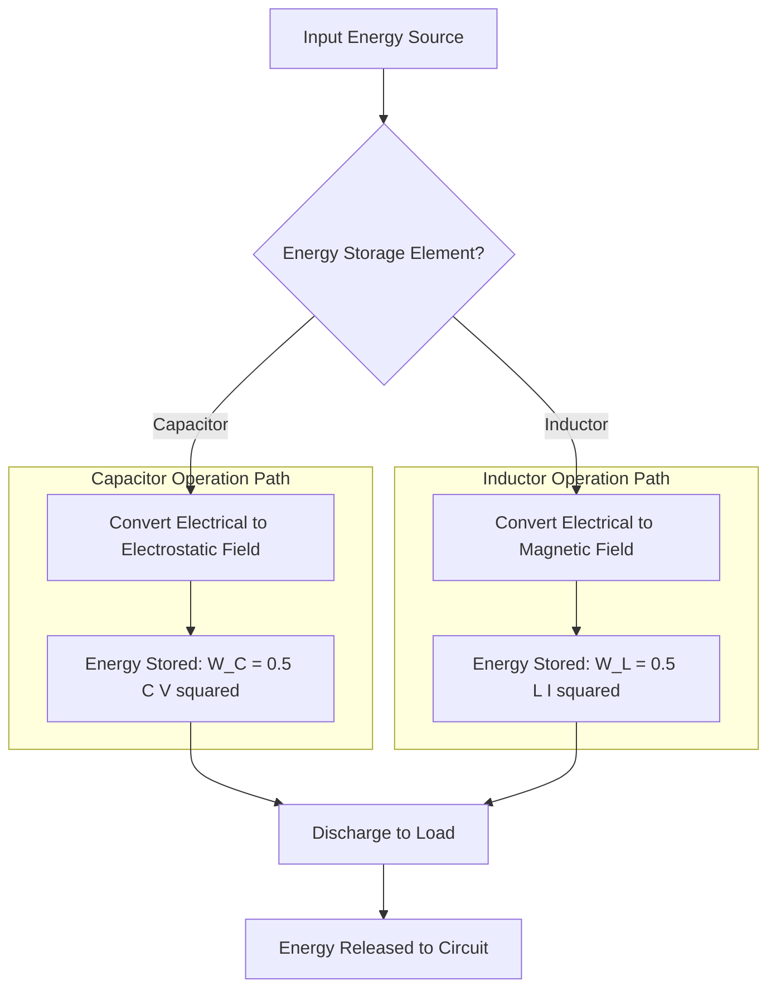
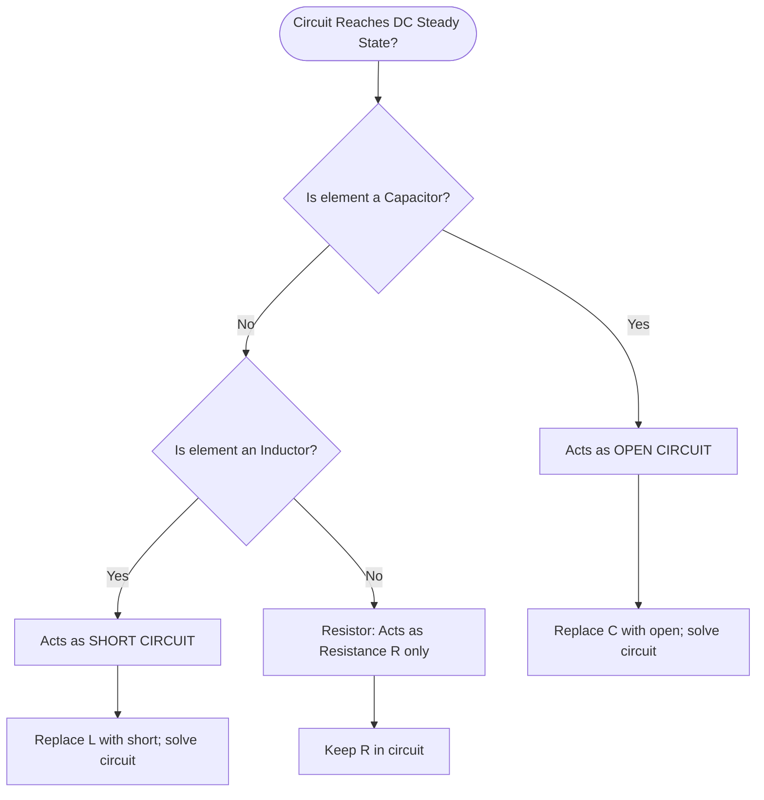
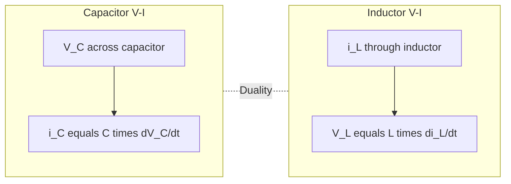
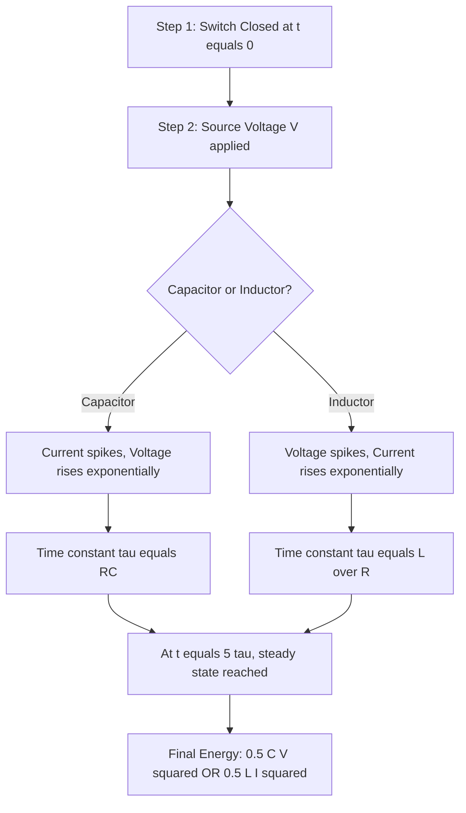

# Capacitors & Inductors: V-I relations and Energy stored

<!-- SECTION_1_START -->

# Capacitors & Inductors: V-I Relations and Energy Stored

## 1. Capacitor — Core Technical Definition

A **capacitor** is a passive two-terminal electrical energy storage element that stores energy in the form of an **electrostatic field** established between two conducting plates separated by a dielectric (insulating) medium. The fundamental quantity of a capacitor is its **capacitance (C)**, measured in **Farads (F)**, which quantifies the charge stored per unit voltage applied across its plates.

> [!IMPORTANT]
> **KTU 2024 Syllabus Definition:** A capacitor is a circuit element described by the constitutive relation $Q = C \cdot V$, where $Q$ is the charge in **Coulombs (C)**, $C$ is the capacitance in **Farads (F)**, and $V$ is the voltage in **Volts (V)**.

> [!NOTE]
> The **Farad** is a large unit; practical capacitors are usually rated in **microfarads ($\mu F = 10^{-6}\,F$)**, **nanofarads ($nF = 10^{-9}\,F$)**, or **picofarads ($pF = 10^{-12}\,F$)**.

### Conceptual Analogy — The Water Tank

Imagine two connected water tanks separated by a rubber membrane. Water (charge) cannot pass through the membrane directly, but pressing water into one tank creates a pressure difference (voltage) that pushes back. The more flexible the membrane, the more water can be stored for a given pressure — analogous to a higher capacitance. Similarly, a capacitor stores **electrical charge** on its plates when a voltage is applied.

---

## 2. Inductor — Core Technical Definition

An **inductor** is a passive two-terminal energy storage element that stores energy in the form of a **magnetic field** produced by current flowing through a coil of wire. The fundamental quantity of an inductor is its **inductance (L)**, measured in **Henries (H)**, which quantifies the magnetic flux linkage per unit current.

> [!IMPORTANT]
> **KTU 2024 Syllabus Definition:** An inductor is a circuit element described by the constitutive relation $\lambda = L \cdot i$, where $\lambda$ is the **flux linkage** in **Weber-turns (Wb-turns)**, $L$ is the inductance in **Henries (H)**, and $i$ is the current in **Amperes (A)**.

> [!NOTE]
> The **Henry** is a large unit; practical inductors are usually rated in **millihenries ($mH = 10^{-3}\,H$)** or **microhenries ($\mu H = 10^{-6}\,H$)**.

### Conceptual Analogy — The Flywheel

Think of a heavy spinning flywheel connected to a shaft. Once you push the flywheel (apply current), it takes effort to start it (opposing EMF), and once spinning, it resists stopping. Energy is stored in the form of rotational inertia (kinetic energy). Similarly, an inductor stores energy in its **magnetic field** and opposes any sudden change in current — a manifestation of **Lenz's Law**.

> [!VISUALIZATION CONTROL]
> **Concept:** Capacitor V-I Phase Relationship and Energy Storage Curves
>
> **Desmos / GeoGebra Input Equations (Plot these on the same axes for comparison):**
> * Capacitor Voltage Decay: $V_c(t) = 5 \cdot e^{-t/2}$
> * Capacitor Current Decay: $I_c(t) = -2.5 \cdot e^{-t/2}$
> * Inductor Current Rise: $I_L(t) = 2 \cdot (1 - e^{-t/3})$
> * Inductor Voltage Decay: $V_L(t) = 6 \cdot e^{-t/3}$
> * Energy in Capacitor: $E_C(t) = 0.5 \cdot 1 \cdot V_c(t)^2$
> * Energy in Inductor: $E_L(t) = 0.5 \cdot 2 \cdot I_L(t)^2$
>
> **Visual Description:** Students should observe that capacitor voltage cannot change instantaneously (continuous, decaying curve), while current spikes instantly and decays. For the inductor, current cannot change instantaneously and rises gradually, while voltage spikes instantly at $t=0$ and decays exponentially. Energy curves asymptotically approach the maximum stored value.

---

## 3. Why Capacitors and Inductors Matter in Engineering

> [!TIP]
> In KTU 2024 scheme boards, students often lose marks by not stating the **memory property** explicitly. Always write: *"A capacitor stores energy in its electric field and opposes an abrupt change in **voltage** across it. An inductor stores energy in its magnetic field and opposes an abrupt change in **current** through it."*

Capacitors are used in:
* **Filter circuits** in DC power supplies (smoothing rectified output)
* **Timing circuits** (with resistors, forming RC networks)
* **Energy storage** in camera flashes, defibrillators, and UPS systems
* **Power factor correction** in industrial AC systems

Inductors are used in:
* **Chokes and filters** in radio frequency (RF) circuits
* **Transformers** for voltage step-up/step-down
* **Energy storage** in switching power supplies and SMPS
* **Electromagnetic relays and solenoids**

<!-- SECTION_1_END -->

<!-- SECTION_2_START -->

# Deep Theoretical Analysis & KTU High-Yield Formula Sheet

## 1. Capacitor V-I Relation — Theoretical Breakdown

For a capacitor with capacitance $C$ and instantaneous voltage $V_C(t)$ across it:

### Step 1 — Constitutive Relation

The fundamental charge-voltage relation is:

$$Q(t) = C \cdot V_C(t)$$

### Step 2 — Differentiate with Respect to Time

Since current is defined as the rate of change of charge ($i = \frac{dQ}{dt}$):

$$i_C(t) = \frac{dQ(t)}{dt} = \frac{d}{dt}\left[C \cdot V_C(t)\right]$$

### Step 3 — Assume Constant Capacitance

For a **linear, time-invariant (LTI)** capacitor, $C$ is constant, so:

$$i_C(t) = C \cdot \frac{dV_C(t)}{dt}$$

> [!NOTE]
> **Memory Property:** A capacitor allows current to flow only when the voltage across it **changes**. In **DC steady state** ($\frac{dV_C}{dt} = 0$), the capacitor behaves as an **open circuit**.

### Step 4 — Inverse V-I Relation (Voltage as Function of Current)

Integrating from $t = 0$ to a general time $t$, with initial voltage $V_C(0)$:

$$V_C(t) = V_C(0) + \frac{1}{C} \int_0^t i_C(\tau)\, d\tau$$

This integral form is critical for KTU board problems involving **switched circuits** and **transient responses**.

---

## 2. Inductor V-I Relation — Theoretical Breakdown

For an inductor with inductance $L$ and instantaneous current $i_L(t)$ through it:

### Step 1 — Constitutive Relation

The flux linkage-current relation is:

$$\lambda(t) = L \cdot i_L(t)$$

### Step 2 — Faraday's Law of Electromagnetic Induction

The voltage across an inductor equals the rate of change of flux linkage:

$$V_L(t) = \frac{d\lambda(t)}{dt} = \frac{d}{dt}\left[L \cdot i_L(t)\right]$$

### Step 3 — Assume Constant Inductance

For a **linear, time-invariant (LTI)** inductor, $L$ is constant:

$$V_L(t) = L \cdot \frac{di_L(t)}{dt}$$

> [!NOTE]
> **Memory Property:** An inductor develops a voltage across it only when the current through it **changes**. In **DC steady state** ($\frac{di_L}{dt} = 0$), the inductor behaves as a **short circuit** (zero voltage drop).

### Step 4 — Inverse V-I Relation (Current as Function of Voltage)

Integrating from $t = 0$ to a general time $t$, with initial current $i_L(0)$:

$$i_L(t) = i_L(0) + \frac{1}{L} \int_0^t V_L(\tau)\, d\tau$$

---

## 3. Energy Stored — Theoretical Derivation

### Energy Stored in a Capacitor

The instantaneous power absorbed by a capacitor is:

$$p_C(t) = V_C(t) \cdot i_C(t) = V_C(t) \cdot C \cdot \frac{dV_C(t)}{dt}$$

The total energy stored from $0$ to $V$ is:

$$W_C = \int_0^V p_C(t)\, dt = \int_0^V C \cdot V_C \cdot dV_C = \frac{1}{2} C V^2$$

### Energy Stored in an Inductor

The instantaneous power absorbed by an inductor is:

$$p_L(t) = V_L(t) \cdot i_L(t) = L \cdot \frac{di_L(t)}{dt} \cdot i_L(t)$$

The total energy stored from $0$ to $I$ is:

$$W_L = \int_0^I p_L(t)\, dt = \int_0^I L \cdot i_L \cdot di_L = \frac{1}{2} L I^2$$

---

## 4. KTU High-Yield Formula Sheet

| **Parameter** | **Capacitor** | **Inductor** |
| :--- | :--- | :--- |
| **Defining Equation** | $Q = C \cdot V$ | $\lambda = L \cdot i$ |
| **V-I Differential Form** | $i_C = C \dfrac{dV_C}{dt}$ | $V_L = L \dfrac{di_L}{dt}$ |
| **Inverse Integral Form** | $V_C(t) = V_C(0) + \dfrac{1}{C} \int_0^t i_C(\tau)\, d\tau$ | $i_L(t) = i_L(0) + \dfrac{1}{L} \int_0^t V_L(\tau)\, d\tau$ |
| **Energy Stored** | $W_C = \dfrac{1}{2} C V^2$ Joules | $W_L = \dfrac{1}{2} L I^2$ Joules |
| **Power Absorbed** | $p_C = V_C \cdot i_C$ W | $p_L = V_L \cdot i_L$ W |
| **DC Steady-State Behavior** | Open Circuit (no current) | Short Circuit (no voltage drop) |
| **Opposes Change In** | Voltage $V_C$ | Current $i_L$ |
| **Field Type** | Electric Field ($E$-field) | Magnetic Field ($B$-field) |
| **SI Unit of Main Quantity** | Farad ($\text{F}$) | Henry ($\text{H}$) |
| **Series Combination** | $C_{eq} = \left(\sum \dfrac{1}{C_i}\right)^{-1}$ | $L_{eq} = \sum L_i$ |
| **Parallel Combination** | $C_{eq} = \sum C_i$ | $L_{eq} = \left(\sum \dfrac{1}{L_i}\right)^{-1}$ |
| **Time Constant (with R)** | $\tau = RC$ seconds | $\tau = \dfrac{L}{R}$ seconds |

---

## 5. Real-World Engineering Utility

> [!TIP]
> **Why this matters in production:**
> * **Capacitors** smooth out voltage ripples in **switched-mode power supplies (SMPS)** and decouple high-frequency noise in digital PCBs.
> * **Inductors** form the heart of **boost/buck converters** and **EMI filters**, suppressing electromagnetic interference in consumer electronics.
> * Both elements are **dual** of each other — interchange $V \leftrightarrow I$ and $C \leftrightarrow L$ to convert a capacitor circuit into an equivalent inductor circuit. This **duality principle** is a frequent KTU question!

<!-- SECTION_2_END -->

<!-- SECTION_3_START -->

# Step-by-Step Derivations & Code/Symbolic Implementation

## 1. Exhaustive Derivation — Energy in a Capacitor

We begin from the fundamental relation between charge and voltage.

### Step 1 — Start with the Charge Definition

$$Q = C \cdot V$$

### Step 2 — Express Charge as Integral of Current

Since $i = \dfrac{dQ}{dt}$, we have $dQ = i \cdot dt$. Substituting:

$$\int_0^Q dQ = \int_0^t i(\tau)\, d\tau \quad \Rightarrow \quad Q(t) = \int_0^t i(\tau)\, d\tau$$

### Step 3 — Power Absorbed by the Capacitor

$$p(t) = V(t) \cdot i(t)$$

### Step 4 — Substitute the Capacitor V-I Relation

From the constitutive relation: $V = \dfrac{Q}{C}$, so $p(t) = \dfrac{Q}{C} \cdot i(t) = \dfrac{Q}{C} \cdot \dfrac{dQ}{dt}$.

### Step 5 — Total Energy Stored

$$W_C = \int_0^t p(\tau)\, d\tau = \int_0^Q \dfrac{Q'}{C}\, dQ'$$

### Step 6 — Evaluate the Integral

$$W_C = \dfrac{1}{C} \cdot \left[\dfrac{(Q')^2}{2}\right]_0^Q = \dfrac{Q^2}{2C}$$

### Step 7 — Substitute $Q = CV$

$$W_C = \dfrac{(CV)^2}{2C} = \dfrac{C^2 V^2}{2C} = \dfrac{1}{2}CV^2$$

### Final Result

$$\boxed{W_C = \frac{1}{2} C V^2 \quad \text{(Joules)}}$$

Equivalent forms: $W_C = \dfrac{Q^2}{2C} = \dfrac{1}{2} QV = \dfrac{1}{2} C V^2$

---

## 2. Exhaustive Derivation — Energy in an Inductor

### Step 1 — Start with the Flux Linkage Definition

$$\lambda = L \cdot i$$

### Step 2 — Express Flux Linkage as Integral of Voltage

Since $V = \dfrac{d\lambda}{dt}$, we have $d\lambda = V \cdot dt$. Substituting:

$$\int_0^\lambda d\lambda = \int_0^t V(\tau)\, d\tau \quad \Rightarrow \quad \lambda(t) = \int_0^t V(\tau)\, d\tau$$

### Step 3 — Power Absorbed by the Inductor

$$p(t) = V(t) \cdot i(t)$$

### Step 4 — Substitute the Inductor V-I Relation

From the constitutive relation: $i = \dfrac{\lambda}{L}$, and $V = L \dfrac{di}{dt}$, so $p(t) = L \cdot \dfrac{di}{dt} \cdot i(t)$.

### Step 5 — Total Energy Stored

$$W_L = \int_0^t p(\tau)\, d\tau = \int_0^I L \cdot i'\, di'$$

### Step 6 — Evaluate the Integral

$$W_L = L \cdot \left[\dfrac{(i')^2}{2}\right]_0^I = \dfrac{1}{2} L I^2$$

### Final Result

$$\boxed{W_L = \frac{1}{2} L I^2 \quad \text{(Joules)}}$$

Equivalent forms: $W_L = \dfrac{\lambda^2}{2L} = \dfrac{1}{2} \lambda i = \dfrac{1}{2} L I^2$

---

## 3. Symbolic Python Implementation

The following Python code computes the V-I relation and energy stored for both elements, with strict type hints and error handling.

```python
from typing import Union
import math

def capacitor_voltage(
    capacitance: float,
    initial_voltage: float,
    time_array: list,
    current_func: callable
) -> dict:
    """
    Computes capacitor voltage and stored energy over time.
    
    Parameters:
        capacitance (F): Capacitance in Farads (must be > 0).
        initial_voltage (V): Initial voltage across capacitor.
        time_array (s): List of time points (monotonically increasing).
        current_func (A): Function returning current i(t) at time t.
    
    Returns:
        dict: Contains voltage list, energy list, and final energy.
    """
    if capacitance <= 0:
        raise ValueError("Capacitance must be a positive number.")
    if not time_array:
        raise ValueError("Time array cannot be empty.")
    
    voltage_list = [initial_voltage]
    energy_list = [0.5 * capacitance * initial_voltage ** 2]
    charge_total = 0.0
    
    for index in range(1, len(time_array)):
        delta_t = time_array[index] - time_array[index - 1]
        if delta_t < 0:
            raise ValueError("Time array must be monotonically increasing.")
        
        # Trapezoidal integration of current
        i_prev = current_func(time_array[index - 1])
        i_curr = current_func(time_array[index])
        charge_total += 0.5 * (i_prev + i_curr) * delta_t
        
        v_now = initial_voltage + charge_total / capacitance
        voltage_list.append(v_now)
        energy_list.append(0.5 * capacitance * v_now ** 2)
    
    return {
        "voltage_V": voltage_list,
        "energy_J": energy_list,
        "final_energy_J": energy_list[-1]
    }


def inductor_current(
    inductance: float,
    initial_current: float,
    time_array: list,
    voltage_func: callable
) -> dict:
    """
    Computes inductor current and stored energy over time.
    
    Parameters:
        inductance (H): Inductance in Henries (must be > 0).
        initial_current (A): Initial current through inductor.
        time_array (s): List of time points (monotonically increasing).
        voltage_func (V): Function returning voltage v(t) at time t.
    
    Returns:
        dict: Contains current list, energy list, and final energy.
    """
    if inductance <= 0:
        raise ValueError("Inductance must be a positive number.")
    if not time_array:
        raise ValueError("Time array cannot be empty.")
    
    current_list = [initial_current]
    energy_list = [0.5 * inductance * initial_current ** 2]
    flux_total = 0.0
    
    for index in range(1, len(time_array)):
        delta_t = time_array[index] - time_array[index - 1]
        if delta_t < 0:
            raise ValueError("Time array must be monotonically increasing.")
        
        # Trapezoidal integration of voltage
        v_prev = voltage_func(time_array[index - 1])
        v_curr = voltage_func(time_array[index])
        flux_total += 0.5 * (v_prev + v_curr) * delta_t
        
        i_now = initial_current + flux_total / inductance
        current_list.append(i_now)
        energy_list.append(0.5 * inductance * i_now ** 2)
    
    return {
        "current_A": current_list,
        "energy_J": energy_list,
        "final_energy_J": energy_list[-1]
    }


# ---------- Example Usage ----------
if __name__ == "__main__":
    # Capacitor: 100 microfarad, charged by 1 mA constant current
    time_points = [0.0, 0.1, 0.2, 0.3, 0.4, 0.5]
    
    cap_result = capacitor_voltage(
        capacitance=100e-6,
        initial_voltage=0.0,
        time_array=time_points,
        current_func=lambda t: 1e-3
    )
    print("Capacitor final energy:", cap_result["final_energy_J"], "J")
    
    # Inductor: 50 mH, 10 V applied constant voltage
    ind_result = inductor_current(
        inductance=50e-3,
        initial_current=0.0,
        time_array=time_points,
        voltage_func=lambda t: 10.0
    )
    print("Inductor final energy:", ind_result["final_energy_J"], "J")
```

---

## 4. Numerical Worked Example — KTU Board Style

**Problem:** A $4\,\mu F$ capacitor is charged from $0\,V$ to $50\,V$. Compute the energy stored and the average power if the charging takes $0.2$ seconds.

### Step 1 — Energy Stored

$$W_C = \frac{1}{2} C V^2 = \frac{1}{2} \times 4 \times 10^{-6} \times (50)^2$$

$$W_C = \frac{1}{2} \times 4 \times 10^{-6} \times 2500 = 5000 \times 10^{-6} = 5 \times 10^{-3}\,J$$

### Step 2 — Average Power

$$P_{avg} = \frac{W_C}{t} = \frac{5 \times 10^{-3}}{0.2} = 2.5 \times 10^{-2}\,W = 25\,mW$$

### Final Answer

$$W_C = 5\,mJ \quad \text{and} \quad P_{avg} = 25\,mW$$

---

## 5. Numerical Worked Example — Inductor

**Problem:** A $200\,mH$ inductor carries a current that rises linearly from $0$ to $5\,A$ in $0.1$ seconds. Find the voltage across the inductor and the energy stored at the end.

### Step 1 — Rate of Change of Current

$$\frac{di}{dt} = \frac{5 - 0}{0.1} = 50\,A/s$$

### Step 2 — Voltage Across the Inductor

$$V_L = L \cdot \frac{di}{dt} = 200 \times 10^{-3} \times 50 = 10\,V$$

### Step 3 — Energy Stored

$$W_L = \frac{1}{2} L I^2 = \frac{1}{2} \times 200 \times 10^{-3} \times (5)^2$$

$$W_L = \frac{1}{2} \times 0.2 \times 25 = 2.5\,J$$

### Final Answer

$$V_L = 10\,V \quad \text{and} \quad W_L = 2.5\,J$$

<!-- SECTION_3_END -->

<!-- SECTION_4_START -->

# Structural Diagrams & Schematics

## 1. Circuit Symbol Reference Matrix

| **Element** | **Schematic Symbol** | **Stored Energy Field** | **Opposes Change In** |
| :--- | :--- | :--- | :--- |
| Capacitor | Two parallel lines (one curved) | Electric Field between plates | Voltage $V_C$ |
| Inductor | Series of looped curves (coil) | Magnetic Field around coil | Current $i_L$ |
| Resistor | Zig-zag line | None (dissipative) | N/A |

---

## 2. Mermaid Block Diagram — Energy Storage Flow



---

## 3. Mermaid Flowchart — DC Steady-State Decision Logic



---

## 4. Mermaid Block Diagram — V-I Relationship Duality



---

## 5. Sequential Processing Topology — Charging Cycle



<!-- SECTION_4_END -->

<!-- SECTION_5_START -->

# KTU 2024 Scheme Examination Question Bank & Topic Recap

---

## PART A — Short Answer Questions (3 Marks Each)

### **Question 1** `[KTU University Exam - July 2024]` — **CO1, Remember**

**State the voltage-current relation for a capacitor and an inductor. Define capacitance and inductance with their SI units.**

**Model Answer:**

**Capacitor V-I Relation:**

$$i_C(t) = C \cdot \frac{dV_C(t)}{dt}$$

The capacitance $C$ is defined as the charge stored per unit voltage:

$$C = \frac{Q}{V} \quad \text{with SI unit: Farad (F)}$$

**Inductor V-I Relation:**

$$V_L(t) = L \cdot \frac{di_L(t)}{dt}$$

The inductance $L$ is defined as the flux linkage per unit current:

$$L = \frac{\lambda}{i} \quad \text{with SI unit: Henry (H)}$$

> **[Valuation Key: Stating V-I relation: 1 Mark; Defining C with unit: 1 Mark; Defining L with unit: 1 Mark = Total 3 Marks]**

---

### **Question 2** `[KTU University Exam - Dec 2023]` — **CO1, Understand**

**Explain the behavior of a capacitor and an inductor under DC steady-state conditions. State the energy stored in each.**

**Model Answer:**

Under **DC steady-state** conditions, all voltages and currents become constant with respect to time, so all time derivatives vanish.

**For a Capacitor:** $\dfrac{dV_C}{dt} = 0 \Rightarrow i_C = 0$. Therefore, the capacitor behaves as an **open circuit**.

**For an Inductor:** $\dfrac{di_L}{dt} = 0 \Rightarrow V_L = 0$. Therefore, the inductor behaves as a **short circuit**.

**Energy Stored:**

$$W_C = \frac{1}{2}CV^2 \quad \text{(Joules)} \quad \text{and} \quad W_L = \frac{1}{2}LI^2 \quad \text{(Joules)}$$

> **[Valuation Key: DC steady-state identification: 1 Mark; Open/short circuit behavior: 1 Mark; Energy formulas: 1 Mark = Total 3 Marks]**

---

## PART B — Long Answer Questions (14 Marks Each, with Internal Choice)

### **Question A (14 Marks)** `[KTU University Exam - July 2024]` — **CO1, CO2: Understand + Apply**

**(a)** Derive the expression for the energy stored in a capacitor from first principles using the charge-voltage relation. **\[7 Marks\]**

**(b)** A $10\,\mu F$ capacitor is charged to $100\,V$ and then connected across a $50\,\Omega$ resistor. Calculate: (i) the initial discharge current, (ii) the time constant, and (iii) the energy dissipated in the resistor during complete discharge. **\[7 Marks\]**

---

### **Model Solution for Question A**

#### Part (a) — Derivation of Energy Stored in a Capacitor **\[7 Marks\]**

**Step 1:** Start with the fundamental charge-voltage relation:

$$Q = C \cdot V$$

**[Stating boundary state values: 1 Mark]**

**Step 2:** Express charge as a function of time by integrating the current:

$$Q(t) = \int_0^t i(\tau)\, d\tau$$

**[Setting up the integral: 1 Mark]**

**Step 3:** Write the instantaneous power absorbed by the capacitor:

$$p(t) = V(t) \cdot i(t) = \frac{Q(t)}{C} \cdot \frac{dQ}{dt}$$

**[Writing power expression: 1 Mark]**

**Step 4:** Total energy stored is the time integral of power:

$$W_C = \int_0^t p(\tau)\, d\tau = \int_0^Q \frac{Q'}{C}\, dQ'$$

**[Formulating energy integral: 1 Mark]**

**Step 5:** Evaluate the integral:

$$W_C = \frac{1}{C} \cdot \left[\frac{(Q')^2}{2}\right]_0^Q = \frac{Q^2}{2C}$$

**[Evaluating integration: 1 Mark]**

**Step 6:** Substitute $Q = CV$:

$$W_C = \frac{(CV)^2}{2C} = \frac{1}{2}CV^2$$

**[Final simplified expression: 2 Marks]**

---

#### Part (b) — Numerical Problem on Capacitor Discharge **\[7 Marks\]**

**Given:** $C = 10\,\mu F = 10 \times 10^{-6}\,F$, $V_0 = 100\,V$, $R = 50\,\Omega$

**(i) Initial Discharge Current:**

At $t = 0$, the capacitor voltage is fully $100\,V$ across the resistor:

$$I_0 = \frac{V_0}{R} = \frac{100}{50} = 2\,A$$

**[Stating formula and substituting: 1 Mark; Final answer: 1 Mark]**

**(ii) Time Constant:**

$$\tau = RC = 50 \times 10 \times 10^{-6} = 500 \times 10^{-6}\,s = 0.5\,ms$$

**[Identifying $\tau = RC$: 1 Mark; Final calculation: 1 Mark]**

**(iii) Energy Dissipated:**

By **conservation of energy**, all the energy initially stored in the capacitor is dissipated in the resistor (capacitor ends up with zero charge):

$$W_R = W_C = \frac{1}{2}CV_0^2 = \frac{1}{2} \times 10 \times 10^{-6} \times (100)^2$$

$$W_R = \frac{1}{2} \times 10^{-5} \times 10^4 = \frac{1}{2} \times 10^{-1} = 0.05\,J = 50\,mJ$$

**[Energy formula: 1 Mark; Substituting values: 1 Mark; Final answer: 1 Mark]**

---

### **Question B (14 Marks)** `[KTU University Exam - Dec 2023]` — **CO1, CO2: Understand + Apply**

**(a)** Derive the expression for the energy stored in an inductor from first principles using the flux linkage-current relation. **\[7 Marks\]**

**(b)** A $500\,mH$ inductor is connected in series with a $20\,\Omega$ resistor across a $12\,V$ DC source. Find: (i) the time constant, (ii) the steady-state current, (iii) the energy stored in the inductor at steady state, and (iv) the time required to reach $63.2\%$ of the final current. **\[7 Marks\]**

---

### **Model Solution for Question B**

#### Part (a) — Derivation of Energy Stored in an Inductor **\[7 Marks\]**

**Step 1:** Start with the flux linkage-current relation:

$$\lambda = L \cdot i$$

**[Stating boundary state values: 1 Mark]**

**Step 2:** Express flux linkage as a function of time using Faraday's Law:

$$\lambda(t) = \int_0^t V(\tau)\, d\tau$$

**[Setting up the integral: 1 Mark]**

**Step 3:** Write the instantaneous power absorbed:

$$p(t) = V(t) \cdot i(t) = L \cdot \frac{di}{dt} \cdot i(t)$$

**[Writing power expression: 1 Mark]**

**Step 4:** Total energy stored is:

$$W_L = \int_0^t p(\tau)\, d\tau = \int_0^I L \cdot i'\, di'$$

**[Formulating energy integral: 1 Mark]**

**Step 5:** Evaluate the integral:

$$W_L = L \cdot \left[\frac{(i')^2}{2}\right]_0^I = \frac{1}{2}LI^2$$

**[Evaluating integration: 1 Mark]**

**Step 6:** Final expression:

$$\boxed{W_L = \frac{1}{2}LI^2 \text{ Joules}}$$

**[Final simplified expression: 2 Marks]**

---

#### Part (b) — Numerical Problem on RL Circuit **\[7 Marks\]**

**Given:** $L = 500\,mH = 0.5\,H$, $R = 20\,\Omega$, $V_S = 12\,V$

**(i) Time Constant:**

$$\tau = \frac{L}{R} = \frac{0.5}{20} = 0.025\,s = 25\,ms$$

**[Stating formula: 1 Mark; Final answer: 1 Mark]**

**(ii) Steady-State Current:**

In DC steady state, inductor acts as a short circuit:

$$I_{ss} = \frac{V_S}{R} = \frac{12}{20} = 0.6\,A$$

**[Identifying steady state behavior: 1 Mark]**

**(iii) Energy Stored at Steady State:**

$$W_L = \frac{1}{2}LI_{ss}^2 = \frac{1}{2} \times 0.5 \times (0.6)^2 = \frac{1}{2} \times 0.5 \times 0.36 = 0.09\,J = 90\,mJ$$

**[Formula: 1 Mark; Substitution and final answer: 1 Mark]**

**(iv) Time to Reach 63.2% of Final Current:**

The current in an RL circuit follows:

$$i(t) = I_{ss} \cdot \left(1 - e^{-t/\tau}\right)$$

At $i(t) = 0.632 \cdot I_{ss}$:

$$0.632 = 1 - e^{-t/\tau} \Rightarrow e^{-t/\tau} = 0.368 \Rightarrow t = \tau = 25\,ms$$

**[Stating current equation: 1 Mark; Solving for time: 1 Mark]**

---

> [!WARNING]
> **KTU Examiner's Valuation Warning / Common Pitfalls:**
> 1. **Unit Conversion Errors:** Always convert $\mu F$ to $F$ (multiply by $10^{-6}$) and $mH$ to $H$ (multiply by $10^{-3}$) **before** substituting into formulas. Marks are deducted for unit inconsistencies.
> 2. **DC Steady-State Trap:** Many students write "current flows through capacitor" — this is wrong. In DC steady state, current through a capacitor is **zero**, not flowing.
> 3. **Energy Formula Confusion:** Do NOT confuse $\frac{1}{2}CV^2$ with $CV^2$. The factor of $\frac{1}{2}$ comes from the integration — skipping it costs 1 mark.
> 4. **Sign Convention:** When using $i = C\frac{dV}{dt}$, the current direction is the **passive sign convention** (current entering the positive terminal). Reversing this requires a negative sign.
> 5. **Open/Short Circuit in Steady State:** Always state explicitly: "Capacitor → Open Circuit" and "Inductor → Short Circuit" before solving. Examiners look for this statement.

---

## Topic Recap & Important Things to Remember

- **Capacitance $C$** is the charge-per-volt ratio with **SI unit Farad (F)**, while **inductance $L$** is the flux linkage-per-ampere ratio with **SI unit Henry (H)**.
- **Capacitor V-I relation:** $i_C = C \dfrac{dV_C}{dt}$ — current is proportional to the **rate of change of voltage**.
- **Inductor V-I relation:** $V_L = L \dfrac{di_L}{dt}$ — voltage is proportional to the **rate of change of current**.
- **Memory Property:** A capacitor's **voltage** cannot change instantaneously; an inductor's **current** cannot change instantaneously.
- **DC Steady State Behavior:** Capacitor $\rightarrow$ **Open Circuit**; Inductor $\rightarrow$ **Short Circuit**.
- **Energy in Capacitor:** $W_C = \dfrac{1}{2}CV^2 = \dfrac{Q^2}{2C} = \dfrac{1}{2}QV$ Joules — stored in the **electric field** between plates.
- **Energy in Inductor:** $W_L = \dfrac{1}{2}LI^2 = \dfrac{\lambda^2}{2L} = \dfrac{1}{2}\lambda i$ Joules — stored in the **magnetic field** around the coil.
- **Power Expressions:** $p_C = V_C \cdot i_C$ and $p_L = V_L \cdot i_L$ — both are instantaneous, not average.
- **Time Constants:** For RC circuit, $\tau = RC$; for RL circuit, $\tau = L/R$. At $t = 5\tau$, the system reaches approximately $99.3\%$ of steady state.
- **Duality Principle:** Swapping $V \leftrightarrow I$ and $C \leftrightarrow L$ converts a capacitor circuit problem into the dual inductor circuit problem — a frequently tested KTU concept.
- **Series-Parallel Formulas:** Capacitors in **series** combine like resistors in **parallel** ($C_{eq}^{-1} = \sum C_i^{-1}$), and inductors in **series** add directly ($L_{eq} = \sum L_i$).
- **Permittivity Constant (Free Space):** $\varepsilon_0 = 8.854 \times 10^{-12}\,F/m$ — used in calculating capacitance of parallel plate capacitors: $C = \dfrac{\varepsilon_0 \varepsilon_r A}{d}$.
- **Permeability Constant (Free Space):** $\mu_0 = 4\pi \times 10^{-7}\,H/m$ — used in calculating solenoid inductance: $L = \dfrac{\mu_0 \mu_r N^2 A}{l}$.
- **Practical Capacitor Range:** $\mu F$, $nF$, $pF$ — practical inductor range: $mH$, $\mu H$.
- **Energy Conservation:** In a switched DC circuit, the total energy stored before switching equals the total energy dissipated in resistors plus energy stored in remaining elements — always use this to verify your answers.

<!-- SECTION_5_END -->
