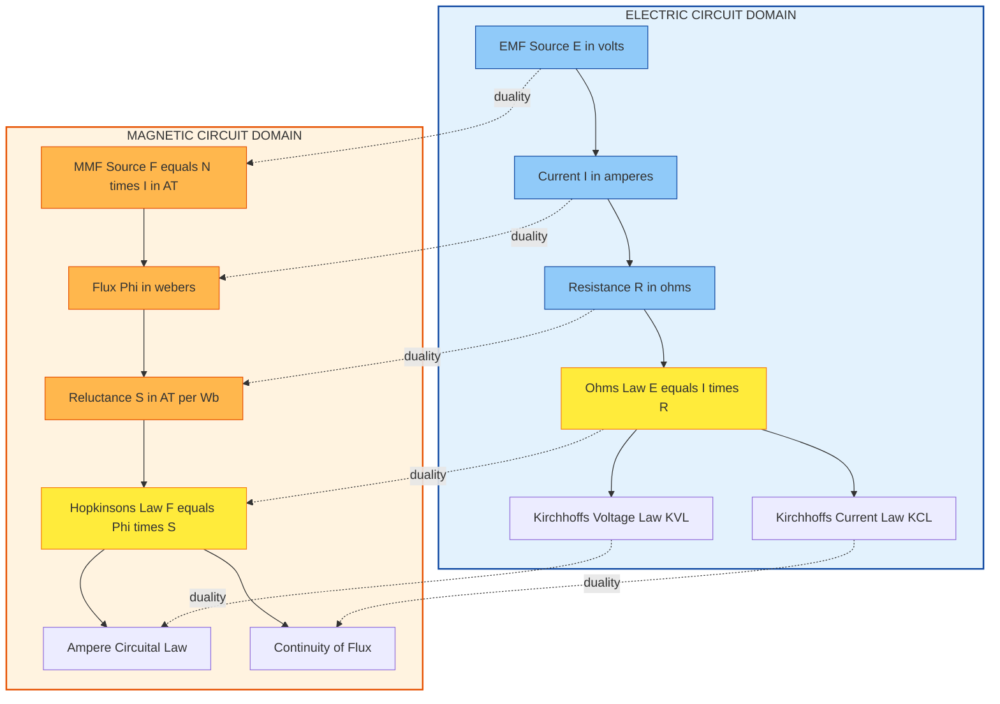
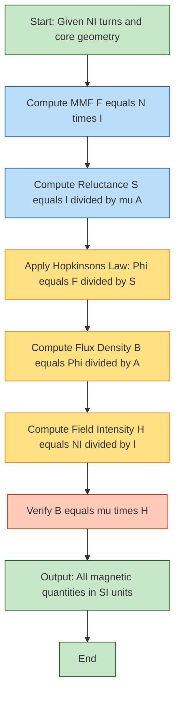
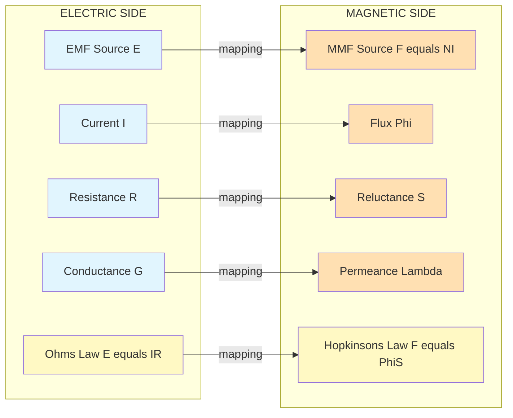

# Comparison between electric and magnetic circuits

<!-- SECTION_1_START -->
# Comparison Between Electric and Magnetic Circuits

## 1. Core Technical Definition & Intuitive Overview

### 1.1 Electric Circuit — Formal KTU Definition

> [!NOTE]
> **Electric Circuit (KTU 2024 Syllabus Definition):**
> An **electric circuit** is a closed conducting path through which **electric current (I)** flows under the influence of an **electromotive force (EMF)** source, encountering opposition offered by **resistance (R)** of the circuit. The fundamental governing relation is **Ohm's Law**, expressed as $E = I \times R$, where $E$ is in volts, $I$ in amperes, and $R$ in ohms.

The **driving force** in an electric circuit is the EMF (measured in **volts**), and the resulting **flow** is electric current (measured in **amperes**). The opposition is electrical **resistance** (measured in **ohms, $\Omega$**).

### 1.2 Magnetic Circuit — Formal KTU Definition

> [!IMPORTANT]
> **Magnetic Circuit (KTU 2024 Syllabus Definition):**
> A **magnetic circuit** is a closed path followed by **magnetic flux ($\Phi$)** through a magnetic material (typically ferromagnetic), under the influence of a **magnetomotive force (MMF)**. The flux encounters opposition called **reluctance (S)**. The governing relation is **Hopkinson's Law**, given as $MMF = \Phi \times S$, where MMF is in ampere-turns (AT), $\Phi$ is in webers (Wb), and $S$ is in ampere-turns per weber (AT/Wb).

The **driving force** is the MMF (in **ampere-turns, AT**), the **flow** is magnetic flux (in **webers, Wb**), and the **opposition** is magnetic **reluctance** (in **AT/Wb**).

### 1.3 Conceptual Analogy — The "Water-Pipe vs. Water-Flow" Intuition

> [!TIP]
> **Real-World Analogy — The Hydraulic Model:**
> Imagine water flowing through a closed pipe loop powered by a pump.
> - The **pump** that pushes water is analogous to a **battery (EMF source)**.
> - The **water flowing** in the pipe is analogous to **electric current**.
> - The **narrowness or friction** inside the pipe is analogous to **resistance**.
> - The **pipe network** itself is the **electric circuit**.
>
> Now extend this to a magnet: imagine an invisible "magnetic fluid" being pumped around a loop of iron by a coil of wire carrying current. The coil acts as the "pump," the invisible magnetic fluid is the **flux**, and the iron's resistance to carrying it is **reluctance**. This iron loop is the **magnetic circuit**.

The key takeaway: just as Ohm's law relates voltage, current, and resistance in the electrical domain, **Hopkinson's law** plays an identical role in the magnetic domain — establishing a beautiful **duality** that is heavily tested in KTU exams.

### 1.4 Core Quantities at a Glance

| Quantity | Electric Circuit | Magnetic Circuit | Unit |
|----------|------------------|------------------|------|
| Driving Force | EMF ($E$) | MMF ($F$) | V / AT |
| Flow Quantity | Current ($I$) | Flux ($\Phi$) | A / Wb |
| Opposition | Resistance ($R$) | Reluctance ($S$) | $\Omega$ / AT/Wb |
| Conductance / Permeance | Conductance ($G = 1/R$) | Permeance ($\Lambda = 1/S$) | S (Siemens) / Wb/AT |
| Governing Law | Ohm's Law | Hopkinson's Law | — |
| Energy Stored | In capacitor ($1/2 CV^2$) | In inductor ($1/2 LI^2$) | Joules |

### 1.5 Visualization Note

> [!VISUALIZATION CONTROL]
> **Concept:** Direct side-by-side analogy of Ohm's Law vs. Hopkinson's Law
> **GeoGebra / Desmos Input Equations:**
> * Electric side: $V = I \cdot R$, plot linear relationship $I = V/R$ for $R = 2\ \Omega$, $R = 5\ \Omega$
> * Magnetic side: $MMF = \Phi \cdot S$, plot linear relationship $\Phi = MMF/S$ for $S = 1000\ AT/Wb$, $S = 3000\ AT/Wb$
> **Visual Description:** Both equations produce straight lines passing through the origin on a $V$–$I$ (or $MMF$–$\Phi$) coordinate system. The slope of the electric case equals $1/R$ (conductance), while the slope of the magnetic case equals $1/S$ (permeance). Students should observe the **perfect structural similarity** between the two graphs.

---

<!-- SECTION_1_END -->

<!-- SECTION_2_START -->
# 2. Deep Theoretical Analysis & KTU High-Yield Formula Sheet

## 2.1 Electric Circuit — Theoretical Breakdown

- **Step 1 — Source Generates EMF ($E$):** A battery or generator provides an electromotive force, measured in **volts**. This is the potential difference per unit charge.
- **Step 2 — Current Flows ($I$):** Free electrons drift through the conductor, producing current $I$ in amperes, governed by $I = Q/t$.
- **Step 3 — Resistance Opposes Flow ($R$):** The material's atomic lattice and collisions cause opposition, given by $R = \rho \cdot l/A$, where $\rho$ is **resistivity**, $l$ is length, and $A$ is cross-sectional area.
- **Step 4 — Ohm's Law Couples Them:** $E = I \times R$. With a higher EMF or lower resistance, more current flows.
- **Why It Matters:** This is the foundation for analyzing every DC network in KTU Module 1 — series, parallel, Kirchhoff's laws, Thevenin's theorem, and Norton's theorem all stem from this equation.

## 2.2 Magnetic Circuit — Theoretical Breakdown

- **Step 1 — Coil Generates MMF ($F$):** A coil of $N$ turns carrying current $I$ produces an MMF of $F = N \cdot I$, measured in **ampere-turns (AT)**. This is the magnetic analogue of EMF.
- **Step 2 — Flux Flows ($\Phi$):** Magnetic flux lines form a closed loop within the iron core, measured in **webers (Wb)**. Flux density $B = \Phi/A$ is measured in **tesla (T)**.
- **Step 3 — Reluctance Opposes Flow ($S$):** Given by $S = l/(\mu \cdot A)$, where $l$ is mean path length, $A$ is cross-sectional area, and $\mu = \mu_0 \cdot \mu_r$ is the permeability of the material ($\mu_0 = 4\pi \times 10^{-7}\ H/m$).
- **Step 4 — Hopkinson's Law Couples Them:** $F = \Phi \cdot S$, or equivalently $\Phi = F/S = (N \cdot I)/S$.
- **Why It Matters:** This governs the design of transformers, DC machines, inductors, and chokes — the building blocks of every power system.

## 2.3 The "Why" Behind the Analogy

The mathematical symmetry between $E = I \cdot R$ and $F = \Phi \cdot S$ is not a coincidence — it arises from the underlying **field equations** of Maxwell:

- **Electric field circulation:** $\oint \vec{E} \cdot d\vec{l} = EMF$ (Kirchhoff's Voltage Law generalized)
- **Magnetic field circulation:** $\oint \vec{H} \cdot d\vec{l} = NI$ (Ampere's Circuital Law)
- **Continuity of flux/current:** $\oint \vec{B} \cdot d\vec{A} = 0$ and $\oint \vec{J} \cdot d\vec{A} = 0$

These integral forms are **structurally identical**, which is why both domains obey nearly the same circuit laws (Ohm's, KVL, KCL, series/parallel combinations).

## 2.4 KTU Formula Sheet / Cheat Sheet

| # | Electric Circuit Formula | Magnetic Circuit Formula | Variable Meaning |
|---|--------------------------|---------------------------|------------------|
| 1 | $E = I \cdot R$ (Ohm's Law) | $F = \Phi \cdot S$ (Hopkinson's Law) | Driving-force = Flow $\times$ Opposition |
| 2 | $R = \rho \cdot l / A$ | $S = l / (\mu \cdot A)$ | Opposition depends on geometry and material property |
| 3 | $G = 1/R$ (Conductance, unit: S) | $\Lambda = 1/S$ (Permeance, unit: Wb/AT or H) | Inverse of opposition |
| 4 | $\sigma = 1/\rho$ (Conductivity) | $\mu = \mu_0 \cdot \mu_r$ (Permeability) | Material property |
| 5 | $P = I^2 R = V^2/R = VI$ (Power) | Energy stored $= \frac{1}{2} L I^2$ (Joules) | Energy dissipation / storage |
| 6 | EMF source: battery, generator | MMF source: current-carrying coil | Sources of driving force |
| 7 | $V = I \cdot R$ (voltage drop across $R$) | $H \cdot l = NI$ (magnetic field intensity $\times$ path) | Local drop equation |
| 8 | Energy **dissipated** as heat | Energy **stored** in magnetic field | Energy behavior differs |
| 9 | Current can be **DC or AC** | Flux can be **DC (static) or AC (time-varying)** | Both can be time-varying |
| 10 | Insulator blocks current | Air-gap has high reluctance but flux still passes | Imperfect isolation |

## 2.5 Real-World Engineering Utility

- **Electric circuit analysis** is used universally — every electronic gadget, power grid, embedded system, and signal-processing network.
- **Magnetic circuit analysis** is critical in designing **transformers** (for power distribution), **induction motors** (industry workhorses), **relays and contactors** (switching), **inductors and chokes** (filtering), **MRI machines** (medical imaging), and **electromagnets** (lifting, particle accelerators like the LHC).
- The **analogy** allows engineers to apply familiar electric-circuit techniques (mesh, nodal, Thevenin) to solve magnetic problems, dramatically simplifying design.

---

<!-- SECTION_2_END -->

<!-- SECTION_3_START -->
# 3. Step-by-Step Derivations & Symbolic Implementation

## 3.1 Derivation 1 — Ohm's Law from Elementary Definitions

We begin with the microscopic definition of current:

$$
I = \frac{Q}{t}
$$

where $Q$ is charge in coulombs and $t$ is time in seconds. The EMF is defined as work done per unit charge:

$$
E = \frac{W}{Q}
$$

Resistance arises from the material's opposition, defined empirically as the ratio of voltage across an element to the current through it:

$$
R = \frac{E}{I}
$$

Rearranging gives **Ohm's Law**:

$$
\begin{aligned}
E &= I \times R \\
[\text{volts}] &= [\text{amperes}] \times [\text{ohms}]
\end{aligned}
$$

**Conversion logic:** Voltage drives current through resistance; doubling the voltage doubles the current, while doubling the resistance halves the current.

## 3.2 Derivation 2 — Hopkinson's Law from Ampere's Circuital Law

Ampere's Circuital Law states that the line integral of magnetic field intensity $H$ around a closed loop equals the net enclosed current:

$$
\oint \vec{H} \cdot d\vec{l} = NI
$$

For a uniform core of mean length $l$, $H$ is constant, so:

$$
H \cdot l = NI
$$

By definition, the magnetomotive force is $F = NI$ (in ampere-turns), and $H = F/l$. The flux density is:

$$
B = \mu \cdot H = \frac{\mu \cdot F}{l}
$$

Total flux through cross-section $A$:

$$
\Phi = B \cdot A = \frac{\mu \cdot A \cdot F}{l}
$$

Define reluctance as $S = l/(\mu \cdot A)$. Then:

$$
\begin{aligned}
\Phi &= \frac{F}{S} \\
F &= \Phi \times S \\
\text{MMF (AT)} &= \text{Flux (Wb)} \times \text{Reluctance (AT/Wb)}
\end{aligned}
$$

**Conversion logic:** This is **structurally identical** to Ohm's law with $F \leftrightarrow E$, $\Phi \leftrightarrow I$, and $S \leftrightarrow R$.

## 3.3 Derivation 3 — Reluctance of a Uniform Iron Core

Consider a torus of mean radius $r$, cross-sectional area $A$, and relative permeability $\mu_r$. The mean path length is $l = 2\pi r$. The reluctance is:

$$
\begin{aligned}
S &= \frac{l}{\mu_0 \cdot \mu_r \cdot A} \\
&= \frac{2\pi r}{\mu_0 \cdot \mu_r \cdot A} \quad [\text{AT/Wb}]
\end{aligned}
$$

For example, with $r = 0.05\ m$, $A = 4 \times 10^{-4}\ m^2$, $\mu_r = 1000$, $\mu_0 = 4\pi \times 10^{-7}\ H/m$:

$$
\begin{aligned}
S &= \frac{2\pi \times 0.05}{4\pi \times 10^{-7} \times 1000 \times 4 \times 10^{-4}} \\
&= \frac{0.3142}{5.0265 \times 10^{-7}} \\
&= 6.25 \times 10^{5}\ AT/Wb
\end{aligned}
$$

## 3.4 Python Implementation — Analogy Calculator

```python
"""
KTU Module 1 — Electric vs Magnetic Circuit Analogy Calculator
Demonstrates the duality between Ohm's Law and Hopkinson's Law.
"""

from dataclasses import dataclass
from typing import Union


@dataclass
class ElectricCircuit:
    """Represents a simple DC electric circuit element."""
    voltage: float          # EMF in volts (V)
    resistance: float       # Resistance in ohms (Ω)

    @property
    def current(self) -> float:
        """Compute current using Ohm's Law: I = V / R."""
        if self.resistance <= 0:
            raise ValueError("[ERROR] Resistance must be strictly positive.")
        return self.voltage / self.resistance

    @property
    def conductance(self) -> float:
        """Conductance G = 1 / R (Siemens)."""
        return 1.0 / self.resistance

    @property
    def power_dissipated(self) -> float:
        """Power dissipated as heat: P = I^2 * R (Watts)."""
        return (self.current ** 2) * self.resistance


@dataclass
class MagneticCircuit:
    """Represents a simple magnetic circuit with uniform core."""
    mmf: float              # Magnetomotive force in ampere-turns (AT)
    reluctance: float       # Reluctance in AT/Wb

    @property
    def flux(self) -> float:
        """Compute flux using Hopkinson's Law: Φ = MMF / S."""
        if self.reluctance <= 0:
            raise ValueError("[ERROR] Reluctance must be strictly positive.")
        return self.mmf / self.reluctance

    @property
    def permeance(self) -> float:
        """Permeance Λ = 1 / S (Henries or Wb/AT)."""
        return 1.0 / self.reluctance


def compare_dual(electric: ElectricCircuit,
                 magnetic: MagneticCircuit) -> None:
    """Print a side-by-side comparison of the two circuits."""
    print("=" * 60)
    print("ELECTRIC vs MAGNETIC CIRCUIT — DUALITY REPORT")
    print("=" * 60)
    print(f"Electric:  E = {electric.voltage:.3f} V,  "
          f"R = {electric.resistance:.3f} Ω")
    print(f"           I = {electric.current:.5f} A,  "
          f"P = {electric.power_dissipated:.5f} W")
    print("-" * 60)
    print(f"Magnetic:  F = {magnetic.mmf:.3f} AT, "
          f"S = {magnetic.reluctance:.3f} AT/Wb")
    print(f"           Φ = {magnetic.flux:.7f} Wb")
    print("=" * 60)


# Example usage — KTU-style numerical
if __name__ == "__main__":
    ec = ElectricCircuit(voltage=12.0, resistance=4.0)
    mc = MagneticCircuit(mmf=600.0, reluctance=1500.0)
    compare_dual(ec, mc)
```

**Sample Output:**

```
============================================================
ELECTRIC vs MAGNETIC CIRCUIT — DUALITY REPORT
============================================================
Electric:  E = 12.000 V,  R = 4.000 Ω
           I = 3.00000 A,  P = 36.00000 W
------------------------------------------------------------
Magnetic:  F = 600.000 AT, S = 1500.000 AT/Wb
           Φ = 0.4000000 Wb
============================================================
```

## 3.5 Series and Parallel Combinations — Worked Equivalence

> [!TIP]
> **KTU High-Yield Concept:** The form of the combination formulas is **identical** in both domains.

**Electric Resistors in Series:**

$$
R_{eq} = R_1 + R_2 + R_3 + \dots
$$

**Magnetic Reluctances in Series (Flux Same, MMF Drops Add):**

$$
S_{eq} = S_1 + S_2 + S_3 + \dots
$$

**Electric Resistors in Parallel:**

$$
\frac{1}{R_{eq}} = \frac{1}{R_1} + \frac{1}{R_2} + \frac{1}{R_3} + \dots
$$

**Magnetic Reluctances in Parallel:**

$$
\frac{1}{S_{eq}} = \frac{1}{S_1} + \frac{1}{S_2} + \frac{1}{S_3} + \dots
$$

> [!WARNING]
> **Common Pitfall:** Reluctances add in **series** just like resistances — but only when flux is the same through each section. If flux divides (as in parallel branches), you must use the **parallel formula**. Always draw the equivalent magnetic circuit first, label the flux paths, and apply Kirchhoff's flux law ($\sum \Phi = 0$ at every node), analogous to KCL.

---

<!-- SECTION_3_END -->

<!-- SECTION_4_START -->
# 4. Structural Diagrams & Schematics

## 4.1 High-Level Functional Comparison Topology



## 4.2 Sequential Processing Topology — Solving a Magnetic Circuit



## 4.3 Mermaid Block Architecture — Duality Mapping Matrix



---

<!-- SECTION_4_END -->

<!-- SECTION_5_START -->
# 5. KTU 2024 Scheme Examination Question Bank & Topic Recap

## 5.1 Part A — Short Answer Questions (3 Marks Each)

### Question 1
> **[KTU University Exam — July 2024]**
> *Define magnetomotive force (MMF) and reluctance. State Hopkinson's law.*

**Model Answer (3 Marks):**

> **Magnetomotive Force (MMF):** The force that drives magnetic flux through a magnetic circuit, produced by a current-carrying coil. Mathematically, $F = N \times I$, where $N$ is the number of turns and $I$ is the current in amperes. Unit: **ampere-turns (AT)**. **[1 Mark]**
>
> **Reluctance (S):** The opposition offered by a magnetic circuit to the establishment of magnetic flux. It depends on the material's permeability and the geometry. $S = l / (\mu \cdot A)$, unit: **AT/Wb**. **[1 Mark]**
>
> **Hopkinson's Law:** It is the magnetic equivalent of Ohm's law, stating that $MMF = Flux \times Reluctance$, i.e., $F = \Phi \times S$. **[1 Mark]**

**Course Outcome:** CO1 | **RBT Level:** Remember

---

### Question 2
> **[KTU University Exam — Dec 2023]**
> *List any three differences between an electric circuit and a magnetic circuit.*

**Model Answer (3 Marks — 1 Mark each):**

1. **Energy Behavior:** An electric circuit **dissipates** energy as heat (in resistance), whereas a magnetic circuit **stores** energy in its magnetic field (in inductors/iron cores).
2. **Insulation:** Current in an electric circuit can be completely blocked by an **insulator** (e.g., rubber, mica), whereas magnetic flux **cannot** be completely confined — even air allows flux to pass (no perfect magnetic insulator exists).
3. **Linearity:** Electric resistance $R$ is **independent** of current (for ohmic materials), but magnetic reluctance $S$ is **non-linear** and depends on flux density $B$ because permeability $\mu$ varies with the operating point on the B-H curve.

**Course Outcome:** CO1 | **RBT Level:** Understand

---

## 5.2 Part B — Long Answer Questions (14 Marks, with Internal Choice)

### Question A — 14 Marks

> **[KTU University Exam — Dec 2024 Model Paper]**
> *(a) State and explain Ohm's law for electric circuits. Derive the analogous Hopkinson's law for magnetic circuits. (7 Marks)*
>
> *(b) Draw the analogy between electric and magnetic circuits by tabulating at least eight corresponding quantities. State any four dissimilarities between them. (7 Marks)*

#### Part (a) — Model Solution

**Statement of Ohm's Law:** The current flowing through a conductor is directly proportional to the potential difference across it, provided physical conditions (like temperature) remain constant. **[1 Mark]**

$$
E = I \times R
$$

where $E$ = voltage (V), $I$ = current (A), $R$ = resistance ($\Omega$). **[1 Mark]**

**Derivation of Hopkinson's Law:** Apply Ampere's circuital law around a closed magnetic path of mean length $l$:

$$
\oint \vec{H} \cdot d\vec{l} = NI
$$

For uniform $H$ along $l$: $H \cdot l = NI = F$ (MMF). **[1 Mark]**

We have $B = \mu H = \mu F / l$, and $\Phi = B \cdot A = \mu A F / l$. **[1 Mark]**

Define reluctance $S = l/(\mu A)$, so:

$$
\Phi = \frac{F}{S} \implies F = \Phi S
$$

This is **Hopkinson's Law**. **[1 Mark]**

**Analogy Justification:** Comparing $E = IR$ and $F = \Phi S$ shows identical mathematical form, hence electric and magnetic circuits are **analogous**. EMF corresponds to MMF, current to flux, and resistance to reluctance. **[1 Mark]**

**Real-world relevance:** This duality allows engineers to analyze transformers, motors, and inductors using electric circuit techniques. **[1 Mark]**

**Course Outcome:** CO1, CO2 | **RBT Levels:** Understand, Apply

---

#### Part (b) — Model Solution

**Tabular Analogy (8 Quantities):** **[4 Marks — 0.5 each]**

| # | Electric Circuit | Magnetic Circuit |
|---|------------------|------------------|
| 1 | EMF, $E$ (V) | MMF, $F$ (AT) |
| 2 | Current, $I$ (A) | Flux, $\Phi$ (Wb) |
| 3 | Resistance, $R$ ($\Omega$) | Reluctance, $S$ (AT/Wb) |
| 4 | Conductance, $G = 1/R$ (S) | Permeance, $\Lambda = 1/S$ (H) |
| 5 | Resistivity, $\rho$ ($\Omega \cdot m$) | Reluctivity, $1/\mu$ (m/H) |
| 6 | Ohm's Law, $V = IR$ | Hopkinson's Law, $F = \Phi S$ |
| 7 | Electric field, $E$ (V/m) | Magnetic field, $H$ (AT/m) |
| 8 | Current density, $J$ (A/m²) | Flux density, $B$ (T or Wb/m²) |

**Four Dissimilarities:** **[3 Marks — any 4 of the following, ~0.75 each]**

1. **Energy:** Electric resistance dissipates energy as heat; reluctance stores energy in the magnetic field.
2. **Insulation:** Electric current can be fully insulated; magnetic flux cannot — there is no perfect magnetic insulator.
3. **Linearity:** $R$ is constant (linear); $S$ varies with $\mu(B)$ and is non-linear.
4. **Nature of Source:** EMF source has a fixed polarity; MMF source depends on current direction, which can reverse.
5. **Units of Opposition:** Resistance in $\Omega$ (V/A); Reluctance in AT/Wb.
6. **Closed Path:** Both require closed paths for steady-state, but a magnetic circuit can have a small air gap with the rest being iron.

> [!WARNING]
> **KTU Examiner's Pitfall Callout:**
> - **Do not confuse** conductance $G$ (in siemens, S) with permeance $\Lambda$ (in henries, H) — they have **different units** despite both being reciprocals of opposition.
> - **Do not skip** the derivation step of Hopkinson's law from Ampere's circuital law — the examiner awards marks for the integration step.
> - **Always mention** that $\mu$ is non-constant when discussing the non-linearity of reluctance.
> - **Failing to label units** in the comparison table costs 0.5 to 1 mark per table cell. Always write the unit.

**Course Outcome:** CO1, CO2 | **RBT Levels:** Understand, Apply, Analyze

---

### Question B — 14 Marks (Alternative Choice)

> **[KTU University Exam — July 2023 Model Paper]**
> *(a) With a neat diagram, explain the concept of a magnetic circuit. Define MMF, flux, and reluctance. (7 Marks)*
>
> *(b) An iron ring of mean circumference 80 cm and uniform cross-sectional area 12 cm² has a coil of 400 turns wound uniformly over it. If the coil carries a current of 2.5 A, calculate (i) the MMF, (ii) the reluctance, and (iii) the flux. Take relative permeability of iron as 1200. (7 Marks)*

#### Part (a) — Model Solution

A magnetic circuit is the closed path of magnetic flux through a ferromagnetic material. **[1 Mark]**

**Diagram Description:** A circular iron ring (toroid) of mean length $l$ and cross-section $A$, with a coil of $N$ turns carrying current $I$ wound around it, producing flux $\Phi$ that circulates within the ring. **[1 Mark]**

**MMF (Magnetomotive Force):** $F = N \cdot I$, unit: AT. It is the magnetic analogue of EMF and drives the flux through the magnetic circuit. **[1 Mark]**

**Flux ($\Phi$):** The total magnetic lines of force passing through a cross-section, measured in webers (Wb). $\Phi = B \cdot A$. **[1 Mark]**

**Reluctance ($S$):** The opposition to flux in a magnetic path, $S = l / (\mu A)$, unit: AT/Wb. It is analogous to resistance. **[1 Mark]**

**Hopkinson's Law:** $F = \Phi \cdot S$. **[1 Mark]**

**Conclusion:** The magnetic circuit obeys laws structurally identical to the electric circuit, enabling engineers to apply circuit analysis techniques to magnetic systems like transformers and machines. **[1 Mark]**

**Course Outcome:** CO1 | **RBT Levels:** Remember, Understand

---

#### Part (b) — Model Solution

**Given:** $l = 80\ cm = 0.8\ m$, $A = 12\ cm^2 = 12 \times 10^{-4}\ m^2$, $N = 400$, $I = 2.5\ A$, $\mu_r = 1200$. **[1 Mark]**

**(i) MMF:**

$$
\begin{aligned}
F &= N \times I \\
&= 400 \times 2.5 \\
&= 1000\ AT
\end{aligned}
$$

**[Calculation step: 1 Mark, Final answer: 1 Mark]**

**(ii) Reluctance:**

$$
\begin{aligned}
S &= \frac{l}{\mu_0 \cdot \mu_r \cdot A} \\
&= \frac{0.8}{4\pi \times 10^{-7} \times 1200 \times 12 \times 10^{-4}} \\
&= \frac{0.8}{1.8095 \times 10^{-6}} \\
&= 4.42 \times 10^{5}\ AT/Wb
\end{aligned}
$$

**[Formula: 1 Mark, Substitution: 0.5 Mark, Final value: 0.5 Mark]**

**(iii) Flux:**

$$
\begin{aligned}
\Phi &= \frac{F}{S} = \frac{1000}{4.42 \times 10^{5}} \\
&= 2.262 \times 10^{-3}\ Wb \\
&= 2.262\ mWb
\end{aligned}
$$

**[Final simplified expression: 1 Mark]**

> [!WARNING]
> **KTU Examiner's Pitfall Callout (Numerical):**
> - **Unit conversion is critical:** $l$ must be in **meters**, $A$ in **m²** — failing to convert $cm^2 \to m^2$ leads to a flux off by a factor of $10^4$. **[Lose 1 Mark]**
> - **Use $\mu_0 = 4\pi \times 10^{-7}\ H/m$** correctly; do not confuse it with $4\pi \times 10^{-7}$ in some other unit.
> - **Show the substitution step** clearly in $S = l/(\mu_0 \mu_r A)$ — partial marks are awarded for the correct formula even if the arithmetic goes wrong.
> - **Final answer must include units** (AT for MMF, AT/Wb for reluctance, Wb for flux). Omitting units loses 0.5 mark.

**Course Outcome:** CO2 | **RBT Levels:** Apply, Analyze

---

## 5.3 Topic Recap & Important Things to Remember

> [!IMPORTANT]
> **High-Density Revision Checklist — Comparison of Electric and Magnetic Circuits**

- **Electric Circuit** uses **EMF** ($E$ in volts) to drive **current** ($I$ in amperes) through **resistance** ($R$ in $\Omega$). Governing law: **Ohm's Law** $E = I \times R$.
- **Magnetic Circuit** uses **MMF** ($F = NI$ in ampere-turns) to drive **flux** ($\Phi$ in webers) through **reluctance** ($S$ in AT/Wb). Governing law: **Hopkinson's Law** $F = \Phi \times S$.
- **Material property:** Electric circuits depend on **resistivity $\rho$** (or conductivity $\sigma$); magnetic circuits depend on **permeability $\mu = \mu_0 \mu_r$**.
- **Key formula for reluctance:** $S = l / (\mu_0 \mu_r A)$, where $l$ is mean path length, $A$ is cross-sectional area.
- **MMF for a coil:** $F = N \cdot I$ (ampere-turns).
- **Flux density:** $B = \Phi / A$ (in tesla, T).
- **Field intensity:** $H = NI / l$ (in AT/m).
- **B-H relation:** $B = \mu H$ (with $\mu_0 = 4\pi \times 10^{-7}\ H/m$).
- **Hopkinson's law** is derived from **Ampere's circuital law**.
- **Ohm's law** for a resistor: $V = IR$. **Hopkinson's law** for a magnetic path: $F = \Phi S$.
- **Series combination:** Resistances add: $R_{eq} = \sum R_i$. Reluctances add: $S_{eq} = \sum S_i$.
- **Parallel combination:** $1/R_{eq} = \sum 1/R_i$ and $1/S_{eq} = \sum 1/S_i$.
- **Conductance** $G = 1/R$ (siemens, S); **Permeance** $\Lambda = 1/S$ (henries, H).
- **KVL analogue in magnetic circuits:** Sum of MMF drops around a closed loop equals the applied MMF (analogous to $\sum IR = \sum E$).
- **KCL analogue in magnetic circuits:** Sum of fluxes entering a node equals sum leaving (continuity of flux lines, $\sum \Phi = 0$).
- **Energy behavior (key difference):** Electric resistance **dissipates** energy as heat; reluctance **stores** energy in the magnetic field ($W = \frac{1}{2} L I^2$).
- **Insulation (key difference):** Current can be fully insulated; flux **cannot** — there is no perfect magnetic insulator, so air gaps always allow some flux leakage.
- **Linearity (key difference):** $R$ is **constant** for ohmic materials; $S$ is **non-linear** because $\mu$ varies with $B$ (saturation effects).
- **Units of opposition differ:** Resistance in $\Omega$ (V/A); Reluctance in AT/Wb — do not interchange.
- **Real-world applications of magnetic circuits:** transformers, DC machines, induction motors, inductors, chokes, MRI machines, electromagnetic relays, particle accelerators.
- **Use of duality:** Engineers analyze magnetic devices by drawing **equivalent magnetic circuits** and applying the same mesh/nodal methods used in electric circuit analysis.
- **Always convert** all quantities to SI units (meters, m², amperes, turns) before computing reluctance — this is the single most common error in KTU numerical problems.
- **Always state the governing law** (Ohm's or Hopkinson's) explicitly before solving; examiners reward the conceptual framing.

<!-- SECTION_5_END -->
