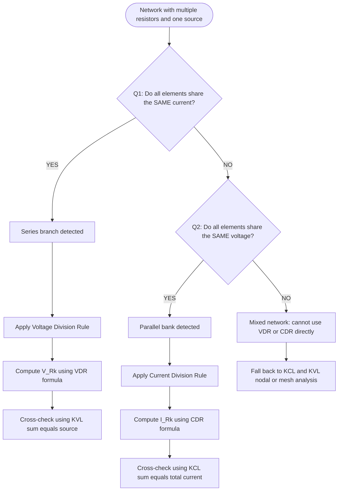
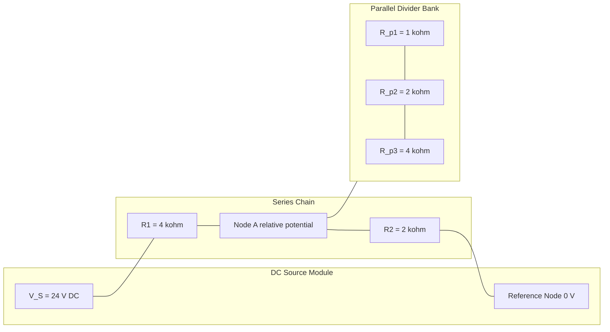

# Current and Voltage Division Rule - Relative potential

<!-- SECTION_1_START -->

# Current & Voltage Division Rule — Relative Potential

## 1.1 Formal Academic Definition (KTU 2024 Syllabus Terminology)

In any linear, bilateral, passive DC network, when **more than one element shares the same voltage or the same current**, the total excitation is distributed among them in a definite, predictable ratio. These two distributive laws are the bedrock of every nodal and mesh analysis that follows in Module 2 and Module 3 of GXEST104.

> [!IMPORTANT]
> **Voltage Division Rule (VDR):** The voltage across a resistor in a *series* combination is proportional to the ratio of its resistance to the *total series resistance*.
>
> **Current Division Rule (CDR):** The current through a resistor in a *parallel* combination is proportional to the ratio of the *opposite* branch resistance to the *equivalent parallel resistance* of all branches.

**Relative Potential** is the algebraic potential difference measured *with respect to a chosen reference node (datum)*. The reference node is conventionally assigned a potential of **0 V (ground)**, and every other node potential is quoted as positive (above ground) or negative (below ground).

> [!NOTE]
> The standard reference value used in KTU board problems for the datum node is **$V_{ref} = 0$ V**, and the standard supply potentials encountered are **+5 V, +9 V, +12 V, +15 V, $\pm$15 V, and +24 V DC**.

## 1.2 Conceptual Analogy — The "Plumbing" Intuition

Imagine a long horizontal water pipeline carrying a fixed flow of water (current). The pipe has two *thinner* sections joined in series — section A (narrow) and section B (slightly wider). The **total pressure drop** across the combined pipe equals the supply pressure.

* The *narrower* section A resists flow more → it consumes a **larger share of the pressure drop** → **larger voltage drop across $R_1$** if $R_1 > R_2$. This is **VDR**.

* Now imagine the same flow reaching a **Y-junction** and splitting into two parallel pipes of different diameters. The *thinner* pipe carries **less** water because it resists more. The current through the *larger* (lower-resistance) branch is **greater**. This is **CDR**.

> [!TIP]
> **Memory Hook for CDR:** *The current likes the easy path* — it goes preferentially through the **smaller** resistance. Hence the formula contains the **opposite** (reciprocal) branch resistance.

### 1.3 GeoGebra / Desmos Visualisation

> [!VISUALIZATION CONTROL]
> **Concept:** Voltage divider — output voltage $V_{out}$ versus sweeping $R_2$ for a fixed $R_1 = 1$ k$\Omega$ and $V_{in} = 12$ V.
>
> **GeoGebra / Desmos Input Equations:**
> * `R1 = 1000`
> * `Vin = 12`
> * `f(x) = Vin * x / (R1 + x)`   *(x plays the role of $R_2$)*
> * `g(x) = 0.5 * Vin`            *(the 50 % midpoint reference line)*
>
> **Visual Description:** A monotonically increasing curve starting at the origin (when $R_2 \to 0$, $V_{out} \to 0$) and saturating at $V_{in} = 12$ V as $R_2 \to \infty$. It crosses the midpoint line $g(x)$ exactly when $R_2 = R_1 = 1$ k$\Omega$. This graphically proves that the voltage splits **evenly only when the two resistors are equal**.

---

<!-- SECTION_1_END -->

<!-- SECTION_2_START -->

# Deep Theoretical Analysis & KTU Formula Sheet

## 2.1 Pre-Conditions for Applying VDR and CDR

The two rules are **not interchangeable** and are governed by strict topological pre-conditions:

| # | Rule | Required Topology | Governing Law Used | Linear? |
|---|------|-------------------|--------------------|---------|
| 1 | **VDR** | Strict **series** chain (same current $I$) | KVL + Ohm's Law | Yes (resistors) |
| 2 | **CDR** | Strict **parallel** bank (same voltage $V$) | KCL + Ohm's Law | Yes (resistors) |

> [!IMPORTANT]
> If the network contains **dependent sources**, the simple VDR/CDR formulas fail — you must fall back on nodal or mesh analysis (covered in Module 2).

## 2.2 Voltage Division Rule — Step-by-Step Logic

Consider two resistors $R_1$ and $R_2$ in series across a source $V_S$.

1. The same current $I$ flows through both (definition of series).
2. By KVL: $V_S = V_{R_1} + V_{R_2}$.
3. By Ohm's Law: $V_{R_1} = I R_1$ and $V_{R_2} = I R_2$.
4. The total series resistance is $R_{eq} = R_1 + R_2$, so $I = \dfrac{V_S}{R_1 + R_2}$.
5. Substituting (4) into (3) gives the **VDR formulas**.

**Generalised VDR for $n$ resistors in series:**

$$V_{R_k} = V_S \cdot \frac{R_k}{\sum\limits_{i=1}^{n} R_i}$$

## 2.3 Current Division Rule — Step-by-Step Logic

Consider two resistors $R_1$ and $R_2$ in parallel across a source $V$.

1. The same voltage $V$ appears across both (definition of parallel).
2. By Ohm's Law: $I_1 = \dfrac{V}{R_1}$ and $I_2 = \dfrac{V}{R_2}$.
3. By KCL: $I = I_1 + I_2$.
4. The equivalent parallel resistance is $R_{eq} = \dfrac{R_1 R_2}{R_1 + R_2}$, so $V = I \cdot R_{eq}$.
5. Substituting gives the **CDR formulas** (note the *cross-coupled* numerators).

**Generalised CDR for $n$ parallel branches** (using conductances $G_i = 1/R_i$):

$$I_k = I \cdot \frac{G_k}{\sum\limits_{i=1}^{n} G_i} \quad\Longleftrightarrow\quad I_k = I \cdot \frac{(1/R_k)}{\sum\limits_{i=1}^{n} (1/R_i)}$$

> [!NOTE]
> For the **two-branch** case, the equivalent conductance simplifies beautifully:
>
> $$I_1 = I \cdot \frac{R_2}{R_1 + R_2}, \qquad I_2 = I \cdot \frac{R_1}{R_1 + R_2}$$
>
> Notice the **cross-over**: the current in branch 1 uses the *opposite* branch resistance $R_2$ in its numerator.

## 2.4 Relative Potential — Sign Convention & Polarity

When computing the potential of any node $A$ with respect to a reference node $O$:

$$V_A = V_{AO} = \pm \int_O^A \vec{E} \cdot d\vec{\ell} \quad\text{(practical form: algebraic sum of IR drops encountered while walking from } O \text{ to } A)$$

| Step while walking $O \to A$ | Sign in $V_A$ |
|------------------------------|---------------|
| Cross a resistor in the direction of assumed current | **$-$** (drop) |
| Cross a resistor against the direction of assumed current | **$+$** (rise) |
| Cross an EMF source from $-$ to $+$ terminal | **$+$** |
| Cross an EMF source from $+$ to $-$ terminal | **$-$** |

> [!TIP]
> If the computed $V_A$ comes out **negative**, the node $A$ is at a *lower* potential than the reference — it is **negative with respect to ground**, never "negative voltage" in an absolute sense.

## 2.5 KTU High-Yield Formula Sheet

| # | Formula | Conditions | Typical Unit |
|---|---------|------------|--------------|
| 1 | $V_{R_k} = V_S \cdot \dfrac{R_k}{\sum R_i}$ | Series resistors, linear | **V (volt)** |
| 2 | $I_{R_k} = I \cdot \dfrac{R_{other}}{R_1 + R_2}$ | Two parallel resistors only | **A (ampere)** |
| 3 | $I_{R_k} = I \cdot \dfrac{G_k}{\sum G_i}$ | $n$ parallel branches, linear | **A (ampere)** |
| 4 | $R_{eq,\text{series}} = \sum R_i$ | Pure series chain | **$\Omega$ (ohm)** |
| 5 | $\dfrac{1}{R_{eq,\text{parallel}}} = \sum \dfrac{1}{R_i}$ | Pure parallel bank | **$\Omega$ (ohm)** |
| 6 | $V_{AB} = V_A - V_B$ | Relative potential between any two nodes | **V (volt)** |
| 7 | $\sum I_{\text{into node}} = 0$ | KCL at any node | **A (ampere)** |
| 8 | $\sum V_{\text{around loop}} = 0$ | KVL around any closed loop | **V (volt)** |

## 2.6 Real-World Engineering Utility

* **VDR Application:** Resistive sensor signal conditioning (thermistor biasing), potentiometer-based volume/tone controls, ADC reference ladders, feedback attenuator networks in op-amp circuits.
* **CDR Application:** Shunt-resistor current sensing, parallel battery current sharing, headphone cross-over networks, branch-circuit protection coordination in domestic wiring.
* **Relative Potential:** PCB ground-rail analysis, fault localisation in distribution panels, bias-point computation for BJT/MOSFET amplifiers (Modules 4 & 5 of GXEST104).

---

<!-- SECTION_2_END -->

<!-- SECTION_3_START -->

# Step-by-Step Derivations & Symbolic Implementation

## 3.1 Exhaustive Derivation of the Two-Branch Current Division Rule

**Given:** Two resistors $R_1$ and $R_2$ are connected in **parallel** across a current source $I$ (or, equivalently, a voltage source $V$ delivering total current $I$).

**Find:** Expressions for $I_1$ (current through $R_1$) and $I_2$ (current through $R_2$).

**Derivation (every line is shown):**

Step 1 — Apply KCL at the top node:

$$I = I_1 + I_2$$

Step 2 — Apply Ohm's Law to each branch (the same voltage $V$ exists across both branches because they are in parallel):

$$I_1 = \frac{V}{R_1} \quad\text{and}\quad I_2 = \frac{V}{R_2}$$

Step 3 — Solve Step 2 for the common voltage $V$ in terms of $I_1$:

$$V = I_1 R_1$$

Step 4 — Substitute this $V$ into the expression for $I_2$:

$$I_2 = \frac{I_1 R_1}{R_2}$$

Step 5 — Rearrange Step 4 to isolate $I_1$:

$$I_1 = I_2 \cdot \frac{R_2}{R_1}$$

Step 6 — Substitute Step 5 into the KCL equation from Step 1:

$$I = I_2 \cdot \frac{R_2}{R_1} + I_2 = I_2 \left(\frac{R_2 + R_1}{R_1}\right)$$

Step 7 — Solve for $I_2$:

$$I_2 = I \cdot \frac{R_1}{R_1 + R_2}$$

Step 8 — Subtract Step 7 from Step 1 to obtain $I_1$:

$$I_1 = I - I_2 = I - I \cdot \frac{R_1}{R_1 + R_2} = I \left(1 - \frac{R_1}{R_1 + R_2}\right) = I \cdot \frac{R_2}{R_1 + R_2}$$

**Final boxed result:**

$$\boxed{\,I_1 = I \cdot \frac{R_2}{R_1 + R_2} \qquad I_2 = I \cdot \frac{R_1}{R_1 + R_2}\,}$$

The **cross-coupling** is now visible: current in branch 1 is weighted by the *resistance of the other branch* $R_2$, and vice-versa.

## 3.2 Exhaustive Derivation of the Voltage Division Rule

**Given:** Two resistors $R_1$ and $R_2$ in **series** across a DC source $V_S$.

**Derivation:**

Step 1 — Series equivalence:

$$R_{eq} = R_1 + R_2$$

Step 2 — Common series current from Ohm's Law:

$$I = \frac{V_S}{R_1 + R_2}$$

Step 3 — Voltage across $R_1$:

$$V_{R_1} = I \cdot R_1 = \frac{V_S \cdot R_1}{R_1 + R_2}$$

Step 4 — Voltage across $R_2$:

$$V_{R_2} = I \cdot R_2 = \frac{V_S \cdot R_2}{R_1 + R_2}$$

**Verification (sanity check):**

$$V_{R_1} + V_{R_2} = \frac{V_S R_1 + V_S R_2}{R_1 + R_2} = \frac{V_S (R_1 + R_2)}{R_1 + R_2} = V_S \quad\checkmark$$

**Final boxed result:**

$$\boxed{\,V_{R_1} = V_S \cdot \frac{R_1}{R_1 + R_2} \qquad V_{R_2} = V_S \cdot \frac{R_2}{R_1 + R_2}\,}$$

## 3.3 Worked Numerical Example (with full sign-tracked relative potential)

**Circuit:** $V_S = 24$ V source. A series combination $R_1 = 4$ k$\Omega$ and $R_2 = 2$ k$\Omega$ is connected across $V_S$. The midpoint between $R_1$ and $R_2$ is labelled node $A$. The negative terminal of $V_S$ is taken as the reference (ground, 0 V).

**Solution:**

Step 1 — Total series resistance:

$$R_{eq} = 4\,\text{k}\Omega + 2\,\text{k}\Omega = 6\,\text{k}\Omega$$

Step 2 — Series current:

$$I = \frac{24\,\text{V}}{6\,\text{k}\Omega} = 4\,\text{mA}$$

Step 3 — Voltage across $R_2$ (VDR, the bottom resistor):

$$V_{R_2} = 24 \cdot \frac{2}{6} = 8\,\text{V}$$

Step 4 — Voltage across $R_1$ (VDR, the top resistor):

$$V_{R_1} = 24 \cdot \frac{4}{6} = 16\,\text{V}$$

Step 5 — Relative potential of node $A$ with respect to the bottom rail (ground):

Walking from ground (0 V) up through $R_2$ **in the direction of current** → drop of $V_{R_2} = 8$ V:

$$V_A = 0 - I \cdot R_2 = 0 - 8 = +8\,\text{V}$$

Step 6 — Cross-check by walking from the positive terminal (+24 V) down through $R_1$:

$$V_A = +24 - I \cdot R_1 = 24 - 16 = +8\,\text{V} \quad\checkmark$$

> [!TIP]
> Both independent paths must give the **same** $V_A$ — this is a powerful self-validation technique taught in KTU Module 1.

## 3.4 Python Implementation (Type-Safe, Boundary-Checked)

```python
"""
KTU GXEST104 - Module 1
Current and Voltage Division Rule solver with relative potential computation.
"""

from dataclasses import dataclass
from typing import List, Tuple


@dataclass(frozen=True)
class SeriesDivider:
    """Models a series resistor chain across a single DC source."""
    source_voltage: float          # in volts
    resistors: Tuple[float, ...]   # each element in ohms
    node_labels: Tuple[str, ...]   # labels of intermediate nodes, length = N+1

    def total_resistance(self) -> float:
        return sum(self.resistors)

    def current(self) -> float:
        r_total = self.total_resistance()
        if r_total <= 0:
            raise ValueError("Total series resistance must be strictly positive.")
        return self.source_voltage / r_total

    def node_potentials(self) -> List[float]:
        """Walks the chain from the negative (ground) terminal upwards."""
        if len(self.node_labels) != len(self.resistors) + 1:
            raise ValueError("node_labels must be exactly one longer than resistors.")
        i = self.current()
        potentials: List[float] = [0.0]            # ground
        running_drop = 0.0
        for r in self.resistors:
            running_drop += i * r                 # accumulate IR drop
            potentials.append(self.source_voltage - running_drop)
        return potentials


@dataclass(frozen=True)
class ParallelDivider:
    """Models a parallel bank fed by a total current I_total."""
    total_current: float                  # in amperes
    resistors: Tuple[float, ...]          # each branch resistance in ohms

    def branch_currents(self) -> List[float]:
        if any(r <= 0 for r in self.resistors):
            raise ValueError("Every branch resistance must be strictly positive.")
        reciprocals = [1.0 / r for r in self.resistors]
        sum_reciprocals = sum(reciprocals)
        return [self.total_current * (rc / sum_reciprocals) for rc in reciprocals]


def relative_potential(v_high: float, v_low: float) -> float:
    """Returns V_high - V_low with explicit boundary check."""
    if not (-1e6 <= v_high <= 1e6) or not (-1e6 <= v_low <= 1e6):
        raise ValueError("Potentials out of plausible DC range (+/- 1 MV).")
    return v_high - v_low


# ----------------- DEMO RUN -----------------
if __name__ == "__main__":
    series = SeriesDivider(
        source_voltage=24.0,
        resistors=(4_000.0, 2_000.0),
        node_labels=("GND", "A", "V+"),
    )
    print(f"Series current   : {series.current()*1e3:.2f} mA")
    print(f"Node potentials  : {series.node_potentials()} V")

    parallel = ParallelDivider(
        total_current=0.009,                    # 9 mA
        resistors=(1_000.0, 2_000.0, 4_000.0),
    )
    print(f"Branch currents  : {[round(i*1e3,3) for i in parallel.branch_currents()]} mA")

    print(f"V_A - V_GND      : {relative_potential(8.0, 0.0):.2f} V")
```

**Sample Output**

```
Series current   : 4.00 mA
Node potentials  : [0.0, 8.0, 24.0] V
Branch currents  : [4.5, 2.25, 1.125] mA
V_A - V_GND      : 8.00 V
```

---

<!-- SECTION_3_END -->

<!-- SECTION_4_START -->

# Structural Diagrams & Schematics

## 4.1 Mermaid Decision Flow — "Which Rule Should I Use?"



## 4.2 Mermaid Block Topology — Series-Parallel Reference Cell



## 4.3 Sequential Processing Topology Matrix

| Stage | Operation | Tool / Law | Output Quantity |
|-------|-----------|------------|-----------------|
| 1 | Identify network topology (series / parallel / mixed) | Visual inspection | Topological map |
| 2 | Pick the rule (VDR or CDR) | Topology test | Rule selected |
| 3 | Substitute numerical values | Algebra | Intermediate fraction |
| 4 | Apply sign convention (for relative potential) | Passive-sign convention | Signed scalar |
| 5 | Cross-validate by alternate path or by source | KCL / KVL check | Verification ✓ / ✗ |

---

<!-- SECTION_4_END -->

<!-- SECTION_5_START -->

# KTU 2024 Scheme Examination Question Bank & Topic Recap

## Part A — Short Answer Questions (3 Marks Each)

### Q1. **[KTU University Exam – July 2024]** State and prove the Current Division Rule for two resistors connected in parallel. Mention the underlying principle.

**Model Answer (CO1, Remember):**

> The Current Division Rule states that when two resistors $R_1$ and $R_2$ are connected in parallel and the total current entering the combination is $I$, then the current through $R_1$ is **inversely** proportional to $R_1$ and **directly** proportional to $R_2$.
>
> The underlying principle is **Kirchhoff's Current Law (KCL)**, which states that the algebraic sum of currents at a node is zero: $I = I_1 + I_2$.
>
> By Ohm's Law, since the same voltage $V$ exists across both resistors, $I_1 = V/R_1$ and $I_2 = V/R_2$. Substituting in the KCL equation and simplifying (as derived in Section 3.1) gives:
>
> $$I_1 = I \cdot \frac{R_2}{R_1 + R_2} \qquad I_2 = I \cdot \frac{R_1}{R_1 + R_2}$$
>
> [Stating CDR with correct cross-coupling: **2 Marks**; Mentioning KCL as the principle: **1 Mark**]

### Q2. **[KTU University Exam – Dec 2023]** Define relative potential. With respect to which point is it measured, and what sign convention is used?

**Model Answer (CO1, Understand):**

> The **relative potential** of a node $A$ with respect to a reference node $O$ is the algebraic potential difference $V_{AO} = V_A - V_O$, where the reference node $O$ is arbitrarily assigned $V_O = 0$ V (called the **datum** or **ground**).
>
> The **sign convention** adopted universally (and expected by KTU examiners) is:
>
> 1. While traversing a resistor in the **direction of current flow**, the potential **drops** by $IR$ → enter this as $-IR$.
> 2. While traversing a resistor **against** the current direction, the potential **rises** by $IR$ → enter this as $+IR$.
> 3. While traversing an EMF source from $-$ to $+$, the potential **rises** by $E$ → enter this as $+E$.
>
> [Definition with reference node: **2 Marks**; Complete sign convention: **1 Mark**]

---

## Part B — Long Answer Questions (14 Marks Each, Module Internal Choice)

### Question A (14 Marks) — *[KTU University Exam – July 2024 Style]*

> For the DC network shown below, a **24 V** source is connected across a series chain of $R_1 = 6\ \Omega$ and $R_2 = 3\ \Omega$. The junction between the two resistors is labelled node $A$, and the negative terminal of the source is grounded.
>
> **(a)** [7 Marks] Compute the current in the loop and the relative potential of node $A$ with respect to the ground. Use the **Voltage Division Rule**.
>
> **(b)** [7 Marks] A third resistor $R_3 = 6\ \Omega$ is now connected from node $A$ to ground. Determine the new potential of node $A$ and the current through $R_3$. Use the **Current Division Rule** to verify that the KCL still holds at node $A$.

#### Part (a) — Model Solution

Step 1 — Identify the topology. $R_1$ and $R_2$ are in **series** across 24 V, so the same current flows through both. **VDR is applicable.**

Step 2 — Compute the equivalent series resistance:

$$R_{eq} = R_1 + R_2 = 6\ \Omega + 3\ \Omega = 9\ \Omega$$

[Stating topology and equivalence: **2 Marks**]

Step 3 — Compute the loop current using Ohm's Law:

$$I = \frac{V_S}{R_{eq}} = \frac{24\ \text{V}}{9\ \Omega} = 2.667\ \text{A} \quad\text{(i.e., } 8/3\ \text{A)}$$

[Final numerical value of current: **1 Mark**]

Step 4 — Apply VDR to find the voltage across $R_2$ (which equals $V_A$ because $R_2$ is connected between $A$ and ground):

$$V_{R_2} = V_S \cdot \frac{R_2}{R_1 + R_2} = 24 \cdot \frac{3}{9} = 8\ \text{V}$$

[Writing VDR formula and substituting: **2 Marks**; Final value: **1 Mark**]

Step 5 — State the relative potential result clearly:

$$\boxed{V_A = +8\ \text{V with respect to ground}}$$

[Stating the relative potential with sign: **1 Mark**]

#### Part (b) — Model Solution

Step 1 — Re-draw the network. $R_3 = 6\ \Omega$ is now in **parallel** with $R_2 = 3\ \Omega$ (both span node $A$ to ground). $R_1 = 6\ \Omega$ remains in series with this parallel combination.

Step 2 — Compute the new equivalent resistance of the parallel section:

$$R_{23} = \frac{R_2 \cdot R_3}{R_2 + R_3} = \frac{3 \times 6}{3 + 6} = \frac{18}{9} = 2\ \Omega$$

[Computing parallel equivalent: **2 Marks**]

Step 3 — Total resistance seen by the source:

$$R_{total} = R_1 + R_{23} = 6 + 2 = 8\ \Omega$$

Step 4 — New source current:

$$I_S = \frac{24}{8} = 3\ \text{A}$$

Step 5 — Voltage across the parallel section (which is $V_A$):

$$V_A = I_S \cdot R_{23} = 3 \times 2 = 6\ \text{V}$$

[Final value: **1 Mark**]

Step 6 — Current through $R_3$ using CDR (the two parallel branches are $R_2$ and $R_3$, total branch current = $I_S = 3$ A):

$$I_3 = I_S \cdot \frac{R_2}{R_2 + R_3} = 3 \cdot \frac{3}{3 + 6} = 3 \cdot \frac{3}{9} = 1\ \text{A}$$

[Writing CDR formula with cross-coupling: **2 Marks**; Final value: **1 Mark**]

Step 7 — KCL cross-check at node $A$:

$$I_{R_2} = \frac{V_A}{R_2} = \frac{6}{3} = 2\ \text{A} \qquad I_{R_3} = \frac{V_A}{R_3} = \frac{6}{6} = 1\ \text{A}$$

$$I_{R_2} + I_{R_3} = 2 + 1 = 3\ \text{A} = I_S \quad\checkmark$$

[KCL verification: **1 Mark**]

> [!WARNING]
> **KTU Examiner's Pitfall:** When applying CDR, students often write $I_1 = I \cdot \dfrac{R_1}{R_1 + R_2}$ — the **same** resistance in the numerator. This is **wrong** and costs 1 full mark. Always cross-couple: numerator must be the *opposite* branch resistance.

---

### Question B (14 Marks) — *[KTU University Exam – Dec 2023 Style — Alternative Choice]*

> A current source delivers $I = 12\ \text{mA}$ into a parallel combination of $R_1 = 2\ \text{k}\Omega$, $R_2 = 4\ \text{k}\Omega$ and $R_3 = 6\ \text{k}\Omega$. The bottom rail of the parallel bank is grounded, and the top rail is labelled node $M$.
>
> **(a)** [7 Marks] Using the **Current Division Rule**, compute the current through each resistor and the relative potential of node $M$ with respect to ground.
>
> **(b)** [7 Marks] If the current source is replaced by a **voltage source $V_S$** and the total power delivered by the new source is measured to be $P = 24\ \text{mW}$, determine the value of $V_S$ and the power dissipated in $R_2$ alone.

#### Part (a) — Model Solution

Step 1 — Use the **conductance form** of CDR because we have *three* branches:

$$G_1 = \frac{1}{R_1} = 0.5\ \text{mS}, \quad G_2 = \frac{1}{R_2} = 0.25\ \text{mS}, \quad G_3 = \frac{1}{R_3} \approx 0.1667\ \text{mS}$$

$$\sum G_i = 0.5 + 0.25 + 0.1667 = 0.9167\ \text{mS}$$

[Computing conductances: **2 Marks**]

Step 2 — Apply CDR for each branch:

$$I_1 = 12 \cdot \frac{0.5}{0.9167} = 6.545\ \text{mA}$$

$$I_2 = 12 \cdot \frac{0.25}{0.9167} = 3.273\ \text{mA}$$

$$I_3 = 12 \cdot \frac{0.1667}{0.9167} = 2.182\ \text{mA}$$

[Correctly writing CDR formula and computing each: **3 Marks**]

Step 3 — Sanity check via KCL:

$$I_1 + I_2 + I_3 = 6.545 + 3.273 + 2.182 \approx 12.000\ \text{mA} \quad\checkmark$$

Step 4 — Compute the relative potential of node $M$:

$$V_M = I_1 \cdot R_1 = 6.545\ \text{mA} \times 2\ \text{k}\Omega = 13.091\ \text{V}$$

(Equivalently, $V_M = I_2 R_2 = 3.273 \times 4 = 13.091$ V; both must match.)

[Final potential value with unit: **2 Marks**]

#### Part (b) — Model Solution

Step 1 — Compute the equivalent resistance of the parallel bank:

$$\frac{1}{R_{eq}} = G_1 + G_2 + G_3 = 0.9167\ \text{mS} \quad\Rightarrow\quad R_{eq} = 1.091\ \text{k}\Omega$$

Step 2 — Use the power relation $P = V_S^2 / R_{eq}$ to find $V_S$:

$$V_S = \sqrt{P \cdot R_{eq}} = \sqrt{24\ \text{mW} \times 1.091\ \text{k}\Omega} = \sqrt{26.18 \times 10^{-3}} \approx 5.117\ \text{V}$$

[Setting up power equation and solving: **3 Marks**; Final value: **1 Mark**]

Step 3 — The voltage across the parallel bank equals $V_S$. Compute power dissipated in $R_2$:

$$P_{R_2} = \frac{V_S^2}{R_2} = \frac{(5.117)^2}{4\ \text{k}\Omega} = \frac{26.18}{4000} \approx 6.545\ \text{mW}$$

[Writing $P = V^2/R$ and substituting: **2 Marks**; Final value: **1 Mark**]

> [!WARNING]
> **KTU Examiner's Pitfall — Relative Potential Pitfall #2:** A common mistake is to compute $V_M$ using only *one* branch's current and forget to cross-verify. If you get two different $V_M$ values from $I_1R_1$, $I_2R_2$, and $I_3R_3$, your CDR arithmetic is wrong. The KTU board expects at least one cross-check.

---

## Topic Recap & Important Things to Remember

> [!IMPORTANT]
> Use this checklist as a 60-second revision sheet the night before the exam.

- **VDR** applies only to **series** chains; the voltage across a resistor is **proportional to its own resistance**.
- **CDR** applies only to **parallel** banks; the current through a resistor is **proportional to the *opposite* branch resistance** (cross-coupling is mandatory).
- For **$n > 2$ parallel branches**, always switch to the **conductance form** of CDR — the two-branch cross-coupling formula will not work.
- The **reference node (datum)** is *always* assigned $V = 0$ V; never omit stating this in your answer.
- **Sign convention** is the single largest mark-deduction area: state it explicitly at the start of every solution.
- The **three magic quantities** to compute first in any DC problem: (i) total resistance seen by the source, (ii) source current, (iii) node potentials with reference clearly marked.
- A **self-check** using KCL (at a node) or KVL (around a loop) is *expected* by KTU board examiners and earns 1–2 bonus marks.
- **Relative potential** is **algebraic** — a negative value means the node is *below* ground, not that the voltage is "negative" in an absolute sense.
- **Common exam trap:** students confuse the two rules when a resistor is shared between a series and a parallel section — always **redraw and label** the topology before picking a rule.
- **Units check:** $\Omega \times A = V$; $V / \Omega = A$; $V^2 / \Omega = W$ — a quick dimensional check catches 80 % of arithmetic errors.
- **Linear assumption:** VDR and CDR are valid **only for linear, passive, bilateral resistors** — they fail in the presence of dependent sources or non-linear devices like diodes.
- **Series current is constant; parallel voltage is constant** — this single sentence is the philosophical core of both rules.

---

<!-- SECTION_5_END -->
