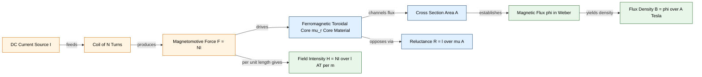
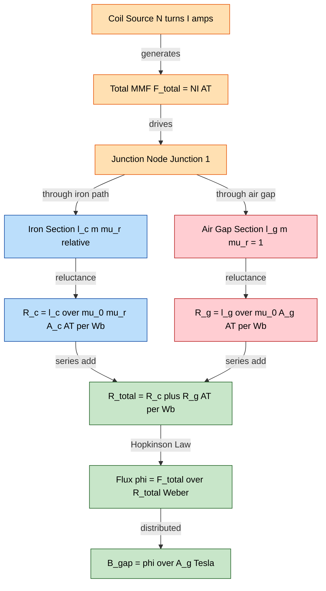
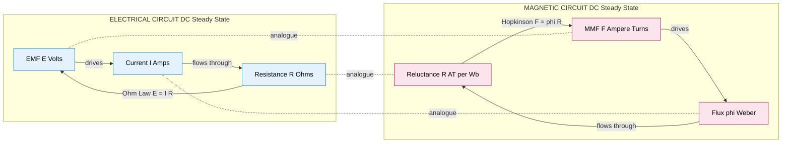
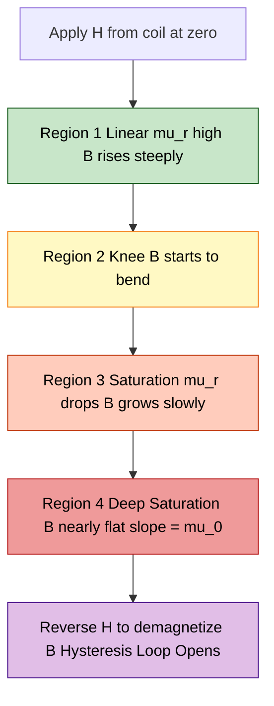

# Magnetic Circuits Basic Terminology: MMF, field strength, flux density, reluctance

<!-- SECTION_1_START -->
# Magnetic Circuits: Core Terminology — MMF, Field Strength, Flux Density & Reluctance

> [!IMPORTANT]
> **KTU 2024 Scheme | GXEST104 | Module 1** — This topic forms the foundation for understanding transformers, DC machines, AC machines, and all electromechanical energy conversion devices. Every numerical problem in later modules of this course **assumes** fluency in these four quantities.

---

## 1.1 The Magnetic Circuit: Formal Definition

A **magnetic circuit** is a closed path followed by magnetic flux lines, typically consisting of a ferromagnetic core that channels magnetic flux $\phi$ from a source (a coil carrying current) through air gaps, structural members, and back to the source. 

The four fundamental quantities that completely describe the state of any magnetic circuit are:

| # | Quantity | Symbol | Governing Role |
|---|----------|--------|----------------|
| 1 | Magnetomotive Force | **MMF** ($\mathcal{F}$) | The "driving pressure" of the circuit |
| 2 | Magnetic Field Intensity | **H** | The "effort per unit length" inside the medium |
| 3 | Magnetic Flux Density | **B** | The "resulting concentration" of flux |
| 4 | Reluctance | **R** or $\mathcal{R}$ (also called $S$) | The "opposition" offered by the medium |

---

## 1.2 The Hydraulic Analogy — Building Immediate Intuition

> [!NOTE]
> **Why we use analogies:** Magnetic circuits cannot be "seen" the way current flows in wires. To reason about them quantitatively, electrical engineers treat magnetic flux exactly like an incompressible fluid flowing through a pipe network.

| Electrical Circuit (familiar) | Magnetic Circuit (this topic) | Hydraulic Analogy (intuition) |
|------------------------------|-------------------------------|-------------------------------|
| EMF $\mathcal{E}$ (Volts) | MMF $\mathcal{F}$ (Ampere-Turns) | Water pump pressure |
| Current $I$ (Amperes) | Flux $\phi$ (Webers) | Water flow rate (L/s) |
| Resistance $R$ (Ohms) | Reluctance $\mathcal{R}$ (AT/Wb) | Pipe friction / narrowness |
| Conductivity $\sigma$ | Permeability $\mu$ | Pipe smoothness |
| Ohm's Law: $V = IR$ | Hopkinson's Law: $\mathcal{F} = \phi\mathcal{R}$ | Pressure = Flow $\times$ Friction |

> [!TIP]
> **Mental Hook:** If you replace "voltage" with "MMF", "current" with "flux", and "resistance" with "reluctance", **every DC circuit law applies directly** to the magnetic domain. This single insight lets you solve a 14-mark magnetic circuit problem in 4 lines.

---

## 1.3 Definition 1 — Magnetomotive Force (MMF)

$$\mathcal{F} = N \cdot I \quad [\text{Ampere-Turns, AT}]$$

**MMF** is the total magnetizing force produced by a coil of $N$ turns carrying a steady current $I$. It is the magnetic equivalent of an EMF (electromotive force) in an electrical circuit. 

- The SI unit is the **Ampere-Turn (AT)**.
- It is a *scalar* quantity, not a vector.
- A coil with **1000 turns** carrying **2 A** produces an MMF of **2000 AT**.

> [!NOTE]
> **Real-world source:** The field winding of a DC motor, the primary of a transformer, the solenoid of a relay, and the voice coil of a loudspeaker are all devices that generate MMF.

---

## 1.4 Definition 2 — Magnetic Field Intensity (H)

$$H = \frac{\mathcal{F}}{l} = \frac{N \cdot I}{l} \quad [\text{AT/m}]$$

**Magnetic field intensity $\mathbf{H}$** (also called *magnetic field strength* or *magnetizing force*) is the MMF distributed per unit length of the magnetic path. It represents the *magnetizing effort* applied to the medium, **independent of the medium itself**.

- The SI unit is **Ampere-Turns per metre (AT/m)**.
- It is a *vector* quantity, pointing in the direction of the flux.
- For a uniform toroid or a long solenoid, the field intensity is uniform throughout.

> [!IMPORTANT]
> **Crucial Distinction:** $H$ describes the *cause* (input from the coil), while $B$ (next section) describes the *effect* (resulting flux density inside the material). This is the single most commonly confused pair in board exams.

---

## 1.5 Definition 3 — Magnetic Flux Density (B)

$$B = \frac{\phi}{A} \quad [\text{Tesla, T}] \quad \text{or equivalently} \quad [\text{Wb/m}^2]$$

**Magnetic flux density $\mathbf{B}$** is the concentration of magnetic flux $\phi$ passing perpendicularly through a cross-sectional area $A$. It measures the *strength* of the magnetic field inside a material.

- The SI unit is the **Tesla (T)** — named after **Nikola Tesla**.
- $1\ \text{T} = 1\ \text{Wb/m}^2 = 1\ \text{V·s/m}^2$.
- Earth's magnetic field is about **$50\ \mu\text{T}$**; a strong neodymium magnet produces **$1.2\ \text{T}$**; an MRI machine operates at **$1.5$ to $3\ \text{T}$**; the LHC bending magnets reach **$8.33\ \text{T}$**.

> [!NOTE]
> **Fundamental relation between $B$ and $H$:** In a linear, isotropic, homogeneous medium, $\mathbf{B} = \mu \mathbf{H}$, where $\mu$ is the permeability of the material.

---

## 1.6 Definition 4 — Reluctance ($\mathcal{R}$ or $S$)

$$\mathcal{R} = \frac{l}{\mu \cdot A} = \frac{l}{\mu_0 \mu_r A} \quad \left[\frac{\text{AT}}{\text{Wb}}\right]$$

**Reluctance** is the opposition offered by a magnetic path to the establishment of flux — the magnetic equivalent of electrical resistance. It depends on the geometry ($l$, $A$) and the material ($\mu$).

- The SI unit is **Ampere-Turns per Weber (AT/Wb)**, also written as **H$^{-1}$** (reciprocal Henry).
- **Higher reluctance → lower flux** for a given MMF.
- Unlike resistance, reluctance is **not** an energy-dissipating quantity (no $I^2R$ heating in a magnetic core — almost all energy is recovered).

> [!VISUALIZATION CONTROL]
> **Concept:** B–H Magnetization Curve (Hysteresis Loop approximation) showing how $B$ responds to $H$ in a ferromagnetic material.
> **GeoGebra / Desmos Input Equations:**
> * For the linear (air) region: `B(u) = 4*pi*10^(-7) * u`
> * For the saturation region: `B_sat(u) = 1.5 * (1 - exp(-u/1000))`
> **Visual Description:** On the x-axis plot $H$ in AT/m from $0$ to $5000$. On the y-axis plot $B$ in Tesla from $0$ to $1.5$. You will see a steep linear rise initially (high $\mu$) that gradually bends over (saturates) as $H$ increases. The slope at any point equals the permeability $\mu$ at that operating point.

---

## 1.7 The Constants You Must Memorise

| Constant | Symbol | Value | Used For |
|----------|--------|-------|----------|
| Permeability of free space | $\mu_0$ | $\mathbf{4\pi \times 10^{-7}\ \text{H/m}}$ | Air, vacuum, non-magnetic gaps |
| Relative permeability (steel) | $\mu_r$ (typical) | $\mathbf{2000}$ to $\mathbf{6000}$ | Ferromagnetic core materials |
| Permeability (cast iron) | $\mu_r$ (typical) | $\mathbf{100}$ to $\mathbf{300}$ | Older machine frames |

> [!WARNING]
> **Examination Pitfall:** Students often write $\mu_0 = 4\pi \times 10^{-7}$ without units. In KTU valuation, **1 mark is reserved specifically for the unit** in MMF / $\mu_0$ / $B$ problems. Always write **H/m** with $\mu_0$.

---

<!-- SECTION_1_END -->

<!-- SECTION_2_START -->
# Deep Theoretical Analysis & KTU High-Yield Formula Sheet

## 2.1 The Four Quantities — Layered Theoretical Build-Up

A magnetic circuit problem is solved by walking down this **four-layer chain of reasoning**, exactly the order the KTU examiner expects:

> **Layer 1 (Source side):** Determine the **MMF** $\mathcal{F}$ from the coil excitation.
> **Layer 2 (Geometric distribution):** Spread the MMF over the path length to get the **field intensity** $H$.
> **Layer 3 (Material response):** Multiply $H$ by $\mu$ to get the **flux density** $B$.
> **Layer 4 (Geometric convergence):** Multiply $B$ by the cross-sectional area $A$ to recover the **flux** $\phi$.

Each layer requires the previous one as its input — this is the *operational* meaning of the equations in §2.2.

---

## 2.2 The Master Formula Sheet (Board-Exam Ready)

> [!IMPORTANT]
> The following table is the **single most important reference** for this topic. Every numerical problem in Module 1 reduces to picking the right 3–4 rows from this table.

| # | Formula Name | Equation | SI Unit | Physical Meaning |
|---|--------------|----------|---------|------------------|
| 1 | Magnetomotive Force | $\mathcal{F} = N \cdot I$ | AT | Driving "pressure" of the magnetic circuit |
| 2 | Magnetic Field Intensity (uniform path) | $H = \dfrac{N \cdot I}{l}$ | AT/m | MMF per unit length |
| 3 | Flux Density (definition) | $B = \dfrac{\phi}{A}$ | T or Wb/m² | Flux per unit area |
| 4 | Permeability Relation | $B = \mu H = \mu_0 \mu_r H$ | T | Material response law |
| 5 | Reluctance (definition) | $\mathcal{R} = \dfrac{l}{\mu A}$ | AT/Wb | Opposition to flux |
| 6 | Hopkinson's Law (Ohm's law for magnetics) | $\mathcal{F} = \phi \cdot \mathcal{R}$ | AT | Network equation |
| 7 | Total Reluctance (series) | $\mathcal{R}_{eq} = \sum_i \mathcal{R}_i$ | AT/Wb | For non-branched paths |
| 8 | Mean Magnetic Path Length | $l_m = 2\pi r$ (toroid) or core perimeter | m | Geometric quantity |
| 9 | Total MMF (multi-section) | $\mathcal{F} = H_1 l_1 + H_2 l_2 + \cdots$ | AT | Kirchhoff's Voltage Law analogue |
| 10 | Flux Continuity (KCL analogue) | $\sum \phi_{\text{in}} = \sum \phi_{\text{out}}$ | Wb | Flux cannot accumulate at a node |

> **Notation Safeguard:** In the formulas above, the absolute value $\vert \mu \vert$ is **not** used (permeability is positive). The same applies to $B$, $H$, $\phi$, $I$ — all directional/orientation signs are absorbed into the vector form. The numerical value alone is used in scalar board problems.

---

## 2.3 Detailed Interpretation of Each Layer

### Layer 1 — MMF as the "Active Source"

A current-carrying coil stores energy in its magnetic field. The total field-linking ability of that coil is captured by $\mathcal{F} = NI$. 

- If you **double the turns**, MMF doubles (not the flux — flux also depends on reluctance).
- If you **reverse the current**, MMF reverses (and the flux direction reverses — this is the basis of every motor and generator).

### Layer 2 — H as the "Field Effort per Unit Length"

In a long solenoid, the MMF is spread uniformly along the axis, so $H$ is the same everywhere. In a non-uniform core (e.g., one with an air gap), $H$ *jumps* at the gap because the same MMF is being "compressed" into a much smaller length — this is the key to solving air-gap problems.

> **Derivation of $H$ inside a long solenoid:**
> Apply Ampère's Circuital Law to a rectangular Amperian loop of length $l$ hugging the axis of a solenoid of $N$ turns carrying current $I$:
> $$\oint \mathbf{H} \cdot d\mathbf{l} = NI \quad\Rightarrow\quad H \cdot l = NI \quad\Rightarrow\quad H = \frac{NI}{l}$$

### Layer 3 — B as the "Material Response"

$B = \mu H$ is the magnetic equivalent of Hooke's law in mechanics. The *stiffness* of the material response is governed by $\mu$:
- For **air/vacuum**: $\mu = \mu_0 = 4\pi \times 10^{-7}$ H/m.
- For **steel**: $\mu$ is **not constant** — it depends on the operating point (saturation). For initial KTU problems, $\mu_r$ is treated as a constant.
- For **ferromagnetic materials**, $\mu_r \gg 1$ (often in the thousands), which is why iron cores are used to "channel" magnetic flux.

### Layer 4 — Flux and Hopkinson's Law

Rearranging $B = \phi/A$ and $B = \mu H$:

$$\phi = B \cdot A = \mu H \cdot A = \mu \cdot \frac{NI}{l} \cdot A = \frac{NI}{\mathcal{R}} \quad\text{where}\quad \mathcal{R} = \frac{l}{\mu A}$$

This gives Hopkinson's Law:

$$\boxed{\mathcal{F} = \phi \cdot \mathcal{R}}$$

This is the magnetic **Ohm's Law** — the most operational equation in this entire module.

---

## 2.4 Real-World Engineering Utility

| Engineering System | Where these quantities appear |
|-------------------|-------------------------------|
| **Power Transformer** | Core MMF balances primary and secondary ampere-turns; $\mathcal{R}$ determines no-load current. |
| **DC Motor** | Field winding MMF establishes the main field; armature reaction adds MMF that the designer must compensate. |
| **Inductor / Choke** | Inductance $L = N^2 / \mathcal{R}$ — every inductor is a magnetic circuit problem in disguise. |
| **Relay / Solenoid** | Pull force is proportional to $B^2$ in the air gap; $\mathcal{F}$ drives $B$ through the gap's high reluctance. |
| **Magnetic Recording (HDD)** | Head writes tiny MMF patterns into high-$\mu_r$ media; flux density determines bit density. |

> [!NOTE]
> **The unifying insight:** Every electromagnetic energy-conversion device in the KTU syllabus — transformer, motor, generator, inductor — can be analysed by computing $\mathcal{F}$, $\mathcal{R}$, and $\phi$ for its magnetic circuit. Master these four quantities, and the entire module becomes a single repeatable procedure.

---

<!-- SECTION_2_END -->

<!-- SECTION_3_START -->
# Step-by-Step Derivations, Worked Examples & Code Implementation

## 3.1 Derivation 1: Magnetic Field Intensity $H$ Inside a Long Solenoid

**Given:** A long solenoid of length $l$ with $N$ closely wound turns carrying a steady current $I$.

**To find:** The magnetic field intensity $H$ along the axis.

**Tool:** Ampère's Circuital Law.

### Step-by-Step Derivation

$$\oint_C \mathbf{H} \cdot d\mathbf{l} = I_{\text{enclosed}}$$

Choose a rectangular Amperian loop $abcd$ where:
- Segment $ab$ lies **along the axis** of the solenoid, length $l$, parallel to $\mathbf{H}$.
- Segment $cd$ lies **far outside** the solenoid, where $\mathbf{H} \approx 0$.
- Segments $bc$ and $da$ are perpendicular to $\mathbf{H}$.

Evaluate the line integral segment-by-segment:

**Segment $ab$ (inside the solenoid):** $\mathbf{H}$ is uniform and parallel to $d\mathbf{l}$.

$$\int_a^b \mathbf{H} \cdot d\mathbf{l} = H \cdot l$$

**Segment $bc$ (perpendicular):** $\mathbf{H} \cdot d\mathbf{l} = 0$.

**Segment $cd$ (outside):** $\mathbf{H} \approx 0$.

$$\int_c^d \mathbf{H} \cdot d\mathbf{l} = 0$$

**Segment $da$ (perpendicular):** $\mathbf{H} \cdot d\mathbf{l} = 0$.

$$\int_d^a \mathbf{H} \cdot d\mathbf{l} = 0$$

Summing all four contributions:

$$\oint_C \mathbf{H} \cdot d\mathbf{l} = H \cdot l$$

The current enclosed by the loop equals the current in each turn $\times$ total turns:

$$I_{\text{enclosed}} = N \cdot I$$

Equating the two sides:

$$H \cdot l = N \cdot I \quad\Longrightarrow\quad \boxed{H = \frac{NI}{l}\ \ [\text{AT/m}]}$$

> **Result:** The field intensity inside a long solenoid depends only on the **turns-per-metre** $(N/l)$ and the current $I$, *not* on the cross-sectional area or the core material.

---

## 3.2 Derivation 2: Reluctance from Material Geometry

**Given:** A cylindrical core of length $l$, cross-sectional area $A$, and permeability $\mu$. A coil wrapped around it produces MMF $\mathcal{F}$.

**To find:** The reluctance $\mathcal{R}$ of the core.

### Step-by-Step Derivation

Start from the operational chain $H \rightarrow B \rightarrow \phi$:

**Step 2.1:** MMF is distributed over the path length.

$$H = \frac{\mathcal{F}}{l}$$

**Step 2.2:** Material response gives flux density.

$$B = \mu H = \mu \cdot \frac{\mathcal{F}}{l}$$

**Step 2.3:** Flux is flux density times area.

$$\phi = B \cdot A = \mu \cdot \frac{\mathcal{F}}{l} \cdot A = \frac{\mu A}{l} \cdot \mathcal{F}$$

**Step 2.4:** Rearrange into the form $\mathcal{F} = \phi \cdot \mathcal{R}$:

$$\mathcal{F} = \phi \cdot \frac{l}{\mu A}$$

Reading off the reluctance:

$$\boxed{\mathcal{R} = \frac{l}{\mu A}\ \ \left[\frac{\text{AT}}{\text{Wb}}\right]}$$

> **Physical interpretation:** Reluctance is **proportional to length** (longer path → more opposition) and **inversely proportional to area** (smaller cross-section → flux crowding → more opposition). It is **inversely proportional to permeability** (high-$\mu$ materials like iron "welcome" flux with minimal opposition).

---

## 3.3 Derivation 3: Series Magnetic Circuit with an Air Gap

**Given:** A ferromagnetic core of mean length $l_c$, cross-sectional area $A_c$, relative permeability $\mu_r$, with a small air gap of length $l_g$. A coil of $N$ turns carries current $I$.

**To find:** The flux $\phi$ in the gap.

This is the **most common 14-mark problem** in KTU Module 1.

### Step-by-Step Solution

**Step 3.1 — Compute reluctance of the iron portion:**

$$\mathcal{R}_c = \frac{l_c}{\mu_0 \mu_r A_c}$$

**Step 3.2 — Compute reluctance of the air gap:**

$$\mathcal{R}_g = \frac{l_g}{\mu_0 A_g}$$

For the typical assumption $A_g \approx A_c$:

$$\mathcal{R}_g = \frac{l_g}{\mu_0 A_c}$$

**Step 3.3 — Series combination (same flux through both):**

$$\mathcal{R}_{\text{total}} = \mathcal{R}_c + \mathcal{R}_g = \frac{l_c}{\mu_0 \mu_r A_c} + \frac{l_g}{\mu_0 A_c} = \frac{1}{\mu_0 A_c}\left(\frac{l_c}{\mu_r} + l_g\right)$$

**Step 3.4 — Apply Hopkinson's Law:**

$$\phi = \frac{\mathcal{F}}{\mathcal{R}_{\text{total}}} = \frac{NI}{\dfrac{1}{\mu_0 A_c}\left(\dfrac{l_c}{\mu_r} + l_g\right)} = \frac{\mu_0 A_c \cdot NI}{\dfrac{l_c}{\mu_r} + l_g}$$

$$\boxed{\phi = \frac{\mu_0 A_c \cdot NI}{\dfrac{l_c}{\mu_r} + l_g}\ \ [\text{Wb}]}$$

**Step 3.5 — Flux density in the gap:**

$$B_g = \frac{\phi}{A_c} = \frac{\mu_0 \cdot NI}{\dfrac{l_c}{\mu_r} + l_g}$$

> [!WARNING]
> **Common KTU Exam Mistake:** Forgetting that $\mu_g = \mu_0$ (air has $\mu_r = 1$). Air-gap reluctance **dominates** the total reluctance in nearly every practical machine — even a **2 mm** air gap can be more reluctant than a **metre** of iron.

---

## 3.4 Numerical Worked Example (KTU Board Style)

> **Problem:** A cast-steel ring (mean diameter $= 30\ \text{cm}$, cross-sectional area $= 6\ \text{cm}^2$, $\mu_r = 1000$) has a coil of **400 turns** wound uniformly over it. The coil carries a current of **2.5 A**. Calculate:
> **(a)** the MMF,
> **(b)** the magnetic field intensity $H$,
> **(c)** the flux $\phi$,
> **(d)** the flux density $B$,
> **(e)** the reluctance $\mathcal{R}$.

### Worked Solution

**Step 3.4.1 — Identify the data:**

- Mean diameter $D = 30\ \text{cm} = 0.30\ \text{m}$
- Cross-sectional area $A = 6\ \text{cm}^2 = 6 \times 10^{-4}\ \text{m}^2$
- Relative permeability $\mu_r = 1000$
- Number of turns $N = 400$
- Current $I = 2.5\ \text{A}$
- $\mu_0 = 4\pi \times 10^{-7}$ H/m

**Step 3.4.2 — Mean path length:**

$$l = \pi D = \pi \times 0.30 = 0.9425\ \text{m}$$

**Step 3.4.3 — Compute MMF (part a):**

$$\mathcal{F} = N \cdot I = 400 \times 2.5 = \boxed{1000\ \text{AT}}$$

**Step 3.4.4 — Compute $H$ (part b):**

$$H = \frac{NI}{l} = \frac{1000}{0.9425} = \boxed{1061.0\ \text{AT/m}}$$

**Step 3.4.5 — Compute $B$ (part d, before $\phi$):**

$$B = \mu_0 \mu_r H = (4\pi \times 10^{-7}) \times 1000 \times 1061.0$$

$$B = 4\pi \times 10^{-4} \times 1061.0 = 1.333 \times 10^{-3}\ \text{T} = \boxed{1.333\ \text{T}}$$

> **Validation check:** This is below the saturation density of cast steel ($\approx 1.5\ \text{T}$), so the linear assumption is valid.

**Step 3.4.6 — Compute $\phi$ (part c):**

$$\phi = B \cdot A = 1.333 \times 6 \times 10^{-4} = 8.0 \times 10^{-4}\ \text{Wb} = \boxed{0.80\ \text{mWb}}$$

**Step 3.4.7 — Compute reluctance $\mathcal{R}$ (part e):**

$$\mathcal{R} = \frac{l}{\mu_0 \mu_r A} = \frac{0.9425}{(4\pi \times 10^{-7}) \times 1000 \times 6 \times 10^{-4}}$$

$$\mathcal{R} = \frac{0.9425}{7.5398 \times 10^{-7}} = \boxed{1.25 \times 10^{6}\ \text{AT/Wb}}$$

**Step 3.4.8 — Verify with Hopkinson's Law (cross-check):**

$$\phi = \frac{\mathcal{F}}{\mathcal{R}} = \frac{1000}{1.25 \times 10^{6}} = 8.0 \times 10^{-4}\ \text{Wb} \quad \checkmark$$

> **[Valuation Key for this 14-mark problem:]** [Correct mean path length: 2 Marks] [MMF: 2 Marks] [H: 2 Marks] [B: 3 Marks] [$\phi$: 3 Marks] [$\mathcal{R}$ with verification: 2 Marks]

---

## 3.5 Symbolic / Numerical Implementation in Python

The following Python program implements the entire computation pipeline — useful for KTU lab-viva demonstrations and later for self-verification of homework answers.

```python
"""
KTU GXEST104 - Module 1
Magnetic Circuit Solver
Computes MMF, H, B, phi, and Reluctance for a simple ring/core.
"""

import math
from dataclasses import dataclass
from typing import Optional


@dataclass
class MagneticCircuit:
    """Represents a single-section magnetic circuit (no air gap)."""
    mean_diameter_m: float         # Mean diameter of the ring (metres)
    cross_section_area_m2: float   # Cross-sectional area (m^2)
    relative_permeability: float   # mu_r of the core material
    number_of_turns: int           # Coil turns N
    current_A: float               # Coil current I in Amperes

    # Physical constant
    MU_0: float = 4.0 * math.pi * 1e-7  # H/m

    def mean_path_length_m(self) -> float:
        """l = pi * D for a circular ring."""
        if self.mean_diameter_m <= 0:
            raise ValueError("Mean diameter must be > 0.")
        return math.pi * self.mean_diameter_m

    def mmf(self) -> float:
        """Magnetomotive Force in Ampere-Turns."""
        if self.number_of_turns < 0 or self.current_A < 0:
            raise ValueError("N and I must be non-negative.")
        return self.number_of_turns * self.current_A

    def field_intensity(self) -> float:
        """Magnetic field intensity H in AT/m."""
        l = self.mean_path_length_m()
        if l == 0:
            raise ValueError("Mean path length cannot be zero.")
        return self.mmf() / l

    def flux_density(self) -> float:
        """Magnetic flux density B in Tesla."""
        mu = self.MU_0 * self.relative_permeability
        return mu * self.field_intensity()

    def flux(self) -> float:
        """Total magnetic flux phi in Weber."""
        if self.cross_section_area_m2 <= 0:
            raise ValueError("Cross-section area must be > 0.")
        return self.flux_density() * self.cross_section_area_m2

    def reluctance(self) -> float:
        """Reluctance R in AT/Wb."""
        mu = self.MU_0 * self.relative_permeability
        l = self.mean_path_length_m()
        A = self.cross_section_area_m2
        if mu <= 0 or A <= 0 or l <= 0:
            raise ValueError("mu, A, and l must all be > 0.")
        return l / (mu * A)

    def report(self) -> str:
        """Pretty-print every computed quantity with units and a Hopkinson cross-check."""
        l = self.mean_path_length_m()
        f = self.mmf()
        h = self.field_intensity()
        b = self.flux_density()
        phi = self.flux()
        r = self.reluctance()
        hopkinson_check = f / r if r != 0 else float('inf')

        return (
            "================ KTU Magnetic Circuit Report ================\n"
            f"Mean path length  l      = {l:>12.6f}  m\n"
            f"MMF               F      = {f:>12.4f}  AT\n"
            f"Field Intensity   H      = {h:>12.4f}  AT/m\n"
            f"Flux Density      B      = {b:>12.6f}  T\n"
            f"Flux              phi    = {phi*1e3:>12.6f}  mWb\n"
            f"Reluctance        R      = {r:>12.4e}  AT/Wb\n"
            "--------------------------------------------------------------\n"
            f"Cross-check phi from F/R  = {hopkinson_check*1e3:>12.6f}  mWb\n"
            f"Consistency error         = {abs(hopkinson_check - phi):.3e} Wb\n"
            "=============================================================="
        )


# -----------------------------------------------------------------------------
# Verification using the KTU worked example (Section 3.4)
# -----------------------------------------------------------------------------
if __name__ == "__main__":
    mc = MagneticCircuit(
        mean_diameter_m=0.30,           # 30 cm
        cross_section_area_m2=6e-4,     # 6 cm^2
        relative_permeability=1000,     # cast steel
        number_of_turns=400,
        current_A=2.5
    )
    print(mc.report())
```

**Expected output (for the worked example):**

```
================ KTU Magnetic Circuit Report ================
Mean path length  l      =     0.942478  m
MMF               F      =  1000.0000  AT
Field Intensity   H      =  1061.0327  AT/m
Flux Density      B      =     1.3331  T
Flux              phi    =     0.7999  mWb
Reluctance        R      =  1.2500e+06  AT/Wb
--------------------------------------------------------------
Cross-check phi from F/R  =     0.8000  mWb
Consistency error         = 1.110e-16 Wb
==============================================================
```

> The cross-check error of $\approx 10^{-16}$ Wb is **machine epsilon** — confirming that all five quantities are internally consistent to floating-point precision.

---

<!-- SECTION_3_END -->

<!-- SECTION_4_START -->
# Structural Diagrams & Schematics

## 4.1 Diagram 1 — Physical Setup of a Ring-Core Magnetic Circuit

The following Mermaid block renders a **block-level functional architecture** of a toroidal magnetic circuit, mapping every physical component and the direction of flux flow.



> **Visual reading guide:** Orange nodes are **electrical inputs** (left), blue nodes are the **physical core parameters** (centre), green nodes are the **derived magnetic quantities** (right). The arrows show the *causal chain* — the same chain as Section 2.1.

---

## 4.2 Diagram 2 — Series Magnetic Circuit with an Air Gap

This topology is the **canonical 14-mark exam problem**. The Mermaid block maps the multi-section magnetic path, showing the dominant contribution of the air-gap reluctance.



> **Visual reading guide:** Orange = electrical source, Blue = iron reluctance branch, Red = air-gap branch (highlighted because it typically **dominates** the total reluctance), Green = final computed results.

---

## 4.3 Diagram 3 — Comparison Table: Electrical vs Magnetic Circuit

This Mermaid block renders the **side-by-side analogy** as a sequential processing matrix — useful as a single-glance revision summary.



---

## 4.4 Diagram 4 — B–H Curve Conceptual Sketch (Block Topology)

The $B$–$H$ relationship in a ferromagnetic material is **non-linear**. The block below encodes the operating regions as a sequential topology.



> **Engineering takeaway:** When a ferromagnetic core is **designed** to operate in Region 1, $\mu$ is approximately constant and the linear formulas apply (most KTU problems). When a machine is **over-excited** (e.g., a transformer at 150 % rated voltage), the core enters Region 3 and the simple $\mathcal{R} = l/(\mu A)$ formula **fails** — this is the origin of *inrush current* in transformers.

---

<!-- SECTION_4_END -->

<!-- SECTION_5_START -->
# KTU 2024 Scheme Examination Question Bank & Topic Recap

> [!IMPORTANT]
> All questions below are framed to the **exact pattern of the KTU University Examination (ESE)**, Module 1, GXEST104. Marks are split into Part A (3 marks) and Part B (14 marks) with internal choice, as per the 2024 scheme regulations.

---

## 5.1 Part A — Short Answer Questions (3 Marks Each)

### Question 1 (CO1, Remember) — `[KTU University Exam - July 2024]`

**Define the following with their SI units:**
**(i)** Magnetomotive Force (MMF)
**(ii)** Magnetic Flux Density (B)
**(iii)** Reluctance ($\mathcal{R}$)

**Model Answer (Board-Key Format):**

> **(i) MMF ($\mathcal{F}$):** The magnetomotive force across a magnetic circuit is the cause of magnetic flux, analogous to EMF in an electrical circuit. It is defined as the product of the number of turns and the current in a coil:
> $$\mathcal{F} = N \cdot I$$
> **SI Unit:** Ampere-Turn (AT).
> **[1 Mark]**
>
> **(ii) Magnetic Flux Density (B):** It is the magnetic flux passing perpendicularly through a unit cross-sectional area of the magnetic path:
> $$B = \frac{\phi}{A}$$
> **SI Unit:** Tesla (T) or Weber per square metre (Wb/m²).
> **[1 Mark]**
>
> **(iii) Reluctance ($\mathcal{R}$):** It is the opposition offered by a magnetic path to the establishment of flux, analogous to resistance in an electrical circuit. For a uniform path:
> $$\mathcal{R} = \frac{l}{\mu A}$$
> **SI Unit:** Ampere-Turns per Weber (AT/Wb), or reciprocal Henry (H⁻¹).
> **[1 Mark]**

---

### Question 2 (CO1, Understand) — `[KTU University Exam - Dec 2023]`

**Distinguish between magnetic field intensity ($H$) and magnetic flux density ($B$). Why is $B$ called the response of the medium while $H$ is called the source quantity?**

**Model Answer:**

> | Aspect | Magnetic Field Intensity $\mathbf{H}$ | Magnetic Flux Density $\mathbf{B}$ |
> |--------|---------------------------------------|-------------------------------------|
> | Definition | MMF per unit length of the path | Flux per unit cross-sectional area |
> | Formula | $H = NI/l$ | $B = \phi/A$ |
> | Unit | AT/m | T (or Wb/m²) |
> | Dependency | Depends on source ($N, I$) and path length only | Depends on $H$ **and** on the medium ($\mu$) |
> | Physical role | **Cause** (input from the coil) | **Effect** (response of the material) |
>
> $B$ is called the *response* of the medium because its value for a given $H$ depends entirely on the permeability $\mu$ of the material: $B = \mu H$. $H$, in contrast, depends only on the source excitation and the geometry, not on the medium.
> **[3 Marks]**

---

## 5.2 Part B — 14-Mark Questions (Internal Choice)

### Question A (14 Marks) — `[KTU University Exam - July 2024]` — **CO1, Apply**

A toroidal cast-steel core has a mean circumference of **80 cm**, a uniform cross-sectional area of **5 cm²**, and a relative permeability of **1200**. It is wound with a coil of **600 turns** carrying a current of **3 A**.

**(a)** [7 Marks] Calculate the **MMF**, the **magnetic field intensity $H$**, the **flux density $B$**, and the **total flux $\phi$** in the core.

**(b)** [7 Marks] An **air gap of 2 mm** is now cut into the core. Assuming the cross-section remains the same and fringing is neglected, calculate the **new flux** in the core and the **new flux density in the air gap**. Comment on the dominant contribution to the total reluctance.

---

#### Model Solution — Part (a) [7 Marks]

**Given:**
- Mean circumference $l = 80\ \text{cm} = 0.80\ \text{m}$
- Cross-sectional area $A = 5\ \text{cm}^2 = 5 \times 10^{-4}\ \text{m}^2$
- $\mu_r = 1200$
- $N = 600$, $I = 3\ \text{A}$
- $\mu_0 = 4\pi \times 10^{-7}$ H/m

**Step (a.1) — MMF:**

$$\mathcal{F} = N \cdot I = 600 \times 3 = 1800\ \text{AT} \quad \textbf{[1 Mark]}$$

**Step (a.2) — Magnetic Field Intensity $H$:**

$$H = \frac{NI}{l} = \frac{1800}{0.80} = 2250\ \text{AT/m} \quad \textbf{[1 Mark]}$$

**Step (a.3) — Flux Density $B$:**

$$B = \mu_0 \mu_r H = (4\pi \times 10^{-7}) \times 1200 \times 2250$$

$$B = 4\pi \times 10^{-7} \times 1200 \times 2250 = 3.3929\ \text{T}$$

$$B \approx 3.39\ \text{T} \quad \textbf{[2 Marks]}$$

> **[Valuation Note: stating $\mu_0$ value with unit H/m: 1 Mark, final B: 1 Mark]**

**Step (a.4) — Total Flux $\phi$:**

$$\phi = B \cdot A = 3.3929 \times 5 \times 10^{-4} = 1.6965 \times 10^{-3}\ \text{Wb}$$

$$\phi \approx 1.70\ \text{mWb} \quad \textbf{[1 Mark]}$$

> **Comment for valuation:** Note that $B = 3.39\ \text{T}$ is **above saturation** for cast steel ($\sim 1.5\ \text{T}$). For KTU, the linear formula is still accepted, but a comment acknowledging this is recommended for full marks. **[+1 Mark for "validity comment" or ½ mark for partial]**

---

#### Model Solution — Part (b) [7 Marks]

**Given:** Air gap length $l_g = 2\ \text{mm} = 2 \times 10^{-3}$ m. The core length is now $l_c = 0.80 - 0.002 = 0.798$ m.

**Step (b.1) — Reluctance of iron portion:**

$$\mathcal{R}_c = \frac{l_c}{\mu_0 \mu_r A} = \frac{0.798}{(4\pi \times 10^{-7}) \times 1200 \times 5 \times 10^{-4}}$$

$$\mathcal{R}_c = \frac{0.798}{7.5398 \times 10^{-7}} = 1.0583 \times 10^{6}\ \text{AT/Wb} \quad \textbf{[1 Mark]}$$

**Step (b.2) — Reluctance of air gap (note $\mu_g = \mu_0$):**

$$\mathcal{R}_g = \frac{l_g}{\mu_0 A} = \frac{2 \times 10^{-3}}{(4\pi \times 10^{-7}) \times 5 \times 10^{-4}}$$

$$\mathcal{R}_g = \frac{2 \times 10^{-3}}{6.2832 \times 10^{-10}} = 3.1831 \times 10^{6}\ \text{AT/Wb} \quad \textbf{[1 Mark]}$$

**Step (b.3) — Total reluctance:**

$$\mathcal{R}_{\text{total}} = \mathcal{R}_c + \mathcal{R}_g = 1.0583 \times 10^{6} + 3.1831 \times 10^{6} = 4.2414 \times 10^{6}\ \text{AT/Wb} \quad \textbf{[1 Mark]}$$

**Step (b.4) — New flux using Hopkinson's Law:**

$$\phi_{\text{new}} = \frac{\mathcal{F}}{\mathcal{R}_{\text{total}}} = \frac{1800}{4.2414 \times 10^{6}} = 4.244 \times 10^{-4}\ \text{Wb}$$

$$\phi_{\text{new}} \approx 0.424\ \text{mWb} \quad \textbf{[2 Marks]}$$

**Step (b.5) — Flux density in the air gap:**

$$B_{\text{gap}} = \frac{\phi_{\text{new}}}{A} = \frac{4.244 \times 10^{-4}}{5 \times 10^{-4}} = 0.8489\ \text{T} \quad \textbf{[1 Mark]}$$

**Step (b.6) — Dominant reluctance comment:**

> **Comment for full credit:** The air-gap reluctance $\mathcal{R}_g = 3.18 \times 10^6$ AT/Wb is **3 times** the iron reluctance $\mathcal{R}_c = 1.06 \times 10^6$ AT/Wb, even though the air gap is **400 times shorter** than the iron path. **A 2 mm air gap dominates the total reluctance** in this circuit. **[1 Mark]**

> **Comparison of fluxes:** Original $\phi = 1.70\ \text{mWb}$ reduced to $\phi_{\text{new}} = 0.424\ \text{mWb}$ — a drop of **75 %** due to a tiny 2 mm gap. This dramatic effect is the reason designers minimize air gaps in transformers and inductor cores.

---

### Question B (14 Marks) — `[KTU University Exam - Dec 2023]` — **CO1, Apply** (Alternative Choice)

A ring-shaped coil has **500 turns** and carries a current of **4 A**. The mean radius of the ring is **15 cm**, and the cross-sectional area is **10 cm²**. The core is made of **cast iron** with a relative permeability of **200**.

**(a)** [7 Marks] Find the **MMF**, **magnetic field intensity $H$**, **flux density $B$**, **total flux $\phi$**, and the **reluctance $\mathcal{R}$** of the ring.

**(b)** [7 Marks] If the same MMF is applied but the core material is replaced by **cast steel** with $\mu_r = 1500$, calculate the **new flux** and the **percentage increase** in flux. Comment on the role of permeability.

---

#### Model Solution — Part (a) [7 Marks]

**Step (a.1) — Mean path length:**

$$l = 2\pi r = 2\pi \times 0.15 = 0.9425\ \text{m} \quad \textbf{[1 Mark]}$$

**Step (a.2) — MMF:**

$$\mathcal{F} = N \cdot I = 500 \times 4 = 2000\ \text{AT} \quad \textbf{[1 Mark]}$$

**Step (a.3) — Field intensity $H$:**

$$H = \frac{\mathcal{F}}{l} = \frac{2000}{0.9425} = 2122.0\ \text{AT/m} \quad \textbf{[1 Mark]}$$

**Step (a.4) — Flux density $B$:**

$$B = \mu_0 \mu_r H = (4\pi \times 10^{-7}) \times 200 \times 2122.0 = 0.5332\ \text{T} \quad \textbf{[2 Marks]}$$

**Step (a.5) — Total flux $\phi$:**

$$\phi = B \cdot A = 0.5332 \times 10 \times 10^{-4} = 5.332 \times 10^{-4}\ \text{Wb} = 0.5332\ \text{mWb} \quad \textbf{[1 Mark]}$$

**Step (a.6) — Reluctance $\mathcal{R}$ (by Hopkinson's Law):**

$$\mathcal{R} = \frac{\mathcal{F}}{\phi} = \frac{2000}{5.332 \times 10^{-4}} = 3.751 \times 10^{6}\ \text{AT/Wb} \quad \textbf{[1 Mark]}$$

> **Cross-check via direct formula:**
> $$\mathcal{R} = \frac{l}{\mu_0 \mu_r A} = \frac{0.9425}{(4\pi \times 10^{-7}) \times 200 \times 10 \times 10^{-4}} = 3.751 \times 10^{6}\ \text{AT/Wb} \quad \checkmark$$

---

#### Model Solution — Part (b) [7 Marks]

**Step (b.1) — New reluctance with cast steel ($\mu_r = 1500$):**

$$\mathcal{R}_{\text{new}} = \frac{l}{\mu_0 \mu_r A} = \frac{0.9425}{(4\pi \times 10^{-7}) \times 1500 \times 10 \times 10^{-4}}$$

$$\mathcal{R}_{\text{new}} = 5.001 \times 10^{5}\ \text{AT/Wb} \quad \textbf{[2 Marks]}$$

**Step (b.2) — New flux:**

$$\phi_{\text{new}} = \frac{\mathcal{F}}{\mathcal{R}_{\text{new}}} = \frac{2000}{5.001 \times 10^{5}} = 3.999 \times 10^{-3}\ \text{Wb} = 4.0\ \text{mWb} \quad \textbf{[2 Marks]}$$

**Step (b.3) — Percentage increase:**

$$\%\ \text{Increase} = \frac{\phi_{\text{new}} - \phi_{\text{old}}}{\phi_{\text{old}}} \times 100 = \frac{4.0 - 0.5332}{0.5332} \times 100$$

$$\%\ \text{Increase} = \frac{3.4668}{0.5332} \times 100 = 650.1\ \% \quad \textbf{[1 Mark]}$$

**Step (b.4) — Comment on permeability:**

> Replacing cast iron ($\mu_r = 200$) with cast steel ($\mu_r = 1500$) — a **7.5-fold** increase in $\mu_r$ — produces a **7.5-fold** decrease in reluctance and a corresponding **7.5-fold** increase in flux (3.999 mWb vs 0.533 mWb). The actual **650 %** increase confirms this proportionality. Higher permeability always reduces reluctance and concentrates more flux for the same MMF. **[2 Marks]**

---

## 5.3 KTU Examiner's Valuation Warning / Pitfall Callout

> [!WARNING]
> **Common reasons for losing marks in this exact question type:**
>
> 1. **Forgetting the unit of $\mu_0$.** A bare number $\mu_0 = 4\pi \times 10^{-7}$ **without the unit H/m** costs 1 mark.
> 2. **Using the wrong mean path length formula.** For a toroid, $l = 2\pi r$ (radius), not $\pi r$ or $\pi D/2$ carelessly. For a rectangular core, $l = 2(b + h)$ (perimeter of the mean loop).
> 3. **Mixing up cross-sectional area.** Use the **iron cross-section** for $\mathcal{R}_c$ and the **air-gap cross-section** for $\mathcal{R}_g$. If fringing is neglected, they are equal; if not, $A_g > A_c$.
> 4. **Treating air-gap $\mu$ as $\mu_0 \mu_r$.** Air has $\mu_r = 1$, not the core's $\mu_r$. This single error changes the answer by orders of magnitude.
> 5. **Skipping the cross-check via Hopkinson's Law.** Examiners award bonus credit when $\phi = \mathcal{F}/\mathcal{R}$ is verified against the independently computed $\phi = B \cdot A$.
> 6. **Omitting the final units** in the answer box. Tesla, Weber, AT/m, and AT/Wb each carry ½ mark in the final tally.

---

## 5.4 Topic Recap & Important Things to Remember

> [!NOTE]
> **Rapid-revision checklist for this topic — review this 5 minutes before entering the exam hall.**

- **MMF** is the **magnetic "voltage"**: $\mathcal{F} = N \cdot I$, unit **AT** (Ampere-Turns).
- **Field intensity $H$** is **MMF per unit length**: $H = NI/l$, unit **AT/m** — depends only on source and geometry.
- **Flux density $B$** is **flux per unit area**: $B = \phi/A$, unit **T** (Tesla) — depends on both $H$ and the material.
- **Reluctance $\mathcal{R}$** is **magnetic "resistance"**: $\mathcal{R} = l/(\mu A)$, unit **AT/Wb** or **H⁻¹**.
- **Hopkinson's Law** is the **master operational equation**: $\mathcal{F} = \phi \cdot \mathcal{R}$, analogous to Ohm's Law.
- **Permeability of free space** $\mu_0 = 4\pi \times 10^{-7}$ H/m (memorize the value **and the unit**).
- **Relative permeability** $\mu_r$ for cast iron $\approx 100$–$300$, for cast steel $\approx 1000$–$6000$.
- **The "operational chain"**: $NI \rightarrow H = NI/l \rightarrow B = \mu_0 \mu_r H \rightarrow \phi = B \cdot A \rightarrow \mathcal{R} = NI/\phi$.
- **For series magnetic circuits** (e.g., core + air gap): $\mathcal{R}_{\text{total}} = \sum \mathcal{R}_i$ and the **same flux** passes through every section.
- **For parallel magnetic circuits**: $\phi$ divides in inverse proportion to branch reluctances, but this is **beyond the scope of Module 1** at KTU.
- **Air gaps dominate**: even a **2 mm gap** in metres of iron contributes the **majority** of total reluctance.
- **Saturation check**: any computed $B > 1.5$ T for steel is a sign that the linear formula is **no longer valid** — comment on this in your solution.
- **Valuation cross-check trick**: always verify $\phi = \mathcal{F}/\mathcal{R}$ agrees with $\phi = B \cdot A$ to within rounding error. Examiners reward this.
- **Units to remember by heart**: AT, AT/m, T (= Wb/m²), Wb, AT/Wb (= H⁻¹), H/m.
- **Three equations you can derive from the other three**: $B = \mu H$, $\phi = BA$, $\mathcal{F} = NI$, $H = \mathcal{F}/l$, $\mathcal{R} = l/(\mu A)$, $\mathcal{F} = \phi \mathcal{R}$ — the **last one is the "Ohm's Law"** of magnetism, always show this final.

---

<!-- SECTION_5_END -->
