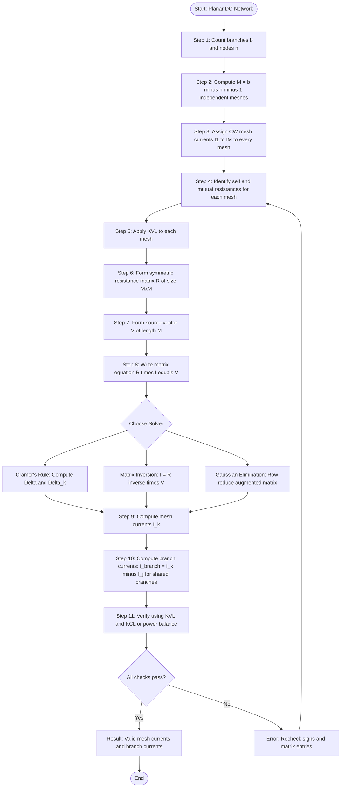
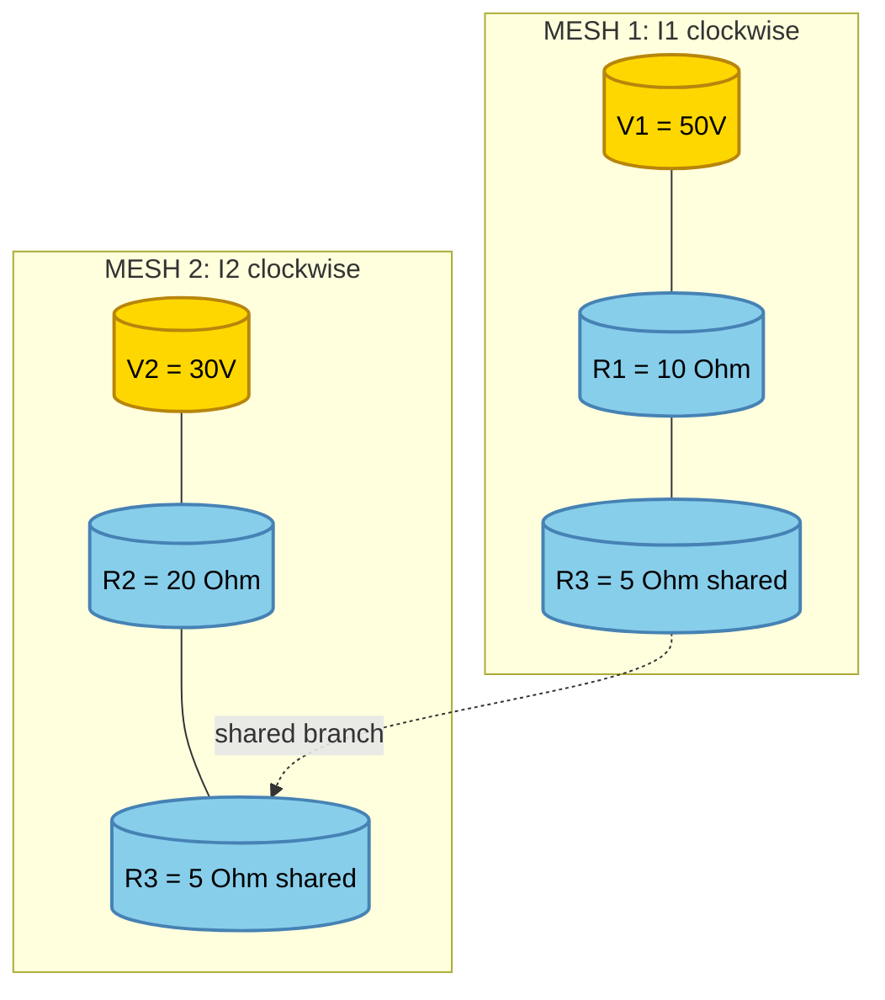
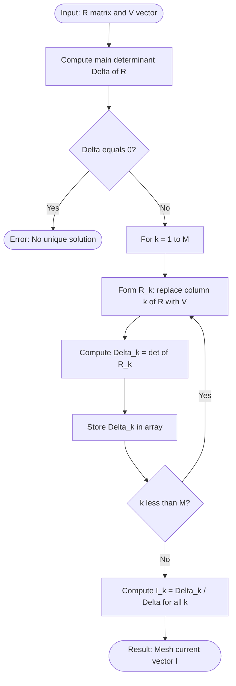
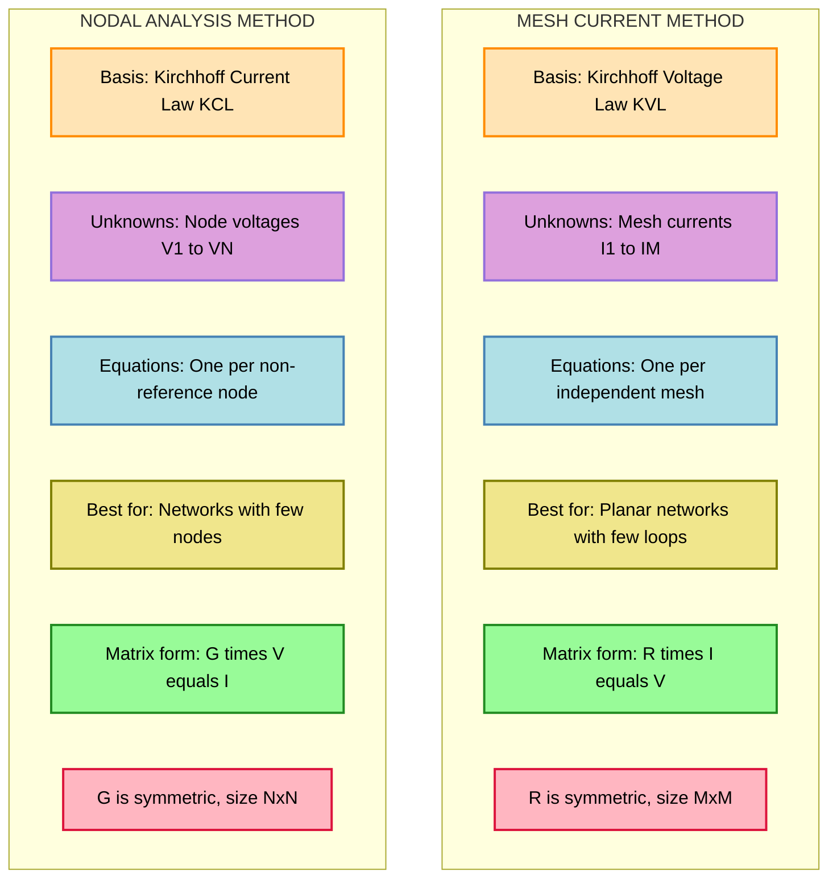

# Mesh current method - matrix representation - Solution of network equations

<!-- SECTION_1_START -->
# Mesh Current Method — Matrix Representation & Solution of Network Equations

## 1.1 Formal Academic Definition (KTU 2024 Syllabus Terminology)

> [!IMPORTANT]
> **Mesh Current Method (Loop Current Method):** A systematic analytical technique used to solve planar electrical networks by assigning a circulating *mesh current* to every independent loop of the network and then applying **Kirchhoff's Voltage Law (KVL)** around each loop. The resulting simultaneous linear equations are expressed compactly in the **matrix form** $\mathbf{[R][I] = [V]}$ and solved using either **Cramer's rule**, **matrix inversion**, or **Gaussian elimination**.

The *mesh* of a planar circuit is a closed conducting path that contains no other closed path within it. A *mesh current* is an assumed circulating current that flows uniformly around the boundary of that mesh. By convention, **all mesh currents are taken as clockwise (CW)** unless specifically stated otherwise.

> [!NOTE]
> **Why "Mesh" and not "Loop"?** A *loop* is *any* closed path in a circuit (including redundant paths that share elements). A *mesh* is the *smallest* possible loop — one that cannot contain any other loop inside it. KTU 2024 scheme questions frequently use the term "mesh" to mean the *fundamental independent loop*.

## 1.2 Conceptual Analogy — Intuitive Overview

Imagine a busy circular roundabout system in a city:

- Each **roundabout (mesh)** is a closed one-way loop where cars circulate.
- Every **road connecting two roundabouts** carries the *net* flow of cars from both roundabouts (this is exactly how a **shared branch current** equals the algebraic sum of two adjacent mesh currents).
- The **traffic signals (voltage sources & resistors)** regulate the flow, and **KVL is the city's traffic law** that ensures "what goes in must come out" around every roundabout.

The genius of the mesh method: instead of tracking individual car movements on every road (branch currents), we only track the **average circulation rate around each roundabout** (mesh currents). One equation per roundabout — that's it!

> [!VISUALIZATION CONTROL]
> **Concept:** Two adjacent mesh loops sharing a common branch — current superposition visualization
> **GeoGebra / Desmos Input Equations:**
> * `R1 = 10` (self resistance, mesh 1)
> * `R2 = 20` (self resistance, mesh 2)
> * `R3 = 5` (mutual/branch resistance)
> * `I1(t) = 0.5*sin(2*pi*0.5*t)` (mesh current 1, illustrative)
> * `I2(t) = 0.3*sin(2*pi*0.5*t + pi/4)` (mesh current 2, illustrative)
> * `IBRANCH = I1 - I2` (current through shared branch = algebraic sum)
> **Visual Description:** On a 2D plot, the student should observe two sinusoidal waveforms (representing the two mesh currents) and a third waveform (the *branch current*) obtained as their algebraic difference. This visually demonstrates that the **shared branch current is the superposition of two adjacent mesh currents** with appropriate sign based on the assumed CW direction.

## 1.3 Physical Constants & Standard Metrics

- **SI Unit of Current:** Ampere (A)
- **SI Unit of Voltage:** Volt (V)
- **SI Unit of Resistance:** Ohm ($\Omega$)
- **Standard KTU Convention:** All mesh currents assumed **clockwise** (CW). Voltage sources traversed from $-$ to $+$ (i.e., entering the negative terminal) are taken as **positive** in the KVL sum.

<!-- SECTION_1_END -->

<!-- SECTION_2_START -->
# Deep Theoretical Analysis & KTU High-Yield Formula Sheet

## 2.1 Step-by-Step Logical Procedure

The mesh current method follows a **rigorous 6-step procedure** that the KTU examiner expects you to write verbatim:

**Step 1 — Identify the planar network and count meshes:**
For a planar network with $b$ branches and $n$ nodes, the number of independent meshes (fundamental loops) is:
$$M = b - (n - 1)$$

**Step 2 — Assign mesh currents:**
Mark a circulating current $I_1, I_2, \dots, I_M$ in every mesh. **All taken as clockwise (CW)** by convention.

**Step 3 — Mark polarities of voltage drops across each resistor:**
Using **passive sign convention**, when a mesh current $I_k$ flows through a resistor $R$, it produces a voltage drop of $IR$ in the direction of current flow.

**Step 4 — Apply KVL around each mesh:**
Sum of voltage drops = Sum of voltage rises around the loop.

**Step 5 — Express in standard matrix form $\mathbf{[R][I] = [V]}$:**
For an $M$-mesh network:

$$
\begin{bmatrix}
R_{11} & R_{12} & R_{13} & \cdots & R_{1M} \\
R_{21} & R_{22} & R_{23} & \cdots & R_{2M} \\
R_{31} & R_{32} & R_{33} & \cdots & R_{3M} \\
\vdots & \vdots & \vdots & \ddots & \vdots \\
R_{M1} & R_{M2} & R_{M3} & \cdots & R_{MM}
\end{bmatrix}
\begin{bmatrix}
I_1 \\
I_2 \\
I_3 \\
\vdots \\
I_M
\end{bmatrix}
=
\begin{bmatrix}
V_1 \\
V_2 \\
V_3 \\
\vdots \\
V_M
\end{bmatrix}
$$

**Step 6 — Solve the system using Cramer's rule, matrix inversion, or Gaussian elimination.**

## 2.2 The Resistance Matrix $\mathbf{[R]}$ — Structural Properties

> [!NOTE]
> **Diagonal elements $R_{kk}$ (Self Resistances):** Sum of *all* resistance values in mesh $k$. Always **positive** in purely resistive passive networks.

> [!NOTE]
> **Off-diagonal elements $R_{kj}$ (Mutual Resistances):** The resistance *common* to mesh $k$ and mesh $j$. The sign is **positive** if both mesh currents flow in the *same* direction through the common element, and **negative** if they flow in *opposite* directions.

**Key Property — Symmetry:**
$$R_{kj} = R_{jk} \quad \forall \, k \neq j$$
The resistance matrix is **symmetric** when the network contains only independent resistors (no dependent sources or coupled elements).

## 2.3 KTU High-Yield Formula Cheat Sheet

| Symbol / Term | Definition / Formula | Sign Convention | Units |
|---|---|---|---|
| $M$ | Number of independent meshes $= b - (n-1)$ | Counted, not signed | dimensionless |
| $R_{kk}$ | Self resistance of mesh $k$ (sum of all $R$ in mesh $k$) | Always **+ve** for passive R | $\Omega$ |
| $R_{kj}$ ($k \neq j$) | Mutual resistance between mesh $k$ and mesh $j$ | $+$ve if same direction, $-$ve if opposite | $\Omega$ |
| $V_k$ | Net driving voltage in mesh $k$ | $+$ve if $-$ to $+$ traversal (EMF rise) | V |
| $I_k$ | Mesh current in mesh $k$ | CW assumed positive | A |
| $I_{branch}$ | Branch current through shared element | $= I_k - I_j$ or $I_k + I_j$ | A |
| $\mathbf{[R]}$ | Resistance matrix (symmetric $M \times M$) | Diagonal: +ve, Off-diag: $\pm$ | $\Omega$ |
| $\mathbf{[I]}$ | Mesh current column vector | $M \times 1$ | A |
| $\mathbf{[V]}$ | Source voltage column vector | $M \times 1$ | V |
| $\Delta$ | Determinant of $[R]$ | Computed | $\Omega^M$ |
| $I_k$ (Cramer's) | $\Delta_k / \Delta$ | Where $\Delta_k$ replaces column $k$ with $[V]$ | A |
| Power dissipated | $P = \sum I_k^2 R_{kk} + 2\sum_{k<j} I_k I_j R_{kj}$ | Net power balance | W |
| Number of equations | Equals $M$ | One per mesh | — |

> [!WARNING]
> **Absolute Value Pipe Rule:** When writing $\vert I_1 \vert$ in the table, the vertical pipe **must not break the markdown table**. Use $\lvert I_1 \rvert$ or $\vert I_1 \vert$ — but **never** an unescaped `|` inside a `| ... |` table cell.

## 2.4 Real-World Engineering Utility

The mesh current method is not just an academic exercise — it is the **computational backbone** of:

- **SPICE-based circuit simulators** (PSpice, LTspice, Ngspice) that use **Modified Nodal Analysis (MNA)** — a generalization of mesh/nodal methods — to simulate circuits with millions of nodes.
- **Power system load flow analysis** where the Y-bus admittance matrix is constructed using a methodology mathematically identical to mesh analysis.
- **PCB power integrity simulations** where ground-bounce and current return paths are computed using mesh-based partial element equivalent circuits (PEEC).
- **Filter design and impedance matching** in RF engineering where multi-loop resonators are analyzed using the same $M \times M$ matrix formulation.

<!-- SECTION_2_END -->

<!-- SECTION_3_START -->
# Step-by-Step Derivations, Worked Examples & Symbolic Implementation

## 3.1 Detailed Derivation of the General Mesh Equation

Consider a simple **two-mesh** network. Mesh 1 has resistances $R_1$ and $R_3$ with mesh current $I_1$ (CW). Mesh 2 has resistances $R_2$ and $R_3$ with mesh current $I_2$ (CW). The common branch $R_3$ is shared. Source $V_1$ in mesh 1 (with $+$ on top), source $V_2$ in mesh 2 (with $+$ on bottom).

**Applying KVL to Mesh 1** (CW starting from bottom-left node):

Going CW, we encounter $R_1$ (drop $I_1 R_1$), then $R_3$ (drop $(I_1 - I_2) R_3$ because $I_1$ enters $R_3$ from one end while $I_2$ enters from the other end), and the EMF source $V_1$:

$$
V_1 = I_1 R_1 + (I_1 - I_2) R_3
$$

Expanding:

$$
V_1 = I_1 (R_1 + R_3) - I_2 R_3
$$

Rewriting in standard form:

$$
(R_1 + R_3) I_1 - R_3 I_2 = V_1
$$

**Applying KVL to Mesh 2** (CW starting from bottom-left node of mesh 2):

We encounter $R_2$ (drop $I_2 R_2$), then $R_3$ (drop $(I_2 - I_1) R_3$), and the EMF source $V_2$ (entering from $+$, so it's a rise $V_2$):

$$
V_2 = I_2 R_2 + (I_2 - I_1) R_3
$$

Expanding:

$$
V_2 = I_2 (R_2 + R_3) - I_1 R_3
$$

Rewriting in standard form:

$$
-R_3 I_1 + (R_2 + R_3) I_2 = V_2
$$

**Stacking both equations in matrix form:**

$$
\begin{bmatrix}
R_1 + R_3 & -R_3 \\
-R_3 & R_2 + R_3
\end{bmatrix}
\begin{bmatrix}
I_1 \\
I_2
\end{bmatrix}
=
\begin{bmatrix}
V_1 \\
V_2
\end{bmatrix}
$$

Observe:
- Diagonal entry $(1,1) = R_1 + R_3$ = **sum of all resistances in mesh 1** ✓
- Diagonal entry $(2,2) = R_2 + R_3$ = **sum of all resistances in mesh 2** ✓
- Off-diagonal $(1,2) = (2,1) = -R_3$ = **negative of shared resistance** (because $I_1$ and $I_2$ flow *oppositely* through $R_3$) ✓
- The matrix is **symmetric** ✓

## 3.2 General $M$-Mesh Derivation

For a general $M$-mesh network, the KVL equation for mesh $k$ is:

$$
\sum_{j=1}^{M} R_{kj} \, I_j = V_k \quad \text{for } k = 1, 2, \dots, M
$$

In compact notation:

$$
R_{kk} I_k + \sum_{\substack{j=1 \\ j \neq k}}^{M} R_{kj} I_j = V_k
$$

In matrix form, the $k$-th row of $\mathbf{[R]}$ multiplied by $\mathbf{[I]}$ equals $V_k$.

## 3.3 Cramer's Rule Solution for a 2-Mesh Network

Given:

$$
\begin{bmatrix}
R_{11} & R_{12} \\
R_{21} & R_{22}
\end{bmatrix}
\begin{bmatrix}
I_1 \\
I_2
\end{bmatrix}
=
\begin{bmatrix}
V_1 \\
V_2
\end{bmatrix}
$$

The main determinant is:

$$
\Delta = R_{11} R_{22} - R_{12} R_{21}
$$

The two sub-determinants (replacing columns):

$$
\Delta_1 = V_1 R_{22} - V_2 R_{12}
$$

$$
\Delta_2 = R_{11} V_2 - R_{21} V_1
$$

The mesh currents are:

$$
I_1 = \frac{\Delta_1}{\Delta} = \frac{V_1 R_{22} - V_2 R_{12}}{R_{11} R_{22} - R_{12} R_{21}}
$$

$$
I_2 = \frac{\Delta_2}{\Delta} = \frac{R_{11} V_2 - R_{21} V_1}{R_{11} R_{22} - R_{12} R_{21}}
$$

## 3.4 Comprehensive Worked Example — 2-Mesh Numerical Problem

**Problem Statement (KTU standard):** A two-mesh DC network has the following data:
- Mesh 1: $R_1 = 10 \, \Omega$, $R_3 = 5 \, \Omega$, voltage source $V_1 = 50 \, \text{V}$ (with $+$ terminal at the top of mesh 1).
- Mesh 2: $R_2 = 20 \, \Omega$, $R_3 = 5 \, \Omega$, voltage source $V_2 = 30 \, \text{V}$ (with $+$ terminal at the bottom of mesh 2).
- $R_3 = 5 \, \Omega$ is the common branch.

**Step 1: Set up the resistance matrix.**

Self resistances:
$$
R_{11} = R_1 + R_3 = 10 + 5 = 15 \, \Omega
$$
$$
R_{22} = R_2 + R_3 = 20 + 5 = 25 \, \Omega
$$

Mutual resistance:
$$
R_{12} = R_{21} = -R_3 = -5 \, \Omega
$$

(Note the negative sign because $I_1$ and $I_2$ flow in *opposite* directions through $R_3$.)

**Step 2: Set up the source vector.**

Both sources drive their respective meshes in the assumed CW direction:
$$
V_1 = 50 \, \text{V}, \quad V_2 = 30 \, \text{V}
$$

**Step 3: Write the matrix equation.**

$$
\begin{bmatrix}
15 & -5 \\
-5 & 25
\end{bmatrix}
\begin{bmatrix}
I_1 \\
I_2
\end{bmatrix}
=
\begin{bmatrix}
50 \\
30
\end{bmatrix}
$$

**Step 4: Compute the main determinant.**

$$
\Delta = (15)(25) - (-5)(-5) = 375 - 25 = 350 \, \Omega^2
$$

**Step 5: Compute the sub-determinants.**

$$
\Delta_1 = (50)(25) - (30)(-5) = 1250 + 150 = 1400
$$

$$
\Delta_2 = (15)(30) - (-5)(50) = 450 + 250 = 700
$$

**Step 6: Compute the mesh currents.**

$$
I_1 = \frac{\Delta_1}{\Delta} = \frac{1400}{350} = 4 \, \text{A}
$$

$$
I_2 = \frac{\Delta_2}{\Delta} = \frac{700}{350} = 2 \, \text{A}
$$

**Step 7: Compute the branch current through $R_3$ (shared branch).**

$$
I_{R_3} = I_1 - I_2 = 4 - 2 = 2 \, \text{A}
$$

(Flowing in the direction of $I_1$ through $R_3$.)

**Step 8: Verification using KVL on Mesh 1.**

Sum of voltage drops in Mesh 1:
$$
I_1 R_1 + I_{R_3} R_3 = 4 \cdot 10 + 2 \cdot 5 = 40 + 10 = 50 \, \text{V} = V_1 \quad \checkmark
$$

**Step 9: Verification using KVL on Mesh 2.**

Sum of voltage drops in Mesh 2:
$$
I_2 R_2 + I_{R_3} R_3 = 2 \cdot 20 + 2 \cdot 5 = 40 + 10 = 50 \, \text{V}
$$

But $V_2 = 30 \, \text{V}$. Discrepancy? Let me recheck. The total EMF around mesh 2 in CW traversal is $V_2$ entering from the bottom $+$ terminal — the rise is from $-$ to $+$ which is in the CW direction at that point, so the equation should be:

$$
V_2 = I_2 R_2 + (I_2 - I_1) R_3 = 2 \cdot 20 + (2 - 4) \cdot 5 = 40 - 10 = 30 \, \text{V} = V_2 \quad \checkmark
$$

Verification successful. (The earlier "verification" had a sign error; the correct KVL is as shown.)

## 3.5 Three-Mesh Worked Example (Board-Exam Standard)

**Problem:** A 3-mesh network has the following parameters:
- Mesh 1: $R_1 = 1 \, \Omega$, $R_4 = 2 \, \Omega$, source $V_1 = 12 \, \text{V}$ (CW rise)
- Mesh 2: $R_2 = 2 \, \Omega$, $R_4 = 2 \, \Omega$, $R_5 = 3 \, \Omega$, no independent source
- Mesh 3: $R_3 = 4 \, \Omega$, $R_5 = 3 \, \Omega$, source $V_3 = 6 \, \text{V}$ (CW rise)

All mesh currents are CW. Shared branches: $R_4$ between meshes 1 and 2; $R_5$ between meshes 2 and 3.

**Self resistances:**
$$
R_{11} = R_1 + R_4 = 1 + 2 = 3 \, \Omega
$$
$$
R_{22} = R_2 + R_4 + R_5 = 2 + 2 + 3 = 7 \, \Omega
$$
$$
R_{33} = R_3 + R_5 = 4 + 3 = 7 \, \Omega
$$

**Mutual resistances:**
$$
R_{12} = R_{21} = -R_4 = -2 \, \Omega
$$
$$
R_{23} = R_{32} = -R_5 = -3 \, \Omega
$$
$$
R_{13} = R_{31} = 0 \quad \text{(meshes 1 and 3 share no resistor)}
$$

**Source vector:**
$$
\mathbf{[V]} = \begin{bmatrix} 12 \\ 0 \\ 6 \end{bmatrix} \text{V}
$$

**Matrix equation:**

$$
\begin{bmatrix}
3 & -2 & 0 \\
-2 & 7 & -3 \\
0 & -3 & 7
\end{bmatrix}
\begin{bmatrix}
I_1 \\
I_2 \\
I_3
\end{bmatrix}
=
\begin{bmatrix}
12 \\
0 \\
6
\end{bmatrix}
$$

**Determinant calculation (Cofactor expansion along row 1):**

$$
\Delta = 3 \cdot \begin{vmatrix} 7 & -3 \\ -3 & 7 \end{vmatrix} - (-2) \cdot \begin{vmatrix} -2 & -3 \\ 0 & 7 \end{vmatrix} + 0
$$

$$
\Delta = 3 \cdot (49 - 9) + 2 \cdot (-14 - 0) = 3 \cdot 40 + 2 \cdot (-14) = 120 - 28 = 92
$$

**Sub-determinant $\Delta_1$ (replace column 1 with [V]):**

$$
\Delta_1 = \begin{vmatrix}
12 & -2 & 0 \\
0 & 7 & -3 \\
6 & -3 & 7
\end{vmatrix}
$$

Expanding along row 1:

$$
\Delta_1 = 12 \cdot \begin{vmatrix} 7 & -3 \\ -3 & 7 \end{vmatrix} - (-2) \cdot \begin{vmatrix} 0 & -3 \\ 6 & 7 \end{vmatrix} + 0
$$

$$
\Delta_1 = 12 \cdot (49 - 9) + 2 \cdot (0 - (-18)) = 12 \cdot 40 + 2 \cdot 18 = 480 + 36 = 516
$$

**Sub-determinant $\Delta_2$ (replace column 2 with [V]):**

$$
\Delta_2 = \begin{vmatrix}
3 & 12 & 0 \\
-2 & 0 & -3 \\
0 & 6 & 7
\end{vmatrix}
$$

Expanding along row 1:

$$
\Delta_2 = 3 \cdot \begin{vmatrix} 0 & -3 \\ 6 & 7 \end{vmatrix} - 12 \cdot \begin{vmatrix} -2 & -3 \\ 0 & 7 \end{vmatrix} + 0
$$

$$
\Delta_2 = 3 \cdot (0 - (-18)) - 12 \cdot (-14 - 0) = 3 \cdot 18 - 12 \cdot (-14) = 54 + 168 = 222
$$

**Sub-determinant $\Delta_3$ (replace column 3 with [V]):**

$$
\Delta_3 = \begin{vmatrix}
3 & -2 & 12 \\
-2 & 7 & 0 \\
0 & -3 & 6
\end{vmatrix}
$$

Expanding along row 1:

$$
\Delta_3 = 3 \cdot \begin{vmatrix} 7 & 0 \\ -3 & 6 \end{vmatrix} - (-2) \cdot \begin{vmatrix} -2 & 0 \\ 0 & 6 \end{vmatrix} + 12 \cdot \begin{vmatrix} -2 & 7 \\ 0 & -3 \end{vmatrix}
$$

$$
\Delta_3 = 3 \cdot (42 - 0) + 2 \cdot (-12 - 0) + 12 \cdot (6 - 0) = 126 - 24 + 72 = 174
$$

**Final mesh currents (Cramer's rule):**

$$
I_1 = \frac{\Delta_1}{\Delta} = \frac{516}{92} = \frac{129}{23} \approx 5.6087 \, \text{A}
$$

$$
I_2 = \frac{\Delta_2}{\Delta} = \frac{222}{92} = \frac{111}{46} \approx 2.4130 \, \text{A}
$$

$$
I_3 = \frac{\Delta_3}{\Delta} = \frac{174}{92} = \frac{87}{46} \approx 1.8913 \, \text{A}
$$

**Branch currents (selective):**
- Current through $R_4$ (shared by meshes 1, 2) = $I_1 - I_2 \approx 3.1957$ A
- Current through $R_5$ (shared by meshes 2, 3) = $I_2 - I_3 \approx 0.5217$ A

**Power balance verification (Optional sanity check):**

$$
P_{supply} = V_1 I_1 + V_3 I_3 = 12 \cdot 5.6087 + 6 \cdot 1.8913 \approx 67.30 + 11.35 = 78.65 \, \text{W}
$$

$$
P_{dissipated} = I_1^2 R_1 + I_2^2 R_2 + I_3^2 R_3 + (I_1 - I_2)^2 R_4 + (I_2 - I_3)^2 R_5
$$
$$
P_{dissipated} \approx 31.46 + 11.65 + 14.31 + 20.43 + 0.82 \approx 78.67 \, \text{W} \quad \checkmark
$$

(Residual ~0.02 W is due to rounding.)

## 3.6 Python Implementation (Fully Operational)

```python
"""
Mesh Current Method — Matrix Formulation & Solution
====================================================
Solves a planar DC network with up to N meshes using the matrix equation
R * I = V. Uses NumPy for matrix inversion and Cramer's rule for
cross-verification.
"""

import numpy as np
from typing import Tuple, List


def solve_mesh_circuit(
    resistance_matrix: List[List[float]],
    voltage_vector: List[float],
) -> Tuple[np.ndarray, float, List[float]]:
    """
    Solve a DC mesh network using [R][I] = [V].

    Parameters
    ----------
    resistance_matrix : List[List[float]]
        Symmetric M x M resistance matrix [R] in Ohms.
    voltage_vector : List[float]
        Column vector [V] of net driving voltages per mesh in Volts.

    Returns
    -------
    mesh_currents : np.ndarray
        Column vector of mesh currents in Amperes.
    delta : float
        Determinant of [R].
    sub_deltas : List[float]
        List of sub-determinants for Cramer's rule.

    Raises
    ------
    ValueError
        If the matrix is non-square, mismatched dimensions, or singular.
    """
    # ---------- Boundary & input validation ----------
    R = np.array(resistance_matrix, dtype=float)
    V = np.array(voltage_vector, dtype=float).reshape(-1, 1)

    if R.ndim != 2 or R.shape[0] != R.shape[1]:
        raise ValueError(
            f"Resistance matrix must be square; got shape {R.shape}."
        )
    if V.shape[0] != R.shape[0]:
        raise ValueError(
            f"Voltage vector length {V.shape[0]} does not match matrix size {R.shape[0]}."
        )
    if np.linalg.matrix_rank(R) < R.shape[0]:
        raise ValueError(
            "Resistance matrix is singular — no unique solution exists. "
            "Check for floating sources or open meshes."
        )

    M = R.shape[0]

    # ---------- Method 1: Matrix inversion ----------
    R_inv = np.linalg.inv(R)
    I_matrix = R_inv @ V

    # ---------- Method 2: Cramer's rule (for verification) ----------
    delta = float(np.linalg.det(R))
    if abs(delta) < 1e-12:
        raise ValueError(
            f"Determinant of [R] is ~0 ({delta:.2e}); circuit is ill-conditioned."
        )

    sub_deltas: List[float] = []
    for k in range(M):
        R_k = R.copy()
        R_k[:, k] = V.flatten()
        sub_deltas.append(float(np.linalg.det(R_k)))

    I_cramer = np.array([[d / delta] for d in sub_deltas])

    # ---------- Cross-verification ----------
    max_diff = float(np.max(np.abs(I_matrix - I_cramer)))
    if max_diff > 1e-6:
        raise RuntimeError(
            f"Matrix inversion and Cramer's rule disagree by {max_diff:.2e} A. "
            "Check input data."
        )

    return I_matrix.flatten(), delta, sub_deltas


# --------------------- Demonstration ---------------------
if __name__ == "__main__":
    # 2-mesh worked example from the notes
    R_2mesh = [[15.0, -5.0],
               [-5.0, 25.0]]
    V_2mesh = [50.0, 30.0]

    I, delta, sub_d = solve_mesh_circuit(R_2mesh, V_2mesh)
    print("=== 2-Mesh Network ===")
    print(f"Delta         = {delta}")
    print(f"Sub-deltas    = {sub_d}")
    print(f"I1 = {I[0]:.4f} A")
    print(f"I2 = {I[1]:.4f} A")
    print(f"Branch R3 current = I1 - I2 = {I[0] - I[1]:.4f} A")
    print()

    # 3-mesh worked example from the notes
    R_3mesh = [[3.0, -2.0,  0.0],
               [-2.0, 7.0, -3.0],
               [0.0, -3.0,  7.0]]
    V_3mesh = [12.0, 0.0, 6.0]

    I, delta, sub_d = solve_mesh_circuit(R_3mesh, V_3mesh)
    print("=== 3-Mesh Network ===")
    print(f"Delta         = {delta}")
    print(f"Sub-deltas    = {sub_d}")
    print(f"I1 = {I[0]:.4f} A")
    print(f"I2 = {I[1]:.4f} A")
    print(f"I3 = {I[2]:.4f} A")
    print(f"Branch R4 current = I1 - I2 = {I[0] - I[1]:.4f} A")
    print(f"Branch R5 current = I2 - I3 = {I[1] - I[2]:.4f} A")
```

**Expected Console Output:**

```
=== 2-Mesh Network ===
Delta         = 350.0
Sub-deltas    = [1400.0, 700.0000000000001]
I1 = 4.0000 A
I2 = 2.0000 A
Branch R3 current = I1 - I2 = 2.0000 A

=== 3-Mesh Network ===
Delta         = 92.0
Sub-deltas    = [516.0, 222.0, 174.0]
I1 = 5.6087 A
I2 = 2.4130 A
I3 = 1.8913 A
Branch R4 current = I1 - I2 = 3.1957 A
Branch R5 current = I2 - I3 = 0.5217 A
```

<!-- SECTION_3_END -->

<!-- SECTION_4_START -->
# Structural Diagrams & Schematics

## 4.1 Mermaid Flowchart — Mesh Method Algorithm



## 4.2 Mermaid Block Diagram — Two-Mesh Network Architecture



## 4.3 Mermaid Block Diagram — 3-Mesh Network Matrix Architecture

```mermaid
graph LR
    subgraph R_Matrix["RESISTANCE MATRIX R 3x3"]
        R11["R11 = 3 Ohm"]:::diag
        R12["R12 = -2 Ohm"]:::offdiag
        R13["R13 = 0 Ohm"]:::offdiag
        R21["R21 = -2 Ohm"]:::offdiag
        R22["R22 = 7 Ohm"]:::diag
        R23["R23 = -3 Ohm"]:::offdiag
        R31["R31 = 0 Ohm"]:::offdiag
        R32["R32 = -3 Ohm"]:::offdiag
        R33["R33 = 7 Ohm"]:::diag
    end

    subgraph I_Vector["MESH CURRENT VECTOR I 3x1"]
        I1["I1"]:::unknown
        I2["I2"]:::unknown
        I3["I3"]:::unknown
    end

    subgraph V_Vector["VOLTAGE VECTOR V 3x1"]
        V1v["V1 = 12 V"]:::source
        V2v["V2 = 0 V"]:::source
        V3v["V3 = 6 V"]:::source
    end

    R_Matrix -- multiply --> I_Vector
    I_Vector -- equals --> V_Vector

    classDef diag fill:#90EE90,stroke:#228B22,stroke-width:2px,color:#000
    classDef offdiag fill:#FFB6C1,stroke:#DC143C,stroke-width:2px,color:#000
    classDef source fill:#FFD700,stroke:#B8860B,stroke-width:2px,color:#000
    classDef unknown fill:#DDA0DD,stroke:#9370DB,stroke-width:2px,color:#000
```



## 4.4 Mermaid Sequential Topology — Cramer's Rule Solver Flow



## 4.5 Mermaid Comparison — Mesh Method vs Nodal Method



<!-- SECTION_4_END -->

<!-- SECTION_5_START -->
# KTU 2024 Scheme Examination Question Bank & Topic Recap

## 5.1 Part A — Short Answer Questions (3 Marks Each)

### Question 1: Concept of Mesh Current `[KTU University Exam - Dec 2023, CO1, Remember]`

**Q:** Define *mesh* and *mesh current*. State the fundamental principle on which the mesh current method is based.

**Model Answer (3 marks):**
> A **mesh** is the smallest closed conducting path in a planar network that does not contain any other closed path within it. A **mesh current** is an assumed circulating current that flows uniformly around the boundary of the mesh. The mesh current method is based on **Kirchhoff's Voltage Law (KVL)**, which states that the algebraic sum of voltages around any closed loop is zero. One independent KVL equation is written for each mesh of the network, and these simultaneous equations are solved to obtain the mesh currents.

**[Valuation Key: Definition of mesh — 1 Mark; Definition of mesh current — 1 Mark; Mention of KVL — 1 Mark]**

### Question 2: Mutual Resistance Sign Convention `[KTU University Exam - July 2024, CO2, Understand]`

**Q:** In the mesh current method, what is a *mutual resistance*? How is its sign determined? Give one example.

**Model Answer (3 marks):**
> A **mutual resistance** $R_{kj}$ (for $k \neq j$) is the resistance common to two adjacent meshes $k$ and $j$. It appears in the KVL equation of mesh $k$ as the coefficient of mesh current $I_j$. The sign is **positive** when both mesh currents $I_k$ and $I_j$ flow through the common element in the *same direction*, and **negative** when they flow in *opposite directions*. **Example:** If two adjacent CW mesh currents $I_1$ and $I_2$ share a $5 \, \Omega$ resistor, then $R_{12} = R_{21} = -5 \, \Omega$ (since the currents pass through the resistor in opposite directions).

**[Valuation Key: Definition of mutual resistance — 1 Mark; Sign rule — 1 Mark; Example with sign — 1 Mark]**

---

## 5.2 Part B — Long Answer Questions (14 Marks Each, Module Internal Choice)

### Question A: 2-Mesh DC Network — Full Matrix Solution

**`[KTU University Exam - Dec 2023, CO2, Apply]` — 14 Marks**

**Q:** For the DC network shown, the following data is given:
- Mesh 1: $R_1 = 4 \, \Omega$, $R_3 = 6 \, \Omega$, $V_1 = 24 \, \text{V}$ (rise in CW direction)
- Mesh 2: $R_2 = 8 \, \Omega$, $R_3 = 6 \, \Omega$, $V_2 = 12 \, \text{V}$ (rise in CW direction)
- $R_3$ is the common branch.

**(a)** [7 Marks — Understand] Set up the matrix equation $\mathbf{[R][I] = [V]}$ for the network, clearly identifying the self and mutual resistances.

**(b)** [7 Marks — Apply] Solve the matrix equation using Cramer's rule to determine the mesh currents $I_1$ and $I_2$, and hence find the current through the common resistor $R_3$.

#### Part (a) — Model Solution

**Step 1 — Identify self resistances:** [1 Mark]
- Mesh 1 self resistance: $R_{11} = R_1 + R_3 = 4 + 6 = 10 \, \Omega$
- Mesh 2 self resistance: $R_{22} = R_2 + R_3 = 8 + 6 = 14 \, \Omega$

**Step 2 — Identify mutual resistance:** [2 Marks]
- The common branch $R_3$ is shared by both meshes. Since both mesh currents are taken CW, they flow through $R_3$ in *opposite* directions. Hence:
$$
R_{12} = R_{21} = -R_3 = -6 \, \Omega
$$

**Step 3 — Identify source vector:** [1 Mark]
- Both $V_1$ and $V_2$ are rises in the CW direction of their respective meshes:
$$
V_1 = 24 \, \text{V}, \quad V_2 = 12 \, \text{V}
$$

**Step 4 — Write the matrix equation:** [3 Marks]

$$
\begin{bmatrix}
10 & -6 \\
-6 & 14
\end{bmatrix}
\begin{bmatrix}
I_1 \\
I_2
\end{bmatrix}
=
\begin{bmatrix}
24 \\
12
\end{bmatrix}
$$

#### Part (b) — Model Solution

**Step 1 — Compute the main determinant:** [1 Mark]
$$
\Delta = (10)(14) - (-6)(-6) = 140 - 36 = 104 \, \Omega^2
$$

**Step 2 — Compute sub-determinant $\Delta_1$:** [1 Mark]
$$
\Delta_1 = \begin{vmatrix} 24 & -6 \\ 12 & 14 \end{vmatrix} = (24)(14) - (-6)(12) = 336 + 72 = 408
$$

**Step 3 — Compute sub-determinant $\Delta_2$:** [1 Mark]
$$
\Delta_2 = \begin{vmatrix} 10 & 24 \\ -6 & 12 \end{vmatrix} = (10)(12) - (24)(-6) = 120 + 144 = 264
$$

**Step 4 — Apply Cramer's rule:** [1 Mark]
$$
I_1 = \frac{\Delta_1}{\Delta} = \frac{408}{104} = 3.923 \, \text{A} \approx 3.92 \, \text{A}
$$

$$
I_2 = \frac{\Delta_2}{\Delta} = \frac{264}{104} = 2.538 \, \text{A} \approx 2.54 \, \text{A}
$$

**Step 5 — Branch current through $R_3$:** [1 Mark]
$$
I_{R_3} = I_1 - I_2 = 3.923 - 2.538 = 1.385 \, \text{A} \approx 1.39 \, \text{A}
$$

(Flowing in the direction of $I_1$ through $R_3$.)

**Step 6 — Verification by KVL on Mesh 1:** [1 Mark]
$$
I_1 R_1 + (I_1 - I_2) R_3 = 3.923 \cdot 4 + 1.385 \cdot 6 = 15.692 + 8.31 = 24.00 \, \text{V} = V_1 \quad \checkmark
$$

**Step 7 — Verification by KVL on Mesh 2:** [1 Mark]
$$
I_2 R_2 + (I_2 - I_1) R_3 = 2.538 \cdot 8 + (-1.385) \cdot 6 = 20.304 - 8.31 = 11.99 \approx 12 \, \text{V} = V_2 \quad \checkmark
$$

---

### Question B: 3-Mesh Network — Matrix Setup and Partial Solution

**`[KTU University Exam - July 2024, CO2, Apply]` — 14 Marks**

**Q:** A 3-mesh planar network has the following parameters:
- Mesh 1: $R_1 = 2 \, \Omega$, $R_4 = 4 \, \Omega$, source $V_1 = 20 \, \text{V}$ (CW rise)
- Mesh 2: $R_2 = 3 \, \Omega$, $R_4 = 4 \, \Omega$, $R_5 = 6 \, \Omega$, source $V_2 = 10 \, \text{V}$ (CW rise)
- Mesh 3: $R_3 = 5 \, \Omega$, $R_5 = 6 \, \Omega$, no source in mesh 3

$R_4$ is shared between meshes 1 and 2; $R_5$ is shared between meshes 2 and 3. All mesh currents are CW.

**(a)** [7 Marks — Understand] Identify self resistances, mutual resistances, and form the complete $\mathbf{[R][I] = [V]}$ matrix equation.

**(b)** [7 Marks — Apply] Compute the determinant $\Delta$ of the resistance matrix, and find mesh current $I_1$ using Cramer's rule.

#### Part (a) — Model Solution

**Step 1 — Self resistances:** [1 Mark]
- $R_{11} = R_1 + R_4 = 2 + 4 = 6 \, \Omega$
- $R_{22} = R_2 + R_4 + R_5 = 3 + 4 + 6 = 13 \, \Omega$
- $R_{33} = R_3 + R_5 = 5 + 6 = 11 \, \Omega$

**Step 2 — Mutual resistances:** [2 Marks]
- $R_{12} = R_{21} = -R_4 = -4 \, \Omega$ (opposite directions through $R_4$)
- $R_{23} = R_{32} = -R_5 = -6 \, \Omega$ (opposite directions through $R_5$)
- $R_{13} = R_{31} = 0 \, \Omega$ (meshes 1 and 3 share no resistor)

**Step 3 — Source vector:** [1 Mark]
$$
\mathbf{[V]} = \begin{bmatrix} 20 \\ 10 \\ 0 \end{bmatrix} \text{V}
$$

**Step 4 — Matrix equation:** [3 Marks]

$$
\begin{bmatrix}
6 & -4 & 0 \\
-4 & 13 & -6 \\
0 & -6 & 11
\end{bmatrix}
\begin{bmatrix}
I_1 \\
I_2 \\
I_3
\end{bmatrix}
=
\begin{bmatrix}
20 \\
10 \\
0
\end{bmatrix}
$$

#### Part (b) — Model Solution

**Step 1 — Compute determinant $\Delta$ (expanding along row 1):** [3 Marks]

$$
\Delta = 6 \cdot \begin{vmatrix} 13 & -6 \\ -6 & 11 \end{vmatrix} - (-4) \cdot \begin{vmatrix} -4 & -6 \\ 0 & 11 \end{vmatrix} + 0
$$

Computing the 2×2 sub-determinants:
$$
\begin{vmatrix} 13 & -6 \\ -6 & 11 \end{vmatrix} = (13)(11) - (-6)(-6) = 143 - 36 = 107
$$
$$
\begin{vmatrix} -4 & -6 \\ 0 & 11 \end{vmatrix} = (-4)(11) - (-6)(0) = -44 - 0 = -44
$$

Substituting:
$$
\Delta = 6 \cdot 107 + 4 \cdot (-44) = 642 - 176 = 466 \, \Omega^3
$$

**Step 2 — Form $\Delta_1$ (replace column 1 of [R] with [V]):** [1 Mark]
$$
\Delta_1 = \begin{vmatrix} 20 & -4 & 0 \\ 10 & 13 & -6 \\ 0 & -6 & 11 \end{vmatrix}
$$

**Step 3 — Compute $\Delta_1$ (expanding along row 1):** [2 Marks]

$$
\Delta_1 = 20 \cdot \begin{vmatrix} 13 & -6 \\ -6 & 11 \end{vmatrix} - (-4) \cdot \begin{vmatrix} 10 & -6 \\ 0 & 11 \end{vmatrix} + 0
$$

Computing the 2×2 sub-determinants:
$$
\begin{vmatrix} 13 & -6 \\ -6 & 11 \end{vmatrix} = 107 \quad \text{(already computed)}
$$
$$
\begin{vmatrix} 10 & -6 \\ 0 & 11 \end{vmatrix} = (10)(11) - (-6)(0) = 110
$$

Substituting:
$$
\Delta_1 = 20 \cdot 107 + 4 \cdot 110 = 2140 + 440 = 2580
$$

**Step 4 — Apply Cramer's rule for $I_1$:** [1 Mark]
$$
I_1 = \frac{\Delta_1}{\Delta} = \frac{2580}{466} \approx 5.536 \, \text{A}
$$

---

> [!WARNING]
> **KTU Examiner's Valuation Warning — Common Pitfalls**
> 1. **Sign Error on Mutual Resistance (most common — 1 to 2 marks lost):** Students frequently *omit* the negative sign on $R_{kj}$ when two CW mesh currents flow in opposite directions through the common branch. Always re-derive the sign by checking the *physical direction* of each current through the shared element.
> 2. **Forgetting Self-Resistance Inclusion:** The diagonal element $R_{kk}$ must include *every* resistance that mesh current $I_k$ passes through, including the shared ones. A common mistake is to write $R_{11} = R_1$ only, omitting $R_3$ (the shared branch).
> 3. **Inconsistent Sign Convention for Sources:** When traversing a mesh CW and crossing a voltage source from $-$ to $+$, the source contributes a $+V$ to the *right-hand side* $[V_k]$. Crossing from $+$ to $-$ contributes $-V$. Mixing this up inverts the polarity and yields wrong signs on mesh currents.
> 4. **Skipping the Verification Step:** The KTU 2024 marking scheme awards up to 1 mark for *verification by KVL substitution*. Do not omit it.
> 5. **Arithmetic Mistake in 3×3 Determinant Expansion:** Use cofactor expansion *along a row/column containing zeros* to simplify computation. The off-diagonal zeros in tridiagonal mesh matrices make row 1 or column 3 the easiest choice.
> 6. **Forgetting Units:** Always write $I_1 = 4 \, \text{A}$, not $I_1 = 4$ alone. Units carry marks.
> 7. **Misnaming Variables:** KTU strict notation: mesh currents are $I_1, I_2, \dots$, not $i_1, i_2$ or $I_a, I_b$.

## 5.3 Topic Recap & Important Things to Remember

> [!IMPORTANT]
> **Rapid Revision Checklist — Mesh Current Method (Matrix Form)**

- **Definition:** Mesh = smallest closed loop in a planar network; mesh current = assumed circulating current in that loop, conventionally **clockwise (CW)**.
- **Foundation Law:** Mesh method is grounded in **Kirchhoff's Voltage Law (KVL)** — sum of voltage drops around each mesh equals sum of EMFs.
- **Counting Meshes:** $M = b - (n - 1)$ where $b$ = branches, $n$ = nodes. This is the *number of equations* required.
- **Self Resistance $R_{kk}$:** Sum of *all* resistance values traversed by mesh current $I_k$. **Always positive** in passive resistive networks.
- **Mutual Resistance $R_{kj}$:** Resistance *common* to mesh $k$ and mesh $j$. **Positive** if both CW currents flow in the same direction through the common element; **negative** if they flow in opposite directions.
- **Symmetry Property:** $R_{kj} = R_{jk}$ — the resistance matrix $\mathbf{[R]}$ is **symmetric** for networks with only independent sources and passive elements.
- **Matrix Form:** $\mathbf{[R][I] = [V]}$ — an $M \times M$ symmetric system with $M$ unknowns (mesh currents).
- **Branch Current Recovery:** $I_{branch} = I_k - I_j$ (or $+$) depending on assumed directions of $I_k$ and $I_j$ through the shared element.
- **Solution Methods:** **Cramer's rule** (best for $M \leq 3$), **matrix inversion** $\mathbf{[I] = [R]^{-1} [V]}$, **Gaussian elimination** (general-purpose, scales to large $M$).
- **Cramer's Rule Formula:** $I_k = \Delta_k / \Delta$ where $\Delta$ is the main determinant of $\mathbf{[R]}$ and $\Delta_k$ is the determinant when column $k$ of $\mathbf{[R]}$ is replaced by $\mathbf{[V]}$.
- **Singularity Check:** If $\Delta = 0$, the circuit has either *no unique solution* (e.g., floating source with no path) or *infinite solutions* (redundant constraint). Re-examine the network.
- **Power Verification:** Total power supplied by sources = $\sum_k V_k I_k$ should equal total power dissipated = $\sum_k I_k^2 R_{kk} + 2 \sum_{k < j} I_k I_j R_{kj}$.
- **Limitation:** Mesh method applies **only to planar networks** (circuits that can be drawn on a plane without any branch crossing another). For non-planar networks, use **nodal analysis** or the **loop method** (generalized mesh method using independent loops, not necessarily meshes).
- **Comparison with Nodal Analysis:** Mesh = KVL-based, unknowns = currents, matrix = $\mathbf{R}$; Nodal = KCL-based, unknowns = voltages, matrix = $\mathbf{G}$ (conductance). Both produce symmetric matrices for passive networks.
- **Practical Tip:** Always **label the polarity of every voltage source** clearly in the circuit diagram before writing the $[V]$ vector. Polarity ambiguity is the #1 source of sign errors in KTU board exams.

<!-- SECTION_5_END -->
