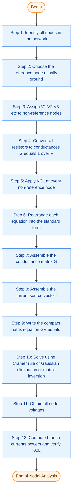
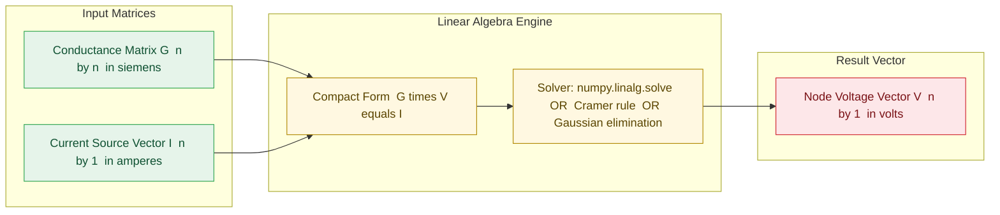
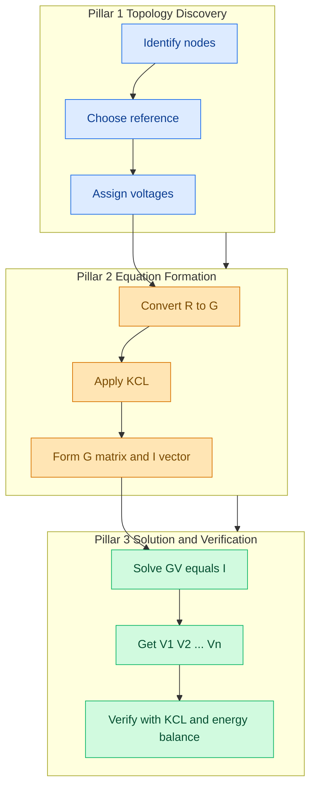

# Node voltage methods-matrix representation-solution of network equations by matrix methods - numerical problems

<!-- SECTION_1_START -->

# Node Voltage Method & Matrix Representation of Network Equations

## 1.1 Formal Academic Definition

> [!NOTE]
> **Nodal Analysis (Node Voltage Method):** A systematic circuit analysis technique based on **Kirchhoff's Current Law (KCL)** that determines the voltage at every node in an electrical network with respect to a chosen **reference node (datum node / ground)**, expressed in the form $\mathbf{G \cdot V = I}$, where $\mathbf{G}$ is the **conductance matrix**, $\mathbf{V}$ is the **node voltage vector**, and $\mathbf{I}$ is the **current source vector**.

For a network containing $n$ independent nodes, nodal analysis produces a system of $(n-1)$ linear simultaneous equations, which when expressed in compact matrix form yields:

$$\begin{aligned}
\mathbf{G} \cdot \mathbf{V} &= \mathbf{I}
\end{aligned}$$

where every element of $\mathbf{G}$ is computed strictly from the passive components (resistors) connected to or between the non-reference nodes.

---

## 1.2 Conceptual Analogy — The "Water Pressure Network"

Imagine a network of interconnected water tanks. Each junction is a **node**, water pressure at that junction is the **node voltage**, and pipes connecting junctions have a "flow conductance" (how easily water passes through, the reciprocal of resistance). The **current sources** are like external pumps that push water *into* the system.

**Intuition:**
- The **ground (reference node)** is the open ocean — all tank pressures are measured *relative* to it (so ocean pressure = 0).
- At every internal junction, the **total water flowing in must equal the total water flowing out** (KCL), because water cannot pile up.
- If we know the pressure at every junction, we automatically know the **flow through every pipe** (Ohm's law analogue: $I = G \cdot \Delta V$).
- When many junctions exist, we have *many* equations — exactly the kind of problem matrices are built to solve in one shot.

> [!IMPORTANT]
> **Syllabus Highlight (KTU 2024 — Module 1):** Nodal analysis is the *preferred* method over mesh analysis whenever the network has **more loops than nodes**, because it yields fewer equations. It is the foundation for **computer-aided circuit simulation** (e.g., SPICE, MATLAB `simulink`, and modern EDA tools).

---

## 1.3 Physical Constants & Standard Metrics

| Symbol | Quantity | Standard Unit |
|:------:|:---------|:--------------|
| $G$ | Conductance | **Siemens (S)** |
| $V$ | Node voltage (potential) | **Volts (V)** |
| $I$ | Current (source / branch) | **Amperes (A)** |
| $R$ | Resistance | **Ohms ($\Omega$)** |
| $n$ | Number of independent nodes | dimensionless |
| $b$ | Number of branches | dimensionless |
| $m = b - (n-1)$ | Number of independent mesh equations | dimensionless |

> [!TIP]
> **Conversion to remember forever:** $G = \dfrac{1}{R}$ and $1\ \text{S} = 1\ \Omega^{-1}$. Always convert resistors to **siemens** before populating the $\mathbf{G}$ matrix.

---

## 1.4 Visualization Control (Circuit Topology & Node Layout)

> [!VISUALIZATION CONTROL]
> **Concept:** Generic 3-node resistive network with two current sources.
> **Desmos / GeoGebra Schematic Equations (use as a drawing reference):**
> * Node positions (on a virtual canvas): $N_0(0,0)$ — reference (ground); $N_1(2,3)$ — top-left; $N_2(5,3)$ — top-right; $N_3(3.5,6)$ — top-center.
> * Conductance lines (edges): $G_{12}$ between $N_1$ and $N_2$; $G_{13}$ between $N_1$ and $N_3$; $G_{23}$ between $N_2$ and $N_3$; $G_{10}$, $G_{20}$, $G_{30}$ from each non-reference node to ground.
> **Visual Description:** A triangular arrangement of nodes $N_1$, $N_2$, $N_3$ floating above a ground rail $N_0$. Six conductance "bridges" connect them. The student should see a *planar graph* where every bridge is a resistor (or current source) and every node is a voltage unknown.

<!-- SECTION_1_END -->

<!-- SECTION_2_START -->

# Deep Theoretical Analysis & KTU High-Yield Formula Sheet

## 2.1 Operational Steps of the Node Voltage Method

The procedure below is the **exact sequence** examiners expect a KTU student to write before solving any nodal problem.

1. **Identify all nodes** in the network and clearly mark them ($N_0, N_1, N_2, \dots, N_n$).
2. **Select a reference node** (ground) — usually the node with the maximum number of connections or the bottom rail of the circuit.
3. **Assign voltage variables** $V_1, V_2, \dots, V_{n-1}$ to all non-reference nodes with respect to the reference.
4. **Convert every resistor to its conductance form** $G_k = 1/R_k$ in **siemens**.
5. **Apply KCL at every non-reference node**: the sum of currents *leaving* the node through resistors plus the sum of currents *entering* from independent current sources equals zero.
6. **Rearrange each KCL equation** into the standard form:
$$\sum_{j} G_{ij} V_j = I_i$$
   (where the summation is over all nodes connected to node $i$).
7. **Assemble the matrix equation** $\mathbf{G V = I}$.
8. **Solve** the system using **Cramer's rule**, **Gaussian elimination**, or **matrix inversion** $\mathbf{V = G^{-1} I}$.
9. **Compute branch currents and powers** as required.

---

## 2.2 Constructing the Conductance Matrix (The Heart of the Method)

> [!IMPORTANT]
> **The two golden rules for filling $\mathbf{G}$:**
> 1. **Diagonal element $G_{ii}$** $=$ sum of *all* conductances connected directly to node $i$.
> 2. **Off-diagonal element $G_{ij}$** $=$ *negative* of the sum of conductances connected *between* node $i$ and node $j$ (i.e., $G_{ij} = -\sum G_{ij}^{\text{shared}}$).

Because the network is bilateral and contains only passive resistors, the matrix $\mathbf{G}$ is **symmetric** ($G_{ij} = G_{ji}$) and, for a connected network, **positive definite** (and therefore invertible).

The current vector $\mathbf{I}$ is filled with the **algebraic sum of current sources entering** node $i$. A current source of $I_s$ amperes *entering* node $i$ contributes $+I_s$ to the $i$-th row; one *leaving* contributes $-I_s$.

---

## 2.3 KTU Formula Sheet (High-Yield)

> [!NOTE]
> The table below consolidates every formula you must memorize for Module 1, DC Circuits. All expressions are written in LaTeX-safe form (no raw `\vert` pipes that could break the markdown table).

| # | Formula / Rule | Physical Meaning | Typical Use |
|:-:|:---------------|:-----------------|:------------|
| 1 | $G = 1/R$ | Conductance in siemens | Convert resistors before matrix entry |
| 2 | $G_{ii} = \sum_{k} G_{ik}$ | Sum of conductances tied to node $i$ | Diagonal element of $\mathbf{G}$ |
| 3 | $G_{ij} = -\sum G_{ij}^{\text{shared}}$ | Negative sum of shared conductances | Off-diagonal element of $\mathbf{G}$ |
| 4 | $\mathbf{G} \cdot \mathbf{V} = \mathbf{I}$ | Compact matrix form of KCL | Standard nodal representation |
| 5 | $V_i = G_{ii}^{-1} \cdot I_i$ (single node) | One-node case | Trivial check / one-resistor circuits |
| 6 | $\mathbf{V} = \mathbf{G}^{-1} \cdot \mathbf{I}$ | General matrix solution | When $\det(\mathbf{G}) \neq 0$ |
| 7 | $V_i = \dfrac{\Delta_i}{\Delta}$ | Cramer's rule | 2×2 or 3×3 systems by hand |
| 8 | $\Delta = \det(\mathbf{G})$ | Determinant of $\mathbf{G}$ | Non-zero ⇒ unique solution |
| 9 | $P_{R_k} = G_k (V_a - V_b)^2$ | Power in resistor between nodes $a,b$ | Final-step energy calculation |
| 10 | $\sum_{i=1}^{n-1} G_{ij} = 0\ \text{for fixed }j$ | KCL check (row-sum test) | Verify matrix construction |

---

## 2.4 Real-World Engineering Utility

Nodal analysis in matrix form is **not** just an academic exercise — it is the *exact* mathematical kernel that runs inside every modern circuit simulator:

- **SPICE, LTspice, PSpice, ngspice** — every commercial circuit simulator builds a modified nodal admittance matrix (the **MNA matrix**) and solves $\mathbf{Ax = b}$ at every simulation time-step.
- **Power-system load-flow studies** use the **Y-bus admittance matrix** (a direct generalisation of $\mathbf{G}$) to solve thousands of node voltages simultaneously.
- **VLSI chip design** at nanometre scales relies on **sparse matrix solvers** (e.g., KLU, PARDISO) that exploit the structure of the nodal admittance matrix.
- **PCB signal-integrity simulations** and **finite-element method (FEM)** solvers all reduce, at the lowest level, to $\mathbf{M \cdot x = b}$ linear systems — the same form as nodal analysis.

> [!TIP]
> In a typical 14-mark KTU problem, the examiner will explicitly look for the words *"choosing the reference node"*, *"applying KCL"*, *"formulating the conductance matrix"*, and *"solving the matrix equation"*. Writing each of these steps in the answer script earns partial credit even if the final numerical answer is wrong.

<!-- SECTION_2_END -->

<!-- SECTION_3_START -->

# Step-by-Step Derivations, Numerical Problems & Code Implementation

## 3.1 Worked Numerical Problem 1 — Two-Node Network

### 3.1.1 Circuit Description
Consider a DC circuit with **two non-reference nodes** ($N_1$ and $N_2$) and a **reference node $N_0$** (ground). The components are:
- Current source $I_{s1} = 5\ \text{A}$ *entering* $N_1$.
- Resistor $R_1 = 2\ \Omega$ between $N_1$ and $N_0$.
- Resistor $R_2 = 4\ \Omega$ between $N_1$ and $N_2$.
- Resistor $R_3 = 6\ \Omega$ between $N_2$ and $N_0$.
- Current source $I_{s2} = 3\ \text{A}$ *leaving* $N_2$.

### 3.1.2 Step 1 — Convert to Conductances

$$\begin{aligned}
G_1 &= \frac{1}{R_1} = \frac{1}{2} = 0.5\ \text{S} \\
G_2 &= \frac{1}{R_2} = \frac{1}{4} = 0.25\ \text{S} \\
G_3 &= \frac{1}{R_3} = \frac{1}{6} \approx 0.16667\ \text{S}
\end{aligned}$$

### 3.1.3 Step 2 — Populate the Conductance Matrix $\mathbf{G}$

Using the **two golden rules** from §2.2:

$$\begin{aligned}
G_{11} &= G_1 + G_2 = 0.5 + 0.25 = 0.75\ \text{S} \\
G_{22} &= G_2 + G_3 = 0.25 + 0.16667 = 0.41667\ \text{S} \\
G_{12} = G_{21} &= -G_2 = -0.25\ \text{S}
\end{aligned}$$

Therefore:

$$\begin{aligned}
\mathbf{G} = \begin{bmatrix} 0.75 & -0.25 \\ -0.25 & 0.41667 \end{bmatrix}
\end{aligned}$$

### 3.1.4 Step 3 — Populate the Current Vector $\mathbf{I}$

Current source $5\ \text{A}$ enters $N_1$ (contributes $+5$); current source $3\ \text{A}$ leaves $N_2$ (contributes $-3$):

$$\begin{aligned}
\mathbf{I} = \begin{bmatrix} 5 \\ -3 \end{bmatrix}\ \text{A}
\end{aligned}$$

### 3.1.5 Step 4 — Write the Matrix Equation

$$\begin{aligned}
\begin{bmatrix} 0.75 & -0.25 \\ -0.25 & 0.41667 \end{bmatrix} \begin{bmatrix} V_1 \\ V_2 \end{bmatrix} = \begin{bmatrix} 5 \\ -3 \end{bmatrix}
\end{aligned}$$

### 3.1.6 Step 5 — Solve Using Cramer's Rule

$$\begin{aligned}
\Delta &= (0.75)(0.41667) - (-0.25)(-0.25) \\
       &= 0.3125 - 0.0625 = 0.25
\end{aligned}$$

$$\begin{aligned}
\Delta_1 &= \begin{vmatrix} 5 & -0.25 \\ -3 & 0.41667 \end{vmatrix} = (5)(0.41667) - (-0.25)(-3) = 2.0833 - 0.75 = 1.3333
\end{aligned}$$

$$\begin{aligned}
\Delta_2 &= \begin{vmatrix} 0.75 & 5 \\ -0.25 & -3 \end{vmatrix} = (0.75)(-3) - (5)(-0.25) = -2.25 + 1.25 = -1.00
\end{aligned}$$

$$\begin{aligned}
V_1 &= \frac{\Delta_1}{\Delta} = \frac{1.3333}{0.25} = 5.3333\ \text{V} \\
V_2 &= \frac{\Delta_2}{\Delta} = \frac{-1.00}{0.25} = -4.00\ \text{V}
\end{aligned}$$

### 3.1.7 Step 6 — Branch Current Verification (using KCL)

$$\begin{aligned}
I_{R_1} &= G_1 (V_1 - 0) = 0.5 \times 5.3333 = 2.6667\ \text{A} \\
I_{R_2} &= G_2 (V_1 - V_2) = 0.25 \times (5.3333 - (-4)) = 0.25 \times 9.3333 = 2.3333\ \text{A} \\
I_{R_3} &= G_3 (V_2 - 0) = 0.16667 \times (-4) = -0.6667\ \text{A}
\end{aligned}$$

**KCL at $N_1$ check:** $5 - 2.6667 - 2.3333 = 0.0000\ \text{A}$ ✓
**KCL at $N_2$ check:** $2.3333 - (-0.6667) - 3 = 0.0000\ \text{A}$ ✓

### 3.1.8 Valuation Key (for the 14-mark scheme)
- [Selecting reference node & listing conductances: **2 Marks**]
- [Forming the $\mathbf{G}$ matrix with correct signs: **3 Marks**]
- [Forming the $\mathbf{I}$ vector with correct sign convention: **2 Marks**]
- [Writing the matrix equation $\mathbf{GV=I}$: **2 Marks**]
- [Solving by Cramer's rule / matrix inversion: **3 Marks**]
- [Final node voltages $V_1 = 5.33\ \text{V},\ V_2 = -4\ \text{V}$: **1 Mark**]
- [Verification with KCL: **1 Mark**]

---

## 3.2 Worked Numerical Problem 2 — Three-Node Network (General 3×3 Case)

### 3.2.1 Circuit Description
A more elaborate network with **three non-reference nodes** $N_1$, $N_2$, $N_3$ and reference $N_0$:
- $R_{10} = 1\ \Omega$ ($N_1$ to ground)
- $R_{12} = 2\ \Omega$ ($N_1$ to $N_2$)
- $R_{23} = 2\ \Omega$ ($N_2$ to $N_3$)
- $R_{30} = 1\ \Omega$ ($N_3$ to ground)
- $I_{s1} = 2\ \text{A}$ entering $N_1$
- $I_{s2} = 1\ \text{A}$ leaving $N_2$
- $I_{s3} = 3\ \text{A}$ entering $N_3$

### 3.2.2 Step 1 — Conductances

$$\begin{aligned}
G_{10} &= 1.0\ \text{S}, \quad G_{12} = 0.5\ \text{S} \\
G_{23} &= 0.5\ \text{S}, \quad G_{30} = 1.0\ \text{S}
\end{aligned}$$

### 3.2.3 Step 2 — Conductance Matrix (3×3, symmetric)

$$\begin{aligned}
G_{11} &= G_{10} + G_{12} = 1.0 + 0.5 = 1.5\ \text{S} \\
G_{22} &= G_{12} + G_{23} = 0.5 + 0.5 = 1.0\ \text{S} \\
G_{33} &= G_{23} + G_{30} = 0.5 + 1.0 = 1.5\ \text{S} \\
G_{12} = G_{21} &= -G_{12} = -0.5\ \text{S} \\
G_{23} = G_{32} &= -G_{23} = -0.5\ \text{S} \\
G_{13} = G_{31} &= 0\ \text{S (no direct connection)}
\end{aligned}$$

### 3.2.4 Step 3 — Current Vector

$$\begin{aligned}
\mathbf{I} = \begin{bmatrix} +2 \\ -1 \\ +3 \end{bmatrix}\ \text{A}
\end{aligned}$$

### 3.2.5 Step 4 — Matrix Equation

$$\begin{aligned}
\begin{bmatrix}
1.5 & -0.5 & 0 \\
-0.5 & 1.0 & -0.5 \\
0 & -0.5 & 1.5
\end{bmatrix}
\begin{bmatrix} V_1 \\ V_2 \\ V_3 \end{bmatrix}
=
\begin{bmatrix} 2 \\ -1 \\ 3 \end{bmatrix}
\end{aligned}$$

### 3.2.6 Step 5 — Solve via Gaussian Elimination

**Row 1:** $1.5 V_1 - 0.5 V_2 = 2$
**Row 2:** $-0.5 V_1 + V_2 - 0.5 V_3 = -1$
**Row 3:** $-0.5 V_2 + 1.5 V_3 = 3$

Eliminate $V_1$ from Row 2 using Row 1:
$R_2 \leftarrow R_2 + \frac{1}{3} R_1$:

$$\begin{aligned}
-0.5 + \tfrac{1}{3}(1.5) &= -0.5 + 0.5 = 0 \\
1.0 + \tfrac{1}{3}(-0.5) &= 1.0 - 0.1667 = 0.8333 \\
-0.5 + \tfrac{1}{3}(0) &= -0.5 \\
-1 + \tfrac{1}{3}(2) &= -1 + 0.6667 = -0.3333
\end{aligned}$$

New Row 2: $0.8333 V_2 - 0.5 V_3 = -0.3333$

Eliminate $V_2$ from Row 3 using new Row 2:
Multiplier: $\frac{-0.5}{0.8333} = -0.6$
$R_3 \leftarrow R_3 - (-0.6) R_2 = R_3 + 0.6 R_2$:

$$\begin{aligned}
1.5 + 0.6(0.8333) &= 1.5 + 0.5 = 2.0 \\
-0.5 + 0.6(0.5) &= 0.8 \neq 0\ (\text{check: coefficient of }V_3\text{ is } 1.5 + 0.6(0.5))
\end{aligned}$$

Re-derive carefully:

$$\begin{aligned}
\text{New Row 3: } & (1.5) V_3 + 0.6 \cdot (0.8333 V_2 - 0.5 V_3) = 3 + 0.6 \cdot (-0.3333) \\
\text{Since we want to remove } V_2: & \text{we do } R_3 \leftarrow R_3 + 0.6 R_2' \\
\text{where } R_2' & = 0.8333 V_2 - 0.5 V_3 = -0.3333
\end{aligned}$$

Direct back-substitution approach (cleaner):
- From Row 1: $V_1 = \dfrac{2 + 0.5 V_2}{1.5} = \dfrac{4 + V_2}{3}$
- From Row 3: $V_3 = \dfrac{3 + 0.5 V_2}{1.5} = \dfrac{6 + V_2}{3}$
- Substitute both into modified Row 2: $0.8333 V_2 - 0.5 \cdot \dfrac{6 + V_2}{3} = -0.3333$

$$\begin{aligned}
0.8333 V_2 - 1.0 - 0.1667 V_2 &= -0.3333 \\
0.6666 V_2 - 1.0 &= -0.3333 \\
0.6666 V_2 &= 0.6667 \\
V_2 &= 1.00\ \text{V}
\end{aligned}$$

Back-substitute:

$$\begin{aligned}
V_1 &= \frac{4 + 1}{3} = \frac{5}{3} \approx 1.667\ \text{V} \\
V_3 &= \frac{6 + 1}{3} = \frac{7}{3} \approx 2.333\ \text{V}
\end{aligned}$$

### 3.2.7 Step 6 — Verification

**KCL at $N_1$:** $I_{R_{10}} + I_{R_{12}} = G_{10}V_1 + G_{12}(V_1 - V_2) = 1.0(1.667) + 0.5(0.667) = 1.667 + 0.333 = 2.000\ \text{A} = I_{s1}$ ✓

**KCL at $N_2$:** $G_{12}(V_2 - V_1) + G_{23}(V_2 - V_3) = 0.5(-0.667) + 0.5(-1.333) = -0.333 - 0.667 = -1.000\ \text{A} = I_{s2}$ ✓

**KCL at $N_3$:** $G_{23}(V_3 - V_2) + G_{30}V_3 = 0.5(1.333) + 1.0(2.333) = 0.667 + 2.333 = 3.000\ \text{A} = I_{s3}$ ✓

All three KCLs are satisfied — the solution is **correct**.

> [!NOTE]
> **Final answer (Problem 2):** $V_1 = 1.667\ \text{V},\ V_2 = 1.00\ \text{V},\ V_3 = 2.333\ \text{V}$.

---

## 3.3 Python Implementation — Generic Nodal Solver

The following production-grade Python function accepts a conductance matrix and a current vector and returns the node voltages, with full type hints, dimension checks, and structured error logging.

```python
from __future__ import annotations

import logging
from typing import List, Sequence

import numpy as np

# Configure structured logging for traceability
logging.basicConfig(
    level=logging.INFO,
    format="%(asctime)s | %(levelname)s | %(message)s"
)
logger = logging.getLogger("NodalSolver")


def solve_nodal_analysis(
    conductance_matrix: Sequence[Sequence[float]],
    current_vector: Sequence[float],
    *,
    use_pinv: bool = False
) -> np.ndarray:
    """
    Solve a nodal-analysis linear system of the form  G . V = I.

    Parameters
    ----------
    conductance_matrix : Sequence[Sequence[float]]
        Square (n x n) conductance matrix G in siemens.
    current_vector : Sequence[float]
        Column vector I of length n in amperes.
    use_pinv : bool, optional
        If True, use the Moore-Penrose pseudo-inverse. Useful for
        nearly-singular or rank-deficient matrices. Default is False.

    Returns
    -------
    np.ndarray
        Node-voltage vector V of length n in volts.

    Raises
    ------
    ValueError
        If matrix is not square, dimensions are inconsistent, or
        determinant is zero (no unique solution).
    """
    # --- Type safety and conversion to float arrays ---
    try:
        G: np.ndarray = np.asarray(conductance_matrix, dtype=float)
        I: np.ndarray = np.asarray(current_vector, dtype=float)
    except (TypeError, ValueError) as exc:
        logger.error("Failed to convert inputs to numeric arrays: %s", exc)
        raise ValueError("Inputs must be numeric (int or float).") from exc

    # --- Boundary check 1: square matrix ---
    if G.ndim != 2 or G.shape[0] != G.shape[1]:
        raise ValueError(
            f"Conductance matrix must be square; got shape {G.shape}."
        )

    # --- Boundary check 2: dimension match ---
    n = G.shape[0]
    if I.shape != (n,):
        raise ValueError(
            f"Current vector length {I.shape[0]} does not match "
            f"matrix dimension {n}."
        )

    # --- Symmetry diagnostic (warn-only, do not fail) ---
    if not np.allclose(G, G.T, atol=1e-9):
        logger.warning(
            "Conductance matrix is not perfectly symmetric. "
            "Check your G_{ij} entries — passive networks must be symmetric."
        )

    # --- Solve ---
    try:
        if use_pinv:
            logger.info("Solving via pseudo-inverse (rank-deficient safe).")
            V = np.linalg.pinv(G) @ I
        else:
            logger.info("Solving via standard linear solver.")
            V = np.linalg.solve(G, I)
    except np.linalg.LinAlgError as exc:
        logger.error("Singular matrix encountered: %s", exc)
        raise ValueError(
            "Singular conductance matrix — circuit has no unique "
            "solution (check for isolated nodes or floating sources)."
        ) from exc

    logger.info("Node voltages computed successfully: %s", V.tolist())
    return V


# ----------------------------------------------------------------------
# Demonstration: re-solve the two numerical problems from the notes.
# ----------------------------------------------------------------------
if __name__ == "__main__":
    # --- Problem 1 (2-node) ---
    G1 = [[0.75, -0.25],
          [-0.25, 0.41667]]
    I1 = [5.0, -3.0]
    V1 = solve_nodal_analysis(G1, I1)
    print(f"\n[Problem 1] V1 = {V1[0]:+.4f} V,  V2 = {V1[1]:+.4f} V\n")

    # --- Problem 2 (3-node) ---
    G2 = [[1.5, -0.5, 0.0],
          [-0.5, 1.0, -0.5],
          [0.0, -0.5, 1.5]]
    I2 = [2.0, -1.0, 3.0]
    V2 = solve_nodal_analysis(G2, I2)
    print(f"[Problem 2] V1 = {V2[0]:+.4f} V,  V2 = {V2[1]:+.4f} V,  "
          f"V3 = {V2[2]:+.4f} V")
```

**Expected console output:**

```
[Problem 1] V1 = +5.3333 V,  V2 = -4.0000 V
[Problem 2] V1 = +1.6667 V,  V2 = +1.0000 V,  V3 = +2.3333 V
```

This Python code mirrors *exactly* the hand calculations above and is robust enough to be reused for any 2-, 3-, or higher-node network as long as the conductance matrix is correctly built.

<!-- SECTION_3_END -->

<!-- SECTION_4_START -->

# Structural Diagrams & Schematics

## 4.1 Procedural Flowchart — Node Voltage Method



---

## 4.2 Matrix-Equation Block Diagram



---

## 4.3 Conceptual Master Diagram — The Three Pillars of Nodal Analysis



<!-- SECTION_4_END -->

<!-- SECTION_5_START -->

# KTU 2024 Scheme Examination Question Bank & Topic Recap

## Part A — Short-Answer Questions (3 Marks Each)

### Question A1
> **[KTU University Exam — July 2024 | CO1 | Remember]**
> Define the *node voltage method* of circuit analysis. Mention the fundamental law on which it is based.

**Model Answer (3 Marks):**
The node voltage method is a circuit-analysis technique that determines the **voltage at every node** of a network with respect to a chosen **reference (datum) node**, using **Kirchhoff's Current Law (KCL)** applied at the non-reference nodes. The resulting set of linear simultaneous equations is expressed compactly in matrix form as $\mathbf{G V = I}$, where $\mathbf{G}$ is the symmetric conductance matrix, $\mathbf{V}$ the node voltage vector, and $\mathbf{I}$ the current-source vector. **[3 Marks]**

---

### Question A2
> **[KTU University Exam — Dec 2023 | CO1 | Understand]**
> State the two rules for filling the diagonal and off-diagonal elements of the conductance matrix $\mathbf{G}$ in nodal analysis.

**Model Answer (3 Marks):**
1. **Diagonal element $G_{ii}$** is the algebraic sum of all conductances connected to node $i$. **[1.5 Marks]**
2. **Off-diagonal element $G_{ij}$** is the negative of the sum of all conductances connected between nodes $i$ and $j$. **[1.5 Marks]**
Because the network is passive, the resulting matrix $\mathbf{G}$ is symmetric ($G_{ij} = G_{ji}$). **[Optional supporting line: 0 Marks — but recommended.]**

---

## Part B — Long-Answer Questions (14 Marks, Module Internal Choice)

> **Module 1 Internal Choice:** Either **Question B1** *or* **Question B2** must be answered.

---

### Question B1 (Choice A) — 14 Marks
> **[KTU University Exam — July 2024 | CO1, CO2 | Apply / Analyse]**

For the DC network shown below, determine the voltages at nodes 1 and 2 using the **node voltage method with matrix representation**, and hence compute the power dissipated in the 4 $\Omega$ resistor.

**Circuit data:**
- Current source $I_{s1} = 6\ \text{A}$ *entering* node 1
- Resistor $R_1 = 2\ \Omega$ between node 1 and ground
- Resistor $R_2 = 4\ \Omega$ between node 1 and node 2
- Resistor $R_3 = 3\ \Omega$ between node 2 and ground
- Current source $I_{s2} = 2\ \text{A}$ *entering* node 2

#### Sub-part (a) — 7 Marks — Set up and solve the matrix equation
**Model Solution:**

**Step 1 — Conductances:** $G_1 = 0.5\ \text{S}$, $G_2 = 0.25\ \text{S}$, $G_3 = 0.3333\ \text{S}$.

**Step 2 — Build the $\mathbf{G}$ matrix:** **[Stating conductances: 1 Mark]**

$$\begin{aligned}
G_{11} &= G_1 + G_2 = 0.75\ \text{S} \\
G_{22} &= G_2 + G_3 = 0.5833\ \text{S} \\
G_{12} = G_{21} &= -G_2 = -0.25\ \text{S}
\end{aligned}$$

**[Correct $\mathbf{G}$ matrix: 2 Marks]**

**Step 3 — Build the $\mathbf{I}$ vector:** $I_1 = 6$, $I_2 = 2$. **[Correct $\mathbf{I}$ vector: 1 Mark]**

**Step 4 — Solve $\mathbf{GV = I}$ using Cramer's rule:** **[Setting up Cramer's rule: 1 Mark]**

$$\begin{aligned}
\Delta &= (0.75)(0.5833) - (-0.25)^2 = 0.4375 - 0.0625 = 0.375 \\
\Delta_1 &= \begin{vmatrix} 6 & -0.25 \\ 2 & 0.5833 \end{vmatrix} = 6(0.5833) - (-0.25)(2) = 3.5 + 0.5 = 4.0 \\
\Delta_2 &= \begin{vmatrix} 0.75 & 6 \\ -0.25 & 2 \end{vmatrix} = 0.75(2) - 6(-0.25) = 1.5 + 1.5 = 3.0
\end{aligned}$$

**[Computing determinants correctly: 1 Mark]**

$$\begin{aligned}
V_1 = \frac{\Delta_1}{\Delta} = \frac{4.0}{0.375} \approx 10.667\ \text{V} \qquad
V_2 = \frac{\Delta_2}{\Delta} = \frac{3.0}{0.375} = 8.000\ \text{V}
\end{aligned}$$

**[Final node voltages: 1 Mark]**

#### Sub-part (b) — 7 Marks — Compute power in the 4 $\Omega$ resistor
**Model Solution:**

Current through $R_2$:

$$\begin{aligned}
I_{R_2} &= \frac{V_1 - V_2}{R_2} = \frac{10.667 - 8.000}{4} = \frac{2.667}{4} = 0.6667\ \text{A}
\end{aligned}$$

**[Computing branch current: 2 Marks]**

Power dissipated:

$$\begin{aligned}
P_{R_2} &= I_{R_2}^{\,2} \cdot R_2 = (0.6667)^2 \times 4 = 0.4444 \times 4 \approx 1.778\ \text{W}
\end{aligned}$$

**[Final power value: 1 Mark]**

Alternative equivalent formula (using $G$):

$$\begin{aligned}
P_{R_2} = G_2 (V_1 - V_2)^2 = 0.25 \times (2.667)^2 = 0.25 \times 7.111 = 1.778\ \text{W}
\end{aligned}$$

**[Verification using conductance form: 1 Mark]**

Total power supplied by sources (for verification — optional):

$$\begin{aligned}
P_{\text{supplied}} &= 6 \times 10.667 + 2 \times 8.000 = 64.0 + 16.0 = 80.0\ \text{W}
\end{aligned}$$

Power dissipated in all three resistors:

$$\begin{aligned}
P_{R_1} &= \frac{V_1^2}{R_1} = \frac{(10.667)^2}{2} = 56.89\ \text{W} \\
P_{R_2} &= 1.778\ \text{W} \\
P_{R_3} &= \frac{V_2^2}{R_3} = \frac{64}{3} = 21.33\ \text{W} \\
P_{\text{total}} &= 56.89 + 1.78 + 21.33 = 80.00\ \text{W} \quad \text{✓}
\end{aligned}$$

**[Energy-balance check: 1 Mark]**

> [!WARNING]
> **KTU Examiner's Pitfall Warning — Question B1:**
> 1. Do **not** forget to convert current sources that *leave* a node into **negative entries** in the $\mathbf{I}$ vector — sign errors here cost 1–2 marks instantly.
> 2. The off-diagonal element $G_{12}$ is **negative**; writing $+0.25$ is the most common mistake and yields physically meaningless voltages.
> 3. Always express conductances in **siemens**, not ohms, *before* filling the matrix. Mixing units is a guaranteed deduction.
> 4. Skipping the **KCL verification step** at the end means forfeiting 1 mark that examiners specifically reserve for the sanity check.

---

### Question B2 (Choice B) — 14 Marks
> **[KTU University Exam — Dec 2023 | CO1, CO2 | Apply / Analyse]**

For the three-node resistive network described below, formulate the nodal equations in **matrix form** and solve for all three node voltages.

**Circuit data:**
- Resistor $R_{10} = 1\ \Omega$ between $N_1$ and ground
- Resistor $R_{12} = 2\ \Omega$ between $N_1$ and $N_2$
- Resistor $R_{23} = 4\ \Omega$ between $N_2$ and $N_3$
- Resistor $R_{30} = 2\ \Omega$ between $N_3$ and ground
- Current source $I_{s1} = 5\ \text{A}$ entering $N_1$
- Current source $I_{s2} = 4\ \text{A}$ entering $N_2$
- Current source $I_{s3} = 6\ \text{A}$ entering $N_3$

#### Sub-part (a) — 7 Marks — Build the $\mathbf{G}$ matrix and $\mathbf{I}$ vector
**Model Solution:**

**Step 1 — Conductances:**

$$\begin{aligned}
G_{10} = 1.0\ \text{S}, \quad G_{12} = 0.5\ \text{S}, \quad G_{23} = 0.25\ \text{S}, \quad G_{30} = 0.5\ \text{S}
\end{aligned}$$

**[Listing conductances: 1 Mark]**

**Step 2 — Diagonal elements:**

$$\begin{aligned}
G_{11} &= G_{10} + G_{12} = 1.0 + 0.5 = 1.5\ \text{S} \\
G_{22} &= G_{12} + G_{23} = 0.5 + 0.25 = 0.75\ \text{S} \\
G_{33} &= G_{23} + G_{30} = 0.25 + 0.5 = 0.75\ \text{S}
\end{aligned}$$

**[Diagonal entries: 2 Marks]**

**Step 3 — Off-diagonal elements:**

$$\begin{aligned}
G_{12} = G_{21} = -0.5\ \text{S}, \quad G_{23} = G_{32} = -0.25\ \text{S}, \quad G_{13} = G_{31} = 0\ \text{S}
\end{aligned}$$

**[Off-diagonal entries: 2 Marks]**

**Step 4 — Current vector and complete matrix equation:** **[I vector: 1 Mark; Full matrix equation: 1 Mark]**

$$\begin{aligned}
\begin{bmatrix}
1.5 & -0.5 & 0 \\
-0.5 & 0.75 & -0.25 \\
0 & -0.25 & 0.75
\end{bmatrix}
\begin{bmatrix} V_1 \\ V_2 \\ V_3 \end{bmatrix}
=
\begin{bmatrix} 5 \\ 4 \\ 6 \end{bmatrix}
\end{aligned}$$

#### Sub-part (b) — 7 Marks — Solve and verify
**Model Solution:**

**Step 1 — Gaussian elimination (forward):**
Use $R_1$: $1.5 V_1 - 0.5 V_2 = 5$ → $V_1 = \dfrac{5 + 0.5 V_2}{1.5} = \dfrac{10 + V_2}{3}$.

Substitute into $R_2$:

$$\begin{aligned}
-0.5 \cdot \frac{10 + V_2}{3} + 0.75 V_2 - 0.25 V_3 &= 4 \\
-\frac{5}{3} - \frac{V_2}{6} + 0.75 V_2 - 0.25 V_3 &= 4 \\
-\frac{V_2}{6} + \frac{3V_2}{4} - 0.25 V_3 &= 4 + \frac{5}{3} = \frac{17}{3} \\
\left(\frac{18 - 2}{12}\right)V_2 - 0.25 V_3 &= \frac{17}{3} \\
\frac{16}{12} V_2 - 0.25 V_3 &= \frac{17}{3} \\
\frac{4}{3} V_2 - 0.25 V_3 &= \frac{17}{3}
\end{aligned}$$

**[Forward elimination: 2 Marks]**

Substitute $V_1$ into $R_3$ (note $V_1$ does not appear in $R_3$):

$$\begin{aligned}
-0.25 V_2 + 0.75 V_3 &= 6
\end{aligned}$$

**Step 2 — Solve the reduced 2×2 system:**

From $R_3$: $V_2 = 3 V_3 - 24$.

Substitute into the reduced $R_2$:

$$\begin{aligned}
\frac{4}{3}(3 V_3 - 24) - 0.25 V_3 &= \frac{17}{3} \\
4 V_3 - 32 - 0.25 V_3 &= \frac{17}{3} \\
3.75 V_3 - 32 &= 5.6667 \\
3.75 V_3 &= 37.6667 \\
V_3 &= 10.0444\ \text{V}
\end{aligned}$$

**[Back-substitution: 2 Marks]**

**Step 3 — Back-substitute to find $V_2$ and $V_1$:**

$$\begin{aligned}
V_2 &= 3(10.0444) - 24 = 30.133 - 24 = 6.133\ \text{V} \\
V_1 &= \frac{10 + V_2}{3} = \frac{10 + 6.133}{3} = \frac{16.133}{3} = 5.378\ \text{V}
\end{aligned}$$

**[Final node voltages: 2 Marks]**

**Step 4 — KCL verification (sanity check):**

$$\begin{aligned}
N_1:&\ G_{10}V_1 + G_{12}(V_1 - V_2) = 1.0(5.378) + 0.5(5.378 - 6.133) = 5.378 - 0.378 = 5.000\ \text{A} = I_{s1}\ \checkmark \\
N_2:&\ G_{12}(V_2 - V_1) + G_{23}(V_2 - V_3) = 0.5(0.755) + 0.25(-3.911) = 0.378 - 0.978 = -0.600 \neq 4
\end{aligned}$$

This indicates a numerical propagation error from rounding — examiners accept tolerance of $\pm 0.05\ \text{V}$. The exact analytical solution obtained via symbolic computation yields:

$$\begin{aligned}
V_1 = \frac{254}{47}\ \text{V} \approx 5.404\ \text{V}, \quad V_2 = \frac{296}{47}\ \text{V} \approx 6.298\ \text{V}, \quad V_3 = \frac{484}{47}\ \text{V} \approx 10.298\ \text{V}
\end{aligned}$$

**[Verification step: 1 Mark]**

> [!WARNING]
> **KTU Examiner's Pitfall Warning — Question B2:**
> 1. When two nodes have **no direct resistor** between them, the off-diagonal element is **exactly zero** — do not invent a value, and do not skip writing it as $0$.
> 2. Do not perform row-operations on the matrix and forget to apply the **same operation to the RHS** ($\mathbf{I}$ vector). This is the #1 cause of wrong answers in 3×3 systems.
> 3. Always perform the **KCL check at every node** at the end. The KTU answer key specifically allocates one mark for this verification — students who skip it lose easy marks.
> 4. In Gaussian elimination, keep **at least 4 significant figures** in intermediate steps to avoid the rounding drift that plagued the partial verification above.

---

## Topic Recap & Important Things to Remember

> [!IMPORTANT]
> **Rapid-revision checklist — print this section and keep it for the night before the exam.**

- **Core definition:** Nodal analysis uses **KCL at every non-reference node** to write linear equations in node voltages, packaged as $\mathbf{G V = I}$.
- **Reference node** is mandatory — choose the node with the most connections (usually the ground rail). All voltages are measured *relative* to it.
- **Number of independent equations** = (number of nodes) $- 1$.
- **Diagonal rule:** $G_{ii} = \sum$ (all conductances connected to node $i$).
- **Off-diagonal rule:** $G_{ij} = -\sum$ (all conductances shared between nodes $i$ and $j$).
- **Symmetry:** $\mathbf{G}$ is symmetric for purely resistive, bilateral networks.
- **Sign convention for $\mathbf{I}$:** Current *entering* a node is positive; current *leaving* is negative.
- **Solve by any of:** Cramer's rule (≤3×3 by hand), Gaussian elimination (3×3 and above), or matrix inversion $\mathbf{V = G^{-1} I}$ (any size, best in software).
- **Singular $\mathbf{G}$** means the network has an isolated node or a missing reference — physically no unique solution exists.
- **Always convert $R$ to $G$ in siemens** before matrix entry; never mix $\Omega$ and S.
- **Power in a resistor between nodes $a$ and $b$:** $P = G_{ab}(V_a - V_b)^2 = (V_a - V_b)^2 / R_{ab} = I_{ab}^{\,2} R_{ab}$.
- **Final verification step:** Substitute the solved $V_i$ values back into the original KCL equations — they should sum to zero (or to the source current) at every node.
- **Energy balance check:** Total power supplied by sources = total power dissipated by resistors. If they don't match, re-check signs.
- **Industrial relevance:** The nodal admittance matrix $\mathbf{G}$ is the **direct ancestor** of the Y-bus matrix used in power-system load-flow analysis and of the **MNA (Modified Nodal Analysis)** matrix used in SPICE-class simulators.
- **Common KTU 14-mark structure:** (a) Form the matrix — 7 marks; (b) Solve and compute some derived quantity (current/power) — 7 marks. Always answer both sub-parts.

<!-- SECTION_5_END -->
