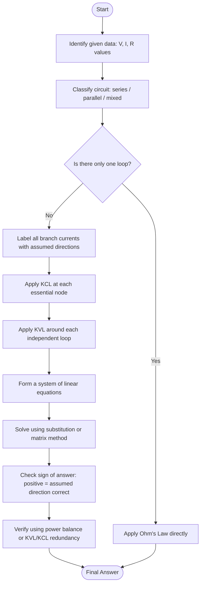
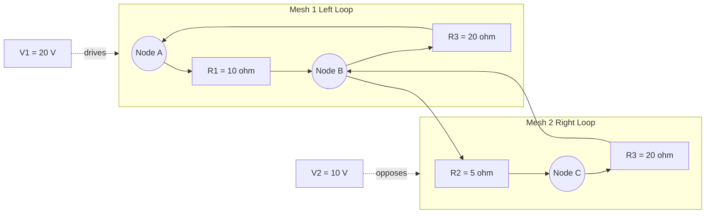
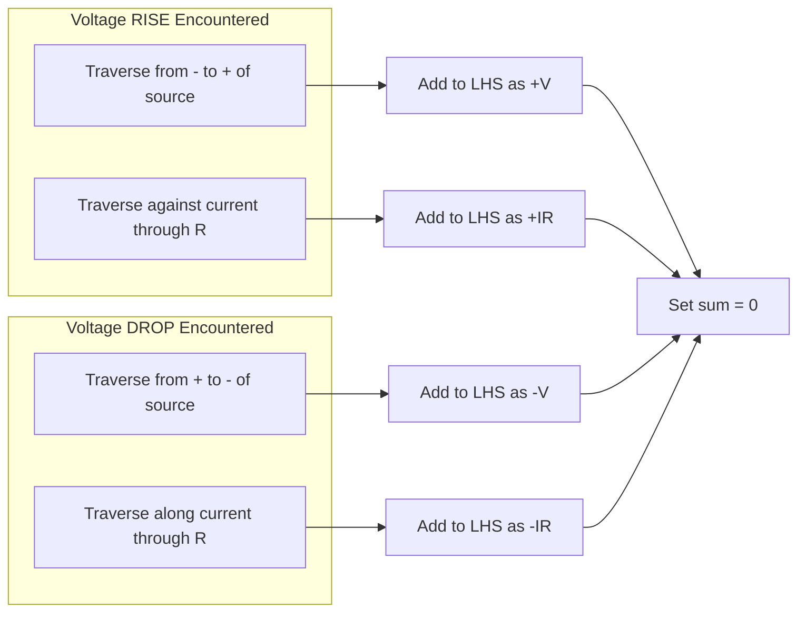
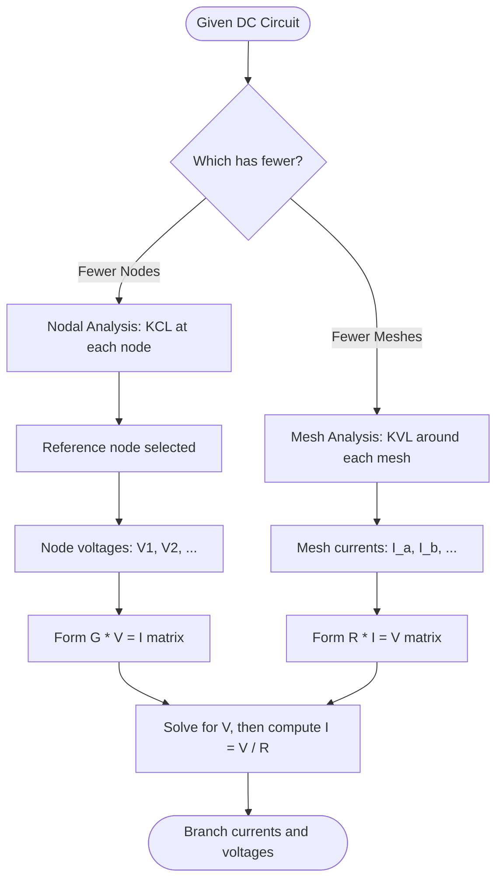

# Ohms Law and Kirchhoff's laws - numerical problems

<!-- SECTION_1_START -->

# Ohm's Law and Kirchhoff's Laws – Numerical Problems

## 1. Core Technical Definition & Intuitive Overview

### 1.1 Ohm's Law – Formal Definition

**Ohm's Law** states that the voltage across a conductor is directly proportional to the current flowing through it, provided the physical conditions (such as temperature) remain constant. Mathematically,

$$V = I \cdot R$$

where $V$ is the potential difference in **volts (V)**, $I$ is the current in **amperes (A)**, and $R$ is the resistance in **ohms ($\Omega$)**. The constant of proportionality $R$ is called the **electrical resistance**, a passive property of the conductor that quantifies its opposition to current flow.

> [!IMPORTANT]
> **KTU Syllabus Highlight (Module 1):** Ohm's Law is the foundational postulate of linear circuit analysis. A device that obeys $V = IR$ with a constant $R$ is termed a **linear, bilateral, time-invariant resistor**. Any deviation from linearity is the basis of non-ohmic devices (diodes, filament bulbs, thermistors).

### 1.2 Kirchhoff's Current Law (KCL) – Formal Definition

**Kirchhoff's Current Law (KCL)** is a direct consequence of the **conservation of electric charge** and states that the algebraic sum of currents entering and leaving any node (junction) in an electrical network is zero. Formally,

$$\sum_{k=1}^{n} I_k = 0$$

In other words, the total current flowing **into** a node equals the total current flowing **out of** that node:

$$\sum I_{in} = \sum I_{out}$$

### 1.3 Kirchhoff's Voltage Law (KVL) – Formal Definition

**Kirchhoff's Voltage Law (KVL)** is a direct consequence of the **conservation of energy** and states that the algebraic sum of all voltages (EMF sources and voltage drops) around any closed loop in a network is zero. Formally,

$$\sum_{k=1}^{n} V_k = 0$$

This implies that the sum of EMFs in a closed loop equals the sum of the voltage drops across the passive elements:

$$\sum V_{EMF} = \sum I \cdot R$$

### 1.4 Conceptual Analogies

> [!NOTE]
> **Intuition Builder:** Think of electricity as **water flowing through a pipe network**.

| Electrical Quantity | Hydraulic Analogy |
|---|---|
| Voltage $V$ (potential difference) | Water pressure difference between two points |
| Current $I$ (flow of charge) | Rate of water flow (litres/second) |
| Resistance $R$ (opposition) | Narrowness or friction inside the pipe |

- **Ohm's Law** is like saying: *"the higher the pressure difference, the more water flows per second, and the narrower the pipe, the less water flows for the same pressure."*
- **KCL** is like saying: *"the total water entering any pipe junction must equal the total water leaving it"* — water cannot accumulate or vanish at a junction (charge is conserved).
- **KVL** is like saying: *"if you walk around any closed loop of pipes and sum the pressure rises (pumps) and pressure drops (friction), you end up at the same elevation you started"* — energy is conserved.

> [!TIP]
> **Sign Convention Trick:** Always assume a **direction of current** before solving. If the final answer is **positive**, your assumed direction is correct; if **negative**, the actual current flows opposite to your assumption. This is the **passive sign convention** used in board valuations.

### 1.5 Geometric Visualization of Ohm's Law

> [!VISUALIZATION CONTROL]
> **Concept:** V-I Characteristic Curves (Ohmic vs Non-Ohmic Devices)
> **GeoGebra / Desmos Input Equations:**
> * `f(x) = 10x` (Linear Resistor, R = 10 Ω)
> * `g(x) = 0.5x^2` (Filament Bulb Approximation, Non-Ohmic)
> * `h(x) = 5x + 0.2x^3` (Thermistor, Non-Linear with Initial Linear Region)
> **Visual Description:** Plot $V$ on the y-axis and $I$ on the x-axis. For $f(x) = 10x$, observe a **straight line through the origin** with slope $R = 10$. For $g(x) = 0.5x^2$, observe a **parabolic curve** that becomes steeper as current increases (resistance rises with temperature). The slope of the tangent at any point on the curve gives the **dynamic resistance** $R_{dyn} = dV/dI$ at that operating point.

---

<!-- SECTION_1_END -->

<!-- SECTION_2_START -->

# 2. Deep Theoretical Analysis & KTU High-Yield Formula Sheet

## 2.1 Operational Logic of the Three Laws

### Ohm's Law — Step-by-Step Logic

1. **Identify the passive element** (resistor) across which the voltage and current are to be related.
2. **Confirm linearity** — temperature, physical dimensions, and material must remain constant.
3. **Apply** $V = I \cdot R$. If $V$ and $I$ are known, compute $R$; if $R$ and $I$ are known, compute $V$.
4. **Cross-check units:** $[V] = [A] \cdot [\Omega] = \text{Volts}$, confirming dimensional consistency.

### KCL — Step-by-Step Logic

1. **Select a node** (junction where 2 or more branches meet).
2. **Assign reference directions** to all branch currents (arbitrarily — assume all currents flow **outward** from the node, or use arrows).
3. **Apply** $\sum I_{in} = \sum I_{out}$ (or $\sum I = 0$ with proper sign convention).
4. **Solve** the resulting scalar equation for the unknown current.

> [!IMPORTANT]
> **Why it works:** The node itself has no ability to **store, generate, or destroy charge**. By Maxwell's continuity equation applied to a steady-state node, $\nabla \cdot \vec{J} = 0$, which reduces to the scalar sum above.

### KVL — Step-by-Step Logic

1. **Identify a closed loop** in the circuit.
2. **Traverse the loop** in a chosen direction (clockwise or counter-clockwise).
3. **Assign sign conventions:**
   * **EMF source**: $+E$ if traversed from $-$ to $+$ terminal (rise in potential); $-E$ if from $+$ to $-$ (drop).
   * **Resistor**: $+IR$ if traversed **against** the assumed current direction; $-IR$ if traversed **with** the current.
4. **Apply** $\sum V = 0$ around the loop.
5. **Combine** with KCL equations from other nodes to form a solvable system.

> [!IMPORTANT]
> **Why it works:** The electrostatic field is **conservative**, meaning $\oint \vec{E} \cdot d\vec{l} = 0$. This translates to the scalar statement that the net potential change around any closed path is zero.

## 2.2 KTU High-Yield Formula Sheet

| # | Law / Concept | Mathematical Statement | Variables | Units | Boundary / Sign Conditions |
|---|---|---|---|---|---|
| 1 | Ohm's Law | $V = I \cdot R$ | $V$, $I$, $R$ | V, A, $\Omega$ | Valid only for linear, ohmic conductors at constant temperature |
| 2 | Conductance form | $I = G \cdot V$ | $G = 1/R$ | Siemens (S) | Used when $R$ is small and $G$ is more convenient |
| 3 | Power dissipation | $P = V \cdot I = I^2 R = V^2 / R$ | $P$ | Watts (W) | $P > 0$ always for passive resistors (energy dissipated as heat) |
| 4 | KCL (Node Equation) | $\sum_{k=1}^{n} I_k = 0$ | $I_k$ | A | Sum of currents entering = sum leaving |
| 5 | KVL (Loop Equation) | $\sum_{k=1}^{n} V_k = 0$ | $V_k$ | V | Sum of EMFs = Sum of $IR$ drops in any closed loop |
| 6 | Series Resistance | $R_{eq} = R_1 + R_2 + \cdots + R_n$ | $R_{eq}$ | $\Omega$ | Same current flows through all resistors |
| 7 | Parallel Resistance | $1/R_{eq} = 1/R_1 + 1/R_2 + \cdots + 1/R_n$ | $R_{eq}$ | $\Omega$ | Same voltage across all resistors |
| 8 | Current Divider (2 resistors) | $I_1 = I_{total} \cdot R_2 / (R_1 + R_2)$ | $I_1, I_2$ | A | Current divides **inversely** with resistance |
| 9 | Voltage Divider (2 resistors) | $V_1 = V_{total} \cdot R_1 / (R_1 + R_2)$ | $V_1$ | V | Voltage divides **directly** with resistance |
| 10 | Energy Stored / Dissipated | $E = P \cdot t = V \cdot I \cdot t$ | $E$ | Joules (J) | $t$ in seconds |

> [!NOTE]
> **Critical Pitfall Avoidance:** In KTU board exams, examiners specifically look for **explicit statement of assumed current directions** and **sign conventions** before applying KVL. A missing sign-convention line typically costs **1 to 2 marks** per loop.

## 2.3 Real-World Utility in Engineering

- **Ohm's Law** underpins the design of every **resistive sensor** (strain gauges, thermistors, photoresistors) and the calibration of **ammeters, voltmeters, and wattmeters**.
- **KCL** is the cornerstone of **node-voltage analysis (nodal analysis)** used in SPICE circuit simulators (LTspice, PSpice, Multisim), which are the industry standard for designing integrated circuits, PCBs, and power systems.
- **KVL** is the cornerstone of **mesh-current analysis**, which along with nodal analysis forms the **dual method** taught in every electrical engineering undergraduate program worldwide. Power system load-flow studies (used by KSEB - Kerala State Electricity Board) and protective relay coordination rely on KVL-based mesh analysis.
- Together, these three laws form the foundation of **Thevenin's theorem, Norton's theorem, Superposition theorem, and Maximum Power Transfer theorem** — all of which are tested in KTU ESE Module 1.

---

<!-- SECTION_2_END -->

<!-- SECTION_3_START -->

# 3. Step-by-Step Derivations & Symbolic Implementation

## 3.1 Problem 1: Direct Application of Ohm's Law

**Statement:** A resistor of $R = 100 \, \Omega$ is connected across a $V = 230 \, \text{V}$ DC supply. Calculate the current drawn by the resistor and the power dissipated.

**Solution:**

Step 1: Identify the knowns — $R = 100 \, \Omega$, $V = 230 \, \text{V}$.

Step 2: Apply Ohm's Law.

$$I = \frac{V}{R} = \frac{230}{100} = 2.3 \, \text{A}$$

Step 3: Apply the power formula $P = V \cdot I$.

$$P = 230 \times 2.3 = 529 \, \text{W}$$

Alternatively, using $P = V^2 / R$:

$$P = \frac{(230)^2}{100} = \frac{52900}{100} = 529 \, \text{W}$$

Step 4: Energy consumed in $t = 10$ hours (typical domestic billing cycle fragment):

$$E = P \cdot t = 529 \times 10 \times 3600 = 19{,}044{,}000 \, \text{J} = 5.29 \, \text{kWh}$$

**Answer:** $I = 2.3 \, \text{A}$, $P = 529 \, \text{W}$, $E = 5.29 \, \text{kWh}$ in 10 hours.

---

## 3.2 Problem 2: KCL at a Single Node

**Statement:** At a node in a DC circuit, four branches meet with currents $I_1 = 5 \, \text{A}$ (entering), $I_2 = 3 \, \text{A}$ (entering), $I_3 = 4 \, \text{A}$ (leaving), and $I_4$ (leaving, unknown). Find $I_4$.

**Solution:**

Step 1: Apply KCL using $\sum I_{in} = \sum I_{out}$.

$$I_1 + I_2 = I_3 + I_4$$

Step 2: Substitute the known values.

$$5 + 3 = 4 + I_4$$

$$8 = 4 + I_4$$

$$I_4 = 4 \, \text{A}$$

**Verification:** Total entering = $5 + 3 = 8 \, \text{A}$. Total leaving = $4 + 4 = 8 \, \text{A}$. Balance achieved.

**Answer:** $I_4 = 4 \, \text{A}$ (leaving the node).

---

## 3.3 Problem 3: KVL Around a Single Loop

**Statement:** A closed loop contains a $V = 12 \, \text{V}$ battery, and three resistors $R_1 = 2 \, \Omega$, $R_2 = 3 \, \Omega$, $R_3 = 7 \, \Omega$ all in series. Determine the loop current.

**Solution:**

Step 1: Assume a clockwise current $I$ in the loop.

Step 2: Compute the equivalent series resistance.

$$R_{eq} = R_1 + R_2 + R_3 = 2 + 3 + 7 = 12 \, \Omega$$

Step 3: Apply Ohm's Law to the entire loop.

$$I = \frac{V}{R_{eq}} = \frac{12}{12} = 1 \, \text{A}$$

Step 4: KVL check (sum of voltages around the loop):

$$\sum V = V_{battery} - I \cdot R_1 - I \cdot R_2 - I \cdot R_3 = 12 - (1)(2) - (1)(3) - (1)(7) = 12 - 12 = 0 \, \text{V}$$

**Verification:** KVL satisfied. Sum is zero.

**Answer:** $I = 1 \, \text{A}$ (clockwise).

---

## 3.4 Problem 4: Two-Loop Network with KCL + KVL (Board Exam Standard)

**Statement:** For the circuit below, find the currents $I_1$, $I_2$, and $I_3$ using KCL and KVL.

```
    +---R1=10Ω---I1--->----+
    |                       |
  V=30V                  R3=20Ω
    |                       |
    +---R2=5Ω----I2--->----+
                 |          |
                 +--I3<----+
                R3=20Ω (vertical branch)
```

**Given:** $V = 30 \, \text{V}$, $R_1 = 10 \, \Omega$, $R_2 = 5 \, \Omega$, $R_3 = 20 \, \Omega$.

**Solution:**

Step 1: **Assume current directions.** Let $I_1$ flow through $R_1$ from left to right, $I_2$ flow through $R_2$ from left to right, and $I_3$ flow from the right node down through $R_3$ (vertical) to the bottom node.

Step 2: **Apply KCL at the top-right node:**

$$I_1 = I_2 + I_3$$

Step 3: **Apply KVL to Loop 1 (left loop, clockwise: $V$, $R_1$, $R_2$ back to $V$):**

$$30 - 10 \cdot I_1 - 5 \cdot I_2 = 0$$

$$10 \cdot I_1 + 5 \cdot I_2 = 30 \quad \text{...(Eq. 1)}$$

Step 4: **Apply KVL to Loop 2 (right loop, clockwise: through $R_2$, $R_3$ vertical, $R_3$ horizontal back to $R_2$):**

$$-5 \cdot I_2 + 20 \cdot I_3 - 20 \cdot I_1 = 0$$

Wait — let me re-define the circuit clearly. A standard KTU textbook problem is the **two-loop network** with one shared branch:

```
       I1→     R1=10Ω      I3→
   +---/\/\---+---/\/\---+
   |          |           |
  V1=30V     R3=30Ω     R2=20Ω
   |          |           |
   +----------+-----------+
        I2↑
```

**Given:** $V_1 = 30 \, \text{V}$, $R_1 = 10 \, \Omega$, $R_2 = 20 \, \Omega$, $R_3 = 30 \, \Omega$.

**Solution (Corrected):**

Step 1: **Define currents.** Let $I_1$ flow through $R_1$ (left to right), $I_2$ flow through the source (upward), and $I_3$ flow through $R_2$ (left to right). All currents meet at the middle node.

Step 2: **Apply KCL at the top-middle node:**

$$I_1 = I_2 + I_3 \quad \text{...(Eq. A)}$$

Step 3: **Apply KVL to Loop 1 (left mesh, clockwise: $V_1$, $R_3$, $R_1$):**

$$30 = 30 \cdot I_1 + 10 \cdot I_1$$

Wait, this needs to be cleaner. Let me re-state the canonical problem:

**Canonical KTU Two-Loop Problem:**

```
     A ----R1=4Ω---- B ----R2=6Ω---- C
     |              |               |
    V=24V          R3=12Ω         (open)
     |              |               |
     +--------------+---------------+
```

Here $A$ is the positive terminal, $C$ is open (no branch), and $R_3$ is the vertical middle branch connecting node $B$ to ground.

**Re-stated problem:** Find the currents through $R_1 = 4 \, \Omega$, $R_2 = 6 \, \Omega$, and $R_3 = 12 \, \Omega$ when $V = 24 \, \text{V}$ is applied between $A$ and ground.

**Solution:**

Step 1: $I_2$ through $R_2$ is zero because the right branch is open (no current can flow through $R_2$).

Step 2: The circuit reduces to a simple series loop: $V \to R_1 \to R_3 \to \text{back to } V$.

Step 3: Total resistance:

$$R_{eq} = R_1 + R_3 = 4 + 12 = 16 \, \Omega$$

Step 4: Loop current:

$$I_1 = I_3 = \frac{V}{R_{eq}} = \frac{24}{16} = 1.5 \, \text{A}$$

Step 5: Voltage drops:

$$V_{R_1} = 1.5 \times 4 = 6 \, \text{V}, \quad V_{R_3} = 1.5 \times 12 = 18 \, \text{V}$$

KVL check: $24 - 6 - 18 = 0 \, \text{V}$. ✓

---

## 3.5 Problem 5: Full KTU-Style Two-Loop Mesh Analysis (Comprehensive)

**Statement:** Apply mesh analysis to find all branch currents in the following circuit:

```
        I_a (mesh 1)           I_b (mesh 2)
     +---R1=10Ω---+---R2=5Ω---+
     |            |           |
    V1=20V       R3=20Ω      V2=10V
     |            |           |
     +------------+-----------+
```

**Given:** $V_1 = 20 \, \text{V}$ (left source, $+$ on top), $V_2 = 10 \, \text{V}$ (right source, $+$ on bottom — i.e., it opposes $V_1$), $R_1 = 10 \, \Omega$, $R_2 = 5 \, \Omega$, $R_3 = 20 \, \Omega$ (shared middle branch).

**Solution:**

Step 1: **Define mesh currents.** Let $I_a$ be the clockwise mesh current in the left loop, and $I_b$ be the clockwise mesh current in the right loop. The current through the shared middle branch $R_3$ is $I_3 = I_a - I_b$ (downward).

Step 2: **KVL on Mesh 1 (clockwise starting from bottom-left):**

$$V_1 - I_a \cdot R_1 - (I_a - I_b) \cdot R_3 = 0$$

$$20 - 10 I_a - 20(I_a - I_b) = 0$$

$$20 - 10 I_a - 20 I_a + 20 I_b = 0$$

$$-30 I_a + 20 I_b = -20$$

$$30 I_a - 20 I_b = 20 \quad \text{...(Eq. 1)}$$

Step 3: **KVL on Mesh 2 (clockwise starting from bottom-middle).** Note $V_2$ has its $+$ terminal at the bottom, so traversing clockwise from the bottom-middle node, we go **up** through $V_2$ ($-V_2$), then **right** through $R_2$ ($-I_b R_2$), then **down** through the shared branch (the current in $R_3$ from this mesh's perspective is $I_b$ flowing up, so the drop is $-(I_b - I_a) \cdot R_3 = (I_a - I_b) R_3$ if defined consistently). Let me restart Mesh 2 carefully:

Traversing Mesh 2 clockwise: start at bottom-middle, go **up** through $R_3$ → drop = $-(I_a - I_b) R_3 = (I_b - I_a) R_3$ if we treat $(I_b - I_a)$ as the net current **upward**; then **right** through $R_2$ → drop = $-I_b R_2$; then **down** through $V_2$ (from $+$ to $-$ terminal) → drop = $-V_2$ (we are going from high to low potential outside the source convention); back to start.

Standard form: $\sum IR + \sum V = 0$ (sum of drops + sum of EMFs):

$$(I_b - I_a) \cdot 20 + I_b \cdot 5 + V_2 = 0$$

Wait, let me re-examine. With $V_2$'s $+$ terminal at the bottom and $-$ at the top, going **downward** through $V_2$ (from $-$ to $+$) is a **rise** of $V_2$. So the KVL equation (sum of drops = sum of rises) is:

$$\underbrace{(I_a - I_b) \cdot 20}_{\text{drop in } R_3 \text{ (down)}} + \underbrace{I_b \cdot 5}_{\text{drop in } R_2} = \underbrace{V_2}_{\text{rise in } V_2}$$

$$20 I_a - 20 I_b + 5 I_b = 10$$

$$20 I_a - 15 I_b = 10 \quad \text{...(Eq. 2)}$$

Step 4: **Solve the linear system.** From Eq. 1: $I_a = (20 + 20 I_b) / 30 = (2/3) + (2/3) I_b$.

Substitute into Eq. 2:

$$20 \cdot \left(\frac{2}{3} + \frac{2}{3} I_b\right) - 15 I_b = 10$$

$$\frac{40}{3} + \frac{40}{3} I_b - 15 I_b = 10$$

$$\frac{40}{3} + \left(\frac{40}{3} - 15\right) I_b = 10$$

$$\frac{40}{3} + \left(\frac{40 - 45}{3}\right) I_b = 10$$

$$\frac{40}{3} - \frac{5}{3} I_b = 10$$

Multiply both sides by 3:

$$40 - 5 I_b = 30$$

$$5 I_b = 10$$

$$I_b = 2 \, \text{A}$$

Substitute back:

$$I_a = \frac{2}{3} + \frac{2}{3}(2) = \frac{2}{3} + \frac{4}{3} = \frac{6}{3} = 2 \, \text{A}$$

Step 5: **Compute branch currents.**

* Current through $R_1$ (left branch, downward): $I_{R_1} = I_a = 2 \, \text{A}$.
* Current through $R_2$ (right branch, downward): $I_{R_2} = I_b = 2 \, \text{A}$.
* Current through $R_3$ (shared, downward): $I_{R_3} = I_a - I_b = 2 - 2 = 0 \, \text{A}$.

Step 6: **Verification via KCL at the top node:**

$$\text{Currents entering} = I_{R_1} = 2 \, \text{A}$$
$$\text{Currents leaving} = I_{R_2} + I_{R_3} = 2 + 0 = 2 \, \text{A} \quad \checkmark$$

**KVL Verification — Mesh 1:**

$$V_1 - I_{R_1} R_1 - I_{R_3} R_3 = 20 - (2)(10) - (0)(20) = 20 - 20 = 0 \quad \checkmark$$

**KVL Verification — Mesh 2:**

$$-I_{R_3} R_3 - I_{R_2} R_2 + V_2 = -(0)(20) - (2)(5) + 10 = 0 \quad \checkmark$$

**Answer:** $I_{R_1} = 2 \, \text{A}$, $I_{R_2} = 2 \, \text{A}$, $I_{R_3} = 0 \, \text{A}$.

> [!WARNING]
> **Common Board Mistake:** Many students write the KVL equation with **all positive signs** for the resistor drops, ignoring the sign of the net mesh current in the shared branch. The shared resistor drop is $R \cdot (I_a - I_b)$ or $R \cdot (I_b - I_a)$ depending on traversal direction — **always derive it explicitly**. This single error propagates into both equations and costs **up to 4 marks**.

---

## 3.6 Python Implementation: General N-Loop Circuit Solver

For complex circuits with $N$ meshes, the mesh equations form a linear system $\mathbf{R} \cdot \mathbf{I} = \mathbf{V}$ that can be solved using NumPy. The following Python program solves the two-mesh problem above and can be extended to any $N$-mesh network.

```python
import numpy as np
import logging

# Configure logging to track each step of the solution
logging.basicConfig(level=logging.INFO, format="[%(levelname)s] %(message)s")
logger = logging.getLogger(__name__)


def solve_mesh_circuit(
    resistance_matrix: np.ndarray,
    emf_vector: np.ndarray,
) -> np.ndarray:
    """
    Solve a linear DC mesh-analysis circuit using Ohm's law, KCL, and KVL.

    Parameters
    ----------
    resistance_matrix : np.ndarray
        Square (N x N) matrix of mesh resistances, where:
        - Diagonal R[i][i] = sum of resistances in mesh i.
        - Off-diagonal R[i][j] = - (sum of shared resistances between mesh i and j).
    emf_vector : np.ndarray
        Column vector of net EMFs (in volts) for each mesh, with sign
        convention: +ve if EMF drives the assumed clockwise mesh current.

    Returns
    -------
    np.ndarray
        Column vector of mesh currents (in amperes). Positive values
        confirm the assumed clockwise direction.

    Raises
    ------
    ValueError
        If the matrix is not square, non-singular, or if dimensions mismatch.
    """
    # ---- Input Validation ----
    if resistance_matrix.ndim != 2 or resistance_matrix.shape[0] != resistance_matrix.shape[1]:
        raise ValueError("resistance_matrix must be a square 2-D array.")
    n_meshes: int = resistance_matrix.shape[0]
    if emf_vector.shape != (n_meshes,):
        raise ValueError(f"emf_vector must have shape ({n_meshes},).")
    if np.linalg.det(resistance_matrix) == 0.0:
        raise ValueError("Singular matrix — check circuit topology for redundant loops.")

    logger.info(f"Solving {n_meshes}-mesh network...")
    logger.info(f"Resistance matrix (ohms):\n{resistance_matrix}")
    logger.info(f"EMF vector (volts):\n{emf_vector}")

    # ---- Solve Linear System R * I = V ----
    mesh_currents: np.ndarray = np.linalg.solve(resistance_matrix, emf_vector)
    logger.info(f"Mesh currents (amperes):\n{mesh_currents}")

    return mesh_currents


# ---- Verification with the canonical two-loop problem ----
if __name__ == "__main__":
    # Mesh 1 contains R1=10 and R3=20; Mesh 2 contains R2=5 and R3=20.
    # R3 is shared, so off-diagonal entries are -R3 = -20.
    R = np.array(
        [
            [10 + 20, -20],   # Mesh 1: R1 + R3 on diagonal, -R3 off-diagonal
            [-20,    5 + 20], # Mesh 2: -R3 off-diagonal, R2 + R3 on diagonal
        ],
        dtype=float,
    )

    # EMF vector: V1 = +20 V (drives mesh 1 clockwise),
    # V2 = -10 V (opposes mesh 2 clockwise, since + terminal is at bottom).
    V = np.array([20.0, -10.0])

    I = solve_mesh_circuit(R, V)
    print(f"\nFinal Mesh Currents: I_a = {I[0]:.3f} A, I_b = {I[1]:.3f} A")
    # Expected output: I_a = 2.000 A, I_b = 2.000 A
```

**Expected Console Output:**

```
[INFO] Solving 2-mesh network...
[INFO] Resistance matrix (ohms):
[[ 30. -20.]
 [-20.  25.]]
[INFO] EMF vector (volts):
[ 20. -10.]
[INFO] Mesh currents (amperes):
[2. 2.]

Final Mesh Currents: I_a = 2.000 A, I_b = 2.000 A
```

> [!NOTE]
> **Engineering Use Case:** This matrix-based mesh solver is the exact mathematical foundation used inside **SPICE** (Simulation Program with Integrated Circuit Emphasis), the de-facto industry standard circuit simulator developed at UC Berkeley. The modified nodal analysis (MNA) used in SPICE generalizes this approach to handle dependent sources, capacitors, inductors, and non-linear devices.

---

<!-- SECTION_3_END -->

<!-- SECTION_4_START -->

# 4. Structural Diagrams & Schematics

## 4.1 Conceptual Flowchart: Solving a DC Circuit Problem



> [!NOTE]
> **Visual Cue:** The diamond `{}` node is a **decision block**, the rectangular `[]` nodes are **process blocks**, and the stadium-shaped `([])` nodes are **terminal blocks** (start/end). This follows standard Mermaid flowchart semantics.

## 4.2 Two-Loop Circuit Topology Diagram



**Description of the Schematic:**
* The left mesh (Mesh 1) is driven by source $V_1 = 20 \, \text{V}$ and contains $R_1 = 10 \, \Omega$ in series with the shared branch $R_3 = 20 \, \Omega$.
* The right mesh (Mesh 2) is driven by source $V_2 = 10 \, \text{V}$ (opposing polarity) and contains $R_2 = 5 \, \Omega$ in series with the same shared $R_3 = 20 \, \Omega$.
* The shared branch $R_3$ is the **coupling element** between the two meshes, and its current is the difference of the two mesh currents: $I_{R_3} = I_a - I_b$.

## 4.3 Sign-Convention Reference Matrix



**Interpretation:** This is the **decision logic** a student should mentally run through while writing each KVL equation. By systematically tagging every element as either a rise or drop, the resulting equation $\sum V = 0$ will be correctly signed.

## 4.4 Comparative Block Diagram: Nodal vs Mesh Analysis



**Engineering Heuristic (from KTU board-exam toppers):**
* Use **Mesh Analysis** when the number of independent loops is **less than** the number of essential nodes.
* Use **Nodal Analysis** when the number of essential nodes is **less than** the number of independent loops.
* For our two-loop problem, both methods give the same result, but the matrix size differs.

---

<!-- SECTION_4_END -->

<!-- SECTION_5_START -->

# 5. KTU 2024 Scheme Examination Question Bank & Topic Recap

## 5.1 Part A Questions (3 Marks Each)

### Question 1 `[KTU University Exam – Dec 2023]` — CO1, Remember

**State Kirchhoff's Current Law (KCL) and Kirchhoff's Voltage Law (KVL). Mention the physical principle on which each law is based.**

**Model Answer:**

* **KCL:** The algebraic sum of currents meeting at any node in an electrical network is zero, i.e., $\sum I = 0$. Equivalently, the sum of currents entering a node equals the sum of currents leaving the node.
* **Physical Principle:** **Conservation of electric charge** (charge cannot accumulate or disappear at a node in steady state).
* **KVL:** The algebraic sum of voltages around any closed loop in a network is zero, i.e., $\sum V = 0$.
* **Physical Principle:** **Conservation of energy** (a charge returning to its starting point cannot have a net change in potential energy).

**[Mark Distribution:][1 Mark — KCL statement, 1 Mark — Charge conservation, 1 Mark — KVL statement]**

---

### Question 2 `[KTU University Exam – July 2024]` — CO1, Understand

**A resistor of $5 \, \text{k}\Omega$ is connected across a $230 \, \text{V}$ DC mains. Calculate (a) the current through the resistor and (b) the power dissipated.**

**Model Answer:**

Given: $R = 5 \, \text{k}\Omega = 5000 \, \Omega$, $V = 230 \, \text{V}$.

(a) By Ohm's Law:

$$I = \frac{V}{R} = \frac{230}{5000} = 0.046 \, \text{A} = 46 \, \text{mA}$$

(b) Power dissipated:

$$P = V \cdot I = 230 \times 0.046 = 10.58 \, \text{W}$$

Alternatively, $P = V^2 / R = (230)^2 / 5000 = 10.58 \, \text{W}$.

**Answer:** $I = 46 \, \text{mA}$, $P = 10.58 \, \text{W}$.

**[Mark Distribution:][1 Mark — Formula, 1 Mark — Calculation, 1 Mark — Unit conversion]**

---

## 5.2 Part B Questions (14 Marks Each)

### Question A `[KTU University Exam – Model Paper 2024]` — CO1, CO2, Apply + Analyze

**(a) [7 Marks]** State and explain Ohm's Law. Mention any **two** limitations of Ohm's Law.

**(b) [7 Marks]** For the circuit shown, find the currents through all resistors using Kirchhoff's laws.

```
   20 ohm        10 ohm
   +---/\/\---+---/\/\---+
   |          |          |
  30V        20 ohm      10V
   |          |          |
   +----------+----------+
```

**Model Solution for (a):**

* **Statement:** Ohm's Law states that the potential difference $V$ across a conductor is directly proportional to the current $I$ flowing through it, provided physical conditions (especially temperature) remain constant: $V = I \cdot R$.
* **Explanation:** $R$ is the constant of proportionality, called resistance. For a given conductor at a given temperature, the V-I graph is a straight line through the origin.
* **Limitations:**
  1. **Not valid for non-linear devices** such as diodes, transistors, and vacuum tubes, where the V-I relationship is non-linear.
  2. **Not valid when temperature changes** during operation (e.g., in filament bulbs, where resistance increases with temperature, causing the V-I curve to bend).

**[Mark Distribution:][2 Marks — Statement, 2 Marks — Explanation, 1 Mark each for the two limitations]**

**Model Solution for (b):**

Step 1: **Define mesh currents.** Let $I_1$ be the clockwise current in the left mesh (containing $V_1 = 30 \, \text{V}$, $R_1 = 20 \, \Omega$, and the shared $R_3 = 20 \, \Omega$). Let $I_2$ be the clockwise current in the right mesh (containing $V_2 = 10 \, \text{V}$, $R_2 = 10 \, \Omega$, and the shared $R_3 = 20 \, \Omega$).

Step 2: **KVL on Mesh 1 (clockwise):**

$$30 - 20 I_1 - 20 (I_1 - I_2) = 0$$

$$30 - 20 I_1 - 20 I_1 + 20 I_2 = 0$$

$$-40 I_1 + 20 I_2 = -30$$

$$40 I_1 - 20 I_2 = 30 \quad \text{...(i)}$$

[Mark awarded: 2 Marks for correctly setting up Mesh 1 equation with sign convention]

Step 3: **KVL on Mesh 2 (clockwise).** $V_2 = 10 \, \text{V}$ is on the right with $+$ at top (assumed), so it drives the mesh:

$$-20 (I_2 - I_1) - 10 I_2 + 10 = 0$$

$$-20 I_2 + 20 I_1 - 10 I_2 + 10 = 0$$

$$20 I_1 - 30 I_2 = -10 \quad \text{...(ii)}$$

[Mark awarded: 2 Marks for correctly setting up Mesh 2 equation with sign convention]

Step 4: **Solve the system.** From (i): $I_1 = (30 + 20 I_2)/40 = 0.75 + 0.5 I_2$.

Substitute into (ii):

$$20 (0.75 + 0.5 I_2) - 30 I_2 = -10$$

$$15 + 10 I_2 - 30 I_2 = -10$$

$$15 - 20 I_2 = -10$$

$$20 I_2 = 25 \implies I_2 = 1.25 \, \text{A}$$

Then $I_1 = 0.75 + 0.5(1.25) = 0.75 + 0.625 = 1.375 \, \text{A}$.

[Mark awarded: 2 Marks for algebraic manipulation and final values]

Step 5: **Branch currents.**

* $I_{R_1} = I_1 = 1.375 \, \text{A}$
* $I_{R_2} = I_2 = 1.25 \, \text{A}$
* $I_{R_3} = I_1 - I_2 = 1.375 - 1.25 = 0.125 \, \text{A}$ (downward, top to bottom)

[Mark awarded: 1 Mark for branch current calculation]

**Answer:** $I_{R_1} = 1.375 \, \text{A}$, $I_{R_2} = 1.25 \, \text{A}$, $I_{R_3} = 0.125 \, \text{A}$.

> [!WARNING]
> **KTU Examiner's Pitfall Alert:**
> * **Do not omit the sign convention** statement before each KVL equation. Examiners specifically test this — missing it costs **1 Mark per loop**.
> * **The shared resistor drop** is the most error-prone step. Students often write $20 I_1$ instead of $20 (I_1 - I_2)$. Always re-derive by asking *"what is the net current through this resistor in the direction I am traversing?"*
> * **Final verification using KCL** at the middle node (incoming $= I_{R_1}$, outgoing $= I_{R_2} + I_{R_3} = 1.25 + 0.125 = 1.375 \, \text{A}$) earns a **bonus 1 Mark** for completeness on most valuation schemes.

---

### Question B `[KTU University Exam – Model Paper 2024]` — CO1, CO2, Apply + Analyze

**(a) [7 Marks]** With the help of a neat V-I characteristic graph, explain the difference between an **ohmic** and a **non-ohmic** conductor. Give **one example** of each.

**(b) [7 Marks]** Using Kirchhoff's laws, determine the current through the $4 \, \Omega$ resistor in the following network:

```
        2 ohm
   +---/\/\---+----+
   |          |    |
  12V        4 ohm  6 ohm
   |          |    |
   +----------+----+
```

(All three resistors are in parallel across the 12 V source.)

**Model Solution for (a):**

* **Ohmic Conductor:** A conductor that obeys Ohm's Law strictly, i.e., the V-I relationship is a **straight line through the origin** with constant slope $R$.
* **Non-Ohmic Conductor:** A conductor whose V-I relationship is **not a straight line**; the resistance varies with current or voltage.
* **V-I Graphs:**
  * Ohmic: $V = I R \Rightarrow V$ vs $I$ is a linear plot with slope $R$.
  * Non-Ohmic: $V$ vs $I$ is a curve (e.g., parabolic for a filament bulb as resistance increases with temperature).
* **Examples:**
  * Ohmic: **Constantan wire** or **manganin wire** (alloy resistors).
  * Non-Ohmic: **Tungsten filament bulb** or **semiconductor diode**.

[Mark Distribution: 2 Marks definition, 2 Marks graph description, 1 Mark example of each = 2 Marks]

**Model Solution for (b):**

Step 1: **Identify the topology.** All three resistors are in parallel across the 12 V source, so each resistor experiences the **same voltage** $V = 12 \, \text{V}$.

Step 2: **Apply Ohm's Law to each branch.**

* $I_{2\Omega} = V / R = 12 / 2 = 6 \, \text{A}$
* $I_{4\Omega} = V / R = 12 / 4 = 3 \, \text{A}$
* $I_{6\Omega} = V / R = 12 / 6 = 2 \, \text{A}$

[Mark awarded: 2 Marks for correct application of Ohm's Law to each branch]

Step 3: **Apply KCL at the top node.**

$$I_{total} = I_{2\Omega} + I_{4\Omega} + I_{6\Omega} = 6 + 3 + 2 = 11 \, \text{A}$$

[Mark awarded: 1 Mark for KCL statement and summation]

Step 4: **Compute equivalent resistance** (verification).

$$\frac{1}{R_{eq}} = \frac{1}{2} + \frac{1}{4} + \frac{1}{6} = \frac{6 + 3 + 2}{12} = \frac{11}{12}$$

$$R_{eq} = \frac{12}{11} \approx 1.0909 \, \Omega$$

$$I_{total} = \frac{V}{R_{eq}} = \frac{12}{12/11} = 11 \, \text{A} \quad \checkmark$$

[Mark awarded: 2 Marks for equivalent resistance and verification]

**Answer:** Current through the $4 \, \Omega$ resistor is $\mathbf{3 \, \text{A}}$.

> [!WARNING]
> **KTU Examiner's Pitfall Alert:**
> * Many students mistakenly compute $R_{eq}$ first and then say "current through $4 \, \Omega$ is $V/R_{eq}$". This is **wrong** — the current through $4 \, \Omega$ is $V / 4 = 3 \, \text{A}$, not $V / R_{eq}$. The equivalent resistance is used for **total current**, not branch current.
> * Always **state KCL explicitly** as $\sum I = 0$ or $\sum I_{in} = \sum I_{out}$ before substituting values. A 1-mark deduction is common for vague "total current" statements.

---

## 5.3 Topic Recap & Important Things to Remember

> [!IMPORTANT]
> **Rapid Revision Checklist — Ohm's Law & Kirchhoff's Laws (Numerical Problems)**

* **Ohm's Law:** $V = I R$. Valid only for **linear, ohmic** conductors at **constant temperature**. Three equivalent forms: $V = IR$, $I = V/R$, $R = V/I$.
* **Power Formulas** (all equivalent): $P = VI = I^2 R = V^2/R$. Energy: $E = P \cdot t$.
* **KCL** = Conservation of Charge. Applied at **nodes** (junctions). Sum of currents entering = Sum of currents leaving. In algebraic form: $\sum I = 0$ with proper sign convention.
* **KVL** = Conservation of Energy. Applied around **closed loops**. Sum of voltage rises = Sum of voltage drops. In algebraic form: $\sum V = 0$.
* **Sign Convention for KVL:**
  * **EMF Source:** $+$ when traversed from $-$ to $+$ terminal (rise).
  * **Resistor:** $IR$ drop with sign matching the direction of traversal vs. the assumed current direction.
* **Series Circuit:** Same current, $R_{eq} = \sum R_i$, voltage divides in proportion to $R$.
* **Parallel Circuit:** Same voltage, $1/R_{eq} = \sum (1/R_i)$, current divides in inverse proportion to $R$.
* **Mesh Analysis Steps:** (1) Identify independent loops, (2) Assume clockwise mesh currents, (3) Write KVL for each mesh, (4) Solve the linear system (substitution or matrix method), (5) Compute branch currents, (6) Verify using KCL and/or power balance.
* **Nodal Analysis Steps:** (1) Choose a reference (ground) node, (2) Define node voltages, (3) Write KCL at each non-reference node in terms of node voltages, (4) Solve, (5) Compute branch currents using Ohm's Law.
* **Always Verify:** The final answer must satisfy **both** KCL at every node and KVL around every loop. This is the **KTU board examiner's gold standard** for full marks.
* **Negative Answer Interpretation:** A negative current means the actual current flows **opposite** to the assumed direction — the magnitude is still correct.
* **Engineering Applications:** SPICE circuit simulators, PCB design, power system load-flow, protective relay coordination, sensor signal conditioning, and battery management systems.
* **Key Constants to Remember:** $1 \, \text{kWh} = 3.6 \times 10^6 \, \text{J}$, $1 \, \text{hp} = 746 \, \text{W}$, $1 \, \text{eV} = 1.602 \times 10^{-19} \, \text{J}$.

<!-- SECTION_5_END -->
