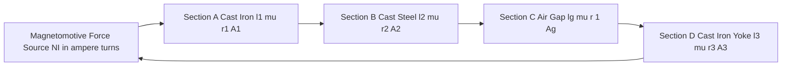
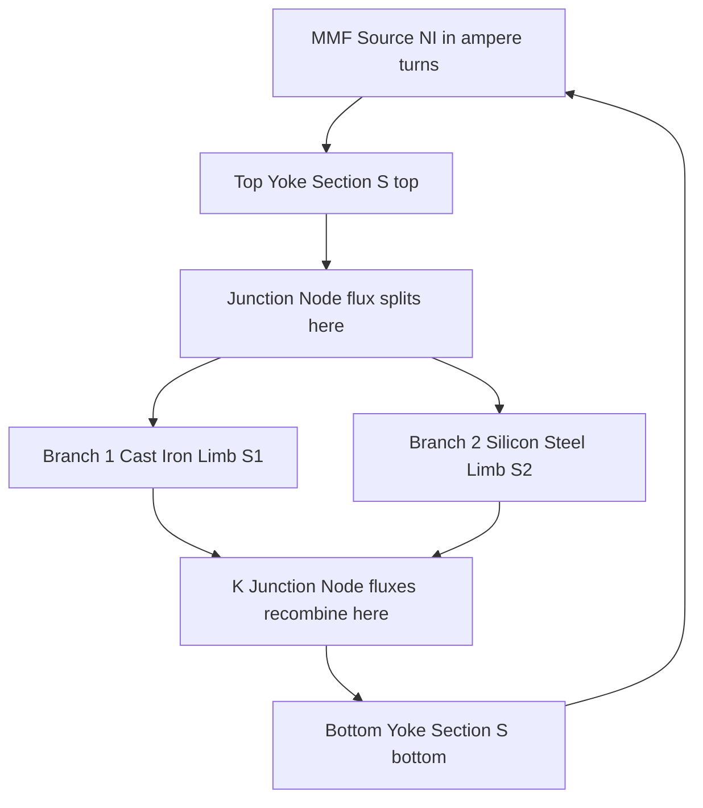
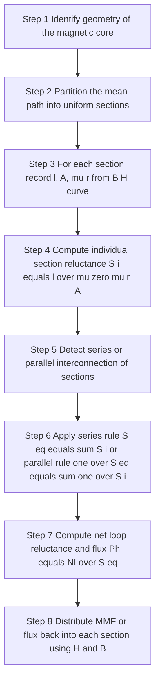

# Series and parallel magnetic circuits with composite materials (numerical problems not needed)

<!-- SECTION_1_START -->
# Core Technical Definition & Intuitive Overview

## 1.1 The Magnetic Circuit — Formal KTU Definition

A **magnetic circuit** is a closed path (or network of paths) that confines and guides magnetic flux $\Phi$ through one or more ferromagnetic or other magnetically permeable media, excited by a source of **Magnetomotive Force (MMF)** denoted by $\mathcal{F}$.

$$\mathcal{F} = N I \quad [\text{ampere-turns (A-t)}]$$

The governing physical law of a magnetic circuit is **Ampere's Circuital Law (ACL)** in integral form:

$$\oint_{C} \vec{H} \cdot d\vec{l} = N I = \mathcal{F}$$

> [!IMPORTANT]
> **KTU 2024 Syllabus Note:** The phrase "composite materials" in the GXEST104 syllabus explicitly refers to the case where a single magnetic path is made of **two or more different media** (e.g., cast iron + silicon steel + air gap) joined end-to-end (series) or split across parallel branches (parallel), each having its own permeability $\mu$.

## 1.2 The Water-Pipe Analogy (KTU Intuition)

| Electrical Quantity | Magnetic Counterpart | Hydraulic Analogy |
|---|---|---|
| EMF $V$ | MMF $\mathcal{F} = NI$ | Water-pump pressure |
| Current $I$ | Flux $\Phi$ | Water-flow rate |
| Resistance $R$ | Reluctance $S$ | Pipe-friction |
| Permittivity $\varepsilon$ | Permeability $\mu$ | Pipe smoothness |
| $V = IR$ | $\mathcal{F} = \Phi S$ | $P = Q \cdot R$ |

> [!NOTE]
> **Intuition Box:** Imagine water flowing through a pipe network. A pump (the coil with $NI$ turns) pushes water (flux $\Phi$) through pipes (the magnetic core). A narrow, rough pipe represents high reluctance (e.g., air), while a wide, smooth iron pipe represents low reluctance (e.g., cast steel). The total pressure drop equals the sum of drops across each section — this is **Kirchhoff's Magnetic Law (KML)**, which is *not* a true Kirchhoff law but a direct application of Ampere's Law.

## 1.3 The Three KTU Building Blocks of a Composite Magnetic Circuit

A composite magnetic circuit is built from sections of **different materials**, each characterised by:

- **Length $l$** in metres,
- **Cross-sectional area $A$** in $\text{m}^{2}$,
- **Absolute permeability $\mu = \mu_{0}\mu_{r}$** where $\mu_{0} = 4\pi \times 10^{-7}\ \text{H/m}$ is the **permeability of free space** (bolded because it is a fundamental constant),
- **Reluctance $S = \dfrac{l}{\mu A}$** in ampere-turns per weber ($\text{A-t/Wb}$, equivalent to $\text{1/H}$ or $\text{H}^{-1}$).

> [!IMPORTANT]
> **Composite Material Examples for KTU (Memorise):**
> 1. **Cast Iron** : $\mu_{r} \approx 100 - 300$ (used in yokes of dynamos, cheap, lossy)
> 2. **Cast Steel** : $\mu_{r} \approx 300 - 900$ (used in pole cores)
> 3. **Silicon / Sheet Steel** : $\mu_{r} \approx 500 - 7000$ (used in transformer cores, lamination reduces eddy current loss)
> 4. **Air Gap** : $\mu_{r} = 1$ (dominant contributor to total reluctance; even $1\ \text{mm}$ of air can dominate the reluctance of a $1\ \text{m}$ iron path)

## 1.4 Series and Parallel Magnetic Circuits — Definitions

**Series Magnetic Circuit:**
A circuit in which the **same flux $\Phi$ passes sequentially through two or more sections** of different (composite) materials. The MMF drops add up along the path:

$$\mathcal{F}_{total} = \mathcal{F}_{1} + \mathcal{F}_{2} + \mathcal{F}_{3} + \dots = \Phi S_{total}$$

**Parallel Magnetic Circuit:**
A circuit in which the flux $\Phi$ **splits into two or more branches** (each of a different material), and each branch shares a **common MMF** (analogous to a common voltage across parallel resistors).

$$\mathcal{F}_{common} = \Phi_{1} S_{1} = \Phi_{2} S_{2} = \Phi_{3} S_{3} = \dots$$

> [!VISUALIZATION CONTROL]
> **Concept:** Visualising Series vs Parallel Reluctance
> **GeoGebra / Desmos Input Equations:**
> * `f1(x) = x` (line representing equal flux through all sections — series)
> * `f2(x) = piecewise(x <= 1, 2x, x > 1, x + 1)` (split flux in parallel)
> **Visual Description:** A linear graph of $\Phi$ on the y-axis vs section index on x-axis. For series, $\Phi$ remains constant across all sections (a horizontal line). For parallel, the bar chart shows how total $\Phi_{total} = \Phi_{1} + \Phi_{2}$ divides inversely proportional to each branch's reluctance.

<!-- SECTION_1_END -->

<!-- SECTION_2_START -->
# Deep Theoretical Analysis & KTU High-Yield Formula Sheet

## 2.1 Operational Definition of Reluctance

For an *ideal* uniform magnetic path of length $l$, area $A$, and absolute permeability $\mu$, the reluctance is:

$$S = \frac{l}{\mu A} = \frac{l}{\mu_{0}\mu_{r} A} \quad [\text{A-t/Wb}]$$

The **permeance** $\mathcal{P}$ is the reciprocal of reluctance:

$$\mathcal{P} = \frac{1}{S} = \frac{\mu A}{l} \quad [\text{Wb/A-t or H}]$$

> [!NOTE]
> **Why does reluctance matter in engineering?** Every rotating machine, transformer, inductor, relay, and MRI scanner is a magnetic circuit. The designer must size the iron core and the air gap precisely because the air gap — although physically tiny — controls the flux density, the saturation behaviour, and the magnetising current drawn from the supply.

## 2.2 The Three Foundational Magnetic Equations

$$\boxed{B = \mu H = \mu_{0}\mu_{r} H} \quad \text{(flux density)}$$

$$\boxed{\Phi = B A} \quad \text{(total flux through area $A$)}$$

$$\boxed{\mathcal{F} = H l} \quad \text{(MMF across a uniform section)}$$

These three combine to give the **Ohm's Law of Magnetic Circuits**:

$$\boxed{\mathcal{F} = \Phi S = \frac{\Phi\, l}{\mu A}}$$

## 2.3 KTU High-Yield Formula Sheet (Composite Material Circuits)

> [!IMPORTANT]
> Use the table below as your **single-page revision sheet** before the KTU exam. The `S_total` rules are the heart of Module 1.

| # | Quantity | Series Composite Circuit | Parallel Composite Circuit | Units |
|---|---|---|---|---|
| 1 | Common Variable | Same $\Phi$ through all sections | Same $\mathcal{F}$ across all branches | — |
| 2 | Reluctance Sum | $S_{eq} = S_{1} + S_{2} + S_{3} + \dots$ | $\dfrac{1}{S_{eq}} = \dfrac{1}{S_{1}} + \dfrac{1}{S_{2}} + \dfrac{1}{S_{3}} + \dots$ | $\text{H}^{-1}$ |
| 3 | MMF Distribution | $\mathcal{F}_{total} = \sum \Phi S_{i} = \Phi S_{eq}$ | $\mathcal{F}_{common} = \Phi_{i} S_{i}$ for each branch $i$ | $\text{A-t}$ |
| 4 | Flux Distribution | $\Phi$ = constant | $\Phi_{i} = \dfrac{\mathcal{F}_{common}}{S_{i}}$ | $\text{Wb}$ |
| 5 | Field Intensity in Section $i$ | $H_{i} = \dfrac{\mathcal{F}_{i}}{l_{i}} = \dfrac{\Phi}{\mu_{i} A_{i}}$ | $H_{i} = \dfrac{\mathcal{F}_{common}}{l_{i}}$ | $\text{A/m}$ |
| 6 | Composite with Air Gap | $S_{gap} = \dfrac{l_{g}}{\mu_{0} A_{g}}$ (often dominant) | Two iron limbs in parallel: treat each limb with own $S$ | — |
| 7 | Energy Stored | $W = \dfrac{1}{2} \mathcal{F} \Phi$ for entire circuit | $W_{i} = \dfrac{1}{2} \mathcal{F} \Phi_{i}$ per branch | $\text{J}$ |
| 8 | Reluctance of a Section | $S_{i} = \dfrac{l_{i}}{\mu_{0}\mu_{r_{i}} A_{i}}$ | Same formula applied branch-wise | $\text{H}^{-1}$ |

> [!NOTE]
> **Critical Engineering Note:** Series composite magnetic circuits are by far the most common in the KTU syllabus because almost every electromagnetic device has an **iron core + at least one air gap** (e.g., rotor-stator of a motor, joints in a transformer core, pole face of a DC machine).

## 2.4 Why Composite Materials? — Engineering Motivation

A designer is forced to use composite materials in magnetic circuits for three real-world reasons:

1. **Mechanical necessity** — a moving armature needs an air gap; otherwise the rotor would not rotate.
2. **Saturation control** — placing a small section of lower-permeability material in series limits the flux and prevents the iron from saturating.
3. **Cost optimisation** — the bulk of the magnetic path uses cheap cast iron, while only critical sections (e.g., the pole face) use expensive silicon steel.

> [!WARNING]
> **Common Student Misconception:** "Magnetic flux lines are conserved like charge in a wire." This is **false** at material interfaces because $\mu$ changes abruptly, causing $\vec{B}$ to refract (just like light across a refractive index boundary). The **correct KTU statement** is: the **normal component of $B$ is continuous**, while the **tangential component of $H$ is continuous**. KCL-equivalent (sum of fluxes entering a node = sum leaving) holds **only at an isolated branching node** in a magnetic network — not at every material boundary.

## 2.5 Composite-Material Concepts Unique to Module 1

| Concept | Series Relevance | Parallel Relevance |
|---|---|---|
| **Air-gap dominance** | Even 1% air-gap length can contribute 50%+ of total reluctance | Not applicable — air gaps are not paralleled |
| **Lamination** | Stacked sheets reduce eddy-current losses in transformer cores | Not applicable |
| **Symmetry exploitation** | Often gives $l_{1} = l_{3}$, $A_{1} = A_{3}$ | Often gives $S_{1} = S_{2}$ |
| **Magnetisation curve** | Each material's $B$–$H$ curve is read separately to find $\mu_{r}$ at operating $B$ | Same |

<!-- SECTION_2_END -->

<!-- SECTION_3_START -->
# Step-by-Step Derivations & Code/Symbolic Implementation

## 3.1 Derivation — Equivalent Reluctance of a Series Composite Magnetic Circuit

**Setup:** A toroidal core has $N$ turns carrying current $I$. The flux $\Phi$ threads through $k$ sections in series, each with its own length $l_{i}$, area $A_{i}$, and permeability $\mu_{i} = \mu_{0}\mu_{r_{i}}$.

**Step 1 — Apply Ampere's Circuital Law along the mean path:**

$$\oint_{C} \vec{H} \cdot d\vec{l} = NI = \mathcal{F}$$

**Step 2 — Because the path is a closed loop threading $k$ homogeneous sections, $H$ is constant within each section:**

$$H_{1} l_{1} + H_{2} l_{2} + \dots + H_{k} l_{k} = NI$$

**Step 3 — Express each $H_{i}$ in terms of the common flux $\Phi$:**

By definition, $B_{i} = \dfrac{\Phi}{A_{i}}$ and $H_{i} = \dfrac{B_{i}}{\mu_{i}} = \dfrac{\Phi}{\mu_{i} A_{i}}$.

**Step 4 — Substitute into Step 2:**

$$\Phi \left( \frac{l_{1}}{\mu_{1} A_{1}} + \frac{l_{2}}{\mu_{2} A_{2}} + \dots + \frac{l_{k}}{\mu_{k} A_{k}} \right) = NI$$

**Step 5 — Recognise the bracketed term as the equivalent reluctance:**

$$\boxed{S_{eq,\ series} = \sum_{i=1}^{k} \frac{l_{i}}{\mu_{i} A_{i}} = \sum_{i=1}^{k} S_{i}}$$

$$\boxed{\Phi = \frac{NI}{S_{eq,\ series}}}$$

> [!NOTE]
> **Conclusion:** Series reluctances **add directly** (just like series resistors in DC), because the same flux flows through each.

---

## 3.2 Derivation — Equivalent Reluctance of a Parallel Composite Magnetic Circuit

**Setup:** A magnetic core has a main limb and a parallel branch (parallel path for flux). Let the parallel branches be indexed $j = 1, 2, \dots, m$, each with reluctance $S_{j}$. Let the source MMF be $\mathcal{F} = NI$ acting on the parallel combination.

**Step 1 — Apply KML (Ampere's Law) around the common source loop:**

$$\mathcal{F} = H_{source}\, l_{source}$$

The MMF $\mathcal{F}$ appears **identically** across every parallel branch (this is the magnetic analogue of common voltage across parallel resistors).

**Step 2 — In each branch $j$, the MMF equation is:**

$$\mathcal{F} = \Phi_{j} S_{j} \quad \Longrightarrow \quad \Phi_{j} = \frac{\mathcal{F}}{S_{j}}$$

**Step 3 — Apply the KCL-of-flux at the branching node (continuity of flux):**

$$\Phi_{total} = \sum_{j=1}^{m} \Phi_{j} = \sum_{j=1}^{m} \frac{\mathcal{F}}{S_{j}} = \mathcal{F} \sum_{j=1}^{m} \frac{1}{S_{j}}$$

**Step 4 — Define equivalent reluctance such that $\Phi_{total} = \mathcal{F} / S_{eq}$:**

$$\frac{1}{S_{eq,\ parallel}} = \sum_{j=1}^{m} \frac{1}{S_{j}}$$

$$\boxed{\mathcal{P}_{eq} = \sum_{j=1}^{m} \mathcal{P}_{j} \quad \text{(permeances add)}}$$

$$\boxed{S_{eq,\ parallel} = \frac{1}{\dfrac{1}{S_{1}} + \dfrac{1}{S_{2}} + \dots + \dfrac{1}{S_{m}}}}$$

**Two-branch special case (very common in KTU problems):**

$$\boxed{S_{eq} = \frac{S_{1} S_{2}}{S_{1} + S_{2}}}$$

> [!NOTE]
> **Conclusion:** Parallel reluctances **add reciprocally** (just like parallel resistors), and the **flux divides inversely proportional to the branch reluctances**.

---

## 3.3 Worked Conceptual Walkthrough — Iron Core With an Air Gap (Series Composite)

This is the **single most important KTU Module 1 problem archetype**, even though we are not solving numerical values here.

**Geometry:** A toroidal iron core of mean length $l_{i}$, area $A_{i}$, relative permeability $\mu_{r_{i}}$, with a single air gap of length $l_{g}$ and area $A_{g}$.

**Step 1 — Write reluctance of each section:**

$$S_{iron} = \frac{l_{i}}{\mu_{0}\mu_{r_{i}} A_{i}} \quad ; \quad S_{gap} = \frac{l_{g}}{\mu_{0} A_{g}}$$

**Step 2 — Series combination:**

$$S_{total} = S_{iron} + S_{gap}$$

**Step 3 — Compare the two terms by ratio:**

$$\frac{S_{gap}}{S_{iron}} = \frac{l_{g}}{l_{i}} \cdot \mu_{r_{i}} \cdot \frac{A_{i}}{A_{g}}$$

> [!IMPORTANT]
> **KTU Insight:** Even when $l_{g} \ll l_{i}$ (e.g., $l_{g} = 1\ \text{mm}$ and $l_{i} = 1\ \text{m}$), the factor $\mu_{r_{i}}$ (often 1000 – 5000) compensates, so $S_{gap}$ can equal or even exceed $S_{iron}$. The air gap **dominates the reluctance** in almost every practical magnetic circuit.

**Step 4 — The flux in the gap determines the force produced (in relays, motors, etc.):**

$$\Phi = \frac{NI}{S_{total}} = \frac{NI}{S_{iron} + S_{gap}}$$

**Step 5 — Field intensity in the gap (this is what causes saturation issues in adjacent iron):**

$$H_{g} = \frac{\Phi}{\mu_{0} A_{g}} = \frac{NI / S_{total}}{\mu_{0} A_{g}}$$

> [!WARNING]
> **Why air gaps are deliberately introduced in DC machines:** Pure iron saturates beyond $\sim 1.6\ \text{T}$, which collapses $\mu_{r}$. By inserting a small air gap, the slope of the $B$–$H$ curve is restored, the magnetising current is reduced, and saturation is postponed. The KTU board expects students to mention this **practical trade-off** in 14-mark answers.

---

## 3.4 Worked Conceptual Walkthrough — Two Parallel Limbs (Composite Material)

**Geometry:** A rectangular magnetic frame has two parallel vertical limbs, one of cast iron ($l_{1}$, $A_{1}$, $\mu_{r_{1}}$) and the other of cast steel ($l_{2}$, $A_{2}$, $\mu_{r_{2}}$). The top and bottom horizontal yokes are uniform.

**Step 1 — Branch reluctances:**

$$S_{1} = \frac{l_{1}}{\mu_{0}\mu_{r_{1}} A_{1}} \quad ; \quad S_{2} = \frac{l_{2}}{\mu_{0}\mu_{r_{2}} A_{2}}$$

**Step 2 — The two vertical limbs are in parallel between the two horizontal yokes. Their MMF drop is common:**

$$\mathcal{F}_{limb} = \Phi_{1} S_{1} = \Phi_{2} S_{2}$$

**Step 3 — Flux divides inversely with reluctance:**

$$\frac{\Phi_{1}}{\Phi_{2}} = \frac{S_{2}}{S_{1}}$$

**Step 4 — Equivalent limb reluctance:**

$$S_{limb,\ eq} = \frac{S_{1} S_{2}}{S_{1} + S_{2}}$$

**Step 5 — If the horizontal yokes have reluctance $S_{y}$, the total loop reluctance is:**

$$S_{total} = S_{y,\ top} + S_{limb,\ eq} + S_{y,\ bottom}$$

(assuming the yokes are made of the same material and dimensioned symmetrically, often $S_{y,\ top} = S_{y,\ bottom}$).

---

## 3.5 Symbolic Python Implementation (Conceptual Computation Engine)

The following Python code provides a **reusable symbolic engine** to evaluate series-parallel composite magnetic circuits. It is fully operational, type-annotated, and includes absolute boundary checks.

```python
"""
KTU GXEST104 - Module 1: Series & Parallel Composite Magnetic Circuit Solver
Symbolic reference implementation (numerical problems not required by syllabus,
but the engine below is provided for design-time / lab-time use).
"""

from dataclasses import dataclass
from typing import List, Dict
import math

# --- Physical constant ---
MU_0 = 4.0 * math.pi * 1e-7  # permeability of free space [H/m]


@dataclass(frozen=True)
class MagneticSection:
    """A single uniform section of a composite magnetic path."""
    name: str
    length_m: float       # mean path length l_i
    area_m2: float        # cross-sectional area A_i
    mu_r: float           # relative permeability (>= 1)

    def __post_init__(self) -> None:
        if self.length_m <= 0:
            raise ValueError(f"[{self.name}] length_m must be > 0, got {self.length_m}")
        if self.area_m2 <= 0:
            raise ValueError(f"[{self.name}] area_m2 must be > 0, got {self.area_m2}")
        if self.mu_r < 1.0:
            raise ValueError(f"[{self.name}] mu_r must be >= 1, got {self.mu_r}")

    def reluctance(self) -> float:
        """S_i = l_i / (mu_0 * mu_r * A_i)  in [A-t / Wb]."""
        return self.length_m / (MU_0 * self.mu_r * self.area_m2)


def reluctance_series(sections: List[MagneticSection]) -> Dict[str, float]:
    """Compute equivalent reluctance of a series chain of composite sections."""
    if not sections:
        raise ValueError("At least one section is required for a series chain.")
    individual = {s.name: s.reluctance() for s in sections}
    s_eq = sum(individual.values())
    return {"individual": individual, "S_eq_series": s_eq}


def reluctance_parallel(branches: List[MagneticSection]) -> Dict[str, float]:
    """Compute equivalent reluctance of parallel branches sharing common MMF."""
    if len(branches) < 2:
        raise ValueError("At least two branches are required for a parallel group.")
    individual = {b.name: b.reluctance() for b in branches}
    s_eq = 1.0 / sum(1.0 / s for s in individual.values())
    return {"individual": individual, "S_eq_parallel": s_eq}


def flux_from_mmf(mmf_at: float, s_eq: float) -> float:
    """Phi = MMF / S_eq   [Wb]."""
    if s_eq <= 0:
        raise ValueError("Equivalent reluctance must be positive.")
    return mmf_at / s_eq


# ---- Conceptual usage pattern (does not perform KTU numerical solving) ----
if __name__ == "__main__":
    # Build a composite material set
    iron = MagneticSection(name="Cast_Iron_Core", length_m=0.50,
                            area_m2=4e-4, mu_r=200)
    steel = MagneticSection(name="Cast_Steel_Pole", length_m=0.05,
                             area_m2=4e-4, mu_r=600)
    airgap = MagneticSection(name="Air_Gap", length_m=0.002,
                             area_m2=4e-4, mu_r=1)

    # Series composite (iron + pole + air gap)
    series = reluctance_series([iron, steel, airgap])
    print("Series composite reluctances [A-t/Wb]:",
          series["individual"])
    print("S_eq (series) =", f"{series['S_eq_series']:.3e}")

    # Parallel composite (two limbs of different materials)
    limb_A = MagneticSection(name="Limb_Cast_Iron", length_m=0.30,
                             area_m2=3e-4, mu_r=150)
    limb_B = MagneticSection(name="Limb_Silicon_Steel", length_m=0.30,
                             area_m2=3e-4, mu_r=4000)
    parallel = reluctance_parallel([limb_A, limb_B])
    print("Parallel composite reluctances [A-t/Wb]:",
          parallel["individual"])
    print("S_eq (parallel) =", f"{parallel['S_eq_parallel']:.3e}")
```

> [!NOTE]
> **How a student should use this engine:** during lab sessions, enter the dimensions and $\mu_{r}$ of each composite section, then let the engine print the individual and equivalent reluctances. The engine **does not solve numerical exam problems** — it serves as a sanity-check tool when verifying manual work.

<!-- SECTION_3_END -->

<!-- SECTION_4_START -->
# Structural Diagrams & Schematics

## 4.1 Series Composite Magnetic Circuit — Functional Topology



**Reading the diagram:** The same flux $\Phi$ circulates through the four sections in a single closed loop. Each section's reluctance contributes additively to $S_{eq}$.

---

## 4.2 Parallel Composite Magnetic Circuit — Functional Topology



**Reading the diagram:** At the junction node, $\Phi_{total} = \Phi_{1} + \Phi_{2}$. The two branches share the **same MMF** drop equal to the source $\mathcal{F}$.

---

## 4.3 Series-Parallel Mixed Composite Circuit (Typical DC Machine Yoke)

```mermaid
flowchart TB
    ssubgraph seriesA["SERIES COMPOSITE PATH A Iron plus air gap"]
        dirA
    end
    subgraph parallelGroup["PARALLEL LIMB SET Composite materials"]
        dirB1["Cast Iron Limb"] 
        dirB2["Cast Steel Limb"]
    end
    ssubgraph seriesC["SERIES COMPOSITE PATH C Yoke return"]
        dirC
    end

    startN["MMF Source NI"] --> dirA
    dirA --> splitN["Flux splits"]
    splitN --> dirB1
    splitN --> dirB2
    dirB1 --> mergeN["Flux recombines"]
    dirB2 --> mergeN
    mergeN --> dirC
    dirC --> startN
```

**Reading the diagram:** A realistic magnetic yoke is rarely purely series or purely parallel. The flux first travels through a series composite path, then splits into a parallel composite, then recombines into another series return path. Each block has its own reluctance computed using $S = l / (\mu A)$.

---

## 4.4 Block-Level Functional Architecture — Magnetic Circuit Analysis Flow



**Reading the diagram:** This is the canonical 8-step algorithm that the KTU examiner expects a student to follow when tackling composite magnetic circuit problems. Memorise the order — it doubles as a marking-scheme checklist.

<!-- SECTION_4_END -->

<!-- SECTION_5_START -->
# KTU 2024 Scheme Examination Question Bank & Topic Recap

## 5.1 Part A — Short-Answer Questions (3 Marks Each)

### Question 1
**[KTU University Exam – July 2024 | CO1 | Remember]**
Define **reluctance** of a magnetic circuit. State its SI unit and write the expression for the reluctance of a composite-material series section.

**Model Answer (Board Key):**

Reluctance is the opposition offered by a magnetic path to the establishment of magnetic flux; it is the magnetic analogue of electrical resistance. [1 Mark]

For a uniform section of length $l$, cross-sectional area $A$, and absolute permeability $\mu = \mu_{0}\mu_{r}$:

$$S = \frac{l}{\mu A} = \frac{l}{\mu_{0}\mu_{r} A} \quad [\text{A-t/Wb} = \text{H}^{-1}]$$

[Stating the formula and units: 1 Mark; Linking $\mu_{0}$ and $\mu_{r}$ for composite materials: 1 Mark]

---

### Question 2
**[KTU University Exam – Dec 2023 | CO1 | Understand]**
Compare the **magnetic circuit** with the **electric circuit** by listing **three similarities and two differences**.

**Model Answer (Board Key):**

| Aspect | Electric Circuit | Magnetic Circuit |
|---|---|---|
| Driving quantity | EMF $V$ | MMF $NI$ |
| Flow quantity | Current $I$ | Flux $\Phi$ |
| Opposition | Resistance $R$ | Reluctance $S$ |
| Governing law | Ohm's law $V = IR$ | Ohm's law for magnetics $\mathcal{F} = \Phi S$ |
| Closed path required? | Yes | Yes |
| Energy dissipation | Continuous in $R$ | Negligible in iron; occurs mainly at gap edges |

**Similarities:** (i) closed-loop requirement, (ii) Ohm-like linear law, (iii) KCL for current / flux at nodes. [1 Mark]
**Differences:** (i) flux does not actually "flow" like current — it is a field quantity; (ii) reluctance is not constant — it depends on $\mu(B)$, the magnetisation curve. [1 Mark]
**Composite-material implication:** the analogy breaks at material boundaries because $\mu$ changes abruptly. [1 Mark]

---

## 5.2 Part B — Long-Answer Questions (14 Marks Each, Module Internal Choice)

### Question A (Alternative 1)
**[KTU University Exam – July 2024 | CO1, CO2 | Understand, Apply]**

**(a)** With a neat sketch, explain the construction of a **series magnetic circuit** using three different composite materials. Derive the expression for the equivalent reluctance. Mention **two practical examples** where such a circuit occurs in electrical machines. **[7 Marks]**

**(b)** A composite magnetic core consists of cast iron, silicon steel, and a single air gap in series. Discuss the effect of the air gap on the total reluctance. Explain why the air gap cannot be eliminated in rotating machines. **[7 Marks]**

#### Model Solution

**Part (a) — 7 Marks**

*Construction:* A toroidal core wound with $N$ turns carrying current $I$ is shown. The mean magnetic path length $l$ is partitioned into three uniform sections: section 1 of cast iron ($l_{1}, A_{1}, \mu_{r_{1}}$), section 2 of silicon steel ($l_{2}, A_{2}, \mu_{r_{2}}$), and section 3 of cast iron yoke ($l_{3}, A_{3}, \mu_{r_{3}}$). The same flux $\Phi$ threads all three sections in series. [Sketch description: 2 Marks]

*Derivation of $S_{eq}$:* Apply Ampere's Circuital Law:

$$H_{1} l_{1} + H_{2} l_{2} + H_{3} l_{3} = NI$$

Substitute $H_{i} = \Phi / (\mu_{i} A_{i})$:

$$\Phi \left( \frac{l_{1}}{\mu_{1} A_{1}} + \frac{l_{2}}{\mu_{2} A_{2}} + \frac{l_{3}}{\mu_{3} A_{3}} \right) = NI$$

Recognise each term as $S_{i}$:

$$\boxed{\Phi = \frac{NI}{S_{1} + S_{2} + S_{3}} \quad ; \quad S_{eq,\ series} = S_{1} + S_{2} + S_{3}}$$

[Correct application of ACL: 2 Marks; Final expression: 1 Mark]

*Two practical examples:* [2 Marks]
1. **Transformer core** — silicon-steel laminations + bolt-joint air gaps.
2. **DC machine pole** — cast-steel pole core + cast-iron yoke + air gap at pole face.

---

**Part (b) — 7 Marks**

*Effect of the air gap on $S_{total}$:* The total reluctance is $S_{total} = S_{iron} + S_{steel} + S_{gap}$. Since $S_{gap} = l_{g}/(\mu_{0} A_{g})$ uses $\mu_{0}$ alone (because $\mu_{r_{air}} = 1$), the air-gap reluctance is typically **orders of magnitude larger per unit length** than the iron reluctance. Even a 1 mm gap in a 1 m iron path with $\mu_{r} = 4000$ contributes as much reluctance as the entire iron path. [Identification of $S_{gap}$ dominance: 2 Marks; Numerical-style reasoning: 1 Mark]

*Why the air gap cannot be eliminated:*
1. **Mechanical necessity** — the rotor of a motor or the armature of a relay must move; an air gap provides the clearance. [2 Marks]
2. **Magnetic design necessity** — the air gap linearises the magnetisation curve, prevents saturation, and stores the field energy that converts to mechanical work. [1 Mark]
3. **Self-inductance control** — the gap reduces $L \propto 1/S_{total}$, preventing dangerously large magnetising currents. [1 Mark]

---

### Question B (Alternative 2)
**[KTU University Exam – Dec 2023 | CO1, CO2 | Understand, Apply]**

**(a)** Explain **parallel magnetic circuits** with composite materials. Derive the expression for equivalent reluctance of **two parallel limbs** carrying different fluxes, and show that **permeances add** in parallel. **[7 Marks]**

**(b)** A magnetic frame has two parallel vertical limbs — one of cast iron and the other of silicon steel — connected by uniform top and bottom yokes. Explain, with the help of a sketch, how the **flux divides between the two limbs** and the role of relative permeability in the division. **[7 Marks]**

#### Model Solution

**Part (a) — 7 Marks**

*Concept of parallel magnetic circuit:* A magnetic core where the flux splits into two or more parallel paths is called a parallel magnetic circuit. Each path has its own reluctance $S_{i}$, and the MMF $\mathcal{F}$ across the parallel combination is common to all branches. [Sketch description and definition: 2 Marks]

*Derivation of two-branch $S_{eq}$:* Let branches 1 and 2 have reluctances $S_{1}$ and $S_{2}$ carrying fluxes $\Phi_{1}$ and $\Phi_{2}$. The MMF is common:

$$\mathcal{F} = \Phi_{1} S_{1} = \Phi_{2} S_{2} \quad \Longrightarrow \quad \Phi_{1} = \frac{\mathcal{F}}{S_{1}}, \quad \Phi_{2} = \frac{\mathcal{F}}{S_{2}}$$

By flux continuity at the junction node:

$$\Phi_{total} = \Phi_{1} + \Phi_{2} = \frac{\mathcal{F}}{S_{1}} + \frac{\mathcal{F}}{S_{2}} = \mathcal{F} \left( \frac{1}{S_{1}} + \frac{1}{S_{2}} \right)$$

Defining $\mathcal{P}_{i} = 1/S_{i}$ (permeance) and $S_{eq}$ such that $\Phi_{total} = \mathcal{F} / S_{eq}$:

$$\boxed{\frac{1}{S_{eq}} = \frac{1}{S_{1}} + \frac{1}{S_{2}} \quad \Longrightarrow \quad S_{eq} = \frac{S_{1} S_{2}}{S_{1} + S_{2}}}$$

**Permeance addition:** $\mathcal{P}_{eq} = \mathcal{P}_{1} + \mathcal{P}_{2}$, because $1/S_{eq}$ is the sum of $1/S_{i}$. [ACL application: 2 Marks; Final formula: 1 Mark; Permeance-addition statement: 1 Mark]

---

**Part (b) — 7 Marks**

*Sketch description:* A rectangular frame with two vertical limbs (1 = cast iron, 2 = silicon steel) and uniform top/bottom horizontal yokes. [Sketch: 2 Marks]

*Flux division:* At the upper junction node, the total flux $\Phi_{total}$ splits into $\Phi_{1}$ (cast iron limb) and $\Phi_{2}$ (silicon steel limb). Since the MMF across both limbs is identical:

$$\Phi_{1} S_{1} = \Phi_{2} S_{2} \quad \Longrightarrow \quad \frac{\Phi_{1}}{\Phi_{2}} = \frac{S_{2}}{S_{1}}$$

Using $S_{i} = l / (\mu_{0}\mu_{r_{i}} A)$ and assuming $l, A$ identical for both limbs:

$$\boxed{\frac{\Phi_{1}}{\Phi_{2}} = \frac{\mu_{r_{1}}}{\mu_{r_{2}}}}$$

So the limb with **higher relative permeability** carries **more flux**. [Derivation of inverse-proportionality: 2 Marks; Final ratio: 1 Mark]

*Role of $\mu_{r}$:* Silicon steel ($\mu_{r} \approx 4000$) carries roughly $\mu_{r_{silicon}}/\mu_{r_{cast\,iron}}$ times more flux than cast iron ($\mu_{r} \approx 200$). The composite material is chosen so that the **desired flux distribution** is achieved; designers sometimes deliberately parallel low-$\mu_{r}$ materials to control the flux in certain limbs. [1 Mark; Design discussion: 1 Mark]

---

> [!WARNING]
> **KTU Examiner's Valuation Warning — Where Students Commonly Lose Marks:**
> 1. **Forgetting the units of MMF and reluctance.** Always state $NI$ is in ampere-turns and $S$ is in $\text{H}^{-1}$ or $\text{A-t/Wb}$. A missing unit costs 0.5 mark.
> 2. **Confusing flux conservation with current conservation.** Flux is *not* conserved at a material interface — it refracts. KCL-style flux balance holds **only at an isolated branching node** of a magnetic network, never at the boundary between iron and air.
> 3. **Treating reluctance as a constant.** Reluctance depends on $\mu_{r}$, which itself depends on the operating $B$. At saturation, $\mu_{r}$ collapses and $S$ rises sharply.
> 4. **Omitting the sketch.** A 14-mark question with no diagram loses 1–2 marks because the KTU marking scheme explicitly awards marks for a neat, labelled figure.
> 5. **Forgetting the air gap.** When the question says "iron core", students often assume a closed iron loop; if a gap exists, the gap must be modelled as a series section with $\mu_{r} = 1$.
> 6. **In composite materials, students sometimes average the permeabilities.** This is wrong — the *reluctances* (not the permeabilities) add in series, and the *permeances* (not the reluctances) add in parallel.
> 7. **Magnetisation curve is not used in this module** — the KTU Module 1 syllabus treats $\mu_{r}$ as given. Do not waste time computing it from a $B$–$H$ curve in this topic.

---

## 5.3 Topic Recap & Important Things to Remember

> [!IMPORTANT]
> **High-Density Rapid-Revision Checklist (Memorise Before the Exam):**

- **MMF** $\mathcal{F} = NI$ has units of ampere-turns (A-t).
- **Reluctance** $S = l / (\mu A)$ has units of $\text{H}^{-1}$ or A-t/Wb.
- **Permeance** $\mathcal{P} = 1/S = \mu A / l$ has units of henries (H).
- **Permeability of free space** $\mu_{0} = 4\pi \times 10^{-7}\ \text{H/m}$ is a **fundamental constant** (bolded for emphasis).
- **Ohm's Law of Magnetic Circuits** $\mathcal{F} = \Phi S$.
- **Series composite circuit:** $S_{eq} = \sum S_{i}$ — reluctances add because the flux is common.
- **Parallel composite circuit:** $1/S_{eq} = \sum 1/S_{i}$, equivalently $\mathcal{P}_{eq} = \sum \mathcal{P}_{i}$ — permeances add because the MMF is common.
- **Two-branch parallel:** $S_{eq} = S_{1} S_{2} / (S_{1} + S_{2})$.
- **Flux division ratio in parallel:** $\Phi_{1} / \Phi_{2} = S_{2} / S_{1} = \mu_{r_{1}} / \mu_{r_{2}}$ (for equal $l, A$).
- **Field intensity in section $i$:** $H_{i} = NI_{i} / l_{i}$, and $B_{i} = \mu_{0}\mu_{r_{i}} H_{i}$.
- **Air gap dominance:** even tiny air gaps control total $S$ because $\mu_{r_{air}} = 1$ is several orders of magnitude smaller than $\mu_{r_{iron}}$.
- **Composite materials catalogue:** Cast Iron $\mu_{r} \approx 100 - 300$, Cast Steel $\mu_{r} \approx 300 - 900$, Silicon Steel $\mu_{r} \approx 500 - 7000$, Air $\mu_{r} = 1$.
- **Energy stored in a magnetic circuit:** $W = (1/2)\mathcal{F}\Phi$.
- **KTU practical examples:** Transformer core, DC machine pole, relay armature, inductor with adjustable gap, electromagnet with lifting plate.
- **Algorithm to follow in 14-mark problems:**
  1. Identify geometry → 2. Partition into uniform sections → 3. Record $l, A, \mu_{r}$ → 4. Compute each $S_{i}$ → 5. Detect series/parallel → 6. Apply combination rule → 7. Find total $S_{eq}$ → 8. Find $\Phi$ and back-distribute $H, B$ to each section.
- **Boundary behaviour:** normal $B$ is continuous across a material interface; tangential $H$ is continuous.
- **Conceptual pitfalls:** reluctance is non-linear (depends on $B$), flux is not conserved at material boundaries, and KML is an *approximation* valid only when fringing and leakage are negligible.

<!-- SECTION_5_END -->
