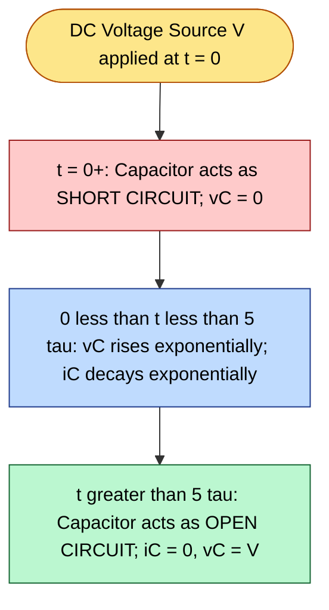
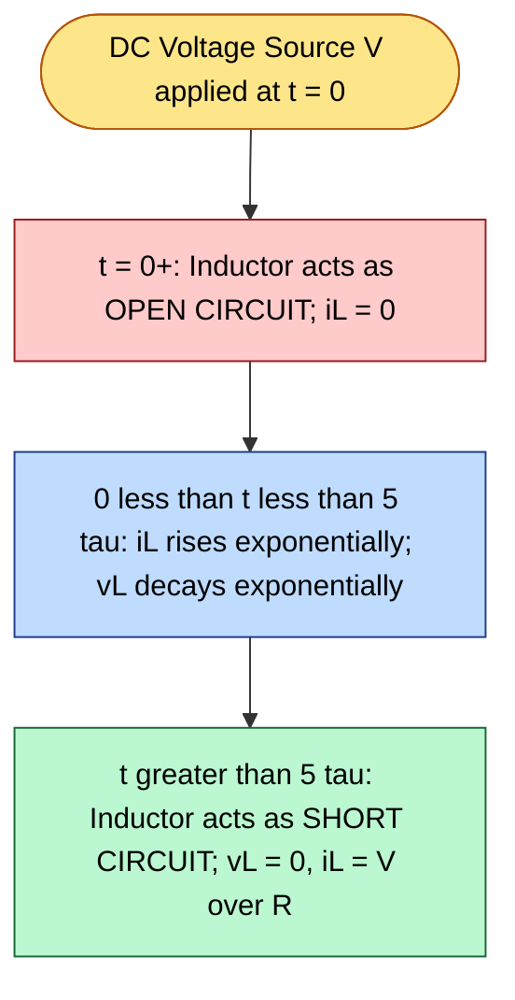
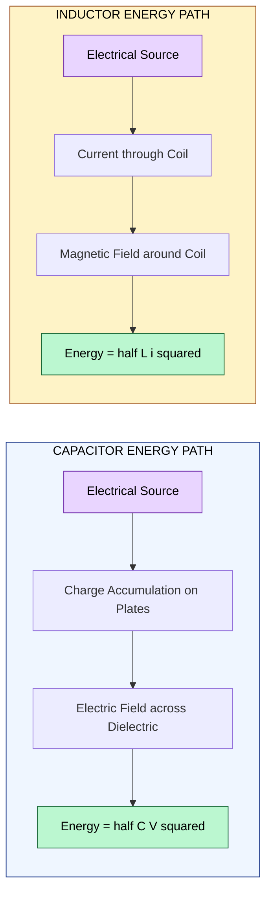
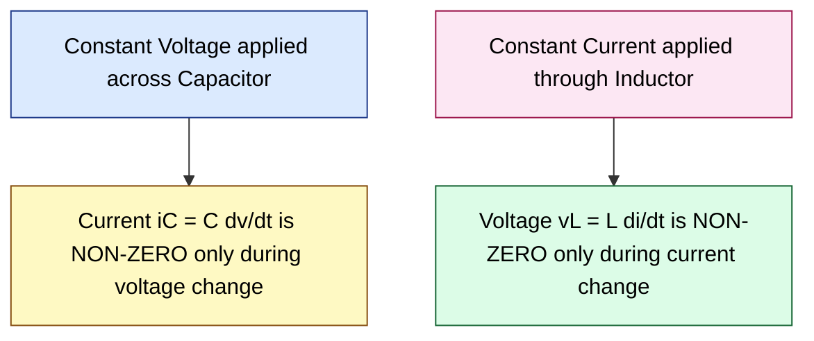

# Capacitors & Inductors: V-I relations and Energy stored.

<!-- SECTION_1_START -->
# Capacitors & Inductors: V-I Relations and Energy Stored

## 1. Capacitor — Core Definition

A **capacitor** is a passive two-terminal electrical component that stores energy in an **electric field**. It consists of two conducting plates separated by an insulating medium called a **dielectric**. The fundamental property of a capacitor is its **capacitance (C)**, measured in **Farads (F)**, which quantifies its ability to store electric charge per unit voltage.

> [!IMPORTANT]
> **KTU Syllabus Highlight (Module 1 — DC Circuits):**
> Capacitors in DC circuits behave as **open circuits at steady state** because no current flows through the dielectric after the transient charging period. The voltage across a capacitor **cannot change instantaneously**, but the current can.

### Conceptual Analogy / Intuition

Think of a capacitor as a **water tank with a rubber diaphragm** in the middle:

- The **two plates** = the two halves of the tank.
- The **dielectric** = the flexible rubber membrane that stretches but does not let water pass.
- The **charge (Q)** = how much water has been pushed onto one side.
- The **voltage (V)** = the pressure difference (stretch) across the membrane.
- A **larger tank (bigger C)** needs more water to reach the same pressure, just as a larger capacitor needs more charge to reach the same voltage.

> [!NOTE]
> **Physical Constant:** The permittivity of free space $\varepsilon_0 = 8.854 \times 10^{-12} \text{ F/m}$ is used when computing capacitance from geometry.

---

## 2. Inductor — Core Definition

An **inductor** is a passive two-terminal electrical component that stores energy in a **magnetic field**. It is typically constructed as a coil of conducting wire. The fundamental property of an inductor is its **inductance (L)**, measured in **Henrys (H)**, which quantifies its ability to oppose changes in current.

> [!IMPORTANT]
> **KTU Syllabus Highlight (Module 1 — DC Circuits):**
> Inductors in DC circuits behave as **short circuits at steady state** because the current becomes constant and the induced EMF collapses to zero. The current through an inductor **cannot change instantaneously**, but the voltage can.

### Conceptual Analogy / Intuition

Imagine an inductor as a **heavy flywheel** connected to a water pipe:

- The **current (i)** = the rotational speed of the flywheel.
- The **voltage (v)** = the force (torque) applied to spin it up or slow it down.
- The **magnetic field** = the angular momentum stored in the spinning wheel.
- A **heavier flywheel (larger L)** is harder to spin up or stop quickly, just as a larger inductor opposes rapid changes in current.

> [!NOTE]
> **Physical Constant:** The permeability of free space $\mu_0 = 4\pi \times 10^{-7} \text{ H/m}$ is used when computing inductance from geometry.

---

> [!VISUALIZATION CONTROL]
> **Concept:** Linear V–Q characteristic of a capacitor and linear $\lambda$–i characteristic of an inductor
> **GeoGebra / Desmos Input Equations:**
> * $Q(C) = C \cdot V$ → straight line through origin with slope $C$
> * $\Phi(L) = L \cdot i$ → straight line through origin with slope $L$
> **Visual Description:** The student should observe two straight lines through the origin. For the capacitor, the x-axis is voltage (V) and the y-axis is charge (Q). For the inductor, the x-axis is current (i) and the y-axis is flux linkage ($\lambda$). The slope of each line equals the element's passive parameter.

<!-- SECTION_1_END -->

<!-- SECTION_2_START -->
# Deep Theoretical Analysis & KTU High-Yield Formula Sheet

## 1. Capacitor — Operating Principle

When a voltage source is connected across an uncharged capacitor:

1. **Initial instant (t = 0⁺):** The capacitor acts as a **short circuit** because the voltage across it is still zero. A large inrush current flows.
2. **Transient phase (0 < t < 5τ):** Charge accumulates on the plates. The voltage rises exponentially toward the source voltage.
3. **Steady state (t → ∞):** The capacitor is **fully charged**; current ceases; it behaves as an **open circuit**.

> [!NOTE]
> **Continuity Rule:** $v_C(t)$ is always continuous; $i_C(t)$ can be discontinuous.

---

## 2. Inductor — Operating Principle

When a voltage source is connected across an uncharged inductor:

1. **Initial instant (t = 0⁺):** The inductor acts as an **open circuit** because the current is still zero, and any sudden attempt to change it would require infinite voltage.
2. **Transient phase (0 < t < 5τ):** Current builds up linearly if voltage is constant, and a magnetic field establishes around the coil.
3. **Steady state (t → ∞):** The inductor behaves as a **short circuit** because $di/dt = 0$, so $v_L = 0$.

> [!NOTE]
> **Continuity Rule:** $i_L(t)$ is always continuous; $v_L(t)$ can be discontinuous.

---

## 3. KTU Formula Sheet / Cheat Sheet

| # | Quantity | Capacitor (C) | Inductor (L) |
|---|----------|---------------|--------------|
| 1 | Defining relation | $Q = C \cdot V$ | $\lambda = L \cdot i$ |
| 2 | **V–I relation (differential form)** | $i_C(t) = C \dfrac{dv_C(t)}{dt}$ | $v_L(t) = L \dfrac{di_L(t)}{dt}$ |
| 3 | **I–V relation (integral form)** | $v_C(t) = \dfrac{1}{C} \displaystyle\int_{-\infty}^{t} i_C(\tau) \, d\tau$ | $i_L(t) = \dfrac{1}{L} \displaystyle\int_{-\infty}^{t} v_L(\tau) \, d\tau$ |
| 4 | **Power absorbed** | $p_C(t) = v_C(t) \cdot i_C(t)$ | $p_L(t) = v_L(t) \cdot i_L(t)$ |
| 5 | **Energy stored** | $W_C = \dfrac{1}{2} C v_C^2 = \dfrac{Q^2}{2C} = \dfrac{1}{2} Q V$ | $W_L = \dfrac{1}{2} L i_L^2 = \dfrac{\lambda^2}{2L} = \dfrac{1}{2} \lambda i$ |
| 6 | Steady-state DC behaviour | **Open circuit** ($i = 0$) | **Short circuit** ($v = 0$) |
| 7 | Continuity property | $v_C$ continuous; $i_C$ can jump | $i_L$ continuous; $v_L$ can jump |
| 8 | Passive sign convention | Power in = $+\,$ when $v, i$ enter +ve terminal | Power in = $+\,$ when $v, i$ enter +ve terminal |
| 9 | Unit of parameter | Farad (F) = C/V | Henry (H) = Wb/A |
| 10 | Unit of energy stored | Joules (J) | Joules (J) |

> [!IMPORTANT]
> **Why these equations matter in engineering:**
> * In **switched-mode power supplies (SMPS)** and **DC-DC converters**, capacitor and inductor energy storage equations determine the ripple voltage, ripple current, and conversion efficiency.
> * In **filter design** (low-pass, high-pass), the RC and RL time constants $\tau = RC$ and $\tau = L/R$ set the cutoff frequencies.
> * In **integrated circuits**, on-chip decoupling capacitors use $\tfrac{1}{2}CV^2$ to deliver transient current to digital logic during switching.
> * In **wireless power transfer and transformers**, $\tfrac{1}{2}Li^2$ governs the energy transferred per switching cycle.

---

## 4. Conceptual Summary Table — Dual (Complementary) Elements

| Property | Capacitor (C) | Inductor (L) |
|----------|---------------|--------------|
| Energy storage medium | Electric field | Magnetic field |
| Energy formula | $W = \tfrac{1}{2}CV^2$ | $W = \tfrac{1}{2}LI^2$ |
| Dual of voltage | Charge $Q$ | Flux linkage $\lambda$ |
| Differential V–I | $i = C \, dv/dt$ | $v = L \, di/dt$ |
| Series combination | $\dfrac{1}{C_{eq}} = \sum \dfrac{1}{C_i}$ | $L_{eq} = \sum L_i$ |
| Parallel combination | $C_{eq} = \sum C_i$ | $\dfrac{1}{L_{eq}} = \sum \dfrac{1}{L_i}$ |

<!-- SECTION_2_END -->

<!-- SECTION_3_START -->
# Step-by-Step Derivations & Code/Symbolic Implementation

## Derivation 1: Energy Stored in a Capacitor

We start with the power absorbed by a capacitor using the passive sign convention.

$$
p_C(t) = v_C(t) \cdot i_C(t)
$$

Substitute the V–I relation $i_C(t) = C \, \dfrac{dv_C(t)}{dt}$:

$$
p_C(t) = v_C(t) \cdot C \, \dfrac{dv_C(t)}{dt}
$$

The energy stored from time $0$ to time $t$ is the integral of power:

$$
W_C(t) = \int_{0}^{t} p_C(\tau) \, d\tau = \int_{0}^{t} v_C(\tau) \cdot C \, \dfrac{dv_C(\tau)}{d\tau} \, d\tau
$$

Using the substitution $u = v_C(\tau)$, $du = dv_C(\tau)$, the integral simplifies:

$$
W_C(t) = C \int_{0}^{v_C(t)} u \, du
$$

Evaluating the integral:

$$
W_C(t) = C \left[ \dfrac{u^2}{2} \right]_{0}^{v_C(t)} = \dfrac{1}{2} C \, v_C^2(t)
$$

**Equivalent forms** using $Q = C v$:

$$
W_C = \dfrac{1}{2} C V^2 = \dfrac{Q^2}{2C} = \dfrac{1}{2} Q V
$$

> [!NOTE]
> The energy stored depends **only on the instantaneous voltage and capacitance**, not on the path taken to reach that voltage. This makes the capacitor a **conservative (lossless) energy storage element**.

---

## Derivation 2: Energy Stored in an Inductor

The power absorbed by an inductor using the passive sign convention is:

$$
p_L(t) = v_L(t) \cdot i_L(t)
$$

Substitute $v_L(t) = L \, \dfrac{di_L(t)}{dt}$:

$$
p_L(t) = i_L(t) \cdot L \, \dfrac{di_L(t)}{dt}
$$

The energy stored from time $0$ to time $t$ is:

$$
W_L(t) = \int_{0}^{t} p_L(\tau) \, d\tau = \int_{0}^{t} i_L(\tau) \cdot L \, \dfrac{di_L(\tau)}{d\tau} \, d\tau
$$

Using the substitution $u = i_L(\tau)$, $du = di_L(\tau)$:

$$
W_L(t) = L \int_{0}^{i_L(t)} u \, du = \dfrac{1}{2} L \, i_L^2(t)
$$

**Equivalent forms** using $\lambda = L i$:

$$
W_L = \dfrac{1}{2} L I^2 = \dfrac{\lambda^2}{2L} = \dfrac{1}{2} \lambda i
$$

> [!NOTE]
> The inductor is also a **lossless, conservative** energy storage element. In an ideal inductor, no energy is dissipated as heat — all of it is recoverable from the magnetic field.

---

## Worked Example 1: Energy in a Capacitor (Numerical)

**Problem:** A $47 \, \mu\text{F}$ capacitor is charged to $12 \text{ V}$. Calculate (a) the charge stored, (b) the energy stored.

**Given:** $C = 47 \times 10^{-6} \text{ F}$, $V = 12 \text{ V}$

**(a) Charge stored:**

$$
Q = C \cdot V = (47 \times 10^{-6}) \times 12 = 5.64 \times 10^{-4} \text{ C} = 564 \, \mu\text{C}
$$

**[Stating formula $Q = CV$: 1 Mark]** **[Final numerical value with unit: 1 Mark]**

**(b) Energy stored:**

$$
W_C = \dfrac{1}{2} C V^2 = \dfrac{1}{2} \times 47 \times 10^{-6} \times (12)^2
$$

$$
W_C = 0.5 \times 47 \times 10^{-6} \times 144 = 3.384 \times 10^{-3} \text{ J} = 3.384 \text{ mJ}
$$

**[Stating energy formula: 1 Mark]** **[Substituting values: 1 Mark]** **[Final result: 1 Mark]**

---

## Worked Example 2: Energy in an Inductor (Numerical)

**Problem:** A $100 \text{ mH}$ inductor carries a steady current of $2.5 \text{ A}$. Calculate (a) the flux linkage, (b) the energy stored.

**Given:** $L = 100 \times 10^{-3} \text{ H} = 0.1 \text{ H}$, $i = 2.5 \text{ A}$

**(a) Flux linkage:**

$$
\lambda = L \cdot i = 0.1 \times 2.5 = 0.25 \text{ Wb (or V·s)}
$$

**(b) Energy stored:**

$$
W_L = \dfrac{1}{2} L i^2 = \dfrac{1}{2} \times 0.1 \times (2.5)^2 = 0.5 \times 0.1 \times 6.25
$$

$$
W_L = 0.3125 \text{ J} = 312.5 \text{ mJ}
$$

**[Stating formula: 1 Mark]** **[Substitution: 1 Mark]** **[Final numerical result: 1 Mark]**

---

## Python Code Implementation (Symbolic + Numerical)

```python
from __future__ import annotations
import math
import logging
from typing import Union

# Configure error logging
logging.basicConfig(level=logging.INFO, format="%(levelname)s: %(message)s")

Number = Union[int, float]

def capacitor_charge(capacitance: Number, voltage: Number) -> Number:
    """Compute the charge stored in a capacitor: Q = C * V."""
    if capacitance < 0 or voltage < 0:
        logging.error("Capacitance and voltage must be non-negative.")
        raise ValueError("Negative capacitance or voltage is not physical.")
    return capacitance * voltage


def capacitor_energy(capacitance: Number, voltage: Number) -> Number:
    """Compute the energy stored in a capacitor: W = 0.5 * C * V^2."""
    if capacitance < 0 or voltage < 0:
        logging.error("Capacitance and voltage must be non-negative.")
        raise ValueError("Negative capacitance or voltage is not physical.")
    return 0.5 * capacitance * voltage ** 2


def inductor_flux(inductance: Number, current: Number) -> Number:
    """Compute the flux linkage of an inductor: lambda = L * i."""
    if inductance < 0 or current < 0:
        logging.error("Inductance and current must be non-negative.")
        raise ValueError("Negative inductance or current is not physical.")
    return inductance * current


def inductor_energy(inductance: Number, current: Number) -> Number:
    """Compute the energy stored in an inductor: W = 0.5 * L * i^2."""
    if inductance < 0 or current < 0:
        logging.error("Inductance and current must be non-negative.")
        raise ValueError("Negative inductance or current is not physical.")
    return 0.5 * inductance * current ** 2


def series_capacitance(*capacitors: Number) -> Number:
    """Compute equivalent capacitance of capacitors in series."""
    if any(c <= 0 for c in capacitors):
        logging.error("All capacitances must be positive.")
        raise ValueError("Capacitance values must be positive.")
    return 1.0 / sum(1.0 / c for c in capacitors)


def parallel_capacitance(*capacitors: Number) -> Number:
    """Compute equivalent capacitance of capacitors in parallel."""
    if any(c <= 0 for c in capacitors):
        logging.error("All capacitances must be positive.")
        raise ValueError("Capacitance values must be positive.")
    return sum(c for c in capacitors)


# ----- Demonstration -----
if __name__ == "__main__":
    try:
        # Example 1: Capacitor
        C: float = 47e-6          # Farads
        V: float = 12.0           # Volts
        Q: float = capacitor_charge(C, V)
        Wc: float = capacitor_energy(C, V)
        logging.info(f"Capacitor: Q = {Q:.6e} C, W_C = {Wc:.6e} J")

        # Example 2: Inductor
        L: float = 0.1            # Henries
        i: float = 2.5            # Amperes
        lam: float = inductor_flux(L, i)
        Wl: float = inductor_energy(L, i)
        logging.info(f"Inductor: lambda = {lam:.6f} Wb, W_L = {Wl:.6f} J")

        # Example 3: Series / parallel capacitors
        Ceq_s: float = series_capacitance(10e-6, 20e-6, 30e-6)
        Ceq_p: float = parallel_capacitance(10e-6, 20e-6, 30e-6)
        logging.info(f"Series Ceq = {Ceq_s:.6e} F")
        logging.info(f"Parallel Ceq = {Ceq_p:.6e} F")

    except ValueError as exc:
        logging.error(f"Computation aborted: {exc}")
```

**Sample output:**

```
INFO: Capacitor: Q = 5.640000e-04 C, W_C = 3.384000e-03 J
INFO: Inductor: lambda = 0.250000 Wb, W_L = 3.125000e-01 J
INFO: Series Ceq = 5.454545e-06 F
INFO: Parallel Ceq = 6.000000e-05 F
```

<!-- SECTION_3_END -->

<!-- SECTION_4_START -->
# Structural Diagrams & Schematics

## Diagram 1: Capacitor Charging Cycle (RC Transients)



> [!NOTE]
> Time constant $\tau = RC$ governs the speed of charging. After $5\tau$, the capacitor is considered **fully charged** to within 99.3% of the source voltage.

---

## Diagram 2: Inductor Energising Cycle (RL Transients)



> [!NOTE]
> Time constant $\tau = L/R$. The voltage across the inductor is largest at $t = 0^+$ and decays to zero as the current settles.

---

## Diagram 3: Energy Flow — Capacitor vs Inductor (Block Topology)



> [!NOTE]
> The **electrical domain** (capacitor) and the **magnetic domain** (inductor) are **dual** of each other. This duality is the basis for the **dot convention** in coupled inductors and the **gyrator** concept in network synthesis.

---

## Diagram 4: V–I Characteristic Comparison



<!-- SECTION_4_END -->

<!-- SECTION_5_START -->
# KTU 2024 Scheme Examination Question Bank & Topic Recap

---

## Part A — Short Answer Questions (3 Marks Each)

### Question A1 `[KTU University Exam – July 2024]`
**Define capacitance. Derive the expression for the energy stored in a capacitor in terms of its capacitance and the voltage across it.**

**Mapped CO / RBT:** CO1 — Remember / Understand

**Model Answer:**

Capacitance is the property of a capacitor to store electric charge per unit voltage. It is measured in Farads (F).

$$
C = \dfrac{Q}{V}
$$

To derive the energy stored, start with the power:

$$
p = v \cdot i = v \cdot C \dfrac{dv}{dt}
$$

Integrate from 0 to $V$:

$$
W = \int_0^V v \cdot C \, dv = \dfrac{1}{2} C V^2
$$

**[Definition: 1 Mark]** **[Derivation setup: 1 Mark]** **[Final expression: 1 Mark]**

---

### Question A2 `[KTU University Exam – Dec 2023]`
**State and explain the voltage–current relation of an inductor. Why is the current through an inductor considered a continuous quantity?**

**Mapped CO / RBT:** CO1 — Understand

**Model Answer:**

The V–I relation of an inductor is:

$$
v_L(t) = L \dfrac{di_L(t)}{dt}
$$

This means the voltage across an inductor is proportional to the **rate of change of current**. If current changes abruptly (a step), the derivative becomes infinite, which would demand infinite voltage — physically impossible. Hence the current through an inductor **cannot change instantaneously**; it is always continuous.

**[V–I equation: 1 Mark]** **[Interpretation: 1 Mark]** **[Continuity reasoning: 1 Mark]**

---

## Part B — Long Answer Questions (14 Marks, Module Internal Choice)

### Question B — Option A `[KTU University Exam – July 2024, Module 1, 14 Marks]`

**(a)** Define a capacitor and an inductor. With the help of neat diagrams, explain the construction and working of each. State the SI units. **(7 Marks)**

**(b)** Two capacitors $C_1 = 6 \,\mu\text{F}$ and $C_2 = 3 \,\mu\text{F}$ are connected in series across a $100 \text{ V}$ supply. Calculate (i) the equivalent capacitance, (ii) the charge on each capacitor, (iii) the voltage across each capacitor, and (iv) the total energy stored. **(7 Marks)**

**Mapped CO / RBT:** CO1, CO2 — Understand / Apply

---

### Model Solution — Part (a)

**Capacitor:** A passive element consisting of two conducting plates separated by a dielectric. It stores energy in the electric field. SI unit: **Farad (F)**.

**Construction:** Two parallel metal plates of area $A$ separated by distance $d$ with a dielectric of permittivity $\varepsilon$ between them.

**Working:** When a voltage is applied, equal and opposite charges accumulate on the plates, establishing an electric field in the dielectric. The element stores energy $\tfrac{1}{2}CV^2$.

**Inductor:** A passive element consisting of a coil of conducting wire (often wound on a magnetic core). It stores energy in the magnetic field. SI unit: **Henry (H)**.

**Construction:** $N$ turns of wire wound on a core of permeability $\mu$.

**Working:** When current flows, a magnetic flux is established. The element stores energy $\tfrac{1}{2}Li^2$.

**Valuation Key:**
* [Capacitor definition + construction + working diagram: 2 Marks]
* [Capacitor SI unit: 0.5 Mark]
* [Inductor definition + construction + working diagram: 2 Marks]
* [Inductor SI unit: 0.5 Mark]
* [Comparison table (electric vs magnetic field): 2 Marks]

---

### Model Solution — Part (b)

**Given:** $C_1 = 6 \, \mu\text{F}$, $C_2 = 3 \, \mu\text{F}$ in series, $V = 100 \text{ V}$.

**(i) Equivalent capacitance:**

$$
\dfrac{1}{C_{eq}} = \dfrac{1}{C_1} + \dfrac{1}{C_2} = \dfrac{1}{6} + \dfrac{1}{3} = \dfrac{1 + 2}{6} = \dfrac{3}{6} = 0.5
$$

$$
C_{eq} = 2 \, \mu\text{F}
$$

**[Formula: 1 Mark]** **[Substitution: 1 Mark]** **[Result: 1 Mark]**

**(ii) Charge on each capacitor (in series, charge is the same):**

$$
Q = C_{eq} \cdot V = 2 \, \mu\text{F} \times 100 \text{ V} = 200 \, \mu\text{C}
$$

**[Identifying series-charge rule: 1 Mark]** **[Numerical computation: 1 Mark]**

**(iii) Voltage across each capacitor:**

$$
V_1 = \dfrac{Q}{C_1} = \dfrac{200 \, \mu\text{C}}{6 \, \mu\text{F}} = 33.33 \text{ V}
$$

$$
V_2 = \dfrac{Q}{C_2} = \dfrac{200 \, \mu\text{C}}{3 \, \mu\text{F}} = 66.67 \text{ V}
$$

**Check:** $V_1 + V_2 = 33.33 + 66.67 = 100 \text{ V} \, \checkmark$

**[Formula for each: 1 Mark]** **[Final values: 1 Mark]**

**(iv) Total energy stored:**

$$
W = \dfrac{1}{2} C_{eq} V^2 = \dfrac{1}{2} \times 2 \times 10^{-6} \times (100)^2 = 0.01 \text{ J} = 10 \text{ mJ}
$$

**[Formula: 0.5 Mark]** **[Computation: 0.5 Mark]**

---

### Question B — Option B `[KTU University Exam – Dec 2023, Module 1, 14 Marks]`

**(a)** With the help of a circuit diagram, derive the V–I relation and the energy-stored expression for an inductor. Explain why an inductor acts as a short circuit at DC steady state. **(7 Marks)**

**(b)** A $200 \text{ mH}$ inductor carries a current that varies as $i(t) = 4 \sin(100 t) \text{ A}$. Compute (i) the voltage across the inductor as a function of time, (ii) the instantaneous power, and (iii) the maximum energy stored in the inductor. **(7 Marks)**

**Mapped CO / RBT:** CO1, CO2 — Understand / Apply

---

### Model Solution — Part (a)

**V–I derivation:**

By Faraday's law, the voltage induced across an inductor of $N$ turns is:

$$
v_L = N \dfrac{d\Phi}{dt}
$$

With flux linkage $\lambda = N\Phi = L i$:

$$
v_L = \dfrac{d\lambda}{dt} = L \dfrac{di}{dt}
$$

**Energy derivation:**

$$
p_L = v_L \cdot i_L = L \, i \dfrac{di}{dt}
$$

$$
W_L = \int_0^{i} L \, i' \, di' = \dfrac{1}{2} L i^2
$$

**Short circuit at DC steady state:**

At DC steady state, current is constant: $\dfrac{di}{dt} = 0$. Therefore $v_L = L \cdot 0 = 0$. With zero voltage across it, the inductor behaves as a **short circuit**.

**Valuation Key:**
* [Circuit diagram with coil symbol: 1 Mark]
* [V–I derivation: 2 Marks]
* [Energy derivation: 2 Marks]
* [DC steady-state reasoning: 2 Marks]

---

### Model Solution — Part (b)

**Given:** $L = 200 \text{ mH} = 0.2 \text{ H}$, $i(t) = 4 \sin(100 t) \text{ A}$.

**(i) Voltage across the inductor:**

$$
v_L(t) = L \dfrac{di}{dt} = 0.2 \times \dfrac{d}{dt}\left[4 \sin(100 t)\right]
$$

$$
v_L(t) = 0.2 \times 4 \times 100 \cos(100 t) = 80 \cos(100 t) \text{ V}
$$

**[Differentiation: 1 Mark]** **[Final vL expression: 1 Mark]**

**(ii) Instantaneous power:**

$$
p(t) = v_L(t) \cdot i(t) = 80 \cos(100 t) \times 4 \sin(100 t)
$$

Using $2 \sin A \cos A = \sin 2A$:

$$
p(t) = 160 \sin(100 t) \cos(100 t) = 80 \sin(200 t) \text{ W}
$$

**[Multiplication: 1 Mark]** **[Trig simplification: 1 Mark]**

**(iii) Maximum energy stored:**

Maximum current = peak value = $4 \text{ A}$.

$$
W_{\max} = \dfrac{1}{2} L I_{\max}^2 = \dfrac{1}{2} \times 0.2 \times (4)^2 = 0.1 \times 16 = 1.6 \text{ J}
$$

**[Identifying Imax: 1 Mark]** **[Final energy: 1 Mark]**

---

> [!WARNING]
> **KTU Examiner's Valuation Warning / Common Pitfalls:**
> 1. **Confusing $V$-$I$ direction:** Always apply the **passive sign convention** — current entering the positive terminal gives positive power. Reversing direction flips the sign of the power and the energy flow.
> 2. **Mixing up series/parallel rules:** Capacitors in **series add reciprocally** ($1/C_{eq}$), while capacitors in **parallel add directly** ($C_{eq} = \sum C_i$). The opposite is true for inductors.
> 3. **Steady-state assumptions:** In DC analysis, never forget that a capacitor is an **open circuit** and an inductor is a **short circuit** at $t \to \infty$. Skipping this step is the most common cause of wrong node-voltage answers.
> 4. **Continuity rules:** $v_C$ and $i_L$ are continuous; the others ($i_C$ and $v_L$) **can jump** at switching instants. Examiners explicitly test this with initial-condition problems.
> 5. **Unit conversions:** Always convert $\mu\text{F}$, $\text{nF}$, $\text{mH}$ to base SI units ($\text{F}$, $\text{H}$) **before** substituting into formulas. Many students lose marks by mixing $10^{-6}$ with $10^{-3}$.

---

## Topic Recap & Important Things to Remember

- **Capacitance (C)** is charge per unit voltage: $C = Q/V$, measured in **Farads**.
- **Inductance (L)** is flux linkage per unit current: $L = \lambda / i$, measured in **Henrys**.
- **Differential V–I relations:**
  * Capacitor: $i_C = C \, dv_C/dt$
  * Inductor: $v_L = L \, di_L/dt$
- **Energy stored (lossless, conservative elements):**
  * Capacitor: $W_C = \tfrac{1}{2} C V^2 = Q^2/(2C) = \tfrac{1}{2} QV$
  * Inductor: $W_L = \tfrac{1}{2} L I^2 = \lambda^2/(2L) = \tfrac{1}{2} \lambda i$
- **DC steady-state behaviour:** Capacitor → **open circuit**; Inductor → **short circuit**.
- **Continuity:** $v_C(t)$ and $i_L(t)$ are continuous functions of time; $i_C(t)$ and $v_L(t)$ can be discontinuous.
- **Series / Parallel combinations:**
  * Series capacitors: $1/C_{eq} = \sum 1/C_i$ (inductors in series: $L_{eq} = \sum L_i$)
  * Parallel capacitors: $C_{eq} = \sum C_i$ (inductors in parallel: $1/L_{eq} = \sum 1/L_i$)
- **Time constants:** $\tau_{RC} = RC$ and $\tau_{RL} = L/R$; charging/energising completes within $5\tau$.
- **Duality:** Capacitor (electric field) and Inductor (magnetic field) are **dual elements** — swap $V \leftrightarrow I$, $C \leftrightarrow L$, $R \leftrightarrow G$ to convert one circuit into its dual.
- **Power flow:** Capacitor/inductor absorb energy during charging/energising and **deliver** energy back to the source during discharging/de-energising — they are **bidirectional** energy buffers.
- **Practical units to remember:** $1 \, \mu\text{F} = 10^{-6} \text{ F}$; $1 \text{ mH} = 10^{-3} \text{ H}$; $1 \text{ kWh} = 3.6 \times 10^6 \text{ J}$.

<!-- SECTION_5_END -->
