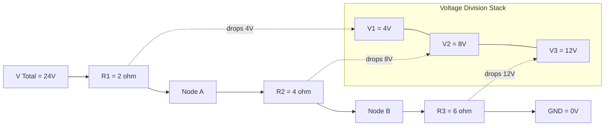
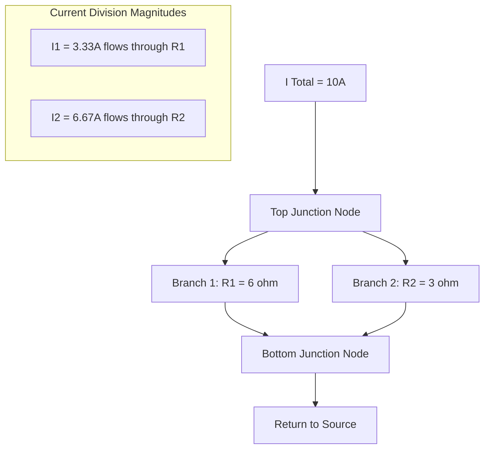
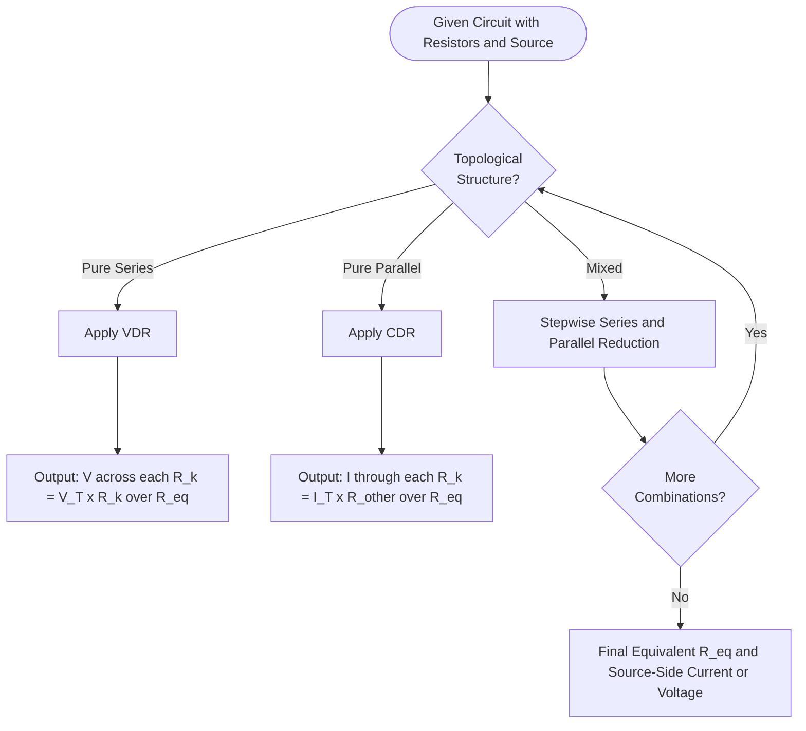

# Elementary concepts of DC electric circuits: Current and Voltage Division Rule - Relative potential

<!-- SECTION_1_START -->
# Elementary Concepts of DC Electric Circuits: Current \& Voltage Division Rule — Relative Potential

## 1.1 Core Technical Definition

> [!IMPORTANT]
> **KTU 2024 Syllabus Definition (GXEST104 — Module 1):**
> *Current Division Rule (CDR)* is the principle that determines how the total current entering a parallel network splits among the individual branches, while *Voltage Division Rule (VDR)* governs how the total voltage across a series network distributes across each element. *Relative potential* defines the electrical potential of one node with respect to another reference node, establishing the polarity and direction of current flow.

In formal terms, for a **DC circuit** operating in **steady state**, the fundamental governing relation is **Ohm's Law**:

$$V = I \cdot R$$

where $V$ is the voltage across a resistor in **volts (V)**, $I$ is the current through it in **amperes (A)**, and $R$ is the resistance in **ohms ($\Omega$)**. The value of $R$ for a uniform conductor is given by $R = \rho \cdot \dfrac{L}{A}$, where $\rho$ is the **resistivity (in $\Omega \cdot m$)**, $L$ is the **length (in m)**, and $A$ is the **cross-sectional area (in $m^2$)**. Conductance $G = \dfrac{1}{R}$ is measured in **siemens (S)**.

### 1.2 Conceptual Analogy / Intuitive Overview

Imagine a water distribution system to grasp these rules instantly:

> [!NOTE]
> **Series Circuit (Voltage Division) — "Water in a Single Pipe with Multiple Throttle Valves"**
> Picture one long horizontal pipe carrying water. The total pressure (voltage) at the inlet is fixed. As water passes through each narrow constriction (resistor), it loses a portion of its pressure. The amount of pressure lost across each constriction is *proportional* to how narrow that constriction is. Bigger resistance ⇒ larger pressure drop. Since the pipe is continuous, the **same current (water flow rate) passes through every constriction**, but the **voltage (pressure) divides**.

> [!NOTE]
> **Parallel Circuit (Current Division) — "Water Splitting into Multiple Branches"**
> Now imagine the main pipe reaches a *junction* and splits into two parallel pipes of different diameters, then re-joins downstream. The pressure (voltage) at the junction and the rejoin point is *identical* for both branches. However, water prefers the *wider* (lower-resistance) path — so a **larger current flows through the smaller resistance**. The **current divides inversely proportional to resistance**.

> [!NOTE]
> **Relative Potential — "Altitude Above Sea Level"**
> Just as we say "Mount Everest is 8,849 m above sea level," we never talk about an *absolute* potential; we always measure potential *with respect to* a chosen reference (usually the **ground / chassis / common node** at 0 V). If the potential at node A is $+12$ V and at node B is $+5$ V, then $V_{AB} = V_A - V_B = 7$ V — the potential of A **relative to** B.

### 1.3 Visualization Control

> [!VISUALIZATION CONTROL]
> **Concept:** Voltage Division across a 3-Resistor Series Network
> **GeoGebra Input Equations:**
> * $R_1 = 2,\ R_2 = 4,\ R_3 = 6$
> * $V_{total} = 24$
> * $f(x) = \dfrac{V_{total} \cdot R_1}{R_1 + R_2 + R_3}$ (voltage across $R_1$)
> * $g(x) = \dfrac{V_{total} \cdot R_2}{R_1 + R_2 + R_3}$ (voltage across $R_2$)
> * $h(x) = \dfrac{V_{total} \cdot R_3}{R_1 + R_2 + R_3}$ (voltage across $R_3$)
> **Visual Description:** A horizontal resistor chain along the x-axis with three segments. The voltage graph should rise in *steps* across each resistor, with the largest step over $R_3$ (highest resistance). Total stack height = $V_{total}$.

<!-- SECTION_1_END -->

<!-- SECTION_2_START -->
# Deep Theoretical Analysis \& KTU High-Yield Formula Sheet

## 2.1 Voltage Division Rule (VDR) — Series Networks

In a series circuit, the **same current $I$** flows through every element. Applying KVL (Kirchhoff's Voltage Law) around the loop:

$$V_{total} = V_1 + V_2 + V_3 + \dots + V_n$$

Substituting Ohm's Law $V_k = I \cdot R_k$ for each resistor and factoring out $I$:

$$V_{total} = I \cdot (R_1 + R_2 + R_3 + \dots + R_n) = I \cdot R_{eq}$$

The voltage across any *specific* resistor $R_k$ is therefore:

$$V_k = I \cdot R_k = \dfrac{V_{total}}{R_{eq}} \cdot R_k$$

This yields the **canonical Voltage Division Rule**:

$$\boxed{\,V_k = V_{total} \cdot \dfrac{R_k}{R_{eq}}\,}$$

**Key Insight:** The voltage across a resistor in series is *directly proportional* to its resistance. The largest resistor drops the largest share of voltage.

## 2.2 Current Division Rule (CDR) — Parallel Networks

In a parallel circuit, the **same voltage $V$** appears across every branch. By KCL (Kirchhoff's Current Law):

$$I_{total} = I_1 + I_2 + I_3 + \dots + I_n$$

Each branch current follows Ohm's Law: $I_k = \dfrac{V}{R_k} = V \cdot G_k$. Substituting and factoring out $V$:

$$I_{total} = V \cdot (G_1 + G_2 + \dots + G_n) = V \cdot G_{eq}$$

The current through any *specific* branch $k$ becomes:

$$I_k = V \cdot G_k = \dfrac{I_{total}}{G_{eq}} \cdot G_k$$

For the **most common case of two parallel resistors**, this simplifies beautifully. Since $V = I_1 R_1 = I_2 R_2$, we have $I_1 = \dfrac{I_{total} \cdot R_2}{R_1 + R_2}$:

$$\boxed{\,I_1 = I_{total} \cdot \dfrac{R_2}{R_1 + R_2}\quad \text{and} \quad I_2 = I_{total} \cdot \dfrac{R_1}{R_1 + R_2}\,}$$

**Key Insight:** Notice the **cross-multiplication**! The current in branch 1 is proportional to the *opposite* branch's resistance. Current prefers the path of **least resistance** — the smaller resistor carries the *larger* current.

## 2.3 Relative Potential \& Polarity Conventions

> [!IMPORTANT]
> **KTU Board Examiner's Standard Convention:**
> $V_{AB}$ denotes the potential of point A **with respect to** point B, defined mathematically as $V_{AB} = V_A - V_B$.
> * If $V_{AB} > 0$ → Point A is at higher potential than B (current *flows from A to B* through a passive resistor).
> * If $V_{AB} < 0$ → Point A is at lower potential than B.
> * $V_{AB} = -V_{BA}$ (anti-symmetry property).
> * The **ground node** (chassis, earth, common) is assigned $V = 0$ V as a reference.

**Sign convention for voltage drop:** When traversing a resistor in the *direction of current flow*, the voltage *drops* (potential decreases). Against the current direction, it *rises*.

## 2.4 KTU Formula Sheet / Cheat Sheet

| Rule | Circuit Topology | Canonical Formula | Boundary Condition | Underlying Law |
|:---|:---|:---|:---|:---|
| Ohm's Law | Any resistor | $V = I \cdot R$ | Linear, ohmic conductor | Empirical |
| VDR (n resistors) | Series | $V_k = V_T \cdot \dfrac{R_k}{\sum R_i}$ | Same $I$ through all | KVL + Ohm's |
| CDR (2 resistors) | Parallel | $I_1 = I_T \cdot \dfrac{R_2}{R_1 + R_2}$ | Same $V$ across both | KCL + Ohm's |
| CDR (n resistors) | Parallel | $I_k = I_T \cdot \dfrac{G_k}{\sum G_i}$ | $G_k = 1/R_k$ | KCL + Ohm's |
| Series Equivalent | Series | $R_{eq} = \sum R_i$ | All carry same $I$ | KVL |
| Parallel Equivalent | Parallel | $\dfrac{1}{R_{eq}} = \sum \dfrac{1}{R_i}$ | All share same $V$ | KCL |
| Relative Potential | Any two nodes | $V_{AB} = V_A - V_B$ | $V_{AB} = -V_{BA}$ | Definition |
| Conductance | Any resistor | $G = \dfrac{1}{R}$ | Measured in Siemens (S) | Reciprocal |

> [!NOTE]
> **Production-Grade Engineering Utility:** VDR is the working principle behind every **potentiometer-based volume control, audio mixer fader, and voltage regulator feedback network**. CDR is foundational to **current mirror circuits in op-amps, shunt resistor design for ammeters, and load balancing in power distribution systems** (e.g., household wiring where heavy appliances and lighting share the same supply voltage but draw different currents based on their resistance).

<!-- SECTION_2_END -->

<!-- SECTION_3_START -->
# Step-by-Step Derivations \& Python Implementation

## 3.1 Worked Derivation — Series Circuit with VDR

**Problem:** A 24 V DC source feeds three series resistors: $R_1 = 2\ \Omega$, $R_2 = 4\ \Omega$, $R_3 = 6\ \Omega$. Compute the voltage across each resistor using VDR, and verify using KVL.

**Step 1 — Compute the equivalent series resistance:**

$$R_{eq} = R_1 + R_2 + R_3 = 2 + 4 + 6 = 12\ \Omega$$

**Step 2 — Compute the loop current using Ohm's Law:**

$$I = \dfrac{V_{total}}{R_{eq}} = \dfrac{24}{12} = 2\ A$$

**Step 3 — Apply VDR for each resistor:**

$$V_1 = V_{total} \cdot \dfrac{R_1}{R_{eq}} = 24 \cdot \dfrac{2}{12} = 4\ V$$

$$V_2 = V_{total} \cdot \dfrac{R_2}{R_{eq}} = 24 \cdot \dfrac{4}{12} = 8\ V$$

$$V_3 = V_{total} \cdot \dfrac{R_3}{R_{eq}} = 24 \cdot \dfrac{6}{12} = 12\ V$$

**Step 4 — Verify using KVL (closure check):**

$$V_1 + V_2 + V_3 = 4 + 8 + 12 = 24\ V = V_{total}\ \checkmark$$

## 3.2 Worked Derivation — Parallel Circuit with CDR

**Problem:** A 10 A total current enters a parallel combination of $R_1 = 6\ \Omega$ and $R_2 = 3\ \Omega$. Compute the branch currents using CDR.

**Step 1 — Apply the two-resistor CDR formula (cross-form):**

$$I_1 = I_{total} \cdot \dfrac{R_2}{R_1 + R_2} = 10 \cdot \dfrac{3}{6 + 3} = 10 \cdot \dfrac{3}{9} = \dfrac{30}{9} = 3.333\ A$$

$$I_2 = I_{total} \cdot \dfrac{R_1}{R_1 + R_2} = 10 \cdot \dfrac{6}{6 + 3} = 10 \cdot \dfrac{6}{9} = \dfrac{60}{9} = 6.667\ A$$

**Step 2 — Verify using KCL:**

$$I_1 + I_2 = 3.333 + 6.667 = 10\ A = I_{total}\ \checkmark$$

**Step 3 — Cross-check using the conductance form:**

$$G_1 = \dfrac{1}{R_1} = \dfrac{1}{6}\ S, \quad G_2 = \dfrac{1}{R_2} = \dfrac{1}{3}\ S$$

$$G_{eq} = G_1 + G_2 = \dfrac{1}{6} + \dfrac{1}{3} = \dfrac{1}{6} + \dfrac{2}{6} = \dfrac{3}{6} = \dfrac{1}{2}\ S$$

$$I_1 = I_{total} \cdot \dfrac{G_1}{G_{eq}} = 10 \cdot \dfrac{1/6}{1/2} = 10 \cdot \dfrac{1}{3} = 3.333\ A\ \checkmark$$

## 3.3 Relative Potential — Node-by-Node Analysis

**Problem:** Consider the series chain $24\ V \to R_1 = 2\ \Omega \to \text{Node A} \to R_2 = 4\ \Omega \to \text{Node B} \to R_3 = 6\ \Omega \to \text{Ground (0 V)}$.

From Section 3.1, $I = 2$ A flowing from the 24 V terminal toward ground.

**Step 1 — Potential at Node A (between $R_1$ and $R_2$):**
The potential drops across $R_3$ first (at the bottom, near ground), then across $R_2$, then across $R_1$. Working from ground upward:

$$V_B = I \cdot R_3 = 2 \cdot 6 = 12\ V \quad (\text{potential at Node B w.r.t. ground})$$

$$V_A = V_B + I \cdot R_2 = 12 + (2 \cdot 4) = 12 + 8 = 20\ V$$

**Step 2 — Verify with the source terminal:**

$$V_{source} = V_A + I \cdot R_1 = 20 + (2 \cdot 2) = 20 + 4 = 24\ V\ \checkmark$$

**Step 3 — Compute relative potentials $V_{AB}$ and $V_{BA}$:**

$$V_{AB} = V_A - V_B = 20 - 12 = +8\ V$$

$$V_{BA} = V_B - V_A = 12 - 20 = -8\ V = -V_{AB}\ \checkmark$$

## 3.4 Algorithmic Implementation (Python)

```python
from typing import List, Tuple
import logging

logging.basicConfig(level=logging.INFO, format="%(levelname)s: %(message)s")


def voltage_division(v_total: float, resistors: List[float]) -> List[float]:
    """
    Apply the Voltage Division Rule across a series chain of resistors.
    Returns a list of voltage drops matching the order of `resistors`.
    """
    if not resistors:
        raise ValueError("Resistor list must be non-empty.")
    if any(r < 0 for r in resistors):
        raise ValueError("Resistor values cannot be negative.")
    if v_total < 0:
        raise ValueError("Source voltage cannot be negative in this context.")

    r_eq: float = sum(resistors)
    logging.info(f"Series equivalent resistance = {r_eq} Ohms")
    return [v_total * (r / r_eq) for r in resistors]


def current_division_two(i_total: float, r1: float, r2: float) -> Tuple[float, float]:
    """
    Apply the Current Division Rule for TWO parallel resistors.
    Returns (I_through_R1, I_through_R2) using the cross-form formula.
    """
    if r1 <= 0 or r2 <= 0:
        raise ValueError("Resistor values must be strictly positive.")
    if i_total < 0:
        raise ValueError("Total current cannot be negative.")

    i1: float = i_total * (r2 / (r1 + r2))
    i2: float = i_total * (r1 / (r1 + r2))
    return i1, i2


def current_division_n(i_total: float, resistors: List[float]) -> List[float]:
    """
    Apply the Current Division Rule for N parallel resistors using the
    conductance form I_k = I_total * (G_k / sum G_i).
    """
    if not resistors:
        raise ValueError("Resistor list must be non-empty.")
    if any(r <= 0 for r in resistors):
        raise ValueError("All resistor values must be strictly positive.")
    if i_total < 0:
        raise ValueError("Total current cannot be negative.")

    conductances: List[float] = [1.0 / r for r in resistors]
    g_eq: float = sum(conductances)
    return [i_total * (g / g_eq) for g in conductances]


def node_potentials_series(v_source: float, resistors: List[float]) -> List[float]:
    """
    Compute the absolute potential at each intermediate node of a series chain,
    measured with respect to the ground terminal (last node = 0 V).
    Returns potentials starting from the source-side end.
    """
    if not resistors:
        raise ValueError("Resistor list must be non-empty.")
    if any(r <= 0 for r in resistors):
        raise ValueError("All resistor values must be strictly positive.")

    r_eq: float = sum(resistors)
    i: float = v_source / r_eq
    potentials: List[float] = [v_source]
    for r in resistors:
        potentials.append(potentials[-1] - i * r)
    return potentials


# ---------- Demonstration / Sanity-Check Block ----------
if __name__ == "__main__":
    # VDR demo
    v_drops: List[float] = voltage_division(24.0, [2.0, 4.0, 6.0])
    print(f"VDR drops [V1, V2, V3] = {v_drops}")
    # Expected: [4.0, 8.0, 12.0]

    # CDR (2 resistors) demo
    i1, i2 = current_division_two(10.0, 6.0, 3.0)
    print(f"CDR (2-resistor) I1, I2 = ({i1:.4f}, {i2:.4f}) A")
    # Expected: (3.3333, 6.6667)

    # CDR (n resistors) demo
    branch_currents: List[float] = current_division_n(
        12.0, [2.0, 4.0, 6.0, 12.0]
    )
    print(f"CDR (n-resistor) branch currents = {branch_currents}")

    # Relative potentials
    potentials: List[float] = node_potentials_series(24.0, [2.0, 4.0, 6.0])
    print(f"Node potentials (V_source down to GND) = {potentials}")
    # Expected: [24.0, 20.0, 12.0, 0.0]
```

> [!IMPORTANT]
> **Engineer's Note on Robustness:** Always validate that the parallel-conductance sum is **non-zero** and that no resistor is **zero or negative**. The CDR formula has a singularity at $R = 0$ (a short circuit) which would draw infinite current — physically, this is a fault condition and the program must reject it gracefully.

<!-- SECTION_3_END -->

<!-- SECTION_4_START -->
# Structural Diagrams \& Schematics

## 4.1 Series Voltage Division — Functional Topology



**Reading the diagram:** The same current $I = 2$ A flows through $R_1 \to R_2 \to R_3$. Each resistor drops a voltage *proportional* to its resistance. The sum of drops equals the source voltage (KVL closure).

## 4.2 Parallel Current Division — Functional Topology



**Reading the diagram:** The voltage across both branches is identical (the *top junction* and *bottom junction* are equipotential across the parallel section). The smaller resistance ($R_2 = 3\ \Omega$) carries the larger current ($6.67$ A), and vice versa.

## 4.3 Sequential Processing Topology Matrix — VDR vs CDR Decision Flow



> [!NOTE]
> **Engineering Interpretation:** This decision tree mirrors the *actual* mental workflow a circuit designer uses. In real PCB design or power system analysis, you rarely get a "pure" VDR or CDR problem — you iteratively reduce the network to its Thevenin or Norton equivalent and then apply the appropriate rule at the point of interest.

<!-- SECTION_4_END -->

<!-- SECTION_5_START -->
# KTU 2024 Scheme Examination Question Bank \& Topic Recap

## Part A — Short Answer Questions (3 Marks Each)

### Question 1: [KTU University Exam — July 2024]
**State and explain the Voltage Division Rule for a DC series circuit. A $12$ V battery is connected across two series resistors $R_1 = 3\ \Omega$ and $R_2 = 9\ \Omega$. Find the voltage across the $9\ \Omega$ resistor.**

> **Course Outcome:** CO1 | **RBT Level:** Remember / Understand
> **Model Answer:**
> The Voltage Division Rule states that in a series circuit, the voltage across any resistor is directly proportional to its resistance and is given by $V_k = V_T \cdot \dfrac{R_k}{R_{eq}}$.
>
> **Solution:** $R_{eq} = 3 + 9 = 12\ \Omega$. Therefore, $V_{R_2} = 12 \cdot \dfrac{9}{12} = 9\ V$.
> **Final Answer: 9 V** **[Rule statement: 1 Mark] [Computation: 2 Marks]**

### Question 2: [KTU University Exam — Dec 2023]
**Define relative potential. If the potential of point A with respect to ground is $+15$ V and the potential of point B with respect to ground is $-5$ V, calculate $V_{AB}$ and $V_{BA}$. Comment on the direction of conventional current flow between A and B through a passive resistor.**

> **Course Outcome:** CO1 | **RBT Level:** Understand
> **Model Answer:**
> Relative potential $V_{AB} = V_A - V_B$ is the potential of A with respect to B.
> $V_{AB} = (+15) - (-5) = +20\ V$.
> $V_{BA} = -20\ V$ (anti-symmetry).
> Since $V_{AB} > 0$, point A is at higher potential; conventional current flows **from A to B** through a passive resistor.
> **[Definition: 1 Mark] [Calculation: 1 Mark] [Direction comment: 1 Mark]**

---

## Part B — Full-Descriptive Questions (14 Marks Each)

### Question A: [KTU University Exam — July 2024]
**(a)** Derive the Current Division Rule for two resistors connected in parallel. **(7 Marks)**

**(b)** A current of $15$ A enters a parallel combination of three resistors: $R_1 = 4\ \Omega$, $R_2 = 6\ \Omega$, and $R_3 = 12\ \Omega$. Using the conductance form of the Current Division Rule, compute the current through each branch. **(7 Marks)**

> **Course Outcome:** CO1, CO2 | **RBT Level:** Apply

### Model Solution (a)

> **Step 1 — Setup:** Let $V$ be the common voltage across both $R_1$ and $R_2$. Then $I_1 = \dfrac{V}{R_1}$ and $I_2 = \dfrac{V}{R_2}$.
>
> **Step 2 — Apply KCL:** $I_T = I_1 + I_2 = \dfrac{V}{R_1} + \dfrac{V}{R_2} = V \cdot \left(\dfrac{1}{R_1} + \dfrac{1}{R_2}\right) = V \cdot \dfrac{R_1 + R_2}{R_1 R_2}$.
>
> **Step 3 — Solve for V:** $V = I_T \cdot \dfrac{R_1 R_2}{R_1 + R_2}$.
>
> **Step 4 — Substitute back into branch equations:** $I_1 = \dfrac{I_T R_1 R_2 / (R_1 + R_2)}{R_1} = I_T \cdot \dfrac{R_2}{R_1 + R_2}$.
>
> Similarly, $I_2 = I_T \cdot \dfrac{R_1}{R_1 + R_2}$.
>
> **Valuation Key Points:**
> **[Defining common voltage V: 2 Marks] [Applying KCL and solving: 3 Marks] [Final CDR expressions: 2 Marks]**

### Model Solution (b)

> **Step 1 — Compute individual conductances:**
> $G_1 = \dfrac{1}{4} = 0.25\ S$, $G_2 = \dfrac{1}{6} \approx 0.1667\ S$, $G_3 = \dfrac{1}{12} \approx 0.0833\ S$.
>
> **Step 2 — Compute equivalent conductance:**
> $G_{eq} = 0.25 + 0.1667 + 0.0833 = 0.5\ S$.
>
> **Step 3 — Apply CDR:**
> $I_1 = 15 \cdot \dfrac{0.25}{0.5} = 15 \cdot 0.5 = 7.5\ A$.
> $I_2 = 15 \cdot \dfrac{0.1667}{0.5} = 15 \cdot 0.3333 = 5.0\ A$.
> $I_3 = 15 \cdot \dfrac{0.0833}{0.5} = 15 \cdot 0.1667 = 2.5\ A$.
>
> **Step 4 — Verify by KCL:** $7.5 + 5.0 + 2.5 = 15.0\ A = I_T\ \checkmark$.
>
> **Valuation Key Points:**
> **[Conductance calculations: 2 Marks] [G_eq summation: 1 Mark] [Branch current application: 3 Marks] [KCL verification: 1 Mark]**

### Question B: [KTU University Exam — Dec 2023]
**(a)** With the help of a neat circuit diagram, explain the Voltage Division Rule. A $48$ V DC source is connected across a series chain of $R_1 = 4\ \Omega$, $R_2 = 8\ \Omega$, and $R_3 = 12\ \Omega$. Find the voltage across each resistor and the potential at each node with respect to ground. **(7 Marks)**

**(b)** Explain the concept of relative potential with two illustrative examples. A node A is at $+20$ V and node B is at $+5$ V, both measured with respect to a common ground. Find $V_{AB}$, $V_{BA}$, and state the direction of current flow if a $1\ k\Omega$ resistor connects A and B. **(7 Marks)**

> **Course Outcome:** CO1, CO2 | **RBT Level:** Understand / Apply

### Model Solution (a)

> **Circuit Description:** A $48$ V source feeds $R_1 = 4\ \Omega \to R_2 = 8\ \Omega \to R_3 = 12\ \Omega$ in series, returning to the source. Ground is the negative terminal of the source.
>
> **Step 1 — Equivalent resistance:** $R_{eq} = 4 + 8 + 12 = 24\ \Omega$.
>
> **Step 2 — Loop current:** $I = \dfrac{48}{24} = 2\ A$.
>
> **Step 3 — Voltage drops via VDR:**
> $V_1 = 48 \cdot \dfrac{4}{24} = 8\ V$
> $V_2 = 48 \cdot \dfrac{8}{24} = 16\ V$
> $V_3 = 48 \cdot \dfrac{12}{24} = 24\ V$
> **KVL check:** $8 + 16 + 24 = 48\ V\ \checkmark$.
>
> **Step 4 — Node potentials (working from ground upward):**
> $V_{N3} = 24\ V$ (between $R_3$ and $R_2$)
> $V_{N2} = 24 + 16 = 40\ V$ (between $R_2$ and $R_1$)
> $V_{N1} = 40 + 8 = 48\ V$ (source terminal, as expected)
>
> **Valuation Key Points:**
> **[VDR definition + diagram: 2 Marks] [Drop calculations: 3 Marks] [Node potentials: 2 Marks]**

### Model Solution (b)

> **Concept Explanation:** Relative potential $V_{AB} = V_A - V_B$ quantifies the electrical "height difference" between two points, with the current direction determined by the sign of this difference. Example 1: If $V_A = 9$ V and $V_B = 0$ V, then $V_{AB} = 9$ V and current flows from A to B. Example 2: In a battery, the positive terminal sits at higher relative potential than the negative terminal.
>
> **Numerical Solution:**
> $V_A = +20$ V, $V_B = +5$ V (w.r.t. common ground).
> $V_{AB} = V_A - V_B = 20 - 5 = +15$ V.
> $V_{BA} = -15$ V.
> Current direction: Since $V_A > V_B$, conventional current flows from A to B.
> Magnitude (Ohm's Law): $I = \dfrac{V_{AB}}{R} = \dfrac{15}{1000} = 0.015\ A = 15\ mA$.
>
> **Valuation Key Points:**
> **[Concept explanation with examples: 3 Marks] [V_AB / V_BA computation: 2 Marks] [Direction + Ohm's Law application: 2 Marks]**

> [!WARNING]
> **KTU Examiner's Valuation Warning — Common Pitfalls:**
> 1. **Sign Convention Errors:** Students often write $V_{AB} = V_B - V_A$ instead of the standard $V_A - V_B$. Always state the convention explicitly: *"V_AB is the potential of A with respect to B."*
> 2. **CDR Cross-Form Confusion:** In CDR, students mistakenly put the *same* resistance in the numerator instead of the *opposite* branch's resistance. Memorize: *"I get the OTHER guy's resistance in my numerator."*
> 3. **Forgetting KCL/KVL Verification:** Always perform a closure check (sum of voltages = source for VDR, sum of branch currents = total for CDR). Examiners award 1–2 marks specifically for the verification step.
> 4. **Unit Mismatches:** Mixing $k\Omega$ and $\Omega$ without conversion. Always normalize units at the start.
> 5. **Zero-Resistor Singularity:** CDR fails when $R_1 + R_2 = 0$ or any $R \to 0$. State this boundary condition explicitly.

---

## Topic Recap \& Important Things to Remember

- **Ohm's Law** ($V = I \cdot R$) is the *foundation* of every DC circuit analysis. Memorize the V-I-R triangle.
- **VDR** applies *only* to series circuits: $V_k = V_T \cdot \dfrac{R_k}{R_{eq}}$. Voltage is **directly proportional** to resistance.
- **CDR** applies *only* to parallel circuits: $I_1 = I_T \cdot \dfrac{R_2}{R_1 + R_2}$ (two-resistor form) or $I_k = I_T \cdot \dfrac{G_k}{G_{eq}}$ (n-resistor form). Current is **inversely proportional** to resistance.
- **Conductance** $G = 1/R$ simplifies parallel analysis because conductances add directly: $G_{eq} = \sum G_i$.
- **Relative potential** $V_{AB} = V_A - V_B$ is a *signed* quantity. The sign tells you the direction of conventional current flow through a passive resistor.
- **Ground** is the universal reference node assigned $0$ V; all absolute node potentials are measured w.r.t. ground.
- **Anti-symmetry:** $V_{AB} = -V_{BA}$ — always remember to negate when swapping subscript order.
- **Boundary conditions:** VDR is invalid in parallel sections; CDR is invalid in series sections. Identify the topology *first*.
- **Verification protocol:** Always close-check with **KVL** (sum of voltage drops = source) for VDR problems and **KCL** (sum of branch currents = total) for CDR problems.
- **Real-world applications to recall in exams:** VDR — potentiometers, voltage regulators, voltage divider biasing of transistors. CDR — current mirrors, shunt resistors in ammeters, load sharing in power networks.
- **Series equivalent:** $R_{eq} = \sum R_i$ (always larger than the largest individual $R$).
- **Parallel equivalent:** $R_{eq} = \dfrac{\text{product}}{\text{sum}}$ for two resistors; always *smaller* than the smallest individual $R$.
- **Power tip:** For a parallel branch, $P_k = \dfrac{V^2}{R_k}$ — the smaller resistor dissipates *more* power (matches CDR intuition: more current ⇒ more power).
- **Notation discipline:** In your answer sheet, always use subscripts in math mode ($R_1$, $V_{AB}$, $I_{total}$) — never bare ASCII subscripts like R1 or Vab in the main prose.

<!-- SECTION_5_END -->
