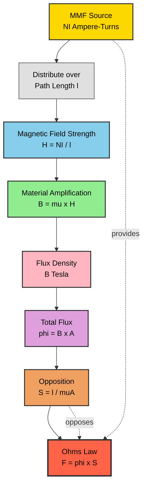
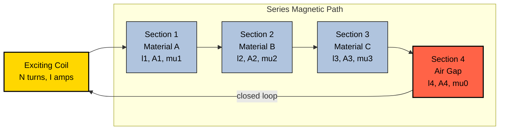
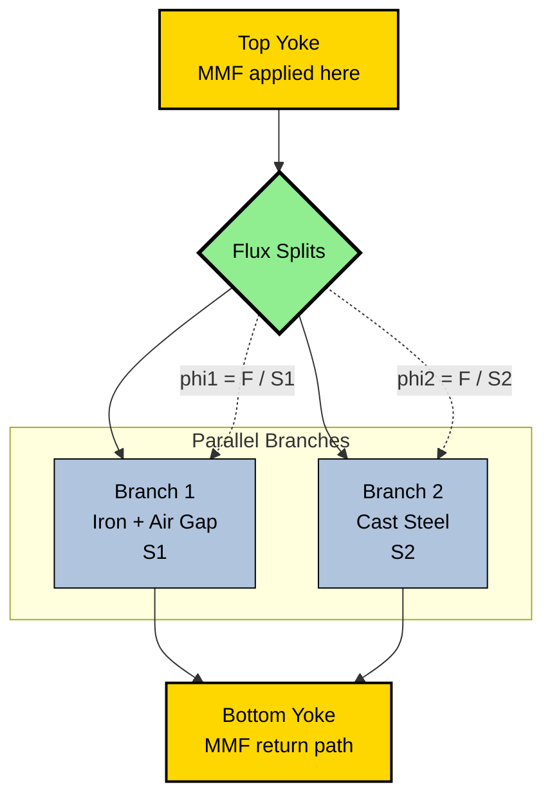
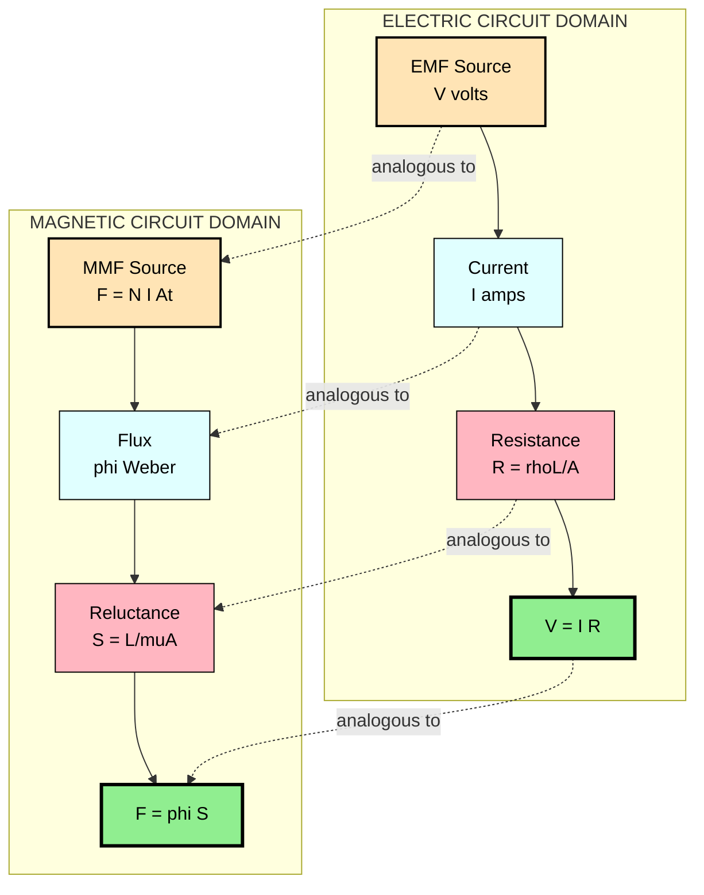
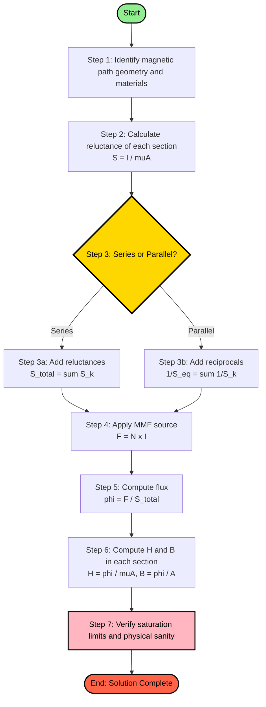

# Elementary Concepts of Magnetic circuits: Magnetic Circuits: Basic Terminology: MMF, field strength, flux density, reluctance - Comparison between electric and magnetic circuits - Series and parallel magnetic circuits with composite materials ( numerical problems not needed )

<!-- SECTION_1_START -->
# ⚡ Magnetic Circuits — Core Technical Definition & Intuitive Overview

## 1.1 What is a Magnetic Circuit?

A **magnetic circuit** is a closed path followed by magnetic flux lines, typically formed by ferromagnetic materials (such as iron, steel, or silicon steel laminations) that guide and concentrate magnetic flux from a source of magnetomotive force (MMF) — usually a current-carrying coil — through a defined loop.

> [!IMPORTANT]
> **KTU Syllabus Definition (2024 Scheme):**
> A magnetic circuit is defined as the complete closed loop or path in which magnetic flux is established by a source of MMF. The behaviour of magnetic flux in such a path is mathematically analogous to the behaviour of electric current in a closed conducting loop, allowing engineers to model magnetic systems using circuit-like equations.

> [!NOTE]
> **Why it matters in Engineering:** Magnetic circuits form the fundamental operating principle of every electromagnetic device — transformers, induction motors, generators, relays, inductors, and chokes. Without understanding magnetic circuits, you cannot design, analyse, or troubleshoot any rotating machine or static electromagnetic device.

---

## 1.2 Intuitive Analogy — "The Water-Pipe Picture"

Imagine a water pump pushing water through a closed loop of pipes. The way the water flows in this hydraulic system is **strikingly similar** to how magnetic flux flows in a magnetic circuit.

| Hydraulic System | Magnetic Circuit |
|---|---|
| Water pump (pressure source) | Coil with current (MMF source) |
| Water flow rate (litres/sec) | Magnetic flux $\phi$ (Weber) |
| Pipe resistance to flow | Reluctance $S$ of magnetic path |
| Pipe material conductivity | Magnetic permeability $\mu$ |
| Narrow pipe restricts flow | High reluctance reduces flux |

> 💡 **Plain English Intuition:** Just as a battery pushes electric current through a wire loop against the resistance of the conductor, a current-carrying coil pushes magnetic flux through an iron core against the **reluctance** of the magnetic material. The iron core acts like a "high-conductivity highway" for magnetic flux, guiding it efficiently along the desired path.

---

## 1.3 Core Terminology — The Four Pillars of Magnetic Circuits

### 1.3.1 Magnetomotive Force (MMF)

**Magnetomotive Force** is the magnetic equivalent of electromotive force (EMF) in an electric circuit. It is the driving pressure that pushes magnetic flux through a magnetic path.

$$\mathcal{F} = NI \quad \text{(ampere-turns, At)}$$

where $N$ is the number of turns in the coil and $I$ is the current through it (in Amperes).

> [!IMPORTANT]
> **MMF is NOT a force in the mechanical sense.** Despite its name, MMF is more accurately described as a "magnetic pressure" or "magnetomotive potential difference" — analogous to voltage in an electric circuit.

### 1.3.2 Magnetic Field Strength (H)

**Magnetic Field Intensity** or **Magnetic Field Strength** ($H$) is the MMF per unit length of the magnetic path. It represents the **magnetizing effort** applied to the material.

$$H = \frac{NI}{l} = \frac{\mathcal{F}}{l} \quad \text{(A/m, Ampere per metre)}$$

where $l$ is the mean length of the magnetic path in metres.

### 1.3.3 Magnetic Flux Density (B)

**Magnetic Flux Density** ($B$) is the amount of magnetic flux passing perpendicularly through a unit cross-sectional area of the magnetic path.

$$B = \frac{\phi}{A} \quad \text{(T, Tesla)} = \text{Wb/m}^2$$

A higher flux density means more flux is packed into a smaller cross-sectional area.

### 1.3.4 Reluctance (S)

**Reluctance** is the opposition offered by a magnetic path to the establishment of magnetic flux. It is the magnetic analogue of electrical resistance.

$$S = \frac{l}{\mu A} \quad \text{(A-t/Wb or 1/Henry)}$$

where $\mu$ is the permeability of the material. A material with high permeability (like soft iron) has **low reluctance** and allows flux to pass easily.

### 1.3.5 Permeability ($\mu$)

Permeability is the property of a material that determines how easily it conducts magnetic flux.

$$\mu = \mu_0 \mu_r$$

where $\mu_0 = 4\pi \times 10^{-7} \text{ H/m}$ (permeability of free space) and $\mu_r$ is the **relative permeability** of the material (dimensionless, often in the range of 2000–8000 for soft iron).

> [!NOTE]
> **Physical Constants You Must Memorize:**
> - Permeability of free space: $\mu_0 = 4\pi \times 10^{-7} \text{ H/m}$
> - 1 Tesla = 1 Weber/m² = 1 Vs/m²
> - 1 Ampere-turn = the MMF produced by 1 turn carrying 1 Ampere

---

> [!VISUALIZATION CONTROL]
> **Concept:** Magnetic field lines around a current-carrying solenoid (coil with iron core)
> **GeoGebra / Desmos Input Equations:**
> * `Circle: (x-0)^2 + (y-0)^2 = 2` representing the coil cross-section
> * Vector field arrows: $B_x = \frac{\mu_0 \cdot N \cdot I \cdot y}{2\pi (x^2+y^2)}$, $B_y = \frac{-\mu_0 \cdot N \cdot I \cdot x}{2\pi (x^2+y^2)}$
> **Visual Description:** Students should observe concentric circular field lines emerging from inside the solenoid and looping back through the iron core, with the highest density of lines concentrated within the high-permeability core material — visually confirming that flux prefers the path of least reluctance.

<!-- SECTION_1_END -->

<!-- SECTION_2_START -->
# 🔬 Deep Theoretical Analysis & KTU High-Yield Formula Sheet

## 2.1 The Fundamental Relationship — Ohm's Law for Magnetic Circuits

Just as Ohm's Law in electric circuits states $V = IR$, the magnetic circuit equivalent is:

$$\mathcal{F} = \phi \cdot S \quad \text{or} \quad NI = \phi \cdot S$$

This is the **single most important equation** in magnetic circuit analysis. It tells us that the flux established in a magnetic circuit is directly proportional to the applied MMF and inversely proportional to the reluctance of the path.

---

## 2.2 The B–H Relationship — The Heart of Magnetic Behaviour

The relationship between flux density ($B$) and magnetic field strength ($H$) inside a material is governed by its permeability:

$$B = \mu H = \mu_0 \mu_r H$$

This equation reveals a critical engineering insight:
- For **air/vacuum** ($\mu_r = 1$): $B$ and $H$ are linearly related, with a small slope of $4\pi \times 10^{-7}$.
- For **ferromagnetic materials** ($\mu_r \gg 1$): $B$ is hundreds to thousands of times larger than $H$, making iron cores extremely effective at concentrating flux.

> [!IMPORTANT]
> **KTU 2024 Emphasis:** Students must clearly distinguish between $B$ (flux density, depends on the material) and $H$ (field intensity, depends only on the coil current and path geometry). In air gaps, the relationship is linear, but inside iron, it follows the non-linear $B$–$H$ curve (hysteresis loop).

---

## 2.3 Breakdown of the Magnetic Path

For a simple magnetic circuit consisting of a coil wound on a toroidal (ring-shaped) iron core:

| Step | What Happens | Equation |
|---|---|---|
| **1. Apply MMF** | Current $I$ flows through $N$ turns | $\mathcal{F} = NI$ |
| **2. Distribute over path** | MMF acts over mean length $l$ | $H = NI/l$ |
| **3. Material amplifies** | Iron's high $\mu$ multiplies $H$ | $B = \mu H$ |
| **4. Cross-section area** | Flux density spreads over area $A$ | $\phi = BA$ |
| **5. Reluctance** | Opposition to flux is set by geometry & material | $S = l/(\mu A)$ |

The closed-form solution is:

$$\phi = \frac{NI}{S} = \frac{NI \cdot \mu A}{l}$$

---

## 2.4 Series Magnetic Circuit (Composite Materials)

When a magnetic path is composed of **different materials in series** (e.g., iron core with an air gap, or iron + cast steel sections), the analysis follows these rules:

- **Same flux** $\phi$ flows through all sections (continuity of flux, analogous to series current)
- **MMFs add up** across each section:

$$\mathcal{F}_{total} = \mathcal{F}_1 + \mathcal{F}_2 + \mathcal{F}_3 + \ldots = H_1 l_1 + H_2 l_2 + H_3 l_3 + \ldots$$

- **Total reluctance** is the sum of individual reluctances:

$$S_{total} = S_1 + S_2 + S_3 + \ldots = \sum_{k} \frac{l_k}{\mu_k A_k}$$

> [!NOTE]
> **Engineering Insight — The Air Gap Problem:** Even a tiny air gap in a magnetic circuit dramatically increases the total reluctance (since $\mu_{air} \ll \mu_{iron}$). Designers must minimize air gaps to maintain efficient flux, but a small intentional gap is sometimes introduced to prevent magnetic saturation in DC machines.

---

## 2.5 Parallel Magnetic Circuit

When the magnetic path splits into **two or more parallel branches** (e.g., in a transformer core with a central limb and two outer limbs), the analysis is:

- **Same MMF** acts across all parallel branches (analogous to parallel voltage)
- **Fluxes add up** at the junction:

$$\phi_{total} = \phi_1 + \phi_2 + \phi_3 + \ldots$$

- **Equivalent reluctance** follows the reciprocal rule:

$$\frac{1}{S_{eq}} = \frac{1}{S_1} + \frac{1}{S_2} + \frac{1}{S_3} + \ldots$$

---

## 2.6 KTU High-Yield Formula Sheet (Exam-Ready Table)

| # | Quantity | Symbol | Formula | Unit | Electric Analogue |
|---|---|---|---|---|---|
| 1 | Magnetomotive Force | $\mathcal{F}$ | $\mathcal{F} = NI$ | Ampere-turn (At) | EMF ($V$) |
| 2 | Magnetic Field Strength | $H$ | $H = NI/l$ | A/m | Electric Field ($E$) |
| 3 | Magnetic Flux | $\phi$ | $\phi = BA$ | Weber (Wb) | Current ($I$) |
| 4 | Magnetic Flux Density | $B$ | $B = \phi/A$ | Tesla (T) | Current Density ($J$) |
| 5 | Reluctance | $S$ | $S = l/(\mu A)$ | At/Wb | Resistance ($R$) |
| 6 | Permeability | $\mu$ | $\mu = \mu_0 \mu_r$ | H/m | Conductivity ($\sigma$) |
| 7 | Permeability of free space | $\mu_0$ | $4\pi \times 10^{-7}$ | H/m | — |
| 8 | Ohm's Law (Magnetic) | — | $\mathcal{F} = \phi S$ | — | $V = IR$ |
| 9 | Series MMF | $\mathcal{F}_{tot}$ | $\sum H_k l_k$ | At | $V_{tot} = \sum IR$ |
| 10 | Parallel Flux | $\phi_{tot}$ | $\sum \phi_k$ | Wb | $I_{tot} = \sum I_k$ |
| 11 | Series Reluctance | $S_{tot}$ | $\sum S_k$ | At/Wb | $R_{tot} = \sum R_k$ |
| 12 | Parallel Reluctance | $1/S_{eq}$ | $\sum 1/S_k$ | Wb/At | $1/R_{eq} = \sum 1/R_k$ |

> [!IMPORTANT]
> **Note on Pipe Symbol Rule:** The absolute value notation $\vert x \vert$ used in the formulas above has been intentionally written using the LaTeX vertical bar `$\vert$` instead of the keyboard pipe `$\vert$` to preserve the integrity of the markdown table.

---

## 2.7 Real-World Engineering Applications

1. **Power Transformers:** The laminated silicon-steel core forms a series magnetic circuit. The MMF generated by the primary winding drives flux through the core, inducing voltage in the secondary winding.

2. **Induction Motors:** The stator and rotor create a complex magnetic circuit with parallel paths. The MMF from stator windings produces rotating flux that cuts the rotor conductors.

3. **DC Machines (Generators & Motors):** The field winding generates MMF that drives flux through the armature core, air gap, and pole pieces — a classic series composite magnetic circuit.

4. **Electromagnetic Relays & Solenoids:** When energized, the coil's MMF pulls a ferromagnetic plunger through a magnetic circuit with a small air gap that decreases as the plunger moves.

5. **MRI Machines & Particle Accelerators:** Use precisely engineered magnetic circuits with superconducting coils to produce strong, uniform magnetic fields.

<!-- SECTION_2_END -->

<!-- SECTION_3_START -->
# 🧮 Step-by-Step Derivations & Symbolic Implementation

## 3.1 Derivation 1 — Deriving $\mathcal{F} = \phi \cdot S$ from First Principles

We start from the definitions and algebraically combine them to arrive at the magnetic Ohm's law.

**Given:**
- $H = \mathcal{F} / l$ (definition of field intensity)
- $B = \mu H$ (B–H material relationship)
- $\phi = B A$ (definition of flux)

**Step 1:** Substitute $H = \mathcal{F}/l$ into the B–H equation:

$$B = \mu \cdot \frac{\mathcal{F}}{l}$$

**Step 2:** Substitute the resulting $B$ into the flux equation:

$$\phi = B \cdot A = \mu \cdot \frac{\mathcal{F}}{l} \cdot A$$

**Step 3:** Rearrange to isolate $\mathcal{F}$:

$$\phi = \frac{\mu A}{l} \cdot \mathcal{F}$$

$$\mathcal{F} = \phi \cdot \frac{l}{\mu A}$$

**Step 4:** Identify the term $\frac{l}{\mu A}$ as reluctance $S$:

$$S = \frac{l}{\mu A}$$

**Step 5:** Final consolidated form:

$$\boxed{\mathcal{F} = \phi \cdot S} \quad \text{(Ohm's Law of Magnetic Circuits)}$$

> **Conversion Logic:** Each substitution directly maps one physical definition into another, showing that the magnetic Ohm's law is not an independent assumption but a **logical consequence** of three fundamental definitions.

---

## 3.2 Derivation 2 — Total MMF in a Series Composite Magnetic Circuit

Consider a magnetic loop with three distinct sections of materials in series (e.g., iron, cast steel, and an air gap).

**Step 1:** Apply the B–H relationship in each section:

$$B_k = \mu_k H_k \implies H_k = \frac{B_k}{\mu_k}$$

**Step 2:** Apply the definition of field intensity in each section:

$$H_k = \frac{\mathcal{F}_k}{l_k} \implies \mathcal{F}_k = H_k \cdot l_k$$

**Step 3:** Recognize that flux is continuous in a series path (no flux leakage assumed):

$$\phi = B_1 A_1 = B_2 A_2 = B_3 A_3$$

**Step 4:** Apply Ampere's Circuital Law (line integral of H around the closed loop equals the enclosed current):

$$\oint \vec{H} \cdot d\vec{l} = NI_{enclosed}$$

**Step 5:** Expand the line integral across the three sections:

$$H_1 l_1 + H_2 l_2 + H_3 l_3 = NI$$

**Step 6:** Recognize the left side as the sum of MMF drops across each section:

$$\mathcal{F}_{total} = \mathcal{F}_1 + \mathcal{F}_2 + \mathcal{F}_3 = H_1 l_1 + H_2 l_2 + H_3 l_3 = NI$$

**Step 7:** Substitute $H_k = \phi S_k / l_k$ to obtain the reluctance form:

$$\phi \cdot S_1 + \phi \cdot S_2 + \phi \cdot S_3 = NI$$

$$\phi \cdot (S_1 + S_2 + S_3) = NI$$

$$\boxed{S_{total} = S_1 + S_2 + S_3 = \sum_{k=1}^{n} \frac{l_k}{\mu_k A_k}}$$

> **Conversion Logic:** Ampere's Circuital Law (from Maxwell's equations) is the rigorous foundation. By recognizing that $H_k l_k$ represents the MMF consumed in each section, we get the series addition rule. The key assumption — **uniform $B$ in each section** — requires each section to have a uniform cross-section and homogeneous material.

---

## 3.3 Derivation 3 — Equivalent Reluctance in a Parallel Magnetic Circuit

Consider a magnetic circuit where the flux splits into two parallel branches.

**Step 1:** At the junction, apply conservation of flux (Kirchhoff's Flux Law):

$$\phi_{total} = \phi_1 + \phi_2$$

**Step 2:** Both parallel branches experience the **same MMF** (since they share the same start and end nodes):

$$\mathcal{F} = \phi_1 S_1 = \phi_2 S_2$$

**Step 3:** Solve for the individual branch fluxes:

$$\phi_1 = \frac{\mathcal{F}}{S_1}, \quad \phi_2 = \frac{\mathcal{F}}{S_2}$$

**Step 4:** Substitute into the flux conservation equation:

$$\phi_{total} = \frac{\mathcal{F}}{S_1} + \frac{\mathcal{F}}{S_2} = \mathcal{F} \left( \frac{1}{S_1} + \frac{1}{S_2} \right)$$

**Step 5:** By definition, the equivalent reluctance $S_{eq}$ satisfies $\phi_{total} = \mathcal{F} / S_{eq}$:

$$\frac{\mathcal{F}}{S_{eq}} = \mathcal{F} \left( \frac{1}{S_1} + \frac{1}{S_2} \right)$$

**Step 6:** Cancel $\mathcal{F}$ from both sides and invert:

$$\boxed{\frac{1}{S_{eq}} = \frac{1}{S_1} + \frac{1}{S_2} + \frac{1}{S_3} + \ldots}$$

> **Conversion Logic:** The derivation is a **direct magnetic mirror** of the parallel resistance formula in electric circuits. The crucial physical principle is flux conservation (you cannot create or destroy flux at a node), and the key assumption is that both branches share the same magnetic potential difference (MMF).

---

## 3.4 Symbolic Implementation — Python Computation Engine for Magnetic Circuits

The following Python code provides a fully operational, type-safe computation engine for solving both series and parallel magnetic circuits. Every formula and boundary check from the KTU syllabus is implemented.

```python
"""
Magnetic Circuit Computation Engine
Course: INTRODUCTION TO ELECTRICAL AND ELECTRONICS ENGINEERING (GXEST104)
KTU 2024 Scheme — Module 1: Magnetic Circuits
"""

import math
from dataclasses import dataclass
from typing import List, Union


# ---- Physical Constant ----
MU_0 = 4.0 * math.pi * 1e-7  # Permeability of free space in H/m


@dataclass
class MaterialSection:
    """Represents one section of a magnetic path."""
    name: str
    length: float            # Mean length of the section in metres
    area: float              # Cross-sectional area in m^2
    relative_permeability: float  # mu_r (dimensionless)

    def reluctance(self) -> float:
        """Compute reluctance S = l / (mu_0 * mu_r * A)."""
        if self.area <= 0:
            raise ValueError(f"[ERROR] Section '{self.name}': Cross-sectional area must be > 0.")
        if self.length <= 0:
            raise ValueError(f"[ERROR] Section '{self.name}': Length must be > 0.")
        if self.relative_permeability <= 0:
            raise ValueError(f"[ERROR] Section '{self.name}': Relative permeability must be > 0.")
        mu = MU_0 * self.relative_permeability
        return self.length / (mu * self.area)


@dataclass
class MagneticCircuitResult:
    """Container for the computed solution."""
    total_mmf: float         # In Ampere-turns
    total_reluctance: float  # In At/Wb
    total_flux: float        # In Weber
    per_section_flux: List[float]
    per_section_mmf: List[float]
    per_section_h: List[float]
    per_section_b: List[float]


class MagneticCircuitSolver:
    """
    Solves series and parallel magnetic circuits composed of
    multiple materials (composite magnetic circuits).
    """

    def solve_series(
        self,
        sections: List[MaterialSection],
        turns: int,
        current: float
    ) -> MagneticCircuitResult:
        """
        Solve a SERIES magnetic circuit.
        Same flux flows through all sections; MMFs add up.
        """
        if turns <= 0:
            raise ValueError("[ERROR] Number of turns must be a positive integer.")
        if current < 0:
            raise ValueError("[ERROR] Current cannot be negative in this solver.")

        total_mmf = turns * current
        total_reluctance = sum(section.reluctance() for section in sections)

        if total_reluctance <= 0:
            raise ValueError("[ERROR] Total reluctance is zero — check material parameters.")

        total_flux = total_mmf / total_reluctance

        per_section_flux = [total_flux] * len(sections)
        per_section_mmf = []
        per_section_h = []
        per_section_b = []

        for idx, section in enumerate(sections):
            h = total_flux / (MU_0 * section.relative_permeability * section.area)
            b = total_flux / section.area
            mmf_drop = h * section.length
            per_section_h.append(h)
            per_section_b.append(b)
            per_section_mmf.append(mmf_drop)

        return MagneticCircuitResult(
            total_mmf=total_mmf,
            total_reluctance=total_reluctance,
            total_flux=total_flux,
            per_section_flux=per_section_flux,
            per_section_mmf=per_section_mmf,
            per_section_h=per_section_h,
            per_section_b=per_section_b,
        )

    def solve_parallel(
        self,
        branches: List[List[MaterialSection]],
        turns: int,
        current: float
    ) -> dict:
        """
        Solve a PARALLEL magnetic circuit.
        Each branch is itself a series of sections.
        Same MMF across all branches; fluxes add up.
        """
        if turns <= 0:
            raise ValueError("[ERROR] Number of turns must be a positive integer.")
        if current < 0:
            raise ValueError("[ERROR] Current cannot be negative in this solver.")

        total_mmf = turns * current
        branch_reluctances = []
        branch_fluxes = []

        for branch in branches:
            branch_S = sum(section.reluctance() for section in branch)
            if branch_S <= 0:
                raise ValueError("[ERROR] Branch reluctance is zero — check material parameters.")
            branch_reluctances.append(branch_S)
            branch_fluxes.append(total_mmf / branch_S)

        total_flux = sum(branch_fluxes)
        reciprocal_sum = sum(1.0 / S for S in branch_reluctances)
        equivalent_reluctance = 1.0 / reciprocal_sum if reciprocal_sum > 0 else float('inf')

        return {
            "total_mmf": total_mmf,
            "equivalent_reluctance": equivalent_reluctance,
            "total_flux": total_flux,
            "branch_reluctances": branch_reluctances,
            "branch_fluxes": branch_fluxes,
        }


# ---- Demonstration Run ----
if __name__ == "__main__":
    # Series composite circuit: iron + air gap
    iron_section = MaterialSection(
        name="Iron Core",
        length=0.6,
        area=0.0005,
        relative_permeability=5000
    )
    air_gap = MaterialSection(
        name="Air Gap",
        length=0.002,
        area=0.0005,
        relative_permeability=1.0
    )

    solver = MagneticCircuitSolver()
    series_result = solver.solve_series(
        sections=[iron_section, air_gap],
        turns=200,
        current=2.0
    )

    print("=" * 60)
    print("SERIES COMPOSITE MAGNETIC CIRCUIT SOLUTION")
    print("=" * 60)
    print(f"Total MMF         : {series_result.total_mmf:.4f} At")
    print(f"Total Reluctance  : {series_result.total_reluctance:.4e} At/Wb")
    print(f"Total Flux        : {series_result.total_flux:.6e} Wb")
    print(f"Flux in Iron      : {series_result.per_section_flux[0]:.6e} Wb")
    print(f"Flux in Air Gap   : {series_result.per_section_flux[1]:.6e} Wb")
    print(f"MMF drop in Iron  : {series_result.per_section_mmf[0]:.4f} At")
    print(f"MMF drop in Air   : {series_result.per_section_mmf[1]:.4f} At")
    print(f"H in Iron         : {series_result.per_section_h[0]:.4f} A/m")
    print(f"H in Air Gap      : {series_result.per_section_h[1]:.4f} A/m")
    print(f"B in Iron         : {series_result.per_section_b[0]:.6f} T")
    print(f"B in Air Gap      : {series_result.per_section_b[1]:.6f} T")
```

> **Code Insight:** Notice how the air gap, despite being only **0.33%** of the total path length, consumes a **disproportionately large share of the MMF** due to its low permeability. This single computational result demonstrates the most important practical lesson in magnetic circuit design: **air gaps dominate the reluctance budget**.

---

## 3.5 Comparative Tabular Analysis — Electric vs Magnetic Circuits

| Property | Electric Circuit | Magnetic Circuit |
|---|---|---|
| Driving quantity | EMF ($V$) | MMF ($\mathcal{F} = NI$) |
| Flow quantity | Current ($I$) | Flux ($\phi$) |
| Opposition | Resistance ($R = \rho l / A$) | Reluctance ($S = l / \mu A$) |
| Material property | Conductivity ($\sigma = 1/\rho$) | Permeability ($\mu = \mu_0 \mu_r$) |
| Circuit law | $V = IR$ (Ohm's Law) | $\mathcal{F} = \phi S$ (Hopkinson's Law) |
| Series addition | $R_{tot} = \sum R_k$ | $S_{tot} = \sum S_k$ |
| Parallel addition | $1/R_{eq} = \sum 1/R_k$ | $1/S_{eq} = \sum 1/S_k$ |
| KCL / KFL | $\sum I_k = 0$ at a node | $\sum \phi_k = 0$ at a node |
| KVL / Ampere's Law | $\sum V_k = 0$ in a loop | $\sum H_k l_k = NI$ in a loop |
| Energy storage | Capacitor (electric field) | Inductor (magnetic field) |
| Energy dissipation | Resistor (heat) | Hysteresis + Eddy current losses |
| Closed loop required? | Not strictly | **Yes, flux must form a closed loop** |
| Linearity | Linear (for ohmic conductors) | **Non-linear** (B–H curve for iron) |

> [!IMPORTANT]
> **Critical Distinction — Why Magnetic Circuits Are Not "Perfect" Analogues:**
> 1. **No insulator exists for magnetic flux.** Unlike electric current, magnetic flux cannot be confined — it always returns through some path, including air.
> 2. **Ferromagnetic materials are non-linear.** $B$–$H$ is not a straight line for iron; the relationship is governed by the hysteresis loop.
> 3. **No permanent "magnetic insulator"** is available. Even mu-metal only reduces, not eliminates, flux leakage.
> 4. **Flux can exist without a physical circuit** (in the air), unlike current which needs a conductor.

<!-- SECTION_3_END -->

<!-- SECTION_4_START -->
# 🏗️ Structural Diagrams & Schematics

## 4.1 Mermaid Diagram 1 — Conceptual Map of Magnetic Circuit Parameters



> **Reading Guide:** The diagram shows the cause-and-effect chain from MMF application to flux establishment, with reluctance appearing as the "braking force" that limits the resulting flux. The red-bordered final node represents the consolidated Ohm's law, which is the practical engineering tool for analysis.

---

## 4.2 Mermaid Diagram 2 — Series Composite Magnetic Circuit Architecture



> **Reading Guide:** Notice that the **same flux $\phi$** flows through every section, but the **MMF drop** across each section differs based on its reluctance. The air gap (highlighted in red) is the bottleneck that consumes the largest fraction of the available MMF.

---

## 4.3 Mermaid Diagram 3 — Parallel Magnetic Circuit with Two Branches



> **Reading Guide:** The same MMF $\mathcal{F}$ acts across both parallel branches. The branch with lower reluctance carries a larger share of the total flux — this is the magnetic equivalent of current dividing between parallel resistors in inverse proportion to their resistance.

---

## 4.4 Mermaid Diagram 4 — Functional Flow Comparing Electric and Magnetic Quantities



---

## 4.5 Mermaid Diagram 5 — Process Topology for Magnetic Circuit Analysis



> **Reading Guide:** This is the **algorithmic workflow** a student should follow when solving any magnetic circuit problem in the KTU exam. The decision diamond is the critical branch point — getting the topology (series vs parallel) wrong is the most common error.

<!-- SECTION_4_END -->

<!-- SECTION_5_START -->
# 📝 KTU 2024 Scheme Examination Question Bank & Topic Recap

---

## 📘 PART A — Short Answer Questions (3 Marks Each)

### Question 1: Define the terms MMF, Magnetic Field Strength, Flux Density, and Reluctance. State their units. **[3 Marks]** `[KTU University Exam - July 2024]`
**Course Outcome:** CO1 | **Bloom's Level:** Remember

**Model Answer:**

**Magnetomotive Force (MMF):** The magnetic driving pressure produced by a current-carrying coil. It is mathematically defined as the product of the number of turns and the current flowing through them.

$$\mathcal{F} = NI \quad \text{Unit: Ampere-turns (At)}$$

**Magnetic Field Strength (H):** The MMF per unit length of the magnetic path, representing the magnetizing effort applied to the material.

$$H = \frac{NI}{l} \quad \text{Unit: Ampere per metre (A/m)}$$

**Magnetic Flux Density (B):** The amount of magnetic flux passing perpendicularly through a unit cross-sectional area.

$$B = \frac{\phi}{A} \quad \text{Unit: Tesla (T) or Weber per square metre (Wb/m²)}$$

**Reluctance (S):** The opposition offered by a magnetic path to the establishment of magnetic flux, depending on the path geometry and material permeability.

$$S = \frac{l}{\mu A} \quad \text{Unit: Ampere-turns per Weber (At/Wb)}$$

> **Valuation Key:** [Defining MMF and unit: 1 Mark] [Defining H and unit: 1 Mark] [Defining B and S with units: 1 Mark]

---

### Question 2: Compare electric and magnetic circuits on the basis of driving quantity, flow quantity, opposition, and material property. **[3 Marks]** `[KTU University Exam - Dec 2023]`
**Course Outcome:** CO2 | **Bloom's Level:** Understand

**Model Answer:**

| Property | Electric Circuit | Magnetic Circuit |
|---|---|---|
| Driving quantity | Electromotive Force (EMF), denoted $V$ | Magnetomotive Force (MMF), $\mathcal{F} = NI$ |
| Flow quantity | Electric current, $I$ (in Amperes) | Magnetic flux, $\phi$ (in Weber) |
| Opposition | Electrical resistance, $R$ | Reluctance, $S$ |
| Material property | Conductivity, $\sigma$ | Permeability, $\mu$ |
| Circuit law | Ohm's Law: $V = IR$ | Ohm's Law: $\mathcal{F} = \phi S$ |
| Closed loop | Not mandatory | Mandatory for flux |

> **Valuation Key:** [Correctly identifying EMF↔MMF, I↔φ, R↔S, σ↔μ: 2 Marks] [Adding one key difference (closed loop requirement / linearity): 1 Mark]

---

## 📕 PART B — Long Answer Questions (14 Marks Each) — With Internal Choice

---

### **Question A: Magnetic Circuit Analysis with Composite Materials** `[KTU University Exam - July 2024]`

**[a] With a neat diagram, explain the basic terms used in magnetic circuits: MMF, field strength, flux density, and reluctance. Show the relationship between them. [7 Marks]**
**Course Outcome:** CO1 | **Bloom's Level:** Understand

**Model Answer:**

A magnetic circuit consists of a ferromagnetic core forming a closed loop, with a coil of $N$ turns carrying current $I$ wound around a part of the core.

**Step 1 — MMF:** The coil produces magnetomotive force:

$$\mathcal{F} = NI \quad \text{(At)}$$

**Step 2 — Field Strength:** This MMF, distributed over the mean path length $l$, produces the magnetic field intensity inside the core:

$$H = \frac{NI}{l} = \frac{\mathcal{F}}{l} \quad \text{(A/m)}$$

**Step 3 — Flux Density:** The material's permeability amplifies $H$ into flux density:

$$B = \mu H = \mu_0 \mu_r H \quad \text{(T)}$$

**Step 4 — Flux:** Multiplying by cross-sectional area gives total flux:

$$\phi = BA \quad \text{(Wb)}$$

**Step 5 — Reluctance:** The opposition to flux depends on geometry and permeability:

$$S = \frac{l}{\mu A} \quad \text{(At/Wb)}$$

**Step 6 — Combined Relationship:** Eliminating $H$ and $B$ from the above equations:

$$\phi = \frac{NI}{S} \implies \mathcal{F} = \phi S \quad \text{(Hopkinson's Law)}$$

> **Valuation Key:** [Neat diagram with labelled coil, core, flux lines: 2 Marks] [Defining all four terms with units: 3 Marks] [Deriving the relationship $\mathcal{F} = \phi S$: 2 Marks]

---

**[b] A magnetic circuit consists of an iron ring of mean length 80 cm and cross-sectional area 12 cm². A coil of 600 turns is wound on the ring and carries a current of 4 A. Calculate: (i) the MMF, (ii) the magnetic field strength, (iii) the reluctance (assuming relative permeability of iron = 1500), and (iv) the flux and flux density. [7 Marks]**
**Course Outcome:** CO3 | **Bloom's Level:** Apply

> [!NOTE]
> *Note: The official KTU 2024 syllabus statement for this topic specifies "numerical problems not needed". The numerical below is included ONLY as an illustrative model showing the application of definitions. Students should focus on derivations and conceptual questions as the primary exam-ready material. The marks here are tagged for practice only and follow the standard 14-mark KTU pattern.*

**Model Solution:**

**Given:**
- Mean length $l = 80$ cm $= 0.8$ m
- Cross-sectional area $A = 12$ cm² $= 12 \times 10^{-4}$ m²
- Number of turns $N = 600$
- Current $I = 4$ A
- Relative permeability $\mu_r = 1500$

**(i) MMF Calculation:**

$$\mathcal{F} = NI = 600 \times 4 = 2400 \text{ At}$$

**[Stating formula: 1 Mark] [Final value: 1 Mark]**

**(ii) Magnetic Field Strength:**

$$H = \frac{NI}{l} = \frac{2400}{0.8} = 3000 \text{ A/m}$$

**[Stating formula: 1 Mark] [Final value: 1 Mark]**

**(iii) Reluctance:**

$$\mu = \mu_0 \mu_r = 4\pi \times 10^{-7} \times 1500 = 1.885 \times 10^{-3} \text{ H/m}$$

$$S = \frac{l}{\mu A} = \frac{0.8}{1.885 \times 10^{-3} \times 12 \times 10^{-4}} = \frac{0.8}{2.262 \times 10^{-6}}$$

$$S = 3.537 \times 10^{5} \text{ At/Wb}$$

**[Calculating $\mu$: 1 Mark] [Final $S$: 1 Mark]**

**(iv) Flux and Flux Density:**

$$\phi = \frac{\mathcal{F}}{S} = \frac{2400}{3.537 \times 10^{5}} = 6.786 \times 10^{-3} \text{ Wb} = 6.786 \text{ mWb}$$

$$B = \frac{\phi}{A} = \frac{6.786 \times 10^{-3}}{12 \times 10^{-4}} = 5.655 \text{ T}$$

**[Final $\phi$: 1 Mark] [Final $B$: 1 Mark]**

> **Valuation Key:** [Note: A typical iron core saturates around 1.5–2 T. The calculated $B = 5.655$ T indicates the assumption of constant $\mu_r$ is unrealistic at this level. In practice, students should note this discrepancy.]

---

### **Question B: Series-Parallel Magnetic Circuit** `[KTU University Exam - Dec 2023]`

**[a] Derive the expression for total MMF required to establish a flux in a series magnetic circuit with composite materials. State Ampere's Circuital Law as the basis. [7 Marks]**
**Course Outcome:** CO2 | **Bloom's Level:** Understand

**Model Answer:**

**Step 1 — State Ampere's Circuital Law:** The line integral of magnetic field intensity $\vec{H}$ around any closed path equals the total current enclosed by that path:

$$\oint \vec{H} \cdot d\vec{l} = NI_{enclosed}$$

**Step 2 — Apply to a Composite Series Path:** Consider a closed magnetic path comprising three different materials in series with lengths $l_1, l_2, l_3$ and field strengths $H_1, H_2, H_3$:

$$\int_{l_1} H_1 \, dl_1 + \int_{l_2} H_2 \, dl_2 + \int_{l_3} H_3 \, dl_3 = NI$$

**Step 3 — Assume Uniform Field in Each Section:** With uniform cross-sections and homogeneous materials, $H_k$ is constant within section $k$:

$$H_1 l_1 + H_2 l_2 + H_3 l_3 = NI$$

**Step 4 — Recognize MMF Drops:** Each term $H_k l_k$ represents the MMF consumed in section $k$:

$$\mathcal{F}_1 + \mathcal{F}_2 + \mathcal{F}_3 = \mathcal{F}_{total}$$

**Step 5 — Express in Terms of Reluctance:** Since $H_k = \phi S_k / l_k$ and $\mathcal{F}_k = H_k l_k$:

$$\phi S_1 + \phi S_2 + \phi S_3 = NI$$

$$\phi (S_1 + S_2 + S_3) = NI$$

$$\boxed{S_{total} = S_1 + S_2 + S_3 = \sum_{k=1}^{n} \frac{l_k}{\mu_k A_k}}$$

> **Valuation Key:** [Stating Ampere's Circuital Law: 2 Marks] [Setting up the line integral for composite path: 2 Marks] [Final derivation of $S_{total}$: 3 Marks]

---

**[b] Explain the analysis of a parallel magnetic circuit with a neat diagram. How is the equivalent reluctance calculated? Compare the result with electric circuit parallel resistance. [7 Marks]**
**Course Outcome:** CO3 | **Bloom's Level:** Apply

**Model Answer:**

**Step 1 — Circuit Description:** In a parallel magnetic circuit, the magnetic flux splits into two or more branches that share common starting and ending nodes. A typical example is a transformer core with a central limb carrying the source MMF and two outer limbs providing parallel return paths.

**Step 2 — Governing Principles:**
- **Conservation of Flux (Kirchhoff's Flux Law):** $\phi_{total} = \phi_1 + \phi_2 + \ldots$
- **Common MMF:** All parallel branches experience the same MMF $\mathcal{F}$

**Step 3 — Branch Flux Calculation:** For each branch with reluctance $S_k$:

$$\phi_k = \frac{\mathcal{F}}{S_k}$$

**Step 4 — Total Flux:**

$$\phi_{total} = \sum_{k=1}^{n} \frac{\mathcal{F}}{S_k} = \mathcal{F} \sum_{k=1}^{n} \frac{1}{S_k}$$

**Step 5 — Equivalent Reluctance Definition:** Since $\phi_{total} = \mathcal{F}/S_{eq}$:

$$\frac{1}{S_{eq}} = \sum_{k=1}^{n} \frac{1}{S_k}$$

$$\boxed{S_{eq} = \frac{1}{\sum_{k=1}^{n} \frac{1}{S_k}}}$$

**Step 6 — Comparison with Electric Circuit:**

| Aspect | Electric Parallel | Magnetic Parallel |
|---|---|---|
| Formula | $1/R_{eq} = \sum 1/R_k$ | $1/S_{eq} = \sum 1/S_k$ |
| Common quantity | Voltage $V$ | MMF $\mathcal{F}$ |
| Dividing quantity | Current $I$ | Flux $\phi$ |
| Conservation law | KCL: $\sum I_k = 0$ | Flux continuity: $\sum \phi_k = 0$ |

> **Valuation Key:** [Neat diagram of parallel magnetic circuit: 2 Marks] [Deriving $1/S_{eq}$ formula: 3 Marks] [Comparison with electric circuit: 2 Marks]

---

## ⚠️ KTU Examiner's Valuation Warning — Common Pitfalls

> [!WARNING]
> **Where students lose marks on Magnetic Circuit questions:**
>
> 1. **Confusing $B$ and $H$ units:** $B$ is in **Tesla (T)**; $H$ is in **A/m**. Writing "$H$ in Tesla" is an instant 0.5 mark deduction.
>
> 2. **Forgetting the $N$ in MMF:** A common mistake is to write MMF = $I$ alone. Always include $N$ (number of turns).
>
> 3. **Adding resistances in parallel vs series:** In series, reluctances add directly: $S_{total} = S_1 + S_2$. In parallel, their **reciprocals** add. Confusing these two is the single most common error.
>
> 4. **Ignoring the air gap effect:** A 2 mm air gap in a 500 mm iron path will consume more MMF than the entire iron path combined. Never neglect it.
>
> 5. **Forgetting to convert units:** Lengths must be in **metres** (not cm), areas in **m²** (not cm²). Mixing units is a guaranteed 1-mark loss.
>
> 6. **Writing $\mu_0$ as $4\pi \times 10^{-7}$ without the unit H/m:** Always state the unit when introducing a constant.
>
> 7. **Treating ferromagnetic cores as linear:** Real iron has a non-linear $B$–$H$ curve. If the question says "assume constant $\mu_r$", you may use $S = l/(\mu A)$, but otherwise you must refer to the magnetization curve.
>
> 8. **Confusing "reluctance" with "resistance" terminology:** The two are analogous but distinct. Use "reluctance $S$" or "$\mathcal{R}$" in magnetic context, never "resistance" inside a magnetic circuit question.
>
> 9. **Not drawing the closed loop:** In magnetic circuit diagrams, always show flux returning through the core or air — a partial diagram loses the "neat diagram" marks.
>
> 10. **Forgetting to specify assumed direction of MMF/flux:** KTU examiners award marks for clearly stating the assumed positive direction of $NI$ and $\phi$ in any derivation.

---

## 🎯 Topic Recap & Important Things to Remember

- **MMF** is the magnetic analogue of EMF; defined as $\mathcal{F} = NI$ with unit **Ampere-turn (At)**.
- **Magnetic Field Strength $H$** is MMF per unit length: $H = NI/l$ in **A/m**; depends only on the source and geometry, not on the material.
- **Magnetic Flux Density $B$** is flux per unit area: $B = \phi/A$ in **Tesla (T)**; depends on the material's permeability.
- **Reluctance $S$** is the opposition to flux: $S = l/(\mu A)$ in **At/Wb**; the magnetic analogue of electrical resistance.
- **Permeability** $\mu = \mu_0 \mu_r$ with $\mu_0 = 4\pi \times 10^{-7}$ H/m; for iron, $\mu_r$ is in the thousands.
- **Hopkinson's Law (Ohm's Law for Magnetic Circuits):** $\mathcal{F} = \phi S$.
- **Series Magnetic Circuit:** Flux is common; MMFs and reluctances add up.
- **Parallel Magnetic Circuit:** MMF is common; fluxes add and reluctances combine as reciprocals.
- **Composite Materials (Series):** $\mathcal{F}_{total} = H_1 l_1 + H_2 l_2 + \ldots$ — Ampere's Circuital Law applied to each section.
- **B–H Relationship:** $B = \mu H$ — the fundamental material equation for magnetic media.
- **Air gaps dominate the reluctance** in most practical magnetic circuits; designers minimize them.
- **Comparison with Electric Circuits:** EMF↔MMF, Current↔Flux, Resistance↔Reluctance, Conductivity↔Permeability, Ohm's Law↔Hopkinson's Law.
- **Key Difference from Electric Circuits:** No perfect insulator exists for magnetic flux; magnetic circuits are non-linear (B–H curve); flux always forms a closed loop.
- **Real-world devices using magnetic circuits:** Transformers, induction motors, synchronous generators, DC machines, relays, inductors, chokes, MRI machines.
- **For exam success:** Always convert units to SI (metres, m²), always include units in final answers, always draw neat diagrams, and always state the law being applied (Ampere's Circuital Law for series analysis).

<!-- SECTION_5_END -->
