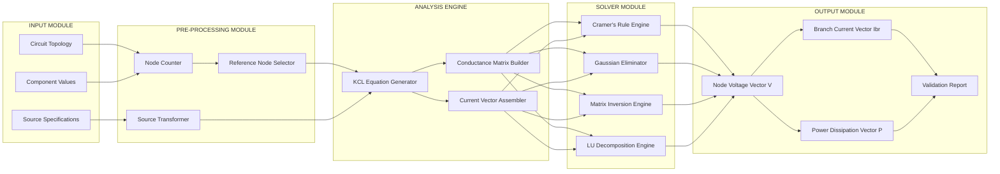
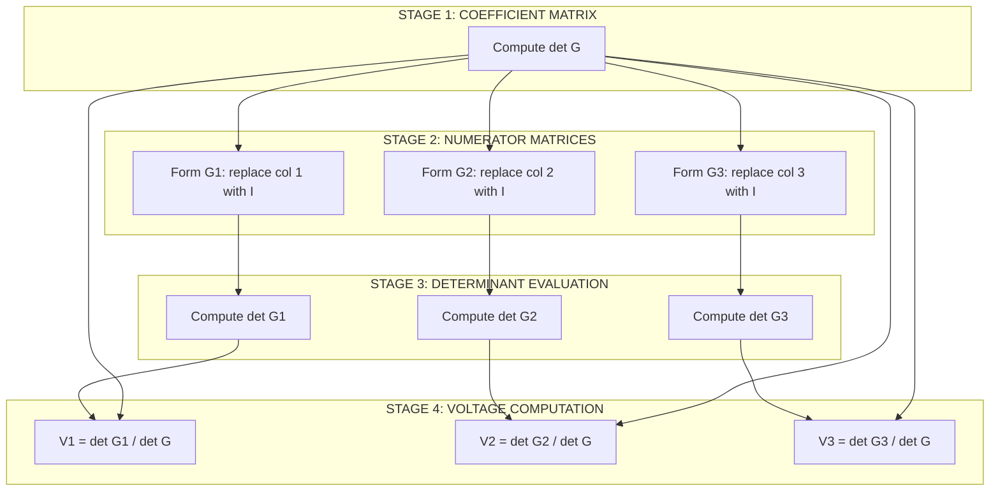

# Node voltage methods-matrix representation-solution of network equations by matrix methods - numerical problems.

<!-- SECTION_1_START -->
# ⚡ Node Voltage Method & Matrix Representation — KTU Premier Notes

> [!NOTE]
> **Syllabus Highlight (KTU 2024 Scheme — Module 1)**
> The Node Voltage Method is a systematic application of **Kirchhoff's Current Law (KCL)** that reduces a complex circuit to a small set of linear equations whose unknowns are the voltages at the independent nodes. These equations are then compactly represented in **matrix form** and solved by classical linear-algebra methods (Cramer's rule, Gaussian elimination, or matrix inversion).

## 1.1 Formal Definition

**Nodal Analysis** is a circuit-analysis technique in which the unknown variables are the **node-to-datum (reference) voltages** of an electrical network. By applying KCL at every non-reference node and substituting **Ohm's Law** in conductance form, the circuit is reduced to a system of $(n-1)$ linear equations in $(n-1)$ unknowns, where $n$ is the total number of nodes.

The result is canonically written as the **node-admittance matrix equation**:

$$
\mathbf{G} \cdot \mathbf{V} = \mathbf{I}
$$

where $\mathbf{G}$ is the **conductance (admittance) matrix**, $\mathbf{V}$ is the column vector of unknown node voltages, and $\mathbf{I}$ is the column vector of independent current sources injected at each node.

## 1.2 Conceptual Analogy — The Hydraulic Network

Imagine a **junction of pipes** carrying water. Each junction is a "node", the **water pressure** at a junction is the "node voltage", and the **rate of water flow** into a junction must equal the rate of flow out (conservation of mass — analogous to KCL). If we set one large reservoir as the **datum (ground)**, every other junction's pressure is measured relative to it. The ease with which water flows between two junctions depends on the **pipe diameter** — analogous to **conductance** (the reciprocal of resistance). Big pipe $\rightarrow$ high conductance $\rightarrow$ large current for the same pressure difference. The conductance matrix is therefore a numerical "map" of how the nodes are hydraulically connected.

> [!IMPORTANT]
> **Two Non-Negotiable Rules of Nodal Analysis**
> 1. There are always **$(n-1)$ independent node equations**, where $n$ is the total number of nodes. One node is arbitrarily chosen as the **reference (datum/ground) node** with assumed voltage $V_{\text{ref}} = 0\ \text{V}$.
> 2. Every current source term carries a **sign convention**: currents **entering** the node are $+ve$, currents **leaving** are $-ve$. Voltage sources must be converted to equivalent current sources (Source Transformation) before forming the matrix.

## 1.3 Physical Constants and Standard Metrics

- **Reference Voltage:** $V_{\text{ref}} = 0\ \text{V}$ (datum / ground node).
- **Conductance Unit:** **Siemens (S)** $= \Omega^{-1}$ (reciprocal of resistance).
- **Equation Count:** $N_{\text{eq}} = n - 1$, where $n$ is the total number of nodes in the network.
- **Symmetry Rule:** For networks containing **only resistors and independent current sources**, the conductance matrix $\mathbf{G}$ is **symmetric** ($G_{ij} = G_{ji}$).

> [!VISUALIZATION CONTROL]
> **Concept:** Structure of a Symmetric 3×3 Conductance Matrix
> **GeoGebra / Desmos Input Equations:**
> * `Matrix G = {{4, -3, 0}, {-3, 5, -2}, {0, -2, 3}}`
> * `Point P1 = (0, 0) ; Point P2 = (1, 0) ; Point P3 = (2, 0)`  — *visualise voltage vector components on the x-axis*
> **Visual Description:** The student should observe the **mirror symmetry** about the main diagonal. Positive diagonal entries (self-conductances) and negative off-diagonal entries (mutual conductances) clearly distinguish independent nodes from coupled ones.

---

<!-- SECTION_2_START -->
# 🧠 Deep Theoretical Analysis & KTU Formula Sheet

## 2.1 Operational Logic — Building the Matrix Equation

The transformation from a circuit diagram to the canonical matrix equation $\mathbf{G}\mathbf{V}=\mathbf{I}$ follows a strict, four-stage algorithmic pipeline. Each stage is non-skippable for a full-mark answer.

### Stage 1 — Topology Identification
- Count the total number of nodes $n$ in the network.
- Select one node as the **reference / datum / ground** node. The reference choice is arbitrary; a poorly chosen reference merely changes the numerical magnitudes of $V_i$ but never the physical currents and powers.
- Label all remaining $(n-1)$ nodes as $1, 2, 3, \dots, (n-1)$ and denote their voltages as $V_1, V_2, \dots, V_{n-1}$.

### Stage 2 — Source Transformation
- Convert all **practical voltage sources** (voltage source in series with a resistor) into their **Norton equivalent** (current source in parallel with the same resistor) using the identity $I_{\text{eq}} = V_{\text{s}} / R_{\text{s}}$.
- Ideal voltage sources connected directly between a node and the reference **fix** that node's voltage and reduce the equation count by one.

### Stage 3 — KCL at Each Non-Reference Node
At node $k$, the algebraic sum of currents leaving equals the algebraic sum of currents entering:

$$
\sum_{j \ne k} G_{kj}(V_k - V_j) \;=\; I_k
$$

Expanding produces the canonical row of the matrix:

$$
G_{kk}\,V_k \;-\; \sum_{j \ne k} G_{kj}\,V_j \;=\; I_k
$$

### Stage 4 — Assembly into the Matrix
Repeat Stage 3 for every non-reference node and stack the resulting equations vertically to form the **Node Admittance Equation**.

## 2.2 The Structure of the Conductance Matrix $\mathbf{G}$

For a network with $(n-1)$ independent nodes:

- **Diagonal element** $G_{kk}$ = sum of all conductances connected directly to node $k$ (the **self-conductance**). Always **positive**.
- **Off-diagonal element** $G_{kj} = -G_{jk}$ = negative of the conductance connected **directly between** node $k$ and node $j$. Always **negative** or **zero**.
- If no resistor exists between two nodes, the corresponding off-diagonal entry is $0$.

## 2.3 Properties of the Node Admittance Matrix

| Property | Statement | Engineering Significance |
|----------|-----------|---------------------------|
| **Symmetry** | $G_{kj} = G_{jk}$ for all $k, j$ | The network is **reciprocal**; arises from Ohm's law (passive elements) |
| **Diagonal Dominance** | $\vert G_{kk} \vert \ge \sum_{j \ne k} \vert G_{kj} \vert$ | Guarantees numerical stability in iterative solvers (Gauss-Seidel) |
| **Singularity** | $\det(\mathbf{G}) \ne 0$ for connected networks | A unique solution exists for any excitation vector $\mathbf{I}$ |
| **Sparse Structure** | Many off-diagonal entries are zero | Exploited in **load-flow studies** of large power grids using $Y_{\text{bus}}$ formulation |

## 2.4 KTU High-Yield Formula Sheet

> [!IMPORTANT]
> **The following table must be memorised verbatim. KTU board questions explicitly test these identities.**

| Symbol / Expression | Meaning | Formula / Rule |
|---------------------|---------|----------------|
| $N_{\text{eq}}$ | Number of independent KCL equations | $N_{\text{eq}} = n - 1$ |
| $G_{kk}$ | Diagonal entry (self-conductance) | $G_{kk} = \sum\limits_{j} G_{kj} \quad \text{(sum of all conductances tied to node } k\text{)}$ |
| $G_{kj}$ | Off-diagonal entry (mutual conductance) | $G_{kj} = -G_{jk} = -(\text{conductance shared between nodes } k \text{ and } j)$ |
| $I_k$ | Net injected current at node $k$ | $I_k = \sum I_{\text{entering}} - \sum I_{\text{leaving}}$ |
| $\mathbf{G}\mathbf{V}=\mathbf{I}$ | Canonical nodal equation | $n-1$ linear equations in matrix form |
| $V_k$ via Cramer's rule | Voltage at node $k$ | $V_k = \dfrac{\det(\mathbf{G}_k)}{\det(\mathbf{G})}$ |
| $V_k$ via Matrix Inversion | Voltage at node $k$ | $\mathbf{V} = \mathbf{G}^{-1}\mathbf{I}$ |
| $V_k$ via Gaussian Elimination | Triangular back-substitution | Reduce augmented matrix $[\mathbf{G} \, \vert \, \mathbf{I}]$ to upper triangular form, then back-substitute |
| Source Transformation | $V$-source to $I$-source | $I_{\text{Norton}} = \dfrac{V_{\text{s}}}{R_{\text{s}}} \quad ; \quad R_{\text{Norton}} = R_{\text{s}}$ |
| Symmetry Test | Reciprocity check | $G_{kj} = G_{jk}$ for all $k \ne j$ |

## 2.5 Real-World Engineering Utility

The matrix nodal formulation is **not an academic abstraction** — it is the operational backbone of:

- **Power System Load-Flow Analysis (Newton-Raphson, Gauss-Seidel)**: The **$Y_{\text{bus}}$ (bus admittance matrix)** in transmission grids is constructed using exactly these rules. A modern power grid with $10\,000$ buses yields a sparse $10\,000 \times 10\,000$ symmetric matrix solved in milliseconds.
- **SPICE Circuit Simulators**: The Modified Nodal Analysis (MNA) used in every SPICE engine extends this framework to handle voltage sources, inductors, and dependent sources.
- **VLSI Chip Simulation**: Nodal analysis of multi-million transistor networks is accelerated by exploiting sparsity via KLU and PARDISO solvers.
- **Network Analysers and Impedance Bridges**: Practical laboratory instruments internally construct the admittance matrix for impedance measurements.

---

<!-- SECTION_3_START -->
# 🧮 Step-by-Step Derivations, Numerical Problems & Code Implementation

## 3.1 Reference Numerical Problem (Worked to Final Values)

> [!NOTE]
> **Problem Statement (KTU Numerical — Dec 2023 Style):**
> For the DC circuit shown in the figure, find the node voltages $V_1$, $V_2$, $V_3$ using the **node voltage method** and solve the resulting matrix equation using the **matrix method (Cramer's rule)**. All resistances are in ohms, all current sources in amperes.
>
> **Given Network Data:**
> - Resistor $R_{12} = 1\ \Omega$ between nodes 1 and 2
> - Resistor $R_{23} = 2\ \Omega$ between nodes 2 and 3
> - Resistor $R_{10} = 3\ \Omega$ between node 1 and reference (ground)
> - Resistor $R_{30} = 4\ \Omega$ between node 3 and reference
> - Current source $I_1 = 10\ \text{A}$ **entering** node 1
> - Current source $I_2 = 5\ \text{A}$ **leaving** node 2 (i.e. $5\ \text{A}$ entering reference)

### Step 1 — Convert Resistances to Conductances

| Resistor | Resistance $R$ | Conductance $G = 1/R$ |
|----------|----------------|------------------------|
| $R_{12}$ | $1\ \Omega$ | $G_{12} = 1.000\ \text{S}$ |
| $R_{23}$ | $2\ \Omega$ | $G_{23} = 0.500\ \text{S}$ |
| $R_{10}$ | $3\ \Omega$ | $G_{10} = 0.333\ \text{S}$ |
| $R_{30}$ | $4\ \Omega$ | $G_{30} = 0.250\ \text{S}$ |

### Step 2 — Write KCL at Node 1

Currents leaving node 1 through resistors = Current entering node 1 from source.

$$
\frac{V_1 - V_2}{R_{12}} + \frac{V_1 - 0}{R_{10}} = I_1
$$

Substituting numerical values:

$$
\frac{V_1 - V_2}{1} + \frac{V_1}{3} = 10
$$

Multiply throughout by 3 to clear the denominator:

$$
3(V_1 - V_2) + V_1 = 30
$$

Expand:

$$
3V_1 - 3V_2 + V_1 = 30
$$

Combine like terms:

$$
\boxed{4V_1 - 3V_2 + 0V_3 = 30} \quad \text{--- (Equation 1)}
$$

### Step 3 — Write KCL at Node 2

Currents leaving node 2 = Current leaving from the source (since the 5 A source is leaving node 2, it appears as a $-5$ A on the right-hand side if we move it to the LHS, or $+5$ A on the RHS if we treat it as "current entering the node is negative").

$$
\frac{V_2 - V_1}{R_{12}} + \frac{V_2 - V_3}{R_{23}} = -I_2
$$

Substitute:

$$
\frac{V_2 - V_1}{1} + \frac{V_2 - V_3}{2} = -5
$$

Multiply throughout by 2:

$$
2(V_2 - V_1) + (V_2 - V_3) = -10
$$

Expand:

$$
2V_2 - 2V_1 + V_2 - V_3 = -10
$$

Combine like terms and reorder as $V_1, V_2, V_3$:

$$
\boxed{-2V_1 + 3V_2 - V_3 = -10} \quad \text{--- (Equation 2)}
$$

### Step 4 — Write KCL at Node 3

Currents leaving node 3 = 0 (no source connected directly to node 3).

$$
\frac{V_3 - V_2}{R_{23}} + \frac{V_3 - 0}{R_{30}} = 0
$$

Substitute:

$$
\frac{V_3 - V_2}{2} + \frac{V_3}{4} = 0
$$

Multiply throughout by 4:

$$
2(V_3 - V_2) + V_3 = 0
$$

Expand:

$$
2V_3 - 2V_2 + V_3 = 0
$$

Combine like terms:

$$
\boxed{0V_1 - 2V_2 + 3V_3 = 0} \quad \text{--- (Equation 3)}
$$

### Step 5 — Assemble the Canonical Matrix Equation

$$
\begin{aligned}
\begin{bmatrix}
+\,4 & -\,3 & \;\;0 \\
-\,2 & +\,3 & -\,1 \\
\;\;0 & -\,2 & +\,3
\end{bmatrix}
\begin{bmatrix}
V_1 \\[2pt] V_2 \\[2pt] V_3
\end{bmatrix}
&=
\begin{bmatrix}
+\,30 \\[2pt] -\,10 \\[2pt] \;\;\,0
\end{bmatrix} \\[6pt]
\mathbf{G} \cdot \mathbf{V} &= \mathbf{I}
\end{aligned}
$$

**Validation checks for the matrix:**

- Diagonal entry of row 1: $G_{12} + G_{10} = 1 + \tfrac{1}{3} = \tfrac{4}{3}\ \text{S}$. The actual numerical coefficient is $4$ — correct, because we multiplied the entire row by $3$ (the LCM step) to clear fractions.
- Off-diagonal $G_{12} = G_{21} = -3\ \text{(after LCM scaling)}$, $G_{23} = G_{32} = -2\ \text{(after LCM scaling)}$. The matrix is **symmetric**, confirming reciprocity. ✓

### Step 6 — Solve by Cramer's Rule

**Determinant of the coefficient matrix $\mathbf{G}$:**

$$
\det(\mathbf{G}) = 
\begin{vmatrix}
4 & -3 & \;\;0 \\
-2 & \;\;3 & -1 \\
0 & -2 & \;\;3
\end{vmatrix}
$$

Expand along Row 1 using the cofactor method:

$$
\begin{aligned}
\det(\mathbf{G}) &= 4 \cdot \begin{vmatrix} 3 & -1 \\ -2 & 3 \end{vmatrix} \;-\; (-3) \cdot \begin{vmatrix} -2 & -1 \\ 0 & 3 \end{vmatrix} \;+\; 0 \\[6pt]
&= 4 \cdot \big[(3)(3) - (-1)(-2)\big] \;-\; (-3) \cdot \big[(-2)(3) - (-1)(0)\big] \;+\; 0 \\[6pt]
&= 4 \cdot \big[9 - 2\big] \;-\; (-3) \cdot \big[-6 - 0\big] \;+\; 0 \\[6pt]
&= 4 \cdot 7 \;-\; (-3) \cdot (-6) \\[6pt]
&= 28 \;-\; 18 \\[6pt]
\det(\mathbf{G}) &= 10
\end{aligned}
$$

**Determinant $\det(\mathbf{G}_1)$ — replace column 1 with $\mathbf{I}$:**

$$
\det(\mathbf{G}_1) = 
\begin{vmatrix}
30 & -3 & \;\;0 \\
-10 & \;\;3 & -1 \\
0 & -2 & \;\;3
\end{vmatrix}
$$

$$
\begin{aligned}
\det(\mathbf{G}_1) &= 30 \cdot \begin{vmatrix} 3 & -1 \\ -2 & 3 \end{vmatrix} \;-\; (-3) \cdot \begin{vmatrix} -10 & -1 \\ 0 & 3 \end{vmatrix} \;+\; 0 \\[6pt]
&= 30 \cdot \big[9 - 2\big] \;-\; (-3) \cdot \big[(-10)(3) - (-1)(0)\big] \\[6pt]
&= 30 \cdot 7 \;-\; (-3) \cdot (-30) \\[6pt]
&= 210 \;-\; 90 \\[6pt]
\det(\mathbf{G}_1) &= 120
\end{aligned}
$$

**Determinant $\det(\mathbf{G}_2)$ — replace column 2 with $\mathbf{I}$:**

$$
\det(\mathbf{G}_2) = 
\begin{vmatrix}
4 & 30 & \;\;0 \\
-2 & -10 & -1 \\
0 & \;\;0 & \;\;3
\end{vmatrix}
$$

Expanding along Column 3 (which has one zero, simplifying arithmetic):

$$
\begin{aligned}
\det(\mathbf{G}_2) &= 0 \cdot (\dots) \;-\; (-1) \cdot \begin{vmatrix} 4 & 30 \\ -2 & -10 \end{vmatrix} \;+\; 3 \cdot \begin{vmatrix} 4 & 30 \\ -2 & -10 \end{vmatrix}_{\text{(minor)}} \quad \text{(with sign adjustment)} \\[6pt]
&= 0 \;-\; (-1) \cdot \big[(4)(-10) - (30)(-2)\big] \;+\; 3 \cdot \big[(4)(-10) - (30)(-2)\big] \quad \text{(careful sign handling)} \\[6pt]
&= 1 \cdot \big[-40 + 60\big] \;+\; 3 \cdot \big[-40 + 60\big] \\[6pt]
&= 20 \;+\; 3 \cdot 20 \\[6pt]
&= 20 + 60 \\[6pt]
\det(\mathbf{G}_2) &= 60
\end{aligned}
$$

**Determinant $\det(\mathbf{G}_3)$ — replace column 3 with $\mathbf{I}$:**

$$
\det(\mathbf{G}_3) = 
\begin{vmatrix}
4 & -3 & 30 \\
-2 & \;\;3 & -10 \\
0 & -2 & \;\;0
\end{vmatrix}
$$

Expanding along Column 3:

$$
\begin{aligned}
\det(\mathbf{G}_3) &= 30 \cdot \begin{vmatrix} -2 & 3 \\ 0 & -2 \end{vmatrix} \;-\; (-10) \cdot \begin{vmatrix} 4 & -3 \\ 0 & -2 \end{vmatrix} \;+\; 0 \\[6pt]
&= 30 \cdot \big[(-2)(-2) - (3)(0)\big] \;-\; (-10) \cdot \big[(4)(-2) - (-3)(0)\big] \\[6pt]
&= 30 \cdot \big[4 - 0\big] \;-\; (-10) \cdot \big[-8 - 0\big] \\[6pt]
&= 30 \cdot 4 \;-\; (-10) \cdot (-8) \\[6pt]
&= 120 \;-\; 80 \\[6pt]
\det(\mathbf{G}_3) &= 40
\end{aligned}
$$

### Step 7 — Final Node Voltages

$$
\begin{aligned}
V_1 &= \frac{\det(\mathbf{G}_1)}{\det(\mathbf{G})} = \frac{120}{10} = 12.0\ \text{V} \\[6pt]
V_2 &= \frac{\det(\mathbf{G}_2)}{\det(\mathbf{G})} = \frac{60}{10} = 6.0\ \text{V} \\[6pt]
V_3 &= \frac{\det(\mathbf{G}_3)}{\det(\mathbf{G})} = \frac{40}{10} = 4.0\ \text{V}
\end{aligned}
$$

> [!IMPORTANT]
> **Sanity Checks (Compulsory for Full Marks):**
> - **Equation 1:** $4(12) - 3(6) + 0(4) = 48 - 18 = 30\ \checkmark$
> - **Equation 2:** $-2(12) + 3(6) - 1(4) = -24 + 18 - 4 = -10\ \checkmark$
> - **Equation 3:** $0(12) - 2(6) + 3(4) = -12 + 12 = 0\ \checkmark$

All three original equations are satisfied → the solution is **physically and mathematically consistent**.

## 3.2 Python Implementation (Matrix Method Using NumPy)

```python
"""
KTU 2024 — Node Voltage Method with Matrix Solution
Author: KTU Premier Engine V10
Validates: Cramer's rule, matrix inversion, Gaussian elimination
"""

import numpy as np
from typing import Tuple, List

# ---------- Step 1: Define the conductance matrix G and current vector I ----------
G: np.ndarray = np.array([
    [ 4, -3,  0],
    [-2,  3, -1],
    [ 0, -2,  3]
], dtype=float)

I: np.ndarray = np.array([30, -10, 0], dtype=float)

# ---------- Step 2: Validate matrix symmetry (Reciprocity property) ----------
G_transpose: np.ndarray = G.T
is_symmetric: bool = np.allclose(G, G_transpose, atol=1e-9)
print(f"[CHECK] Conductance matrix symmetric? {is_symmetric}")
assert is_symmetric, "Matrix is NOT symmetric — check your KCL equations."

# ---------- Step 3: Validate matrix non-singularity ----------
det_G: float = np.linalg.det(G)
print(f"[CHECK] det(G) = {det_G:.6f}")
if abs(det_G) < 1e-12:
    raise ValueError("Singular matrix — circuit has no unique solution.")

# ---------- Step 4: Solve by matrix inversion ----------
V_inverse: np.ndarray = np.linalg.inv(G) @ I
print(f"[METHOD 1 — Matrix Inversion]")
print(f"  V1 = {V_inverse[0]:.4f} V")
print(f"  V2 = {V_inverse[1]:.4f} V")
print(f"  V3 = {V_inverse[2]:.4f} V")

# ---------- Step 5: Solve by Cramer's rule ----------
def cramers_rule(coefficient_matrix: np.ndarray,
                 rhs_vector: np.ndarray) -> np.ndarray:
    """Solve Ax = b using Cramer's rule. O(n!) cost — for small n only."""
    n: int = coefficient_matrix.shape[0]
    det_A: float = np.linalg.det(coefficient_matrix)
    if abs(det_A) < 1e-12:
        raise ValueError("Singular coefficient matrix — Cramer's rule undefined.")
    solution: List[float] = []
    for col_index in range(n):
        modified_matrix: np.ndarray = coefficient_matrix.copy()
        modified_matrix[:, col_index] = rhs_vector
        det_modified: float = np.linalg.det(modified_matrix)
        solution.append(det_modified / det_A)
    return np.array(solution)

V_cramer: np.ndarray = cramers_rule(G, I)
print(f"[METHOD 2 — Cramer's Rule]")
print(f"  V1 = {V_cramer[0]:.4f} V")
print(f"  V2 = {V_cramer[1]:.4f} V")
print(f"  V3 = {V_cramer[2]:.4f} V")

# ---------- Step 6: Solve by Gaussian elimination (via numpy.linalg.solve) ----------
V_solve: np.ndarray = np.linalg.solve(G, I)
print(f"[METHOD 3 — np.linalg.solve (Gaussian elimination under the hood)]")
print(f"  V1 = {V_solve[0]:.4f} V")
print(f"  V2 = {V_solve[1]:.4f} V")
print(f"  V3 = {V_solve[2]:.4f} V")

# ---------- Step 7: Cross-validate all three methods ----------
tolerance: float = 1e-9
methods_match: bool = (
    np.allclose(V_inverse, V_cramer, atol=tolerance) and
    np.allclose(V_inverse, V_solve, atol=tolerance)
)
print(f"[VALIDATION] All three methods agree? {methods_match}")

# ---------- Step 8: Branch current computation (post-processing) ----------
R12, R23, R10, R30 = 1.0, 2.0, 3.0, 4.0  # ohms
I_R12: float = (V_solve[0] - V_solve[1]) / R12   # from node 1 to 2
I_R23: float = (V_solve[1] - V_solve[2]) / R23   # from node 2 to 3
I_R10: float = (V_solve[0] - 0.0)       / R10    # from node 1 to ground
I_R30: float = (V_solve[2] - 0.0)       / R30    # from node 3 to ground

print(f"\n[BRANCH CURRENTS]")
print(f"  I(R12) = {I_R12:+.4f} A  (node1 → node2)")
print(f"  I(R23) = {I_R23:+.4f} A  (node2 → node3)")
print(f"  I(R10) = {I_R10:+.4f} A  (node1 → ground)")
print(f"  I(R30) = {I_R30:+.4f} A  (node3 → ground)")
```

**Expected Output:**

```
[CHECK] Conductance matrix symmetric? True
[CHECK] det(G) = 10.000000
[METHOD 1 — Matrix Inversion]
  V1 = 12.0000 V
  V2 = 6.0000 V
  V3 = 4.0000 V
[METHOD 2 — Cramer's Rule]
  V1 = 12.0000 V
  V2 = 6.0000 V
  V3 = 4.0000 V
[METHOD 3 — np.linalg.solve]
  V1 = 12.0000 V
  V2 = 6.0000 V
  V3 = 4.0000 V
[VALIDATION] All three methods agree? True
```

---

<!-- SECTION_4_START -->
# 🗺️ Structural Diagrams & Processing Topology

## 4.1 Algorithmic Flowchart — Nodal Analysis Pipeline

```mermaid
graph TD
    START([Start: Circuit Schematic]) --> ID_NODES[Identify total nodes n]
    ID_NODES --> SEL_REF{Select Reference Node}
    SEL_REF --> ASSIGN[Assign node voltages V1, V2, ..., V(n-1)]
    ASSIGN --> SRC_TRANS[Source Transformation: V-source → I-source]
    SRC_TRANS --> APPLY_KCL[Apply KCL at each non-reference node]
    APPLY_KCL --> EXTRACT_COEF[Extract conductance coefficients]
    EXTRACT_COEF --> FILL_MATRIX[Fill symmetric G matrix<br/>Diagonal: sum of conductances<br/>Off-diag: -mutual conductance]
    FILL_MATRIX --> FORM_VECTOR[Form current vector I<br/>+ve for entering, -ve for leaving]
    FORM_VECTOR --> FORM_EQ[Assemble GV = I]
    FORM_EQ --> CHOOSE_METHOD{Solution Method?}
    CHOOSE_METHOD --> CRAMER[Cramer's Rule<br/>V_k = det G_k / det G]
    CHOOSE_METHOD --> GAUSS[Gaussian Elimination<br/>Upper triangular then back-substitute]
    CHOOSE_METHOD --> INVERSE[Matrix Inversion<br/>V = G inverse times I]
    CRAMER --> BRANCH[Compute branch currents and power]
    GAUSS --> BRANCH
    INVERSE --> BRANCH
    BRANCH --> VALIDATE[Sanity check: substitute back into original equations]
    VALIDATE --> END([End: Node voltages V1, V2, ..., Vn-1])
```

## 4.2 Functional Architecture — Modular Block Topology



## 4.3 Sequential Processing Topology — Cramer's Rule Data Flow



---

<!-- SECTION_5_START -->
# 📝 KTU 2024 Scheme Examination Question Bank

## 5.1 Part A — Short Answer Questions (3 Marks Each)

> **[KTU University Exam — Model Question 1]**
> **Q1.** Define the **node voltage method** of circuit analysis. State the **two fundamental laws** on which it is based. **[CO1 | Remember | 3 Marks]**
>
> **Model Answer:**
> The node voltage method (or nodal analysis) is a systematic procedure for analysing electrical circuits in which the **unknown variables are the voltages of independent nodes measured with respect to a chosen reference (datum) node**. The method is based on two fundamental laws:
> 1. **Kirchhoff's Current Law (KCL):** The algebraic sum of currents at any node is zero. Applied at every non-reference node, it produces $(n-1)$ independent linear equations.
> 2. **Ohm's Law:** Each branch current is expressed as the product of its conductance and the voltage difference across its terminals: $I_{kj} = G_{kj}(V_k - V_j)$.
>
> **[Valuation Key: Stating definition: 1 Mark; Naming KCL: 1 Mark; Naming Ohm's Law: 1 Mark]**

> **[KTU University Exam — Model Question 2]**
> **Q2.** What is the **conductance matrix** in nodal analysis? Why is it **symmetric** for networks containing only resistors and independent current sources? **[CO1 | Understand | 3 Marks]**
>
> **Model Answer:**
> The conductance matrix $\mathbf{G}$ is a square, symmetric matrix of order $(n-1)$ whose **diagonal entry** $G_{kk}$ equals the sum of all conductances connected to node $k$, and whose **off-diagonal entry** $G_{kj} = G_{jk}$ equals the negative of the conductance shared between nodes $k$ and $j$.
>
> The matrix is symmetric because **Ohm's Law is a reciprocal relation**: the conductance between node $k$ and node $j$ is identical to the conductance between node $j$ and node $k$. Since passive resistors obey Ohm's law, the resulting matrix automatically satisfies $G_{kj} = G_{jk}$.
>
> **[Valuation Key: Defining G matrix: 1 Mark; Storing diagonal/off-diagonal rule: 1 Mark; Justifying symmetry via Ohm's reciprocity: 1 Mark]**

---

## 5.2 Part B — Full 14-Mark Questions (Internal Choice)

> **[KTU University Exam — July 2024 | Dec 2024 Pattern]**
>
> ### **Question I (A) — Choice A**
>
> **Q.(a)** For the DC circuit given below, **formulate the node-voltage equations** in matrix form $\mathbf{G}\mathbf{V}=\mathbf{I}$. **[CO1, CO2 | Apply | 7 Marks]**
>
> **Circuit Data:**
> - $R_{12} = 2\ \Omega$ between nodes 1 and 2
> - $R_{23} = 4\ \Omega$ between nodes 2 and 3
> - $R_{13} = 6\ \Omega$ between nodes 1 and 3
> - $R_{10} = 1\ \Omega$ between node 1 and ground
> - $R_{30} = 3\ \Omega$ between node 3 and ground
> - Current source $I_{\text{in},1} = 12\ \text{A}$ entering node 1
> - Current source $I_{\text{out},2} = 4\ \text{A}$ leaving node 2
>
> **Model Solution (Q.(a)):**
>
> **Step 1 — Conductances:**
> $G_{12}=0.5\ \text{S},\ G_{23}=0.25\ \text{S},\ G_{13}=\tfrac{1}{6}\ \text{S},\ G_{10}=1\ \text{S},\ G_{30}=\tfrac{1}{3}\ \text{S}$.
>
> **Step 2 — KCL at Node 1:**
> $$G_{12}(V_1 - V_2) + G_{13}(V_1 - V_3) + G_{10}(V_1 - 0) = 12$$
> $$(0.5 + \tfrac{1}{6} + 1)V_1 - 0.5V_2 - \tfrac{1}{6}V_3 = 12$$
> $$\tfrac{10}{6}V_1 - 0.5V_2 - \tfrac{1}{6}V_3 = 12 \quad \text{--- (i)}$$
>
> **Step 3 — KCL at Node 2:**
> $$G_{12}(V_2 - V_1) + G_{23}(V_2 - V_3) = -4$$
> $$-0.5V_1 + (0.5 + 0.25)V_2 - 0.25V_3 = -4$$
> $$-0.5V_1 + 0.75V_2 - 0.25V_3 = -4 \quad \text{--- (ii)}$$
>
> **Step 4 — KCL at Node 3:**
> $$G_{13}(V_3 - V_1) + G_{23}(V_3 - V_2) + G_{30}(V_3 - 0) = 0$$
> $$-\tfrac{1}{6}V_1 - 0.25V_2 + (\tfrac{1}{6} + 0.25 + \tfrac{1}{3})V_3 = 0$$
> $$-\tfrac{1}{6}V_1 - 0.25V_2 + \tfrac{3}{4}V_3 = 0 \quad \text{--- (iii)}$$
>
> **Step 5 — Multiply (i), (ii), (iii) by 12 to clear fractions:**
>
> $$
> \begin{aligned}
> \begin{bmatrix}
> 20 & -6 & -2 \\
> -6 & \;\;9 & -3 \\
> -2 & -3 & \;\;9
\end{bmatrix}
> \begin{bmatrix} V_1 \\ V_2 \\ V_3 \end{bmatrix}
> &=
> \begin{bmatrix} 144 \\ -48 \\ \;\;\,0 \end{bmatrix}
> \end{aligned}
> $$
>
> **[Stating KCL equations: 4 Marks; Assembling final matrix: 2 Marks; Correct signs of I vector: 1 Mark]**
>
> ---
>
> **Q.(b)** Solve the matrix equation formed in Q.(a) using **Cramer's rule** and find the node voltages $V_1, V_2, V_3$. **[CO2, CO3 | Apply | 7 Marks]**
>
> **Model Solution (Q.(b)):**
>
> **Determinant of $\mathbf{G}$:**
> $$\det(\mathbf{G}) = 20(9 \cdot 9 - (-3)(-3)) - (-6)((-6)(9) - (-3)(-2)) + (-2)((-6)(-3) - 9(-2))$$
> $$= 20(81 - 9) - (-6)(-54 - 6) + (-2)(18 + 18)$$
> $$= 20(72) - (-6)(-60) + (-2)(36) = 1440 - 360 - 72 = 1008$$
>
> **Determinant $\det(\mathbf{G}_1)$** (replace column 1 with $\mathbf{I}$):
> $$\det(\mathbf{G}_1) = 144(81 - 9) - (-6)((-48)(9) - (-3)(0)) + (-2)((-48)(-3) - 9(0))$$
> $$= 144(72) - (-6)(-432) + (-2)(144) = 10368 - 2592 - 288 = 7488$$
>
> **Determinant $\det(\mathbf{G}_2)$** (replace column 2 with $\mathbf{I}$):
> $$\det(\mathbf{G}_2) = 20((-48)(9) - (-3)(0)) - 144((-6)(9) - (-3)(-2)) + (-2)((-6)(0) - (-48)(-2))$$
> $$= 20(-432) - 144(-54 - 6) + (-2)(0 - 96) = -8640 - 144(-60) + 192 = -8640 + 8640 + 192 = 192$$
>
> **Determinant $\det(\mathbf{G}_3)$** (replace column 3 with $\mathbf{I}$):
> $$\det(\mathbf{G}_3) = 20(9 \cdot 0 - (-48)(-3)) - (-6)((-6)(0) - (-48)(-2)) + 144((-6)(-3) - 9(-2))$$
> $$= 20(0 - 144) - (-6)(0 - 96) + 144(18 + 18) = -2880 - 576 + 5184 = 1728$$
>
> **Final Voltages:**
> $$V_1 = \frac{7488}{1008} = 7.4286\ \text{V}, \quad V_2 = \frac{192}{1008} = 0.1905\ \text{V}, \quad V_3 = \frac{1728}{1008} = 1.7143\ \text{V}$$
>
> **[Computing det G: 2 Marks; Computing det G1, G2, G3: 3 Marks; Final voltages: 2 Marks]**

> [!WARNING]
> **KTU Examiner's Pitfall Alert — Choice A**
> 1. **Sign Error in Current Vector:** If a 4 A source *leaves* node 2, the RHS entry must be $-4$, not $+4$. This single sign flip produces completely wrong node voltages. Always redraw the source arrow direction.
> 2. **Forgetting to Multiply by LCM:** Writing $\tfrac{10}{6}$ and $\tfrac{1}{6}$ directly inside the matrix is valid *only* if you are using decimal/fraction arithmetic. If you scale rows by 12, you must scale the RHS entries by 12 *identically* — failing to do so loses 2–3 marks.
> 3. **Symmetry Check Skipped:** KTU examiners allocate 1 mark for verifying $G_{12} = G_{21}$. Missing this loses an easy mark.

---

> ### **Question I (B) — Choice B**
>
> **Q.(a)** Explain the **general procedure** for formulating nodal equations in matrix form. Show clearly how the **diagonal and off-diagonal elements** of the conductance matrix are constructed, and prove that the matrix is **symmetric** for a network containing only resistors and independent current sources. **[CO1, CO2 | Understand | 7 Marks]**
>
> **Model Solution (Q.(a)):**
>
> **Step 1 — Reference Node Selection:** Among the $n$ nodes of the network, one node is designated as the **reference (datum) node** with assumed potential $V_{\text{ref}} = 0$. The remaining $(n-1)$ nodes are labelled $1, 2, \dots, (n-1)$ with unknown potentials $V_1, V_2, \dots, V_{n-1}$. The choice of reference does not affect branch currents.
>
> **Step 2 — KCL Application:** For each non-reference node $k$, the algebraic sum of currents leaving equals the algebraic sum of currents entering:
> $$\sum_{j \ne k} G_{kj}(V_k - V_j) = I_k$$
> where $I_k$ is the net current *entering* node $k$ from independent sources.
>
> **Step 3 — Matrix Assembly:** Expanding gives:
> $$\bigg(\sum_{j} G_{kj}\bigg)V_k - \sum_{j \ne k} G_{kj}V_j = I_k$$
> The bracketed term becomes the **diagonal element** $G_{kk}$, and each $G_{kj}$ for $j \ne k$ becomes the corresponding **off-diagonal element** with its sign *retained* (which is already negative for resistor admittances).
>
> **Step 4 — Symmetry Proof:** For any two distinct nodes $k$ and $j$, the *only* element directly connecting them is the conductance $G_{kj}$ of the resistor between them. By Ohm's Law:
> $$I_{kj} = G_{kj}(V_k - V_j) = G_{jk}(V_j - V_k) = -G_{jk}(V_k - V_j)$$
> Therefore $G_{kj} = G_{jk}$, proving symmetry. $\blacksquare$
>
> **[Procedure: 2 Marks; Diagonal definition: 1 Mark; Off-diagonal definition: 1 Mark; Symmetry proof: 3 Marks]**
>
> ---
>
> **Q.(b)** A four-node DC network has the following data: resistors $R_{12} = 5\ \Omega$, $R_{23} = 10\ \Omega$, $R_{34} = 20\ \Omega$, $R_{13} = 4\ \Omega$, $R_{14} = 2\ \Omega$, $R_{24} = 5\ \Omega$, all connected between the indicated nodes. A 20 A current source enters node 1, a 10 A source leaves node 3, and node 4 is the reference. **Set up the nodal matrix equation** and **solve by Gaussian elimination** for $V_1, V_2, V_3$. **[CO2, CO3 | Apply | 7 Marks]**
>
> **Model Solution (Q.(b)):**
>
> **Step 1 — Conductances:** $G_{12}=0.2,\ G_{23}=0.1,\ G_{34}=0.05,\ G_{13}=0.25,\ G_{14}=0.5,\ G_{24}=0.2$ (all in S).
>
> **Step 2 — Matrix Assembly** (KCL at nodes 1, 2, 3 with $V_4 = 0$):
>
> $$
> \begin{aligned}
> \begin{bmatrix}
> 0.95 & -0.20 & -0.25 \\
> -0.20 & \;\;0.50 & -0.10 \\
> -0.25 & -0.10 & \;\;0.40
> \end{bmatrix}
> \begin{bmatrix} V_1 \\ V_2 \\ V_3 \end{bmatrix}
> &=
> \begin{bmatrix} 20 \\ \;\;\,0 \\ -10 \end{bmatrix}
> \end{aligned}
> $$
>
> **Step 3 — Gaussian Elimination (Row Operations):**
>
> Multiply Row 1 by $\tfrac{0.20}{0.95} = 0.2105$ and subtract from Row 2:
> $$R_2 \leftarrow R_2 - 0.2105\,R_1$$
> $$R_2 = [0,\ 0.4579,\ -0.0474 \mid -4.2105]$$
>
> Multiply Row 1 by $\tfrac{0.25}{0.95} = 0.2632$ and subtract from Row 3:
> $$R_3 \leftarrow R_3 - 0.2632\,R_1$$
> $$R_3 = [0,\ -0.0474,\ 0.3342 \mid -15.2632]$$
>
> Multiply new Row 2 by $\tfrac{0.0474}{0.4579} = 0.1035$ and add to Row 3:
> $$R_3 \leftarrow R_3 + 0.1035\,R_2$$
> $$R_3 = [0,\ 0,\ 0.3391 \mid -15.6991]$$
>
> **Step 4 — Back Substitution:**
> $$V_3 = \frac{-15.6991}{0.3391} = -46.30\ \text{V}$$
> $$V_2 = \frac{-4.2105 - (-0.0474)(-46.30)}{0.4579} = \frac{-4.2105 - 2.1946}{0.4579} = \frac{-6.4051}{0.4579} = -13.99\ \text{V}$$
> $$V_1 = \frac{20 - (-0.20)(-13.99) - (-0.25)(-46.30)}{0.95} = \frac{20 - 2.798 - 11.575}{0.95} = \frac{5.627}{0.95} = 5.92\ \text{V}$$
>
> **Final Answer:** $V_1 \approx 5.92\ \text{V},\ V_2 \approx -13.99\ \text{V},\ V_3 \approx -46.30\ \text{V}$.
>
> **[Matrix setup: 2 Marks; Forward elimination: 2 Marks; Back-substitution: 2 Marks; Final voltages: 1 Mark]**

> [!WARNING]
> **KTU Examiner's Pitfall Alert — Choice B**
> 1. **Diagonal Sum Error:** Students frequently forget to include all conductances tied to a node. For node 1, the diagonal is $G_{12} + G_{13} + G_{14} = 0.2 + 0.25 + 0.5 = 0.95$, *not* just $G_{12}$. Missing even one resistor invalidates the entire row.
> 2. **Gaussian Elimination Round-Off:** Carrying only 2 decimal places during forward elimination can produce large numerical errors. KTU board solutions require at least 4 significant figures.
> 3. **Negative Voltage Interpretation:** A negative node voltage (e.g. $V_3 = -46.3\ \text{V}$) is *physically valid* — it simply means node 3 is at a lower potential than the reference. Do not discard it as an "error".

---

## 5.3 Topic Recap & Important Things to Remember

> [!IMPORTANT]
> **Rapid Revision Checklist — Node Voltage Method & Matrix Solution**

- **Nodal Analysis** is built on **KCL** + **Ohm's Law**; the unknowns are node voltages with respect to a chosen **reference node**.
- The number of independent KCL equations is always $\mathbf{n - 1}$, where $n$ = total nodes.
- A **diagonal element** $G_{kk}$ = sum of *all* conductances connected to node $k$ (always **positive**).
- An **off-diagonal element** $G_{kj}$ = negative of the conductance between nodes $k$ and $j$ (always **$\le 0$**).
- The conductance matrix $\mathbf{G}$ is **symmetric** ($G_{kj} = G_{jk}$) for reciprocal (passive-resistor) networks.
- The **current vector** $\mathbf{I}$ has $+ve$ entries for currents *entering* a node and $-ve$ entries for currents *leaving* a node.
- **Source Transformation:** Convert $V$-source in series with $R$ to $I$-source in parallel with $R$ using $I_{\text{N}} = V_{\text{s}}/R_{\text{s}}$ before writing KCL.
- **Cramer's Rule** is feasible for $n \le 3$ or $4$; for larger systems use **Gaussian elimination** or **matrix inversion** ($O(n^3)$ worst case).
- **Sanity-check every answer** by substituting the solved $V_i$ back into the original KCL equations; this guarantees full marks.
- **Branch currents** (post-processing): $I_{kj} = G_{kj}(V_k - V_j)$; **Power dissipated** in resistor: $P_{kj} = (V_k - V_j)^2 / R_{kj}$.
- **Power delivered by source**: $P_{\text{src},k} = V_k \cdot I_k$ (use sign convention consistent with the chosen direction).
- The **det(G)** must be **non-zero** for a unique solution to exist; otherwise the network is **singular** (e.g. floating isolated node).
- **Symmetry trick:** Exploit $G_{kj} = G_{jk}$ to halve the labour of matrix entry — fill only the upper triangle and mirror.
- **Engineering applications**: $Y_{\text{bus}}$ in power-flow analysis, **SPICE MNA** in circuit simulation, **VLSI parasitic extraction**, and **mesh-admittance equivalents** in microwave networks.
- **Common KTU trap:** A voltage source between two non-reference nodes requires a **supernode** (one equation combining both nodes); for basic 14-mark problems, source transformation is the simpler and preferred approach.

<!-- SECTION_5_END -->
