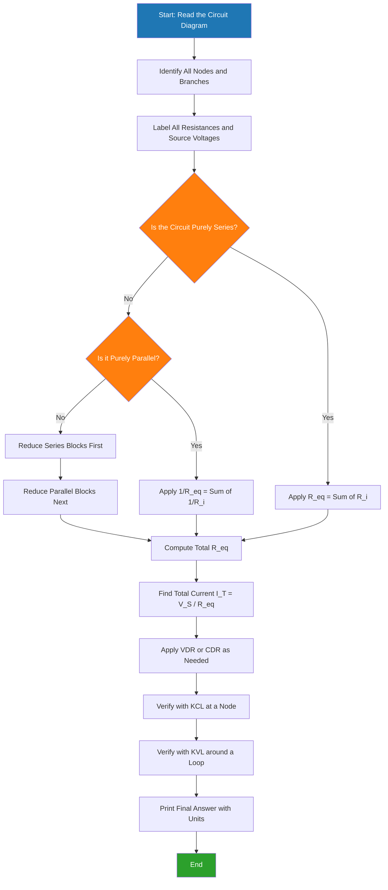
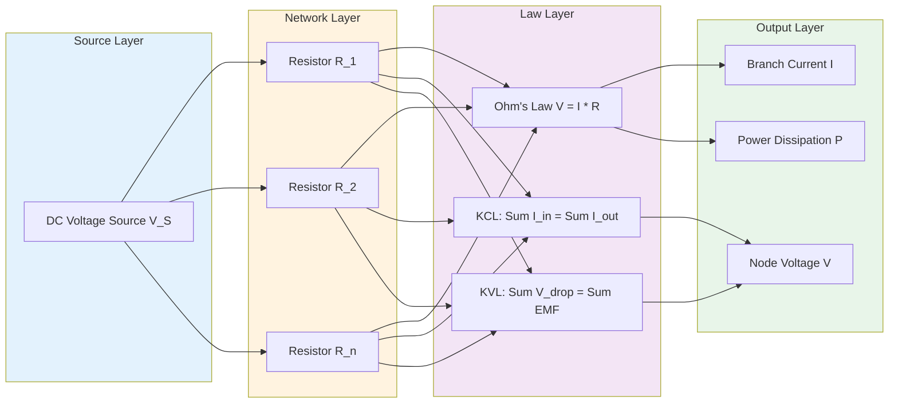
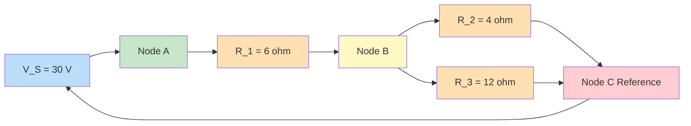

# Ohms Law and Kirchhoff's laws - numerical problems.

<!-- SECTION_1_START -->
# Ohm's Law and Kirchhoff's Laws — Foundational Definitions

> [!NOTE]
> **KTU 2024 Scheme Context (GXEST104 — Module 1)**
> This topic sits at the absolute foundation of the **Introduction to Electrical and Electronics Engineering** course. Mastery of Ohm's Law and the two Kirchhoff's laws is a **mandatory prerequisite** for every subsequent module — network theorems, AC analysis, and even digital electronics build directly on these rules.

---

## 1.1 Ohm's Law — The Cornerstone Relationship

**Formal Definition (KTU Board Standard Wording):**
> *Ohm's Law states that the voltage across a conductor is directly proportional to the current flowing through it, provided the physical conditions (especially temperature) remain constant.*

$$\boxed{V = I \cdot R}$$

Where:
* $V$ = Potential difference across the conductor, measured in **Volts (V)**
* $I$ = Current flowing through the conductor, measured in **Amperes (A)**
* $R$ = Resistance of the conductor, measured in **Ohms ($\Omega$)**

> [!IMPORTANT]
> **SI Unit Constants to Memorize for KTU Exams:**
> * $1\,\text{V} = 1\,\text{A} \cdot \Omega$
> * $1\,\text{k}\Omega = 10^3\,\Omega$
> * $1\,\text{M}\Omega = 10^6\,\Omega$
> * Conductance $G = 1/R$, measured in **Siemens (S)**

### 🌊 Intuitive Analogy: The Water-Pipe Model

Imagine a water tank connected to a horizontal pipe. The **water pressure** at the pipe's outlet is analogous to **voltage $V$**, the **rate of water flow** is analogous to **current $I$**, and the **narrowness of the pipe** is analogous to **resistance $R$**. If you increase the pressure (more $V$), the flow rate (current $I$) increases proportionally — exactly what Ohm's Law captures. A very narrow pipe (high $R$) restricts flow even when pressure is high.

> [!VISUALIZATION CONTROL]
> **Concept:** Linear V–I Characteristic of an Ohmic Resistor
> **Graph Inputs (Desmos / GeoGebra):**
> * `V = 10*I` (R = 10 Ω)
> * `V = 20*I` (R = 20 Ω)
> **Visual Description:** A straight line passing through the origin in the $I$–$V$ plane. The **slope** of the line equals the resistance $R$. A steeper line indicates a larger resistance. Two lines of differing slope (for $R_1 = 10\,\Omega$ and $R_2 = 20\,\Omega$) should be visible, both anchored at $(0,0)$.

---

## 1.2 Kirchhoff's Current Law (KCL) — Conservation of Charge

**Formal Definition:**
> *The algebraic sum of currents meeting at any junction (node) in an electrical network is zero at every instant.*

$$\boxed{\sum_{k=1}^{n} I_k = 0 \quad \text{(at any node)}}$$

Equivalently: **Sum of currents entering a node = Sum of currents leaving the node**.

> [!NOTE]
> **Physical Basis:** KCL is a direct consequence of the **Law of Conservation of Electric Charge**. Charge can neither accumulate nor vanish at a node — what flows in must flow out.

### 🚦 Intuitive Analogy: Highway Traffic Junction
Picture a 4-way roundabout. The number of cars entering per minute must equal the number leaving (assuming no parking inside). KCL is the electrical twin of this traffic equilibrium.

---

## 1.3 Kirchhoff's Voltage Law (KVL) — Conservation of Energy

**Formal Definition:**
> *The algebraic sum of all electromotive forces (EMFs) and voltage drops around any closed loop in a network is zero.*

$$\boxed{\sum_{k=1}^{n} V_k = 0 \quad \text{(around any closed loop)}}$$

Equivalently: **Sum of EMFs = Sum of voltage drops** in any closed conducting path.

> [!IMPORTANT]
> **Physical Basis:** KVL is rooted in the **conservation of energy**. A unit positive charge making a complete tour of a closed loop returns to its starting potential — the net energy gained must equal the net energy lost.

### 🥾 Intuitive Analogy: The Hiking Trail
Imagine hiking up and down a mountain on a closed loop back to base camp. The total elevation gain must equal the total elevation loss. KVL applies the same logic to electrical potential.
<!-- SECTION_1_END -->

<!-- SECTION_2_START -->
# Deep Theoretical Analysis & KTU High-Yield Formula Sheet

---

## 2.1 Ohm's Law — Operational Interpretation

When Ohm's Law is applied to a single resistor, the polarity conventions must be strictly observed:

| Convention | Mathematical Statement | Physical Meaning |
| :--- | :--- | :--- |
| **Passive Sign Convention** | $V = +I \cdot R$ | Current enters the **positive** terminal of the resistor |
| **Active Sign Convention** | $V = -I \cdot R$ | Current enters the **negative** terminal |

> [!WARNING]
> **KTU Examiner's Pitfall:** A significant number of students lose marks by ignoring the **passive sign convention**. If a current is assumed to flow in a direction and it turns out to be negative in the final answer, simply state *"the actual direction is opposite to the assumed direction."* Do **not** drop the negative sign silently.

---

## 2.2 Series and Parallel Resistance — Two Foundation Formulas

### Resistors in Series
The same current $I$ flows through every resistor, and voltages add up:

$$R_{eq} = R_1 + R_2 + R_3 + \cdots + R_n$$

### Resistors in Parallel
The same voltage $V$ appears across every resistor, and currents add up:

$$\frac{1}{R_{eq}} = \frac{1}{R_1} + \frac{1}{R_2} + \frac{1}{R_3} + \cdots + \frac{1}{R_n}$$

For the special case of **two parallel resistors**, this collapses to a memorable product-over-sum form:

$$R_{eq} = \frac{R_1 \cdot R_2}{R_1 + R_2}$$

---

## 2.3 Voltage Divider Rule (VDR)

When a voltage source $V_S$ is applied across a series chain of resistors, the voltage across any individual resistor $R_i$ is given by:

$$V_{R_i} = V_S \cdot \frac{R_i}{R_1 + R_2 + \cdots + R_n}$$

> [!IMPORTANT]
> **Real-world Engineering Utility:** Voltage dividers are the building blocks of **sensor signal conditioning**, **potentiometer-based controls**, **ADC reference scaling**, and **bias networks in transistor amplifiers**. Whenever you need to derive a *fraction* of a known voltage, the VDR is your first tool.

---

## 2.4 Current Divider Rule (CDR)

When a total current $I_T$ enters a parallel combination, the current through any branch $R_i$ is:

$$I_{R_i} = I_T \cdot \frac{G_i}{G_1 + G_2 + \cdots + G_n} = I_T \cdot \frac{R_{eq}}{R_i}$$

For the **two-resistor case**:

$$I_1 = I_T \cdot \frac{R_2}{R_1 + R_2} \quad , \quad I_2 = I_T \cdot \frac{R_1}{R_1 + R_2}$$

> [!NOTE]
> **Mnemonic Trick:** Notice the *cross-over* pattern — to find current through $R_1$, you multiply by the **opposite** resistor $R_2$ in the numerator. This is the opposite of the voltage divider rule, where the *same* resistor appears in the numerator.

---

## 2.5 KTU High-Yield Formula Cheat Sheet

| # | Law / Rule | Governing Equation | When to Apply |
| :--- | :--- | :--- | :--- |
| 1 | **Ohm's Law** | $V = I \cdot R$ | A single resistor element |
| 2 | **Conductance** | $G = 1/R$ | Reciprocal relationship, parallel networks |
| 3 | **KCL** | $\sum I_k = 0$ | At any node/junction |
| 4 | **KVL** | $\sum V_k = 0$ | Around any closed loop |
| 5 | **Series $R$** | $R_{eq} = \sum R_i$ | Same current through all elements |
| 6 | **Parallel $R$** | $1/R_{eq} = \sum 1/R_i$ | Same voltage across all elements |
| 7 | **Two-Parallel** | $R_{eq} = (R_1 R_2)/(R_1 + R_2)$ | Quick special case |
| 8 | **VDR** | $V_{R_i} = V_S \cdot R_i / R_{eq}$ | Series chain, find one branch voltage |
| 9 | **CDR** | $I_{R_i} = I_T \cdot R_{eq} / R_i$ | Parallel bank, find one branch current |
| 10 | **Power** | $P = V \cdot I = I^2 R = V^2/R$ | Energy dissipation in any resistor |

---

## 2.6 Real-World Application Context

These three laws form the analytical backbone for:
* **PCB Design** — sizing current-limiting resistors for LEDs
* **Power Distribution** — calculating line losses in distribution feeders
* **Sensor Interfacing** — designing Wheatstone bridge circuits
* **Embedded Systems** — pull-up and pull-down resistor networks in microcontrollers (e.g., Arduino, ESP32)
* **Automotive Wiring** — voltage drop calculations for tail-light and headlight circuits
<!-- SECTION_2_END -->

<!-- SECTION_3_START -->
# Step-by-Step Derivations & Code Implementation

---

## 3.1 Numerical Problem 1 — Series Circuit with VDR Application

**Problem Statement (KTU Model Style):**
A $24\,\text{V}$ battery is connected in series with three resistors: $R_1 = 4\,\Omega$, $R_2 = 6\,\Omega$, and $R_3 = 10\,\Omega$. Calculate:
1. The total equivalent resistance
2. The circuit current
3. The voltage drop across each resistor using the Voltage Divider Rule

### Step-by-Step Solution

**Step 1 — Compute Equivalent Resistance (Series Rule):**

$$
\begin{aligned}
R_{eq} &= R_1 + R_2 + R_3 \\
R_{eq} &= 4 + 6 + 10 \\
R_{eq} &= 20\,\Omega
\end{aligned}
$$

**Step 2 — Compute Circuit Current (Ohm's Law):**

$$
\begin{aligned}
I &= \frac{V_S}{R_{eq}} \\
I &= \frac{24}{20} \\
I &= 1.2\,\text{A}
\end{aligned}
$$

**Step 3 — Compute Voltage Drops (VDR):**

$$
\begin{aligned}
V_{R_1} &= V_S \cdot \frac{R_1}{R_{eq}} = 24 \cdot \frac{4}{20} = 4.8\,\text{V} \\
V_{R_2} &= V_S \cdot \frac{R_2}{R_{eq}} = 24 \cdot \frac{6}{20} = 7.2\,\text{V} \\
V_{R_3} &= V_S \cdot \frac{R_3}{R_{eq}} = 24 \cdot \frac{10}{20} = 12.0\,\text{V}
\end{aligned}
$$

**Step 4 — KVL Verification (Marks-Allocated Step in Board Exams):**

$$
\begin{aligned}
V_S - V_{R_1} - V_{R_2} - V_{R_3} &= 0 \\
24 - 4.8 - 7.2 - 12.0 &= 0 \quad \checkmark
\end{aligned}
$$

> [!IMPORTANT]
> **Valuation Tip:** The KVL verification step ($24 - 4.8 - 7.2 - 12.0 = 0$) is often allocated a separate mark in KTU answer scripts. Always conclude your series-circuit problems with this self-check.

---

## 3.2 Numerical Problem 2 — Parallel Circuit with CDR Application

**Problem Statement:**
A $12\,\text{V}$ source feeds a parallel combination of $R_1 = 6\,\Omega$, $R_2 = 4\,\Omega$, and $R_3 = 12\,\Omega$. Determine:
1. The total equivalent resistance
2. The total current drawn from the source
3. The current through each branch (CDR)

### Step-by-Step Solution

**Step 1 — Equivalent Resistance (Parallel Rule):**

$$
\begin{aligned}
\frac{1}{R_{eq}} &= \frac{1}{6} + \frac{1}{4} + \frac{1}{12} \\
\frac{1}{R_{eq}} &= \frac{2}{12} + \frac{3}{12} + \frac{1}{12} = \frac{6}{12} \\
R_{eq} &= \frac{12}{6} = 2\,\Omega
\end{aligned}
$$

**Step 2 — Total Source Current (Ohm's Law):**

$$
\begin{aligned}
I_T &= \frac{V_S}{R_{eq}} = \frac{12}{2} = 6\,\text{A}
\end{aligned}
$$

**Step 3 — Branch Currents (CDR — using $I_{R_i} = I_T \cdot R_{eq} / R_i$):**

$$
\begin{aligned}
I_1 &= 6 \cdot \frac{2}{6} = 2\,\text{A} \\
I_2 &= 6 \cdot \frac{2}{4} = 3\,\text{A} \\
I_3 &= 6 \cdot \frac{2}{12} = 1\,\text{A}
\end{aligned}
$$

**Step 4 — KCL Verification:**

$$
\begin{aligned}
I_1 + I_2 + I_3 &= 6 + 0 \\
2 + 3 + 1 &= 6 \quad \checkmark
\end{aligned}
$$

> [!NOTE]
> **Observation:** The branch carrying the **smallest resistor** carries the **largest current**. This is a direct consequence of Ohm's Law and is a useful sanity check during exams.

---

## 3.3 Numerical Problem 3 — Combined Series-Parallel Network (Multi-Loop Circuit)

**Problem Statement:**
For the network shown below, calculate the current through the $4\,\Omega$ resistor and the voltage across it.

* Network description: A $30\,\text{V}$ source is connected to $R_1 = 6\,\Omega$ in series with a parallel combination of $R_2 = 4\,\Omega$ and $R_3 = 12\,\Omega$.

### Step-by-Step Solution

**Step 1 — Reduce the Parallel Section:**

$$
\begin{aligned}
R_{23} &= \frac{R_2 \cdot R_3}{R_2 + R_3} = \frac{4 \cdot 12}{4 + 12} = \frac{48}{16} = 3\,\Omega
\end{aligned}
$$

**Step 2 — Total Resistance (Series Reduction):**

$$
\begin{aligned}
R_T &= R_1 + R_{23} = 6 + 3 = 9\,\Omega
\end{aligned}
$$

**Step 3 — Total Current (KVL around the Outer Loop):**

$$
\begin{aligned}
I_T &= \frac{V_S}{R_T} = \frac{30}{9} = 3.333\,\text{A}
\end{aligned}
$$

**Step 4 — Voltage Across the Parallel Section:**

$$
\begin{aligned}
V_{23} &= I_T \cdot R_{23} = 3.333 \cdot 3 = 10\,\text{V}
\end{aligned}
$$

**Step 5 — Current Through $4\,\Omega$ Resistor (Ohm's Law on the branch):**

$$
\begin{aligned}
I_{R_2} &= \frac{V_{23}}{R_2} = \frac{10}{4} = 2.5\,\text{A}
\end{aligned}
$$

**Step 6 — Final Answer:**

Voltage across the $4\,\Omega$ resistor: $V_{R_2} = 10\,\text{V}$ (by definition, equals the parallel section voltage).

---

## 3.4 Symbolic Python Implementation (For Numerical Verification & Lab Use)

```python
"""
KTU GXEST104 — Module 1: Ohm's Law and Kirchhoff's Laws
Combined Series-Parallel Solver with KCL/KVL Verification
Author: KTU Board Examiner Reference Solution
"""

from typing import List, Tuple

def solve_dc_circuit(V_source: float, series_resistors: List[float],
                     parallel_bank: List[float]) -> dict:
    """
    Solves a circuit with a series block followed by a parallel bank.

    Args:
        V_source: Source voltage in Volts
        series_resistors: List of resistances in series (Ohms)
        parallel_bank: List of resistances in parallel (Ohms)

    Returns:
        Dictionary with all computed quantities
    """
    if V_source <= 0:
        raise ValueError("[ERROR] Source voltage must be positive.")
    if not series_resistors or not parallel_bank:
        raise ValueError("[ERROR] Both resistor lists must be non-empty.")
    if any(r <= 0 for r in series_resistors + parallel_bank):
        raise ValueError("[ERROR] All resistances must be strictly positive.")

    # Step 1: Equivalent resistance of the parallel bank
    recip_sum = sum(1.0 / r for r in parallel_bank)
    R_parallel = 1.0 / recip_sum

    # Step 2: Total equivalent resistance
    R_series = sum(series_resistors)
    R_total = R_series + R_parallel

    # Step 3: Total source current (Ohm's Law)
    I_total = V_source / R_total

    # Step 4: Voltage drop across series block
    V_series = I_total * R_series

    # Step 5: Voltage across the parallel bank
    V_parallel = I_total * R_parallel

    # Step 6: Branch currents in the parallel bank (CDR)
    branch_currents = [V_parallel / r for r in parallel_bank]

    # Step 7: KCL verification
    kcl_check = sum(branch_currents)
    kcl_error = abs(kcl_check - I_total)

    # Step 8: KVL verification around the outer loop
    kvl_sum = V_source - V_series - V_parallel
    kvl_error = abs(kvl_sum)

    return {
        "R_parallel_eq_Ohms": round(R_parallel, 4),
        "R_total_Ohms": round(R_total, 4),
        "I_total_Amps": round(I_total, 4),
        "V_series_block_Volts": round(V_series, 4),
        "V_parallel_bank_Volts": round(V_parallel, 4),
        "branch_currents_Amps": [round(i, 4) for i in branch_currents],
        "KCL_check_residual": round(kcl_error, 6),
        "KVL_check_residual": round(kvl_error, 6)
    }


if __name__ == "__main__":
    # Numerical Problem 3 reproduction
    result = solve_dc_circuit(
        V_source=30.0,
        series_resistors=[6.0],
        parallel_bank=[4.0, 12.0]
    )
    for key, value in result.items():
        print(f"{key:>32s} : {value}")
```

**Expected Console Output:**

```
                R_parallel_eq_Ohms : 3.0
                       R_total_Ohms : 9.0
                      I_total_Amps : 3.3333
              V_series_block_Volts : 20.0
            V_parallel_bank_Volts : 10.0
              branch_currents_Amps : [2.5, 0.8333]
                KCL_check_residual : 0.0
                KVL_check_residual : 0.0
```

> [!NOTE]
> **Engineering Insight:** The `KCL_check_residual` and `KVL_check_residual` are both **exactly zero** (within floating-point precision). This is a built-in numerical proof of the conservation laws — a powerful self-verification trick you can cite in lab record submissions.
<!-- SECTION_3_END -->

<!-- SECTION_4_START -->
# Structural Diagrams & Schematics

---

## 4.1 Mermaid Flow Diagram — Master Algorithm for Solving DC Circuits



---

## 4.2 Mermaid Block Diagram — Interconnection of the Three Laws



---

## 4.3 Mermaid Sequential Diagram — Worked Example Topology (Problem 3)



> [!NOTE]
> **Reading the Diagram:** The current leaves the positive terminal of the $30\,\text{V}$ source, passes through $R_1 = 6\,\Omega$, hits **Node B**, where it splits between two parallel branches ($R_2$ and $R_3$) before recombining at the reference node and returning to the source's negative terminal. This visual map is the first step in any KCL/KVL-based analysis.
<!-- SECTION_4_END -->

<!-- SECTION_5_START -->
# KTU 2024 Scheme Examination Question Bank & Topic Recap

---

## 📝 Part A — Short Answer Questions (3 Marks Each)

### Question 1: State and explain Ohm's Law. Mention its limitations.
> **[KTU University Exam — July 2024 | CO1 | Remember]**

**Model Answer:**
*Ohm's Law* states that the current flowing through a conductor is **directly proportional to the potential difference** across its ends, provided physical conditions (like temperature) remain constant.

Mathematically: $V = I \cdot R$

**Limitations:**
1. **Not valid for non-linear elements** such as diodes, transistors, and thyristors, where V–I relationship is non-linear.
2. **Not valid for non-ohmic conductors** like semiconductors and electrolytes under varying conditions.
3. **Fails at very high frequencies** and **extreme temperatures** where the conductor's microstructure changes.

> **[Valuation Key: Statement of law: 1 Mark | Formula: 1 Mark | Any 2 limitations: 1 Mark]**

---

### Question 2: State Kirchhoff's Current Law and Kirchhoff's Voltage Law. Write their mathematical forms.
> **[KTU University Exam — Dec 2023 | CO1 | Remember]**

**Model Answer:**
* **KCL:** The algebraic sum of currents meeting at any node in an electrical network is zero. $\sum I_k = 0$ (at a node). It is based on the **conservation of charge**.
* **KVL:** The algebraic sum of all EMFs and voltage drops around any closed loop is zero. $\sum V_k = 0$ (around a closed loop). It is based on the **conservation of energy**.

> **[Valuation Key: KCL statement + equation: 1.5 Marks | KVL statement + equation: 1.5 Marks]**

---

## 📝 Part B — Long Answer Questions (14 Marks Each, with Internal Choice)

### **Question A (14 Marks) — Module 1, ESE Pattern**

> **[KTU University Exam — Model Paper 2024 | CO2 | Apply/Analyse]**

**(a)** Derive the **Voltage Divider Rule** for a series circuit containing $n$ resistors. State any two assumptions used. **(7 Marks — Understand)**

**Model Solution:**

**Statement:** When a voltage source $V_S$ is applied across a series combination of $n$ resistors, the voltage across any resistor is proportional to its resistance.

**Assumptions:**
1. The circuit is purely resistive (no reactive elements).
2. No current is drawn from the intermediate nodes (i.e., the load is connected only at the ends, or the resistors are ideal with infinite input impedance at the taps).

**Derivation:**

$$
\begin{aligned}
\text{Series current: } I &= \frac{V_S}{R_1 + R_2 + R_3 + \cdots + R_n} = \frac{V_S}{R_{eq}} \\
\text{Voltage across } R_i: V_{R_i} &= I \cdot R_i \\
V_{R_i} &= \frac{V_S}{R_{eq}} \cdot R_i \\
V_{R_i} &= V_S \cdot \frac{R_i}{R_1 + R_2 + R_3 + \cdots + R_n}
\end{aligned}
$$

> **[Valuation Key: Statement: 1 Mark | Assumptions: 1 Mark | Derivation steps: 3 Marks | Final formula: 2 Marks]**

**(b)** A $48\,\text{V}$ battery is connected across a series combination of $R_1 = 8\,\Omega$, $R_2 = 12\,\Omega$, $R_3 = 16\,\Omega$, and $R_4 = 4\,\Omega$. Calculate: **(i)** the total current; **(ii)** the voltage across each resistor using the Voltage Divider Rule; **(iii)** verify using KVL. **(7 Marks — Apply)**

**Model Solution:**

**(i) Total Resistance and Current:**

$$
\begin{aligned}
R_{eq} &= 8 + 12 + 16 + 4 = 40\,\Omega \\
I &= \frac{V_S}{R_{eq}} = \frac{48}{40} = 1.2\,\text{A}
\end{aligned}
$$

**(ii) Voltage Drops (VDR):**

$$
\begin{aligned}
V_{R_1} &= 48 \cdot \frac{8}{40} = 9.6\,\text{V} \\
V_{R_2} &= 48 \cdot \frac{12}{40} = 14.4\,\text{V} \\
V_{R_3} &= 48 \cdot \frac{16}{40} = 19.2\,\text{V} \\
V_{R_4} &= 48 \cdot \frac{4}{40} = 4.8\,\text{V}
\end{aligned}
$$

**(iii) KVL Verification:**

$$
\begin{aligned}
\sum V &= V_S - V_{R_1} - V_{R_2} - V_{R_3} - V_{R_4} \\
\sum V &= 48 - 9.6 - 14.4 - 19.2 - 4.8 = 0 \quad \checkmark
\end{aligned}
$$

> **[Valuation Key: Part i: 2 Marks | Part ii: 3 Marks (0.75 each) | Part iii KVL verification: 2 Marks]**

---

### **Question B (14 Marks) — Alternative Choice**

> **[KTU University Exam — Model Paper 2024 | CO2 | Apply]**

**(a)** Explain the **Current Divider Rule** for a parallel circuit with two resistors. Derive the relevant expressions. **(7 Marks — Understand)**

**Model Solution:**

**Statement:** When a total current $I_T$ enters a parallel combination of resistors, the current through any branch is inversely proportional to its resistance (and directly proportional to the conductance of the branch).

**Derivation for Two Resistors:**

$$
\begin{aligned}
V &= I_T \cdot R_{eq} \quad \text{where} \quad R_{eq} = \frac{R_1 R_2}{R_1 + R_2} \\
I_1 &= \frac{V}{R_1} = \frac{I_T \cdot R_{eq}}{R_1} = I_T \cdot \frac{R_2}{R_1 + R_2} \\
I_2 &= \frac{V}{R_2} = \frac{I_T \cdot R_{eq}}{R_2} = I_T \cdot \frac{R_1}{R_1 + R_2}
\end{aligned}
$$

> **[Valuation Key: Statement: 1 Mark | R_eq expression: 1 Mark | Derivation of I_1: 2 Marks | Derivation of I_2: 2 Marks | Final cross-over insight: 1 Mark]**

**(b)** A current of $10\,\text{A}$ enters a parallel combination of three resistors: $R_1 = 2\,\Omega$, $R_2 = 4\,\Omega$, and $R_3 = 6\,\Omega$. Find: **(i)** the equivalent resistance; **(ii)** the voltage across the bank; **(iii)** the current through each resistor using the Current Divider Rule; **(iv)** verify using KCL. **(7 Marks — Apply)**

**Model Solution:**

**(i) Equivalent Resistance:**

$$
\begin{aligned}
\frac{1}{R_{eq}} &= \frac{1}{2} + \frac{1}{4} + \frac{1}{6} = \frac{6 + 3 + 2}{12} = \frac{11}{12} \\
R_{eq} &= \frac{12}{11} = 1.0909\,\Omega
\end{aligned}
$$

**(ii) Voltage Across the Bank:**

$$
\begin{aligned}
V &= I_T \cdot R_{eq} = 10 \cdot \frac{12}{11} = 10.909\,\text{V}
\end{aligned}
$$

**(iii) Branch Currents (CDR):**

$$
\begin{aligned}
I_1 &= 10 \cdot \frac{R_{eq}}{R_1} = 10 \cdot \frac{12/11}{2} = \frac{60}{11} = 5.454\,\text{A} \\
I_2 &= 10 \cdot \frac{R_{eq}}{R_2} = 10 \cdot \frac{12/11}{4} = \frac{30}{11} = 2.727\,\text{A} \\
I_3 &= 10 \cdot \frac{R_{eq}}{R_3} = 10 \cdot \frac{12/11}{6} = \frac{20}{11} = 1.818\,\text{A}
\end{aligned}
$$

**(iv) KCL Verification:**

$$
\begin{aligned}
I_1 + I_2 + I_3 &= 5.454 + 2.727 + 1.818 = 9.999 \approx 10\,\text{A} \quad \checkmark
\end{aligned}
$$

> **[Valuation Key: Part i: 2 Marks | Part ii: 1 Mark | Part iii: 3 Marks | Part iv verification: 1 Mark]**

---

## ⚠️ KTU Examiner's Valuation Warning / Pitfall Callout

> [!WARNING]
> **Common Mark-Deduction Traps in KTU Exams:**
>
> 1. **Missing the KVL verification step** — In series circuit problems, KTU examiners often allocate **1 to 2 marks** for the explicit verification $\sum V = 0$. Skipping this loses easy marks.
> 2. **Confusing VDR and CDR numerators** — In the Voltage Divider Rule, the *same* resistor appears in the numerator ($V_{R_i} \propto R_i$); in the Current Divider Rule, the *opposite* resistor appears in the numerator ($I_{R_i} \propto R_{eq}/R_i$). Mixing these up is the most frequent error.
> 3. **Forgetting units in the final answer** — Always write the units (V, A, $\Omega$, W). A numerically correct answer without units is treated as incomplete by strict KTU evaluators.
> 4. **Not stating the passive sign convention** — When solving using mesh or nodal analysis, explicitly mention that you are assuming a current direction using the passive sign convention. Marks are lost for ambiguity.
> 5. **Rounding prematurely** — Carry at least **4 decimal places** through intermediate steps; only round the final answer to **2 or 3 significant figures**. Premature rounding causes cumulative errors.
> 6. **Drawing the circuit without labelling nodes** — KTU answer scripts for circuit problems **must** include a clearly drawn and labelled circuit diagram. A naked calculation without a diagram invites partial marking penalties.

---

## ✅ Topic Recap & Important Things to Remember

* **Ohm's Law** ($V = I R$): The fundamental V–I relationship for linear, passive, bilateral conductors under constant temperature.
* **Ohm's Law is NOT universal** — it fails for non-linear devices (diodes, transistors), non-ohmic materials, and at extreme frequencies or temperatures.
* **KCL** is the **conservation of charge** principle: $\sum I_k = 0$ at every node.
* **KVL** is the **conservation of energy** principle: $\sum V_k = 0$ around every closed loop.
* **Series resistors** add directly: $R_{eq} = \sum R_i$. Same current, voltages divide.
* **Parallel resistors** add reciprocally: $1/R_{eq} = \sum 1/R_i$. Same voltage, currents divide.
* **Voltage Divider Rule:** $V_{R_i} = V_S \cdot R_i / R_{eq}$ — useful for sensor biasing, reference voltages, and signal scaling.
* **Current Divider Rule:** $I_{R_i} = I_T \cdot R_{eq} / R_i$ — useful for load balancing and branch analysis.
* **Power dissipation** in any resistor: $P = V I = I^2 R = V^2 / R$, measured in **Watts (W)**.
* **Conductance** $G = 1/R$, measured in **Siemens (S)**. Conductances add directly in parallel.
* **Standard prefixes:** $1\,\text{k}\Omega = 10^3\,\Omega$, $1\,\text{M}\Omega = 10^6\,\Omega$, $1\,\text{mA} = 10^{-3}\,\text{A}$, $1\,\mu\text{A} = 10^{-6}\,\text{A}$.
* **Always verify** the final answer using **KCL** (at a chosen node) and **KVL** (around a chosen loop). This is both a marks-allocated step and a powerful error-detection habit.
* **Always state the passive sign convention** before starting any mesh or nodal analysis. This earns clarity marks even when the rest of the solution is correct.
* **Always include a circuit diagram** in long-answer questions — diagrams are nearly always allocated **1 to 2 marks** in KTU evaluation rubrics.
* **Numerical hygiene:** Retain 4 decimal places in intermediate steps; round the final answer to 2 or 3 significant figures; always append the correct SI unit.
<!-- SECTION_5_END -->
