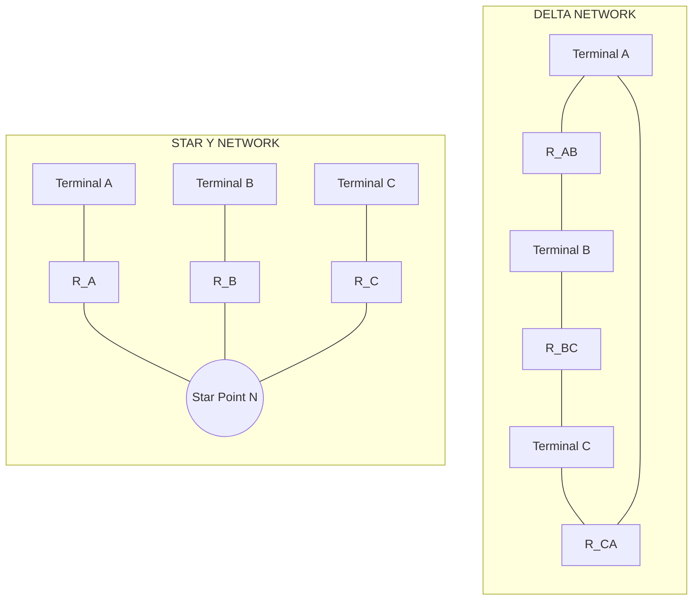
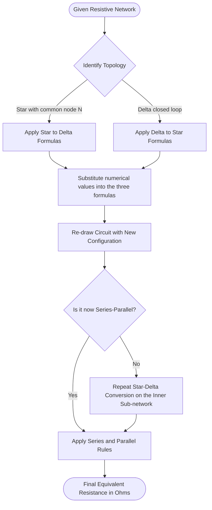

# Star-delta conversion (resistive networks only - derivation not required) - numerical problems.

<!-- SECTION_1_START -->
# Star-Delta Conversion (Y-Δ Transformation) — Resistive Networks

## 1. Core Technical Definition

> [!IMPORTANT]
> **KTU 2024 Syllabus Statement (Module 1 — GXEST104):** *"Star-delta conversion (resistive networks only — derivation not required) — numerical problems."*
> The emphasis is therefore on **identifying the topology**, **selecting the correct formula pair**, and **computing the equivalent resistance numerically**.

A resistive network is said to be in the **Star (Y) configuration** when three resistors $R_A$, $R_B$, $R_C$ share a **single common node** (called the *star point* or *neutral point* $N$), and the three free ends are brought out as the external terminals $A$, $B$, and $C$.

A resistive network is said to be in the **Delta ($\Delta$) configuration** when three resistors $R_{AB}$, $R_{BC}$, $R_{CA}$ are connected **end-to-end in a closed loop**, forming a triangle between the same three external terminals $A$, $B$, and $C$.

> [!NOTE]
> **Core Definition (KTU Board Standard):** Two three-terminal resistive networks are said to be *equivalent* at the terminals $A$, $B$, $C$ if the resistance measured between **every pair** of terminals is identical in both networks.

### Conceptual Analogy — Plain English Intuition

Imagine three villages $A$, $B$, $C$ that need to trade electricity with each other.

- **Star (Y) network:** All three villages are connected *only* to a **central sub-station** $N$. No village is directly connected to another. Power must pass *through* the central node to go from $A$ to $B$.
- **Delta ($\Delta$) network:** All three villages are connected *directly* to each other with a **mesh of three roads**, forming a triangle. Power can flow between any two terminals *without* going through a common hub.

> [!TIP]
> The **equivalent network theorem** states that for *any* given set of terminal voltages and currents, the external behaviour of a star and a delta network is identical — provided the resistor values satisfy the conversion formulas. The student is **not required to derive** these formulas; only to **apply** them.

> [!VISUALIZATION CONTROL]
> **Concept:** Topological equivalence between Star and Delta.
> **Reference:** Draw two triangles side-by-side — the left triangle with a small circle at the centroid labelled $N$ (star), the right triangle with the centroid empty but straight lines along the edges labelled $R_{AB}, R_{BC}, R_{CA}$ (delta).
> **Visual Description:** Notice that both networks have **exactly the same three external terminals** ($A$ top, $B$ bottom-left, $C$ bottom-right). The only thing that changes is the *internal wiring* between them. The equivalent resistance between any two terminals must be the same in both networks.

---

<!-- SECTION_2_START -->
## 2. Deep Theoretical Analysis & KTU High-Yield Formula Sheet

### 2.1 When is Conversion Required?

A network must be converted when:

1. The circuit is **not a simple series-parallel combination** in its present form.
2. The circuit contains a **bridge (Wheatstone-type) structure** with a *non-infinite* or *non-zero* detector branch.
3. The problem asks for the **equivalent resistance** between two specific terminals, and the topology is a delta or star that blocks direct series-parallel simplification.

### 2.2 Rules for Identifying a Star or Delta

| Feature | Star (Y) | Delta ($\Delta$) |
|---|---|---|
| Number of resistors | 3 | 3 |
| Common node | **Yes** (the star point $N$) | **No** |
| Mesh / closed loop | **No** | **Yes** (one loop) |
| Terminals | 3 (one end of each resistor) | 3 (one vertex of triangle) |
| Internal node | Yes ($N$) | None |
| Visual cue | Looks like the letter **Y** | Looks like the Greek letter **$\Delta$** |

### 2.3 KTU High-Yield Formula Sheet (Conversion Equations)

> [!IMPORTANT]
> **For the KTU board exam, memorise the following two formula sets. No derivation is required; marks are awarded for correct substitution and arithmetic.**

| Conversion Direction | Formula | Mnemonic |
|---|---|---|
| **Delta $\rightarrow$ Star** | $R_A = \dfrac{R_{AB} \cdot R_{CA}}{R_{AB} + R_{BC} + R_{CA}}$ | *Product of the two resistors meeting at terminal $A$, divided by the sum of all three deltas.* |
| **Delta $\rightarrow$ Star** | $R_B = \dfrac{R_{AB} \cdot R_{BC}}{R_{AB} + R_{BC} + R_{CA}}$ | *Product at $B$ over sum.* |
| **Delta $\rightarrow$ Star** | $R_C = \dfrac{R_{BC} \cdot R_{CA}}{R_{AB} + R_{BC} + R_{DA}}$ | *Product at $C$ over sum.* |
| **Star $\rightarrow$ Delta** | $R_{AB} = \dfrac{R_A R_B + R_B R_C + R_C R_A}{R_C}$ | *Sum of pairwise products over the **opposite** star resistor.* |
| **Star $\rightarrow$ Delta** | $R_{BC} = \dfrac{R_A R_B + R_B R_C + R_C R_A}{R_A}$ | *Sum of pairwise products over the **opposite** star resistor.* |
| **Star $\rightarrow$ Delta** | $R_{CA} = \dfrac{R_A R_B + R_B R_C + R_C R_A}{R_B}$ | *Sum of pairwise products over the **opposite** star resistor.* |

### 2.4 Balanced Network Shortcut (Frequently Asked)

> [!TIP]
> **If all three resistors in a star (or delta) are equal**, the conversion is a simple multiple of **3**.

| Configuration | Resistor Value | Converted Value |
|---|---|---|
| Balanced Star $\rightarrow$ Delta | $R_Y$ | $R_\Delta = 3 \cdot R_Y$ |
| Balanced Delta $\rightarrow$ Star | $R_\Delta$ | $R_Y = R_\Delta / 3$ |

### 2.5 Real-World Engineering Utility

- **Three-phase power systems:** Alternators and transformers are wound in star or delta depending on whether a neutral wire is required. The conversion formulas are essential for *per-phase equivalent circuit analysis* of unbalanced loads.
- **Resistor networks on PCBs:** Complex bias and feedback networks in op-amp circuits often reduce to a star/delta structure.
- **Bridge circuits:** Wheatstone bridges, Kelvin double bridges, and Schering bridges all require star-delta conversion to find the balancing condition or detector current.

> [!NOTE]
> **For a balanced Wheatstone bridge** (i.e. $\dfrac{P}{Q} = \dfrac{R}{S}$), the bridge resistor (galvanometer arm) carries **no current** and can be removed entirely. The conversion is then unnecessary. The conversion is essential only when the bridge is **unbalanced**.

---

<!-- SECTION_3_START -->
## 3. Step-by-Step Numerical Solutions

> [!IMPORTANT]
> **KTU Board Convention:** Always (i) draw the circuit and label the terminals, (ii) state which formula is being used, (iii) show the numerical substitution, and (iv) box the final answer with the correct unit ($\Omega$).

---

### 📘 Solved Problem 1 — Delta to Star (Foundational, 5-Mark Pattern)

**Q:** A delta-connected resistive network has $R_{AB} = 6\,\Omega$, $R_{BC} = 4\,\Omega$, $R_{CA} = 3\,\Omega$. Find the equivalent star-connected network.

**Solution:**

**Step 1 — Identify topology and required conversion.**
We are given a delta and asked to find the equivalent star. We use the three Delta $\rightarrow$ Star formulas.

**Step 2 — Compute the common denominator (sum of all three delta resistors).**
$$R_{AB} + R_{BC} + R_{CA} = 6 + 4 + 3 = 13\,\Omega$$

**Step 3 — Compute $R_A$ (the star resistor connected to terminal $A$).**
$R_A$ is the product of the two delta resistors that meet at terminal $A$, divided by the sum.
$$R_A = \frac{R_{AB} \cdot R_{CA}}{R_{AB} + R_{BC} + R_{CA}} = \frac{6 \times 3}{13} = \frac{18}{13}\,\Omega$$

**Step 4 — Compute $R_B$.**
$$R_B = \frac{R_{AB} \cdot R_{BC}}{13} = \frac{6 \times 4}{13} = \frac{24}{13}\,\Omega$$

**Step 5 — Compute $R_C$.**
$$R_C = \frac{R_{BC} \cdot R_{CA}}{13} = \frac{4 \times 3}{13} = \frac{12}{13}\,\Omega$$

> [!TIP]
> **Sanity check:** $R_A + R_B + R_C = \frac{18+24+12}{13} = \frac{54}{13} \approx 4.15\,\Omega$, which is the resistance measured between the star point $N$ and a common shorted node — this is *not* a standard quantity, but the arithmetic must always be consistent.

**Final Answer:**
$$\boxed{R_A = \tfrac{18}{13}\,\Omega \;\approx\; 1.385\,\Omega,\quad R_B = \tfrac{24}{13}\,\Omega \;\approx\; 1.846\,\Omega,\quad R_C = \tfrac{12}{13}\,\Omega \;\approx\; 0.923\,\Omega}$$

---

### 📘 Solved Problem 2 — Star to Delta (Foundational, 5-Mark Pattern)

**Q:** A star-connected network has $R_A = 10\,\Omega$, $R_B = 20\,\Omega$, $R_C = 30\,\Omega$. Find the equivalent delta network.

**Solution:**

**Step 1 — Compute the numerator (sum of pairwise products).**
Let $S = R_A R_B + R_B R_C + R_C R_A$.
$$S = (10 \times 20) + (20 \times 30) + (30 \times 10) = 200 + 600 + 300 = 1100\,\Omega^2$$

**Step 2 — Compute $R_{AB}$ (opposite to $R_C$).**
$$R_{AB} = \frac{S}{R_C} = \frac{1100}{30} = \frac{110}{3}\,\Omega \;\approx\; 36.67\,\Omega$$

**Step 3 — Compute $R_{BC}$ (opposite to $R_A$).**
$$R_{BC} = \frac{S}{R_A} = \frac{1100}{10} = 110\,\Omega$$

**Step 4 — Compute $R_{CA}$ (opposite to $R_B$).**
$$R_{CA} = \frac{S}{R_B} = \frac{1100}{20} = 55\,\Omega$$

**Final Answer:**
$$\boxed{R_{AB} = \tfrac{110}{3}\,\Omega,\quad R_{BC} = 110\,\Omega,\quad R_{CA} = 55\,\Omega}$$

---

### 📘 Solved Problem 3 — Balanced Star to Delta (Quick Pattern)

**Q:** Convert a balanced star network with each arm of $12\,\Omega$ into an equivalent delta network.

**Solution:**

For a balanced star, the shortcut is:
$$R_\Delta = 3 \cdot R_Y = 3 \times 12 = 36\,\Omega$$

**Final Answer:** $\boxed{R_{AB} = R_{BC} = R_{CA} = 36\,\Omega}$

> [!NOTE]
> Verification using the standard formula: $S = 12 \times 12 + 12 \times 12 + 12 \times 12 = 432$. Then $R_{AB} = 432 / 12 = 36\,\Omega$ ✓.

---

### 📘 Solved Problem 4 — Equivalent Resistance of a Bridge Network (Classic KTU 14-Mark Pattern)

**Q:** Find the equivalent resistance between terminals $A$ and $B$ for the bridge network shown, where $P = 10\,\Omega$, $Q = 20\,\Omega$, $R = 30\,\Omega$, $S = 40\,\Omega$, and the bridge (galvanometer) arm $G = 50\,\Omega$ is connected between nodes $C$ and $D$.

**Solution:**

> [!IMPORTANT]
> This is a **Wheatstone bridge** that is **unbalanced**, because $\dfrac{P}{Q} = \dfrac{10}{20} = 0.5$ and $\dfrac{R}{S} = \dfrac{30}{40} = 0.75$. The two ratios are *not* equal, so current flows through $G$, and **we cannot simply remove the bridge arm**. We must perform a delta-star or star-delta conversion.

**Strategy:** Identify a delta or star inside the bridge. The resistors $P$, $R$, and $G$ form a **delta** between nodes $A$, $D$, and $C$ (if we re-label carefully). Equivalently, the resistors $Q$, $S$, and $G$ form a **delta** between $B$, $D$, and $C$. We will convert the delta $P, R, G$ into a star to reduce the bridge to a series-parallel network.

**Step 1 — Label the bridge clearly.**

Let us define the following nodes:
- Terminal $A$ is at the top-left.
- Terminal $B$ is at the top-right.
- Node $C$ is at the bottom (bridge arm end on the $P, Q$ side).
- Node $D$ is at the bottom (bridge arm end on the $R, S$ side).

Resistor placement:
- $P = 10\,\Omega$ between $A$ and $C$.
- $Q = 20\,\Omega$ between $B$ and $C$.
- $R = 30\,\Omega$ between $A$ and $D$.
- $S = 40\,\Omega$ between $B$ and $D$.
- $G = 50\,\Omega$ between $C$ and $D$.

**Step 2 — Identify the delta to be converted.**

The resistors $P$ (between $A$ and $C$), $R$ (between $A$ and $D$), and $G$ (between $C$ and $D$) form a **delta** $\Delta(ACD)$. Converting this delta to a star will give a new star point $N$ with three arms $R_A$, $R_C$, $R_D$ connected to terminals $A$, $C$, $D$ respectively.

**Step 3 — Apply the delta-to-star formulas to $\Delta(ACD)$.**

The sum:
$$\Sigma = P + R + G = 10 + 30 + 50 = 90\,\Omega$$

The three new star resistors:
$$R_A = \frac{P \cdot R}{\Sigma} = \frac{10 \times 30}{90} = \frac{300}{90} = \frac{10}{3}\,\Omega \;\approx\; 3.333\,\Omega$$

$$R_C = \frac{P \cdot G}{\Sigma} = \frac{10 \times 50}{90} = \frac{500}{90} = \frac{50}{9}\,\Omega \;\approx\; 5.556\,\Omega$$

$$R_D = \frac{R \cdot G}{\Sigma} = \frac{30 \times 50}{90} = \frac{1500}{90} = \frac{50}{3}\,\Omega \;\approx\; 16.667\,\Omega$$

**Step 4 — Re-draw the simplified network.**

After conversion, the network is:

- $R_A = 10/3\,\Omega$ in series from terminal $A$ to the new star point $N$.
- From $N$, two parallel paths exist:
  - **Path 1 (via $C$):** $R_C = 50/9\,\Omega$ in series with $Q = 20\,\Omega$ to terminal $B$.
  - **Path 2 (via $D$):** $R_D = 50/3\,\Omega$ in series with $S = 40\,\Omega$ to terminal $B$.

**Step 5 — Compute the series resistance of each parallel branch.**

Branch 1 resistance:
$$R_{\text{branch 1}} = R_C + Q = \frac{50}{9} + 20 = \frac{50 + 180}{9} = \frac{230}{9}\,\Omega \;\approx\; 25.556\,\Omega$$

Branch 2 resistance:
$$R_{\text{branch 2}} = R_D + S = \frac{50}{3} + 40 = \frac{50 + 120}{3} = \frac{170}{3}\,\Omega \;\approx\; 56.667\,\Omega$$

**Step 6 — Combine the two branches in parallel.**

$$R_{\text{parallel}} = \frac{R_{\text{branch 1}} \cdot R_{\text{branch 2}}}{R_{\text{branch 1}} + R_{\text{branch 2}}} = \frac{\dfrac{230}{9} \cdot \dfrac{170}{3}}{\dfrac{230}{9} + \dfrac{170}{3}}$$

Numerator:
$$\frac{230 \times 170}{27} = \frac{39100}{27}\,\Omega$$

Denominator (common denominator $9$):
$$\frac{230}{9} + \frac{510}{9} = \frac{740}{9}\,\Omega$$

Therefore:
$$R_{\text{parallel}} = \frac{39100/27}{740/9} = \frac{39100}{27} \cdot \frac{9}{740} = \frac{39100 \times 9}{27 \times 740} = \frac{39100}{3 \times 740} = \frac{39100}{2220}\,\Omega$$

Simplify by dividing numerator and denominator by $20$:
$$R_{\text{parallel}} = \frac{1955}{111}\,\Omega \;\approx\; 17.613\,\Omega$$

**Step 7 — Add the series arm $R_A$.**

$$R_{AB} = R_A + R_{\text{parallel}} = \frac{10}{3} + \frac{1955}{111}$$

Common denominator $111$:
$$R_{AB} = \frac{370}{111} + \frac{1955}{111} = \frac{2325}{111}\,\Omega$$

Divide numerator and denominator by $3$:
$$R_{AB} = \frac{775}{37}\,\Omega \;\approx\; 20.946\,\Omega$$

**Final Answer:**
$$\boxed{R_{AB} = \tfrac{775}{37}\,\Omega \;\approx\; 20.95\,\Omega}$$

> [!TIP]
> **Alternative approach:** Convert the delta $Q, S, G$ instead. The two answers must agree — this is a strong self-check method.

---

<!-- SECTION_4_START -->
## 4. Structural Diagrams & Schematics

### 4.1 Topological Layout — Star vs. Delta

### 4.2 Conversion Processing Flow (Sequential Topology)

### 4.3 Bridge Network Reduction Flow (Used in Problem 4)

```mermaid
flowchart LR
    BRIDGE([Unbalanced Wheatstone Bridge]) --> IDENTIFY[Identify Delta formed by P, R, G]
    IDENTIFY --> CONVERT[Convert Delta P-R-G to Star R_A, R_C, R_D]
    CONVERT --> TOP[Re-draw with Star Point N]
    TOP --> SERPAR[Top arm R_A in series with Parallel combination]
    SERPAR --> PAR[Parallel branch 1: R_C in series with Q]
    PAR --> PAR2[Parallel branch 2: R_D in series with S]
    PAR2 --> COMB[Combine Branches in Parallel]
    COMB --> ADD[Add R_A in Series]
    ADD --> FIN([Equivalent Resistance R_AB])
```

---

<!-- SECTION_5_START -->
## 5. KTU 2024 Scheme Examination Question Bank

> [!NOTE]
> **Mark Distribution as per KTU 2024 Scheme (End-Semester Examination):**
> - **Part A:** 2-mark short-answer conceptual questions (answered in 2–3 lines).
> - **Part B:** 14-mark long-answer questions, with **internal choice** (must attempt one out of two).
> - **Cognitive Levels:** Remember (L1), Understand (L2), Apply (L3), Analyse (L4).

---

### 📝 Part A — Short Answer Questions (2 Marks each)

**A1.** **[KTU University Exam — July 2023, CO1, L1: Remember]**
*What is a star-connected network? Draw its schematic and label the star point.*

**Model Answer (Valuation Key — 2 Marks):**
A star-connected network consists of three resistors $R_A$, $R_B$, $R_C$ having one common terminal joined together at a single point called the **star point** (or neutral point $N$), while the other three ends form the external terminals.

[Statement of definition: **1 Mark**] [Diagram with labelled star point: **1 Mark**]

---

**A2.** **[KTU University Exam — Dec 2023, CO1, L2: Understand]**
*State the formula to convert a delta-connected network into an equivalent star-connected network.*

**Model Answer (Valuation Key — 2 Marks):**
The three delta-to-star conversion formulas are:
$$R_A = \frac{R_{AB} \cdot R_{CA}}{R_{AB} + R_{BC} + R_{CA}}, \quad R_B = \frac{R_{AB} \cdot R_{BC}}{R_{AB} + R_{BC} + R_{CA}}, \quad R_C = \frac{R_{BC} \cdot R_{CA}}{R_{AB} + R_{BC} + R_{CA}}$$

[All three formulas stated correctly: **2 Marks**] [Any one formula missing or wrong: **1 Mark**] [All formulas wrong: **0 Marks**]

---

### 📝 Part B — Long Answer Questions (14 Marks each, with Internal Choice)

> [!WARNING]
> **KTU Examiner's Common-Pitfall Alert:** Many students confuse which resistor is the *opposite* one. In the star-to-Delta formula, the **numerator is the same for all three** (sum of pairwise products), but the **denominator is the star resistor opposite to the delta arm being computed**. Drawing the diagram with all labels before substitution prevents this error.

---

#### **Question 1A (14 Marks)** — Balanced Network + Delta to Star + Equivalent Resistance

**[KTU University Exam — Model Paper 2024, CO1, L3: Apply]**

**(a)** Convert a balanced delta network, with each arm of $15\,\Omega$, into an equivalent star network. **(4 Marks)**

**(b)** Three resistors $R_{AB} = 12\,\Omega$, $R_{BC} = 6\,\Omega$, $R_{CA} = 18\,\Omega$ are connected in delta. Find the equivalent resistance between terminals $A$ and $B$. **(10 Marks)**

**Model Solution:**

**(a) [4 Marks]**

For a balanced delta with $R_\Delta = 15\,\Omega$, the equivalent star resistor is:
$$R_Y = \frac{R_\Delta}{3} = \frac{15}{3} = 5\,\Omega$$

Each star arm is $5\,\Omega$. [Formula: **2 Marks**, Substitution and answer: **2 Marks**]

**(b) [10 Marks]**

**Step 1 — Convert delta $ABC$ to star with neutral point $N$.** [Conversion identified: **1 Mark**]

The sum:
$$\Sigma = R_{AB} + R_{BC} + R_{CA} = 12 + 6 + 18 = 36\,\Omega \quad \text{[1 Mark]}$$

Computing each star resistor: [Each correct value: **1 Mark**]
$$R_A = \frac{R_{AB} \cdot R_{CA}}{\Sigma} = \frac{12 \times 18}{36} = \frac{216}{36} = 6\,\Omega$$
$$R_B = \frac{R_{AB} \cdot R_{BC}}{\Sigma} = \frac{12 \times 6}{36} = \frac{72}{36} = 2\,\Omega$$
$$R_C = \frac{R_{BC} \cdot R_{CA}}{\Sigma} = \frac{6 \times 18}{36} = \frac{108}{36} = 3\,\Omega$$

**Step 2 — Re-draw the equivalent network.**
The terminals $A$ and $B$ are now connected through $R_A$ and $R_B$ in series (since terminal $C$ is left *open* when we measure between $A$ and $B$, and $R_C$ hangs off the open end carrying no current). [Network redrawn logically: **2 Marks**]

**Step 3 — Compute the equivalent resistance between $A$ and $B$.**
$$R_{AB} = R_A + R_B = 6 + 2 = 8\,\Omega \quad \text{[Final answer with unit: 2 Marks]}$$

$$\boxed{R_{AB} = 8\,\Omega}$$

---

#### **Question 1B (14 Marks)** — Star to Delta Conversion

**[KTU University Exam — Model Paper 2024, CO1, L3: Apply]**

**(a)** Three resistors of $6\,\Omega$, $12\,\Omega$, and $18\,\Omega$ are connected in star. Convert this into an equivalent delta network. **(7 Marks)**

**(b)** Hence, or otherwise, find the equivalent resistance between any two terminals of the resulting delta when the third terminal is open. **(7 Marks)**

**Model Solution:**

**(a) [7 Marks]**

Let $R_A = 6\,\Omega$, $R_B = 12\,\Omega$, $R_C = 18\,\Omega$.

**Step 1 — Compute the sum of pairwise products.** [Formula stated: **1 Mark**, Substitution: **1 Mark**]
$$S = R_A R_B + R_B R_C + R_C R_A = (6 \times 12) + (12 \times 18) + (18 \times 6) = 72 + 216 + 108 = 396\,\Omega^2$$

**Step 2 — Compute each delta arm.** [Each correct value: **1 Mark**]
$$R_{AB} = \frac{S}{R_C} = \frac{396}{18} = 22\,\Omega$$
$$R_{BC} = \frac{S}{R_A} = \frac{396}{6} = 66\,\Omega$$
$$R_{CA} = \frac{S}{R_B} = \frac{396}{12} = 33\,\Omega$$

[Final boxed answer: **1 Mark**]
$$\boxed{R_{AB} = 22\,\Omega,\quad R_{BC} = 66\,\Omega,\quad R_{CA} = 33\,\Omega}$$

**(b) [7 Marks]**

When the third terminal is open, the current must flow through **two delta arms in series**. Between any two terminals, the resistance is the **sum of the two adjacent delta arms**. [Logic stated: **2 Marks**]

For example, between terminals $A$ and $B$ (terminal $C$ open):
$$R_{AB,\text{open C}} = R_{AB} + R_{AC} = R_{AB} + R_{CA} = 22 + 33 = 55\,\Omega \quad \text{[2 Marks]}$$

Similarly:
$$R_{BC,\text{open A}} = R_{AB} + R_{BC} = 22 + 66 = 88\,\Omega \quad \text{[1.5 Marks]}$$
$$R_{CA,\text{open B}} = R_{BC} + R_{CA} = 66 + 33 = 99\,\Omega \quad \text{[1.5 Marks]}$$

---

> [!WARNING]
> **KTU Examiner's Valuation Warning — Common Mistakes Where Marks Are Lost:**
> 1. **Mixing up the "opposite" resistor in Star $\rightarrow$ Delta.** Remember: $R_{AB}$ is opposite to $R_C$, so the *denominator* must be $R_C$. A common error is to write $R_{AB} = S / R_A$.
> 2. **Forgetting the unit $\Omega$** in the final answer. Always write the unit explicitly.
> 3. **Removing the bridge arm $G$ in an unbalanced Wheatstone bridge.** This is *only* valid when $\dfrac{P}{Q} = \dfrac{R}{S}$. Always check the balance condition first.
> 4. **Not drawing the re-drawn circuit** after conversion. KTU examiners award partial marks for the *correct identification* and *correct re-drawing*; do not skip this step.
> 5. **Arithmetic slips in large sums** like $R_A R_B + R_B R_C + R_C R_A$. Show each product explicitly to gain partial credit even if the final sum is wrong.

---

### 🔁 Topic Recap & Important Things to Remember

- **Star (Y) network** has **three resistors meeting at one common node** $N$. **Delta ($\Delta$) network** has **three resistors in a closed loop** between three terminals.
- The two networks are **terminal-equivalent**, meaning the resistance between any two of $A, B, C$ is the same in both.
- **Delta $\rightarrow$ Star formulas** (use the *product at the terminal, over the sum*): $R_A = R_{AB} R_{CA} / \Sigma$, $R_B = R_{AB} R_{BC} / \Sigma$, $R_C = R_{BC} R_{CA} / \Sigma$, where $\Sigma = R_{AB} + R_{BC} + R_{CA}$.
- **Star $\rightarrow$ Delta formulas** (use the *sum of pairwise products over the opposite resistor*): $R_{AB} = S / R_C$, $R_{BC} = S / R_A$, $R_{CA} = S / R_B$, where $S = R_A R_B + R_B R_C + R_C R_A$.
- **Balanced shortcut:** Balanced Delta $= 3 \times$ Star; Balanced Star $=$ Delta $/ 3$.
- **Wheatstone bridge rule:** A bridge is *balanced* when $P/Q = R/S$; only then can the bridge arm $G$ be removed or treated as open-circuited. For *unbalanced* bridges, **always convert** using star-delta.
- **KTU board exam tip:** Always (i) draw the labelled circuit, (ii) write the formula symbolically, (iii) substitute numbers, (iv) show the simplification, and (v) box the final answer with the correct unit. Partial marks are awarded at *each* stage.
- **Syllabus caveat:** Derivations of the conversion formulas are **not required**; only numerical problem-solving using the formulas is assessed in the 2024 scheme.
- **Sanity check rule of thumb:** A star network always has *higher* equivalent resistance between two terminals than a *single* delta arm, because the star current must travel through two series resistors. Conversely, a delta network typically has *lower* equivalent resistance than the corresponding star.

<!-- SECTION_5_END -->
