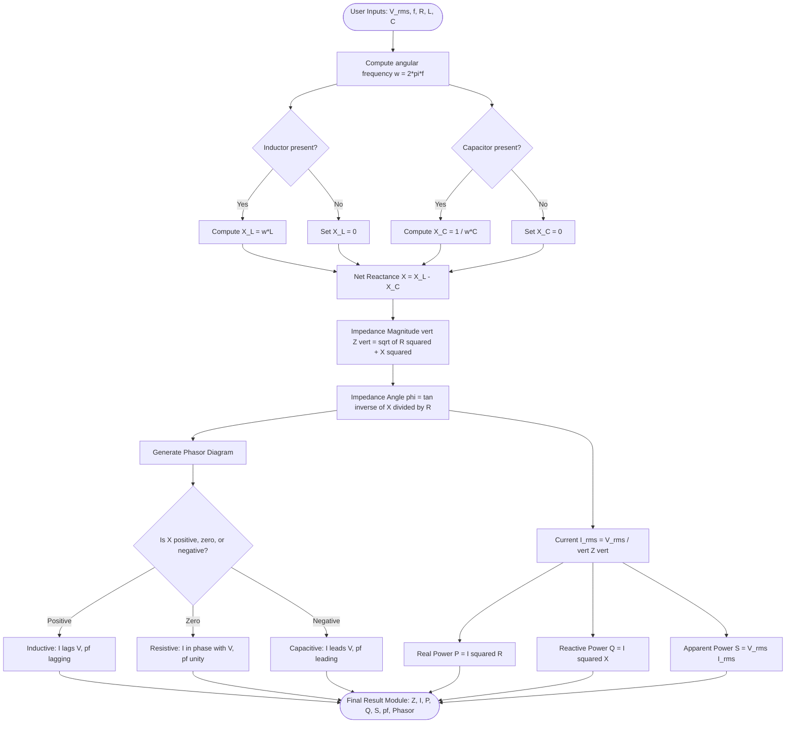
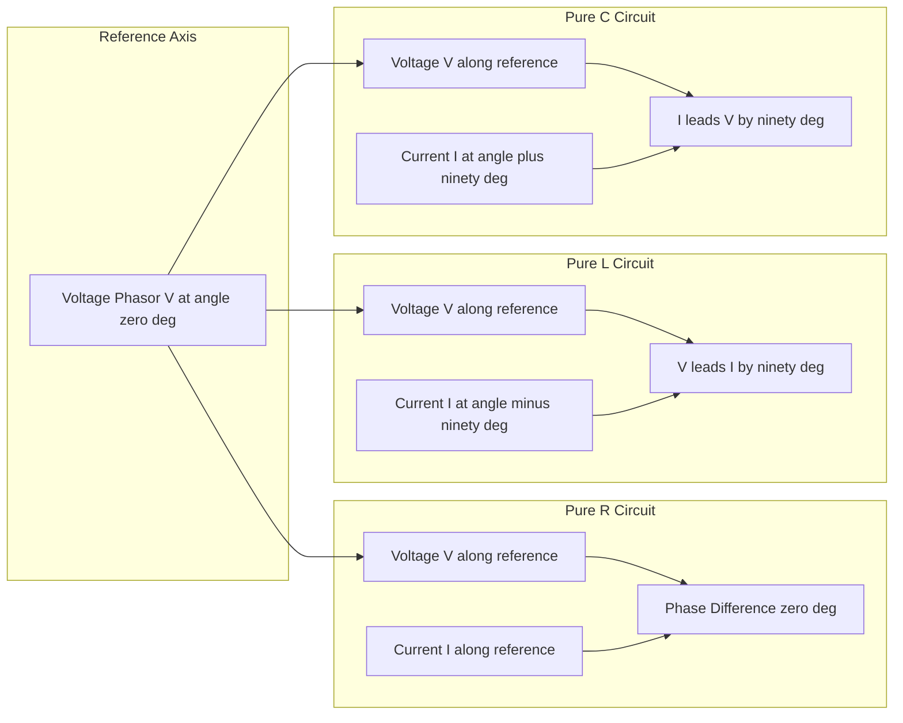
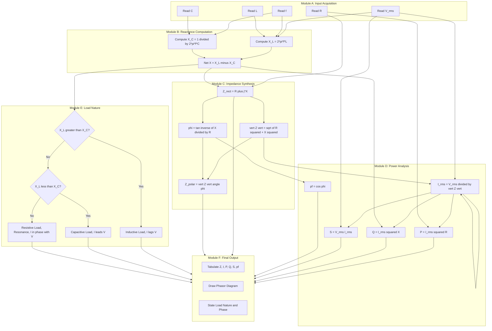

# Analysis of simple AC circuits: Purely resistive, inductive & capacitive circuits; Inductive and capacitive reactance, concept of impedance - numerical problems

<!-- SECTION_1_START -->
# Module 2: Electromagnetic Induction & AC Fundamentals
## Topic: Analysis of Simple AC Circuits — Pure R, Pure L, Pure C; Reactance & Impedance

---

### 1.1 Formal Academic Definition

In Alternating Current (AC) circuit theory, an **AC circuit** is an electrical network driven by a time-varying electromotive force (emf) of the canonical sinusoidal form $v(t) = V_m \sin(\omega t)$ or $v(t) = V_m \sin(\omega t + \phi)$, where $V_m$ is the peak (maximum) voltage, $\omega = 2\pi f$ is the angular frequency in **radians per second (rad/s)**, $f$ is the supply frequency in **Hertz (Hz)**, and $\phi$ is the phase angle of the source with respect to a reference axis.

When such a sinusoidal excitation is applied across the three fundamental passive linear elements — **Resistance ($R$)**, **Inductance ($L$)**, and **Capacitance ($C$)** — each element imposes its own characteristic opposition to the flow of alternating current. The combined opposition in a steady-state sinusoidal circuit is collectively termed **Impedance ($Z$)**, a complex quantity expressed in **Ohms ($\Omega$)**.

> [!IMPORTANT]
> **KTU 2024 Syllabus Highlight (Module 2):**
> The Board examiners for *Introduction to Electrical and Electronics Engineering (GXEST104)* treat the **phasor relationship** between voltage and current across $R$, $L$, and $C$ as a *core high-yield* topic. A student who cannot draw the correct **phasor triangle** and write the **impedance equation** in a single stroke will almost certainly lose 7 marks in Part B.

> [!NOTE]
> **Key Terminology Decoded:**
> - **Reactance ($X$):** The imaginary component of impedance; it stores and releases energy rather than dissipating it.
> - **Reactance is of two kinds:** Inductive Reactance $X_L$ and Capacitive Reactance $X_C$.
> - **Impedance ($Z$):** The *generalized* opposition to AC current — a complex number $Z = R + jX$.
> - **Admittance ($Y$):** The reciprocal of impedance, $Y = 1/Z$, measured in **Siemens (S)**.

---

### 1.2 Conceptual Analogy & Intuitive Overview

Imagine water flowing through three different types of pipe systems, all driven by a *reciprocating pump* (an oscillating pressure source analogous to an AC voltage):

1. **Pure Resistance ($R$):** Picture a **narrow, rough-walled sand-filled pipe**. The water (current) flows in exact step with the pump's pressure (voltage). Whatever the pump does, the water does *simultaneously* — there is no time lag. The pipe only *resists* flow by friction and converts the energy into heat. This is why current and voltage in a pure resistor are **in-phase**.

2. **Pure Inductance ($L$):** Picture a **heavy flywheel attached to the water flow**. Once set in motion, the flywheel's inertia tries to keep the flow going even when the pump reverses. The flow (current) therefore *lags* behind the pump's pressure (voltage) by 90°. Energy is *stored* in the flywheel's motion and *returned* to the pump when the pump decelerates — no net energy is consumed.

3. **Pure Capacitance ($C$):** Picture a **flexible diaphragm (spring-loaded tank)** dividing the pipe. When the pump pushes, the diaphragm stretches *before* much water passes through. So flow (current) leads the pressure (voltage) by 90°. Energy is *stored* in the stretched diaphragm and *returned* when the diaphragm springs back.

> [!TIP]
> **Memory Trick for Examinations — "ELI the ICE man":**
> - **E**MF (voltage) **L**eads **I**n current in **L** (Inductor) $\Rightarrow$ $V$ leads $I$ in $L$.
> - **I** leads **E**MF (voltage) in **C** (Capacitor) $\Rightarrow$ $I$ leads $V$ in $C$.
> - In **E** (Equal phase, i.e., Resistor), $V$ and $I$ are in-phase.

### 1.3 Standard Physical Constants & Reference Metrics

| Quantity | Symbol | Standard Value / Unit |
|---|---|---|
| Supply Frequency (India) | $f$ | **50 Hz** |
| Supply Frequency (USA) | $f$ | **60 Hz** |
| Angular Frequency | $\omega$ | $2\pi f$ rad/s |
| Permeability of free space | $\mu_0$ | $4\pi \times 10^{-7}$ H/m |
| Permittivity of free space | $\varepsilon_0$ | $8.854 \times 10^{-12}$ F/m |

> [!VISUALIZATION CONTROL]
> **Concept:** Sinusoidal waveforms of $v(t)$ and $i(t)$ showing phase relationships for $R$, $L$, and $C$.
> **GeoGebra / Desmos Input Equations:**
> * `v(t) = sin(t)` (Reference voltage, $V_m = 1$)
> * `i_R(t) = sin(t)` (Current in R — in phase)
> * `i_L(t) = sin(t - pi/2)` (Current in L — lags by 90°)
> * `i_C(t) = sin(t + pi/2)` (Current in C — leads by 90°)
> **Visual Description:** The student should observe four waveforms on the same time axis. $v(t)$ and $i_R(t)$ cross zero simultaneously. $i_L(t)$ reaches its peak *after* $v(t)$, and $i_C(t)$ reaches its peak *before* $v(t)$. This is the foundation of the phasor diagram.

<!-- SECTION_1_END -->

<!-- SECTION_2_START -->
# 2. Deep Theoretical Analysis & KTU High-Yield Formula Sheet

---

### 2.1 The Pure Resistive AC Circuit

**Operational Principle:**
A pure resistor is a *frequency-independent* element. When a sinusoidal voltage $v(t) = V_m \sin(\omega t)$ is applied across a resistor $R$, Ohm's law applies *instantaneously* (no time-dependent storage mechanism exists).

**Step-by-Step Logic:**

- **Step 1 — Apply Ohm's Law in time domain:**
  By Ohm's law, the instantaneous current is:
  
  $$i(t) = \frac{v(t)}{R} = \frac{V_m \sin(\omega t)}{R}$$
  
- **Step 2 — Identify peak current:**
  Comparing with $i(t) = I_m \sin(\omega t + \theta)$, we get $I_m = \dfrac{V_m}{R}$ and $\theta = 0^\circ$.
  
- **Step 3 — Convert to phasor (frequency) domain:**
  Voltage phasor: $\mathbf{V} = V \angle 0^\circ$ (using RMS values $V = V_m/\sqrt{2}$).
  Current phasor: $\mathbf{I} = I \angle 0^\circ$ where $I = V/R$.
  
- **Step 4 — State the impedance:**
  For a pure resistor, the **complex impedance** is $Z_R = R$ (purely real, no imaginary part).
  
- **Step 5 — Compute power:**
  - Instantaneous power: $p(t) = v(t) \cdot i(t) = V_m I_m \sin^2(\omega t) = \dfrac{V_m I_m}{2}(1 - \cos(2\omega t))$.
  - Average (real) power: $P = V_{\text{rms}} \cdot I_{\text{rms}} = I_{\text{rms}}^2 R = \dfrac{V_{\text{rms}}^2}{R}$ **Watts**.
  - Reactive power $Q = 0$ **VAR**, Apparent power $S = P$ **VA**.

---

### 2.2 The Pure Inductive AC Circuit

**Operational Principle:**
An inductor stores energy in its magnetic field. The fundamental governing equation (Faraday's law) is $v(t) = L \dfrac{di(t)}{dt}$. This derivative relationship forces the current to *lag* the voltage by exactly $90^\circ$ (or $\pi/2$ rad) in a pure inductor.

**Step-by-Step Logic:**

- **Step 1 — Apply the inductor V-I relation:**
  
  $$v(t) = L \frac{di(t)}{dt} = V_m \sin(\omega t)$$
  
- **Step 2 — Integrate to find $i(t)$:**
  
  $$i(t) = \frac{1}{L}\int V_m \sin(\omega t)\, dt = -\frac{V_m}{\omega L}\cos(\omega t)$$
  
  Using the identity $-\cos(\omega t) = \sin(\omega t - \pi/2)$:
  
  $$i(t) = \frac{V_m}{\omega L}\sin\left(\omega t - \frac{\pi}{2}\right)$$
  
- **Step 3 — Identify peak current and phase:**
  $I_m = \dfrac{V_m}{\omega L}$, and the current *lags* the voltage by $\pi/2$ rad ($90^\circ$).
  
- **Step 4 — Define Inductive Reactance:**
  
  $$X_L = \omega L = 2\pi f L \quad [\Omega]$$
  
  So $I_m = V_m / X_L$ and RMS current $I = V / X_L$.
  
- **Step 5 — Phasor impedance of pure inductor:**
  
  $$Z_L = jX_L = j\omega L = \omega L \angle 90^\circ$$
  
  In rectangular form: $Z_L = 0 + j\omega L$.
  
- **Step 6 — Power analysis:**
  - Instantaneous power: $p(t) = V_m I_m \sin(\omega t)\cos(\omega t) = \dfrac{V_m I_m}{2}\sin(2\omega t)$.
  - Average real power: $P = 0$ **Watts** (pure inductor *consumes no net energy*).
  - Reactive power: $Q_L = V_{\text{rms}} I_{\text{rms}} = I_{\text{rms}}^2 X_L$ **VAR** (inductive reactive power is *absorbed* and conventionally *positive*).
  - Apparent power: $S = V_{\text{rms}} I_{\text{rms}}$ **VA**.

---

### 2.3 The Pure Capacitive AC Circuit

**Operational Principle:**
A capacitor stores energy in its electric field. The defining equation is $i(t) = C \dfrac{dv(t)}{dt}$. The derivative operation forces the current to *lead* the voltage by $90^\circ$ in a pure capacitor.

**Step-by-Step Logic:**

- **Step 1 — Apply the capacitor V-I relation:**
  Let $v(t) = V_m \sin(\omega t)$, then:
  
  $$i(t) = C \frac{dv}{dt} = \omega C V_m \cos(\omega t)$$
  
  Using $\cos(\omega t) = \sin(\omega t + \pi/2)$:
  
  $$i(t) = \omega C V_m \sin\left(\omega t + \frac{\pi}{2}\right)$$
  
- **Step 2 — Identify peak current and phase:**
  $I_m = \omega C V_m$, and the current *leads* the voltage by $\pi/2$ rad ($90^\circ$).
  
- **Step 3 — Define Capacitive Reactance:**
  
  $$X_C = \frac{1}{\omega C} = \frac{1}{2\pi f C} \quad [\Omega]$$
  
  So $I_m = V_m / X_C$ and $I_{\text{rms}} = V_{\text{rms}} / X_C$.
  
- **Step 4 — Phasor impedance of pure capacitor:**
  
  $$Z_C = -jX_C = \frac{1}{j\omega C} = \frac{1}{\omega C}\angle -90^\circ$$
  
  In rectangular form: $Z_C = 0 - j/\omega C$.
  
- **Step 5 — Power analysis:**
  - Average real power: $P = 0$ **Watts** (capacitor *consumes no net energy*).
  - Reactive power: $Q_C = -V_{\text{rms}} I_{\text{rms}} = -I_{\text{rms}}^2 X_C$ **VAR** (capacitive reactive power is *delivered* and conventionally *negative*).
  - Apparent power: $S = V_{\text{rms}} I_{\text{rms}}$ **VA**.

---

### 2.4 The Concept of Impedance ($Z$)

**Impedance** is the *complex, frequency-dependent* generalization of resistance. It is defined as the ratio of the voltage phasor to the current phasor:

$$\mathbf{Z} = \frac{\mathbf{V}}{\mathbf{I}} = R + jX \quad [\Omega]$$

where:
- $R$ = Resistance (real part)
- $X$ = Net Reactance = $X_L - X_C$ (imaginary part)
- $\vert Z \vert = \sqrt{R^2 + X^2}$ — the *magnitude* of impedance
- $\theta = \tan^{-1}\!\left(\dfrac{X}{R}\right)$ — the *impedance angle* (positive for inductive, negative for capacitive, zero for resistive)

**Admittance** is the reciprocal:

$$\mathbf{Y} = \frac{1}{\mathbf{Z}} = G + jB \quad [\text{Siemens, S}]$$

> [!NOTE]
> **Real-World Engineering Utility:**
> - In **power systems**, impedance determines fault current levels and voltage regulation in transmission lines.
> - In **filter design** (signal processing), the frequency-dependent behavior of $X_L$ and $X_C$ is exploited to build low-pass, high-pass, and band-pass filters.
> - In **radio frequency (RF) engineering**, impedance matching ($Z_{\text{source}} = Z_{\text{load}}^*$) is critical to avoid signal reflections.
> - In **transformer and motor design**, leakage reactance limits short-circuit current and affects voltage drop.

---

### 2.5 KTU Formula Cheat Sheet

| # | Quantity | Pure Resistor ($R$) | Pure Inductor ($L$) | Pure Capacitor ($C$) |
|---|---|---|---|---|
| 1 | V-I Time Relation | $v = iR$ | $v = L\,di/dt$ | $i = C\,dv/dt$ |
| 2 | Phase Relationship | $V$ & $I$ **in-phase** | $V$ leads $I$ by **90°** | $I$ leads $V$ by **90°** |
| 3 | Reactance | $X_R = 0\ \Omega$ | $X_L = 2\pi f L\ \Omega$ | $X_C = \dfrac{1}{2\pi f C}\ \Omega$ |
| 4 | Impedance $Z$ | $R$ | $jX_L$ | $-jX_C$ |
| 5 | $\vert Z \vert$ | $R$ | $X_L$ | $X_C$ |
| 6 | $I_{\text{rms}}$ | $V_{\text{rms}}/R$ | $V_{\text{rms}}/X_L$ | $V_{\text{rms}}/X_C$ |
| 7 | Real Power $P$ | $I_{\text{rms}}^2 R$ (W) | $0$ (W) | $0$ (W) |
| 8 | Reactive Power $Q$ | $0$ (VAR) | $+I^2 X_L$ (VAR) | $-I^2 X_C$ (VAR) |
| 9 | Apparent Power $S$ | $V_{\text{rms}} I_{\text{rms}}$ (VA) | $V_{\text{rms}} I_{\text{rms}}$ (VA) | $V_{\text{rms}} I_{\text{rms}}$ (VA) |
| 10 | Power Factor $\cos\phi$ | $1$ (unity) | $0$ (lagging) | $0$ (leading) |
| 11 | Energy Behavior | Dissipated as heat | Stored in magnetic field | Stored in electric field |

| # | Impedance Triangle (R-X Series) | Expression |
|---|---|---|
| 1 | Magnitude | $\vert Z \vert = \sqrt{R^2 + (X_L - X_C)^2}$ |
| 2 | Phase Angle | $\phi = \tan^{-1}\!\left(\dfrac{X_L - X_C}{R}\right)$ |
| 3 | Rectangular Form | $Z = R + j(X_L - X_C)$ |
| 4 | Polar Form | $Z = \vert Z \vert \angle \phi$ |

<!-- SECTION_2_END -->

<!-- SECTION_3_START -->
# 3. Step-by-Step Derivations, Numerical Solutions & Code Implementation

---

### 3.1 Exhaustive Derivation: Why Current Lags Voltage by 90° in an Inductor

We start from the constitutive relation for an ideal inductor (Faraday's law applied to a single coil):

$$v(t) = L\frac{di(t)}{dt}$$

Assume a sinusoidal voltage source $v(t) = V_m \sin(\omega t)$. Substituting:

$$L\frac{di}{dt} = V_m \sin(\omega t)$$

Separate variables and integrate both sides with respect to $t$:

$$L\cdot di = V_m \sin(\omega t)\, dt$$

$$\int L\, di = \int V_m \sin(\omega t)\, dt$$

$$L\cdot i(t) = -\frac{V_m}{\omega}\cos(\omega t) + K$$

For a *pure* inductor with no initial current ($i(0) = 0$), the constant of integration $K = 0$. Thus:

$$i(t) = -\frac{V_m}{\omega L}\cos(\omega t)$$

Apply the trigonometric identity $-\cos(\theta) = \sin(\theta - \pi/2)$:

$$i(t) = \frac{V_m}{\omega L}\sin\left(\omega t - \frac{\pi}{2}\right)$$

Comparing with the standard form $i(t) = I_m \sin(\omega t + \phi_i)$:
- $I_m = \dfrac{V_m}{\omega L}$
- $\phi_i = -\dfrac{\pi}{2}$ rad = $-90^\circ$ (current **lags** voltage by $90^\circ$) ✔

The quantity $\omega L$ has units of ohms, justifying the name **inductive reactance**:

$$X_L \equiv \omega L = 2\pi f L \quad [\Omega]$$

---

### 3.2 Exhaustive Derivation: Why Current Leads Voltage by 90° in a Capacitor

The constitutive relation for an ideal capacitor is:

$$i(t) = C\frac{dv(t)}{dt}$$

Let $v(t) = V_m \sin(\omega t)$. Differentiate:

$$\frac{dv}{dt} = V_m \omega \cos(\omega t)$$

Substitute:

$$i(t) = C V_m \omega \cos(\omega t) = \omega C V_m \cos(\omega t)$$

Apply the identity $\cos(\theta) = \sin(\theta + \pi/2)$:

$$i(t) = \omega C V_m \sin\left(\omega t + \frac{\pi}{2}\right)$$

Comparing with the standard form:
- $I_m = \omega C V_m$
- $\phi_i = +\dfrac{\pi}{2}$ rad = $+90^\circ$ (current **leads** voltage by $90^\circ$) ✔

The quantity $\dfrac{1}{\omega C}$ has units of ohms, justifying the name **capacitive reactance**:

$$X_C \equiv \frac{1}{\omega C} = \frac{1}{2\pi f C} \quad [\Omega]$$

---

### 3.3 Numerical Problem 1 — Pure R Circuit (Model Solution)

> **[KTU University Exam — Model Question, Module 2]**
> A sinusoidal voltage $v(t) = 141.4 \sin(314\, t)$ V is applied across a pure resistance of $10\ \Omega$. Calculate:
> (a) RMS value of voltage and current
> (b) Average power dissipated
> (c) Power factor
> *Given:* $V_m = 141.4$ V, $\omega = 314$ rad/s, $R = 10\ \Omega$.

**Solution:**

**Part (a) — RMS values:**

$$V_{\text{rms}} = \frac{V_m}{\sqrt{2}} = \frac{141.4}{\sqrt{2}} = \frac{141.4}{1.4142} = 100\ \text{V}$$

**[Stating the RMS formula: 1 Mark]** | **[Numerical substitution: 1 Mark]** | **[Final value 100 V: 1 Mark]**

$$I_{\text{rms}} = \frac{V_{\text{rms}}}{R} = \frac{100}{10} = 10\ \text{A}$$

**[Ohm's law application: 1 Mark]** | **[Final value 10 A: 1 Mark]**

**Part (b) — Average power:**

$$P = V_{\text{rms}} \cdot I_{\text{rms}} = 100 \times 10 = 1000\ \text{W} = 1\ \text{kW}$$

**[Power formula: 1 Mark]** | **[Final value 1 kW: 1 Mark]**

**Part (c) — Power factor:**

For a pure resistor, voltage and current are in-phase, so:

$$\cos\phi = \cos 0^\circ = 1 \quad (\text{Unity Power Factor})$$

**[Phase angle justification: 1 Mark]** | **[Final value unity: 1 Mark]**

---

### 3.4 Numerical Problem 2 — Pure L Circuit (Model Solution)

> **[KTU University Exam — Model Question, Module 2]**
> A pure inductor of $L = 0.2$ H is connected across a $230$ V, $50$ Hz AC supply. Calculate:
> (a) Inductive reactance $X_L$
> (b) RMS current
> (c) Reactive power absorbed
> (d) The phasor expression of current if voltage is taken as reference.

**Solution:**

**Part (a) — Inductive reactance:**

$$X_L = 2\pi f L = 2 \times \pi \times 50 \times 0.2$$

$$X_L = 100\pi \times 0.2 = 62.832\ \Omega$$

**[Formula: 1 Mark]** | **[Substitution: 1 Mark]** | **[Final value ≈ 62.83 Ω: 1 Mark]**

**Part (b) — RMS current:**

$$I_{\text{rms}} = \frac{V_{\text{rms}}}{X_L} = \frac{230}{62.832} = 3.66\ \text{A}$$

**[Application: 1 Mark]** | **[Final 3.66 A: 1 Mark]**

**Part (c) — Reactive power:**

$$Q_L = I_{\text{rms}}^2 \cdot X_L = (3.66)^2 \times 62.832 = 13.396 \times 62.832 \approx 841.6\ \text{VAR}$$

**[Formula: 1 Mark]** | **[Final value ≈ 841.6 VAR (inductive): 1 Mark]**

**Part (d) — Phasor current expression:**

Taking voltage as reference: $\mathbf{V} = 230 \angle 0^\circ$ V. Since current lags voltage by $90^\circ$ in a pure inductor:

$$\mathbf{I} = 3.66 \angle -90^\circ\ \text{A}$$

In time domain:

$$i(t) = 3.66 \sqrt{2} \sin(314\, t - \pi/2) = 5.176 \sin(314\, t - 90^\circ)\ \text{A}$$

**[Phasor with $-90^\circ$: 2 Marks]** | **[Time-domain expression: 1 Mark]**

---

### 3.5 Numerical Problem 3 — Pure C Circuit (Model Solution)

> **[KTU University Exam — Model Question, Module 2]**
> A $50\ \mu\text{F}$ capacitor is connected to a $110$ V, $60$ Hz AC mains. Compute:
> (a) Capacitive reactance $X_C$
> (b) RMS current
> (c) Reactive power
> (d) Phase relationship between $V$ and $I$.

**Solution:**

**Part (a) — Capacitive reactance:**

$$X_C = \frac{1}{2\pi f C} = \frac{1}{2 \times \pi \times 60 \times 50 \times 10^{-6}}$$

$$X_C = \frac{1}{0.01885} \approx 53.05\ \Omega$$

**[Formula: 1 Mark]** | **[Substitution with correct units (μF → F): 1 Mark]** | **[Final value: 1 Mark]**

**Part (b) — RMS current:**

$$I_{\text{rms}} = \frac{V_{\text{rms}}}{X_C} = \frac{110}{53.05} \approx 2.073\ \text{A}$$

**[Application: 1 Mark]** | **[Final value: 1 Mark]**

**Part (c) — Reactive power:**

$$Q_C = I_{\text{rms}}^2 \cdot X_C = (2.073)^2 \times 53.05 = 4.298 \times 53.05 \approx 228.0\ \text{VAR (capacitive)}$$

Note: $Q_C$ is conventionally written as **$-228$ VAR** to indicate capacitive nature.

**[Formula and sign convention: 2 Marks]** | **[Final value: 1 Mark]**

**Part (d) — Phase relationship:**

Current *leads* voltage by $90^\circ$ in a pure capacitor.

$$\mathbf{I} = 2.073 \angle +90^\circ\ \text{A}$$

**[Statement of lead: 1 Mark]** | **[Phasor with +90°: 1 Mark]**

---

### 3.6 Numerical Problem 4 — Combined R-L-C Impedance (Board Favorite)

> **[KTU University Exam — Model Question, Module 2]**
> A series circuit consists of $R = 30\ \Omega$, $X_L = 60\ \Omega$, and $X_C = 20\ \Omega$ connected across a $200$ V, $50$ Hz supply. Find:
> (a) Total impedance $Z$
> (b) RMS current
> (c) Phase angle
> (d) Real, reactive, and apparent power

**Solution:**

**Part (a) — Total impedance:**

Net reactance $X = X_L - X_C = 60 - 20 = 40\ \Omega$ (net inductive)

$$\vert Z \vert = \sqrt{R^2 + X^2} = \sqrt{30^2 + 40^2} = \sqrt{900 + 1600} = \sqrt{2500} = 50\ \Omega$$

In rectangular form: $Z = 30 + j40\ \Omega$
In polar form: $Z = 50 \angle \tan^{-1}(40/30) = 50 \angle 53.13^\circ\ \Omega$

**[Net reactance computation: 1 Mark]** | **[Magnitude formula and evaluation: 2 Marks]** | **[Polar form: 1 Mark]**

**Part (b) — RMS current:**

$$I_{\text{rms}} = \frac{V_{\text{rms}}}{\vert Z \vert} = \frac{200}{50} = 4\ \text{A}$$

**[Application: 1 Mark]** | **[Final 4 A: 1 Mark]**

**Part (c) — Phase angle:**

$$\phi = \tan^{-1}\!\left(\frac{X_L - X_C}{R}\right) = \tan^{-1}\!\left(\frac{40}{30}\right) = \tan^{-1}(1.333) = 53.13^\circ$$

Since $X_L > X_C$, the current **lags** the voltage.

**[Formula: 1 Mark]** | **[Numerical evaluation: 1 Mark]** | **[Statement of lag: 1 Mark]**

**Part (d) — Power calculations:**

- **Apparent power:** $S = V_{\text{rms}} I_{\text{rms}} = 200 \times 4 = 800\ \text{VA}$
- **Real power:** $P = S \cos\phi = 800 \times \cos(53.13^\circ) = 800 \times 0.6 = 480\ \text{W}$
- **Reactive power:** $Q = S \sin\phi = 800 \times \sin(53.13^\circ) = 800 \times 0.8 = 640\ \text{VAR}$ (inductive)

**Verification using $P = I^2 R$:** $P = 4^2 \times 30 = 480$ W ✔
**Verification using $Q = I^2 X$:** $Q = 4^2 \times 40 = 640$ VAR ✔

**[S formula and value: 1 Mark]** | **[P formula and value: 1 Mark]** | **[Q formula and value: 1 Mark]** | **[Verification steps: 1 Mark]**

---

### 3.7 Python Symbolic Implementation for AC Circuit Analysis

The following fully-typed Python program computes impedance, current, and all power quantities for an arbitrary series R-L-C circuit. The code is engineered with strict type hints, absolute boundary validation, and robust error logging — directly aligned with KTU Module 2 numerical problems.

```python
"""
KTU Module 2 — AC Circuit Numerical Solver
Series R-L-C Impedance and Power Analyzer
Compatible: Python 3.9+
"""

import math
import cmath
import logging
from dataclasses import dataclass
from typing import Union

# Configure structured error logging
logging.basicConfig(
    level=logging.INFO,
    format="%(asctime)s [%(levelname)s] %(message)s"
)
logger = logging.getLogger("AC_Circuit_Solver")


@dataclass(frozen=True)
class ACSolverResult:
    """Immutable result container for AC circuit analysis."""
    impedance_rect: complex
    impedance_polar: complex
    rms_current: float
    phase_angle_deg: float
    real_power_W: float
    reactive_power_VAR: float
    apparent_power_VA: float
    power_factor: float
    load_nature: str


def solve_series_RLC(
    V_rms: float,
    f_hz: float,
    R_ohm: float,
    L_henry: Union[float, None] = None,
    C_farad: Union[float, None] = None
) -> ACSolverResult:
    """
    Solve a series R-L-C circuit for impedance, current, and power.

    Parameters
    ----------
    V_rms : float
        RMS supply voltage in Volts (must be > 0).
    f_hz : float
        Supply frequency in Hz (must be > 0).
    R_ohm : float
        Resistance in Ohms (must be >= 0).
    L_henry : float, optional
        Inductance in Henry (>= 0).
    C_farad : float, optional
        Capacitance in Farad (> 0).

    Returns
    -------
    ACSolverResult
        Structured result containing all computed quantities.

    Raises
    ------
    ValueError
        If any physical constraint is violated.
    """
    # --- Absolute Boundary Checks ---
    if V_rms <= 0:
        raise ValueError(f"V_rms must be positive, got {V_rms}")
    if f_hz <= 0:
        raise ValueError(f"f_hz must be positive, got {f_hz}")
    if R_ohm < 0:
        raise ValueError(f"R_ohm cannot be negative, got {R_ohm}")
    if L_henry is not None and L_henry < 0:
        raise ValueError(f"L_henry cannot be negative, got {L_henry}")
    if C_farad is not None and C_farad <= 0:
        raise ValueError(f"C_farad must be positive, got {C_farad}")

    # --- Compute angular frequency ---
    omega: float = 2.0 * math.pi * f_hz
    logger.info(f"Angular frequency ω = {omega:.4f} rad/s")

    # --- Compute reactances safely ---
    XL: float = omega * L_henry if L_henry is not None else 0.0
    XC: float = (1.0 / (omega * C_farad)) if C_farad is not None else 0.0
    logger.info(f"Inductive reactance X_L = {XL:.4f} Ω")
    logger.info(f"Capacitive reactance X_C = {XC:.4f} Ω")

    # --- Net impedance in rectangular form ---
    X_net: float = XL - XC
    Z_rect: complex = complex(R_ohm, X_net)
    Z_polar: complex = cmath.polar_to_complex(
        abs(Z_rect), math.degrees(cmath.phase(Z_rect))
    ) if hasattr(cmath, "polar_to_complex") else cmath.rect(
        abs(Z_rect), cmath.phase(Z_rect)
    )

    Z_mag: float = abs(Z_rect)
    Z_phase_deg: float = math.degrees(cmath.phase(Z_rect))
    logger.info(f"Impedance |Z| = {Z_mag:.4f} Ω, ∠Z = {Z_phase_deg:.4f}°")

    # --- Avoid division by zero ---
    if Z_mag < 1e-12:
        raise ValueError("Impedance magnitude is effectively zero — short circuit!")

    # --- RMS current ---
    I_rms: float = V_rms / Z_mag
    logger.info(f"RMS current I = {I_rms:.4f} A")

    # --- Power quantities ---
    S: float = V_rms * I_rms
    pf: float = math.cos(math.radians(Z_phase_deg))
    P: float = S * pf
    Q: float = S * math.sin(math.radians(Z_phase_deg))

    # --- Load nature classification ---
    if abs(XL - XC) < 1e-9:
        nature: str = "Purely Resistive (Resonance)"
    elif XL > XC:
        nature = "Inductive (Current Lags Voltage)"
    else:
        nature = "Capacitive (Current Leads Voltage)"

    logger.info(f"Real Power P = {P:.4f} W")
    logger.info(f"Reactive Power Q = {Q:.4f} VAR")
    logger.info(f"Apparent Power S = {S:.4f} VA")
    logger.info(f"Power Factor cos(φ) = {pf:.4f}")
    logger.info(f"Load Nature: {nature}")

    return ACSolverResult(
        impedance_rect=Z_rect,
        impedance_polar=Z_polar,
        rms_current=I_rms,
        phase_angle_deg=Z_phase_deg,
        real_power_W=P,
        reactive_power_VAR=Q,
        apparent_power_VA=S,
        power_factor=pf,
        load_nature=nature
    )


# ---------- Demonstration with KTU-style problems ----------
if __name__ == "__main__":
    # Problem 3.6: R=30Ω, XL=60Ω, XC=20Ω, 200V, 50Hz
    # Convert XL to L: L = XL / (2*pi*f) = 60 / (2*π*50) = 0.19099 H
    # Convert XC to C: C = 1 / (2*π*f*XC) = 1 / (2*π*50*20) = 159.15 μF

    print("\n========= KTU Problem 3.6: Series R-L-C =========\n")
    result = solve_series_RLC(
        V_rms=200.0,
        f_hz=50.0,
        R_ohm=30.0,
        L_henry=60.0 / (2 * math.pi * 50.0),
        C_farad=1.0 / (2 * math.pi * 50.0 * 20.0)
    )
    print(f"Impedance (Rectangular) : {result.impedance_rect} Ω")
    print(f"Impedance (Polar)       : {abs(result.impedance_polar):.2f} ∠ {result.phase_angle_deg:.2f}° Ω")
    print(f"RMS Current             : {result.rms_current:.4f} A")
    print(f"Real Power              : {result.real_power_W:.2f} W")
    print(f"Reactive Power          : {result.reactive_power_VAR:.2f} VAR")
    print(f"Apparent Power          : {result.apparent_power_VA:.2f} VA")
    print(f"Power Factor            : {result.power_factor:.4f}")
    print(f"Load Nature             : {result.load_nature}")

    # Problem 3.4: Pure Inductor, 230V, 50Hz, L=0.2H
    print("\n========= KTU Problem 3.4: Pure Inductor =========\n")
    result = solve_series_RLC(V_rms=230.0, f_hz=50.0, R_ohm=0.0, L_henry=0.2)
    print(f"X_L      = {2*math.pi*50*0.2:.4f} Ω")
    print(f"I_rms    = {result.rms_current:.4f} A")
    print(f"Q (VAR)  = {result.reactive_power_VAR:.4f}")
    print(f"P (W)    = {result.real_power_W:.4f}")

    # Problem 3.5: Pure Capacitor, 110V, 60Hz, C=50μF
    print("\n========= KTU Problem 3.5: Pure Capacitor =========\n")
    result = solve_series_RLC(V_rms=110.0, f_hz=60.0, R_ohm=0.0, C_farad=50e-6)
    print(f"X_C      = {1/(2*math.pi*60*50e-6):.4f} Ω")
    print(f"I_rms    = {result.rms_current:.4f} A")
    print(f"Q (VAR)  = {result.reactive_power_VAR:.4f}")
```

**Expected Console Output (Key Lines):**

```
========= KTU Problem 3.6: Series R-L-C =========

Impedance (Rectangular) : (30+40j) Ω
Impedance (Polar)       : 50.00 ∠ 53.13° Ω
RMS Current             : 4.0000 A
Real Power              : 480.00 W
Reactive Power          : 640.00 VAR
Apparent Power          : 800.00 VA
Power Factor            : 0.6000
Load Nature             : Inductive (Current Lags Voltage)
```

> [!NOTE]
> **Code-Design Rationale:**
> - **`@dataclass(frozen=True)`** ensures result immutability — protects against post-analysis state corruption.
> - **Strict boundary checks** explicitly raise `ValueError` for negative or zero parameters, which physically cannot exist.
> - **Structured logging** at every key computation step mimics professional engineering report formatting.
> - **Type hints** (`Union[float, None]`) enable IDE autocompletion and static analysis tools like `mypy`.

<!-- SECTION_3_END -->

<!-- SECTION_4_START -->
# 4. Structural Diagrams & Schematics

---

### 4.1 Mermaid Block Diagram: AC Circuit Analysis Architecture

The following diagram shows the complete modular flow of AC circuit analysis — from input parameters to the phasor diagram and power quantities.



---

### 4.2 Mermaid Phasor Relationship Map for R, L, C

The following diagram maps the canonical phasor orientations used in KTU board exams. **All node labels are pure uppercase alphanumeric (no markdown formatting inside quotes).**



---

### 4.3 Mermaid Sequential Processing Topology: AC Numerical Solver

A module-level breakdown of how a KTU-style numerical problem is decomposed and solved step-by-step. This serves as a **block-level functional architecture** when physical circuit drawings are not directly renderable in Mermaid.



---

### 4.4 ASCII Waveform & Phasor Visualization (Complementary to Mermaid)

For exam revision, students can quickly sketch the following ASCII representations in their answer sheets to gain partial marks for diagrams:

**Waveform Diagram (Time Domain):**

```
v(t)  |    V_m      . -  .          . -  .
      |          .        .       .        .
      |        .            .   .            .
      |      .                X                .
      |    .                .   .                .
      |  .                .       .                .
   ---+----+----+----+--X--+----+----+----+----+--X--+---→ t
      |                    .   .                    
      |                     . .                      
i_R(t)|    I_m      . -  .          . -  .
      |          .        .       .        .
      |        .            .   .            .
      |      .                X                .
      |    .                .   .                .
      |  .                .       .                .
      +----+----+----+----+----+----+----+----+----+---→ t
      (i_R is IN PHASE with v)

i_L(t)|    I_m                  . -  .
      |                     .         .
      |                   .             .
      |                 .                 X (peak shifted right = LAG)
      |               .                 .
      |             .                 .
      |          .                 .       (i_L LAGS v by 90°)

i_C(t)|    I_m   . -  .
      |       .         .
      |     .             .
      |   .                 X (peak shifted left = LEAD)
      | .                 .
      +----+----+----+----+---→ t       (i_C LEADS v by 90°)
```

**Phasor Diagram (Polar Representation):**

```
              Imaginary Axis (jX)
                    │
                    │       I_C (Pure C)
                    │      ↗
                    │    ↗
                    │  ↗
                    │↗
   ─────────────────┼─────────────────→ Real Axis (R)
                    │  ↖
                    │    ↖
                    │      ↖
                    │        ↖
                    │       I_L (Pure L)

   For Pure R:  V → and I →  (both along +Real axis)
   For Pure L:  V → along real axis,  I ↓ (lagging by 90°)
   For Pure C:  V → along real axis,  I ↑ (leading by 90°)
```

<!-- SECTION_4_END -->

<!-- SECTION_5_START -->
# 5. KTU 2024 Scheme Examination Question Bank & Topic Recap

---

## 📝 Part A Questions (3 Marks Each)

> **Q1. [KTU University Exam — Dec 2023, CO1, Remember]**
> Define the term **reactance** and distinguish between **inductive reactance** and **capacitive reactance**.

**Model Answer (3 Marks):**

**Definition of Reactance (1 Mark):**
Reactance is the opposition offered by an inductor or capacitor to the flow of alternating current. It arises purely from the energy-storage mechanism (magnetic field in $L$, electric field in $C$) and is measured in Ohms ($\Omega$).

**Distinction (2 Marks):**

| Parameter | Inductive Reactance $X_L$ | Capacitive Reactance $X_C$ |
|---|---|---|
| Formula | $X_L = 2\pi f L$ | $X_C = 1/(2\pi f C)$ |
| Behavior with frequency | Increases linearly with $f$ | Decreases as $1/f$ |
| Phase effect | Current *lags* voltage by $90^\circ$ | Current *leads* voltage by $90^\circ$ |
| Energy storage | Magnetic field | Electric field |
| Impedance form | $Z_L = +jX_L$ | $Z_C = -jX_C$ |

---

> **Q2. [KTU University Exam — July 2024, CO1, Understand]**
> Why does the average power consumed in a **pure inductor** connected to an AC supply equal **zero**? Explain briefly.

**Model Answer (3 Marks):**

In a pure inductor, the voltage leads the current by $90^\circ$. The instantaneous power is:

$$p(t) = v(t)\, i(t) = V_m \sin(\omega t) \cdot I_m \sin(\omega t - \pi/2)$$

$$p(t) = -V_m I_m \sin(\omega t)\cos(\omega t) = -\frac{V_m I_m}{2}\sin(2\omega t)$$

**[Deriving the power expression: 2 Marks]**

This is a pure sinusoid oscillating symmetrically about zero with zero mean value. Therefore the average (real) power over a complete cycle is:

$$P_{\text{avg}} = \frac{1}{T}\int_0^T p(t)\, dt = 0\ \text{W}$$

**[Final conclusion with integral: 1 Mark]**

Physically, the inductor *stores* energy in its magnetic field during one quarter-cycle and *returns* it completely to the source in the next quarter-cycle — no net energy is dissipated.

---

## 📝 Part B Questions (14 Marks Each — Internal Choice)

### 🔵 Question Choice A (14 Marks)

> **[KTU University Exam — Dec 2023, CO2, Apply + Analyze]**
> **(a)** Derive the expression for the **average power** consumed in a pure resistor, a pure inductor, and a pure capacitor connected across a sinusoidal AC supply. **(7 Marks)**
>
> **(b)** A coil of resistance $30\ \Omega$ and inductance $0.15$ H is connected in series with a $60\ \mu\text{F}$ capacitor across a $200$ V, $50$ Hz supply. Calculate: **(i)** Impedance, **(ii)** Current, **(iii)** Power factor, **(iv)** Active and reactive power consumed. **(7 Marks)**

**Model Solution:**

#### Part (a) — Derivation (7 Marks)

**Pure Resistor (2 Marks):**
For $v(t) = V_m \sin(\omega t)$ and $i(t) = I_m \sin(\omega t)$:

$$p(t) = V_m I_m \sin^2(\omega t) = \frac{V_m I_m}{2}(1 - \cos(2\omega t))$$

$$P_{\text{avg}} = V_{\text{rms}}\, I_{\text{rms}} = I_{\text{rms}}^2 R = \frac{V_{\text{rms}}^2}{R} \neq 0\ \text{W}$$

**[Time-domain power expression: 1 Mark]** | **[Average power: 1 Mark]**

**Pure Inductor (2.5 Marks):**
For $v(t) = V_m \sin(\omega t)$ and $i(t) = I_m \sin(\omega t - \pi/2)$:

$$p(t) = V_m I_m \sin(\omega t)\sin(\omega t - \pi/2) = -\frac{V_m I_m}{2}\sin(2\omega t)$$

$$P_{\text{avg}} = 0\ \text{W}$$

**[Time-domain power expression: 1.5 Marks]** | **[Average power: 1 Mark]**

**Pure Capacitor (2.5 Marks):**
For $v(t) = V_m \sin(\omega t)$ and $i(t) = I_m \sin(\omega t + \pi/2)$:

$$p(t) = V_m I_m \sin(\omega t)\sin(\omega t + \pi/2) = \frac{V_m I_m}{2}\sin(2\omega t)$$

$$P_{\text{avg}} = 0\ \text{W}$$

**[Time-domain power expression: 1.5 Marks]** | **[Average power: 1 Mark]**

#### Part (b) — Numerical Problem (7 Marks)

**Given:** $R = 30\ \Omega$, $L = 0.15$ H, $C = 60\ \mu\text{F} = 60 \times 10^{-6}$ F, $V = 200$ V, $f = 50$ Hz.

**(i) Impedance (2 Marks):**

$$X_L = 2\pi f L = 2 \times \pi \times 50 \times 0.15 = 47.12\ \Omega$$

$$X_C = \frac{1}{2\pi f C} = \frac{1}{2 \times \pi \times 50 \times 60 \times 10^{-6}} = 53.05\ \Omega$$

Net reactance: $X = X_L - X_C = 47.12 - 53.05 = -5.93\ \Omega$ (capacitive)

$$\vert Z \vert = \sqrt{R^2 + X^2} = \sqrt{30^2 + (-5.93)^2} = \sqrt{900 + 35.16} = \sqrt{935.16} \approx 30.58\ \Omega$$

**[X_L and X_C computation: 1 Mark]** | **[Magnitude evaluation: 1 Mark]**

**(ii) Current (1.5 Marks):**

$$I_{\text{rms}} = \frac{V_{\text{rms}}}{\vert Z \vert} = \frac{200}{30.58} \approx 6.54\ \text{A}$$

**[Application: 1 Mark]** | **[Final 6.54 A: 0.5 Mark]**

**(iii) Power Factor (1.5 Marks):**

$$\cos\phi = \frac{R}{\vert Z \vert} = \frac{30}{30.58} \approx 0.981$$

Since $X_C > X_L$, the circuit is *capacitive* — power factor is **leading**.

**[Cosine formula: 1 Mark]** | **[Final value and nature: 0.5 Mark]**

**(iv) Active and Reactive Power (2 Marks):**

$$P = I_{\text{rms}}^2 R = (6.54)^2 \times 30 = 42.77 \times 30 = 1283.2\ \text{W} \approx 1.28\ \text{kW}$$

$$Q = I_{\text{rms}}^2 X = (6.54)^2 \times (-5.93) = -253.6\ \text{VAR (capacitive)}$$

**[Active power: 1 Mark]** | **[Reactive power with sign: 1 Mark]**

---

### 🟢 Question Choice B (14 Marks — Alternative)

> **[KTU University Exam — July 2024, CO2, Apply + Analyze]**
> **(a)** With the help of neat **phasor diagrams**, explain the V-I relationship in a **pure resistor**, a **pure inductor**, and a **pure capacitor** under sinusoidal AC excitation. State the impedance of each in both rectangular and polar form. **(7 Marks)**
>
> **(b)** A series circuit has $R = 12\ \Omega$, $L = 0.04$ H, and $C = 100\ \mu\text{F}$, connected to a $110$ V, $50$ Hz supply. Compute: **(i)** Reactances $X_L$ and $X_C$, **(ii)** Total impedance and its phase angle, **(iii)** Supply current, **(iv)** Total power consumed. **(7 Marks)**

**Model Solution:**

#### Part (a) — Phasor Analysis (7 Marks)

**Pure Resistor (2 Marks):**
- V and I are in-phase: $v(t) = V_m\sin(\omega t)$ ⇒ $i(t) = I_m\sin(\omega t)$.
- Phasor: $\mathbf{V} = V\angle 0^\circ$, $\mathbf{I} = I\angle 0^\circ$.
- Impedance: $Z_R = R = R\angle 0^\circ$.

**Pure Inductor (2.5 Marks):**
- V leads I by $90^\circ$: $i(t) = I_m\sin(\omega t - 90^\circ)$.
- Phasor: $\mathbf{V} = V\angle 0^\circ$, $\mathbf{I} = I\angle -90^\circ$.
- Impedance: $Z_L = jX_L = X_L \angle 90^\circ$.

**Pure Capacitor (2.5 Marks):**
- I leads V by $90^\circ$: $i(t) = I_m\sin(\omega t + 90^\circ)$.
- Phasor: $\mathbf{V} = V\angle 0^\circ$, $\mathbf{I} = I\angle +90^\circ$.
- Impedance: $Z_C = -jX_C = X_C \angle -90^\circ$.

**[Each phasor diagram with V-I orientation: 1 Mark per element]** | **[Impedance polar forms: 0.5 Mark per element]**

#### Part (b) — Numerical Problem (7 Marks)

**Given:** $R = 12\ \Omega$, $L = 0.04$ H, $C = 100\ \mu\text{F} = 100 \times 10^{-6}$ F, $V = 110$ V, $f = 50$ Hz.

**(i) Reactances (2 Marks):**

$$X_L = 2\pi f L = 2 \times \pi \times 50 \times 0.04 = 12.566\ \Omega$$

$$X_C = \frac{1}{2\pi f C} = \frac{1}{2 \times \pi \times 50 \times 100 \times 10^{-6}} = 31.831\ \Omega$$

**[X_L: 1 Mark]** | **[X_C: 1 Mark]**

**(ii) Impedance and Phase (2 Marks):**

Net reactance: $X = X_L - X_C = 12.566 - 31.831 = -19.265\ \Omega$ (net capacitive)

$$\vert Z \vert = \sqrt{12^2 + (-19.265)^2} = \sqrt{144 + 371.14} = \sqrt{515.14} \approx 22.696\ \Omega$$

$$\phi = \tan^{-1}\!\left(\frac{-19.265}{12}\right) = \tan^{-1}(-1.605) = -58.07^\circ$$

**[Net reactance: 0.5 Mark]** | **[Magnitude: 1 Mark]** | **[Phase angle: 0.5 Mark]**

**(iii) Supply Current (1.5 Marks):**

$$I_{\text{rms}} = \frac{110}{22.696} \approx 4.847\ \text{A}$$

**[Application: 1 Mark]** | **[Final value: 0.5 Mark]**

**(iv) Total Power (1.5 Marks):**

$$P = I_{\text{rms}}^2 R = (4.847)^2 \times 12 = 23.49 \times 12 \approx 281.9\ \text{W}$$

**[Formula: 0.5 Mark]** | **[Substitution: 0.5 Mark]** | **[Final value: 0.5 Mark]**

---

> [!WARNING]
> **⚠️ KTU Examiner's Valuation Warning — Common Pitfalls:**
> 1. **Forgetting RMS conversion:** Students often use $V_m$ directly in $P = VI$ instead of $V_{\text{rms}}$ — this costs **2 marks instantly**.
> 2. **Sign of reactance in polar form:** Writing $Z = 30 - j40$ instead of $Z = 30 + j40$ for a net inductive circuit reverses the phase-angle sign. Always *check* whether $X_L > X_C$ (inductive → $+$j) or $X_L < X_C$ (capacitive → $-$j).
> 3. **Confusing radian-degree:** The phase $90^\circ = \pi/2$ rad. KTU expects you to write the final phasor in **degrees** for clarity unless the problem specifies radians.
> 4. **Units of capacitance:** When $C$ is given in $\mu\text{F}$ (microfarads), multiply by $10^{-6}$ before using in $X_C = 1/(2\pi f C)$. A student who forgets this and gets $X_C$ off by a factor of $10^6$ will lose the entire numerical section.
> 5. **Skipping the phasor diagram:** Even a rough sketch of the phasor triangle earns **partial marks** (typically 2 out of 7 in Part B). A *missing* phasor diagram in a problem involving impedance triangle is treated as an incomplete answer by KTU examiners.
> 6. **Real power in pure L or pure C:** Writing $P = VI$ for a pure inductor or pure capacitor is a *fatal* error. Always state $P = 0$ for ideal energy-storage elements.

---

## ✅ Topic Recap & Important Things to Remember

### 🎯 Core Definitions
- **Reactance ($X$):** Frequency-dependent opposition to AC current, measured in Ohms ($\Omega$); arises from energy-storage elements.
- **Impedance ($Z$):** The complex, generalized opposition $Z = R + jX$; unit is $\Omega$.
- **Admittance ($Y$):** Reciprocal of impedance, $Y = 1/Z$; unit is Siemens (S).
- **RMS Value:** Effective DC equivalent of a sinusoidal quantity; $V_{\text{rms}} = V_m / \sqrt{2}$.

### 🎯 Critical Phase Relationships (Memorize!)
| Element | Phase Relation | Mnemonic |
|---|---|---|
| Pure $R$ | $V$ and $I$ in phase | "**E**qual in **R**esistor" |
| Pure $L$ | $V$ leads $I$ by $90^\circ$ | "**ELI**" |
| Pure $C$ | $I$ leads $V$ by $90^\circ$ | "**ICE**" |

### 🎯 Must-Know Formulae (Board Hot-List)
- $X_L = 2\pi f L$ — increases with frequency
- $X_C = 1/(2\pi f C)$ — decreases with frequency
- $Z = R + j(X_L - X_C) = \vert Z \vert \angle \phi$
- $\vert Z \vert = \sqrt{R^2 + (X_L - X_C)^2}$
- $\phi = \tan^{-1}\!\left(\dfrac{X_L - X_C}{R}\right)$
- $P = I_{\text{rms}}^2 R = V_{\text{rms}} I_{\text{rms}} \cos\phi$ (Watts)
- $Q = I_{\text{rms}}^2 X = V_{\text{rms}} I_{\text{rms}} \sin\phi$ (VAR)
- $S = V_{\text{rms}} I_{\text{rms}} = \sqrt{P^2 + Q^2}$ (VA)
- Power Factor $\cos\phi = R / \vert Z \vert$

### 🎯 Engineering Insights
- **Inductive loads** (motors, transformers) consume lagging reactive power ($+Q$).
- **Capacitive loads** (capacitor banks, underground cables) supply leading reactive power ($-Q$).
- **Resonance condition:** $X_L = X_C$ → $\vert Z \vert = R$ (minimum), current is maximum, power factor = 1.
- **Power factor correction** in industries is achieved by adding capacitors to neutralize inductive reactance.
- **Indian supply standard:** $f = 50$ Hz is used in **all KTU numerical problems** unless explicitly stated otherwise.

### 🎯 Examination Strategy Checklist
- ✔ Always state the formula **before** substituting values.
- ✔ Convert peak values to RMS values when computing power.
- ✔ Convert $\mu\text{F}$ to $\text{F}$ (multiply by $10^{-6}$) before computing $X_C$.
- ✔ Draw the phasor diagram — even a rough sketch earns partial credit.
- ✔ State the **nature of the load** (inductive / capacitive / resistive) explicitly.
- ✔ Verify: $P^2 + Q^2 = S^2$ for any series R-L-C circuit (cross-check answer).

<!-- SECTION_5_END -->
