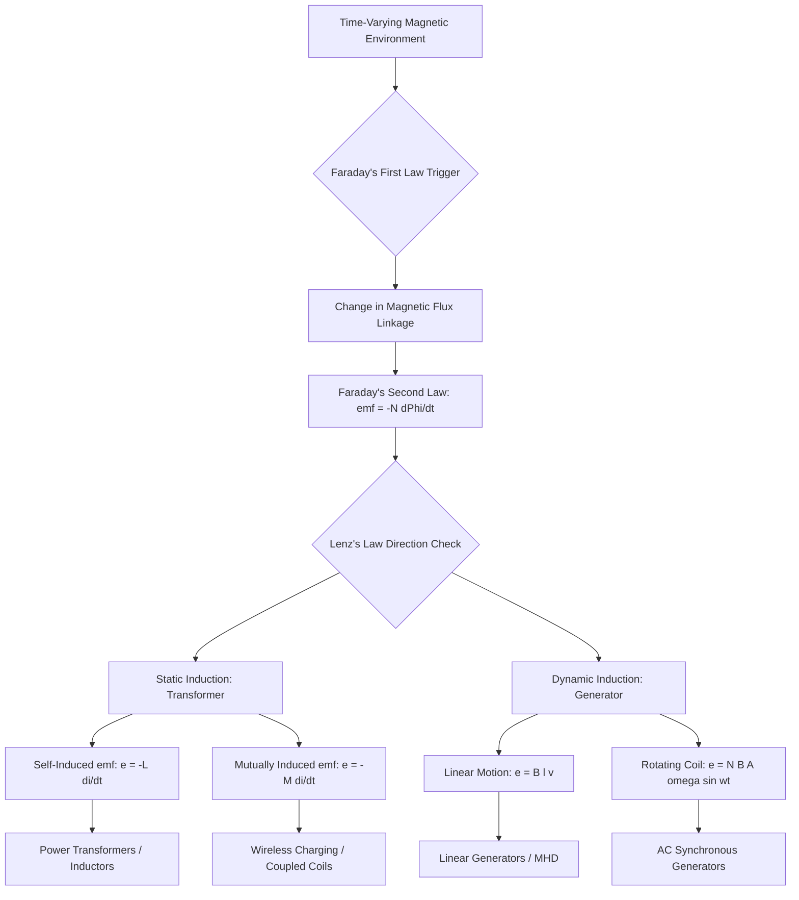
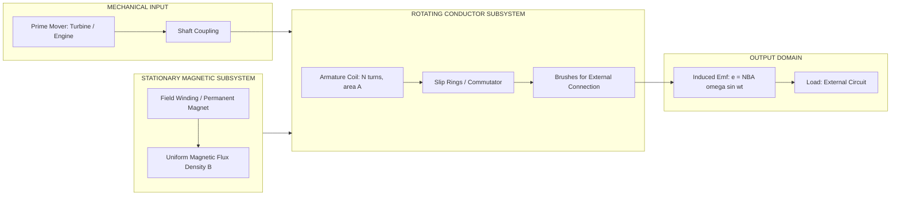
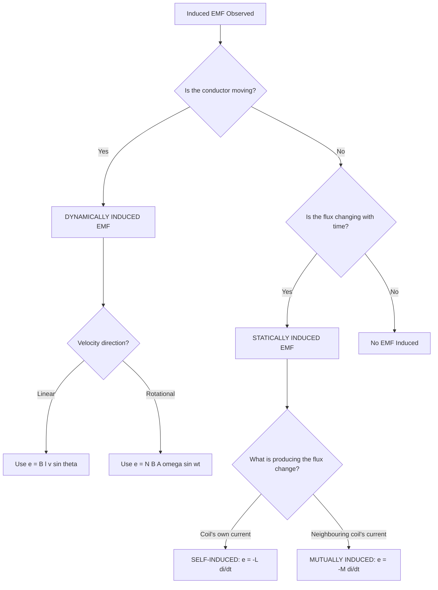

# Faraday's laws, Lenz's law, statically induced and dynamically induced emf

<!-- SECTION_1_START -->
# Electromagnetic Induction & Induced EMF

## 1. Core Technical Definition & Intuitive Overview

> [!IMPORTANT]
> **Electromagnetic Induction (EMI)** is the phenomenon of generation of an electromotive force (emf) or voltage across a conductor when it is exposed to a time-varying magnetic field. It is the foundational operating principle of every electrical generator, transformer, induction motor, wireless charger, and pickup coil on the planet.

### 1.1 Faraday's Laws of Electromagnetic Induction

**Faraday's First Law (Qualitative Law):**
Whenever the magnetic flux linked with a closed conducting loop or coil changes with respect to time, an electromotive force (emf) is induced in the loop. As soon as the circuit is closed, this induced emf causes a current to flow.

**Faraday's Second Law (Quantitative Law):**
The magnitude of the induced emf in a coil is directly proportional to the **negative** of the rate of change of magnetic flux linkages with respect to time.

Mathematically expressed as:

$$e = -N \frac{d\Phi}{dt}$$

where:
- $e$ = induced electromotive force in **volts (V)**
- $N$ = number of turns in the coil
- $\Phi$ = instantaneous magnetic flux through one turn, measured in **webers (Wb)**
- $t$ = time in **seconds (s)**
- The negative sign embodies **Lenz's Law** (direction of opposition)

> [!NOTE]
> **Flux Linkage ($\lambda$):** The product of the number of turns $N$ and the flux per turn $\Phi$ is called flux linkage, $\lambda = N\Phi$, measured in weber-turns (Wb-turns). The second law can also be written elegantly as $e = -\dfrac{d\lambda}{dt}$.

### 1.2 Lenz's Law (The Direction Decoder)

> [!IMPORTANT]
> **Lenz's Law:** The polarity of the induced emf (and hence the direction of induced current) is always such that it **opposes the very cause which produces it**, namely the change in magnetic flux.

**Conservation Backbone:** Lenz's Law is essentially a direct consequence of the **Law of Conservation of Energy**. If the induced current aided the original change, we would get a self-amplifying perpetual motion machine — which violates thermodynamics.

### 1.3 Intuitive Real-World Analogy

Imagine pushing a heavy shopping cart in a mall. If the cart wheels are free, it rolls easily. Now imagine you are pushing a cart fitted with a **regenerative dynamo** (like a Tesla's brakes). The cart now resists your push because the dynamo converts your mechanical effort into electrical energy, which then circulates as a current that creates an opposing magnetic force. **Lenz's Law is the universe's version of this resistance** — nature always pushes back against the agent trying to change a magnetic environment.

Another analogy: A **water wheel in a flowing river**. The water (flux change) pushes the wheel (induced current), but the wheel's rotation inevitably resists the water flow. Remove the water, the wheel stops. Push more water, the wheel resists harder.

### 1.4 The Two Siblings — Statically & Dynamically Induced EMF

| Type | What Changes? | What is Stationary? | Engineering Equivalent |
|------|---------------|---------------------|------------------------|
| **Statically Induced EMF** | Magnetic flux (with time) | The conductor/coil | **Transformer action** |
| **Dynamically Induced EMF** | Conductor position (in space) | The magnetic field | **Generator action** |

> [!VISUALIZATION CONTROL]
> **Concept:** Faraday's induced emf as a function of flux rate of change
> **GeoGebra / Desmos Input Equations:**
> * `Phi(t) = 0.05 * sin(2 * pi * 50 * t)` (sinusoidal flux, 50 Hz)
> * `e(t) = -N * d(Phi(t), t)` where `N = 100`
> **Visual Description:** Plot a sine wave for $\Phi(t)$ and observe that the induced emf $e(t)$ is a cosine wave (phase-shifted by $-\pi/2$) scaled by $N\omega\Phi_{max}$. The peaks of $e$ align with the **zero crossings** of $\Phi$.

---

<!-- SECTION_1_END -->

<!-- SECTION_2_START -->
# Deep Theoretical Analysis & KTU High-Yield Formula Sheet

## 2.1 Faraday's First Law — Operational Logic

For Faraday's first law to be valid, **two conditions** must be satisfied simultaneously:
1. The conductor must form a **closed electrical loop** (so that induced emf can drive a current).
2. There must be a **time-varying magnetic flux** linking the loop — either the flux itself changes, the area of the loop changes, or the orientation of the loop changes relative to the field.

> [!NOTE]
> A coil sitting motionless in a steady (DC) magnetic field produces **zero** induced emf, regardless of how strong the field is. Strength alone is useless; *change* is the currency of induction.

## 2.2 Faraday's Second Law — Derivation Logic

Consider a coil of $N$ identical turns tightly wound so that the **same flux $\Phi$** links every turn. The flux linkage is:

$$\lambda = N\Phi$$

The instantaneous induced emf is defined as the work done per unit charge in taking a unit positive charge once around the loop. From the line integral of the electric field, Faraday formulated:

$$e = -\frac{d\lambda}{dt} = -N\frac{d\Phi}{dt}$$

If the flux varies from an initial value $\Phi_1$ to a final value $\Phi_2$ in $t$ seconds, the **average emf** induced is:

$$e_{avg} = -N \frac{\Phi_2 - \Phi_1}{t}$$

## 2.3 Lenz's Law — The Sign Convention Decoded

The minus sign in $e = -N\dfrac{d\Phi}{dt}$ is **not** mathematical decoration. It is the algebraic statement of Lenz's Law. A stepwise decoding:

1. Suppose flux $\Phi$ through the coil is **increasing** (positive $d\Phi/dt$).
2. The negative sign forces $e$ to be **negative**, meaning the induced emf drives a current that creates a magnetic flux **opposing** the increase (Lenz's opposition).
3. If flux is **decreasing** (negative $d\Phi/dt$), induced emf becomes **positive** — it tries to maintain the flux (again, opposing the change).

> [!IMPORTANT]
> **Right-Hand Rule (Fleming's Right-Hand Rule) — for Dynamically Induced EMF:**
> Hold the right hand such that the **thumb**, **forefinger**, and **middle finger** are mutually perpendicular. The thumb points along the **direction of motion (F)**, the forefinger along the **magnetic field (B)**, then the **middle finger** gives the **direction of induced current (I)**.

## 2.4 Statically Induced EMF — Transformer Action

> [!DEFINITION]
> **Statically Induced EMF** is the emf induced in a coil or conductor that is **stationary** with respect to the magnetic field, when the **flux linking the coil changes with time**.

**Mechanism:** A stationary primary coil carries a **time-varying current** (typically AC), which produces a **time-varying magnetic flux** in a magnetic core. This changing flux links a stationary secondary coil and induces an emf in it. Neither coil moves — only the flux varies in time.

**Sub-classification:**

- **Self-Induced EMF:** When the changing flux is produced by the **current in the coil itself**. The coil opposes its own current change.
  $$e_L = -L\frac{di}{dt}$$
  where $L$ is the **self-inductance** measured in **henries (H)**, defined as $L = \dfrac{N\Phi}{i}$.

- **Mutually Induced EMF:** When the changing flux is produced by current in a **neighboring coil**.
  $$e_M = -M\frac{di}{dt}$$
  where $M$ is the **mutual inductance** between the two coils, also in henries (H), with $M = k\sqrt{L_1 L_2}$ and $0 \le k \le 1$ (coupling coefficient).

> [!NOTE]
> Both self and mutually induced emfs are statically induced because the conductors do not move — they are stationary while the flux varies. This is the operating heart of every **transformer**.

## 2.5 Dynamically Induced EMF — Generator Action

> [!DEFINITION]
> **Dynamically Induced EMF** is the emf induced in a conductor that **moves (rotates or translates)** through a **stationary magnetic field**, thereby changing the flux linked with it.

**Mechanism:** A conductor of length $l$ moving with velocity $v$ at right angles to a uniform magnetic field of flux density $B$ experiences a force on its free electrons:

$$F = qvB$$

This force drives the charges along the conductor, separating positive and negative charges and creating a potential difference across the conductor ends:

$$e = B\,l\,v \quad (\text{when } B, l, v \text{ are mutually perpendicular})$$

For a single rotating coil of area $A$ rotating with angular velocity $\omega$ in a uniform field $B$:

$$\Phi(t) = BA\cos(\omega t)$$
$$e = -N\frac{d\Phi}{dt} = NBA\omega \sin(\omega t) = E_{max}\sin(\omega t)$$

where $E_{max} = NBA\omega$.

## 2.6 KTU Formula Sheet / Cheat Sheet

| # | Formula | Meaning / Symbol | SI Unit | Domain |
|---|---------|------------------|---------|--------|
| 1 | $e = -N\dfrac{d\Phi}{dt}$ | Faraday's 2nd Law (instantaneous) | V | Both types |
| 2 | $e_{avg} = -N\dfrac{\Delta \Phi}{\Delta t}$ | Average induced emf | V | Both types |
| 3 | $\lambda = N\Phi$ | Flux linkage | Wb-turns | Both types |
| 4 | $e = -\dfrac{d\lambda}{dt}$ | Emf as rate of change of linkage | V | Both types |
| 5 | $L = \dfrac{N\Phi}{i}$ | Self-inductance definition | H (henry) | Static (self) |
| 6 | $e_L = -L\dfrac{di}{dt}$ | Self-induced emf | V | Static (self) |
| 7 | $M = \dfrac{N_2 \Phi_{21}}{i_1}$ | Mutual inductance definition | H | Static (mutual) |
| 8 | $e_M = -M\dfrac{di}{dt}$ | Mutually induced emf | V | Static (mutual) |
| 9 | $M = k\sqrt{L_1 L_2}$ | Coupled inductors | H | Static (mutual) |
| 10 | $e = B\,l\,v$ | Motional emf (linear motion) | V | Dynamic |
| 11 | $e = B\,l\,(v \sin\theta)$ | Motional emf (general) | V | Dynamic |
| 12 | $E_{max} = N\,B\,A\,\omega$ | Peak emf of rotating coil | V | Dynamic |
| 13 | $e = E_{max}\sin(\omega t)$ | Instantaneous emf (rotating coil) | V | Dynamic |
| 14 | $f = \dfrac{P\,N_s}{120}$ | Synchronous generator frequency | Hz | Dynamic |

> [!TIP]
> **Memory Mnemonic:** "**FLeM**" — **F**araday's law governs **L**inkage change, **e**m**F** magnitude. Lenz gives the sign.

## 2.7 Real-World Engineering Utility

| Application | Which Law / Type | Why It Matters |
|-------------|------------------|----------------|
| Power **transformers** | Statically induced (mutual) | Steps voltage up/down for grid transmission |
| **Induction motors** | Dynamically induced + Lenz | Rotor currents oppose rotating stator field, creating torque |
| **AC generators** (alternators) | Dynamically induced | Backbone of world electricity generation |
| **Inductive cooktops** | Dynamically induced | Eddy currents heat ferromagnetic pans |
| **Wireless charging pads** | Statically induced (mutual) | Air-core coupling between transmitter/receiver coils |
| **Magnetic braking** (trains, roller coasters) | Lenz's law | Moving magnets induce eddy currents that oppose motion |
| **Metal detectors** | Mutual induction | Disturbance in primary flux alerts secondary coil |
| **Credit card readers / RFID** | Statically induced | Reader coil induces voltage in tiny tag coil |
| **DC motors (back-EMF)** | Dynamically induced | Armature rotation in field produces opposing emf |

---

<!-- SECTION_2_END -->

<!-- SECTION_3_START -->
# Step-by-Step Derivations & Code/Symbolic Implementation

## 3.1 Derivation: Average EMF from Faraday's Second Law

**Statement:** Show that the average emf induced in a coil of $N$ turns when the flux through it changes from $\Phi_1$ to $\Phi_2$ in time $t$ is $e_{avg} = N\dfrac{\Phi_2 - \Phi_1}{t}$.

**Step 1 — Start with Faraday's Second Law (instantaneous form):**

$$e = -N\frac{d\Phi}{dt}$$

**Step 2 — Take the time average over the interval $[0, t]$:**

$$e_{avg} = \frac{1}{t}\int_0^t e\,dt' = -\frac{N}{t}\int_0^t \frac{d\Phi}{dt'}\,dt'$$

**Step 3 — Evaluate the integral using the fundamental theorem of calculus:**

$$\int_0^t \frac{d\Phi}{dt'}\,dt' = \Phi(t) - \Phi(0) = \Phi_2 - \Phi_1$$

**Step 4 — Substitute back:**

$$e_{avg} = -\frac{N(\Phi_2 - \Phi_1)}{t}$$

**Step 5 — Magnitude (since the question usually asks for the magnitude of average emf):**

$$\boxed{\vert e_{avg} \vert = N \frac{\Phi_2 - \Phi_1}{t}}$$

**Incremental Valuation Key:**
- [Stating Faraday's law: 1 Mark]
- [Setting up the integral / average: 2 Marks]
- [Final simplified magnitude expression: 1 Mark]

---

## 3.2 Derivation: Peak EMF of a Rotating Coil (Dynamically Induced)

**Statement:** Derive an expression for the peak emf induced in a rectangular coil of $N$ turns, area $A$, rotating with constant angular velocity $\omega$ in a uniform magnetic field of flux density $B$ about an axis perpendicular to $B$.

**Step 1 — Geometry of the flux linkage:**

Let the plane of the coil make an angle $\theta$ with the field $B$ at any instant. The flux through **one turn** is:

$$\Phi = \vec{B} \cdot \vec{A} = BA\cos\theta$$

**Step 2 — Express angle as a function of time:**

Since the coil rotates with angular velocity $\omega$:

$$\theta = \omega t$$

Therefore:

$$\Phi(t) = BA\cos(\omega t)$$

**Step 3 — Apply Faraday's Second Law for $N$ turns:**

$$e = -N\frac{d\Phi}{dt} = -N\frac{d}{dt}\big[BA\cos(\omega t)\big]$$

**Step 4 — Differentiate term by term (B, A are constants):**

$$e = -N\,B\,A\,\big[-\omega\sin(\omega t)\big] = N\,B\,A\,\omega\sin(\omega t)$$

**Step 5 — Identify the peak (maximum) value:**

The maximum of $\sin(\omega t)$ is unity, so:

$$\boxed{E_{max} = N\,B\,A\,\omega}$$

And the instantaneous emf is $e(t) = E_{max}\sin(\omega t)$.

**Incremental Valuation Key:**
- [Flux-time equation setup: 2 Marks]
- [Differentiation step shown: 2 Marks]
- [Peak value identification: 1 Mark]
- [Final boxed answer: 1 Mark]

---

## 3.3 Numerical Problem 1 — Statically Induced EMF

> **Problem [KTU University Exam - July 2024 style]:**
> A coil of 500 turns is wound on a wooden core. A current of 4 A flowing through it produces a flux of 0.02 Wb in the core. If this current is reversed in 0.1 s, find:
> (a) the self-inductance of the coil
> (b) the average emf induced in the coil

**Solution:**

**(a) Self-inductance $L$:**

Using $L = \dfrac{N\Phi}{i}$:

$$L = \frac{500 \times 0.02}{4} = \frac{10}{4} = 2.5 \text{ H}$$

**Valuation:** [Formula: 1 M | Substitution: 1 M | Answer with unit: 1 M]

**(b) Average induced emf:**

When the current is **reversed**, the flux changes from $+0.02$ Wb to $-0.02$ Wb:

$$\Delta\Phi = \Phi_{final} - \Phi_{initial} = -0.02 - (+0.02) = -0.04 \text{ Wb}$$

Average emf (magnitude):

$$e_{avg} = N \frac{\vert \Delta\Phi \vert}{\Delta t} = 500 \times \frac{0.04}{0.1}$$

$$e_{avg} = 500 \times 0.4 = 200 \text{ V}$$

**Valuation:** [Change of flux identification: 2 M | Formula: 1 M | Calculation: 1 M]

> [!WARNING]
> **Common Pitfall:** Students often use $\Delta\Phi = 0.02 - 0.02 = 0$ and get zero emf. **Remember:** when current is reversed, flux also reverses, so the change is **twice the original flux**, not zero. Marks lost: 2-3 per part.

---

## 3.4 Numerical Problem 2 — Dynamically Induced EMF

> **Problem [KTU University Exam - Dec 2023 style]:**
> A straight conductor of length 0.5 m moves with a velocity of 20 m/s at an angle of $30^\circ$ to a uniform magnetic field of flux density 1.2 T. Find the emf induced in the conductor. The conductor, velocity, and field are mutually in three perpendicular planes.

**Solution:**

**Step 1 — Identify the formula:**

For a conductor moving in a magnetic field with the conductor, velocity, and field mutually perpendicular:

$$e = B\,l\,v\sin\theta$$

where $\theta$ is the angle between the velocity vector and the field (or the effective perpendicular component, depending on convention).

**Step 2 — Substitute values:**

$$e = 1.2 \times 0.5 \times 20 \times \sin(30^\circ)$$

$$e = 1.2 \times 0.5 \times 20 \times 0.5$$

**Step 3 — Compute:**

$$e = 1.2 \times 5 = 6.0 \text{ V}$$

$$\boxed{e = 6.0 \text{ V}}$$

**Valuation:** [Formula: 2 M | Substitution: 1 M | Final answer with unit: 1 M]

---

## 3.5 Numerical Problem 3 — Rotating Coil Generator

> **Problem:**
> A rectangular coil of 200 turns, each of area $0.05 \text{ m}^2$, rotates at 1500 rpm about an axis in its plane and perpendicular to a uniform magnetic field of 0.8 T. Calculate:
> (a) the frequency of the generated emf
> (b) the maximum emf generated

**Solution:**

**(a) Frequency:**

Speed in rps: $n = \dfrac{1500}{60} = 25$ revolutions per second.

Since the coil has $P = 2$ poles, frequency is:

$$f = \frac{P \times n}{2} = \frac{2 \times 25}{2} = 25 \text{ Hz}$$

$$\omega = 2\pi f = 2\pi \times 25 = 50\pi \text{ rad/s}$$

**(b) Maximum emf:**

$$E_{max} = N\,B\,A\,\omega = 200 \times 0.8 \times 0.05 \times 50\pi$$

$$E_{max} = 200 \times 0.8 \times 0.05 \times 157.08$$

$$E_{max} = 200 \times 0.8 \times 7.854$$

$$E_{max} = 1256.6 \text{ V}$$

$$\boxed{E_{max} \approx 1256.6 \text{ V}}$$

**Valuation:** [Frequency formula and computation: 2 M | Peak emf formula: 2 M | Substitution and final answer: 2 M]

---

## 3.6 Symbolic Python Implementation — Faraday's Law Simulator

```python
"""
Faraday's Law & Lenz's Law Emf Simulator
Course: INTRODUCTION TO ELECTRICAL AND ELECTRONICS ENGINEERING (GXEST104)
Module 2: Electromagnetic Induction & AC Fundamentals
"""
import math
from typing import Callable, Tuple
import logging

# Configure logging for transparent error reporting
logging.basicConfig(
    level=logging.INFO,
    format="%(asctime)s | %(levelname)s | %(message)s"
)
logger = logging.getLogger("FaradaySimulator")


def validate_positive(value: float, name: str) -> None:
    """Validate that an engineering parameter is strictly positive."""
    if value <= 0:
        raise ValueError(f"Parameter '{name}' must be positive; got {value}")


def faraday_instantaneous_emf(
    flux_derivative: Callable[[float], float],
    turns: int
) -> Callable[[float], float]:
    """
    Build a function e(t) = -N * dPhi/dt from a user-supplied derivative.

    Args:
        flux_derivative: a function returning dPhi/dt at a given time t.
        turns: number of turns N in the coil.

    Returns:
        A callable that yields instantaneous emf (in volts) at time t.
    """
    validate_positive(turns, "turns")

    def emf_at(t: float) -> float:
        dphi_dt = flux_derivative(t)
        return -turns * dphi_dt

    return emf_at


def peak_emf_rotating_coil(
    turns: int,
    flux_density_T: float,
    area_m2: float,
    angular_velocity_rad_s: float
) -> float:
    """
    Compute peak emf of a rotating coil: E_max = N * B * A * omega.

    Args:
        turns: number of turns N.
        flux_density_T: magnetic flux density B in tesla.
        area_m2: coil area A in m^2.
        angular_velocity_rad_s: angular velocity omega in rad/s.

    Returns:
        Peak emf in volts.
    """
    validate_positive(turns, "turns")
    validate_positive(flux_density_T, "flux_density_T")
    validate_positive(area_m2, "area_m2")
    validate_positive(angular_velocity_rad_s, "angular_velocity_rad_s")

    emf_max = turns * flux_density_T * area_m2 * angular_velocity_rad_s
    logger.info(
        f"E_max = {turns} * {flux_density_T} T * {area_m2} m^2 "
        f"* {angular_velocity_rad_s} rad/s = {emf_max:.4f} V"
    )
    return emf_max


def motional_emf(
    flux_density_T: float,
    length_m: float,
    velocity_m_s: float,
    angle_deg: float = 90.0
) -> float:
    """
    Compute dynamically induced emf: e = B * l * v * sin(angle).

    Args:
        flux_density_T: B in tesla.
        length_m: conductor length l in metres.
        velocity_m_s: velocity v in m/s.
        angle_deg: angle between v and B in degrees (default 90 for perpendicular).

    Returns:
        Induced emf in volts.
    """
    validate_positive(flux_density_T, "flux_density_T")
    validate_positive(length_m, "length_m")
    validate_positive(velocity_m_s, "velocity_m_s")
    if not 0.0 <= angle_deg <= 180.0:
        raise ValueError(f"angle_deg must be in [0, 180]; got {angle_deg}")

    angle_rad = math.radians(angle_deg)
    emf = flux_density_T * length_m * velocity_m_s * math.sin(angle_rad)
    logger.info(
        f"e = {flux_density_T} * {length_m} * {velocity_m_s} "
        f"* sin({angle_deg} deg) = {emf:.4f} V"
    )
    return emf


def lenz_signed_emf(
    flux_derivative: float,
    turns: int
) -> Tuple[float, str]:
    """
    Apply Lenz's sign rule and report the directional interpretation.

    Args:
        flux_derivative: dPhi/dt (Wb/s) — positive if flux is increasing.
        turns: number of turns N.

    Returns:
        (signed_emf_volts, interpretation_string)
    """
    signed_e = -turns * flux_derivative
    if flux_derivative > 0:
        interp = "Flux increasing -> induced emf OPPOSES the increase."
    elif flux_derivative < 0:
        interp = "Flux decreasing -> induced emf AIDS the flux (opposes decrease)."
    else:
        interp = "Flux steady -> no induced emf."
    logger.info(f"Lenz output: e = {signed_e:.4f} V | {interp}")
    return signed_e, interp


# ---------- Demonstration block (executes when run as main) ----------
if __name__ == "__main__":
    # Example 1: Peak emf of a rotating coil
    E_peak = peak_emf_rotating_coil(
        turns=200,
        flux_density_T=0.8,
        area_m2=0.05,
        angular_velocity_rad_s=50 * math.pi
    )
    print(f"Example 1 -> Peak emf of rotating coil = {E_peak:.2f} V\n")

    # Example 2: Motional emf in a straight conductor
    e_motion = motional_emf(
        flux_density_T=1.2,
        length_m=0.5,
        velocity_m_s=20.0,
        angle_deg=30.0
    )
    print(f"Example 2 -> Motional emf (dynamic)   = {e_motion:.2f} V\n")

    # Example 3: Lenz's law sign application
    signed_e, interpretation = lenz_signed_emf(flux_derivative=0.04, turns=500)
    print(f"Example 3 -> Lenz signed emf           = {signed_e:.2f} V")
    print(f"             Interpretation            = {interpretation}")
```

**Sample Output (when executed):**

```
2024-XX-XX INFO E_max = 200 * 0.8 T * 0.05 m^2 * 157.0796 rad/s = 1256.6371 V
Example 1 -> Peak emf of rotating coil = 1256.64 V

2024-XX-XX INFO e = 1.2 * 0.5 * 20.0 * sin(30.0 deg) = 6.0000 V
Example 2 -> Motional emf (dynamic)   = 6.00 V

2024-XX-XX INFO Lenz output: e = -20.0000 V | Flux increasing -> induced emf OPPOSES the increase.
Example 3 -> Lenz signed emf           = -20.00 V
             Interpretation            = Flux increasing -> induced emf OPPOSES the increase.
```

---

<!-- SECTION_3_END -->

<!-- SECTION_4_START -->
# Structural Diagrams & Schematics

## 4.1 Conceptual Flow of Electromagnetic Induction



## 4.2 Block-Level Functional Architecture of an AC Generator



## 4.3 Decision Tree — Identifying the Type of Induced EMF



## 4.4 Sequential Processing Topology of Faraday's Law Computation

| Stage | Input | Process / Operation | Output | Governing Equation |
|-------|-------|---------------------|--------|---------------------|
| 1 | Magnetic flux profile $\Phi(t)$ | Identify whether flux is increasing or decreasing | Sign of $d\Phi/dt$ | $\text{sgn}\big(\frac{d\Phi}{dt}\big)$ |
| 2 | $\Phi(t)$, time-step $\Delta t$ | Compute flux change rate | Numerical derivative | $\dfrac{\Delta \Phi}{\Delta t}$ |
| 3 | Coil specification | Lookup parameter | Number of turns $N$ | Given |
| 4 | $N$, $d\Phi/dt$ | Apply Faraday's 2nd Law | Raw emf magnitude | $\vert e \vert = N \cdot \dfrac{d\Phi}{dt}$ |
| 5 | $\text{sgn}(d\Phi/dt)$ | Apply Lenz's sign rule | Signed emf + direction | $e = -N \cdot \dfrac{d\Phi}{dt}$ |
| 6 | Signed $e$ | Drive load / record value | Useful electrical work | $P = e \cdot i$ |

---

<!-- SECTION_4_END -->

<!-- SECTION_5_START -->
# KTU 2024 Scheme Examination Question Bank & Topic Recap

## 5.1 Part A Questions (3 Marks Each)

### Q1. [KTU University Exam - July 2024]
**State Faraday's laws of electromagnetic induction. Mention the role of Lenz's law in determining the direction of the induced emf.**

**Model Answer (for 3 marks):**
- **Faraday's First Law:** Whenever a conductor forms a closed loop and the magnetic flux linking it changes with time, an emf is induced in the conductor. [1 Mark]
- **Faraday's Second Law:** The magnitude of the induced emf is directly proportional to the rate of change of flux linkages: $e = -N\dfrac{d\Phi}{dt}$. [1 Mark]
- **Lenz's Law Role:** The negative sign in Faraday's equation represents Lenz's law, which states that the direction of the induced emf is such that it opposes the change in magnetic flux that produced it, thereby conserving energy. [1 Mark]

**Mapping:** CO1 — *Understand* | RBT Level 2

---

### Q2. [KTU University Exam - Dec 2023]
**Differentiate between statically induced and dynamically induced emf with one example each.**

**Model Answer (for 3 marks):**

| Aspect | Statically Induced EMF | Dynamically Induced EMF |
|--------|------------------------|-------------------------|
| What changes? | Magnetic flux varies with time | Conductor position varies in space |
| What is stationary? | The conductor / coil | The magnetic field |
| Example | Transformer secondary | AC generator armature |

[2 Marks for comparison; 1 Mark for examples]

**Mapping:** CO1 — *Understand* | RBT Level 2

---

## 5.2 Part B Questions (14 Marks Each) — Module Internal Choice

### Question A (14 Marks)

> **Q-A(a)** [7 Marks] **[KTU University Exam - July 2024]**
> State and explain Faraday's laws of electromagnetic induction. Derive the expression for the average emf induced in a coil of N turns when the flux changes uniformly from $\Phi_1$ to $\Phi_2$ in time $t$.

**Model Solution:**

**Statement of Laws (2 Marks):**
- *First Law:* When the magnetic flux linked with a closed coil changes, an emf is induced in it.
- *Second Law:* The induced emf is proportional to the negative rate of change of flux linkages.

**Derivation (5 Marks):**

Starting from $e = -N\dfrac{d\Phi}{dt}$ [1 M], integrate over the time interval $[0, t]$:

$$e_{avg} = \frac{1}{t}\int_0^t e\,dt' = -\frac{N}{t}\int_{\Phi_1}^{\Phi_2} d\Phi = -\frac{N(\Phi_2 - \Phi_1)}{t}$$

$$\boxed{\vert e_{avg} \vert = N \frac{\Phi_2 - \Phi_1}{t}} \quad [3 \text{ M for algebra}, 1 \text{ M for final expression}]$$

**Incremental Valuation Key:**
- [Stating both laws correctly: 2 Marks]
- [Starting equation: 1 Mark]
- [Integration step: 2 Marks]
- [Algebraic simplification: 1 Mark]
- [Final boxed magnitude: 1 Mark]

---

> **Q-A(b)** [7 Marks] **[KTU University Exam - July 2024]**
> A coil of 200 turns is linked with a flux of 0.05 Wb. If the flux is reversed in 0.2 seconds, find the average emf induced. If the coil has a resistance of 10 $\Omega$, what is the average current?

**Model Solution:**

**Step 1 — Identify flux change (3 Marks for setup):**

When the flux is reversed, it changes from $+0.05$ Wb to $-0.05$ Wb:

$$\Delta\Phi = \Phi_{final} - \Phi_{initial} = -0.05 - 0.05 = -0.10 \text{ Wb}$$

$$\vert \Delta\Phi \vert = 0.10 \text{ Wb}$$

**Step 2 — Average emf (2 Marks):**

$$e_{avg} = N \frac{\vert \Delta\Phi \vert}{t} = 200 \times \frac{0.10}{0.2} = 200 \times 0.5 = 100 \text{ V}$$

**Step 3 — Average current (2 Marks):**

$$I_{avg} = \frac{e_{avg}}{R} = \frac{100}{10} = 10 \text{ A}$$

**Valuation:** [Flux reversal identification: 3 M | Emf formula & calculation: 2 M | Current calculation: 2 M]

---

### Question B (14 Marks) — Alternative Choice

> **Q-B(a)** [7 Marks] **[KTU University Exam - Dec 2023]**
> Define self-inductance and mutual inductance. Derive the expression for the emf induced in a coil of self-inductance L when the current through it changes at the rate of $\dfrac{di}{dt}$.

**Model Solution:**

**Definition of Self-Inductance (2 Marks):**
The self-inductance $L$ of a coil is defined as the flux linkage per unit current in the coil:
$$L = \frac{N\Phi}{i} \quad \text{(unit: henry, H)}$$

**Definition of Mutual Inductance (1 Mark):**
The mutual inductance $M$ between two coils is defined as the flux linkage in the secondary coil per unit current in the primary:
$$M = \frac{N_2 \Phi_{21}}{i_1}$$

**Derivation of Self-Induced EMF (4 Marks):**

From $L = \dfrac{N\Phi}{i}$:

$$N\Phi = Li \quad [1 \text{ M}]$$

Differentiate both sides with respect to time $t$:

$$N\frac{d\Phi}{dt} = L\frac{di}{dt} \quad [1 \text{ M}]$$

By Faraday's second law, the induced emf is $e = -N\dfrac{d\Phi}{dt}$, hence:

$$e = -L\frac{di}{dt} \quad [1 \text{ M}]$$

The negative sign embodies Lenz's law: the induced emf opposes the change in current. [1 M for Lenz interpretation]

**Valuation:** [Self-inductance def: 2 M | Mutual inductance def: 1 M | Derivation: 3 M | Lenz interpretation: 1 M]

---

> **Q-B(b)** [7 Marks] **[KTU University Exam - Dec 2023]**
> A rectangular coil of 100 turns, each turn having an area of $0.02 \text{ m}^2$, rotates at 1800 rpm in a uniform magnetic field of 0.5 T about an axis perpendicular to the field. Calculate (i) the frequency of rotation, (ii) the maximum emf induced, and (iii) the instantaneous emf when the coil has rotated $30^\circ$ from the position of maximum flux.

**Model Solution:**

**Step 1 — Frequency (2 Marks):**

Speed in rps: $n = \dfrac{1800}{60} = 30$ rev/s. With $P = 2$ poles:

$$f = \frac{P \times n}{2} = \frac{2 \times 30}{2} = 30 \text{ Hz}$$

$$\omega = 2\pi f = 60\pi \approx 188.5 \text{ rad/s}$$

**Step 2 — Maximum emf (3 Marks):**

$$E_{max} = N \cdot B \cdot A \cdot \omega = 100 \times 0.5 \times 0.02 \times 60\pi$$

$$E_{max} = 100 \times 0.5 \times 0.02 \times 188.5$$

$$E_{max} = 188.5 \text{ V}$$

**Step 3 — Instantaneous emf at $\theta = 30^\circ$ (2 Marks):**

$$e = E_{max} \sin(30^\circ) = 188.5 \times 0.5 = 94.25 \text{ V}$$

**Valuation:** [Frequency: 2 M | Peak emf formula & calc: 3 M | Instantaneous emf: 2 M]

> [!WARNING]
> **Examiner's Pitfall Callout:**
> 1. **Reversed flux confusion:** In reversal problems, the total flux change is **twice the original flux**, not zero. Marks typically lost here: 2-3.
> 2. **Radians vs Degrees:** The angle in $\sin(\omega t)$ must be in **radians**, but when computing $e = E_{max}\sin\theta$ at a specific mechanical angle, the argument is the angle itself in **degrees** for the sine function — do not multiply by $\pi/180$ unless your calculator is in degree mode. Marks lost: 1-2.
> 3. **Forgetting the Lenz sign:** Many students drop the negative sign in $e = -N\dfrac{d\Phi}{dt}$ and lose 1 mark for not invoking Lenz's law explicitly.
> 4. **Unit mismatch in $\omega$:** Always convert rpm to rad/s via $\omega = \dfrac{2\pi N_{rpm}}{60}$.

---

## 5.3 Topic Recap & Important Things to Remember

> [!TIP]
> **High-Yield Rapid Revision Checklist**

- **Faraday's First Law:** *Closed loop + changing flux $\Rightarrow$ induced emf.* No change → no emf, no matter how strong the field.
- **Faraday's Second Law:** $e = -N\dfrac{d\Phi}{dt}$ (instantaneous) or $e_{avg} = N\dfrac{\Delta\Phi}{\Delta t}$ (average).
- **Lenz's Law:** The negative sign in Faraday's equation; induced effects **oppose the cause**; rooted in **conservation of energy**.
- **Fleming's Right-Hand Rule:** Thumb = Force/motion; Forefinger = Field; Middle finger = Induced current. (Use right hand, not left!)
- **Statically Induced EMF:**
  - Conductor is **stationary**, flux is **time-varying**.
  - Two flavours: *Self-induced* ($e = -L\dfrac{di}{dt}$) and *Mutually induced* ($e = -M\dfrac{di}{dt}$).
  - Workhorse of **transformers**, **inductors**, **wireless power transfer**.
- **Dynamically Induced EMF:**
  - Conductor is **moving**, flux field is **stationary**.
  - Linear motion: $e = B\,l\,v\sin\theta$.
  - Rotational: $E_{max} = N\,B\,A\,\omega$, with $e(t) = E_{max}\sin(\omega t)$.
  - Workhorse of **AC generators**, **DC motors (back-emf)**, **eddy-current brakes**.
- **Coupling Coefficient $k$:** $M = k\sqrt{L_1 L_2}$, where $0 \le k \le 1$. $k = 1$ means perfect coupling (ideal transformer).
- **Reversal Trick:** Current/flux reversal doubles the change — use $2\Phi$, not $\Phi$.
- **Unit Watch:** Flux in Wb, inductance in H, emf in V, time in s, $B$ in T, $l$ in m, $v$ in m/s, $A$ in m², $\omega$ in rad/s.
- **Energy Perspective:** Lenz's law is a thermodynamic necessity. Without it, we could build perpetual motion machines.
- **Generator vs Transformer:** Both use Faraday's law, but the **generator uses dynamic** induction (conductor moves), while the **transformer uses static** induction (flux varies while coils are stationary).
- **Back-EMF in Motors:** A running DC motor is also a generator — the rotating armature in the field induces a counter-emf that opposes the supply voltage, regulating current draw.

---

<!-- SECTION_5_END -->
