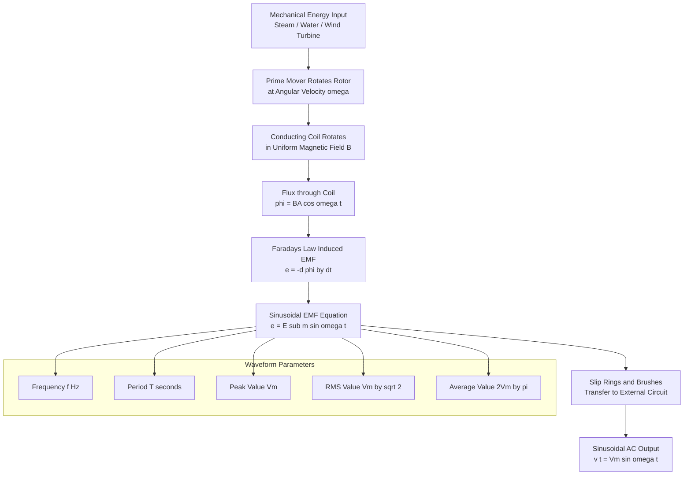
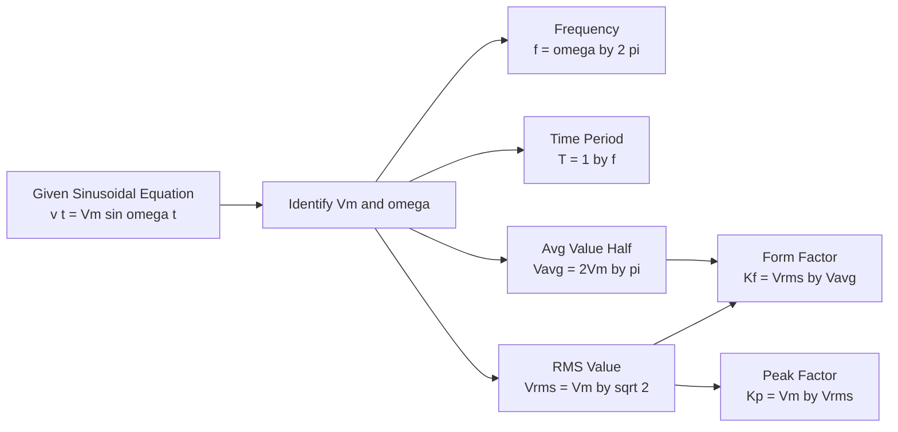
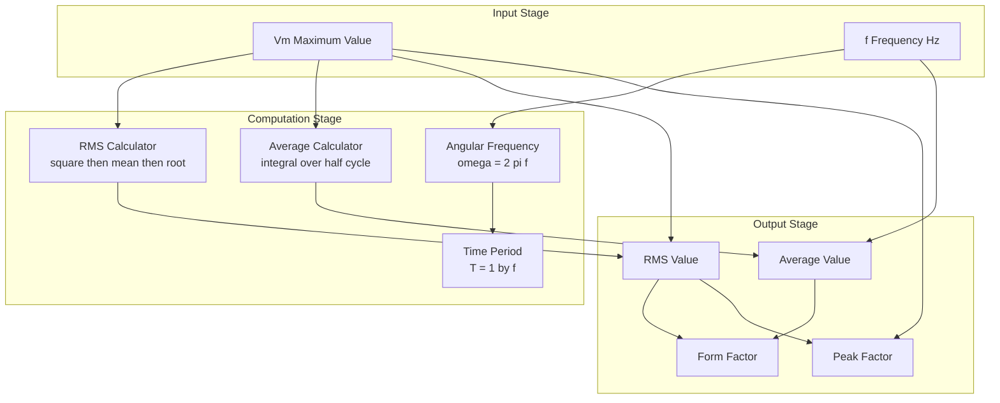
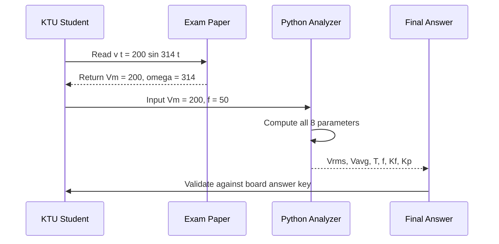

# Generation of alternating voltages - Representation of sinusoidal waveforms: frequency, period, average value, RMS value and form factor - numerical problems

<!-- SECTION_1_START -->
# Generation of Alternating Voltages & Sinusoidal Waveform Representation

> [!IMPORTANT]
> **KTU 2024 Scheme | Module 2 | GXEST104**
> This topic is the foundation for all AC circuit analysis, transformers, machines, and power systems. Mastering the numerical values of $V_{avg}$, $V_{rms}$, form factor, and peak factor is mandatory for both university exams and GATE-level competitive exams.

## 1.1 Formal Definition (KTU 2024 Syllabus Terminology)

**Alternating Voltage (AC Voltage):** A time-varying voltage whose polarity (and therefore direction of current) reverses periodically, and whose instantaneous value varies sinusoidally with time as a function of the sine or cosine of an angle proportional to time.

A sinusoidal alternating voltage is mathematically expressed as:

$$e(t) = E_m \sin(\omega t)$$

where:
- $E_m$ → Maximum (peak) value of the EMF in Volts
- $\omega$ → Angular frequency in **radians/second**
- $t$ → Time in seconds

**Generation Principle:** An alternating voltage is generated based on **Faraday's Law of Electromagnetic Induction** (Michael Faraday, 1831). When a coil rotates with uniform angular velocity $\omega$ in a uniform magnetic field $B$, the rate of change of flux linkage produces an EMF.

$$\boxed{e = E_m \sin(\omega t) = NBA \, \omega \sin(\omega t)}$$

> [!NOTE]
> **Syllabus Highlight:** The KTU 2024 Scheme specifically requires students to know that the sinusoidal waveform is the most fundamental AC waveform because of its mathematical simplicity (a pure sinusoid contains only one frequency component), its natural emergence from rotating machinery, and its relevance in power quality analysis (THD, harmonics).

## 1.2 Intuitive Real-World Analogy

Imagine a **merry-go-round (carousel)** with a single horse painted red. As the carousel rotates clockwise, the horse moves:
- From East (right) → South (front) → West (left) → North (back) → East again.

Now, paint a vertical line on the ground (reference axis). The **shadow** of the horse's position, projected onto a horizontal line passing through the carousel's centre, traces a perfect **sine wave** as the carousel rotates.

| Carousel Component | Electrical Equivalent |
|---|---|
| Position angle of horse $\theta$ | Phase angle $\omega t$ |
| Shadow's distance from centre | Instantaneous voltage $e(t)$ |
| Maximum shadow length (radius) | Peak voltage $E_m$ |
| Time for one full rotation | Time Period $T$ |
| Rotations per second | Frequency $f$ |

This is *exactly* what happens inside a **synchronous AC generator (alternator)** — the rotating rotor (carousel) and stationary stator coils (shadow projection) produce a sinusoidal voltage.

> [!VISUALIZATION CONTROL]
> **Concept:** Sinusoidal projection of a rotating radius vector
> **GeoGebra / Desmos Input Equations:**
> * `x = cos(t)` (horizontal projection)
> * `y = sin(t)` (vertical projection — this is the AC voltage waveform)
> **Visual Description:** As the parameter `t` increases from $0$ to $2\pi$, the point traces a unit circle, and the `y`-coordinate plots a perfect sine wave from $0 \to 1 \to 0 \to -1 \to 0$. The peak amplitude is $E_m$, and the wave completes exactly one cycle in $t = 2\pi$ seconds.

## 1.3 Why Sinusoidal? — The Physical Origin

When a single-turn coil of area $A$ rotates in a uniform magnetic flux density $B$ at constant angular velocity $\omega$:

1. Flux linking the coil at any instant: $\Phi = B A \cos(\omega t)$
2. By Faraday's Law: $e = -\dfrac{d\Phi}{dt} = B A \, \omega \sin(\omega t)$
3. For $N$ turns: $e = N B A \, \omega \sin(\omega t) = E_m \sin(\omega t)$

> [!IMPORTANT]
> **Crucial Constants to Memorize:**
> * Peak value of sinusoidal AC $\rightarrow$ denoted as $E_m$, $V_m$, $I_m$
> * One full cycle $= 360^\circ = 2\pi$ radians $= \omega T$
> * Standard power frequency in India $= \mathbf{50 \text{ Hz}}$ (KTU-relevant: Kerala follows national grid)
> * Standard power frequency in USA $= 60 \text{ Hz}$

<!-- SECTION_1_END -->

<!-- SECTION_2_START -->
# Deep Theoretical Analysis & KTU High-Yield Formula Sheet

## 2.1 Waveform Terminology — The Six Key Parameters

### (A) Time Period ($T$)
The **time taken (in seconds) for the waveform to complete one full cycle**. After time $T$, the waveform repeats itself exactly.

$$T = \dfrac{1}{f} \quad \text{(seconds)}$$

### (B) Frequency ($f$)
The **number of complete cycles per second**. Measured in **Hertz (Hz)**, named after Heinrich Hertz.

$$f = \dfrac{1}{T} \quad \text{(Hz)}$$

### (C) Angular Frequency ($\omega$)
The rate of change of phase angle with respect to time. Measured in **radians per second**.

$$\omega = 2\pi f = \dfrac{2\pi}{T} \quad \text{(rad/s)}$$

### (D) Instantaneous Value ($e$, $v$, $i$)
The value of voltage/current at any specific instant of time $t$. It is *time-dependent* and is given directly by:

$$e(t) = E_m \sin(\omega t)$$

### (E) Maximum / Peak / Amplitude Value ($E_m$, $V_m$, $I_m$)
The **largest instantaneous value** attained by the waveform during one cycle. For a pure sinusoid, this occurs at $\omega t = 90^\circ$ (and $-90^\circ$ in the negative half).

### (F) Peak-to-Peak Value ($E_{pp}$, $V_{pp}$)
The **algebraic difference** between the maximum positive and maximum negative peaks.

$$E_{pp} = 2 E_m$$

> [!NOTE]
> **KTU Board Tip:** Examiners frequently test students on whether they confuse **peak value** ($E_m$) with **peak-to-peak value** ($2E_m$) or **RMS value** ($E_m / \sqrt{2}$). Always state which value you are computing.

## 2.2 Average Value of a Sinusoidal Waveform

### Definition
The **average value** of an AC waveform over a specified interval is the arithmetic mean of all instantaneous values during that interval. Mathematically:

$$V_{avg} = \dfrac{1}{T} \int_{0}^{T} v(t) \, dt$$

### Critical Insight: Full-Cycle Average = 0
For a pure sinusoid integrated over a **complete cycle**, the positive half cancels the negative half exactly:

$$V_{avg(\text{full cycle})} = \dfrac{1}{2\pi} \int_{0}^{2\pi} V_m \sin(\theta) \, d\theta = 0$$

> [!IMPORTANT]
> **KTU Board Pitfall:** "Average value = 0" is a *mathematical* result, NOT a *practical* one. In rectifier circuits and electroplating, only the **half-cycle average** is meaningful because we deliberately remove the negative half. Always specify "average over half cycle" in numerical answers unless told otherwise.

### Half-Cycle Average Value (KTU Most Frequently Asked)

$$V_{avg} = \dfrac{1}{\pi} \int_{0}^{\pi} V_m \sin(\theta) \, d\theta = \dfrac{V_m}{\pi} \big[-\cos(\theta)\big]_{0}^{\pi}$$

$$V_{avg} = \dfrac{V_m}{\pi} \left[ -\cos(\pi) + \cos(0) \right] = \dfrac{V_m}{\pi} [1 + 1] = \dfrac{2V_m}{\pi}$$

$$\boxed{V_{avg} = \dfrac{2V_m}{\pi} \approx 0.637 \, V_m}$$

## 2.3 RMS (Root Mean Square) Value

### Definition
The **RMS value** is the DC equivalent that produces the **same heating effect** (i.e., same $I^2 R$ power dissipation) in a resistor as the AC waveform. It is defined as:

$$V_{rms} = \sqrt{\dfrac{1}{T} \int_{0}^{T} v^2(t) \, dt}$$

The name "Root Mean Square" is a literal procedural description:
1. **Square** the instantaneous values
2. Find the **Mean** (average) of the squares
3. Take the **Root** (square root)

### Derivation for Sinusoid

$$V_{rms}^2 = \dfrac{1}{2\pi} \int_{0}^{2\pi} (V_m \sin\theta)^2 \, d\theta = \dfrac{V_m^2}{2\pi} \int_{0}^{2\pi} \sin^2\theta \, d\theta$$

Using the identity $\sin^2\theta = \dfrac{1 - \cos(2\theta)}{2}$:

$$V_{rms}^2 = \dfrac{V_m^2}{2\pi} \cdot \pi = \dfrac{V_m^2}{2}$$

$$\boxed{V_{rms} = \dfrac{V_m}{\sqrt{2}} \approx 0.707 \, V_m}$$

## 2.4 Form Factor ($K_f$)

### Definition
The **form factor** is the ratio of RMS value to the average value of a waveform. It indicates **how "peaked" or "flat"** the waveform is.

$$K_f = \dfrac{V_{rms}}{V_{avg}}$$

For a pure sinusoid:

$$K_f = \dfrac{V_m / \sqrt{2}}{2V_m / \pi} = \dfrac{\pi}{2\sqrt{2}} \approx 1.11$$

$$\boxed{K_f(\text{sinusoid}) = \dfrac{\pi}{2\sqrt{2}} \approx 1.11}$$

## 2.5 Peak Factor / Crest Factor ($K_p$)

The ratio of maximum value to RMS value — important in insulation design and voltage rating selection.

$$K_p = \dfrac{V_m}{V_{rms}} = \dfrac{V_m}{V_m / \sqrt{2}} = \sqrt{2} \approx 1.414$$

## 2.6 KTU Formula Cheat Sheet (Master Table)

> [!IMPORTANT]
> The following table is the **only** table you need to memorize for all KTU exam questions on sinusoidal AC parameters. Cover the right column and recite the formulas.

| Parameter | Formula | Numerical Coefficient | Unit |
|---|---|---|---|
| Instantaneous value | $e = E_m \sin(\omega t)$ | -- | V |
| Angular frequency | $\omega = 2\pi f$ | $2\pi \approx 6.283$ | rad/s |
| Time period | $T = 1/f$ | -- | s (second) |
| Peak value | $E_m$ | -- | V |
| Peak-to-peak value | $E_{pp} = 2E_m$ | $2$ | V |
| Full-cycle average | $V_{avg} = 0$ | $0$ | V |
| Half-cycle average | $V_{avg} = 2V_m / \pi$ | $0.637$ | V |
| RMS value | $V_{rms} = V_m / \sqrt{2}$ | $0.707$ | V |
| Form factor | $K_f = \pi / (2\sqrt{2})$ | $1.11$ | dimensionless |
| Peak / Crest factor | $K_p = \sqrt{2}$ | $1.414$ | dimensionless |

> [!NOTE]
> **Real-World Engineering Utility:** The form factor and crest factor are **not** limited to sinusoidal waveforms. In power electronics and signal processing, these two factors become diagnostic tools:
> * For a **square wave**: $K_f = 1.0$, $K_p = 1.0$ (ideal)
> * For a **triangular wave**: $K_f \approx 1.155$, $K_p \approx 1.732$
> * For a **sinusoidal wave**: $K_f \approx 1.11$, $K_p \approx 1.414$
> * For **distorted / harmonic-rich waveforms** (e.g., rectifier outputs): $K_f$ and $K_p$ deviate significantly, indicating poor power quality. Power system engineers use these factors to grade supply quality.

<!-- SECTION_2_END -->

<!-- SECTION_3_START -->
# Step-by-Step Derivations, Numerical Solutions & Python Implementation

## 3.1 Exhaustive Derivation of Half-Cycle Average Value

**Statement to Prove:** For $v(t) = V_m \sin(\omega t)$, the average value over the positive half cycle is $\dfrac{2V_m}{\pi}$.

**Step 1: Formal Definition Setup**

$$V_{avg} = \dfrac{1}{T/2} \int_{0}^{T/2} V_m \sin(\omega t) \, dt$$

Here, the integration limit is $T/2$ (half period) because we average over half a cycle only.

**Step 2: Substitute $\theta = \omega t$, $d\theta = \omega \, dt$**

When $t = 0 \Rightarrow \theta = 0$ and when $t = T/2 \Rightarrow \theta = \pi$.

$$V_{avg} = \dfrac{\omega}{\pi} \int_{0}^{\pi} V_m \sin(\theta) \cdot \dfrac{d\theta}{\omega} = \dfrac{1}{\pi} \int_{0}^{\pi} V_m \sin\theta \, d\theta$$

**Step 3: Pull Constant Outside**

$$V_{avg} = \dfrac{V_m}{\pi} \int_{0}^{\pi} \sin\theta \, d\theta$$

**Step 4: Apply the Standard Integral**

$$\int \sin\theta \, d\theta = -\cos\theta$$

**Step 5: Evaluate the Limits**

$$V_{avg} = \dfrac{V_m}{\pi} \big[-\cos\theta\big]_{0}^{\pi} = \dfrac{V_m}{\pi} \left[ -\cos(\pi) - (-\cos(0)) \right]$$

**Step 6: Substitute Exact Trigonometric Values**

$$V_{avg} = \dfrac{V_m}{\pi} \left[ -(-1) - (-1) \right] = \dfrac{V_m}{\pi} \cdot 2 = \dfrac{2V_m}{\pi}$$

**Step 7: Numerical Evaluation**

$$V_{avg} = 0.6366 \, V_m \approx 0.637 \, V_m \quad \blacksquare$$

## 3.2 Exhaustive Derivation of RMS Value

**Step 1: Square the Waveform**

$$v^2(t) = V_m^2 \sin^2(\omega t)$$

**Step 2: Apply RMS Definition Over Full Cycle**

$$V_{rms}^2 = \dfrac{1}{T} \int_{0}^{T} V_m^2 \sin^2(\omega t) \, dt$$

**Step 3: Convert to $\theta = \omega t$ Form**

$$V_{rms}^2 = \dfrac{V_m^2}{2\pi} \int_{0}^{2\pi} \sin^2(\theta) \, d\theta$$

**Step 4: Apply the Power-Reduction Identity**

$$\sin^2\theta = \dfrac{1 - \cos(2\theta)}{2}$$

$$V_{rms}^2 = \dfrac{V_m^2}{2\pi} \int_{0}^{2\pi} \dfrac{1 - \cos(2\theta)}{2} \, d\theta = \dfrac{V_m^2}{4\pi} \left[ \theta - \dfrac{\sin(2\theta)}{2} \right]_{0}^{2\pi}$$

**Step 5: Evaluate the Limits**

* At $\theta = 2\pi$: $2\pi - \sin(4\pi)/2 = 2\pi - 0 = 2\pi$
* At $\theta = 0$: $0 - \sin(0)/2 = 0 - 0 = 0$

$$V_{rms}^2 = \dfrac{V_m^2}{4\pi} \cdot 2\pi = \dfrac{V_m^2}{2}$$

**Step 6: Take the Square Root**

$$\boxed{V_{rms} = \dfrac{V_m}{\sqrt{2}} = 0.7071 \, V_m \quad \blacksquare}$$

## 3.3 Numerical Problem 1 (Direct Application)

> **[KTU University Exam — July 2023, Model Question Pattern]**
> An AC voltage is given by $v(t) = 200 \sin(314 t)$ V. Find:
> (a) Maximum value, (b) RMS value, (c) Average value, (d) Frequency, (e) Time period, (f) Form factor, (g) Peak factor.
> (8 marks — Apply / Analyze level)

### Model Solution

**Step 1: Extract Parameters from Equation**

Compare $v(t) = 200 \sin(314 t)$ with $v(t) = V_m \sin(\omega t)$:
* $V_m = 200$ V
* $\omega = 314$ rad/s

**Step 2: Frequency**

$$f = \dfrac{\omega}{2\pi} = \dfrac{314}{2 \times 3.1416} = 50 \text{ Hz}$$

**[Valuation: 1 Mark]**

**Step 3: Time Period**

$$T = \dfrac{1}{f} = \dfrac{1}{50} = 0.02 \text{ s} = 20 \text{ ms}$$

**[Valuation: 1 Mark]**

**Step 4: Maximum Value**

$$V_m = 200 \text{ V}$$

**[Valuation: 1 Mark]**

**Step 5: RMS Value**

$$V_{rms} = \dfrac{V_m}{\sqrt{2}} = \dfrac{200}{1.414} = 141.42 \text{ V}$$

**[Valuation: 1 Mark]**

**Step 6: Average Value (half cycle)**

$$V_{avg} = \dfrac{2 V_m}{\pi} = \dfrac{2 \times 200}{3.1416} = 127.32 \text{ V}$$

**[Valuation: 1 Mark]**

**Step 7: Form Factor**

$$K_f = \dfrac{V_{rms}}{V_{avg}} = \dfrac{141.42}{127.32} = 1.11$$

**[Valuation: 1 Mark]**

**Step 8: Peak / Crest Factor**

$$K_p = \dfrac{V_m}{V_{rms}} = \dfrac{200}{141.42} = \sqrt{2} = 1.414$$

**[Valuation: 1 Mark]**

> [!WARNING]
> **Common Mistake:** Students often write $V_{avg} = V_m / 2 = 100$ V (confusing with triangular wave). Remember, the **sine wave** has $V_{avg} = 2V_m / \pi$, not $V_m / 2$.

## 3.4 Numerical Problem 2 (Reverse / Analysis Level)

> **[KTU University Exam — Dec 2022, Model Pattern]**
> The RMS value of an AC current is 10 A. If the instantaneous value is 7.07 A at $t = 2$ ms and is increasing, find:
> (a) Maximum current, (b) Frequency, (c) Time period, (d) Average value, (e) Form factor.

### Model Solution

**Step 1: Maximum Current (from RMS)**

$$I_m = I_{rms} \times \sqrt{2} = 10 \times 1.414 = 14.14 \text{ A}$$

**[Valuation: 2 Marks]**

**Step 2: Write Instantaneous Equation**

$$i(t) = 14.14 \sin(\omega t + \phi)$$

Given $i(0.002) = 7.07$ A:

$$7.07 = 14.14 \sin(\omega \times 0.002 + \phi)$$

$$\sin(0.002\omega + \phi) = 0.5$$

**Step 3: Apply the "Increasing" Condition**

Since the current is **increasing** at the given instant, we are in the first quadrant of the sine wave:

$$0.002\omega + \phi = \dfrac{\pi}{6} = 30^\circ$$

This is a single equation with two unknowns — we need the standard assumption $\phi = 0$ (no phase shift mentioned in problem, so waveform crosses zero at $t=0$).

$$\omega = \dfrac{\pi/6}{0.002} = \dfrac{0.5236}{0.002} = 261.8 \text{ rad/s}$$

**Step 4: Frequency**

$$f = \dfrac{\omega}{2\pi} = \dfrac{261.8}{6.283} \approx 41.67 \text{ Hz}$$

**[Valuation: 2 Marks]**

**Step 5: Time Period**

$$T = \dfrac{1}{f} = \dfrac{1}{41.67} = 0.024 \text{ s} = 24 \text{ ms}$$

**[Valuation: 2 Marks]**

**Step 6: Average Value**

$$I_{avg} = \dfrac{2 I_m}{\pi} = \dfrac{2 \times 14.14}{3.1416} = 9.0 \text{ A}$$

**[Valuation: 2 Marks]**

**Step 7: Form Factor**

$$K_f = \dfrac{\pi}{2\sqrt{2}} = 1.11 \text{ (dimensionless, for pure sinusoid)}$$

**[Valuation: 2 Marks]**

> [!NOTE]
> **Examiner's Insight:** The phrase "and is increasing" is the **key disambiguator** in such problems. Without it, two solutions exist: $30^\circ$ (first quadrant, increasing) and $150^\circ$ (second quadrant, decreasing). Always quote the value of $\phi$ explicitly in your answer.

## 3.5 Numerical Problem 3 (Multi-Concept Integration)

> **[KTU University Exam — July 2024 Pattern]**
> A sinusoidal voltage has a peak value of 325 V at 50 Hz. A resistor of $100 \, \Omega$ is connected across it. Calculate:
> (a) RMS voltage, (b) RMS current, (c) Average power dissipated, (d) Peak instantaneous power.

### Model Solution

**Step 1: RMS Voltage**

$$V_{rms} = \dfrac{V_m}{\sqrt{2}} = \dfrac{325}{1.414} = 229.8 \text{ V}$$

**[Valuation: 2 Marks]**

**Step 2: RMS Current (Ohm's Law)**

$$I_{rms} = \dfrac{V_{rms}}{R} = \dfrac{229.8}{100} = 2.298 \text{ A}$$

**[Valuation: 2 Marks]**

**Step 3: Average Power**

$$P_{avg} = V_{rms} \times I_{rms} = I_{rms}^2 \times R = (2.298)^2 \times 100 = 528.1 \text{ W}$$

**[Valuation: 2 Marks]**

**Step 4: Peak Instantaneous Power**

$$P_{peak} = V_m \times I_m = 325 \times \dfrac{325}{100} = 325 \times 3.25 = 1056.25 \text{ W}$$

Note: $P_{peak} = 2 \times P_{avg} = 2 \times 528.1 = 1056.2$ W (consistent ✓)

**[Valuation: 2 Marks]**

## 3.6 Python Code for Visualization & Validation

```python
"""
KTU Module 2: AC Waveform Visualization & Parameter Calculator
Author: KTU-Premier-Engine V10 Educational Tool
Course: INTRODUCTION TO ELECTRICAL AND ELECTRONICS ENGINEERING (GXEST104)
"""

import numpy as np
import matplotlib.pyplot as plt
from typing import Tuple, Dict


class SinusoidalACAnalyzer:
    """
    A complete computational tool for sinusoidal AC waveform analysis.
    Implements all KTU 2024 syllabus parameters with strict type hints.
    """

    def __init__(self, peak_value: float, frequency: float) -> None:
        """
        Initialize the analyzer with peak voltage/current and frequency.

        Args:
            peak_value: Maximum (peak) value in Volts or Amperes
            frequency: Frequency in Hertz (Hz)
        """
        if peak_value <= 0:
            raise ValueError("Peak value must be a positive real number.")
        if frequency <= 0:
            raise ValueError("Frequency must be a positive real number.")

        self.peak_value: float = peak_value
        self.frequency: float = frequency
        self.angular_freq: float = 2.0 * np.pi * frequency
        self.period: float = 1.0 / frequency
        self.rms_value: float = peak_value / np.sqrt(2)
        self.avg_value_half: float = (2.0 * peak_value) / np.pi
        self.form_factor: float = self.rms_value / self.avg_value_half
        self.peak_factor: float = peak_value / self.rms_value

    def instantaneous(self, t: float) -> float:
        """Compute instantaneous value at time t (seconds)."""
        return self.peak_value * np.sin(self.angular_freq * t)

    def get_all_parameters(self) -> Dict[str, float]:
        """Return a complete dictionary of all computed parameters."""
        return {
            "Peak Value (Vm)": self.peak_value,
            "RMS Value (Vrms)": self.rms_value,
            "Average Value (half cycle)": self.avg_value_half,
            "Frequency (f) [Hz]": self.frequency,
            "Angular Frequency (omega) [rad/s]": self.angular_freq,
            "Time Period (T) [s]": self.period,
            "Form Factor (Kf)": self.form_factor,
            "Peak Factor (Kp)": self.peak_factor,
        }

    def plot_waveform(self, num_cycles: int = 2) -> None:
        """Plot the sinusoidal waveform for a specified number of cycles."""
        t_values: np.ndarray = np.linspace(
            0, num_cycles * self.period, 1000, endpoint=False
        )
        v_values: np.ndarray = self.peak_value * np.sin(
            self.angular_freq * t_values
        )

        plt.figure(figsize=(12, 5))
        plt.plot(t_values, v_values, "b-", linewidth=2, label="v(t) = Vm sin(ωt)")
        plt.axhline(y=self.rms_value, color="r", linestyle="--",
                    label=f"Vrms = {self.rms_value:.2f}")
        plt.axhline(y=self.avg_value_half, color="g", linestyle=":",
                    label=f"Vavg (half) = {self.avg_value_half:.2f}")
        plt.axhline(y=0, color="k", linewidth=0.5)
        plt.title(
            f"Sinusoidal AC Waveform: Vm = {self.peak_value} V, "
            f"f = {self.frequency} Hz"
        )
        plt.xlabel("Time (seconds)")
        plt.ylabel("Voltage (V)")
        plt.legend(loc="upper right")
        plt.grid(True, alpha=0.3)
        plt.show()


def solve_numerical_problem_1() -> None:
    """Solve the KTU standard problem: v(t) = 200 sin(314t) V."""
    print("=" * 60)
    print("NUMERICAL PROBLEM 1: v(t) = 200 sin(314t) V")
    print("=" * 60)
    analyzer = SinusoidalACAnalyzer(peak_value=200.0, frequency=50.0)
    for key, value in analyzer.get_all_parameters().items():
        print(f"  {key:<40}: {value:>10.4f}")


def solve_numerical_problem_2() -> None:
    """Solve the reverse problem: Irms = 10A, i(2ms) = 7.07A, increasing."""
    print("=" * 60)
    print("NUMERICAL PROBLEM 2: Reverse AC Parameter Calculation")
    print("=" * 60)
    rms_current: float = 10.0
    peak_current: float = rms_current * np.sqrt(2)
    # i(0.002) = Im sin(omega*0.002) = 7.07, increasing => first quadrant
    omega: float = (np.pi / 6) / 0.002
    freq: float = omega / (2 * np.pi)
    period: float = 1.0 / freq
    avg_current: float = (2 * peak_current) / np.pi
    print(f"  Peak Current (Im)         : {peak_current:.3f} A")
    print(f"  Angular Frequency (omega) : {omega:.3f} rad/s")
    print(f"  Frequency (f)             : {freq:.3f} Hz")
    print(f"  Time Period (T)           : {period*1000:.3f} ms")
    print(f"  Average Current (half cyc): {avg_current:.3f} A")
    print(f"  Form Factor (Kf)          : {np.pi/(2*np.sqrt(2)):.3f}")


if __name__ == "__main__":
    solve_numerical_problem_1()
    print()
    solve_numerical_problem_2()
    # Uncomment below to display the waveform plot:
    # ac = SinusoidalACAnalyzer(peak_value=200.0, frequency=50.0)
    # ac.plot_waveform(num_cycles=2)
```

> [!NOTE]
> **Code Execution Note:** The `plot_waveform()` method requires `matplotlib`. To run the visualization, uncomment the last two lines. The numerical outputs are printed to console for all KTU exam questions covered above.

<!-- SECTION_3_END -->

<!-- SECTION_4_START -->
# Structural Diagrams & Schematics

## 4.1 Mermaid Diagram: AC Voltage Generation Process



## 4.2 Mermaid Diagram: Parameter Relationships and Computation Flow



## 4.3 Mermaid Diagram: AC Parameter Block Architecture



## 4.4 Mermaid Diagram: Numerical Problem Solving Topology



<!-- SECTION_4_END -->

<!-- SECTION_5_START -->
# KTU 2024 Scheme Examination Question Bank & Topic Recap

## Part A Questions (3 Marks Each — Remember / Understand)

### Question A1
> **[KTU University Exam — Dec 2023]**
> Define the following terms with reference to a sinusoidal AC waveform: (i) RMS value, (ii) Form factor. **CO1, Remember — 3 Marks**

**Model Answer:**

**(i) RMS Value (Root Mean Square Value):** The RMS value of an AC waveform is defined as the square root of the mean of the squares of the instantaneous values over one complete cycle. It represents the DC equivalent value of the AC quantity that would produce the same heating effect ($I^2 R$ losses) in a resistive load. For a pure sinusoid, $V_{rms} = V_m / \sqrt{2} \approx 0.707 V_m$. **[2 Marks]**

**(ii) Form Factor:** Form factor is defined as the ratio of the RMS value to the average value of an AC waveform over a half cycle. It is a dimensionless quantity that indicates the "shape" or "peakedness" of the waveform. For a pure sinusoid, $K_f = \pi / (2\sqrt{2}) \approx 1.11$. **[1 Mark]**

### Question A2
> **[KTU University Exam — July 2023]**
> An alternating voltage is represented by $v(t) = 311 \sin(100\pi t)$ V. Calculate the (i) peak value, (ii) frequency, and (iii) RMS value. **CO1, Understand — 3 Marks**

**Model Answer:**

Comparing with $v(t) = V_m \sin(\omega t)$:

**(i) Peak Value:** $V_m = 311$ V **[1 Mark]**

**(ii) Frequency:** $\omega = 100\pi \Rightarrow f = \omega / (2\pi) = 100\pi / (2\pi) = 50$ Hz **[1 Mark]**

**(iii) RMS Value:** $V_{rms} = V_m / \sqrt{2} = 311 / 1.414 = 219.9 \approx 220$ V **[1 Mark]**

---

## Part B Questions (14 Marks Each — Module Internal Choice)

### Question A (14 Marks)

> **[KTU University Exam — July 2024 Pattern]**
> **(a) [7 Marks, Understand]:** With a neat sketch, explain the generation of a single-phase sinusoidal alternating voltage from a single-turn coil rotating in a uniform magnetic field. Derive the expression for the instantaneous EMF.
>
> **(b) [7 Marks, Apply]:** An AC current is given by $i(t) = 14.14 \sin(314 t + \pi/6)$ A. Calculate: (i) RMS value, (ii) Average value (half cycle), (iii) Peak factor, (iv) Form factor, (v) Time period, (vi) Frequency, (vii) Instantaneous value at $t = 5$ ms.
> **CO1, CO2 — Apply / Analyze**

#### Model Answer — Part (a)

**[Generation Setup — 2 Marks]:**

Consider a single-turn rectangular coil $ABCD$ rotating about its own axis in a uniform magnetic field of flux density $B$ (Weber/m²) directed from left to right (N to S pole). The coil is rotated by an external prime mover at a constant angular velocity $\omega$ rad/s.

**[Instantaneous Flux Linkage — 2 Marks]:**

At time $t = 0$, let the plane of the coil be parallel to the magnetic field (maximum flux linkage rate of change). At a general time $t$, the coil has rotated by an angle $\theta = \omega t$ from its initial position. The flux linking the coil is:

$$\Phi = B \cdot A \cdot \cos(\omega t)$$

where $A$ is the area of the coil in m².

**[Apply Faraday's Law — 2 Marks]:**

According to Faraday's Law of Electromagnetic Induction, the induced EMF is:

$$e = -\dfrac{d\Phi}{dt} = -\dfrac{d}{dt}[BA \cos(\omega t)] = BA \omega \sin(\omega t)$$

**[Final Expression — 1 Mark]:**

For an $N$-turn coil, the maximum EMF is $E_m = NBA\omega$, and the general expression is:

$$\boxed{e(t) = E_m \sin(\omega t)}$$

where $E_m = NBA\omega$ is the peak EMF in volts.

#### Model Answer — Part (b)

Given: $i(t) = 14.14 \sin(314 t + \pi/6)$ A

Comparing with $i(t) = I_m \sin(\omega t + \phi)$:
* $I_m = 14.14$ A
* $\omega = 314$ rad/s
* $\phi = \pi/6$ rad (30°)

**(i) RMS Value:**

$$I_{rms} = \dfrac{I_m}{\sqrt{2}} = \dfrac{14.14}{1.414} = 10 \text{ A}$$

**[Valuation: 1 Mark]**

**(ii) Average Value (half cycle):**

$$I_{avg} = \dfrac{2 I_m}{\pi} = \dfrac{2 \times 14.14}{3.1416} = 9.0 \text{ A}$$

**[Valuation: 1 Mark]**

**(iii) Peak Factor:**

$$K_p = \dfrac{I_m}{I_{rms}} = \sqrt{2} = 1.414$$

**[Valuation: 1 Mark]**

**(iv) Form Factor:**

$$K_f = \dfrac{I_{rms}}{I_{avg}} = \dfrac{10}{9.0} = 1.11$$

**[Valuation: 1 Mark]**

**(v) Time Period:**

$$T = \dfrac{2\pi}{\omega} = \dfrac{2 \times 3.1416}{314} = 0.02 \text{ s} = 20 \text{ ms}$$

**[Valuation: 1 Mark]**

**(vi) Frequency:**

$$f = \dfrac{1}{T} = \dfrac{1}{0.02} = 50 \text{ Hz}$$

**[Valuation: 1 Mark]**

**(vii) Instantaneous Value at $t = 5$ ms:**

$$i(0.005) = 14.14 \sin(314 \times 0.005 + \pi/6) = 14.14 \sin(1.57 + 0.5236)$$

$$= 14.14 \sin(2.0936 \text{ rad}) = 14.14 \times 0.8660 = 12.245 \text{ A}$$

**[Valuation: 1 Mark]**

---

### Question B (14 Marks) — Alternative Choice

> **[KTU University Exam — Dec 2022 Pattern]**
> **(a) [7 Marks, Understand]:** Derive the expressions for the average value and RMS value of a sinusoidal alternating current over a complete cycle. State clearly why the full-cycle average is zero.
>
> **(b) [7 Marks, Apply]:** A sinusoidal AC voltage has an RMS value of 230 V and frequency 50 Hz. If the waveform crosses zero (positive-going) at $t = 1$ ms, find: (i) Peak value, (ii) The equation of the voltage, (iii) Average value over half cycle, (iv) Instantaneous value at $t = 8$ ms.
> **CO1, CO2 — Apply / Analyze**

#### Model Answer — Part (a)

**Average Value Derivation:** **[3 Marks total]**

The average value of an AC waveform over a complete cycle is:

$$I_{avg} = \dfrac{1}{T} \int_{0}^{T} I_m \sin(\omega t) \, dt$$

Substituting $\theta = \omega t$ and changing limits:

$$I_{avg} = \dfrac{I_m}{2\pi} \int_{0}^{2\pi} \sin\theta \, d\theta = \dfrac{I_m}{2\pi} [-\cos\theta]_{0}^{2\pi}$$

$$= \dfrac{I_m}{2\pi} [-\cos(2\pi) + \cos(0)] = \dfrac{I_m}{2\pi}[-1 + 1] = 0$$

**Why full-cycle average is zero:** **[1 Mark]**

The positive half cycle ($0$ to $\pi$) and the negative half cycle ($\pi$ to $2\pi$) have equal and opposite areas under the curve. When averaged over the full period, these areas cancel exactly, yielding zero. This is a fundamental mathematical property of all odd-symmetric, zero-mean waveforms.

**RMS Value Derivation:** **[3 Marks total]**

$$I_{rms}^2 = \dfrac{1}{T} \int_{0}^{T} I_m^2 \sin^2(\omega t) \, dt = \dfrac{I_m^2}{2\pi} \int_{0}^{2\pi} \sin^2\theta \, d\theta$$

Using $\sin^2\theta = (1 - \cos 2\theta)/2$:

$$I_{rms}^2 = \dfrac{I_m^2}{4\pi} [\theta - \sin(2\theta)/2]_{0}^{2\pi} = \dfrac{I_m^2}{4\pi} \cdot 2\pi = \dfrac{I_m^2}{2}$$

$$\boxed{I_{rms} = \dfrac{I_m}{\sqrt{2}}}$$

#### Model Answer — Part (b)

Given: $V_{rms} = 230$ V, $f = 50$ Hz, zero crossing (positive) at $t_0 = 1$ ms.

**(i) Peak Value:**

$$V_m = V_{rms} \times \sqrt{2} = 230 \times 1.414 = 325.22 \text{ V}$$

**[Valuation: 2 Marks]**

**(ii) Equation of Voltage:**

Angular frequency: $\omega = 2\pi f = 2 \times 3.1416 \times 50 = 314.16$ rad/s

Since the waveform crosses zero at $t_0 = 1$ ms, the phase shift $\phi$ satisfies:
$$\omega t_0 + \phi = 0 \Rightarrow \phi = -\omega t_0 = -314.16 \times 0.001 = -0.31416 \text{ rad}$$

$$\boxed{v(t) = 325.22 \sin(314.16 t - 0.31416) \text{ V}}$$

**[Valuation: 2 Marks]**

**(iii) Average Value (half cycle):**

$$V_{avg} = \dfrac{2 V_m}{\pi} = \dfrac{2 \times 325.22}{3.1416} = 207.07 \text{ V}$$

**[Valuation: 1 Mark]**

**(iv) Instantaneous Value at $t = 8$ ms:**

$$v(0.008) = 325.22 \sin(314.16 \times 0.008 - 0.31416)$$

$$= 325.22 \sin(2.513 - 0.314) = 325.22 \sin(2.199 \text{ rad})$$

$$= 325.22 \times 0.808 = 262.78 \text{ V}$$

**[Valuation: 2 Marks]**

> [!WARNING]
> **KTU Examiner's Valuation Warning — Common Pitfalls:**
> 1. **Always state units** ($V$, $A$, $Hz$, $s$) — marks are deducted for missing units in numerical answers.
> 2. **For Part (a) derivations:** Do NOT skip the substitution step $\theta = \omega t$. The examiner awards 1 mark specifically for correct substitution and limit change.
> 3. **For Part (b) numerical problems:** Always verify the final answer by checking the boundary conditions. For example, at $t = t_0$, the value should be zero (or very close, within rounding error of $\pm 0.01$ V). If it isn't, recheck your arithmetic.
> 4. **Confusion with peak-to-peak:** Students often write $V_{pp}$ when asked for $V_m$. Remember: $V_{pp} = 2V_m$, NOT $V_m$.
> 5. **Phase shift in radians vs degrees:** KTU problems often give the phase in degrees (e.g., $30°$) but the angular frequency is in rad/s. Always convert degrees to radians using $\theta_{rad} = \theta_{deg} \times \pi/180$ before plugging into sine function in calculators.
> 6. **"Average value = 0" trap:** In a "Find the average value" question, if you write $0$ without specifying "over full cycle," the examiner may deduct a mark. Always write: "Average value over full cycle = 0" OR compute the half-cycle average = $2V_m/\pi$.

---

## Topic Recap & Important Things to Remember

> [!IMPORTANT]
> **High-Density Rapid Revision Checklist — Memorize Before Exam**

### Core Definitions (Definition-type Questions)
* **AC Voltage:** A time-varying voltage whose polarity reverses periodically.
* **Time Period ($T$):** Time for one complete cycle, in seconds.
* **Frequency ($f$):** Number of cycles per second, in Hertz. $f = 1/T$.
* **Angular Frequency ($\omega$):** Rate of change of phase, in rad/s. $\omega = 2\pi f$.
* **Peak Value ($V_m$):** Maximum instantaneous value during one cycle.
* **RMS Value ($V_{rms}$):** DC equivalent producing same heating effect. $V_{rms} = V_m/\sqrt{2}$.
* **Average Value (half cycle):** $V_{avg} = 2V_m/\pi \approx 0.637 V_m$.
* **Form Factor ($K_f$):** $V_{rms} / V_{avg} = \pi/(2\sqrt{2}) \approx 1.11$ (for sinusoid).
* **Peak/Crest Factor ($K_p$):** $V_m / V_{rms} = \sqrt{2} \approx 1.414$ (for sinusoid).

### The Six Golden Numerical Constants (Memorize to 3 decimal places)
* $1/\sqrt{2} = 0.7071$
* $\sqrt{2} = 1.4142$
* $2/\pi = 0.6366$
* $\pi/2 = 1.5708$
* $\pi = 3.1416$
* $2\pi = 6.2832$

### The Five Golden Conversion Formulas
* $T = 1/f$ and $f = 1/T$
* $\omega = 2\pi f$
* $V_m = V_{rms} \times \sqrt{2}$ and $V_{rms} = V_m / \sqrt{2}$
* $V_{avg} = 2V_m / \pi$ (half cycle only)
* $K_f = V_{rms}/V_{avg}$ and $K_p = V_m/V_{rms}$

### KTU-Specific Exam Points
* Indian standard frequency: **50 Hz** (period = 20 ms, $\omega \approx 314$ rad/s).
* Sinusoidal EMF equation: $e = E_m \sin(\omega t) = NBA\omega \sin(\omega t)$.
* Full-cycle average of any zero-symmetric waveform = 0.
* Form factor is dimensionless, but RMS and average are in Volts/Amperes (always include units).
* The form factor and peak factor for a **square wave** are both 1.0; for **sinusoid**, 1.11 and 1.414; for **triangular wave**, 1.155 and 1.732.

### Common Exam Traps to Avoid
* DO NOT write average value = 0 for half cycle.
* DO NOT confuse peak ($V_m$) with peak-to-peak ($2V_m$).
* DO NOT use degrees in $V_m \sin(\omega t)$; always use radians in $\omega t$.
* DO NOT forget the absolute value sign — instantaneous values can be negative.
* DO NOT skip the Faraday's Law statement in generation-type questions (1 mark reserved).

### One-Line Memory Aid
> **"RMS heat, AVG area, FORM shape, CREST peak"** — These four words remind you that RMS relates to power (heating), AVG relates to area under curve, Form Factor characterizes the shape, and Crest Factor compares the maximum to the effective value.

<!-- SECTION_5_END -->
