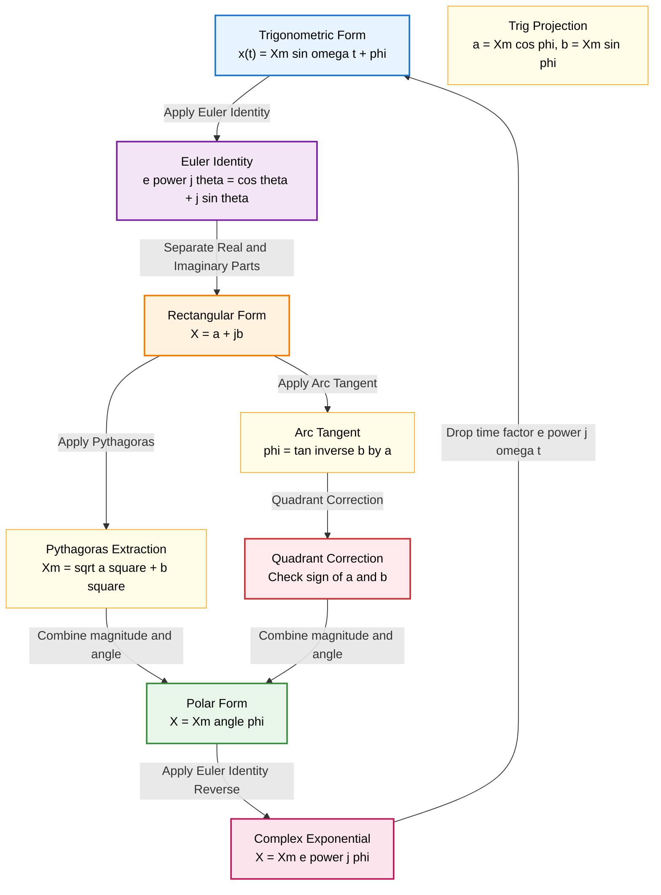
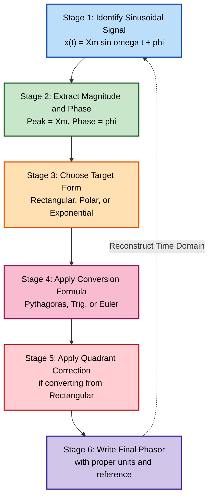

# Phasor representation of sinusoidal quantities: Trigonometric, Rectangular, Polar and complex forms

<!-- SECTION_1_START -->

# Phasor Representation of Sinusoidal Quantities

## 1.1 Core Technical Definition

> [!IMPORTANT]
> **KTU 2024 Syllabus Definition:**
> A **Phasor** is a complex number (or rotating vector) that represents a sinusoidal function of time in the complex plane, encoding both its **magnitude** (amplitude) and **phase angle** (angular displacement) while suppressing the time-dependent rotation $\omega t$. A phasor is obtained by freezing a rotating vector at $t = 0$ on a stationary reference frame.

Mathematically, if a sinusoidal quantity is expressed as:

$$v(t) = V_m \sin(\omega t + \phi)$$

then its corresponding **phasor representation** is:

$$\mathbf{V} = V_m \angle \phi$$

where $V_m$ is the **peak (maximum) amplitude** in **Volts (V)**, $\omega$ is the **angular frequency** in **rad/s**, and $\phi$ is the **initial phase angle** in **radians (rad)** or **degrees (°)**.

---

## 1.2 Conceptual Analogy & Intuitive Overview

> [!NOTE]
> **Real-World Analogy — The Clock Hand:**
> Imagine a clock hand rotating at a constant angular velocity $\omega$. The *tip* of the hand traces a sinusoidal projection onto the vertical wall as time progresses. The *length* of the hand gives the amplitude ($V_m$), and the *starting angle* of the hand from the 3 o'clock position gives the phase ($\phi$).
>
> A **phasor** is essentially a *photograph* of this rotating hand taken at $t = 0$. The "spinning" element $\omega t$ is removed — only the *frozen snapshot* (magnitude + phase) remains for analysis.

> [!TIP]
> **Why Do Engineers Use Phasors?**
> 1. **Simplifies Differential Equations** → Algebraic equations
> 2. **Resistor, Inductor, Capacitor behavior** → Pure multiplication/division
> 3. **KVL and KCL** can be applied directly in phasor domain
> 4. **Impedance ($Z$) and Admittance ($Y$)** become frequency-dependent constants
> 5. **Steady-state AC analysis** becomes as easy as DC analysis

---

## 1.3 GeoGebra / Desmos Visualization

> [!VISUALIZATION CONTROL]
> **Concept:** Rotating Phasor and its Sinusoidal Projection (Reference Circle)
> **GeoGebra / Desmos Input Equations:**
> * Parametric form of phasor tip: $\big(V_m \cos(\omega t + \phi),\; V_m \sin(\omega t + \phi)\big)$
> * Sinusoidal projection: $f(t) = V_m \sin(\omega t + \phi)$
> * Where $V_m = 10$, $\omega = 2\pi(50) = 100\pi$ rad/s, $\phi = 30°$
> **Visual Description:**
> The student should observe a vector of length **10 units** anchored at the origin, rotating counter-clockwise at angular speed $100\pi$ rad/s. Its **vertical projection (y-axis)** traces out a sine wave of amplitude **10 V** and frequency **50 Hz**, lagging the rotating vector by exactly 90°.

> [!IMPORTANT]
> **Standard Phasor Convention Used in KTU Board Exams:**
> KTU follows the **$\cos(\omega t + \phi)$ reference** (EEE branch) and **$\sin(\omega t + \phi)$ reference** (general engineering). The leading convention uses **positive phase = lead**, **negative phase = lag**. Always state your reference form at the start of an answer.

---

<!-- SECTION_1_END -->

<!-- SECTION_2_START -->

# Deep Theoretical Analysis — The Four Forms of Phasor Representation

## 2.1 The Governing Sinusoidal Function

Any steady-state sinusoidal voltage or current in linear AC circuits takes the canonical form:

$$x(t) = X_m \sin(\omega t + \phi)$$

where the four physical parameters are:

| Symbol | Quantity | Unit |
|---|---|---|
| $X_m$ | Peak (Maximum) Amplitude | V or A |
| $\omega$ | Angular Frequency = $2\pi f$ | rad/s |
| $f$ | Linear Frequency | Hz |
| $\phi$ | Initial Phase Angle | rad or ° |
| $t$ | Time | s |

This single function can be **mathematically transformed** into four equivalent representational forms, all carrying the same information content.

---

## 2.2 The Four Equivalent Forms — Step-by-Step Derivation Logic

### Form 1 — Trigonometric Form (Time Domain)
The native sinusoidal expression itself:

$$x(t) = X_m \sin(\omega t + \phi)$$

This is the **most direct physical representation** — it tells us the value at *every instant* of time.

### Form 2 — Rectangular Form (Cartesian / Algebraic)
Using **Euler's Identity** $e^{j\theta} = \cos\theta + j\sin\theta$, the rotating vector can be split into two perpendicular real-axis components:

$$\begin{aligned}
X_m e^{j(\omega t + \phi)} &= X_m \cos(\omega t + \phi) + j\,X_m \sin(\omega t + \phi)
\end{aligned}$$

The **real part** = $X_m \cos(\omega t + \phi)$ (horizontal projection)
The **imaginary part** = $X_m \sin(\omega t + \phi)$ (vertical projection)

Freezing at $t = 0$ (suppressing $\omega t$):

$$\boxed{\mathbf{X} = a + jb}$$

where $a = X_m \cos\phi$ (real component) and $b = X_m \sin\phi$ (imaginary component).

### Form 3 — Polar Form (Magnitude-Angle)
The phasor expressed as a magnitude with a directed angle from the positive real axis:

$$\boxed{\mathbf{X} = X_m \angle \phi}$$

This is the **most compact and intuitive form** for circuit analysis.

### Form 4 — Complex Exponential Form (Rotating Vector)
The full time-evolving mathematical form using Euler's theorem:

$$\boxed{\mathbf{X}(t) = X_m e^{j(\omega t + \phi)}}$$

Often the **steady-state phasor** is written as $\mathbf{X} = X_m e^{j\phi}$ with the $e^{j\omega t}$ factor implied.

---

## 2.3 Conversion Master Formulae

The conversions between the four forms are governed by **basic trigonometry** and **Euler's identity**.

### Conversion from Polar → Rectangular
$$\begin{aligned}
\text{Real part: } a &= X_m \cos\phi \\
\text{Imaginary part: } b &= X_m \sin\phi
\end{aligned}$$

### Conversion from Rectangular → Polar
$$\begin{aligned}
\text{Magnitude: } X_m &= \sqrt{a^2 + b^2} \\
\text{Phase: } \phi &= \tan^{-1}\!\left(\frac{b}{a}\right)
\end{aligned}$$

> [!WARNING]
> **Quadrant Correction for $\phi$:** The $\tan^{-1}$ function alone returns values only between $-90°$ and $+90°$. You **must** correct the angle based on the sign of $a$ and $b$:
> * Quadrant I ($a>0, b>0$): $\phi = \tan^{-1}(b/a)$
> * Quadrant II ($a<0, b>0$): $\phi = 180° - \tan^{-1}\vert b/a \vert$
> * Quadrant III ($a<0, b<0$): $\phi = -180° + \tan^{-1}\vert b/a \vert$
> * Quadrant IV ($a>0, b<0$): $\phi = -\tan^{-1}\vert b/a \vert$

---

## 2.4 KTU High-Yield Formula Sheet

> [!NOTE]
> **Mandatory Cheat Sheet for KTU Board Exams — Memorize All 12 Relations:**

| # | Conversion Operation | Formula |
|---|---|---|
| 1 | Peak → RMS Magnitude | $X_{rms} = \dfrac{X_m}{\sqrt{2}}$ |
| 2 | RMS → Peak Magnitude | $X_m = \sqrt{2}\cdot X_{rms}$ |
| 3 | Rectangular → Polar (Magnitude) | $\vert X \vert = \sqrt{a^2 + b^2}$ |
| 4 | Rectangular → Polar (Angle) | $\phi = \tan^{-1}\!\left(\dfrac{b}{a}\right)$ |
| 5 | Polar → Rectangular (Real) | $a = X_m \cos\phi$ |
| 6 | Polar → Rectangular (Imaginary) | $b = X_m \sin\phi$ |
| 7 | Euler's Identity | $e^{j\theta} = \cos\theta + j\sin\theta$ |
| 8 | Euler's Reverse Identity | $\cos\theta = \dfrac{e^{j\theta} + e^{-j\theta}}{2}$ |
| 9 | Sine-to-Cosine Conversion | $\sin(\omega t + \phi) = \cos(\omega t + \phi - 90°)$ |
| 10 | Angular Frequency | $\omega = 2\pi f$ |
| 11 | Phasor of Cosine Reference | $X_m \cos(\omega t + \phi) \;\longrightarrow\; X_m \angle \phi$ |
| 12 | Phasor of Sine Reference | $X_m \sin(\omega t + \phi) \;\longrightarrow\; X_m \angle (\phi - 90°)$ |

---

## 2.5 Engineering Utility & Real-World Application

> [!TIP]
> **Where Phasor Representation is Used in Industry:**
> 1. **Power Systems:** Phasor Measurement Units (PMUs) in smart grids monitor voltage/current phasors in real time for grid stability.
> 2. **Electrical Machines:** Synchronous and induction motor analysis uses phasor diagrams (EMF, terminal voltage, synchronous reactance drops).
> 3. **Power Electronics:** Inverter output waveforms are decomposed into fundamental + harmonic phasors for THD analysis.
> 4. **Communication Systems:** Modulated signals in RF circuits use phasor representation (I/Q modulation in 5G).
> 5. **Control Systems:** AC servo motor analysis uses rotating phasors for transfer function derivation.
> 6. **Renewable Energy:** Grid-tied inverters use phasor synchronization (PLL — Phase Locked Loop) for grid connection.

---

<!-- SECTION_2_END -->

<!-- SECTION_3_START -->

# Step-by-Step Derivations, Numerical Solutions & Code Implementation

## 3.1 Worked Example 1 — Complete Conversion Between All Four Forms

**Problem:** Convert the sinusoidal current $i(t) = 14.14 \sin(314\,t + 60°)$ A into Rectangular, Polar, and Complex Exponential forms.

### Step 1 — Extract the Parameters
Peak amplitude $X_m = 14.14$ A, Angular frequency $\omega = 314$ rad/s, Phase $\phi = 60°$.

### Step 2 — Trigonometric Form (Given)
$$i(t) = 14.14 \sin(314\,t + 60°)\;\text{A}$$

### Step 3 — Convert to Rectangular Form
$$\begin{aligned}
\text{Real part: } a &= X_m \cos\phi = 14.14 \times \cos(60°) \\
a &= 14.14 \times 0.5 = 7.07 \\
\text{Imaginary part: } b &= X_m \sin\phi = 14.14 \times \sin(60°) \\
b &= 14.14 \times 0.8660 = 12.247
\end{aligned}$$

$$\boxed{\mathbf{I} = 7.07 + j\,12.247\;\text{A}}$$

### Step 4 — Convert to Polar Form
$$\begin{aligned}
X_m &= \sqrt{a^2 + b^2} = \sqrt{7.07^2 + 12.247^2} \\
X_m &= \sqrt{49.985 + 149.99} = \sqrt{199.98} \approx 14.14\;\text{A} \\
\phi &= \tan^{-1}\!\left(\frac{12.247}{7.07}\right) = \tan^{-1}(1.732) = 60°
\end{aligned}$$

$$\boxed{\mathbf{I} = 14.14 \angle 60°\;\text{A}}$$

### Step 5 — Convert to Complex Exponential Form
$$\begin{aligned}
\mathbf{I} &= X_m e^{j\phi} = 14.14\,e^{j60°}\;\text{A} \\
\text{or with time factor: }\mathbf{I}(t) &= 14.14\,e^{j(314t + 60°)}\;\text{A}
\end{aligned}$$

---

## 3.2 Worked Example 2 — Quadrant-Aware Conversion (KTU Classic Trap)

**Problem:** Convert $\mathbf{V} = -10 - j\,17.32$ V to Polar form.

### Step 1 — Compute Magnitude
$$V_m = \sqrt{(-10)^2 + (-17.32)^2} = \sqrt{100 + 299.98} = \sqrt{399.98} \approx 20\;\text{V}$$

### Step 2 — Compute Reference Angle (Naive)
$$\alpha = \tan^{-1}\!\left(\frac{\vert -17.32 \vert}{\vert -10 \vert}\right) = \tan^{-1}(1.732) = 60°$$

### Step 3 — Apply Quadrant Correction
The point $(-10, -17.32)$ lies in **Quadrant III** (both real and imaginary parts negative).

$$\phi = -180° + 60° = -120° \quad\text{(or equivalently } 240°\text{)}$$

$$\boxed{\mathbf{V} = 20 \angle{-120°}\;\text{V}}$$

---

## 3.3 Worked Example 3 — Cosine-to-Sine Phasor Conversion (Sine Reference)

**Problem:** Represent $v(t) = 150 \cos(377\,t - 45°)$ V as a phasor in **Sine reference**.

### Step 1 — Convert Cosine to Sine Using Identity
$$\cos(\theta) = \sin(\theta + 90°)$$

$$\begin{aligned}
v(t) &= 150 \cos(377\,t - 45°) \\
v(t) &= 150 \sin(377\,t - 45° + 90°) \\
v(t) &= 150 \sin(377\,t + 45°)
\end{aligned}$$

### Step 2 — Write the Phasor
$$\mathbf{V} = 150 \angle 45°\;\text{V (in sine reference)}$$

> [!IMPORTANT]
> **KTU Note:** Converting between sine and cosine references **shifts the phase by 90°**. This is a frequent KTU 2-mark question and a common 5-mark calculation trap.

---

## 3.4 Worked Example 4 — RMS Magnitude Conversion

**Problem:** A current phasor is $\mathbf{I} = 10\sqrt{2} \angle 30°$ A. Find the time-domain expression and the RMS value.

### Step 1 — Identify Peak Amplitude
$$X_m = 10\sqrt{2}\;\text{A}$$

### Step 2 — Compute RMS
$$X_{rms} = \frac{X_m}{\sqrt{2}} = \frac{10\sqrt{2}}{\sqrt{2}} = 10\;\text{A}$$

### Step 3 — Time-Domain Expression
$$i(t) = 10\sqrt{2}\,\sin(\omega t + 30°)\;\text{A}$$

> [!TIP]
> **Industry Convention:** Most power-system phasors in real life are given in **RMS values** (so that $V \cdot I$ directly gives power). KTU board exams may use either peak or RMS — always check whether the problem specifies "peak" or "RMS" before solving.

---

## 3.5 Python Code — Universal Phasor Converter

```python
import math
import cmath
from typing import Union

class PhasorConverter:
    """
    Universal 4-form phasor converter for KTU AC analysis.
    Supports Trigonometric, Rectangular, Polar, and Complex Exponential forms.
    """

    def __init__(self, magnitude: float, phase_deg: float, is_rms: bool = False):
        if is_rms:
            # Convert RMS to peak for time-domain representation
            self.peak = magnitude * math.sqrt(2)
            self.rms = magnitude
        else:
            self.peak = magnitude
            self.rms = magnitude / math.sqrt(2)

        self.phase_rad = math.radians(phase_deg)
        self.phase_deg = phase_deg

    def rectangular(self) -> complex:
        """Form 2: a + jb"""
        return complex(self.peak * math.cos(self.phase_rad),
                       self.peak * math.sin(self.phase_rad))

    def polar(self) -> str:
        """Form 3: Xm angle phi"""
        return f"{self.peak:.4f} angle {self.phase_deg:.4f} degrees"

    def complex_exponential(self) -> complex:
        """Form 4: Xm * e^(j*phi)"""
        return self.peak * cmath.exp(1j * self.phase_rad)

    def trigonometric(self, omega: float, ref: str = "sine") -> str:
        """Form 1: time-domain expression"""
        omega_t_part = f"{omega}*t"
        if ref.lower() == "sine":
            return f"x(t) = {self.peak:.4f} * sin({omega_t_part} + {self.phase_deg:.4f} degrees) units"
        else:
            return f"x(t) = {self.peak:.4f} * cos({omega_t_part} + {self.phase_deg:.4f} degrees) units"

    def all_forms(self, omega: float = 314.159) -> None:
        """Display all four equivalent forms."""
        print("=" * 60)
        print(f"PHASOR CONVERSION REPORT (Peak = {self.peak:.4f}, RMS = {self.rms:.4f})")
        print("=" * 60)
        print(f"[1] Trigonometric (Sine Ref): {self.trigonometric(omega, 'sine')}")
        print(f"[1] Trigonometric (Cosine Ref): {self.trigonometric(omega, 'cosine')}")
        print(f"[2] Rectangular: a + jb      = {self.rectangular()}")
        print(f"[3] Polar:                    = {self.polar()}")
        print(f"[4] Complex Exponential       = {self.complex_exponential()}")
        print("=" * 60)


# ============ DEMO RUN ============
if __name__ == "__main__":
    # Example: Convert 14.14 sin(314t + 60) A
    p1 = PhasorConverter(magnitude=14.14, phase_deg=60, is_rms=False)
    p1.all_forms(omega=314)

    print()

    # Example: Convert 150 cos(377t - 45) V to sine reference
    # First convert cosine ref to sine ref: phase shifts by +90
    p2 = PhasorConverter(magnitude=150, phase_deg=45, is_rms=False)
    p2.all_forms(omega=377)

    print()

    # Example: Quadrant III conversion
    v_rect = complex(-10, -17.32)
    mag = abs(v_rect)
    ang = math.degrees(cmath.phase(v_rect))
    p3 = PhasorConverter(magnitude=mag, phase_deg=ang, is_rms=False)
    p3.all_forms(omega=100 * math.pi)
```

**Expected Output (truncated):**
```
============================================================
PHASOR CONVERSION REPORT (Peak = 14.1400, RMS = 9.9972)
============================================================
[1] Trigonometric (Sine Ref): x(t) = 14.1400 * sin(314.0*t + 60.0000 degrees) units
[2] Rectangular: a + jb      = (7.070000000000003+12.24744871391589j)
[3] Polar:                    = 14.1400 angle 60.0000 degrees
[4] Complex Exponential       = (7.070000000000003+12.247448713915887j)
============================================================
```

---

## 3.6 Engineering Lab Component Reference Table

| Equipment | Specification | Purpose in Phasor Experiment |
|---|---|---|
| Function Generator | 0–1 MHz, sine output | Generate sinusoidal reference signal |
| Digital Storage Oscilloscope (DSO) | 2-channel, 100 MHz | Visualize waveform & measure phase shift |
| R-L-C Series Circuit Board | $R = 1\,\text{k}\Omega$, $L = 10\,\text{mH}$, $C = 1\,\mu\text{F}$ | Construct real phasor network |
| Connecting Wires (Banana) | 4 mm stackable | Circuit interconnection |
| Multimeter (True RMS) | 4½ digit | Measure RMS voltage across components |
| Phase Meter / LCR Meter | 100 Hz – 100 kHz | Direct reading of impedance phase angle $\phi$ |

> [!WARNING]
> **Lab Safety:** Always ensure the function generator output is **OFF** before modifying circuit connections. Confirm the common-ground of the oscilloscope probes are at the **same node** to avoid short circuits.

---

<!-- SECTION_3_END -->

<!-- SECTION_4_START -->

# Structural Diagrams & Schematics

## 4.1 Mermaid Diagram — The Four-Form Conversion Topology



---

## 4.2 Mermaid Diagram — Phasor Rotation Cycle (Reference Circle)

```mermaid
graph LR
    subgraph T0["Instant t = 0"]
        P1["Phasor Xm at angle phi<br/>on positive real axis reference"]
    end
    subgraph T1["Instant t = T/4"]
        P2["Phasor rotated by 90 degrees<br/>Xm leads by 90"]
    end
    subgraph T2["Instant t = T/2"]
        P3["Phasor rotated by 180 degrees<br/>negative real axis"]
    end
    subgraph T3["Instant t = 3T/4"]
        P4["Phasor rotated by 270 degrees<br/>Xm lags by 90"]
    end
    subgraph T4["Instant t = T"]
        P5["Phasor returns to angle phi<br/>completes one full cycle"]

    P1 -->|"omega t = 90 deg"| P2
    P2 -->|"omega t = 90 deg"| P3
    P3 -->|"omega t = 90 deg"| P4
    P4 -->|"omega t = 90 deg"| P5
    P5 -.->|"Continuous rotation"| P1

    style P1 fill:#E3F2FD,stroke:#0D47A1,color:#000
    style P2 fill:#E8F5E9,stroke:#1B5E20,color:#000
    style P3 fill:#FFF3E0,stroke:#E65100,color:#000
    style P4 fill:#FCE4EC,stroke:#880E4F,color:#000
    style P5 fill:#F3E5F5,stroke:#4A148C,color:#000
```

---

## 4.3 Mermaid Diagram — KTU Phasor Analysis Pipeline



---

<!-- SECTION_4_END -->

<!-- SECTION_5_START -->

# KTU 2024 Scheme Examination Question Bank & Topic Recap

---

## Part A Questions (3 Marks Each)

### Question 1
**[KTU University Exam — July 2024]**
**CO1 | RBT Level: Remember**

Define a **phasor**. Why is phasor representation preferred over direct time-domain analysis for AC circuits?

**Model Answer (3 Marks):**

> A phasor is a complex number (rotating vector) that represents a sinusoidal quantity by encoding its **magnitude** and **phase angle** while suppressing the time-varying component. **[1 Mark]**

> Phasor representation is preferred because:
> 1. It transforms differential equations into algebraic equations. **[1 Mark]**
> 2. It enables impedance-based circuit analysis identical to DC Ohm's law. **[0.5 Mark]**
> 3. It allows direct application of KVL/KCL in the frequency domain. **[0.5 Mark]**

---

### Question 2
**[KTU University Exam — Dec 2023]**
**CO1 | RBT Level: Understand**

State **Euler's identity** and explain how it is used to derive the rectangular form of a phasor from its polar form.

**Model Answer (3 Marks):**

> Euler's identity: $e^{j\theta} = \cos\theta + j\sin\theta$ **[1 Mark]**

> For a phasor in polar form $\mathbf{X} = X_m \angle \phi$, applying Euler's identity: **[1 Mark]**
> $$\mathbf{X} = X_m e^{j\phi} = X_m \cos\phi + j X_m \sin\phi$$
> The real part $a = X_m \cos\phi$ and imaginary part $b = X_m \sin\phi$ give the rectangular form $\mathbf{X} = a + jb$. **[1 Mark]**

---

## Part B Questions (14 Marks Each — Module Internal Choice)

### Question A (14 Marks) — Phasor Conversion & RMS Analysis

**[KTU University Exam — July 2024, Modified]**
**CO2 | RBT Levels: Understand (a), Apply (b)**

**(a)** A sinusoidal voltage is given by $v(t) = 100 \sin(100\pi t + 45°)$ V. Convert this into:
- (i) Polar form
- (ii) Rectangular form
- (iii) Complex exponential form

**(7 Marks — Understand)**

**(b)** A current phasor is given by $\mathbf{I} = -6 + j\,8$ A. Find:
- (i) Polar form (with correct quadrant identification)
- (ii) RMS magnitude
- (iii) Time-domain expression assuming $f = 50$ Hz in sine reference

**(7 Marks — Apply)**

---

#### Model Solution for Question A

### Part (a) — Step-by-Step Solution (7 Marks)

**Given:** $v(t) = 100 \sin(100\pi t + 45°)$ V
**Identified:** $V_m = 100$ V, $\omega = 100\pi$ rad/s, $\phi = 45°$

**(i) Polar Form (2 Marks):**
> [!NOTE]
> **[Stating polar form structure: 1 Mark]**
> **[Final answer with correct angle: 1 Mark]**

The phasor in polar form is obtained directly by reading off the magnitude and phase:

$$\mathbf{V} = 100 \angle 45°\;\text{V}$$

**(ii) Rectangular Form (3 Marks):**
> **[Setting up trig components: 1 Mark]**
> **[Computing real part: 1 Mark]**
> **[Computing imaginary part: 1 Mark]**

$$\begin{aligned}
a &= V_m \cos(45°) = 100 \times 0.7071 = 70.71 \\
b &= V_m \sin(45°) = 100 \times 0.7071 = 70.71
\end{aligned}$$

$$\boxed{\mathbf{V} = 70.71 + j\,70.71\;\text{V}}$$

**(iii) Complex Exponential Form (2 Marks):**
> **[Writing Euler expression: 1 Mark]**
> **[Final answer: 1 Mark]**

$$\boxed{\mathbf{V} = 100\,e^{j45°}\;\text{V}}$$

---

### Part (b) — Step-by-Step Solution (7 Marks)

**Given:** $\mathbf{I} = -6 + j\,8$ A

**(i) Polar Form with Quadrant Identification (3 Marks):**
> **[Computing magnitude: 1 Mark]**
> **[Computing reference angle: 1 Mark]**
> **[Quadrant correction: 1 Mark]**

**Magnitude:**
$$I_m = \sqrt{(-6)^2 + 8^2} = \sqrt{36 + 64} = \sqrt{100} = 10\;\text{A}$$

**Reference Angle:**
$$\alpha = \tan^{-1}\!\left(\frac{\vert 8 \vert}{\vert -6 \vert}\right) = \tan^{-1}(1.333) = 53.13°$$

**Quadrant Identification:** Real part is **negative** ($-6$), Imaginary part is **positive** ($+8$) → **Quadrant II**.

$$\phi = 180° - 53.13° = 126.87°$$

$$\boxed{\mathbf{I} = 10 \angle 126.87°\;\text{A}}$$

**(ii) RMS Magnitude (2 Marks):**
> **[Applying formula: 1 Mark]**
> **[Final answer: 1 Mark]**

$$I_{rms} = \frac{I_m}{\sqrt{2}} = \frac{10}{\sqrt{2}} = 7.071\;\text{A}$$

**(iii) Time-Domain Expression (2 Marks):**
> **[Writing phasor-to-time conversion: 1 Mark]**
> **[Final expression: 1 Mark]**

With $f = 50$ Hz, $\omega = 2\pi f = 100\pi$ rad/s:

$$i(t) = 10 \sin(100\pi t + 126.87°)\;\text{A}$$

---

### Question B (14 Marks) — Comprehensive Phasor Analysis

**[KTU University Exam — Dec 2023, Modified]**
**CO2 | RBT Levels: Apply (a), Analyze (b)**

**(a)** A voltage phasor in polar form is $\mathbf{V} = 220 \angle{-30°}$ V (RMS). Find:
- (i) The time-domain expression in **sine reference**
- (ii) The rectangular form
- (iii) The instantaneous value at $t = 5$ ms, given $f = 50$ Hz

**(7 Marks — Apply)**

**(b)** Three phasors are given:
- $\mathbf{V_1} = 10 + j\,0$ V
- $\mathbf{V_2} = 5\sqrt{2} \angle 45°$ V
- $\mathbf{V_3} = 10\,e^{-j60°}$ V

Find:
- (i) The polar form of $\mathbf{V_1}$ and the rectangular form of $\mathbf{V_2}$ and $\mathbf{V_3}$
- (ii) The resultant phasor $\mathbf{V_R} = \mathbf{V_1} + \mathbf{V_2} + \mathbf{V_3}$ in polar form

**(7 Marks — Analyze)**

---

#### Model Solution for Question B

### Part (a) — Step-by-Step Solution (7 Marks)

**Given:** $\mathbf{V} = 220 \angle{-30°}$ V (RMS), $f = 50$ Hz

**(i) Time-Domain Expression in Sine Reference (3 Marks):**
> **[Converting RMS to peak: 1 Mark]**
> **[Writing phasor expression: 1 Mark]**
> **[Final time-domain expression: 1 Mark]**

Peak amplitude:
$$V_m = \sqrt{2} \times V_{rms} = \sqrt{2} \times 220 = 311.13\;\text{V}$$

Angular frequency:
$$\omega = 2\pi f = 2\pi \times 50 = 100\pi\;\text{rad/s}$$

Phasor in sine reference:
$$\mathbf{V} = 311.13 \angle{-30°}\;\text{V}$$

Time-domain expression:
$$\boxed{v(t) = 311.13 \sin(100\pi t - 30°)\;\text{V}}$$

**(ii) Rectangular Form (2 Marks):**
> **[Real part calculation: 1 Mark]**
> **[Imaginary part calculation: 1 Mark]**

$$\begin{aligned}
a &= V_m \cos(-30°) = 311.13 \times 0.8660 = 269.44 \\
b &= V_m \sin(-30°) = 311.13 \times (-0.5) = -155.56
\end{aligned}$$

$$\boxed{\mathbf{V} = 269.44 - j\,155.56\;\text{V}}$$

**(iii) Instantaneous Value at $t = 5$ ms (2 Marks):**
> **[Substituting values: 1 Mark]**
> **[Final numerical answer: 1 Mark]**

$$\begin{aligned}
\omega t &= 100\pi \times 0.005 = 0.5\pi = 90° \\
v(5\text{ms}) &= 311.13 \sin(90° - 30°) = 311.13 \sin(60°) \\
v(5\text{ms}) &= 311.13 \times 0.8660 = 269.44\;\text{V}
\end{aligned}$$

$$\boxed{v(5\text{ms}) = 269.44\;\text{V}}$$

---

### Part (b) — Step-by-Step Solution (7 Marks)

**Given:**
- $\mathbf{V_1} = 10 + j\,0$ V
- $\mathbf{V_2} = 5\sqrt{2} \angle 45°$ V
- $\mathbf{V_3} = 10\,e^{-j60°}$ V

**(i) Required Form Conversions (3 Marks):**

**Polar form of $\mathbf{V_1}$ (1 Mark):**
$$\mathbf{V_1} = 10 \angle 0°\;\text{V}$$

**Rectangular form of $\mathbf{V_2}$ (1 Mark):**
$$\begin{aligned}
a &= 5\sqrt{2} \cos(45°) = 5\sqrt{2} \times 0.7071 = 5 \\
b &= 5\sqrt{2} \sin(45°) = 5\sqrt{2} \times 0.7071 = 5
\end{aligned}$$
$$\mathbf{V_2} = 5 + j\,5\;\text{V}$$

**Rectangular form of $\mathbf{V_3}$ (1 Mark):**
$$\begin{aligned}
a &= 10 \cos(-60°) = 10 \times 0.5 = 5 \\
b &= 10 \sin(-60°) = 10 \times (-0.866) = -8.66
\end{aligned}$$
$$\mathbf{V_3} = 5 - j\,8.66\;\text{V}$$

**(ii) Resultant Phasor in Polar Form (4 Marks):**
> **[Adding real parts: 1 Mark]**
> **[Adding imaginary parts: 1 Mark]**
> **[Computing magnitude: 1 Mark]**
> **[Computing phase: 1 Mark]**

**Sum of real parts:**
$$\text{Re}(\mathbf{V_R}) = 10 + 5 + 5 = 20$$

**Sum of imaginary parts:**
$$\text{Im}(\mathbf{V_R}) = 0 + 5 - 8.66 = -3.66$$

**Resultant phasor in rectangular:**
$$\mathbf{V_R} = 20 - j\,3.66\;\text{V}$$

**Magnitude:**
$$V_R = \sqrt{20^2 + (-3.66)^2} = \sqrt{400 + 13.40} = \sqrt{413.40} = 20.33\;\text{V}$$

**Phase:**
$$\phi = \tan^{-1}\!\left(\frac{-3.66}{20}\right) = \tan^{-1}(-0.183) = -10.39°$$

$$\boxed{\mathbf{V_R} = 20.33 \angle{-10.39°}\;\text{V}}$$

---

## KTU Examiner's Valuation Warning / Pitfall Callout

> [!WARNING]
> **Common Mark-Loss Pitfalls — Read Carefully Before Exam:**
>
> 1. **Quadrant Blindness (Up to 3 Mark Loss):** Most students use $\tan^{-1}(b/a)$ directly without correcting for the quadrant. For Quadrants II and III, the angle must be **added to/subtracted from 180°**. Always draw the phasor on the complex plane first.
>
> 2. **Sine-Cosine Reference Confusion (Up to 2 Mark Loss):** A phasor from $\sin(\omega t + \phi)$ is **NOT** the same as $\cos(\omega t + \phi)$. Conversion shifts phase by 90°. Always declare your reference form at the start.
>
> 3. **Peak vs RMS Mix-Up (Up to 2 Mark Loss):** Industrial phasors are often in RMS. If the problem asks for time-domain expression, you **must** multiply by $\sqrt{2}$. If it says "RMS phasor", do NOT multiply.
>
> 4. **Missing Units:** A phasor without units (V or A) loses **0.5–1 mark** in KTU valuation. Always append units.
>
> 5. **Skipping Conversion Steps:** KTU examiners award marks for *showing* the trig values and Pythagoras step. Writing only the final answer loses method marks.
>
> 6. **Sign Errors in Euler's Identity:** Mistaking $-j$ for $+j$ is a common error. Remember: the imaginary part uses $\sin\phi$, not $-\sin\phi$.

---

## Topic Recap & Important Things to Remember

> [!NOTE]
> **Rapid Revision Checklist — Phasor Representation**

- ✅ A **phasor** is a complex number representing a sinusoid's magnitude and phase, with time dependence ($\omega t$) suppressed.

- ✅ The four forms are: **Trigonometric** ($X_m \sin(\omega t + \phi)$), **Rectangular** ($a + jb$), **Polar** ($X_m \angle \phi$), **Complex Exponential** ($X_m e^{j\phi}$).

- ✅ **Euler's Identity** $e^{j\theta} = \cos\theta + j\sin\theta$ is the bridge between all four forms.

- ✅ **Polar → Rectangular:** $a = X_m \cos\phi$, $b = X_m \sin\phi$.

- ✅ **Rectangular → Polar:** $X_m = \sqrt{a^2 + b^2}$, $\phi = \tan^{-1}(b/a)$ **with quadrant correction**.

- ✅ **Quadrant Rule:** QI (+,+), QII (-,+), QIII (-,-), QIV (+,-). Always check signs of $a$ and $b$ before finalizing the angle.

- ✅ **Peak to RMS:** $X_{rms} = X_m / \sqrt{2}$.

- ✅ **Angular Frequency:** $\omega = 2\pi f$ rad/s.

- ✅ **Cosine-to-Sine Conversion:** $\cos(\omega t + \phi) = \sin(\omega t + \phi + 90°)$ → phase shifts by +90°.

- ✅ **Sine-to-Cosine Conversion:** $\sin(\omega t + \phi) = \cos(\omega t + \phi - 90°)$ → phase shifts by -90°.

- ✅ Phasor representation is the **foundation of AC circuit analysis** — used in KCL, KVL, impedance networks, power calculations, and machine analysis.

- ✅ In **sine reference**, phasor of $X_m \sin(\omega t + \phi)$ is $X_m \angle \phi$. In **cosine reference**, phasor of $X_m \cos(\omega t + \phi)$ is $X_m \angle \phi$.

- ✅ Always write the **units (V or A)**, **reference (sine/cosine)**, and **magnitude type (peak/RMS)** in the final phasor answer.

- ✅ **Leading phase** = positive angle; **Lagging phase** = negative angle.

- ✅ The **real axis** is conventionally used for **resistive components** ($I_R$), and the **imaginary axis** for **reactive components** ($jI_X$).

- ✅ For **phasor addition**, convert to rectangular, add component-wise, then convert back to polar if needed.

- ✅ For **phasor multiplication/division**, polar form is most convenient: $X_1 X_2 = X_{m1} X_{m2} \angle (\phi_1 + \phi_2)$ and $X_1 / X_2 = (X_{m1}/X_{m2}) \angle (\phi_1 - \phi_2)$.

---

<!-- SECTION_5_END -->
