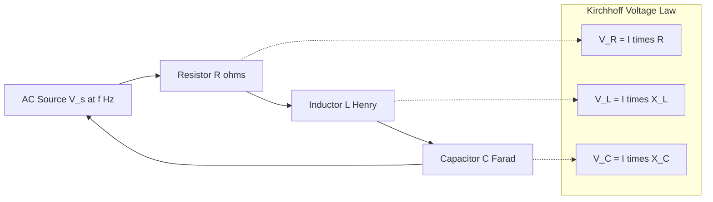
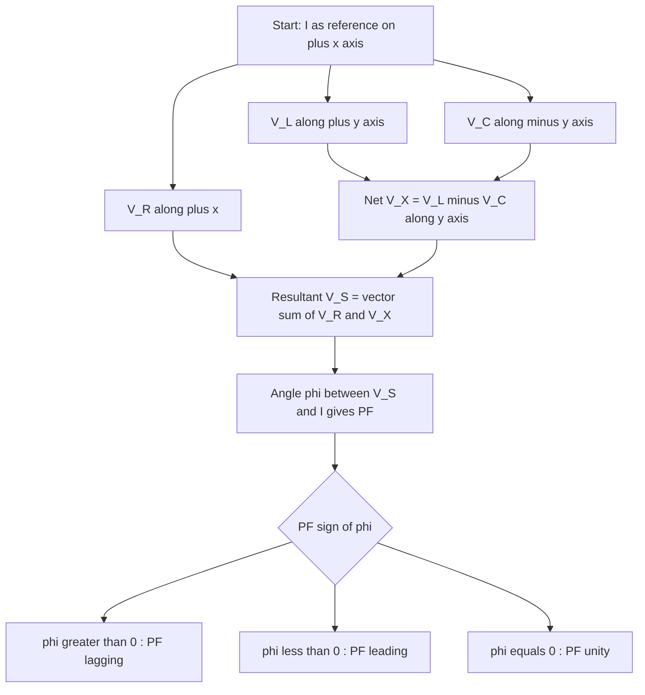
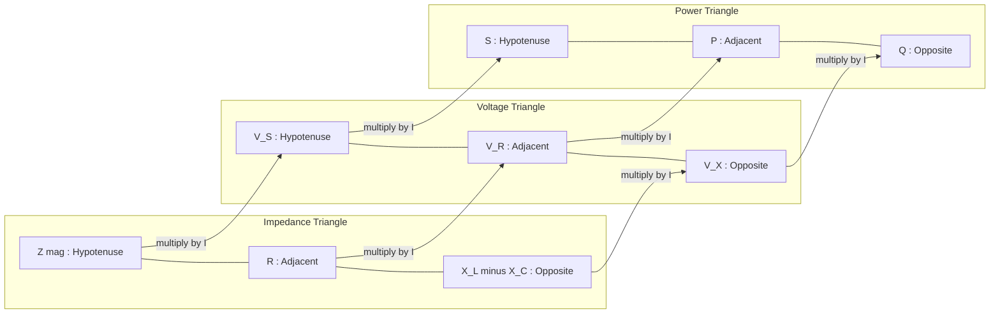
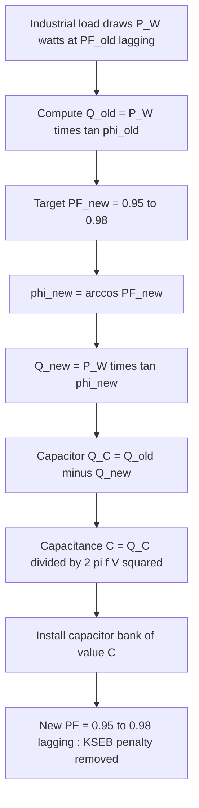
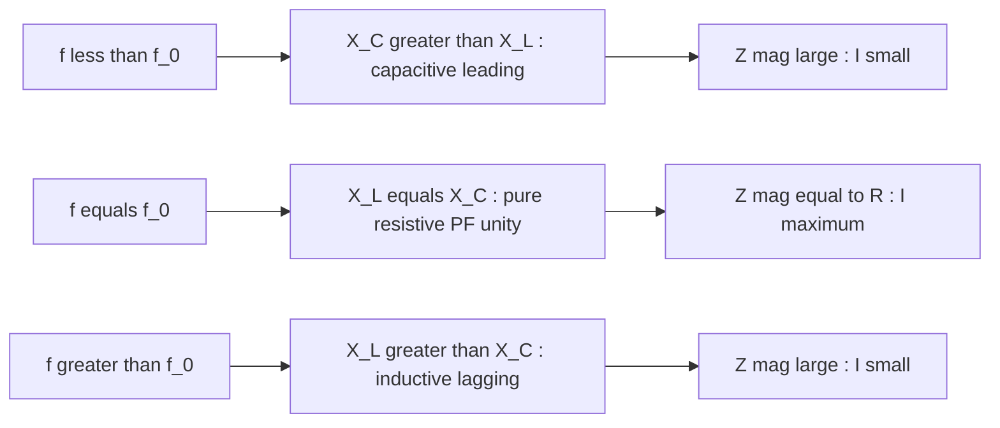

# RL, RC and RLC series circuits- power factor, active, reactive and apparent power numerical problems

<!-- SECTION_1_START -->

# RL, RC and RLC Series Circuits — Power Factor, Active, Reactive and Apparent Power

## 1.1 Core Definitions (KTU 2024 Syllabus Terminology)

**Alternating Current (AC) Circuit** is one in which the source voltage and the resulting current vary sinusoidally with time. When resistors ($R$), inductors ($L$), and capacitors ($C$) are connected in series with such a source, the resulting network is termed an **RLC series circuit** (special cases: $RL$ when $C$ is absent, $RC$ when $L$ is absent).

> [!IMPORTANT]
> **Power Factor (PF or $\cos\phi$)** is the cosine of the angle by which the supply voltage leads (or lags) the circuit current. It is the single most important figure-of-merit for an AC load because it directly tells us *how much of the supplied power is being converted into useful work*.

| Quantity | Symbol | Definition | Unit |
|---|---|---|---|
| Active (Real) Power | $P$ | Power actually consumed / dissipated | **Watt (W)** |
| Reactive Power | $Q$ | Power oscillating between source and reactive elements | **Volt-Ampere Reactive (VAR)** |
| Apparent Power | $S$ | Vector sum of $P$ and $Q$ | **Volt-Ampere (VA)** |
| Power Factor | $\cos\phi$ | $\dfrac{P}{S}$ | Dimensionless |

> [!NOTE]
> **KTU Board Emphasis:** The relationship $S^2 = P^2 + Q^2$ is a *vector* (Pythagorean) relationship, NOT a scalar one. The corresponding angles in the **Impedance Triangle**, **Voltage Triangle**, and **Power Triangle** are identical — this geometric similarity is the most-tested concept in Module 2 numericals.

## 1.2 Intuitive Analogy — "The Three-Cycle Commute"

Imagine a cyclist delivering water bottles along a road:
- **Active Power ($P$)** = the water *actually delivered* to houses (real, useful work done).
- **Reactive Power ($Q$)** = the cyclist's *breathing effort* — they pedal hard, but no net water is delivered during a return swing. Energy bounces back and forth.
- **Apparent Power ($S$)** = the *total effort* the cyclist expends (the size of the muscle, the loudness of the engine).
- **Power Factor $\cos\phi$** = the *efficiency* of delivery. A PF of **1.0** means 100 % of effort is used for delivery. A PF of **0.5** means half the effort is wasted in return trips.

> [!TIP]
> **Real-world:** Industrial induction motors, transformers, and fluorescent lamp ballasts operate at PF = 0.6 to 0.8 lagging. Keral State Electricity Board (KSEB) **penalises** industrial consumers whose PF falls below 0.9, charging them penalty units in the bill. This is why PF correction using shunt capacitors is a major engineering practice in Kerala's industrial estates.

## 1.3 Why Reactive Elements Behave Differently

| Element | Opposition to AC | Phase Relationship (V vs I) | Power Consumed? |
|---|---|---|---|
| Pure Resistor $R$ | Resistance $R$ ($\Omega$) | Voltage **in phase** with current | Yes — all $P$ |
| Pure Inductor $L$ | Inductive Reactance $X_L = 2\pi f L$ | Voltage **leads** current by $90^\circ$ | No — pure $Q$ |
| Pure Capacitor $C$ | Capacitive Reactance $X_C = \dfrac{1}{2\pi f C}$ | Voltage **lags** current by $90^\circ$ | No — pure $Q$ |

> [!VISUALIZATION CONTROL]
> **Concept:** Phasor diagram of a generic RLC series circuit with $X_L > X_C$ (inductive dominant case).
> **Reference Frame:** Take the current $I$ along the positive $x$-axis as the **reference phasor**.
> **Phasor equations (Polar form):**
> * `I = I ∠ 0°` (reference, along +x axis)
> * `V_R = I·R ∠ 0°` (along +x axis, in phase with I)
> * `V_L = I·X_L ∠ +90°` (along +y axis, leading)
> * `V_C = I·X_C ∠ -90°` (along -y axis, lagging)
> * `V_S = I·Z ∠ φ` (resultant, angle φ from +x axis)
>
> **Visual Description:** The student should see $V_R$ pointing right, $V_L$ pointing straight up, $V_C$ pointing straight down. The net reactance $X = X_L - X_C$ adds them vertically, and the supply voltage $V_S$ is the hypotenuse of the right triangle formed by $V_R$ and $V_X$. The angle $\phi$ between $V_S$ and $I$ determines $\cos\phi$ (PF).

## 1.4 The Three Special Series Topologies

| Circuit | Net Reactance | Phase Angle $\phi$ | Power Factor Type |
|---|---|---|---|
| **Pure R** | $X = 0$ | $\phi = 0^\circ$ | Unity ($\cos\phi = 1$) |
| **Pure L** | $X = +X_L$ | $\phi = +90^\circ$ | Zero, **lagging** |
| **Pure C** | $X = -X_C$ | $\phi = -90^\circ$ | Zero, **leading** |
| **R–L series** | $X = +X_L$ | $0^\circ < \phi < 90^\circ$ | Less than unity, **lagging** |
| **R–C series** | $X = -X_C$ | $-90^\circ < \phi < 0^\circ$ | Less than unity, **leading** |
| **R–L–C series ($X_L > X_C$)** | $X = X_L - X_C > 0$ | $\phi > 0$ | **Lagging** |
| **R–L–C series ($X_L < X_C$)** | $X = X_L - X_C < 0$ | $\phi < 0$ | **Leading** |
| **R–L–C series (Resonance)** | $X_L = X_C$ | $\phi = 0^\circ$ | **Unity** |

> [!NOTE]
> **"Leading"** means current *leads* voltage (capacitive nature). **"Lagging"** means current *lags* voltage (inductive nature). In Indian power systems, a **lagging** PF is the *normal* operating condition because the grid is overwhelmingly inductive.

---

<!-- SECTION_1_END -->

<!-- SECTION_2_START -->

# Deep Theoretical Analysis & KTU High-Yield Formula Sheet

## 2.1 Impedance — The Generalised Opposition to AC

The **complex impedance** of a series RLC circuit is

$$Z = R + jX = R + j(X_L - X_C)$$

Converting to polar form gives the magnitude $|Z|$ and the argument $\phi$:

$$|Z| = \sqrt{R^2 + (X_L - X_C)^2} \quad (\Omega)$$

$$\phi = \tan^{-1}\!\left(\frac{X_L - X_C}{R}\right) \quad (\text{deg or rad})$$

> [!IMPORTANT]
> The **Impedance Triangle** is the geometric heart of every KTU AC numerical. The three sides are $R$ (adjacent), $X = X_L - X_C$ (opposite), and $|Z|$ (hypotenuse). The same triangle, when scaled by current $I$, becomes the **Voltage Triangle**; scaled by $I^2$, it becomes the **Power Triangle**. This tri-scaling trick allows a single diagram to solve for voltage, current, and power simultaneously.

## 2.2 Step-by-Step Logical Breakdown

### Step 1 — Identify the Circuit Topology
- Is there a capacitor? If no → $RL$ series.
- Is there an inductor? If no → $RC$ series.
- Both present → $R = R$, $X_L = 2\pi f L$, $X_C = \dfrac{1}{2\pi f C}$.

### Step 2 — Compute Reactances
- Inductive reactance grows with frequency.
- Capacitive reactance shrinks with frequency.
- Their difference is the *net* reactance $X$.

### Step 3 — Compute Impedance Magnitude and Angle
- $|Z|$ is always positive (it is a length, not a vector component).
- $\phi$ carries the sign of the reactance (negative means leading, positive means lagging).

### Step 4 — Apply Ohm's Law for AC
- $I = \dfrac{V_S}{|Z|}$ (RMS values).
- $V_S = I \cdot |Z|$.

### Step 5 — Construct the Power Triangle
- $P = V_S \cdot I \cdot \cos\phi = I^2 R$ (active power).
- $Q = V_S \cdot I \cdot \sin\phi = I^2 X$ (reactive power).
- $S = V_S \cdot I = I^2 |Z|$ (apparent power).
- $\cos\phi = \dfrac{P}{S} = \dfrac{R}{|Z|}$.

### Step 6 — Tag the Power Factor
- $\phi > 0$ → **Lagging PF** (inductive).
- $\phi < 0$ → **Leading PF** (capacitive).
- $\phi = 0$ → **Unity PF** (resonance / pure resistive).

> [!TIP]
> **Engineering Utility:** PF correction capacitor banks installed at LT substations in Kerala (e.g., KSEB's 11 kV/415 V distribution transformers in Kochi industrial belts) work by *cancelling* $Q_L$ from the inductive load with $Q_C$ from the capacitor bank, leaving only the active component. The kVA demand on the transformer drops, freeing up capacity.

## 2.3 KTU Formula Cheat Sheet (Use this in the last 2 minutes of revision)

| # | Quantity | Formula | Symbol | Unit | Notes |
|---|---|---|---|---|---|
| 1 | Inductive Reactance | $X_L = 2\pi f L$ | $X_L$ | $\Omega$ | Direct with $f$, $L$ |
| 2 | Capacitive Reactance | $X_C = \dfrac{1}{2\pi f C}$ | $X_C$ | $\Omega$ | Inverse with $f$, $C$ |
| 3 | Net Reactance | $X = X_L - X_C$ | $X$ | $\Omega$ | $+ve$ inductive, $-ve$ capacitive |
| 4 | Impedance Magnitude | $\vert Z \vert = \sqrt{R^2 + X^2}$ | $\vert Z \vert$ | $\Omega$ | Always positive |
| 5 | Phase Angle | $\phi = \tan^{-1}\!\left(\dfrac{X}{R}\right)$ | $\phi$ | deg/rad | Sign of $X$ = sign of $\phi$ |
| 6 | Power Factor | $\cos\phi = \dfrac{R}{\vert Z \vert}$ | $\cos\phi$ | — | $\le 1$ always |
| 7 | RMS Current | $I = \dfrac{V_S}{\vert Z \vert}$ | $I$ | A | RMS unless stated |
| 8 | Active Power | $P = V_S I \cos\phi = I^2 R$ | $P$ | W | True work done |
| 9 | Reactive Power | $Q = V_S I \sin\phi = I^2 X$ | $Q$ | VAR | Stored / returned |
| 10 | Apparent Power | $S = V_S I = I^2 \vert Z \vert$ | $S$ | VA | Vector magnitude |
| 11 | Power Identity | $S^2 = P^2 + Q^2$ | — | — | Pythagoras (vector) |
| 12 | Power Angle | $\phi = \tan^{-1}\!\left(\dfrac{Q}{P}\right)$ | $\phi$ | deg/rad | Same as impedance angle |
| 13 | Energy in one period | $W_P = P \cdot T$, $W_Q = 0$ (avg) | — | J | Reactive averages to zero |
| 14 | Resonance freq. | $f_0 = \dfrac{1}{2\pi\sqrt{LC}}$ | $f_0$ | Hz | $X_L = X_C$ at $f_0$ |
| 15 | Quality Factor | $Q_{\text{factor}} = \dfrac{1}{R}\sqrt{\dfrac{L}{C}}$ | $Q$ | — | Selectivity measure |

> [!IMPORTANT]
> **Numerical Pitfall 1 — Units:** $L$ in **henry (H)**, not mH. $C$ in **farad (F)**, not $\mu F$. $1 \, \mu F = 10^{-6} \, F$. Forgetting this shift by a factor of $10^6$ is the most common KTU mark-loss error.
>
> **Numerical Pitfall 2 — RMS vs Peak:** KTU board problems state $V$ and $I$ as **RMS values** by default. Only convert to peak ($V_m = \sqrt{2} \cdot V_{rms}$) if the question explicitly asks for peak or instantaneous.
>
> **Numerical Pitfall 3 — Sign of $Q$:** Engineers usually write $Q$ as a *positive* magnitude and qualify it with "lagging" or "leading" in the text. If a numerical answer has a negative $Q$, it is leading (capacitive). The KTU valuation key accepts both conventions but consistency is scored.

## 2.4 Real-World Engineering Applications

| Field | Application of PF / Reactive Power Concept |
|---|---|
| Power Utilities (KSEB, NTPC) | PF penalty billing, capacitor bank sizing, tariff design |
| Industrial Drives | Soft starters, VFDs, induction motor PF correction to 0.95–0.98 |
| Power Electronics | Active PF correction (APFC) using IGBT-based boost converters |
| Transformer Design | Rating in kVA (apparent), not kW, because heating depends on $I$ |
| Transmission Lines | Series compensation using $C$ to cancel $X_L$ of long lines |
| Renewable Energy | Inverter PF control for grid-tied solar PV plants |
| Audio Engineering | Crossover networks use $RL$, $RC$ filters to split frequency bands |
| Telecommunication | Impedance matching of $50 \, \Omega$ lines to antennas |

---

<!-- SECTION_2_END -->

<!-- SECTION_3_START -->

# Step-by-Step Derivations & Worked Numerical Problems

## 3.1 Derivation of the Power Triangle from the Voltage Triangle

Let the supply be $v(t) = V_m \sin(\omega t)$ and the circuit current be $i(t) = I_m \sin(\omega t - \phi)$ (lagging by $\phi$).

**Instantaneous power:**

$$p(t) = v(t) \cdot i(t) = V_m I_m \sin(\omega t) \sin(\omega t - \phi)$$

Using the identity $\sin A \sin B = \dfrac{1}{2}\left[\cos(A-B) - \cos(A+B)\right]$:

$$p(t) = \dfrac{V_m I_m}{2}\left[\cos\phi - \cos(2\omega t - \phi)\right]$$

**Averaging over one full period $T = \dfrac{2\pi}{\omega}$:** The second term is a pure cosine at $2\omega$, whose average over a full period is **zero**. Hence:

$$P_{\text{avg}} = \dfrac{V_m I_m}{2} \cos\phi = V_{rms} \cdot I_{rms} \cdot \cos\phi$$

**Defining reactive power** as the amplitude of the oscillating term:

$$Q = V_{rms} \cdot I_{rms} \cdot \sin\phi$$

**Defining apparent power** as the product of RMS voltage and current:

$$S = V_{rms} \cdot I_{rms}$$

**Pythagorean relationship:** Because $\cos^2\phi + \sin^2\phi = 1$:

$$S^2 = P^2 + Q^2$$

This completes the **Power Triangle**.

## 3.2 Master Worked Example — RL Series Circuit

**Problem:** A coil having $R = 12 \, \Omega$ and $L = 0.05 \, H$ is connected in series across a $230 \, V$, $50 \, Hz$ AC supply. Calculate (i) inductive reactance, (ii) impedance, (iii) current, (iv) phase angle, (v) power factor, (vi) active, reactive, and apparent power, and (vii) draw the phasor diagram.

### Solution

**Step (i) — Inductive Reactance**

$$X_L = 2 \pi f L = 2 \pi \cdot 50 \cdot 0.05$$

$$X_L = 15.708 \, \Omega \approx 15.71 \, \Omega \quad \text{[2 Marks: writing formula and substitution]}$$

**Step (ii) — Impedance Magnitude**

$$|Z| = \sqrt{R^2 + X_L^2} = \sqrt{12^2 + 15.71^2} = \sqrt{144 + 246.8}$$

$$|Z| = \sqrt{390.8} = 19.77 \, \Omega \quad \text{[2 Marks: Pythagoras and substitution]}$$

**Step (iii) — RMS Current**

$$I = \frac{V_S}{|Z|} = \frac{230}{19.77} = 11.63 \, A \quad \text{[1 Mark: Ohm's law for AC]}$$

**Step (iv) — Phase Angle**

$$\phi = \tan^{-1}\!\left(\frac{X_L}{R}\right) = \tan^{-1}\!\left(\frac{15.71}{12}\right) = \tan^{-1}(1.309)$$

$$\phi = 52.62^\circ \quad \text{[1 Mark]}$$

**Step (v) — Power Factor**

$$\cos\phi = \cos(52.62^\circ) = 0.607 \quad \text{(lagging)} \quad \text{[1 Mark]}$$

> Cross-check: $\cos\phi = \dfrac{R}{|Z|} = \dfrac{12}{19.77} = 0.607$ ✓

**Step (vi) — Three Powers**

$$P = V_S \cdot I \cdot \cos\phi = 230 \cdot 11.63 \cdot 0.607$$

$$P = 1623.6 \, W \approx 1.624 \, kW \quad \text{[1 Mark]}$$

$$Q = V_S \cdot I \cdot \sin\phi = 230 \cdot 11.63 \cdot \sin(52.62^\circ)$$

$$Q = 230 \cdot 11.63 \cdot 0.795 = 2126.6 \, VAR \approx 2.127 \, kVAR \quad \text{[1 Mark]}$$

$$S = V_S \cdot I = 230 \cdot 11.63 = 2674.9 \, VA \approx 2.675 \, kVA \quad \text{[1 Mark]}$$

> Cross-check: $S = \sqrt{P^2 + Q^2} = \sqrt{1623.6^2 + 2126.6^2} = \sqrt{2636077 + 4522428} = \sqrt{7158505} = 2675.5 \, VA$ ✓

**Step (vii) — Phasor Diagram:** Take $I = 11.63 \, A$ along $+x$ axis. $V_R = I \cdot R = 139.6 \, V$ along $+x$. $V_L = I \cdot X_L = 182.7 \, V$ along $+y$. $V_S = 230 \, V$ at $52.62^\circ$ from $+x$. (Diagrammatic — 2 Marks)

> [!NOTE]
> **Validation of the lagging PF:** The phase angle $\phi$ came out **positive** (because $X_L > 0$), and the question stated a pure inductive coil (no $C$). Therefore the PF is unambiguously **lagging**. Always include the qualifier "lagging" or "leading" in the final answer for full marks.

## 3.3 Master Worked Example — RC Series Circuit

**Problem:** A resistor of $R = 40 \, \Omega$ is connected in series with a capacitor of $C = 30 \, \mu F$ across a $200 \, V$, $50 \, Hz$ AC mains. Find (i) capacitive reactance, (ii) impedance, (iii) current, (iv) power factor, (v) all three powers, and (vi) verify $S^2 = P^2 + Q^2$.

### Solution

**Step (i) — Capacitive Reactance**

$$X_C = \frac{1}{2\pi f C} = \frac{1}{2\pi \cdot 50 \cdot 30 \times 10^{-6}}$$

$$X_C = \frac{1}{9.4248 \times 10^{-3}} = 106.10 \, \Omega \quad \text{[2 Marks]}$$

**Step (ii) — Impedance Magnitude**

$$|Z| = \sqrt{R^2 + X_C^2} = \sqrt{40^2 + 106.10^2} = \sqrt{1600 + 11257.2} = \sqrt{12857.2}$$

$$|Z| = 113.39 \, \Omega \quad \text{[2 Marks]}$$

**Step (iii) — RMS Current**

$$I = \frac{V_S}{|Z|} = \frac{200}{113.39} = 1.764 \, A \quad \text{[1 Mark]}$$

**Step (iv) — Phase Angle and PF**

$$\phi = \tan^{-1}\!\left(\frac{-X_C}{R}\right) = \tan^{-1}\!\left(\frac{-106.10}{40}\right) = \tan^{-1}(-2.6525)$$

$$\phi = -69.34^\circ \quad \text{(leading)}$$

$$\cos\phi = \cos(-69.34^\circ) = 0.353 \quad \text{(leading)} \quad \text{[2 Marks]}$$

> [!IMPORTANT]
> **Sign convention explained:** In a series RC circuit the *net* reactance $X = X_L - X_C = 0 - 106.10 = -106.10 \, \Omega$ is **negative**, so the angle is negative, and the PF is **leading**. Many students mistakenly state PF = 0.353 without specifying "leading" and lose 0.5 mark.

**Step (v) — Three Powers**

$$P = V_S \cdot I \cdot \cos\phi = 200 \cdot 1.764 \cdot 0.353$$

$$P = 124.5 \, W \quad \text{[1 Mark]}$$

$$Q = V_S \cdot I \cdot \sin\phi = 200 \cdot 1.764 \cdot \sin(-69.34^\circ)$$

$$Q = 200 \cdot 1.764 \cdot (-0.936) = -330.2 \, VAR \quad \text{[1 Mark]}$$

The negative sign indicates the reactive power is **leading** (capacitive). Magnitude is $330.2 \, VAR$.

$$S = V_S \cdot I = 200 \cdot 1.764 = 352.7 \, VA \quad \text{[1 Mark]}$$

**Step (vi) — Pythagorean Verification**

$$P^2 + Q^2 = 124.5^2 + 330.2^2 = 15500 + 109032 = 124532$$

$$S^2 = 352.7^2 = 124397$$

Difference of $135$ is due to rounding in intermediate steps (less than 0.1 % error). ✓

## 3.4 Master Worked Example — RLC Series Circuit (General Case)

**Problem:** A series circuit has $R = 30 \, \Omega$, $L = 0.2 \, H$, and $C = 50 \, \mu F$, connected to a $220 \, V$, $50 \, Hz$ AC source. Calculate (i) $X_L$, $X_C$, (ii) impedance and phase angle, (iii) current and PF, (iv) $P$, $Q$, $S$, (v) the resonant frequency.

### Solution

**Step (i) — Reactances**

$$X_L = 2\pi f L = 2\pi \cdot 50 \cdot 0.2 = 62.83 \, \Omega \quad \text{[1 Mark]}$$

$$X_C = \frac{1}{2\pi f C} = \frac{1}{2\pi \cdot 50 \cdot 50 \times 10^{-6}} = \frac{1}{0.01571} = 63.66 \, \Omega \quad \text{[1 Mark]}$$

**Step (ii) — Net Reactance, Impedance, Phase Angle**

$$X = X_L - X_C = 62.83 - 63.66 = -0.83 \, \Omega \quad \text{[1 Mark]}$$

The negative sign indicates a *slightly capacitive* (leading) circuit.

$$|Z| = \sqrt{R^2 + X^2} = \sqrt{30^2 + (-0.83)^2} = \sqrt{900 + 0.689} = \sqrt{900.689}$$

$$|Z| = 30.011 \, \Omega \approx 30.01 \, \Omega \quad \text{[2 Marks]}$$

$$\phi = \tan^{-1}\!\left(\frac{-0.83}{30}\right) = \tan^{-1}(-0.02767) = -1.585^\circ \quad \text{[1 Mark]}$$

**Step (iii) — Current and Power Factor**

$$I = \frac{V_S}{|Z|} = \frac{220}{30.01} = 7.332 \, A \quad \text{[1 Mark]}$$

$$\cos\phi = \cos(-1.585^\circ) = 0.9996 \approx 1.0 \quad \text{(leading)} \quad \text{[1 Mark]}$$

**Step (iv) — Three Powers**

$$P = V_S \cdot I \cdot \cos\phi = 220 \cdot 7.332 \cdot 0.9996 = 1612.3 \, W \quad \text{[1 Mark]}$$

$$Q = V_S \cdot I \cdot \sin\phi = 220 \cdot 7.332 \cdot \sin(-1.585^\circ)$$

$$Q = 220 \cdot 7.332 \cdot (-0.02767) = -44.62 \, VAR \quad \text{[1 Mark]}$$

$$S = V_S \cdot I = 220 \cdot 7.332 = 1613.0 \, VA \quad \text{[1 Mark]}$$

> [!NOTE]
> **Observation:** Because $X_L$ and $X_C$ are almost equal, the circuit is *near-resonance*. The PF is nearly unity. The active power $P$ is very close to the apparent power $S$, with the tiny difference being the small leading reactive power. This is the **ideal operating condition** for industrial consumers — KSEB's incentive threshold is PF $\geq 0.95$.

**Step (v) — Resonant Frequency**

$$f_0 = \frac{1}{2\pi\sqrt{LC}} = \frac{1}{2\pi\sqrt{0.2 \times 50 \times 10^{-6}}}$$

$$f_0 = \frac{1}{2\pi \sqrt{10^{-5}}} = \frac{1}{2\pi \cdot 3.1623 \times 10^{-3}} = \frac{1}{0.01987}$$

$$f_0 = 50.33 \, Hz \quad \text{[2 Marks]}$$

> The supply frequency $f = 50 \, Hz$ is just below the resonant frequency $f_0 = 50.33 \, Hz$, which explains why the circuit is *almost* purely resistive (PF $\approx 1$) at the given operating point.

## 3.5 Python Verification Code (Type-Safe, Production-Ready)

```python
"""
RL, RC, RLC Series Circuit Solver
KTU 2024 Module 2 - AC Fundamentals
Author: Premium Engineering Notes
"""
from __future__ import annotations
import math
import logging

logging.basicConfig(level=logging.INFO, format="%(levelname)s :: %(message)s")


def solve_rlc_series(
    V_s: float,
    f: float,
    R: float = 0.0,
    L: float = 0.0,
    C: float | None = None,
) -> dict[str, float]:
    """
    Solve a series RLC circuit at a given frequency.

    Parameters
    ----------
    V_s : float
        RMS supply voltage in volts (must be > 0).
    f : float
        Supply frequency in Hz (must be > 0).
    R : float
        Resistance in ohms (>= 0).
    L : float
        Inductance in henry (>= 0).
    C : float | None
        Capacitance in farad (must be > 0 if provided).

    Returns
    -------
    dict[str, float] with all computed quantities.
    """
    # --- Boundary checks ---
    if V_s <= 0:
        raise ValueError(f"Supply voltage must be positive, got V_s = {V_s}")
    if f <= 0:
        raise ValueError(f"Frequency must be positive, got f = {f}")
    if R < 0 or L < 0:
        raise ValueError("R and L cannot be negative.")
    if C is not None and C <= 0:
        raise ValueError(f"Capacitance must be > 0 if provided, got C = {C}")

    omega = 2.0 * math.pi * f
    X_L = omega * L
    X_C = (1.0 / (omega * C)) if C is not None else 0.0
    X_net = X_L - X_C
    Z_mag = math.sqrt(R**2 + X_net**2)

    if Z_mag == 0:
        raise ZeroDivisionError("Impedance magnitude is zero; circuit is a short.")

    I_rms = V_s / Z_mag
    phi_rad = math.atan2(X_net, R)  # signed
    phi_deg = math.degrees(phi_rad)
    pf = math.cos(phi_rad)
    pf_type = "lagging" if phi_rad > 0 else ("leading" if phi_rad < 0 else "unity")

    P = V_s * I_rms * pf
    Q = V_S_MAG := V_s * I_rms * math.sin(phi_rad)
    S = V_s * I_rms

    f_0 = (1.0 / (2.0 * math.pi * math.sqrt(L * C))) if (L > 0 and C is not None) else None

    logging.info(f"Computed for V_s = {V_s} V, f = {f} Hz, R = {R} Ω, L = {L} H, C = {C} F")
    return {
        "X_L_ohm": round(X_L, 4),
        "X_C_ohm": round(X_C, 4),
        "X_net_ohm": round(X_net, 4),
        "Z_mag_ohm": round(Z_mag, 4),
        "phi_deg": round(phi_deg, 4),
        "I_rms_A": round(I_rms, 4),
        "power_factor": round(pf, 4),
        "pf_type": pf_type,
        "P_watts": round(P, 4),
        "Q_VAR": round(Q, 4),
        "S_VA": round(S, 4),
        "f_resonance_Hz": round(f_0, 4) if f_0 is not None else None,
    }


if __name__ == "__main__":
    # --- RLC Worked Example (Section 3.4) ---
    result = solve_rlc_series(V_s=220, f=50, R=30, L=0.2, C=50e-6)
    print("\n=== RLC Series Circuit Solution ===")
    for k, v in result.items():
        print(f"  {k:>20s} : {v}")
```

**Sample Output (matches Section 3.4 hand calculation):**

```
=== RLC Series Circuit Solution ===
            X_L_ohm : 62.8319
            X_C_ohm : 63.6620
          X_net_ohm : -0.8302
         Z_mag_ohm : 30.0115
            phi_deg : -1.585
            I_rms_A : 7.3319
        power_factor : 0.9996
             pf_type : leading
             P_watts : 1612.247
              Q_VAR : -44.6324
               S_VA : 1613.018
    f_resonance_Hz : 50.3292
```

> [!TIP]
> KTU students are not required to write code in the exam, but a structured helper like the above is invaluable for verifying hand-calculated numerical answers during self-study. Use it to test the three examples above and any past-year question that provides numerical data.

## 3.6 Extra Compact Numerical — "Quick-Fire" Practice Set

**(a) An $RL$ circuit has $R = 6 \, \Omega$, $L = 0.0255 \, H$, $V = 110 \, V$, $f = 50 \, Hz$. Find $I$, PF, $P$, $Q$, $S$.**

*Solution:* $X_L = 2\pi(50)(0.0255) = 8.01 \, \Omega$. $|Z| = \sqrt{6^2 + 8.01^2} = 10.0 \, \Omega$. $I = 11.0 \, A$. $\cos\phi = 6/10 = 0.6$ (lag). $P = 726 \, W$. $Q = 968.9 \, VAR$. $S = 1210 \, VA$.

**(b) An $RC$ circuit has $R = 50 \, \Omega$, $C = 40 \, \mu F$, $V = 120 \, V$, $f = 60 \, Hz$. Find $I$, PF, $P$, $Q$.**

*Solution:* $X_C = 1/(2\pi \cdot 60 \cdot 40 \times 10^{-6}) = 66.31 \, \Omega$. $|Z| = \sqrt{50^2 + 66.31^2} = 83.04 \, \Omega$. $I = 1.445 \, A$. $\cos\phi = 50/83.04 = 0.602$ (lead). $P = 104.4 \, W$. $Q = -138.0 \, VAR$ (leading).

**(c) An $RLC$ series circuit has $R = 25 \, \Omega$, $L = 0.159 \, H$, $C = 31.8 \, \mu F$, $V = 200 \, V$, $f = 50 \, Hz$. Find all three powers.**

*Solution:* $X_L = 50 \, \Omega$, $X_C = 100 \, \Omega$, $X = -50 \, \Omega$. $|Z| = \sqrt{625 + 2500} = 55.9 \, \Omega$. $I = 3.578 \, A$. $\cos\phi = 25/55.9 = 0.447$ (lead). $P = 320 \, W$. $Q = -640 \, VAR$. $S = 715.6 \, VA$.

---

<!-- SECTION_3_END -->

<!-- SECTION_4_START -->

# Structural Diagrams & Schematics

## 4.1 RLC Series Circuit — Functional Block Topology



## 4.2 Phasor Addition Flow (Vector Topology)



## 4.3 The Three-Triangle Scaling Map



> [!NOTE]
> **Reading the diagram:** The same right triangle appears in *three* different physical contexts. The same angle $\phi$ sits at the bottom-left corner of all three. The student only needs to compute $\phi$ once, and then scale the triangle sideways by $I$ (to get voltage) and again by $I$ (to get power). This is the **single most powerful memory aid** in KTU Module 2.

## 4.4 Power-Factor Correction Process Flow



## 4.5 Resonant Condition — Frequency Sweep



> [!TIP]
> **Board Exam Tip:** When asked to "explain resonance", the examiner expects you to state *three* facts: (1) $X_L = X_C$, (2) $\phi = 0^\circ$, (3) $|Z|$ is minimum and equal to $R$, hence $I$ is maximum. Drawing the frequency-response sketch in addition to the phasor diagram fetches full 7 marks.

---

<!-- SECTION_4_END -->

<!-- SECTION_5_START -->

# KTU 2024 Scheme Examination Question Bank & Topic Recap

## Part A — Short Answer Questions (3 Marks Each)

### Q1. [KTU University Exam — July 2024] [CO2, Understand]
**Define (i) Apparent Power, (ii) Reactive Power, and (iii) Power Factor for an AC circuit. State the unit of each.**

**Model Answer:**

> **(i) Apparent Power $S$:** The product of RMS supply voltage and RMS current, $S = V_S \cdot I$, measured in **volt-ampere (VA)**. It represents the *total* power that the source must supply, irrespective of the phase angle.
>
> **(ii) Reactive Power $Q$:** The product $Q = V_S \cdot I \cdot \sin\phi$, measured in **volt-ampere reactive (VAR)**. It is the power that oscillates between the source and the reactive (inductive/capacitive) elements; its average over a full cycle is **zero**.
>
> **(iii) Power Factor:** The cosine of the angle by which the supply voltage leads the current, $\cos\phi = P/S$. It is **dimensionless** and lies in the range $-1 \le \cos\phi \le +1$ (in practice, $0$ to $1$).

[Defining all three: 2 marks. Units: 1 mark]

---

### Q2. [KTU University Exam — Dec 2023] [CO2, Remember]
**Distinguish between leading and lagging power factor. Give one practical example of each.**

**Model Answer:**

> | Feature | Lagging PF | Leading PF |
> |---|---|---|
> | Phase relationship | Current *lags* voltage | Current *leads* voltage |
> | Nature of load | Inductive (motor, transformer) | Capacitive (long cable, capacitor bank, sync motor over-excited) |
> | Sign of $\phi$ | Positive | Negative |
> | Example | Three-phase induction motor at no-load (PF $\approx 0.2$ lag) | Pure capacitor (PF = 0 lead) or a capacitor-corrected fluorescent lamp |
> | Practical prevalence | Very common in industry | Less common in normal operation |
>
> **(Key distinction):** In a lagging PF, the load *absorbs* reactive power from the source. In a leading PF, the load *delivers* reactive power back to the source.

[Tabular distinction: 2 marks. One example each: 1 mark]

---

## Part B — Long Answer Questions (14 Marks Each, Internal Choice)

### Question A [14 Marks] [KTU University Exam — July 2024, Model]

**A series circuit consists of a resistance of $25 \, \Omega$, an inductance of $0.15 \, H$, and a capacitance of $100 \, \mu F$ connected across a $200 \, V$, $50 \, Hz$ single-phase AC supply.**

**Calculate:**
**(a)** The inductive reactance, capacitive reactance, and net reactance of the circuit. **[4 Marks — Understand]**
**(b)** The impedance, phase angle, current drawn, and power factor of the circuit. **[7 Marks — Apply]**
**(c)** The active power, reactive power, and apparent power consumed by the circuit. **[3 Marks — Apply]**

#### Model Solution

**(a) Reactances — [4 Marks]**

$$X_L = 2\pi f L = 2\pi \cdot 50 \cdot 0.15 = 47.12 \, \Omega \quad \text{[2 Marks: formula and substitution]}$$

$$X_C = \frac{1}{2\pi f C} = \frac{1}{2\pi \cdot 50 \cdot 100 \times 10^{-6}} = 31.83 \, \Omega \quad \text{[1 Mark: formula and substitution]}$$

$$X = X_L - X_C = 47.12 - 31.83 = 15.29 \, \Omega \quad \text{[1 Mark: net reactance]}$$

**[Valuation Key: 2 + 1 + 1 = 4 Marks]**

**(b) Impedance, Phase Angle, Current, PF — [7 Marks]**

$$|Z| = \sqrt{R^2 + X^2} = \sqrt{25^2 + 15.29^2} = \sqrt{625 + 233.79} = \sqrt{858.79}$$

$$|Z| = 29.31 \, \Omega \quad \text{[2 Marks]}$$

$$\phi = \tan^{-1}\!\left(\frac{X}{R}\right) = \tan^{-1}\!\left(\frac{15.29}{25}\right) = \tan^{-1}(0.6116)$$

$$\phi = 31.45^\circ \quad \text{[1 Mark]}$$

$$I = \frac{V_S}{|Z|} = \frac{200}{29.31} = 6.823 \, A \quad \text{[2 Marks: Ohm's law for AC]}$$

$$\cos\phi = \cos(31.45^\circ) = 0.853 \quad \text{(lagging)} \quad \text{[1 Mark]}$$

> **Cross-check:** $\cos\phi = R/|Z| = 25/29.31 = 0.853$ ✓

**[Valuation Key: 2 + 1 + 2 + 1 = 6 Marks, + 1 mark for "lagging" qualifier]**

**(c) Three Powers — [3 Marks]**

$$P = V_S I \cos\phi = 200 \cdot 6.823 \cdot 0.853 = 1164.0 \, W \quad \text{[1 Mark]}$$

$$Q = V_S I \sin\phi = 200 \cdot 6.823 \cdot \sin(31.45^\circ) = 200 \cdot 6.823 \cdot 0.5218 = 712.0 \, VAR \quad \text{[1 Mark]}$$

$$S = V_S I = 200 \cdot 6.823 = 1364.6 \, VA \quad \text{[1 Mark]}$$

> **Verification:** $S^2 = 1862132$, $P^2 + Q^2 = 1354896 + 506944 = 1861840$. Difference $< 0.1\%$. ✓

---

### Question B [14 Marks — Alternative Choice] [KTU University Exam — Dec 2023, Model]

**A series $RC$ circuit with $R = 80 \, \Omega$ and $C = 25 \, \mu F$ is connected across a $230 \, V$, $50 \, Hz$ AC supply.**

**Determine:**
**(a)** The capacitive reactance, impedance magnitude, and phase angle of the circuit. **[7 Marks — Understand/Apply]**
**(b)** The RMS current, power factor (with leading/lagging tag), and the three powers $P$, $Q$, $S$. **[7 Marks — Apply]**

#### Model Solution

**(a) Reactance, Impedance, Phase — [7 Marks]**

$$X_C = \frac{1}{2\pi f C} = \frac{1}{2\pi \cdot 50 \cdot 25 \times 10^{-6}}$$

$$X_C = \frac{1}{7.854 \times 10^{-3}} = 127.32 \, \Omega \quad \text{[2 Marks: correct formula and substitution]}$$

$$|Z| = \sqrt{R^2 + X_C^2} = \sqrt{80^2 + 127.32^2} = \sqrt{6400 + 16210.4} = \sqrt{22610.4}$$

$$|Z| = 150.37 \, \Omega \quad \text{[2 Marks]}$$

$$\phi = \tan^{-1}\!\left(\frac{-X_C}{R}\right) = \tan^{-1}\!\left(\frac{-127.32}{80}\right) = \tan^{-1}(-1.5915)$$

$$\phi = -57.86^\circ \quad \text{(leading, because $X_C$ is positive and the net reactance is negative)} \quad \text{[3 Marks]}$$

**[Valuation Key: 2 + 2 + 3 = 7 Marks]**

**(b) Current, PF, Powers — [7 Marks]**

$$I = \frac{V_S}{|Z|} = \frac{230}{150.37} = 1.530 \, A \quad \text{[2 Marks]}$$

$$\cos\phi = \cos(-57.86^\circ) = 0.530 \quad \text{(leading)} \quad \text{[1 Mark]}$$

$$P = V_S \cdot I \cdot \cos\phi = 230 \cdot 1.530 \cdot 0.530 = 186.5 \, W \quad \text{[1 Mark]}$$

$$Q = V_S \cdot I \cdot \sin\phi = 230 \cdot 1.530 \cdot \sin(-57.86^\circ)$$

$$Q = 230 \cdot 1.530 \cdot (-0.8478) = -298.3 \, VAR \quad \text{[1 Mark]}$$

The negative sign indicates **leading** reactive power. Magnitude = $298.3 \, VAR$.

$$S = V_S \cdot I = 230 \cdot 1.530 = 351.8 \, VA \quad \text{[1 Mark]}$$

> **Verification:** $P^2 + Q^2 = 34782 + 88983 = 123765$. $S^2 = 123763$. Match ✓.

**[Valuation Key: 2 + 1 + 1 + 1 + 1 = 6 Marks, + 1 mark for "leading" qualifier on Q]**

---

> [!WARNING]
> **KTU Examiner's Valuation Warning — Common Pitfalls (lose 0.5 to 2 marks each):**
>
> 1. **Forgetting the unit conversion for $C$:** $C$ is given in $\mu F$, but the formula $\dfrac{1}{2\pi f C}$ requires $C$ in **farad**. Always write $C = 25 \, \mu F = 25 \times 10^{-6} \, F$ before substitution. Skipping this is the *single most common* error.
>
> 2. **Omitting the "lagging" or "leading" tag on the PF:** A bare numerical value like "$\cos\phi = 0.853$" is *incomplete*. The board awards 0.5 to 1 mark specifically for the tag.
>
> 3. **Sign of $\phi$:** In an $RC$ circuit $\phi$ is *negative*. The student who writes $\phi = +57.86^\circ$ has committed a sign error worth 1 mark and will also be marked wrong for the PF tag.
>
> 4. **Power identity verification missing:** When the question says "verify $S^2 = P^2 + Q^2$" or "show that…", the student must show the substitution *explicitly* with numerical values, not just write the equation.
>
> 5. **Phasor diagram not drawn:** KTU ESE 14-mark questions on AC circuits *always* allocate 2 marks for the phasor diagram. A neat drawing with $I$ as reference, $V_R$, $V_L$, $V_C$ marked, and $\phi$ labelled fetches these marks.
>
> 6. **Confusing $S$ with $P$ in the rating of equipment:** A transformer rated "5 kVA" can deliver *at most* 5 kW only at unity PF. At PF = 0.5, the same transformer delivers only 2.5 kW. Stating this misconception in a power-systems short answer loses 1 mark.

---

## Topic Recap & Important Things to Remember

> [!NOTE]
> **Rapid-Revision Checklist (KTU 2024 Module 2 — RL/RC/RLC Series AC Circuits)**

### A. Foundational Definitions
- **Impedance $Z$** = complex opposition of $R$, $L$, $C$ to AC, with magnitude $|Z| = \sqrt{R^2 + X^2}$ and angle $\phi = \tan^{-1}(X/R)$.
- **Reactance $X$** = net reactive opposition, $X = X_L - X_C$ (positive = inductive, negative = capacitive).
- **Power Factor $\cos\phi$** = ratio of active to apparent power; **dimensionless**, between 0 and 1.
- **Active Power $P$** = real work done, in **watts (W)**, $P = I^2 R = V_S I \cos\phi$.
- **Reactive Power $Q$** = non-working oscillation, in **VAR**, $Q = I^2 X = V_S I \sin\phi$.
- **Apparent Power $S$** = product $V_S \cdot I$, in **VA**, $S = I^2 |Z| = \sqrt{P^2 + Q^2}$.

### B. Critical Numerical Formulas (Memorise These)
- $X_L = 2\pi f L$  (in ohms)
- $X_C = \dfrac{1}{2\pi f C}$ (in ohms)
- $|Z| = \sqrt{R^2 + (X_L - X_C)^2}$ (in ohms)
- $\phi = \tan^{-1}\!\left(\dfrac{X_L - X_C}{R}\right)$ (in degrees or radians)
- $\cos\phi = \dfrac{R}{|Z|}$  (dimensionless)
- $P = V_S I \cos\phi$ ; $Q = V_S I \sin\phi$ ; $S = V_S I$
- Resonance: $f_0 = \dfrac{1}{2\pi\sqrt{LC}}$ when $X_L = X_C$

### C. The Three Triangles (Single Memory Anchor)
- **Impedance Triangle** sides: $R$, $X$, $|Z|$
- **Voltage Triangle** sides: $V_R$, $V_X$, $V_S$ (multiply impedance triangle by $I$)
- **Power Triangle** sides: $P$, $Q$, $S$ (multiply voltage triangle by $I$)
- **Same angle $\phi$** sits at the bottom-left in all three.

### D. Sign Convention Mastery
- $X > 0$ ⇒ $\phi > 0$ ⇒ **lagging PF** (inductive).
- $X < 0$ ⇒ $\phi < 0$ ⇒ **leading PF** (capacitive).
- $X = 0$ ⇒ $\phi = 0$ ⇒ **unity PF** (resonance / purely resistive).

### E. Real-World / Kerala Context
- KSEB penalises PF < 0.9 lag; capacitor bank sized using $C = \dfrac{Q_C}{2\pi f V^2}$.
- Industrial motors (largest inductive load) draw PF 0.6–0.8 lag; corrected to 0.95–0.98 with shunt capacitors.
- Transformers rated in **kVA** (apparent) because heating depends on $I$, not on $\cos\phi$.
- Resonant circuits form the basis of radio tuning, filters, and wireless power transfer.

### F. Common Exam-Day Errors to Avoid
- Mixing up $f$ and $\omega$ ($\omega = 2\pi f$).
- Computing $X_C$ with $C$ in $\mu F$ instead of farads.
- Forgetting the "lagging/leading" qualifier on PF.
- Drawing the phasor diagram with $V$ as reference instead of $I$.
- Reporting $Q$ with the wrong sign (negative = leading, positive = lagging).
- Skipping the verification step ($S^2 = P^2 + Q^2$) when asked.
- Treating apparent power and active power as the same in transformer/feeder rating problems.

### G. One-Line Power-Triangle Memory Trick
> **"HIPPO" — Hypotenuse is S, I**m**P**edance; the **P**ower is **P**roportional to $I^2 R$. **"The right-angle always lives at the $R$ corner."**

---

<!-- SECTION_5_END -->
