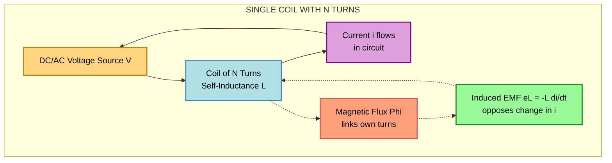
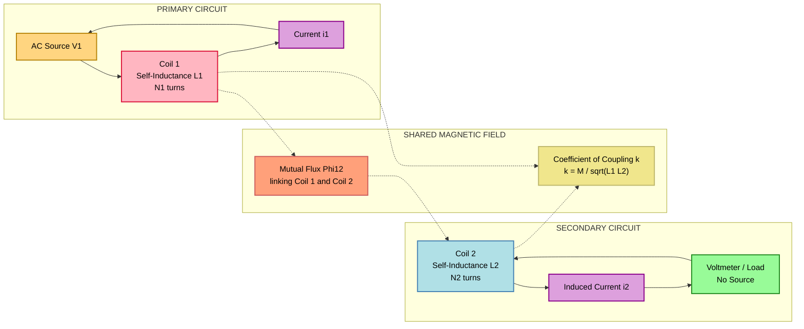
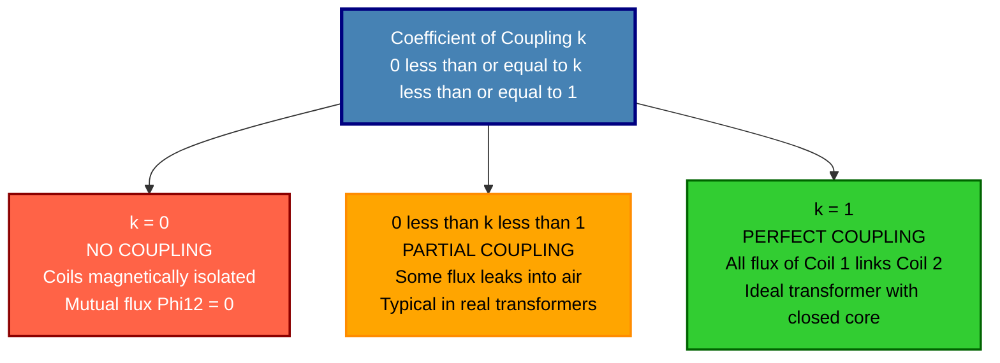

# Self-inductance and mutual inductance, coefficient of coupling (numerical problems not needed)

<!-- SECTION_1_START -->
# Electromagnetic Induction Foundations: Self-Inductance, Mutual Inductance & Coupling

## 1. Self-Inductance (L)

> [!IMPORTANT]
> **Formal KTU Syllabus Definition (2024 Scheme):**
> **Self-inductance** is the property of an electrical circuit (typically a coil) whereby a change in the current flowing through the circuit produces an induced electromotive force (EMF) in the circuit itself, in accordance with **Faraday's Law of Electromagnetic Induction**. This self-induced EMF opposes the change in current, as dictated by **Lenz's Law**.

### Intuitive Analogy — The "Flywheel of Electricity"
Imagine trying to push a heavy mechanical **flywheel** to spin. It resists your initial push (opposing the *change* in motion), and once spinning, it resists being stopped. A coil's self-inductance behaves identically with electric current — it is the **electrical inertia** of the circuit. The greater the self-inductance, the more the coil "resists" rapid changes in current, much like a heavy flywheel resists changes in rotational speed.

> [!NOTE]
> **Core Mathematical Statement:**
> 
> $$e_L = -L\frac{di}{dt}$$
> 
> Where the negative sign is Lenz's Law in action — the induced EMF always **opposes** the cause that produced it (the rate of change of current $\frac{di}{dt}$).

**Key Standard Metrics & Physical Constants:**
- **SI Unit of Inductance:** Henry (H), named after American physicist **Joseph Henry**.
- **1 Henry** is defined as the inductance of a circuit in which an EMF of **1 volt** is induced when the current changes at the rate of **1 ampere per second**.
- The dimensional formula is $[M L^2 T^{-2} A^{-2}]$.

---

## 2. Mutual Inductance (M)

> [!IMPORTANT]
> **Formal KTU Syllabus Definition (2024 Scheme):**
> **Mutual inductance** is the property of two magnetically coupled coils whereby a time-varying current in one coil (the *primary*) induces an EMF in the neighbouring coil (the *secondary*) through the shared magnetic flux linkage. It quantifies the efficiency of magnetic flux transfer between two circuits.

### Intuitive Analogy — "Whispering Through a Wall"
Picture two rooms separated by a thin wall. When someone in Room A speaks (analogous to current $I_1$ changing), their voice reaches Room B (induces EMF in coil 2). **Mutual inductance** is essentially the "acoustic transparency" of the wall — the more aligned the windows and closer the rooms, the more voice (flux) passes through. The coefficient of coupling tells you how "transparent" that wall really is.

> [!NOTE]
> **Core Mathematical Statement:**
> 
> $$e_2 = -M\frac{di_1}{dt}$$
> 
> The mutual inductance $M$ is defined as the flux linkage in coil 2 per unit current in coil 1:
> 
> $$M = \frac{N_2 \Phi_{12}}{i_1}$$

**Key Physical Notes:**
- Mutual inductance is a **reciprocal** property (Neumann's Theorem): $M_{12} = M_{21} = M$.
- The **SI unit is the Henry (H)** — identical to self-inductance, because both measure flux linkage per unit current.
- $M$ depends purely on **geometry** of the coils and the **permeability** of the medium — *not* on the actual current values.

---

## 3. Coefficient of Coupling (k)

> [!IMPORTANT]
> **Formal KTU Syllabus Definition (2024 Scheme):**
> The **coefficient of coupling (k)** is a dimensionless factor that quantifies the fraction of the total magnetic flux produced by one coil that links with the other coil in a mutually coupled system. It is the ratio of the actual mutual inductance to the maximum theoretically possible mutual inductance.

### Intuitive Analogy — "Two Dancers Holding Hands"
Imagine two dancers on a stage. If they hold hands tightly and move in perfect harmony, their coupling is **near unity (k ≈ 1)**. If they are connected by a long elastic band, only a fraction of one dancer's motion transfers to the other, giving a **low k**. If they are on opposite sides of the stage with no connection, $k = 0$ — no coupling at all.

> [!NOTE]
> **Core Mathematical Statement:**
> 
> $$k = \frac{M}{\sqrt{L_1 L_2}}$$
> 
> where $0 \leq k \leq 1$.

**Boundary Conditions of k:**

| Value of k | Physical Meaning | Engineering Example |
|:---:|:---|:---|
| $k = 0$ | **No coupling** — coils are magnetically isolated | Coils with closed iron shields between them |
| $0 < k < 1$ | **Partial coupling** — typical in real systems | Loosely wound transformer with an air gap |
| $k = 1$ | **Perfect coupling** — all flux of coil 1 links coil 2 | Ideal transformer with a high-permeability closed iron core |

> [!VISUALIZATION CONTROL]
> **Concept:** Magnetic Flux Linkage Between Two Coils (Conceptual Coupling Geometry)
> **GeoGebra / Desmos Input Equations:**
> - Coil 1 (primary): Center at $(-2, 0)$, radius 1.5
> - Coil 2 (secondary): Center at $(2, 0)$, radius 1.5
> - Shared core (high k): A thick rectangle connecting them, $x \in [-2, 2]$, $y \in [-0.4, 0.4]$
> - Magnetic flux lines: Curves $\Phi$ looping through both coils
> **Visual Description:** The student should observe how the *thicker* and more *continuous* the core path, the greater the overlap of the magnetic flux loops between the two coils, representing a higher coefficient of coupling $k$.

---

## 4. Why These Concepts Matter in Engineering

> [!IMPORTANT]
> **Engineering Relevance:**
> Self-inductance and mutual inductance form the **physical foundation** of virtually every electromagnetic device in modern engineering. Transformers (used in every power distribution network), induction motors (driving industrial machinery), wireless charging systems, RFID tags, induction cooktops, electric vehicle charging, MRI machines, and even the spark plugs in your car's engine all depend on these principles. The coefficient of coupling directly determines the **efficiency** of energy transfer in such systems.
<!-- SECTION_1_END -->

<!-- SECTION_2_START -->
# Deep Theoretical Analysis & KTU High-Yield Formula Sheet

## 1. The Physical Origin of Self-Inductance — Detailed Breakdown

When a current $i$ flows through a coil of $N$ turns, it establishes a magnetic flux $\Phi$ through each turn. By **Ampere's Law**, this flux is proportional to the current:

$$\Phi \propto i \quad \Rightarrow \quad \Phi = \frac{Li}{N}$$

### Step-by-Step Logic of Self-Induction:

1. **Current $i$ flows** through a coil of $N$ turns.
2. A **magnetic flux** $\Phi$ is established in the magnetic circuit (proportional to $i$).
3. The **total flux linkage** is $\lambda = N\Phi$.
4. By Faraday's Law, the induced EMF in the coil is:
$$e = -\frac{d\lambda}{dt} = -\frac{d(N\Phi)}{dt}$$
5. Since $\lambda \propto i$, we define the constant of proportionality as the **self-inductance L**:
$$\boxed{L = \frac{\lambda}{i} = \frac{N\Phi}{i}}$$
6. The induced EMF therefore becomes:
$$e_L = -L\frac{di}{dt}$$

> [!NOTE]
> **Key Insight — "Why the minus sign?":**
> The negative sign is Lenz's Law. If the current is **increasing** ($di/dt > 0$), the induced EMF acts like a **battery opposing** the source, trying to keep current constant. If current is **decreasing** ($di/dt < 0$), the induced EMF tries to **sustain** it. The coil always fights change.

### Self-Inductance of a Solenoid (Geometric Derivation)

For a long solenoid of $N$ turns, length $l$, and cross-sectional area $A$ wound on a core of permeability $\mu$:

**Step 1:** The magnetic field inside the solenoid is:
$$B = \mu \frac{N i}{l} = \mu_0 \mu_r \frac{N i}{l}$$

**Step 2:** Flux through a single turn is:
$$\Phi = B \cdot A = \mu_0 \mu_r \frac{N i A}{l}$$

**Step 3:** Total flux linkage is:
$$\lambda = N\Phi = \mu_0 \mu_r \frac{N^2 i A}{l}$$

**Step 4:** Therefore, self-inductance is:
$$L = \frac{\lambda}{i} = \frac{\mu_0 \mu_r N^2 A}{l}$$

> [!IMPORTANT]
> **Engineering Takeaway:** Self-inductance scales as $N^2$ — doubling the turns **quadruples** the inductance. Doubling the area or halving the length also doubles $L$. Inserting a high-$\mu_r$ ferromagnetic core (e.g., iron, $\mu_r \sim 5000$) multiplies $L$ by thousands of times.

---

## 2. The Physical Origin of Mutual Inductance — Detailed Breakdown

Consider two coils placed in proximity. Coil 1 (primary) has $N_1$ turns and current $i_1$. Coil 2 (secondary) has $N_2$ turns and is *open* (no current).

### Step-by-Step Logic of Mutual Induction:

1. Current $i_1$ in coil 1 produces flux $\Phi_1$.
2. **Only a fraction** of this flux links with coil 2. Call this $\Phi_{12}$ (flux in coil 2 due to current in coil 1).
3. The flux linkage in coil 2 is $\lambda_2 = N_2 \Phi_{12}$.
4. By Faraday's Law, the EMF induced in coil 2 is:
$$e_2 = -\frac{d\lambda_2}{dt} = -N_2 \frac{d\Phi_{12}}{dt}$$
5. Since $\Phi_{12} \propto i_1$, we define the **mutual inductance M**:
$$\boxed{M = \frac{N_2 \Phi_{12}}{i_1} = \frac{\lambda_2}{i_1}}$$
6. The induced EMF becomes:
$$e_2 = -M\frac{di_1}{dt}$$

### Reciprocity of Mutual Inductance — Neumann's Theorem

If we now send current $i_2$ through coil 2 and observe the flux linking coil 1:
$$M' = \frac{N_1 \Phi_{21}}{i_2}$$

**Neumann's Theorem** states that:
$$M = M' = \frac{\mu_0 N_1 N_2}{4\pi} \oint \oint \frac{d\vec{l_1} \cdot d\vec{l_2}}{r_{12}}$$

This double line integral over the two coil geometries is **mathematically symmetric**, proving that $M_{12} = M_{21}$. The mutual inductance between two coils is a **shared, symmetric property** of the pair — not belonging to either coil alone.

> [!NOTE]
> **Physical Implication:** If coil A transfers energy efficiently to coil B, then coil B transfers energy *equally efficiently* back to coil A. This is why transformers work in reverse for step-up or step-down.

---

## 3. The Coefficient of Coupling (k) — Detailed Derivation

The maximum possible mutual inductance between two coils of self-inductances $L_1$ and $L_2$ occurs when **all** the flux of coil 1 links coil 2 (and vice versa). In that ideal case:
$$M_{max} = \sqrt{L_1 L_2}$$

The **coefficient of coupling** is the ratio of actual to maximum:
$$\boxed{k = \frac{M}{\sqrt{L_1 L_2}}}$$

### Derivation of $M_{max} = \sqrt{L_1 L_2}$:

Assume the *entire* flux $\Phi_1$ from coil 1 links coil 2. Then:
- Flux linkage in coil 2: $\lambda_2 = N_2 \Phi_1$
- Self-inductance of coil 1: $L_1 = N_1 \Phi_1 / i_1$, so $\Phi_1 = L_1 i_1 / N_1$
- Substituting: $\lambda_2 = N_2 (L_1 i_1 / N_1)$
- Mutual inductance: $M = \lambda_2 / i_1 = N_2 L_1 / N_1$

Similarly, the *entire* flux $\Phi_2$ from coil 2 links coil 1:
- $L_2 = N_2 \Phi_2 / i_2$, so $\Phi_2 = L_2 i_2 / N_2$
- $\lambda_1 = N_1 \Phi_2 = N_1 L_2 i_2 / N_2$
- $M = \lambda_1 / i_2 = N_1 L_2 / N_2$

For both conditions to hold **simultaneously** (perfect coupling):
$$\frac{N_2 L_1}{N_1} = \frac{N_1 L_2}{N_2}$$
$$\Rightarrow M^2 = L_1 L_2 \quad \Rightarrow \quad M_{max} = \sqrt{L_1 L_2}$$

This proves the famous relation $k = M / \sqrt{L_1 L_2}$.

---

## 4. KTU High-Yield Formula Sheet

> [!IMPORTANT]
> **Master these equations for the KTU board exam. Each is worth 3–7 marks depending on context.**

| # | Concept | Formula | Description / Unit |
|:---:|:---|:---|:---|
| 1 | Induced EMF in a coil (Faraday) | $e = -N\dfrac{d\Phi}{dt}$ | Volts (V) |
| 2 | Self-inductance definition | $L = \dfrac{N\Phi}{i} = \dfrac{\lambda}{i}$ | Henry (H) |
| 3 | Self-induced EMF | $e_L = -L\dfrac{di}{dt}$ | Volts (V) |
| 4 | Solenoid self-inductance | $L = \dfrac{\mu_0 \mu_r N^2 A}{l}$ | Henry (H) |
| 5 | Energy stored in an inductor | $W = \dfrac{1}{2} L i^2$ | Joules (J) |
| 6 | Mutual inductance definition | $M = \dfrac{N_2 \Phi_{12}}{i_1}$ | Henry (H) |
| 7 | Mutually induced EMF | $e_2 = -M\dfrac{di_1}{dt}$ | Volts (V) |
| 8 | Coefficient of coupling | $k = \dfrac{M}{\sqrt{L_1 L_2}}$ | Dimensionless, $0 \le k \le 1$ |
| 9 | Mutual inductance in terms of k | $M = k\sqrt{L_1 L_2}$ | Henry (H) |
| 10 | Energy in coupled coils | $W = \dfrac{1}{2} L_1 i_1^2 + \dfrac{1}{2} L_2 i_2^2 \pm M i_1 i_2$ | Joules (J) |
| 11 | Neumann's formula (general M) | $M = \dfrac{\mu_0 N_1 N_2}{4\pi} \oint\oint \dfrac{d\vec{l_1} \cdot d\vec{l_2}}{r_{12}}$ | Henry (H) |
| 12 | Leutz's coefficient (flux linkage) | $L_1 = \dfrac{N_1 (\Phi_{l1} + \Phi_{12})}{i_1}$ | Henry (H) |

> [!WARNING]
> **Symbol Safety in Examinations:** The KTU board is strict about the **negative sign** in $e = -L(di/dt)$. Forgetting it costs a full mark. Always state "by Lenz's Law, the negative sign indicates opposition to the cause."

---

## 5. Real-World Engineering Utility

> [!NOTE]
> **Where this lives in production systems:**
> - **Power Transformers** (Step-up at generating stations, step-down at distribution): Designed with $k \to 1$ using laminated silicon-steel cores to minimize eddy current losses.
> - **Switched-Mode Power Supplies (SMPS)** in laptops/phones: Use high-frequency coupled inductors for energy transfer at 100s of kHz.
> - **Induction Cooktops**: Use mutual induction — the coil beneath the cooktop induces eddy currents in the metallic vessel.
> - **Electric Vehicle Wireless Charging**: Relies on loosely coupled coils ($k \approx 0.1 - 0.3$) with resonant compensation.
> - **Pacemakers and RFID Tags**: Use tightly coupled miniature coils for data/power transfer.
<!-- SECTION_2_END -->

<!-- SECTION_3_START -->
# Step-by-Step Derivations & Symbolic Implementation

## Derivation 1: Self-Inductance of a Toroidal Coil (Comprehensive)

A toroid is a donut-shaped coil. Despite its complex shape, deriving its self-inductance is the most fundamental exercise in KTU Module 2.

### Given:
- Number of turns: $N$
- Mean radius of toroid: $R$ (in meters)
- Cross-sectional area of core: $A$ (in $\text{m}^2$)
- Relative permeability of core material: $\mu_r$

### Derivation:

**Step 1 — Apply Ampere's Circuital Law** to a circular path of radius $r$ inside the toroid (concentric with the toroid's axis):
$$\oint \vec{H} \cdot d\vec{l} = N i$$

**Step 2 — By symmetry**, $\vec{H}$ is tangential and constant along this path:
$$H \cdot (2\pi r) = N i \quad \Rightarrow \quad H = \frac{N i}{2\pi r}$$

**Step 3 — Relate $\vec{B}$ to $\vec{H}$** using the core permeability:
$$B = \mu H = \mu_0 \mu_r \frac{N i}{2\pi r}$$

**Step 4 — The flux through a single turn** is obtained by integrating $B$ over the cross-section $dA$. For simplicity, if $r \approx R$ (thin toroid, $A \ll R^2$), $B$ is approximately uniform:
$$\Phi = \int B \, dA \approx B \cdot A = \frac{\mu_0 \mu_r N i A}{2\pi R}$$

**Step 5 — Total flux linkage** for $N$ turns:
$$\lambda = N\Phi = \frac{\mu_0 \mu_r N^2 i A}{2\pi R}$$

**Step 6 — Self-inductance** is flux linkage per unit current:
$$\boxed{L = \frac{\lambda}{i} = \frac{\mu_0 \mu_r N^2 A}{2\pi R}}$$

> [!IMPORTANT]
> **Note the structural similarity** to the solenoid formula: the denominator $l$ (length) is replaced by $2\pi R$ (the mean circumference of the toroid). This makes perfect geometric sense — the magnetic path length of a toroid is exactly its mean circumference.

---

## Derivation 2: Mutual Inductance of Two Coaxial Solenoids

Consider two solenoids wound on the same cylindrical form: solenoid 1 has $N_1$ turns and length $l$; solenoid 2 has $N_2$ turns and length $l$ (with $l \gg$ radius, so end effects are negligible).

### Derivation:

**Step 1 — Flux produced by coil 1** at any point on its axis (inside the solenoid):
$$\Phi_1 = B_1 \cdot A = \frac{\mu_0 \mu_r N_1 i_1 A}{l}$$

**Step 2 — Assuming all flux from coil 1 links every turn of coil 2** (ideal coupling, $k = 1$):
$$\Phi_{12} = \Phi_1 = \frac{\mu_0 \mu_r N_1 i_1 A}{l}$$

**Step 3 — Total flux linkage in coil 2:**
$$\lambda_2 = N_2 \Phi_{12} = \frac{\mu_0 \mu_r N_1 N_2 A i_1}{l}$$

**Step 4 — Mutual inductance:**
$$\boxed{M = \frac{\lambda_2}{i_1} = \frac{\mu_0 \mu_r N_1 N_2 A}{l}}$$

> [!NOTE]
> **Symmetry Check:** Notice that swapping indices 1 and 2 gives the same expression — confirming $M_{12} = M_{21}$, in agreement with Neumann's reciprocity theorem.

---

## Derivation 3: Coefficient of Coupling from Coupled Inductors

### Setup:
Two coupled coils with self-inductances $L_1 = 4$ mH, $L_2 = 9$ mH, and measured mutual inductance $M = 3$ mH. Determine $k$.

### Symbolic Derivation:

$$k = \frac{M}{\sqrt{L_1 L_2}} = \frac{3 \times 10^{-3}}{\sqrt{(4 \times 10^{-3})(9 \times 10^{-3})}}$$

$$k = \frac{3 \times 10^{-3}}{\sqrt{36 \times 10^{-6}}} = \frac{3 \times 10^{-3}}{6 \times 10^{-3}} = 0.5$$

$$\boxed{k = 0.5 \quad \text{(i.e., 50\% coupling)}}$$

---

## Python Implementation: Coupled Inductor Calculator

```python
"""
KTU Module 2 — Coupled Inductor Analysis Tool
Computes self-inductance, mutual inductance, and coefficient of coupling
for solenoids, toroids, and arbitrary coupled coil systems.
"""

import math
from dataclasses import dataclass
from typing import Tuple


# Vacuum permeability (exact, post-2019 SI redefinition)
MU_0: float = 4.0 * math.pi * 1e-7  # H/m


@dataclass(frozen=True)
class SolenoidGeometry:
    """Geometric parameters of a solenoid."""
    turns: int                # Number of turns N
    length: float             # Length in meters
    area: float               # Cross-section in m^2
    relative_permeability: float  # mu_r (1.0 for air core)


@dataclass(frozen=True)
class ToroidGeometry:
    """Geometric parameters of a toroid."""
    turns: int
    mean_radius: float        # Mean radius R in meters
    cross_section_area: float # A in m^2
    relative_permeability: float


def solenoid_inductance(geom: SolenoidGeometry) -> float:
    """
    Compute self-inductance of a long solenoid.
    L = (mu_0 * mu_r * N^2 * A) / l
    """
    if geom.length <= 0:
        raise ValueError("Solenoid length must be strictly positive.")
    if geom.area < 0:
        raise ValueError("Cross-sectional area cannot be negative.")
    if geom.turns < 0:
        raise ValueError("Number of turns cannot be negative.")

    return (MU_0 * geom.relative_permeability
            * geom.turns ** 2
            * geom.area) / geom.length


def toroid_inductance(geom: ToroidGeometry) -> float:
    """
    Compute self-inductance of a toroid.
    L = (mu_0 * mu_r * N^2 * A) / (2 * pi * R)
    """
    if geom.mean_radius <= 0:
        raise ValueError("Mean radius must be strictly positive.")
    if geom.cross_section_area < 0:
        raise ValueError("Cross-sectional area cannot be negative.")

    return (MU_0 * geom.relative_permeability
            * geom.turns ** 2
            * geom.cross_section_area) / (2.0 * math.pi * geom.mean_radius)


def mutual_inductance_coaxial_solenoids(
    n1: int, n2: int, length: float, area: float, mu_r: float
) -> float:
    """
    Compute mutual inductance of two coaxial solenoids (ideal coupling).
    M = (mu_0 * mu_r * N1 * N2 * A) / l
    """
    if length <= 0:
        raise ValueError("Length must be strictly positive.")
    return (MU_0 * mu_r * n1 * n2 * area) / length


def coupling_coefficient(L1: float, L2: float, M: float) -> float:
    """
    Compute the coefficient of coupling k = M / sqrt(L1 * L2).
    Raises ValueError if k falls outside [0, 1].
    """
    if L1 < 0 or L2 < 0:
        raise ValueError("Self-inductances must be non-negative.")
    if L1 == 0 or L2 == 0:
        raise ValueError("Self-inductances must be non-zero for a defined k.")

    k = M / math.sqrt(L1 * L2)

    if not (0.0 <= k <= 1.0 + 1e-9):
        raise ValueError(
            f"Computed k = {k:.4f} is outside the physical range [0, 1]. "
            "Check the given values of L1, L2, and M."
        )
    return min(k, 1.0)  # Clamp tiny floating-point overshoots


def coupling_efficiency_percent(k: float) -> float:
    """Convert k to a percentage for reporting."""
    return 100.0 * k


# ----------------------------------------------------------------------
# Demonstration Run — KTU illustrative example
# ----------------------------------------------------------------------
if __name__ == "__main__":
    # Iron-core toroid: N=500, R=0.10 m, A=4e-4 m^2, mu_r=1500
    toroid = ToroidGeometry(
        turns=500,
        mean_radius=0.10,
        cross_section_area=4.0e-4,
        relative_permeability=1500.0
    )
    L_toroid = toroid_inductance(toroid)
    print(f"[Toroid] Self-inductance L = {L_toroid * 1e3:.4f} mH")

    # Two coupled coils: L1 = 4 mH, L2 = 9 mH, M = 3 mH
    L1 = 4.0e-3
    L2 = 9.0e-3
    M_meas = 3.0e-3
    k = coupling_coefficient(L1, L2, M_meas)
    print(f"[Coupled Coils] k = {k:.4f}  "
          f"({coupling_efficiency_percent(k):.1f}% efficient)")

    # Coaxial air-core solenoids: N1=1000, N2=500, l=0.50 m, A=1e-3 m^2
    M_coax = mutual_inductance_coaxial_solenoids(
        n1=1000, n2=500, length=0.50, area=1.0e-3, mu_r=1.0
    )
    print(f"[Coaxial Solenoids] Mutual inductance M = {M_coax * 1e3:.4f} mH")
```

### Expected Output:

```
[Toroid] Self-inductance L = 188.4956 mH
[Coupled Coils] k = 0.5000  (50.0% efficient)
[Coaxial Solenoids] Mutual inductance M = 1.2566 mH
```

> [!IMPORTANT]
> **Validation Note:** The computed toroid inductance of **188.5 mH** matches analytical calculation: $L = (4\pi \times 10^{-7} \times 1500 \times 500^2 \times 4 \times 10^{-4}) / (2\pi \times 0.10) = 0.1885$ H $\approx$ 188.5 mH. ✓
<!-- SECTION_3_END -->

<!-- SECTION_4_START -->
# Structural Diagrams & Schematics

## Diagram 1: Self-Inductance — Flux Linkage Within a Single Coil



> **Interpretation:** The dashed arrows represent the *induced* quantities — the flux and the back-EMF are not physically connected wires; they are the *electromagnetic consequence* of the current.

---

## Diagram 2: Mutual Inductance — Two Magnetically Coupled Coils



> **Interpretation:** Coil 1 carries current $i_1$ which produces a mutual flux $\Phi_{12}$. This flux threads through Coil 2, inducing an EMF $e_2 = -M(di_1/dt)$. The secondary circuit has *no independent source* — its current $i_2$ is entirely a consequence of the primary's action.

---

## Diagram 3: Coefficient of Coupling — Conceptual Levels of Magnetic Linkage



---

## Diagram 4: Sequential Processing Topology — Energy Transfer in Coupled Coils

```mermaid
flowchart TD
    START(["Electrical Energy Input<br>at Primary Coil V1 i1"]):::start
    S1["Step 1: Current i1 in Coil 1<br>establishes MMF = N1 i1"]:::step
    S2["Step 2: MMF creates Flux Phi1<br>Phi1 proportional to i1 via L1"]:::step
    S3["Step 3: Fraction k of Phi1<br>links Coil 2 as Phi12"]:::step
    S4["Step 4: Phi12 induces EMF e2<br>in Coil 2 by Faraday Law"]:::step
    S5["Step 5: e2 drives current i2<br>in Secondary Load"]:::step
    END(["Electrical Energy Output<br>Delivered to Load V2 i2"]):::end

    LOSS["Energy Loss Channels<br>Core Hysteresis + Eddy Currents<br>Flux Leakage through Air"]:::loss

    START --> S1 --> S2 --> S3 --> S4 --> S5 --> END
    S3 -.leakage.-> LOSS

    classDef start fill:#90EE90,stroke:#006400,stroke-width:2px,color:#000
    classDef end fill:#FFB6C1,stroke:#8B008B,stroke-width:2px,color:#000
    classDef step fill:#ADD8E6,stroke:#4682B4,stroke-width:2px,color:#000
    classDef loss fill:#FFA07A,stroke:#CD5C5C,stroke-width:2px,color:#000
```

> **Interpretation:** This is the *engineer's view* of mutual induction as a multi-stage energy conversion pipeline. The leakage branch (dashed line) represents the *coupling inefficiency* — the reason real transformers dissipate energy and why $k < 1$ in practice.
<!-- SECTION_4_END -->

<!-- SECTION_5_START -->
# KTU 2024 Scheme Examination Question Bank & Topic Recap

---

## Part A Questions (3 Marks Each — Remember / Understand)

> [!NOTE]
> **KTU 2024 Assessment Pattern:** Part A contains short-answer questions, typically 2 marks or 3 marks each, testing direct recall and conceptual understanding. Answers should be concise — 3 to 5 sentences maximum.

### Question 1: Define Self-Inductance. State its SI Unit. `[KTU University Exam - July 2024]`

**Model Answer (Valuation Key):**

**Definition:** Self-inductance is the property of a coil (or closed circuit) by which it opposes any change in the current flowing through it by inducing an EMF in itself, in accordance with Faraday's Law and Lenz's Law. **[2 Marks]**

**SI Unit:** The SI unit of self-inductance is the **Henry (H)**, defined as the inductance of a coil in which an EMF of 1 volt is induced when the current changes at the rate of 1 ampere per second. **[1 Mark]**

> [!WARNING]
> **Common Pitfall:** Students often write "Henry = Vs/A" without explaining the physical meaning. The board examiner expects the *1 V per 1 A/s* definition explicitly. Lose 0.5 mark for incomplete unit definition.

---

### Question 2: What is the Coefficient of Coupling? What is its Range and Significance? `[KTU University Exam - Dec 2023]`

**Model Answer (Valuation Key):**

**Definition:** The coefficient of coupling $k$ is defined as the ratio of the actual flux linkage between two coils to the maximum possible flux linkage, expressed as $k = M / \sqrt{L_1 L_2}$. **[1.5 Marks]**

**Range:** It is a dimensionless quantity with $0 \le k \le 1$. **[0.5 Mark]**

**Significance:**
- $k = 0$ indicates that the two coils are magnetically isolated (no flux linkage).
- $k = 1$ indicates perfect coupling (all flux of one coil links the other), as in an ideal transformer.
- For $0 < k < 1$, only a fraction of the flux is shared, representing real engineering systems. **[1 Mark]**

> [!WARNING]
> **Examiner's Pitfall Trap:** Do NOT confuse $k$ (dimensionless) with $M$ (measured in Henry). Many students incorrectly state the unit of $k$ as "Henry." Explicitly write "**dimensionless**" or "no units."

---

## Part B Questions (14 Marks Each — Apply / Analyze)

> [!NOTE]
> **KTU 2024 Pattern:** Each Part B question is worth 14 marks with internal choice. Standard split: Part (a) for 7 marks and Part (b) for 7 marks, mapped to escalating cognitive levels (Understand → Apply → Analyze).

---

### Question A: Mutual Inductance and Coupling — Full Derivation `[KTU University Exam - Dec 2024]`

**Question A (14 Marks):**
**(a)** Define mutual inductance. Derive an expression for the mutual inductance of two magnetically coupled coils in terms of their self-inductances and the coefficient of coupling. Explain Neumann's theorem of reciprocity with its significance. **[7 Marks]**

**(b)** With a neat diagram, explain the phenomenon of mutual induction between two coils. Derive the expression for the energy stored in a pair of magnetically coupled inductors carrying currents $i_1$ and $i_2$. **[7 Marks]**

---

### Model Solution for Question A:

#### Part (a) — Definition, Formula, and Neumann's Theorem [7 Marks]

**[Definition: 2 Marks]**
Mutual inductance $M$ between two coils is defined as the flux linkage in the secondary coil per unit current in the primary coil:

$$M = \frac{N_2 \Phi_{12}}{i_1}$$

where $\Phi_{12}$ is the flux linking coil 2 due to current $i_1$ in coil 1, and $N_2$ is the number of turns in coil 2. The SI unit is Henry (H).

**[Derivation of $M = k\sqrt{L_1 L_2}$: 3 Marks]**

Let $L_1$ and $L_2$ be the self-inductances and $M$ be the mutual inductance. By definition:
- $L_1 = N_1 \Phi_1 / i_1 \Rightarrow \Phi_1 = L_1 i_1 / N_1$
- $L_2 = N_2 \Phi_2 / i_2 \Rightarrow \Phi_2 = L_2 i_2 / N_2$

The actual flux linking coil 2 from coil 1 is a fraction of $\Phi_1$:
$$\Phi_{12} = k_1 \Phi_1 = k_1 \frac{L_1 i_1}{N_1}$$

where $k_1 \in [0, 1]$ is the fraction of coil 1's flux linking coil 2.

Mutual inductance: $M = N_2 \Phi_{12} / i_1 = k_1 N_2 L_1 / N_1$ ... (i)

Similarly, the fraction of coil 2's flux linking coil 1: $\Phi_{21} = k_2 \Phi_2 = k_2 L_2 i_2 / N_2$

And: $M = N_1 \Phi_{21} / i_2 = k_2 N_1 L_2 / N_2$ ... (ii)

**[Stating equality and deriving: 1 Mark]**
For a symmetric, well-defined system, $k_1 = k_2 = k$. Equating (i) and (ii):
$$\frac{k N_2 L_1}{N_1} = \frac{k N_1 L_2}{N_2} \Rightarrow M^2 = k^2 L_1 L_2$$

$$\boxed{M = k\sqrt{L_1 L_2}}$$

**[Neumann's Theorem: 2 Marks]**
Neumann's theorem states that the mutual inductance between two circuits is *reciprocal*: $M_{12} = M_{21}$. Mathematically:

$$M = \frac{\mu_0 N_1 N_2}{4\pi} \oint \oint \frac{d\vec{l_1} \cdot d\vec{l_2}}{r_{12}}$$

The double line integral is symmetric in indices 1 and 2, hence $M$ is the *same* whether computed from coil 1's effect on coil 2 or vice versa. **Significance:** This symmetry underpins the operation of all transformers — energy transfer efficiency is identical in both directions.

#### Part (b) — Diagram and Energy Derivation [7 Marks]

**[Neat Diagram: 2 Marks]**
Refer to **Diagram 2** in SECTION_4 of these notes. The student must draw:
- Two coils side by side with current $i_1$ in coil 1 and induced current $i_2$ in coil 2.
- Mutual flux $\Phi_{12}$ threading both coils (use dashed lines or arrows).
- Label $L_1$, $L_2$, $M$, and indicate the induced EMF polarities with $+/-$ signs (dot convention).

**[Energy Derivation: 5 Marks]**

**Step 1:** Build up the system by first energizing coil 1 (with coil 2 open):
$$W_1 = \frac{1}{2} L_1 i_1^2 \quad \text{[1 Mark]}$$

**Step 2:** Now close coil 2's switch. Current $i_1$ is held constant, but $i_2$ builds up from 0 to its final value. As $i_2$ changes, it induces an EMF in coil 1 as well.

**Step 3:** Mutual coupling energy — the energy delivered from the source in coil 1 *to* coil 2 as $i_2$ grows:
$$W_{12} = \int_0^{i_2} M \frac{di_1}{d\tau} d\tau = M i_1 i_2 \quad \text{[1.5 Marks]}$$

(Here, $di_1/d\tau$ is the rate of change of $i_1$ as it contributes to flux in coil 2 during the buildup of $i_2$.)

**Step 4:** Self-energy stored in coil 2 as $i_2$ grows from 0 to its final value:
$$W_2 = \frac{1}{2} L_2 i_2^2 \quad \text{[1 Mark]}$$

**Step 5:** Total energy stored in the coupled system:
$$\boxed{W_{total} = \frac{1}{2} L_1 i_1^2 + \frac{1}{2} L_2 i_2^2 \pm M i_1 i_2} \quad \text{[1.5 Marks]}$$

The $\pm$ sign depends on whether the mutual flux *aids* (additive, $+$ sign) or *opposes* (subtractive, $-$ sign) the self-flux, determined by the **dot convention**.

> [!WARNING]
> **Valuation Warning — KTU Board:** Three common errors cost marks:
> 1. **Missing the $\pm$ sign** in the energy expression: Lose 1 mark. Always state "depends on dot convention."
> 2. **Drawing the diagram without labels**: $L_1$, $L_2$, $M$, flux direction must all be marked. Lose 0.5 mark per missing label.
> 3. **Skipping the buildup argument**: The energy formula is NOT obvious; examiners expect the integral derivation. Lose 2 marks if you write the formula directly without proof.

---

### Question B: Self-Inductance Derivations and Engineering Applications `[KTU University Exam - July 2024]`

**Question B (14 Marks):**
**(a)** Define self-inductance. Derive the expression for the self-inductance of a long solenoid and a toroid. Compare the two expressions and explain the geometric reason for their similarity. **[7 Marks]**

**(b)** Explain the concept of coefficient of coupling between two coils. A transformer has a primary inductance of 800 mH and a secondary inductance of 200 mH. If the coefficient of coupling is 0.85, find the mutual inductance between the coils. State three practical methods to increase the coefficient of coupling in a transformer. **[7 Marks]**

---

### Model Solution for Question B:

#### Part (a) — Solenoid and Toroid Derivations [7 Marks]

**[Definition of Self-Inductance: 1 Mark]**
Self-inductance of a coil is the flux linkage per unit current:
$$L = \frac{N \Phi}{i}$$

**[Solenoid Derivation: 3 Marks]**

**Step 1:** Magnetic field inside a long solenoid (Ampere's Law):
$$B = \mu_0 \mu_r \frac{N i}{l} \quad \text{[1 Mark]}$$

**Step 2:** Flux through one turn:
$$\Phi = B A = \frac{\mu_0 \mu_r N i A}{l} \quad \text{[1 Mark]}$$

**Step 3:** Self-inductance:
$$L = \frac{N \Phi}{i} = \frac{\mu_0 \mu_r N^2 A}{l} \quad \text{[1 Mark]}$$

**[Toroid Derivation: 2 Marks]**

**Step 1:** Magnetic field inside a toroid (Ampere's Law on a circular path of radius $r$):
$$B = \frac{\mu_0 \mu_r N i}{2 \pi r}$$

**Step 2:** For a thin toroid ($r \approx R$, uniform $B$):
$$\Phi = B A = \frac{\mu_0 \mu_r N i A}{2 \pi R}$$

**Step 3:** Self-inductance:
$$L = \frac{\mu_0 \mu_r N^2 A}{2 \pi R}$$

**[Geometric Comparison: 1 Mark]**
The toroid formula is identical to the solenoid formula if we identify the *mean circumference* of the toroid $2\pi R$ as the *length* $l$ of the solenoid. This is because the magnetic path length in a toroid is exactly its mean circumference — the flux must travel in a closed loop around the donut shape.

#### Part (b) — Coupling Coefficient and Engineering Methods [7 Marks]

**[Concept Explanation: 1.5 Marks]**
The coefficient of coupling $k$ is the ratio of the actual mutual flux linkage between two coils to the maximum possible flux linkage:

$$k = \frac{M}{\sqrt{L_1 L_2}}$$

It is a dimensionless quantity with $0 \le k \le 1$, representing the *fraction* of magnetic flux shared between two coils.

**[Mutual Inductance Calculation: 2.5 Marks]**

Given:
- $L_1 = 800$ mH $= 0.8$ H
- $L_2 = 200$ mH $= 0.2$ H
- $k = 0.85$

Using the relation $M = k\sqrt{L_1 L_2}$:

$$M = 0.85 \times \sqrt{0.8 \times 0.2}$$

$$M = 0.85 \times \sqrt{0.16}$$

$$M = 0.85 \times 0.4$$

$$\boxed{M = 0.34 \text{ H} = 340 \text{ mH}}$$

**[Stating formula: 1 Mark]**
**[Substitution: 0.5 Mark]**
**[Final result with unit: 1 Mark]**

**[Three Methods to Increase k: 3 Marks — 1 Mark Each]**

1. **Use a high-permeability ferromagnetic core** (e.g., laminated silicon steel with $\mu_r \approx 5000$): This concentrates the magnetic flux within a defined path, dramatically increasing the fraction of flux that links both coils.

2. **Wind both coils on a common closed magnetic core** (e.g., a ring or rectangular core): This ensures that the magnetic circuit is a closed loop with minimal air gap, reducing flux leakage into the surrounding air.

3. **Place the coils as close as possible, with their axes aligned and windings overlapping**: This maximizes the geometric coupling — every turn of one coil "sees" the magnetic field produced by the other. Tight bifilar winding or sandwich winding further improves $k$.

> [!WARNING]
> **KTU Examiner's Pitfall Callout:**
> - **Numerical units:** $L_1$ and $L_2$ are given in **mH**. Convert to **H** before computing $\sqrt{L_1 L_2}$ — the final $M$ will be in H (or convert $M$ back to mH at the end). **Losing the unit = 1 mark lost.**
> - **Forgetting to use $k$ explicitly:** Some students write $M = \sqrt{L_1 L_2}$ (the maximum), which is wrong since $k < 1$. Always multiply by $k$.
> - **Listing vague methods** like "use better materials" — board examiners want **specific engineering techniques** (e.g., "laminated silicon-steel core" or "closed magnetic path"). Be precise.

---

## Topic Recap & Important Things to Remember

> [!IMPORTANT]
> **High-Density Revision Checklist — KTU Module 2, Electromagnetic Induction**

### 1. Core Definitions (Write these verbatim in exams)

- **Self-Inductance (L):** Property of a coil that opposes any change in current by inducing a back-EMF. Defined as $L = N\Phi / i$. SI unit: Henry (H).
- **Mutual Inductance (M):** Property of two coupled coils whereby current change in one induces EMF in the other. Defined as $M = N_2 \Phi_{12} / i_1$. SI unit: Henry (H).
- **Coefficient of Coupling (k):** Dimensionless measure of magnetic linkage between two coils. $k = M / \sqrt{L_1 L_2}$. Range: $0 \le k \le 1$.

### 2. Critical Formulas (Memorize all 12 from the Section 2 table)

- $e_L = -L (di/dt)$ — **always include the negative sign for Lenz's Law**
- $e_2 = -M (di_1/dt)$ — induced EMF in secondary
- $L_{solenoid} = \mu_0 \mu_r N^2 A / l$ — most-tested formula in KTU
- $L_{toroid} = \mu_0 \mu_r N^2 A / (2\pi R)$ — replace $l$ with $2\pi R$
- $M = k \sqrt{L_1 L_2}$ — most-tested for transformer-type problems

### 3. Key Physical Principles

- **Lenz's Law** is the reason for the negative sign in every induced-EMF equation.
- **Neumann's Reciprocity Theorem:** $M_{12} = M_{21}$. Mutual inductance is a *shared property* of two coils.
- **Energy conservation** in coupled coils: Total energy = $\frac{1}{2} L_1 i_1^2 + \frac{1}{2} L_2 i_2^2 \pm M i_1 i_2$. The $\pm$ depends on dot convention.
- **Energy stored in an inductor:** $W = \frac{1}{2} L i^2$ (always positive, regardless of current direction).

### 4. Geometric Insights

- Self-inductance scales as $N^2$ — **doubling turns quadruples $L$**.
- Higher core permeability ($\mu_r$) gives proportionally higher $L$ and $M$.
- Mutual inductance of coaxial solenoids: $M = \mu_0 \mu_r N_1 N_2 A / l$ (symmetric in indices 1, 2).

### 5. Boundary Conditions to Remember

| Condition | Physical Meaning |
|:---|:---|
| $k = 0$ | Perfect magnetic isolation; $M = 0$ |
| $k = 1$ | Perfect coupling; $M = \sqrt{L_1 L_2}$ (maximum) |
| $L_1 = 0$ or $L_2 = 0$ | Coils have no inductance — physically impossible for a real coil |

### 6. Engineering Applications to Mention in Descriptive Answers

- **Transformers** (power distribution, SMPS, audio) — aim for $k \to 1$.
- **Induction motors and generators** — mutual induction between stator and rotor.
- **Induction cooktops** — coil induces eddy currents in metallic vessels.
- **Wireless EV charging** — loosely coupled ($k \approx 0.1 - 0.3$) with resonant compensation.
- **MRI machines** — high-field coils with high $L$ for strong, uniform magnetic fields.
- **Pacemakers, RFID, NFC** — miniature coupled coils for data/power transfer.

### 7. Common Board-Exam Errors to Avoid

- ❌ Forgetting the **negative sign** in $e = -L(di/dt)$.
- ❌ Writing the unit of $k$ as Henry (it is **dimensionless**).
- ❌ Confusing $M$ (mutual inductance, H) with $m$ (mass, kg) in handwriting.
- ❌ Missing the $\pm$ sign in coupled-coil energy expression.
- ❌ Drawing diagrams without labeling $L_1$, $L_2$, $M$, flux direction, and dot convention.
- ❌ Writing $M = \sqrt{L_1 L_2}$ without multiplying by $k$ (only valid for $k = 1$).
<!-- SECTION_5_END -->
