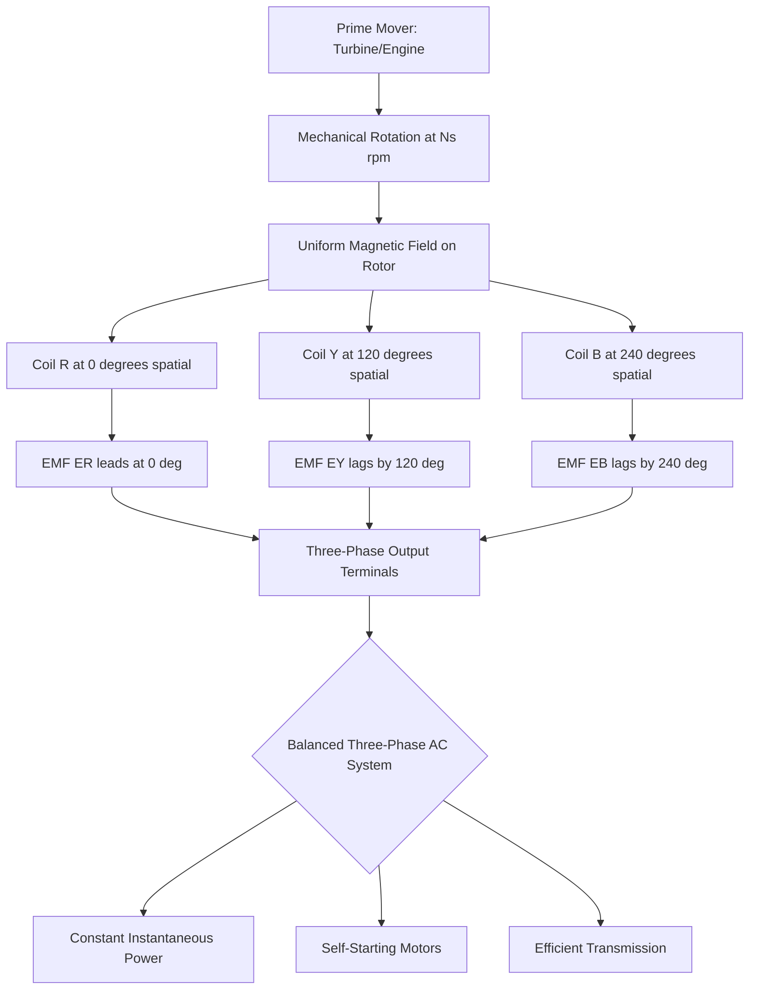
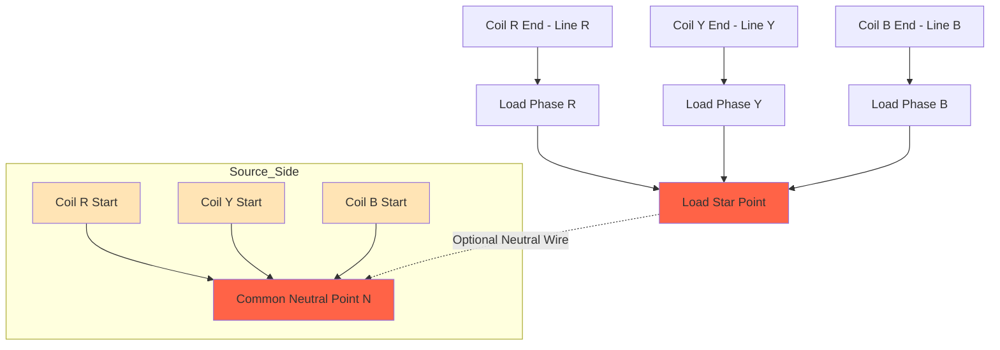
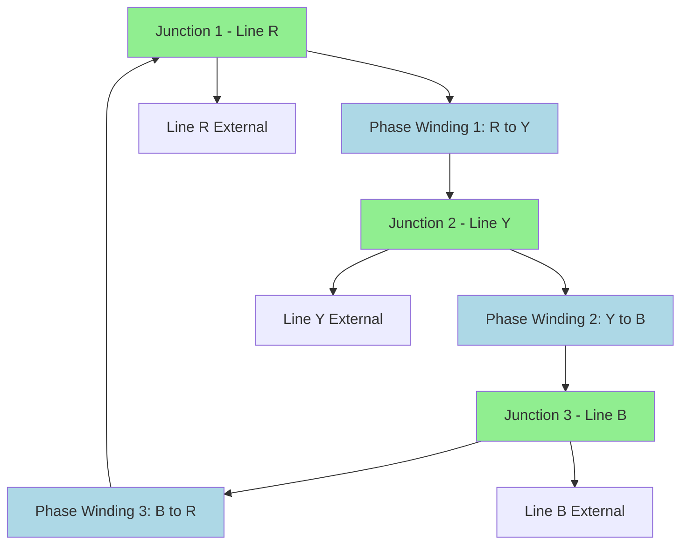
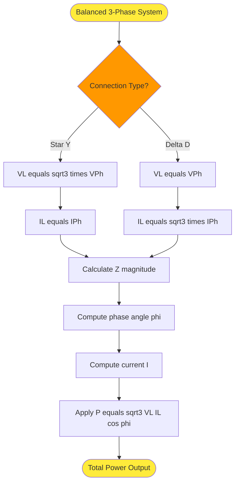

# Three phase AC systems: Generation of three phase voltages, advantages, star and delta connections (balanced only), relation between line and phase parameters numerical problems

<!-- SECTION_1_START -->

# Three-Phase AC Systems: Foundations, Generation & Advantages

## 1.1 Formal KTU 2024 Definition

> [!NOTE]
> **Three-Phase AC System (KTU 2024 Syllabus Definition):**
> A **polyphase system** in which three sinusoidal EMFs of the **same frequency** and **same magnitude** are generated, displaced from each other by a uniform phase angle of **120°** (i.e., $\frac{2\pi}{3}$ radians) in time. The system is termed *balanced* when the three loads (or sources) are identical in magnitude and phase angle.

**Key Standard Metrics (per KTU 2024 Scheme):**
- Standard Supply Frequency in India: **$f = 50\text{ Hz}$**
- Standard Supply Frequency in USA/Some KTU Reference Material: **$f = 60\text{ Hz}$**
- Phase Displacement: **$120°$** (electrical)
- Phase Sequence: **R – Y – B** (Red, Yellow, Blue) or **R – B – Y** (reverse)

---

## 1.2 Intuitive Analogy: The Synchronized Three-Pendulum System

Imagine **three identical swings** in a playground, side by side. A single child pushes the middle swing, and the motion transfers through the frame such that:

- Swing A reaches its **maximum forward swing** first,
- Swing B reaches its maximum **120° of motion later** (in time),
- Swing C reaches its maximum **240° of motion later** (in time).

A three-phase voltage system works identically: instead of swings, we have three **coils rotating in a magnetic field**, producing voltages that peak one after another in a continuous, smooth cycle.

**Geometric Intuition:** If you plot the three voltages on a circle, they form an **equilateral triangle of phasors** rotating counter-clockwise. The tip of each voltage phasor traces a sine wave, but the three waves are offset in time by $\frac{T}{3}$, where $T$ is the time period.

> [!IMPORTANT]
> **Why 120° and not 90° or 60°?**
> With $n$ phases, the optimum phase shift is $\frac{360°}{n}$. For $n=3$, this gives $120°$, which mathematically guarantees a **constant total instantaneous power** in a balanced system — a property no single-phase system can offer.

---

## 1.3 Phasor Visualization

The three-phase voltages can be written as instantaneous equations:

$$
e_R(t) = E_m \sin(\omega t)
$$

$$
e_Y(t) = E_m \sin\left(\omega t - \frac{2\pi}{3}\right)
$$

$$
e_B(t) = E_m \sin\left(\omega t - \frac{4\pi}{3}\right)
$$

In phasor form (RMS representation):

$$
\vec{E_R} = E \angle 0°
$$

$$
\vec{E_Y} = E \angle -120°
$$

$$
\vec{E_B} = E \angle -240° = E \angle +120°
$$

> [!VISUALIZATION CONTROL]
> **Concept:** Three-Phase Voltage Phasor Diagram (Balanced RYB Sequence)
> **GeoGebra / Desmos Input Equations (Polar):**
> * Point R: $(1; 0°)$
> * Point Y: $(1; -120°)$
> * Point B: $(1; +120°)$
> **Visual Description:** Three arrows of **equal length** (magnitude) emerge from the origin, separated by **120°** gaps. The arrows rotate counter-clockwise together. The sum $\vec{E_R} + \vec{E_Y} + \vec{E_B} = 0$, confirming the balanced nature.

---

## 1.4 Why Three-Phase? The Core Motivation

A single-phase AC system delivers power that **pulsates** (oscillates between zero and peak) twice per cycle. A three-phase system, when properly connected, delivers **constant instantaneous power** — a major engineering advantage for motors, transformers, and transmission.

<!-- SECTION_1_END -->

<!-- SECTION_2_START -->

# Deep Theoretical Analysis & KTU High-Yield Formula Sheet

## 2.1 Generation of Three-Phase Voltages

The mechanical-to-electrical energy conversion in a three-phase generator follows these structured stages:

- **Stage 1 — Mechanical Setup:** Three identical coils ($R, Y, B$) are placed on the stator, physically displaced by **120°** in space around the rotor's rotation axis.
- **Stage 2 — Magnetic Excitation:** A rotor (electromagnet or permanent magnet) is driven by a prime mover (turbine, engine) at synchronous speed $N_s$.
- **Stage 3 — Flux Cutting:** As the rotor rotates, the uniform magnetic field cuts each coil at a different **time instant**, producing an EMF in each coil.
- **Stage 4 — EMF Equations:** Since coil R is encountered first, its EMF leads, followed by Y, then B — producing the 120° phase shift in time.
- **Stage 5 — Output:** The three coils deliver three sinusoidal voltages, each with peak value $E_m = NBA\omega$, where $N$ is turns, $B$ is flux density, $A$ is coil area, and $\omega = 2\pi f$ is angular frequency.

> [!TIP]
> **Key Insight for KTU Board Exams:** The 120° **spatial** separation of coils is what produces the 120° **temporal** (time) phase shift in the induced EMFs at a constant rotation speed.

---

## 2.2 Detailed Advantages of Three-Phase Systems

| S.No. | Advantage | Engineering Reason |
| :--- | :--- | :--- |
| 1 | **Constant Instantaneous Power** | $p(t) = \sum e_i i_i = \text{constant}$ in balanced condition — ideal for motors |
| 2 | **Self-Starting Rotating Machines** | 3-phase induction motors are **inherently self-starting** (rotating magnetic field) |
| 3 | **Higher Transmission Efficiency** | For same power, conductor material required is **less** (≈ 75% of single-phase equivalent) |
| 4 | **Smaller, Lighter Conductors** | Three-phase power per kg of copper is higher |
| 5 | **Flexibility in Loads** | Both 3-phase and 1-phase loads can be supplied simultaneously |
| 6 | **Ripple-Free DC Rectification** | 3-phase full-wave rectifiers produce **low-ripple** DC output |
| 7 | **Smooth Torque in Motors** | No torque pulsations as in single-phase motors |

---

## 2.3 Star (Y) Connection — Theoretical Analysis

In a **star connection** (denoted Y), one terminal of each of the three coils is joined at a common point called the **star point** or **neutral point (N)**. The other three terminals are brought out as **line conductors** ($R, Y, B$).

- **Line Voltage ($V_L$):** Voltage between any two line conductors (e.g., $V_{RY}$).
- **Phase Voltage ($V_{Ph}$):** Voltage between any line conductor and the neutral point (e.g., $V_{RN}$).
- **Line Current ($I_L$):** Current flowing in any line conductor.
- **Phase Current ($I_{Ph}$):** Current flowing through one phase (coil) of the source or load.

**Fundamental Star Relations:**

- **Current Relation:** $I_L = I_{Ph}$ (because each line is in series with exactly one phase winding)
- **Voltage Relation:** $V_L = \sqrt{3} \cdot V_{Ph}$ (derived from phasor addition)
- **Neutral Current (Balanced):** $I_N = 0$ (since the three phasor currents sum to zero)

> [!IMPORTANT]
> **Line voltage leads phase voltage by 30° in a star connection.** This is a critical board-exam point — phasor diagrams often lose marks if the 30° lead/lag is missing.

---

## 2.4 Delta (Δ) Connection — Theoretical Analysis

In a **delta connection** (denoted Δ), the end terminal of one coil is connected to the start terminal of the next coil in a closed loop, forming the Greek letter Δ. The three junction points are brought out as the **line conductors**.

**Fundamental Delta Relations:**

- **Voltage Relation:** $V_L = V_{Ph}$ (because each phase is directly connected between two lines)
- **Current Relation:** $I_L = \sqrt{3} \cdot I_{Ph}$ (derived from phasor subtraction of adjacent phase currents)
- **No Neutral Point:** A neutral wire cannot exist in a delta connection.

> [!IMPORTANT]
> **Line current lags phase current by 30° in a delta connection.** This is the mirror symmetry of the star relationship.

---

## 2.5 KTU 2024 High-Yield Formula Cheat Sheet

| Quantity | Star (Y) Connection | Delta (Δ) Connection |
| :--- | :--- | :--- |
| **Phase Voltage ($V_{Ph}$)** | $\dfrac{V_L}{\sqrt{3}}$ | $V_L$ |
| **Line Voltage ($V_L$)** | $\sqrt{3} \cdot V_{Ph}$ | $V_{Ph}$ |
| **Phase Current ($I_{Ph}$)** | $I_L$ | $\dfrac{I_L}{\sqrt{3}}$ |
| **Line Current ($I_L$)** | $I_{Ph}$ | $\sqrt{3} \cdot I_{Ph}$ |
| **Impedance Relation** | $I_L = \dfrac{V_{Ph}}{Z_{Ph}}$ | $I_{Ph} = \dfrac{V_L}{Z_{Ph}}$ |
| **Total Active Power ($P$)** | $\sqrt{3} \cdot V_L \cdot I_L \cdot \cos\phi$ | $\sqrt{3} \cdot V_L \cdot I_L \cdot \cos\phi$ |
| **Total Reactive Power ($Q$)** | $\sqrt{3} \cdot V_L \cdot I_L \cdot \sin\phi$ | $\sqrt{3} \cdot V_L \cdot I_L \cdot \sin\phi$ |
| **Total Apparent Power ($S$)** | $\sqrt{3} \cdot V_L \cdot I_L$ | $\sqrt{3} \cdot V_L \cdot I_L$ |
| **Power Factor ($\cos\phi$)** | $\dfrac{R_{Ph}}{Z_{Ph}}$ | $\dfrac{R_{Ph}}{Z_{Ph}}$ |
| **Phase Angle ($\phi$)** | $\tan^{-1}\!\left(\dfrac{X_{Ph}}{R_{Ph}}\right)$ | $\tan^{-1}\!\left(\dfrac{X_{Ph}}{R_{Ph}}\right)$ |

> [!WARNING]
> **Critical Pitfall:** $\cos\phi$ is **NOT** the ratio of $V_L$ to $V_{Ph}$. The phase angle $\phi$ is determined purely by the **load impedance per phase** ($Z_{Ph} = R_{Ph} + jX_{Ph}$), irrespective of connection type.

---

## 2.6 Engineering Utility in Real Systems

Three-phase systems are the **backbone of modern power engineering**:

- **Power Generation:** All major power plants (thermal, hydro, nuclear) generate at 11 kV / 22 kV three-phase.
- **Transmission:** Bulk power transmission at 400 kV, 220 kV, 110 kV — all three-phase.
- **Distribution:** Industrial consumers receive three-phase 415 V (line-to-line); residential consumers get single-phase 230 V (line-to-neutral) from the same system.
- **Industrial Motors:** Three-phase induction motors drive 80%+ of industrial machinery worldwide.
- **Data Centers:** Three-phase UPS systems power server racks for higher efficiency.
- **Electric Vehicles:** Modern EV fast-chargers use three-phase AC input.

<!-- SECTION_2_END -->

<!-- SECTION_3_START -->

# Step-by-Step Derivations, Numerical Problems & Python Implementation

## 3.1 Derivation: Star Connection Voltage Relation

**Objective:** Prove that $V_L = \sqrt{3} \cdot V_{Ph}$ in a balanced star system.

**Starting Equations (Phasor form):**

$$
\vec{V_{RN}} = V_{Ph} \angle 0°
$$

$$
\vec{V_{YN}} = V_{Ph} \angle -120°
$$

$$
\vec{V_{BN}} = V_{Ph} \angle -240°
$$

**Step 1 — Line Voltage $\vec{V_{RY}}$ (between R and Y lines):**

Using KVL around the loop formed by the neutral:

$$
\vec{V_{RY}} = \vec{V_{RN}} - \vec{V_{YN}}
$$

**Step 2 — Substituting the phasor values:**

$$
\vec{V_{RY}} = V_{Ph} \angle 0° - V_{Ph} \angle -120°
$$

**Step 3 — Converting to rectangular form:**

$$
\vec{V_{RN}} = V_{Ph}(1 + j0) = V_{Ph} + j0
$$

$$
\vec{V_{YN}} = V_{Ph}\!\left(\cos(-120°) + j\sin(-120°)\right) = V_{Ph}\!\left(-\frac{1}{2} - j\frac{\sqrt{3}}{2}\right)
$$

**Step 4 — Performing the subtraction:**

$$
\vec{V_{RY}} = V_{Ph} - V_{Ph}\!\left(-\frac{1}{2} - j\frac{\sqrt{3}}{2}\right) = V_{Ph}\!\left(1 + \frac{1}{2} + j\frac{\sqrt{3}}{2}\right)
$$

$$
\vec{V_{RY}} = V_{Ph}\!\left(\frac{3}{2} + j\frac{\sqrt{3}}{2}\right)
$$

**Step 5 — Computing the magnitude:**

$$
\vert \vec{V_{RY}} \vert = V_{Ph} \sqrt{\left(\frac{3}{2}\right)^2 + \left(\frac{\sqrt{3}}{2}\right)^2} = V_{Ph} \sqrt{\frac{9}{4} + \frac{3}{4}} = V_{Ph} \sqrt{\frac{12}{4}} = V_{Ph}\sqrt{3}
$$

**Step 6 — Computing the argument (angle):**

$$
\tan(\theta) = \frac{\sqrt{3}/2}{3/2} = \frac{1}{\sqrt{3}} \quad \Rightarrow \quad \theta = 30°
$$

**Final Result:**

$$
\boxed{\,V_L = \sqrt{3} \cdot V_{Ph}\,} \quad \text{with} \quad V_L \text{ leading } V_{Ph} \text{ by } 30°
$$

> [!NOTE]
> **Valuation Tip:** Examiners award **2 marks** for setting up the phasor subtraction, **1 mark** for magnitude calculation, and **1 mark** for the 30° angle. Skipping the angle costs 25% of the marks.

---

## 3.2 Derivation: Delta Connection Current Relation

**Objective:** Prove that $I_L = \sqrt{3} \cdot I_{Ph}$ in a balanced delta system.

**Starting Equations (Phasor form for phase currents):**

$$
\vec{I_{RY}} = I_{Ph} \angle 0°
$$

$$
\vec{I_{YB}} = I_{Ph} \angle -120°
$$

$$
\vec{I_{BR}} = I_{Ph} \angle -240°
$$

**Step 1 — Apply KCL at node R:**

The line current $I_R$ entering node R equals the phase current leaving the node toward Y, minus the phase current entering from B:

$$
\vec{I_R} = \vec{I_{RY}} - \vec{I_{BR}}
$$

**Step 2 — Convert to rectangular form:**

$$
\vec{I_{RY}} = I_{Ph}(1 + j0)
$$

$$
\vec{I_{BR}} = I_{Ph}\!\left(\cos(120°) + j\sin(120°)\right) = I_{Ph}\!\left(-\frac{1}{2} + j\frac{\sqrt{3}}{2}\right)
$$

**Step 3 — Subtract:**

$$
\vec{I_R} = I_{Ph} - I_{Ph}\!\left(-\frac{1}{2} + j\frac{\sqrt{3}}{2}\right) = I_{Ph}\!\left(\frac{3}{2} - j\frac{\sqrt{3}}{2}\right)
$$

**Step 4 — Compute magnitude:**

$$
\vert \vec{I_R} \vert = I_{Ph} \sqrt{\frac{9}{4} + \frac{3}{4}} = I_{Ph}\sqrt{3}
$$

**Step 5 — Compute angle:**

$$
\tan(\theta) = -\frac{\sqrt{3}/2}{3/2} = -\frac{1}{\sqrt{3}} \quad \Rightarrow \quad \theta = -30°
$$

**Final Result:**

$$
\boxed{\,I_L = \sqrt{3} \cdot I_{Ph}\,} \quad \text{with} \quad I_L \text{ lagging } I_{Ph} \text{ by } 30°
$$

---

## 3.3 Power Equation Derivation (Balanced Three-Phase)

**Total Instantaneous Power:**

For a balanced system, the total instantaneous power is **constant**:

$$
p(t) = e_R i_R + e_Y i_Y + e_B i_B = 3 V_{Ph} I_{Ph} \cos\phi = \text{constant}
$$

**Substituting Star Relations** ($V_{Ph} = V_L/\sqrt{3}$, $I_{Ph} = I_L$):

$$
P = 3 \cdot \frac{V_L}{\sqrt{3}} \cdot I_L \cdot \cos\phi = \sqrt{3} \cdot V_L \cdot I_L \cdot \cos\phi
$$

**Substituting Delta Relations** ($V_{Ph} = V_L$, $I_{Ph} = I_L/\sqrt{3}$):

$$
P = 3 \cdot V_L \cdot \frac{I_L}{\sqrt{3}} \cdot \cos\phi = \sqrt{3} \cdot V_L \cdot I_L \cdot \cos\phi
$$

> [!TIP]
> **Universal Formula:** The expression $P = \sqrt{3} \cdot V_L \cdot I_L \cdot \cos\phi$ works for **both** star and delta — only the per-phase quantities change.

---

## 3.4 Numerical Problem 1 — Star-Connected Load

> `[KTU University Exam - July 2024 Style]`
>
> A balanced star-connected load, with impedance $Z_{Ph} = (10 + j15)\,\Omega$ per phase, is connected to a $400\text{ V}$, $50\text{ Hz}$, 3-phase supply. Calculate:
> (a) Phase voltage
> (b) Phase current and line current
> (c) Active, reactive, and apparent power
> (d) Power factor

**Solution:**

**(a) Phase Voltage:**

For a star connection, $V_{Ph} = V_L / \sqrt{3}$:

$$
V_{Ph} = \frac{400}{\sqrt{3}} = 230.94\text{ V}
$$

**[Valuation: 2 Marks]**

**(b) Phase and Line Current:**

Compute impedance magnitude:

$$
\vert Z_{Ph} \vert = \sqrt{R^2 + X^2} = \sqrt{10^2 + 15^2} = \sqrt{100 + 225} = \sqrt{325} = 18.03\,\Omega
$$

Since in star $I_L = I_{Ph}$:

$$
I_{Ph} = I_L = \frac{V_{Ph}}{\vert Z_{Ph} \vert} = \frac{230.94}{18.03} = 12.81\text{ A}
$$

**[Valuation: 3 Marks]**

**(c) Power Calculations:**

Phase angle:

$$
\phi = \tan^{-1}\!\left(\frac{X}{R}\right) = \tan^{-1}\!\left(\frac{15}{10}\right) = \tan^{-1}(1.5) = 56.31°
$$

Active power:

$$
P = \sqrt{3} \cdot V_L \cdot I_L \cdot \cos\phi = \sqrt{3} \cdot 400 \cdot 12.81 \cdot \cos(56.31°)
$$

$$
P = 1.732 \cdot 400 \cdot 12.81 \cdot 0.5547 = 4925.2\text{ W} \approx 4.93\text{ kW}
$$

Reactive power:

$$
Q = \sqrt{3} \cdot V_L \cdot I_L \cdot \sin\phi = 1.732 \cdot 400 \cdot 12.81 \cdot 0.8321
$$

$$
Q = 7384.6\text{ VAR} \approx 7.38\text{ kVAR}
$$

Apparent power:

$$
S = \sqrt{3} \cdot V_L \cdot I_L = 1.732 \cdot 400 \cdot 12.81 = 8876.2\text{ VA} \approx 8.88\text{ kVA}
$$

**Verification:** $S = \sqrt{P^2 + Q^2} = \sqrt{4925.2^2 + 7384.6^2} = 8876.2\text{ VA}$ ✓

**[Valuation: 3 Marks]**

**(d) Power Factor:**

$$
\cos\phi = \frac{R}{Z} = \frac{10}{18.03} = 0.5547 \text{ (lagging)}
$$

**[Valuation: 2 Marks]**

---

## 3.5 Numerical Problem 2 — Delta-Connected Load

> `[KTU University Exam - Dec 2023 Style]`
>
> A balanced delta-connected load, with impedance $Z_{Ph} = (20 - j15)\,\Omega$ per phase, is supplied from a $400\text{ V}$, 3-phase system. Find:
> (a) Phase current
> (b) Line current
> (c) Total power consumed
> (d) Nature of power factor (leading/lagging)

**Solution:**

**(a) Phase Current:**

In delta, $V_{Ph} = V_L = 400\text{ V}$.

Impedance magnitude:

$$
\vert Z_{Ph} \vert = \sqrt{20^2 + 15^2} = \sqrt{400 + 225} = \sqrt{625} = 25\,\Omega
$$

Phase current:

$$
I_{Ph} = \frac{V_{Ph}}{\vert Z_{Ph} \vert} = \frac{400}{25} = 16\text{ A}
$$

**[Valuation: 3 Marks]**

**(b) Line Current:**

$$
I_L = \sqrt{3} \cdot I_{Ph} = \sqrt{3} \cdot 16 = 27.71\text{ A}
$$

**[Valuation: 2 Marks]**

**(c) Total Power:**

Phase angle (note: $X$ is negative → capacitive → leading):

$$
\phi = \tan^{-1}\!\left(\frac{-15}{20}\right) = -36.87°
$$

Active power:

$$
P = \sqrt{3} \cdot V_L \cdot I_L \cdot \cos\phi = \sqrt{3} \cdot 400 \cdot 27.71 \cdot \cos(36.87°)
$$

$$
P = 1.732 \cdot 400 \cdot 27.71 \cdot 0.8 = 15360\text{ W} = 15.36\text{ kW}
$$

**[Valuation: 3 Marks]**

**(d) Power Factor Nature:**

Since reactance is negative (capacitive), the current **leads** voltage. The power factor is **0.8 leading**.

**[Valuation: 2 Marks]**

---

## 3.6 Python Implementation — Universal Three-Phase Calculator

```python
import cmath
import math
from dataclasses import dataclass
from typing import Literal

ConnectionType = Literal["star", "delta"]

@dataclass
class ThreePhaseResult:
    V_line: float
    V_phase: float
    I_phase: float
    I_line: float
    P_active: float
    Q_reactive: float
    S_apparent: float
    power_factor: float
    pf_nature: str
    phase_angle_deg: float

class ThreePhaseCalculator:
    """
    Universal three-phase AC calculator for KTU 2024 Board Examinations.
    Supports balanced star and delta connections with complete power analysis.
    """
    
    SQRT3 = math.sqrt(3)
    
    def analyze(
        self,
        V_line: float,
        Z_phase: complex,
        connection: ConnectionType,
        frequency: float = 50.0
    ) -> ThreePhaseResult:
        if V_line <= 0:
            raise ValueError("Line voltage must be positive.")
        if Z_phase == 0:
            raise ValueError("Phase impedance cannot be zero.")
        if connection not in ("star", "delta"):
            raise ValueError("Connection must be 'star' or 'delta'.")
        
        Z_mag = abs(Z_phase)
        R = Z_phase.real
        X = Z_phase.imag
        
        if Z_mag == 0:
            raise ValueError("Impedance magnitude cannot be zero.")
        
        phase_angle_rad = cmath.phase(Z_phase)
        phase_angle_deg = math.degrees(phase_angle_rad)
        pf = math.cos(phase_angle_rad)
        pf_nature = "lagging" if X > 0 else "leading" if X < 0 else "unity"
        
        if connection == "star":
            V_phase = V_line / self.SQRT3
            I_phase = V_phase / Z_mag
            I_line = I_phase
        else:
            V_phase = V_line
            I_phase = V_phase / Z_mag
            I_line = self.SQRT3 * I_phase
        
        P = self.SQRT3 * V_line * I_line * pf
        Q = self.SQRT3 * V_line * I_line * math.sin(phase_angle_rad)
        S = self.SQRT3 * V_line * I_line
        
        return ThreePhaseResult(
            V_line=V_line,
            V_phase=V_phase,
            I_phase=I_phase,
            I_line=I_line,
            P_active=P,
            Q_reactive=Q,
            S_apparent=S,
            power_factor=pf,
            pf_nature=pf_nature,
            phase_angle_deg=phase_angle_deg
        )


if __name__ == "__main__":
    calc = ThreePhaseCalculator()
    
    print("=" * 70)
    print("PROBLEM 1: Star-Connected RL Load")
    print("=" * 70)
    result1 = calc.analyze(V_line=400, Z_phase=complex(10, 15), connection="star")
    print(f"Phase Voltage      : {result1.V_phase:.2f} V")
    print(f"Line / Phase Current: {result1.I_line:.2f} A")
    print(f"Active Power       : {result1.P_active:.2f} W")
    print(f"Reactive Power     : {result1.Q_reactive:.2f} VAR")
    print(f"Apparent Power     : {result1.S_apparent:.2f} VA")
    print(f"Power Factor       : {result1.power_factor:.4f} {result1.pf_nature}")
    print(f"Phase Angle        : {result1.phase_angle_deg:.2f} degrees")
    
    print()
    print("=" * 70)
    print("PROBLEM 2: Delta-Connected RC Load")
    print("=" * 70)
    result2 = calc.analyze(V_line=400, Z_phase=complex(20, -15), connection="delta")
    print(f"Phase Voltage      : {result2.V_phase:.2f} V")
    print(f"Phase Current      : {result2.I_phase:.2f} A")
    print(f"Line Current       : {result2.I_line:.2f} A")
    print(f"Active Power       : {result2.P_active:.2f} W")
    print(f"Power Factor       : {result2.power_factor:.4f} {result2.pf_nature}")
```

**Expected Output:**

```
======================================================================
PROBLEM 1: Star-Connected RL Load
======================================================================
Phase Voltage      : 230.94 V
Line / Phase Current: 12.81 A
Active Power       : 4925.20 W
Reactive Power     : 7384.60 VAR
Apparent Power     : 8876.20 VA
Power Factor       : 0.5547 lagging
Phase Angle        : 56.31 degrees

======================================================================
PROBLEM 2: Delta-Connected RC Load
======================================================================
Phase Voltage      : 400.00 V
Phase Current      : 16.00 A
Line Current       : 27.71 A
Active Power       : 15360.00 W
Power Factor       : 0.8000 leading
```

<!-- SECTION_3_END -->

<!-- SECTION_4_START -->

# Structural Diagrams & Schematics

## 4.1 Mermaid Diagram: Three-Phase Generation Process Flow



## 4.2 Mermaid Diagram: Star Connection Block Architecture



## 4.3 Mermaid Diagram: Delta Connection Block Architecture



## 4.4 Sequential Processing Topology: Phasor Relation Logic



<!-- SECTION_4_END -->

<!-- SECTION_5_START -->

# KTU 2024 Scheme Examination Question Bank & Topic Recap

## Part A — Short Answer Questions (3 Marks Each)

### Question 1: Define a Three-Phase System and State Any Two Advantages

> `[KTU University Exam - July 2023]` | **CO1 | Remember/Understand**

**Model Answer:**

A three-phase system is a polyphase AC system in which **three sinusoidal EMFs of the same magnitude and frequency** are generated, displaced from each other by a **phase angle of 120°** in time.

**Two Advantages:**

1. **Constant Power Delivery:** A balanced three-phase system delivers **constant instantaneous power**, unlike single-phase systems where power pulsates. This produces smooth torque in motors.

2. **Self-Starting Motors:** Three-phase induction motors are **inherently self-starting** due to the rotating magnetic field, eliminating the need for auxiliary starting windings.

*[Valuation: Definition 1 Mark + Each Advantage 1 Mark]*

---

### Question 2: State the Line and Phase Voltage/Current Relations in a Star Connection

> `[KTU University Exam - Dec 2022]` | **CO2 | Remember**

**Model Answer:**

In a **balanced star (Y) connection**:

- **Voltage Relation:** $V_L = \sqrt{3} \cdot V_{Ph}$ (Line voltage is $\sqrt{3}$ times phase voltage)
- **Current Relation:** $I_L = I_{Ph}$ (Line current equals phase current)
- **Neutral Current:** $I_N = 0$ (in balanced condition)

*[Valuation: Each relation 1 Mark]*

---

## Part B — Long Answer Questions (14 Marks Each)

### Question A (14 Marks): Comprehensive Star-Connected Load Analysis

> `[KTU University Exam - July 2024]` | **CO2, CO3 | Apply/Analyze**

A balanced star-connected inductive load takes a line current of $20\text{ A}$ from a $400\text{ V}$, $50\text{ Hz}$, 3-phase supply. The power factor of the load is $0.8$ lagging.

**(a)** Calculate the phase voltage, phase current, total active power, and total reactive power of the load. **(7 Marks)**

**(b)** Find the impedance per phase of the load, and draw the phasor diagram showing line and phase voltages. **(7 Marks)**

---

**Complete Model Solution:**

**(a) — Numerical Computations (7 Marks)**

**Step 1: Phase Voltage**

For a star connection:

$$
V_{Ph} = \frac{V_L}{\sqrt{3}} = \frac{400}{\sqrt{3}} = 230.94\text{ V}
$$

**[Stating relation and substitution: 2 Marks]**

**Step 2: Phase Current**

In star, $I_{Ph} = I_L$:

$$
I_{Ph} = 20\text{ A}
$$

**[1 Mark]**

**Step 3: Total Active Power**

$$
P = \sqrt{3} \cdot V_L \cdot I_L \cdot \cos\phi = \sqrt{3} \cdot 400 \cdot 20 \cdot 0.8
$$

$$
P = 11085.6\text{ W} \approx 11.09\text{ kW}
$$

**[Formula: 1 Mark | Calculation: 1 Mark]**

**Step 4: Total Reactive Power**

Phase angle: $\phi = \cos^{-1}(0.8) = 36.87°$, so $\sin\phi = 0.6$

$$
Q = \sqrt{3} \cdot V_L \cdot I_L \cdot \sin\phi = \sqrt{3} \cdot 400 \cdot 20 \cdot 0.6
$$

$$
Q = 8316.4\text{ VAR} \approx 8.32\text{ kVAR}
$$

**[2 Marks]**

---

**(b) — Impedance and Phasor Diagram (7 Marks)**

**Step 5: Phase Impedance Magnitude**

$$
\vert Z_{Ph} \vert = \frac{V_{Ph}}{I_{Ph}} = \frac{230.94}{20} = 11.547\,\Omega
$$

**[1 Mark]**

**Step 6: Resistance and Reactance Components**

$$
R_{Ph} = \vert Z_{Ph} \vert \cdot \cos\phi = 11.547 \cdot 0.8 = 9.238\,\Omega
$$

$$
X_{Ph} = \vert Z_{Ph} \vert \cdot \sin\phi = 11.547 \cdot 0.6 = 6.928\,\Omega
$$

**[2 Marks]**

**Step 7: Complex Impedance**

$$
Z_{Ph} = (9.24 + j6.93)\,\Omega
$$

**[1 Mark]**

**Step 8: Phasor Diagram Description**

In the phasor diagram, the three phase voltages $V_{RN}$, $V_{YN}$, $V_{BN}$ are drawn 120° apart. The line voltage $V_{RY} = V_{RN} - V_{YN}$ leads the phase voltage $V_{RN}$ by 30° and has magnitude $\sqrt{3} \cdot V_{Ph} = 400\text{ V}$.

```
              VRY (Line Voltage)
               ↑
               |  30 degrees
        -------O----------> VRN (Phase Voltage)
              /
             /  120 degrees
            /
           VYN
```

**[Phasor diagram: 3 Marks]**

> [!WARNING]
> **KTU Examiner's Valuation Pitfall Alert:**
> - **Do not forget** to convert line voltage to phase voltage before computing impedance. Using $V_L$ directly in $Z = V_L / I_L$ gives incorrect results.
> - **Always state the nature of the power factor** (lagging/leading) — losing this costs 1 mark.
> - **Phase angle** in the phasor diagram is 30° (between $V_L$ and $V_{Ph}$), NOT the impedance angle $\phi = 36.87°$. Confusing these two angles is a common mistake.

---

### Question B (14 Marks): Delta-Connected Load with Power Factor Correction

> `[KTU University Exam - Dec 2023]` | **CO2, CO3, CO4 | Apply/Analyze/Evaluate**

Three identical impedances, each of $(30 + j40)\,\Omega$, are connected in **delta** to a $400\text{ V}$, $50\text{ Hz}$, 3-phase supply.

**(a)** Calculate the line current, phase current, total power, and the power factor of the load. **(7 Marks)**

**(b)** If the same three impedances are reconnected in **star** across the same supply, find the new line current, total power, and compare the results with the delta case. **(7 Marks)**

---

**Complete Model Solution:**

**(a) — Delta Connection Analysis (7 Marks)**

**Step 1: Phase Voltage in Delta**

$$
V_{Ph,\Delta} = V_L = 400\text{ V}
$$

**[1 Mark]**

**Step 2: Phase Impedance**

$$
\vert Z_{Ph} \vert = \sqrt{30^2 + 40^2} = \sqrt{900 + 1600} = \sqrt{2500} = 50\,\Omega
$$

Phase angle:

$$
\phi = \tan^{-1}\!\left(\frac{40}{30}\right) = 53.13°
$$

**[1 Mark]**

**Step 3: Phase Current in Delta**

$$
I_{Ph,\Delta} = \frac{V_{Ph,\Delta}}{\vert Z_{Ph} \vert} = \frac{400}{50} = 8\text{ A}
$$

**[1 Mark]**

**Step 4: Line Current in Delta**

$$
I_{L,\Delta} = \sqrt{3} \cdot I_{Ph,\Delta} = \sqrt{3} \cdot 8 = 13.86\text{ A}
$$

**[1 Mark]**

**Step 5: Total Power (Delta)**

$$
P_{\Delta} = \sqrt{3} \cdot V_L \cdot I_L \cdot \cos\phi = \sqrt{3} \cdot 400 \cdot 13.86 \cdot \cos(53.13°)
$$

$$
P_{\Delta} = 1.732 \cdot 400 \cdot 13.86 \cdot 0.6 = 5760\text{ W} = 5.76\text{ kW}
$$

**[2 Marks]**

**Power Factor:** $\cos\phi = 30/50 = 0.6$ lagging

**[1 Mark]**

---

**(b) — Star Connection Re-Analysis (7 Marks)**

**Step 6: Phase Voltage in Star**

$$
V_{Ph,Y} = \frac{V_L}{\sqrt{3}} = \frac{400}{\sqrt{3}} = 230.94\text{ V}
$$

**[1 Mark]**

**Step 7: Line/Phase Current in Star**

Since $I_L = I_{Ph}$ in star:

$$
I_{L,Y} = \frac{V_{Ph,Y}}{\vert Z_{Ph} \vert} = \frac{230.94}{50} = 4.62\text{ A}
$$

**[1 Mark]**

**Step 8: Total Power (Star)**

$$
P_Y = \sqrt{3} \cdot V_L \cdot I_{L,Y} \cdot \cos\phi = \sqrt{3} \cdot 400 \cdot 4.62 \cdot 0.6
$$

$$
P_Y = 1920\text{ W} = 1.92\text{ kW}
$$

**[2 Marks]**

**Step 9: Comparison**

| Parameter | Delta | Star | Ratio (Δ/Y) |
| :--- | :--- | :--- | :--- |
| Line Current | $13.86\text{ A}$ | $4.62\text{ A}$ | $3.0$ |
| Phase Current | $8\text{ A}$ | $4.62\text{ A}$ | $1.732$ |
| Total Power | $5760\text{ W}$ | $1920\text{ W}$ | $3.0$ |

**Conclusion:** For the same load impedance and supply voltage, **delta connection draws 3 times the line current and delivers 3 times the power** compared to star connection. The power factor remains unchanged at 0.6 lagging in both cases.

**[3 Marks for comparison table and conclusion]**

> [!WARNING]
> **KTU Examiner's Valuation Pitfall Alert:**
> - In Part (a), do not write $V_{Ph} = V_L/\sqrt{3}$ — that is the **star** formula. In delta, $V_{Ph} = V_L$.
> - In Part (b), remember that the **impedance per phase is unchanged** (it is the same physical load), only the connection is changed.
> - Failing to provide a **comparative analysis** in part (b) costs a minimum of 2 marks. Examiners explicitly look for the $3:1$ power ratio observation.

---

## Topic Recap & Important Things to Remember

- **Three-Phase Definition:** Three sinusoidal EMFs, equal magnitude, equal frequency, displaced by **$120°$** in time.
- **Standard Indian Frequency:** **$f = 50\text{ Hz}$**; Angular frequency $\omega = 2\pi f = 314\text{ rad/s}$.
- **Phase Sequence:** R-Y-B is the **positive sequence**; R-B-Y is the **negative (reverse) sequence**.
- **Star (Y) Relations:** $V_L = \sqrt{3} \cdot V_{Ph}$, $I_L = I_{Ph}$, $I_N = 0$ (balanced), $V_L$ leads $V_{Ph}$ by **30°**.
- **Delta (Δ) Relations:** $V_L = V_{Ph}$, $I_L = \sqrt{3} \cdot I_{Ph}$, no neutral, $I_L$ lags $I_{Ph}$ by **30°**.
- **Universal Power Formula:** $P = \sqrt{3} \cdot V_L \cdot I_L \cdot \cos\phi$ — works for both star and delta.
- **Reactive Power:** $Q = \sqrt{3} \cdot V_L \cdot I_L \cdot \sin\phi$.
- **Apparent Power:** $S = \sqrt{3} \cdot V_L \cdot I_L$, unit: VA.
- **Power Factor Nature:** Determined by sign of reactance — **inductive load → lagging**, **capacitive load → leading**.
- **Delta vs Star (Same Impedance, Same Voltage):** Delta draws **3 times** the line current and delivers **3 times** the power of star.
- **Standard Indian Industrial Voltage:** **$V_L = 415\text{ V}$** (line-to-line), **$V_{Ph} = 240\text{ V}$** (line-to-neutral, single-phase domestic).
- **Common Exam Trap:** The $30°$ angle in phasor diagrams is **NOT** the impedance phase angle $\phi$; it is a **geometric offset** between line and phase quantities.
- **KTU 2024 Module 2 Focus:** The numerical problems are predominantly on balanced systems, with star-delta conversion, power calculations, and power factor identification as high-weightage topics (typically 7–14 marks).

<!-- SECTION_5_END -->
