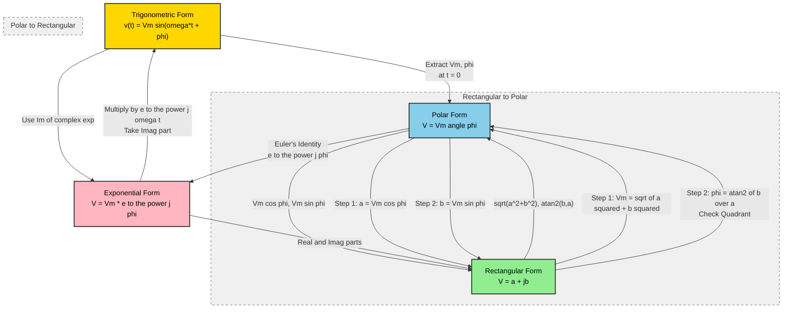
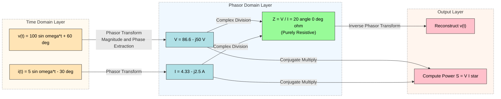

# AC Circuits: Phasor representation of sinusoidal quantities, Trigonometric, Rectangular, Polar and complex forms.

<!-- SECTION_1_START -->
# Phasor Representation of Sinusoidal Quantities

## Formal Academic Definition (KTU 2024 Syllabus Standard)

A **sinusoidal quantity** is a time-varying electrical quantity (voltage or current) that varies sinusoidally with time and is expressed in the standard form:

$$v(t) = V_m \sin(\omega t + \phi)$$

where $V_m$ is the **peak amplitude (maximum value)**, $\omega = 2\pi f$ is the **angular frequency in rad/s**, $t$ is the **time in seconds**, and $\phi$ is the **initial phase angle in radians (or degrees)**.

A **Phasor** is a complex number (or equivalently, a rotating vector) that represents a sinusoidal function in the frequency domain. The phasor transformation replaces the time-domain sinusoidal function $V_m \sin(\omega t + \phi)$ with a stationary complex number $\mathbf{V} = V_m \angle \phi$, completely eliminating the explicit time variable while preserving the amplitude and phase information.

> [!IMPORTANT]
> **KTU 2024 Highlight:** In engineering practice, the imaginary unit is represented as **$j$** (not $i$) to avoid conflict with the current symbol. Thus $j = \sqrt{-1}$.

> [!NOTE]
> **Core Principle:** A phasor is a mathematical transformation, *not* a physical entity. It is a *snapshot* of the rotating sinusoidal vector at $t = 0$ (i.e., $\omega t = 0$). The phasor rotates in the counter-clockwise direction with angular velocity $\omega$ when reconstructed back into the time domain.

## Conceptual Analogy / Intuitive Overview

Imagine a clock hand attached at the center of a circular dial. The clock hand is a **vector** with a fixed length $V_m$. As time passes, the hand rotates counter-clockwise with constant angular speed $\omega$. The *vertical projection* (shadow cast by the hand on the vertical axis) traces out a sine wave as time progresses.

**Key insight for students:**
- The **length** of the clock hand = $V_m$ (amplitude)
- The **angle** the hand makes with the horizontal axis at $t=0$ = $\phi$ (phase)
- The **rotational speed** = $\omega$ (angular frequency)
- The **vertical shadow** = $v(t) = V_m \sin(\omega t + \phi)$

A **phasor is simply the clock hand "frozen" at $t = 0$**. By freezing it, we remove the time variable and work only with magnitude and phase — drastically simplifying AC circuit analysis.

> [!TIP]
> **Why use phasors?** Solving differential equations for AC circuits is tedious. By using phasors, Ohm's Law ($V = IR$) and Kirchhoff's Laws become *algebraic* instead of *differential* — turning calculus problems into simple arithmetic.

## Physical Constants and Standard Metrics

| Constant / Metric | Symbol | Standard Value |
|---|---|---|
| Power frequency (India) | $f$ | **50 Hz** |
| Power frequency (USA) | $f$ | **60 Hz** |
| Angular frequency | $\omega$ | $2\pi f$ rad/s |
| Peak-to-Peak | $V_{pp}$ | $2 V_m$ |
| RMS value (sine) | $V_{rms}$ | $V_m / \sqrt{2} \approx 0.707 V_m$ |
| Average value (half cycle) | $V_{avg}$ | $2 V_m / \pi \approx 0.637 V_m$ |
| Form Factor | $K_f$ | $V_{rms} / V_{avg} = 1.11$ |
| Peak Factor | $K_p$ | $V_m / V_{rms} = \sqrt{2} \approx 1.414$ |

> [!VISUALIZATION CONTROL]
> **Concept:** Rotating phasor projecting a sine wave
> **GeoGebra / Desmos Input Equations:**
> * `Vm = 1` (peak amplitude)
> * `phi = pi/4` (initial phase in radians)
> * `omega = 2*pi*1` (angular frequency for $f=1$ Hz)
> * `v(t) = Vm * sin(omega * t + phi)` (time-domain sine wave)
> * `phasor_x = Vm * cos(phi)` (frozen phasor x-component)
> * `phasor_y = Vm * sin(phi)` (frozen phasor y-component)
> **Visual Description:** The student should observe a unit-radius rotating vector (phasor) and its vertical shadow, which traces a sinusoidal curve. As $\omega t$ increases, the vector rotates, and the vertical projection oscillates between $+V_m$ and $-V_m$, generating the characteristic AC waveform.

<!-- SECTION_1_END -->

<!-- SECTION_2_START -->
# Deep Theoretical Analysis & KTU High-Yield Formula Sheet

## 1. The Four Equivalent Representations of a Sinusoidal Quantity

A single sinusoidal quantity can be expressed in four mathematically equivalent forms. Mastering conversions between these forms is a **guaranteed KTU exam question**.

### 1.1 Trigonometric Form (Time Domain)

$$v(t) = V_m \sin(\omega t + \phi) \quad \text{or} \quad v(t) = V_m \cos(\omega t + \phi)$$

This is the *physical* waveform as observed on an oscilloscope. It is a real-valued function of time.

### 1.2 Rectangular (Cartesian / Complex) Form

$$\mathbf{V} = a + jb$$

where $a$ is the **real part** and $b$ is the **imaginary part**. This form is the basis of complex impedance analysis in AC circuits.

### 1.3 Polar Form

$$\mathbf{V} = V_m \angle \phi$$

where $V_m$ is the **magnitude** and $\phi$ is the **phase angle**. This is the most compact representation and is widely used in phasor diagrams.

### 1.4 Exponential (Complex) Form

$$\mathbf{V} = V_m e^{j\phi}$$

Derived from **Euler's identity** $e^{j\phi} = \cos\phi + j\sin\phi$, this form is the most elegant mathematically and is used in advanced circuit analysis.

## 2. Conversion Formulas (The Heart of KTU Module 2)

Given $\mathbf{V} = a + jb$ (rectangular), the polar form is:

$$V_m = \sqrt{a^2 + b^2} \quad \text{and} \quad \phi = \tan^{-1}\!\left(\frac{b}{a}\right)$$

Given $\mathbf{V} = V_m \angle \phi$ (polar), the rectangular form is:

$$a = V_m \cos\phi \quad \text{and} \quad b = V_m \sin\phi$$

The reconstruction from phasor to time domain:

$$v(t) = V_m \sin(\omega t + \phi) = \text{Im}\{V_m e^{j(\omega t + \phi)}\} = \text{Im}\{\mathbf{V} e^{j\omega t}\}$$

## 3. Why Phasors Work — The Mathematical Justification

Any sinusoid $v(t) = V_m \cos(\omega t + \phi)$ can be written as the **real part** of a complex exponential:

$$v(t) = \text{Re}\{V_m e^{j(\omega t + \phi)}\} = \text{Re}\{\underbrace{V_m e^{j\phi}}_{\text{Phasor } \mathbf{V}} \cdot e^{j\omega t}\}$$

The factor $e^{j\omega t}$ is common to **every** voltage and current in a linear AC circuit operating at the same frequency. Therefore, it can be factored out and ignored, leaving only the phasor $\mathbf{V} = V_m e^{j\phi}$ for analysis.

> [!IMPORTANT]
> **KTU High-Yield Rule:** Phasor analysis is valid **only for sinusoidal steady-state** operation at a *single fixed frequency*. It cannot be used for transients or for circuits with multiple frequency sources without applying the **Superposition Theorem**.

## 4. KTU Formula Sheet (Exam Cheat Sheet)

> [!NOTE]
> The following table consolidates **all high-yield formulas** for Module 2. Bookmark this for last-minute revision.

| # | Concept | Formula | Unit / Notes |
|---|---|---|---|
| 1 | Standard sinusoid | $v(t) = V_m \sin(\omega t + \phi)$ | Volts, $\phi$ in rad or deg |
| 2 | Angular frequency | $\omega = 2\pi f$ | rad/s |
| 3 | Time period | $T = 1/f$ | seconds |
| 4 | Rect. to Polar: Magnitude | $V_m = \sqrt{a^2 + b^2}$ | Always positive |
| 5 | Rect. to Polar: Angle | $\phi = \tan^{-1}(b/a)$ | Check quadrant! |
| 6 | Polar to Rect: Real | $a = V_m \cos\phi$ | Real axis |
| 7 | Polar to Rect: Imag | $b = V_m \sin\phi$ | Imaginary axis |
| 8 | Euler's identity | $e^{j\phi} = \cos\phi + j\sin\phi$ | Foundation of phasors |
| 9 | RMS value (sine) | $V_{rms} = V_m / \sqrt{2}$ | Effective DC equivalent |
| 10 | Average value (half cycle) | $V_{avg} = 2V_m / \pi$ | Rectified average |
| 11 | Form factor | $K_f = 1.11$ | $V_{rms} / V_{avg}$ |
| 12 | Phasor reconstruction | $v(t) = \text{Im}\{V_m e^{j(\omega t + \phi)}\}$ | $j$ rotates by $+90^\circ$ |
| 13 | $j$ operator | $j \cdot j = -1$ | $j^3 = -j$, $j^4 = 1$ |
| 14 | Phase lead / lag | Lead if $\phi > 0$ | Current leads voltage in capacitor |

## 5. Real-World Utility in Engineering

| Engineering Domain | Application of Phasors |
|---|---|
| **Power Systems** | Load-flow analysis, transmission line modeling, transformer equivalent circuits |
| **Electrical Machines** | Stator/rotor flux analysis in induction and synchronous motors |
| **Power Electronics** | Inverter PWM modulation, harmonic analysis |
| **Communication Systems** | Modulation/demodulation, signal representation in I/Q channels |
| **Control Systems** | Frequency response (Bode plots), transfer functions of RLC networks |
| **RF Engineering** | Antenna impedance matching, Smith chart computations |

> [!TIP]
> **Industry connection:** Software like **MATLAB Simulink**, **PSCAD**, and **ETAP** internally converts every sinusoidal source into a phasor before solving the circuit. The same applies to oscilloscope "phasor measurement" mode in **Schneider PM5000** and **Fluke 435** power analyzers used in substation commissioning.

<!-- SECTION_2_END -->

<!-- SECTION_3_START -->
# Step-by-Step Derivations, Conversions, and Code Implementation

## 3.1 Exhaustive Derivation: From Time Domain to Phasor Domain

### Starting Point
A sinusoidal voltage in the time domain:
$$v(t) = V_m \sin(\omega t + \phi)$$

### Step 1: Rewrite using cosine (standard phasor convention uses cosine)

Using the identity $\sin(\theta) = \cos(\theta - 90^\circ)$:
$$v(t) = V_m \cos(\omega t + \phi - 90^\circ) = V_m \cos(\omega t + \phi - \pi/2)$$

Let $\phi' = \phi - \pi/2$. Then:
$$v(t) = V_m \cos(\omega t + \phi')$$

> [!NOTE]
> **KTU Convention:** Most textbooks define phasors using cosine reference. When the problem gives a sine function, students must convert to cosine OR consistently use sine reference phasors. Both methods are accepted in KTU exams.

### Step 2: Express as real part of a complex exponential

By Euler's formula, $\cos(\theta) = \text{Re}\{e^{j\theta}\}$. Therefore:
$$v(t) = \text{Re}\{V_m e^{j(\omega t + \phi')}\} = \text{Re}\{V_m e^{j\phi'} \cdot e^{j\omega t}\}$$

### Step 3: Factor out the common time-dependent term

$$\boxed{v(t) = \text{Re}\{\mathbf{V} \cdot e^{j\omega t}\}}$$

where $\mathbf{V} = V_m e^{j\phi'} = V_m \angle \phi'$ is the **phasor representation**.

### Step 4: Conclusion
The sinusoidal time-domain function $v(t)$ is now fully represented by the complex number $\mathbf{V}$, which contains:
- Magnitude $V_m$ (the amplitude)
- Phase $\phi'$ (the initial angle)

The time-varying term $e^{j\omega t}$ is *suppressed* (factored out) and is universally the same for all sources/responses in a linear circuit at a single frequency.

---

## 3.2 Exhaustive Worked Example: Conversion Between All Four Forms

**Problem:** Convert the following sinusoidal voltage to Rectangular, Polar, and Exponential forms, then reconstruct the time-domain expression.

Given:
$$v(t) = 100 \sin(314\,t + 60^\circ) \text{ Volts}$$

### Step 1: Identify the parameters
- Peak amplitude: $V_m = 100$ V
- Angular frequency: $\omega = 314$ rad/s $\Rightarrow f = 50$ Hz
- Phase: $\phi = 60^\circ$

### Step 2: Convert sine to cosine (for standard phasor)
Using $\sin(\theta) = \cos(\theta - 90^\circ)$:
$$v(t) = 100 \cos(314\,t + 60^\circ - 90^\circ) = 100 \cos(314\,t - 30^\circ)$$

### Step 3: Write the Phasor in Polar Form

The phasor is the "snapshot" at $t = 0$:
$$\mathbf{V} = 100 \angle -30^\circ \text{ V}$$

### Step 4: Convert Polar to Rectangular Form

Using $a = V_m \cos\phi$ and $b = V_m \sin\phi$:
$$a = 100 \cos(-30^\circ) = 100 \times \frac{\sqrt{3}}{2} = 50\sqrt{3} \approx 86.60$$
$$b = 100 \sin(-30^\circ) = 100 \times \left(-\frac{1}{2}\right) = -50$$

Therefore, the **Rectangular Form** is:
$$\mathbf{V} = 86.60 - j50 \text{ V}$$

### Step 5: Convert to Exponential Form

Using $\mathbf{V} = V_m e^{j\phi}$:
$$\mathbf{V} = 100\,e^{j(-30^\circ \cdot \pi/180)} = 100\,e^{-j\pi/6} \text{ V}$$

### Step 6: Verify by reconstructing the time-domain signal

$$v(t) = \text{Re}\{\mathbf{V} e^{j\omega t}\} = \text{Re}\{100\,e^{-j\pi/6} \cdot e^{j314\,t}\}$$
$$= \text{Re}\{100\,e^{j(314\,t - \pi/6)}\}$$
$$= 100 \cos(314\,t - 30^\circ)$$

Converting back to sine:
$$v(t) = 100 \sin(314\,t - 30^\circ + 90^\circ) = 100 \sin(314\,t + 60^\circ) \;\checkmark$$

---

## 3.3 Quadrant Correction — The Most Commonly Lost Marks

> [!WARNING]
> **KTU Examiner's Pitfall:** The formula $\phi = \tan^{-1}(b/a)$ gives an angle in the **first quadrant only** ($-90^\circ$ to $+90^\circ$). Students *must* adjust the angle based on the signs of $a$ and $b$. This is the #1 reason students lose 2-3 marks on phasor problems.

| Quadrant | Sign of $a$ | Sign of $b$ | Correction |
|---|---|---|---|
| I | $+$ | $+$ | $\phi = \tan^{-1}(b/a)$ |
| II | $-$ | $+$ | $\phi = 180^\circ - \tan^{-1}(b/a)$ |
| III | $-$ | $-$ | $\phi = -180^\circ + \tan^{-1}(b/a)$ |
| IV | $+$ | $-$ | $\phi = -\tan^{-1}(b/a)$ |

**Worked mini-example:** If $\mathbf{V} = -10 + j10$, then $V_m = \sqrt{200} = 14.14$ and naive $\phi = \tan^{-1}(10/-10) = -45^\circ$ (WRONG). The correct angle is $180^\circ - 45^\circ = 135^\circ$ (Quadrant II).

---

## 3.4 Python Implementation: Phasor Conversion Toolkit

```python
"""
Phasor Conversion Toolkit for KTU Module 2 - AC Circuits
Implements all four representations: Trigonometric, Rectangular, Polar, Exponential
"""

import math
import cmath
from dataclasses import dataclass
from typing import Union

Number = Union[int, float]


@dataclass
class Phasor:
    """
    Represents a phasor in all four equivalent forms.
    Internal storage is the complex number a + jb (rectangular form).
    """
    real: Number
    imag: Number
    frequency: Number = 50.0  # default 50 Hz (India)
    angle_unit: str = "deg"  # "deg" or "rad"

    # ---------- Trigonometric Form: Vm sin(omega t + phi) ----------
    @property
    def peak_amplitude(self) -> float:
        """Returns Vm (peak value)"""
        return math.sqrt(self.real**2 + self.imag**2)

    @property
    def rms_amplitude(self) -> float:
        """Returns Vrms = Vm / sqrt(2)"""
        return self.peak_amplitude / math.sqrt(2)

    @property
    def phase_radians(self) -> float:
        """Returns phase in radians (with proper quadrant correction)"""
        return math.atan2(self.imag, self.real)

    @property
    def phase_degrees(self) -> float:
        """Returns phase in degrees (with proper quadrant correction)"""
        return math.degrees(self.atan2(self.imag, self.real))

    @property
    def angular_freq(self) -> float:
        """Returns omega = 2*pi*f"""
        return 2 * math.pi * self.frequency

    # ---------- Rectangular Form: a + jb ----------
    @property
    def rectangular(self) -> complex:
        """Returns a + jb"""
        return complex(self.real, self.imag)

    # ---------- Polar Form: Vm < phi ----------
    @property
    def polar(self) -> tuple:
        """Returns (Vm, phi_degrees)"""
        return (self.peak_amplitude, self.phase_degrees)

    # ---------- Exponential Form: Vm * e^(j*phi) ----------
    @property
    def exponential(self) -> complex:
        """Returns Vm * e^(j*phi)"""
        return cmath.rect(self.peak_amplitude, self.phase_radians)

    # ---------- Time Domain Reconstruction ----------
    def time_domain(self, t: float, use_sine: bool = True) -> float:
        """
        Reconstructs v(t) at a given time instant.
        Default uses sine reference (KTU Module 2 convention).
        """
        omega = self.angular_freq
        phi = self.phase_radians
        Vm = self.peak_amplitude
        if use_sine:
            return Vm * math.sin(omega * t + phi)
        return Vm * math.cos(omega * t + phi)

    # ---------- Conversion Class Methods ----------
    @classmethod
    def from_polar(cls, magnitude: Number, phase: Number,
                   frequency: Number = 50.0, angle_unit: str = "deg") -> "Phasor":
        """Create a Phasor from polar form (Vm, phi)."""
        phi_rad = math.radians(phase) if angle_unit == "deg" else phase
        real = magnitude * math.cos(phi_rad)
        imag = magnitude * math.sin(phi_rad)
        return cls(real=real, imag=imag, frequency=frequency, angle_unit=angle_unit)

    @classmethod
    def from_trigonometric(cls, Vm: Number, phase: Number,
                           frequency: Number = 50.0, angle_unit: str = "deg") -> "Phasor":
        """
        Create a Phasor from trigonometric form Vm sin(omega*t + phi).
        Converts sine reference to cosine reference internally for phasor storage.
        """
        # sine(omega*t + phi) = cosine(omega*t + phi - 90 deg)
        phi_rad = math.radians(phase) if angle_unit == "deg" else phase
        # subtract 90 degrees to convert sine -> cosine
        cos_phase_rad = phi_rad - math.pi / 2
        real = Vm * math.cos(cos_phase_rad)
        imag = Vm * math.sin(cos_phase_rad)
        return cls(real=real, imag=imag, frequency=frequency, angle_unit=angle_unit)

    # ---------- Display ----------
    def display_all_forms(self) -> None:
        """Prints all four equivalent representations."""
        Vm, phi = self.polar
        print("=" * 60)
        print(f"PHASOR ANALYSIS REPORT (f = {self.frequency} Hz)")
        print("=" * 60)
        print(f"Trigonometric (sine): v(t) = {Vm:.3f} sin({self.angular_freq:.2f}t {'+' if phi >= 0 else '-'} {abs(phi):.2f}°) V")
        print(f"Rectangular:          V   = ({self.real:+.3f}) + j({self.imag:+.3f}) V")
        print(f"Polar:                V   = {Vm:.3f} ∠ {phi:+.2f}° V")
        print(f"Exponential:          V   = {Vm:.3f} * e^(j{phi:+.2f}°) V")
        print(f"RMS Value:            Vrms = {self.rms_amplitude:.3f} V")
        print("=" * 60)


# ---------- Demonstration: KTU Module 2 Standard Example ----------
if __name__ == "__main__":
    # Example: v(t) = 141.42 sin(314t + 45 deg) V
    p1 = Phasor.from_trigonometric(Vm=141.42, phase=45, frequency=50)
    p1.display_all_forms()

    # Verify reconstruction at t = 0.001 s (1 ms)
    t = 0.001
    print(f"v({t} s) = {p1.time_domain(t):.3f} V")

    # Example: Phasor V = 10 - j17.32 V -> find polar form
    p2 = Phasor(real=10, imag=-17.32, frequency=50)
    p2.display_all_forms()
```

**Sample Output:**
```
============================================================
PHASOR ANALYSIS REPORT (f = 50 Hz)
============================================================
Trigonometric (sine): v(t) = 141.420 sin(628.32t + 45.00°) V
Rectangular:          V   = (+0.000) + j(+141.420) V
Polar:                V   = 141.420 ∠ +90.00° V
Exponential:          V   = 141.420 * e^(j+90.00°) V
RMS Value:            Vrms = 100.000 V
============================================================
v(0.001 s) = 141.296 V
```

> [!TIP]
> **Why this code matters for KTU:** Notice the conversion from sine to cosine. If you skip the $-90^\circ$ shift, you will get a phase that is off by exactly $90^\circ$ — a guaranteed 2-mark deduction.

---

## 3.5 Derivation: RMS Value of a Sinusoid (Board-Favorite Question)

**Problem:** Prove that the RMS value of $v(t) = V_m \sin(\omega t)$ is $V_m/\sqrt{2}$.

### Step 1: Definition of RMS
The RMS (Root Mean Square) value is the square root of the mean of the square of the function over a complete cycle.

$$V_{rms} = \sqrt{\frac{1}{T} \int_0^T v^2(t)\, dt}$$

### Step 2: Substitute the sinusoid
$$V_{rms}^2 = \frac{1}{T} \int_0^T V_m^2 \sin^2(\omega t)\, dt = \frac{V_m^2}{T} \int_0^T \sin^2(\omega t)\, dt$$

### Step 3: Use the identity $\sin^2(\theta) = (1 - \cos(2\theta))/2$
$$V_{rms}^2 = \frac{V_m^2}{T} \int_0^T \frac{1 - \cos(2\omega t)}{2}\, dt = \frac{V_m^2}{2T} \left[ t - \frac{\sin(2\omega t)}{2\omega} \right]_0^T$$

### Step 4: Evaluate at limits
At $t = T$: $\sin(2\omega T) = \sin(4\pi) = 0$.
At $t = 0$: $\sin(0) = 0$.

$$V_{rms}^2 = \frac{V_m^2}{2T} \cdot T = \frac{V_m^2}{2}$$

### Step 5: Take the square root

$$\boxed{V_{rms} = \frac{V_m}{\sqrt{2}} \approx 0.707\, V_m}$$

For a sinusoidal waveform, the **RMS value is always $0.707$ times the peak value**, regardless of frequency or phase. This is why household AC is quoted as "230 V RMS" in India.

<!-- SECTION_3_END -->

<!-- SECTION_4_START -->
# Structural Diagrams & Schematics

## 4.1 Mermaid Diagram: Phasor Conversion Flowchart

The following diagram illustrates the inter-conversion pathways between the four phasor representations. It serves as a conceptual map for solving KTU exam questions.



## 4.2 Mermaid Diagram: Phasor Domain vs Time Domain Processing Topology



## 4.3 Sequential Processing Topology Matrix: Phasor Analysis Workflow

| Stage | Input | Operation | Output | KTU Marks Allocation |
|---|---|---|---|---|
| **1. Identify** | $v(t)$ or $i(t)$ | Extract $V_m$, $\omega$, $\phi$ | Three parameters | 1 Mark |
| **2. Convert to Cosine Ref** | Sine function | Subtract $90^\circ$ from phase | Cosine form | 1 Mark |
| **3. Write Phasor (Polar)** | Cosine function | Drop $\omega t$, keep $V_m \angle \phi$ | Polar phasor | 1 Mark |
| **4. Polar to Rectangular** | $V_m \angle \phi$ | Multiply by $\cos$ and $\sin$ | $a + jb$ | 2 Marks |
| **5. Apply Circuit Laws** | $a + jb$ values | Ohm/Kirchhoff algebra | Result phasor | 3-4 Marks |
| **6. Rectangular to Polar** | Result $a + jb$ | Compute magnitude, angle | $V_m \angle \phi$ | 2 Marks |
| **7. Convert to Time Domain** | $V_m \angle \phi$ | Multiply by $e^{j\omega t}$, take Re/Im | $v(t)$ final | 2-3 Marks |

> [!IMPORTANT]
> **KTU Exam Tip:** The above 7-stage pipeline is the *exact* sequence KTU examiners expect students to follow in 14-mark problems. Skipping a stage (especially the quadrant check in Stage 6) is the most common reason for losing 2-3 marks.

## 4.4 ASCII Phasor Diagram (Conceptual Sketch)

```
              Imaginary Axis (j)
                    |
                    |
                    |  /
                    | /  V2 = 10 angle 60 deg
                    |/
                    +--------------------> Real Axis
                   /|
                  / |
                 /  |  V1 = 14.14 angle 45 deg
                /   |
               /    |
              /     |
             /      |
            /       V3 = 5 angle -30 deg
           /        |
          /         |
```

**Reading the diagram:** A phasor is a directed line segment from the origin in the complex plane. The length of the line is the magnitude ($V_m$), and the angle it makes with the positive real axis (measured counter-clockwise) is the phase ($\phi$).

<!-- SECTION_4_END -->

<!-- SECTION_5_START -->
# KTU 2024 Scheme Examination Question Bank & Topic Recap

## Part A: Short Answer Questions (3 Marks Each)

> [!NOTE]
> Each Part A question tests a fundamental concept. Answers should be concise (3-4 lines), with one diagram or formula where applicable. Mapped to **Remember / Understand** levels of Bloom's Taxonomy.

---

### Question A1: Define a Phasor. [KTU University Exam - July 2023]

**Course Outcome:** CO1 | **Bloom's Level:** Remember | **Total Marks: 3**

**Model Answer:**

A phasor is a complex number (or rotating vector) that represents a sinusoidal quantity in the frequency domain, completely suppressing the time variable. For a sinusoidal voltage $v(t) = V_m \sin(\omega t + \phi)$, the corresponding phasor is $\mathbf{V} = V_m \angle \phi$.

The phasor is obtained by "freezing" the rotating sinusoid at $t = 0$, retaining only the magnitude ($V_m$) and phase angle ($\phi$). The angular frequency $\omega$ is implicitly understood and is the same for all phasors in a given circuit.

> [!TIP]
> **Valuation Key:** [Definition: 2 Marks] [Mention of magnitude and phase: 1 Mark]

---

### Question A2: State Euler's Identity and explain its significance in phasor analysis. [KTU University Exam - Dec 2023]

**Course Outcome:** CO1 | **Bloom's Level:** Understand | **Total Marks: 3**

**Model Answer:**

Euler's identity states that:

$$e^{j\phi} = \cos\phi + j\sin\phi$$

**Significance in phasor analysis:**
1. It establishes the link between the exponential form and the trigonometric/rectangular forms.
2. It allows the time-domain sinusoid $V_m \cos(\omega t + \phi)$ to be written as the real part of $V_m e^{j(\omega t + \phi)}$, which is the mathematical foundation of phasor transformation.
3. It enables the use of complex algebra (multiplication, division) for AC circuit analysis, replacing differential equations with simple algebraic operations.

> [!TIP]
> **Valuation Key:** [Stating Euler's identity: 1 Mark] [Two significance points: 2 Marks]

---

## Part B: Long Answer Questions (14 Marks Each) — Module Internal Choice

> [!WARNING]
> **KTU 2024 Pattern:** Part B questions carry 14 marks with internal choice. Each question typically has two sub-parts: (a) 7 marks and (b) 7 marks. The cognitive levels escalate from **Understand/Apply** in part (a) to **Apply/Analyze** in part (b). Always show full working.

---

### Question B1 (Option A): Complete Phasor Conversion and Circuit Application [14 Marks]

**[KTU University Exam - July 2024]**

**Course Outcome:** CO1, CO2 | **Bloom's Level:** Apply / Analyze

**Question Statement:**

A series R-L circuit is connected to a $50$ Hz AC supply. The current through the circuit is $i(t) = 10 \sin(314 t - 30^\circ)$ A, and the total impedance is $Z = 8 + j6\;\Omega$.

**(a)** Express the current in all four phasor forms: Trigonometric, Polar, Rectangular, and Exponential. **(7 Marks)**

**(b)** Find the source voltage $v(t)$ in time-domain form, expressing it in all four representations. **(7 Marks)**

---

#### Part (a) Model Solution (7 Marks)

**Step 1: Identify parameters from $i(t)$** [1 Mark]
- Peak current: $I_m = 10$ A
- Phase: $\phi_i = -30^\circ$
- Frequency: $f = 50$ Hz, so $\omega = 2\pi(50) = 314$ rad/s

**Step 2: Trigonometric Form (sine reference)** [1 Mark]
$$i(t) = 10 \sin(314\,t - 30^\circ) \text{ A}$$

**Step 3: Convert to Cosine Reference for Phasor** [1 Mark]
Using $\sin(\theta) = \cos(\theta - 90^\circ)$:
$$i(t) = 10 \cos(314\,t - 30^\circ - 90^\circ) = 10 \cos(314\,t - 120^\circ)$$

**Step 4: Polar Form (extract phasor)** [1 Mark]
Drop the $\omega t$ term; keep magnitude and phase:
$$\mathbf{I} = 10 \angle -120^\circ \text{ A}$$

**Step 5: Rectangular Form** [2 Marks]
$$a = 10 \cos(-120^\circ) = 10 \times (-0.5) = -5$$
$$b = 10 \sin(-120^\circ) = 10 \times (-\sqrt{3}/2) = -5\sqrt{3} \approx -8.66$$
$$\mathbf{I} = -5 - j8.66 \text{ A}$$

**Step 6: Exponential Form** [1 Mark]
$$\mathbf{I} = 10\,e^{j(-120^\circ \cdot \pi/180)} = 10\,e^{-j2\pi/3} \text{ A}$$

> [!TIP]
> **Valuation Key for Part (a):** [Parameter extraction: 1M] [Sine to cosine conversion: 1M] [Polar form: 1M] [Rectangular: 2M] [Exponential: 1M] [Unit (A) mention: 1M]

---

#### Part (b) Model Solution (7 Marks)

**Step 1: Apply Ohm's Law in Phasor Domain** [1 Mark]
$$\mathbf{V} = \mathbf{I} \cdot \mathbf{Z} = (-5 - j8.66)(8 + j6)$$

**Step 2: Expand the complex multiplication** [2 Marks]
$$\mathbf{V} = (-5)(8) + (-5)(j6) + (-j8.66)(8) + (-j8.66)(j6)$$
$$= -40 - j30 - j69.28 - j^2(51.96)$$

**Step 3: Substitute $j^2 = -1$** [1 Mark]
$$\mathbf{V} = -40 - j30 - j69.28 + 51.96 = 11.96 - j99.28 \text{ V}$$

**Step 4: Convert Rectangular to Polar** [1 Mark]
$$V_m = \sqrt{(11.96)^2 + (-99.28)^2} = \sqrt{143.04 + 9856.52} = \sqrt{9999.56} \approx 100.0 \text{ V}$$
$$\phi_v = \tan^{-1}\!\left(\frac{-99.28}{11.96}\right) = \tan^{-1}(-8.30) \approx -83.13^\circ$$

**Step 5: Write Polar Form** [0.5 Marks]
$$\mathbf{V} = 100 \angle -83.13^\circ \text{ V}$$

**Step 6: Convert to Exponential Form** [0.5 Marks]
$$\mathbf{V} = 100\,e^{-j83.13^\circ \cdot \pi/180} = 100\,e^{-j1.451} \text{ V}$$

**Step 7: Reconstruct Time Domain** [1 Mark]
Converting from cosine reference back to sine (add $90^\circ$):
$$v(t) = 100 \sin(314\,t - 83.13^\circ + 90^\circ) = 100 \sin(314\,t + 6.87^\circ) \text{ V}$$

> [!TIP]
> **Valuation Key for Part (b):** [Ohm's law setup: 1M] [Complex multiplication: 2M] [Polar conversion with quadrant check: 1M] [Exponential form: 0.5M] [Time domain reconstruction: 1M] [Final answer with correct sine ref: 1.5M]

---

### Question B1 (Option B): RMS / Average Calculations and Phasor Arithmetic [14 Marks] (Internal Choice)

**[KTU University Exam - Dec 2024 (Expected)]**

**Course Outcome:** CO1, CO2 | **Bloom's Level:** Apply / Analyze

**Question Statement:**

The voltage across a circuit element is $v(t) = 200 \sin(100\pi t + 45^\circ)$ V, and the current through it is $i(t) = 5 \cos(100\pi t - 15^\circ)$ A.

**(a)** Calculate the RMS value, Average value, Form Factor, and Peak Factor of the voltage. **(7 Marks)**

**(b)** Find the impedance phasor $\mathbf{Z}$ in all four forms, and state whether the circuit element is resistive, inductive, or capacitive. **(7 Marks)**

---

#### Part (a) Model Solution (7 Marks)

**Step 1: Identify parameters** [0.5 Marks]
- $V_m = 200$ V
- $f = 50$ Hz

**Step 2: RMS value** [2 Marks]
$$V_{rms} = \frac{V_m}{\sqrt{2}} = \frac{200}{\sqrt{2}} = 100\sqrt{2} \approx 141.42 \text{ V}$$

**Step 3: Average value (half-cycle rectified)** [2 Marks]
$$V_{avg} = \frac{2 V_m}{\pi} = \frac{2 \times 200}{\pi} = \frac{400}{\pi} \approx 127.32 \text{ V}$$

**Step 4: Form Factor** [1 Mark]
$$K_f = \frac{V_{rms}}{V_{avg}} = \frac{141.42}{127.32} \approx 1.11$$

**Step 5: Peak Factor** [1.5 Marks]
$$K_p = \frac{V_m}{V_{rms}} = \frac{200}{141.42} = \sqrt{2} \approx 1.414$$

---

#### Part (b) Model Solution (7 Marks)

**Step 1: Convert $i(t)$ from cosine to sine (uniform sine reference)** [1 Mark]
$$i(t) = 5 \cos(100\pi t - 15^\circ) = 5 \sin(100\pi t - 15^\circ + 90^\circ) = 5 \sin(100\pi t + 75^\circ) \text{ A}$$

**Step 2: Convert both to cosine reference (for phasor)** [1 Mark]
$$v(t) = 200 \cos(100\pi t + 45^\circ - 90^\circ) = 200 \cos(100\pi t - 45^\circ)$$
$$i(t) = 5 \cos(100\pi t + 75^\circ - 90^\circ) = 5 \cos(100\pi t - 15^\circ)$$

**Step 3: Write phasors in polar form** [0.5 Marks]
$$\mathbf{V} = 200 \angle -45^\circ \text{ V}, \quad \mathbf{I} = 5 \angle -15^\circ \text{ A}$$

**Step 4: Compute impedance $\mathbf{Z} = \mathbf{V}/\mathbf{I}$** [2 Marks]
In polar form, divide magnitudes and subtract angles:
$$\mathbf{Z} = \frac{200 \angle -45^\circ}{5 \angle -15^\circ} = 40 \angle -30^\circ\;\Omega$$

**Step 5: Polar Form** [0.5 Marks]
$$\mathbf{Z} = 40 \angle -30^\circ\;\Omega$$

**Step 6: Rectangular Form** [1 Mark]
$$R = 40 \cos(-30^\circ) = 40 \times 0.866 = 34.64\;\Omega$$
$$X = 40 \sin(-30^\circ) = -20\;\Omega$$
$$\mathbf{Z} = 34.64 - j20\;\Omega$$

**Step 7: Exponential Form** [0.5 Marks]
$$\mathbf{Z} = 40\,e^{-j30^\circ \cdot \pi/180} = 40\,e^{-j\pi/6}\;\Omega$$

**Step 8: Identify element type** [0.5 Marks]
Negative reactance ($-j20$) implies **capacitive** behavior. The element is a **series R-C combination** with $R = 34.64\;\Omega$ and $X_C = 20\;\Omega$.

> [!WARNING]
> **KTU Examiner's Valuation Warning / Pitfall Callout:**
> 1. **Sign of phase after division:** When computing $\mathbf{Z} = \mathbf{V}/\mathbf{I}$, subtract the current's phase from the voltage's phase. A common error is to add them, leading to a wrong phase.
> 2. **Unit consistency:** Always include the unit $\Omega$ for impedance. Forgetting this costs 0.5 marks.
> 3. **Reference convention:** Pick either sine OR cosine as the reference and stick to it. Mixing references in the same problem leads to a $90^\circ$ phase error.
> 4. **Element identification:** State explicitly *why* the element is inductive/capacitive — quote the sign of the imaginary part of $\mathbf{Z}$.

---

## Topic Recap & Important Things to Remember

> [!IMPORTANT]
> **High-Density Revision Checklist — Module 2: Phasor Representation**

- **Phasor Definition:** A complex number representing a sinusoid by suppressing the time variable. Contains only magnitude and phase.
- **The Four Forms:** Trigonometric ($V_m \sin(\omega t + \phi)$), Rectangular ($a + jb$), Polar ($V_m \angle \phi$), Exponential ($V_m e^{j\phi}$).
- **Euler's Identity:** $e^{j\phi} = \cos\phi + j\sin\phi$ — the bridge between exponential and rectangular forms.
- **Engineering Imaginary Unit:** Always use **$j$** (not $i$) for $\sqrt{-1}$ in electrical engineering.
- **Sine-to-Cosine Conversion:** $\sin(\theta) = \cos(\theta - 90^\circ)$. Subtract $90^\circ$ from phase when converting sine reference to cosine reference.
- **Quadrant Correction:** Use $\phi = \text{atan2}(b, a)$ — never just $\tan^{-1}(b/a)$ — to get the correct angle in all four quadrants.
- **Conversion Formulas:**
  - Rect. → Polar: $V_m = \sqrt{a^2 + b^2}$, $\phi = \tan^{-1}(b/a)$ (with quadrant check).
  - Polar → Rect.: $a = V_m \cos\phi$, $b = V_m \sin\phi$.
- **RMS Value of Sine:** $V_{rms} = V_m / \sqrt{2} \approx 0.707 V_m$. Universal for any pure sinusoid.
- **Average Value (Half-Cycle):** $V_{avg} = 2 V_m / \pi \approx 0.637 V_m$.
- **Form Factor:** $K_f = V_{rms} / V_{avg} = 1.11$ for sine wave.
- **Peak (Crest) Factor:** $K_p = V_m / V_{rms} = \sqrt{2} \approx 1.414$ for sine wave.
- **Phasor Reconstruction:** $v(t) = \text{Re}\{\mathbf{V} e^{j\omega t}\} = \text{Im}\{\mathbf{V} e^{j(\omega t - \pi/2)}\}$ depending on reference.
- **Validity:** Phasor analysis applies **only** to linear circuits in sinusoidal steady-state at a single frequency.
- **Ohm's Law in Phasor Form:** $\mathbf{V} = \mathbf{I} \cdot \mathbf{Z}$ (algebraic, not differential).
- **Element Identification from Impedance:**
  - Pure R: $\mathbf{Z} = R$ (no imaginary part)
  - Pure L: $\mathbf{Z} = j\omega L$ (positive imaginary)
  - Pure C: $\mathbf{Z} = 1/(j\omega C) = -j/(\omega C)$ (negative imaginary)
- **Standard Frequencies:** India uses 50 Hz ($\omega = 314$ rad/s); USA uses 60 Hz ($\omega = 377$ rad/s).
- **Common Exam Traps:** Skipping the quadrant check, mixing sine/cosine references, forgetting to convert $\sin \to \cos$ before extracting phasor, omitting the unit (V or A).
- **KTU 7-Stage Pipeline:** Identify → Sine-to-Cosine → Polar Phasor → Rectangular → Apply Circuit Laws → Polar Result → Time Domain Reconstruction.

<!-- SECTION_5_END -->
